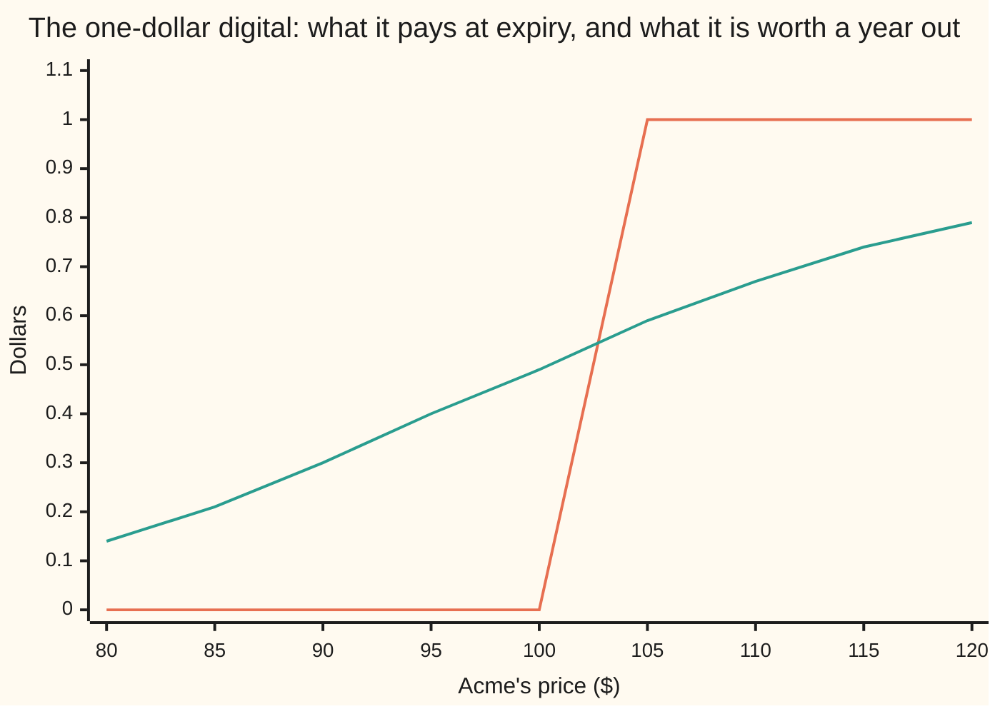
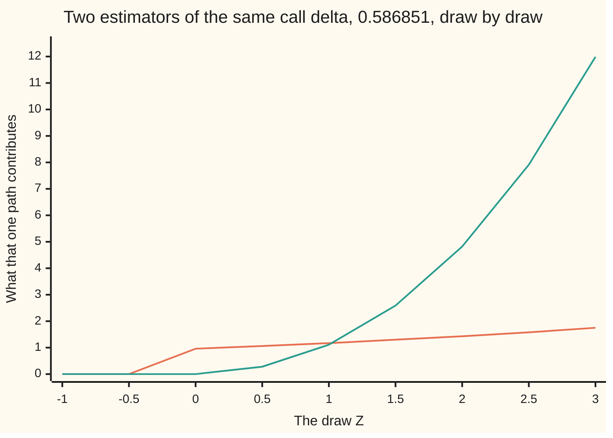

# Greeks inside the simulation: differentiate the payoff, or differentiate the density

[Syllabus](../../../SYLLABUS.md) → [Financial mathematics](../../../SYLLABUS.md#w12) → [Greeks by Numbers and Calibration](../../../SYLLABUS.md#w12-s07) → Greeks inside the simulation

---

## General Overview

Acme trades at $100. A desk holds two one-year contracts on it. The first is an ordinary call struck at $100 — the right to buy one share for $100 in a year — worth $9.23 today. The second is a digital, or cash-or-nothing bet: it pays exactly one dollar if Acme finishes above $100, nothing otherwise. That one is worth $0.49.

The desk needs each contract's gain when Acme rises by a dollar — its delta, which for hedging matters more than the price.

A simulation reaches the price easily: draw many endings for Acme, pay each contract off, average, discount. Delta is harder. The obvious route nudges Acme's price, runs the simulation again and differences the answers — bump and revalue, done properly in [Bump and revalue](01-bump-and-revalue-and-common-random-numbers.md). Two runs, two doses of noise, one bump size to get wrong.

Delta can instead come out of a single run, two ways, working in opposite directions.

The first holds each drawn ending fixed and asks how that payment changes when today's price changes. Averaging those per-path slopes gives delta: **pathwise differentiation**, excellent on the call.

On the digital it fails outright. Move Acme by a millionth of a dollar and not one of 65,536 drawn paths changes its payment: a dollar is still a dollar, nothing is still nothing. Every path's slope is zero, so the average is 0.000000. The digital's delta is 0.018951.

The second never touches the payment. It asks how the *chance* of each ending shifts, and weights each payment by that: the **likelihood ratio method**, also called the score method, which handles both contracts.

**A price is a payment averaged over a spread of possible endings, so its slope can be taken by differentiating the payment or by differentiating the spread — and when the payment jumps, only the second survives.**

**What kind of fact this is:** a method — two estimators, each proved on this card in Why it works to average to the exact Greek, each with a condition it needs before it will.

### The picture: a payment that jumps, a price that does not



The step is the payment on expiry day: flat on both sides of $100, with no slope at all exactly there. The rising curve is what the contract is worth today, and it has a slope everywhere: 0.14 when Acme is at 80 dollars, 0.49 at 100, 0.79 at 120. A method that only looks at the step never finds that slope.

---

## The formula

Notation first, in words. All the randomness sits in one number: a draw from the standard bell curve, written $Z$, centred on zero with spread one. Acme's price on expiry day is written $S_T$, an explicit formula in that draw. A payment rule is written $g$: hand it Acme's ending, it hands back dollars. The average over all draws is written $E$; $N$ and $\phi$ are the bell curve's area-to-the-left and its height.

Either contract's price is its average payment, discounted:

$$\text{price} \;=\; e^{-rT}\,E\big[\,g(S_T)\,\big], \qquad S_T \;=\; S\,e^{(r-q-\tfrac12\sigma^2)T \,+\, \sigma\sqrt{T}\,Z}$$

**The pathwise pair.** Differentiate the payment, one drawn path at a time:

$$Y^{\text{path}}_{S} \;=\; e^{-rT}\,g'(S_T)\,\frac{S_T}{S}, \qquad Y^{\text{path}}_{\sigma} \;=\; e^{-rT}\,g'(S_T)\,S_T\big(\sqrt{T}\,Z - \sigma T\big)$$

**Read it aloud:** the payment's own slope at the drawn ending, times how far that ending moves when the input moves, discounted.

**The score pair.** Leave the payment alone and weight it:

$$Y^{\text{score}}_{S} \;=\; e^{-rT}\,g(S_T)\,w_S, \qquad Y^{\text{score}}_{\sigma} \;=\; e^{-rT}\,g(S_T)\,w_\sigma$$

$$w_S \;=\; \frac{Z}{S\,\sigma\sqrt{T}}, \qquad w_\sigma \;=\; \frac{Z^2 - 1}{\sigma} - \sqrt{T}\,Z$$

**Read it aloud:** the payment as it stands, times how much more likely this ending just became, discounted.

Each of the four is an average over the draws that priced the contract: the spot pair averages to delta, the volatility pair to **vega** — the price's gain per unit of volatility, so one volatility point, 20% to 21%, moves the price by about a hundredth of it. Nothing is bumped, nothing is run twice.

The two payment rules, and the slopes that decide everything:

$$g_{\text{call}}(x) = \max(x - K,\, 0), \qquad g_{\text{dig}}(x) = 1 \text{ if } x > K, \text{ else } 0$$

The call's slope is 1 above the strike and 0 below. The digital's slope is 0 above, 0 below, and nothing at all at the strike itself.

| Symbol | Plain meaning | In our example | Push it up and the estimate… |
| --- | --- | --- | --- |
| $S$, $K$ | Acme's price today, and the strike both contracts use | both $100 | raising $S$ lifts both deltas, until the call's flattens near 1 |
| $T$ | time to expiry, in **years** | 1 | the spot weight shrinks, since it divides by $\sqrt{T}$ |
| $r$, $q$ | the riskless rate, continuously compounded, and the dividend yield leaking out of the share | 5% and 2% | both only move drift and discount |
| $\sigma$, $a$ | **volatility**, how jumpy Acme is (say "sigma"), and one wiggle unit $a = \sigma\sqrt{T}$ | 20% and 0.20 | the digital's delta falls, the strike mattering less |
| $Z$ | one draw from the bell curve — a path's only randomness | one per path; −1.00 and 2.00 below | — |
| $S_T$ | Acme's price on expiry day, built from that draw | 111.6278 when the draw is 0.5 | — |
| $g$ | the payment rule: dollars owed, given Acme's ending | $\max(S_T-100,0)$, or one dollar if above | — |
| $Y$ | an **estimator**: one number per path whose average is the Greek | averages to 0.586851 either way | — |
| $w_S$, $w_\sigma$ | the **scores**: how fast this ending's likelihood grows with the input | the draw over 20, and $(Z^2-1)/0.20 - Z$ | — |
| $N$, $\phi$, $f$ | the bell curve's area to the left, its height, and the ending's likelihood per dollar | $N(d_1) = 0.598706$, $\phi(d_2) = 0.398444$ | — |
| $d_2$, $d_1$ | Acme's room above the strike in wiggle units, and that plus one unit | 0.05 and 0.25 | — |
| $E$ | the average over all draws | — | — |

The two distances, as on [Black–Scholes call](../08-The%20Black-Scholes%20call%20and%20put/01-black-scholes-call.md):

$$d_2 = \frac{\ln(S/K) + (r - q - \tfrac12\sigma^2)T}{\sigma\sqrt{T}}, \qquad d_1 = d_2 + \sigma\sqrt{T}$$

And the four exact answers the estimators have to land on:

$$\text{call delta} = e^{-qT}N(d_1), \qquad \text{call vega} = S\,e^{-qT}\phi(d_1)\sqrt{T}$$

$$\text{digital delta} = \frac{e^{-rT}\phi(d_2)}{S\,\sigma\sqrt{T}}, \qquad \text{digital vega} = -\,\frac{e^{-rT}\phi(d_2)\,d_1}{\sigma}$$

### When it holds

- **Pathwise needs a payment that never jumps.** A bend is fine: the call's payment has a corner at the strike but a slope at every other ending, and a continuous spread of endings lands on the strike itself with probability zero. The digital jumps, so its slope is zero on both sides of the strike and undefined at it, and the estimator reports 0.000000 where the truth is 0.018951 — not a small delta, no delta.
- **Pathwise needs the ending differentiable in the input, path by path.** Here it is: $S_T$ is a formula in the draw and nothing else. A pricing routine with a branch inside it — an early-exercise test, a barrier check — earns this separately or not at all.
- **The score needs the spread of endings written down, positive and smooth in the input.** Acme's ending is lognormal, so its likelihood is a formula. Where the spread only comes out of a simulation there is nothing to differentiate.
- **The score dies at the boundaries.** Both weights divide by $\sigma$, and the spot weight by $\sqrt{T}$ as well. At zero volatility, or with no time left, there is no estimate at all, not a noisy one.
- **The score costs more paths.** Where both are legal both average to the exact Greek — they are unbiased — but the weight adds spread without adding average, so pinning the call's delta to one percent of itself costs nearly six times the paths.
- **Both answer a question about the model.** They give the slope of a formula's output, which is not what a real hedge earns.

---

## Why it works

### Step 0: the input sits in two places at once

A price is an average of payments over a spread of endings, discounted. Write that average two ways and the same input turns up in two places.

Averaged over the draw, the spread is fixed — the standard bell curve, whatever Acme costs today — so today's price sits inside the ending, hence inside the payment. Averaged over the ending itself, the payment is fixed and today's price sits inside the likelihood of each ending.

$$e^{-rT}\,E\big[g(S_T)\big] \;=\; e^{-rT}\int g\big(S_T(z)\big)\,\phi(z)\,dz \;=\; e^{-rT}\int g(x)\,f(x;S)\,dx$$

Here $f(x;S)$ is the **density**: the likelihood, per dollar of Acme's ending, that Acme finishes near $x$ when it costs $S$ today. Both integrals are the same number. Differentiating the left gives the pathwise estimator; differentiating the right gives the score. That is the whole card.

### Step 1: differentiate the payment, and the chain rule does the rest

Hold the draw fixed. Then $S_T$ is an ordinary function of today's price, and the chain rule applies:

$$\frac{\partial}{\partial S}\,g(S_T) \;=\; g'(S_T)\cdot\frac{\partial S_T}{\partial S}.$$

The second factor is easy, because $S_T$ is $S$ multiplied by something with no $S$ in it:

$$\frac{\partial S_T}{\partial S} = \frac{S_T}{S}, \qquad \frac{\partial S_T}{\partial \sigma} = S_T\big(\sqrt{T}\,Z - \sigma T\big).$$

The first says a one percent rise in Acme today is a one percent rise in every ending. The second has two pieces pulling opposite ways: more volatility widens the spread, the $\sqrt{T}Z$ term, and drags the drift down by $\tfrac12\sigma^2$ a year, the $-\sigma T$ term. Drop the drag and the call's pathwise vega reads 49.638180 instead of 37.901158, nearly a third too high. Discount, and these are the pathwise estimators of The formula.

### Step 2: the corner is harmless, the jump is fatal

Averaging per-path slopes gives the price's slope only if differentiating and averaging can swap places. For the call they can. Its payment is flat below the strike and rises with slope 1 above it, so two endings never produce payments further apart than the endings themselves. Every difference quotient is therefore trapped between $-S_T/S$ and $S_T/S$, whose average is finite, and a trapped family of quotients may be averaged first and taken to the limit second. The lone ending $S_T = K$, where no slope exists, has probability zero.

For the digital none of that helps: the quotients are not hard to control, they are zero. The checks show it three ways. Shift Acme a cent either way with the draw held fixed, and the digital's payment slope is 0.000000 at all five named draws, one just below the strike crossing and one just above. Shrink the shift to a millionth of a dollar and none of 65,536 simulated paths changes its payment. The average of zeros is 0.000000.

The price's slope is 0.018951. The two disagree because moving Acme does not change what a fixed ending pays; it changes *which endings happen*, and pathwise differentiation is blind to that by construction.

### Step 3: differentiate the density instead

Take the right-hand integral of Step 0, where the payment no longer holds the input:

$$\frac{\partial}{\partial S}\int g(x)\,f(x;S)\,dx \;=\; \int g(x)\,\frac{\partial f}{\partial S}\,dx \;=\; \int g(x)\,\frac{\partial \log f}{\partial S}\,f(x;S)\,dx \;=\; E\Big[g(S_T)\cdot\frac{\partial \log f}{\partial S}\Big].$$

The middle step is the only trick, and it is one line: $\partial f/\partial S = f\cdot\partial(\log f)/\partial S$, so dividing by the density and multiplying it back turns a derivative of a density into an average. The factor that appears is the derivative of the log density in the input, called the **score**, and it is the weight from here on. The payment is never differentiated, so jumps are irrelevant. The older name, likelihood ratio, comes from writing the same thing as the ending's chance under the shifted input over its chance under the original, the shift sent to zero.

### Step 4: the two weights, worked out

Acme's ending is lognormal. For a fixed ending $x$, count the wiggle units it sits from the start:

$$z(x) = \frac{\ln(x/S) - (r - q - \tfrac12\sigma^2)T}{\sigma\sqrt{T}}, \qquad f(x;S) = \frac{\phi\big(z(x)\big)}{x\,\sigma\sqrt{T}}.$$

Take logs, which turns the product into a sum:

$$\log f = -\ln x - \ln\!\big(\sigma\sqrt{T}\big) - \tfrac12 z(x)^2 - \tfrac12\ln(2\pi).$$

Only the squared term and the $\ln\sigma$ carry an input. Differentiating $z$ at fixed $x$:

$$\frac{\partial z}{\partial S} = -\frac{1}{S\,\sigma\sqrt{T}}, \qquad \frac{\partial z}{\partial \sigma} = \sqrt{T} - \frac{z}{\sigma}.$$

The second holds the same two pieces as Step 1, spread and drift drag. Chain them through $-\tfrac12 z^2$, whose derivative is $-z$ times that of $z$:

$$\frac{\partial \log f}{\partial S} = \frac{z}{S\,\sigma\sqrt{T}}, \qquad \frac{\partial \log f}{\partial \sigma} = \frac{z^2 - 1}{\sigma} - \sqrt{T}\,z.$$

Evaluate at the ending the simulation drew. There $z(S_T)$ is the draw itself, $Z$, and the two become $w_S$ and $w_\sigma$. For Acme $S\sigma\sqrt{T}$ is $100 \times 0.20 \times 1 = 20$, so the spot weight is the draw divided by twenty.

<details>
<summary>Detailed proof: the score estimator really does average to $e^{-qT}N(d_1)$</summary>

Write $A = S e^{(r-q)T}$ for Acme's forward price, so $S_T = A\,e^{-a^2/2 + aZ}$ and the call pays exactly when $Z > -d_2$.

One identity does the work: $S_T\,\phi(Z) = A\,\phi(Z - a)$. The exponents are $-a^2/2 + az - z^2/2$ and $-(z-a)^2/2$, which agree. In words: weighting the bell curve by Acme's ending slides the curve one wiggle unit right.

The score estimator for delta is $e^{-rT}\max(S_T - K,0)\,Z/(Sa)$, so its average needs $E\big[\max(S_T-K,0)\,Z\big]$, which the switch splits into two integrals running up from $-d_2$. The share piece, substituting $u = z - a$ and using $\int_c^{\infty} u\,\phi(u)\,du = \phi(c)$:
$$\int_{-d_2}^{\infty} z\,S_T\,\phi(z)\,dz = A\int_{-d_2}^{\infty} z\,\phi(z-a)\,dz = A\int_{-d_1}^{\infty}(u + a)\,\phi(u)\,du = A\big[\phi(d_1) + a\,N(d_1)\big].$$
The cash piece is the same integral without the ending: $K\int_{-d_2}^{\infty} z\,\phi(z)\,dz = K\,\phi(d_2)$.

Subtract. The stray terms cancel, because $A\,\phi(d_1) = K\,\phi(d_2)$: take logs and that reduces to $\ln(A/K) = a\,d_2 + a^2/2$, the definition of $d_2$ rearranged.

What survives is $A\,a\,N(d_1)$. Multiply by $e^{-rT}/(Sa)$: the $a$ cancels, $e^{-rT}A/S$ is $e^{-qT}$, and the answer is $e^{-qT}N(d_1)$, the call's delta, with the payment never differentiated. The same lines with $Z^2 - 1 - aZ$ in place of $Z$ give the vega; with the digital's payment, 0.018951 and −0.473764.

</details>

### Step 5: the weight averages to zero, which is the virtue and the cost

A density integrates to 1 whatever the input is, and differentiating a constant gives nothing:

$$E[w_S] = \int \frac{\partial \log f}{\partial S}\,f\,dx = \frac{\partial}{\partial S}\int f\,dx = \frac{\partial}{\partial S}1 = 0.$$

Two consequences, pulling against each other. The useful one: subtracting any fixed number from the payment before weighting leaves the average untouched, since the weight has no average of its own. Subtract something near the payment's typical size and the spread falls at no cost in bias — the standard way of quietening a score estimator.

The expensive one: the score estimator is a payment times pure noise, so the signal lives entirely in the correlation between them and most of each path's number is waste. The pathwise estimator carries no such passenger: 0.573804 spread per path against 1.387387, a factor of 2.4 — and paths go as the square of the spread, so 5.8 times as many.

### The other doors

Malliavin integration by parts generalises the score idea, shifting the derivative off the payment by integrating by parts along the path, which yields weights for payments depending on the whole path. Where a book has many inputs, the pathwise derivative can instead be propagated backwards through the pricing calculation once — [Adjoint differentiation](03-adjoint-differentiation-in-outline.md).

---

## Worked numbers, by hand

Acme: $S = 100$, $K = 100$, $r = 5\%$, $q = 2\%$, $\sigma = 20\%$, $T = 1$ year. The digital pays one dollar above the strike.

| Step | Arithmetic | Value |
| --- | --- | --- |
| $d_2$, the wiggle units of room | (0 + 0.05 − 0.02 − 0.02) / 0.20 | 0.050000 |
| $d_1$, one wiggle unit further | 0.05 + 0.20 | 0.250000 |
| the discount and the dividend drag | $e^{-rT}$, then $e^{-qT}$ | 0.951229, 0.980199 |
| $N(d_1)$, bell-curve area to the left | a table, or the code's integrator | 0.598706 |
| $\phi(d_2)$, bell-curve height | the same integrator's integrand | 0.398444 |
| one wiggle in dollars, $S\sigma\sqrt{T}$ | 100 × 0.20 × 1 | 20.000000 |
| **call delta**, $e^{-qT}N(d_1)$ | 0.980199 × 0.598706 | **0.586851** |
| **digital delta**, $e^{-rT}\phi(d_2)/(S\sigma\sqrt{T})$ | 0.951229 × 0.398444 / 20 | **0.018951** |
| the digital's pathwise average | every path's slope is zero | **0.000000** |

Both deltas are per dollar of Acme. The call gains 59 cents when Acme gains a dollar; the digital gains under two cents, since a dollar of Acme only shifts the odds on a fixed one-dollar payment. Hedging the digital needs 0.018951 shares, and a route answering 0.000000 leaves the position naked.

The shelf's cross-check is the call's delta by four methods, printed side by side below: all four give 0.586851, and the digital's row breaks the pattern in one column.

### Where each estimator's noise goes

Only spread separates two unbiased estimators. The bars are the paths needed to land within one percent of the true Greek, from each exact spread rather than a lucky run.

```
paths needed to pin delta to within one percent      one █ = 2,000 paths
call, pathwise      █████                             9,561
call, score         ████████████████████████████     55,891
digital, score      ███████████                       21,496
digital, pathwise   no bar                            no answer, at any number of paths
```

For vega it is harsher: 37,516 paths pathwise against 478,340 by the score. Where both are legal, pathwise wins on cost.

### The two estimators, draw by draw



The nearly level line is the pathwise estimator: zero below the strike crossing, then hugging 1 and reaching 1.75 at a three-sigma draw. The steep line is the score, zero at a zero draw because its weight is the draw over twenty, and 11.99 at a three-sigma draw. Both average to 0.586851 — the second by cancelling large numbers, and cancellation is what costs paths.

### What breaks if you drop a piece

| Mistake | Comes out at | What went wrong |
| --- | --- | --- |
| Averaging the digital's per-path slopes | 0.000000, against 0.018951 | The payment's slope is zero wherever it exists; the price's slope is not |
| Switch dropped from the call's pathwise delta | 0.980199, against 0.586851 | Every path is paid a share, including the paths that expire worthless |
| Drift term dropped from the digital's score vega | −0.094753, against −0.473764 | Volatility sits in the drift as well as the spread, and the two nearly cancel |
| Discount forgotten in the digital's score delta | 0.019922, against 0.018951 | The weight multiplies the *discounted* payment, not the raw one |

Both scripts print all four.

---

## Code, from first principles, and it actually runs

Nothing below imports anything that already knows an answer: the bell-curve area is Simpson's rule written out, and the normal draws come from a generator in the same file. Each Greek is reached four ways — the closed form, a central bump on the exact price, the pathwise average, the score average. The last two go by numerical integration, or quadrature, so they are the estimators' true averages with no sampling luck in them. A 65,536-path simulation then follows, sharing one set of draws across all six live estimators.

### Python

```python
# Greeks inside the simulation -- the check behind the card.  Standard library
# only, and nothing imported that already knows an answer: the bell-curve area
# is Simpson's rule written out here, the normal draws come from a generator
# written out here.  Four roads to every Greek: the closed form, a bump on the
# exact price, the pathwise average, the score average.
from math import log, sqrt, exp, pi, cos, sin

S, K, R, Q, SIG, T = 100.0, 100.0, 0.05, 0.02, 0.20, 1.0
CASH = 1.0                                  # the digital pays one dollar
HS, HV, HP = 0.01, 0.0001, 0.000001         # bumps: spot, volatility, per path
NPATH, SEED, MOD = 65536, 20260919, 1 << 32

def phi(x): return exp(-0.5 * x * x) / sqrt(2.0 * pi)      # bell-curve height
def nz(v): return 0.0 if v == 0.0 else v                   # print 0, never -0

def simpson(f, a, b, n):
    h, s = (b - a) / n, f(a) + f(b)
    for i in range(1, n): s += (4.0 if i % 2 else 2.0) * f(a + i * h)
    return s * h / 3.0

def ncdf(x):                                # bell-curve area to the left of x
    if x < -12.0 or x > 12.0: return 0.0 if x < 0.0 else 1.0
    return 0.5 + simpson(phi, 0.0, x, 2000)

def dees(s, sig, t):                        # the two distances, d1 and d2
    d2 = (log(s / K) + (R - Q - 0.5 * sig * sig) * t) / (sig * sqrt(t))
    return d2 + sig * sqrt(t), d2

def call_px(s, sig, t):
    d1, d2 = dees(s, sig, t)
    return s * exp(-Q * t) * ncdf(d1) - K * exp(-R * t) * ncdf(d2)

def dig_px(s, sig, t): return CASH * exp(-R * t) * ncdf(dees(s, sig, t)[1])
def terminal(z, s, sig, t): return s * exp((R - Q - 0.5 * sig * sig) * t + sig * sqrt(t) * z)
def payoffs(st): return max(st - K, 0.0), (CASH if st > K else 0.0)   # call, digital

def estimators(z, s, sig, t):
    st = terminal(z, s, sig, t)
    on = 1.0 if st > K else 0.0             # the switch: Acme above the strike
    disc = exp(-R * t)
    dst_ds, dst_dsig = st / s, st * (sqrt(t) * z - sig * t)   # the path's slopes
    call_slope, dig_slope = on, 0.0         # payoff slopes: a kink, and a jump
    pay_call, pay_dig = payoffs(st)
    w_s = z / (s * sig * sqrt(t))                            # score for spot
    w_sig = (z * z - 1.0) / sig - sqrt(t) * z                # score for vol
    return (disc * call_slope * dst_ds,   disc * pay_call * w_s,
            disc * call_slope * dst_dsig, disc * pay_call * w_sig,
            disc * dig_slope * dst_ds,    disc * pay_dig * w_s,
            disc * dig_slope * dst_dsig,  disc * pay_dig * w_sig)

def quad(s, sig, t, n=4000):
    # Exact average and second moment of all eight estimators.  Every one of
    # them is zero below the strike crossing, so the panel starts just above it.
    lo = -dees(s, sig, t)[1] + 1e-11
    h, m1, m2 = (12.0 - lo) / n, [0.0] * 8, [0.0] * 8
    for i in range(n + 1):
        z = lo + i * h
        p = (1.0 if i in (0, n) else (4.0 if i % 2 else 2.0)) * phi(z)
        for j, y in enumerate(estimators(z, s, sig, t)):
            m1[j] += p * y; m2[j] += p * y * y
    return [v * h / 3.0 for v in m1], [v * h / 3.0 for v in m2]

def draws(n, seed):        # a linear step for the uniforms, then Box-Muller
    out, st = [], seed
    while len(out) < n:
        st = (1664525 * st + 1013904223) % MOD
        u = (st + 0.5) / MOD
        st = (1664525 * st + 1013904223) % MOD
        rad, ang = sqrt(-2.0 * log(u)), 2.0 * pi * ((st + 0.5) / MOD)
        out.append(rad * cos(ang)); out.append(rad * sin(ang))
    return out

d1, d2 = dees(S, SIG, T)
LO, DISC = -d2 + 1e-11, exp(-R * T)
exact = (exp(-Q * T) * ncdf(d1), S * exp(-Q * T) * phi(d1) * sqrt(T),
         CASH * DISC * phi(d2) / (S * SIG * sqrt(T)), -CASH * DISC * phi(d2) * d1 / SIG)
bumped = ((call_px(S + HS, SIG, T) - call_px(S - HS, SIG, T)) / (2 * HS),
          (call_px(S, SIG + HV, T) - call_px(S, SIG - HV, T)) / (2 * HV),
          (dig_px(S + HS, SIG, T) - dig_px(S - HS, SIG, T)) / (2 * HS),
          (dig_px(S, SIG + HV, T) - dig_px(S, SIG - HV, T)) / (2 * HV))
m1, m2 = quad(S, SIG, T)
sd = [sqrt(max(m2[j] - m1[j] * m1[j], 0.0)) for j in range(8)]
names = ("call delta pathwise", "call delta score", "call vega pathwise",
         "call vega score", "digital delta score", "digital vega score")
cols, aims = (0, 1, 2, 3, 5, 7), (exact[0], exact[0], exact[1], exact[1], exact[2], exact[3])
print("Acme: S=100 K=100 r=5% q=2% sigma=20% T=1; the digital pays $1 if Acme ends above 100")
print(f"d1 {d1:.6f}   d2 {d2:.6f}   call {call_px(S, SIG, T):.6f}   digital {dig_px(S, SIG, T):.6f}")
print(f"{'Greek':<16}{'closed form':>14}{'price bump':>14}{'pathwise':>14}{'score':>14}")
for name, j in (("call delta", 0), ("call vega", 2), ("digital delta", 4), ("digital vega", 6)):
    print(f"{name:<16}{exact[j // 2]:>14.6f}{bumped[j // 2]:>14.6f}{nz(m1[j]):>14.6f}{m1[j + 1]:>14.6f}")
print(f"five fixed draws, spot nudged {HS:.2f} either way, the same draw kept:")
print(f"{'Z':>7}{'Acme at expiry':>16}{'call payoff slope':>19}{'digital payoff slope':>22}")
for z in (-1.0, -0.06, -0.04, 0.5, 2.0):
    up, dn = payoffs(terminal(z, S + HS, SIG, T)), payoffs(terminal(z, S - HS, SIG, T))
    print(f"{z:>7.2f}{terminal(z, S, SIG, T):>16.4f}{(up[0] - dn[0]) / (2 * HS):>19.6f}{(up[1] - dn[1]) / (2 * HS):>22.6f}")
print(f"by hand: e^-rT {DISC:.6f}   e^-qT {exp(-Q * T):.6f}   N(d1) {ncdf(d1):.6f}"
      f"   phi(d2) {phi(d2):.6f}   S sigma sqrt(T) {S * SIG * sqrt(T):.6f}")
print("estimator spread per path, and the paths needed to pin the answer to 1 percent:")
for name, j in zip(names, cols):
    print(f"{name:<22}{'average':>9}{m1[j]:>13.6f}{'spread':>9}{sd[j]:>12.6f}{'paths':>7}{int((100.0 * sd[j] / abs(m1[j])) ** 2) + 1:>9d}")
def wrong(f, lo): return simpson(lambda z: f(z) * phi(z), lo, 12.0, 4000)
st_ = lambda z: terminal(z, S, SIG, T)
print("what breaks:")
for name, right, got in (
        ("switch dropped from the call's pathwise delta", exact[0], wrong(lambda z: DISC * st_(z) / S, -12.0)),
        ("sigma-T term dropped from the call's pathwise vega", exact[1], wrong(lambda z: DISC * st_(z) * sqrt(T) * z, LO)),
        ("drift term dropped from the digital's score vega", exact[3], wrong(lambda z: DISC * CASH * (z * z - 1.0) / SIG, LO)),
        ("discount forgotten in the digital's score delta", exact[2], wrong(lambda z: CASH * z / (S * SIG * sqrt(T)), LO))):
    print(f"{name:<52}{'right':>7}{right:>12.6f}{'wrong':>7}{got:>12.6f}")
tot, totsq, flips = [0.0] * 8, [0.0] * 8, 0
for z in draws(NPATH, SEED):
    for j, y in enumerate(estimators(z, S, SIG, T)):
        tot[j] += y; totsq[j] += y * y
    if (terminal(z, S + HP, SIG, T) > K) != (terminal(z, S - HP, SIG, T) > K): flips += 1
print(f"{NPATH} draws from the generator written above, shared by every estimator:")
mc, se = [], []
for name, j, aim in zip(names, cols, aims):
    mean = tot[j] / NPATH
    err = sqrt(max(totsq[j] - NPATH * mean * mean, 0.0) / (NPATH - 1) / NPATH)
    mc.append(mean); se.append(err)
    print(f"{name:<22}{'mean':>7}{mean:>13.6f}{'std err':>10}{err:>11.6f}{'target':>9}{aim:>13.6f}")
print(f"paths whose digital payoff moved when spot moved by {HP:.6f}: {flips} of {NPATH}")
spots, grid = [80.0 + 5.0 * i for i in range(9)], [-1.0 + 0.5 * i for i in range(9)]
for label, vals in (("chart, Acme's price now:        ", spots),
                    ("chart, digital payoff at expiry:", [payoffs(x)[1] for x in spots]),
                    ("chart, digital price today:     ", [dig_px(x, SIG, T) for x in spots]),
                    ("chart, the draw Z:              ", grid),
                    ("chart, call delta pathwise:     ", [estimators(z, S, SIG, T)[0] for z in grid]),
                    ("chart, call delta score:        ", [estimators(z, S, SIG, T)[1] for z in grid])):
    print(label + " ".join(f"{nz(v):>7.2f}" for v in vals))
assert abs(m1[0] - exact[0]) < 1e-6 and abs(m1[1] - exact[0]) < 1e-6, "both delta roads vs e^-qT N(d1)"
assert abs(m1[2] - exact[1]) < 1e-5 and abs(m1[3] - exact[1]) < 1e-5, "both vega roads vs S e^-qT phi(d1) sqrt(T)"
assert abs(m1[5] - exact[2]) < 1e-8, "score digital delta vs e^-rT phi(d2)/(S sigma sqrt T)"
assert abs(m1[7] - exact[3]) < 1e-8, "score digital vega vs -e^-rT phi(d2) d1/sigma"
assert m1[4] == 0.0 and m1[6] == 0.0 and bumped[2] - m1[4] > 0.018, "pathwise is zero on the digital; the price slope is not"
assert flips == 0, "no path's digital payoff moved under a millionth-dollar nudge"
assert all(abs(bumped[i] - exact[i]) < 1e-5 * max(1.0, abs(exact[i])) for i in range(4)), "price bumps vs closed forms"
assert abs(mc[0] - exact[0]) < 4.0 * se[0], "simulated pathwise delta within four standard errors"
assert sd[1] > 2.0 * sd[0], "the score's spread is more than double the pathwise spread"
print("ALL CHECKS PASS")
```

**Ran 2026-09-19 on macOS, Python 3.14.6, standard library only. All checks passed. Output, pasted from the run:**

```
Acme: S=100 K=100 r=5% q=2% sigma=20% T=1; the digital pays $1 if Acme ends above 100
d1 0.250000   d2 0.050000   call 9.227006   digital 0.494581
Greek              closed form    price bump      pathwise         score
call delta            0.586851      0.586851      0.586851      0.586851
call vega            37.901158     37.901157     37.901158     37.901158
digital delta         0.018951      0.018951      0.000000      0.018951
digital vega         -0.473764     -0.473765      0.000000     -0.473764
five fixed draws, spot nudged 0.01 either way, the same draw kept:
      Z  Acme at expiry  call payoff slope  digital payoff slope
  -1.00         82.6959           0.000000              0.000000
  -0.06         99.8002           0.000000              0.000000
  -0.04        100.2002           1.002002              0.000000
   0.50        111.6278           1.116278              0.000000
   2.00        150.6818           1.506818              0.000000
by hand: e^-rT 0.951229   e^-qT 0.980199   N(d1) 0.598706   phi(d2) 0.398444   S sigma sqrt(T) 20.000000
estimator spread per path, and the paths needed to pin the answer to 1 percent:
call delta pathwise     average     0.586851   spread    0.573804  paths     9561
call delta score        average     0.586851   spread    1.387387  paths    55891
call vega pathwise      average    37.901158   spread   73.410793  paths    37516
call vega score         average    37.901158   spread  262.132217  paths   478340
digital delta score     average     0.018951   spread    0.027784  paths    21496
digital vega score      average    -0.473764   spread    4.436769  paths   877019
what breaks:
switch dropped from the call's pathwise delta         right    0.586851  wrong    0.980199
sigma-T term dropped from the call's pathwise vega    right   37.901158  wrong   49.638180
drift term dropped from the digital's score vega      right   -0.473764  wrong   -0.094753
discount forgotten in the digital's score delta       right    0.018951  wrong    0.019922
65536 draws from the generator written above, shared by every estimator:
call delta pathwise      mean     0.587020   std err   0.002241   target     0.586851
call delta score         mean     0.584810   std err   0.005430   target     0.586851
call vega pathwise       mean    37.870011   std err   0.286078   target    37.901158
call vega score          mean    37.459834   std err   1.066837   target    37.901158
digital delta score      mean     0.018957   std err   0.000108   target     0.018951
digital vega score       mean    -0.482591   std err   0.017322   target    -0.473764
paths whose digital payoff moved when spot moved by 0.000001: 0 of 65536
chart, Acme's price now:          80.00   85.00   90.00   95.00  100.00  105.00  110.00  115.00  120.00
chart, digital payoff at expiry:   0.00    0.00    0.00    0.00    0.00    1.00    1.00    1.00    1.00
chart, digital price today:        0.14    0.21    0.30    0.40    0.49    0.59    0.67    0.74    0.79
chart, the draw Z:                -1.00   -0.50    0.00    0.50    1.00    1.50    2.00    2.50    3.00
chart, call delta pathwise:        0.00    0.00    0.96    1.06    1.17    1.30    1.43    1.58    1.75
chart, call delta score:           0.00    0.00    0.00    0.28    1.11    2.59    4.82    7.91   11.99
ALL CHECKS PASS
```

### Rust

Same inputs, same labels, same arithmetic in the same order. No crates.

```rust
// Greeks inside the simulation -- the same check as the Python, in Rust.  No
// crates.  Nothing here already knows an answer: the bell-curve area is
// Simpson's rule written out here, the normal draws come from a generator
// written out here.  Four roads to every Greek.
use std::f64::consts::PI;

const S: f64 = 100.0; const K: f64 = 100.0; const R: f64 = 0.05; const Q: f64 = 0.02;
const SIG: f64 = 0.20; const T: f64 = 1.0; const CASH: f64 = 1.0;   // the digital pays $1
const HS: f64 = 0.01; const HV: f64 = 0.0001; const HP: f64 = 0.000001;   // the bumps
const NPATH: usize = 65536; const SEED: u64 = 20260919; const MODU: u64 = 1 << 32;

fn phi(x: f64) -> f64 { (-0.5 * x * x).exp() / (2.0 * PI).sqrt() }  // bell-curve height
fn nz(v: f64) -> f64 { if v == 0.0 { 0.0 } else { v } }             // print 0, never -0

fn simpson<F: Fn(f64) -> f64>(f: F, a: f64, b: f64, n: usize) -> f64 {
    let h = (b - a) / n as f64;
    let mut s = f(a) + f(b);
    for i in 1..n { s += (if i % 2 == 1 { 4.0 } else { 2.0 }) * f(a + i as f64 * h); }
    s * h / 3.0
}

fn ncdf(x: f64) -> f64 {                           // bell-curve area to the left of x
    if x < -12.0 || x > 12.0 { return if x < 0.0 { 0.0 } else { 1.0 }; }
    0.5 + simpson(phi, 0.0, x, 2000)
}

fn dees(s: f64, sig: f64, t: f64) -> (f64, f64) {  // the two distances, d1 and d2
    let d2 = ((s / K).ln() + (R - Q - 0.5 * sig * sig) * t) / (sig * t.sqrt());
    (d2 + sig * t.sqrt(), d2)
}

fn call_px(s: f64, sig: f64, t: f64) -> f64 {
    let (d1, d2) = dees(s, sig, t);
    s * (-Q * t).exp() * ncdf(d1) - K * (-R * t).exp() * ncdf(d2)
}

fn dig_px(s: f64, sig: f64, t: f64) -> f64 { CASH * (-R * t).exp() * ncdf(dees(s, sig, t).1) }
fn terminal(z: f64, s: f64, sig: f64, t: f64) -> f64 { s * ((R - Q - 0.5 * sig * sig) * t + sig * t.sqrt() * z).exp() }
fn payoffs(st: f64) -> (f64, f64) { ((st - K).max(0.0), if st > K { CASH } else { 0.0 }) }

fn estimators(z: f64, s: f64, sig: f64, t: f64) -> [f64; 8] {
    let st = terminal(z, s, sig, t);
    let on = if st > K { 1.0 } else { 0.0 };       // the switch: Acme above the strike
    let disc = (-R * t).exp();
    let (dst_ds, dst_dsig) = (st / s, st * (t.sqrt() * z - sig * t));  // the path's slopes
    let (call_slope, dig_slope) = (on, 0.0);       // payoff slopes: a kink, and a jump
    let (pay_call, pay_dig) = payoffs(st);
    let w_s = z / (s * sig * t.sqrt());                               // score for spot
    let w_sig = (z * z - 1.0) / sig - t.sqrt() * z;                    // score for vol
    [disc * call_slope * dst_ds,   disc * pay_call * w_s,
     disc * call_slope * dst_dsig, disc * pay_call * w_sig,
     disc * dig_slope * dst_ds,    disc * pay_dig * w_s,
     disc * dig_slope * dst_dsig,  disc * pay_dig * w_sig]
}

fn quad(s: f64, sig: f64, t: f64, n: usize) -> ([f64; 8], [f64; 8]) {
    // Exact average and second moment of all eight estimators.  Every one of
    // them is zero below the strike crossing, so the panel starts just above it.
    let lo = -dees(s, sig, t).1 + 1e-11;
    let h = (12.0 - lo) / n as f64;
    let (mut m1, mut m2) = ([0.0f64; 8], [0.0f64; 8]);
    for i in 0..=n {
        let z = lo + i as f64 * h;
        let p = (if i == 0 || i == n { 1.0 } else if i % 2 == 1 { 4.0 } else { 2.0 }) * phi(z);
        for (j, y) in estimators(z, s, sig, t).into_iter().enumerate() { m1[j] += p * y; m2[j] += p * y * y; }
    }
    for j in 0..8 { m1[j] = m1[j] * h / 3.0; m2[j] = m2[j] * h / 3.0; }
    (m1, m2)
}

fn draws(n: usize, seed: u64) -> Vec<f64> {   // a linear step, then Box-Muller
    let (mut out, mut st) = (Vec::with_capacity(n), seed);
    while out.len() < n {
        st = (1664525 * st + 1013904223) % MODU;
        let u = (st as f64 + 0.5) / MODU as f64;
        st = (1664525 * st + 1013904223) % MODU;
        let (rad, ang) = ((-2.0 * u.ln()).sqrt(), 2.0 * PI * ((st as f64 + 0.5) / MODU as f64));
        out.push(rad * ang.cos()); out.push(rad * ang.sin());
    }
    out
}

fn wrong<F: Fn(f64) -> f64>(f: F, lo: f64) -> f64 { simpson(|z| f(z) * phi(z), lo, 12.0, 4000) }

fn main() {
    let ((d1, d2), disc) = (dees(S, SIG, T), (-R * T).exp());
    let lo = -d2 + 1e-11;
    let exact = [(-Q * T).exp() * ncdf(d1), S * (-Q * T).exp() * phi(d1) * T.sqrt(),
                 CASH * disc * phi(d2) / (S * SIG * T.sqrt()), -CASH * disc * phi(d2) * d1 / SIG];
    let bumped = [(call_px(S + HS, SIG, T) - call_px(S - HS, SIG, T)) / (2.0 * HS),
                  (call_px(S, SIG + HV, T) - call_px(S, SIG - HV, T)) / (2.0 * HV),
                  (dig_px(S + HS, SIG, T) - dig_px(S - HS, SIG, T)) / (2.0 * HS),
                  (dig_px(S, SIG + HV, T) - dig_px(S, SIG - HV, T)) / (2.0 * HV)];
    let (m1, m2) = quad(S, SIG, T, 4000);
    let sd: Vec<f64> = (0..8).map(|j| (m2[j] - m1[j] * m1[j]).max(0.0).sqrt()).collect();
    let names = ["call delta pathwise", "call delta score", "call vega pathwise",
                 "call vega score", "digital delta score", "digital vega score"];
    let cols = [0usize, 1, 2, 3, 5, 7];
    let aims = [exact[0], exact[0], exact[1], exact[1], exact[2], exact[3]];
    println!("Acme: S=100 K=100 r=5% q=2% sigma=20% T=1; the digital pays $1 if Acme ends above 100");
    println!("d1 {:.6}   d2 {:.6}   call {:.6}   digital {:.6}", d1, d2, call_px(S, SIG, T), dig_px(S, SIG, T));
    println!("{:<16}{:>14}{:>14}{:>14}{:>14}", "Greek", "closed form", "price bump", "pathwise", "score");
    for (name, j) in [("call delta", 0usize), ("call vega", 2), ("digital delta", 4), ("digital vega", 6)] {
        println!("{:<16}{:>14.6}{:>14.6}{:>14.6}{:>14.6}", name, exact[j / 2], bumped[j / 2], nz(m1[j]), m1[j + 1]);
    }
    println!("five fixed draws, spot nudged {:.2} either way, the same draw kept:", HS);
    println!("{:>7}{:>16}{:>19}{:>22}", "Z", "Acme at expiry", "call payoff slope", "digital payoff slope");
    for z in [-1.0f64, -0.06, -0.04, 0.5, 2.0] {
        let (up, dn) = (payoffs(terminal(z, S + HS, SIG, T)), payoffs(terminal(z, S - HS, SIG, T)));
        println!("{:>7.2}{:>16.4}{:>19.6}{:>22.6}", z, terminal(z, S, SIG, T),
                 (up.0 - dn.0) / (2.0 * HS), (up.1 - dn.1) / (2.0 * HS));
    }
    println!("by hand: e^-rT {:.6}   e^-qT {:.6}   N(d1) {:.6}   phi(d2) {:.6}   S sigma sqrt(T) {:.6}",
             disc, (-Q * T).exp(), ncdf(d1), phi(d2), S * SIG * T.sqrt());
    println!("estimator spread per path, and the paths needed to pin the answer to 1 percent:");
    for (i, j) in cols.iter().enumerate() {
        println!("{:<22}{:>9}{:>13.6}{:>9}{:>12.6}{:>7}{:>9}", names[i], "average", m1[*j], "spread", sd[*j],
                 "paths", (100.0 * sd[*j] / m1[*j].abs()).powi(2) as i64 + 1);
    }
    let st_ = |z: f64| terminal(z, S, SIG, T);
    println!("what breaks:");
    for (name, right, got) in [
            ("switch dropped from the call's pathwise delta", exact[0], wrong(|z| disc * st_(z) / S, -12.0)),
            ("sigma-T term dropped from the call's pathwise vega", exact[1], wrong(|z| disc * st_(z) * T.sqrt() * z, lo)),
            ("drift term dropped from the digital's score vega", exact[3], wrong(|z| disc * CASH * (z * z - 1.0) / SIG, lo)),
            ("discount forgotten in the digital's score delta", exact[2], wrong(|z| CASH * z / (S * SIG * T.sqrt()), lo))] {
        println!("{:<52}{:>7}{:>12.6}{:>7}{:>12.6}", name, "right", right, "wrong", got);
    }
    let (mut tot, mut totsq, mut flips) = ([0.0f64; 8], [0.0f64; 8], 0usize);
    for z in draws(NPATH, SEED) {
        for (j, y) in estimators(z, S, SIG, T).into_iter().enumerate() { tot[j] += y; totsq[j] += y * y; }
        if (terminal(z, S + HP, SIG, T) > K) != (terminal(z, S - HP, SIG, T) > K) { flips += 1; }
    }
    println!("{} draws from the generator written above, shared by every estimator:", NPATH);
    let (mut mc, mut se) = (Vec::new(), Vec::new());
    for (i, j) in cols.iter().enumerate() {
        let mean = tot[*j] / NPATH as f64;
        let err = ((totsq[*j] - NPATH as f64 * mean * mean).max(0.0) / (NPATH - 1) as f64 / NPATH as f64).sqrt();
        mc.push(mean); se.push(err);
        println!("{:<22}{:>7}{:>13.6}{:>10}{:>11.6}{:>9}{:>13.6}", names[i], "mean", mean, "std err", err, "target", aims[i]);
    }
    println!("paths whose digital payoff moved when spot moved by {:.6}: {} of {}", HP, flips, NPATH);
    let spots: Vec<f64> = (0..9).map(|i| 80.0 + 5.0 * i as f64).collect();
    let grid: Vec<f64> = (0..9).map(|i| -1.0 + 0.5 * i as f64).collect();
    let charts: [(&str, Vec<f64>); 6] = [
        ("chart, Acme's price now:        ", spots.clone()),
        ("chart, digital payoff at expiry:", spots.iter().map(|&x| payoffs(x).1).collect()),
        ("chart, digital price today:     ", spots.iter().map(|&x| dig_px(x, SIG, T)).collect()),
        ("chart, the draw Z:              ", grid.clone()),
        ("chart, call delta pathwise:     ", grid.iter().map(|&z| estimators(z, S, SIG, T)[0]).collect()),
        ("chart, call delta score:        ", grid.iter().map(|&z| estimators(z, S, SIG, T)[1]).collect())];
    for (label, vals) in &charts {
        println!("{}{}", label, vals.iter().map(|&v| format!("{:>7.2}", nz(v))).collect::<Vec<String>>().join(" "));
    }
    assert!((m1[0] - exact[0]).abs() < 1e-6 && (m1[1] - exact[0]).abs() < 1e-6, "both delta roads vs e^-qT N(d1)");
    assert!((m1[2] - exact[1]).abs() < 1e-5 && (m1[3] - exact[1]).abs() < 1e-5, "both vega roads vs S e^-qT phi(d1) sqrt(T)");
    assert!((m1[5] - exact[2]).abs() < 1e-8, "score digital delta vs e^-rT phi(d2)/(S sigma sqrt T)");
    assert!((m1[7] - exact[3]).abs() < 1e-8, "score digital vega vs -e^-rT phi(d2) d1/sigma");
    assert!(m1[4] == 0.0 && m1[6] == 0.0 && bumped[2] - m1[4] > 0.018, "pathwise is zero on the digital; the price slope is not");
    assert!(flips == 0, "no path's digital payoff moved under a millionth-dollar nudge");
    assert!((0..4).all(|i| (bumped[i] - exact[i]).abs() < 1e-5 * 1.0f64.max(exact[i].abs())), "price bumps vs closed forms");
    assert!((mc[0] - exact[0]).abs() < 4.0 * se[0], "simulated pathwise delta within four standard errors");
    assert!(sd[1] > 2.0 * sd[0], "the score's spread is more than double the pathwise spread");
    println!("ALL CHECKS PASS");
}
```

**Ran 2026-09-19 on macOS, rustc 1.98.1, no crates. All checks passed. Output, pasted from the run:**

```
Acme: S=100 K=100 r=5% q=2% sigma=20% T=1; the digital pays $1 if Acme ends above 100
d1 0.250000   d2 0.050000   call 9.227006   digital 0.494581
Greek              closed form    price bump      pathwise         score
call delta            0.586851      0.586851      0.586851      0.586851
call vega            37.901158     37.901157     37.901158     37.901158
digital delta         0.018951      0.018951      0.000000      0.018951
digital vega         -0.473764     -0.473765      0.000000     -0.473764
five fixed draws, spot nudged 0.01 either way, the same draw kept:
      Z  Acme at expiry  call payoff slope  digital payoff slope
  -1.00         82.6959           0.000000              0.000000
  -0.06         99.8002           0.000000              0.000000
  -0.04        100.2002           1.002002              0.000000
   0.50        111.6278           1.116278              0.000000
   2.00        150.6818           1.506818              0.000000
by hand: e^-rT 0.951229   e^-qT 0.980199   N(d1) 0.598706   phi(d2) 0.398444   S sigma sqrt(T) 20.000000
estimator spread per path, and the paths needed to pin the answer to 1 percent:
call delta pathwise     average     0.586851   spread    0.573804  paths     9561
call delta score        average     0.586851   spread    1.387387  paths    55891
call vega pathwise      average    37.901158   spread   73.410793  paths    37516
call vega score         average    37.901158   spread  262.132217  paths   478340
digital delta score     average     0.018951   spread    0.027784  paths    21496
digital vega score      average    -0.473764   spread    4.436769  paths   877019
what breaks:
switch dropped from the call's pathwise delta         right    0.586851  wrong    0.980199
sigma-T term dropped from the call's pathwise vega    right   37.901158  wrong   49.638180
drift term dropped from the digital's score vega      right   -0.473764  wrong   -0.094753
discount forgotten in the digital's score delta       right    0.018951  wrong    0.019922
65536 draws from the generator written above, shared by every estimator:
call delta pathwise      mean     0.587020   std err   0.002241   target     0.586851
call delta score         mean     0.584810   std err   0.005430   target     0.586851
call vega pathwise       mean    37.870011   std err   0.286078   target    37.901158
call vega score          mean    37.459834   std err   1.066837   target    37.901158
digital delta score      mean     0.018957   std err   0.000108   target     0.018951
digital vega score       mean    -0.482591   std err   0.017322   target    -0.473764
paths whose digital payoff moved when spot moved by 0.000001: 0 of 65536
chart, Acme's price now:          80.00   85.00   90.00   95.00  100.00  105.00  110.00  115.00  120.00
chart, digital payoff at expiry:   0.00    0.00    0.00    0.00    0.00    1.00    1.00    1.00    1.00
chart, digital price today:        0.14    0.21    0.30    0.40    0.49    0.59    0.67    0.74    0.79
chart, the draw Z:                -1.00   -0.50    0.00    0.50    1.00    1.50    2.00    2.50    3.00
chart, call delta pathwise:        0.00    0.00    0.96    1.06    1.17    1.30    1.43    1.58    1.75
chart, call delta score:           0.00    0.00    0.00    0.28    1.11    2.59    4.82    7.91   11.99
ALL CHECKS PASS
```

The two outputs are identical line for line, down to the last digit of every spread.

> [!TIP]
> **Try changing**
> Guess the direction first, then run it. The asserts are pinned to the exact Greeks, so a wrong answer stops the program rather than printing quietly.
> - **Give the digital's payment a slope it does not have.** Set `dig_slope` to `1.0`. The digital's pathwise entries fill with 0.586851 and 37.901158 — the *call's* delta and vega — and the assert that they must be zero stops the run.
> - **Starve the score.** Set `SIG` to `0.02`. Both weights divide by volatility, so every score spread climbs, worst on the digital's delta, while the pathwise delta's spread falls. That volatility also makes the fixed volatility bump too coarse, and the bump assert stops the run.
> - **Bump too coarsely.** Set `HV` to `0.05`, five volatility points. The price-bump column drifts off both closed-form vegas and its assert fails; the pathwise and score columns do not move a digit, neither using a bump.
> - **Halve the paths.** Set `NPATH` to `32768`. Every standard error grows by about the square root of two, while the quadrature's exact averages do not move at all — the difference between an estimator and one run of it.

---

## The usual mistake

> [!warning]
> **Reading a zero as a small answer.** The digital's pathwise delta is 0.000000 on every path, every seed and every bump size. That is not an estimate of a small number; it is the estimator reporting that it cannot see the question. A risk system printing it hedges a real exposure with nothing.
>
> - **Averaging per-path slopes for a payment that jumps.** Digitals, barriers, anything with a threshold: the estimator returns a confident zero.
> - **Dropping the switch from the call's pathwise delta.** Paying a share on every path, not only those that exercise, gives 0.980199 instead of 0.586851 — suspiciously close to $e^{-qT}$, which is what it is.
> - **Forgetting that volatility sits in the drift too.** The $-\sigma T$ in the pathwise weight and the $-\sqrt{T}Z$ in the score weight are the same correction. Drop the first and the call's vega reads 49.638180; drop the second and the digital's vega reads −0.094753 instead of −0.473764.
> - **Using the score everywhere because it never fails.** It costs 5.8 times the paths on the call's delta, 12.8 times on its vega.
> - **Weighting the undiscounted payment.** The digital's delta then reads 0.019922 — a 5% error that looks plausible.

---

## Where you meet it in real life

- **Exotic and structured desks.** A book of a few thousand trades against a few hundred inputs needs Greeks continuously. Bumping costs a full revaluation per input; differentiating inside the simulation adds no revaluation at all.
- **Digital and barrier risk.** Threshold payments are where the pathwise route quietly returns zeros, and also where the risk is largest, delta spiking near the barrier. The score estimator, or integrating the last step by hand, is standard there.
- **Machine learning, under two other names.** Differentiating through the draw itself is the reparameterisation trick, which trains generative models; weighting a sampled reward by a score is REINFORCE, which trains agents. Same choice, same trade-off.
- **Calibration.** Fitting a model to quoted prices is least squares, and the solver wants derivatives of the fitted prices in the parameters — these estimators, inside the loop. See [Calibration](06-calibration-as-least-squares.md).

> **Say it back**
> A price is an average of payments over a spread of possible endings. Its slope in any input can be taken in either of two places: inside the payment, holding the draw fixed, or inside the spread, holding the payment fixed. The first is pathwise differentiation — for Acme, the payment's own slope times $S_T/S$ — cheap, but it needs the payment not to jump. The second multiplies the payment by a score, the derivative of the log density in the input, here the draw over twenty for delta; it works for any payment, at several times the paths. On a call both give 0.586851; on a one-dollar digital the pathwise route gives 0.000000 and the score route 0.018951, the right answer.

---

## What this builds on

- [Bump and revalue](01-bump-and-revalue-and-common-random-numbers.md): the estimator this card replaces, and the reason to want to. It also supplies the habit of reusing one set of draws, which this card's simulation does across all six estimators.

## Where this goes next

- [Adjoint differentiation](03-adjoint-differentiation-in-outline.md): the pathwise derivative propagated backwards through the pricing calculation, so one pass yields every input's sensitivity.
- [Asian Greeks and implied volatility](../17-Averages%2C%20choosers%2C%20compounds%20and%20forward-starts/03-asian-greeks-and-implied-volatility.md): the same two estimators where the payment depends on the whole path, not only its ending.

Both estimators handle one input at a time, so a book with two hundred inputs needs two hundred passes over the same paths; the next card is how one backward pass delivers them all.

---

## Sources

Verified 19 Sep 2026: every link below resolves to the publisher's page.

- Glasserman, Paul. *Monte Carlo Methods in Financial Engineering*. Springer, 2003. [Publisher page](https://link.springer.com/book/10.1007/978-0-387-21617-1). Chapter 7 is the standard treatment: 7.2 the pathwise estimator and its conditions, 7.3 the score method.
- Broadie, Mark, and Paul Glasserman. "Estimating Security Price Derivatives Using Simulation." *Management Science* 42, no. 2 (1996): 269–285. [doi:10.1287/mnsc.42.2.269](https://doi.org/10.1287/mnsc.42.2.269). Establishes both estimators for option Greeks, including the digital case.
- Glynn, Peter W. "Likelihood Ratio Gradient Estimation for Stochastic Systems." *Communications of the ACM* 33, no. 10 (1990): 75–84. [doi:10.1145/84537.84552](https://doi.org/10.1145/84537.84552). The score estimator in general form, with the mean-zero weight.
- L'Ecuyer, Pierre. "A Unified View of the IPA, SF, and LR Gradient Estimation Techniques." *Management Science* 36, no. 11 (1990): 1364–1383. [doi:10.1287/mnsc.36.11.1364](https://doi.org/10.1287/mnsc.36.11.1364). Puts both routes in one framework, with what each demands: IPA in the title is the pathwise estimator, SF and LR the score.
- Fournié, Eric, Jean-Michel Lasry, Jérôme Lebuchoux, Pierre-Louis Lions, and Nizar Touzi. "Applications of Malliavin Calculus to Monte Carlo Methods in Finance." *Finance and Stochastics* 3, no. 4 (1999): 391–412. [doi:10.1007/s007800050068](https://doi.org/10.1007/s007800050068). The integration-by-parts generalisation, aimed at jumping payments.
