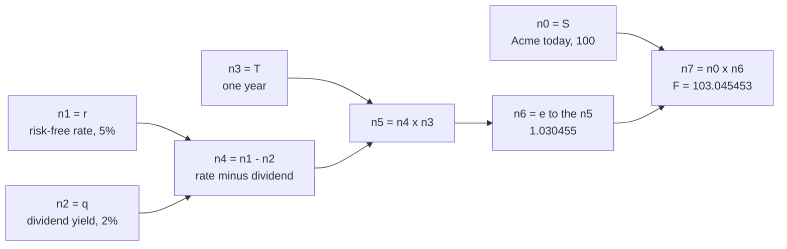
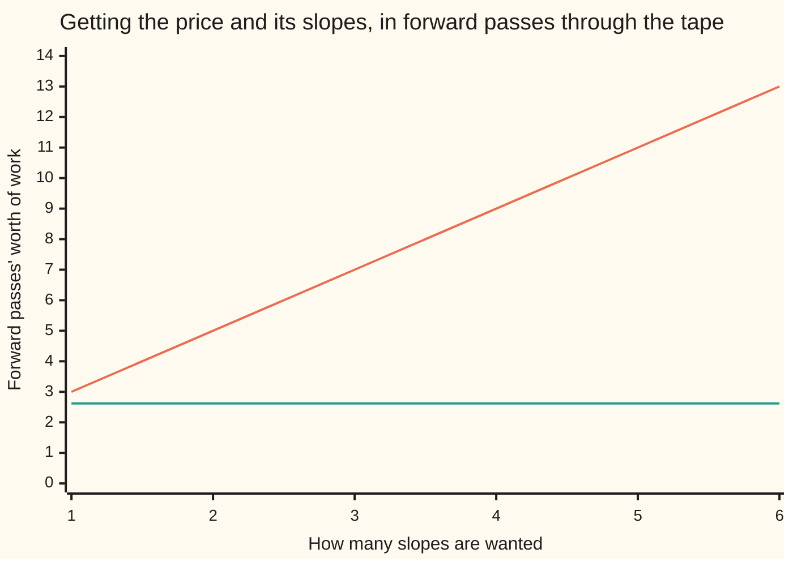

# Adjoint differentiation: every sensitivity for the cost of one extra pass

[Syllabus](../../../SYLLABUS.md) → [Financial mathematics](../../../SYLLABUS.md#w12) → [Greeks by Numbers and Calibration](../../../SYLLABUS.md#w12-s07) → Adjoint differentiation

---

## General Overview

Acme's shares trade at $100 today. A one-year option to buy one share for $100 costs $9.23 in this market: a risk-free rate of 5% a year, a dividend yield of 2%, volatility of 20%. That price comes from [Black–Scholes call](../08-The%20Black-Scholes%20call%20and%20put/01-black-scholes-call.md).

A desk holding the option wants the slopes, not the price: what the option gains if Acme rises a dollar, if volatility rises a point, if a day passes. Six inputs went into $9.23, and the desk wants the derivative with respect to every one.

The plain way is to nudge one input, price again, and divide by the nudge — [Bump and revalue](01-bump-and-revalue-and-common-random-numbers.md). That costs a fresh pricing per nudge, two per input if the nudge goes each way: thirteen pricings for the price and all six slopes. Affordable here, ruinous on a book whose inputs are every point of a yield curve and a volatility surface.

Adjoint differentiation replaces that per-input bill with a flat surcharge. Price the option once, keeping a record of every arithmetic step, then read the record backwards once. Every input's derivative falls out of that single walk — exactly, with no nudge to choose.

Three words carry the rest of the card. The record of the steps is a **tape**: a numbered list, one operation to a line. The number carried backwards through each step is its **adjoint**: how much the final price moves per unit change in that step's value. Walking the tape from the answer towards the inputs is **reverse mode**. On the Acme tape the forward pass is 26 operations and the sweep 42 multiply-and-adds, so the price with all six derivatives costs 2.62 forward passes — and a seventh slope would not move that number.

**Record the arithmetic that produced the price, then walk the record backwards, multiplying by each step's local slope and adding up wherever a value was used more than once: the inputs' adjoints are every derivative at once, at a cost that does not depend on how many inputs there are.**

**What kind of fact this is:** a method, exact up to rounding; it rests on the chain rule for several variables, proved in [Chain rule in several variables](../../06-Calculus%20and%20analysis/07-Several%20Variables/04-multivariable-chain-rule-and-jacobians.md).

### The picture: four steps, walked both ways

The smallest useful tape here is the forward price $F$: what one share costs for delivery in a year, agreed today. Four operations, four inputs, one answer.



Left to right is the forward pass: each box turns the values on its incoming arrows into one value, ending at $F = 103.045453$. Right to left is the sweep. It starts at the answer holding the number 1 and sends a number back along every arrow, multiplied by that step's slope. The numbers left in the four input boxes are the four derivatives.

---

## The formula

Notation first, in words. Every value on the tape gets a companion number: the derivative of the final answer with respect to that value. That companion is the value's **adjoint**, written with an overbar, so the adjoint of a value u is $\bar{u}$, read "u-bar". The answer's own adjoint is 1: a dollar on the price is a dollar on the price.

$$\bar{u} \;=\; \sum_{\text{steps that use } u} \bar{v}\;\frac{\partial v}{\partial u}$$

The sum runs over every later step that takes u as an input. There $\bar{v}$ is the step's own adjoint, and the fraction is that step's slope with respect to u, its other input held still.

**Read it aloud:** the adjoint of a value is the sum, over every later step that uses it, of that step's adjoint times the slope of that step.

The whole method is three lines.

1. **Forward.** Run the tape top to bottom, keeping every value.
2. **Seed.** Set the last value's adjoint to 1, every other adjoint to 0.
3. **Backward.** Take the steps in reverse order. For each, multiply its adjoint by its slope with respect to each input it used, and *add* that into the input's adjoint.

At the top, each input's adjoint is its derivative.

| Symbol | Plain meaning | In our example | Push it up and the answer… |
| --- | --- | --- | --- |
| $C$ | the option's price: the tape's last value | 9.227006 | every adjoint here is a derivative of this |
| $S$, $K$ | Acme today, and the strike | 100 and 100 | up with $S$, down with $K$ |
| $r$, $q$ | the risk-free rate, and the dividend yield | 5% and 2% | up with $r$, down with $q$ |
| $\sigma$ | volatility, how jumpy Acme is; say "sigma" | 20% | up, by 37.901158 per whole unit |
| $T$ | years until expiry | 1 | up, by 5.089319 a year here |
| $F$ | the forward price $S e^{(r-q)T}$: a share delivered at $T$ | 103.045453 | the toy tape's answer |
| $d_1$, $d_2$ | Acme's distance from the strike in wiggle units of $\sigma\sqrt{T}$, one apart | 0.25 and 0.05 | both areas rise |
| $N$, $\phi$ | the bell curve's area left of a point, and its height there | areas 0.598706 and 0.519939; heights 0.386668 and 0.398444 | — |
| $\bar{u}$ | the adjoint of a value u: how much $C$ moves per unit of u | 1 at the price itself | — |
| $\Gamma$ | gamma: how the price's slope against Acme moves | 0.018951 | — |

One slope per kind of step, nine kinds in all. Here `c` is a fixed number, `phi` the bell curve's height, `a` and `b` a step's first and second inputs.

| Step | Slope on `a` | Slope on `b` |
| --- | --- | --- |
| `a + b` | `1` | `1` |
| `a - b` | `1` | `-1` |
| `a x b` | `b` | `a` |
| `a / b` | `1/b` | `-a/b^2` |
| `c x a` | `c` | — |
| `ln a` | `1/a` | — |
| `e^a` | `e^a` | — |
| `sqrt a` | `1/(2 sqrt a)` | — |
| `N(a)` | `phi(a)` | — |

### When it holds

- **Every step has a known slope.** A kink has none: `max(S - K, 0)` has no slope at the strike, and a payoff that either pays or does not has none anywhere useful — those want [Greeks inside the simulation](02-pathwise-and-likelihood-ratio-greeks.md).
- **The tape has to be kept.** Memory grows with the number of steps: a simulated path of a million steps wants a million stored values.
- **One sweep, first derivatives only.** Gamma is a derivative of a derivative and needs a second pass.
- **One answer at a time.** A sweep hands back the derivatives of one output. A routine returning a price and a hedge ratio wants a sweep each, so many answers and few inputs is forward mode's case, not this one.
- **Exact, up to rounding.** No step size, no truncation error — and so also the faithful derivative of a buggy price.

---

## Why it works

### Step 0: the chain rule can be read from either end

Ask the toy tape how much the forward price moves when the rate moves.

Read it forward, the school way. A nudge in `r` moves `r - q` by the same amount; that moves `n5` by `T` times as much; that moves `n6` by `n6` times as much; that moves `F` by `S` times as much. Multiply the slopes along the path, `1 x 1 x 1.030455 x 100`, for 103.045453. That reading starts at an input, so it answers for one input: ask about the dividend yield and the walk starts over.

Reverse mode starts at the answer and asks a different question at every box: how much does the answer move per unit change in this box's value? Known for `n6`, it is one multiply away for `n5`, then `n4`, and `n4` hands it to `r` and `q` at once. One walk, every input.

The same slopes get multiplied either way. Which end the walk starts from decides whether the bill is one pass per input or one per answer — and a pricer has many inputs, one answer.

### Step 1: a tape is the program, written as numbered one-operation steps

Nothing can be swept until the arithmetic is written out step by step. The forward price becomes this:

```
n0 = S          = 100         an input
n1 = r          = 0.05        an input
n2 = q          = 0.02        an input
n3 = T          = 1           an input
n4 = n1 - n2                  the rate net of dividends
n5 = n4 x n3                  that, over the whole year
n6 = e^(n5)     = 1.030455    the growth factor
n7 = n0 x n6    = 103.045453  the forward price F
```

Two properties matter. Every line is one operation, so its slopes come from the table above. And every line refers only to earlier lines, which is what makes "reverse order" mean something: when the sweep reaches a line, every step that used its value has been swept.

### Step 2: the sweep, by hand, on four steps

Seed the answer: $\bar{n_7} = 1$.

`n7 = n0 x n6`: the slope on `n0` is `n6`, on `n6` it is `n0`. Send 1 times each backwards for $\bar{n_0} = 1.030455$ and $\bar{n_6} = 100$. The first is already an answer — a dollar on Acme adds $1.030455 to the forward price.

`n6 = e^(n5)`, slope `n6`, so $\bar{n_5} = 100 \times 1.030455 = 103.045453$.

`n5 = n4 x n3`, slopes `n3` and `n4`, so $\bar{n_4} = 103.045453$ and $\bar{n_3} = 103.045453 \times 0.03 = 3.091364$, the answer for $T$.

`n4 = n1 - n2`, slopes `1` and `-1`, so $\bar{n_1} = 103.045453$ and $\bar{n_2} = -103.045453$.

Four derivatives, seven multiply-and-adds, one walk, matching hand-differentiated formulas to twelve decimals.

### Step 3: a value used twice collects a contribution from each use

On the toy tape every value fed exactly one later step. Real tapes are untidier. On the Black-Scholes tape $T$ feeds four steps — the square root, the drift times $T$, the dividend exponent, the rate exponent — and sigma feeds three, since `sigma x sigma` uses it twice over.

Each use sends its own number back and the numbers add. That is the multivariable chain rule ([Chain rule in several variables](../../06-Calculus%20and%20analysis/07-Several%20Variables/04-multivariable-chain-rule-and-jacobians.md)): when a value reaches the answer by several routes, the total slope is the sum along the routes, and the sweep does that sum by accumulating. Get it wrong and the last route swept overwrites the others. The code runs that mistake on purpose: vega lands on 47.376447 instead of 37.901158, a quarter too big.

### Step 4: the Black-Scholes tape, and the zero hiding in it

The price is 26 operations on six inputs: one wiggle unit `sigma x sqrt(T)`, the log of `S/K`, the drift, the distances $d_1$ and $d_2$, their bell-curve areas, the two discount factors, the share leg, the cash leg, one subtraction. The code lists it line by line.

Sweeping it, the price's adjoint is 1, so the share leg's is 1 and the cash leg's is $-1$. Push those through their multiplications and the areas pick up theirs: $N(d_1)$ gets $S e^{-qT} = 98.019867$, $N(d_2)$ gets $-K e^{-rT} = -95.122942$.

Now $d_2$, which feeds only its own area: $-95.122942 \times 0.398444 = -37.901158$. Then $d_1$, which feeds two steps, its own area and the subtraction that made $d_2$: $98.019867 \times 0.386668 - 37.901158 = 0$.

Zero. Not rounding — exactly zero, because $S e^{-qT}\phi(d_1) = K e^{-rT}\phi(d_2)$ is an identity of the formula, which the sweep finds without being told. So no route through $d_1$ contributes, and vega arrives through the wiggle unit, which $d_2$ subtracts directly: that adjoint is 37.901158, and $\sqrt{T} = 1$ makes it vega itself.

### Step 5: why the bill is flat, and what it costs instead

Count work the crudest honest way. The forward pass does one operation per line: 26. The sweep does one multiply-and-add per arrow into a line: 42. So the sweep costs 42/26 = 1.62 forward passes. Counted that way it looks dearer than it is: its 42 steps are all multiply-and-add, while the 26 forward ones include two bell-curve areas, two exponentials, a logarithm and a square root.

That ratio is not luck. No step has more than two inputs, so arrows can never exceed twice the lines, and a sweep can never cost much more than twice its forward pass — whatever the program, however many inputs. Nothing in that argument counts inputs, which is the result the field rests on: a gradient costs a small constant times the function, four or less for the usual operations, and that constant does not grow with the derivatives wanted. What grows instead is memory: every forward value must survive until the sweep needs it.



The climbing line is nudging: the price plus two extra pricings per slope. The flat line is one forward pass plus one sweep, 2.62 for one slope or all six. It already sits under the climbing line at a single slope, and nudging falls two forward passes further behind with every input added.

<details>
<summary>Detailed proof: the sweep really does produce the derivatives</summary>

Number the lines `0` to `m`, line `m` being the answer, each built only from earlier lines. Write `slot k` for the number the sweep keeps for line `k`.

**Claim:** once the sweep has processed lines `m` down to `k+1`, slot `k` holds the derivative of the answer with respect to line `k`'s value.

**Base case.** Nothing is processed and slot `m` holds 1, the answer's derivative with itself.

**Inductive step.** Take a line `k` below `m` and suppose the claim holds above it. Every line using line `k` sits above `k`, so by the time the sweep reads slot `k` each of them has added its contribution and none ever will again. Slot `k` therefore holds each such line's slot times that line's local slope with respect to line `k`, summed — and by the claim each slot in the sum is the answer's derivative with respect to that line:
$$\sum_{\text{lines that use } k} \frac{\partial(\text{answer})}{\partial(\text{that line})} \times \frac{\partial(\text{that line})}{\partial(\text{line } k)}.$$
Those lines are every route by which a change in line `k` reaches the answer, so the multivariable chain rule makes that sum the answer's derivative with respect to line `k`.

At the input lines the claim reads: slot `k` holds the derivative of the answer with respect to input `k`. That is the gradient, with no approximation anywhere; the only error is the rounding the forward pass already carried.

</details>

<details>
<summary>Forward mode, and when it is the better buy</summary>

The same slopes can be accumulated the other way. Give one input a companion number 1 and every other input 0, then walk the tape top to bottom: each line's companion is the sum of its slopes times its inputs' companions, and the answer's companion at the bottom is its derivative with respect to that one input. One pass, one input, all answers — the mirror of a sweep.

So the choice is a question of shape: many inputs and one answer, sweep; one input and many answers, walk forward. A price is the first shape. The code runs both and they agree to twelve decimals.

</details>

Two other routes reach the same six numbers. Differentiating the formula on paper gives the closed forms the code checks against, one Greek at a time, as [Delta](../09-The%20Greeks%2C%20one%20each/01-delta.md) and its shelf-mates do; that works for a formula, not for a thousand-line pricer. Nudging works for any pricer and returns an approximation whose accuracy hangs on a step size — the trade [Bump and revalue](01-bump-and-revalue-and-common-random-numbers.md) examines.

---

## Worked numbers, by hand

Acme: $S = 100$, $K = 100$, $r = 5\%$, $q = 2\%$, $\sigma = 20\%$, $T = 1$ year, so $d_1 = 0.25$, $d_2 = 0.05$. The forward pass gives 9.227006, the house price. Then the sweep, lines in reverse:

| Step | Arithmetic | Value |
| --- | --- | --- |
| seed the price; then its two legs | share minus cash | $1$; $1$ and $-1$ |
| adjoint of $N(d_1)$, then $N(d_2)$ | $S e^{-qT}$, and $-K e^{-rT}$ | $98.019867$, $-95.122942$ |
| adjoint of $d_2$, then $d_1$ | $-95.122942 \times 0.398444$; then $98.019867 \times 0.386668$ plus that | $-37.901158$, then $0$ |
| adjoint of one wiggle unit | nothing from $d_1$, minus the $d_2$ route | $37.901158$ |
| **slope on $\sigma$, vega** | that, times $\sqrt{T}$; the $\sigma^2$ route dies with $d_1$ | **$37.901158$** |
| **slope on $S$, delta**, then **$K$** | each leg's own route; the $S/K$ route dies with $d_1$ | **$0.586851$**, **$-0.494581$** |
| **slope on $r$**, then **$q$** | through the two discounts; the drift route dies too | **$49.458109$**, **$-58.685115$** |
| **slope on $T$** | three live uses of $T$: the wiggle unit and the two discounts | **$5.089319$** |

Six derivatives from one walk down 42 arrows. Delta is 0.5869, the shelf's house number, and what the nudging and forward-mode roads give too. Desks rescale them, since nobody moves a rate by a whole 100%:

| Greek | What it answers | From the sweep | As a desk quotes it |
| --- | --- | --- | --- |
| delta | Acme rises $1 | 0.586851 | 0.586851 per $1 |
| vega | volatility rises a point | 37.901158 | 0.379012 per point |
| rho | the risk-free rate rises | 49.458109 | 0.004946 per basis point |
| psi | the dividend yield rises | −58.685115 | −0.005869 per basis point |
| theta | one day passes | −5.089319 a year | −0.013943 a day |
| strike slope | the strike is $1 higher | −0.494581 | −0.494581 per $1 |

**Conventions verified 19 Sep 2026:** the right-hand column is quoting habit, not mathematics. A volatility point is 0.01 of $\sigma$, a basis point 0.0001 of a rate, and the day one of 365 calendar days; a desk counting business days divides by about 252 instead. The sweep's own numbers, per year and per whole unit, do not change.

Two identities test the six together rather than one at a time. Doubling $S$ and $K$ doubles the price, which forces $S$ times delta plus $K$ times the strike slope back to the price: $58.685115 - 49.458109 = 9.227006$ — the same two numerals as psi and rho above, signs swapped, because $T$ is one year. And the slopes must satisfy the equation the price obeys ([The Black-Scholes equation](../08-The%20Black-Scholes%20call%20and%20put/07-black-scholes-equation.md)),

$$\frac{\partial C}{\partial t} + (r-q)\,S\,\frac{\partial C}{\partial S} + \tfrac{1}{2}\sigma^2 S^2\,\Gamma - rC = 0,$$

with theta $-5.089319$ for the first term and $\Gamma$ = 0.018951 from two sweeps a bump apart. The four terms cancel to zero at six decimals, and neither identity built the sweep, so neither holds by accident.

### What breaks if you drop a piece

| Mistake | Comes out at | What went wrong |
| --- | --- | --- |
| Writing a contribution in instead of adding it | vega 47.376447, not 37.901158 | Sigma is used three times; only the last route survived |
| Sweeping the lines in tape order | every derivative 0.000000 | Each line's adjoint was spent before its users filled it |
| Reading the slope on $T$ as theta | +5.089319 a year, not −5.089319 | $T$ is time left; theta runs with the clock, the other way |
| Nudging Acme by $10 instead of sweeping | delta 0.580072, not 0.586851 | A $10 chord is not the slope at $100; the curve bends between |

The code prints all four.

---

## Code, from first principles, and it actually runs

Nothing imported knows a derivative. A tape is a plain list of steps; the forward pass fills in values and records one local slope per arrow; the sweep walks the list backwards. The six numbers are reached **four independent ways** — the sweep, closed forms differentiated by hand, central differences, and forward mode — with both identities checked on top and the wrong ways above run too. Rust has no error function, so its bell-curve area comes from adding thin slices; the Python uses `erf`.

### Python

```python
# Adjoint differentiation -- the check behind the card.  Standard library only.
# Nothing imported that already knows a derivative.  A tape records every
# elementary step of the price; one backward sweep over it hands back the whole
# gradient.  Four roads: the sweep, forms differentiated by hand, central
# differences, forward mode.  Two identities and the wrong ways are printed too.
from math import log, sqrt, exp, erf, pi

INP, ADD, SUB, MUL, DIV, LN, EXP, SQRT, NCDF, SCALE = range(10)

def ncdf(x): return 0.5 * (1.0 + erf(x / sqrt(2.0)))       # bell-curve area left of x
def npdf(x): return exp(-0.5 * x * x) / sqrt(2.0 * pi)     # the curve's height at x

def evaluate(tape, xs):            # forward pass: every value, and every edge's local slope
    v, sl = [], []
    for op, i, j, c in tape:
        if   op == INP:  v.append(xs[i]);       sl.append([])
        elif op == ADD:  v.append(v[i] + v[j]); sl.append([(i, 1.0), (j, 1.0)])
        elif op == SUB:  v.append(v[i] - v[j]); sl.append([(i, 1.0), (j, -1.0)])
        elif op == MUL:  v.append(v[i] * v[j]); sl.append([(i, v[j]), (j, v[i])])
        elif op == DIV:  v.append(v[i] / v[j]); sl.append([(i, 1.0 / v[j]), (j, -v[i] / (v[j] * v[j]))])
        elif op == LN:   v.append(log(v[i]));   sl.append([(i, 1.0 / v[i])])
        elif op == EXP:  v.append(exp(v[i]));   sl.append([(i, exp(v[i]))])
        elif op == SQRT: v.append(sqrt(v[i]));  sl.append([(i, 0.5 / sqrt(v[i]))])
        elif op == NCDF: v.append(ncdf(v[i]));  sl.append([(i, npdf(v[i]))])
        else:            v.append(c * v[i]);    sl.append([(i, c)])
    return v, sl
def sweep(tape, sl, add=True, back=True):     # the backward sweep: every node's adjoint,
    a = [0.0] * len(tape)                     # and the inputs are nodes 0, 1, 2, ... in order
    a[len(tape) - 1] = 1.0                    # seed: the answer's derivative with itself
    for k in (range(len(tape) - 1, -1, -1) if back else range(len(tape))):
        for p, s in sl[k]:
            if add: a[p] += a[k] * s          # a reused value collects every contribution
            else:   a[p] = a[k] * s           # the overwrite bug, for the card's table
    return a

def tangent(tape, sl, seed):       # forward mode: one pass carries one input's derivative
    t = [0.0] * len(tape)
    for k, (op, i, j, c) in enumerate(tape):
        t[k] = (1.0 if i == seed else 0.0) if op == INP else sum(s * t[p] for p, s in sl[k])
    return t[len(tape) - 1]
def counts(tape, sl): return sum(1 for n in tape if n[0] != INP), sum(len(e) for e in sl)

TOY = [(INP, 0, 0, 0.0), (INP, 1, 0, 0.0), (INP, 2, 0, 0.0), (INP, 3, 0, 0.0),  # S, r, q, T
       (SUB, 1, 2, 0.0), (MUL, 4, 3, 0.0),        # n4, n5 = r - q, then (r-q)T
       (EXP, 5, 0, 0.0), (MUL, 0, 6, 0.0)]        # n6, n7 = e^((r-q)T), then F = S times it
BS = [(INP, 0, 0, 0.0), (INP, 1, 0, 0.0), (INP, 2, 0, 0.0),      # n0..n2 = S, K, r
      (INP, 3, 0, 0.0), (INP, 4, 0, 0.0), (INP, 5, 0, 0.0),      # n3..n5 = q, sigma, T
      (SQRT, 5, 0, 0.0), (MUL, 4, 6, 0.0),        # n6, n7 = sqrt(T), one wiggle unit
      (DIV, 0, 1, 0.0), (LN, 8, 0, 0.0),          # n8, n9 = S/K, then ln(S/K)
      (SUB, 2, 3, 0.0),                           # n10 = r - q
      (MUL, 4, 4, 0.0), (SCALE, 11, 0, 0.5),      # n11, n12 = sigma*sigma, then half of it
      (ADD, 10, 12, 0.0), (MUL, 13, 5, 0.0),      # n13, n14 = the drift, then times T
      (ADD, 9, 14, 0.0), (DIV, 15, 7, 0.0),       # n15, n16 = d1's top, then d1
      (SUB, 16, 7, 0.0),                          # n17 = d2
      (NCDF, 16, 0, 0.0), (NCDF, 17, 0, 0.0),     # n18, n19 = N(d1), N(d2)
      (MUL, 3, 5, 0.0), (SCALE, 20, 0, -1.0), (EXP, 21, 0, 0.0),   # n20..n22 = e^-qT
      (MUL, 2, 5, 0.0), (SCALE, 23, 0, -1.0), (EXP, 24, 0, 0.0),   # n23..n25 = e^-rT
      (MUL, 0, 22, 0.0), (MUL, 26, 18, 0.0),      # n26, n27 = S e^-qT, then the share leg
      (MUL, 1, 25, 0.0), (MUL, 28, 19, 0.0),      # n28, n29 = K e^-rT, then the cash leg
      (SCALE, 29, 0, -1.0), (ADD, 27, 30, 0.0)]   # n30, n31 = minus the cash leg, the price
def closed(S, K, r, q, sg, T):     # the same six derivatives, differentiated by hand
    v = sg * sqrt(T); d1 = (log(S / K) + (r - q + 0.5 * sg * sg) * T) / v; d2 = d1 - v
    return [exp(-q * T) * ncdf(d1), -exp(-r * T) * ncdf(d2),
            K * T * exp(-r * T) * ncdf(d2), -S * T * exp(-q * T) * ncdf(d1),
            S * exp(-q * T) * npdf(d1) * sqrt(T),
            S * exp(-q * T) * npdf(d1) * sg / (2.0 * sqrt(T))
            - q * S * exp(-q * T) * ncdf(d1) + r * K * exp(-r * T) * ncdf(d2)]

NAMES, X = ("S", "K", "r", "q", "sigma", "T"), [100.0, 100.0, 0.05, 0.02, 0.20, 1.0]
def price(xs): return evaluate(BS, xs)[0][len(BS) - 1]
def grad(xs, add=True, back=True): return sweep(BS, evaluate(BS, xs)[1], add, back)
def bumped(k, h):
    up, dn = list(X), list(X); up[k] += h; dn[k] -= h
    return (price(up) - price(dn)) / (2.0 * h)
def row(lab, *xs): print(f"  {lab:<48}" + "".join(f"{x:>13.6f}" for x in xs))
ty = [100.0, 0.05, 0.02, 1.0]                       # the toy graph on the same market
tv, tsl = evaluate(TOY, ty)
tg, (tops, tedges) = sweep(TOY, tsl), counts(TOY, tsl)
gr = exp((ty[1] - ty[2]) * ty[3])
tcl = [gr, ty[0] * ty[3] * gr, -ty[0] * ty[3] * gr, ty[0] * (ty[1] - ty[2]) * gr]
print(f"the toy graph: forward price F = S e^((r-q)T), {tops} operations, {tedges} edges")
row("F, forward pass through the tape", tv[len(TOY) - 1])
for nm, a, b in zip(("dF/dS", "dF/dr", "dF/dq", "dF/dT"), tg, tcl):
    print(f"  {nm} by sweep {a:>14.6f}    the same by hand {b:>14.6f}")

v, sl = evaluate(BS, X)
ops, edges = counts(BS, sl)
C, g, cl = v[len(BS) - 1], sweep(BS, sl), closed(*X)   # g[0..5] are the six Greeks
bp, fm = [bumped(k, 1.0e-4) for k in range(6)], [tangent(BS, sl, k) for k in range(6)]
print(f"\nthe Black-Scholes tape: 6 inputs, {ops} operations, {edges} edges")
print(f"  d1 {v[16]:.6f}   d2 {v[17]:.6f}   N(d1) {v[18]:.6f}   N(d2) {v[19]:.6f}")
row("call price, forward pass, then the house number", C, 9.227005508154)
print("\nfive Greeks and the strike sensitivity, from ONE backward sweep")
print(f"  {'input':<7}{'sweep':>13}{'by hand':>14}{'bumped':>13}{'forward mode':>14}")
for nm, a, b, c2, d in zip(NAMES, g, cl, bp, fm):
    print(f"  {nm:<7}{a:>13.6f}{b:>14.6f}{c2:>13.6f}{d:>14.6f}")
print("\nthe same five, named and scaled the way a desk quotes them")
for lab, val in (("delta, per $1 on Acme", g[0]), ("vega, per volatility point", g[4] / 100.0),
                 ("rho, per basis point on r", g[2] / 10000.0), ("psi, per basis point on q", g[3] / 10000.0),
                 ("theta, per calendar day", -g[5] / 365.0)):
    row(lab, val)

gam = (grad([X[0] + 0.01] + X[1:])[0] - grad([X[0] - 0.01] + X[1:])[0]) / 0.02
gcl = exp(-X[3] * X[5]) * npdf(v[16]) / (X[0] * X[4] * sqrt(X[5]))
pde = -g[5] + (X[2] - X[3]) * X[0] * g[0] + 0.5 * X[4] * X[4] * X[0] * X[0] * gam - X[2] * C
print("\nadjoints picked out of the sweep, on the way to the Greeks")
print(f"  adj N(d1) {g[18]:>12.6f}   adj N(d2) {g[19]:>12.6f}"
      f"   phi(d1) {npdf(v[16]):>10.6f}   phi(d2) {npdf(v[17]):>10.6f}")
print(f"  adj d1 {g[16]:>15.6f}   adj d2 {g[17]:>12.6f}   adj one wiggle unit {g[7]:>12.6f}")
print("\nfirst derivatives only: gamma costs a second pass")
row("gamma, two sweeps a bump apart, then its formula", gam, gcl)
row("size of the Black-Scholes equation residual", abs(pde))
row("S dC/dS + K dC/dK, then the price itself", X[0] * g[0] + X[1] * g[1], C)

print("\ncost, counted in forward passes through the tape")
print(f"  {'forward pass, operations':<48}{ops:>13d}")
print(f"  {'backward sweep, multiply-and-adds':<48}{edges:>13d}")
row("the sweep alone", edges / ops)
row("price and all six derivatives, adjoint", 1.0 + edges / ops)
row("price and all six by central differences", 13.0)
print("chart, sensitivities asked for " + "".join(f"{k:>6d}" for k in (1, 2, 3, 4, 5, 6)))
print("chart, central differences     " + "".join(f"{2.0 * k + 1.0:>6.2f}" for k in (1, 2, 3, 4, 5, 6)))
print("chart, adjoint, one sweep      " + "".join(f"{1.0 + edges / ops:>6.2f}" for _ in range(6)))

print("\nwhat breaks")
row("overwrite instead of add: dC/dsigma, then right", grad(X, add=False)[4], g[4])
row("swept forward, not in reverse: dC/dS, then right", grad(X, back=False)[0], g[0])
row("theta taken as +dC/dT per year, then right", g[5], -g[5])
row("delta from a $10 bump, then right", bumped(0, 10.0), g[0])

assert abs(C - 9.227005508154) < 1e-9,                    "tape price vs the house number"
assert max(abs(a - b) for a, b in zip(g, cl)) < 1e-9,     "sweep vs the hand-differentiated forms"
assert max(abs(a - b) for a, b in zip(g, bp)) < 1e-5,     "sweep vs central differences"
assert max(abs(a - b) for a, b in zip(g, fm)) < 1e-12,    "sweep vs forward mode"
assert abs(X[0] * g[0] + X[1] * g[1] - C) < 1e-9,         "S dC/dS + K dC/dK must be the price"
assert abs(gam - gcl) < 1e-7 and abs(pde) < 1e-6,         "gamma, and the Black-Scholes equation"
assert max(abs(a - b) for a, b in zip(tg, tcl)) < 1e-12,  "toy sweep vs its hand-made forms"
assert (ops, edges) == (26, 42),                          "the tape this card describes"
print("ALL CHECKS PASS")
```

**Ran 2026-09-19 on macOS, Python 3.14.6, standard library only. All checks passed. Output, pasted from the run:**

```
the toy graph: forward price F = S e^((r-q)T), 4 operations, 7 edges
  F, forward pass through the tape                   103.045453
  dF/dS by sweep       1.030455    the same by hand       1.030455
  dF/dr by sweep     103.045453    the same by hand     103.045453
  dF/dq by sweep    -103.045453    the same by hand    -103.045453
  dF/dT by sweep       3.091364    the same by hand       3.091364

the Black-Scholes tape: 6 inputs, 26 operations, 42 edges
  d1 0.250000   d2 0.050000   N(d1) 0.598706   N(d2) 0.519939
  call price, forward pass, then the house number      9.227006     9.227006

five Greeks and the strike sensitivity, from ONE backward sweep
  input          sweep       by hand       bumped  forward mode
  S           0.586851      0.586851     0.586851      0.586851
  K          -0.494581     -0.494581    -0.494581     -0.494581
  r          49.458109     49.458109    49.458108     49.458109
  q         -58.685115    -58.685115   -58.685115    -58.685115
  sigma      37.901158     37.901158    37.901157     37.901158
  T           5.089319      5.089319     5.089319      5.089319

the same five, named and scaled the way a desk quotes them
  delta, per $1 on Acme                                0.586851
  vega, per volatility point                           0.379012
  rho, per basis point on r                            0.004946
  psi, per basis point on q                           -0.005869
  theta, per calendar day                             -0.013943

adjoints picked out of the sweep, on the way to the Greeks
  adj N(d1)    98.019867   adj N(d2)   -95.122942   phi(d1)   0.386668   phi(d2)   0.398444
  adj d1        0.000000   adj d2   -37.901158   adj one wiggle unit    37.901158

first derivatives only: gamma costs a second pass
  gamma, two sweeps a bump apart, then its formula     0.018951     0.018951
  size of the Black-Scholes equation residual          0.000000
  S dC/dS + K dC/dK, then the price itself             9.227006     9.227006

cost, counted in forward passes through the tape
  forward pass, operations                                   26
  backward sweep, multiply-and-adds                          42
  the sweep alone                                      1.615385
  price and all six derivatives, adjoint               2.615385
  price and all six by central differences            13.000000
chart, sensitivities asked for      1     2     3     4     5     6
chart, central differences       3.00  5.00  7.00  9.00 11.00 13.00
chart, adjoint, one sweep        2.62  2.62  2.62  2.62  2.62  2.62

what breaks
  overwrite instead of add: dC/dsigma, then right     47.376447    37.901158
  swept forward, not in reverse: dC/dS, then right     0.000000     0.586851
  theta taken as +dC/dT per year, then right           5.089319    -5.089319
  delta from a $10 bump, then right                    0.580072     0.586851
ALL CHECKS PASS
```

Four roads, six numbers. Sweep and hand-differentiated forms agree to every printed digit, as they must: both exact, by different arithmetic. Forward mode agrees to twelve decimals. Central differences drift in the last printed digit on rho and vega — the step size showing up where it should.

### Rust

Same tape, same labels, no crates.

```rust
// Adjoint differentiation -- the same check as the Python, in Rust.  No crates.
// Rust has no erf, so the bell-curve area is built the honest way: thin slices
// under the curve (Simpson).  The tape, the reverse sweep, forward mode and the
// bumping are all written out here, as in the Python.
use std::f64::consts::PI;
const INP: u8 = 0; const ADD: u8 = 1; const SUB: u8 = 2; const MUL: u8 = 3;
const DIV: u8 = 4; const LN: u8 = 5; const EXP: u8 = 6; const SQRT: u8 = 7;
const NCDF: u8 = 8; const SCALE: u8 = 9;
type Node = (u8, usize, usize, f64);
type Slopes = Vec<Vec<(usize, f64)>>;

fn npdf(x: f64) -> f64 { (-0.5 * x * x).exp() / (2.0 * PI).sqrt() }   // the curve's height at x
fn simpson<F: Fn(f64) -> f64>(f: F, a: f64, b: f64, n: usize) -> f64 {
    let h = (b - a) / n as f64; let mut s = f(a) + f(b);
    for i in 1..n { s += if i % 2 == 1 { 4.0 } else { 2.0 } * f(a + i as f64 * h); }
    s * h / 3.0 }
fn ncdf(x: f64) -> f64 { 0.5 + simpson(npdf, 0.0, x, 4000) }      // bell-curve area left of x
fn evaluate(tape: &[Node], xs: &[f64]) -> (Vec<f64>, Slopes) {    // values, and every edge's slope
    let (mut v, mut sl): (Vec<f64>, Slopes) = (Vec::new(), Vec::new());
    for &(op, i, j, c) in tape {
        let (val, edges): (f64, Vec<(usize, f64)>) = match op {
            INP => (xs[i], vec![]), ADD => (v[i] + v[j], vec![(i, 1.0), (j, 1.0)]),
            SUB => (v[i] - v[j], vec![(i, 1.0), (j, -1.0)]),
            MUL => (v[i] * v[j], vec![(i, v[j]), (j, v[i])]),
            DIV => (v[i] / v[j], vec![(i, 1.0 / v[j]), (j, -v[i] / (v[j] * v[j]))]),
            LN => (v[i].ln(), vec![(i, 1.0 / v[i])]), EXP => (v[i].exp(), vec![(i, v[i].exp())]),
            SQRT => (v[i].sqrt(), vec![(i, 0.5 / v[i].sqrt())]),
            NCDF => (ncdf(v[i]), vec![(i, npdf(v[i]))]), _ => (c * v[i], vec![(i, c)]),
        };
        v.push(val); sl.push(edges);
    }
    (v, sl) }
fn sweep(tape: &[Node], sl: &Slopes, add: bool, back: bool) -> Vec<f64> {  // every node's adjoint,
    let n = tape.len(); let mut a = vec![0.0; n];   // and the inputs are nodes 0, 1, 2, ... in order
    a[n - 1] = 1.0;                          // seed: the answer's derivative with itself
    let order: Vec<usize> = if back { (0..n).rev().collect() } else { (0..n).collect() };
    for k in order {
        for &(p, s) in &sl[k] {
            let inc = a[k] * s;
            if add { a[p] += inc } else { a[p] = inc }   // add: a reused value collects each one
        }
    }
    a }

fn tangent(tape: &[Node], sl: &Slopes, seed: usize) -> f64 {   // forward mode, one input at a time
    let n = tape.len(); let mut t = vec![0.0; n];
    for (k, &(op, i, _, _)) in tape.iter().enumerate() {
        t[k] = if op == INP { if i == seed { 1.0 } else { 0.0 } }
               else { sl[k].iter().map(|&(p, s)| s * t[p]).sum::<f64>() };
    }
    t[n - 1] }
fn counts(tape: &[Node], sl: &Slopes) -> (usize, usize) {
    (tape.iter().filter(|nd| nd.0 != INP).count(), sl.iter().map(|e| e.len()).sum()) }
fn toy_tape() -> Vec<Node> {
    vec![(INP, 0, 0, 0.0), (INP, 1, 0, 0.0), (INP, 2, 0, 0.0), (INP, 3, 0, 0.0),  // S, r, q, T
         (SUB, 1, 2, 0.0), (MUL, 4, 3, 0.0),       // n4, n5 = r - q, then (r-q)T
         (EXP, 5, 0, 0.0), (MUL, 0, 6, 0.0)] }     // n6, n7 = e^((r-q)T), then F = S times it

fn bs_tape() -> Vec<Node> {
    vec![(INP, 0, 0, 0.0), (INP, 1, 0, 0.0), (INP, 2, 0, 0.0),      // n0..n2 = S, K, r
         (INP, 3, 0, 0.0), (INP, 4, 0, 0.0), (INP, 5, 0, 0.0),      // n3..n5 = q, sigma, T
         (SQRT, 5, 0, 0.0), (MUL, 4, 6, 0.0),       // n6, n7 = sqrt(T), one wiggle unit
         (DIV, 0, 1, 0.0), (LN, 8, 0, 0.0),         // n8, n9 = S/K, then ln(S/K)
         (SUB, 2, 3, 0.0),                          // n10 = r - q
         (MUL, 4, 4, 0.0), (SCALE, 11, 0, 0.5),     // n11, n12 = sigma*sigma, then half of it
         (ADD, 10, 12, 0.0), (MUL, 13, 5, 0.0),     // n13, n14 = the drift, then times T
         (ADD, 9, 14, 0.0), (DIV, 15, 7, 0.0),      // n15, n16 = d1's top, then d1
         (SUB, 16, 7, 0.0),                         // n17 = d2
         (NCDF, 16, 0, 0.0), (NCDF, 17, 0, 0.0),    // n18, n19 = N(d1), N(d2)
         (MUL, 3, 5, 0.0), (SCALE, 20, 0, -1.0), (EXP, 21, 0, 0.0),   // n20..n22 = e^-qT
         (MUL, 2, 5, 0.0), (SCALE, 23, 0, -1.0), (EXP, 24, 0, 0.0),   // n23..n25 = e^-rT
         (MUL, 0, 22, 0.0), (MUL, 26, 18, 0.0),     // n26, n27 = S e^-qT, then the share leg
         (MUL, 1, 25, 0.0), (MUL, 28, 19, 0.0),     // n28, n29 = K e^-rT, then the cash leg
         (SCALE, 29, 0, -1.0), (ADD, 27, 30, 0.0)] }  // n30, n31 = minus the cash leg, the price

fn closed(s: f64, k: f64, r: f64, q: f64, sg: f64, t: f64) -> Vec<f64> {   // the same six by hand
    let v = sg * t.sqrt(); let d1 = ((s / k).ln() + (r - q + 0.5 * sg * sg) * t) / v; let d2 = d1 - v;
    vec![(-q * t).exp() * ncdf(d1), -(-r * t).exp() * ncdf(d2),
         k * t * (-r * t).exp() * ncdf(d2), -s * t * (-q * t).exp() * ncdf(d1),
         s * (-q * t).exp() * npdf(d1) * t.sqrt(),
         s * (-q * t).exp() * npdf(d1) * sg / (2.0 * t.sqrt())
         - q * s * (-q * t).exp() * ncdf(d1) + r * k * (-r * t).exp() * ncdf(d2)] }

fn row(lab: &str, xs: &[f64]) {
    let mut ln = format!("  {:<48}", lab);
    for x in xs { ln.push_str(&format!("{:>13.6}", x)); } println!("{}", ln); }

fn worst(a: &[f64], b: &[f64]) -> f64 {
    a.iter().zip(b.iter()).map(|(p, q)| (p - q).abs()).fold(0.0_f64, f64::max) }

fn main() {
    let (bs, toy) = (bs_tape(), toy_tape());
    let names = ["S", "K", "r", "q", "sigma", "T"];
    let x = vec![100.0_f64, 100.0, 0.05, 0.02, 0.20, 1.0];
    let price = |xs: &[f64]| { let (v, _) = evaluate(&bs, xs); v[bs.len() - 1] };
    let grad = |xs: &[f64], a: bool, b: bool| { let (_, sl) = evaluate(&bs, xs); sweep(&bs, &sl, a, b) };
    let bumped = |k: usize, h: f64| {
        let (mut up, mut dn) = (x.clone(), x.clone()); up[k] += h; dn[k] -= h;
        (price(&up) - price(&dn)) / (2.0 * h)
    };
    let ty = [100.0_f64, 0.05, 0.02, 1.0];                  // the toy graph on the same market
    let (tv, tsl) = evaluate(&toy, &ty);
    let (tg, (tops, tedges)) = (sweep(&toy, &tsl, true, true), counts(&toy, &tsl));
    let gr = ((ty[1] - ty[2]) * ty[3]).exp();
    let tcl = [gr, ty[0] * ty[3] * gr, -ty[0] * ty[3] * gr, ty[0] * (ty[1] - ty[2]) * gr];
    println!("the toy graph: forward price F = S e^((r-q)T), {} operations, {} edges", tops, tedges);
    row("F, forward pass through the tape", &[tv[toy.len() - 1]]);
    for (nm, (a, b)) in ["dF/dS", "dF/dr", "dF/dq", "dF/dT"].iter().zip(tg.iter().zip(tcl.iter()))
        { println!("  {} by sweep {:>14.6}    the same by hand {:>14.6}", nm, a, b); }
    let (v, sl) = evaluate(&bs, &x);
    let (ops, edges) = counts(&bs, &sl);
    let c = v[bs.len() - 1];
    let g = sweep(&bs, &sl, true, true);        // g[0..6] are the six Greeks
    let cl = closed(x[0], x[1], x[2], x[3], x[4], x[5]);
    let bp: Vec<f64> = (0..6).map(|k| bumped(k, 1.0e-4)).collect();
    let fm: Vec<f64> = (0..6).map(|k| tangent(&bs, &sl, k)).collect();
    println!("\nthe Black-Scholes tape: 6 inputs, {} operations, {} edges", ops, edges);
    println!("  d1 {:.6}   d2 {:.6}   N(d1) {:.6}   N(d2) {:.6}", v[16], v[17], v[18], v[19]);
    row("call price, forward pass, then the house number", &[c, 9.227005508154]);
    println!("\nfive Greeks and the strike sensitivity, from ONE backward sweep");
    println!("  {:<7}{:>13}{:>14}{:>13}{:>14}", "input", "sweep", "by hand", "bumped", "forward mode");
    for k in 0..6
        { println!("  {:<7}{:>13.6}{:>14.6}{:>13.6}{:>14.6}", names[k], g[k], cl[k], bp[k], fm[k]); }
    println!("\nthe same five, named and scaled the way a desk quotes them");
    for (lab, val) in [("delta, per $1 on Acme", g[0]), ("vega, per volatility point", g[4] / 100.0),
                       ("rho, per basis point on r", g[2] / 10000.0),
                       ("psi, per basis point on q", g[3] / 10000.0),
                       ("theta, per calendar day", -g[5] / 365.0)] { row(lab, &[val]); }
    let (mut up, mut dn) = (x.clone(), x.clone()); up[0] += 0.01; dn[0] -= 0.01;
    let gam = (grad(&up, true, true)[0] - grad(&dn, true, true)[0]) / 0.02;
    let gcl = (-x[3] * x[5]).exp() * npdf(v[16]) / (x[0] * x[4] * x[5].sqrt());
    let pde = -g[5] + (x[2] - x[3]) * x[0] * g[0] + 0.5 * x[4] * x[4] * x[0] * x[0] * gam - x[2] * c;
    println!("\nadjoints picked out of the sweep, on the way to the Greeks");
    println!("  adj N(d1) {:>12.6}   adj N(d2) {:>12.6}   phi(d1) {:>10.6}   phi(d2) {:>10.6}",
             g[18], g[19], npdf(v[16]), npdf(v[17]));
    println!("  adj d1 {:>15.6}   adj d2 {:>12.6}   adj one wiggle unit {:>12.6}", g[16], g[17], g[7]);
    println!("\nfirst derivatives only: gamma costs a second pass");
    row("gamma, two sweeps a bump apart, then its formula", &[gam, gcl]);
    row("size of the Black-Scholes equation residual", &[pde.abs()]);
    row("S dC/dS + K dC/dK, then the price itself", &[x[0] * g[0] + x[1] * g[1], c]);
    println!("\ncost, counted in forward passes through the tape");
    println!("  {:<48}{:>13}", "forward pass, operations", ops);
    println!("  {:<48}{:>13}", "backward sweep, multiply-and-adds", edges);
    let cost = edges as f64 / ops as f64;
    row("the sweep alone", &[cost]);
    row("price and all six derivatives, adjoint", &[1.0 + cost]);
    row("price and all six by central differences", &[13.0]);
    let (mut l1, mut l2, mut l3) = (String::from("chart, sensitivities asked for "),
        String::from("chart, central differences     "), String::from("chart, adjoint, one sweep      "));
    for k in 1..=6 {
        l1.push_str(&format!("{:>6}", k)); l2.push_str(&format!("{:>6.2}", 2.0 * k as f64 + 1.0));
        l3.push_str(&format!("{:>6.2}", 1.0 + cost)); }
    println!("{}\n{}\n{}", l1, l2, l3);
    println!("\nwhat breaks");
    row("overwrite instead of add: dC/dsigma, then right", &[grad(&x, false, true)[4], g[4]]);
    row("swept forward, not in reverse: dC/dS, then right", &[grad(&x, true, false)[0], g[0]]);
    row("theta taken as +dC/dT per year, then right", &[g[5], -g[5]]);
    row("delta from a $10 bump, then right", &[bumped(0, 10.0), g[0]]);
    assert!((c - 9.227005508154).abs() < 1e-9, "tape price vs the house number");
    assert!(worst(&g, &cl) < 1e-9, "sweep vs the hand-differentiated forms");
    assert!(worst(&g, &bp) < 1e-5, "sweep vs central differences");
    assert!(worst(&g, &fm) < 1e-12, "sweep vs forward mode");
    assert!((x[0] * g[0] + x[1] * g[1] - c).abs() < 1e-9, "S dC/dS + K dC/dK must be the price");
    assert!((gam - gcl).abs() < 1e-7 && pde.abs() < 1e-6, "gamma, and the Black-Scholes equation");
    assert!(worst(&tg, &tcl) < 1e-12, "toy sweep vs its hand-made forms");
    assert!((ops, edges) == (26, 42), "the tape this card describes");
    println!("ALL CHECKS PASS");
}
```

**Ran 2026-09-19 on macOS, rustc 1.98.1, no crates. All checks passed. Output, pasted from the run:**

```
the toy graph: forward price F = S e^((r-q)T), 4 operations, 7 edges
  F, forward pass through the tape                   103.045453
  dF/dS by sweep       1.030455    the same by hand       1.030455
  dF/dr by sweep     103.045453    the same by hand     103.045453
  dF/dq by sweep    -103.045453    the same by hand    -103.045453
  dF/dT by sweep       3.091364    the same by hand       3.091364

the Black-Scholes tape: 6 inputs, 26 operations, 42 edges
  d1 0.250000   d2 0.050000   N(d1) 0.598706   N(d2) 0.519939
  call price, forward pass, then the house number      9.227006     9.227006

five Greeks and the strike sensitivity, from ONE backward sweep
  input          sweep       by hand       bumped  forward mode
  S           0.586851      0.586851     0.586851      0.586851
  K          -0.494581     -0.494581    -0.494581     -0.494581
  r          49.458109     49.458109    49.458108     49.458109
  q         -58.685115    -58.685115   -58.685115    -58.685115
  sigma      37.901158     37.901158    37.901157     37.901158
  T           5.089319      5.089319     5.089319      5.089319

the same five, named and scaled the way a desk quotes them
  delta, per $1 on Acme                                0.586851
  vega, per volatility point                           0.379012
  rho, per basis point on r                            0.004946
  psi, per basis point on q                           -0.005869
  theta, per calendar day                             -0.013943

adjoints picked out of the sweep, on the way to the Greeks
  adj N(d1)    98.019867   adj N(d2)   -95.122942   phi(d1)   0.386668   phi(d2)   0.398444
  adj d1        0.000000   adj d2   -37.901158   adj one wiggle unit    37.901158

first derivatives only: gamma costs a second pass
  gamma, two sweeps a bump apart, then its formula     0.018951     0.018951
  size of the Black-Scholes equation residual          0.000000
  S dC/dS + K dC/dK, then the price itself             9.227006     9.227006

cost, counted in forward passes through the tape
  forward pass, operations                                   26
  backward sweep, multiply-and-adds                          42
  the sweep alone                                      1.615385
  price and all six derivatives, adjoint               2.615385
  price and all six by central differences            13.000000
chart, sensitivities asked for      1     2     3     4     5     6
chart, central differences       3.00  5.00  7.00  9.00 11.00 13.00
chart, adjoint, one sweep        2.62  2.62  2.62  2.62  2.62  2.62

what breaks
  overwrite instead of add: dC/dsigma, then right     47.376447    37.901158
  swept forward, not in reverse: dC/dS, then right     0.000000     0.586851
  theta taken as +dC/dT per year, then right           5.089319    -5.089319
  delta from a $10 bump, then right                    0.580072     0.586851
ALL CHECKS PASS
```

The two outputs match line for line at six decimals, from different bell-curve areas: `erf` against thin slices under the curve.

> [!TIP]
> **Try changing**
> Guess the direction first, then run it. The asserts are pinned to the Acme numbers, so expect one to stop the program.
> - **Break the accumulation.** Change `sweep`'s default to `add=False`, so the main gradient is built that way too. Vega jumps to 47.376447 and the sweep-against-hand assert stops the run. This is the bug the method really suffers from.
> - **Sweep the wrong way.** Change the other default to `back=False`. Every derivative reads 0.000000: the seed's 1 reaches the price's parents after their adjoints were spent.
> - **Lengthen the bump.** Change `1.0e-4` to `1.0e-1`, which moves a rate by ten percentage points. The bumped column parts from the sweep in the first decimal on rho and vega and its assert stops the run; the sweep does not move, having no step size to get wrong.

---

## The usual mistake

> [!warning]
> **Confusing a step's own slope with its adjoint.** The slope of `n5 = n4 x n3` with respect to `n4` is `n3`, a local fact about one multiplication. The adjoint of `n4` is how much the *final price* moves per unit of `n4`, which depends on everything downstream. The sweep's job is turning the first into the second; treating them as one thing gives numbers that look like derivatives and are not.
>
> - **Overwriting where a value is reused.** Sigma appears three times on the Acme tape; assign instead of add and vega reads 47.376447 against the true 37.901158, with no error message.
> - **Expecting second derivatives.** Gamma, 0.018951 here, takes a second pass; "all the Greeks in one pass" oversells it.
> - **Losing the sign of theta.** The tape carries $T$, the time remaining, whose slope is $+5.089319$ a year. Theta runs with the clock: $-5.089319$ a year, $-0.013943$ a day.
> - **Sweeping through a kink.** Where a payoff bends or jumps there is no slope to record, and the sweep returns a one-sided number or a zero without complaint: [Greeks inside the simulation](02-pathwise-and-likelihood-ratio-greeks.md).

---

## Where you meet it in real life

- **Overnight risk runs.** A bank's book depends on thousands of market inputs; nudging each is impossible in a night, one sweep per trade is routine. Giles and Glasserman's 2006 note put this in front of trading desks.
- **Machine learning.** Backpropagation is this sweep on a network's tape, the loss in place of the price and the weights in place of the inputs: millions of inputs, one answer.
- **Calibration.** Fitting a model to market prices minimises a mismatch over many parameters, and every search step wants the gradient: [Calibration](06-calibration-as-least-squares.md).
- **Solving backwards.** Newton's method needs a derivative at every guess, and a sweep supplies it for the cost of the guess: [Solving backwards](05-root-finding-for-inverses.md).
- **Lattices, and the model underneath.** A tree or a grid is arithmetic too, so it has a tape and can be swept ([Greeks from a tree or grid](04-greeks-from-a-tree-or-grid.md)) — though exact derivatives of a wrong model are exactly wrong ([Model risk](07-model-risk-and-parameter-stability.md)).

> **Say it back**
> Write the pricing arithmetic out as a numbered list of one-operation steps, a tape. Run it forward for the price, keeping every value and every step's local slope. Then set the price's adjoint to 1 and walk the list backwards, pushing each step's adjoint to its inputs multiplied by the local slope, adding wherever a value was used twice. The inputs' adjoints are all the derivatives, exactly, from one walk — the price, five Greeks and the strike slope for 2.62 forward passes against thirteen pricings by nudging.

---

## What this builds on

- [Greeks inside the simulation](02-pathwise-and-likelihood-ratio-greeks.md): differentiating inside a simulation, and what to do where a payoff has no slope.
- [Chain rule in several variables](../../06-Calculus%20and%20analysis/07-Several%20Variables/04-multivariable-chain-rule-and-jacobians.md): the rule that makes contributions add when a value reaches the answer by several routes. The sweep is that rule, run once.

## Where this goes next

- Reverse mode: the same sweep as a general tool rather than a finance trick — how memory is traded against recomputation, and how second derivatives arrive.

This card's tape was typed out by hand, which nobody does for a real pricer; how a program records its own tape as it runs is what a later card builds.

---

## Sources

Verified 19 Sep 2026: every link below resolves to the publisher's page.

- Griewank, Andreas, and Andrea Walther. *Evaluating Derivatives: Principles and Techniques of Algorithmic Differentiation*, 2nd ed. SIAM, 2008. [Publisher page](https://epubs.siam.org/doi/book/10.1137/1.9780898717761). The standard reference, and the source of Step 5's cost bound.
- Linnainmaa, Seppo. "Taylor Expansion of the Accumulated Rounding Error." *BIT Numerical Mathematics* 16, no. 2 (1976): 146–160. [doi:10.1007/BF01931367](https://doi.org/10.1007/BF01931367). The earliest published reverse sweep over a computational graph.
- Giles, Michael, and Paul Glasserman. "Smoking Adjoints: Fast Monte Carlo Greeks." *Risk* 19, no. 1 (2006): 88–92. [Publisher page](https://www.risk.net/derivatives/interest-rate-derivatives/1500261/smoking-adjoints-fast-monte-carlo-greeks). The note that brought the sweep to trading desks.
- Capriotti, Luca. "Fast Greeks by Algorithmic Differentiation." *Journal of Computational Finance* 14, no. 3 (2011): 3–35. [doi:10.21314/JCF.2011.234](https://doi.org/10.21314/JCF.2011.234). Works through pricing tapes and measures the speed-ups.
- Baydin, Atılım Güneş, Barak A. Pearlmutter, Alexey Andreyevich Radul, and Jeffrey Mark Siskind. "Automatic Differentiation in Machine Learning: A Survey." *Journal of Machine Learning Research* 18, no. 153 (2018): 1–43. [Journal page](https://jmlr.org/papers/v18/17-468.html). Sorts forward mode, reverse mode and backpropagation into one family.
