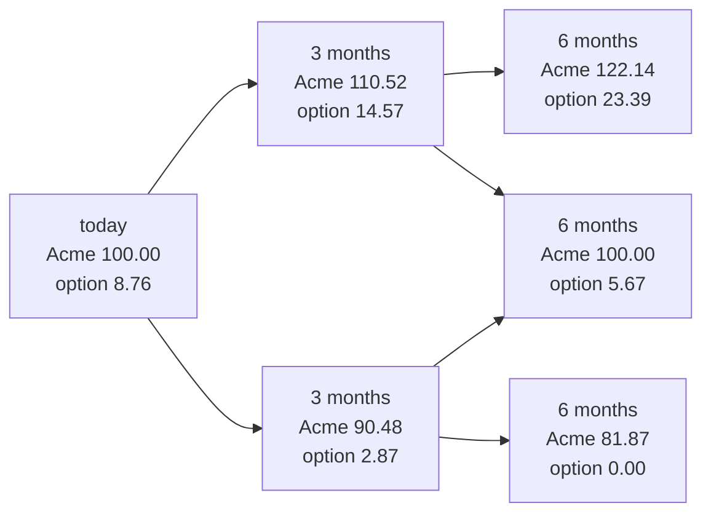
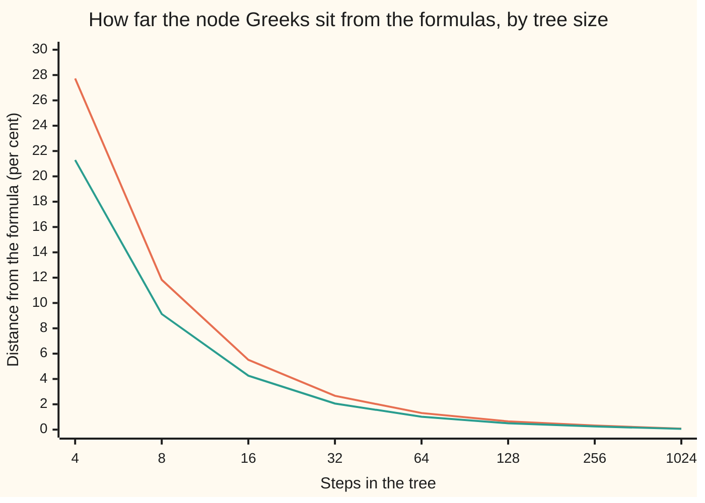

# Greeks from a tree or grid: read the slope off the nodes

[Syllabus](../../../SYLLABUS.md) → [Financial mathematics](../../../SYLLABUS.md#w12) → [Greeks by Numbers and Calibration](../../../SYLLABUS.md#w12-s07) → Greeks from a tree or grid

---

## General Overview

Acme trades at $100. A one-year call on it — the right, not the duty, to buy one share for $100 in a year — was priced on [Many steps](../04-Binomial%20Trees/03-multi-step-trees-and-backward-induction.md) by cutting the year into four quarters and filling in the boxes from the last column backwards. The number at the root was $8.76.

Fifteen boxes went in and one number came out. The other fourteen are not scratch work: each is the price of the same option at a different Acme price on a different date. The tree computed a small map of prices, and the price is one point on it.

A desk wants the map's slopes. **Delta** is the first: dollars the option gains for each dollar Acme gains. The usual way to get it is to price the option twice, at $100 and at $100.01, and divide difference by difference — a second complete tree, for one number. But the tree already holds two prices at two Acme prices. One step in, Acme is either $110.52, where the option is worth $14.57, or $90.48, where it is worth $2.87. Divide the option's gap by the stock's gap: **0.5841**, against the Black-Scholes formula's 0.586851. A four-step tree, with no extra arithmetic, came within half a per cent.

Three nodes two steps in give the next slope down, **gamma**, how fast delta itself changes. The middle of those three sits at exactly $100 again, which lets the same tree give **theta**, the cost of the calendar.

**A tree or grid has already priced the option at neighbouring stock prices and neighbouring dates, so its Greeks are differences between numbers that are already sitting there.**

**What kind of fact this is:** a method, with an approximation inside it — every Greek below is a difference of two prices over a distance, and Taylor's theorem bounds how far that sits from a true slope. The argument is in Why it works; the error is measured in the code.

### The picture: the six nodes the Greeks come from



Acme's price on top of each box, the option's worth below. The two boxes at three months give delta, the three at six months gamma. The middle six-month box reads Acme 100.00, today's price, so setting it against today's box gives theta.

---

## The formula

Notation first, in words. A node is named by two counts: steps passed, and how many were up moves. $V_n(j)$ is the option's worth after $n$ steps of which $j$ were up, and $S_n(j)$ is Acme's price there. Those are labels, not multiplications, and both come from the earlier card unchanged. The number of steps is written $M$ here, not $N$ as on that card, because on this shelf $N$ already means the bell curve's area to the left of a point. One step lasts $\Delta t = T/M$ years; those two letters always travel together, since $\Delta$ alone is delta.

Delta comes off the pair one step in:

$$\Delta_{\text{node}} = \frac{V_1(1) - V_1(0)}{S_1(1) - S_1(0)}$$

**Read it aloud:** the gap between the option's two possible worths, divided by the gap between Acme's two possible prices.

Gamma comes off the triple two steps in, whose prices are not evenly spaced. The gap above the middle node is $h_+ = S(u^2 - 1)$ and below it $h_- = S(1 - d^2)$; $h_+$ is the larger, because multiplying up twice travels further in dollars than dividing down twice: $22.14 against $18.13 here.

$$\Gamma_{\text{node}} = \frac{2}{h_+ + h_-}\left(\frac{V_2(2) - V_2(1)}{h_+} - \frac{V_2(1) - V_2(0)}{h_-}\right)$$

**Read it aloud:** the slope above the middle node minus the slope below it, doubled, then spread over the distance between the two outer nodes.

Theta comes off the middle node of that triple. Because $u\,d = 1$ — the defining habit of a recombining tree — an up step then a down step returns to $S$ exactly, so that node holds today's stock price at a later date:

$$\Theta_{\text{node}} = \frac{V_2(1) - V_0(0)}{2\,\Delta t}$$

**Read it aloud:** the same option at the same stock price two steps later, minus today, divided by the years that went by.

A finite-difference grid stores prices against $x = \ln(S/100)$, the log of the price in units of today's, because the model's jumpiness is constant in logs. Write $U$ for the worth at a grid point, $U_x$ and $U_{xx}$ for its slope and bend along the grid, and $a$ for the grid's spacing in $x$. Grid slopes are per log unit, not per dollar, and converting is a chain rule:

$$C_S = \frac{U_x}{S}, \qquad C_{SS} = \frac{U_{xx} - U_x}{S^2}$$

**Read it aloud:** divide the log-grid slope by the price to get dollars per dollar; for the bend, subtract the slope first, then divide by the price twice.

| Symbol | Plain meaning | In our example | Push it up and the answer… |
| --- | --- | --- | --- |
| $S$, $K$ | Acme's price today; the strike it may buy at | $100 and $100 | $S$ up: delta climbs toward 1 |
| $T$, $M$ | life in years; steps the tree cuts it into, each lasting $\Delta t = T/M$ | 1 year; 4 steps, then up to 1024 | more steps: finer, slower, more accurate |
| $r$, $q$ | the riskless rate; the dividend yield Acme pays out | 5% and 2% | $q$ up: delta falls, dividends leaking out |
| $\sigma$ | volatility, how jumpy Acme is. Say "sigma". | 20% | wider branches, so wider gaps between nodes |
| $u$, $d$, $p$ | the up factor, the down factor, the risk-neutral weight on an up step | 1.105171, 0.904837, 0.512599 | — |
| $V$, $n$, $j$ | the worth at a node $V_n(j)$: $n$ steps in, $j$ of them up | $8.76 at the root | — |
| $h$ | the dollar gap from the middle node two steps in to its neighbours, up ($h_+$) and down ($h_-$) | $22.14 and $18.13 | bigger gaps: more bias, less noise |
| $\Delta$, $C_S$ | delta: dollars gained per dollar Acme gains; the price's slope in $S$ | 0.584104 from four steps | — |
| $\Gamma$, $C_{SS}$ | gamma: delta gained per dollar Acme gains; the price's bend in $S$ | 0.024206 from four steps | — |
| $\Theta$ | theta: dollars lost per year as the calendar advances, Acme held still | −$6.17 a year from four steps | — |
| $U$, $U_x$, $U_{xx}$, $a$ | the worth at a grid point in $x = \ln(S/100)$; its slope and bend there; the grid's spacing in $x$ | $a$ = 0.010, then 0.002 | smaller $a$: less bias, then rounding noise |
| $N$ | the bell curve's area to the left of a point: the house meaning of the letter, which is why steps are $M$ | — | — |

### When it holds

- **Smooth ground around the nodes.** The reading fits a line or a parabola through neighbouring prices. If they straddle a corner — the payoff's kink at the strike in the last column, or a barrier — the fit describes the corner, not the option.
- **A recombining tree.** With $u\,d = 1$ the middle node two steps in returns to today's price. Without it no node holds today's price at a later date, and theta has nothing to compare against.
- **The estimate is dated, and not today.** The pair one step in lives at $\Delta t$, three months out on a four-step tree, and the triple at $2\Delta t$; quoted as today's Greek, either carries a stale date.
- **The spacing belongs to the tree.** The gaps are about $S\sigma\sqrt{\Delta t}$ wide, so refining shrinks them whether that helps or not, and whatever error a node price already carries is then divided by smaller numbers.
- **Two errors, not one.** A node number differs from a formula number because a difference quotient is not a derivative and because the tree's price is not the model's; blame the wrong one and the fix is wasted.

---

## Why it works

### Step 0: the backward walk builds a surface, and a Greek is one of its slopes

Backward induction fills in a value for every date-and-price pair on the tree, then reports the one in the corner. A Greek is the rate at which the price moves when one input moves and the rest hold still — a slope of that surface in one direction. So the Greeks were computed alongside the price, and nothing remains but to read them. Methods that bump an input and price again build a second surface to measure a slope on the first.

### Step 1: two prices give a slope, and the error has a size

The line through the two nodes one step in — the chord — has a slope equal to the price curve's true slope somewhere between them; that much is the mean value theorem. The reading wants the slope at the middle, and the chord misses it by two pieces: the curve's bend times how much the two gaps differ, plus the bend's own slope times the width squared. Neither is a choice: the width is about $S\sigma\sqrt{\Delta t}$ and the gaps differ by about $S\sigma^2\Delta t$, so both pieces are of size $\Delta t$ — the size of the dating error of Step 3.

The chord is a price slope, not a hedge. With dividends leaking out, the share count that copies the option over the step is this chord times $e^{-q\Delta t}$, which is why the hedge column on the multi-step tree card reads a little under the delta here.

### Step 2: three prices fix one parabola, and its bend is gamma

Put the middle node at the origin and measure sideways in dollars. Exactly one parabola passes through all three nodes, since three points at distinct positions pin three coefficients, and a parabola's curvature is the same everywhere and equals twice its squared-term coefficient. So the node gamma is that doubled coefficient.

The chord slope up to the higher node is the linear coefficient plus the squared one times $h_+$; the chord down to the lower node is the linear coefficient minus the squared one times $h_-$. Subtracting kills the linear term and leaves the squared coefficient times the total width. The node gamma is therefore twice the gap between the two one-sided slopes, divided by that width — the formula above.

On the four-quarter tree those one-sided slopes are 0.313009 below and 0.800355 above: the option's slope nearly triples across $40 of stock price, and gamma is made of exactly that. The check runs the same three-point recipe on a genuine parabola, $3 + 2x + 5x^2$ sampled at gaps 1.5 and 4.0, and recovers chord slope 14.500000 and curvature 10.000000 — the hand-algebra answers, exactly.

<details>
<summary>Detailed proof: the parabola through three unequally spaced prices, and what price errors do to it</summary>

**Uniqueness.** Two quadratics agreeing with the three prices differ by a polynomial of degree at most two with three distinct roots, so the difference is zero.

**The coefficients.** Measure sideways from the middle node and write the two one-sided slopes as
$$d_+ = \frac{V_2(2) - V_2(1)}{h_+} = b + c\,h_+, \qquad d_- = \frac{V_2(1) - V_2(0)}{h_-} = b - c\,h_-,$$
the parabola's linear and squared coefficients being those two letters. Subtracting and solving gives
$$c = \frac{d_+ - d_-}{h_+ + h_-}, \qquad b = \frac{h_-\,d_+ + h_+\,d_-}{h_+ + h_-}, \qquad \Gamma_{\text{node}} = 2c.$$
With equal gaps this collapses to the familiar $(V_+ - 2V_0 + V_-)/h^2$; on a tree the gaps are never equal, and the collapse costs 0.029717 against 0.024206.

**Truncation** — the error of using a chord where a slope is wanted. Suppose the true same-date price curve has three continuous derivatives across an interval holding all three stock prices, bounded there by
$$\lvert C_{SS} \rvert \le M_2, \qquad \lvert C_{SSS} \rvert \le M_3.$$
Taylor's theorem about the middle node then bounds the two readings:
$$\lvert \Gamma_{\text{node}} - C_{SS} \rvert \le \frac{M_3\,(h_+^2 + h_-^2)}{3\,(h_+ + h_-)}, \qquad \lvert \Delta_{\text{chord}} - C_S \rvert \le \frac{M_2\,(h_+^2 + h_-^2)}{2\,(h_+ + h_-)}.$$
Each bound falls like the spacing itself. The readings beat their own bounds on a recombining tree: the two gaps differ by only about $4S\sigma^2\Delta t$, and that near-symmetry cancels the leading term, leaving an error of order $\Delta t$ — the rate the printed table shows. A payoff kink has no bounded second derivative, which is why the assumptions forbid straddling one.

**Price errors.** If each node price is wrong by up to one cent, the delta reading moves by at most $2/(h_+ + h_-)$ cents and the gamma reading by at most $4/(h_+h_-)$ cents, the worst case being a middle error of the opposite sign to the outer two. Truncation falls as the gaps shrink; this term rises. At 1024 steps a cent at each node already buys 0.025600 of gamma error, more than gamma itself. The tree below carries fifteen digits, so its printed errors keep falling; a pricer good only to the cent meets that floor while the tree is still coarse.

</details>

### Step 3: why a crude node delta flatters itself

The four-step node delta is 0.584104. The formula says 0.586851 today and 0.576983 at the node's own date, nine months from expiry. The node number is far nearer today's answer than its own date's, which looks like luck and partly is.

Two errors of size $\Delta t$ are in play, pulling opposite ways. Dating the estimate three months late pushes it down, since a call's delta at the money drifts toward one half as expiry nears; spreading the chord over a $20 interval pushes it up. The printed table shows the same squeeze at every step count. The cancellation is a fact about this example, not a theorem.

### Step 4: theta needs a node at the same price, which recombination supplies

Theta holds the stock still and lets only the calendar move, and nothing on a tree holds the stock still except a recombining node: an up step then a down step multiplies by $u\,d$, which is 1, so the middle node two steps in is Acme at $100 again, six months later. Its worth against today's, over the half year, is theta — −6.172862 a year here, against the formula's −5.089319.

Reading along a branch instead, the up node two steps in against today, folds a $22 stock move into the answer and gives **+29.267282 a year**. A call at the money loses to the calendar in this market, so the sign alone catches the error.

### Step 5: a grid in logs, and the coordinate trap

Since $S = 100\,e^x$ has slope $S$ in $x$, the chain rule gives $U_x = S\,C_S$, and again $U_{xx} = S\,C_S + S^2\,C_{SS}$. Solving that pair is the conversion above, whose second half carries a first-derivative term owed to the coordinate, not to the option.

At spacing 0.010 the grid reads delta 0.586885 and gamma 0.018946, against the formulas' 0.586851 and 0.018951. At spacing 0.002, five times finer, it reads 0.586852 and 0.018950. Delta's error falls twenty-five-fold, the square law in the open; gamma's does the same, below the last printed digit. Read $U_x$ as a share delta and the answer is 58.688461, a hundred times too big; drop the $-U_x$ term and gamma reads 0.024815, a gap no refinement closes, because the mistake is algebra, not spacing.

### The other roads to a Greek

Three sibling cards reach the same numbers without reading nodes: [Bump and revalue](01-bump-and-revalue-and-common-random-numbers.md) (Bump and revalue), which prices twice and divides, and so works on any pricer at all; [Greeks inside the simulation](02-pathwise-and-likelihood-ratio-greeks.md) (Greeks inside the simulation), which differentiates inside a Monte Carlo run; and [Adjoint differentiation](03-adjoint-differentiation-in-outline.md) (Adjoint differentiation), which returns a whole risk ladder in one backward pass. Node reading is the cheap one, and only exists where a lattice or grid is already built.

---

## Worked numbers, by hand

Acme: $S = 100$, $K = 100$, $r = 5\%$, $q = 2\%$, $\sigma = 20\%$, $T = 1$ year, cut into $M = 4$ quarters.

| Step | Arithmetic | Value |
| --- | --- | --- |
| one step's length and log move, $\Delta t = T/M$ and $\sigma\sqrt{\Delta t}$ | $1/4$; $0.20 \times 0.5$ | 0.25 years; 0.10 |
| up and down factors, $u = e^{0.10}$, $d = e^{-0.10}$ | | 1.105171 and 0.904837 |
| the two nodes one step in, $S_1(0)$ and $S_1(1)$ | $100 \times 0.904837$, $100 \times 1.105171$ | 90.483742 and 110.517092 |
| their worths, $V_1(0)$ and $V_1(1)$ | from the backward walk | 2.872305 and 14.573873 |
| **node delta**, dated three months in | $(14.573873 - 2.872305)/(110.517092 - 90.483742)$ | **0.584104** |
| the three nodes two steps in | $100 \times d^2$, $100$, $100 \times u^2$ | 81.873075, 100.000000, 122.140276 |
| their worths, $V_2(0)$, $V_2(1)$, $V_2(2)$ | from the backward walk | 0.000000, 5.673896, 23.393969 |
| the gaps, $h_-$ and $h_+$ | $100 - 81.873075$, $122.140276 - 100$ | 18.126925 and 22.140276 |
| the slopes below and above the middle node | $5.673896/18.126925$, $(23.393969 - 5.673896)/22.140276$ | 0.313009 and 0.800355 |
| **node gamma**, dated six months in | $2 \times (0.800355 - 0.313009)/(22.140276 + 18.126925)$ | **0.024206** |
| **node theta**, per year | $(5.673896 - 8.760327)/(2 \times 0.25)$ | **−6.172862** |

In the world: the option gains about 58 cents per dollar Acme gains, that rate steepens by about 0.024 per further dollar, and if Acme goes nowhere the option melts at roughly $6.17 a year. The formulas say 0.586851, 0.018951 and −5.089319 — the shelf's house delta of 0.5869, reached below by four roads.

### What breaks if you drop a piece

| Mistake | Comes out at | What went wrong |
| --- | --- | --- |
| Gamma with the two gaps taken as equal | 0.029717, against 0.024206 | The gaps are $22.14 and $18.13; averaging them charges the wrong distance twice |
| The grid slope $U_x$ read as a share delta | 58.688461, against 0.586851 | Grid slopes are per log unit; one division by the price converts them |
| Grid gamma with the $-U_x$ term dropped | 0.024815, against 0.018951 | The chain rule leaves a first-derivative term behind, and refining never removes it |
| Theta taken along an up move | +29.267282 a year, against −6.172862 | That difference holds a $22 rise in Acme as well as six months of clock |

The code prints every number in that table.

---

## How the estimates settle as the tree gets finer

The four-quarter tree's delta was within half a per cent; its gamma was 27.73 per cent out and its theta 21.29 per cent out. One tree, one set of nodes, three very different accuracies — and no accident. Delta divides one price difference by one gap; gamma divides a difference of differences by two; theta divides by a time step. Every extra division magnifies what the coarse spacing left behind.

### The story of the date, traced through the table

| Steps | Node delta | The formula at the node's own date | The formula today |
| --- | --- | --- | --- |
| 4 | 0.584104 | 0.576983 | 0.586851 |
| 64 | 0.586667 | 0.586291 | 0.586851 |
| 256 | 0.586805 | 0.586712 | 0.586851 |
| 1024 | 0.586840 | 0.586816 | 0.586851 |

Every node delta sits between the two formula columns, and all three close on each other as the steps multiply. The last row is the honest summary: 1024 backward passes to earn the fifth decimal place.

### Force one: how fast the node gamma closes in

```
steps in the tree   distance from the formula's gamma, one block per 1 per cent
        4   ████████████████████████████   27.73 per cent
        8   ████████████                   11.83 per cent
       16   ██████                          5.51 per cent
       32   ███                             2.67 per cent
       64   █                               1.31 per cent
      128   █                               0.65 per cent
      256                                   0.32 per cent
     1024                                   0.08 per cent
```

Four times the steps, a quarter of the error: it falls like $\Delta t$ itself.

### Both Greeks in one picture



Upper line: the node gamma. Lower line: the node theta. Both start badly and settle at the same rate, halving for each doubling of the steps. Neither line flattens out: the node prices here carry fifteen digits. Prices good only to the cent would stop improving far earlier, once the rounding term of Step 2 outweighs what narrower gaps save.

---

## Code, from first principles, and it actually runs

Nothing below imports anything that already knows a Greek. Python builds the bell-curve area from `math.erf`; Rust has no `erf`, so it adds up thin slices under the curve. Every slope is a difference of prices the script computed itself. The Acme call's delta is reached four ways: the two nodes one step into a tree, the closed formula printed as `e^-qT N(d1)`, a log-coordinate grid with the chain-rule conversion, and a plain bump of the price in dollars. Only the tree shares no arithmetic with the formula; the grid and the bump differentiate the formula's own prices, so they test the conversions rather than the price. The tree's nodes then give gamma and theta, the three-point recipe is tested on an exact parabola, and every "what breaks" number is reproduced.

### Python

```python
# Greeks from a tree or grid -- the check behind the card.  Standard library
# only.  Nothing imported already knows a Greek: the bell-curve area is built
# from math.erf, every slope below is a difference of prices this script computed
# itself.  Four roads reach the Acme call's delta; the tree's nodes give delta,
# gamma and theta; a grid in log coordinates gives two of them again.
from math import log, sqrt, exp, erf, pi

S, K, r, q, sig, T = 100.0, 100.0, 0.05, 0.02, 0.20, 1.0

def N(x):   return 0.5 * (1.0 + erf(x / sqrt(2.0)))       # bell-curve area left of x
def pdf(x): return exp(-0.5 * x * x) / sqrt(2.0 * pi)     # bell-curve height at x

def d1d2(s, t):
    vt = sig * sqrt(t)
    d1 = (log(s / K) + (r - q + 0.5 * sig * sig) * t) / vt
    return d1, d1 - vt

def call(s, t):                                           # the Black-Scholes call
    if t <= 0.0: return max(s - K, 0.0)
    d1, d2 = d1d2(s, t)
    return s * exp(-q * t) * N(d1) - K * exp(-r * t) * N(d2)

def bs_delta(s, t):                                       # e^-qT N(d1)
    d1, _ = d1d2(s, t); return exp(-q * t) * N(d1)
def bs_gamma(s, t):
    d1, _ = d1d2(s, t); return exp(-q * t) * pdf(d1) / (s * sig * sqrt(t))
def bs_theta(s, t):                                       # calendar time forward, per year
    d1, d2 = d1d2(s, t)
    return (-s * exp(-q * t) * pdf(d1) * sig / (2.0 * sqrt(t))
            + q * s * exp(-q * t) * N(d1) - r * K * exp(-r * t) * N(d2))
def stencil(vm, v0, vp, hm, hp):                          # chord slope, node curvature
    return (vp - vm) / (hp + hm), 2.0 * ((vp - v0) / hp - (v0 - vm) / hm) / (hp + hm)

def tree(steps):                                          # CRR tree, rows 0, 1, 2 kept
    dt = T / steps; x = sig * sqrt(dt)                    # one step's length and log move
    u, d = exp(x), exp(-x)
    p = (exp((r - q) * dt) - d) / (u - d); disc = exp(-r * dt)
    v = [max(S * exp((2 * j - steps) * x) - K, 0.0) for j in range(steps + 1)]
    rows = {}
    for n in range(steps - 1, -1, -1):
        v = [disc * ((1.0 - p) * v[j] + p * v[j + 1]) for j in range(n + 1)]
        if n <= 2: rows[n] = v[:]
    return u, d, p, rows

def node_greeks(steps):
    dt = T / steps
    u, d, p, rows = tree(steps)
    hp, hm = S * (u * u - 1.0), S * (1.0 - d * d)
    delta = (rows[1][1] - rows[1][0]) / (S * u - S * d)
    gamma = stencil(rows[2][0], rows[2][1], rows[2][2], hm, hp)[1]
    theta = (rows[2][1] - rows[0][0]) / (2.0 * dt)
    return u, d, p, rows, hm, hp, delta, gamma, theta

# ---- an exact fixture: three samples of 3 + 2x + 5x^2 on gaps 1.5 and 4.0 ----
fx_chord, fx_curv = stencil(3.0 - 3.0 + 11.25, 3.0, 3.0 + 8.0 + 80.0, 1.5, 4.0)

# ---- the four-quarter tree of the earlier card ----
u4, d4, p4, r4, hm4, hp4, dl4, gm4, th4 = node_greeks(4)

# ---- a grid in x = ln(S/100), spacing a: slopes in x, converted to slopes in S ----
def grid(a):
    um, u0, up = call(S * exp(-a), T), call(S, T), call(S * exp(a), T)
    ux, uxx = (up - um) / (2.0 * a), (up - 2.0 * u0 + um) / (a * a)
    return ux, uxx, ux / S, (uxx - ux) / (S * S)

ux, uxx, d_grid, g_grid = grid(0.01)
_, _, d_fine, g_fine = grid(0.002)

# ---- four roads to the same delta ----
d_form = bs_delta(S, T)
h = 0.01
d_bump = (call(S + h, T) - call(S - h, T)) / (2.0 * h)
sizes = [4, 8, 16, 32, 64, 128, 256, 1024]
fine = {m: node_greeks(m) for m in sizes}
d_tree = fine[1024][6]

# ---- what breaks ----
g_equal = (r4[2][2] - 2.0 * r4[2][1] + r4[2][0]) / (0.25 * (hm4 + hp4) ** 2)
g_noterm = uxx / (S * S)
th_up = (r4[2][2] - r4[0][0]) / (2.0 * (T / 4.0))
amp = 0.01 * 4.0 / (fine[1024][4] * fine[1024][5])

print(f"house call price, formula                {call(S, T):>12.6f}")
print(f"Black-Scholes delta  e^-qT N(d1)         {d_form:>12.6f}")
print(f"Black-Scholes gamma                      {bs_gamma(S, T):>12.6f}")
print(f"Black-Scholes theta, per year            {bs_theta(S, T):>12.6f}")
print(f"exact fixture 3 + 2x + 5x^2 on gaps 1.5 and 4.0: chord {fx_chord:.6f} curvature {fx_curv:.6f}")
print()
print("the Acme call's delta by four roads")
print(f"  1 tree node slope, 1024 steps          {d_tree:>12.6f}")
print(f"  2 formula e^-qT N(d1)                  {d_form:>12.6f}")
print(f"  3 log-grid slope U_x / S, a = 0.002    {d_fine:>12.6f}")
print(f"  4 price bumped in S, h = 0.01          {d_bump:>12.6f}")
print()
print("the four-quarter tree, node by node")
print(f"  u, d, p                                {u4:.6f} {d4:.6f} {p4:.6f}")
print(f"  step 0   S = {S:.6f}                V = {r4[0][0]:.6f}")
print(f"  step 1   S = {S*d4:.6f} / {S*u4:.6f}      V = {r4[1][0]:.6f} / {r4[1][1]:.6f}")
print(f"  step 2   S = {S*d4*d4:.6f} / {S:.6f} / {S*u4*u4:.6f}")
print(f"  step 2   V = {r4[2][0]:.6f} / {r4[2][1]:.6f} / {r4[2][2]:.6f}")
print(f"  gaps h-, h+                            {hm4:.6f} {hp4:.6f}")
print(f"  slopes below, above the middle node     {(r4[2][1]-r4[2][0])/hm4:.6f} {(r4[2][2]-r4[2][1])/hp4:.6f}")
print(f"  node delta, dated 3 months in          {dl4:>12.6f}")
print(f"  node gamma, dated 6 months in          {gm4:>12.6f}")
print(f"  node theta, per year                   {th4:>12.6f}")
print()
print("the grid in x = ln(S/100): delta = U_x / S, gamma = (U_xx - U_x) / S^2")
print(f"  spacing a = 0.010    delta {d_grid:.6f}   gamma {g_grid:.6f}")
print(f"  spacing a = 0.002    delta {d_fine:.6f}   gamma {g_fine:.6f}")
print()
print("finer trees: the node estimates, and the formula at the node's own date")
print("  steps   node delta   node gamma   node theta   formula delta at that date")
for m in sizes:
    _, _, _, _, _, _, dl, gm, th = fine[m]
    print(f"  {m:>5d}  {dl:>11.6f}  {gm:>11.6f}  {th:>11.6f}   {bs_delta(S, T - T / m):>11.6f}")
print()
print("chart, steps M       " + " ".join(f"{m:>6d}" for m in sizes))
print("chart, gamma error % " + " ".join(f"{100.0*abs(fine[m][7]/bs_gamma(S,T)-1.0):>6.2f}" for m in sizes))
print("chart, theta error % " + " ".join(f"{100.0*abs(fine[m][8]/bs_theta(S,T)-1.0):>6.2f}" for m in sizes))
print()
print("what breaks")
print(f"  4 steps, gaps assumed equal: gamma     {g_equal:>12.6f}")
print(f"  U_x read as a share delta              {ux:>12.6f}")
print(f"  grid gamma with the -U_x term dropped  {g_noterm:>12.6f}")
print(f"  4 steps, theta taken along an up move  {th_up:>12.6f}")
print(f"  1024 steps, one cent of node error     {amp:>12.6f}  of gamma")

assert abs(call(S, T) - 9.227005508154) < 1e-9,  "formula vs the house call price"
assert abs(fx_chord - 14.5) < 1e-12,             "chord on the exact quadratic, by hand 14.5"
assert abs(fx_curv - 10.0) < 1e-12,              "curvature on the exact quadratic, by hand 10"
assert abs(d_fine - d_form) < 2e-6,              "log-grid slope vs the derivative formula"
assert abs(g_fine - bs_gamma(S, T)) < 5e-7,      "log-grid curvature vs the gamma formula"
assert 15.0 * abs(d_fine - d_form) < abs(d_grid - d_form), "the grid's error must shrink like a^2"
assert abs(d_bump - d_form) < 1e-6,              "bumped price vs the derivative formula"
assert abs(d_tree - d_form) < 1e-4,              "1024-step node slope vs the formula"
assert abs(fine[1024][7] - bs_gamma(S, T)) < 5e-4, "1024-step node gamma vs the formula"
assert abs(fine[1024][8] - bs_theta(S, T)) < 0.02, "1024-step node theta vs the formula"
assert abs(g_noterm - bs_gamma(S, T)) > 5e-3,    "dropping the -U_x term must really break gamma"
assert abs(fine[256][7] / bs_gamma(S, T) - 1.0) * 8.0 < abs(fine[4][7] / bs_gamma(S, T) - 1.0), "gamma error must shrink with steps"
print("ALL CHECKS PASS")
```

**Ran 2026-09-19 on macOS, Python 3.14.6, standard library only. All checks passed. Output, pasted from the run:**

```
house call price, formula                    9.227006
Black-Scholes delta  e^-qT N(d1)             0.586851
Black-Scholes gamma                          0.018951
Black-Scholes theta, per year               -5.089319
exact fixture 3 + 2x + 5x^2 on gaps 1.5 and 4.0: chord 14.500000 curvature 10.000000

the Acme call's delta by four roads
  1 tree node slope, 1024 steps              0.586840
  2 formula e^-qT N(d1)                      0.586851
  3 log-grid slope U_x / S, a = 0.002        0.586852
  4 price bumped in S, h = 0.01              0.586851

the four-quarter tree, node by node
  u, d, p                                1.105171 0.904837 0.512599
  step 0   S = 100.000000                V = 8.760327
  step 1   S = 90.483742 / 110.517092      V = 2.872305 / 14.573873
  step 2   S = 81.873075 / 100.000000 / 122.140276
  step 2   V = 0.000000 / 5.673896 / 23.393969
  gaps h-, h+                            18.126925 22.140276
  slopes below, above the middle node     0.313009 0.800355
  node delta, dated 3 months in              0.584104
  node gamma, dated 6 months in              0.024206
  node theta, per year                      -6.172862

the grid in x = ln(S/100): delta = U_x / S, gamma = (U_xx - U_x) / S^2
  spacing a = 0.010    delta 0.586885   gamma 0.018946
  spacing a = 0.002    delta 0.586852   gamma 0.018950

finer trees: the node estimates, and the formula at the node's own date
  steps   node delta   node gamma   node theta   formula delta at that date
      4     0.584104     0.024206    -6.172862      0.576983
      8     0.585419     0.021193    -5.554049      0.582173
     16     0.586123     0.019995    -5.306370      0.584570
     32     0.586484     0.019456    -5.194400      0.585724
     64     0.586667     0.019199    -5.141041      0.586291
    128     0.586759     0.019074    -5.114980      0.586572
    256     0.586805     0.019012    -5.102100      0.586712
   1024     0.586840     0.018966    -5.092505      0.586816

chart, steps M            4      8     16     32     64    128    256   1024
chart, gamma error %  27.73  11.83   5.51   2.67   1.31   0.65   0.32   0.08
chart, theta error %  21.29   9.13   4.26   2.06   1.02   0.50   0.25   0.06

what breaks
  4 steps, gaps assumed equal: gamma         0.029717
  U_x read as a share delta                 58.688461
  grid gamma with the -U_x term dropped      0.024815
  4 steps, theta taken along an up move     29.267282
  1024 steps, one cent of node error         0.025600  of gamma
ALL CHECKS PASS
```

Four roads, one delta. The grid and the bump land on the formula to six decimals; the 1024-step tree is two units out in the fifth, the dating error of Step 3 still visible at that size.

### Rust

Same inputs, same labels, no crates. The bell-curve area comes from Simpson's rule over thin slices, so the two languages reach it by different arithmetic.

```rust
// Greeks from a tree or grid -- the same check as the Python, in Rust.  Std only,
// no crates.  Rust has no erf, so the bell-curve area is built the honest way:
// thin slices under the curve (Simpson).  Four roads reach the Acme call's delta;
// the tree's nodes give delta, gamma and theta; a grid in log coordinates gives
// two of them again.  Compile: rustc --edition 2021 -O this_file.rs -o /tmp/chk
use std::f64::consts::PI;

const S: f64 = 100.0; const K: f64 = 100.0; const R: f64 = 0.05;
const Q: f64 = 0.02;  const SIG: f64 = 0.20;  const T: f64 = 1.0;

fn pdf(x: f64) -> f64 { (-0.5 * x * x).exp() / (2.0 * PI).sqrt() }   // bell-curve height

fn simpson<F: Fn(f64) -> f64>(f: F, a: f64, b: f64, n: usize) -> f64 {
    let h = (b - a) / n as f64;
    let mut s = f(a) + f(b);
    for i in 1..n { s += if i % 2 == 1 { 4.0 } else { 2.0 } * f(a + i as f64 * h); }
    s * h / 3.0
}

fn ncdf(x: f64) -> f64 {                                  // bell-curve area left of x
    if x < -12.0 { return 0.0; }
    if x > 12.0 { return 1.0; }
    0.5 + simpson(pdf, 0.0, x, 2000)
}

fn d1d2(s: f64, t: f64) -> (f64, f64) {
    let vt = SIG * t.sqrt();
    let d1 = ((s / K).ln() + (R - Q + 0.5 * SIG * SIG) * t) / vt;
    (d1, d1 - vt)
}
fn call(s: f64, t: f64) -> f64 {                          // the Black-Scholes call
    if t <= 0.0 { return (s - K).max(0.0); }
    let (d1, d2) = d1d2(s, t);
    s * (-Q * t).exp() * ncdf(d1) - K * (-R * t).exp() * ncdf(d2)
}

fn bs_delta(s: f64, t: f64) -> f64 {                      // e^-qT N(d1)
    let (d1, _) = d1d2(s, t); (-Q * t).exp() * ncdf(d1)
}
fn bs_gamma(s: f64, t: f64) -> f64 {
    let (d1, _) = d1d2(s, t); (-Q * t).exp() * pdf(d1) / (s * SIG * t.sqrt())
}
fn bs_theta(s: f64, t: f64) -> f64 {                      // calendar time forward, per year
    let (d1, d2) = d1d2(s, t);
    -s * (-Q * t).exp() * pdf(d1) * SIG / (2.0 * t.sqrt())
        + Q * s * (-Q * t).exp() * ncdf(d1) - R * K * (-R * t).exp() * ncdf(d2)
}
fn stencil(vm: f64, v0: f64, vp: f64, hm: f64, hp: f64) -> (f64, f64) {   // chord, curvature
    ((vp - vm) / (hp + hm), 2.0 * ((vp - v0) / hp - (v0 - vm) / hm) / (hp + hm))
}

fn tree(steps: usize) -> (f64, f64, f64, Vec<Vec<f64>>) {  // CRR tree, rows 0, 1, 2 kept
    let dt = T / steps as f64; let x = SIG * dt.sqrt();    // one step's length and log move
    let (u, d) = (x.exp(), (-x).exp());
    let p = (((R - Q) * dt).exp() - d) / (u - d); let disc = (-R * dt).exp();
    let mut v: Vec<f64> = (0..=steps)
        .map(|j| (S * (((2 * j) as f64 - steps as f64) * x).exp() - K).max(0.0)).collect();
    let mut rows = vec![Vec::new(), Vec::new(), Vec::new()];
    for n in (0..steps).rev() {
        v = (0..=n).map(|j| disc * ((1.0 - p) * v[j] + p * v[j + 1])).collect();
        if n <= 2 { rows[n] = v.clone(); }
    }
    (u, d, p, rows)
}

fn node_greeks(steps: usize) -> (f64, f64, f64, Vec<Vec<f64>>, f64, f64, f64, f64, f64) {
    let dt = T / steps as f64;
    let (u, d, p, rows) = tree(steps);
    let (hp, hm) = (S * (u * u - 1.0), S * (1.0 - d * d));
    let delta = (rows[1][1] - rows[1][0]) / (S * u - S * d);
    let gamma = stencil(rows[2][0], rows[2][1], rows[2][2], hm, hp).1;
    let theta = (rows[2][1] - rows[0][0]) / (2.0 * dt);
    (u, d, p, rows, hm, hp, delta, gamma, theta)
}

fn grid(a: f64) -> (f64, f64, f64, f64) {                 // slopes in x, converted to S
    let (um, u0, up) = (call(S * (-a).exp(), T), call(S, T), call(S * a.exp(), T));
    let (ux, uxx) = ((up - um) / (2.0 * a), (up - 2.0 * u0 + um) / (a * a));
    (ux, uxx, ux / S, (uxx - ux) / (S * S))
}

fn main() {
    // ---- an exact fixture: three samples of 3 + 2x + 5x^2 on gaps 1.5 and 4.0 ----
    let (fx_chord, fx_curv) = stencil(3.0 - 3.0 + 11.25, 3.0, 3.0 + 8.0 + 80.0, 1.5, 4.0);
    // ---- the four-quarter tree of the earlier card ----
    let (u4, d4, p4, r4, hm4, hp4, dl4, gm4, th4) = node_greeks(4);
    let (ux, uxx, d_grid, g_grid) = grid(0.01);
    let (_, _, d_fine, g_fine) = grid(0.002);
    // ---- four roads to the same delta ----
    let d_form = bs_delta(S, T);
    let h = 0.01;
    let d_bump = (call(S + h, T) - call(S - h, T)) / (2.0 * h);
    let sizes = [4usize, 8, 16, 32, 64, 128, 256, 1024];
    let fine: Vec<(f64, f64, f64, f64, f64)> = sizes.iter().map(|&m| {
        let g = node_greeks(m); (g.4, g.5, g.6, g.7, g.8)
    }).collect();
    let (d_tree, gm_1024, th_1024) = (fine[7].2, fine[7].3, fine[7].4);
    // ---- what breaks ----
    let g_equal = (r4[2][2] - 2.0 * r4[2][1] + r4[2][0]) / (0.25 * (hm4 + hp4) * (hm4 + hp4));
    let g_noterm = uxx / (S * S);
    let th_up = (r4[2][2] - r4[0][0]) / (2.0 * (T / 4.0));
    let amp = 0.01 * 4.0 / (fine[7].0 * fine[7].1);

    println!("house call price, formula                {:>12.6}", call(S, T));
    println!("Black-Scholes delta  e^-qT N(d1)         {:>12.6}", d_form);
    println!("Black-Scholes gamma                      {:>12.6}", bs_gamma(S, T));
    println!("Black-Scholes theta, per year            {:>12.6}", bs_theta(S, T));
    println!("exact fixture 3 + 2x + 5x^2 on gaps 1.5 and 4.0: chord {:.6} curvature {:.6}",
             fx_chord, fx_curv);
    println!();
    println!("the Acme call's delta by four roads");
    println!("  1 tree node slope, 1024 steps          {:>12.6}", d_tree);
    println!("  2 formula e^-qT N(d1)                  {:>12.6}", d_form);
    println!("  3 log-grid slope U_x / S, a = 0.002    {:>12.6}", d_fine);
    println!("  4 price bumped in S, h = 0.01          {:>12.6}", d_bump);
    println!();
    println!("the four-quarter tree, node by node");
    println!("  u, d, p                                {:.6} {:.6} {:.6}", u4, d4, p4);
    println!("  step 0   S = {:.6}                V = {:.6}", S, r4[0][0]);
    println!("  step 1   S = {:.6} / {:.6}      V = {:.6} / {:.6}",
             S * d4, S * u4, r4[1][0], r4[1][1]);
    println!("  step 2   S = {:.6} / {:.6} / {:.6}", S * d4 * d4, S, S * u4 * u4);
    println!("  step 2   V = {:.6} / {:.6} / {:.6}", r4[2][0], r4[2][1], r4[2][2]);
    println!("  gaps h-, h+                            {:.6} {:.6}", hm4, hp4);
    println!("  slopes below, above the middle node     {:.6} {:.6}",
             (r4[2][1] - r4[2][0]) / hm4, (r4[2][2] - r4[2][1]) / hp4);
    println!("  node delta, dated 3 months in          {:>12.6}", dl4);
    println!("  node gamma, dated 6 months in          {:>12.6}", gm4);
    println!("  node theta, per year                   {:>12.6}", th4);
    println!();
    println!("the grid in x = ln(S/100): delta = U_x / S, gamma = (U_xx - U_x) / S^2");
    println!("  spacing a = 0.010    delta {:.6}   gamma {:.6}", d_grid, g_grid);
    println!("  spacing a = 0.002    delta {:.6}   gamma {:.6}", d_fine, g_fine);
    println!();
    println!("finer trees: the node estimates, and the formula at the node's own date");
    println!("  steps   node delta   node gamma   node theta   formula delta at that date");
    for (i, &m) in sizes.iter().enumerate() {
        println!("  {:>5}  {:>11.6}  {:>11.6}  {:>11.6}   {:>11.6}",
                 m, fine[i].2, fine[i].3, fine[i].4, bs_delta(S, T - T / m as f64));
    }
    println!();
    let join = |v: Vec<String>| v.join(" ");
    println!("chart, steps M       {}", join(sizes.iter().map(|m| format!("{:>6}", m)).collect()));
    println!("chart, gamma error % {}", join(fine.iter()
        .map(|f| format!("{:>6.2}", 100.0 * (f.3 / bs_gamma(S, T) - 1.0).abs())).collect()));
    println!("chart, theta error % {}", join(fine.iter()
        .map(|f| format!("{:>6.2}", 100.0 * (f.4 / bs_theta(S, T) - 1.0).abs())).collect()));
    println!();
    println!("what breaks");
    println!("  4 steps, gaps assumed equal: gamma     {:>12.6}", g_equal);
    println!("  U_x read as a share delta              {:>12.6}", ux);
    println!("  grid gamma with the -U_x term dropped  {:>12.6}", g_noterm);
    println!("  4 steps, theta taken along an up move  {:>12.6}", th_up);
    println!("  1024 steps, one cent of node error     {:>12.6}  of gamma", amp);

    assert!((call(S, T) - 9.227005508154).abs() < 1e-9, "formula vs the house call price");
    assert!((fx_chord - 14.5).abs() < 1e-12, "chord on the exact quadratic, by hand 14.5");
    assert!((fx_curv - 10.0).abs() < 1e-12, "curvature on the exact quadratic, by hand 10");
    assert!((d_fine - d_form).abs() < 2e-6, "log-grid slope vs the derivative formula");
    assert!((g_fine - bs_gamma(S, T)).abs() < 5e-7, "log-grid curvature vs the gamma formula");
    assert!(15.0 * (d_fine - d_form).abs() < (d_grid - d_form).abs(), "grid error shrinks like a^2");
    assert!((d_bump - d_form).abs() < 1e-6, "bumped price vs the derivative formula");
    assert!((d_tree - d_form).abs() < 1e-4, "1024-step node slope vs the formula");
    assert!((gm_1024 - bs_gamma(S, T)).abs() < 5e-4, "1024-step node gamma vs the formula");
    assert!((th_1024 - bs_theta(S, T)).abs() < 0.02, "1024-step node theta vs the formula");
    assert!((g_noterm - bs_gamma(S, T)).abs() > 5e-3, "dropping -U_x must really break gamma");
    assert!((fine[6].3 / bs_gamma(S, T) - 1.0).abs() * 8.0
            < (fine[0].3 / bs_gamma(S, T) - 1.0).abs(), "gamma error must shrink with steps");
    println!("ALL CHECKS PASS");
}
```

**Ran 2026-09-19 on macOS, rustc 1.98.1, no crates. All checks passed. Output, pasted from the run:**

```
house call price, formula                    9.227006
Black-Scholes delta  e^-qT N(d1)             0.586851
Black-Scholes gamma                          0.018951
Black-Scholes theta, per year               -5.089319
exact fixture 3 + 2x + 5x^2 on gaps 1.5 and 4.0: chord 14.500000 curvature 10.000000

the Acme call's delta by four roads
  1 tree node slope, 1024 steps              0.586840
  2 formula e^-qT N(d1)                      0.586851
  3 log-grid slope U_x / S, a = 0.002        0.586852
  4 price bumped in S, h = 0.01              0.586851

the four-quarter tree, node by node
  u, d, p                                1.105171 0.904837 0.512599
  step 0   S = 100.000000                V = 8.760327
  step 1   S = 90.483742 / 110.517092      V = 2.872305 / 14.573873
  step 2   S = 81.873075 / 100.000000 / 122.140276
  step 2   V = 0.000000 / 5.673896 / 23.393969
  gaps h-, h+                            18.126925 22.140276
  slopes below, above the middle node     0.313009 0.800355
  node delta, dated 3 months in              0.584104
  node gamma, dated 6 months in              0.024206
  node theta, per year                      -6.172862

the grid in x = ln(S/100): delta = U_x / S, gamma = (U_xx - U_x) / S^2
  spacing a = 0.010    delta 0.586885   gamma 0.018946
  spacing a = 0.002    delta 0.586852   gamma 0.018950

finer trees: the node estimates, and the formula at the node's own date
  steps   node delta   node gamma   node theta   formula delta at that date
      4     0.584104     0.024206    -6.172862      0.576983
      8     0.585419     0.021193    -5.554049      0.582173
     16     0.586123     0.019995    -5.306370      0.584570
     32     0.586484     0.019456    -5.194400      0.585724
     64     0.586667     0.019199    -5.141041      0.586291
    128     0.586759     0.019074    -5.114980      0.586572
    256     0.586805     0.019012    -5.102100      0.586712
   1024     0.586840     0.018966    -5.092505      0.586816

chart, steps M            4      8     16     32     64    128    256   1024
chart, gamma error %  27.73  11.83   5.51   2.67   1.31   0.65   0.32   0.08
chart, theta error %  21.29   9.13   4.26   2.06   1.02   0.50   0.25   0.06

what breaks
  4 steps, gaps assumed equal: gamma         0.029717
  U_x read as a share delta                 58.688461
  grid gamma with the -U_x term dropped      0.024815
  4 steps, theta taken along an up move     29.267282
  1024 steps, one cent of node error         0.025600  of gamma
ALL CHECKS PASS
```

The two outputs agree line for line at six decimals, by different routes to the bell curve.

> [!TIP]
> **Try changing**
> Guess the direction first, then run it.
> - **Halve the step count.** Which suffers more, delta or gamma? From 8 steps to 4, node delta slips from 0.585419 to 0.584104 while node gamma jumps from 11.83 per cent out to 27.73.
> - **Coarsen the grid five times.** Report `grid(0.01)` where the four roads use `grid(0.002)`: delta moves from 0.586852 to 0.586885 and gamma from 0.018950 to 0.018946. Five times the spacing, about twenty-five times the error.
> - **Ask the tree for two steps.** Put `2` into `sizes`: the run stops with `KeyError 2`, and that failure is the right answer, since a two-step tree's "step two" row is the payoff itself, kink included.
> - **Shrink the grid spacing to `1e-9`.** Gamma comes out as garbage, and the two languages disagree about which garbage: three prices that close agree to more digits than a double holds, so their difference of differences is rounding error.

---

## The usual mistake

> [!warning]
> **Quoting a node Greek as today's Greek.** The pair one step in lives at $\Delta t$, the triple at $2\Delta t$: on a four-step tree, a delta three months stale and a gamma six months stale. That staleness is the size of everything else wrong with them, so a node Greek without its date is an unlabelled number.
>
> - **Reaching for the equal-spacing formula.** A tree's gaps are never equal: splitting the difference turns gamma 0.024206 into 0.029717.
> - **Mixing up coordinates.** A log-grid slope is per log unit, so read straight off it gives 58.688461 where delta is 0.586851.
> - **Taking theta along a branch.** A branch moves stock and clock together: +29.267282 a year where the answer is −6.172862.
> - **Refining forever.** Truncation falls with the gaps, and whatever error the node prices already carry gets divided by smaller numbers. For prices good only to the cent, a cent at each node moves the 1024-step gamma by 0.025600 — more than gamma is.

---

## Where you meet it in real life

- **American option desks.** Early exercise is priced on trees and grids, since the exercise test is a node-by-node comparison, and the Greeks then come off the same nodes for nothing: [American Greeks and implied volatility](../15-American%20and%20Bermudan%20exercise/07-american-greeks-and-implied-volatility.md).
- **Finite-difference engines.** One solve gives the price across a whole range of stock levels, so the delta and gamma profiles come out with it. Filling the grid is [Pricing on a grid](../06-Numerical%20Methods%20for%20Pricing/07-finite-differences-for-the-black-scholes-equation.md); this card only reads it.
- **Overnight risk runs.** Thousands of positions must report delta and gamma before the open. Bumping every input multiplies the compute; reading nodes costs nothing, which is why it survives beside [Bump and revalue](01-bump-and-revalue-and-common-random-numbers.md) (Bump and revalue) on desks that own better methods.
- **Inverting a quote.** Implied volatility needs a price and a slope at every guess, read this way when the pricer is a tree: [Solving backwards](05-root-finding-for-inverses.md) (Solving backwards). Fitting many quotes at once wants the same slopes against every parameter: [Calibration](06-calibration-as-least-squares.md) (Calibration), with [Model risk](07-model-risk-and-parameter-stability.md) (Model risk) asking whether they stay put.
- **Model validation.** Reaching one Greek by two methods that share no arithmetic is the standard test before a pricer goes live; the code's four roads are that test in miniature.

> **Say it back**
> A tree or grid prices the option at many stock levels and dates, so its Greeks are already in the nodes. The two nodes one step in give delta as a chord; the three nodes two steps in give gamma as the bend of the parabola through them, with unequal gaps that must be respected; the middle of that triple holds today's stock price at a later date, which gives theta. Every reading is dated later than today. On a log grid every slope is per log unit, so delta is that slope divided by the price and gamma needs the slope subtracted before dividing twice. Refining shrinks the error like the step length, until whatever error the node prices carry takes over.

---

## What this builds on

- [Many steps](../04-Binomial%20Trees/03-multi-step-trees-and-backward-induction.md): the backward walk that fills the nodes, and the labels this card reads them by.
- [Pricing on a grid](../06-Numerical%20Methods%20for%20Pricing/07-finite-differences-for-the-black-scholes-equation.md): the grid in $x = \ln(S/100)$, and why a solver works in logs, not dollars.

## Where this goes next

- [American Greeks and implied volatility](../15-American%20and%20Bermudan%20exercise/07-american-greeks-and-implied-volatility.md): the same readings on a tree that also decides, at every node, whether to exercise early.

Every reading here leaned on smooth ground between the nodes; an American tree carries a kink that moves with the exercise boundary, and a later card must read a slope across ground that is not smooth.

---

## Sources

Verified 19 Sep 2026: every link below resolves to the publisher's page.

- Hull, John C. *Options, Futures, and Other Derivatives*, 11th ed. Pearson. [Publisher page](https://www.pearson.com/en-us/subject-catalog/p/options-futures-and-other-derivatives/P200000005938). The chapter "Basic Numerical Procedures" gives these node readings in the form used here.
- Cox, John C., Stephen A. Ross, and Mark Rubinstein. "Option Pricing: A Simplified Approach." *Journal of Financial Economics* 7, no. 3 (1979): 229–263. [doi:10.1016/0304-405X(79)90015-1](https://doi.org/10.1016/0304-405X(79)90015-1). The recombining tree whose nodes this card reads, including $u\,d = 1$.
- Merton, Robert C. "Theory of Rational Option Pricing." *Bell Journal of Economics and Management Science* 4, no. 1 (1973): 141–183. [doi:10.2307/3003143](https://doi.org/10.2307/3003143). The closed-form price and its derivatives with a dividend yield: the comparison target throughout.
- Fornberg, Bengt. "Generation of Finite Difference Formulas on Arbitrarily Spaced Grids." *Mathematics of Computation* 51, no. 184 (1988): 699–706. [doi:10.1090/S0025-5718-1988-0935077-0](https://doi.org/10.1090/S0025-5718-1988-0935077-0). Weights for difference formulas on uneven spacing, which is what a tree always has.
- Tavella, Domingo, and Curt Randall. *Pricing Financial Instruments: The Finite Difference Method*. Wiley, 2000. [Publisher page](https://www.wiley.com/en-us/Pricing+Financial+Instruments%3A+The+Finite+Difference+Method-p-9780471197607). Grids in log coordinates, and the conversion of grid slopes back into share sensitivities.
