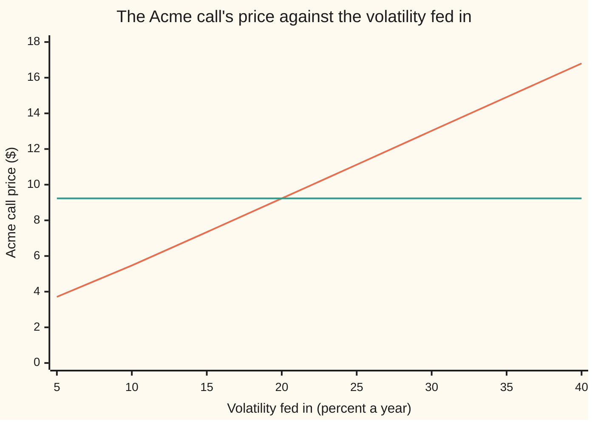
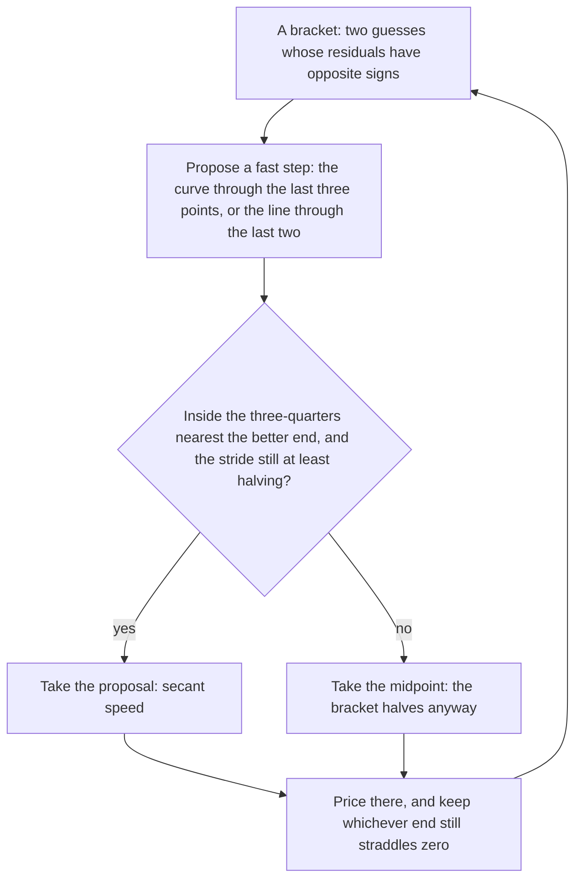

# Solving backwards: bisection, Newton and Brent for any inverse problem

[Syllabus](../../../SYLLABUS.md) → [Financial mathematics](../../../SYLLABUS.md#w12) → [Greeks by Numbers and Calibration](../../../SYLLABUS.md#w12-s07) → Solving backwards

---

## General Overview

A screen quotes the one-year Acme call at $9.23. Acme's shares are at $100, the strike is $100, cash in the bank earns 5 percent a year, and the shares pay a 2 percent dividend yield.

Every pricer on this shelf runs one way. Feed it a volatility — a number for how jumpy the share is taken to be — and it hands back a price. Nobody trades in that direction. The price is on the screen; the volatility is the thing nobody can see. The pricer has to be run backwards.

It cannot be rearranged. In the Black–Scholes call price the volatility sits inside two bell-curve areas and inside a division, and no algebra pulls it out ([Black–Scholes call](../08-The%20Black-Scholes%20call%20and%20put/01-black-scholes-call.md)). There is no formula for the answer. There is only a search.

Guess a volatility, price it, compare with the screen, guess again. The craft is all in "guess again". Three ways to do it. Halve a range known to hold the answer: **bisection**. Use the slope of the price curve to aim: **Newton's method**. Do both, and let the range referee the aim: **Brent's method**. Given the exact quote 9.227005508154, Newton returns 20.000 percent in five trips through the pricer. Bisection needs 41, Brent 8. One step here means one trip through the pricer, the honest unit of cost.

**Subtract the quote, and every inverse problem becomes the same problem: find where one curve crosses zero, inside a range known to contain the crossing.**

**What kind of fact this is:** a method — three of them — with bisection's and Newton's guarantees proved on this card in Why it works, and Brent's taken from the paper cited below.

### The picture: one quote, one volatility



The climbing line is the price as the volatility runs from 5 to 40 percent. The flat line is the quote, $9.23. They meet once, at 20 percent. Once is the whole point: a curve that only climbs crosses a level exactly once, so the answer exists and there is one of it.

---

## The formula

Notation first, in words. A **residual** is what you have minus what you wanted: the model's price at the current guess, minus the price on the screen. Write $g$ for the model run forwards, $x$ for the input hunted, $y_*$ for the quoted number. The residual is a function of the guess alone:

$$f(x) = g(x) - y_*$$

**Read it aloud:** the residual is the model's answer minus the number on the screen, and the input that drives it to zero is the answer.

A **bracket** is a pair of guesses, a low end $\ell$ and a high end $u$, whose residuals have opposite signs: one prices too cheap, the other too dear. Bisection tests the middle, $m$, and keeps the half that still straddles zero:

$$m = \frac{\ell + u}{2}$$

Newton ignores the bracket and trusts the slope. From the guess $x_n$ it follows the tangent line of the residual down to the axis:

$$x_{n+1} = x_n - \frac{f(x_n)}{f'(x_n)}$$

The slope $f'$ is the model's own, since subtracting a fixed quote changes no slope. Here it is **vega**: the dollars the call gains per 1.00 of volatility. Where no formula for the slope exists, the last two points stand in — the **secant** step, a line through them instead of a tangent:

$$x_{n+1} = x_n - f(x_n)\,\frac{x_n - x_{n-1}}{f(x_n) - f(x_{n-1})}$$

Brent's method proposes a fast step — the secant, or the curve through the last three points — and accepts it only if it lands well inside the bracket and its stride is still shrinking. Otherwise it takes $m$, and the bracket halves anyway.

Last, the rule that turns a leftover residual into an accuracy. It is the formula people skip:

$$|x_n - x_*| \;\le\; \frac{|f(x_n)|}{\min |f'|}$$

Here $x_*$ is the true answer. In words: **the distance from it is at most the leftover residual divided by the flattest the slope gets in between.** Dollars on top, dollars per unit of input underneath, input units out. A solver can stop in either unit — bisection and Brent on a bracket narrower than a width $\delta$ in the input's own units, Newton on a residual under so many dollars — and this inequality is the only bridge between the two.

| Symbol | Plain meaning | In our example | Push it up and the answer… |
| --- | --- | --- | --- |
| $g(x)$ | the model run forwards: input in, number out | the Black–Scholes call price | — |
| $x$, $x_n$ | the input hunted, and the guess after each step | volatility; 1.00, then 0.140197963021, then 0.200338956973 | — |
| $y_*$ | the quoted number the model has to reproduce | $9.227005508154 | rises: so does the volatility explaining it |
| $x_*$ | the true answer: the input whose residual is zero | 0.20 | — |
| $f(x)$ | the residual: the model's price at $x$, minus the quote | zero at 0.20 | — |
| $f'(x)$ | the residual's slope, which is the model's own | vega, $37.90 per 1.00 of volatility | rises: the same residual leaves a smaller error |
| $\ell$, $u$ | the bracket's low and high ends | 0.01 and 1.00 | wider: more steps, same answer |
| $m$ | the midpoint of the range still in play | the fallback when a clever step is refused | — |
| $\delta$ | the stopping width, in the input's own units | 0.000000000001 of volatility for the bracket; Newton instead stops at a residual under $0.000000000001 | tighter: more steps |
| $\sigma$ | volatility, the unknown here. Say "sigma". | 0.20, quoted as 20 percent | rises: the call costs more |
| $C(\sigma)$ | the Acme call's price at volatility $\sigma$ | $9.23 | — |
| $K$ | the strike, the price the call may buy at | 100 at the money, 200 on the wing | — |

### When it holds

- **The output moves continuously with the input.** A sign change then guarantees a crossing between the ends ([Intermediate value theorem](../../06-Calculus%20and%20analysis/01-Limits%20and%20Continuity/06-intermediate-value-theorem.md)). Where the output jumps — a barrier that knocks out — a sign change can straddle the jump instead of a root, and the solver converges neatly onto a cliff.
- **The output moves one way only.** The Acme call's price strictly rises with volatility, so at most one volatility fits a price. Where a model is not one-way, two inputs can fit one quote and the solver returns whichever its bracket held; base correlation is the standing example ([Implied correlation](../45-Portfolio%20Credit%20-%20Correlation%2C%20Copulas%2C%20Indices%20and%20Tranches/06-implied-and-base-correlation.md)).
- **A bracket whose ends straddle the quote.** Check both signs first. Without opposite signs nothing is trapped: the run below shows bisection walking to the end of a bad bracket and reporting 0.100000000000 with a straight face.
- **A quote inside the model's range.** The Acme call runs from $2.896924880604 at zero volatility up towards $98.019867330676 as the volatility runs away. A quote of $2.50 has no volatility behind it, and the honest answer is to reject the quote.
- **A slope that has not gone flat where you stop.** Newton divides by it, and every solver's accuracy is read through it. Flat slope, worthless residual — Step 6 puts a number on that.

---

## Why it works

### Step 0: subtract the quote, and these problems are one problem

Implied volatility from a call price. A yield from a bond price. A hazard rate from a credit spread. Each looks like its own puzzle; each is the same three lines. Write the model as a function of the one unknown, subtract the quoted number, hunt the zero of what is left. Nothing below knows it is pricing an option, which is why the code solves a bond yield with the identical routines.

### Step 1: opposite signs trap a crossing

At 1 percent volatility the Acme call is worth $2.90 — under the quote. At 100 percent the residual is +$29.22 — well over. The price moves continuously in between, so somewhere it is exactly $9.227005508154. That is all the intermediate value theorem says, and it is bisection's entire guarantee: no formula, no slope, just a sign change.

Uniqueness is a separate claim and needs the slope. Vega is the share price, shrunk for dividends, times the height of the bell curve at the point the pricer already computes, times the square root of the years left. A height is always positive. So the price strictly climbs, and it meets $9.227005508154 once.

### Step 2: halving cannot fail, and cannot hurry

Each test throws away half the range. From the bracket 0.01 to 1.00 the width starts at 0.99 and halves every trip. Forty halvings bring it under 0.000000000001; counting the first end, 41 trips, and the answer comes out 0.200000000000.

Bisection needs no slope and no luck, only the bracket, and it cannot overshoot, because it never leaves it. Its cost is equally fixed: one binary digit per trip, whatever the function looks like. It is the floor under every other method, and the fallback inside Brent.

### Step 3: the slope says how far to move

Newton's step is a unit conversion, nothing cleverer. At a guess of 0.140197963021 the residual is −$2.258761723900: the price is that much too cheap. The slope there is $37.557771754090 per 1.00 of volatility. Dollars divided by dollars-per-unit gives units: 2.258761723900 / 37.557771754090 is 0.060140993952 of volatility to add, landing at 0.200338956973. The pump gives 37.56 litres a minute and the tank is 2.26 litres short, so run it 0.06 of a minute.

Then the reason to bother. The error squares at every step. The guesses run 1.00, then 0.140197963021, then 0.200338956973, then 0.200000003565, then 0.200000000000: no correct digits, then three, then eight, then all of them. The tangent misses the true curve only by the curve's bend, and that miss grows with the *square* of the distance, so each step roughly doubles the digits.

<details>
<summary>Detailed proof: existence, the halving bound, and why Newton squares its error</summary>

**Existence.** Let the residual be continuous on the closed bracket from $\ell$ to $u$, with opposite signs at the two ends. The intermediate value theorem gives a point between them where the residual is zero. That is the only fact bisection needs, and it survives any ugliness short of a jump.

**Uniqueness, for this problem.** Vega is $S e^{-qT}\varphi(d_1)\sqrt{T}$: the share price, shrunk for the dividend yield, times the bell curve's height at the usual distance-to-strike, times the square root of the years left. A height is strictly positive at every finite argument, so the call price strictly increases with volatility and meets each attainable price once.

**The halving bound.** Each test replaces the bracket by a half that still straddles zero, so the width after several tests is the starting width divided by two once per test:
$$w_t = \frac{w_0}{2^{\,t}}, \qquad w_t \le \delta \iff t \ge \log_2\!\left(\frac{w_0}{\delta}\right).$$
Width 0.99 and stopping width 0.000000000001 give 40 tests, a count that does not depend on the function at all.

**Newton's squaring.** Suppose the residual has two derivatives near the answer. Taylor's theorem with remainder, expanded at the guess and evaluated at the answer, gives
$$0 = f(x_n) + f'(x_n)\,(x_* - x_n) + \tfrac12 f''(\xi)\,(x_* - x_n)^2$$
for some point between the two. Divide by the slope at the guess and substitute the Newton update:
$$x_{n+1} - x_* = \frac{f''(\xi)}{2 f'(x_n)}\,(x_n - x_*)^2 ,\qquad\text{hence}\qquad e_{n+1} \le \frac{\max |f''|}{2 \min |f'|}\; e_n^2 .$$
The next error is the old one squared, times the bend over twice the slope. Near the answer that collapses the error and the digits double. Far away, or wherever the slope's lower bound is near zero, the inequality says nothing at all — and Step 4 shows what nothing looks like.

**Residual to answer.** The mean value theorem gives $f(x_n) - f(x_*) = f'(\xi)(x_n - x_*)$ for some point in between, and the residual at the answer is zero. Divide by that intermediate slope, then replace it with the flattest slope on the bracket, and the inequality in The formula falls out. Where the slope can be zero, there is no bound at all.

</details>

### Step 4: the slope is also how Newton dies

Start Newton at a volatility of 1 percent. The call there is worth $2.90, so the residual is about minus six and a third dollars — and the slope is only $0.43 per 1.00 of volatility, about a ninetieth of its size at the answer, because at 1 percent the option's fate is already settled and more jumpiness barely moves the price. Newton divides the one by the other and takes a huge stride: the first step lands at 14.801246082628, a volatility of 1,480 percent.

Out there it is worse. Vega is $0.000000000049 per 1.00 of volatility. Dividing the leftover residual by that throws the next guess to a negative number of order 10^12. A negative volatility is not a poorer answer; it is not an answer.

Nothing in Newton's step remembers that the answer was ever trapped between two prices. That is the flaw, and it is not exotic: it is what happens on far-from-the-money options, on long-dated ones, and on any quote near the edge of a model's range.

### Step 5: Brent keeps the trap and the speed

Brent's method holds a bracket at all times and proposes its fast step inside it.

The proposal comes from **inverse quadratic interpolation**: fit a curve through the three most recent points, reading the *input as a function of the residual* rather than the usual way round, and ask where that curve reads zero. Reading it backwards is the trick: the thing solved for is an input. With two usable points the same idea flattens into the secant.

Then the guards. The proposal is accepted only if it lands in the three-quarters of the bracket nearest the better of the two ends, and only if its stride is at least halving the previous one. Fail either test and the midpoint is taken, which halves the bracket. So the usual case is secant-fast, the bracket never widens, and the worst case cannot run away: Brent's paper bounds the pathological case at roughly the square of bisection's count of halvings.

On the Acme quote Brent takes 8 trips and never falls back to the midpoint. On the flat $K = 200$ wing the same routine falls back 5 times: the net earns its keep exactly where unguarded Newton dies.



One guarded step. The loop stops when the bracket is narrower than the stopping width.

### Step 6: what a small residual is actually worth

The stopping test is in dollars. The answer is in volatility. The exchange rate is the slope, and the slope is not a constant.

At the money the flattest vega between 10 and 40 percent volatility is $36.781009021915, so one cent of leftover residual leaves the volatility wrong by at most 0.000271879436 — under three hundredths of a volatility point.

Out on the $K = 200$ wing the call is worth $0.003259459731 and vega is $0.222184525705. Feed the same solver a quote one cent higher and it returns 0.223852158829: 2.385215882902 volatility points away. Same solver, same tolerance, and the error is now whole volatility points instead of hundredths of one. The residual never mentioned it; the slope did.

One more comparison settles how many digits are worth printing. The screen shows $9.23, not 9.227005508154. Invert the rounded number and the answer is 0.200079007731 — 0.007900773104 volatility points from the truth, larger than anything the solver's last eight digits could fix.

### The other door

The search can sometimes be shortened rather than run. Transform the price first — divide out the discounting, reshape the strike into log-moneyness, take the starting guess from a rational function fitted to that shape — and two steps of a higher-order relative of Newton reach the limit of double-precision arithmetic. That is Jäckel's route, cited below, and it is what fast libraries do. Still a residual and still a slope; only the guess and the step order change.

---

## Worked numbers, by hand

The shelf's market: Acme at $100, strike $100, 5 percent cash rate, 2 percent dividend yield, one year. At a volatility of 0.20 the call is worth $9.227005508154, the number this shelf is checked against. Hand that price back and ask which volatility made it. Newton, from a know-nothing 1.00:

| Step | Arithmetic | Value |
| --- | --- | --- |
| 1 | at 1.00 the residual is 29.216351838119 and the slope 33.980324053162; move by their ratio | 0.140197963021 |
| 2 | residual −2.258761723900, slope 37.557771754090 | 0.200338956973 |
| 3 | residual 0.012846997209, slope 37.901956237115 | 0.200000003565 |
| 4 | residual 0.000000135127, slope 37.901157518463 | 0.200000000000 |
| 5 | residual now under 10^-12 dollars, so stop | **0.200000000000** |
| the same answer with no slope at all | 41 trips: the first end, then forty halvings of 0.01 to 1.00 | **0.200000000000** |
| the same answer, guarded | Brent, 8 trips, no midpoint fallbacks | **0.200000000000** |
| a cross-check on the pricer itself | the shelf's delta, $e^{-qT}N(d_1)$ | 0.586851146135 |

The market's $9.23 is the price of 20.000 percent volatility. That number, not the dollar price, is what a desk quotes and compares across strikes; the dollars are its packaging.

The last row is the shelf's house number, delta 0.5869, reproduced by this card's pricer: the thing being inverted is the thing the neighbouring cards differentiate ([Bump and revalue](01-bump-and-revalue-and-common-random-numbers.md)).

### The cost of each route

```
steps to pin sigma to 12 decimals, one block = one step
  bisection  █████████████████████████████████████████  41
  brent      ████████                                    8
  newton     █████                                       5
```

Newton is cheapest and the only one that can fail with a sound bracket in hand. Bisection always arrives and costs eight times as much. Brent costs three trips more than Newton and cannot leave the bracket, which is why production code reaches for it, or for Newton with a bracket bolted on.

### What breaks if you drop a piece

| Mistake | Comes out at | What went wrong |
| --- | --- | --- |
| Read a one-cent price error on the $K = 200$ wing as a good answer | 0.223852158829, which is 2.385215882902 volatility points out | The slope there is $0.222184525705 per 1.00 of volatility, not $37.90 |
| Run Newton from 0.01 with no bracket | 14.801246082628, then a negative number of order 10^12 | Vega there is $0.000000000049; dividing by it is a leap into nothing |
| Bisect on 0.01 to 0.10, where both ends price under the quote | 0.100000000000 | No sign change, so nothing was trapped; the loop walked to the end |
| Invert a quote of $2.50, below the $2.896924880604 floor | no sign change | No volatility produces that price. The quote is wrong, not the solver |

Every number in that table is printed by the code below.

---

## Code, from first principles, and it actually runs

Nothing is imported that already knows an answer: the bell-curve area is built from thin slices under the curve, Simpson's rule written out, and the three solvers are written out too. The volatility behind 9.227005508154 is reached **three independent ways** — halving, the slope, and the guarded hybrid — and the asserts compare each against 0.20, the volatility that made the quote, which no solver sees. The slope is checked a second way, by nudging the volatility. Then the same routines are pointed at a bond's yield, whose price is computed payment by payment and again by the annuity formula. A slip anywhere trips one of the twelve asserts.

### Python

```python
# Solving backwards -- the check behind the card.  Standard library only, and nothing
# imported that already knows an answer: the bell-curve area N(x) is built from thin
# slices (Simpson's rule), and bisection, Newton and Brent are written out here.  One
# step means one trip through the pricer.  Case one takes the Acme call quote
# 9.227005508154 back to a volatility of 0.20 by three solvers; case two runs the same
# three on a bond yield, whose price is reached by two independent formulas.
from math import log, log10, sqrt, exp, pi

S, K, R, Q, T = 100.0, 100.0, 0.05, 0.02, 1.0        # the house market
def phi(x): return exp(-0.5 * x * x) / sqrt(2.0 * pi)          # bell-curve height at x
def N(x):                                            # bell-curve area to the left of x
    if x < 0.0: return 1.0 - N(-x)
    if x > 8.0: return 1.0
    s, h = phi(0.0) + phi(x), x / 1000.0             # Simpson's rule, written out
    for i in range(1, 1000): s += (4.0 if i % 2 else 2.0) * phi(i * h)
    return 0.5 + s * h / 3.0
def d1_of(sig, k): return (log(S / k) + (R - Q + 0.5 * sig * sig) * T) / (sig * sqrt(T))
def price(sig, k=K):                                 # the call price at volatility sig
    d1 = d1_of(sig, k)
    return S * exp(-Q * T) * N(d1) - k * exp(-R * T) * N(d1 - sig * sqrt(T))
def vega(sig, k=K): return S * exp(-Q * T) * phi(d1_of(sig, k)) * sqrt(T)   # dC/dsig

def bisect(f, lo, hi, tol):                          # halve the bracket, no slope needed
    flo, n = f(lo), 1
    while hi - lo > tol:
        mid = 0.5 * (lo + hi); fm = f(mid); n += 1
        if (fm > 0.0) == (flo > 0.0): lo, flo = mid, fm
        else: hi = mid
    return 0.5 * (lo + hi), n
def newton(f, fp, x0, tol, cap=30):                  # slide down the tangent line
    x, rows = x0, []
    for n in range(1, cap + 1):
        fx, sl = f(x), fp(x); rows.append((n, x, fx, sl))
        if abs(fx) < tol: return x, rows, "converged after %d steps" % n
        if sl == 0.0: return x, rows, "the slope vanished"
        x -= fx / sl
        if x <= 0.0: return x, rows, "left the region after %d steps" % n
    return x, rows, "hit the step cap"
def brent(f, lo, hi, tol):                           # a fast step with a midpoint net
    a, b = lo, hi; fa, fb = f(a), f(b); n, mid = 2, 0
    if (fa > 0.0) == (fb > 0.0): return b, n, mid, "no sign change"
    if abs(fa) < abs(fb): a, b, fa, fb = b, a, fb, fa
    c, fc, d, wide = a, fa, a, True
    while abs(b - a) > tol and fb != 0.0:
        if fa != fc and fb != fc:                    # inverse quadratic, three points
            s = (a * fb * fc / ((fa - fb) * (fa - fc)) + b * fa * fc / ((fb - fa) * (fb - fc))
                 + c * fa * fb / ((fc - fa) * (fc - fb)))
        else: s = b - fb * (b - a) / (fb - fa)       # secant, two points
        edge = (3.0 * a + b) / 4.0
        stalled = abs(s - b) >= 0.5 * (abs(b - c) if wide else abs(c - d))
        if not (min(edge, b) < s < max(edge, b)) or stalled:
            s, wide, mid = 0.5 * (a + b), True, mid + 1
        else: wide = False
        fs = f(s); n += 1; d, c, fc = c, b, fb
        if (fa > 0.0) != (fs > 0.0): b, fb = s, fs
        else: a, fa = s, fs
        if abs(fa) < abs(fb): a, b, fa, fb = b, a, fb, fa
    return b, n, mid, "converged after %d steps" % n

CF = [4.0, 4.0, 4.0, 4.0, 104.0]                     # 4% annual coupon, 100 face, 5 years
def dfac(y, k):                                      # discount factor, one divide per year
    v = 1.0
    for _ in range(k): v /= 1.0 + y
    return v
def bond(y): return sum(c * dfac(y, i + 1) for i, c in enumerate(CF))    # payment by payment
def bond_annuity(y): return 4.0 * (1.0 - dfac(y, 5)) / y + 100.0 * dfac(y, 5)  # annuity form
def bond_slope(y): return -sum((i + 1) * c * dfac(y, i + 2) for i, c in enumerate(CF))
def row(name, v): print(f"{name:<48}{v:>18.12f}")
def txt(name, v): print(f"{name:<48}{v:>18}")

QUOTE = price(0.20)
f = lambda x: price(x) - QUOTE
vfloor = min(vega(0.10 + 0.0001 * i) for i in range(3001))
row("the quote: Acme call at sigma = 0.20", QUOTE)
row("the shelf's delta, e^-qT N(d1)", exp(-Q * T) * N(d1_of(0.20, K)))
row("vega at sigma = 0.20, dollars per 1.00 of vol", vega(0.20))
row("  the same slope by bumping sigma", (price(0.2001) - price(0.1999)) / 0.0002)
row("  smallest vega on [0.10, 0.40]", vfloor)
row("price floor, sigma -> 0: S e^-qT - K e^-rT", S * exp(-Q * T) - K * exp(-R * T))
row("  price at sigma = 0.01", price(0.01))
row("  vega at sigma = 0.01", vega(0.01))
row("price ceiling, sigma -> infinity: S e^-qT", S * exp(-Q * T))
sigs = [0.05 * i for i in range(1, 9)]
print(f"{'chart, volatility in percent':<32}" + "".join(f"{100.0 * x:>7.0f}" for x in sigs))
print(f"{'chart, Acme call price ($)':<32}" + "".join(f"{price(x):>7.2f}" for x in sigs))
print(f"{'chart, the quote ($)':<32}" + "".join(f"{QUOTE:>7.2f}" for x in sigs))
print("newton from sigma = 1.00:  step, sigma, residual ($), vega ($)")
sig_n, nrows, nstatus = newton(f, vega, 1.00, 1e-12)
for n, x, fx, sl in nrows: print(f"  {n:>2}{x:>18.12f}{fx:>18.12f}{sl:>18.12f}")
txt("  newton", nstatus)
sig_b, steps_b = bisect(f, 0.01, 1.00, 1e-12)
row("bisection on [0.01, 1.00], root", sig_b)
txt("  steps", steps_b)
sig_r, steps_r, mids, rstatus = brent(f, 0.01, 1.00, 1e-12)
row("brent on [0.01, 1.00], root", sig_r)
txt("  steps", steps_r)
row("gap between the newton and bisection roots", abs(sig_n - sig_b))
row("residual at the newton root, dollars", abs(f(sig_n)))
row("  that residual divided by the smallest vega", abs(f(sig_n)) / vfloor)
row("  one cent of residual, in volatility", 0.01 / vfloor)
print("steps to pin sigma to 12 decimals, one block = one step")
for label, count in (("bisection", steps_b), ("brent", steps_r), ("newton", len(nrows))):
    print(f"  {label:<11}{chr(9608) * count:<42}{count:>3}")
sig_round = brent(lambda x: price(x) - 9.23, 0.01, 1.00, 1e-12)[0]
row("quote rounded to 9.23: sigma", sig_round)
row("  volatility points away from 20.000", 100.0 * abs(sig_round - 0.20))
row("wing K = 200: price at sigma = 0.20", price(0.20, 200.0))
row("  vega there", vega(0.20, 200.0))
wing = brent(lambda x: price(x, 200.0) - (price(0.20, 200.0) + 0.01), 0.01, 1.00, 1e-12)
row("  sigma from a quote one cent higher", wing[0])
row("  volatility points away from 20.000", 100.0 * abs(wing[0] - 0.20))
txt("midpoint fallbacks: at the money, then on the wing", "%d and %d" % (mids, wing[2]))
wrows = newton(f, vega, 0.01, 1e-12)[1]
row("no bracket, newton from 0.01: sigma after 1 step", wrows[1][1])
row("  vega there", wrows[1][3])
txt("  next step proposes minus a sigma of order 10^", int(log10(abs(wrows[1][1] - wrows[1][2] / wrows[1][3]))))
row("bisection on [0.01, 0.10], both ends low", bisect(f, 0.01, 0.10, 1e-12)[0])
txt("quote 2.50, below the floor: brent reports", brent(lambda x: price(x) - 2.50, 0.01, 1.00, 1e-12)[3])
print("bond: 4% annual coupon, 100 face, 5 years, quoted 96.00")
y_b = bisect(lambda y: bond(y) - 96.00, 0.001, 0.50, 1e-14)[0]
y_n = newton(lambda y: bond(y) - 96.00, bond_slope, 0.10, 1e-12)[0]
y_r = brent(lambda y: bond(y) - 96.00, 0.001, 0.50, 1e-14)[0]
row("  yield by bisection", y_b)
row("  yield by newton", y_n)
row("  yield by brent", y_r)
row("  price at that yield, payment by payment", bond(y_n))
row("  the same price by the annuity formula", bond_annuity(y_n))
assert abs(QUOTE - 9.227005508154) < 1e-9, "the pricer must reproduce the shelf's quote"
assert abs(exp(-Q * T) * N(d1_of(0.20, K)) - 0.586851) < 1e-6, "delta vs the shelf's number"
assert abs(vega(0.20) - (price(0.2001) - price(0.1999)) / 0.0002) < 1e-6, "vega vs a bump"
assert abs(sig_b - 0.20) < 1e-11 and abs(sig_r - 0.20) < 1e-11, "bisection and brent find 0.20"
assert abs(sig_n - 0.20) < 1e-14 and abs(sig_n - sig_b) < 1e-11, "newton agrees with bisection"
assert abs(sig_n - 0.20) <= abs(f(sig_n)) / vfloor + 1e-16, "the residual bound holds"
assert abs(nrows[3][1] - 0.20) <= abs(nrows[3][2]) / vfloor, "and it bites at step 4"
assert all(price(sigs[i]) < price(sigs[i + 1]) for i in range(7)), "the price climbs with vol"
assert vfloor > 36.0 and abs(price(0.01) - (S * exp(-Q * T) - K * exp(-R * T))) < 1e-3
assert abs(y_n - y_b) < 1e-12 and abs(y_r - y_b) < 1e-12, "three solvers, one yield"
assert abs(bond(y_n) - bond_annuity(y_n)) < 1e-9, "two roads to the bond price"
assert abs(wing[0] - 0.20) > 100.0 * abs(sig_round - 0.20), "a flat slope hurts far more"
print("ALL CHECKS PASS")
```

**Ran 2026-09-19 on macOS, Python 3.14.6, standard library only. All checks passed. Output, pasted from the run:**

```
the quote: Acme call at sigma = 0.20                9.227005508154
the shelf's delta, e^-qT N(d1)                      0.586851146135
vega at sigma = 0.20, dollars per 1.00 of vol      37.901157510017
  the same slope by bumping sigma                  37.901157387843
  smallest vega on [0.10, 0.40]                    36.781009021915
price floor, sigma -> 0: S e^-qT - K e^-rT          2.896924880604
  price at sigma = 0.01                             2.897293886889
  vega at sigma = 0.01                              0.427936333822
price ceiling, sigma -> infinity: S e^-qT          98.019867330676
chart, volatility in percent          5     10     15     20     25     30     35     40
chart, Acme call price ($)         3.71   5.47   7.34   9.23  11.12  13.02  14.91  16.80
chart, the quote ($)               9.23   9.23   9.23   9.23   9.23   9.23   9.23   9.23
newton from sigma = 1.00:  step, sigma, residual ($), vega ($)
   1    1.000000000000   29.216351838119   33.980324053162
   2    0.140197963021   -2.258761723900   37.557771754090
   3    0.200338956973    0.012846997209   37.901956237115
   4    0.200000003565    0.000000135127   37.901157518463
   5    0.200000000000   -0.000000000000   37.901157510017
  newton                                        converged after 5 steps
bisection on [0.01, 1.00], root                     0.200000000000
  steps                                                         41
brent on [0.01, 1.00], root                         0.200000000000
  steps                                                          8
gap between the newton and bisection roots          0.000000000000
residual at the newton root, dollars                0.000000000000
  that residual divided by the smallest vega        0.000000000000
  one cent of residual, in volatility               0.000271879436
steps to pin sigma to 12 decimals, one block = one step
  bisection  █████████████████████████████████████████  41
  brent      ████████                                    8
  newton     █████                                       5
quote rounded to 9.23: sigma                        0.200079007731
  volatility points away from 20.000                0.007900773104
wing K = 200: price at sigma = 0.20                 0.003259459731
  vega there                                        0.222184525705
  sigma from a quote one cent higher                0.223852158829
  volatility points away from 20.000                2.385215882902
midpoint fallbacks: at the money, then on the wing           0 and 5
no bracket, newton from 0.01: sigma after 1 step   14.801246082628
  vega there                                        0.000000000049
  next step proposes minus a sigma of order 10^                 12
bisection on [0.01, 0.10], both ends low            0.100000000000
quote 2.50, below the floor: brent reports          no sign change
bond: 4% annual coupon, 100 face, 5 years, quoted 96.00
  yield by bisection                                0.049219056114
  yield by newton                                   0.049219056114
  yield by brent                                    0.049219056114
  price at that yield, payment by payment          96.000000000000
  the same price by the annuity formula            96.000000000000
ALL CHECKS PASS
```

### Rust

Same inputs, same labels, same arithmetic, built with `rustc --edition 2021 -O`. No crates.

```rust
// Solving backwards -- the same check as the Python, in Rust.  Std only, no crates, and
// nothing borrowed that already knows an answer: the bell-curve area N(x) is built from
// thin slices (Simpson's rule), and bisection, Newton and Brent are written out here.  One
// step means one trip through the pricer.  Case one takes the Acme call quote
// 9.227005508154 back to 0.20 three ways; case two runs the same three on a bond yield.
use std::f64::consts::PI;

const S: f64 = 100.0; const K: f64 = 100.0; const R: f64 = 0.05;     // the house market
const Q: f64 = 0.02; const T: f64 = 1.0;
const CF: [f64; 5] = [4.0, 4.0, 4.0, 4.0, 104.0];    // 4% annual coupon, 100 face, 5 years

fn phi(x: f64) -> f64 { (-0.5 * x * x).exp() / (2.0 * PI).sqrt() }   // bell-curve height
fn n_cdf(x: f64) -> f64 {                            // bell-curve area to the left of x
    if x < 0.0 { return 1.0 - n_cdf(-x); }
    if x > 8.0 { return 1.0; }
    let (mut s, h) = (phi(0.0) + phi(x), x / 1000.0); // Simpson's rule, written out
    for i in 1..1000 { s += (if i % 2 == 1 { 4.0 } else { 2.0 }) * phi(i as f64 * h); }
    0.5 + s * h / 3.0
}
fn d1_of(sig: f64, k: f64) -> f64 { ((S / k).ln() + (R - Q + 0.5 * sig * sig) * T) / (sig * T.sqrt()) }
fn price(sig: f64, k: f64) -> f64 {                  // the call price at volatility sig
    let d1 = d1_of(sig, k);
    S * (-Q * T).exp() * n_cdf(d1) - k * (-R * T).exp() * n_cdf(d1 - sig * T.sqrt())
}
fn vega(sig: f64, k: f64) -> f64 { S * (-Q * T).exp() * phi(d1_of(sig, k)) * T.sqrt() }  // dC/dsig

fn bisect<F: Fn(f64) -> f64>(f: &F, lo: f64, hi: f64, tol: f64) -> (f64, usize) {
    let (mut lo, mut hi) = (lo, hi);                 // halve the bracket, no slope needed
    let (mut flo, mut n) = (f(lo), 1usize);
    while hi - lo > tol {
        let mid = 0.5 * (lo + hi); let fm = f(mid); n += 1;
        if (fm > 0.0) == (flo > 0.0) { lo = mid; flo = fm; } else { hi = mid; }
    }
    (0.5 * (lo + hi), n)
}
type Rows = Vec<(usize, f64, f64, f64)>;
fn newton<F: Fn(f64) -> f64, G: Fn(f64) -> f64>(f: &F, fp: &G, x0: f64, tol: f64, cap: usize)
        -> (f64, Rows, String) {                     // slide down the tangent line
    let (mut x, mut rows): (f64, Rows) = (x0, Vec::new());
    for n in 1..=cap {
        let (fx, sl) = (f(x), fp(x)); rows.push((n, x, fx, sl));
        if fx.abs() < tol { return (x, rows, format!("converged after {} steps", n)); }
        if sl == 0.0 { return (x, rows, "the slope vanished".to_string()); }
        x -= fx / sl;
        if x <= 0.0 { return (x, rows, format!("left the region after {} steps", n)); }
    }
    (x, rows, "hit the step cap".to_string())
}
fn brent<F: Fn(f64) -> f64>(f: &F, lo: f64, hi: f64, tol: f64) -> (f64, usize, usize, String) {
    let (mut a, mut b) = (lo, hi);                   // a fast step with a midpoint net
    let (mut fa, mut fb) = (f(a), f(b)); let (mut n, mut mid) = (2usize, 0usize);
    if (fa > 0.0) == (fb > 0.0) { return (b, n, mid, "no sign change".to_string()); }
    if fa.abs() < fb.abs() { (a, b, fa, fb) = (b, a, fb, fa); }
    let (mut c, mut fc, mut d, mut wide) = (a, fa, a, true);
    while (b - a).abs() > tol && fb != 0.0 {
        let mut s = if fa != fc && fb != fc {        // inverse quadratic, three points
            a * fb * fc / ((fa - fb) * (fa - fc)) + b * fa * fc / ((fb - fa) * (fb - fc))
                + c * fa * fb / ((fc - fa) * (fc - fb))
        } else { b - fb * (b - a) / (fb - fa) };     // secant, two points
        let edge = (3.0 * a + b) / 4.0;
        let stalled = (s - b).abs() >= 0.5 * (if wide { (b - c).abs() } else { (c - d).abs() });
        if !(edge.min(b) < s && s < edge.max(b)) || stalled {
            s = 0.5 * (a + b); wide = true; mid += 1;
        } else { wide = false; }
        let fs = f(s); n += 1; (d, c, fc) = (c, b, fb);
        if (fa > 0.0) != (fs > 0.0) { b = s; fb = fs; } else { a = s; fa = fs; }
        if fa.abs() < fb.abs() { (a, b, fa, fb) = (b, a, fb, fa); }
    }
    (b, n, mid, format!("converged after {} steps", n))
}

fn dfac(y: f64, k: usize) -> f64 {                   // discount factor, one divide per year
    let mut v = 1.0;
    for _ in 0..k { v /= 1.0 + y; }
    v
}
fn bond(y: f64) -> f64 {                             // road one: payment by payment
    let mut s = 0.0;
    for (i, c) in CF.iter().enumerate() { s += c * dfac(y, i + 1); }
    s
}
fn bond_annuity(y: f64) -> f64 { 4.0 * (1.0 - dfac(y, 5)) / y + 100.0 * dfac(y, 5) }  // annuity form
fn bond_slope(y: f64) -> f64 {
    let mut s = 0.0;
    for (i, c) in CF.iter().enumerate() { s += (i + 1) as f64 * c * dfac(y, i + 2); }
    -s
}
fn row(name: &str, v: f64) { println!("{:<48}{:>18.12}", name, v); }
fn txt(name: &str, v: &str) { println!("{:<48}{:>18}", name, v); }

fn main() {
    let quote = price(0.20, K);
    let f = |x: f64| price(x, K) - quote;
    let mut vfloor = f64::INFINITY;
    for i in 0..3001 { let v = vega(0.10 + 0.0001 * i as f64, K); if v < vfloor { vfloor = v; } }
    row("the quote: Acme call at sigma = 0.20", quote);
    row("the shelf's delta, e^-qT N(d1)", (-Q * T).exp() * n_cdf(d1_of(0.20, K)));
    row("vega at sigma = 0.20, dollars per 1.00 of vol", vega(0.20, K));
    row("  the same slope by bumping sigma", (price(0.2001, K) - price(0.1999, K)) / 0.0002);
    row("  smallest vega on [0.10, 0.40]", vfloor);
    row("price floor, sigma -> 0: S e^-qT - K e^-rT", S * (-Q * T).exp() - K * (-R * T).exp());
    row("  price at sigma = 0.01", price(0.01, K));
    row("  vega at sigma = 0.01", vega(0.01, K));
    row("price ceiling, sigma -> infinity: S e^-qT", S * (-Q * T).exp());
    let sigs: Vec<f64> = (1..9).map(|i| 0.05 * i as f64).collect();
    let mut l1 = format!("{:<32}", "chart, volatility in percent");
    let mut l2 = format!("{:<32}", "chart, Acme call price ($)");
    let mut l3 = format!("{:<32}", "chart, the quote ($)");
    for x in &sigs { l1 += &format!("{:>7.0}", 100.0 * x); l3 += &format!("{:>7.2}", quote);
                     l2 += &format!("{:>7.2}", price(*x, K)); }
    println!("{}\n{}\n{}", l1, l2, l3);
    println!("newton from sigma = 1.00:  step, sigma, residual ($), vega ($)");
    let (sig_n, nrows, nstatus) = newton(&f, &|x| vega(x, K), 1.00, 1e-12, 30);
    for (n, x, fx, sl) in &nrows { println!("  {:>2}{:>18.12}{:>18.12}{:>18.12}", n, x, fx, sl); }
    txt("  newton", &nstatus);
    let (sig_b, steps_b) = bisect(&f, 0.01, 1.00, 1e-12);
    row("bisection on [0.01, 1.00], root", sig_b);
    txt("  steps", &format!("{}", steps_b));
    let (sig_r, steps_r, mids, _) = brent(&f, 0.01, 1.00, 1e-12);
    row("brent on [0.01, 1.00], root", sig_r);
    txt("  steps", &format!("{}", steps_r));
    row("gap between the newton and bisection roots", (sig_n - sig_b).abs());
    row("residual at the newton root, dollars", f(sig_n).abs());
    row("  that residual divided by the smallest vega", f(sig_n).abs() / vfloor);
    row("  one cent of residual, in volatility", 0.01 / vfloor);
    println!("steps to pin sigma to 12 decimals, one block = one step");
    for (label, count) in [("bisection", steps_b), ("brent", steps_r), ("newton", nrows.len())] {
        println!("  {:<11}{:<42}{:>3}", label, "\u{2588}".repeat(count), count);
    }
    let sig_round = brent(&|x| price(x, K) - 9.23, 0.01, 1.00, 1e-12).0;
    row("quote rounded to 9.23: sigma", sig_round);
    row("  volatility points away from 20.000", 100.0 * (sig_round - 0.20).abs());
    row("wing K = 200: price at sigma = 0.20", price(0.20, 200.0));
    row("  vega there", vega(0.20, 200.0));
    let target = price(0.20, 200.0) + 0.01;
    let wing = brent(&|x| price(x, 200.0) - target, 0.01, 1.00, 1e-12);
    row("  sigma from a quote one cent higher", wing.0);
    row("  volatility points away from 20.000", 100.0 * (wing.0 - 0.20).abs());
    txt("midpoint fallbacks: at the money, then on the wing", &format!("{} and {}", mids, wing.2));
    let wrows = newton(&f, &|x| vega(x, K), 0.01, 1e-12, 30).1;
    row("no bracket, newton from 0.01: sigma after 1 step", wrows[1].1);
    row("  vega there", wrows[1].3);
    txt("  next step proposes minus a sigma of order 10^",
        &format!("{}", (wrows[1].1 - wrows[1].2 / wrows[1].3).abs().log10() as i64));
    row("bisection on [0.01, 0.10], both ends low", bisect(&f, 0.01, 0.10, 1e-12).0);
    txt("quote 2.50, below the floor: brent reports", &brent(&|x| price(x, K) - 2.50, 0.01, 1.00, 1e-12).3);
    println!("bond: 4% annual coupon, 100 face, 5 years, quoted 96.00");
    let g = |y: f64| bond(y) - 96.00;
    let y_b = bisect(&g, 0.001, 0.50, 1e-14).0;
    let y_n = newton(&g, &bond_slope, 0.10, 1e-12, 30).0;
    let y_r = brent(&g, 0.001, 0.50, 1e-14).0;
    row("  yield by bisection", y_b);
    row("  yield by newton", y_n);
    row("  yield by brent", y_r);
    row("  price at that yield, payment by payment", bond(y_n));
    row("  the same price by the annuity formula", bond_annuity(y_n));
    assert!((quote - 9.227005508154).abs() < 1e-9, "the pricer must reproduce the shelf's quote");
    assert!(((-Q * T).exp() * n_cdf(d1_of(0.20, K)) - 0.586851).abs() < 1e-6, "delta vs the shelf's number");
    assert!((vega(0.20, K) - (price(0.2001, K) - price(0.1999, K)) / 0.0002).abs() < 1e-6, "vega vs a bump");
    assert!((sig_b - 0.20).abs() < 1e-11 && (sig_r - 0.20).abs() < 1e-11, "bisection and brent find 0.20");
    assert!((sig_n - 0.20).abs() < 1e-14 && (sig_n - sig_b).abs() < 1e-11, "newton agrees with bisection");
    assert!((sig_n - 0.20).abs() <= f(sig_n).abs() / vfloor + 1e-16, "the residual bound holds");
    assert!((nrows[3].1 - 0.20).abs() <= nrows[3].2.abs() / vfloor, "and it bites at step 4");
    assert!((0..7).all(|i| price(sigs[i], K) < price(sigs[i + 1], K)), "the price climbs with vol");
    assert!(vfloor > 36.0 && (price(0.01, K) - (S * (-Q * T).exp() - K * (-R * T).exp())).abs() < 1e-3);
    assert!((y_n - y_b).abs() < 1e-12 && (y_r - y_b).abs() < 1e-12, "three solvers, one yield");
    assert!((bond(y_n) - bond_annuity(y_n)).abs() < 1e-9, "two roads to the bond price");
    assert!((wing.0 - 0.20).abs() > 100.0 * (sig_round - 0.20).abs(), "a flat slope hurts far more");
    println!("ALL CHECKS PASS");
}
```

**Ran 2026-09-19 on macOS, rustc 1.98.1, no crates. All checks passed. Output, pasted from the run:**

```
the quote: Acme call at sigma = 0.20                9.227005508154
the shelf's delta, e^-qT N(d1)                      0.586851146135
vega at sigma = 0.20, dollars per 1.00 of vol      37.901157510017
  the same slope by bumping sigma                  37.901157387843
  smallest vega on [0.10, 0.40]                    36.781009021915
price floor, sigma -> 0: S e^-qT - K e^-rT          2.896924880604
  price at sigma = 0.01                             2.897293886889
  vega at sigma = 0.01                              0.427936333822
price ceiling, sigma -> infinity: S e^-qT          98.019867330676
chart, volatility in percent          5     10     15     20     25     30     35     40
chart, Acme call price ($)         3.71   5.47   7.34   9.23  11.12  13.02  14.91  16.80
chart, the quote ($)               9.23   9.23   9.23   9.23   9.23   9.23   9.23   9.23
newton from sigma = 1.00:  step, sigma, residual ($), vega ($)
   1    1.000000000000   29.216351838119   33.980324053162
   2    0.140197963021   -2.258761723900   37.557771754090
   3    0.200338956973    0.012846997209   37.901956237115
   4    0.200000003565    0.000000135127   37.901157518463
   5    0.200000000000   -0.000000000000   37.901157510017
  newton                                        converged after 5 steps
bisection on [0.01, 1.00], root                     0.200000000000
  steps                                                         41
brent on [0.01, 1.00], root                         0.200000000000
  steps                                                          8
gap between the newton and bisection roots          0.000000000000
residual at the newton root, dollars                0.000000000000
  that residual divided by the smallest vega        0.000000000000
  one cent of residual, in volatility               0.000271879436
steps to pin sigma to 12 decimals, one block = one step
  bisection  █████████████████████████████████████████  41
  brent      ████████                                    8
  newton     █████                                       5
quote rounded to 9.23: sigma                        0.200079007731
  volatility points away from 20.000                0.007900773104
wing K = 200: price at sigma = 0.20                 0.003259459731
  vega there                                        0.222184525705
  sigma from a quote one cent higher                0.223852158829
  volatility points away from 20.000                2.385215882902
midpoint fallbacks: at the money, then on the wing           0 and 5
no bracket, newton from 0.01: sigma after 1 step   14.801246082628
  vega there                                        0.000000000049
  next step proposes minus a sigma of order 10^                 12
bisection on [0.01, 0.10], both ends low            0.100000000000
quote 2.50, below the floor: brent reports          no sign change
bond: 4% annual coupon, 100 face, 5 years, quoted 96.00
  yield by bisection                                0.049219056114
  yield by newton                                   0.049219056114
  yield by brent                                    0.049219056114
  price at that yield, payment by payment          96.000000000000
  the same price by the annuity formula            96.000000000000
ALL CHECKS PASS
```

The two outputs match line for line, Newton's trace included: the point of running both is that a transcription slip shows up as a difference.

> [!TIP]
> **Try changing**
> Guess the direction first, then run it. The asserts are pinned to this market's numbers, so most of these stop the program on purpose.
> - **Start Newton where the slope has gone.** Change `newton(f, vega, 1.00, 1e-12)` to start at `0.01`. The run already prints the outcome lower down: one step to 14.801246082628, then a proposed volatility of order minus 10^12.
> - **Loosen bisection's stopping width.** Change `bisect(f, 0.01, 1.00, 1e-12)` to `1e-3`. It finishes in a quarter of the trips, the answer is right to about three decimals, and the assert comparing it with 0.20 stops the program.
> - **Take the slope's formula away.** Replace `vega` in the first Newton call with `lambda x: (f(x + 1e-5) - f(x - 1e-5)) / 2e-5`. Still five steps and still 0.200000000000, but the middle guesses and the vega column move in their last few digits, and the residual-bound assert, tight only when the slope is exact, stops the program. Newton needs a slope, not a formula for one.
> - **Blunt the pricer.** Change both `1000` values in `N` to `10`. The first assert stops the program: the model's own error is now larger than the tolerance the solver is chasing. No inverse is more accurate than the forward model it inverts.

---

## The usual mistake

> [!warning]
> **Believing that a small residual means a good answer.** It does not. The residual is in the model's output units, the answer is in its input units, and the exchange rate is the slope. On the $K = 200$ wing, one cent of price error is 2.385215882902 volatility points of answer error, and the residual looked excellent throughout. Divide the leftover residual by the flattest slope on the bracket, and report *that*.
>
> Four smaller traps, each of which has cost somebody real money:
> - **The tolerance in the wrong units.** "Within a cent" is a dollar test; "bracket under 0.000000000001" is a volatility test. They are related only through the slope.
> - **Newton with no bracket.** From 0.01 this card's Newton reaches a negative volatility of order 10^12 in two steps. A bracket costs one comparison per step and removes the failure mode.
> - **Assuming a bracket exists because the code returned something.** Bisection on 0.01 to 0.10 returns 0.100000000000, an endpoint dressed as an answer.
> - **Printing more digits than the quote carries.** The rounded $9.23 implies 0.200079007731, which is 0.007900773104 volatility points out. Twelve decimals from a two-decimal quote report the arithmetic, not the market.

---

## Where you meet it in real life

- **Every option screen.** The volatility column is this card, run once per quote, thousands of times a second. Desks argue about volatility, so the price is inverted before the conversation starts: [Solving for implied volatility](../11-Implied%20volatility%20and%20the%20vanilla%20inverses/02-implied-volatility-by-newton-and-bisection.md), and in currencies [Implied vol for a currency option](../21-FX%20vanilla%20options%20-%20Garman-Kohlhagen%20and%20the%20desk%20conventions/07-fx-implied-volatility.md).
- **A bond's yield.** The same routines, with cash flows instead of a bell curve: the code takes a 4 percent coupon bond quoted at 96.00 and returns 0.049219056114. The forward direction is [Yield from price](../01-Money%2C%20Dates%20and%20Discounting/07-yield-from-price.md).
- **Building a curve.** Each instrument in turn is inverted for the discount factor that makes it reprice, in date order: [Solving a swap backwards](../28-Swaps/07-swap-inverses-rate-and-curve-from-price.md), and for volatility by date [Caplet stripping](../29-Caps%2C%20Floors%20and%20Swaptions/03-caplet-stripping.md).
- **Credit and inflation.** A default probability from a spread, [Implied hazard from one CDS quote](../42-Credit%20Default%20Swaps%20-%20Pricing%2C%20the%20Par%20Spread%20and%20the%20Hazard%20Behind%20It/04-implied-hazard-from-a-cds-quote.md). An inflation rate from the gap between two bonds, [Breakeven inflation](../34-Inflation%20and%20Real%20Rates/03-breakeven-inflation.md).
- **Anywhere a spreadsheet says "goal seek".** Internal rates of return, break-even volumes, the rate that prices a lease. The button is a root finder, usually an unguarded secant, which is why it sometimes returns nonsense quietly.
- **Outside finance.** A burn time from a target orbit, a dose from a target blood concentration. The residual does not care what it measures.

> **Say it back**
> A model that runs forwards can be run backwards by subtracting the quote and hunting the zero of what is left. A pair of guesses whose residuals have opposite signs traps that zero, and halving the pair always finds it, slowly: 41 trips for twelve decimals. The slope finds it in five, by turning leftover dollars into units of the answer — and dies where the slope goes flat. Brent proposes the fast step and takes the midpoint whenever the proposal looks unsafe, keeping both. The number to report is never the residual: it is the residual divided by the flattest slope, which is why one cent means three hundredths of a volatility point at the money and nearly two and a half points out on the wing.

---

## What this builds on

- [Yield from price](../01-Money%2C%20Dates%20and%20Discounting/07-yield-from-price.md): the first inverse in the wing, and the second case the code solves. It sets up the residual-and-search shape this card generalises.
- [Newton's method](../../06-Calculus%20and%20analysis/03-What%20Derivatives%20Tell%20You/06-newtons-method.md): the tangent-line step and the squaring of the error. This card adds the bracket, the failure mode and the units.
- [Intermediate value theorem](../../06-Calculus%20and%20analysis/01-Limits%20and%20Continuity/06-intermediate-value-theorem.md): why a sign change guarantees a crossing. Every bracketing method here is that theorem applied repeatedly.

## Where this goes next

- [Calibration](06-calibration-as-least-squares.md): many quotes and several dials at once, where no exact answer exists and the residuals are squared and added instead.
- [Solving for implied volatility](../11-Implied%20volatility%20and%20the%20vanilla%20inverses/02-implied-volatility-by-newton-and-bisection.md): this solver applied properly to the vanilla call and put, with the starting guesses that make it fast.
- [Implied vol for a currency option](../21-FX%20vanilla%20options%20-%20Garman-Kohlhagen%20and%20the%20desk%20conventions/07-fx-implied-volatility.md): the same inverse under currency conventions, where the quote may be a volatility already.
- [Solving a swap backwards](../28-Swaps/07-swap-inverses-rate-and-curve-from-price.md): inverting for a rate, then for a whole curve one instrument at a time.
- [Caplet stripping](../29-Caps%2C%20Floors%20and%20Swaptions/03-caplet-stripping.md): a chain of inverses where each answer feeds the next one's model.
- [Breakeven inflation](../34-Inflation%20and%20Real%20Rates/03-breakeven-inflation.md): an inverse whose unknown is a rate two markets disagree about.
- [Implied hazard from one CDS quote](../42-Credit%20Default%20Swaps%20-%20Pricing%2C%20the%20Par%20Spread%20and%20the%20Hazard%20Behind%20It/04-implied-hazard-from-a-cds-quote.md): a default intensity backed out of a spread, with a flat-slope problem of its own.
- [Implied correlation](../45-Portfolio%20Credit%20-%20Correlation%2C%20Copulas%2C%20Indices%20and%20Tranches/06-implied-and-base-correlation.md): the inverse that breaks uniqueness, where two inputs can fit one quote.

This card inverted one price for one unknown, and the slope said exactly how much to believe. A surface of forty quotes and a model with five dials has no exact answer and no single slope to divide by: what "as close as possible" means there, and how to know when a fit is finished, is [Calibration](06-calibration-as-least-squares.md).

---

## Sources

Verified 19 Sep 2026: every link below resolves to the publisher's page, and each page names the paper or book cited.

- Brent, R. P. "An Algorithm with Guaranteed Convergence for Finding a Zero of a Function." *The Computer Journal* 14, no. 4 (1971): 422–425. [doi:10.1093/comjnl/14.4.422](https://doi.org/10.1093/comjnl/14.4.422). The guarded step this card follows, with its acceptance tests and its worst-case bound; the code here uses the standard simplified form of the same two tests.
- Brent, R. P. *Algorithms for Minimization without Derivatives*. Prentice-Hall, 1973; reprinted by Dover, 2002. [The author's page for the book](https://maths-people.anu.edu.au/~brent/pub/pub011.html). Chapter 4 carries the full treatment the 1971 paper compresses.
- Manaster, Steven, and Gary Koehler. "The Calculation of Implied Variances from the Black–Scholes Model: A Note." *The Journal of Finance* 37, no. 1 (1982): 227–230. [doi:10.1111/j.1540-6261.1982.tb01105.x](https://doi.org/10.1111/j.1540-6261.1982.tb01105.x). A starting guess from which Newton's implied-variance search is guaranteed to converge: the fix for Step 4.
- Jäckel, Peter. "Let's Be Rational." First version 2013, revised 25 March 2016. [Paper](http://www.jaeckel.org/LetsBeRational.pdf). Machine precision in two steps, by reshaping the price before solving.
