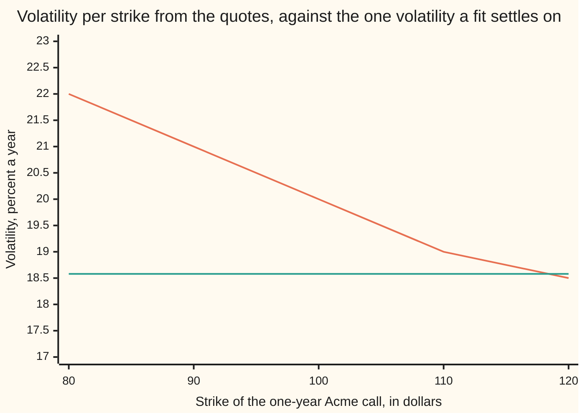
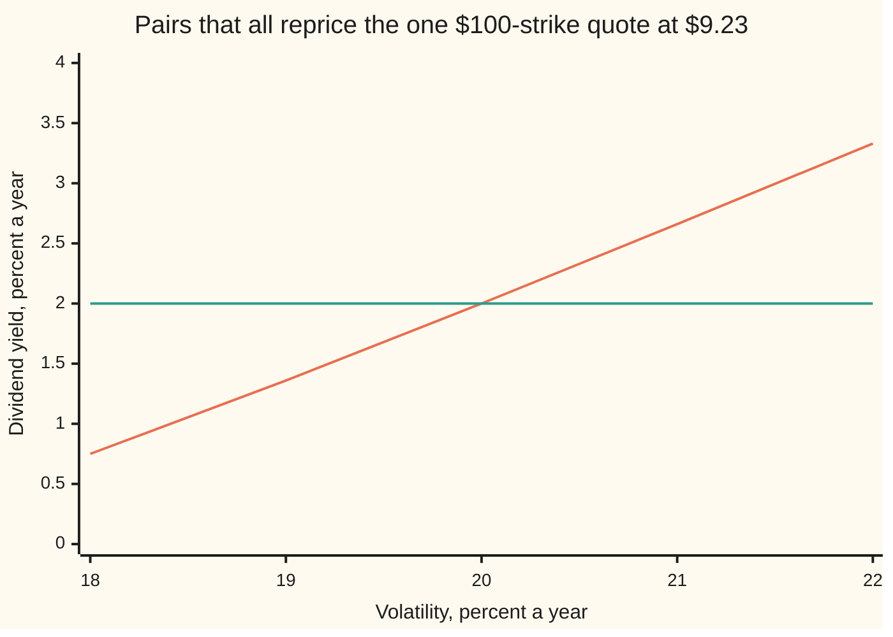

# Calibration: choosing parameters so the model reprices the quotes

[Syllabus](../../../SYLLABUS.md) → [Financial mathematics](../../../SYLLABUS.md#w12) → [Greeks by Numbers and Calibration](../../../SYLLABUS.md#w12-s07) → Calibration

---

## General Overview

A dealer's screen shows five one-year call options on Acme stock — a call being the right to buy one share at a fixed price, the strike. Acme trades at $100, cash in the bank earns 5% a year, and the quotes run from the $80 strike to the $120 strike: $23.10, $15.42, $9.23, $4.81 and $2.25.

The Black-Scholes model prices all five from two unquoted numbers: a volatility, how jumpy Acme's price is, and a dividend yield, the payout rate on the share. Neither is on the screen, and both must be chosen before anything else can be priced — a strike nobody quoted, a longer option, a package of several. The two are the model's **parameters**, called knobs from here on.

Five prices, two knobs, and no exact answer. Inverting one quote into one volatility is clean root-finding ([Solving backwards](05-root-finding-for-inverses.md)); doing it to these five separately gives five different volatilities — 22%, 21%, 20%, 19% and 18.5% — because the market does not charge one volatility for every strike.

So the question changes shape: not *which knobs reprice the quotes*, but *which come closest*, with "closest" spelled out in advance. That spelling out is most of the work: the scoring rule decides the answer, and two defensible rules on these five quotes give 18.39% and 18.58%.

**Calibration chooses a model's unquoted parameters by making a weighted sum of squared price misses as small as possible, and the weights are part of the answer rather than a detail of it.**

**What kind of fact this is:** a method — a stated objective, a step rule and a stopping rule. The step it takes is proved unique and downhill in Why it works; that the resulting parameters are the market's true ones is not proved, and is usually false.

### The picture: what the market charges, strike by strike



The sloping line is each quote inverted on its own: five strikes, five volatilities, the shape traders call the smile. The flat line, 18.58%, is where the second of the two fits below settles. One number cannot bend, so the fit must miss; the only choice left is where.

---

## The formula

Notation first, in words. The two knobs travel as one pair, written $\theta$ and read "theta": it holds the volatility $\sigma$ ("sigma") and the dividend yield $q$. The quotes are numbered 1 to 5, low strike to high, and a small i below a symbol picks one out, so $y_i$ is quote number i's market price. Each quote also carries a scale $s_i$: a number of dollars, fixed before the fit starts, saying how many dollars of miss on that quote count as one unit of error.

$$e_i(\theta) = \frac{C_i(\theta) - y_i}{s_i}, \qquad L(\theta) = \frac12 \sum_{i=1}^{5} e_i(\theta)^2$$

**Read it aloud:** take each quote's miss in dollars, divide by that quote's scale, square it, add the five up, and halve the total.

The halving is bookkeeping: differentiating a square produces a 2, and the one-half cancels it. Squaring is not bookkeeping — it is a choice, discussed in Step 0.

| Symbol | Plain meaning | In our example | Push it up and the answer… |
| --- | --- | --- | --- |
| $\theta$ | the pair of knobs being chosen | volatility and dividend yield | — |
| $\sigma$ | volatility: how jumpy Acme's price is | 18.39% fitted on dollar scales, 30% to start | model prices rise, so the fit lowers the other knob |
| $q$ | dividend yield: the payout rate on the share | 1.23% fitted | model prices fall, so the fit raises volatility |
| $y_i$ | the market's price of quote number i | $23.10 at the $80 strike | the fit chases that quote |
| $C_i$ | the model's price of the same option | 15 cents above that quote at the fit | — |
| $s_i$ | the scale: dollars per unit of miss on that quote | 1, or that quote's vega | that quote matters less |
| $e_i$ | the scaled miss on that quote | +0.15 in dollars at the $80 strike | — |
| $L$ | the loss: half the sum of squared scaled misses | 0.044952 at the fit | the fit is worse, or the model is wrong |
| $J$ | the slope table: how each model price moves when each knob moves | five rows, two columns | steps get shorter |
| $\lambda$ | the damping: how much a long step is penalised | starts at 0.001, tripled after a refused step, divided by three after an accepted one | steps shorten and aim downhill |
| $d$ | the step: the change added to both knobs at once | five of them settle set B | — |

The slope table has one row per quote and one column per knob, each entry divided by that quote's scale:

$$J_{i1} = \frac{1}{s_i}\frac{\partial C_i}{\partial \sigma}, \qquad J_{i2} = \frac{1}{s_i}\frac{\partial C_i}{\partial q}$$

The first derivative in each row is that quote's vega, the dollars it gains per one unit of volatility. At 20% volatility and a 2% payout the five vegas are $15.39, $28.92, $37.90, $38.11 and $31.42, and those same five numbers serve as the vega scales below. The second derivative is dollars per one unit of dividend yield, negative everywhere, a bigger payout draining the share before the option can be used. Both are Black-Scholes derivatives, written out in the checks and derived on [Black–Scholes call](../08-The%20Black-Scholes%20call%20and%20put/01-black-scholes-call.md).

One step of the fit then solves a two-by-two system:

$$\left(J^{\mathsf T}J + \lambda\,\operatorname{diag}(J^{\mathsf T}J)\right) d = -\,J^{\mathsf T}e$$

**Read it aloud:** ask the slopes for the step that would wipe out the misses if the model were a straight line, then shorten it by as much as the damping insists.

$J^{\mathsf T}J$ is the two-by-two table of column dot products, and $J^{\mathsf T}e$, with the five misses stacked into one column, is the loss's gradient. At $\lambda$ zero this is the Gauss-Newton step, at $\lambda$ positive Levenberg's damped step, and taking the damping from the diagonal rather than from a plain 1 is Marquardt's change.

### When it holds

- **The quotes must be reachable.** One volatility and one payout produce only smile-free prices, so against a real smile the best fit still misses by up to 0.95 volatility points under dollar scales. No optimiser fixes that: it is the model's shortfall, not the search's.
- **The scales must be stated.** Identical quotes give 18.39% under dollar scales and 18.58% under vega scales. Neither is wrong; an unstated choice is.
- **The slope columns must be independent.** Two distinct strikes tell the two knobs apart. One quote does not, and the fit then returns whatever its start drifts to.
- **The model price must be smooth in the knobs.** Black-Scholes prices are. A price from a simulation with fresh random numbers each call is not, and the fit chases the noise ([Bump and revalue](01-bump-and-revalue-and-common-random-numbers.md) holds the fix: reuse the draws).
- **The answer is local.** The loss can have several valleys, and this method walks down the one it starts in ([Extrema in several variables](../../06-Calculus%20and%20analysis/07-Several%20Variables/06-multivariable-extrema.md)).

Conventions verified 19 September 2026: quotes are dollar prices of European calls, one year to expiry, volatility as a percent a year, the bank rate continuously compounded. Desks that quote in volatility rather than dollars fit the same loss with vega scales, the second fit below.

---

## Why it works

### Step 0: give up on exactness, and pick a score

Five equations, two unknowns, almost never solvable. So the fit stops asking for zero misses and scores near-misses instead. Three properties make squares the standard score.

Squares are blind to sign, so a quote ten cents dear and one ten cents cheap both count and do not cancel. They punish one big miss more than several small ones, which is how a desk feels about being far out on a single contract. And a square differentiates to a straight line, so the step equations come out linear — the whole method rests on that.

<details>
<summary>Why squares rather than the size of the miss</summary>

Adding up unsigned misses is a defensible score, and desks sometimes use it. Its derivative jumps from $-1$ to $+1$ as a miss changes sign, so the loss gains creases and the step equations stop being linear. Squares give a smooth bowl. There is a statistical reading too: were each quote's error an independent bell-curve draw of width $s_i$, the squared sum would be the negative log-likelihood, so minimising it picks the most likely knobs ([Least squares](../../09-Probability%20and%20statistics/09-Regression/01-least-squares-regression.md)). That reading is a loan from statistics, not a fact about quotes: a bid-ask spread is not a standard deviation.

</details>

### Step 1: pretend the model is a straight line, just for one step

Near any pair of knobs, a small change $d$ moves the model's prices almost exactly along their slopes:

$$e(\theta + d) \approx e(\theta) + J d$$

That is a straight-line stand-in for a curved model, trusted only nearby. Substituted into the loss it makes a quadratic bowl in $d$, and a bowl has one lowest point, found by setting its slope to zero:

$$J^{\mathsf T}J\,d = -\,J^{\mathsf T}e$$

These are the normal equations that fit a straight line through data ([Least squares](../../09-Probability%20and%20statistics/09-Regression/01-least-squares-regression.md)), here solving for a step rather than a slope. Take the step, rebuild the slopes there, repeat: that is the Gauss-Newton method, and when it works it is fast. The five-quote fit below takes five accepted steps.

### Step 2: damp the step, because the straight line was a lie

Nothing in Step 1 keeps the step small, and the stand-in is trustworthy only while it is. From a volatility of 70% and a payout of 10%, the undamped step lands at a volatility of $-0.004732$. The model cannot price a negative volatility, so the search ends before it starts.

Kenneth Levenberg's 1944 fix charges the step for its own length: add half of $\lambda$ times the step's squared length to the bowl, and the lowest point moves in.

$$\left(J^{\mathsf T}J + \lambda I\right) d = -\,J^{\mathsf T}e$$

Large $\lambda$ gives a short step pointing straight downhill; small $\lambda$ gives Step 1 back. The damping is a leash on this step, not a penalty on the knobs.

Donald Marquardt's 1963 change is the one in the formula above: charge each knob by its own column, $\lambda\operatorname{diag}(J^{\mathsf T}J)$, rather than both the same. It matters because "the step's length" means nothing until units are fixed — quote volatility in basis points instead of percent and the same move looks a hundred times longer, which a plain $\lambda I$ would punish a hundred times harder. Each column's own size settles the question.

### Step 3: trust the loss, not the model of the loss

A damped step is still a guess from a stand-in, so every step is checked against the real loss and kept only if the real loss falls. A refusal means the stand-in is being trusted too far: triple $\lambda$, shorten the step, try again. An acceptance means it is working: divide $\lambda$ by three and be bolder next time.

That rule is what rescues the ruinous start — from 70% volatility the damped run reaches the same 18.3890% as the gentle start, in nine accepted steps. The stopping rule belongs in the report too: the run stops when an accepted step improves the loss by less than a hundred-millionth of one plus the loss, and it prints which rule stopped it.

<details>
<summary>Detailed proof: the damped step exists, is unique, and goes downhill</summary>

Write the damped matrix as $H = J^{\mathsf T}J + D$, the damping as $D = \lambda I$ in Levenberg's version or $D = \lambda\operatorname{diag}(J^{\mathsf T}J)$ in Marquardt's, and the loss's own slope in the knobs as $g = J^{\mathsf T}e$. Take the damping positive, and for Marquardt's version take every diagonal entry of $J^{\mathsf T}J$ positive too.

**One solution, not none and not many.** For any non-zero vector $z$, the first part gives $z^{\mathsf T}J^{\mathsf T}Jz = \lVert Jz\rVert^2 \ge 0$ and the damping gives $z^{\mathsf T}Dz > 0$, so $z^{\mathsf T}Hz > 0$. No non-zero vector can then satisfy $Hz = 0$, which would force $z^{\mathsf T}Hz = 0$, so the damped matrix is invertible and the step equations have exactly one solution. In two knobs the determinant shows it outright: for a slope table with columns u and w, under Levenberg's damping, Cauchy-Schwarz gives
$$\det H = (\lVert u\rVert^2 + \lambda)(\lVert w\rVert^2 + \lambda) - (u\cdot w)^2 \ge \lambda^2 + \lambda(\lVert u\rVert^2 + \lVert w\rVert^2) > 0.$$
Note what this needs: positive damping, and for Marquardt's version a non-zero diagonal. The zero-strike tickets of Step 4 have a zero diagonal entry, and the claim fails there, exactly as the checks report.

**The step points downhill.** The loss's slope is $\nabla L = J^{\mathsf T}e$, since each term contributes its own miss times its own slope. If that slope is not zero then the step $d = -H^{-1}g$ is not zero either, and
$$g\cdot d = -\,d^{\mathsf T}Hd = -\lVert Jd\rVert^2 - d^{\mathsf T}Dd < 0.$$
The slope and the step point into opposite half-spaces, which is what downhill means. Since the loss is differentiable, moving a fraction t of the step gives
$$L(\theta + t\,d) = L(\theta) + t\,(g\cdot d) + o(t),$$
so for every small enough fraction the loss falls, and tripling the damping shrinks the step towards nothing until the retry loop finds one.

**What is not proved.** That the run reaches a minimum, that the minimum found is the lowest, or that the fitted knobs are the market's. A continuous loss does attain a smallest value on a closed bounded box of knobs ([Extrema in several variables](../../06-Calculus%20and%20analysis/07-Several%20Variables/06-multivariable-extrema.md)); finding it is a separate matter.

</details>

### Step 4: ask whether the quotes can tell the knobs apart

A small loss is no evidence that the knobs are pinned down. The evidence lives in the slope table: do its two columns point in genuinely different directions, which is to ask whether $\det(J^{\mathsf T}J)$ is zero. The checks print three cases. Five strikes: 36,105,559.7. One quote alone: zero, since one row makes the columns multiples of each other. Five tickets struck at zero, each delivering one share: zero again, and worse — a share's price does not depend on volatility at all, so that whole column vanishes. The size of the first number says nothing on its own, since it carries the slopes' units raised to the fourth power; what is scale-free is zero against not-zero.

The single quote shows the failure plainest. The $100-strike call is quoted at $9.23, and the pairs producing it run 18% volatility with a 0.75% payout, 19% with 1.36%, 20% with 2.00%, 21% with 2.66%, 22% with 3.33%. Every pair reprices it perfectly, so the loss is zero along a whole curve, and where the fit lands depends only on where it began: from 16% volatility it stops at 16.3611% with a payout of $-0.2044\%$, from 26% at 25.1813% with 5.5871%. Two runs, two answers, both flawless by their own score.



The rising line is the curve of perfect fits; the flat line is the payout that actually made the quote, 2%. They cross once, at 20% volatility, and nothing in the one quote marks the crossing as special. A second strike marks it: the ratio of a row's two slopes falls as the strike rises, so a second row points a different way, the columns separate, and the curve collapses to a point.

Damping cannot supply what the quotes withhold. On the five zero-strike tickets Levenberg's $\lambda I$ still returns one well-defined step, and that step moves volatility by exactly 0.000000: nothing in the data points either way. Marquardt's diagonal damping returns no step at all: its determinant is 0.000000, since scaling a zero column leaves it zero. A unique step and an unidentified parameter sit together happily, which is why a converged optimiser is never on its own a reason to believe a number.

A second road reaches the same fitted pair with none of this machinery: cover the knobs with a grid, keep the best corner, shrink the grid around it, repeat. No slopes, no damping, far slower, and it agrees to six decimals. Derivative-free and global searches belong to Nonlinear least squares.

---

## Worked numbers, by hand

Two sets of five quotes on the same Acme market: spot $100, bank rate 5%, one year, strikes 80 to 120. Set A was manufactured by one pair of knobs, 20% volatility and a 2% payout, so the fit ought to find them — the sanity test any calibration should pass before being trusted. Set B is the smiling set from the top of the card. The $100-strike quote is $9.227006 in both, the house call price.

| Step | Arithmetic | Value |
| --- | --- | --- |
| set A, made by one pair | priced at 20% and 2% | 22.764125, 15.123708, 9.227006, 5.188582, 2.711776 |
| set A fitted from 30% and 5% | four damped steps | **volatility 0.200000, payout 0.020000** |
| set A loss | half the sum of five squared misses | **0.00000000** |
| set B, the smiling set | priced at 22, 21, 20, 19, 18.5% | 23.095240, 15.416007, 9.227006, 4.808421, 2.251252 |
| the loss's slope at the start | from the slope table | +296.77 per unit of volatility, −319.21 per unit of payout |
| set B fitted, dollar scales | five damped steps, loss settled | **volatility 0.183890, payout 0.012275** |
| set B loss | the best one pair can do | **0.04495192** |
| the misses left, in dollars | model minus market | +0.15, −0.14, −0.15, +0.08, +0.15 |
| the same misses, in volatility | each miss divided by its vega | +0.95, −0.48, −0.39, +0.20, +0.47 |
| set B fitted, vega scales | the same quotes, scored in volatility | **volatility 0.185767, payout 0.013608** |
| its misses, in volatility | the worst one is smaller | +0.31, −0.67, −0.42, +0.25, +0.55 |

Read the two fits together. Scored in dollars, the misses come out level in dollars, eight to fifteen cents, leaving the cheap wing quote nearly a full volatility point out and the middle four tenths. Scored in volatility, the wing's miss falls to 0.31 points and the worst miss anywhere drops from 0.95 to 0.67. Same model, same quotes, same algorithm; one different declared scale, and a volatility 0.19 points higher.

That the fitted volatility sits below every volatility on the screen looks like an error and is not. The payout knob moved too, down to 1.23% from the 2% that made the quotes, and a smaller payout lifts every model price, so volatility has to come down to put them back. The knobs traded against each other — the trade that drew the single-quote curve in Step 4, now happening inside a five-quote fit. A calibrated volatility is not an average of implied volatilities; it is whichever number, alongside the other knob, minimises the declared loss.

The scale that turned dollars into volatility points is each quote's vega. Each block is $1.25 of vega.

```
strike  80   ████████████                     $15.39
strike  90   ███████████████████████          $28.92
strike 100   ██████████████████████████████   $37.90
strike 110   ██████████████████████████████   $38.11
strike 120   █████████████████████████        $31.42
```

A dollar missed at the $80 strike is 6.5 volatility points; the same dollar at the $100 strike is 2.6. That ratio is the argument for vega scales: dollar scoring quietly hands the middle of the board two and a half times the say.

### What breaks if you drop a piece

| Mistake | Comes out at | What went wrong |
| --- | --- | --- |
| Pinning the payout at zero and fitting volatility alone | volatility 0.163784, loss 0.70097707 | The missing payout is absorbed into volatility; the loss is over fifteen times worse |
| Taking the full undamped step from 70% volatility | volatility −0.004732 | Off the edge of the world in one move; damped, the same start reaches 0.183890 |
| Fitting one quote instead of five | 0.163611 with payout −0.002044, or 0.251813 with 0.055871 | Both fit perfectly; the answer is the starting guess in disguise |
| Scoring in dollars when the desk quotes volatility | the wing quote 0.95 points out, against 0.31 | The scale, not the model, chose where the error landed |

The code prints all four.

---

## Code, from first principles, and it actually runs

Nothing is imported that already knows an answer. Both programs build the bell-curve area themselves — Python from `math.erf`, Rust by adding thin slices under the curve — then write out the Black-Scholes price, its two derivatives, the damped step and the accept-or-retry loop. The fitted pair is reached twice by roads sharing no arithmetic: Levenberg-Marquardt with the slope table, and a grid that shrinks around its best corner with no derivatives at all. Three further checks stand on their own: set A's fit must recover the pair that manufactured it, the slope table's gradient must match the gradient found by bumping the loss, and every point on the single-quote curve must reprice the quote to ten decimals, which a bisection root finder confirms.

### Python

```python
# Calibration as least squares -- the check behind the card.  Standard library
# only.  Nothing is imported that already knows the answer: the bell-curve area
# is built from math.erf, the Levenberg-Marquardt loop is written out here, and
# a second road reaches the same fit by shrinking a grid, using no derivatives.
from math import log, sqrt, exp, erf, pi
S, R, T = 100.0, 0.05, 1.0                        # Acme spot, bank rate, one year
KS = (80.0, 90.0, 100.0, 110.0, 120.0)            # the five quoted strikes
SMILE = (0.22, 0.21, 0.20, 0.19, 0.185)           # vol the market charges per strike
START, BOX, FAR = (0.30, 0.05), ((0.05, 0.60), (-0.05, 0.12)), (0.70, 0.10)
def N(x):    return 0.5 * (1.0 + erf(x / sqrt(2.0)))       # bell-curve area left of x
def dens(x): return exp(-0.5 * x * x) / sqrt(2.0 * pi)     # bell-curve height at x
def call(K, sig, q):                              # Black-Scholes call at one strike
    v = sig * sqrt(T)
    d1 = (log(S / K) + (R - q + 0.5 * sig * sig) * T) / v
    return S * exp(-q * T) * N(d1) - K * exp(-R * T) * N(d1 - v)
def slopes(K, sig, q):                            # dC/dsigma (vega) and dC/dq
    v = sig * sqrt(T)
    d1 = (log(S / K) + (R - q + 0.5 * sig * sig) * T) / v
    return S * exp(-q * T) * dens(d1) * sqrt(T), -S * T * exp(-q * T) * N(d1)
def loss(ks, x, y, s):                            # half the sum of scaled squared misses
    return 0.5 * sum(((call(K, x[0], x[1]) - yi) / si) ** 2 for K, yi, si in zip(ks, y, s))
def normal(ks, x, y, s):                          # J'J (three entries) and the gradient J'e
    miss = [(call(K, x[0], x[1]) - yi) / si for K, yi, si in zip(ks, y, s)]
    J = [tuple(g / si for g in slopes(K, x[0], x[1])) for K, si in zip(ks, s)]
    a = [sum(j[0] * j[0] for j in J), sum(j[0] * j[1] for j in J), sum(j[1] * j[1] for j in J)]
    return a, [sum(j[0] * z for j, z in zip(J, miss)), sum(j[1] * z for j, z in zip(J, miss))]
def step(a, g, lam, scaled=True):                 # solve (J'J + damping) d = -J'e by hand
    b0, b2 = a[0] + lam * (a[0] if scaled else 1.0), a[2] + lam * (a[2] if scaled else 1.0)
    det = b0 * b2 - a[1] * a[1]
    if det <= 0.0:
        return None, det
    return [(-b2 * g[0] + a[1] * g[1]) / det, (a[1] * g[0] - b0 * g[1]) / det], det
def fit(ks, y, s, start, lam=1e-3):               # road one: Levenberg-Marquardt
    x, f, taken = list(start), loss(ks, start, y, s), 0
    for _ in range(200):
        a, g = normal(ks, x, y, s)
        for _ in range(60):
            d, _ = step(a, g, lam)
            if d is not None and x[0] + d[0] > 0.0:
                trial = [x[0] + d[0], x[1] + d[1]]
                ft = loss(ks, trial, y, s)
                if ft < f:
                    gain, x, f, taken = f - ft, trial, ft, taken + 1
                    lam = max(lam / 3.0, 1e-14)   # step taken: trust the slope more
                    if gain <= 1e-8 * (1.0 + f):
                        return x, f, taken, "loss settled"
                    break
            lam *= 3.0                            # step refused: trust the slope less
        else:
            return x, f, taken, "no better step"
    return x, f, taken, "step cap"
def shrink(ks, y, s, box, rounds=30, n=6):        # road two: shrink a grid, no derivatives
    (lo, hi), (lo2, hi2) = box
    best = [0.5 * (lo + hi), 0.5 * (lo2 + hi2)]
    for _ in range(rounds):
        cand = [[lo + (hi - lo) * i / n, lo2 + (hi2 - lo2) * j / n]
                for i in range(n + 1) for j in range(n + 1)]
        best = min(cand, key=lambda p: loss(ks, p, y, s))
        w, w2 = (hi - lo) / n, (hi2 - lo2) / n
        lo, hi = max(best[0] - w, 1e-4), best[0] + w
        lo2, hi2 = best[1] - w2, best[1] + w2
    return best, loss(ks, best, y, s)
def q_repricing(sig, target):                     # bisection: the price falls as q rises
    lo, hi = -0.40, 0.40
    for _ in range(100):
        mid = 0.5 * (lo + hi)
        lo, hi = (mid, hi) if call(100.0, sig, mid) > target else (lo, mid)
    return 0.5 * (lo + hi)
def wide(name, values, fmt="{:>10.6f}"):
    print(f"{name:<30}" + "".join(fmt.format(v) for v in values))
def report(name, x, f, extra=""):
    print(f"{name:<30}sigma {x[0]:.6f}   q {x[1]:.6f}   loss {f:.8f}{extra}")
qa = [call(K, 0.20, 0.02) for K in KS]                 # set A: one volatility made these
qb = [call(K, v, 0.02) for K, v in zip(KS, SMILE)]     # set B: the market's own smile
vega, ones = [slopes(K, 0.20, 0.02)[0] for K in KS], [1.0] * 5   # scales: $ per 1.00 vol
print(f"five one-year Acme calls: spot {S:.2f}, bank rate {R * 100:.2f}%, strikes 80 to 120; "
      f"every fit starts at sigma {START[0]:.2f}, q {START[1]:.2f}")
wide("strike", KS, "{:>10.0f}")
wide("set A quote, one vol", qa)
wide("set B quote, market smile", qb)
wide("set B vol, strike by strike", SMILE)
wide("vega scale, $ per 1.00 vol", vega)
found = {}
for label, y, s in (("A, dollar scales", qa, ones), ("B, dollar scales", qb, ones),
                    ("B, vega scales", qb, vega)):
    x, f, n, stop = fit(KS, y, s, START)                    # road one
    g, fg = shrink(KS, y, s, BOX)                           # road two
    report("fit " + label, x, f, f"   steps {n}   stop: {stop}")
    report("fit " + label + ", grid", g, fg)
    found[label] = (x, g)
xa, xb, xv = (found[k][0] for k in ("A, dollar scales", "B, dollar scales", "B, vega scales"))
gb, gv = found["B, dollar scales"][1], found["B, vega scales"][1]
miss_b = [call(K, xb[0], xb[1]) - yi for K, yi in zip(KS, qb)]
miss_v = [call(K, xv[0], xv[1]) - yi for K, yi in zip(KS, qb)]
wide("dollar fit misses, dollars", miss_b)
wide("dollar fit misses, vol pts", [100.0 * m / w for m, w in zip(miss_b, vega)])
wide("vega fit misses, vol pts", [100.0 * m / w for m, w in zip(miss_v, vega)])
g0 = normal(KS, START, qb, ones)[1]
bump = [(loss(KS, [START[0] + 1e-5 * (k == 0), START[1] + 1e-5 * (k == 1)], qb, ones)     # the same
         - loss(KS, [START[0] - 1e-5 * (k == 0), START[1] - 1e-5 * (k == 1)], qb, ones)) / 2e-5 for k in (0, 1)]
print(f"gradient at the start, from the Jacobian {g0[0]:+.4f} {g0[1]:+.4f}, "
      f"by bumping the loss {bump[0]:+.4f} {bump[1]:+.4f}")
ab = normal(KS, xb, qb, ones)[0]
a1 = normal((100.0,), (0.20, 0.02), [qa[2]], [1.0])[0]     # one quote: J has a single row
dq = -S * T * exp(-0.02 * T)                               # a zero-strike ticket has no vega
tick = [0.0, 0.0, 5.0 * dq * dq]                           # so J'J for five of them is this
print(f"det(J'J): five strikes {ab[0] * ab[2] - ab[1] * ab[1]:.3f}, one strike "
      f"{a1[0] * a1[2] - a1[1] * a1[1]:.6f}, five zero-strike tickets {tick[0] * tick[2]:.6f}")
(lev, dlev), dmar = step(tick, [0.0, 1.0], 0.01, scaled=False), step(tick, [0.0, 1.0], 0.01, True)[1]
print(f"tickets, damped step: Levenberg moves sigma by {lev[0]:.6f}, determinant "
      f"{dlev:.6f}; Marquardt's determinant is {dmar:.6f}, so it has no step to take")
valley = [(sg, q_repricing(sg, qa[2])) for sg in (0.18, 0.19, 0.20, 0.21, 0.22)]
wide("valley, sigma", [v[0] for v in valley])
wide("valley, q repricing quote 3", [v[1] for v in valley])
x1, f1, n1, _ = fit((100.0,), [qa[2]], [1.0], (0.16, 0.00))
x2, f2, n2, _ = fit((100.0,), [qa[2]], [1.0], (0.26, 0.05))
report("one quote from sigma 0.16", x1, f1, f"   steps {n1}")
report("one quote from sigma 0.26", x2, f2, f"   steps {n2}")
pin, fpin = shrink(KS, qb, ones, ((0.05, 0.60), (0.0, 0.0)))
report("mistake, q pinned at zero", pin, fpin)
gn = step(*normal(KS, FAR, qb, ones), 0.0)[0]
xf, ff, nf, _ = fit(KS, qb, ones, FAR)
print(f"from sigma {FAR[0]:.2f}, q {FAR[1]:.2f}: one undamped step gives sigma "
      f"{FAR[0] + gn[0]:.6f}, a volatility below zero; damped, sigma {xf[0]:.6f} "
      f"and loss {ff:.8f} in {nf} steps")
for label, vals in (("chart, market vol percent", [100.0 * v for v in SMILE]),
                    ("chart, fitted flat vol", [100.0 * xv[0]] * 5), ("chart, vega scale dollars", vega),
                    ("chart, valley sigma percent", [100.0 * v[0] for v in valley]),
                    ("chart, valley q percent", [100.0 * v[1] for v in valley]), ("chart, dividend used", [2.0] * 5)):
    wide(label, vals, "{:>10.2f}")
assert abs(qa[2] - 9.227005508154) < 1e-9          # quote 3 is the house call price
assert abs(xa[0] - 0.20) < 1e-9 and abs(xa[1] - 0.02) < 1e-9   # set A recovers its makers
assert abs(xb[0] - gb[0]) < 1e-7 and abs(xb[1] - gb[1]) < 1e-7  # two roads, one fit
assert abs(xv[0] - gv[0]) < 1e-7 and abs(xv[1] - gv[1]) < 1e-7
assert max(abs(g0[k] - bump[k]) for k in (0, 1)) < 1e-4         # Jacobian vs bumped loss
assert all(abs(call(100.0, sg, qv) - qa[2]) < 1e-10 for sg, qv in valley)
assert loss(KS, xv, qb, vega) < loss(KS, xb, qb, vega)          # weights move the answer
assert abs(xf[0] - xb[0]) < 1e-7 and FAR[0] + gn[0] < 0.0       # damping saves a bad start
print("ALL CHECKS PASS")
```

**Ran 2026-09-19 on macOS, Python 3.14.6, standard library only. All checks passed. Output, pasted from the run:**

```
five one-year Acme calls: spot 100.00, bank rate 5.00%, strikes 80 to 120; every fit starts at sigma 0.30, q 0.05
strike                                80        90       100       110       120
set A quote, one vol           22.764125 15.123708  9.227006  5.188582  2.711776
set B quote, market smile      23.095240 15.416007  9.227006  4.808421  2.251252
set B vol, strike by strike     0.220000  0.210000  0.200000  0.190000  0.185000
vega scale, $ per 1.00 vol     15.388787 28.919628 37.901158 38.113517 31.417631
fit A, dollar scales          sigma 0.200000   q 0.020000   loss 0.00000000   steps 4   stop: loss settled
fit A, dollar scales, grid    sigma 0.200000   q 0.020000   loss 0.00000000
fit B, dollar scales          sigma 0.183890   q 0.012275   loss 0.04495192   steps 5   stop: loss settled
fit B, dollar scales, grid    sigma 0.183890   q 0.012275   loss 0.04495192
fit B, vega scales            sigma 0.185767   q 0.013608   loss 0.00005418   steps 4   stop: loss settled
fit B, vega scales, grid      sigma 0.185767   q 0.013608   loss 0.00005418
dollar fit misses, dollars      0.145838 -0.139422 -0.147435  0.076153  0.147174
dollar fit misses, vol pts      0.947687 -0.482103 -0.388999  0.199805  0.468445
vega fit misses, vol pts        0.305341 -0.672809 -0.415848  0.246722  0.551175
gradient at the start, from the Jacobian +296.7724 -319.2086, by bumping the loss +296.7724 -319.2086
det(J'J): five strikes 36105559.728, one strike 0.000000, five zero-strike tickets 0.000000
tickets, damped step: Levenberg moves sigma by 0.000000, determinant 480.394820; Marquardt's determinant is 0.000000, so it has no step to take
valley, sigma                   0.180000  0.190000  0.200000  0.210000  0.220000
valley, q repricing quote 3     0.007506  0.013645  0.020000  0.026557  0.033301
one quote from sigma 0.16     sigma 0.163611   q -0.002044   loss 0.00000000   steps 3
one quote from sigma 0.26     sigma 0.251813   q 0.055871   loss 0.00000000   steps 3
mistake, q pinned at zero     sigma 0.163784   q 0.000000   loss 0.70097707
from sigma 0.70, q 0.10: one undamped step gives sigma -0.004732, a volatility below zero; damped, sigma 0.183890 and loss 0.04495192 in 9 steps
chart, market vol percent          22.00     21.00     20.00     19.00     18.50
chart, fitted flat vol             18.58     18.58     18.58     18.58     18.58
chart, vega scale dollars          15.39     28.92     37.90     38.11     31.42
chart, valley sigma percent        18.00     19.00     20.00     21.00     22.00
chart, valley q percent             0.75      1.36      2.00      2.66      3.33
chart, dividend used                2.00      2.00      2.00      2.00      2.00
ALL CHECKS PASS
```

### Rust

Same numbers, same labels, built with `rustc --edition 2021 -O`.

```rust
// Calibration as least squares -- the same check as calibration_as_least_squares_check.py,
// in Rust.  Standard library only, no crates.  Rust has no erf, so the bell-curve area is
// built the honest way: thin slices added up under the curve (Simpson).  The
// Levenberg-Marquardt loop and the derivative-free grid road are written out here too.
use std::f64::consts::PI;
const S: f64 = 100.0;  const R: f64 = 0.05;  const T: f64 = 1.0;   // spot, bank rate, one year
const KS: [f64; 5] = [80.0, 90.0, 100.0, 110.0, 120.0];   // the five quoted strikes
const SMILE: [f64; 5] = [0.22, 0.21, 0.20, 0.19, 0.185];  // vol the market charges
const START: [f64; 2] = [0.30, 0.05];
const BOX: [[f64; 2]; 2] = [[0.05, 0.60], [-0.05, 0.12]];
const FAR: [f64; 2] = [0.70, 0.10];               // a deliberately bad starting guess
fn dens(x: f64) -> f64 { (-0.5 * x * x).exp() / (2.0 * PI).sqrt() }   // bell-curve height
fn ncdf(x: f64) -> f64 {                          // bell-curve area left of x, by Simpson
    if x < -12.0 { return 0.0; }
    if x > 12.0 { return 1.0; }
    let (n, h) = (4096usize, x / 4096.0);
    let mut s = dens(0.0) + dens(x);
    for i in 1..n { s += if i % 2 == 1 { 4.0 } else { 2.0 } * dens(i as f64 * h); }
    0.5 + s * h / 3.0
}
fn call(k: f64, sig: f64, q: f64) -> f64 {        // Black-Scholes call at one strike
    let v = sig * T.sqrt();
    let d1 = ((S / k).ln() + (R - q + 0.5 * sig * sig) * T) / v;
    S * (-q * T).exp() * ncdf(d1) - k * (-R * T).exp() * ncdf(d1 - v)
}
fn slopes(k: f64, sig: f64, q: f64) -> (f64, f64) {   // dC/dsigma (vega) and dC/dq
    let v = sig * T.sqrt();
    let d1 = ((S / k).ln() + (R - q + 0.5 * sig * sig) * T) / v;
    (S * (-q * T).exp() * dens(d1) * T.sqrt(), -S * T * (-q * T).exp() * ncdf(d1))
}
fn loss(ks: &[f64], x: [f64; 2], y: &[f64], s: &[f64]) -> f64 {   // half the scaled squares
    0.5 * (0..ks.len()).map(|i| { let z = (call(ks[i], x[0], x[1]) - y[i]) / s[i]; z * z }).sum::<f64>()
}
fn normal(ks: &[f64], x: [f64; 2], y: &[f64], s: &[f64]) -> ([f64; 3], [f64; 2]) {
    let (mut a, mut g) = ([0.0; 3], [0.0; 2]);    // J'J (three entries) and the gradient J'e
    for i in 0..ks.len() {
        let miss = (call(ks[i], x[0], x[1]) - y[i]) / s[i];
        let (j0, j1) = slopes(ks[i], x[0], x[1]);
        let (j0, j1) = (j0 / s[i], j1 / s[i]);
        a[0] += j0 * j0; a[1] += j0 * j1; a[2] += j1 * j1;
        g[0] += j0 * miss; g[1] += j1 * miss;
    }
    (a, g)
}
fn step(a: [f64; 3], g: [f64; 2], lam: f64, scaled: bool) -> (Option<[f64; 2]>, f64) {
    let b0 = a[0] + lam * if scaled { a[0] } else { 1.0 };   // (J'J + damping) d = -J'e
    let b2 = a[2] + lam * if scaled { a[2] } else { 1.0 };
    let det = b0 * b2 - a[1] * a[1];
    if det <= 0.0 { return (None, det); }
    (Some([(-b2 * g[0] + a[1] * g[1]) / det, (a[1] * g[0] - b0 * g[1]) / det]), det)
}
fn fit(ks: &[f64], y: &[f64], s: &[f64], start: [f64; 2]) -> ([f64; 2], f64, usize, &'static str) {
    let (mut x, mut f, mut taken, mut lam) = (start, loss(ks, start, y, s), 0usize, 1e-3);
    for _ in 0..200 {                             // road one: Levenberg-Marquardt
        let (a, g) = normal(ks, x, y, s);
        let mut moved = false;
        for _ in 0..60 {
            if let (Some(d), _) = step(a, g, lam, true) { if x[0] + d[0] > 0.0 {
                let trial = [x[0] + d[0], x[1] + d[1]];
                let ft = loss(ks, trial, y, s);
                if ft < f {
                    let gain = f - ft;
                    (x, f, taken) = (trial, ft, taken + 1);
                    lam = (lam / 3.0).max(1e-14); // step taken: trust the slope more
                    if gain <= 1e-8 * (1.0 + f) { return (x, f, taken, "loss settled"); }
                    moved = true; break;
                }
            }}
            lam *= 3.0;                           // step refused: trust the slope less
        }
        if !moved { return (x, f, taken, "no better step"); }
    }
    (x, f, taken, "step cap")
}
fn shrink(ks: &[f64], y: &[f64], s: &[f64], bx: [[f64; 2]; 2]) -> ([f64; 2], f64) {
    let n = 6usize;                               // road two: shrink a grid, no derivatives
    let (mut lo, mut hi, mut lo2, mut hi2) = (bx[0][0], bx[0][1], bx[1][0], bx[1][1]);
    let mut best = [0.5 * (lo + hi), 0.5 * (lo2 + hi2)];
    for _ in 0..30 {
        let mut bf = f64::INFINITY;
        for i in 0..=n { for j in 0..=n {
            let p = [lo + (hi - lo) * i as f64 / n as f64, lo2 + (hi2 - lo2) * j as f64 / n as f64];
            let fp = loss(ks, p, y, s);
            if fp < bf { (bf, best) = (fp, p); }
        }}
        let (w, w2) = ((hi - lo) / n as f64, (hi2 - lo2) / n as f64);
        (lo, hi) = ((best[0] - w).max(1e-4), best[0] + w);
        (lo2, hi2) = (best[1] - w2, best[1] + w2);
    }
    (best, loss(ks, best, y, s))
}
fn q_repricing(sig: f64, target: f64) -> f64 {    // bisection: the price falls as q rises
    let (mut lo, mut hi) = (-0.40, 0.40);
    for _ in 0..100 {
        let mid = 0.5 * (lo + hi);  if call(100.0, sig, mid) > target { lo = mid } else { hi = mid }
    }
    0.5 * (lo + hi)
}
fn wide(name: &str, values: &[f64], dp: usize) {
    let mut line = format!("{:<30}", name);
    for v in values { line.push_str(&format!("{:>10.*}", dp, v)); }
    println!("{}", line);
}
fn report(name: &str, x: [f64; 2], f: f64, extra: &str) {
    println!("{:<30}sigma {:.6}   q {:.6}   loss {:.8}{}", name, x[0], x[1], f, extra);
}
fn main() {
    let qa: Vec<f64> = KS.iter().map(|&k| call(k, 0.20, 0.02)).collect();      // set A
    let qb: Vec<f64> = (0..5).map(|i| call(KS[i], SMILE[i], 0.02)).collect();  // set B
    let (vega, ones): (Vec<f64>, Vec<f64>) = (KS.iter().map(|&k| slopes(k, 0.20, 0.02).0).collect(), vec![1.0; 5]);
    println!("five one-year Acme calls: spot {:.2}, bank rate {:.2}%, strikes 80 to 120; every fit starts at sigma {:.2}, q {:.2}", S, R * 100.0, START[0], START[1]);
    wide("strike", &KS, 0);
    wide("set A quote, one vol", &qa, 6);
    wide("set B quote, market smile", &qb, 6);
    wide("set B vol, strike by strike", &SMILE, 6);
    wide("vega scale, $ per 1.00 vol", &vega, 6);
    let mut found: Vec<([f64; 2], [f64; 2])> = Vec::new();
    for (label, y, s) in [("A, dollar scales", &qa, &ones), ("B, dollar scales", &qb, &ones), ("B, vega scales", &qb, &vega)] {
        let (x, f, n, stop) = fit(&KS, y, s, START);                 // road one
        let (g, fg) = shrink(&KS, y, s, BOX);                        // road two
        report(&format!("fit {}", label), x, f, &format!("   steps {}   stop: {}", n, stop));
        report(&format!("fit {}, grid", label), g, fg, "");
        found.push((x, g));
    }
    let (xa, xb, xv, gb, gv) = (found[0].0, found[1].0, found[2].0, found[1].1, found[2].1);
    let miss_b: Vec<f64> = (0..5).map(|i| call(KS[i], xb[0], xb[1]) - qb[i]).collect();
    let miss_v: Vec<f64> = (0..5).map(|i| call(KS[i], xv[0], xv[1]) - qb[i]).collect();
    wide("dollar fit misses, dollars", &miss_b, 6);
    wide("dollar fit misses, vol pts", &(0..5).map(|i| 100.0 * miss_b[i] / vega[i]).collect::<Vec<f64>>(), 6);
    wide("vega fit misses, vol pts", &(0..5).map(|i| 100.0 * miss_v[i] / vega[i]).collect::<Vec<f64>>(), 6);
    let g0 = normal(&KS, START, &qb, &ones).1;
    let bump: Vec<f64> = (0..2).map(|k| {         // the same gradient, by bumping the loss
        let (mut p, mut m) = (START, START);
        p[k] += 1e-5; m[k] -= 1e-5;
        (loss(&KS, p, &qb, &ones) - loss(&KS, m, &qb, &ones)) / 2e-5 }).collect();
    println!("gradient at the start, from the Jacobian {:+.4} {:+.4}, by bumping the loss {:+.4} {:+.4}", g0[0], g0[1], bump[0], bump[1]);
    let (ab, a1) = (normal(&KS, xb, &qb, &ones).0, normal(&[100.0], [0.20, 0.02], &[qa[2]], &[1.0]).0);
    let dq = -S * T * (-0.02 * T).exp();          // a zero-strike ticket has no vega at all
    let tick = [0.0, 0.0, 5.0 * dq * dq];         // so J'J for five of them is this
    println!("det(J'J): five strikes {:.3}, one strike {:.6}, five zero-strike tickets {:.6}", ab[0] * ab[2] - ab[1] * ab[1], a1[0] * a1[2] - a1[1] * a1[1], tick[0] * tick[2]);
    let ((lev, dlev), dmar) = (step(tick, [0.0, 1.0], 0.01, false), step(tick, [0.0, 1.0], 0.01, true).1);
    println!("tickets, damped step: Levenberg moves sigma by {:.6}, determinant {:.6}; Marquardt's determinant is {:.6}, so it has no step to take", lev.unwrap()[0], dlev, dmar);
    let valley: Vec<[f64; 2]> = [0.18, 0.19, 0.20, 0.21, 0.22].iter().map(|&sg| [sg, q_repricing(sg, qa[2])]).collect();
    wide("valley, sigma", &valley.iter().map(|v| v[0]).collect::<Vec<f64>>(), 6);
    wide("valley, q repricing quote 3", &valley.iter().map(|v| v[1]).collect::<Vec<f64>>(), 6);
    let ((x1, f1, n1, _), (x2, f2, n2, _)) = (fit(&[100.0], &[qa[2]], &[1.0], [0.16, 0.00]), fit(&[100.0], &[qa[2]], &[1.0], [0.26, 0.05]));
    report("one quote from sigma 0.16", x1, f1, &format!("   steps {}", n1));
    report("one quote from sigma 0.26", x2, f2, &format!("   steps {}", n2));
    let (pin, fpin) = shrink(&KS, &qb, &ones, [[0.05, 0.60], [0.0, 0.0]]);
    report("mistake, q pinned at zero", pin, fpin, "");
    let gn = { let (af, gf) = normal(&KS, FAR, &qb, &ones); step(af, gf, 0.0, true).0.unwrap() };
    let (xf, ff, nf, _) = fit(&KS, &qb, &ones, FAR);
    println!("from sigma {:.2}, q {:.2}: one undamped step gives sigma {:.6}, a volatility below zero; damped, sigma {:.6} and loss {:.8} in {} steps", FAR[0], FAR[1], FAR[0] + gn[0], xf[0], ff, nf);
    for (label, vals) in [("chart, market vol percent", SMILE.iter().map(|v| 100.0 * v).collect::<Vec<f64>>()),
                          ("chart, fitted flat vol", vec![100.0 * xv[0]; 5]), ("chart, vega scale dollars", vega.clone()),
                          ("chart, valley sigma percent", valley.iter().map(|v| 100.0 * v[0]).collect()),
                          ("chart, valley q percent", valley.iter().map(|v| 100.0 * v[1]).collect()), ("chart, dividend used", vec![2.0; 5])] {
        wide(label, &vals, 2);
    }
    assert!((qa[2] - 9.227005508154).abs() < 1e-9);        // quote 3 is the house call price
    assert!((xa[0] - 0.20).abs() < 1e-9 && (xa[1] - 0.02).abs() < 1e-9);   // set A recovered
    assert!((xb[0] - gb[0]).abs() < 1e-7 && (xb[1] - gb[1]).abs() < 1e-7); // two roads, one fit
    assert!((xv[0] - gv[0]).abs() < 1e-7 && (xv[1] - gv[1]).abs() < 1e-7);
    assert!((0..2).all(|k| (g0[k] - bump[k]).abs() < 1e-4));   // Jacobian vs bumped loss
    assert!(valley.iter().all(|v| (call(100.0, v[0], v[1]) - qa[2]).abs() < 1e-10));
    assert!(loss(&KS, xv, &qb, &vega) < loss(&KS, xb, &qb, &vega));   // weights move the answer
    assert!((xf[0] - xb[0]).abs() < 1e-7 && FAR[0] + gn[0] < 0.0);    // damping saves a bad start
    println!("ALL CHECKS PASS");
}
```

**Ran 2026-09-19 on macOS, rustc 1.98.1, no crates. All checks passed. Output, pasted from the run:**

```
five one-year Acme calls: spot 100.00, bank rate 5.00%, strikes 80 to 120; every fit starts at sigma 0.30, q 0.05
strike                                80        90       100       110       120
set A quote, one vol           22.764125 15.123708  9.227006  5.188582  2.711776
set B quote, market smile      23.095240 15.416007  9.227006  4.808421  2.251252
set B vol, strike by strike     0.220000  0.210000  0.200000  0.190000  0.185000
vega scale, $ per 1.00 vol     15.388787 28.919628 37.901158 38.113517 31.417631
fit A, dollar scales          sigma 0.200000   q 0.020000   loss 0.00000000   steps 4   stop: loss settled
fit A, dollar scales, grid    sigma 0.200000   q 0.020000   loss 0.00000000
fit B, dollar scales          sigma 0.183890   q 0.012275   loss 0.04495192   steps 5   stop: loss settled
fit B, dollar scales, grid    sigma 0.183890   q 0.012275   loss 0.04495192
fit B, vega scales            sigma 0.185767   q 0.013608   loss 0.00005418   steps 4   stop: loss settled
fit B, vega scales, grid      sigma 0.185767   q 0.013608   loss 0.00005418
dollar fit misses, dollars      0.145838 -0.139422 -0.147435  0.076153  0.147174
dollar fit misses, vol pts      0.947687 -0.482103 -0.388999  0.199805  0.468445
vega fit misses, vol pts        0.305341 -0.672809 -0.415848  0.246722  0.551175
gradient at the start, from the Jacobian +296.7724 -319.2086, by bumping the loss +296.7724 -319.2086
det(J'J): five strikes 36105559.728, one strike 0.000000, five zero-strike tickets 0.000000
tickets, damped step: Levenberg moves sigma by 0.000000, determinant 480.394820; Marquardt's determinant is 0.000000, so it has no step to take
valley, sigma                   0.180000  0.190000  0.200000  0.210000  0.220000
valley, q repricing quote 3     0.007506  0.013645  0.020000  0.026557  0.033301
one quote from sigma 0.16     sigma 0.163611   q -0.002044   loss 0.00000000   steps 3
one quote from sigma 0.26     sigma 0.251813   q 0.055871   loss 0.00000000   steps 3
mistake, q pinned at zero     sigma 0.163784   q 0.000000   loss 0.70097707
from sigma 0.70, q 0.10: one undamped step gives sigma -0.004732, a volatility below zero; damped, sigma 0.183890 and loss 0.04495192 in 9 steps
chart, market vol percent          22.00     21.00     20.00     19.00     18.50
chart, fitted flat vol             18.58     18.58     18.58     18.58     18.58
chart, vega scale dollars          15.39     28.92     37.90     38.11     31.42
chart, valley sigma percent        18.00     19.00     20.00     21.00     22.00
chart, valley q percent             0.75      1.36      2.00      2.66      3.33
chart, dividend used                2.00      2.00      2.00      2.00      2.00
ALL CHECKS PASS
```

The two outputs match line for line, from two different bell curves and two different languages.

> [!TIP]
> **Try changing**
> Guess first, then run it. The asserts are pinned to these five quotes, so expect one to stop the program.
> - **Switch the damping off.** Start `lam` in `fit` at zero. The five-strike fits still reach 0.183890, since their two slope columns are independent; the one-quote fits report 0 steps, because one row makes their step equations singular, and the ruinous start stays at 0.700000.
> - **Flatten the smile.** Set `SMILE` to five copies of `0.20`. Set B becomes set A, the loss falls to zero and both fits report 0.200000 and 0.020000, so the vega-scaled and dollar-scaled answers stop disagreeing. The scales only matter when the model cannot fit.
> - **Quote one strike five times.** Set `KS` to five copies of `100.0`. The determinant of the slope table collapses to 0.000, five quotes carry one quote's worth of information, the two roads stop agreeing on the volatility, and the undamped step at the end has no step left to take.
> - **Coarsen the grid.** In `shrink`, cut `rounds` from 30 to 8. The derivative-free road stops at 0.183874 against the damped road's 0.183890, and the two-roads assert stops the program.

---

## The usual mistake

> [!warning]
> **Reading a small loss as proof that the parameters are right.** A loss of zero says the model can reproduce the quotes, and nothing more. On the single $100-strike quote the loss is zero at 18% volatility and at 22%, at payouts of 0.75% and 3.33%, and everywhere between. Fit quality answers whether the model can say what the market said; whether its parameters mean anything is a separate question, answered by how many independent quotes there are.
>
> - **Leaving the scales unsaid.** Dollar scales gave 18.39%, vega scales 18.58%: a fifth of a volatility point apart, on an option whose whole value is jumpiness. A calibration reported without its scales cannot be reproduced.
> - **Fitting more knobs than the quotes can support.** Extra parameters always lower the loss and often lower nothing else. The test is the determinant of the slope table, or its cheap cousin: refit tomorrow and see whether the numbers stay put.
> - **Chasing precision past the bid-ask spread.** Real quotes are ranges a few cents wide, not single numbers. Driving the loss from 0.0450 towards zero by adding knobs fits the spread, not the market.
> - **Trusting a converged optimiser.** The zero-strike tickets converge at once, report a unique step, and leave volatility exactly where it started. Convergence describes the search, not the data.

---

## Where you meet it in real life

- **Every trading desk, every morning.** The model is fitted to the day's quotes before anything untraded is priced, so the fit decides what everything else is worth.
- **The volatility smile.** Fitting a curve through one expiry's quotes, rather than one flat number, is the same objective with more knobs: [The SVI smile](../12-The%20smile%20and%20the%20surface/04-svi-smile-fit.md).
- **Richer models.** Jumps and moving volatility exist partly because one volatility leaves the 0.95-point wing miss above: [Greeks under jumps](../13-Local%20volatility%20and%20jumps/05-merton-greeks-hedge-error-and-calibration.md) and [Heston Greeks and calibration](../14-Stochastic%20volatility%20-%20Heston%2C%20SABR%20and%20their%20mix/03-heston-greeks-and-calibration.md).
- **Interest rates.** Short-rate and forward-rate models are fitted to quoted swaptions and caps the same way, with far more knobs and the same identifiability worries: [Calibrating Hull-White](../30-Short-Rate%20Models/08-calibrating-a-short-rate-model.md).
- **Credit from equity.** A company's assets are not quoted; its shares are. Backing asset value and asset volatility out of the share price is this method on two unknowns: [Backing out the unobservable](../43-Structural%20Models%20-%20Default%20from%20the%20Balance%20Sheet/04-asset-value-and-volatility-from-the-share-price.md).
- **Everywhere outside finance.** Reaction rates from concentrations, orbits from telescope readings, camera lenses from photographs of grids: the same damped loop.

> **Say it back**
> With more quotes than knobs there is no exact answer, so calibration scores the near-misses: each miss divided by a declared scale, squared, summed, halved. The fit walks downhill by treating the model as a straight line for one step, solving that step exactly, and shortening it whenever the real loss refuses to fall — Gauss-Newton with Levenberg's leash and Marquardt's unit-free version of it. On five smiling Acme quotes the best one pair can do leaves fifteen-cent misses and a loss of 0.044952; switching from dollar scales to vega scales moves the answer from 18.39% to 18.58%. The determinant of the slope table says whether the quotes can tell the knobs apart at all: five strikes, comfortably; one quote, not at all, and the fit then hands back its own starting guess.

---

## What this builds on

- [Solving backwards](05-root-finding-for-inverses.md): one quote into one parameter, exactly. This card is that job once the quotes outnumber the parameters.
- [Least squares](../../09-Probability%20and%20statistics/09-Regression/01-least-squares-regression.md): the normal equations, and why squared misses are the standard score.
- [Extrema in several variables](../../06-Calculus%20and%20analysis/07-Several%20Variables/06-multivariable-extrema.md): gradients, the difference between a flat spot and a lowest point, and why a closed bounded box has a smallest value.

## Where this goes next

- [Model risk](07-model-risk-and-parameter-stability.md): the same fit run tomorrow, and what a parameter that jumps overnight is saying.
- [The SVI smile](../12-The%20smile%20and%20the%20surface/04-svi-smile-fit.md): five parameters fitted to one expiry's smile, with no-arbitrage shackles.
- [Greeks under jumps](../13-Local%20volatility%20and%20jumps/05-merton-greeks-hedge-error-and-calibration.md): jumps added, and the wing misses this card leaves behind.
- [Heston Greeks and calibration](../14-Stochastic%20volatility%20-%20Heston%2C%20SABR%20and%20their%20mix/03-heston-greeks-and-calibration.md): five knobs and a slow price, making calibration the day's real computing cost.
- [Calibrating Hull-White](../30-Short-Rate%20Models/08-calibrating-a-short-rate-model.md): the same loss over a term structure, instruments instead of strikes.
- [Calibrating a market model](../31-Forward-Rate%20Models/04-calibrating-a-market-model.md): knobs that are whole functions, and a roughness penalty joining the loss.
- [Backing out the unobservable](../43-Structural%20Models%20-%20Default%20from%20the%20Balance%20Sheet/04-asset-value-and-volatility-from-the-share-price.md): two unknowns, two equations, this method as the solver.
- Nonlinear least squares: the algorithm on its own ground: convergence results, trust regions, derivative-free alternatives.

The fit here was performed once, on one screen, and reported one pair of knobs; nothing in the loss says whether that pair survives the next screen, which is the question [Model risk](07-model-risk-and-parameter-stability.md) takes up.

---

## Sources

Verified 19 September 2026: every link below resolves to the publisher's page.

- Levenberg, Kenneth. "A Method for the Solution of Certain Non-Linear Problems in Least Squares." *Quarterly of Applied Mathematics* 2 (1944): 164–168. [doi:10.1090/qam/10666](https://doi.org/10.1090/qam/10666). The damping term, which stops a least-squares step overshooting.
- Marquardt, Donald W. "An Algorithm for Least-Squares Estimation of Nonlinear Parameters." *Journal of the Society for Industrial and Applied Mathematics* 11, no. 2 (1963): 431–441. [doi:10.1137/0111030](https://doi.org/10.1137/0111030). The diagonal scaling of the damping, and the accept-or-retry loop used here.
- Nocedal, Jorge, and Stephen J. Wright. *Numerical Optimization*, 2nd ed. Springer, 2006. [Publisher page](https://link.springer.com/book/10.1007/978-0-387-40065-5). The least-squares chapter: Gauss-Newton, damping as a trust region, and what convergence does and does not guarantee.
- Cont, Rama, and Peter Tankov. *Financial Modelling with Jump Processes*. Chapman and Hall/CRC, 2004. [Publisher page](https://www.routledge.com/Financial-Modelling-with-Jump-Processes/Tankov-Cont/p/book/9781584884132). The calibration chapter: the weighted objective, and why fitting prices to quotes is ill-posed.
- Gatheral, Jim. *The Volatility Surface: A Practitioner's Guide*. Wiley, 2006. [Publisher page](https://www.wiley.com/en-us/The+Volatility+Surface%3A+A+Practitioner%27s+Guide-p-9780471792512). Where the vega scales come from, and how desks weight quotes unequally.
