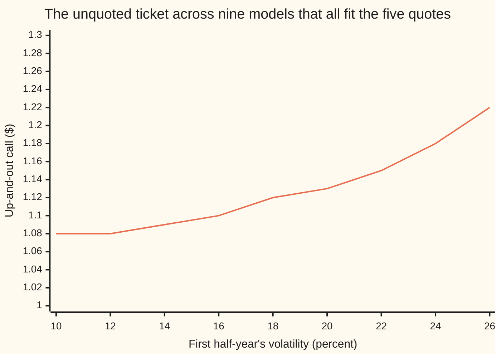

# Model risk: two models that fit today's quotes and disagree tomorrow

[Syllabus](../../../SYLLABUS.md) → [Financial mathematics](../../../SYLLABUS.md#w12) → [Greeks by Numbers and Calibration](../../../SYLLABUS.md#w12-s07) → Model risk

---

## General Overview

Acme shares trade at $100. Five one-year calls on Acme are quoted in the market — the right to buy one share at a fixed price on one day next year — struck at $90, $95, $100, $105 and $110, at $15.12, $11.94, $9.23, $6.99 and $5.19, to the cent here and at full precision in the check.

Two desks fit a model to those five prices. Desk A's model gives Acme one volatility, one number for how hard the share swings, for the whole year; the fit picks 20%. Desk B's model lets that number change at mid-year; its solver stops at 10% for the first six months, and 26.4575% for the second follows from the first. Both reproduce all five quotes to the last printed digit. Neither fit is a compromise: the leftover error is zero for both, and the fitting score that [Calibration](06-calibration-as-least-squares.md) minimises reads 0.000000 either way.

A client then asks for a different ticket: the same call struck at $100, cancelled outright the moment Acme touches $120. That contract is an **up-and-out call**, the name used from here on. Desk A prices it at $1.13, desk B at $1.08: a gap of 5.02% of desk B's price. Nothing quoted in this market says which desk is right.

That surviving disagreement is **model risk**: the price differences left over after every quoted instrument has been matched. The money a bank holds back against it is a **model reserve**.

**What a fit pins down is what the quoted contracts can see, and nothing more; anything else the fitted model is asked for comes out as a range, whose width is the number to manage.**

**What kind of fact this is:** a method — how to put a number on model risk — resting on a counterexample proved on this card in Why it works.

### The picture: every fit along this curve is perfect



Each point splits the year's movement between its two halves a different way, and each one reproduces the five quoted calls exactly: the quoted one-year $100 call sits at $9.23 all the way across. The unquoted ticket sits nowhere, running from $1.08 on the left to $1.22 on the right, a spread of 13.31% of the cheapest. Desk A lives at 20% on this axis, desk B at 10%.

---

## The formula

Notation first, in words. Volatility is written $\sigma$, said "sigma": the fraction a share price swings in a year. What adds up over time is not volatility but **variance** — volatility squared, times the years it runs for. A subscript names the piece of the year it belongs to, so $\sigma_1$ is the first half-year's volatility and $\sigma_2$ the second's, while $\sigma_A$ is desk A's single number for the lot.

$$\sigma_1^2\,\frac{T}{2} \;+\; \sigma_2^2\,\frac{T}{2} \;=\; \sigma_A^2\,T$$

**Read it aloud:** the two halves' variances add up to the year's variance, and the year's variance is the only thing a one-year option can see.

Every pair of volatilities obeying that one equation is a model that fits the quotes. There are infinitely many, so the fit does not choose one. Pricing the untraded ticket in each gives a range, and the reserve is its width:

$$R \;=\; \max V \;-\; \min V \quad\text{over every model whose prices match the quotes}$$

**Read it aloud:** price the untraded ticket in every model that fits, and keep the distance between the highest and the lowest answer.

| Symbol | Plain meaning | In our example | Push it up and the answer… |
| --- | --- | --- | --- |
| $S$ | Acme's price today | $100 | the ticket gains, then loses as the barrier nears |
| $K$ | the **strike**: the price the calls and the ticket may buy at | $100 | every call is worth less |
| $H$ | the **barrier**: touch it and the ticket is cancelled | $120 | the ticket rises toward a plain call |
| $T$, $\tau$ | time to expiry in years, and the length of one stretch inside it | 1, and 0.5 per half-year | more variance to split, and a wider disagreement |
| $r$, $q$ | the riskless rate and the dividend yield, both continuously compounded | 5%, 2% | the drift $\nu$ moves with them |
| $\sigma$, $\sigma_A$ | volatility, and desk A's single volatility for the year | 20% | every call gains; the ticket peaks, then falls, since it can be cancelled |
| $\sigma_1$, $\sigma_2$ | desk B's first-half and second-half volatilities | 10%, 26.4575% | raising $\sigma_1$ forces $\sigma_2$ down, and the ticket gets dearer |
| $V$ | the up-and-out call's price under one fitted model | $1.132492 or $1.078375 | — |
| $R$ | the reserve: dearest minus cheapest $V$ across the fitting models | $0.054117 for the two desks | more capital tied up against one ticket |
| $\nu$ | the drift of Acme's log price in the pricing world, $r - q - \tfrac12\sigma^2$ | 0.01 for desk A | the barrier is reached sooner |
| $a$ | the climb from today's price to the barrier, in logs, $\ln(H/S)$ | 0.1823 | the barrier is further away |
| $s$, $\mu$, $k$ | one stretch's spread $\sigma\sqrt{\tau}$, the centre of a bell curve, and the climb to the strike $\ln(K/S)$ | — | — |
| $G$, $N$, $p$ | the bell curve's height, the area under it to the left of a point, and the density left after the cancelled paths are removed | — | — |

One helper formula does the barrier work. Over a stretch of the year at one volatility, Acme's log-move — the change in the logarithm of its price — lands with the ordinary bell-curve density $G$, whose spread is $\sigma$ times the square root of the stretch, except that the paths which touched the barrier are gone. What is left is

$$p(y) \;=\; G(y - \nu\tau) \;-\; e^{2\nu a/\sigma^{2}}\,G(y - 2a - \nu\tau),$$

the bell curve minus its own mirror image about the barrier, the mirror weighted so that the two cancel exactly at the barrier. What survives is the paths that stayed below it.

### When it holds

- **The volatility path is fixed in advance.** Both models settle the whole path on day one. If volatility is itself random, the one-year law stops being one bell curve and the five quotes stop fitting exactly, and the disagreement widens rather than closes.
- **The barrier is watched at every instant.** These prices cancel the ticket the moment Acme touches $120. A contract that checks only at the daily close is cancelled less often and is worth more, so the monitoring clause is part of the model, not paperwork.
- **One expiry is quoted.** The counterexample works because all five quotes share one expiry date. A quote at a second date pins a second piece of the variance, which is what the week below does.
- **This shelf's pricing world.** Prices are discounted averages under the risk-neutral measure, $r$ and $q$ flat, no bid-offer inside the model. These five quotes also carry no smile, which is why both fits land exactly; against real quotes, with a bid-offer as the fitting tolerance, more models fit and the reserve is wider.

Conventions verified 19 September 2026: quotes are dollar prices of European calls, volatility a percent a year, $r$ and $q$ continuously compounded, and the barrier watched continuously rather than at a daily close.

---

## Why it works

### Step 0: fitting matches numbers, it does not choose a world

Five quotes are five numbers. A model is a whole story about how Acme moves between now and next year; calibration turns its dials until it reproduces those five numbers. Everything the quoted contracts cannot see is left exactly as the modeller set it.

### Step 1: a plain call sees the finishing price and nothing else

A one-year call pays whatever Acme's price on the expiry day exceeds the strike, and nothing otherwise: one number read on one day. Its price therefore depends only on the spread of finishing prices, the terminal distribution, never on the route taken there. Two models that agree about the finishing prices agree about every call and put at that expiry, at every strike, to the last digit.

### Step 2: variance adds, so a year of one-date quotes pins one number

With the volatility path fixed in advance, the logarithm of Acme's finishing price is a bell curve whose spread squared is the variance totalled over the year. Desk A totals $0.20^2 \times 1 = 0.04$. Desk B totals $0.10^2 \times 0.5 + 0.264575^2 \times 0.5 = 0.005 + 0.035 = 0.04$. Same total, same bell curve, same five prices.

That is why the fitting score is zero twice over, and zero at every point on the curve drawn above. The score has no valley bottom to find, it has a flat floor: a solver returns whichever point on the floor it started nearest. The fit is not badly conditioned, it is **not identified** — the quotes carry no information about the split at all.

### Step 3: the up-and-out call watches the whole path

The ticket needs two things: Acme must finish between $100 and $120, and it must never touch $120 on the way. The second condition reads the whole path, so the order in which the movement arrives now matters.

Front-loading the movement makes the ticket dearer. A wild first half cancels some tickets early and scatters the survivors under the barrier; a calm second half holds them there, so the ones above $100 finish in the money without ever touching $120. Back-loading does the opposite: Acme sits near $100 for six months, then gets flung through the barrier or well below the strike. Desk B, calm half first, is the back-loaded case: $1.08 against desk A's $1.13.

### Step 4: the reserve is the width of the range, not the middle of it

Collect the models that fit — here the nine on the curve above — price the ticket in each, and report two numbers instead of one. Across those splits the ticket runs from $1.08 to $1.22, a reserve of 13.31% of the cheapest. The family reaches on to the 28.2843% ceiling found below, so a wider scan gives a wider reserve. A desk short 10,000 of these tickets has booked either $10,783.75 or $12,219.10 of liability, and the $1,435.35 between them is money held back, not profit.

<details>
<summary>Detailed proof: the cancelled-path density, and the closed form it gives</summary>

Over a stretch of $\tau$ years at one volatility, the log-move of Acme's price is $\nu\tau$ plus a bell-curve wobble of spread $s = \sigma\sqrt{\tau}$, with $\nu = r - q - \tfrac12\sigma^2$. Dividing by $\sigma$ makes it a Brownian motion with drift $\nu/\sigma$ against a barrier at the fixed level $a/\sigma$, and for that the joint law of the endpoint and the running maximum is known. Tilting the drift away by Girsanov's theorem, reflecting the driftless paths in the barrier, then tilting back gives, for every landing place below the barrier,
$$\Pr\big[\text{log-move} \in dy,\ \text{never touched } a\big] \;=\; \big[G(y - \nu\tau) - e^{2\nu a/\sigma^{2}}G(y - 2a - \nu\tau)\big]\,dy .$$
The subtracted term is the density's mirror image about the barrier, scaled by the one weight that makes the bracket vanish at the barrier itself. Every path that touched is removed, once.

The payoff $(Se^{y}-K)^{+}$ is positive above $\ln(K/S)$ and the ticket is alive only below $a$, so the price is that density integrated between the two and discounted. Each term needs two standard bell-curve integrals,
$$\int_k^a G(y-\mu)\,dy = N\!\Big(\tfrac{a-\mu}{s}\Big) - N\!\Big(\tfrac{k-\mu}{s}\Big), \qquad \int_k^a e^{y}G(y-\mu)\,dy = e^{\mu + s^2/2}\Big[N\!\Big(\tfrac{a-\mu-s^2}{s}\Big) - N\!\Big(\tfrac{k-\mu-s^2}{s}\Big)\Big],$$
where $N$ is the area under the bell curve to the left of a point. Four such pieces, discounted by $e^{-rT}$, are the closed form the code calls `uoc`: Merton's 1973 knock-out result with the barrier above rather than below.

Two volatilities need one more integral and no new mathematics: carry Acme to mid-year with the same density, touched paths already gone, then run the closed form from wherever it lands. The code's third road does both halves numerically instead and lands on the same two prices — the check that the reflected term is weighted right.

</details>

Another route skips the family scan: let volatility be anything inside a band, and the dearest and cheapest prices consistent with that band solve a pair of differential equations directly. The uncertain-volatility paper in Sources does it that way.

---

## Worked numbers, by hand

Acme at $100, strike $100, barrier $120, $r = 5\%$, $q = 2\%$, one year. Desk A fits one volatility; desk B splits the year at six months. Money runs to six decimals here: the gap being measured is five cents on a one-dollar ticket.

| Step | Arithmetic | Value |
| --- | --- | --- |
| the year's variance, desk A | $0.20 \times 0.20 \times 1$ | 0.04 |
| the first half's variance, desk B | $0.10 \times 0.10 \times 0.5$ | 0.005 |
| what the second half must supply | $0.04 - 0.005$ | 0.035 |
| the second half's volatility | $\sqrt{0.035/0.5}$ | 26.4575% |
| one-year $100 call, desk A | closed form | $9.227006 |
| the same, desk B, half a year at a time | two bell curves, composed | $9.227006 |
| up-and-out call, desk A | cancelled-path density | **$1.132492** |
| up-and-out call, desk B | mid-year density, then the closed form | **$1.078375** |
| the gap | $1.132492 - 1.078375$ | **$0.054117** |
| the gap as a percent of desk B | $0.054117 / 1.078375$ | **5.02%** |
| across the nine splits scanned, 10% to 26% | $1.221910 - 1.078375$ | **$0.143535**, 13.31% |

Both desks priced the quoted call at $9.227006, the shelf's one-year call to the digit, and the unquoted ticket 5.02% apart. Pushing the barrier out to $1,000 makes the ticket unkillable, and the same machinery returns $9.227006 again: the barrier code has not broken the plain call.

### What breaks if you drop a piece

| Mistake | Comes out at | What went wrong |
| --- | --- | --- |
| Pricing the ticket off the one-year quotes alone on Monday | $1.132492 where the identified model says $1.198950 | The six-month quote carried information about the path, and it was dropped |
| Splitting the year by subtracting volatilities: twice 20%, less day 1's first half | second half 15.0111%, and the one-year $100 call then prices at $9.459325 instead of $9.227006 | Variances add over time; volatilities do not |
| Reading the zero fitting score as proof the model is right | 0.000000 for every split from 10% to 26%, while the ticket moves 13.31% | The score measures agreement with the quotes and nothing else |
| Quoting the midpoint and holding nothing back | $1.105433 | No model produces the midpoint, so nothing hedges it; the spread is the risk |

Every number in both tables is printed by the code below.

---

## The week the quoted calls stood still

The five one-year quotes did not move a cent from Monday to Friday. Over the same week the fitted second-half volatility fell from 13.25% to 3.96% and then stopped existing, and the ticket went from $1.20 to $1.31 and then had no price at all. One extra quote did all of that: the six-month $100 call, which climbed from $7.68 to $8.73.

A second expiry pins the split. The six-month quote fixes the first half's volatility on its own, inverted from the price by the bisection of [Solving backwards](05-root-finding-for-inverses.md), and the year's variance then leaves the second half no choice: desk B's model is suddenly identified. Desk A's model has no room for the second quote at all, and prices the six-month call at $6.31 every day of the week whatever the market says.

| Day | Six-month quote | First half | Second half | Desk A's ticket | Desk B's ticket | Desk A's six-month miss |
| --- | --- | --- | --- | --- | --- | --- |
| Monday | $7.68 | 24.99% | 13.25% | $1.13 | $1.20 | −$1.37 |
| Tuesday | $7.96 | 26.01% | 11.12% | $1.13 | $1.22 | −$1.65 |
| Wednesday | $8.23 | 26.99% | 8.46% | $1.13 | $1.25 | −$1.92 |
| Thursday | $8.51 | 28.01% | 3.96% | $1.13 | $1.31 | −$2.20 |
| Friday | $8.73 | 28.81% | none | $1.13 | none | −$2.42 |

Desk A is not merely disagreeing about the ticket, it is **falsified**: no single volatility reproduces both the five one-year quotes and the six-month one, and by Friday its six-month price is $2.42 out. That is the out-of-sample test, and it is what makes a second expiry worth quoting. Desk B passes the test and pays for it with an unstable dial.

The instability is arithmetic, not bad luck. The second half's variance is what is left after the first half's is taken away, and a difference of two close numbers moves further than either. Four days of a climbing near-dated quote empty it out:

```
second-half volatility the quotes leave, percent
  day 1  █████████████  13.25
  day 2  ███████████  11.12
  day 3  ████████  8.46
  day 4  ████  3.96
  day 5  no fit
```

Friday's quote leaves nothing. Six months at 28.81% is more variance than the whole year at 20%, and a volatility path fixed in advance can never lose variance as time passes, so the second half would need a negative one. The wall sits at 28.2843%, which is 20% times the square root of two. Beyond it these two quotes belong to no model of this kind, and a solver told to fit them anyway returns a boundary value with a straight face. Either a quote is stale, or the market is pricing something no fixed volatility path contains.

---

## Code, from first principles, and it actually runs

Nothing below imports anything that already knows an answer: the bell-curve area is built from `math.erf` in Python and from thin slices under the curve in Rust, the cancelled-path density and both integrals are written out, and the volatility inversion is a bisection. The ticket is priced three independent ways: the closed form; half a year of cancelled-path density followed by the closed form; and both halves by numerical integration, no closed form anywhere. That third road also reprices the five quotes under desk B's model.

### Python

```python
# Model risk and parameter stability -- the check behind the card.  Standard
# library only.  Two models are fitted to the same five one-year Acme calls and
# then asked for an up-and-out call.  Nothing imported knows an answer: the
# bell-curve area comes from math.erf, the knocked-out density and both
# integrals are written out here, and the volatility inversion is a bisection.
from math import log, sqrt, exp, erf, pi

def N(x):       return 0.5 * (1.0 + erf(x / sqrt(2.0)))               # bell-curve area left of x
def G(y, m, s): return exp(-0.5 * ((y - m) / s) ** 2) / (s * sqrt(2.0 * pi))

def call(S, K, r, q, sig, T):                                          # plain Black-Scholes call
    v = sig * sqrt(T)
    d1 = (log(S / K) + (r - q + 0.5 * sig * sig) * T) / v
    return S * exp(-q * T) * N(d1) - K * exp(-r * T) * N(d1 - v)

def uoc(S, K, H, r, q, sig, tau):
    # Road 1: up-and-out call under one volatility, in closed form.
    if S >= H: return 0.0
    a, k, nu = log(H / S), log(K / S), r - q - 0.5 * sig * sig
    s, A = sig * sqrt(tau), exp(2.0 * (r - q - 0.5 * sig * sig) * log(H / S) / (sig * sig))
    mass = lambda m: N((a - m) / s) - N((k - m) / s)                   # chance of landing in (K, H)
    share = lambda m: exp(m + 0.5 * s * s) * (N((a - m - s * s) / s) - N((k - m - s * s) / s))
    return exp(-r * tau) * (S * (share(nu * tau) - A * share(2.0 * a + nu * tau))
                            - K * (mass(nu * tau) - A * mass(2.0 * a + nu * tau)))

def killed(y, a, nu, sig, tau):
    # density of the log-move y after tau years, with every path that touched a removed
    if y >= a: return 0.0
    s = sig * sqrt(tau)
    return G(y, nu * tau, s) - exp(2.0 * nu * a / (sig * sig)) * G(y, 2.0 * a + nu * tau, s)

def simpson(f, lo, hi, n):
    h, t = (hi - lo) / n, f(lo) + f(hi)
    for i in range(1, n): t += (4.0 if i % 2 else 2.0) * f(lo + i * h)
    return t * h / 3.0

def two_step(S, K, H, r, q, s1, s2, t1, t2, n=1200):
    # Road 2: half a year of knocked-out density, then road 1 from wherever it lands
    a, nu = log(H / S), r - q - 0.5 * s1 * s1
    f = lambda y: killed(y, a, nu, s1, t1) * uoc(S * exp(y), K, H, r, q, s2, t2)
    return exp(-r * t1) * simpson(f, nu * t1 - 8.0 * s1 * sqrt(t1), a, n)

def nested(S, K, H, r, q, s1, s2, t1, t2, n=600):
    # Road 3: both halves by numerical integration, no closed form anywhere
    a, nu1, nu2 = log(H / S), r - q - 0.5 * s1 * s1, r - q - 0.5 * s2 * s2
    def inner(y):                                     # from the mid-year price, average the payoff
        S1, k2, a2 = S * exp(y), log(K / S) - y, a - y
        hi = min(a2, nu2 * t2 + 8.0 * s2 * sqrt(t2))
        if hi <= k2: return 0.0
        return simpson(lambda z: killed(z, a2, nu2, s2, t2) * (S1 * exp(z) - K), k2, hi, n)
    f = lambda y: killed(y, a, nu1, s1, t1) * inner(y)
    lo = nu1 * t1 - 8.0 * s1 * sqrt(t1)
    return exp(-r * (t1 + t2)) * simpson(f, lo, min(a, lo + 16.0 * s1 * sqrt(t1)), n)

def implied(price, S, K, r, q, T):                                     # bisection, nothing inverted
    lo, hi = 1e-4, 3.0
    for _ in range(80):
        mid = 0.5 * (lo + hi)
        lo, hi = (lo, mid) if call(S, K, r, q, mid, T) > price else (mid, hi)
    return 0.5 * (lo + hi)

# ---- the house market: Acme at 100, strike 100, barrier 120, 5% rates, 2% dividend, one year ----
S, K, H, r, q, T, t1 = 100.0, 100.0, 120.0, 0.05, 0.02, 1.0, 0.5
strikes = [90.0, 95.0, 100.0, 105.0, 110.0]
quotes = [call(S, k, r, q, 0.20, T) for k in strikes]            # the week's five mid prices
sA = implied(quotes[2], S, K, r, q, T)                           # model A: one volatility, fitted
var = sA * sA * T                                                # the year's total variance
s1 = 0.10; s2 = sqrt(2.0 * var - s1 * s1)                        # model B: same total, split 10/26
vanB = [nested(S, k, 1000.0, r, q, s1, s2, t1, t1) for k in strikes]
uocA, uocA_n = uoc(S, K, H, r, q, sA, T), nested(S, K, H, r, q, sA, sA, t1, t1)
uocB, uocB_n = two_step(S, K, H, r, q, s1, s2, t1, t1), nested(S, K, H, r, q, s1, s2, t1, t1)

print(f"Acme S = {S:.0f}, strike K = {K:.0f}, barrier H = {H:.0f}, r = {r:.0%}, q = {q:.0%}, T = {T:.0f} year")
print(f"model A: one volatility {sA * 100:.4f}%   model B: {s1 * 100:.4f}% then {s2 * 100:.4f}%")
print(f"{'strike':>8}{'quoted call':>14}{'model A':>12}{'model B':>12}")
for k, v, b in zip(strikes, quotes, vanB):
    print(f"{k:>8.0f}{v:>14.6f}{call(S, k, r, q, sA, T):>12.6f}{b:>12.6f}")
rows = [("largest gap, model B against the quotes", f"{max(abs(b - v) for b, v in zip(vanB, quotes)):.6f}"),
        ("fitting score of both models, squared dollars", f"{sum((b - v) ** 2 for b, v in zip(vanB, quotes)):.6f}"),
        ("up-and-out call, model A, closed form", f"{uocA:.6f}"),
        ("  the same, both halves integrated", f"{uocA_n:.6f}"),
        ("up-and-out call, model B, two steps", f"{uocB:.6f}"),
        ("  the same, both halves integrated", f"{uocB_n:.6f}"),
        ("model A minus model B", f"{uocA - uocB:.6f}"),
        ("that gap as a percent of model B", f"{100.0 * (uocA - uocB) / uocB:.2f}"),
        ("barrier moved out to 1000, model A", f"{uoc(S, K, 1000.0, r, q, sA, T):.6f}"),
        ("  the plain one-year call at strike 100", f"{quotes[2]:.6f}")]
for name, v in rows: print(f"{name:<46}{v:>10}")

print("exact-fit family: first-half vol, second-half vol, one-year call, up-and-out call")
fam_x, fam = [10.0 + 2.0 * i for i in range(9)], []
for p in fam_x:
    x = p / 100.0
    y = sqrt(2.0 * var - x * x)
    fam.append(two_step(S, K, H, r, q, x, y, t1, t1))
    print(f"{p:>13.4f}{y * 100:>10.4f}{call(S, K, r, q, sqrt(0.5 * (x * x + y * y)), T):>12.6f}{fam[-1]:>12.6f}")
print(f"{'family spread, cheapest to dearest':<46}{fam[0]:.6f} to {fam[-1]:.6f}")
print(f"{'that spread as a percent of the cheapest':<46}{100.0 * (fam[-1] - fam[0]) / fam[0]:>10.2f}")
print(f"{'chart, first-half vol %':<28}" + "".join(f"{p:>7.0f}" for p in fam_x))
print(f"{'chart, up-and-out call':<28}" + "".join(f"{u:>7.2f}" for u in fam))

# ---- the week: the five one-year quotes never move, one six-month quote climbs ----
six, days = [7.68, 7.96, 8.23, 8.51, 8.73], []
sixA = call(S, K, r, q, sA, t1)
print("day  six-month quote  first-half vol  second-half vol   model A   model B  model A's miss")
for i, price in enumerate(six):
    iv = implied(price, S, K, r, q, t1)
    disc = 2.0 * var - iv * iv
    if disc > 0.0:
        days.append((iv, sqrt(disc), two_step(S, K, H, r, q, iv, sqrt(disc), t1, t1)))
        print(f"{i + 1:>3}{price:>17.2f}{iv * 100:>16.2f}{days[-1][1] * 100:>17.2f}"
              f"{uocA:>10.6f}{days[-1][2]:>10.6f}{sixA - price:>16.2f}")
    else:
        print(f"{i + 1:>3}{price:>17.2f}{iv * 100:>16.2f}{'none':>17}{uocA:>10.6f}{'none':>10}{sixA - price:>16.2f}")
print(f"{'model A own six-month call, unchanged all week':<46}{sixA:>10.6f}")
print(f"{'six-month volatility the week may not pass':<46}{sA * sqrt(2.0) * 100:>10.4f}")
print("second-half volatility the quotes leave, percent")
for i, (iv, fwd, u) in enumerate(days):
    print(f"  day {i + 1}  " + "█" * int(round(fwd * 100)) + f"  {fwd * 100:.2f}")
print("  day 5  no fit")

iv1, fwd1, u1 = days[0]
bad = 2.0 * sA - iv1                                             # volatilities subtracted, not variances
print(f"{'wrong: flat 20% barrier price on day 1':<46}{uocA:.6f} not {u1:.6f}")
print(f"{'wrong: subtracting volatilities, second half':<46}{bad * 100:>10.4f}")
print(f"{'  the one-year call it then gives at 100':<46}"
      f"{call(S, K, r, q, sqrt(0.5 * (iv1 * iv1 + bad * bad)), T):.6f} not {quotes[2]:.6f}")
print(f"{'wrong: midpoint quoted with no reserve':<46}{0.5 * (uocA + uocB):>10.6f}")

assert abs(quotes[2] - 9.227005508154) < 1e-9,            "the house market's one-year call"
assert abs(sA - 0.20) < 1e-9,                             "bisection recovers the quoted 20 percent"
assert max(abs(b - v) for b, v in zip(vanB, quotes)) < 1e-8, "model B reprices all five quotes"
assert abs(uocA - uocA_n) < 1e-6,                         "model A: closed form against integration"
assert abs(uocB - uocB_n) < 1e-6,                         "model B: two steps against integration"
assert abs(uoc(S, K, 1000.0, r, q, sA, T) - quotes[2]) < 1e-9, "a far barrier is no barrier"
assert all(fam[i + 1] > fam[i] for i in range(len(fam) - 1)), "front-loaded variance is worth more"
assert len(days) == 4,                                    "four of the five days admit a split"
assert implied(six[4], S, K, r, q, t1) > sA * sqrt(2.0),   "day 5 breaks the calendar bound"
assert abs(call(S, K, r, q, iv1, t1) - six[0]) < 1e-9,    "the inverted volatility reprices day 1"
print("ALL CHECKS PASS")
```

**Ran 2026-09-19 on macOS, Python 3.14.6, standard library only. All checks passed. Output, pasted from the run:**

```
Acme S = 100, strike K = 100, barrier H = 120, r = 5%, q = 2%, T = 1 year
model A: one volatility 20.0000%   model B: 10.0000% then 26.4575%
  strike   quoted call     model A     model B
      90     15.123708   15.123708   15.123708
      95     11.938528   11.938528   11.938528
     100      9.227006    9.227006    9.227006
     105      6.986920    6.986920    6.986920
     110      5.188582    5.188582    5.188582
largest gap, model B against the quotes         0.000000
fitting score of both models, squared dollars   0.000000
up-and-out call, model A, closed form           1.132492
  the same, both halves integrated              1.132492
up-and-out call, model B, two steps             1.078375
  the same, both halves integrated              1.078375
model A minus model B                           0.054117
that gap as a percent of model B                    5.02
barrier moved out to 1000, model A              9.227006
  the plain one-year call at strike 100         9.227006
exact-fit family: first-half vol, second-half vol, one-year call, up-and-out call
      10.0000   26.4575    9.227006    1.078375
      12.0000   25.6125    9.227006    1.084207
      14.0000   24.5764    9.227006    1.092254
      16.0000   23.3238    9.227006    1.102749
      18.0000   21.8174    9.227006    1.115979
      20.0000   20.0000    9.227006    1.132492
      22.0000   17.7764    9.227006    1.153408
      24.0000   14.9666    9.227006    1.181138
      26.0000   11.1355    9.227006    1.221910
family spread, cheapest to dearest            1.078375 to 1.221910
that spread as a percent of the cheapest           13.31
chart, first-half vol %          10     12     14     16     18     20     22     24     26
chart, up-and-out call         1.08   1.08   1.09   1.10   1.12   1.13   1.15   1.18   1.22
day  six-month quote  first-half vol  second-half vol   model A   model B  model A's miss
  1             7.68           24.99            13.25  1.132492  1.198950           -1.37
  2             7.96           26.01            11.12  1.132492  1.222084           -1.65
  3             8.23           26.99             8.46  1.132492  1.252597           -1.92
  4             8.51           28.01             3.96  1.132492  1.307722           -2.20
  5             8.73           28.81             none  1.132492      none           -2.42
model A own six-month call, unchanged all week  6.307635
six-month volatility the week may not pass       28.2843
second-half volatility the quotes leave, percent
  day 1  █████████████  13.25
  day 2  ███████████  11.12
  day 3  ████████  8.46
  day 4  ████  3.96
  day 5  no fit
wrong: flat 20% barrier price on day 1        1.132492 not 1.198950
wrong: subtracting volatilities, second half     15.0111
  the one-year call it then gives at 100      9.459325 not 9.227006
wrong: midpoint quoted with no reserve          1.105433
ALL CHECKS PASS
```

Three roads, two prices. Closed form and numerical integration agree on both tickets to six decimals, and desk B's five one-year calls, integrated half a year at a time, land on the quotes to nine. In the family table the ticket climbs as the movement is front-loaded while the one-year call column never budges.

### Rust

Same inputs, same labels. Rust has no `erf`, so the bell-curve area is built by adding thin slices under the curve instead.

```rust
// Model risk and parameter stability -- the same check as the Python, in Rust.
// std only, no crates.  Rust has no erf, so the bell-curve area N(x) is built
// the honest way: thin slices under the curve.  Two models are fitted to the
// same five one-year Acme calls and then asked for an up-and-out call.
use std::f64::consts::PI;

fn phi(x: f64) -> f64 { (-0.5 * x * x).exp() / (2.0 * PI).sqrt() }     // bell-curve height at x
fn g(y: f64, m: f64, s: f64) -> f64 { (-0.5 * ((y - m) / s).powi(2)).exp() / (s * (2.0 * PI).sqrt()) }

fn simpson<F: Fn(f64) -> f64>(f: F, lo: f64, hi: f64, n: usize) -> f64 {
    let h = (hi - lo) / n as f64;
    let mut t = f(lo) + f(hi);
    for i in 1..n { t += if i % 2 == 1 { 4.0 } else { 2.0 } * f(lo + i as f64 * h); }
    t * h / 3.0
}

fn n_cdf(x: f64) -> f64 {                                              // bell-curve area left of x
    if x < -12.0 { return 0.0 }
    if x > 12.0 { return 1.0 }
    0.5 + simpson(phi, 0.0, x, 4000)
}

fn call(s: f64, k: f64, r: f64, q: f64, sig: f64, t: f64) -> f64 {     // plain Black-Scholes call
    let v = sig * t.sqrt();
    let d1 = ((s / k).ln() + (r - q + 0.5 * sig * sig) * t) / v;
    s * (-q * t).exp() * n_cdf(d1) - k * (-r * t).exp() * n_cdf(d1 - v)
}

fn uoc(s: f64, k: f64, h: f64, r: f64, q: f64, sig: f64, tau: f64) -> f64 {
    // Road 1: up-and-out call under one volatility, in closed form.
    if s >= h { return 0.0 }
    let (a, kk, nu) = ((h / s).ln(), (k / s).ln(), r - q - 0.5 * sig * sig);
    let sd = sig * tau.sqrt();
    let aa = (2.0 * (r - q - 0.5 * sig * sig) * (h / s).ln() / (sig * sig)).exp();
    let mass = |m: f64| n_cdf((a - m) / sd) - n_cdf((kk - m) / sd);     // chance of landing in (K, H)
    let share = |m: f64| (m + 0.5 * sd * sd).exp()
        * (n_cdf((a - m - sd * sd) / sd) - n_cdf((kk - m - sd * sd) / sd));
    (-r * tau).exp() * (s * (share(nu * tau) - aa * share(2.0 * a + nu * tau))
                        - k * (mass(nu * tau) - aa * mass(2.0 * a + nu * tau)))
}

fn killed(y: f64, a: f64, nu: f64, sig: f64, tau: f64) -> f64 {
    // density of the log-move y after tau years, with every path that touched a removed
    if y >= a { return 0.0 }
    let s = sig * tau.sqrt();
    g(y, nu * tau, s) - (2.0 * nu * a / (sig * sig)).exp() * g(y, 2.0 * a + nu * tau, s)
}

fn two_step(s: f64, k: f64, h: f64, r: f64, q: f64, s1: f64, s2: f64, t1: f64, t2: f64) -> f64 {
    // Road 2: half a year of knocked-out density, then road 1 from wherever it lands
    let (a, nu) = ((h / s).ln(), r - q - 0.5 * s1 * s1);
    let f = |y: f64| killed(y, a, nu, s1, t1) * uoc(s * y.exp(), k, h, r, q, s2, t2);
    (-r * t1).exp() * simpson(f, nu * t1 - 8.0 * s1 * t1.sqrt(), a, 1200)
}

fn nested(s: f64, k: f64, h: f64, r: f64, q: f64, s1: f64, s2: f64, t1: f64, t2: f64) -> f64 {
    // Road 3: both halves by numerical integration, no closed form anywhere
    let n = 600;
    let (a, nu1, nu2) = ((h / s).ln(), r - q - 0.5 * s1 * s1, r - q - 0.5 * s2 * s2);
    let inner = |y: f64| {                            // from the mid-year price, average the payoff
        let (s1p, k2, a2) = (s * y.exp(), (k / s).ln() - y, a - y);
        let hi = a2.min(nu2 * t2 + 8.0 * s2 * t2.sqrt());
        if hi <= k2 { return 0.0 }
        simpson(|z| killed(z, a2, nu2, s2, t2) * (s1p * z.exp() - k), k2, hi, n)
    };
    let f = |y: f64| killed(y, a, nu1, s1, t1) * inner(y);
    let lo = nu1 * t1 - 8.0 * s1 * t1.sqrt();
    (-r * (t1 + t2)).exp() * simpson(f, lo, a.min(lo + 16.0 * s1 * t1.sqrt()), n)
}

fn implied(price: f64, s: f64, k: f64, r: f64, q: f64, t: f64) -> f64 {  // bisection, nothing inverted
    let (mut lo, mut hi) = (1e-4, 3.0);
    for _ in 0..80 {
        let mid = 0.5 * (lo + hi);
        if call(s, k, r, q, mid, t) > price { hi = mid } else { lo = mid }
    }
    0.5 * (lo + hi)
}

fn main() {
    // ---- the house market: Acme at 100, strike 100, barrier 120, 5% rates, 2% dividend, one year ----
    let (s, k, h, r, q, t, t1) = (100.0_f64, 100.0_f64, 120.0_f64, 0.05_f64, 0.02_f64, 1.0_f64, 0.5_f64);
    let strikes = [90.0_f64, 95.0, 100.0, 105.0, 110.0];
    let quotes: Vec<f64> = strikes.iter().map(|&kk| call(s, kk, r, q, 0.20, t)).collect();
    let sa = implied(quotes[2], s, k, r, q, t);                   // model A: one volatility, fitted
    let var = sa * sa * t;                                       // the year's total variance
    let s1 = 0.10_f64; let s2 = (2.0 * var - s1 * s1).sqrt();    // model B: same total, split 10/26
    let van_b: Vec<f64> = strikes.iter().map(|&kk| nested(s, kk, 1000.0, r, q, s1, s2, t1, t1)).collect();
    let (uoc_a, uoc_a_n) = (uoc(s, k, h, r, q, sa, t), nested(s, k, h, r, q, sa, sa, t1, t1));
    let (uoc_b, uoc_b_n) = (two_step(s, k, h, r, q, s1, s2, t1, t1), nested(s, k, h, r, q, s1, s2, t1, t1));
    let gap = van_b.iter().zip(&quotes).map(|(b, v)| (b - v).abs()).fold(0.0_f64, f64::max);
    let score: f64 = van_b.iter().zip(&quotes).map(|(b, v)| (b - v) * (b - v)).sum();

    println!("Acme S = {:.0}, strike K = {:.0}, barrier H = {:.0}, r = {:.0}%, q = {:.0}%, T = {:.0} year",
             s, k, h, r * 100.0, q * 100.0, t);
    println!("model A: one volatility {:.4}%   model B: {:.4}% then {:.4}%", sa * 100.0, s1 * 100.0, s2 * 100.0);
    println!("{:>8}{:>14}{:>12}{:>12}", "strike", "quoted call", "model A", "model B");
    for i in 0..5 { println!("{:>8.0}{:>14.6}{:>12.6}{:>12.6}", strikes[i], quotes[i], call(s, strikes[i], r, q, sa, t), van_b[i]) }
    let rows: Vec<(&str, String)> = vec![
        ("largest gap, model B against the quotes", format!("{:.6}", gap)),
        ("fitting score of both models, squared dollars", format!("{:.6}", score)),
        ("up-and-out call, model A, closed form", format!("{:.6}", uoc_a)),
        ("  the same, both halves integrated", format!("{:.6}", uoc_a_n)),
        ("up-and-out call, model B, two steps", format!("{:.6}", uoc_b)),
        ("  the same, both halves integrated", format!("{:.6}", uoc_b_n)),
        ("model A minus model B", format!("{:.6}", uoc_a - uoc_b)),
        ("that gap as a percent of model B", format!("{:.2}", 100.0 * (uoc_a - uoc_b) / uoc_b)),
        ("barrier moved out to 1000, model A", format!("{:.6}", uoc(s, k, 1000.0, r, q, sa, t))),
        ("  the plain one-year call at strike 100", format!("{:.6}", quotes[2]))];
    for (name, v) in &rows { println!("{:<46}{:>10}", name, v) }

    println!("exact-fit family: first-half vol, second-half vol, one-year call, up-and-out call");
    let fam_x: Vec<f64> = (0..9).map(|i| 10.0 + 2.0 * i as f64).collect();
    let mut fam: Vec<f64> = Vec::new();
    for &p in &fam_x {
        let (x, y) = (p / 100.0, (2.0 * var - p * p / 10000.0).sqrt());
        fam.push(two_step(s, k, h, r, q, x, y, t1, t1));
        println!("{:>13.4}{:>10.4}{:>12.6}{:>12.6}", p, y * 100.0, call(s, k, r, q, (0.5 * (x * x + y * y)).sqrt(), t), fam[fam.len() - 1]);
    }
    let (lo_f, hi_f) = (fam[0], fam[fam.len() - 1]);
    println!("{:<46}{:.6} to {:.6}", "family spread, cheapest to dearest", lo_f, hi_f);
    println!("{:<46}{:>10.2}", "that spread as a percent of the cheapest", 100.0 * (hi_f - lo_f) / lo_f);
    let join = |v: &Vec<f64>, p: usize| v.iter().map(|x| format!("{:>7.*}", p, x)).collect::<Vec<_>>().join("");
    println!("{:<28}{}", "chart, first-half vol %", join(&fam_x, 0));
    println!("{:<28}{}", "chart, up-and-out call", join(&fam, 2));

    // ---- the week: the five one-year quotes never move, one six-month quote climbs ----
    let six = [7.68_f64, 7.96, 8.23, 8.51, 8.73];
    let six_a = call(s, k, r, q, sa, t1);
    let mut days: Vec<(f64, f64, f64)> = Vec::new();
    println!("day  six-month quote  first-half vol  second-half vol   model A   model B  model A's miss");
    for (i, &price) in six.iter().enumerate() {
        let iv = implied(price, s, k, r, q, t1);
        let disc = 2.0 * var - iv * iv;
        if disc > 0.0 {
            let (fwd, u) = (disc.sqrt(), two_step(s, k, h, r, q, iv, disc.sqrt(), t1, t1));
            days.push((iv, fwd, u));
            println!("{:>3}{:>17.2}{:>16.2}{:>17.2}{:>10.6}{:>10.6}{:>16.2}", i + 1, price, iv * 100.0, fwd * 100.0, uoc_a, u, six_a - price);
        } else {
            println!("{:>3}{:>17.2}{:>16.2}{:>17}{:>10.6}{:>10}{:>16.2}", i + 1, price, iv * 100.0, "none", uoc_a, "none", six_a - price);
        }
    }
    println!("{:<46}{:>10.6}", "model A own six-month call, unchanged all week", six_a);
    println!("{:<46}{:>10.4}", "six-month volatility the week may not pass", sa * 2.0_f64.sqrt() * 100.0);
    println!("second-half volatility the quotes leave, percent");
    for (i, (_, fwd, _)) in days.iter().enumerate() {
        println!("  day {}  {}  {:.2}", i + 1, "\u{2588}".repeat((fwd * 100.0).round() as usize), fwd * 100.0);
    }
    println!("  day 5  no fit");

    let (iv1, _, u1) = days[0];
    let bad = 2.0 * sa - iv1;                                    // volatilities subtracted, not variances
    println!("{:<46}{:.6} not {:.6}", "wrong: flat 20% barrier price on day 1", uoc_a, u1);
    println!("{:<46}{:>10.4}", "wrong: subtracting volatilities, second half", bad * 100.0);
    println!("{:<46}{:.6} not {:.6}", "  the one-year call it then gives at 100",
             call(s, k, r, q, (0.5 * (iv1 * iv1 + bad * bad)).sqrt(), t), quotes[2]);
    println!("{:<46}{:>10.6}", "wrong: midpoint quoted with no reserve", 0.5 * (uoc_a + uoc_b));

    assert!((quotes[2] - 9.227005508154).abs() < 1e-9, "the house market's one-year call");
    assert!((sa - 0.20).abs() < 1e-9, "bisection recovers the quoted 20 percent");
    assert!(gap < 1e-8, "model B reprices all five quotes");
    assert!((uoc_a - uoc_a_n).abs() < 1e-6, "model A: closed form against integration");
    assert!((uoc_b - uoc_b_n).abs() < 1e-6, "model B: two steps against integration");
    assert!((uoc(s, k, 1000.0, r, q, sa, t) - quotes[2]).abs() < 1e-9, "a far barrier is no barrier");
    assert!((0..8).all(|i| fam[i + 1] > fam[i]), "front-loaded variance is worth more");
    assert!(days.len() == 4, "four of the five days admit a split");
    assert!(implied(six[4], s, k, r, q, t1) > sa * 2.0_f64.sqrt(), "day 5 breaks the calendar bound");
    assert!((call(s, k, r, q, iv1, t1) - six[0]).abs() < 1e-9, "the inverted volatility reprices day 1");
    println!("ALL CHECKS PASS");
}
```

**Ran 2026-09-19 on macOS, rustc 1.98.1, no crates. All checks passed. Output, pasted from the run:**

```
Acme S = 100, strike K = 100, barrier H = 120, r = 5%, q = 2%, T = 1 year
model A: one volatility 20.0000%   model B: 10.0000% then 26.4575%
  strike   quoted call     model A     model B
      90     15.123708   15.123708   15.123708
      95     11.938528   11.938528   11.938528
     100      9.227006    9.227006    9.227006
     105      6.986920    6.986920    6.986920
     110      5.188582    5.188582    5.188582
largest gap, model B against the quotes         0.000000
fitting score of both models, squared dollars   0.000000
up-and-out call, model A, closed form           1.132492
  the same, both halves integrated              1.132492
up-and-out call, model B, two steps             1.078375
  the same, both halves integrated              1.078375
model A minus model B                           0.054117
that gap as a percent of model B                    5.02
barrier moved out to 1000, model A              9.227006
  the plain one-year call at strike 100         9.227006
exact-fit family: first-half vol, second-half vol, one-year call, up-and-out call
      10.0000   26.4575    9.227006    1.078375
      12.0000   25.6125    9.227006    1.084207
      14.0000   24.5764    9.227006    1.092254
      16.0000   23.3238    9.227006    1.102749
      18.0000   21.8174    9.227006    1.115979
      20.0000   20.0000    9.227006    1.132492
      22.0000   17.7764    9.227006    1.153408
      24.0000   14.9666    9.227006    1.181138
      26.0000   11.1355    9.227006    1.221910
family spread, cheapest to dearest            1.078375 to 1.221910
that spread as a percent of the cheapest           13.31
chart, first-half vol %          10     12     14     16     18     20     22     24     26
chart, up-and-out call         1.08   1.08   1.09   1.10   1.12   1.13   1.15   1.18   1.22
day  six-month quote  first-half vol  second-half vol   model A   model B  model A's miss
  1             7.68           24.99            13.25  1.132492  1.198950           -1.37
  2             7.96           26.01            11.12  1.132492  1.222084           -1.65
  3             8.23           26.99             8.46  1.132492  1.252597           -1.92
  4             8.51           28.01             3.96  1.132492  1.307722           -2.20
  5             8.73           28.81             none  1.132492      none           -2.42
model A own six-month call, unchanged all week  6.307635
six-month volatility the week may not pass       28.2843
second-half volatility the quotes leave, percent
  day 1  █████████████  13.25
  day 2  ███████████  11.12
  day 3  ████████  8.46
  day 4  ████  3.96
  day 5  no fit
wrong: flat 20% barrier price on day 1        1.132492 not 1.198950
wrong: subtracting volatilities, second half     15.0111
  the one-year call it then gives at 100      9.459325 not 9.227006
wrong: midpoint quoted with no reserve          1.105433
ALL CHECKS PASS
```

The two outputs match line for line, from different code taking different routes to the bell-curve area.

> [!TIP]
> **Try changing**
> Guess the direction first, then run it.
> - **Move desk B to the other end of the family.** Set `s1` to `0.26`. The ticket becomes **$1.22**, the five quotes still fit, and the disagreement with desk A has changed sign.
> - **Freeze the week.** Set every entry of `six` to `7.68`. Every day then reports 13.25% and **$1.20**, and the four-day assert fails because a fifth day now fits: an unstable dial is perfectly steady when its quote is.
> - **Take the barrier away.** Price the ticket with `H` at `1000.0` and it becomes the plain call, **$9.23**: a barrier out of reach cancels nothing.
> - **Ask for more variance than the year allows.** Set `s1` to `0.30`. The square root building `s2` is handed a negative number and the run stops: past **28.2843%** there is no second half to find.

---

## The usual mistake

> [!warning]
> **Treating a calibrated price as a measured price.** A fitted model reproduces the quotes it was fitted to; that is arithmetic, not evidence. The five quotes above are matched to the last digit by models that disagree by 13.31% about the next ticket. A price is only as well determined as the instruments that pinned it.
>
> - **Adding volatilities instead of variances.** Splitting 20% a year into 24.99% and 15.0111% looks balanced. It is not: the one-year call then comes out at $9.459325 against a $9.227006 quote.
> - **Curing model risk with more parameters.** A richer model fits more quotes and leaves a flatter floor. Desk B's extra dial bought an exact fit to a second expiry and a second-half volatility that falls from 13.25% to 3.96% in four days.
> - **Testing the fit only on the quotes it was fitted to.** Desk A scores 0.000000 on the five one-year calls and by Friday misses the six-month call by $2.42. The test that bites is the instrument left out.
> - **Letting a solver answer an unidentified question.** On a flat floor the answer is the starting point; on Friday there is no fit at all, and a solver asked for one returns the edge of its box, looking exactly like a fit.

---

## Where you meet it in real life

- **Model reserves on a bank's books.** A barrier or callable book is marked with one model and carries a reserve for the others, sized as the reserve is sized here: a real line in the accounts, released when a quote narrows the range. Part of the bid-offer a dealer shows on an up-and-out call is that same spread.
- **Choosing what to quote, not only what to price.** When an exotic's value hangs on the path, the fix is a traded instrument that sees the path: a second expiry, a forward-starting option, a variance contract. Model risk is measured in prices and cured with market data.
- **Calibration monitors.** Desks track fitted parameters day by day as the table above does, and alarm on a jump: a parameter jumping in a still market means the model is absorbing something it cannot represent.
- **Recomputing the reserve overnight.** The ticket's sensitivity to the split is a bump-and-revalue on a calibrated parameter, run as in [Bump and revalue](01-bump-and-revalue-and-common-random-numbers.md); on a lattice with the barrier on a node it is [Greeks from a tree or grid](04-greeks-from-a-tree-or-grid.md) instead.

> **Say it back**
> Two models can match every quoted price and still disagree about an unquoted one. One gives Acme a single volatility for the year; the other splits the year into halves with the same total variance. A one-year call sees only where Acme finishes, so both fit all five quotes exactly. An up-and-out call also sees whether Acme ever touched $120, so the two price it $1.13 against $1.08, a gap of 5.02% of the cheaper, with nine such splits spanning 13.31%. That width is the model reserve. A second expiry pins the split and falsifies the single-volatility model, at the cost of a fitted second-half volatility that falls from 13.25% to 3.96% in four days and then does not exist.

---

## What this builds on

- [Calibration](06-calibration-as-least-squares.md): the fit itself, and the score being minimised. This card supplies the score's flat floor, where the minimum is reached by infinitely many parameter sets and the solver's answer is its starting point.

## Where this goes next

- [Dupire local volatility](../13-Local%20volatility%20and%20jumps/01-dupire-local-volatility.md): one volatility per price and date, read off a whole surface of quotes, so the split this card could not pin is fitted everywhere at once.
- [The Heston model](../14-Stochastic%20volatility%20-%20Heston%2C%20SABR%20and%20their%20mix/01-heston-model.md): volatility that moves at random, the second family a desk prices the same ticket in.
- [Forward-start options](../17-Averages%2C%20choosers%2C%20compounds%20and%20forward-starts/06-forward-start-options-and-forward-volatility.md): a traded contract that sees the second half's volatility, the kind of quote that narrows the reserve.

A reserve says how far apart defensible models are; it does not say where inside the range to trade. That needs a view on how Acme moves between now and expiry rather than only on where it lands.

---

## Sources

Verified 19 Sep 2026: every link below resolves to the publisher's page.

- Hull, John, and Wulin Suo. "A Methodology for Assessing Model Risk and Its Application to the Implied Volatility Function Model." *Journal of Financial and Quantitative Analysis* 37, no. 2 (2002): 297–318. [doi:10.2307/3595007](https://doi.org/10.2307/3595007). The method this card carries out: fit competing models to the same vanilla quotes, price exotics in each, read the disagreement.
- Cont, Rama. "Model Uncertainty and Its Impact on the Pricing of Derivative Instruments." *Mathematical Finance* 16, no. 3 (2006): 519–547. [doi:10.1111/j.1467-9965.2006.00281.x](https://doi.org/10.1111/j.1467-9965.2006.00281.x). Turns the spread across calibrated models into a coherent measure of model uncertainty: the reserve, done properly.
- Avellaneda, Marco, Arnon Levy, and Antonio Parás. "Pricing and Hedging Derivative Securities in Markets with Uncertain Volatilities." *Applied Mathematical Finance* 2, no. 2 (1995): 73–88. [doi:10.1080/13504869500000005](https://doi.org/10.1080/13504869500000005). The dearest and cheapest price when volatility is known only within a band, solved directly rather than scanned.
- Merton, Robert C. "Theory of Rational Option Pricing." *Bell Journal of Economics and Management Science* 4, no. 1 (1973): 141–183. [doi:10.2307/3003143](https://doi.org/10.2307/3003143). Prices the first knock-out option by reflection; the code's closed form is that result with the barrier above the price.
- Cont, Rama, and Peter Tankov. *Financial Modelling with Jump Processes*. Chapman & Hall/CRC, 2004. [Publisher page](https://www.routledge.com/Financial-Modelling-with-Jump-Processes/Cont-Tankov/p/book/9781584884132). Chapter 13 on calibration: the bid-offer as the fitting tolerance, parameter stability, and out-of-sample testing.
