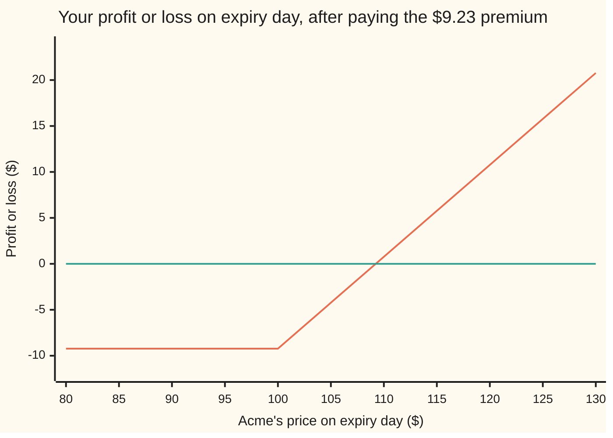
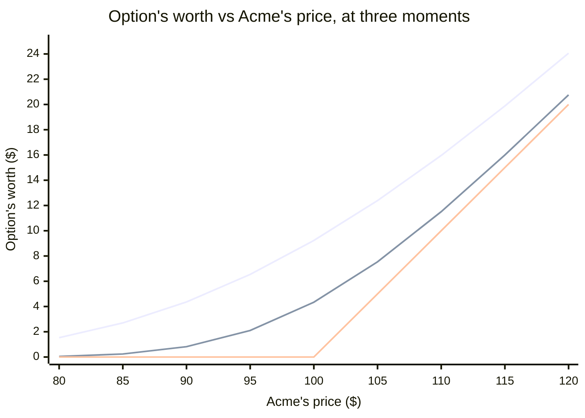

# Black–Scholes call: what a call option is, and what it should cost

Financial mathematics → The Black-Scholes call and put → Black-Scholes → Black-Scholes call

---

## General Overview

Say there's a company. Call it Acme. Its stock trades at **$100** today.

A **call option** is like a ticket. The ticket says: *one year from today, you may buy one share of Acme for $100.* You don't have to. You may. That $100 is called the **strike**, and it's locked in no matter what the stock does.

Two ways the year can end:

- **Acme is at $120.** You use the ticket. You pay $100, you get a share worth $120. You're up **$20**, minus whatever the ticket cost you.
- **Acme is at $80.** You throw the ticket away. Why pay $100 for something selling for $80? You lose only what the ticket cost. Not a cent more.

So a call is a bet that the stock goes up, where the worst case is losing what you paid for it. Unlimited upside. Downside capped. That's why people buy them.

That's the whole idea of an option, so from here on let's call it one. The price you pay for it is called the **premium**.

Which raises the obvious question: **what should the premium be?**

In 1973 Fischer Black and Myron Scholes answered it, and the answer is one of the most important formulas in finance. For our Acme option the answer is about **$9.23**.

The whole idea in one sentence: **the option is worth exactly what it would cost you to build one yourself, out of Acme shares and cash in the bank.** If a real option sold for more than the homemade copy, you'd sell options and build copies all day and pocket the difference. If it sold for less, you'd do the reverse. Free money like that gets eaten instantly, so the price is pinned to the cost of the copy.

Everything below is unpacking what "cost of the copy" means, and why it turns into one clean formula.

**What kind of fact this is:** a model — Acme's price is *taken* to wander in a particular way, which is an assumption, not a law — and, inside it, a theorem: the premium below is proved on this card in Why it works.

### The picture: what you actually walk away with

Acme's price on expiry day runs left to right. What you walk away with, *after* paying the $9.23 premium, runs up and down. The flat line is zero: break even.



Read it left to right. **Below $100:** flat at −$9.23. Acme crashed to $50? You still lose exactly $9.23. That floor is the whole point of buying an option instead of the stock. **The kink at $100** is the strike. From here, every dollar Acme gains is a dollar to you. **Between $100 and $109.23:** climbing, but still underwater, because the first $9.23 of gain just pays back the premium. **At $109.23:** the sloping line crosses the flat one. Break even. **Past that:** pure profit, no ceiling.

("European" means you can only use the option on the one day. "American" options can be used any day up to then. Different contract, later card.)

---

## The formula

$$C = S\,e^{-qT}\,N(d_1) \;-\; K\,e^{-rT}\,N(d_2)$$

Read it aloud: **"The share you might receive, minus the cash you might hand over. Each one shrunk back to today's dollars. Each one weighted by its own chance of happening."**

That's it. The left half is the share. The right half is the cash. Everything else is bookkeeping for those two ideas.

| Symbol | Plain meaning | In our example | Push it up and the premium... |
| --- | --- | --- | --- |
| $S$ | Acme's price **today** | $100 | rises: more to receive |
| $K$ | the **strike**, the price you may buy at | $100 | falls: further to climb, more to hand over |
| $T$ | time until the option expires, in **years** | 1 | rises: more time for a big move |
| $r$ | the **risk-free rate**, what cash earns sitting safely in the bank | 5% | rises a little: the $100 you'd pay later is worth less today |
| $q$ | the **dividend yield**, cash the company pays out to shareholders each year | 2% | falls: dividends leave the share price, and you don't get them until you own the share |
| $\sigma$ | **volatility**, how jumpy the stock is. Say "sigma". | 20% | rises, and this is the input that matters most: more jumpiness means more chance of a big win, and your downside is already capped |
| $N(x)$ | the **bell curve** area to the left of $x$. A probability between 0 and 1. | | |
| $d_2$ | how far Acme is from the strike, measured in "wiggle units" of $\sigma\sqrt{T}$ | 0.05 | |
| $d_1$ | the same distance, plus one wiggle unit | 0.25 | |
| $e^{-rT}$ | the **discount**: what a dollar due in $T$ years is worth today | 0.951 | |
| $e^{-qT}$ | the **dividend drag**: the fraction of a share you need to buy today to end up holding one full share at $T$, dividends reinvested | 0.980 | |

The two $d$'s:

$$d_2 = \frac{\ln(S/K) + (r - q - \tfrac12\sigma^2)\,T}{\sigma\sqrt{T}}, \qquad d_1 = d_2 + \sigma\sqrt{T}$$

In words: the top of $d_2$ is how far the stock is expected to travel toward (or past) the strike in the pretend world you'll meet below. The bottom, $\sigma\sqrt{T}$, is how much it wiggles over the whole year. So $d_2$ is "how many wiggle-units of room Acme has." Then $d_1$ is just one wiggle-unit more. Why one more is the best part of the card, and it's coming.

---

## Why it works

### Step 0: the trick that makes it possible at all

Pricing the option sounds hopeless. The payoff depends on where Acme ends up, and nobody knows that. You'd think a bull and a bear could never agree on a price.

Black and Scholes noticed **you don't need to predict the stock.** Here's why.

Imagine you own one option and you also sell short some Acme shares (borrow them and sell them). Pick the number of shares just right, and for the next tiny slice of time, whatever Acme does, the option and the short shares move in opposite directions by the same amount. Your combined position doesn't care where Acme goes. It's **riskless**.

A riskless pile of money must grow at exactly the bank rate $r$. If it grew faster, everyone would borrow at $r$ and buy the pile: free money. If slower, everyone would sell the pile and put the cash in the bank: free money the other way. Free money can't last.

That one requirement, "the hedged position earns the bank rate," pins the option's price. And notice what dropped out: **your opinion about where Acme is heading.** The hedge cancelled it. Only the *jumpiness* survives.

There's a shortcut for doing the arithmetic. The hedge argument turns out to give exactly the same answer as this recipe:

> **Pretend every asset grows at the bank rate. Average the option's payoff over all the places Acme could end up in that pretend world. Shrink the average back to today's dollars.**

We call it the **pretend world** (finance calls it "risk-neutral"). In it, Acme drifts up at $r - q$ per year, the bank rate minus the dividends that leak out, and wiggles with jumpiness $\sigma$. Nothing about the real world's expected return appears. The rest of this section just does that average by hand.

### Step 1: the payoff is two bets glued together

At expiry the option pays $\max(S_T - K, 0)$: Acme's price minus $100, or zero if that's negative. Split it:

```
  (S_T − K)⁺   =   S_T · [Acme above $100]   −   $100 · [Acme above $100]
                   └─── you GET a share ────┘     └── you HAND OVER cash ──┘
```

The bracket $[\text{Acme above } \$100]$ is a light switch: it's 1 if Acme finishes above the strike, 0 if not. Check it: Acme at $120, switch on, you get a $120 share and hand over $100, net $20. Acme at $80, switch off, nothing happens, net $0. Same as the option.

Why split it? Because each half is easy to price on its own. And each half needs its **own** probability, which is the thing that trips everyone up.

### Step 2: the cash half

You hand over $100, but only if Acme finishes above $100. So the cash half is worth

$$100 \times (\text{chance Acme finishes above } \$100) \times (\text{discount back to today}).$$

In the pretend world, the *logarithm* of Acme's price follows a bell curve (the callout below says why logs). Its centre after one year is $\ln S + (r - q - \tfrac12\sigma^2)T$ and its spread is $\sigma\sqrt{T}$. Acme finishes above $K$ exactly when a standard bell-curve draw $Z$ lands above $-d_2$. By the bell curve's symmetry, that chance is $N(d_2)$.

So the cash half is $K\,e^{-rT}\,N(d_2)$. **$N(d_2)$ is the chance of exercise, counted in dollars.** For Acme it's 0.52: a bit better than a coin flip.

### Step 3: the share half, and why it gets its own probability

Now the other half: you *receive a share*, but only if Acme finishes above $100.

Here's the subtlety. A share is not a fixed dollar amount. It's worth more in exactly the futures where you receive it, because those are the futures where Acme went up. So when you average "one share, if above the strike" over all the futures, the good futures count *extra*: each one is weighted by how valuable the share is there.

Weighting the bell curve by the share's value **slides the whole curve to the right by exactly one wiggle-unit**, $\sigma\sqrt{T}$. Same event, shifted curve. The chance becomes $N(d_2 + \sigma\sqrt{T}) = N(d_1)$.

So the share half is $S\,e^{-qT}\,N(d_1)$. **$N(d_1)$ is the chance of exercise, counted in shares.** For Acme it's 0.60. Higher than 0.52, and it always will be: counting in shares tilts the odds toward the good outcomes.

<details>
<summary>The algebra behind the slide, if you want it</summary>

Inside the average, the share's value contributes a factor $e^{\sigma\sqrt{T}\,z}$ and the bell curve contributes $e^{-z^2/2}$. Multiply them and complete the square:
$$e^{\sigma\sqrt{T}\,z}\,e^{-z^2/2} \;=\; e^{\tfrac12\sigma^2 T}\;e^{-(z-\sigma\sqrt{T})^2/2}.$$
The right-hand side is a bell curve centred at $\sigma\sqrt{T}$ instead of 0. That's the slide. The stray $e^{\frac12\sigma^2 T}$ in front cancels the $-\tfrac12\sigma^2 T$ that was sitting in the pretend world's drift, which is why $d_1$ has $+\tfrac12\sigma^2$ where $d_2$ has $-\tfrac12\sigma^2$. Substitute $u = z - \sigma\sqrt{T}$ and the lower limit $-d_2$ becomes $-d_1$. Done.

</details>

### Step 4: subtract

Share half minus cash half:

$$C = S\,e^{-qT}\,N(d_1) - K\,e^{-rT}\,N(d_2).$$

That's the formula. Two discounted, probability-weighted bets, subtracted. Nothing in it is a guess about the future.

<details>
<summary>Why logarithms? Why a bell curve on $\ln S$ and not on $S$?</summary>

Three reasons, and they're the same reason seen three ways.
- **Prices multiply.** A stock at $100 that goes up 2% then down 2% is at $99.96, not $100. Moves compound. Logs turn multiplication into addition, and addition is what the bell curve describes.
- **Prices can't go below zero.** A bell curve on the price itself would give Acme some chance of trading at −$30. A bell curve on the log can't: as the log runs off to minus infinity, the price just creeps toward zero.
- **Many small shoves add up to a bell curve.** Each day multiplies the price by a number near 1. Add up a year of those small log-moves and you get a bell curve. That's the central limit theorem doing its usual job.

**And the $-\tfrac12\sigma^2$?** Wiggling costs you. Up 50% then down 50% leaves you down 25%, even though the "average move" was zero. The $-\tfrac12\sigma^2 T$ in the drift is the accounting for that drag, so that the *average price* in the pretend world lands exactly on the forward price $S e^{(r-q)T}$. It's not a fudge factor. It's the reason the up-then-down example loses money.

</details>

### The other door: the hedge as an equation

Black and Scholes didn't do the average. They did Step 0 literally: wrote down the hedge, demanded it earn the bank rate, and got a differential equation the option's price has to obey. Solve that equation with the option's payoff as the ending condition and out comes the same formula. Two doors, one room. The equation gets its own card: [black-scholes-equation](07-black-scholes-equation.md).

---

## Worked numbers, by hand

Acme: $S = 100$, $K = 100$, $r = 5\%$, $q = 2\%$, $\sigma = 20\%$, $T = 1$ year.

| Step | Arithmetic | Value |
| --- | --- | --- |
| $\ln(S/K)$ | $\ln(100/100) = \ln 1$ | $0$ |
| pretend-world drift, $r - q - \tfrac12\sigma^2$ | $0.05 - 0.02 - 0.02$ | $0.01$ |
| one wiggle-unit, $\sigma\sqrt{T}$ | $0.20 \times 1$ | $0.20$ |
| $d_2$ | $(0 + 0.01) / 0.20$ | $0.05$ |
| $d_1$ | $0.05 + 0.20$ | $0.25$ |
| $N(d_2)$, chance in dollars | bell-curve table | $0.5199$ |
| $N(d_1)$, chance in shares | bell-curve table | $0.5987$ |
| share half, $100 \times e^{-0.02} \times 0.5987$ | $100 \times 0.9802 \times 0.5987$ | $\$58.69$ |
| cash half, $100 \times e^{-0.05} \times 0.5199$ | $100 \times 0.9512 \times 0.5199$ | $\$49.46$ |
| **premium** | $58.69 - 49.46$ | **$\$9.23$** |
| breakeven at expiry | $100 + 9.23$ | $\$109.23$ |

So a one-year option on a $100 stock with 20% jumpiness costs about $9.23. Roughly 9% of the stock price. That's what "unlimited upside, capped downside" sells for in this market.

Note $N(d_1) = 0.60$ versus $N(d_2) = 0.52$. The share-counted chance is higher, exactly as Step 3 promised.

### What breaks if you drop a piece

Now that you've seen $9.23 come out, here's what happens when one piece goes missing. Every term earns its place. Same Acme option, correct answer $9.23:

| Mistake | Option comes out at | What went wrong |
| --- | --- | --- |
| Forget the discount $e^{-rT}$ on the cash | $6.69 | You charged yourself today's full $100 for a payment due in a year |
| Use $N(d_2)$ for both halves | $1.51 | You counted the share in dollars. The share is worth more where you get it. |
| Use $N(d_1)$ for both halves | $1.73 | You counted the cash in shares. Cash is just cash. |
| Forget the 2% dividend | $10.45 | 13% too expensive. And you'd hedge with 0.64 shares when 0.59 is right. |
| Use $\sigma T$ instead of $\sigma\sqrt{T}$, 4-year option | $31.43 (right: $19.63) | Wiggles add up in *variance*, not in size. Root $T$, not $T$. |
| Use $\sigma T$ instead of $\sigma\sqrt{T}$, 3-month option | $2.37 (right: $4.34) | Same error, other direction: short options come out too cheap |

Every number in that table is reproduced by the code below.

---

## The option has a price every day, not just at expiry

Everything so far priced the option on the day you buy it and cashed it in a year later. But you don't have to wait. **Options trade.** On any day, your option is worth something, and you can sell it for that. What's it worth? Same formula. Plug in Acme's price *that day* and the time *left*.

### One option, one year, followed month by month

You buy the option for $9.23. Here's one way the year could go:

| | Acme's price | Option's worth | Versus the $9.23 you paid |
| --- | --- | --- | --- |
| Day one | $100 | $9.23 | even |
| 3 months in | $110 | **$14.65** | **up $5.42.** You could sell right here. |
| 6 months in | $100 | $6.31 | down $2.92. Acme is back where it started. The option isn't. |
| 9 months in | $95 | $2.10 | down $7.13 |
| Expiry day | $105 | $5.00 | down $4.23. The option pays exactly $105 − $100. |

Two things to notice. In month three the option was worth $14.65, and Acme never had to reach the $109.23 breakeven for you to make money. That breakeven only matters if you hold to the very end. And in month six Acme was back at $100, exactly where it started, yet the option had lost $2.92. The stock did nothing. The clock did it.

So two forces move an option's price. Here they are, one at a time.

### Force one: Acme moves

Freeze the clock at 12 months left and slide Acme's price:

```
Acme today   option's worth, 12 months left
     $80   ██                                $1.53
     $90   ██████                            $4.36
    $100   ████████████                      $9.23
    $110   █████████████████████             $15.96
    $120   ████████████████████████████████  $24.06
```

Acme up $10, from $100 to $110, lifts the option $6.73. About 60 cents per dollar. That 0.6 is the **delta** from the checks: $e^{-qT}N(d_1) = 0.59$. Deep in the money, at $120, the option moves almost dollar for dollar with the stock. Far out of the money, at $80, it barely moves at all.

### Force two: time passes

Now freeze Acme at $100 and let the months tick by:

```
months left  option's worth, Acme stuck at $100
      12   █████████████████████████████████████  $9.23
       9   ████████████████████████████████       $7.88
       6   █████████████████████████              $6.31
       3   █████████████████                      $4.34
       1   ██████████                             $2.42
       0                                          $0.00
```

Nothing happened to the stock, and the option melted to nothing. That's **time decay**. An option is an ice cube: every day that passes without a move is a day of "maybe" that has melted. Traders call the daily melt **theta**. It speeds up near the end. The first three months cost $1.35. The last three cost $4.34.

### Both forces in one picture



Top curve: 12 months left. Middle: 3 months left. Bottom, the hockey stick: expiry day. The curve floats above the stick and sinks onto it as time runs out. The gap between them is the "maybe" you're paying for. Traders call it **time value**. The stick is what the option would pay if you cashed it in this second: **intrinsic value**. At $100 with a year left the option is all maybe: $9.23 of time value, $0 intrinsic. At $120 with a year left it's $20 intrinsic plus $4.06 of maybe.

### The other side of the option

Somebody sold you that option. They took your $9.23 and promised to hand over a share for $100 if you ask. Their picture is yours upside down: they keep the $9.23 if Acme stays under $100, and they lose without limit above it. Selling options is a real business and a real way to blow up. How a seller protects themselves is Step 0 of this card done for real, day after day: [black-scholes-by-delta-hedging](../05-Black-Scholes%20from%20the%20Ground%20Up/03-black-scholes-by-delta-hedging.md).

---

## Code, from first principles, and it actually runs

Nothing below imports a function that already knows the answer. The bell-curve area comes from `math.erf` in Python and from adding up thin slices under the curve in Rust. The price is reached **three independent ways**: the formula, a brute-force average over the bell curve (Simpson's rule), and a 2,000-step coin-flip tree. Then the put is priced separately and put–call parity is checked, delta is checked by nudging the price, and every "what breaks" number above is reproduced.

### Python

```python
# Black-Scholes call -- the check behind the card.  Standard library only.
# Every number quoted on the card is printed here.  Nothing is imported that
# already knows the answer: the normal CDF is built from math.erf, the
# integral is Simpson's rule written out, the tree is a loop.
from math import log, sqrt, exp, erf, pi

def N(x):    return 0.5 * (1.0 + erf(x / sqrt(2.0)))     # bell-curve area to the left of x
def phi(x):  return exp(-0.5 * x * x) / sqrt(2.0 * pi)   # bell-curve height at x

def d1d2(S, K, r, q, sigma, T):
    vt = sigma * sqrt(T)                                  # one "wiggle unit" for the whole life
    d1 = (log(S / K) + (r - q + 0.5 * sigma * sigma) * T) / vt
    return d1, d1 - vt

def call(S, K, r, q, sigma, T):                           # the formula itself
    d1, d2 = d1d2(S, K, r, q, sigma, T)
    return S * exp(-q * T) * N(d1) - K * exp(-r * T) * N(d2)

def by_integral(S, K, r, q, sigma, T, payoff, n=40000):
    # Road 2: average the payoff over the bell curve by brute force (Simpson's rule).
    # Uses no d1, no d2 -- nothing borrowed from the formula.
    a, b = -10.0, 10.0
    h = (b - a) / n
    def f(z):
        ST = S * exp((r - q - 0.5 * sigma * sigma) * T + sigma * sqrt(T) * z)
        return payoff(ST) * phi(z)
    total = f(a) + f(b)
    for i in range(1, n):
        total += (4 if i % 2 else 2) * f(a + i * h)
    return exp(-r * T) * total * h / 3.0

def by_tree(S, K, r, q, sigma, T, steps=2000):
    # Road 3: the coin-flip version (Cox-Ross-Rubinstein).  Up or down each step, then average back.
    dt = T / steps
    u = exp(sigma * sqrt(dt)); d = 1.0 / u
    p = (exp((r - q) * dt) - d) / (u - d)
    disc = exp(-r * dt)
    v = [max(S * u ** j * d ** (steps - j) - K, 0.0) for j in range(steps + 1)]
    for step in range(steps, 0, -1):
        v = [disc * (p * v[j + 1] + (1.0 - p) * v[j]) for j in range(step)]
    return v[0]

# ---- the house example: $100 stock, $100 strike, 1 year, 5% rates, 2% dividend, 20% wiggle ----
S, K, r, q, sigma, T = 100.0, 100.0, 0.05, 0.02, 0.20, 1.0
d1, d2 = d1d2(S, K, r, q, sigma, T)
C        = call(S, K, r, q, sigma, T)
C_int    = by_integral(S, K, r, q, sigma, T, lambda ST: max(ST - K, 0.0))
C_tree   = by_tree(S, K, r, q, sigma, T)
P_int    = by_integral(S, K, r, q, sigma, T, lambda ST: max(K - ST, 0.0))   # the put, priced independently
parity_l = C - P_int
parity_r = S * exp(-q * T) - K * exp(-r * T)
h = 0.01
delta_fd = (call(S + h, K, r, q, sigma, T) - call(S - h, K, r, q, sigma, T)) / (2 * h)
delta_an = exp(-q * T) * N(d1)

# ---- what breaks if you get a piece wrong ----
no_discount = S * exp(-q * T) * N(d1) - K * N(d2)            # forgot e^{-rT}
both_d2     = S * exp(-q * T) * N(d2) - K * exp(-r * T) * N(d2)
both_d1     = S * exp(-q * T) * N(d1) - K * exp(-r * T) * N(d1)
forgot_q    = call(S, K, r, 0.0, sigma, T)                    # priced as if no dividend
def call_sigmaT(S, K, r, q, sigma, T):                       # sigma*T instead of sigma*sqrt(T)
    d1w = (log(S / K) + (r - q + 0.5 * sigma * sigma) * T) / (sigma * T)
    return S * exp(-q * T) * N(d1w) - K * exp(-r * T) * N(d1w - sigma * T)
wrong_4y, right_4y = call_sigmaT(S, K, r, q, sigma, 4.0), call(S, K, r, q, sigma, 4.0)
wrong_3m, right_3m = call_sigmaT(S, K, r, q, sigma, 0.25), call(S, K, r, q, sigma, 0.25)

# ---- try changing ----
vol_40   = call(S, K, r, q, 0.40, T)
vol_10   = call(S, K, r, q, 0.10, T)
k_120    = call(S, 120.0, r, q, sigma, T)
short_in = call(120.0, K, r, q, sigma, 0.01)

rows = [
    ("d1", d1), ("d2", d2), ("N(d1)  chance, counted in shares", N(d1)), ("N(d2)  chance, counted in cash", N(d2)),
    ("share half  S e^-qT N(d1)", S * exp(-q * T) * N(d1)),
    ("cash half   K e^-rT N(d2)", K * exp(-r * T) * N(d2)),
    ("1 formula", C), ("2 Simpson integral", C_int), ("3 tree, 2000 steps", C_tree),
    ("4 put by integral", P_int), ("  C - P", parity_l), ("  S e^-qT - K e^-rT", parity_r),
    ("5 delta by bump", delta_fd), ("  e^-qT N(d1)", delta_an),
    ("breakeven S = K + C", K + C),
    ("wrong: no discount on K", no_discount), ("wrong: N(d2) both halves", both_d2),
    ("wrong: N(d1) both halves", both_d1), ("wrong: forgot the 2% dividend", forgot_q),
    ("wrong: sigma*T, 4 years", wrong_4y), ("  right, 4 years", right_4y),
    ("wrong: sigma*T, 3 months", wrong_3m), ("  right, 3 months", right_3m),
    ("try: sigma = 0.40", vol_40), ("try: sigma = 0.10", vol_10),
    ("try: K = 120", k_120), ("try: S = 120, T = 0.01", short_in),
]
for name, v in rows:
    print(f"{name:<36} {v:>14.6f}")

# ---- the option has a price every day, not just at expiry ----
print()
print("option price: Acme price across, months left down")
spots = (80.0, 90.0, 100.0, 110.0, 120.0)
print(f"{'months left':>12}" + "".join(f"{s:>9.0f}" for s in spots))
for months in (12, 9, 6, 3, 1, 0):
    t = months / 12.0
    vals = [call(s, K, r, q, sigma, t) if t > 0 else max(s - K, 0.0) for s in spots]
    print(f"{months:>12d}" + "".join(f"{v:>9.2f}" for v in vals))
# ---- one story, followed month by month: Acme 100 -> 110 -> 100 -> 95 -> 105 at expiry ----
print()
print("story: paid 9.23 at month 0; Acme's path and the option's worth")
for months, s in ((0, 100.0), (3, 110.0), (6, 100.0), (9, 95.0), (12, 105.0)):
    t = (12 - months) / 12.0
    v = call(s, K, r, q, sigma, t) if t > 0 else max(s - K, 0.0)
    print(f"  month {months:>2}   Acme {s:7.2f}   option {v:6.2f}   vs 9.23 paid: {v - C:+6.2f}")

# ---- chart points for the pictures: Acme 80..120 in $5 steps ----
print()
chart_spots = [80.0 + 5.0 * i for i in range(9)]
print(f"{'chart, Acme price':<22}" + " ".join(f"{s:6.0f}" for s in chart_spots))
for label, t in (("chart, 12 months left", 1.0), ("chart, 3 months left", 0.25), ("chart, expiry day", 0.0)):
    vals = [call(s, K, r, q, sigma, t) if t > 0 else max(s - K, 0.0) for s in chart_spots]
    print(f"{label:<22}" + " ".join(f"{v:6.2f}" for v in vals))
profit_spots = [80.0 + 5.0 * i for i in range(11)]
print(f"{'chart, Acme at expiry':<22}" + " ".join(f"{s:6.0f}" for s in profit_spots))
print(f"{'chart, profit after 9.23':<22}" + " ".join(f"{max(s - K, 0.0) - C:6.2f}" for s in profit_spots))

assert abs(C - 9.227005508154) < 1e-9,        "formula vs the card's worked number"
assert abs(C_int - C) < 1e-7,                 "integral road must land on the formula"
assert abs(C_tree - C) < 0.01,                "tree road within a cent"
assert abs(parity_l - parity_r) < 1e-6,       "put-call parity with an independent put"
assert abs(delta_fd - delta_an) < 1e-6,       "bumped delta vs e^-qT N(d1)"
assert N(d1) > N(d2),                         "share-counted chance must exceed cash-counted chance"
print("ALL CHECKS PASS")
```

**Ran 2026-09-06 on macOS, Python 3.14.6, standard library only. All checks passed. Output, pasted from the run:**

```
d1                                         0.250000
d2                                         0.050000
N(d1)  chance, counted in shares           0.598706
N(d2)  chance, counted in cash             0.519939
share half  S e^-qT N(d1)                 58.685115
cash half   K e^-rT N(d2)                 49.458109
1 formula                                  9.227006
2 Simpson integral                         9.227006
3 tree, 2000 steps                         9.226034
4 put by integral                          6.330081
  C - P                                    2.896925
  S e^-qT - K e^-rT                        2.896925
5 delta by bump                            0.586851
  e^-qT N(d1)                              0.586851
breakeven S = K + C                      109.227006
wrong: no discount on K                    6.691234
wrong: N(d2) both halves                   1.506224
wrong: N(d1) both halves                   1.734407
wrong: forgot the 2% dividend             10.450584
wrong: sigma*T, 4 years                   31.429421
  right, 4 years                          19.632665
wrong: sigma*T, 3 months                   2.365624
  right, 3 months                          4.335886
try: sigma = 0.40                         16.799366
try: sigma = 0.10                          5.471349
try: K = 120                               2.711776
try: S = 120, T = 0.01                    20.025990

option price: Acme price across, months left down
 months left       80       90      100      110      120
          12     1.53     4.36     9.23    15.96    24.06
           9     0.92     3.27     7.88    14.65    22.97
           6     0.39     2.08     6.31    13.19    21.84
           3     0.05     0.82     4.34    11.51    20.76
           1     0.00     0.08     2.42    10.34    20.22
           0     0.00     0.00     0.00    10.00    20.00

story: paid 9.23 at month 0; Acme's path and the option's worth
  month  0   Acme  100.00   option   9.23   vs 9.23 paid:  +0.00
  month  3   Acme  110.00   option  14.65   vs 9.23 paid:  +5.42
  month  6   Acme  100.00   option   6.31   vs 9.23 paid:  -2.92
  month  9   Acme   95.00   option   2.10   vs 9.23 paid:  -7.13
  month 12   Acme  105.00   option   5.00   vs 9.23 paid:  -4.23

chart, Acme price         80     85     90     95    100    105    110    115    120
chart, 12 months left   1.53   2.70   4.36   6.54   9.23  12.39  15.96  19.88  24.06
chart, 3 months left    0.05   0.24   0.82   2.10   4.34   7.54  11.51  16.00  20.76
chart, expiry day       0.00   0.00   0.00   0.00   0.00   5.00  10.00  15.00  20.00
chart, Acme at expiry     80     85     90     95    100    105    110    115    120    125    130
chart, profit after 9.23 -9.23  -9.23  -9.23  -9.23  -9.23  -4.23   0.77   5.77  10.77  15.77  20.77
ALL CHECKS PASS
```

Three roads, one price. The brute-force average lands on the formula to six decimals. The tree is a tenth of a cent off, and gets closer the more steps you give it. The put, priced on its own, satisfies parity to the digit. Delta by nudging matches $e^{-qT}N(d_1)$.

### Rust

Same checks, same inputs. Rust has no `erf`, so the bell-curve area is built by adding up thin slices under the curve. No crates.

```rust
// Black-Scholes call -- the same check as black_scholes_call_check.py, in Rust.
// Standard library only, no crates.  Rust has no erf, so the bell-curve area
// N(x) is built the honest way: add up thin slices under the curve (Simpson).
// Compile: rustc --edition 2021 -O black_scholes_call_check.rs -o /tmp/bs_call_check
use std::f64::consts::PI;

fn phi(x: f64) -> f64 { (-0.5 * x * x).exp() / (2.0 * PI).sqrt() }   // bell-curve height at x

fn simpson<F: Fn(f64) -> f64>(f: F, a: f64, b: f64, n: usize) -> f64 {
    let h = (b - a) / n as f64;
    let mut s = f(a) + f(b);
    for i in 1..n { s += if i % 2 == 1 { 4.0 } else { 2.0 } * f(a + i as f64 * h); }
    s * h / 3.0
}

fn n_cdf(x: f64) -> f64 {                                              // area to the left of x
    if x < -12.0 { return 0.0; }
    if x > 12.0 { return 1.0; }
    0.5 + simpson(phi, 0.0, x, 4000)                                   // half, plus the slice from 0 to x
}

fn d1d2(s: f64, k: f64, r: f64, q: f64, sigma: f64, t: f64) -> (f64, f64) {
    let vt = sigma * t.sqrt();
    let d1 = ((s / k).ln() + (r - q + 0.5 * sigma * sigma) * t) / vt;
    (d1, d1 - vt)
}

fn call(s: f64, k: f64, r: f64, q: f64, sigma: f64, t: f64) -> f64 {
    let (d1, d2) = d1d2(s, k, r, q, sigma, t);
    s * (-q * t).exp() * n_cdf(d1) - k * (-r * t).exp() * n_cdf(d2)
}

fn by_integral<F: Fn(f64) -> f64>(s: f64, r: f64, q: f64, sigma: f64, t: f64, payoff: F) -> f64 {
    let f = |z: f64| {
        let st = s * ((r - q - 0.5 * sigma * sigma) * t + sigma * t.sqrt() * z).exp();
        payoff(st) * phi(z)
    };
    (-r * t).exp() * simpson(f, -10.0, 10.0, 40000)
}

fn by_tree(s: f64, k: f64, r: f64, q: f64, sigma: f64, t: f64, steps: usize) -> f64 {
    let dt = t / steps as f64;
    let u = (sigma * dt.sqrt()).exp();
    let d = 1.0 / u;
    let p = (((r - q) * dt).exp() - d) / (u - d);
    let disc = (-r * dt).exp();
    let mut v: Vec<f64> = (0..=steps)
        .map(|j| (s * u.powi(j as i32) * d.powi((steps - j) as i32) - k).max(0.0))
        .collect();
    for step in (1..=steps).rev() {
        v = (0..step).map(|j| disc * (p * v[j + 1] + (1.0 - p) * v[j])).collect();
    }
    v[0]
}

fn call_sigma_t(s: f64, k: f64, r: f64, q: f64, sigma: f64, t: f64) -> f64 {   // the sigma*T mistake
    let d1w = ((s / k).ln() + (r - q + 0.5 * sigma * sigma) * t) / (sigma * t);
    s * (-q * t).exp() * n_cdf(d1w) - k * (-r * t).exp() * n_cdf(d1w - sigma * t)
}

fn main() {
    let (s, k, r, q, sigma, t) = (100.0_f64, 100.0_f64, 0.05_f64, 0.02_f64, 0.20_f64, 1.0_f64);
    let (d1, d2) = d1d2(s, k, r, q, sigma, t);
    let c = call(s, k, r, q, sigma, t);
    let c_int = by_integral(s, r, q, sigma, t, |st| (st - k).max(0.0));
    let c_tree = by_tree(s, k, r, q, sigma, t, 2000);
    let p_int = by_integral(s, r, q, sigma, t, |st| (k - st).max(0.0));
    let parity_l = c - p_int;
    let parity_r = s * (-q * t).exp() - k * (-r * t).exp();
    let h = 0.01;
    let delta_fd = (call(s + h, k, r, q, sigma, t) - call(s - h, k, r, q, sigma, t)) / (2.0 * h);
    let delta_an = (-q * t).exp() * n_cdf(d1);

    let no_discount = s * (-q * t).exp() * n_cdf(d1) - k * n_cdf(d2);
    let both_d2 = s * (-q * t).exp() * n_cdf(d2) - k * (-r * t).exp() * n_cdf(d2);
    let both_d1 = s * (-q * t).exp() * n_cdf(d1) - k * (-r * t).exp() * n_cdf(d1);
    let forgot_q = call(s, k, r, 0.0, sigma, t);
    let (wrong_4y, right_4y) = (call_sigma_t(s, k, r, q, sigma, 4.0), call(s, k, r, q, sigma, 4.0));
    let (wrong_3m, right_3m) = (call_sigma_t(s, k, r, q, sigma, 0.25), call(s, k, r, q, sigma, 0.25));

    let rows: Vec<(&str, f64)> = vec![
        ("d1", d1), ("d2", d2),
        ("N(d1)  chance, counted in shares", n_cdf(d1)), ("N(d2)  chance, counted in cash", n_cdf(d2)),
        ("share half  S e^-qT N(d1)", s * (-q * t).exp() * n_cdf(d1)),
        ("cash half   K e^-rT N(d2)", k * (-r * t).exp() * n_cdf(d2)),
        ("1 formula", c), ("2 Simpson integral", c_int), ("3 tree, 2000 steps", c_tree),
        ("4 put by integral", p_int), ("  C - P", parity_l), ("  S e^-qT - K e^-rT", parity_r),
        ("5 delta by bump", delta_fd), ("  e^-qT N(d1)", delta_an),
        ("breakeven S = K + C", k + c),
        ("wrong: no discount on K", no_discount), ("wrong: N(d2) both halves", both_d2),
        ("wrong: N(d1) both halves", both_d1), ("wrong: forgot the 2% dividend", forgot_q),
        ("wrong: sigma*T, 4 years", wrong_4y), ("  right, 4 years", right_4y),
        ("wrong: sigma*T, 3 months", wrong_3m), ("  right, 3 months", right_3m),
        ("try: sigma = 0.40", call(s, k, r, q, 0.40, t)), ("try: sigma = 0.10", call(s, k, r, q, 0.10, t)),
        ("try: K = 120", call(s, 120.0, r, q, sigma, t)), ("try: S = 120, T = 0.01", call(120.0, k, r, q, sigma, 0.01)),
    ];
    for (name, v) in &rows { println!("{:<36} {:>14.6}", name, v); }

    // ---- the option has a price every day, not just at expiry ----
    println!();
    println!("option price: Acme price across, months left down");
    let spots = [80.0_f64, 90.0, 100.0, 110.0, 120.0];
    let mut head = format!("{:>12}", "months left");
    for sp in &spots { head.push_str(&format!("{:>9.0}", sp)); }
    println!("{}", head);
    for months in [12u32, 9, 6, 3, 1, 0] {
        let tt = months as f64 / 12.0;
        let mut line = format!("{:>12}", months);
        for sp in &spots {
            let v = if tt > 0.0 { call(*sp, k, r, q, sigma, tt) } else { (sp - k).max(0.0) };
            line.push_str(&format!("{:>9.2}", v));
        }
        println!("{}", line);
    }
    // ---- one story, followed month by month: Acme 100 -> 110 -> 100 -> 95 -> 105 at expiry ----
    println!();
    println!("story: paid 9.23 at month 0; Acme's path and the option's worth");
    for (months, sp) in [(0u32, 100.0_f64), (3, 110.0), (6, 100.0), (9, 95.0), (12, 105.0)] {
        let tt = (12 - months) as f64 / 12.0;
        let v = if tt > 0.0 { call(sp, k, r, q, sigma, tt) } else { (sp - k).max(0.0) };
        println!("  month {:>2}   Acme {:7.2}   option {:6.2}   vs 9.23 paid: {:+6.2}", months, sp, v, v - c);
    }

    // ---- chart points for the pictures: Acme 80..120 in $5 steps ----
    println!();
    let chart_spots: Vec<f64> = (0..9).map(|i| 80.0 + 5.0 * i as f64).collect();
    let mut line = format!("{:<22}", "chart, Acme price");
    line.push_str(&chart_spots.iter().map(|sp| format!("{:6.0}", sp)).collect::<Vec<_>>().join(" "));
    println!("{}", line);
    for (label, tt) in [("chart, 12 months left", 1.0_f64), ("chart, 3 months left", 0.25), ("chart, expiry day", 0.0)] {
        let vals: Vec<String> = chart_spots.iter()
            .map(|sp| if tt > 0.0 { call(*sp, k, r, q, sigma, tt) } else { (sp - k).max(0.0) })
            .map(|v| format!("{:6.2}", v)).collect();
        println!("{:<22}{}", label, vals.join(" "));
    }
    let profit_spots: Vec<f64> = (0..11).map(|i| 80.0 + 5.0 * i as f64).collect();
    let mut line = format!("{:<22}", "chart, Acme at expiry");
    line.push_str(&profit_spots.iter().map(|sp| format!("{:6.0}", sp)).collect::<Vec<_>>().join(" "));
    println!("{}", line);
    let mut line = format!("{:<22}", "chart, profit after 9.23");
    line.push_str(&profit_spots.iter().map(|sp| format!("{:6.2}", (sp - k).max(0.0) - c)).collect::<Vec<_>>().join(" "));
    println!("{}", line);

    assert!((c - 9.227005508154).abs() < 1e-9, "formula vs the card's worked number");
    assert!((c_int - c).abs() < 1e-7, "integral road must land on the formula");
    assert!((c_tree - c).abs() < 0.01, "tree road within a cent");
    assert!((parity_l - parity_r).abs() < 1e-6, "put-call parity with an independent put");
    assert!((delta_fd - delta_an).abs() < 1e-6, "bumped delta vs e^-qT N(d1)");
    assert!(n_cdf(d1) > n_cdf(d2), "share-counted chance must exceed cash-counted chance");
    println!("ALL CHECKS PASS");
}
```

**Ran 2026-09-06 on macOS, rustc 1.98.1, no crates. All checks passed. Output, pasted from the run:**

```
d1                                         0.250000
d2                                         0.050000
N(d1)  chance, counted in shares           0.598706
N(d2)  chance, counted in cash             0.519939
share half  S e^-qT N(d1)                 58.685115
cash half   K e^-rT N(d2)                 49.458109
1 formula                                  9.227006
2 Simpson integral                         9.227006
3 tree, 2000 steps                         9.226034
4 put by integral                          6.330081
  C - P                                    2.896925
  S e^-qT - K e^-rT                        2.896925
5 delta by bump                            0.586851
  e^-qT N(d1)                              0.586851
breakeven S = K + C                      109.227006
wrong: no discount on K                    6.691234
wrong: N(d2) both halves                   1.506224
wrong: N(d1) both halves                   1.734407
wrong: forgot the 2% dividend             10.450584
wrong: sigma*T, 4 years                   31.429421
  right, 4 years                          19.632665
wrong: sigma*T, 3 months                   2.365624
  right, 3 months                          4.335886
try: sigma = 0.40                         16.799366
try: sigma = 0.10                          5.471349
try: K = 120                               2.711776
try: S = 120, T = 0.01                    20.025990

option price: Acme price across, months left down
 months left       80       90      100      110      120
          12     1.53     4.36     9.23    15.96    24.06
           9     0.92     3.27     7.88    14.65    22.97
           6     0.39     2.08     6.31    13.19    21.84
           3     0.05     0.82     4.34    11.51    20.76
           1     0.00     0.08     2.42    10.34    20.22
           0     0.00     0.00     0.00    10.00    20.00

story: paid 9.23 at month 0; Acme's path and the option's worth
  month  0   Acme  100.00   option   9.23   vs 9.23 paid:  +0.00
  month  3   Acme  110.00   option  14.65   vs 9.23 paid:  +5.42
  month  6   Acme  100.00   option   6.31   vs 9.23 paid:  -2.92
  month  9   Acme   95.00   option   2.10   vs 9.23 paid:  -7.13
  month 12   Acme  105.00   option   5.00   vs 9.23 paid:  -4.23

chart, Acme price         80     85     90     95    100    105    110    115    120
chart, 12 months left   1.53   2.70   4.36   6.54   9.23  12.39  15.96  19.88  24.06
chart, 3 months left    0.05   0.24   0.82   2.10   4.34   7.54  11.51  16.00  20.76
chart, expiry day       0.00   0.00   0.00   0.00   0.00   5.00  10.00  15.00  20.00
chart, Acme at expiry     80     85     90     95    100    105    110    115    120    125    130
chart, profit after 9.23 -9.23  -9.23  -9.23  -9.23  -9.23  -4.23   0.77   5.77  10.77  15.77  20.77
ALL CHECKS PASS
```

The two outputs agree line for line at six decimals. They were produced by different code taking different routes to the bell-curve area, which is the point.

> [!TIP]
> **Try changing**
> Guess the direction first. Then run it.
> - **Double the jumpiness.** Set `sigma = 0.40`. Option goes from $9.23 to **$16.80**. Halve it to `0.10` and it's **$5.47**. Volatility is the input that matters most, and the only one you can't look up.
> - **Raise the strike.** Set `K = 120`. The option drops to **$2.71**. Acme now has to climb 20% before you see a cent, so most of what you're paying for is the chance of a comeback.
> - **Run out of time while deep in the money.** Set `S = 120` and `T = 0.01`. The option is worth **$20.03**, a whisker above the $20 you'd get by using it right now. With no time left, an option is just its payoff.
> - **Starve the tree.** Set `steps=10` in `by_tree`. It lands about twenty cents off. Ten coin flips isn't enough to fake a smooth bell curve; two thousand is.

---

## The usual mistake

> [!warning]
> **Reading the price as a prediction.** It isn't. $9.23 is the cost of building the option out of shares and cash. It says nothing about where Acme is going. A bull and a bear who agree on how *jumpy* Acme is must agree on the price, even while they disagree about everything else.
>
> Four smaller traps, each of which has cost someone real money:
> - **Swapping the two probabilities.** Share half gets $N(d_1)$, cash half gets $N(d_2)$. Put them the wrong way round and the option comes out at a dollar and a half (see the table above). And **$N(d_1)$ is not the chance the option finishes in the money.** That's $N(d_2)$, and only in the pretend world.
> - **Hedging with $N(d_1)$ shares.** The hedge is $e^{-qT}N(d_1)$ shares: 0.59 for Acme, not 0.60. When there are no dividends the two numbers coincide, which hides the mistake until the first dividend-paying stock shows up.
> - **Feeding in last year's volatility.** $\sigma$ has to be the jumpiness the *market* is pricing today, called implied volatility. Historical wiggle is a different number. Desks run this formula backwards far more often than forwards: price in, $\sigma$ out.
> - **Units.** $\sigma$ is 0.20, not 20. $T$ is in years, not days. Rates must be continuously compounded, so a quoted 5% is $\ln(1.05) = 4.88\%$, which moves this option by six cents. Get a unit wrong and the output is nonsense that still looks like a price.

---

## Where you meet it in real life

- **Your brokerage app.** Every option price on the screen was checked against this formula by somebody's computer before it got there.
- **"Trading at 20 vol."** When traders quote an option by its volatility instead of its dollar price, they've run this formula backwards to find the $\sigma$ that reproduces the market price. That number, implied volatility, is what they actually argue about.
- **Employee stock options.** The grant you get at a startup is a call on the company's shares. Its value on the company's books comes from this formula or a cousin of it.
- **The put.** The mirror option, the right to *sell* at $K$. You get it for free from this card via put–call parity: $C - P = Se^{-qT} - Ke^{-rT}$. See [black-scholes-put](02-black-scholes-put.md).
- **The Greeks.** How the price moves when you nudge each input. Delta, $e^{-qT}N(d_1)$, is literally the slope of this card's formula. See [delta](../09-The%20Greeks%2C%20one%20each/01-delta.md).
- **The two halves on their own.** A bet that pays cash if Acme finishes above $100 is the cash half by itself: [cash-or-nothing-digital](../10-Digitals%20and%20the%20implied%20density/01-cash-or-nothing-digital.md). The share half by itself is an asset-or-nothing.
- **Currencies and futures.** Same skeleton. For a currency option, $q$ becomes the foreign interest rate (Garman–Kohlhagen). For an option on a future, $S$ becomes the futures price and $q$ becomes $r$ (Black 76).
- **A whole company.** Merton's view: a company's shares are a call on the company's assets, with the debt as the strike. If the assets are worth more than the debt at maturity, shareholders "exercise" by paying off the debt and keeping the rest.

> **Say it back**
> A call is an option: upside if the stock climbs, downside capped at the premium. Black–Scholes prices it as the cost of copying it with shares and cash, which turns out to equal the average payoff in a pretend world where everything grows at the bank rate. The payoff splits into "get the share" minus "hand over the cash," each with its own probability: $N(d_1)$ counting in shares, $N(d_2)$ counting in dollars, one wiggle-unit apart. The stock's real direction cancels out. The price is the cost of the copy, not a bet on the market.

---

## What this builds on

If any of these felt shaky tonight, go back one card. Each one hands this card a piece.

- [logarithms](../../01-Foundations/03-Powers%2C%20Roots%20and%20Logarithms/05-logarithms.md): why the stock's moves are measured in logs. Prices multiply; logs turn multiplying into adding.
- [normal-distribution](../../09-Probability%20and%20statistics/04-Continuous%20Distributions/04-normal-distribution.md): the bell curve, and $N(x)$, the area under it to the left of $x$. Both probabilities on this card are bell-curve areas.
- Compound interest and discounting: why a dollar due in a year is worth $e^{-rT}$ dollars today, and why rates on this card are "continuously compounded."
- [geometric-brownian-motion](../../11-Stochastic%20processes%20and%20calculus/05-Brownian%20Motion/07-geometric-brownian-motion.md): the model of a stock that wiggles: a steady drift plus random kicks, in log space. It's the engine inside the pretend world.
- [risk-neutral-measure-and-the-fundamental-theorems](../05-Black-Scholes%20from%20the%20Ground%20Up/02-risk-neutral-measure-and-the-fundamental-theorems.md): the pretend world itself, and why pricing there is legitimate rather than a trick.

## Where this goes next

- [black-scholes-put](02-black-scholes-put.md): the mirror option, the right to *sell* at $K$. One line from this card via put–call parity.
- [delta](../09-The%20Greeks%2C%20one%20each/01-delta.md): the grid above taken apart one input at a time: delta, theta, vega and friends.
- [black-scholes-by-delta-hedging](../05-Black-Scholes%20from%20the%20Ground%20Up/03-black-scholes-by-delta-hedging.md): how the seller of an option protects themselves. Step 0 of this card, done for real, day after day.
- [cash-or-nothing-digital](../10-Digitals%20and%20the%20implied%20density/01-cash-or-nothing-digital.md): the cash half of this formula sold as an option on its own.
- [black-scholes-equation](07-black-scholes-equation.md): the other door. The hedge written as an equation the price must obey.

---

## Sources

Verified 6 Sep 2026: every link below resolves to the publisher's page.

- Black, Fischer, and Myron Scholes. "The Pricing of Options and Corporate Liabilities." *Journal of Political Economy* 81, no. 3 (1973): 637–654. [doi:10.1086/260062](https://doi.org/10.1086/260062). The original: the hedge argument and the formula, without dividends.
- Merton, Robert C. "Theory of Rational Option Pricing." *Bell Journal of Economics and Management Science* 4, no. 1 (1973): 141–183. [doi:10.2307/3003143](https://doi.org/10.2307/3003143). Adds the dividend yield $q$; the version on this card.
- Cox, John C., Stephen A. Ross, and Mark Rubinstein. "Option Pricing: A Simplified Approach." *Journal of Financial Economics* 7, no. 3 (1979): 229–263. [doi:10.1016/0304-405X(79)90015-1](https://doi.org/10.1016/0304-405X(79)90015-1). The coin-flip tree used as road 3 in the code.
- Geman, Hélyette, Nicole El Karoui, and Jean-Charles Rochet. "Changes of Numéraire, Changes of Probability Measure and Option Pricing." *Journal of Applied Probability* 32, no. 2 (1995): 443–458. [doi:10.2307/3215299](https://doi.org/10.2307/3215299). Why counting in shares slides the bell curve: the rigorous version of Step 3.
- Hull, John C. *Options, Futures, and Other Derivatives*, 11th ed. Pearson. [Publisher page](https://www.pearson.com/en-us/subject-catalog/p/options-futures-and-other-derivatives/P200000005938). The standard textbook route, chapter "The Black-Scholes-Merton Model".
- Shreve, Steven E. *Stochastic Calculus for Finance II: Continuous-Time Models*. Springer, 2004. [Publisher page](https://link.springer.com/book/9780387401010). The pretend-world average done carefully.
