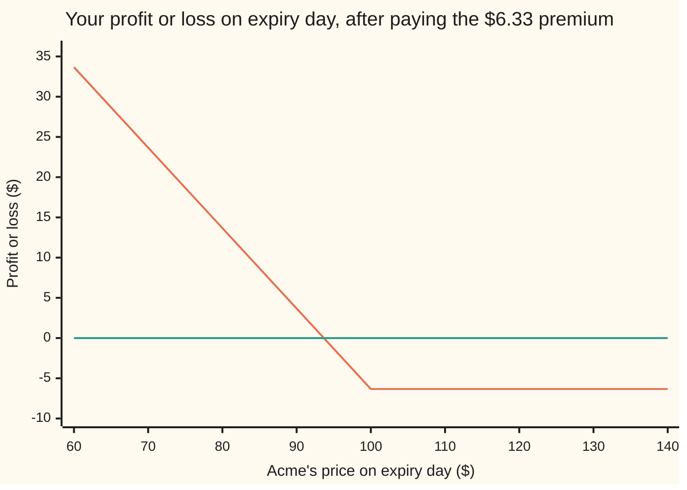
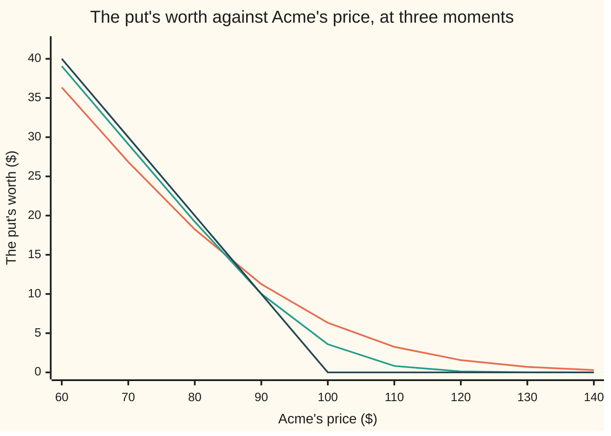

# Black-Scholes put: the right to sell, priced from the same six numbers

[Syllabus](../../../SYLLABUS.md) → [Financial mathematics](../README.md) → [The Black-Scholes call and put](../README.md#s08) → Black-Scholes put

---

## General Overview

Acme shares trade at **$100** today. Beside the ticket that lets you buy one, a second ticket is on sale. It says: *one year from today, you may sell one share of Acme for $100.* You may. You do not have to.

Two ways the year can end:

- **Acme is at $80.** Buy a share on the market for $80, hand it over, collect $100. You are **$20** better off, minus what the ticket cost.
- **Acme is at $120.** Throw the ticket away. Nobody sells a $120 share for $100. You lose only what the ticket cost, not a cent more.

So this ticket pays when Acme falls: insurance on a share you own, or a bet on a fall with the loss capped. The ticket is an **option**, the $100 is the **strike**, what you pay is the **premium** — the same three words as on the buying side ([Black–Scholes call](01-black-scholes-call.md)). From here on the selling ticket is a **put**.

Here the put costs **$6.33**, against $9.23 for the call at the same strike and date. It is cheaper, and not because falls are rarer than rises in real life. In the pricing world built below, Acme is expected to finish at $103.05, so a strike of $100 sits below centre.

**The put is the strike cash you might collect, shrunk to today's dollars and weighted by the chance you collect it, minus the share you might hand over, shrunk for the dividends it sheds and weighted by its own, smaller chance.**

**What kind of fact this is:** a model — Acme's price is *taken* to wander in a particular way, which is an assumption, not a law — and, inside the model, a theorem: the premium below is proved on this card in Why it works.

### The picture: what you walk away with

Acme's price on expiry day runs left to right, the profit or loss after paying the $6.33 premium up and down. The flat line is break even.



Read it right to left, the way a put pays. **Above $100:** flat at −$6.33, whether Acme ends at $101 or $140. That floor under the loss is why a put beats selling the share short. **The kink at $100** is the strike. **At $93.67** the trade breaks even, or at $93.35 once the $6.33 is carried forward a year at the bank rate. **Below that:** profit, dollar for dollar, until Acme reaches zero. A put's gain stops there; a call's has no stop.

("European" means the put can be used on the one day only. A put usable any day up to then is a different and dearer contract: [American options](../15-American%20and%20Bermudan%20exercise/01-american-options-and-early-exercise.md).)

---

## The formula

One piece of notation first, in words. $N(x)$ is the area under the bell curve to the left of $x$: the chance a standard bell-curve draw lands below $x$. A minus on the number inside asks for the other tail. The curve is symmetric, so the area left of $-x$ equals the area right of $x$, giving the identity this card leans on: $N(-x) = 1 - N(x)$. The minus goes inside, never in front.

$$P = K\,e^{-rT}\,N(-d_2) \;-\; S\,e^{-qT}\,N(-d_1)$$

**Read it aloud:** *the cash you might collect, minus the share you might hand over. The cash pulled back to today. The share shrunk for the dividends it sheds on the way. Each weighted by its own chance of the same event.*

The call was share in, cash out. The put is cash in, share out. Both halves sit on the **lower** tail: the endings where Acme finishes below the strike.

| Symbol | Plain meaning | In our example | Push it up and the premium… |
| --- | --- | --- | --- |
| $P$ | the **premium**: what the put costs today | $6.33 | |
| $C$ | the call's premium, same strike and date | $9.23 | |
| $S$ | Acme's price **today** | $100 | falls: the share you hand over is dearer |
| $S_T$ | Acme's price on expiry day, unknown today | $80 or $120 in the two endings | |
| $K$ | the **strike**, the price you may sell at | $100 | rises: more cash to collect |
| $T$ | time to expiry, in **years** | 1 | usually rises: more room for a fall, against a longer wait |
| $r$ | the **riskless rate**, what cash earns in the bank | 5% | falls: the cash you would collect is worth less today |
| $q$ | the **dividend yield**, cash Acme pays shareholders each year | 2% | rises: the share sheds dividends before you deliver it |
| $\sigma$ | **volatility**, how jumpy Acme is. Say "sigma" | 20% | rises: wider spread of endings, loss already capped |
| $N(x)$ | the **bell curve** area left of $x$, a chance from 0 to 1 | | |
| $d_2$ | how far Acme is **expected to finish above** the strike, in wiggle units of $\sigma\sqrt{T}$ | 0.05 | falls: less chance of finishing below |
| $d_1$ | the same distance plus one wiggle unit | 0.25 | |
| $e^{-rT}$ | the **discount**: $100 due in a year is $95.12 today | $95.12 on the strike | |
| $e^{-qT}$ | the **dividend drag**: the fraction of a share bought today that dividends grow into one whole share by expiry | $98.02 on the share | |
| $F$ | the **forward**, $S e^{(r-q)T}$: where Acme is expected to finish in the pricing world | $103.05 | rises: the strike sits further below centre |

The two distances are the call's, unchanged. A put gets no pair of its own:

$$d_2 = \frac{\ln(S/K) + (r - q - \tfrac12\sigma^2)\,T}{\sigma\sqrt{T}}, \qquad d_1 = d_2 + \sigma\sqrt{T}$$

The bottom, $\sigma\sqrt{T}$, is how far Acme wiggles over the life. Only the signs inside $N$ change between the two contracts, because they pay on opposite sides of the same cut.

### When it holds

- **Acme wanders with one fixed jumpiness.** If volatility moves, the price is out by roughly its volatility sensitivity times the move: 37.901157 per 1.00 of volatility, about 38 cents a point here.
- **Rate and dividend yield constant, the dividend a steady trickle.** Real dividends come in lumps on known dates: [Known cash dividends](08-known-cash-dividends.md).
- **Exercise on the one day only.** Allow it early and the put is worth strictly more whenever collecting the cash now beats waiting — the case this card's bar chart sets up: [American options](../15-American%20and%20Bermudan%20exercise/01-american-options-and-early-exercise.md).
- **No fees or spread, and borrowing and short selling in any size.** Drop that and the single price becomes a band: [The Black-Scholes assumptions](09-black-scholes-assumptions-and-failures.md).
- **Price, strike, volatility and time all strictly positive**, since $d_2$ needs a logarithm and a division. At the edges the contract answers instead: with no time left the put is $\max(K - S, 0)$, with no jumpiness $\max(K e^{-rT} - S e^{-qT}, 0)$. Which day-count rule turns two dates into a fraction of a year is a market convention, and belongs to the assumptions card.

---

## Why it works

### Step 0: nobody has to guess where Acme is going

The engine is the one the call card builds. Hold the option, hold the right number of shares against it, and for the next instant the pair does not care which way Acme moves. A position with no randomness must earn the bank rate, or there is free money. That pins the price, and Acme's real expected return cancels out of it.

The shortcut is the same too: pretend every asset drifts at the bank rate. There Acme drifts at $r - q$, the bank rate less the dividends leaking out, and still wiggles with jumpiness $\sigma$. Average the payoff over all the endings, then shrink the average back to today.

### Step 1: the payoff is two payments, both below the strike

At expiry the put pays $\max(K - S_T, 0)$, shortened to $(K - S_T)^+$ below: the strike minus $S_T$, Acme's price on the day, or nothing if that is negative. Split it into the two things that change hands:

```
  (K − S_T)^+  =   $100 · [Acme below $100]   −   S_T · [Acme below $100]
                   └─── you COLLECT cash ───┘      └── you HAND OVER a share ──┘
```

The bracket is a light switch: 1 if Acme finishes below the strike, 0 if not — on at $80, off at $120, exactly the two endings above.

Each payment is easy to price alone. And — this is what trips people — each needs its **own** chance.

### Step 2: the cash half

You collect $100, but only in the endings below $100, so the cash half is worth $100 times the chance of that, discounted back to today.

In the pretend world the *logarithm* of Acme's price is a bell curve ([Lognormal](../../09-Probability%20and%20statistics/04-Continuous%20Distributions/06-lognormal-distribution.md)), centred at $\ln S + (r - q - \tfrac12\sigma^2)T$ with spread $\sigma\sqrt{T}$. Acme finishes below the strike exactly when a standard draw lands below $-d_2$, and that chance is $N(-d_2) = 0.480061$, a shade under a coin flip. So the cash half is $K\,e^{-rT}\,N(-d_2) = 45.664833$. **$N(-d_2)$ is the chance of exercise, counted in dollars.**

It is one minus the call's: 0.480061 and the call's $N(d_2) = 0.519939$ add to 1. Acme ends above the strike or below it, so the two contracts split every ending between them — the seed of Step 4.

### Step 3: the share half, and why its chance is the smaller one

The other payment: you hand over *a share*, in those same endings.

A share is not a fixed number of dollars. It is worth **least** in exactly the endings where you give it away. So an average weighted by the share's own value counts the low endings for less than their plain chance.

That weighting slides the whole bell curve right by one wiggle unit, $\sigma\sqrt{T}$. Same event, slid curve — and a curve slid right has less of itself below the strike. The chance becomes $N(-d_2 - \sigma\sqrt{T}) = N(-d_1) = 0.401294$, under the 0.480061 of Step 2, so the share half is $S\,e^{-qT}\,N(-d_1) = 39.334753$.

**$N(-d_1)$ is that same chance of exercise, weighed in shares instead of dollars.** It is not a rival probability of anything: the plain chance of exercise is $N(-d_2)$, and only in the pretend world. For the call this slide moved weight *into* the paying region and helped. Here it is the identical slide read from the other end, pricing the good news of a put: **you give the share away precisely when it is cheap.**

<details>
<summary>Detailed proof: both tail integrals, written out</summary>

In the pretend world $S_T = S\exp\big((r - q - \tfrac12\sigma^2)T + \sigma\sqrt{T}Z\big)$, with $Z$ a standard bell-curve draw of density $\varphi(z) = e^{-z^2/2}/\sqrt{2\pi}$, and $P = e^{-rT}\,\mathbb{E}\big[\max(K - S_T, 0)\big]$, where $\mathbb{E}$ averages over all endings.

**Where the payoff lives.** $S_T < K$ exactly when $\sigma\sqrt{T}\,Z < \ln(K/S) - (r - q - \tfrac12\sigma^2)T$. Since $\ln(K/S) = -\ln(S/K)$, dividing by $\sigma\sqrt{T}$ makes the right side $-d_2$:
$$P = e^{-rT}\int_{-\infty}^{-d_2}\Big(K - S\,e^{(r - q - \frac12\sigma^2)T + \sigma\sqrt{T}z}\Big)\varphi(z)\,dz.$$
Each half is finite on its own, lying between 0 and $K$.

**The cash half** is $K e^{-rT}\int_{-\infty}^{-d_2}\varphi(z)\,dz = K e^{-rT}N(-d_2)$, from the definition of $N$.

**The share half** needs the square completed, that is, $z^2 - 2az = (z-a)^2 - a^2$ with $a = \sigma\sqrt{T}$:
$$e^{\sigma\sqrt{T}z}\,\varphi(z) = e^{\frac12\sigma^2 T}\,\varphi\big(z - \sigma\sqrt{T}\big).$$
The stray $e^{\frac12\sigma^2 T}$ cancels the $-\tfrac12\sigma^2 T$ in the drift and $e^{-rT}$ cancels the $e^{rT}$, leaving $S e^{-qT}\int_{-\infty}^{-d_2}\varphi(z - \sigma\sqrt{T})\,dz$. Substitute $u = z - \sigma\sqrt{T}$: the upper limit becomes $-d_1$, the integral is $N(-d_1)$, and the share half is $S e^{-qT}N(-d_1)$.

Subtract. Landing exactly on the strike has zero chance, so the cut may read "below" or "at or below". The check does this integral by brute force and lands on the formula to eleven decimals.

</details>

### Step 4: subtract, and a second road with no bell curve in it

Cash half minus share half:

$$P = K\,e^{-rT}\,N(-d_2) - S\,e^{-qT}\,N(-d_1) = 45.664833 - 39.334753 = 6.330081.$$

A shorter road uses no probability at all. For **any** number $x$,

$$\max(K - x,\,0) - \max(x - K,\,0) = K - x.$$

Check it on each side of $K$. In words: own a put, sell a call at the same strike, and whatever Acme does you have agreed to sell one share for $K$. That is a forward sale, worth $K e^{-rT} - S e^{-qT}$ today — the cash you will receive, less the share you will give up, each pulled back. Average and discount the identity, and with $C$ for the call's premium out falls

$$P = C - S\,e^{-qT} + K\,e^{-rT} = 9.227006 - 98.019867 + 95.122942 = 6.330081.$$

The same $6.33$, bell curve never mentioned. This is put-call parity: [Put-call parity](03-put-call-parity.md). As algebra it turns one formula into the other, by substituting $N(d_1) = 1 - N(-d_1)$ and $N(d_2) = 1 - N(-d_2)$ into the call.

<details>
<summary>Two reasons the minus goes inside $N$, not in front of it</summary>

By definition: $N(x)$ is the chance of landing *below* $x$, and the put pays when the draw lands below $-d_2$, so $N(-d_2)$ is read straight off. The call is the one needing symmetry, to turn "above $-d_2$" into $N(d_2)$.

By size: $N$ never leaves the range 0 to 1, so $-N(d_2)$ sits between $-1$ and 0: a negative weight on cash that might arrive. Put that in the cash half alone and the price comes out deeply negative, and an option can be worth nothing, never less. Put a minus in front of both areas and the two flips cancel: out comes $9.227006$, the call's price — the put quoted as the wrong contract.

</details>

A third road exists and this card does not take it: the hedge of Step 0 written as an equation gives one differential equation every option on Acme obeys, with only the payoff fed in at expiry saying which option it is: [The Black-Scholes equation](07-black-scholes-equation.md).

---

## Worked numbers, by hand

Acme: $S = 100$, $K = 100$, $r = 5\%$, $q = 2\%$, $\sigma = 20\%$, $T = 1$ year.

| Step | Arithmetic | Value |
| --- | --- | --- |
| $\ln(S/K)$ | $\ln(100/100) = \ln 1$ | $0$ |
| pretend-world drift, $r - q - \tfrac12\sigma^2$ | $0.05 - 0.02 - 0.02$ | $0.01$ |
| one wiggle unit, $\sigma\sqrt{T}$ | $0.20 \times 1$ | $0.20$ |
| $d_2$ | $(0 + 0.01)/0.20$ | $0.05$ |
| $d_1$ | $0.05 + 0.20$ | $0.25$ |
| $N(-d_2)$, chance below, in cash | area left of $-0.05$ | $0.480061$ |
| $N(-d_1)$, chance below, in shares | area left of $-0.25$ | $0.401294$ |
| the strike, pulled back | $100 \times e^{-0.05}$ | $\$95.12$ |
| the share, less its dividends | $100 \times e^{-0.02}$ | $\$98.02$ |
| cash half, $K e^{-rT} N(-d_2)$ | $95.122942 \times 0.480061$ | $\$45.66$ |
| share half, $S e^{-qT} N(-d_1)$ | $98.019867 \times 0.401294$ | $\$39.33$ |
| **the premium** | $45.66 - 39.33$ | **$\$6.33$** |
| break even at expiry | $100 - 6.33$ | $\$93.67$ |

A year of cover against Acme falling costs $6.33, a little over six percent of the share. Note $N(-d_1) = 0.401294$ against $N(-d_2) = 0.480061$: the share-counted chance is the smaller one here, the larger one for a call.

### What breaks if you drop a piece

Same put, correct answer $6.33$. The code computes each wrong number.

| Mistake | Comes out at | What went wrong |
| --- | --- | --- |
| The minus signs inside $N$ dropped | $-9.23$ | The call's price with a minus sign. A negative price is the tell |
| $N(-d_1)$ on both halves | $-1.16$ | Cash counted in shares. Cash is worth the same in every ending |
| $N(-d_2)$ on both halves | $-1.39$ | The share counted in dollars, though it is cheap where you hand it over |
| The strike cash left undiscounted | $8.67$ | $100 due in a year credited as $100 today. 37% too dear |
| Acme's 2% dividend ignored | $5.57$ | 12% too cheap. Dividends leave the share before you deliver it, raising a put and cutting a call |

---

## The put that is worth less than selling would fetch

Acme has crashed to **$60**. Your ticket lets you sell at $100, so on the back of an envelope it is surely worth $40. The formula says **$36.35**.

Nothing is mispriced. The $40 assumes the $100 can be collected today, and a European put cannot: the cash comes on expiry day or not at all. This far down the put is nearly a plain promise — hand over a share in a year, collect $100 in a year — worth $95.12 less a share shrunk by a year of dividends: the $36.31 in the floor row below. The extra four cents is the small chance of a comeback over $100.

```
  Acme now      100       90       80       70       60       50       40
       put     6.33    11.26    18.24    26.85    36.35    46.11    55.92
 K - S now     0.00    10.00    20.00    30.00    40.00    50.00    60.00
     floor     0.00     6.91    16.71    26.51    36.31    46.11    55.91
```

At $90 the put is worth $11.26, more than the $10.00 selling would fetch. Somewhere between $90 and $80 it slips under, and from there down it closes on the floor in the bottom row, as the chance of a comeback dies. That floor is $95.12 minus the shrunken share, so with Acme at zero the put is worth the whole $95.12. That is a put's **ceiling**; a call's gain has none, because Acme can rise without limit but cannot fall past nothing.

The force doing this is the interest rate, which is what makes cash-in-a-year worth less than cash now. Freeze Acme at $60 and turn the rate dial. One block is $1.00 of put value:

```
riskless rate    the put at Acme $60, where selling now would fetch $40.00
        0%   █████████████████████████████████████████  $41.21
        2%   ███████████████████████████████████████    $39.23
        5%   ████████████████████████████████████       $36.35
        8%   █████████████████████████████████          $33.56
       12%   █████████████████████████████              $29.99
```

With no interest at all the put is worth **$41.21**, above the $40.00: the chance of a comeback, with nothing charged for the wait. Turn the rate up and the put sinks under the $40.00 and keeps going. The table below says the same in one line: the rate sensitivity is $-45.664834$, the cash half of the price, $45.664833$, with a minus sign in front and one year to run; the last digit is the bump's own error. A higher rate also drifts Acme up faster, cutting both chances, but those two shifts cancel exactly — so the discount on the cash half is a rate's whole grip on a put.

### The same put, across Acme's price and across the clock



Three lines. The straight edge, flat on the right and highest of all at the far left, is expiry day, where the put is simply what it pays. At $60 the 3-months-left curve sits under it at $39.06 and the 12-months-left curve under that at $36.35. Near the strike the order reverses: at $90 both curves sit **above** the edge, $10.02 and $11.26 against $10.00, because a further fall may still come and that chance is worth paying for. Deep down it is the waiting that decides, since the strike cash arrives only on expiry day, and both curves cross under the edge between $90 and $80. The shelf takes those two forces apart on [Intrinsic and time value](06-intrinsic-and-time-value.md) and [Shape across strikes and expiries](05-strike-and-calendar-shape.md).

### The five sensitivities, as this shelf reports them

Each is the change in the premium per one unit of the input nudged. What they mean and how they are used is the next shelf's business, from [Delta](../09-The%20Greeks%2C%20one%20each/01-delta.md) on.

| Nudge | Trade name | This put | Reading |
| --- | --- | --- | --- |
| Acme up $1 | delta | $-0.393348$ | moves against the share, 39 cents per dollar |
| Acme up $1, again | gamma | $0.018951$ | delta itself moves, about 2 cents per dollar |
| volatility up 1.00 | vega | $37.901157$ | one point of jumpiness, about 38 cents |
| one year of clock | theta | $-2.293569$ | at this strike the put melts as the year runs down |
| the rate up 1.00 | rho | $-45.664834$ | minus the cash half: the rate's whole grip |

---

## Code, from first principles, and it actually runs

Nothing below imports a function that already knows an answer; the bell-curve area is built by adding thin slices under the curve. The price is reached **four independent ways**: the formula; a brute-force average over the lower tail, whose edge is found by bisection rather than read off $d_2$, so the run confirms $d_2$ too; the call by its own upper-tail integral, turned into the put by parity; and a 2,000-step up-or-down tree. Every number quoted above comes from the same run.

### Python

```python
# Black-Scholes put -- the check behind the card.  Standard library only.  Nothing
# imported already knows an answer: the bell-curve area, the integrator, the root finder
# and the tree are written out below, and every number quoted on the card is printed here.
from math import log, sqrt, exp, pi
def phi(z):                                    # bell-curve height at z
    return exp(-0.5 * z * z) / sqrt(2.0 * pi)
def simpson(f, a, b, n):                       # area under f from a to b, n panels
    h = (b - a) / n
    total = f(a) + f(b)
    for i in range(1, n):
        total += (4.0 if i % 2 else 2.0) * f(a + i * h)
    return total * h / 3.0
def N(x):                                      # bell-curve area to the left of x
    if x < -8.0: return 0.0
    if x > 8.0: return 1.0
    return 0.5 + simpson(phi, 0.0, x, 256)     # half, plus the slice from 0 to x
def d1d2(S, K, r, q, sigma, T):                # the two distances, in wiggle units
    vt = sigma * sqrt(T)
    d2 = (log(S / K) + (r - q - 0.5 * sigma * sigma) * T) / vt
    return d2 + vt, d2
def put(S, K, r, q, sigma, T):                 # road 1: the formula
    d1, d2 = d1d2(S, K, r, q, sigma, T)
    return K * exp(-r * T) * N(-d2) - S * exp(-q * T) * N(-d1)
def call(S, K, r, q, sigma, T):                # the call, for the parity road
    d1, d2 = d1d2(S, K, r, q, sigma, T)
    return S * exp(-q * T) * N(d1) - K * exp(-r * T) * N(d2)
def spot_at(S, r, q, sigma, T, z):             # Acme at expiry, z wiggles out
    return S * exp((r - q - 0.5 * sigma * sigma) * T + sigma * sqrt(T) * z)
def crossing(S, K, r, q, sigma, T):            # bisection: the draw landing on the strike
    lo, hi = -40.0, 40.0
    for _ in range(80):
        mid = 0.5 * (lo + hi)
        lo, hi = (mid, hi) if spot_at(S, r, q, sigma, T, mid) < K else (lo, mid)
    return 0.5 * (lo + hi)
def by_tail(S, K, r, q, sigma, T, want_put, n=4096):
    # road 2: average the payoff over the one tail where it is positive.  The edge of
    # that tail is the bisection above, not d1 or d2, and nothing bends inside it.
    zk = crossing(S, K, r, q, sigma, T)
    if want_put:
        return exp(-r * T) * simpson(
            lambda z: (K - spot_at(S, r, q, sigma, T, z)) * phi(z), -8.0, zk, n)
    return exp(-r * T) * simpson(
        lambda z: (spot_at(S, r, q, sigma, T, z) - K) * phi(z), zk, 8.0, n)
def by_tree(S, K, r, q, sigma, T, steps=2000):
    # road 4: up or down each step (Cox-Ross-Rubinstein), averaged backwards
    dt = T / steps
    tick = sigma * sqrt(dt)                    # one up-tick, measured in logs
    u = exp(tick); d = 1.0 / u
    p = (exp((r - q) * dt) - d) / (u - d)
    disc = exp(-r * dt)
    v = [max(K - S * exp((2 * j - steps) * tick), 0.0) for j in range(steps + 1)]
    for step in range(steps, 0, -1):
        v = [disc * (p * v[j + 1] + (1.0 - p) * v[j]) for j in range(step)]
    return v[0]

# ---- the house market: Acme at $100, strike $100, one year, r 5%, q 2%, sigma 20% ----
S, K, r, q, sigma, T = 100.0, 100.0, 0.05, 0.02, 0.20, 1.0
d1, d2 = d1d2(S, K, r, q, sigma, T)
D, A = exp(-r * T), S * exp(-q * T)            # discount on the strike cash; prepaid share
P, C, P_tree = put(S, K, r, q, sigma, T), call(S, K, r, q, sigma, T), by_tree(S, K, r, q, sigma, T)
P_tail, C_tail = by_tail(S, K, r, q, sigma, T, True), by_tail(S, K, r, q, sigma, T, False)
zk = crossing(S, K, r, q, sigma, T)
def bumped(i, h):                              # move one input up and down, reprice
    lo = [S, K, r, q, sigma, T]; hi = list(lo)
    lo[i] -= h; hi[i] += h
    return (put(*hi) - put(*lo)) / (2.0 * h)
gamma = (put(S + 0.01, K, r, q, sigma, T) - 2.0 * P
         + put(S - 0.01, K, r, q, sigma, T)) / (0.01 * 0.01)
delta, vega, rho, theta = bumped(0, 0.01), bumped(4, 0.0001), bumped(2, 0.0001), -bumped(5, 0.0001)

# ---- what breaks if a piece goes missing ----
signs_lost = K * D * N(d2) - A * N(d1)         # the minus signs inside N dropped
both_md1 = K * D * N(-d1) - A * N(-d1)         # the share's chance on both halves
both_md2 = K * D * N(-d2) - A * N(-d2)         # the cash's chance on both halves
no_disc = K * N(-d2) - A * N(-d1)              # the strike cash left undiscounted
no_div = put(S, K, r, 0.0, sigma, T)           # priced as if Acme paid no dividend

for name, v in [
        ("d2  cash-side distance", d2), ("d1  share-side distance", d1),
        ("-d2 by bisection, no formula", zk),
        ("N(d2)  the call's chance, in cash", N(d2)),
        ("N(d1)  the call's chance, in shares", N(d1)),
        ("N(-d2)  chance below, in cash", N(-d2)),
        ("N(-d1)  chance below, in shares", N(-d1)),
        ("cash half  K e^-rT N(-d2)", K * D * N(-d2)),
        ("share half  S e^-qT N(-d1)", A * N(-d1)),
        ("1 formula", P), ("2 lower-tail integral", P_tail),
        ("3 call, upper-tail integral", C_tail), ("  call by formula", C),
        ("  parity  C - S e^-qT + K e^-rT", C - A + K * D),
        ("  C - P, both by integral", C_tail - P_tail), ("  S e^-qT - K e^-rT", A - K * D),
        ("4 tree, 2000 steps", P_tree), ("ceiling  K e^-rT", K * D),
        ("prepaid share  S e^-qT", A), ("forward  S e^(r-q)T", S * exp((r - q) * T)),
        ("breakeven at expiry  K - P", K - P), ("  breakeven, premium financed", K - P / D),
        ("wrong: minus signs inside N lost", signs_lost),
        ("wrong: N(-d1) on both halves", both_md1),
        ("wrong: N(-d2) on both halves", both_md2),
        ("wrong: strike cash undiscounted", no_disc),
        ("wrong: dividend ignored", no_div)]:
    print(f"{name:<36}{v:>18.12f}")
print()
print("greeks, by bumping one input at a time")
print(f"{'delta':>11}{'gamma':>11}{'vega':>11}{'theta':>11}{'rho':>11}")
print("".join(f"{g:>11.6f}" for g in (delta, gamma, vega, theta, rho)))
print()
print("deep in the money: Acme across, dollars down")
deep = [100.0, 90.0, 80.0, 70.0, 60.0, 50.0, 40.0]
print(f"{'Acme now':>10}" + "".join(f"{s:>9.0f}" for s in deep))
for lab, vals in (("put", [put(s, K, r, q, sigma, T) for s in deep]),
                  ("K - S now", [max(K - s, 0.0) for s in deep]),
                  ("floor", [max(K * D - s * exp(-q * T), 0.0) for s in deep])):
    print(f"{lab:>10}" + "".join(f"{v:>9.2f}" for v in vals))
print()
print("put at Acme 60, where K - S now = 40.00, against the rate")
rates = [0.0, 0.02, 0.05, 0.08, 0.12]
print(f"{'rate':>10}" + "".join(f"{100.0 * x:>8.1f}%" for x in rates))
print(f"{'put':>10}" + "".join(f"{put(60.0, K, x, q, sigma, T):>9.2f}" for x in rates))
print(f"{'floor':>10}" + "".join(f"{K * exp(-x * T) - 60.0 * exp(-q * T):>9.2f}" for x in rates))
print()
spots = [60.0 + 10.0 * i for i in range(9)]
print(f"{'chart, Acme price':<26}" + "".join(f"{s:>8.0f}" for s in spots))
for label, t in (("chart, 12 months left", 1.0), ("chart, 3 months left", 0.25),
                 ("chart, expiry day", 0.0)):
    vals = [put(s, K, r, q, sigma, t) if t > 0 else max(K - s, 0.0) for s in spots]
    print(f"{label:<26}" + "".join(f"{v:>8.2f}" for v in vals))
print(f"{'chart, profit after 6.33':<26}" + "".join(f"{max(K - s, 0.0) - P:>8.2f}" for s in spots))

assert abs(P - 6.330080627550) < 1e-9, "formula vs the shelf's house put"
assert abs(P_tail - P) < 1e-9, "lower-tail integral must land on the formula"
assert abs(zk + d2) < 1e-12, "the bisected crossing must be -d2"
assert abs((C_tail - P_tail) - (A - K * D)) < 1e-9, "parity, both legs integrated"
assert abs((C - A + K * D) - P) < 1e-12, "the put from the call by parity"
assert abs(P_tree - P) < 0.01, "tree road within a cent"
assert abs(delta + exp(-q * T) * N(-d1)) < 1e-6, "bumped delta vs -e^-qT N(-d1)"
assert abs(rho + T * K * D * N(-d2)) < 1e-5, "bumped rho vs -T K e^-rT N(-d2)"
assert N(-d1) < N(-d2), "the share-counted chance below the strike is the smaller one"
assert put(60.0, K, r, q, sigma, T) < 40.0, "the deep put sits below its cash value now"
assert put(60.0, K, r, q, sigma, T) > K * D - 60.0 * exp(-q * T), "but above its floor"
assert put(60.0, K, 0.0, q, sigma, T) > 40.0, "with no interest it sits above that value"
print("ALL CHECKS PASS")
```

**Ran 2026-09-19 on macOS, Python 3.14.6, standard library only. All checks passed. Output, pasted from the run:**

```
d2  cash-side distance                  0.050000000000
d1  share-side distance                 0.250000000000
-d2 by bisection, no formula           -0.050000000000
N(d2)  the call's chance, in cash       0.519938805838
N(d1)  the call's chance, in shares     0.598706325683
N(-d2)  chance below, in cash           0.480061194162
N(-d1)  chance below, in shares         0.401293674317
cash half  K e^-rT N(-d2)              45.664833344749
share half  S e^-qT N(-d1)             39.334752717199
1 formula                               6.330080627550
2 lower-tail integral                   6.330080627552
3 call, upper-tail integral             9.227005508156
  call by formula                       9.227005508154
  parity  C - S e^-qT + K e^-rT         6.330080627550
  C - P, both by integral               2.896924880604
  S e^-qT - K e^-rT                     2.896924880604
4 tree, 2000 steps                      6.329108681552
ceiling  K e^-rT                       95.122942450071
prepaid share  S e^-qT                 98.019867330676
forward  S e^(r-q)T                   103.045453395352
breakeven at expiry  K - P             93.669919372450
  breakeven, premium financed          93.345369198527
wrong: minus signs inside N lost       -9.227005508154
wrong: N(-d1) on both halves           -1.162517629558
wrong: N(-d2) on both halves           -1.390701217579
wrong: strike cash undiscounted         8.671366698964
wrong: dividend ignored                 5.573526022258

greeks, by bumping one input at a time
      delta      gamma       vega      theta        rho
  -0.393348   0.018951  37.901157  -2.293569 -45.664834

deep in the money: Acme across, dollars down
  Acme now      100       90       80       70       60       50       40
       put     6.33    11.26    18.24    26.85    36.35    46.11    55.92
 K - S now     0.00    10.00    20.00    30.00    40.00    50.00    60.00
     floor     0.00     6.91    16.71    26.51    36.31    46.11    55.91

put at Acme 60, where K - S now = 40.00, against the rate
      rate     0.0%     2.0%     5.0%     8.0%    12.0%
       put    41.21    39.23    36.35    33.56    29.99
     floor    41.19    39.21    36.31    33.50    29.88

chart, Acme price               60      70      80      90     100     110     120     130     140
chart, 12 months left        36.35   26.85   18.24   11.26    6.33    3.26    1.56    0.70    0.30
chart, 3 months left         39.06   29.11   19.21   10.02    3.59    0.82    0.12    0.01    0.00
chart, expiry day            40.00   30.00   20.00   10.00    0.00    0.00    0.00    0.00    0.00
chart, profit after 6.33     33.67   23.67   13.67    3.67   -6.33   -6.33   -6.33   -6.33   -6.33
ALL CHECKS PASS
```

Four roads, one price. The formula and the tail integral agree to eleven decimals, and the integral borrows no $d$, so that is evidence rather than restatement. The bisected edge lands on $-d_2$ to twelve decimals. Parity between the two integrated legs reproduces $S e^{-qT} - K e^{-rT}$ exactly as printed. The tree, which knows nothing of bell curves, is a tenth of a cent low and closes as it is given more steps.

### Rust

Same inputs, same labels, same arithmetic in the same order, so the two runs agree byte for byte.

```rust
// Black-Scholes put -- the same check as the Python, in Rust.  No crates.  The bell-curve
// area, the integrator, the root finder and the tree are written out below, and every
// number quoted on the card is printed here.
use std::f64::consts::PI;
fn phi(z: f64) -> f64 {                                 // bell-curve height at z
    (-0.5 * z * z).exp() / (2.0 * PI).sqrt()
}
fn simpson<F: Fn(f64) -> f64>(f: F, a: f64, b: f64, n: usize) -> f64 {
    let h = (b - a) / n as f64;                         // area under f, n panels
    let mut total = f(a) + f(b);
    for i in 1..n {
        total += if i % 2 == 1 { 4.0 } else { 2.0 } * f(a + i as f64 * h);
    }
    total * h / 3.0
}
fn n_cdf(x: f64) -> f64 {                               // area to the left of x
    if x < -8.0 { return 0.0; }
    if x > 8.0 { return 1.0; }
    0.5 + simpson(phi, 0.0, x, 256)                     // half, plus the slice 0 to x
}
fn d1d2(s: f64, k: f64, r: f64, q: f64, sigma: f64, t: f64) -> (f64, f64) {
    let vt = sigma * t.sqrt();                          // the two distances
    let d2 = ((s / k).ln() + (r - q - 0.5 * sigma * sigma) * t) / vt;
    (d2 + vt, d2)
}
fn put(s: f64, k: f64, r: f64, q: f64, sigma: f64, t: f64) -> f64 {   // road 1
    let (d1, d2) = d1d2(s, k, r, q, sigma, t);
    k * (-r * t).exp() * n_cdf(-d2) - s * (-q * t).exp() * n_cdf(-d1)
}
fn call(s: f64, k: f64, r: f64, q: f64, sigma: f64, t: f64) -> f64 {  // for parity
    let (d1, d2) = d1d2(s, k, r, q, sigma, t);
    s * (-q * t).exp() * n_cdf(d1) - k * (-r * t).exp() * n_cdf(d2)
}
fn spot_at(s: f64, r: f64, q: f64, sigma: f64, t: f64, z: f64) -> f64 {
    s * ((r - q - 0.5 * sigma * sigma) * t + sigma * t.sqrt() * z).exp()
}
fn crossing(s: f64, k: f64, r: f64, q: f64, sigma: f64, t: f64) -> f64 {
    let (mut lo, mut hi) = (-40.0_f64, 40.0_f64);       // bisection to the strike
    for _ in 0..80 {
        let mid = 0.5 * (lo + hi);
        if spot_at(s, r, q, sigma, t, mid) < k { lo = mid } else { hi = mid }
    }
    0.5 * (lo + hi)
}
fn by_tail(s: f64, k: f64, r: f64, q: f64, sigma: f64, t: f64, want_put: bool) -> f64 {
    // road 2: average the payoff over the one tail where it is positive.  The edge of
    // that tail is the bisection above, not d1 or d2, and nothing bends inside it.
    let (zk, n) = (crossing(s, k, r, q, sigma, t), 4096);
    if want_put {
        return (-r * t).exp()
            * simpson(|z| (k - spot_at(s, r, q, sigma, t, z)) * phi(z), -8.0, zk, n);
    }
    (-r * t).exp() * simpson(|z| (spot_at(s, r, q, sigma, t, z) - k) * phi(z), zk, 8.0, n)
}
fn by_tree(s: f64, k: f64, r: f64, q: f64, sigma: f64, t: f64, steps: usize) -> f64 {
    let dt = t / steps as f64;                          // road 4: Cox-Ross-Rubinstein
    let tick = sigma * dt.sqrt();                       // one up-tick, in logs
    let u = tick.exp(); let d = 1.0 / u;
    let p = (((r - q) * dt).exp() - d) / (u - d);
    let disc = (-r * dt).exp();
    let mut v: Vec<f64> = (0..=steps)
        .map(|j| (k - s * (((2 * j) as f64 - steps as f64) * tick).exp()).max(0.0))
        .collect();
    for step in (1..=steps).rev() {
        v = (0..step).map(|j| disc * (p * v[j + 1] + (1.0 - p) * v[j])).collect();
    }
    v[0]
}
fn putv(a: [f64; 6]) -> f64 { put(a[0], a[1], a[2], a[3], a[4], a[5]) }
fn bumped(base: [f64; 6], i: usize, h: f64) -> f64 {    // move one input, reprice
    let (mut lo, mut hi) = (base, base);
    lo[i] -= h; hi[i] += h;
    (putv(hi) - putv(lo)) / (2.0 * h)
}
fn grid(prefix: String, vals: &[f64], w: usize, p: usize) -> String {
    let mut line = prefix;                              // one printed row of numbers
    for v in vals { line.push_str(&format!("{:>1$.2$}", v, w, p)); }
    line
}
fn main() {
    // ---- the house market: Acme at $100, strike $100, one year, r 5%, q 2%, sigma 20% ----
    let (s, k, r, q, sigma, t) = (100.0_f64, 100.0_f64, 0.05_f64, 0.02_f64, 0.20_f64, 1.0_f64);
    let base = [s, k, r, q, sigma, t];
    let (d1, d2) = d1d2(s, k, r, q, sigma, t);
    let (dd, a) = ((-r * t).exp(), s * (-q * t).exp());  // discount; prepaid share
    let (p, c, p_tree) = (put(s, k, r, q, sigma, t), call(s, k, r, q, sigma, t),
                          by_tree(s, k, r, q, sigma, t, 2000));
    let (p_tail, c_tail) = (by_tail(s, k, r, q, sigma, t, true),
                            by_tail(s, k, r, q, sigma, t, false));
    let zk = crossing(s, k, r, q, sigma, t);
    let gamma = (put(s + 0.01, k, r, q, sigma, t) - 2.0 * p
                 + put(s - 0.01, k, r, q, sigma, t)) / (0.01 * 0.01);
    let (delta, vega, rho, theta) = (bumped(base, 0, 0.01), bumped(base, 4, 0.0001),
                                     bumped(base, 2, 0.0001), -bumped(base, 5, 0.0001));
    // ---- what breaks if a piece goes missing ----
    let signs_lost = k * dd * n_cdf(d2) - a * n_cdf(d1);   // minus signs inside N dropped
    let both_md1 = k * dd * n_cdf(-d1) - a * n_cdf(-d1);   // the share's chance, both halves
    let both_md2 = k * dd * n_cdf(-d2) - a * n_cdf(-d2);   // the cash's chance, both halves
    let no_disc = k * n_cdf(-d2) - a * n_cdf(-d1);         // strike cash left undiscounted
    let no_div = put(s, k, r, 0.0, sigma, t);              // as if Acme paid no dividend
    let rows: Vec<(&str, f64)> = vec![
        ("d2  cash-side distance", d2), ("d1  share-side distance", d1),
        ("-d2 by bisection, no formula", zk),
        ("N(d2)  the call's chance, in cash", n_cdf(d2)),
        ("N(d1)  the call's chance, in shares", n_cdf(d1)),
        ("N(-d2)  chance below, in cash", n_cdf(-d2)),
        ("N(-d1)  chance below, in shares", n_cdf(-d1)),
        ("cash half  K e^-rT N(-d2)", k * dd * n_cdf(-d2)),
        ("share half  S e^-qT N(-d1)", a * n_cdf(-d1)),
        ("1 formula", p), ("2 lower-tail integral", p_tail),
        ("3 call, upper-tail integral", c_tail), ("  call by formula", c),
        ("  parity  C - S e^-qT + K e^-rT", c - a + k * dd),
        ("  C - P, both by integral", c_tail - p_tail), ("  S e^-qT - K e^-rT", a - k * dd),
        ("4 tree, 2000 steps", p_tree), ("ceiling  K e^-rT", k * dd),
        ("prepaid share  S e^-qT", a), ("forward  S e^(r-q)T", s * ((r - q) * t).exp()),
        ("breakeven at expiry  K - P", k - p), ("  breakeven, premium financed", k - p / dd),
        ("wrong: minus signs inside N lost", signs_lost),
        ("wrong: N(-d1) on both halves", both_md1),
        ("wrong: N(-d2) on both halves", both_md2),
        ("wrong: strike cash undiscounted", no_disc),
        ("wrong: dividend ignored", no_div)];
    for (name, v) in &rows { println!("{:<36}{:>18.12}", name, v); }
    println!();
    println!("greeks, by bumping one input at a time");
    println!("{:>11}{:>11}{:>11}{:>11}{:>11}", "delta", "gamma", "vega", "theta", "rho");
    println!("{}", grid(String::new(), &[delta, gamma, vega, theta, rho], 11, 6));
    println!();
    println!("deep in the money: Acme across, dollars down");
    let deep = [100.0_f64, 90.0, 80.0, 70.0, 60.0, 50.0, 40.0];
    let hp = |x: f64| put(x, k, r, q, sigma, t);
    let flo = |x: f64| (k * dd - x * (-q * t).exp()).max(0.0);
    println!("{}", grid(format!("{:>10}", "Acme now"), &deep, 9, 0));
    println!("{}", grid(format!("{:>10}", "put"), &deep.map(hp), 9, 2));
    println!("{}", grid(format!("{:>10}", "K - S now"), &deep.map(|x| (k - x).max(0.0)), 9, 2));
    println!("{}", grid(format!("{:>10}", "floor"), &deep.map(flo), 9, 2));
    println!();
    println!("put at Acme 60, where K - S now = 40.00, against the rate");
    let rates = [0.0_f64, 0.02, 0.05, 0.08, 0.12];
    let mut line = format!("{:>10}", "rate");        // the header carries a % sign
    for x in &rates { line.push_str(&format!("{:>8.1}%", 100.0 * x)) }
    println!("{}", line);
    let pr = rates.map(|x| put(60.0, k, x, q, sigma, t));
    let fr = rates.map(|x| k * (-x * t).exp() - 60.0 * (-q * t).exp());
    println!("{}", grid(format!("{:>10}", "put"), &pr, 9, 2));
    println!("{}", grid(format!("{:>10}", "floor"), &fr, 9, 2));
    println!();
    let spots = [60.0_f64, 70.0, 80.0, 90.0, 100.0, 110.0, 120.0, 130.0, 140.0];
    println!("{}", grid(format!("{:<26}", "chart, Acme price"), &spots, 8, 0));
    for (label, tt) in [("chart, 12 months left", 1.0_f64), ("chart, 3 months left", 0.25),
                        ("chart, expiry day", 0.0)] {
        let v = spots.map(|x| if tt > 0.0 { put(x, k, r, q, sigma, tt) } else { (k - x).max(0.0) });
        println!("{}", grid(format!("{:<26}", label), &v, 8, 2));
    }
    let pf = spots.map(|x| (k - x).max(0.0) - p);
    println!("{}", grid(format!("{:<26}", "chart, profit after 6.33"), &pf, 8, 2));
    assert!((p - 6.330080627550).abs() < 1e-9, "formula vs the shelf's house put");
    assert!((p_tail - p).abs() < 1e-9, "lower-tail integral must land on the formula");
    assert!((zk + d2).abs() < 1e-12, "the bisected crossing must be -d2");
    assert!(((c_tail - p_tail) - (a - k * dd)).abs() < 1e-9, "parity, both legs integrated");
    assert!(((c - a + k * dd) - p).abs() < 1e-12, "the put from the call by parity");
    assert!((p_tree - p).abs() < 0.01, "tree road within a cent");
    assert!((delta + (-q * t).exp() * n_cdf(-d1)).abs() < 1e-6, "bumped delta vs -e^-qT N(-d1)");
    assert!((rho + t * k * dd * n_cdf(-d2)).abs() < 1e-5, "bumped rho vs -T K e^-rT N(-d2)");
    assert!(n_cdf(-d1) < n_cdf(-d2), "the share-counted chance below is the smaller one");
    assert!(put(60.0, k, r, q, sigma, t) < 40.0, "the deep put sits below its cash value now");
    assert!(put(60.0, k, r, q, sigma, t) > k * dd - 60.0 * (-q * t).exp(), "but above its floor");
    assert!(put(60.0, k, 0.0, q, sigma, t) > 40.0, "with no interest it sits above that value");
    println!("ALL CHECKS PASS");
}
```

**Ran 2026-09-19 on macOS, rustc 1.98.1, no crates. All checks passed. Output, pasted from the run:**

```
d2  cash-side distance                  0.050000000000
d1  share-side distance                 0.250000000000
-d2 by bisection, no formula           -0.050000000000
N(d2)  the call's chance, in cash       0.519938805838
N(d1)  the call's chance, in shares     0.598706325683
N(-d2)  chance below, in cash           0.480061194162
N(-d1)  chance below, in shares         0.401293674317
cash half  K e^-rT N(-d2)              45.664833344749
share half  S e^-qT N(-d1)             39.334752717199
1 formula                               6.330080627550
2 lower-tail integral                   6.330080627552
3 call, upper-tail integral             9.227005508156
  call by formula                       9.227005508154
  parity  C - S e^-qT + K e^-rT         6.330080627550
  C - P, both by integral               2.896924880604
  S e^-qT - K e^-rT                     2.896924880604
4 tree, 2000 steps                      6.329108681552
ceiling  K e^-rT                       95.122942450071
prepaid share  S e^-qT                 98.019867330676
forward  S e^(r-q)T                   103.045453395352
breakeven at expiry  K - P             93.669919372450
  breakeven, premium financed          93.345369198527
wrong: minus signs inside N lost       -9.227005508154
wrong: N(-d1) on both halves           -1.162517629558
wrong: N(-d2) on both halves           -1.390701217579
wrong: strike cash undiscounted         8.671366698964
wrong: dividend ignored                 5.573526022258

greeks, by bumping one input at a time
      delta      gamma       vega      theta        rho
  -0.393348   0.018951  37.901157  -2.293569 -45.664834

deep in the money: Acme across, dollars down
  Acme now      100       90       80       70       60       50       40
       put     6.33    11.26    18.24    26.85    36.35    46.11    55.92
 K - S now     0.00    10.00    20.00    30.00    40.00    50.00    60.00
     floor     0.00     6.91    16.71    26.51    36.31    46.11    55.91

put at Acme 60, where K - S now = 40.00, against the rate
      rate     0.0%     2.0%     5.0%     8.0%    12.0%
       put    41.21    39.23    36.35    33.56    29.99
     floor    41.19    39.21    36.31    33.50    29.88

chart, Acme price               60      70      80      90     100     110     120     130     140
chart, 12 months left        36.35   26.85   18.24   11.26    6.33    3.26    1.56    0.70    0.30
chart, 3 months left         39.06   29.11   19.21   10.02    3.59    0.82    0.12    0.01    0.00
chart, expiry day            40.00   30.00   20.00   10.00    0.00    0.00    0.00    0.00    0.00
chart, profit after 6.33     33.67   23.67   13.67    3.67   -6.33   -6.33   -6.33   -6.33   -6.33
ALL CHECKS PASS
```

> [!TIP]
> **Try changing**
> Guess the direction first, then run it. The asserts are pinned to this market, so some of these stop the program.
> - **Crash the share.** Set `S` to `60.0`. The put comes out at `36.35`, under the `40.00` selling would fetch, and the first assert stops the run.
> - **Take the dividend away.** Set `q` to `0.0`. The put falls to `5.573526`, the figure printed as the dividend-ignored mistake. Dividends were helping it — the reverse of their effect on a call.
> - **Shorten the life.** Set `T` to `0.25`. The put falls to `3.59`, as the three-months-left chart row shows at Acme $100.
> - **Starve the integrator.** Change `n=4096` to `n=16`: sixteen slices cannot follow the curve and the second assert stops the run. Starve the tree instead, `steps=10`, and the tree assert goes. Ten coin flips make no bell curve.

---

## The usual mistake

> [!warning]
> **Expecting a put to be worth at least what exercising would fetch today.** That is no floor for a European put: at Acme $60 the ticket is worth $36.35 against the $40.00 exercising would fetch, because what you hold is $95.12 of future cash against a share, not $100 in hand. The floor is $36.31.
>
> Four smaller traps:
> - **Dropping the minus signs inside $N$.** The call's $N(d_2)$ and $N(d_1)$ in the put's order price it at $-9.23$: the call's price with a minus sign, and a negative price is the tell. A minus written in front of $N$ instead is the same slip in disguise, since $N$ is never negative. Cash takes $-d_2$ and $e^{-rT}$; the share takes $-d_1$ and $e^{-qT}$.
> - **Calling $N(-d_1)$ the chance of exercise.** That chance is $N(-d_2) = 0.480061$, and only in the pretend world. $N(-d_1) = 0.401294$ is the same event counted in shares, which is why it is smaller.
> - **Thinking a borrowed-and-sold share collects its dividends.** It pays them: whoever sells a borrowed share owes every dividend to the lender while the loan runs. Get that backwards and the dividend drops out of the hedge, pricing this put at $5.57$ against the right $6.33$.
> - **The sign of the hedge.** A put's delta is negative, $-0.393348$. A dealer who has *sold* this put gains when Acme rises, and hedges by selling short about 0.39 of a share; somebody who *owns* it hedges by buying. Reverse that and the "hedge" doubles the risk. Watch the units too: sigma is 0.20, not 20, time is in years, and the 5% is continuously compounded, not a quoted annual rate.

---

## Where you meet it in real life

- **Portfolio insurance.** Own the share, buy the put, and the loss is capped whatever happens. Here that cover costs $6.33 a year on a $100 share.
- **Index puts.** Puts struck well below an index trade at higher volatility than calls struck well above: the world pays up for crash cover. The formula still turns price into volatility; the skew lives in the number fed to it: [Shape across strikes and expiries](05-strike-and-calendar-shape.md).
- **Listed equity puts.** Almost all allow early exercise, so this price is their floor and the gap is the early-exercise premium: [American options](../15-American%20and%20Bermudan%20exercise/01-american-options-and-early-exercise.md).
- **The dealing room.** Desks quote the pair rather than the two options, because parity fixes the difference: [Put-call parity](03-put-call-parity.md). Where a put's price can sit at all, before any model: [Option price bounds](04-option-price-bounds.md).
- **Corporate debt.** Merton's reading: a company's lenders own riskless debt *minus* a put on its assets, struck at what they are owed, and the credit spread is that put's cost as a yield: [Merton's model](../43-Structural%20Models%20-%20Default%20from%20the%20Balance%20Sheet/01-merton-model-equity-as-a-call.md).

> **Say it back**
> A put is the right to sell one share at a fixed strike on a fixed date. Its price is the strike cash you might collect, pulled back to today and weighted by the chance you collect it, minus the share you might hand over, shrunk for its dividends and weighted by its own chance. Both chances sit on the lower tail, and both come from the call's $d_1$ and $d_2$ with the signs inside $N$ turned round: $N(-d_2)$ counts the chance in dollars, $N(-d_1)$ in shares, and the second is smaller because the share is cheap where you give it away. Parity reaches the same answer with no bell curve. Because the cash arrives only at expiry, a deep put can be worth less than exercising would fetch, with $K e^{-rT}$ as its ceiling.

---

## What this builds on

- [Black–Scholes call](01-black-scholes-call.md): the hedge, the pretend world, and the two distances. This card reuses all three and turns the signs round.
- [Normal](../../09-Probability%20and%20statistics/04-Continuous%20Distributions/04-normal-distribution.md): the bell curve, the area $N(x)$ to its left, and the symmetry $N(-x) = 1 - N(x)$ that makes the mirror exact rather than approximate.
- [Lognormal](../../09-Probability%20and%20statistics/04-Continuous%20Distributions/06-lognormal-distribution.md): why the *logarithm* of Acme's price is the bell-shaped thing, which turns "Acme below the strike" into "a draw below $-d_2$".

## Where this goes next

- [Put-call parity](03-put-call-parity.md): Step 4's shortcut proved properly, with no model behind it.
- [The Black-Scholes equation](07-black-scholes-equation.md): the third road, the hedge as one equation both options obey.
- [Delta](../09-The%20Greeks%2C%20one%20each/01-delta.md): the sensitivities above, taken one at a time and put to work.
- [American options](../15-American%20and%20Bermudan%20exercise/01-american-options-and-early-exercise.md): what the deep put is worth once the cash can be collected early.
- [Chooser options](../17-Averages%2C%20choosers%2C%20compounds%20and%20forward-starts/04-chooser-options.md): one contract holding both this payoff and the call's, decided later.
- [Garman-Kohlhagen](../21-FX%20vanilla%20options%20-%20Garman-Kohlhagen%20and%20the%20desk%20conventions/01-garman-kohlhagen.md): the same two halves when the "share" is a foreign currency, whose own interest rate takes the dividend's seat.
- [Merton's model](../43-Structural%20Models%20-%20Default%20from%20the%20Balance%20Sheet/01-merton-model-equity-as-a-call.md): a company's debt priced as riskless lending minus one of these puts.

This card priced one put, at one strike, on one day. What ties that price to the call beside it, so two quotes on one share cannot contradict each other, is what put-call parity settles.

---

## Sources

Verified 19 Sep 2026: every link below resolves to the publisher's page.

- Black, Fischer, and Myron Scholes. "The Pricing of Options and Corporate Liabilities." *Journal of Political Economy* 81, no. 3 (1973): 637–654. [doi:10.1086/260062](https://doi.org/10.1086/260062). The hedge argument and the first formula, without dividends; the put arrives there through parity.
- Merton, Robert C. "Theory of Rational Option Pricing." *Bell Journal of Economics and Management Science* 4, no. 1 (1973): 141–183. [doi:10.2307/3003143](https://doi.org/10.2307/3003143). Adds the dividend yield this card uses, sets the European put's bounds, and says why early exercise bites for puts and not calls.
- Stoll, Hans R. "The Relationship Between Put and Call Option Prices." *Journal of Finance* 24, no. 5 (1969): 801–824. [doi:10.1111/j.1540-6261.1969.tb01694.x](https://doi.org/10.1111/j.1540-6261.1969.tb01694.x). Parity, four years before Black-Scholes: Step 4's second road.
- Cox, John C., Stephen A. Ross, and Mark Rubinstein. "Option Pricing: A Simplified Approach." *Journal of Financial Economics* 7, no. 3 (1979): 229–263. [doi:10.1016/0304-405X(79)90015-1](https://doi.org/10.1016/0304-405X(79)90015-1). The up-or-down tree, the code's fourth road.
- Shreve, Steven E. *Stochastic Calculus for Finance II: Continuous-Time Models*. Springer, 2004. [Publisher page](https://link.springer.com/book/9780387401010). The pretend-world average, and the change of accounting unit behind $N(-d_1)$.
