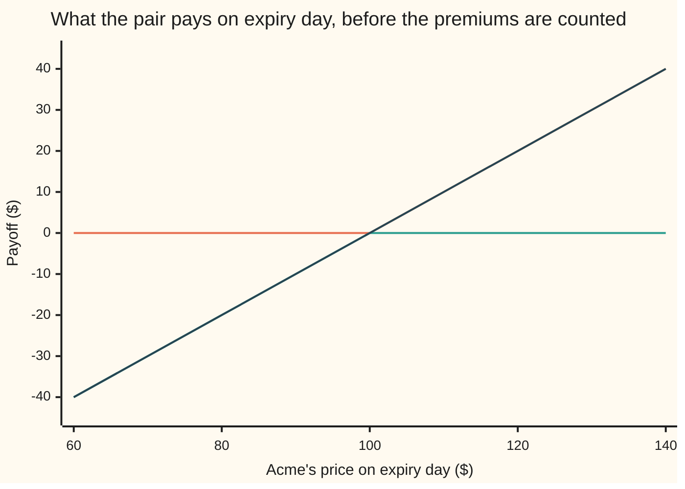
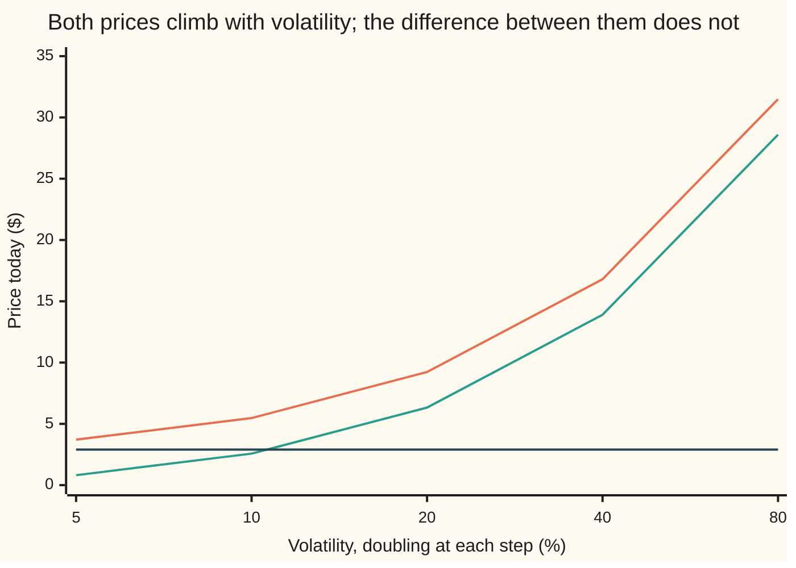

# Put-call parity: call minus put is a forward, so three prices fix the fourth

[Syllabus](../../../SYLLABUS.md) → [Financial mathematics](../../../SYLLABUS.md#w12) → [The Black-Scholes call and put](../../../SYLLABUS.md#w12-s08) → Put-call parity

---

## General Overview

Acme shares trade at $100.00 today. Two tickets are on sale, both for one year from now, both naming the same price, $100.00. The first is a **call**: the right to buy one share for $100.00 on that day. The second is a **put**: the right to sell one share for $100.00 on that day. That agreed price is the **strike**.

Buy the call and sell the put. Now watch expiry day. Acme at $120.00: the call gets used, and one share is bought for $100.00. Acme at $80.00: whoever bought the put uses it, and one share is bought for $100.00. Either way, whatever Acme did in between, one share changes hands for $100.00 on that day. That is exactly the promise a **forward contract** makes: buy one share, fixed price, fixed date.

So a call bought and a put sold are a forward in a costume. A forward can also be built with no options in it at all — buy just under one share today, so that its reinvested dividends grow the holding into one whole share, and borrow the cash that will have grown to $100.00 by expiry day. Two packages that pay the same in every future cannot cost different amounts, because the cheap one would be bought and the dear one sold until the difference closed.

On this shelf's market the call costs $9.23 and the put $6.33, a difference of $2.90. The homemade forward costs $98.02 of prepaid share less $95.12 of loan, which is also $2.90. That is the card: the difference between the two ticket prices is nailed down, so any three of the four prices fix the fourth.

**A call minus a put at the same strike and expiry day is a forward, so the difference between their prices is fixed by the share, the strike, the interest rate and the dividends, and nothing about how jumpy the share is can enter it.**

**What kind of fact this is:** a theorem, proved on this card in Why it works. It leans on one assumption about markets, that free money gets taken, and on no model of how the share price moves.

### The picture: two tickets add up to a straight line



The first line is the call that was bought: flat at zero below $100.00, then a dollar for every dollar above. The second is the put that was sold: minus $40.00 at $60.00, climbing to zero at $100.00, then flat at zero, because nobody uses a put above the strike. The third line is the two added, and it runs straight from bottom left to top right with no kink. A straight line crossing zero at the strike is a forward's payoff, and the rest of the card prices it.

("European" here means each ticket may be used on the one day only. A ticket usable any day up to then is American, a different contract with a different answer.)

---

## The formula

Notation first, in words. A raised plus sign means "or nothing": $(x)^+$ is $x$ when $x$ is positive and zero otherwise, which is what a ticket nobody bothers to use pays. A subscript $T$ means "on expiry day", so $S_T$ is Acme's price then: unknown today, and about to drop out. A discount factor is written $e^{-rT}$ in this wing's style, the value today of one dollar due on expiry day.

$$C - P = S\,e^{-qT} - K\,e^{-rT}$$

**Read it aloud:** the call costs more than the put by exactly what owning the share forward costs — the share, less the dividends it pays away before expiry, minus the cash set aside today to have the strike ready on the day.

The same statement rearranged is the version desks say out loud, **call plus cash equals put plus share**:

$$C + K\,e^{-rT} = P + S\,e^{-qT}$$

And with the forward price $F = S\,e^{(r-q)T}$ from [Forward price](../03-Contracts%20and%20No-Arbitrage/03-forward-price-by-cash-and-carry.md), the difference is the forward's head start over the strike, discounted back:

$$C - P = e^{-rT}\,(F - K)$$

Each price enters once, and only added or subtracted, so any three of the four fix the fourth exactly: one answer, always available, no root to hunt for. The one degenerate case is a strike of nothing, $K = 0$: the cash leg disappears, $C - P = S\,e^{-qT}$, and the equation can no longer say anything about the rate.

| Symbol | Plain meaning | In our example | Push it up and the gap $C - P$… |
| --- | --- | --- | --- |
| $C$ | the call's price today: the right to **buy** at the strike | $9.23 | not an input. With $P$ fixed, a higher $C$ is a parity break to trade |
| $P$ | the put's price today: the right to **sell** at the strike | $6.33 | not an input either: the gap fixes it once $C$ is known |
| $S$ | Acme's price today | $100.00 | widens, by a shade under a dollar per dollar |
| $K$ | the **strike**, the price both tickets name | $100.00 | narrows: more cash to set aside |
| $T$ | time to expiry, in **years** | 1.00 | widens, while the rate beats the dividend yield |
| $r$ | the **riskless rate**, continuously compounded | 5.00% | widens: less cash needed today to cover the strike |
| $q$ | the **dividend yield**, cash paid out to shareholders each year | 2.00% | narrows: the forward misses more dividends |
| $\sigma$ | **volatility**, how jumpy the share is. Say "sigma" | 20.00% | does not move it at all. Both prices rise together |
| $S_T$ | Acme's price on expiry day | unknown today | does not appear: both packages move with it alike, so it drops out of the price equation. The pair itself is fully exposed to it |
| $e^{-rT}$ | the **discount factor**: one dollar due on expiry day, valued today | 0.951229 | — |
| $e^{-qT}$ | the **dividend drag**: the fraction of a share to buy today to hold one whole share at expiry | 0.980199 | — |
| $F$ | the **forward price**: the fixed price at which the share can be bought forward | 103.05 | widens | 

### When it holds

- **Both tickets European**, usable on the one day only. An early-exercise right makes each price at least as large and turns the equality into a corridor: [American options](../15-American%20and%20Bermudan%20exercise/01-american-options-and-early-exercise.md). The numbers for this market are in The usual mistake.
- **The two legs matched**: same share, strike, expiry day and size. Mismatch any of those and the kinks stop cancelling; what is left is a spread, not a forward, and the equation says nothing about it.
- **One rate for borrowing and lending, and the share can be sold short.** Real markets charge more to borrow than they pay to lend, and charge a fee to borrow shares, so the equality widens into a band about as wide as those costs.
- **Dividends known, and paid as a yield.** Announced cash amounts need [Known cash dividends](08-known-cash-dividends.md). Guess the yield 1% too high here and the forward shrinks, so the put backed out of the call comes out at $7.31 instead of $6.33: a dollar too dear.
- **Prices that can actually be traded.** A stale mid-quote on an illiquid strike breaks parity on the screen and nowhere else, which is why a desk's first response to a violation is to try trading it.

---

## Why it works

### Step 0: two packages that pay the same in every future cost the same today

The proof rests on one rule. If two packages pay the same amount on the same day, whatever happens in between, they must cost the same today ([No arbitrage](../03-Contracts%20and%20No-Arbitrage/02-no-arbitrage-and-the-law-of-one-price.md)). If one were cheaper, buying it and selling the other would hand over cash today and leave nothing to settle later, and money like that on a screen is taken within seconds.

Nothing in that rule is a belief about Acme. So the job is to find two packages with identical payoffs, one built out of the two tickets and one built without them.

### Step 1: the two tickets add up to the forward's payoff

On expiry day the call pays $(S_T - K)^+$, Acme's price less the strike or nothing. The put pays $(K - S_T)^+$, the strike less Acme's price or nothing. A call bought and a put sold together pay the first minus the second:

$$(S_T - K)^+ - (K - S_T)^+ = S_T - K$$

Above the strike the put is dead and the call is the whole payoff. Below it the call is dead and the sold put is. One of the two is always the live one, which is why the kinks cancel. At $60.00 the sum is minus $40.00, and so is $60.00 - $100.00; at $140.00 both come to $40.00.

This is an identity, true at every price at once rather than on average. The check tests it at 41 prices from $0.01 to $1000.00 and the worst gap is zero.

The same fact packed differently: one call plus cash of $K$ is worth the larger of $S_T$ and $K$ on expiry day, and so is one put plus one share. The run prints both boxes side by side.

### Step 2: building that straight line without any options

Two pieces, bought today.

**The share, prepaid.** Buy $e^{-qT}$ = 0.980199 of a share and reinvest every dividend it pays in more of the same share. Dividends paid at yield $q$ make the holding grow at exactly that rate, so 0.980199 of a share grows into one whole share by expiry day. Cost today: $S\,e^{-qT}$ = $98.02.

**The loan.** Borrow $K\,e^{-rT}$ = $95.12 at the riskless rate. The debt grows to exactly $100.00 on expiry day, which is the strike, due the day the strike is due.

On expiry day this package delivers one share and owes $100.00, so it pays $S_T - 100.00$: the straight line of Step 1. Its cost today is $98.02 - $95.12 = $2.90. That is the cash-and-carry forward, used here as a price rather than as a new idea.

### Step 3: equate the two costs, and read the numbers off

The two packages pay the same, so by Step 0 they cost the same:

$$C - P = S\,e^{-qT} - K\,e^{-rT} = 98.019867 - 95.122942 = 2.896925$$

The call and put cards give $9.227006 and $6.330081 on this market, and their difference is $2.896925. The two sides agree to the last digit the machine keeps — and notice where each came from. The left side came out of a model, with a bell curve and a volatility in it. The right side is arithmetic on a share price and two rates. They would still agree if the model were thrown away.

Why is the call the dearer ticket, when both name the same $100.00? Because the share price and the strike are equal here, the gap splits into two clean pieces. The call's holder pays the $100.00 a year late rather than now, worth $4.88 today. The call's holder also does not own the share meanwhile, so misses dividends worth $1.98 today. Net: $4.88 - $1.98 = $2.90. Not a view on Acme — the cost of carrying a share for a year.

### Step 4: the trade that keeps the line straight

Suppose the put is quoted at $6.00 while parity says $6.330081. The pair of tickets is now dear against the homemade forward, so sell the pair and buy the forward. Four trades, all today:

| Leg today | Cash |
| --- | --- |
| sell the call at $9.227006 | +$9.227006 |
| buy the cheap put at $6.00 | −$6.000000 |
| buy 0.980199 of a share, the prepaid share | −$98.019867 |
| borrow $95.122942, repayable as $100.00 at expiry | +$95.122942 |
| **banked today** | **+$0.330081** |

That $0.330081 is exactly the put's shortfall, $6.330081 - $6.00. On expiry day the legs cancel at every price: the short call and long put pay $-(S_T - K)$ between them, the share is worth $S_T$, the loan takes $100.00. The run prints the net at $60.00, $100.00 and $140.00, and it is zero in all three. Nothing is left to go wrong, so the $0.33 was riskless and was banked a year before expiry day.

That package — long share, long put, short call — is a **conversion**. Reversed it is a **reversal**, which is what to do when the put is quoted too dear instead.

<details>
<summary>Detailed proof: both boxes, and both violation trades</summary>

**The identity, all three cases.** If $S_T > K$ then $(S_T - K)^+ = S_T - K$ and $(K - S_T)^+ = 0$, so the difference is $S_T - K$. If $S_T < K$ the first is 0 and the second is $K - S_T$, and the difference is again $S_T - K$. At $S_T = K$ all three quantities are zero. No distribution and no expectation is used.

**The two boxes.** Box A is one call plus cash of $K$ set aside today, costing $C + K\,e^{-rT}$. Box B is one put plus the prepaid share, costing $P + S\,e^{-qT}$.

| On expiry day | $S_T < K$ | $S_T \ge K$ |
| --- | --- | --- |
| call | 0 | $S_T - K$ |
| cash, grown to the strike | $K$ | $K$ |
| **box A** | $K$ | $S_T$ |
| put | $K - S_T$ | 0 |
| one share | $S_T$ | $S_T$ |
| **box B** | $K$ | $S_T$ |

Both boxes hold the larger of $S_T$ and $K$ in both columns, so by Step 0 they cost the same today, which rearranges to the formula.

**The prepaid share, carefully.** Reinvesting a dividend yield $q$ makes a holding of shares grow in number at rate $q$, so $e^{-qT}$ of a share today becomes exactly one share at expiry. That is the only place dividends enter, and it is why they enter as a factor on $S$ rather than as a term.

**Both violation trades.** Write the price gap as $(C - P) - (S\,e^{-qT} - K\,e^{-rT})$. If it is positive, sell the call, buy the put, buy the prepaid share and borrow $K\,e^{-rT}$: the legs bring in that gap today, and on expiry day the package pays $-(S_T - K) + S_T - K = 0$ at every price, so the money was free. If the gap is negative, reverse all four legs and take in its size instead. Both signs produce free money, so the gap is zero.

**What this does not prove.** Parity pins the difference only. Adding the same amount to both prices leaves the difference untouched, so parity alone cannot say whether $9.23 and $6.33 are sane levels; that takes [Option price bounds](04-option-price-bounds.md).

</details>

There is a second door, and it is longer. Average both sides of the Step 1 identity over the pretend world where everything grows at the bank rate, then discount — the machinery in Step 0 of [Black–Scholes call](01-black-scholes-call.md). The discounted average of the share price is $S\,e^{-qT}$ and of the strike is $K\,e^{-rT}$, so the same formula appears. Worth seeing once, because it shows every model must obey parity; wrong road to take first, because it drags in an apparatus that Steps 1 to 3 never needed.

---

## Worked numbers, by hand

The house market: Acme at $S$ = $100.00, strike $K$ = $100.00, riskless rate $r$ = 5.00%, dividend yield $q$ = 2.00%, volatility 20.00%, $T$ = 1.00 year.

| Step | Arithmetic | Value |
| --- | --- | --- |
| the dividend drag, $e^{-qT}$ | $e^{-0.02}$ | 0.980199 |
| the discount factor, $e^{-rT}$ | $e^{-0.05}$ | 0.951229 |
| the prepaid share, $S\,e^{-qT}$ | $100.00 \times 0.980199$ | $98.02 |
| the loan repaying the strike, $K\,e^{-rT}$ | $100.00 \times 0.951229$ | $95.12 |
| what the forward costs today | $98.02 - 95.12$ | **$2.90** |
| the call, from its own card | | $9.23 |
| the put, backed out of the call | $9.227006 - 2.896925$ | **$6.33** |
| the put, priced on its own card, as a check | | $6.33 |
| the forward price, the strike plus the gap carried a year at 5.00% | $100.00 + 2.896925 \times e^{0.05}$ | $103.05 |
| the forward price by cash and carry, $S\,e^{(r-q)T}$ | $100.00 \times e^{0.03}$ | $103.05 |

One forward, two prices, reached from opposite directions: one from two option quotes, one from a share price and two rates. Reading the forward off option prices is a working tool — it is how a desk finds the dividend the options market is quietly assuming ([Implied forward and dividend from parity](../11-Implied%20volatility%20and%20the%20vanilla%20inverses/05-implied-forward-and-dividend-from-parity.md)).

### What breaks if you drop a piece

Same market, right answers $2.90 for the gap and $6.33 for the put.

| Mistake | Comes out at | What went wrong |
| --- | --- | --- |
| Strike left undiscounted, $S - K$ | $0.00, so the put backs out at $9.23 | The strike is paid in a year, not today. The call's holder keeps a year's interest on it, worth $4.88 |
| Dividend dropped, $S - K\,e^{-rT}$ | $4.88, so the put backs out at $4.35 | The forward collects none of the dividends a shareholder would, worth $1.98 |
| Sides swapped, $K\,e^{-rT} - S\,e^{-qT}$ | −$2.90, so the put backs out at $12.12 | The forward is the wrong way round. The share sits with the put, the cash with the call |

The code prints each wrong gap, and every wrong put is out by more than a real bid-offer spread.

### The second picture: the prices move, the gap does not



The top line is the call, the middle one the put, the flat line at $2.90 the difference. From 5.00% to 80.00% the call climbs from $3.71 to $31.49 and the put from $0.81 to $28.59, both more than eight times over, and the gap sits at $2.90 the whole way.

---

## Code, from first principles, and it actually runs

Four independent roads. Road 1 checks the payoff identity price by price, at 41 prices from $0.01 to $1000.00, printing both boxes beside it. Road 2 prices the call and the put with the formulas from their own cards. Road 3 prices each one again by brute force, averaging the payoff under the bell curve with Simpson's rule, touching neither those formulas nor parity. Road 4 prices each one again on a 1000-step coin-flip tree. Then the conversion trade runs, four wrong right-hand sides are computed, and the American put is priced on the same tree for contrast. Nothing imported already knows the answer: the bell-curve area comes from `math.erf` in Python and from adding up thin slices under the curve in Rust.

Watch roads 2 and 4 in the output. The tree's own call is $9.225062 and its put $6.328137, each about two tenths of a cent off the formula. Their difference is $2.896925, right to the last printed digit. A crude model gets both prices wrong by the same amount, because parity is not part of the model — it is arithmetic the model cannot help obeying.

### Python

```python
# Put-call parity -- the check behind the card.  Standard library only.  Every number
# quoted on the card is printed here.  Nothing imported already knows the answer: the
# bell-curve area comes from math.erf, the call and the put are priced again by Simpson's
# rule and by a coin-flip tree, and the payoff identity is checked price by price.
from math import log, sqrt, exp, erf, pi

S, K, r, q, sigma, T = 100.0, 100.0, 0.05, 0.02, 0.20, 1.0
STEPS, PANELS, QUOTE = 1000, 40000, 6.0

def N(x):    return 0.5 * (1.0 + erf(x / sqrt(2.0)))       # bell-curve area left of x
def phi(x):  return exp(-0.5 * x * x) / sqrt(2.0 * pi)     # bell-curve height at x
def cpay(x): return max(x - K, 0.0)                        # call payoff on expiry day
def ppay(x): return max(K - x, 0.0)                        # put payoff on expiry day
def row(name, v): print(f"{name:<40}{v:>14.6f}")

def d1d2(s, k, rr, qq, sg, t):
    vt = sg * sqrt(t)
    d1 = (log(s / k) + (rr - qq + 0.5 * sg * sg) * t) / vt
    return d1, d1 - vt
def call(s, k, rr, qq, sg, t):                             # road 2: the call card's formula
    d1, d2 = d1d2(s, k, rr, qq, sg, t)
    return s * exp(-qq * t) * N(d1) - k * exp(-rr * t) * N(d2)
def put(s, k, rr, qq, sg, t):                              # road 2: the put card's formula
    d1, d2 = d1d2(s, k, rr, qq, sg, t)
    return k * exp(-rr * t) * N(-d2) - s * exp(-qq * t) * N(-d1)
def by_integral(payoff, n=PANELS):
    # Road 3: average the payoff over the bell curve by brute force (Simpson's
    # rule).  Uses no d1, no d2 and no parity -- nothing borrowed from road 2.
    a, b = -10.0, 10.0
    h = (b - a) / n
    def f(z):
        st = S * exp((r - q - 0.5 * sigma * sigma) * T + sigma * sqrt(T) * z)
        return payoff(st) * phi(z)
    total = f(a) + f(b)
    for i in range(1, n):
        total += (4.0 if i % 2 else 2.0) * f(a + i * h)
    return exp(-r * T) * total * h / 3.0

def by_tree(payoff, steps=STEPS, early=False):
    # Road 4: the coin-flip tree (Cox-Ross-Rubinstein).  Up or down each step,
    # then average back.  early=True also allows exercise at every node.
    dt = T / steps
    u = exp(sigma * sqrt(dt)); d = 1.0 / u
    p = (exp((r - q) * dt) - d) / (u - d)
    disc = exp(-r * dt)
    v = [payoff(S * u ** j * d ** (steps - j)) for j in range(steps + 1)]
    for step in range(steps, 0, -1):
        v = [disc * (p * v[j + 1] + (1.0 - p) * v[j]) for j in range(step)]
        if early:
            v = [max(v[j], payoff(S * u ** j * d ** (step - 1 - j))) for j in range(step)]
    return v[0]

disc_r, disc_q, dear_q = exp(-r * T), exp(-q * T), exp(-(q + 0.01) * T)  # dear_q: the yield guessed 1% high
C, P = call(S, K, r, q, sigma, T), put(S, K, r, q, sigma, T)
rhs = S * disc_q - K * disc_r
c_int, p_int = by_integral(cpay), by_integral(ppay)
c_tree, p_tree = by_tree(cpay), by_tree(ppay)
c_amer, p_amer = by_tree(cpay, early=True), by_tree(ppay, early=True)
cash = C - QUOTE - S * disc_q + K * disc_r

print(f"house market: S {S:.2f}  K {K:.2f}  r {r * 100:.2f}%  q {q * 100:.2f}%  "
      f"volatility {sigma * 100:.2f}%  T {T:.2f} years")
print("road 1: on expiry day a long call minus a short put is S_T - K, and box A = box B")
print(f"{'share at expiry':>16}{'long call':>11}{'short put':>11}{'sum':>11}"
      f"{'S_T - K':>11}{'box A':>11}{'box B':>11}")
for st in (60.0, 80.0, 99.99, 100.0, 100.01, 120.0, 140.0):
    print(f"{st:>16.2f}{cpay(st):>11.2f}{0.0 - ppay(st):>11.2f}{cpay(st) - ppay(st):>11.2f}"
          f"{st - K:>11.2f}{cpay(st) + K:>11.2f}{ppay(st) + st:>11.2f}")
grid = [0.01] + [25.0 * i for i in range(1, 41)]
gap_id = max(abs((cpay(x) - ppay(x)) - (x - K)) for x in grid)
gap_box = max(abs((cpay(x) + K) - (ppay(x) + x)) for x in grid)
print(f"worst gap over {len(grid)} prices from {min(grid):.2f} to {max(grid):.2f}: "
      f"identity {gap_id:.6f}, boxes {gap_box:.6f}")
print()
print("roads 2, 3 and 4: the two prices, and the two sides of the parity line")
print(f"{'discount factors e^-qT and e^-rT':<40}{disc_q:>14.6f}{disc_r:>14.6f}")
for name, v in (("call, formula", C), ("put, formula", P), ("C - P", C - P),
                ("S e^-qT, the prepaid share", S * disc_q),
                ("K e^-rT, the loan that repays K", K * disc_r),
                ("S e^-qT - K e^-rT", rhs),
                ("call, Simpson integral", c_int), ("put, Simpson integral", p_int),
                ("C - P, from the integrals", c_int - p_int),
                (f"call, {STEPS}-step tree", c_tree), (f"put, {STEPS}-step tree", p_tree),
                ("C - P, from the tree", c_tree - p_tree),
                ("forward, K + (C - P) e^rT", K + (C - P) * exp(r * T)),
                ("forward, S e^(r-q)T", S * exp((r - q) * T))):
    row(name, v)
print(f"the gap in two pieces: interest not paid early on K {K * (1.0 - disc_r):.6f} "
      f"minus dividends missed on S {S * (1.0 - disc_q):.6f} = {rhs:.6f}")
print()
print("C - P does not move when the volatility moves (each step doubles it)")
print(f"{'volatility':>12}{'call':>10}{'put':>10}{'C - P':>10}")
flat = 0.0
for sg in (0.05, 0.10, 0.20, 0.40, 0.80):
    cv, pv = call(S, K, r, q, sg, T), put(S, K, r, q, sg, T)
    flat = max(flat, abs((cv - pv) - rhs))
    print(f"{sg * 100:>11.2f}%{cv:>10.2f}{pv:>10.2f}{cv - pv:>10.2f}")
print()
print(f"the conversion trade: the put is quoted at {QUOTE:.2f}, parity says {P:.6f}")
print(f"today: sell the call +{C:.6f}, buy the put -{QUOTE:.6f}, "
      f"buy e^-qT shares -{S * disc_q:.6f}, borrow +{K * disc_r:.6f}")
print(f"cash banked today {cash:.6f}, which is the put's shortfall {P - QUOTE:.6f}")
print(f"{'share at expiry':>16}{'short call':>12}{'long put':>12}{'share':>12}"
      f"{'loan':>12}{'net':>12}")
worst_net = 0.0
for st in (60.0, 100.0, 140.0):
    net = 0.0 - cpay(st) + ppay(st) + st - K
    worst_net = max(worst_net, abs(net))
    print(f"{st:>16.2f}{0.0 - cpay(st):>12.2f}{ppay(st):>12.2f}{st:>12.2f}"
          f"{0.0 - K:>12.2f}{net:>12.2f}")
print()
print(f"what breaks: the wrong right-hand side, and the put it backs out of a call of {C:.6f}")
for name, side in (("strike not discounted, S - K", S - K),
                   ("dividend dropped, S - K e^-rT", S - K * disc_r),
                   ("sides swapped, K e^-rT - S e^-qT", K * disc_r - S * disc_q),
                   ("yield 1% too high, wrong S e^-qT", S * dear_q - K * disc_r)):
    print(f"{name:<40}{side:>14.6f}{C - side:>14.6f}")
print(f"early exercise: {STEPS}-step American put {p_amer:.6f} against European "
      f"{p_tree:.6f}, so C_A - P_A is {c_amer - p_amer:.6f}, not {rhs:.6f}")
print(f"try changing: r = 0 gives C - P {call(S, K, 0.0, q, sigma, T) - put(S, K, 0.0, q, sigma, T):.6f}; "
      f"q = r gives call {call(S, K, r, r, sigma, T):.6f} and put {put(S, K, r, r, sigma, T):.6f}; "
      f"K = 120 gives C - P {call(S, 120.0, r, q, sigma, T) - put(S, 120.0, r, q, sigma, T):.6f}")

assert abs(C - 9.227005508154) < 1e-9,       "the call formula against the shelf's house number"
assert abs(P - 6.330080627550) < 1e-9,       "the put formula against the shelf's house number"
assert abs((C - P) - rhs) < 1e-12,           "two formula prices against plain discounting"
assert abs((c_int - p_int) - rhs) < 1e-7,    "two brute-force integrals against discounting"
assert abs((c_tree - p_tree) - rhs) < 1e-9,  "the tree's two prices against discounting"
assert abs(c_tree - C) > 1e-4,               "the tree's own call price is off, yet parity held"
assert gap_id < 1e-12,                       "the payoff identity at every price on the grid"
assert gap_box < 1e-12,                      "box A against box B at every price on the grid"
assert flat < 1e-9,                          "C - P unmoved across five volatilities"
assert abs(cash - (P - QUOTE)) < 1e-12,      "the trade's opening cash against the put's shortfall"
assert worst_net < 1e-12,                    "the trade pays nothing at expiry, at every price"
assert 0.3 < p_amer - p_tree < 0.5,          "the early-exercise right, a third of a dollar on a fine tree"
assert rhs - (c_amer - p_amer) > 0.1,        "and it breaks the equality by a visible amount"
assert abs((K + (C - P) * exp(r * T)) - S * exp((r - q) * T)) < 1e-9, "forward two ways"
assert (C - (S * dear_q - K * disc_r)) - P > 0.9, "a yield 1% too high backs out a dearer put, not a cheaper one"
print("ALL CHECKS PASS")
```

**Ran 2026-09-19 on macOS, Python 3.14.6, standard library only. All checks passed. Output, pasted from the run:**

```
house market: S 100.00  K 100.00  r 5.00%  q 2.00%  volatility 20.00%  T 1.00 years
road 1: on expiry day a long call minus a short put is S_T - K, and box A = box B
 share at expiry  long call  short put        sum    S_T - K      box A      box B
           60.00       0.00     -40.00     -40.00     -40.00     100.00     100.00
           80.00       0.00     -20.00     -20.00     -20.00     100.00     100.00
           99.99       0.00      -0.01      -0.01      -0.01     100.00     100.00
          100.00       0.00       0.00       0.00       0.00     100.00     100.00
          100.01       0.01       0.00       0.01       0.01     100.01     100.01
          120.00      20.00       0.00      20.00      20.00     120.00     120.00
          140.00      40.00       0.00      40.00      40.00     140.00     140.00
worst gap over 41 prices from 0.01 to 1000.00: identity 0.000000, boxes 0.000000

roads 2, 3 and 4: the two prices, and the two sides of the parity line
discount factors e^-qT and e^-rT              0.980199      0.951229
call, formula                                 9.227006
put, formula                                  6.330081
C - P                                         2.896925
S e^-qT, the prepaid share                   98.019867
K e^-rT, the loan that repays K              95.122942
S e^-qT - K e^-rT                             2.896925
call, Simpson integral                        9.227006
put, Simpson integral                         6.330081
C - P, from the integrals                     2.896925
call, 1000-step tree                          9.225062
put, 1000-step tree                           6.328137
C - P, from the tree                          2.896925
forward, K + (C - P) e^rT                   103.045453
forward, S e^(r-q)T                         103.045453
the gap in two pieces: interest not paid early on K 4.877058 minus dividends missed on S 1.980133 = 2.896925

C - P does not move when the volatility moves (each step doubles it)
  volatility      call       put     C - P
       5.00%      3.71      0.81      2.90
      10.00%      5.47      2.57      2.90
      20.00%      9.23      6.33      2.90
      40.00%     16.80     13.90      2.90
      80.00%     31.49     28.59      2.90

the conversion trade: the put is quoted at 6.00, parity says 6.330081
today: sell the call +9.227006, buy the put -6.000000, buy e^-qT shares -98.019867, borrow +95.122942
cash banked today 0.330081, which is the put's shortfall 0.330081
 share at expiry  short call    long put       share        loan         net
           60.00        0.00       40.00       60.00     -100.00        0.00
          100.00        0.00        0.00      100.00     -100.00        0.00
          140.00      -40.00        0.00      140.00     -100.00        0.00

what breaks: the wrong right-hand side, and the put it backs out of a call of 9.227006
strike not discounted, S - K                  0.000000      9.227006
dividend dropped, S - K e^-rT                 4.877058      4.349948
sides swapped, K e^-rT - S e^-qT             -2.896925     12.123930
yield 1% too high, wrong S e^-qT              1.921611      7.305395
early exercise: 1000-step American put 6.659759 against European 6.328137, so C_A - P_A is 2.565303, not 2.896925
try changing: r = 0 gives C - P -1.980133; q = r gives call 7.577082 and put 7.577082; K = 120 gives C - P -16.127664
ALL CHECKS PASS
```

### Rust

Same inputs, same labels, no crates.

```rust
// Put-call parity -- the same check as put_call_parity_check.py, in Rust.  Standard
// library only, no crates.  Rust has no erf, so the bell-curve area N(x) is built the
// honest way: add up thin slices under the curve (Simpson).  The call and the put are
// priced again by a brute-force integral and by a coin-flip tree, and the payoff
// identity is checked price by price.  Compile: rustc --edition 2021 -O this_file.rs
use std::f64::consts::PI;

const S: f64 = 100.0; const K: f64 = 100.0; const R: f64 = 0.05;
const Q: f64 = 0.02; const SIGMA: f64 = 0.20; const T: f64 = 1.0;
const STEPS: usize = 1000; const PANELS: usize = 40000; const QUOTE: f64 = 6.0;

fn phi(x: f64) -> f64 { (-0.5 * x * x).exp() / (2.0 * PI).sqrt() }   // bell-curve height at x
fn cpay(x: f64) -> f64 { (x - K).max(0.0) }                         // call payoff on expiry day
fn ppay(x: f64) -> f64 { (K - x).max(0.0) }                         // put payoff on expiry day
fn row(name: &str, v: f64) { println!("{:<40}{:>14.6}", name, v); }

fn simpson<F: Fn(f64) -> f64>(f: F, a: f64, b: f64, n: usize) -> f64 {
    let h = (b - a) / n as f64;
    let mut s = f(a) + f(b);
    for i in 1..n { s += if i % 2 == 1 { 4.0 } else { 2.0 } * f(a + i as f64 * h); }
    s * h / 3.0
}

fn n_cdf(x: f64) -> f64 {                                  // bell-curve area left of x
    if x < -12.0 { return 0.0; }
    if x > 12.0 { return 1.0; }
    0.5 + simpson(phi, 0.0, x, 4000)                       // half, plus the slice from 0 to x
}

fn d1d2(s: f64, k: f64, rr: f64, qq: f64, sg: f64, t: f64) -> (f64, f64) {
    let vt = sg * t.sqrt();
    let d1 = ((s / k).ln() + (rr - qq + 0.5 * sg * sg) * t) / vt;
    (d1, d1 - vt)
}
fn call(s: f64, k: f64, rr: f64, qq: f64, sg: f64, t: f64) -> f64 {   // road 2: the call card
    let (d1, d2) = d1d2(s, k, rr, qq, sg, t);
    s * (-qq * t).exp() * n_cdf(d1) - k * (-rr * t).exp() * n_cdf(d2)
}
fn put(s: f64, k: f64, rr: f64, qq: f64, sg: f64, t: f64) -> f64 {    // road 2: the put card
    let (d1, d2) = d1d2(s, k, rr, qq, sg, t);
    k * (-rr * t).exp() * n_cdf(-d2) - s * (-qq * t).exp() * n_cdf(-d1)
}

fn by_integral<F: Fn(f64) -> f64>(payoff: F) -> f64 {
    // Road 3: average the payoff over the bell curve by brute force (Simpson's rule).
    // Uses no d1, no d2 and no parity -- nothing borrowed from road 2.
    let f = |z: f64| {
        let st = S * ((R - Q - 0.5 * SIGMA * SIGMA) * T + SIGMA * T.sqrt() * z).exp();
        payoff(st) * phi(z)
    };
    (-R * T).exp() * simpson(f, -10.0, 10.0, PANELS)
}

fn by_tree<F: Fn(f64) -> f64>(payoff: F, steps: usize, early: bool) -> f64 {
    // Road 4: the coin-flip tree (Cox-Ross-Rubinstein).  Up or down each step, then
    // average back.  early = true also allows exercise at every node.
    let dt = T / steps as f64;
    let u = (SIGMA * dt.sqrt()).exp();
    let d = 1.0 / u;
    let p = (((R - Q) * dt).exp() - d) / (u - d);
    let disc = (-R * dt).exp();
    let mut v: Vec<f64> = (0..=steps)
        .map(|j| payoff(S * u.powf(j as f64) * d.powf((steps - j) as f64))).collect();
    for step in (1..=steps).rev() {
        v = (0..step).map(|j| {
            let cont = disc * (p * v[j + 1] + (1.0 - p) * v[j]);
            if early { cont.max(payoff(S * u.powf(j as f64) * d.powf((step - 1 - j) as f64))) } else { cont }
        }).collect();
    }
    v[0]
}

fn main() {
    let (disc_r, disc_q, dear_q) = ((-R * T).exp(), (-Q * T).exp(), (-(Q + 0.01) * T).exp());  // dear_q: the yield guessed 1% high
    let (c, p) = (call(S, K, R, Q, SIGMA, T), put(S, K, R, Q, SIGMA, T));
    let rhs = S * disc_q - K * disc_r;
    let (c_int, p_int) = (by_integral(cpay), by_integral(ppay));
    let (c_tree, p_tree) = (by_tree(cpay, STEPS, false), by_tree(ppay, STEPS, false));
    let (c_amer, p_amer) = (by_tree(cpay, STEPS, true), by_tree(ppay, STEPS, true));
    let cash = c - QUOTE - S * disc_q + K * disc_r;
    println!("house market: S {:.2}  K {:.2}  r {:.2}%  q {:.2}%  volatility {:.2}%  T {:.2} years",
             S, K, R * 100.0, Q * 100.0, SIGMA * 100.0, T);
    println!("road 1: on expiry day a long call minus a short put is S_T - K, and box A = box B");
    println!("{:>16}{:>11}{:>11}{:>11}{:>11}{:>11}{:>11}", "share at expiry", "long call",
             "short put", "sum", "S_T - K", "box A", "box B");
    for st in [60.0_f64, 80.0, 99.99, 100.0, 100.01, 120.0, 140.0] {
        println!("{:>16.2}{:>11.2}{:>11.2}{:>11.2}{:>11.2}{:>11.2}{:>11.2}", st, cpay(st),
                 0.0 - ppay(st), cpay(st) - ppay(st), st - K, cpay(st) + K, ppay(st) + st);
    }
    let grid: Vec<f64> = std::iter::once(0.01).chain((1..41).map(|i| 25.0 * i as f64)).collect();
    let (mut gap_id, mut gap_box) = (0.0_f64, 0.0_f64);
    for x in &grid {
        gap_id = gap_id.max(((cpay(*x) - ppay(*x)) - (x - K)).abs());
        gap_box = gap_box.max(((cpay(*x) + K) - (ppay(*x) + x)).abs());
    }
    println!("worst gap over {} prices from {:.2} to {:.2}: identity {:.6}, boxes {:.6}",
             grid.len(), grid[0], grid[grid.len() - 1], gap_id, gap_box);
    println!();
    println!("roads 2, 3 and 4: the two prices, and the two sides of the parity line");
    println!("{:<40}{:>14.6}{:>14.6}", "discount factors e^-qT and e^-rT", disc_q, disc_r);
    let (tree_c, tree_p) = (format!("call, {}-step tree", STEPS), format!("put, {}-step tree", STEPS));
    for (name, v) in [("call, formula", c), ("put, formula", p), ("C - P", c - p),
                      ("S e^-qT, the prepaid share", S * disc_q),
                      ("K e^-rT, the loan that repays K", K * disc_r),
                      ("S e^-qT - K e^-rT", rhs),
                      ("call, Simpson integral", c_int), ("put, Simpson integral", p_int),
                      ("C - P, from the integrals", c_int - p_int),
                      (tree_c.as_str(), c_tree), (tree_p.as_str(), p_tree),
                      ("C - P, from the tree", c_tree - p_tree),
                      ("forward, K + (C - P) e^rT", K + (c - p) * (R * T).exp()),
                      ("forward, S e^(r-q)T", S * ((R - Q) * T).exp())] {
        row(name, v);
    }
    println!("the gap in two pieces: interest not paid early on K {:.6} minus dividends missed on S {:.6} = {:.6}",
             K * (1.0 - disc_r), S * (1.0 - disc_q), rhs);
    println!();
    println!("C - P does not move when the volatility moves (each step doubles it)");
    println!("{:>12}{:>10}{:>10}{:>10}", "volatility", "call", "put", "C - P");
    let mut flat = 0.0_f64;
    for sg in [0.05_f64, 0.10, 0.20, 0.40, 0.80] {
        let (cv, pv) = (call(S, K, R, Q, sg, T), put(S, K, R, Q, sg, T));
        flat = flat.max(((cv - pv) - rhs).abs());
        println!("{:>11.2}%{:>10.2}{:>10.2}{:>10.2}", sg * 100.0, cv, pv, cv - pv);
    }
    println!();
    println!("the conversion trade: the put is quoted at {:.2}, parity says {:.6}", QUOTE, p);
    println!("today: sell the call +{:.6}, buy the put -{:.6}, buy e^-qT shares -{:.6}, borrow +{:.6}",
             c, QUOTE, S * disc_q, K * disc_r);
    println!("cash banked today {:.6}, which is the put's shortfall {:.6}", cash, p - QUOTE);
    println!("{:>16}{:>12}{:>12}{:>12}{:>12}{:>12}", "share at expiry", "short call",
             "long put", "share", "loan", "net");
    let mut worst_net = 0.0_f64;
    for st in [60.0_f64, 100.0, 140.0] {
        let net = 0.0 - cpay(st) + ppay(st) + st - K;
        worst_net = worst_net.max(net.abs());
        println!("{:>16.2}{:>12.2}{:>12.2}{:>12.2}{:>12.2}{:>12.2}", st, 0.0 - cpay(st),
                 ppay(st), st, 0.0 - K, net);
    }
    println!();
    println!("what breaks: the wrong right-hand side, and the put it backs out of a call of {:.6}", c);
    for (name, side) in [("strike not discounted, S - K", S - K),
                         ("dividend dropped, S - K e^-rT", S - K * disc_r),
                         ("sides swapped, K e^-rT - S e^-qT", K * disc_r - S * disc_q),
                         ("yield 1% too high, wrong S e^-qT", S * dear_q - K * disc_r)] {
        println!("{:<40}{:>14.6}{:>14.6}", name, side, c - side);
    }
    println!("early exercise: {}-step American put {:.6} against European {:.6}, so C_A - P_A is {:.6}, not {:.6}",
             STEPS, p_amer, p_tree, c_amer - p_amer, rhs);
    println!("try changing: r = 0 gives C - P {:.6}; q = r gives call {:.6} and put {:.6}; K = 120 gives C - P {:.6}",
             call(S, K, 0.0, Q, SIGMA, T) - put(S, K, 0.0, Q, SIGMA, T),
             call(S, K, R, R, SIGMA, T), put(S, K, R, R, SIGMA, T),
             call(S, 120.0, R, Q, SIGMA, T) - put(S, 120.0, R, Q, SIGMA, T));
    assert!((c - 9.227005508154).abs() < 1e-9, "the call formula against the shelf's house number");
    assert!((p - 6.330080627550).abs() < 1e-9, "the put formula against the shelf's house number");
    assert!(((c - p) - rhs).abs() < 1e-12, "two formula prices against plain discounting");
    assert!(((c_int - p_int) - rhs).abs() < 1e-7, "two brute-force integrals against discounting");
    assert!(((c_tree - p_tree) - rhs).abs() < 1e-9, "the tree's two prices against discounting");
    assert!((c_tree - c).abs() > 1e-4, "the tree's own call price is off, yet parity held");
    assert!(gap_id < 1e-12, "the payoff identity at every price on the grid");
    assert!(gap_box < 1e-12, "box A against box B at every price on the grid");
    assert!(flat < 1e-9, "C - P unmoved across five volatilities");
    assert!((cash - (p - QUOTE)).abs() < 1e-12, "the trade's opening cash against the put's shortfall");
    assert!(worst_net < 1e-12, "the trade pays nothing at expiry, at every price");
    assert!(p_amer - p_tree > 0.3 && p_amer - p_tree < 0.5, "the early-exercise right, a third of a dollar on a fine tree");
    assert!(rhs - (c_amer - p_amer) > 0.1, "and it breaks the equality by a visible amount");
    assert!(((K + (c - p) * (R * T).exp()) - S * ((R - Q) * T).exp()).abs() < 1e-9, "forward two ways");
    assert!((c - (S * dear_q - K * disc_r)) - p > 0.9, "a yield 1% too high backs out a dearer put, not a cheaper one");
    println!("ALL CHECKS PASS");
}
```

**Ran 2026-09-19 on macOS, rustc 1.98.1, no crates. All checks passed. Output, pasted from the run:**

```
house market: S 100.00  K 100.00  r 5.00%  q 2.00%  volatility 20.00%  T 1.00 years
road 1: on expiry day a long call minus a short put is S_T - K, and box A = box B
 share at expiry  long call  short put        sum    S_T - K      box A      box B
           60.00       0.00     -40.00     -40.00     -40.00     100.00     100.00
           80.00       0.00     -20.00     -20.00     -20.00     100.00     100.00
           99.99       0.00      -0.01      -0.01      -0.01     100.00     100.00
          100.00       0.00       0.00       0.00       0.00     100.00     100.00
          100.01       0.01       0.00       0.01       0.01     100.01     100.01
          120.00      20.00       0.00      20.00      20.00     120.00     120.00
          140.00      40.00       0.00      40.00      40.00     140.00     140.00
worst gap over 41 prices from 0.01 to 1000.00: identity 0.000000, boxes 0.000000

roads 2, 3 and 4: the two prices, and the two sides of the parity line
discount factors e^-qT and e^-rT              0.980199      0.951229
call, formula                                 9.227006
put, formula                                  6.330081
C - P                                         2.896925
S e^-qT, the prepaid share                   98.019867
K e^-rT, the loan that repays K              95.122942
S e^-qT - K e^-rT                             2.896925
call, Simpson integral                        9.227006
put, Simpson integral                         6.330081
C - P, from the integrals                     2.896925
call, 1000-step tree                          9.225062
put, 1000-step tree                           6.328137
C - P, from the tree                          2.896925
forward, K + (C - P) e^rT                   103.045453
forward, S e^(r-q)T                         103.045453
the gap in two pieces: interest not paid early on K 4.877058 minus dividends missed on S 1.980133 = 2.896925

C - P does not move when the volatility moves (each step doubles it)
  volatility      call       put     C - P
       5.00%      3.71      0.81      2.90
      10.00%      5.47      2.57      2.90
      20.00%      9.23      6.33      2.90
      40.00%     16.80     13.90      2.90
      80.00%     31.49     28.59      2.90

the conversion trade: the put is quoted at 6.00, parity says 6.330081
today: sell the call +9.227006, buy the put -6.000000, buy e^-qT shares -98.019867, borrow +95.122942
cash banked today 0.330081, which is the put's shortfall 0.330081
 share at expiry  short call    long put       share        loan         net
           60.00        0.00       40.00       60.00     -100.00        0.00
          100.00        0.00        0.00      100.00     -100.00        0.00
          140.00      -40.00        0.00      140.00     -100.00        0.00

what breaks: the wrong right-hand side, and the put it backs out of a call of 9.227006
strike not discounted, S - K                  0.000000      9.227006
dividend dropped, S - K e^-rT                 4.877058      4.349948
sides swapped, K e^-rT - S e^-qT             -2.896925     12.123930
yield 1% too high, wrong S e^-qT              1.921611      7.305395
early exercise: 1000-step American put 6.659759 against European 6.328137, so C_A - P_A is 2.565303, not 2.896925
try changing: r = 0 gives C - P -1.980133; q = r gives call 7.577082 and put 7.577082; K = 120 gives C - P -16.127664
ALL CHECKS PASS
```

The two outputs are identical line for line, from different code taking different routes to the bell-curve area.

> [!TIP]
> **Try changing**
> Guess the direction first, then run it.
> - **Set `r = 0.0`.** With no interest to save on the strike, only the missed dividends are left: the gap turns negative, −$1.980133, and the put becomes the dearer ticket.
> - **Set `q = r`.** The missed dividends exactly offset the interest saved on the strike, so the gap is zero and both tickets cost $7.577082. Equal strikes do not make equal prices; equal carry does.
> - **Set `K = 120.0`.** The gap goes to −$16.127664: a put struck 20% above the share is worth far more than the call, and parity says exactly how much more.
> - **Starve the tree: `STEPS = 10`.** Both tree prices come out cents wrong, and their difference is still $2.896925 to the last digit. Every assert still passes — the card in one experiment.

---

## The usual mistake

> [!warning]
> **Using the equality on options that can be exercised early.** Listed single-share options in the US are American: usable any day, not only expiry day. Feed their prices into $C - P = S\,e^{-qT} - K\,e^{-rT}$ and the "free money" that appears is mostly the value of the early-exercise right, which is real and is nobody else's to collect. On the house market's 1000-step tree the American put is worth $6.659759 against the European $6.328137, and the difference between the American prices is $2.565303 instead of $2.896925. The equality becomes a corridor: [American options](../15-American%20and%20Bermudan%20exercise/01-american-options-and-early-exercise.md).
>
> **Conventions verified 19 Sep 2026:** listed US single-share options are American-style, while most index options, SPX among them, are European and cash-settled, and there the equality holds as written.
>
> - **Leaving the strike undiscounted.** $C - P = S - K$ gives $0.00 here, so the put backs out at $9.23 instead of $6.33. The whole gap is carry, and most of it is that year of interest on the strike.
> - **Forgetting the dividend.** The gap comes out at $4.88 and the put at $4.35, light by $1.98 on a $6.33 put — exactly the dividends the forward misses. For a currency option the same slot holds the foreign interest rate.
> - **Reading the gap as a view on the share.** $2.90 is not a forecast that Acme will rise. A bull and a bear must agree on it while disagreeing about everything else, because no forecast entered the proof.
> - **Getting the sides round the wrong way.** The share sits with the put, the cash with the call. A slip gives −$2.90 and a $12.12 put, nearly twice the right price, and it should be caught by eye.

---

## Where you meet it in real life

- **Backing one price out of the other.** An illiquid put is quoted from the liquid call at the same strike, and no implied volatility is trusted until the pair has been checked against parity.
- **Reading the forward off the option screen.** The forward price is the strike plus the gap carried forward, $103.05 here, the same number cash and carry gives. Desks run it to find the dividend, or the share-borrowing cost, the options market is assuming: [Implied forward and dividend from parity](../11-Implied%20volatility%20and%20the%20vanilla%20inverses/05-implied-forward-and-dividend-from-parity.md).
- **Conversions and reversals.** A trader long the share, long the put and short the call holds no exposure to the share at all, only the carry — the standing way to lock a parity violation, and where the $0.33 of Step 4 came from.
- **One volatility per strike.** For European tickets a call and a put at one strike must imply the same volatility. When they do not, the suspect is the forward, the rate or the dividend fed in, never the volatility.
- **Barriers and choosers.** The same adding-up trick reappears elsewhere: a knock-in plus a knock-out at one barrier is the plain option ([Knock-out and knock-in options](../16-Barriers%2C%20touches%20and%20lookbacks/01-knock-out-and-knock-in-options.md)), and a ticket whose holder picks call or put later is priced by parity ([Chooser options](../17-Averages%2C%20choosers%2C%20compounds%20and%20forward-starts/04-chooser-options.md)).
- **A company's balance sheet.** Treat its shares as a call on its assets and its debt becomes the assets minus that call, which parity rewrites as a safe bond minus a put: [Merton's model](../43-Structural%20Models%20-%20Default%20from%20the%20Balance%20Sheet/01-merton-model-equity-as-a-call.md). That put is the risk of default.

> **Say it back**
> Buy a call and sell a put at the same strike and expiry, and one of the two is always the live one, so the pair pays $S_T - K$ whatever happens: a forward. The same forward can be built by buying $e^{-qT}$ of a share and borrowing $K\,e^{-rT}$, at a cost today of $S\,e^{-qT} - K\,e^{-rT}$. Two packages with the same payoff cost the same, so $C - P = S\,e^{-qT} - K\,e^{-rT}$. On the house market that is $9.23 - $6.33 = $2.90 = $98.02 - $95.12. No volatility appears, so no model is needed, and a put quoted $0.33 cheap hands $0.33 to whoever sells the pair and buys the forward.

---

## What this builds on

- [Black–Scholes call](01-black-scholes-call.md): where the $9.23 comes from. Parity does not need it; the check uses it to have two prices worth comparing.
- [Black-Scholes put](02-black-scholes-put.md): the $6.33, priced on its own so the two sides of this card can be tested against each other.
- [No arbitrage](../03-Contracts%20and%20No-Arbitrage/02-no-arbitrage-and-the-law-of-one-price.md): the single rule Step 0 leans on, and the only assumption in the proof.
- [Forward price](../03-Contracts%20and%20No-Arbitrage/03-forward-price-by-cash-and-carry.md): the prepaid share, the loan, and the forward price $F$ that Step 2 buys off the shelf.

## Where this goes next

- [Option price bounds](04-option-price-bounds.md): parity plus "a put is never worth less than nothing" pins each price on its own.
- [Intrinsic and time value](06-intrinsic-and-time-value.md): the same two prices cut the other way, into payoff now and what waiting is worth.
- [Known cash dividends](08-known-cash-dividends.md): parity when dividends are announced cash amounts on known dates.
- [The Black-Scholes assumptions](09-black-scholes-assumptions-and-failures.md): which assumptions the model needs and this card does without.
- [Implied forward and dividend from parity](../11-Implied%20volatility%20and%20the%20vanilla%20inverses/05-implied-forward-and-dividend-from-parity.md): this card run backwards, to read the forward and the dividend out of live quotes.
- [American options](../15-American%20and%20Bermudan%20exercise/01-american-options-and-early-exercise.md): the corridor that replaces the equality once a ticket can be used early.
- [Knock-out and knock-in options](../16-Barriers%2C%20touches%20and%20lookbacks/01-knock-out-and-knock-in-options.md): in plus out equals the plain option, the same argument at a barrier.
- [Chooser options](../17-Averages%2C%20choosers%2C%20compounds%20and%20forward-starts/04-chooser-options.md): a ticket whose holder picks call or put later, priced by parity.
- [Garman-Kohlhagen](../21-FX%20vanilla%20options%20-%20Garman-Kohlhagen%20and%20the%20desk%20conventions/01-garman-kohlhagen.md): currency options, where the dividend slot holds the foreign interest rate.
- [Merton's model](../43-Structural%20Models%20-%20Default%20from%20the%20Balance%20Sheet/01-merton-model-equity-as-a-call.md): shares as a call on a company's assets, its risky debt as a bond minus a put.

Parity fixes the difference between the two prices and says nothing about the level of either, so a call could still be quoted above the share itself and pass this test; what rules that out is the next card, option price bounds.

---

## Sources

Verified 19 Sep 2026: every link below resolves to the publisher's page.

- Stoll, Hans R. "The Relationship Between Put and Call Option Prices." *The Journal of Finance* 24, no. 5 (1969): 801–824. [doi:10.1111/j.1540-6261.1969.tb01694.x](https://doi.org/10.1111/j.1540-6261.1969.tb01694.x). States the relation and the trades that enforce it.
- Merton, Robert C. "Theory of Rational Option Pricing." *Bell Journal of Economics and Management Science* 4, no. 1 (1973): 141–183. [doi:10.2307/3003143](https://doi.org/10.2307/3003143). Adds the dividend yield, and shows why early exercise breaks the equality for American puts.
- Cox, John C., Stephen A. Ross, and Mark Rubinstein. "Option Pricing: A Simplified Approach." *Journal of Financial Economics* 7, no. 3 (1979): 229–263. [doi:10.1016/0304-405X(79)90015-1](https://doi.org/10.1016/0304-405X(79)90015-1). The coin-flip tree of road 4, and its early-exercise version.
- Hull, John C. *Options, Futures, and Other Derivatives*, 11th ed. Pearson. [Publisher page](https://www.pearson.com/en-us/subject-catalog/p/options-futures-and-other-derivatives/P200000005938). Chapter "Properties of Stock Options": the arbitrage tables, conversions and reversals.
- Shreve, Steven E. *Stochastic Calculus for Finance II: Continuous-Time Models*. Springer, 2004. [Publisher page](https://link.springer.com/book/9780387401010). The second door of Why it works, with the full machinery.
