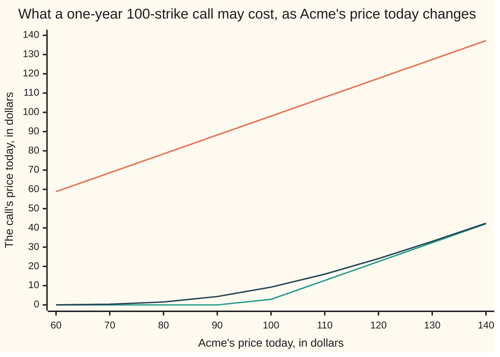
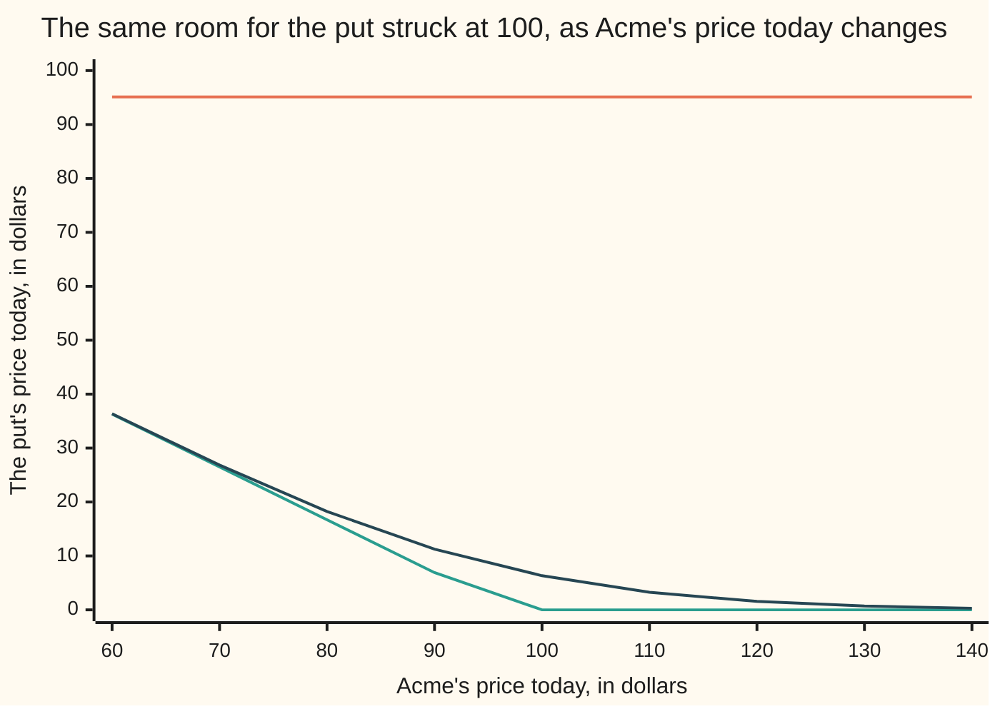

# Option price bounds: the floor and ceiling every call and put must respect before any model

[Syllabus](../../../SYLLABUS.md) → [Financial mathematics](../README.md) → [The Black-Scholes call and put](../README.md#s08) → Option price bounds

---

## General Overview

Acme shares trade at 100 dollars today. Every amount on this card is in dollars. A screen quotes a one-year call on Acme — the right, not the duty, to buy one share for 100 on one fixed day next year — at 2.50. European, meaning the right can be used on that day and no earlier.

That quote cannot stand, and saying why takes no pricing model. Nobody needs to guess where Acme is heading, or how jumpy it is — its volatility. Three trades, all done this morning:

- buy the call for 2.50;
- borrow a little under one share of Acme and sell it — a **short** sale, the share owed back on expiry day — taking in 98.019867;
- lend 95.122942 at the riskless 5% a bank pays, which grows to exactly 100 by expiry day.

Those three take in **0.396925** today. On expiry day they cancel down to one payment: 100 minus Acme's price if Acme finishes under 100, nothing at all if it finishes above. Cash in hand now, no way to lose later, and the deal is on the screen for anyone — so it does not last the morning: buyers compete for the call until the free cash is gone.

So the call has a floor, **2.896925**, found by adding up cash flows rather than by modelling Acme. Three more edges turn up the same way: the call can cost no more than **98.019867**, the matching put — the right to sell one share for 100 on the same day — no more than **95.122942**, and neither can cost less than nothing. A floor and a ceiling around one price read as a fence; the real name for the four edges is **bounds**, and that is the word from here on.

What lives inside the room is time value: the worth of being allowed to wait and see. Choosing one number in there is exactly what a model is for, and the shelf's model call at 20% volatility comes out at 9.227006, comfortably inside ([Black–Scholes call](01-black-scholes-call.md)).

**A call costs no more than the share it may deliver and no less than a firm deal to buy that share at the strike; a put is the same with the share and the strike money swapped; each of the four edges is enforced by a trade that pays cash today and can never lose at expiry.**

**What kind of fact this is:** a theorem, proved on this card in Why it works, from one assumption — that a price offering riskless profit does not last.

### The picture: the room a call price may live in



Top line: the ceiling, one share delivered at expiry. Bottom line: the floor, flat at zero until the share side catches the cash side, a little under 100, then climbing with Acme. Middle line: one model's answer at 20% volatility, which has to stay in the gap and does.

---

## The formula

Two pieces of shorthand carry the card, in words before symbols.

A dollar due on expiry day is worth less than a dollar today, since cash in the bank earns interest in between. With interest as a continuously compounded rate, a dollar due in $T$ years is worth $e^{-rT}$ dollars now, where $r$ is that rate and $e$ is the constant 2.71828…. Here $e^{-rT}$ is 0.951229, the **discount factor**.

A dividend-paying share needs the mirror of that trick. Buy $e^{-qT}$ of a share today, reinvest every dividend into more of the same share, and exactly one whole share is in hand on expiry day; $q$ is the **dividend yield**, the cash a share pays out each year as a rate. Here $e^{-qT}$ is 0.980199, the **dividend drag**.

Those give the two prices every bound is built from:

- the **share side**, $S e^{-qT}$: what it costs today to have exactly one Acme share on expiry day. Here 98.019867.
- the **cash side**, $K e^{-rT}$: what it costs today to have exactly $K$ dollars on expiry day. Here 95.122942.

$$\max\!\left(S e^{-qT} - K e^{-rT},\; 0\right) \;\le\; C \;\le\; S e^{-qT}$$

$$\max\!\left(K e^{-rT} - S e^{-qT},\; 0\right) \;\le\; P \;\le\; K e^{-rT}$$

**Read it aloud:** a call costs no more than the share it might deliver and no less than a firm deal to buy that share at the strike; a put costs no more than the strike money it might deliver and no less than a firm deal to sell the share at the strike; and neither costs less than nothing.

| Symbol | Plain meaning | In our example | Push it up and the bounds… |
| --- | --- | --- | --- |
| $C$ | what one European call costs today | quoted at 2.50, floor 2.896925 | it is the thing being fenced in |
| $P$ | what one European put costs today, same strike and day | 6.330081 at 20% volatility | it is the thing being fenced in |
| $S$ | Acme's share price today | 100 | both call bounds rise, the put floor falls |
| $K$ | the **strike**: the price the option trades the share at | 100, and 130 where the put floor bites | the call floor falls, both put bounds rise |
| $T$ | years until expiry day | 1 | both discount factors shrink; with $r$ above $q$ the gap between them widens at first, so the call floor rises |
| $r$ | the riskless rate, continuously compounded | 5% | the cash side shrinks: call floor up, both put bounds down |
| $q$ | the dividend yield, as a continuous rate | 2% | the share side shrinks: both call bounds down, put floor up |
| $S_T$ | Acme's price on expiry day, unknown today | never an input: the bounds hold whatever it turns out to be | — |
| $e^{-rT}$ | the discount factor: one dollar due at expiry, valued today | 0.951229 | — |
| $e^{-qT}$ | the dividend drag: shares to buy today to hold one share at expiry | 0.980199 | — |
| $F$ | the **forward price**, $S e^{(r-q)T}$: the strike that makes a firm deal free today | 103.045453 | the call floor rises |
| $\sigma$ | volatility, how jumpy the share is. Say "sigma". | 20%, used only for the model prices quoted as a test | nothing at all: it is absent from every bound |

A firm deal to buy one Acme share for $K$ on expiry day, with no right to walk away, is a **forward**. It is worth the share side minus the cash side: 98.019867 − 95.122942, or 2.896925 today. That number is the call's floor, which is the whole of Step 3.

### When it holds

- **European exercise only.** Every cash-flow table below looks at expiry day and nowhere else. A holder who may exercise early has more, so an American put is worth at least the larger of this card's floor and the undiscounted $\max(K - S, 0)$, and its ceiling is $K$ rather than the cash side ([Merton's theorem](../15-American%20and%20Bermudan%20exercise/02-mertons-no-early-exercise-theorem.md)).
- **One rate for lending and borrowing, and shares that can be sold short.** Every trade below lends or borrows at $r$ and buys or borrows shares. If borrowing costs more than lending pays, the bounds widen by that gap and quotes inside the wider band cannot be traded against.
- **A known dividend yield.** Get $q$ wrong and the share side is wrong. Reading 3% where the truth is 2% moves the call floor from 2.896925 to 1.921611, so a quote between the two looks broken when it is sound.
- **Costs small enough to leave something.** The four trades below pay 0.396925, 0.980133, 0.877058 and 0.639958 today. Commission, the fee for borrowing shares and the gap between bid and offer come out of exactly those amounts, which is why real quotes hug the bounds without touching them.

---

## Why it works

### Step 0: one idea, used four times

If one bundle of holdings pays at least as much as another in every outcome, it cannot cost less today. Suppose it did. Buy the cheap bundle, sell the dear one, keep the difference now; at expiry what is held pays at least what is owed, so nothing comes out of pocket. That is money for nothing, and prices move until it is gone ([No arbitrage](../03-Contracts%20and%20No-Arbitrage/02-no-arbitrage-and-the-law-of-one-price.md)).

Nothing else is assumed below: no distribution for Acme, no volatility, no opinion.

### Step 1: two prices a model cannot argue with

Both sides are known today, exactly. One share delivered at expiry costs $S e^{-qT}$ now, since $e^{-qT}$ of a share with its dividends reinvested grows into one whole share. Owing runs in reverse: short $e^{-qT}$ of a share, cover the dividends owed by shorting a little more, and the debt is exactly one share at expiry. $K$ dollars delivered at expiry costs $K e^{-rT}$ now, since that sum lent at $r$ grows into $K$. Every trade below is those two and the option itself.

### Step 2: the call's ceiling, the share side

A call hands over at most one share, and only in exchange for the strike. The share itself hands over one share and asks nothing. So the call cannot cost more than the share side. Suppose one is quoted at 99.00, above that ceiling of 98.019867. Sell the call and buy $e^{-qT}$ shares:

| Leg | Today | At expiry if $S_T \le 100$ | At expiry if $S_T > 100$ |
| --- | --- | --- | --- |
| Sell the call at 99.00 | +99.00 | 0 | $-(S_T - 100)$ |
| Buy $e^{-qT}$ shares, dividends reinvested | −98.019867 | $+S_T$ | $+S_T$ |
| **Total** | **+0.980133** | $S_T$, never below 0 | 100 |

Paid today, and at expiry the share covers whatever the call owes. The worst outcome is Acme at zero, which pays zero.

### Step 3: the call's floor, the share side minus the cash side

The call is a forward plus the right to walk away. A right to walk away is never worth less than nothing, so the call is worth at least the forward: 2.896925. Suppose a call is quoted at 2.50. Buy the call, then sell the forward by shorting $e^{-qT}$ shares and lending the cash side:

| Leg | Today | At expiry if $S_T \le 100$ | At expiry if $S_T > 100$ |
| --- | --- | --- | --- |
| Buy the call at 2.50 | −2.50 | 0 | $S_T - 100$ |
| Short $e^{-qT}$ shares, the debt growing to one share | +98.019867 | $-S_T$ | $-S_T$ |
| Lend 95.122942 at 5% | −95.122942 | +100 | +100 |
| **Total** | **+0.396925** | $100 - S_T$, never below 0 | 0 |

That is the trade from the opening. The strike appears discounted because it is handed over on expiry day, so only 95.122942 of it is committed today. Being allowed to pay later is worth something, and the floor is where that worth shows up.

The second floor needs no table. A call is a right, never a duty, so it can only ever pay its holder; nobody pays to hand one over, so the price cannot go below zero.

### Step 4: the put, with the share and the cash swapped

A put's best outcome is Acme at zero, which pays the strike — on expiry day, not now. So the put cannot cost more than the cash side, 95.122942. Suppose one is quoted at 96.00: sell the put and lend the cash side.

| Leg | Today | At expiry if $S_T \le 100$ | At expiry if $S_T > 100$ |
| --- | --- | --- | --- |
| Sell the put at 96.00 | +96.00 | $-(100 - S_T)$ | 0 |
| Lend 95.122942 at 5% | −95.122942 | +100 | +100 |
| **Total** | **+0.877058** | $S_T$, never below 0 | 100 |

The put's floor is the cash side minus the share side. At the house strike that is negative, so the floor that binds is plain zero and no trade can break it. Raise the strike to 130 and the floor bites: the cash side is 123.659825, the share side is still 98.019867, and the floor is 25.639958. Suppose that put is quoted at 25.00: buy the put, buy $e^{-qT}$ shares, borrow the cash side.

| Leg | Today | At expiry if $S_T \le 130$ | At expiry if $S_T > 130$ |
| --- | --- | --- | --- |
| Buy the put at 25.00 | −25.00 | $130 - S_T$ | 0 |
| Buy $e^{-qT}$ shares, dividends reinvested | −98.019867 | $+S_T$ | $+S_T$ |
| Borrow 123.659825 at 5%, repay 130 | +123.659825 | −130 | −130 |
| **Total** | **+0.639958** | 0 | $S_T - 130$, never below 0 |

All four tables share three features: the "Today" total is positive, every expiry entry is zero or better whatever Acme does, and some range of outcomes pays strictly more. The checks confirm it at every expiry price from 0 to 300 in 50-cent steps.



Top line: the put's ceiling, the strike money delivered at expiry, flat because it never depends on Acme. Bottom line: the put's floor, zero from the point where the share side catches the cash side. Middle line: the model at 20% volatility again. With Acme at 60 the model sits at 36.35 against a floor of 36.31: deep in the money a put is nearly all floor, and a model has almost nothing left to add.

<details>
<summary>Detailed proof</summary>

Write $x^+$ for $\max(x, 0)$. Each table's expiry column, added up, is an identity in $S_T$ that never goes below zero — and that is the whole proof, since each "Today" total is positive by the assumed mispricing.

- Call floor: $(S_T - K)^+ - S_T + K = (K - S_T)^+ \ge 0$.
- Call ceiling: $S_T - (S_T - K)^+ = \min(S_T, K) \ge 0$.
- Put ceiling: $K - (K - S_T)^+ = \min(S_T, K) \ge 0$.
- Put floor: $(K - S_T)^+ + S_T - K = (S_T - K)^+ \ge 0$.

Each identity is two cases checked one at a time. For the first: if $S_T > K$ the left side is $S_T - K - S_T + K$, which is 0, and so is the right side; if $S_T \le K$ the left side is $0 - S_T + K$ and the right side is $K - S_T$. The other three go the same way. So in every case the trader is paid today and holds something that can never pay out less than nothing, which by Step 0 the assumed price cannot survive.

The zero floors need no identity: a contract whose payoff is $(S_T - K)^+$ or $(K - S_T)^+$ never pays its holder less than nothing, so a negative price is free money by itself.

Two conditions were used and are easy to miss. The option is European, so the tables may look only at expiry day. And the dividend yield is known, so that $e^{-qT}$ shares held or owed today become exactly one share on expiry day. $\blacksquare$

</details>

### Step 5: nothing tighter is possible

The bounds look loose: with Acme at 100 the call's room is more than 95 wide. They cannot be narrowed without a model, because a model can be pushed as close to either edge as anyone likes. Run the shelf's formula at a volatility of 0.01% and the call comes out at 2.896925, the floor to six decimals, with the put at 0.000000, its floor. Run it at 5000% and the call is 98.019867 and the put 95.122942, both ceilings. Any tighter bound would rule out prices a legitimate model produces.

Two other roads reach the same edges. The short one runs through parity: $C - P$ equals the share side minus the cash side, always ([Put-call parity](03-put-call-parity.md)). Add "a put is worth at least nothing" and the call floor falls out; "a call is worth at least nothing" gives the put floor; "a put costs at most the cash side" gives the call ceiling. The four bounds are two facts in a coat: parity, and options never cost less than nothing. The checks price the call by formula and the put by numerical averaging, subtract, and land on 2.896925.

The other road drops models altogether. Any rule of the form "average the payoff, then discount" lands inside, provided the share averages to its forward, 103.045453. At every expiry price the call payoff sits between $S_T - K$ and $S_T$, and above zero; averaging keeps an ordering that holds outcome by outcome, and discounting turns the averages into the bounds. The checks try three spreads that look nothing like a bell curve — a coin toss, a lopsided three-point spread, and one that includes Acme going to zero — and all three land inside.

---

## Worked numbers, by hand

Acme at $S = 100$, strike $K = 100$, riskless rate $r = 5\%$, dividend yield $q = 2\%$, one year to expiry day.

| Step | Arithmetic | Value |
| --- | --- | --- |
| cash side, $K e^{-rT}$ | $100 \times e^{-0.05}$ | 95.122942 |
| share side, $S e^{-qT}$ | $100 \times e^{-0.02}$ | 98.019867 |
| **call floor** | $\max(98.019867 - 95.122942,\, 0)$ | **2.896925** |
| **call ceiling** | the share side | **98.019867** |
| **put floor** | $\max(95.122942 - 98.019867,\, 0)$ | **0.000000** |
| **put ceiling** | the cash side | **95.122942** |
| the forward price, $F$ | $100 \times e^{0.03}$ | 103.045453 |
| a model price to fence in | the shelf's call at 20% volatility | 9.227006 |
| and its put | priced on its own, by averaging | 6.330081 |
| $C - P$ from those two | $9.227006 - 6.330081$ | 2.896925, the call floor exactly |
| the quote on the screen | 2.50, under the floor | the trade banks **0.396925** today |

A one-year Acme call struck at today's price must therefore cost between 2.896925 and 98.019867, and the matching put between nothing and 95.122942. The floor is pinned before anyone says the word volatility, because it is what a firm deal to buy the share next year is worth today.

### What breaks if you drop a piece

| Mistake | Comes out at | What went wrong |
| --- | --- | --- |
| The strike taken undiscounted, $\max(S e^{-qT} - K, 0)$ | call floor 0.000000 | The strike is handed over on expiry day, so today it costs 95.122942, not 100. The quote at 2.50 then looks fine and 0.396925 of free money walks past. |
| The share taken without its dividend drag, $\max(S - K e^{-rT}, 0)$ | call floor 4.877058 | The share leg is $e^{-qT}$ shares, not one. A perfectly fair call at 5% volatility costs 3.711144, under this false floor; the trade it invites banks 1.165913 today and loses 2.222147 if Acme ends at 110. |
| The $\max(\cdot, 0)$ dropped | put floor −2.896925 | A negative floor forbids nothing. The floor that binds here is zero, and it comes from the contract being a right rather than a duty. |
| Intrinsic value $\max(K - S, 0)$ read as the put floor, at the 130 strike | 30.000000, against a true floor of 25.639958 | The 130 arrives on expiry day, not today, so its worth now is 123.659825. The model put at that strike costs 26.970744 — under intrinsic value, above the floor, and perfectly sound. |

Every number in that table is printed by the code below.

---

## Code, from first principles, and it actually runs

Nothing is imported that already knows an answer. The bell-curve area comes from `math.erf` in Python and from adding thin slices under the curve in Rust. The bounds are reached four independent ways: the two sides by arithmetic; every trade's legs added up at each expiry price from 0 to 300 and checked against a closed form; the call floor read off two separately priced options through parity; and three model-free spreads averaged and discounted. The model is then squeezed against each edge, and every wrong number above reproduced.

### Python

```python
# Option price bounds -- the check behind the card.  Standard library only.  Nothing imported
# that already knows an answer: the bell-curve area is built from math.erf, the second road to
# a model price is Simpson's rule written out, and each arbitrage is checked by adding its legs
# up at every expiry price from 0 to 300 in 50-cent steps, then against a closed form.
from math import log, sqrt, exp, erf, pi

def N(x):   return 0.5 * (1.0 + erf(x / sqrt(2.0)))       # bell-curve area left of x
def phi(x): return exp(-0.5 * x * x) / sqrt(2.0 * pi)     # bell-curve height at x

def bounds(S, K, r, q, T):
    share = S * exp(-q * T)            # cost today of exactly one share at T
    cash = K * exp(-r * T)             # cost today of exactly K dollars at T
    return max(share - cash, 0.0), share, max(cash - share, 0.0), cash

def bs(S, K, r, q, sigma, T):          # a MODEL price: here only something to fence in
    vt = sigma * sqrt(T)
    d1 = (log(S / K) + (r - q + 0.5 * sigma * sigma) * T) / vt
    return (S * exp(-q * T) * N(d1) - K * exp(-r * T) * N(d1 - vt),
            K * exp(-r * T) * N(vt - d1) - S * exp(-q * T) * N(-d1))

def by_integral(S, K, r, q, sigma, T, payoff, n=40000):
    # second road to a model price: average the payoff over the bell curve (Simpson)
    a, h = -10.0, 20.0 / n
    f = lambda z: payoff(S * exp((r - q - 0.5 * sigma * sigma) * T + sigma * sqrt(T) * z)) * phi(z)
    tot = f(a) + f(-a)
    for i in range(1, n):
        tot += (4 if i % 2 else 2) * f(a + i * h)
    return exp(-r * T) * tot * h / 3.0

def trade(kind, S, K, r, q, T, v):
    # cash today, the legs added up at expiry, and the closed form that sum must equal
    share, cash = S * exp(-q * T), K * exp(-r * T)
    if kind == "call under floor":     # buy the call, short e^-qT shares, lend K e^-rT
        return -v + share - cash, lambda ST: max(ST - K, 0.0) - ST + K, lambda ST: max(K - ST, 0.0)
    if kind == "call over ceiling":    # sell the call, buy e^-qT shares
        return v - share, lambda ST: ST - max(ST - K, 0.0), lambda ST: min(ST, K)
    if kind == "put over ceiling":     # sell the put, lend K e^-rT
        return v - cash, lambda ST: K - max(K - ST, 0.0), lambda ST: min(ST, K)
    return -v - share + cash, lambda ST: max(K - ST, 0.0) + ST - K, lambda ST: max(ST - K, 0.0)

S, K, r, q, sigma, T = 100.0, 100.0, 0.05, 0.02, 0.20, 1.0
K2 = 130.0                                    # a strike where the put floor bites
scan = [0.5 * i for i in range(601)]          # every expiry price from 0 to 300
cf, cc, pf, pc = bounds(S, K, r, q, T)
share, cash = cc, pc
F = S * exp((r - q) * T)
C0 = bs(S, K, r, q, sigma, T)[0]
C0i = by_integral(S, K, r, q, sigma, T, lambda ST: max(ST - K, 0.0))
P0i = by_integral(S, K, r, q, sigma, T, lambda ST: max(K - ST, 0.0))
pf2 = bounds(S, K2, r, q, T)[2]

rows, shapes_ok = [], True
for kind, tail, kk, quote in (("call under floor", " 2.896925", K, 2.50),
                              ("call over ceiling", " 98.019867", K, 99.00),
                              ("put over ceiling", " 95.122942", K, 96.00),
                              ("put under floor", " 25.639958, K = 130", K2, 25.00)):
    today, legs, shape = trade(kind, S, kk, r, q, T, quote)
    shapes_ok = shapes_ok and all(abs(legs(ST) - shape(ST)) < 1e-12 for ST in scan)
    rows.append((kind + tail, quote, today, legs, min(legs(ST) for ST in scan)))
inside_today = trade("call under floor", S, K, r, q, T, C0)[0]   # the recipe on a fair price

# a road with no model in it: any rule that discounts the average payoff, with the
# share averaging to the forward, lands inside the same fences.  Three odd spreads:
third = (F - 8.0 - 47.5) / 0.3
dist_rows, dist_ok = [], True
for name, pts in ((f"coin {70.0:.6f} or {2 * F - 70.0:.6f}", ((70.0, 0.5), (2 * F - 70.0, 0.5))),
                  (f"three points 40, 95, {third:.6f}", ((40.0, 0.2), (95.0, 0.5), (third, 0.3))),
                  (f"coin {0.0:.6f} or {2 * F:.6f}", ((0.0, 0.5), (2 * F, 0.5)))):
    mean = sum(x * p for x, p in pts)
    Cd = exp(-r * T) * sum(max(x - K, 0.0) * p for x, p in pts)
    Pd = exp(-r * T) * sum(max(K - x, 0.0) * p for x, p in pts)
    ok = abs(mean - F) < 1e-9 and cf <= Cd <= cc and pf <= Pd <= pc
    dist_ok = dist_ok and ok
    dist_rows.append((name, mean, Cd, Pd, "yes" if ok else "no"))

C_lo, P_lo = bs(S, K, r, q, 1e-4, T)          # a model squeezed against the floors
C_hi, P_hi = bs(S, K, r, q, 50.0, T)          # and against the ceilings
cf_nodisc = max(share - K, 0.0)               # the strike left undiscounted
cf_nodrag = max(S - cash, 0.0)                # the share left without its dividend drag
C_5 = bs(S, K, r, q, 0.05, T)[0]              # a fair price sitting under that false floor
false_today = -C_5 + S - cash                 # shorting one whole share, not e^-qT of one
false_110 = max(110.0 - K, 0.0) - exp(q * T) * 110.0 + K
P130i = by_integral(S, K2, r, q, sigma, T, lambda ST: max(K2 - ST, 0.0))
cf_q3 = bounds(S, K, r, 0.03, T)[0]

def row(name, v): print(f"{name:<48}{v:>12.6f}")
for name, v in (("discount factor  e^-rT", exp(-r * T)), ("dividend drag    e^-qT", exp(-q * T)),
                ("share side  S e^-qT", share), ("cash side   K e^-rT", cash),
                ("forward     S e^(r-q)T", F), ("call floor  max(share - cash, 0)", cf),
                ("call ceiling = the share side", cc), ("put floor   max(cash - share, 0)", pf),
                ("put ceiling = the cash side", pc), ("model call at 20% vol, formula", C0),
                ("model call at 20% vol, Simpson integral", C0i), ("model put at 20% vol, Simpson integral", P0i),
                ("C - P from those two model prices", C0 - P0i)):
    row(name, v)
print("\nthe four trades: cash today, then the legs added up at expiry")
cols = (80.0, 100.0, 120.0, 160.0)
print(f"{'trade':<36}{'quote':>7}{'today':>10}" + "".join(f"{'S_T=' + str(int(c)):>9}" for c in cols) + f"{'worst':>8}")
for name, quote, today, legs, worst in rows:
    print(f"{name:<36}{quote:>7.2f}{today:>10.6f}" + "".join(f"{legs(c):>9.2f}" for c in cols) + f"{worst:>8.2f}")
row("the same recipe on the fair call: cash today", inside_today)
print(f"\nthree spreads of expiry prices averaging to the forward {F:.6f}")
print(f"{'spread of expiry prices':<36}{'mean':>12}{'call':>11}{'put':>11}{'inside':>8}")
for name, mean, Cd, Pd, ok in dist_rows:
    print(f"{name:<36}{mean:>12.6f}{Cd:>11.6f}{Pd:>11.6f}{ok:>8}")
print()
for name, v in (("model call at 0.01% vol, against the floor", C_lo), ("model call at 5000% vol, against the ceiling", C_hi),
                ("model put at 0.01% vol, against the floor", P_lo), ("model put at 5000% vol, against the ceiling", P_hi)):
    row(name, v)
print()
for name, v in (("wrong: strike not discounted, call floor", cf_nodisc), ("wrong: share not dividend-dragged, call floor", cf_nodrag),
                ("  a fair 5%-vol call, under that false floor", C_5), ("  the false trade: cash today", false_today),
                ("  the false trade at expiry, share at 110", false_110), ("wrong: max(., 0) dropped, put floor", cash - share),
                ("wrong: intrinsic K - S as the put floor, K = 130", K2 - S), ("  the K = 130 cash side K e^-rT", K2 * exp(-r * T)),
                ("  the true K = 130 put floor", pf2), ("  the model K = 130 put, under intrinsic", P130i),
                ("call floor if the dividend yield were 3%", cf_q3)):
    row(name, v)
spots = [60.0 + 10.0 * i for i in range(9)]
print(f"\n{'chart, share price S':<30}" + "".join(f"{s:>7.0f}" for s in spots))
for name, f in (("chart, call ceiling", lambda s: bounds(s, K, r, q, T)[1]),
                ("chart, call floor", lambda s: bounds(s, K, r, q, T)[0]),
                ("chart, model call at 20% vol", lambda s: bs(s, K, r, q, sigma, T)[0]),
                ("chart, put ceiling", lambda s: bounds(s, K, r, q, T)[3]),
                ("chart, put floor", lambda s: bounds(s, K, r, q, T)[2]),
                ("chart, model put at 20% vol", lambda s: bs(s, K, r, q, sigma, T)[1])):
    print(f"{name:<30}" + "".join(f"{f(s):>7.2f}" for s in spots))

assert abs(C0 - 9.227005508154) < 1e-9, "the model call lands on the house number"
assert abs(C0i - C0) < 1e-7, "Simpson integral against the formula: two roads to one price"
assert abs(cf - (C0 - P0i)) < 1e-6, "the call floor equals C - P of two separately priced options"
assert shapes_ok, "every trade's legs add up to its closed form at every expiry price"
assert all(t[2] > 0 for t in rows), "each broken quote pays cash today"
assert all(t[4] >= -1e-12 for t in rows), "no trade ever loses at expiry"
assert inside_today < 0, "the same recipe on a fair price costs money to enter"
assert dist_ok, "three model-free spreads land inside the fences"
assert abs(C_lo - cf) < 1e-6 and abs(P_lo - pf) < 1e-6, "a vanishing vol lands the model on both floors"
assert abs(C_hi - cc) < 1e-6 and abs(P_hi - pc) < 1e-6, "a huge vol lands the model on both ceilings"
assert C_5 > cf and C_5 < cf_nodrag, "a fair price can sit under the false floor"
assert false_110 < 0, "the trade the false floor invites loses money at expiry"
assert P130i < K2 - S and P130i > pf2, "a European put may sit under intrinsic, never under its floor"
print("ALL CHECKS PASS")
```

**Ran 2026-09-19 on macOS, Python 3.14.6, standard library only. All checks passed. Output, pasted from the run:**

```
discount factor  e^-rT                              0.951229
dividend drag    e^-qT                              0.980199
share side  S e^-qT                                98.019867
cash side   K e^-rT                                95.122942
forward     S e^(r-q)T                            103.045453
call floor  max(share - cash, 0)                    2.896925
call ceiling = the share side                      98.019867
put floor   max(cash - share, 0)                    0.000000
put ceiling = the cash side                        95.122942
model call at 20% vol, formula                      9.227006
model call at 20% vol, Simpson integral             9.227006
model put at 20% vol, Simpson integral              6.330081
C - P from those two model prices                   2.896925

the four trades: cash today, then the legs added up at expiry
trade                                 quote     today   S_T=80  S_T=100  S_T=120  S_T=160   worst
call under floor 2.896925              2.50  0.396925    20.00     0.00     0.00     0.00    0.00
call over ceiling 98.019867           99.00  0.980133    80.00   100.00   100.00   100.00    0.00
put over ceiling 95.122942            96.00  0.877058    80.00   100.00   100.00   100.00    0.00
put under floor 25.639958, K = 130    25.00  0.639958     0.00     0.00     0.00    30.00    0.00
the same recipe on the fair call: cash today       -6.330081

three spreads of expiry prices averaging to the forward 103.045453
spread of expiry prices                     mean       call        put  inside
coin 70.000000 or 136.090907          103.045453  17.165366  14.268441     yes
three points 40, 95, 158.484845       103.045453  16.689752  13.792827     yes
coin 0.000000 or 206.090907           103.045453  50.458396  47.561471     yes

model call at 0.01% vol, against the floor          2.896925
model call at 5000% vol, against the ceiling       98.019867
model put at 0.01% vol, against the floor           0.000000
model put at 5000% vol, against the ceiling        95.122942

wrong: strike not discounted, call floor            0.000000
wrong: share not dividend-dragged, call floor       4.877058
  a fair 5%-vol call, under that false floor        3.711144
  the false trade: cash today                       1.165913
  the false trade at expiry, share at 110          -2.222147
wrong: max(., 0) dropped, put floor                -2.896925
wrong: intrinsic K - S as the put floor, K = 130   30.000000
  the K = 130 cash side K e^-rT                   123.659825
  the true K = 130 put floor                       25.639958
  the model K = 130 put, under intrinsic           26.970744
call floor if the dividend yield were 3%            1.921611

chart, share price S               60     70     80     90    100    110    120    130    140
chart, call ceiling             58.81  68.61  78.42  88.22  98.02 107.82 117.62 127.43 137.23
chart, call floor                0.00   0.00   0.00   0.00   2.90  12.70  22.50  32.30  42.10
chart, model call at 20% vol     0.04   0.35   1.53   4.36   9.23  15.96  24.06  33.00  42.40
chart, put ceiling              95.12  95.12  95.12  95.12  95.12  95.12  95.12  95.12  95.12
chart, put floor                36.31  26.51  16.71   6.91   0.00   0.00   0.00   0.00   0.00
chart, model put at 20% vol     36.35  26.85  18.24  11.26   6.33   3.26   1.56   0.70   0.30
ALL CHECKS PASS
```

### Rust

Same inputs, same labels, same numbers. Rust has no `erf`, so the bell-curve area is built by adding up thin slices under the curve. No crates.

```rust
// Option price bounds -- the same check as option_price_bounds_check.py, in Rust.  No crates.
// Rust has no erf, so the bell-curve area N(x) is built the honest way: add up thin slices
// under the curve (Simpson).  Same inputs, same labels, same numbers as the Python.
// Compile: rustc --edition 2021 -O option_price_bounds_check.rs -o /tmp/bounds_check
use std::f64::consts::PI;

fn phi(x: f64) -> f64 { (-0.5 * x * x).exp() / (2.0 * PI).sqrt() }   // bell-curve height at x

fn simpson<F: Fn(f64) -> f64>(f: F, a: f64, b: f64, n: usize) -> f64 {
    let h = (b - a) / n as f64;
    let mut s = f(a) + f(b);
    for i in 1..n { s += if i % 2 == 1 { 4.0 } else { 2.0 } * f(a + i as f64 * h); }
    s * h / 3.0
}
fn n_cdf(x: f64) -> f64 {                          // bell-curve area left of x
    if x < -12.0 { return 0.0; }
    if x > 12.0 { return 1.0; }
    0.5 + simpson(phi, 0.0, x, 4000)               // half, plus the slice from 0 to x
}
fn bounds(s: f64, k: f64, r: f64, q: f64, t: f64) -> (f64, f64, f64, f64) {
    let share = s * (-q * t).exp();                // cost today of exactly one share at T
    let cash = k * (-r * t).exp();                 // cost today of exactly K dollars at T
    ((share - cash).max(0.0), share, (cash - share).max(0.0), cash)
}
fn bs(s: f64, k: f64, r: f64, q: f64, sigma: f64, t: f64) -> (f64, f64) {
    let vt = sigma * t.sqrt();                     // a MODEL price: something to fence in
    let d1 = ((s / k).ln() + (r - q + 0.5 * sigma * sigma) * t) / vt;
    (s * (-q * t).exp() * n_cdf(d1) - k * (-r * t).exp() * n_cdf(d1 - vt),
     k * (-r * t).exp() * n_cdf(vt - d1) - s * (-q * t).exp() * n_cdf(-d1))
}
fn by_integral<F: Fn(f64) -> f64>(s: f64, r: f64, q: f64, sigma: f64, t: f64, payoff: F) -> f64 {
    // second road to a model price: average the payoff over the bell curve (Simpson)
    let f = |z: f64| payoff(s * ((r - q - 0.5 * sigma * sigma) * t + sigma * t.sqrt() * z).exp()) * phi(z);
    (-r * t).exp() * simpson(f, -10.0, 10.0, 40000)
}
fn today_cash(kind: usize, s: f64, k: f64, r: f64, q: f64, t: f64, v: f64) -> f64 {
    let (share, cash) = (s * (-q * t).exp(), k * (-r * t).exp());
    match kind {                      // buy the cheap side, sell the dear one
        0 => -v + share - cash,       // buy the call, short e^-qT shares, lend K e^-rT
        1 => v - share,               // sell the call, buy e^-qT shares
        2 => v - cash,                // sell the put, lend K e^-rT
        _ => -v - share + cash,       // buy the put, buy e^-qT shares, borrow K e^-rT
    }
}
fn legs(kind: usize, k: f64, st: f64) -> f64 {     // the legs added up at expiry
    match kind { 0 => (st - k).max(0.0) - st + k, 1 => st - (st - k).max(0.0),
                 2 => k - (k - st).max(0.0), _ => (k - st).max(0.0) + st - k }
}
fn shape(kind: usize, k: f64, st: f64) -> f64 {    // the closed form that sum must equal
    match kind { 0 => (k - st).max(0.0), 1 | 2 => st.min(k), _ => (st - k).max(0.0) }
}
fn row(name: &str, v: f64) { println!("{:<48}{:>12.6}", name, v); }

fn main() {
    let (s, k, r, q, sigma, t) = (100.0_f64, 100.0_f64, 0.05_f64, 0.02_f64, 0.20_f64, 1.0_f64);
    let k2 = 130.0_f64;                                  // a strike where the put floor bites
    let scan: Vec<f64> = (0..601).map(|i| 0.5 * i as f64).collect();   // expiry prices 0 to 300
    let (cf, cc, pf, pc) = bounds(s, k, r, q, t);
    let (share, cash) = (cc, pc);
    let f = s * ((r - q) * t).exp();
    let c0 = bs(s, k, r, q, sigma, t).0;
    let c0i = by_integral(s, r, q, sigma, t, |st| (st - k).max(0.0));
    let p0i = by_integral(s, r, q, sigma, t, |st| (k - st).max(0.0));
    let pf2 = bounds(s, k2, r, q, t).2;

    let mut shapes_ok = true;
    let mut rows: Vec<(String, f64, f64, usize, f64, f64)> = Vec::new();
    for (kind, name, kk, quote) in [(0usize, "call under floor 2.896925", k, 2.50_f64),
                                    (1, "call over ceiling 98.019867", k, 99.00),
                                    (2, "put over ceiling 95.122942", k, 96.00),
                                    (3, "put under floor 25.639958, K = 130", k2, 25.00)] {
        let mut worst = f64::INFINITY;
        for st in &scan {
            if (legs(kind, kk, *st) - shape(kind, kk, *st)).abs() >= 1e-12 { shapes_ok = false; }
            worst = worst.min(legs(kind, kk, *st));
        }
        rows.push((name.to_string(), quote, today_cash(kind, s, kk, r, q, t, quote), kind, kk, worst));
    }
    let inside_today = today_cash(0, s, k, r, q, t, c0);      // the recipe on a fair price

    // a road with no model in it: any rule that discounts the average payoff, with the
    // share averaging to the forward, lands inside the same fences.  Three odd spreads:
    let third = (f - 8.0 - 47.5) / 0.3;
    let mut dist_rows: Vec<(String, f64, f64, f64, &str)> = Vec::new();
    let mut dist_ok = true;
    for (name, pts) in [(format!("coin {:.6} or {:.6}", 70.0, 2.0 * f - 70.0), vec![(70.0, 0.5), (2.0 * f - 70.0, 0.5)]),
                        (format!("three points 40, 95, {:.6}", third), vec![(40.0, 0.2), (95.0, 0.5), (third, 0.3)]),
                        (format!("coin {:.6} or {:.6}", 0.0, 2.0 * f), vec![(0.0, 0.5), (2.0 * f, 0.5)])] {
        let mean: f64 = pts.iter().map(|(x, p)| x * p).sum();
        let cd = (-r * t).exp() * pts.iter().map(|(x, p)| (x - k).max(0.0) * p).sum::<f64>();
        let pd = (-r * t).exp() * pts.iter().map(|(x, p)| (k - x).max(0.0) * p).sum::<f64>();
        let ok = (mean - f).abs() < 1e-9 && cf <= cd && cd <= cc && pf <= pd && pd <= pc;
        dist_ok = dist_ok && ok;
        dist_rows.push((name, mean, cd, pd, if ok { "yes" } else { "no" }));
    }

    let (c_lo, p_lo) = bs(s, k, r, q, 1e-4, t);         // a model squeezed against the floors
    let (c_hi, p_hi) = bs(s, k, r, q, 50.0, t);         // and against the ceilings
    let cf_nodisc = (share - k).max(0.0);               // the strike left undiscounted
    let cf_nodrag = (s - cash).max(0.0);                // the share left without its drag
    let c_5 = bs(s, k, r, q, 0.05, t).0;                // a fair price under that false floor
    let false_today = -c_5 + s - cash;                  // shorting one whole share, not e^-qT
    let false_110 = (110.0_f64 - k).max(0.0) - (q * t).exp() * 110.0 + k;
    let p130i = by_integral(s, r, q, sigma, t, |st| (k2 - st).max(0.0));
    let cf_q3 = bounds(s, k, r, 0.03, t).0;

    for (name, v) in [("discount factor  e^-rT", (-r * t).exp()), ("dividend drag    e^-qT", (-q * t).exp()),
                      ("share side  S e^-qT", share), ("cash side   K e^-rT", cash),
                      ("forward     S e^(r-q)T", f), ("call floor  max(share - cash, 0)", cf),
                      ("call ceiling = the share side", cc), ("put floor   max(cash - share, 0)", pf),
                      ("put ceiling = the cash side", pc), ("model call at 20% vol, formula", c0),
                      ("model call at 20% vol, Simpson integral", c0i),
                      ("model put at 20% vol, Simpson integral", p0i),
                      ("C - P from those two model prices", c0 - p0i)] { row(name, v); }
    println!("\nthe four trades: cash today, then the legs added up at expiry");
    let cols = [80.0_f64, 100.0, 120.0, 160.0];
    let hdr: String = cols.iter().map(|c| format!("{:>9}", format!("S_T={}", *c as i64))).collect();
    println!("{:<36}{:>7}{:>10}{}{:>8}", "trade", "quote", "today", hdr, "worst");
    for (name, quote, today, kind, kk, worst) in &rows {
        let cells: String = cols.iter().map(|c| format!("{:>9.2}", legs(*kind, *kk, *c))).collect();
        println!("{:<36}{:>7.2}{:>10.6}{}{:>8.2}", name, quote, today, cells, worst);
    }
    row("the same recipe on the fair call: cash today", inside_today);
    println!("\nthree spreads of expiry prices averaging to the forward {:.6}", f);
    println!("{:<36}{:>12}{:>11}{:>11}{:>8}", "spread of expiry prices", "mean", "call", "put", "inside");
    for (name, mean, cd, pd, ok) in &dist_rows {
        println!("{:<36}{:>12.6}{:>11.6}{:>11.6}{:>8}", name, mean, cd, pd, ok);
    }
    println!();
    for (name, v) in [("model call at 0.01% vol, against the floor", c_lo), ("model call at 5000% vol, against the ceiling", c_hi),
                      ("model put at 0.01% vol, against the floor", p_lo), ("model put at 5000% vol, against the ceiling", p_hi)] { row(name, v); }
    println!();
    for (name, v) in [("wrong: strike not discounted, call floor", cf_nodisc), ("wrong: share not dividend-dragged, call floor", cf_nodrag),
                      ("  a fair 5%-vol call, under that false floor", c_5), ("  the false trade: cash today", false_today),
                      ("  the false trade at expiry, share at 110", false_110), ("wrong: max(., 0) dropped, put floor", cash - share),
                      ("wrong: intrinsic K - S as the put floor, K = 130", k2 - s), ("  the K = 130 cash side K e^-rT", k2 * (-r * t).exp()),
                      ("  the true K = 130 put floor", pf2), ("  the model K = 130 put, under intrinsic", p130i),
                      ("call floor if the dividend yield were 3%", cf_q3)] { row(name, v); }
    let spots: Vec<f64> = (0..9).map(|i| 60.0 + 10.0 * i as f64).collect();
    let xs: String = spots.iter().map(|sp| format!("{:>7.0}", sp)).collect();
    println!("\n{:<30}{}", "chart, share price S", xs);
    for (name, pick) in [("chart, call ceiling", 1usize), ("chart, call floor", 0), ("chart, model call at 20% vol", 4),
                         ("chart, put ceiling", 3), ("chart, put floor", 2), ("chart, model put at 20% vol", 5)] {
        let cells: String = spots.iter().map(|sp| {
            let b = bounds(*sp, k, r, q, t);
            format!("{:>7.2}", match pick { 0 => b.0, 1 => b.1, 2 => b.2, 3 => b.3,
                                            4 => bs(*sp, k, r, q, sigma, t).0, _ => bs(*sp, k, r, q, sigma, t).1 })
        }).collect();
        println!("{:<30}{}", name, cells);
    }

    assert!((c0 - 9.227005508154).abs() < 1e-9, "the model call lands on the house number");
    assert!((c0i - c0).abs() < 1e-7, "Simpson integral against the formula: two roads to one price");
    assert!((cf - (c0 - p0i)).abs() < 1e-6, "the call floor equals C - P of two separately priced options");
    assert!(shapes_ok, "every trade's legs add up to its closed form at every expiry price");
    assert!(rows.iter().all(|t| t.2 > 0.0), "each broken quote pays cash today");
    assert!(rows.iter().all(|t| t.5 >= -1e-12), "no trade ever loses at expiry");
    assert!(inside_today < 0.0, "the same recipe on a fair price costs money to enter");
    assert!(dist_ok, "three model-free spreads land inside the fences");
    assert!((c_lo - cf).abs() < 1e-6 && (p_lo - pf).abs() < 1e-6, "a vanishing vol lands the model on both floors");
    assert!((c_hi - cc).abs() < 1e-6 && (p_hi - pc).abs() < 1e-6, "a huge vol lands the model on both ceilings");
    assert!(c_5 > cf && c_5 < cf_nodrag, "a fair price can sit under the false floor");
    assert!(false_110 < 0.0, "the trade the false floor invites loses money at expiry");
    assert!(p130i < k2 - s && p130i > pf2, "a European put may sit under intrinsic, never under its floor");
    println!("ALL CHECKS PASS");
}
```

**Ran 2026-09-19 on macOS, rustc 1.98.1, no crates. All checks passed. Output, pasted from the run:**

```
discount factor  e^-rT                              0.951229
dividend drag    e^-qT                              0.980199
share side  S e^-qT                                98.019867
cash side   K e^-rT                                95.122942
forward     S e^(r-q)T                            103.045453
call floor  max(share - cash, 0)                    2.896925
call ceiling = the share side                      98.019867
put floor   max(cash - share, 0)                    0.000000
put ceiling = the cash side                        95.122942
model call at 20% vol, formula                      9.227006
model call at 20% vol, Simpson integral             9.227006
model put at 20% vol, Simpson integral              6.330081
C - P from those two model prices                   2.896925

the four trades: cash today, then the legs added up at expiry
trade                                 quote     today   S_T=80  S_T=100  S_T=120  S_T=160   worst
call under floor 2.896925              2.50  0.396925    20.00     0.00     0.00     0.00    0.00
call over ceiling 98.019867           99.00  0.980133    80.00   100.00   100.00   100.00    0.00
put over ceiling 95.122942            96.00  0.877058    80.00   100.00   100.00   100.00    0.00
put under floor 25.639958, K = 130    25.00  0.639958     0.00     0.00     0.00    30.00    0.00
the same recipe on the fair call: cash today       -6.330081

three spreads of expiry prices averaging to the forward 103.045453
spread of expiry prices                     mean       call        put  inside
coin 70.000000 or 136.090907          103.045453  17.165366  14.268441     yes
three points 40, 95, 158.484845       103.045453  16.689752  13.792827     yes
coin 0.000000 or 206.090907           103.045453  50.458396  47.561471     yes

model call at 0.01% vol, against the floor          2.896925
model call at 5000% vol, against the ceiling       98.019867
model put at 0.01% vol, against the floor           0.000000
model put at 5000% vol, against the ceiling        95.122942

wrong: strike not discounted, call floor            0.000000
wrong: share not dividend-dragged, call floor       4.877058
  a fair 5%-vol call, under that false floor        3.711144
  the false trade: cash today                       1.165913
  the false trade at expiry, share at 110          -2.222147
wrong: max(., 0) dropped, put floor                -2.896925
wrong: intrinsic K - S as the put floor, K = 130   30.000000
  the K = 130 cash side K e^-rT                   123.659825
  the true K = 130 put floor                       25.639958
  the model K = 130 put, under intrinsic           26.970744
call floor if the dividend yield were 3%            1.921611

chart, share price S               60     70     80     90    100    110    120    130    140
chart, call ceiling             58.81  68.61  78.42  88.22  98.02 107.82 117.62 127.43 137.23
chart, call floor                0.00   0.00   0.00   0.00   2.90  12.70  22.50  32.30  42.10
chart, model call at 20% vol     0.04   0.35   1.53   4.36   9.23  15.96  24.06  33.00  42.40
chart, put ceiling              95.12  95.12  95.12  95.12  95.12  95.12  95.12  95.12  95.12
chart, put floor                36.31  26.51  16.71   6.91   0.00   0.00   0.00   0.00   0.00
chart, model put at 20% vol     36.35  26.85  18.24  11.26   6.33   3.26   1.56   0.70   0.30
ALL CHECKS PASS
```

The two outputs match line for line, from different code taking different routes to the bell-curve area.

> [!TIP]
> **Try changing**
> Guess the direction first, then run it. The asserts are pinned to the house market, so expect one to stop the program after a change.
> - **Set `r = 0.0`.** Does the call floor rise or fall? It falls to 0.000000, the number the "strike not discounted" row prints. With no interest, paying later is worth nothing, and the floor collapses onto what exercising today would pay.
> - **Set `q = 0.03`.** The call floor drops to 1.921611, the last row of the what-breaks block. More dividends leaking out of the share leaves less in the share side.
> - **Quote the call at its model price.** Change the first trade's quote from `2.50` to `9.227006`. Cash today becomes −6.330081, the put's price to the digit. The recipe pays only when a bound is broken; what it costs otherwise is exactly the walk-away right.
> - **Starve the integrator.** Set `n=40` in `by_integral`. The averaging road drifts off the formula and the second assert stops the run. Forty slices cannot trace a bell curve; forty thousand can.

---

## The usual mistake

> [!warning]
> **Reading intrinsic value as the floor.** Intrinsic value is what an option would pay if it could be cashed in this instant: $\max(S - K, 0)$ for a call, $\max(K - S, 0)$ for a put. It feels like a floor. For a European option it is the wrong floor, and wrong in both directions.
>
> - For a call it is too low whenever the rate beats the dividend yield. Here it says zero while the true floor is 2.896925, so a call quoted at 2.50 passes a test it should fail.
> - For a put it is too high. At the 130 strike it says 30.000000 while the floor is 25.639958, and a fair model put there costs 26.970744. A European put under its intrinsic value is no arbitrage: the strike money cannot be collected until expiry day.
>
> Three smaller traps:
> - **Using these bounds on American options.** Early exercise can only add value, so each floor rises to at least the larger of this card's floor and the undiscounted intrinsic value, and the put's ceiling becomes the undiscounted strike. The call's floor here stays 2.896925, since its intrinsic value is zero.
> - **Forgetting the dividend drag.** The share leg is $e^{-qT}$ shares, not one. Skip it and the call floor reads 4.877058 instead of 2.896925, and the trade that false floor invites loses 2.222147 with Acme at 110.
> - **Reading the bounds as a price.** From 2.896925 to 98.019867 is nearly the whole share. Bounds say where a price cannot be, never where it is.

---

## Where you meet it in real life

- **The first test run on any quote.** A price outside the bounds has no implied volatility at all, since a model sweeps only the open room between them. A solver fed such a quote spins or lies, so the bound check runs first.
- **Data feeds and risk screens.** Quotes are filtered against these edges, and a crossed bound is usually a stale or mistyped number rather than an opportunity.
- **American calls.** The call floor, with its discounted strike, is why exercising an American call early is a mistake on a share paying no dividends: selling fetches at least the floor, which beats the intrinsic value on offer ([Merton's theorem](../15-American%20and%20Bermudan%20exercise/02-mertons-no-early-exercise-theorem.md)).
- **Splitting a price in two.** The usual cut is intrinsic value plus time value — cashing in now against waiting — and it falls in a different place from this card's floor ([Intrinsic and time value](06-intrinsic-and-time-value.md)).
- **Judging a model.** A model pricing outside these bounds would be selling free money — a harder objection than any usual complaint about its assumptions ([The Black-Scholes assumptions](09-black-scholes-assumptions-and-failures.md)).
- **Convertible bonds.** A convertible bond is a bond plus a call, so its floor is the bond's worth plus the call's floor. Desks quote the gap above that floor rather than the price.

> **Say it back**
> A call may deliver one share, so it cannot cost more than one share delivered at expiry: 98.019867 here. It is a firm deal to buy that share at the strike plus the right to walk away, so it cannot cost less than that deal: 98.019867 minus 95.122942, or 2.896925. A put is the same with the share and the strike money swapped, and neither can cost less than nothing. Break any of the four and a trade exists that banks cash today and never loses at expiry — 0.396925 against a call quoted at 2.50. No volatility, no distribution and no model appears anywhere in the argument, which is why these bounds outlive every model.

---

## What this builds on

- [Put-call parity](03-put-call-parity.md): the identity between a call, a put and a forward, which turns all four bounds into two short sentences.
- [No arbitrage](../03-Contracts%20and%20No-Arbitrage/02-no-arbitrage-and-the-law-of-one-price.md): the one assumption behind every table here, that a bundle paying at least as much as another cannot cost less.

## Where this goes next

- [Shape across strikes and expiries](05-strike-and-calendar-shape.md): more model-free rules, across several strikes and dates at once — prices falling as the strike rises, bending one way, growing with time.
- [Merton's theorem](../15-American%20and%20Bermudan%20exercise/02-mertons-no-early-exercise-theorem.md): this card's call floor turned into a rule about when to exercise, and why an American call on a share paying no dividends is never cashed in early.

One call and one put leave a room nearly as wide as the share. What narrows it is a second quote to compare against, and the next card sets strikes and dates side by side to squeeze the room from outside.

---

## Sources

Verified 19 Sep 2026: every link below resolves to the publisher's page.

- Merton, Robert C. "Theory of Rational Option Pricing." *Bell Journal of Economics and Management Science* 4, no. 1 (1973): 141–183. [doi:10.2307/3003143](https://doi.org/10.2307/3003143). The bounds proved by dominance, the dividend adjustment, and the line between European and American contracts.
- Stoll, Hans R. "The Relationship Between Put and Call Option Prices." *Journal of Finance* 24, no. 5 (1969): 801–824. [doi:10.1111/j.1540-6261.1969.tb01694.x](https://doi.org/10.1111/j.1540-6261.1969.tb01694.x). Parity, the short road to the same four bounds.
- Black, Fischer, and Myron Scholes. "The Pricing of Options and Corporate Liabilities." *Journal of Political Economy* 81, no. 3 (1973): 637–654. [doi:10.1086/260062](https://doi.org/10.1086/260062). The model used here only as the thing being fenced in.
- Hull, John C. *Options, Futures, and Other Derivatives*, 11th ed. Pearson. [Publisher page](https://www.pearson.com/en-us/subject-catalog/p/options-futures-and-other-derivatives/P200000005938). The chapter "Properties of Stock Options" works the same bounds with the same style of cash-flow table.
