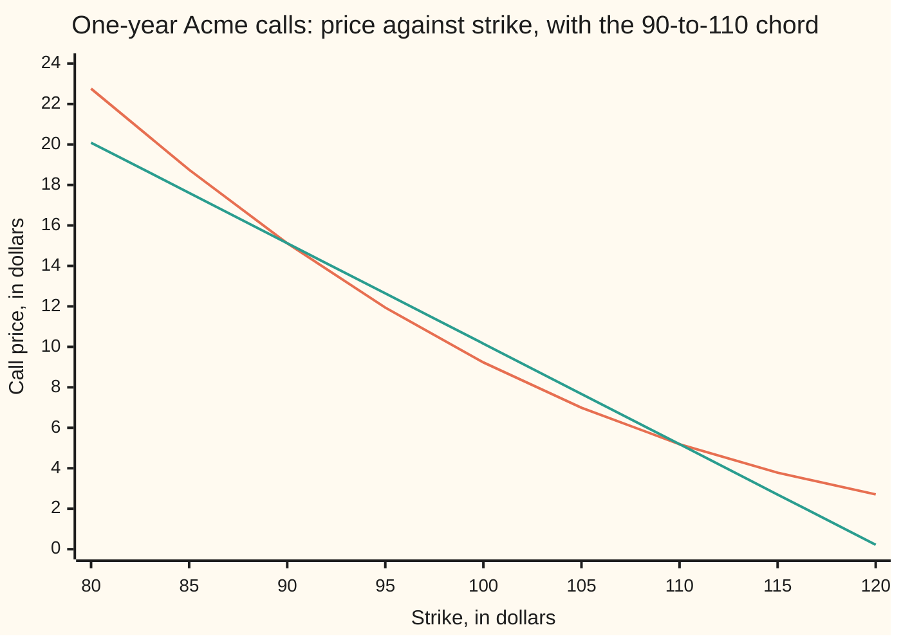
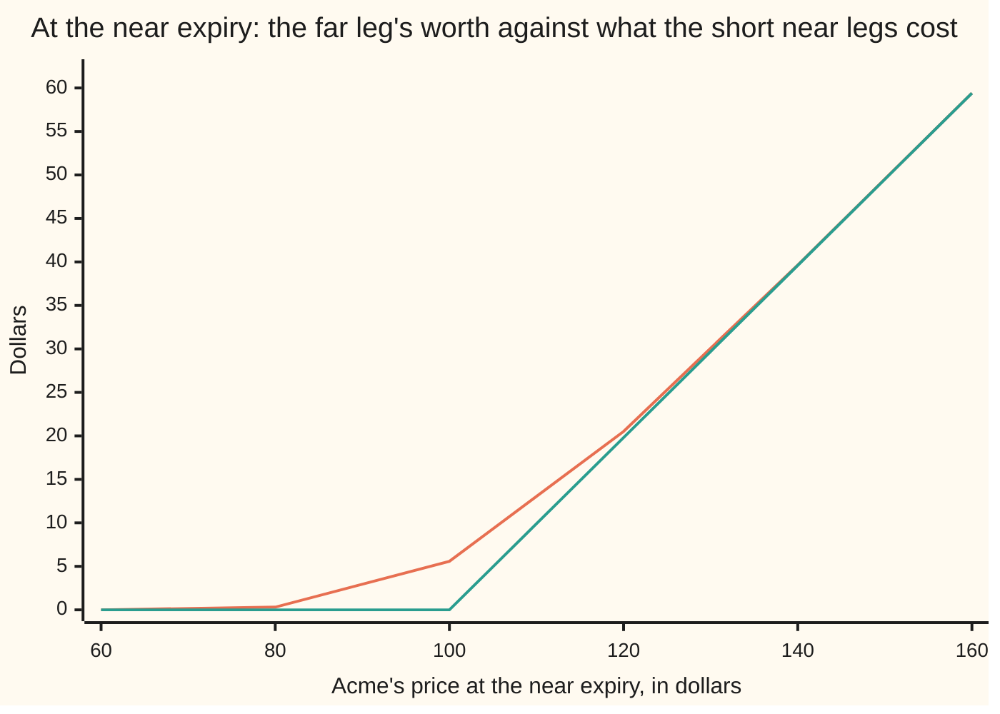

# Shape across strikes and expiries: calls fall and curve the right way in strike, and total variance never falls in time

[Syllabus](../../../SYLLABUS.md) → [Financial mathematics](../../../SYLLABUS.md#w12) → [The Black-Scholes call and put](../../../SYLLABUS.md#w12-s08) → Shape across strikes and expiries

---

## General Overview

A screen of Acme option quotes, Friday morning. Acme trades at 100, and every price on this card is in dollars. Down the page run the strikes, the prices at which a call lets its owner buy a share; across the page run the expiry dates. Every cell is a price somebody will trade at right now.

Most of that screen is opinion. Whether the one-year 100-strike call belongs at 9.23 or at 9.60 turns on how jumpy the market thinks Acme will be, and people disagree about that for a living.

Three features of the screen are not opinion.

Read down one expiry's column: prices must fall as the strike rises, and each fall must be smaller than the discounted gap between the strikes. From the 80-strike to the 90-strike the one-year call may shed at most 9.51, never the whole 10.

Read that column again, three evenly spaced strikes at a time — 90, 100, 110. The middle price must sit at or below the average of the outer two, here 10.156145; the 100-call sits under it at 9.227006.

Now read across, from the half-year column to the one-year column, each strike measured against its own expiry's forward price — what a share delivered on that date costs today — rather than against itself. The longer option must not come out cheaper.

Each rule is a portfolio in disguise. Break one and the screen hands over cash on the spot, against a position that can never ask for the cash back: a hand-made sheet further down gives away 0.90 on one set of three strikes and 0.20 on one pair.

**Three particular combinations of quoted prices are the prices of portfolios whose payoff can never be negative, so those combinations cannot be negative either, which fixes the shape of the screen across strikes and across time with no model of Acme in the argument.**

**What kind of fact this is:** three theorems, proved on this card in Why it works. They are model-free, and the checks confirm them on Black-Scholes prices, on a lumpy five-outcome market and on a two-step tree.

### The picture: the middle strike sits under the chord



The first line is the one-year call price at each strike, falling from 22.76 at the 80-strike to 2.71 at the 120-strike. The second is the straight line through the 90-strike and 110-strike prices, continued past both ends. Between those two strikes the curve dips below the line, and the gap at the 100-strike is the three-strike combination 1.858279, halved; outside them the curve climbs above the line, the same bend seen from the other side.

---

## The formula

Notation first, in words. A call's price depends on which strike and which expiry, so it is written $C(K,T)$: the price today of the right to buy one Acme share for $K$ dollars on a date $T$ years away. Strikes are written $K_1 < K_2 < K_3$ and expiries $T_1 < T_2$. Two market prices carry the bookkeeping. The discount factor $D(T)$ is today's price of one dollar delivered at $T$: $e^{-rT}$ at a continuously compounded rate $r$, or 0.951229 for one year at 5 percent. The forward price $F(T)$ is what the market charges today for a share delivered at $T$: $S\,e^{(r-q)T}$ for a share priced $S$ today paying a dividend yield $q$, or 103.045453 for one year here.

Falling, and not too fast:

$$0 \;\le\; C(K_1,T) - C(K_2,T) \;\le\; D(T)\,(K_2 - K_1)$$

Bending upwards, for evenly spaced strikes:

$$C(K_1,T) - 2\,C(K_2,T) + C(K_3,T) \;\ge\; 0$$

Climbing with expiry, at a matched strike:

$$\frac{C(K_1,T_1)}{D(T_1)\,F(T_1)} \;\le\; \frac{C(K_2,T_2)}{D(T_2)\,F(T_2)} \qquad\text{when}\qquad \frac{K_1}{F(T_1)} = \frac{K_2}{F(T_2)}$$

**Read them aloud: a higher strike is never worth more, and never worth less by more than the discounted gap between the strikes. The middle of three evenly spaced strikes is worth no more than the average of its neighbours. And measured against its own expiry's forward, a longer-dated call is never the cheaper one.**

| Symbol | Plain meaning | In our example | Push it up and the answer… |
| --- | --- | --- | --- |
| $C$ | a call's price today, written $C(K,T)$ | $C(100,1)$ is 9.227006 | — |
| $S$, $S_1$ | Acme's price today; and $S_1$, wherever Acme lands at the near expiry | 100; unknown | rises: every call on the screen is worth more |
| $K$, $K_1$, $K_2$, $K_3$ | **strikes**, the prices a call may buy at, low to high | 80, 90, 100, 110, 120 | rises: that call is worth less |
| $T$, $T_1$, $T_2$ | years to expiry; the near one and the far one | 1 year; 0.5 and 1 | rises: more room for Acme to travel |
| $\tau$ | the far leg's life left at the near expiry, $T_2 - T_1$. Say "tau". | 0.5 | rises: the far leg's cushion grows |
| $r$, $q$ | the riskless rate, and the **dividend yield** the shares pay out, both continuously compounded | 5% and 2% | $r$ rises: the cap on a fall loosens. $q$ rises: the matched strike moves down |
| $D$, $F$ | the **discount factor** $D(T) = e^{-rT}$, a dollar due at $T$ priced today; the **forward price** $F(T) = S\,e^{(r-q)T}$, a share delivered at $T$ priced today | 0.951229 and 103.045453 | $D$ rises: the cap tightens toward the raw gap. $F$ rises: the matched far strike follows |
| $k$ | **moneyness**: a strike measured against its own expiry's forward, $K/F(T)$ | 0.985112 | rises: the call is further out of the money |
| $w$ | the **cover weight** $e^{-q\tau}$: how many near calls one far call can cover | 0.990050 | — |
| $c$ | the **normalized call**: $C$ divided by $D(T)F(T)$, which is $S\,e^{-qT}$ | 0.063710, then 0.086728 | — |
| $v$ | **total variance** $v = \sigma^2 T$: volatility squared, times the years | 0.020000, then 0.040000 | rises: the normalized call rises, always |
| $\sigma$, $N$ | volatility, said "sigma"; and $N$, the bell-curve area to the left of a point | 20% | $\sigma$ rises: every call is worth more |

Moneyness $k = K/F(T)$ is how the third rule matches one column to another: the 100-strike is 0.985112 of the half-year forward, and the one-year strike at that same moneyness is 101.511306. Because $D(T)F(T) = S\,e^{-qT}$, the rule in trading form is one far call against $w$ near calls:

$$C(K_2,T_2) \;\ge\; w\;C(K_1,T_1), \qquad w = e^{-q\tau}$$

### When it holds

- **European exercise, held to expiry.** Every proof below sets a position up and never touches it. A short American leg can be exercised early, which knocks the discount out of the cap and leaves only the raw gap $K_2 - K_1$.
- **Both quotes tradeable, both ways, at the same moment.** Each proof sells one option and buys another. A stale mid-quote, a strike nobody will sell, a share nobody will lend: then the screen breaks a rule with no trade behind it, which on an illiquid strike happens daily.
- **The right forward.** $F(T)$ must be that expiry's own forward. Known cash dividends replace $S\,e^{(r-q)T}$ with a lumpier one ([Known cash dividends](08-known-cash-dividends.md)), and a wrong forward moves the matched strike, inventing a violation worth a few cents.
- **A traded discount factor.** $D(T)$ is the price of a dollar at $T$, read off the curve, not a guess. Treating the cap as the undiscounted gap lets 0.487706 per spread through as free money.
- **The strike rules inside one expiry, the calendar rule at one moneyness.** A 90-strike call at one date against a 100-strike call at another says nothing at all.

---

## Why it works

### Step 0: a payoff that is never negative cannot have a negative price

Take a set of trades put on today and never touched, whose total payoff on its settlement date is never negative, whatever Acme does. Suppose it could be entered for a negative price, meaning whoever takes it on is paid to do so. Bank that cash at the riskless rate, hold the position to the end, settle it. The bank balance has grown; the position asked for nothing. That is free money in unlimited size, and it does not survive contact with a market: people take it until the quotes move.

So a never-negative payoff cannot carry a negative price. That one sentence is the whole card. Each rule below is a portfolio whose payoff is never negative, and each rule is what "this portfolio's price is not negative" says about the quotes. No step asks where Acme is heading, how jumpy it is, or what distribution it follows.

### Step 1: the call spread, and why the fall is capped

Buy the 90-strike call and sell the 100-strike call, same expiry. The trade is called a **call spread**.

Walk through Acme's possible finishes. Below 90 neither call pays: nothing. At 95 the long call pays 5 and the short pays nothing: 5. Above 100 the long pays Acme minus 90 and the short costs Acme minus 100, and the difference is 10 whatever Acme does. So the payoff climbs from 0 to 10 and stops.

Never negative, so the price is not negative: $C(90,T) \ge C(100,T)$. A higher strike never costs more — the left half of the first rule.

Never above 10, which gives the right half. Ten dollars delivered at $T$ costs $D(T) \times 10$ today, or 9.512294 for one year, and that cash pays at least as much as the spread in every single outcome. If the spread cost more, buying the cash and selling the spread would be a never-negative payoff for negative cost, which Step 0 forbids. So the spread costs at most 9.512294. On this screen it costs 5.896703, well inside.

### Step 2: the butterfly, and why the curve bends upwards

Buy one 90-call, sell two 100-calls, buy one 110-call, same expiry. The trade is called a **butterfly**, and its payoff is a tent.

Check the tent at four finishes. At 85, nothing pays: 0. At 95 only the 90-call pays: 5. At 105 the long 90-call pays 15 and the two short 100-calls cost 10: 5 again. At 130 the wings pay 40 and 20 while the body costs 60: 0. So the payoff rises from zero at 90 to a peak of 10 at 100, falls back to zero at 110, and stays there.

Never negative, so the price is not negative:

$$C(90,T) - 2\,C(100,T) + C(110,T) \;\ge\; 0,$$

which is exactly the statement that the middle price sits at or below the average of the outer two. On this screen the combination is a positive 1.858279, and the picture at the top of the card is that number drawn.

Unequal spacing changes the weights, not the argument: the two gaps in proportion, $(K_3 - K_2)/(K_3 - K_1)$ on the low call and $(K_2 - K_1)/(K_3 - K_1)$ on the high one. For 90, 100 and 120 that is two parts of the 90-strike to one of the 120-strike, and the bound comes out at 10.986397, comfortably above the real 9.227006. The plain 50-50 average of those two calls, 8.917742, is not the bound and would report a violation that is not there.

<details>
<summary>Detailed proof: both strike rules from one convexity</summary>

Fix Acme's finishing price and look at a call's payoff as a function of its strike: $K \mapsto (\text{finish} - K)^+$, which is the finish minus $K$ while that is positive and zero after. That function falls as $K$ rises, never by more than one dollar per dollar of strike, and it is convex, meaning it lies at or below the straight line joining any two of its points ([Convex functions](../../06-Calculus%20and%20analysis/07-Several%20Variables/09-convex-functions.md)). Both strike rules are those three properties, priced.

Falling by at most a dollar per dollar: at every finish, $0 \le (\text{finish}-K_1)^+ - (\text{finish}-K_2)^+ \le K_2 - K_1$. The middle term is the call spread's payoff, squeezed between nothing at all and a fixed $K_2 - K_1$ due at $T$; pricing all three by Step 0, twice, gives $0 \le C(K_1,T) - C(K_2,T) \le D(T)(K_2-K_1)$.

Convexity: at every finish,
$$(\text{finish} - K_2)^+ \;\le\; \frac{K_3-K_2}{K_3-K_1}\,(\text{finish}-K_1)^+ \;+\; \frac{K_2-K_1}{K_3-K_1}\,(\text{finish}-K_3)^+ .$$
So the portfolio holding those two fractions of the outer calls while short the middle call has a payoff that is never negative, and its price is not negative: the middle call costs at most the same blend of the outer two. Equal spacing makes both weights one half; double that and the 1, −2, 1 butterfly appears.

</details>

### Step 3: the calendar, and why the strike has to move

Two expiries now: the half-year 100-call and a one-year call. Which one-year strike should be set against the half-year 100-strike? Not 100.

Here is why. Write $S_1$ for wherever Acme lands at the near expiry. There the half-year call is finished: it pays $S_1$ minus 100 if that is positive, nothing otherwise. The one-year call is still alive, with half a year to run, and a live call is worth at least zero and at least its forward intrinsic, $S_1\,e^{-q\tau} - K\,e^{-r\tau}$ ([Option price bounds](04-option-price-bounds.md)). Pick the far strike so that this floor is a fixed multiple of what the near call pays, and the far leg covers the near leg in every outcome at once.

That strike is the near strike grown by the ratio of the two forwards:

$$K_2 = K_1\,\frac{F(T_2)}{F(T_1)} = 100 \times \frac{103.045453}{101.511306} = 101.511306.$$

(The answer coincides with the half-year forward only because the near strike happens to equal Acme's spot price.) With that strike, $K_2\,e^{-r\tau}$ and $K_1\,e^{-q\tau}$ are the same number, so the far call's floor — zero below $K_1$, the forward intrinsic above it — is $e^{-q\tau}$ times the near call's payoff at every $S_1$ at once. Write $w = e^{-q\tau} = 0.990050$.

So: buy one far call and sell $w$ near calls. At the near expiry the far leg is worth at least what settling the short near legs costs, so the position's value there is never negative. Step 0 then says its cost today is not negative:

$$C(K_2,T_2) \;\ge\; w\,C(K_1,T_1).$$

On this screen the far call is 8.501093 and $w$ near calls cost 0.990050 times 6.307635, leaving 2.256219 of cushion. Divide both sides by the far leg's $S\,e^{-qT_2}$ and the normalized form at the top of the card appears: on the right, $w$ and $e^{-qT_2}$ combine into the near leg's own $e^{-qT_1}$. So $c$ rises from 0.063710 at the half-year to 0.086728 at the year, at the one shared moneyness 0.985112.



The first line is the far leg's worth at the near expiry, 5.58 with Acme at 100; the second is what settling $w$ short near calls costs there, nothing up to 100 and then 19.80 at 120. The first never dips below the second. The gap between them is the cushion, fattest at the near strike at 5.581107 and thinning to 0.002057 at 160 and 0.000403 at 60 — thin, never negative, and confirmed at 301 prices from 50 to 200.

### The same rule in volatility units

At a fixed moneyness $k$, the normalized Black-Scholes call depends on one number only, the total variance $v = \sigma^2 T$:

$$c(k,v) = N(z) - k\,N\!\left(z - \sqrt{v}\right), \qquad z = \frac{\ln(1/k) + v/2}{\sqrt{v}}.$$

That function starts at $(1-k)^+$ when $v$ is nothing, climbs strictly, and approaches 1 as $v$ grows without bound. Those two ends are the option price bounds in normalized clothing, so a normalized quote strictly between them comes from exactly one total variance: the inverse exists and is unique, while a quote at or outside the bounds has none, which is the thing to check before solving. The checks invert by bisection, written out, and recover 0.020000 for the half-year quote and 0.040000 for the year — which is $\sigma^2 T$ at 20 percent volatility.

Because $c$ climbs strictly with $v$, the calendar rule reads, in these units: **total variance at a fixed moneyness never falls as the expiry lengthens.** Implied volatility itself is free to fall, and often does.

<details>
<summary>The same three facts in the pretend world</summary>

Where risk-neutral pricing is already familiar, all three come out in two lines. There a call's price is the discounted average of its payoff. Rules one and two are then the properties of $K \mapsto (\text{finish}-K)^+$ from the folded proof above, averaged: an average of falling functions falls, and an average of convex functions is convex. For rule three, the ratio of Acme's price at an expiry to that expiry's forward is a martingale — its average at a later date, given what is known at the near date, is its value at the near date — and the payoff is convex in that ratio, so Jensen's inequality gives the normalized call climbing with expiry.

The static portfolios above carry the same content without the machinery, and hold in markets where no such pretend world has been built at all.

</details>

---

## Worked numbers, by hand

The house market: Acme at $S = 100$, riskless rate $r = 5\%$, dividend yield $q = 2\%$, volatility $\sigma = 20\%$.

| Step | Arithmetic | Value |
| --- | --- | --- |
| one-year 90-call | Black-Scholes at 20 percent | 15.123708 |
| one-year 100-call | the shelf's house call | 9.227006 |
| one-year 110-call | | 5.188582 |
| the 90-to-100 fall | 15.123708 − 9.227006 | 5.896703 |
| its cap | $D(1) \times 10 = 0.951229 \times 10$ | 9.512294 |
| the 90/100/110 combination | 15.123708 − 2 × 9.227006 + 5.188582 | **1.858279** |
| the 90/110 average | (15.123708 + 5.188582)/2 | 10.156145 |
| half-year 100-call | | 6.307635 |
| the matched one-year strike | 100 × 103.045453 / 101.511306 | 101.511306 |
| one-year call at that strike | | 8.501093 |
| the cover weight | $e^{-0.02 \times 0.5}$ | 0.990050 |
| the calendar cushion | 8.501093 − 0.990050 × 6.307635 | **2.256219** |

All three rules hold with room to spare. Those cushions are what a market maker eats into before a quote stops being a price and becomes a gift.

### What breaks if you drop a piece

| Mistake | Comes out at | What went wrong |
| --- | --- | --- |
| Test the calendar on raw cash prices at one strike | $C(100,200) - C(100,1) = -7.399266$ | With a 2 percent dividend yield a very long call really is worth less than a one-year call, and nothing is wrong: the strike was never moved to the far forward. |
| Cap the fall at the raw gap of 10 | 0.487706 free per spread | A dollar at expiry is not a dollar today. The cap is 0.951229 × 10, or 9.512294. |
| Average unequal wings 50-50: 90, 100, 120 | bound 8.917742 instead of 10.986397 | The weights are the gap proportions, two to one. The plain average falls below the real 9.227006 and cries arbitrage. |
| Read the volatility term structure instead of the prices | 25 percent then 20 percent looks like a fall | Total variance still climbs, 0.031250 then 0.040000, and so do the normalized calls, 0.077603 then 0.086728. |

Every number in both tables is printed by the checks below.

---

## Code, from first principles, and it actually runs

Each rule is reached by roads that share no arithmetic. Road one subtracts quoted calls. Road two integrates the portfolio's payoff itself against the bell curve by Simpson's rule, never mentioning a strike difference: the tent and the capped ramp go in whole. Road three throws Black-Scholes out — a lumpy five-outcome market whose average is the forward, and a two-step tree holding the forward flat, both priced by plain summation — and both obey all three rules. The calendar cover is computed twice, by subtracting what the short legs cost and as the far put, which agree only if the matched strike is right; total variance is then recovered from each normalized quote by bisection. Finally the hand-made sheet is audited: for each broken rule the script banks the cash and hunts the worst later outcome, over 1,200 finishing prices for the same-expiry trades and 301 near-expiry prices for the calendar.

### Python

```python
# Shape across strikes and expiries -- the check behind the card.  Standard library only, and
# nothing imported that already knows an option price: the bell-curve area comes from math.erf,
# every integral is Simpson's rule written out below, the implied variance a bisection likewise.
from math import log, sqrt, exp, erf, pi
S, R, Q, SIG = 100.0, 0.05, 0.02, 0.20       # Acme spot, rate, dividend yield, volatility
T1, T2 = 0.5, 1.0                            # near and far expiry, in years
STRIKES = [80.0, 90.0, 100.0, 110.0, 120.0]
def N(x):    return 0.5 * (1.0 + erf(x / sqrt(2.0)))      # bell-curve area left of x
def phi(x):  return exp(-0.5 * x * x) / sqrt(2.0 * pi)    # bell-curve height at x
def disc(t): return exp(-R * t)                           # D(t): a dollar at t, valued today
def fwd(t):  return S * exp((R - Q) * t)                  # F(t): the forward price
def simpson(f, a, b, n):                                  # plain Simpson's rule
    h, s = (b - a) / n, f(a) + f(b)
    for i in range(1, n):
        s += (4.0 if i % 2 else 2.0) * f(a + i * h)
    return s * h / 3.0
def call(k, t, s=S, sig=SIG):                             # Black-Scholes call
    d1 = (log(s / k) + (R - Q + 0.5 * sig * sig) * t) / (sig * sqrt(t))
    return s * exp(-Q * t) * N(d1) - k * exp(-R * t) * N(d1 - sig * sqrt(t))
def putp(k, t, s=S, sig=SIG):                             # Black-Scholes put
    d1 = (log(s / k) + (R - Q + 0.5 * sig * sig) * t) / (sig * sqrt(t))
    return k * exp(-R * t) * N(sig * sqrt(t) - d1) - s * exp(-Q * t) * N(-d1)
def by_payoff(payoff, t):                                 # road 2: average the payoff itself
    def f(z): return payoff(S * exp((R - Q - 0.5 * SIG * SIG) * t + SIG * sqrt(t) * z)) * phi(z)
    return disc(t) * simpson(f, -10.0, 10.0, 40000)
def cnorm(k, w):                  # normalized call: moneyness and total variance, nothing else
    d1 = (-log(k) + 0.5 * w) / sqrt(w)
    return N(d1) - k * N(d1 - sqrt(w))
def implied_w(k, c):              # bisection; cnorm climbs strictly in w, so there is one root
    assert max(1.0 - k, 0.0) < c < 1.0, "at or outside the bounds no total variance exists"
    lo, hi = 1e-12, 100.0
    for _ in range(200):
        mid = 0.5 * (lo + hi)
        lo, hi = (mid, hi) if cnorm(k, mid) < c else (lo, mid)
    return 0.5 * (lo + hi)
# ---- the house market, and the one-year strip -------------------------------------------
cash = {k: call(k, T2) for k in STRIKES}
integ = {k: by_payoff(lambda st, k=k: max(st - k, 0.0), T2) for k in STRIKES}
cap = disc(T2) * 10.0
spread = {k: cash[k] - cash[k + 10.0] for k in STRIKES[:-1]}
fly = {k: cash[k - 10.0] - 2.0 * cash[k] + cash[k + 10.0] for k in STRIKES[1:-1]}
tent = by_payoff(lambda st: max(st - 90.0, 0.0) - 2.0 * max(st - 100.0, 0.0) + max(st - 110.0, 0.0), T2)
ramp = by_payoff(lambda st: min(max(st - 90.0, 0.0), 10.0), T2)
ok_k = min(spread.values()) > 0 and max(spread.values()) < cap and min(fly.values()) > 0
print("Acme: S = 100, r = 5%, q = 2%, sigma = 20%; expiries 0.5 and 1 year")
print(f"forward F(1) = S e^((r-q)T) {fwd(T2):12.6f}   F(0.5) {fwd(T1):12.6f}")
print(f"discount D(1) = e^(-rT)     {disc(T2):12.6f}   D(0.5) {disc(T1):12.6f}\n")
print(f"{'K':>5} {'C(K,1) formula':>15} {'by integral':>12} {'C(K)-C(K+10)':>13} {'cap D(1)*10':>12} {'butterfly':>10}")
for k in STRIKES:
    sp = f"{spread[k]:13.6f}" if k in spread else f"{'--':>13}"
    bf = f"{fly[k]:10.6f}" if k in fly else f"{'--':>10}"
    print(f"{k:5.0f} {cash[k]:15.6f} {integ[k]:12.6f} {sp} {cap:12.6f} {bf}")
print(f"every spread inside 0 and the cap, every butterfly above zero: {'yes' if ok_k else 'no'}")
print(f"butterfly 90/100/110 from three prices {fly[100.0]:11.6f};  90/110 average {0.5 * (cash[90.0] + cash[110.0]):11.6f}")
print(f"the same tent payoff, integrated       {tent:11.6f};  call spread 90/100 {spread[90.0]:11.6f}")
print(f"its capped ramp payoff, integrated     {ramp:11.6f};  C(100,1)           {cash[100.0]:11.6f}")
# ---- the calendar pair, in forward-adjusted strike --------------------------------------
kfar = 100.0 * fwd(T2) / fwd(T1)              # the forward-adjusted strike
wgt = exp(-Q * (T2 - T1))                     # near legs that one far leg can cover
near, far = call(100.0, T1), call(kfar, T2)
money = 100.0 / fwd(T1)                       # forward moneyness, shared by the pair
nrm_n, nrm_f = near / (S * exp(-Q * T1)), far / (S * exp(-Q * T2))
wn, wf = implied_w(money, nrm_n), implied_w(money, nrm_f)
spots = [60.0, 80.0, 100.0, 120.0, 140.0, 160.0]
legf, short = [call(kfar, T2 - T1, s=x) for x in spots], [wgt * max(x - 100.0, 0.0) for x in spots]
cover = [a - b for a, b in zip(legf, short)]
byput = [call(kfar, T2 - T1, s=x) if x <= 100.0 else putp(kfar, T2 - T1, s=x) for x in spots]
dense = [call(kfar, T2 - T1, s=x) if x <= 100.0 else putp(kfar, T2 - T1, s=x) for x in (50.0 + 0.5 * i for i in range(301))]
print(f"\nforward-adjusted strike K2 = 100 F(1)/F(0.5) {kfar:12.6f};  weight w = e^(-q(T2-T1)) {wgt:10.6f}")
print(f"near call C(100, 0.5) {near:11.6f};  far call C(101.511306, 1) {far:11.6f};  far - w x near {far - wgt * near:10.6f}")
print(f"shared moneyness k {money:8.6f};  normalized c = C/(S e^(-qT)): near {nrm_n:10.6f}, far {nrm_f:10.6f}")
print(f"total implied variance by bisection: near {wn:8.6f}, far {wf:8.6f};  sigma^2 T {SIG * SIG * T1:8.6f} {SIG * SIG * T2:8.6f}")
print("at the near expiry the far leg covers w near legs, whatever Acme does\nAcme at T1  "
      + "".join(f"{x:10.0f}" for x in spots))
print("far leg     " + "".join(f"{v:10.6f}" for v in legf))
print("w x payoff  " + "".join(f"{v:10.6f}" for v in short))
print("cover       " + "".join(f"{v:10.6f}" for v in cover))
print("as far put  " + "".join(f"{v:10.6f}" for v in byput))
print(f"cover positive at 301 spots from 50 to 200: {'yes' if min(dense) > 0 else 'no'};  peak {max(dense):10.6f}")
# ---- road 3: no model at all.  A lumpy law with the right forward, and a tree -----------
nodes, prob = [60.0, 85.0, 100.0, 125.0, 170.0], [0.10, 0.20, 0.40, 0.0, 0.0]
prob[3] = (fwd(T2) - sum(n * p for n, p in zip(nodes, prob)) - 170.0 * 0.30) / (125.0 - 170.0)
prob[4] = 0.30 - prob[3]           # the last two weights are what makes the mean equal F(1)
lump = lambda k: disc(T2) * sum(p * max(n - k, 0.0) for n, p in zip(nodes, prob))
lsp = [lump(k) - lump(k + 10.0) for k in STRIKES[:-1]]
lfly = [lump(k - 10.0) - 2.0 * lump(k) + lump(k + 10.0) for k in STRIKES[1:-1]]
up, dn = 1.25, 0.80
pu = (1.0 - dn) / (up - dn)         # the weights hold the forward flat: pu*up + (1-pu)*dn = 1
law1, law2 = [(up, pu), (dn, 1.0 - pu)], [(up * up, pu * pu), (up * dn, 2.0 * pu * (1.0 - pu)),
                                           (dn * dn, (1.0 - pu) ** 2)]
cl = lambda law, k: sum(p * max(x - k, 0.0) for x, p in law)
gaps = [cl(law2, 0.60 + 0.025 * i) - cl(law1, 0.60 + 0.025 * i) for i in range(33)]
ok_lump = min(lsp) > 0 and max(lsp) < cap and min(lfly) > 0
print("\nlumpy law, no Black-Scholes: nodes " + ", ".join(f"{n:.0f}" for n in nodes)
      + ", weights " + ", ".join(f"{p:.6f}" for p in prob))
print(f"its mean {sum(n * p for n, p in zip(nodes, prob)):11.6f} is F(1);  both strike rules hold:"
      f" {'yes' if ok_lump else 'no'};  its 90/100/110 butterfly {lfly[1]:10.6f}")
print(f"two-step flat-forward tree at moneyness 0.90: near {cl(law1, 0.90):10.6f}, far {cl(law2, 0.90):10.6f}")
print(f"none of 33 moneynesses from 0.60 to 1.40 falls with expiry: {'yes' if min(gaps) > -1e-15 else 'no'}")
# ---- a hand-made sheet that breaks all three, and the free trade ------------------------
quote = {80.0: 24.80, 90.0: 15.10, 100.0: 10.60, 110.0: 5.20, 120.0: 5.40}   # one-year quotes
qnear, qfar = 8.60, 8.40                    # half-year 100-call, one-year 101.511306-call
def worst(legs, csh, t):            # least wealth at t: banked cash plus the worst payoff
    return csh / disc(t) + min(sum(n * max(1.0 + 0.25 * i - k, 0.0) for k, n in legs) for i in range(1200))
bad_cap, bad_cal = quote[80.0] - quote[90.0], wgt * qnear - qfar
bad_fly, bad_mon = 2.0 * quote[100.0] - quote[90.0] - quote[110.0], quote[120.0] - quote[110.0]
broken = [("cap on the 80/90 spread", bad_cap, bad_cap - cap, [(80.0, -1.0), (90.0, 1.0)]),
          ("butterfly 90/100/110", bad_fly, bad_fly, [(90.0, 1.0), (100.0, -2.0), (110.0, 1.0)]),
          ("the 120 quoted above the 110", bad_mon, bad_mon, [(110.0, 1.0), (120.0, -1.0)]),
          ("calendar, near against far", bad_cal, bad_cal, None)]
print("\nhand-made one-year quotes: " + ", ".join(f"{k:.0f} at {v:.2f}" for k, v in quote.items())
      + f";  half-year 100-call {qnear:.2f}, one-year 101.511306-call {qfar:.2f}")
print(f"{'rule broken':<30}{'cash in today':>14}{'least wealth later':>20}{'free money today':>18}")
leasts = [worst(lg, ch, T2) if lg else ch / disc(T1) + min(dense) for _, ch, _, lg in broken]
for (name, csh, free, _), least in zip(broken, leasts):
    print(f"{name:<30}{csh:14.6f}{least:20.6f}{free:18.6f}")
# ---- what breaks if a piece is dropped --------------------------------------------------
print(f"\nno forward adjustment: cash C(100,200) - C(100,1) {call(100.0, 200.0) - cash[100.0]:10.6f}")
print(f"cap read as 10.00 not {cap:.6f}: free money per spread {10.0 - cap:10.6f}")
print(f"unequal wings 90/100/120, weights 2 to 1: bound {(2.0 * cash[90.0] + cash[120.0]) / 3.0:10.6f},"
      f" plain average {0.5 * (cash[90.0] + cash[120.0]):10.6f}")
print(f"implied vol 25% then 20% is no violation: total variance {0.25*0.25*T1:8.6f} then {SIG*SIG*T2:8.6f},"
      f" normalized call {call(100.0, T1, sig=0.25)/(S*exp(-Q*T1)):8.6f} then {nrm_f:8.6f}")
print("\nchart, strike K     " + "".join(f"{80.0 + 5.0 * i:8.0f}" for i in range(9)))
print("chart, call C(K,1)  " + "".join(f"{call(80.0 + 5.0 * i, T2):8.2f}" for i in range(9)))
print("chart, chord 90-110 " + "".join(f"{cash[90.0] + (i - 2.0) * (cash[110.0] - cash[90.0]) / 4.0:8.2f}" for i in range(9)))
print("chart, Acme at T1   " + "".join(f"{x:8.0f}" for x in spots))
print("chart, far leg      " + "".join(f"{v:8.2f}" for v in legf))
print("chart, w x payoff   " + "".join(f"{v:8.2f}" for v in short))
assert abs(cash[100.0] - 9.227005508154) < 1e-9, "the shelf's house call"
assert max(abs(cash[k] - integ[k]) for k in STRIKES) < 1e-6 and abs(fly[100.0] - tent) < 1e-6 \
    and abs(spread[90.0] - ramp) < 1e-6, "the formula, and both combinations, against the payoffs"
assert ok_k and min(dense) > 0, "the house strip obeys both strike rules, and the far leg covers"
assert max(abs(cover[i] - byput[i]) for i in range(len(spots))) < 1e-12, "cover equals the far put"
assert abs(wn - SIG * SIG * T1) < 1e-9 and abs(wf - SIG * SIG * T2) < 1e-9, "bisection recovers sigma^2 T"
assert ok_lump and min(gaps) > -1e-15 and abs(lump(0.0) - disc(T2) * fwd(T2)) < 1e-9 \
    and abs(cl(law1, 0.0) - 1.0) + abs(cl(law2, 0.0) - 1.0) < 1e-15, \
    "a lumpy law and a tree, each carrying the right forward, obey all three rules"
assert min([r[1] for r in broken] + [r[2] for r in broken] + leasts) > 0, "each broken rule pays cash that outlasts its worst outcome"
print("ALL CHECKS PASS")
```

**Ran 2026-09-19 on macOS, Python 3.14.6, standard library only. All checks passed. Output, pasted from the run:**

```
Acme: S = 100, r = 5%, q = 2%, sigma = 20%; expiries 0.5 and 1 year
forward F(1) = S e^((r-q)T)   103.045453   F(0.5)   101.511306
discount D(1) = e^(-rT)         0.951229   D(0.5)     0.975310

    K  C(K,1) formula  by integral  C(K)-C(K+10)  cap D(1)*10  butterfly
   80       22.764125    22.764125      7.640417     9.512294         --
   90       15.123708    15.123708      5.896703     9.512294   1.743715
  100        9.227006     9.227006      4.038424     9.512294   1.858279
  110        5.188582     5.188582      2.476806     9.512294   1.561618
  120        2.711776     2.711776            --     9.512294         --
every spread inside 0 and the cap, every butterfly above zero: yes
butterfly 90/100/110 from three prices    1.858279;  90/110 average   10.156145
the same tent payoff, integrated          1.858279;  call spread 90/100    5.896703
its capped ramp payoff, integrated        5.896703;  C(100,1)              9.227006

forward-adjusted strike K2 = 100 F(1)/F(0.5)   101.511306;  weight w = e^(-q(T2-T1))   0.990050
near call C(100, 0.5)    6.307635;  far call C(101.511306, 1)    8.501093;  far - w x near   2.256219
shared moneyness k 0.985112;  normalized c = C/(S e^(-qT)): near   0.063710, far   0.086728
total implied variance by bisection: near 0.020000, far 0.040000;  sigma^2 T 0.020000 0.040000
at the near expiry the far leg covers w near legs, whatever Acme does
Acme at T1          60        80       100       120       140       160
far leg       0.000403  0.306039  5.581107 20.514241 39.649867 59.405047
w x payoff    0.000000  0.000000  0.000000 19.800997 39.601993 59.402990
cover         0.000403  0.306039  5.581107  0.713244  0.047874  0.002057
as far put    0.000403  0.306039  5.581107  0.713244  0.047874  0.002057
cover positive at 301 spots from 50 to 200: yes;  peak   5.581107

lumpy law, no Black-Scholes: nodes 60, 85, 100, 125, 170, weights 0.100000, 0.200000, 0.400000, 0.243434, 0.056566
its mean  103.045453 is F(1);  both strike rules hold: yes;  its 90/100/110 butterfly   3.804918
two-step flat-forward tree at moneyness 0.90: near   0.155556, far   0.180247
none of 33 moneynesses from 0.60 to 1.40 falls with expiry: yes

hand-made one-year quotes: 80 at 24.80, 90 at 15.10, 100 at 10.60, 110 at 5.20, 120 at 5.40;  half-year 100-call 8.60, one-year 101.511306-call 8.40
rule broken                    cash in today  least wealth later  free money today
cap on the 80/90 spread             9.700000            0.197330          0.187706
butterfly 90/100/110                0.900000            0.946144          0.900000
the 120 quoted above the 110        0.200000            0.210254          0.200000
calendar, near against far          0.114429            0.117326          0.114429

no forward adjustment: cash C(100,200) - C(100,1)  -7.399266
cap read as 10.00 not 9.512294: free money per spread   0.487706
unequal wings 90/100/120, weights 2 to 1: bound  10.986397, plain average   8.917742
implied vol 25% then 20% is no violation: total variance 0.031250 then 0.040000, normalized call 0.077603 then 0.086728

chart, strike K           80      85      90      95     100     105     110     115     120
chart, call C(K,1)     22.76   18.75   15.12   11.94    9.23    6.99    5.19    3.78    2.71
chart, chord 90-110    20.09   17.61   15.12   12.64   10.16    7.67    5.19    2.70    0.22
chart, Acme at T1         60      80     100     120     140     160
chart, far leg          0.00    0.31    5.58   20.51   39.65   59.41
chart, w x payoff       0.00    0.00    0.00   19.80   39.60   59.40
ALL CHECKS PASS
```

The three cushions come out identical on both roads to six decimals, the lumpy market and the tree pass rules they were never built to satisfy, and every one of the four broken quotes on the hand-made sheet hands out cash whose worst later outcome is still positive.

### Rust

Same numbers, same labels. Rust has no `erf`, so the bell-curve area is built by adding up thin slices under the curve instead.

```rust
// Shape across strikes and expiries -- the same check as the Python, in Rust.  No crates.
// Rust has no erf, so the bell-curve area N is built the honest way: add up thin slices
// under the curve (Simpson).  The integrals and the bisection are written out here too.
use std::f64::consts::PI;
const S: f64 = 100.0; const R: f64 = 0.05; const Q: f64 = 0.02; const SIG: f64 = 0.20;
const T1: f64 = 0.5; const T2: f64 = 1.0;          // near and far expiry, in years
const STRIKES: [f64; 5] = [80.0, 90.0, 100.0, 110.0, 120.0];
fn phi(x: f64) -> f64 { (-0.5 * x * x).exp() / (2.0 * PI).sqrt() }   // bell-curve height at x
fn simpson<F: Fn(f64) -> f64>(f: F, a: f64, b: f64, n: usize) -> f64 {
    let h = (b - a) / n as f64;
    let mut s = f(a) + f(b);
    for i in 1..n { s += if i % 2 == 1 { 4.0 } else { 2.0 } * f(a + i as f64 * h); }
    s * h / 3.0
}
fn n_cdf(x: f64) -> f64 {                                 // bell-curve area left of x
    if x < -12.0 { return 0.0; }
    if x > 12.0 { return 1.0; }
    0.5 + simpson(phi, 0.0, x, 4000)                      // half, plus the slice from 0 to x
}
fn disc(t: f64) -> f64 { (-R * t).exp() }                 // D(t): a dollar at t, valued today
fn fwd(t: f64) -> f64 { S * ((R - Q) * t).exp() }         // F(t): the forward price
fn call(k: f64, t: f64, s: f64, sig: f64) -> f64 {        // Black-Scholes call
    let d1 = ((s / k).ln() + (R - Q + 0.5 * sig * sig) * t) / (sig * t.sqrt());
    s * (-Q * t).exp() * n_cdf(d1) - k * (-R * t).exp() * n_cdf(d1 - sig * t.sqrt())
}
fn putp(k: f64, t: f64, s: f64, sig: f64) -> f64 {        // Black-Scholes put
    let d1 = ((s / k).ln() + (R - Q + 0.5 * sig * sig) * t) / (sig * t.sqrt());
    k * (-R * t).exp() * n_cdf(sig * t.sqrt() - d1) - s * (-Q * t).exp() * n_cdf(-d1)
}
fn by_payoff<F: Fn(f64) -> f64>(payoff: F, t: f64) -> f64 {   // road 2: average the payoff
    let f = |z: f64| {
        let st = S * ((R - Q - 0.5 * SIG * SIG) * t + SIG * t.sqrt() * z).exp();
        payoff(st) * phi(z)
    };
    disc(t) * simpson(f, -10.0, 10.0, 40000)
}
fn cnorm(k: f64, w: f64) -> f64 {   // normalized call: moneyness and total variance, nothing else
    let d1 = (-k.ln() + 0.5 * w) / w.sqrt();
    n_cdf(d1) - k * n_cdf(d1 - w.sqrt())
}
fn implied_w(k: f64, c: f64) -> f64 {   // bisection; cnorm climbs strictly in w, so one root
    assert!((1.0 - k).max(0.0) < c && c < 1.0, "at or outside the bounds no total variance exists");
    let (mut lo, mut hi) = (1e-12, 100.0);
    for _ in 0..200 {
        let mid = 0.5 * (lo + hi);
        if cnorm(k, mid) < c { lo = mid } else { hi = mid }
    }
    0.5 * (lo + hi)
}
fn yn(claim: bool) -> &'static str { if claim { "yes" } else { "no" } }
fn least_of(v: &[f64]) -> f64 { v.iter().fold(f64::INFINITY, |a, &b| a.min(b)) }
fn most_of(v: &[f64]) -> f64 { v.iter().fold(f64::NEG_INFINITY, |a, &b| a.max(b)) }
fn main() {
    let chart = |label: &str, vals: Vec<String>| println!("{}{}", label, vals.join(""));
    // ---- the house market, and the one-year strip ---------------------------------------
    let cash: Vec<f64> = STRIKES.iter().map(|&k| call(k, T2, S, SIG)).collect();
    let integ: Vec<f64> = STRIKES.iter().map(|&k| by_payoff(move |st| (st - k).max(0.0), T2)).collect();
    let cap = disc(T2) * 10.0;
    let spread: Vec<f64> = (0..4).map(|i| cash[i] - cash[i + 1]).collect();
    let fly: Vec<f64> = (1..4).map(|i| cash[i - 1] - 2.0 * cash[i] + cash[i + 1]).collect();
    let tent = by_payoff(|st| (st - 90.0).max(0.0) - 2.0 * (st - 100.0).max(0.0) + (st - 110.0).max(0.0), T2);
    let ramp = by_payoff(|st| (st - 90.0).max(0.0).min(10.0), T2);
    let ok_k = least_of(&spread) > 0.0 && most_of(&spread) < cap && least_of(&fly) > 0.0;
    println!("Acme: S = 100, r = 5%, q = 2%, sigma = 20%; expiries 0.5 and 1 year");
    println!("forward F(1) = S e^((r-q)T) {:12.6}   F(0.5) {:12.6}", fwd(T2), fwd(T1));
    println!("discount D(1) = e^(-rT)     {:12.6}   D(0.5) {:12.6}\n", disc(T2), disc(T1));
    println!("{:>5} {:>15} {:>12} {:>13} {:>12} {:>10}", "K", "C(K,1) formula", "by integral", "C(K)-C(K+10)", "cap D(1)*10", "butterfly");
    for i in 0..5 {
        let sp = if i < 4 { format!("{:13.6}", spread[i]) } else { format!("{:>13}", "--") };
        let bf = if i >= 1 && i <= 3 { format!("{:10.6}", fly[i - 1]) } else { format!("{:>10}", "--") };
        println!("{:5.0} {:15.6} {:12.6} {} {:12.6} {}", STRIKES[i], cash[i], integ[i], sp, cap, bf);
    }
    println!("every spread inside 0 and the cap, every butterfly above zero: {}", yn(ok_k));
    println!("butterfly 90/100/110 from three prices {:11.6};  90/110 average {:11.6}", fly[1], 0.5 * (cash[1] + cash[3]));
    println!("the same tent payoff, integrated       {:11.6};  call spread 90/100 {:11.6}", tent, spread[1]);
    println!("its capped ramp payoff, integrated     {:11.6};  C(100,1)           {:11.6}", ramp, cash[2]);
    // ---- the calendar pair, in forward-adjusted strike ----------------------------------
    let kfar = 100.0 * fwd(T2) / fwd(T1);           // the forward-adjusted strike
    let wgt = (-Q * (T2 - T1)).exp();               // near legs that one far leg can cover
    let (near, far) = (call(100.0, T1, S, SIG), call(kfar, T2, S, SIG));
    let money = 100.0 / fwd(T1);                    // forward moneyness, shared by the pair
    let (nrm_n, nrm_f) = (near / (S * (-Q * T1).exp()), far / (S * (-Q * T2).exp()));
    let (wn, wf) = (implied_w(money, nrm_n), implied_w(money, nrm_f));
    let spots = [60.0_f64, 80.0, 100.0, 120.0, 140.0, 160.0];
    let legf: Vec<f64> = spots.iter().map(|&x| call(kfar, T2 - T1, x, SIG)).collect();
    let short: Vec<f64> = spots.iter().map(|&x| wgt * (x - 100.0).max(0.0)).collect();
    let cover: Vec<f64> = (0..6).map(|i| legf[i] - short[i]).collect();
    let stable = |x: f64| if x <= 100.0 { call(kfar, T2 - T1, x, SIG) } else { putp(kfar, T2 - T1, x, SIG) };
    let byput: Vec<f64> = spots.iter().map(|&x| stable(x)).collect();
    let dense: Vec<f64> = (0..301).map(|i| stable(50.0 + 0.5 * i as f64)).collect();
    println!("\nforward-adjusted strike K2 = 100 F(1)/F(0.5) {:12.6};  weight w = e^(-q(T2-T1)) {:10.6}", kfar, wgt);
    println!("near call C(100, 0.5) {:11.6};  far call C(101.511306, 1) {:11.6};  far - w x near {:10.6}", near, far, far - wgt * near);
    println!("shared moneyness k {:8.6};  normalized c = C/(S e^(-qT)): near {:10.6}, far {:10.6}", money, nrm_n, nrm_f);
    println!("total implied variance by bisection: near {:8.6}, far {:8.6};  sigma^2 T {:8.6} {:8.6}", wn, wf, SIG * SIG * T1, SIG * SIG * T2);
    println!("at the near expiry the far leg covers w near legs, whatever Acme does");
    chart("Acme at T1  ", spots.iter().map(|x| format!("{:10.0}", x)).collect());
    chart("far leg     ", legf.iter().map(|v| format!("{:10.6}", v)).collect());
    chart("w x payoff  ", short.iter().map(|v| format!("{:10.6}", v)).collect());
    chart("cover       ", cover.iter().map(|v| format!("{:10.6}", v)).collect());
    chart("as far put  ", byput.iter().map(|v| format!("{:10.6}", v)).collect());
    println!("cover positive at 301 spots from 50 to 200: {};  peak {:10.6}", yn(least_of(&dense) > 0.0), most_of(&dense));
    // ---- road 3: no model at all.  A lumpy law with the right forward, and a tree -------
    let nodes = [60.0_f64, 85.0, 100.0, 125.0, 170.0];
    let mut prob = [0.10_f64, 0.20, 0.40, 0.0, 0.0];
    let part: f64 = nodes.iter().zip(prob.iter()).map(|(n, p)| n * p).sum();
    prob[3] = (fwd(T2) - part - 170.0 * 0.30) / (125.0 - 170.0);
    prob[4] = 0.30 - prob[3];        // the last two weights are what makes the mean equal F(1)
    let lump = |k: f64| disc(T2) * nodes.iter().zip(prob.iter()).map(|(n, p)| p * (n - k).max(0.0)).sum::<f64>();
    let lsp: Vec<f64> = STRIKES[..4].iter().map(|&k| lump(k) - lump(k + 10.0)).collect();
    let lfly: Vec<f64> = STRIKES[1..4].iter().map(|&k| lump(k - 10.0) - 2.0 * lump(k) + lump(k + 10.0)).collect();
    let (up, dn) = (1.25_f64, 0.80_f64);
    let pu = (1.0 - dn) / (up - dn);  // the weights hold the forward flat: pu*up + (1-pu)*dn = 1
    let law1 = [(up, pu), (dn, 1.0 - pu)];
    let law2 = [(up * up, pu * pu), (up * dn, 2.0 * pu * (1.0 - pu)), (dn * dn, (1.0 - pu) * (1.0 - pu))];
    let cl = |law: &[(f64, f64)], k: f64| law.iter().map(|(x, p)| p * (x - k).max(0.0)).sum::<f64>();
    let gaps: Vec<f64> = (0..33).map(|i| cl(&law2, 0.60 + 0.025 * i as f64) - cl(&law1, 0.60 + 0.025 * i as f64)).collect();
    let ok_lump = least_of(&lsp) > 0.0 && most_of(&lsp) < cap && least_of(&lfly) > 0.0;
    let ns = nodes.iter().map(|n| format!("{:.0}", n)).collect::<Vec<_>>().join(", ");
    let ws = prob.iter().map(|p| format!("{:.6}", p)).collect::<Vec<_>>().join(", ");
    println!("\nlumpy law, no Black-Scholes: nodes {}, weights {}", ns, ws);
    println!("its mean {:11.6} is F(1);  both strike rules hold: {};  its 90/100/110 butterfly {:10.6}",
             nodes.iter().zip(prob.iter()).map(|(n, p)| n * p).sum::<f64>(), yn(ok_lump), lfly[1]);
    println!("two-step flat-forward tree at moneyness 0.90: near {:10.6}, far {:10.6}", cl(&law1, 0.90), cl(&law2, 0.90));
    println!("none of 33 moneynesses from 0.60 to 1.40 falls with expiry: {}", yn(least_of(&gaps) > -1e-15));
    // ---- a hand-made sheet that breaks all three, and the free trade -------------------
    let quote = [(80.0_f64, 24.80_f64), (90.0, 15.10), (100.0, 10.60), (110.0, 5.20), (120.0, 5.40)];
    let (qnear, qfar) = (8.60_f64, 8.40_f64);       // half-year 100-call, one-year 101.511306-call
    let worst = |legs: &[(f64, f64)], csh: f64, t: f64| csh / disc(t) + least_of(&(0..1200).map(|i|
        legs.iter().map(|(k, n)| n * (1.0 + 0.25 * i as f64 - k).max(0.0)).sum()).collect::<Vec<f64>>());
    let (bad_cap, bad_cal) = (quote[0].1 - quote[1].1, wgt * qnear - qfar);
    let (bad_fly, bad_mon) = (2.0 * quote[2].1 - quote[1].1 - quote[3].1, quote[4].1 - quote[3].1);
    let qs = quote.iter().map(|(k, v)| format!("{:.0} at {:.2}", k, v)).collect::<Vec<_>>().join(", ");
    println!("\nhand-made one-year quotes: {};  half-year 100-call {:.2}, one-year 101.511306-call {:.2}", qs, qnear, qfar);
    println!("{:<30}{:>14}{:>20}{:>18}", "rule broken", "cash in today", "least wealth later", "free money today");
    let names = ["cap on the 80/90 spread", "butterfly 90/100/110", "the 120 quoted above the 110", "calendar, near against far"];
    let legs: [&[(f64, f64)]; 3] = [&[(80.0, -1.0), (90.0, 1.0)], &[(90.0, 1.0), (100.0, -2.0), (110.0, 1.0)], &[(110.0, 1.0), (120.0, -1.0)]];
    let cshs = [bad_cap, bad_fly, bad_mon, bad_cal];
    let frees = [bad_cap - cap, bad_fly, bad_mon, bad_cal];
    let leasts: Vec<f64> = (0..4).map(|i| if i < 3 { worst(legs[i], cshs[i], T2) }
                                          else { cshs[i] / disc(T1) + least_of(&dense) }).collect();
    for i in 0..4 { println!("{:<30}{:14.6}{:20.6}{:18.6}", names[i], cshs[i], leasts[i], frees[i]); }
    // ---- what breaks if a piece is dropped ---------------------------------------------
    println!("\nno forward adjustment: cash C(100,200) - C(100,1) {:10.6}", call(100.0, 200.0, S, SIG) - cash[2]);
    println!("cap read as 10.00 not {:.6}: free money per spread {:10.6}", cap, 10.0 - cap);
    println!("unequal wings 90/100/120, weights 2 to 1: bound {:10.6}, plain average {:10.6}", (2.0 * cash[1] + cash[4]) / 3.0, 0.5 * (cash[1] + cash[4]));
    println!("implied vol 25% then 20% is no violation: total variance {:8.6} then {:8.6}, normalized call {:8.6} then {:8.6}",
             0.25 * 0.25 * T1, SIG * SIG * T2, call(100.0, T1, S, 0.25) / (S * (-Q * T1).exp()), nrm_f);
    chart("\nchart, strike K     ", (0..9).map(|i| format!("{:8.0}", 80.0 + 5.0 * i as f64)).collect());
    chart("chart, call C(K,1)  ", (0..9).map(|i| format!("{:8.2}", call(80.0 + 5.0 * i as f64, T2, S, SIG))).collect());
    chart("chart, chord 90-110 ", (0..9).map(|i| format!("{:8.2}", cash[1] + (i as f64 - 2.0) * (cash[3] - cash[1]) / 4.0)).collect());
    chart("chart, Acme at T1   ", spots.iter().map(|x| format!("{:8.0}", x)).collect());
    chart("chart, far leg      ", legf.iter().map(|v| format!("{:8.2}", v)).collect());
    chart("chart, w x payoff   ", short.iter().map(|v| format!("{:8.2}", v)).collect());
    assert!((cash[2] - 9.227005508154).abs() < 1e-9, "the shelf's house call");
    assert!((0..5).map(|i| (cash[i] - integ[i]).abs()).fold(0.0, f64::max) < 1e-6
        && (fly[1] - tent).abs() < 1e-6 && (spread[1] - ramp).abs() < 1e-6, "formula and combinations vs payoffs");
    assert!(ok_k && least_of(&dense) > 0.0, "the house strip obeys both strike rules, and the far leg covers");
    assert!((0..6).map(|i| (cover[i] - byput[i]).abs()).fold(0.0, f64::max) < 1e-12, "cover equals the far put");
    assert!((wn - SIG * SIG * T1).abs() < 1e-9 && (wf - SIG * SIG * T2).abs() < 1e-9, "bisection recovers sigma^2 T");
    assert!(ok_lump && least_of(&gaps) > -1e-15 && (lump(0.0) - disc(T2) * fwd(T2)).abs() < 1e-9
        && (cl(&law1, 0.0) - 1.0).abs() + (cl(&law2, 0.0) - 1.0).abs() < 1e-15,
        "a lumpy law and a tree, each carrying the right forward, obey all three rules");
    assert!(least_of(&cshs) > 0.0 && least_of(&frees) > 0.0 && least_of(&leasts) > 0.0,
            "each broken rule pays cash that outlasts its worst outcome");
    println!("ALL CHECKS PASS");
}
```

**Ran 2026-09-19 on macOS, rustc 1.98.1, no crates. All checks passed. Output, pasted from the run:**

```
Acme: S = 100, r = 5%, q = 2%, sigma = 20%; expiries 0.5 and 1 year
forward F(1) = S e^((r-q)T)   103.045453   F(0.5)   101.511306
discount D(1) = e^(-rT)         0.951229   D(0.5)     0.975310

    K  C(K,1) formula  by integral  C(K)-C(K+10)  cap D(1)*10  butterfly
   80       22.764125    22.764125      7.640417     9.512294         --
   90       15.123708    15.123708      5.896703     9.512294   1.743715
  100        9.227006     9.227006      4.038424     9.512294   1.858279
  110        5.188582     5.188582      2.476806     9.512294   1.561618
  120        2.711776     2.711776            --     9.512294         --
every spread inside 0 and the cap, every butterfly above zero: yes
butterfly 90/100/110 from three prices    1.858279;  90/110 average   10.156145
the same tent payoff, integrated          1.858279;  call spread 90/100    5.896703
its capped ramp payoff, integrated        5.896703;  C(100,1)              9.227006

forward-adjusted strike K2 = 100 F(1)/F(0.5)   101.511306;  weight w = e^(-q(T2-T1))   0.990050
near call C(100, 0.5)    6.307635;  far call C(101.511306, 1)    8.501093;  far - w x near   2.256219
shared moneyness k 0.985112;  normalized c = C/(S e^(-qT)): near   0.063710, far   0.086728
total implied variance by bisection: near 0.020000, far 0.040000;  sigma^2 T 0.020000 0.040000
at the near expiry the far leg covers w near legs, whatever Acme does
Acme at T1          60        80       100       120       140       160
far leg       0.000403  0.306039  5.581107 20.514241 39.649867 59.405047
w x payoff    0.000000  0.000000  0.000000 19.800997 39.601993 59.402990
cover         0.000403  0.306039  5.581107  0.713244  0.047874  0.002057
as far put    0.000403  0.306039  5.581107  0.713244  0.047874  0.002057
cover positive at 301 spots from 50 to 200: yes;  peak   5.581107

lumpy law, no Black-Scholes: nodes 60, 85, 100, 125, 170, weights 0.100000, 0.200000, 0.400000, 0.243434, 0.056566
its mean  103.045453 is F(1);  both strike rules hold: yes;  its 90/100/110 butterfly   3.804918
two-step flat-forward tree at moneyness 0.90: near   0.155556, far   0.180247
none of 33 moneynesses from 0.60 to 1.40 falls with expiry: yes

hand-made one-year quotes: 80 at 24.80, 90 at 15.10, 100 at 10.60, 110 at 5.20, 120 at 5.40;  half-year 100-call 8.60, one-year 101.511306-call 8.40
rule broken                    cash in today  least wealth later  free money today
cap on the 80/90 spread             9.700000            0.197330          0.187706
butterfly 90/100/110                0.900000            0.946144          0.900000
the 120 quoted above the 110        0.200000            0.210254          0.200000
calendar, near against far          0.114429            0.117326          0.114429

no forward adjustment: cash C(100,200) - C(100,1)  -7.399266
cap read as 10.00 not 9.512294: free money per spread   0.487706
unequal wings 90/100/120, weights 2 to 1: bound  10.986397, plain average   8.917742
implied vol 25% then 20% is no violation: total variance 0.031250 then 0.040000, normalized call 0.077603 then 0.086728

chart, strike K           80      85      90      95     100     105     110     115     120
chart, call C(K,1)     22.76   18.75   15.12   11.94    9.23    6.99    5.19    3.78    2.71
chart, chord 90-110    20.09   17.61   15.12   12.64   10.16    7.67    5.19    2.70    0.22
chart, Acme at T1         60      80     100     120     140     160
chart, far leg          0.00    0.31    5.58   20.51   39.65   59.41
chart, w x payoff       0.00    0.00    0.00   19.80   39.60   59.40
ALL CHECKS PASS
```

The two outputs match line for line, produced by different code taking different routes to the bell-curve area.

> [!TIP]
> **Try changing**
> Guess first, then run it.
> - **Move one quote back inside the rule.** Set the 110 quote to `5.60`. How many rows of the audit table still describe a broken rule? Three, not four: the 110 and 120 quotes are back in order, and the last assert stops the run.
> - **Close the gap between the expiries.** Set `T1 = 0.9`. Does the cushion grow or shrink? It shrinks to 0.390316, a little over a sixth of the printed 2.256219: the rule bites hardest on neighbouring expiries and barely constrains distant ones. The cover assert then stops the run, because over a tenth of a year the far leg's worth at the far-out prices collapses into rounding noise, and the cheapest of the 301 lands a shade below zero where the assert asks for strictly positive.
> - **Kill the dividend.** Set `Q` to `0.00`. The cover weight becomes exactly one, so one far call covers one near call and the raw cash comparison at a single strike is safe after all — though the matched strike still moves, now by the full riskless growth. The house-call assert stops the run, since the constant 9.227005508154 in it assumes the 2 percent yield.
> - **Starve the integrator.** Change the `40000` in `by_payoff` to `200`. Does the payoff road still land on the formula to six decimals? No, it drifts in the third decimal: Simpson's rule needs its steps where a payoff has a kink, and the payoff-road assert stops the run.

---

## The usual mistake

> [!warning]
> **Testing the calendar rule on raw cash prices at one strike.** With a dividend yield, a longer call can be worth less than a shorter one at the same strike and nothing is wrong: on this screen $C(100,200) - C(100,1) = -7.399266$. The rule compares matched moneyness, not matched strikes, and it compares normalized prices.
>
> Four more traps, each with the wrong number it produces:
> - **Reading these as Black-Scholes facts.** No model appears in any proof. The lumpy five-outcome market in the checks has nothing lognormal about it and still returns a positive 3.804918 for its 90/100/110 combination. Any arbitrage-free screen obeys all three, smile or no smile.
> - **Testing implied volatilities instead of prices.** A term structure falling from 25 percent to 20 percent is not a violation: total variance climbs 0.031250 to 0.040000, and the normalized calls climb 0.077603 to 0.086728. Volatility is a quoting unit; the rules live in prices.
> - **Averaging unequal wings 50-50.** For 90, 100 and 120 the bound is 10.986397, not the plain average 8.917742, so a perfectly good 9.227006 looks like free money.
> - **Forgetting the discount in the cap.** Capping the fall at the raw gap of 10 instead of 9.512294 leaves 0.487706 per spread on the table.

---

## Where you meet it in real life

- **The exchange's own quote checks.** A call cheaper than a higher strike, a negative butterfly: venues screen for these before a price reaches a screen, because the first person to see one takes the money.
- **Fitting a volatility surface.** A fitted surface that breaks any of the three prices an arbitrage into every book that uses it, and hedges chase a payoff that is not there. Keeping total variance rising is the calendar half of that fit: [Term structure and forward volatility](../12-The%20smile%20and%20the%20surface/02-term-structure-and-forward-volatility.md).
- **Reading the market's own probabilities.** Divide the three-strike combination by the square of the strike spacing and the market's own probability density for Acme's finish appears, discounted. It is a density only because the combination cannot go negative: [A digital from a call spread](../10-Digitals%20and%20the%20implied%20density/04-digital-from-a-call-spread-and-the-skew-term.md).
- **Building any payoff out of calls.** A strip of calls replicates almost anything, with these combinations as the weights: [Any payoff from a strip of options](../19-Variance%20swaps%2C%20the%20log%20contract%20and%20VIX/02-carr-madan-spanning-and-the-log-contract.md).
- **Auditing a pricer.** Run the three rules across a new model's output grid before anything else. A model that breaks them is not inaccurate, it is wrong, and it will be traded against.

> **Say it back**
> Three combinations of quoted call prices are portfolios whose payoff can never be negative. A call spread pays between zero and the gap between its strikes, so prices fall with strike but never by more than the discounted gap. A butterfly pays a tent that is never negative, so the middle of three evenly spaced strikes never exceeds the average of its neighbours. A far call, held to the near expiry, is worth at least its forward intrinsic, a fixed fraction of what the near call pays once the far strike is grown by the ratio of the two forwards — so at matched moneyness the longer option is never cheaper, which is total variance never falling with expiry. None of it needs a model: break any one and the screen pays cash for a position that can never ask for it back.

---

## What this builds on

- [Option price bounds](04-option-price-bounds.md): that a live call is worth at least zero and at least its forward intrinsic. Step 3 uses exactly that, one expiry early, and the normalized bounds give the inverse for total variance its existence and uniqueness.
- [Convex functions](../../06-Calculus%20and%20analysis/07-Several%20Variables/09-convex-functions.md): a function lying below the straight line joining any two of its points. A call's payoff, read as a function of its strike, is one — which is both strike rules.

## Where this goes next

- [A digital from a call spread](../10-Digitals%20and%20the%20implied%20density/04-digital-from-a-call-spread-and-the-skew-term.md): the call spread and the butterfly taken to their limits, where they become a probability and a density.
- [Term structure and forward volatility](../12-The%20smile%20and%20the%20surface/02-term-structure-and-forward-volatility.md): the calendar rule as a working constraint on a fitted surface, and what rising total variance leaves for each forward stretch.
- [Any payoff from a strip of options](../19-Variance%20swaps%2C%20the%20log%20contract%20and%20VIX/02-carr-madan-spanning-and-the-log-contract.md): a whole strip of strikes at once, weighted so the calls add up to a contract on the logarithm of Acme's price.

These rules say what a screen may not do, and nothing about which of the many permitted screens the market picked; reading the market's own probabilities off the quotes is how that is answered, on [A digital from a call spread](../10-Digitals%20and%20the%20implied%20density/04-digital-from-a-call-spread-and-the-skew-term.md).

---

## Sources

Verified 19 Sep 2026: every link below resolves to the publisher's page.

- Merton, Robert C. "Theory of Rational Option Pricing." *The Bell Journal of Economics and Management Science* 4, no. 1 (1973): 141–183. [doi:10.2307/3003143](https://doi.org/10.2307/3003143). Proves these shape rules by static portfolios, before any model is assumed.
- Carr, Peter, and Dilip B. Madan. "A note on sufficient conditions for no arbitrage." *Finance Research Letters* 2, no. 3 (2005): 125–130. [doi:10.1016/j.frl.2005.04.005](https://doi.org/10.1016/j.frl.2005.04.005). On a finite grid of strikes and expiries these conditions are not only necessary but enough.
- Davis, Mark H. A., and David G. Hobson. "The Range of Traded Option Prices." *Mathematical Finance* 17, no. 1 (2007): 1–14. [doi:10.1111/j.1467-9965.2007.00291.x](https://doi.org/10.1111/j.1467-9965.2007.00291.x). When a whole sheet of quotes admits a model, and what the arbitrage is when it does not.
- Gatheral, Jim, and Antoine Jacquier. "Arbitrage-free SVI volatility surfaces." *Quantitative Finance* 14, no. 1 (2014): 59–71. [doi:10.1080/14697688.2013.819986](https://doi.org/10.1080/14697688.2013.819986). The calendar rule in volatility units: total variance non-decreasing at fixed moneyness.
- Hull, John C. *Options, Futures, and Other Derivatives*, 11th ed. Pearson. [Publisher page](https://www.pearson.com/en-us/subject-catalog/p/options-futures-and-other-derivatives/P200000005938). The textbook route, with the trades drawn out.
