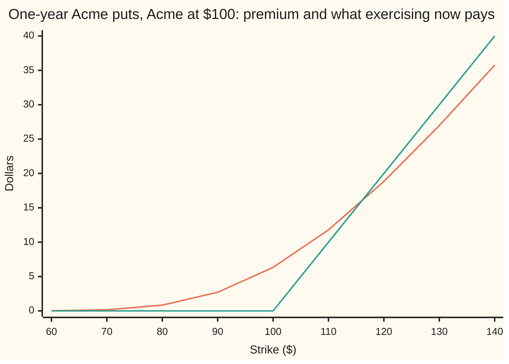
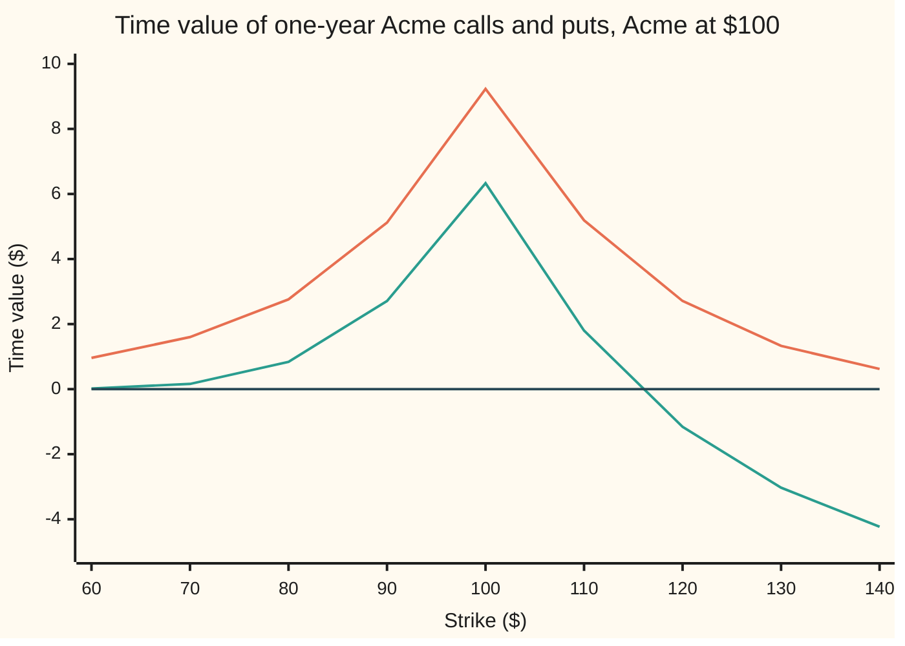

# Intrinsic and time value: what you could cash today, and what you pay for the time left

[Syllabus](../../../SYLLABUS.md) → [Financial mathematics](../../../SYLLABUS.md#w12) → [The Black-Scholes call and put](../../../SYLLABUS.md#w12-s08) → Intrinsic and time value

---

## General Overview

Acme trades at $100 today. A one-year call on it, struck at $100, costs $9.23. A call is the right, not the duty, to buy one share at a fixed price on a fixed date; that price is the **strike**, and the $9.23 is the **premium**. Ask what the contract would pay if it could be cashed in this minute: buy a share for $100 that sells for $100, so nothing. Every cent of the $9.23 is paid for the year of waiting.

Now a second contract on the same share and date: a put struck at $130, the right to *sell* one Acme share for $130. Cashed in this minute that would pay $30. Its premium is $26.97 — less than the $30 it appears to hold.

The two parts have names. **Intrinsic value** is what exercising this minute would pay, floored at zero. **Time value** is the premium minus that. The house call splits into $0 of intrinsic value and $9.23 of time value. The 130-put splits into $30 of intrinsic value and **minus** $3.03 of time value.

The minus sign is neither a mistake nor free money. This put is *European*: usable on the one date only. Its $130 arrives a year from now, and $130 a year from now is worth $123.66 today. The $30 was read off as though the money were on the table this afternoon.

**A premium splits into what exercising now would pay and what the remaining time is worth; the second part is largest at the strike, shrinks to plain interest far from it, and for a European put can fall below zero.**

**What kind of fact this is:** a definition — the split is bookkeeping, not a law — carrying two theorems proved on this card in Why it works: the leftover peaks at the strike, and it has a floor.

### The picture: a put's premium against what exercising it would pay

Acme stays at $100 and the strike moves. Every point is a different one-year put on the same share, priced on the same afternoon: one column of an option chain.



The smooth line is the premium. The bent line is what exercising would pay: flat at zero up to the $100 strike, then climbing a dollar per dollar of strike. Left of $100 the premium rides above the bend; at the 110 strike the gap is down to $1.80; between 110 and 120 the premium slips underneath, and at 130 it sits $3.03 below.

---

## The formula

One piece of notation, in words first: `max` of two things means take whichever is larger, so $\max(S - K, 0)$ is the gain from exercising when there is one and zero when there is not. The floor at zero is there because exercising is a right, and nobody exercises at a loss.

$$\text{intrinsic value} = \max(S - K,\, 0) \text{ for a call}, \qquad \max(K - S,\, 0) \text{ for a put}$$

$$\text{time value} = V - \text{intrinsic value}$$

**Read it aloud:** what exercising this minute would pay, floored at zero, and then whatever the premium is above that.

The second line is a subtraction, so the content of this card is the size and sign of the leftover. The working form comes out of put–call parity in Step 2. For a strike where the contract is in the money:

$$\text{a call's time value} = P + \underbrace{K\left(1 - e^{-rT}\right) - S\left(1 - e^{-qT}\right)}_{\text{the carry}}, \qquad \text{a put's time value} = C - \text{the carry}$$

Out of the money the intrinsic value is zero and the time value is the whole premium.

The premiums come from the cards next door: $C = S e^{-qT} N(d_1) - K e^{-rT} N(d_2)$ ([Black–Scholes call](01-black-scholes-call.md)) and $P = K e^{-rT} N(-d_2) - S e^{-qT} N(-d_1)$ ([Black-Scholes put](02-black-scholes-put.md)). A screen quote does the same job: the split needs a premium from somewhere, not this model in particular.

| Symbol | Plain meaning | In our example | Push it up and the time value… |
| --- | --- | --- | --- |
| $V$, as $C$ for a call and $P$ for a put | the premium the contract costs today | $9.23, and $26.97 for the 130-put | is what gets split |
| $S$ | Acme's price today | $100 | rises for a call up to the strike, then falls |
| $K$ | the strike the contract buys or sells at | $100, and $130 for the put | the same hump, peaking where $K$ meets $S$ |
| $T$ | time to the one usable date, in years | 1 year | pulls both ways: more room to move, more carry |
| $r$ | the riskless rate cash earns, continuously compounded | 5% | rises for a call, which pays the strike later; falls for a put |
| $q$ | the dividend yield paid to shareholders each year | 2% | the reverse of $r$ |
| $\sigma$ | volatility, how jumpy the share is. Say "sigma". | 20% | rises, while intrinsic value never moves: all of it lands here |
| $N(x)$ | the bell-curve area left of $x$, a chance between 0 and 1 | — | — |
| $d_1$, $d_2$ | the Black–Scholes cut-offs, in wiggle units of $\sigma\sqrt{T}$ | both negative at the 130 strike | — |
| $e^{-rT}$, $e^{-qT}$ | the discount on a dollar due at $T$; the fraction of a share to buy now to hold one whole share at $T$ | applied to the strike, $123.66; applied to the share, $98.02 | — |
| $K(1 - e^{-rT}) - S(1 - e^{-qT})$ | the **carry**: interest kept by paying the strike late, less dividends missed | $4.36 at the 130 strike | a call's rises, a put's falls |

### When it holds

- **The split itself always holds.** It subtracts two numbers that exist. Conditions attach to the shape of the leftover.
- **European exercise, one date only.** An American contract can be exercised today, so its premium never sits below its intrinsic value. A negative time value is a European fact, and it is why early exercise is sometimes worth it.
- **A premium from the same moment as $S$.** Split a stale quote against a live share price and the leftover measures the delay, not the time left.
- **The peak at the strike needs no model.** Step 4 proves it from one no-arbitrage inequality about neighbouring strikes. Black–Scholes only adds strictness where that inequality allows a flat step.
- **One axis at a time.** This card walks the strike with Acme fixed at $100. Walking Acme instead peaks at $100 too, as long as the dividend yield is not negative: the premium then moves by $e^{-qT}N(d_1)$ per dollar of Acme, under a dollar, so above the strike the intrinsic value outruns it. At $q = -10\%$, a share that costs money to hold, that fails: the call's time value at a spot of 180 is $23.81 against $18.08 at the money, and the peak leaves the strike.

---

## Why it works

### Step 0: one price, two questions

The premium answers "what would someone pay today for this contract?" The intrinsic value answers "what would exercising it right now pay?" Different questions, different dates: the second is a subtraction, the first needs a model or a market. The difference between them is everything the first question knows and the second does not — the chance the share moves, and the interest and dividends between now and the one usable date.

### Step 1: the floor at zero, and what no-arbitrage forbids

A 130-call on a $100 share would lose $30 if exercised, so nobody does it: its intrinsic value is $0, not minus $30. The floor holds because exercising is a right.

It is tempting to conclude that a premium can never sit below its intrinsic value either. For an American contract that is true: anyone could buy it cheap and exercise on the spot. A European contract cannot be exercised today, so nothing forces it. What no-arbitrage does force is a floor in today's dollars — for a put, the discounted strike less the share needed to deliver, $K e^{-rT} - S e^{-qT}$ ([Option price bounds](04-option-price-bounds.md)). On the 130-put that floor is $123.66 − $98.02 = $25.64, and the premium of $26.97 clears it.

The puzzle is now visible: the real floor is $25.64, the screen's intrinsic value is $30.00, and the $4.36 between them is what the leftover must absorb.

### Step 2: the partner identity

Put–call parity ties a call and a put on the same share, strike and date together:

$$C - P = S e^{-qT} - K e^{-rT}$$

Take a call in the money, so $S > K$, and its time value is $C - (S - K)$. Substitute $C = P + S e^{-qT} - K e^{-rT}$ and gather terms:

$$C - (S - K) = P + K\left(1 - e^{-rT}\right) - S\left(1 - e^{-qT}\right)$$

In words: **an in-the-money call's time value is the price of the out-of-the-money put at the same strike, plus the carry.** Both halves of the carry are plain interest: $K(1 - e^{-rT})$ is what is kept by paying the strike a year late, and $S(1 - e^{-qT})$ is the dividends missed by not holding the share yet. The same rearrangement on an in-the-money put gives the mirror, with the carry subtracted.

The identity splits the work in two. The *partner* — the out-of-the-money contract at the same strike — carries all of the volatility; the carry carries none. Every question about the sign of a time value is a race between those two.

### Step 3: far from the strike, only the carry is left

Push the strike away from the share and the partner becomes hopeless. The partner call at the 130 strike is worth $1.33; at 140, $0.62. It fades to nothing. The carry does not: it depends on the strike, the two rates and the time, and on no opinion about anything. Far from the strike a time value is the carry alone — plain interest, reachable on a pocket calculator.

For the 130-put the race is short. Partner call $1.33, carry $4.36, leftover $1.33 − $4.36 = −$3.03. Interest wins and the sign follows.

Nothing random is needed to see it. Set volatility to zero, so Acme crawls along its forward path and lands on $103.05 with certainty. The 130-put then pays $130 − $103.05 = $26.95 on the day, worth $25.64 today after one discount. Against $30 of intrinsic value that is a time value of −$4.36: exactly minus the carry, with no chance and no bell curve in the arithmetic. Both checks confirm the two agree to nine decimals.

### Step 4: the peak sits at the strike

Waiting is worth most when it might change the outcome. Deep in the money, exercise is all but certain and waiting changes only the interest. Deep out of the money, walking away is all but certain and there is nothing to wait for. At the strike it is a coin flip: any move either way flips which of those happens.

The proof needs one fact about strikes and no model. Buy the call struck at $K$, sell the call struck one dollar higher. On the day that pair pays between $0 and $1, so today it costs between nothing and the present value of a dollar due at $T$:

$$0 \;\le\; C(K) - C(K + 1) \;\le\; e^{-rT}$$

Raising the strike by a dollar therefore cuts a call's premium by *less than a dollar*, and that slack is the whole argument. Below the share, a call's time value is $C(K) - (S - K)$: step the strike up and the subtracted intrinsic value drops a full dollar while the premium drops less, so the leftover rises. Above the share the intrinsic value is already zero, the time value *is* the premium, and the premium falls. Rising, then falling, with the turn where the strike meets the share price; the put runs the same way with put spreads. The bound scales with the gap between the two strikes, so the checks use quarter-dollar gaps: they walk the strike from $50 to $150 in quarter-dollar steps, and both leftovers rise at every step up to $100, fall at every step after, and no spread breaks the bound.

<details>
<summary>Detailed proof: the spread bound, and why the turn is strict</summary>

**The bound.** Hold the call struck at $K$, short the call struck at $K + 1$, same share and date. Below $K$ both expire worthless and the pair pays nothing. Between the strikes it pays Acme's price less $K$, under a dollar. Above the higher strike the two payoffs differ by exactly a dollar. So the pair pays between $0 and $1 whatever happens, and a thing that never pays less than nothing cannot cost less than nothing, while a thing that never pays more than a dollar on that date cannot cost more than a dollar delivered then, which is $e^{-rT}$. No model of the share price appears.

**The turn.** For $K < S$ the time value is $C(K) - S + K$: step the strike up a dollar and the premium falls by at most $e^{-rT}$ while the $+K$ term gains exactly $1$, a net gain of at least $1 - e^{-rT}$, positive whenever $r > 0$. For $K > S$ the time value is $C(K)$ itself, and the left half of the bound says a premium never rises with its strike.

**Strictness.** Under Black–Scholes the slope is exactly $\partial C / \partial K = -e^{-rT} N(d_2)$, strictly between $-e^{-rT}$ and $0$ at every finite strike, so both moves are strict and the turn is a single peak, not a plateau. The put's version swaps the call spread for the put spread and the signs with it.

</details>

### Step 5: how far below zero it can go

In the money a put's time value is $C - \text{carry}$, and no premium is negative, so there it has a floor:

$$\text{a put's time value, in the money} \ge -\left[K\left(1 - e^{-rT}\right) - S\left(1 - e^{-qT}\right)\right]$$

On the 130-put that floor is −$4.36, and the actual −$3.03 sits above it by exactly the partner call's $1.33. The zero-volatility case in Step 3 *is* the floor, reached because a certain world leaves the partner worthless. So this leftover can go negative but not far: never below minus the carry, a year's interest on the strike less the dividends missed.

A second route redraws the same map. Subtract the present-value floor, $\max(S e^{-qT} - K e^{-rT}, 0)$ and its mirror, instead of the screen's intrinsic value. Parity turns both leftovers into whichever premium is the smaller of the two, so they are equal at every strike and never negative — the volatility value with the interest stripped out. It is the better quantity for mathematics and the wrong one for reading a screen, where "intrinsic" means what exercising this minute pays. The premium's own shape across strikes and dates is [Shape across strikes and expiries](05-strike-and-calendar-shape.md).

---

## Worked numbers, by hand

Acme at $S = 100$, one year, $r = 5\%$, $q = 2\%$, $\sigma = 20\%$. Two contracts: the house call struck at 100, and the put struck at 130.

| Step | Arithmetic | Value |
| --- | --- | --- |
| the house call's premium | the call formula at $K = 100$ | $9.23 |
| what exercising it now would pay | $\max(100 - 100, 0)$ | $0.00 |
| **the house call's time value** | $9.23 - 0.00$ | **$9.23** |
| the 130-put's premium | the put formula at $K = 130$ | $26.97 |
| what exercising it now would pay | $\max(130 - 100, 0)$ | $30.00 |
| **the 130-put's time value** | $26.97 - 30.00$ | **−$3.03** |
| the strike, due in a year | $130 \times e^{-0.05}$ | $123.66 |
| the share to deliver, bought today | $100 \times e^{-0.02}$ | $98.02 |
| the put's no-arbitrage floor | $123.66 - 98.02$ | $25.64 |
| the carry | $30.00 - 25.64$ | $4.36 |
| the partner call at $K = 130$ | the call formula at $K = 130$ | $1.33 |
| **the premium, built the other way** | $25.64 + 1.33$ | **$26.97** |
| **the time value, built the other way** | $1.33 - 4.36$ | **−$3.03** |

The house call is pure waiting: nothing to cash in, $9.23 for the year. The 130-put is the reverse — $30 that looks cashable and is not, because $4.36 of it is interest nobody has paid yet, offset by $1.33 for the right to change one's mind. Walk the strike and both leftovers make a hump over the share price:



The taller hump is the call's, the shorter the put's, and the flat line is zero. Both top out at the $100 strike, where Acme is sitting. The call's tail stays above zero here; the put's crosses between the 110 and 120 strikes and sinks toward its floor.

### What breaks if you drop a piece

| Mistake | Comes out at | What went wrong |
| --- | --- | --- |
| Dropping the floor at zero, on the 130-call | intrinsic −$30, time value $31.33 | Nobody exercises at a loss; the real split is $0 plus $1.33 |
| Using the put's intrinsic value, $\max(K - S, 0)$, on the 60-call | intrinsic $0, time value $40.96 | Wrong direction: the call's is $\max(S - K, 0) = 40$, leaving 96 cents |
| Discounting the intrinsic value, $e^{-rT}(S - K)$, at the 60 strike | intrinsic $38.05, leftover $2.91 | Exercising today pays $40 today: intrinsic value is a present-day number already |
| Assuming a put is worth at least $K - S$ | the 130-put quoted at $30.00 when it is $26.97 | $3.03 of free money that is not there |
| Pricing a deep-in-the-money call at intrinsic value | the 60-call quoted at $40.00 when it is $40.96 | Gives away the carry: interest on a strike not yet paid, less dividends missed |

Both checks print each wrong answer in that table.

---

## Code, from first principles, and it actually runs

Nothing below imports anything that already knows an option price. The numbers are reached five ways: the two Black–Scholes formulas; a brute-force average of the payoff over the bell curve that never mentions $d_1$ or $d_2$; the parity identity, which builds each time value out of the *other* contract plus the carry; an exact zero-volatility ledger, where the 130-put's price is one discount of one certain payment; and a no-arbitrage bound on call spreads at all 400 steps of the strike grid, which pins the peak with no model at all.

### Python

```python
# Intrinsic and time value -- the check behind the card.  Standard library only.
# Nothing imported that already knows an option price: the bell-curve area comes
# from math.erf, and the average over the bell curve is Simpson's rule written
# out.  Acme stays at 100 throughout; the strike moves.  Five roads to the same
# numbers: the two Black-Scholes formulas, a brute-force average that never
# mentions d1 or d2, the put-call-parity identity, an exact zero-volatility
# ledger, and a model-free call-spread bound across 401 strikes.
from math import log, sqrt, exp, erf, pi

S, R, Q, SIG, T = 100.0, 0.05, 0.02, 0.20, 1.0            # the house market

def N(x):   return 0.5 * (1.0 + erf(x / sqrt(2.0)))       # bell-curve area left of x
def phi(x): return exp(-0.5 * x * x) / sqrt(2.0 * pi)     # bell-curve height at x

def ds(k, s, r, q, sig, t):
    vt = sig * sqrt(t)                                    # one wiggle unit for the life
    d1 = (log(s / k) + (r - q + 0.5 * sig * sig) * t) / vt
    return d1, d1 - vt

def call(k, s=S, r=R, q=Q, sig=SIG, t=T):                 # road 1a: the call formula
    d1, d2 = ds(k, s, r, q, sig, t)
    return s * exp(-q * t) * N(d1) - k * exp(-r * t) * N(d2)

def put(k, s=S, r=R, q=Q, sig=SIG, t=T):                  # road 1b: the put formula
    d1, d2 = ds(k, s, r, q, sig, t)
    return k * exp(-r * t) * N(-d2) - s * exp(-q * t) * N(-d1)

def ic(k, s=S): return max(s - k, 0.0)                    # exercising the call now
def ip(k, s=S): return max(k - s, 0.0)                    # exercising the put now

def carry(k, s=S, r=R, q=Q, t=T):       # interest kept on K, less dividends missed on S
    return k * (1.0 - exp(-r * t)) - s * (1.0 - exp(-q * t))

def average(k, payoff, s=S, r=R, q=Q, sig=SIG, t=T, n=40000):
    a, b = -10.0, 10.0                  # road 2: Simpson's rule over the bell curve,
    h = (b - a) / n                     # borrowing nothing from the two formulas
    def f(z):
        st = s * exp((r - q - 0.5 * sig * sig) * t + sig * sqrt(t) * z)
        return payoff(st, k) * phi(z)
    tot = f(a) + f(b)
    for i in range(1, n):
        tot += (4 if i % 2 else 2) * f(a + i * h)
    return exp(-r * t) * tot * h / 3.0

cpay = lambda st, k: max(st - k, 0.0)
ppay = lambda st, k: max(k - st, 0.0)
def row(name, v): print(f"{name:<40}{v:>13.6f}")
def yn(claim):    return "yes" if claim else "no"

fwd = S * exp((R - Q) * T)                                # the house forward
c100, p100 = call(100.0), put(100.0)
c130, p130 = call(130.0), put(130.0)
kd, sd = 130.0 * exp(-R * T), S * exp(-Q * T)
car130, tvp130 = carry(130.0), p130 - ip(130.0)
zpay = 130.0 - fwd                     # road 4: sigma = 0, so Acme lands on the forward
zpx = exp(-R * T) * zpay               # and the put's price is one discount, by hand
c60, tvc60 = call(60.0), call(60.0) - ic(60.0)

grid = [50.0 + 0.25 * i for i in range(401)]              # road 5: the peak, on a grid
cs, ps = [call(k) for k in grid], [put(k) for k in grid]
tvc = [cs[i] - ic(grid[i]) for i in range(401)]
tvp = [ps[i] - ip(grid[i]) for i in range(401)]
peak_c = grid[max(range(401), key=lambda i: tvc[i])]
peak_p = grid[max(range(401), key=lambda i: tvp[i])]
i100 = grid.index(100.0)
hump = (all(tvc[i] < tvc[i + 1] for i in range(i100)) and
        all(tvp[i] < tvp[i + 1] for i in range(i100)) and
        all(tvc[i] > tvc[i + 1] for i in range(i100, 400)) and
        all(tvp[i] > tvp[i + 1] for i in range(i100, 400)))
step = exp(-R * T) * 0.25              # a call spread can never be worth more than this
spread = all(-1e-12 <= cs[i] - cs[i + 1] <= step + 1e-12 for i in range(400))

STRIKES = (60.0, 70.0, 80.0, 90.0, 100.0, 110.0, 120.0, 130.0, 140.0)
table = [(k, call(k), ic(k), call(k) - ic(k), put(k), ip(k), put(k) - ip(k)) for k in STRIKES]

print("house market: Acme S = 100, r = 5%, q = 2%, sigma = 20%, T = 1 year")
row("1 call at K = 100, formula", c100)
row("  call at K = 100, by average", average(100.0, cpay))
row("  call intrinsic  max(S-K,0)", ic(100.0))
row("  call time value", c100 - ic(100.0))
row("  put at K = 100, formula", p100)
row("  put at K = 100, by average", average(100.0, ppay))
row("  put intrinsic  max(K-S,0)", ip(100.0))
row("  put time value", p100 - ip(100.0))
print("the 130-put: the right to sell one share for 130 in a year")
row("2 put at K = 130, formula", p130)
row("  put at K = 130, by average", average(130.0, ppay))
row("  intrinsic  max(130-100,0)", ip(130.0))
row("  time value", tvp130)
row("  K e^-rT, the strike due in a year", kd)
row("  S e^-qT, the share to deliver", sd)
row("  partner call at K = 130", c130)
row("  carry  K(1-e^-rT) - S(1-e^-qT)", car130)
row("  time value again, call - carry", c130 - car130)
row("  floor, -carry", -car130)
print("3 zero volatility: nothing random at all, sigma = 0")
row("  Acme at expiry, 100 e^(r-q)T", fwd)
row("  the 130-put pays then", zpay)
row("  its price today, e^-rT x that", zpx)
row("  time value, against 30 of intrinsic", zpx - ip(130.0))
row("  minus the carry", -car130)
print("4 the split across strikes, Acme at 100")
print(f"{'K':>5}{'call':>9}{'intr':>7}{'time val':>10}{'put':>9}{'intr':>7}{'time val':>10}")
for k, c, i_c, t_c, p, i_p, t_p in table:
    print(f"{k:>5.0f}{c:>9.2f}{i_c:>7.2f}{t_c:>10.2f}{p:>9.2f}{i_p:>7.2f}{t_p:>10.2f}")
print(f"5 time value peaks at K = {peak_c:.2f} for the call and {peak_p:.2f} for the put")
print(f"  rises to K = 100 at every step, falls after it, both: {yn(hump)}")
print(f"  call spread bound holds at all 400 steps: {yn(spread)}")
print("6 walking Acme instead of the strike, K = 100")
row("  call time value, S = 180, q = 2%", call(100.0, s=180.0) - ic(100.0, 180.0))
row("  call time value, S = 100, q = -10%", call(100.0, q=-0.10) - ic(100.0))
row("  call time value, S = 180, q = -10%", call(100.0, s=180.0, q=-0.10) - ic(100.0, 180.0))
print("7 what breaks")
row("  no floor: 130-call 'time value'", c130 - (S - 130.0))
row("  put intrinsic on the 60-call", c60 - ip(60.0))
row("  discounted intrinsic on the 60-call", exp(-R * T) * (S - 60.0))
row("  its leftover 'time value'", c60 - exp(-R * T) * (S - 60.0))
print("8 try changing")
row("  sigma = 40%: house call time value", call(100.0, sig=0.40))
row("  sigma = 40%: 130-put time value", put(130.0, sig=0.40) - 30.0)
row("  T = 4 years: 130-put time value", put(130.0, t=4.0) - 30.0)

assert abs(c100 - 9.227005508154) < 1e-9, "house call, against the shelf's number"
assert abs(p100 - 6.330080627550) < 1e-9, "house put, against the shelf's number"
assert abs(average(100.0, cpay) - c100) < 1e-7 and abs(average(100.0, ppay) - p100) < 1e-7
assert abs(average(130.0, ppay) - p130) < 1e-7, "the 130-put by average vs by formula"
assert abs(tvp130 - (c130 - car130)) < 1e-9, "subtraction vs the parity identity"
assert -car130 < tvp130 < 0.0, "the 130-put's time value: negative, above its floor"
assert abs((zpx - ip(130.0)) + car130) < 1e-9, "zero volatility: time value is minus the carry"
assert abs(zpx - (kd - sd)) < 1e-9, "the zero-volatility price is K e^-rT - S e^-qT"
assert peak_c == 100.0 and peak_p == 100.0 and hump, "both humps peak at the strike"
assert spread, "no call spread on the grid is worth more than its discounted width"
assert abs(call(100.0, s=180.0, q=-0.10) - ic(100.0, 180.0) - 23.808566) < 5e-6
assert call(100.0, s=180.0, q=-0.10) - 80.0 > call(100.0, q=-0.10), "q < 0 breaks the spot peak"
assert call(100.0, s=180.0) - 80.0 < c100, "with q = 2% the spot peak survives"
assert abs(tvc60 - (put(60.0) + carry(60.0))) < 1e-9 and 0.0 < tvc60 < c100
print("ALL CHECKS PASS")
```

**Ran 2026-09-19 on macOS, Python 3.14.6, standard library only. All checks passed. Output, pasted from the run:**

```
house market: Acme S = 100, r = 5%, q = 2%, sigma = 20%, T = 1 year
1 call at K = 100, formula                   9.227006
  call at K = 100, by average                9.227006
  call intrinsic  max(S-K,0)                 0.000000
  call time value                            9.227006
  put at K = 100, formula                    6.330081
  put at K = 100, by average                 6.330081
  put intrinsic  max(K-S,0)                  0.000000
  put time value                             6.330081
the 130-put: the right to sell one share for 130 in a year
2 put at K = 130, formula                   26.970744
  put at K = 130, by average                26.970744
  intrinsic  max(130-100,0)                 30.000000
  time value                                -3.029256
  K e^-rT, the strike due in a year        123.659825
  S e^-qT, the share to deliver             98.019867
  partner call at K = 130                    1.330787
  carry  K(1-e^-rT) - S(1-e^-qT)             4.360042
  time value again, call - carry            -3.029256
  floor, -carry                             -4.360042
3 zero volatility: nothing random at all, sigma = 0
  Acme at expiry, 100 e^(r-q)T             103.045453
  the 130-put pays then                     26.954547
  its price today, e^-rT x that             25.639958
  time value, against 30 of intrinsic       -4.360042
  minus the carry                           -4.360042
4 the split across strikes, Acme at 100
    K     call   intr  time val      put   intr  time val
   60    40.96  40.00      0.96     0.02   0.00      0.02
   70    31.60  30.00      1.60     0.16   0.00      0.16
   80    22.76  20.00      2.76     0.84   0.00      0.84
   90    15.12  10.00      5.12     2.71   0.00      2.71
  100     9.23   0.00      9.23     6.33   0.00      6.33
  110     5.19   0.00      5.19    11.80  10.00      1.80
  120     2.71   0.00      2.71    18.84  20.00     -1.16
  130     1.33   0.00      1.33    26.97  30.00     -3.03
  140     0.62   0.00      0.62    35.77  40.00     -4.23
5 time value peaks at K = 100.00 for the call and 100.00 for the put
  rises to K = 100 at every step, falls after it, both: yes
  call spread bound holds at all 400 steps: yes
6 walking Acme instead of the strike, K = 100
  call time value, S = 180, q = 2%           1.319995
  call time value, S = 100, q = -10%        18.076141
  call time value, S = 180, q = -10%        23.808566
7 what breaks
  no floor: 130-call 'time value'           31.330787
  put intrinsic on the 60-call              40.961681
  discounted intrinsic on the 60-call       38.049177
  its leftover 'time value'                  2.912504
8 try changing
  sigma = 40%: house call time value        16.799366
  sigma = 40%: 130-put time value            3.220102
  T = 4 years: 130-put time value           -6.213552
ALL CHECKS PASS
```

### Rust

Same inputs, same labels, no crates. Rust has no `erf`, so the bell-curve area is built by adding up thin slices under the curve.

```rust
// Intrinsic and time value -- the same check as the Python, in Rust.  No crates.
// Rust has no erf, so the bell-curve area is built the honest way: add up thin
// slices under the curve.  Acme stays at 100 throughout; the strike moves.  Five
// roads to the same numbers: the two Black-Scholes formulas, a brute-force
// average that never mentions d1 or d2, the put-call-parity identity, an exact
// zero-volatility ledger, and a model-free call-spread bound across 401 strikes.
// Compile: rustc --edition 2021 -O intrinsic_and_time_value_check.rs -o /tmp/chk
use std::f64::consts::PI;

const S: f64 = 100.0;                                     // the house market
const R: f64 = 0.05;
const Q: f64 = 0.02;
const SIG: f64 = 0.20;
const T: f64 = 1.0;

fn phi(x: f64) -> f64 { (-0.5 * x * x).exp() / (2.0 * PI).sqrt() }   // bell-curve height

fn simpson<F: Fn(f64) -> f64>(f: F, a: f64, b: f64, n: usize) -> f64 {
    let h = (b - a) / n as f64;
    let mut s = f(a) + f(b);
    for i in 1..n { s += if i % 2 == 1 { 4.0 } else { 2.0 } * f(a + i as f64 * h); }
    s * h / 3.0
}

fn ncdf(x: f64) -> f64 {                                  // bell-curve area left of x
    if x < -12.0 { return 0.0; }
    if x > 12.0 { return 1.0; }
    0.5 + simpson(phi, 0.0, x, 4000)                      // half, plus the slice 0 to x
}

fn ds(k: f64, s: f64, r: f64, q: f64, sig: f64, t: f64) -> (f64, f64) {
    let vt = sig * t.sqrt();                              // one wiggle unit for the life
    let d1 = ((s / k).ln() + (r - q + 0.5 * sig * sig) * t) / vt;
    (d1, d1 - vt)
}

fn call(k: f64, s: f64, r: f64, q: f64, sig: f64, t: f64) -> f64 {   // road 1a
    let (d1, d2) = ds(k, s, r, q, sig, t);
    s * (-q * t).exp() * ncdf(d1) - k * (-r * t).exp() * ncdf(d2)
}

fn put(k: f64, s: f64, r: f64, q: f64, sig: f64, t: f64) -> f64 {    // road 1b
    let (d1, d2) = ds(k, s, r, q, sig, t);
    k * (-r * t).exp() * ncdf(-d2) - s * (-q * t).exp() * ncdf(-d1)
}

fn c(k: f64) -> f64 { call(k, S, R, Q, SIG, T) }          // the house call and put
fn p(k: f64) -> f64 { put(k, S, R, Q, SIG, T) }
fn ic(k: f64, s: f64) -> f64 { (s - k).max(0.0) }         // exercising the call now
fn ip(k: f64, s: f64) -> f64 { (k - s).max(0.0) }         // exercising the put now

fn carry(k: f64) -> f64 {              // interest kept on K, less dividends missed on S
    k * (1.0 - (-R * T).exp()) - S * (1.0 - (-Q * T).exp())
}

fn average<F: Fn(f64, f64) -> f64>(k: f64, payoff: F) -> f64 {
    let (a, b, n) = (-10.0_f64, 10.0_f64, 40000);   // road 2: Simpson's rule over the
    let f = |z: f64| {                              // bell curve, borrowing nothing
        let st = S * ((R - Q - 0.5 * SIG * SIG) * T + SIG * T.sqrt() * z).exp();
        payoff(st, k) * phi(z)
    };
    (-R * T).exp() * simpson(f, a, b, n)
}

fn row(name: &str, v: f64) { println!("{:<40}{:>13.6}", name, v); }
fn yn(claim: bool) -> &'static str { if claim { "yes" } else { "no" } }

fn main() {
    let cpay = |st: f64, k: f64| (st - k).max(0.0);
    let ppay = |st: f64, k: f64| (k - st).max(0.0);
    let fwd = S * ((R - Q) * T).exp();                    // the house forward
    let (c100, p100) = (c(100.0), p(100.0));
    let (c130, p130) = (c(130.0), p(130.0));
    let (kd, sd) = (130.0 * (-R * T).exp(), S * (-Q * T).exp());
    let (car130, tvp130) = (carry(130.0), p130 - ip(130.0, S));
    let zpay = 130.0 - fwd;            // road 4: sigma = 0, so Acme lands on the forward
    let zpx = (-R * T).exp() * zpay;   // and the put's price is one discount, by hand
    let (c60, tvc60) = (c(60.0), c(60.0) - ic(60.0, S));

    let grid: Vec<f64> = (0..401).map(|i| 50.0 + 0.25 * i as f64).collect();
    let cs: Vec<f64> = grid.iter().map(|&k| c(k)).collect();   // road 5: the peak
    let ps: Vec<f64> = grid.iter().map(|&k| p(k)).collect();
    let tvc: Vec<f64> = (0..401).map(|i| cs[i] - ic(grid[i], S)).collect();
    let tvp: Vec<f64> = (0..401).map(|i| ps[i] - ip(grid[i], S)).collect();
    let peak = |v: &[f64]| -> f64 {
        let mut b = 0;
        for i in 1..v.len() { if v[i] > v[b] { b = i } }
        grid[b]
    };
    let (peak_c, peak_p) = (peak(&tvc), peak(&tvp));
    let i100 = grid.iter().position(|&k| k == 100.0).unwrap();
    let hump = (0..i100).all(|i| tvc[i] < tvc[i + 1]) && (0..i100).all(|i| tvp[i] < tvp[i + 1])
        && (i100..400).all(|i| tvc[i] > tvc[i + 1]) && (i100..400).all(|i| tvp[i] > tvp[i + 1]);
    let step = (-R * T).exp() * 0.25;  // a call spread is never worth more than this
    let spread = (0..400).all(|i| cs[i] - cs[i + 1] >= -1e-12 && cs[i] - cs[i + 1] <= step + 1e-12);

    let strikes = [60.0_f64, 70.0, 80.0, 90.0, 100.0, 110.0, 120.0, 130.0, 140.0];

    println!("house market: Acme S = 100, r = 5%, q = 2%, sigma = 20%, T = 1 year");
    row("1 call at K = 100, formula", c100);
    row("  call at K = 100, by average", average(100.0, cpay));
    row("  call intrinsic  max(S-K,0)", ic(100.0, S));
    row("  call time value", c100 - ic(100.0, S));
    row("  put at K = 100, formula", p100);
    row("  put at K = 100, by average", average(100.0, ppay));
    row("  put intrinsic  max(K-S,0)", ip(100.0, S));
    row("  put time value", p100 - ip(100.0, S));
    println!("the 130-put: the right to sell one share for 130 in a year");
    row("2 put at K = 130, formula", p130);
    row("  put at K = 130, by average", average(130.0, ppay));
    row("  intrinsic  max(130-100,0)", ip(130.0, S));
    row("  time value", tvp130);
    row("  K e^-rT, the strike due in a year", kd);
    row("  S e^-qT, the share to deliver", sd);
    row("  partner call at K = 130", c130);
    row("  carry  K(1-e^-rT) - S(1-e^-qT)", car130);
    row("  time value again, call - carry", c130 - car130);
    row("  floor, -carry", -car130);
    println!("3 zero volatility: nothing random at all, sigma = 0");
    row("  Acme at expiry, 100 e^(r-q)T", fwd);
    row("  the 130-put pays then", zpay);
    row("  its price today, e^-rT x that", zpx);
    row("  time value, against 30 of intrinsic", zpx - ip(130.0, S));
    row("  minus the carry", -car130);
    println!("4 the split across strikes, Acme at 100");
    println!("{:>5}{:>9}{:>7}{:>10}{:>9}{:>7}{:>10}", "K", "call", "intr", "time val", "put", "intr", "time val");
    for k in strikes {
        println!("{:>5.0}{:>9.2}{:>7.2}{:>10.2}{:>9.2}{:>7.2}{:>10.2}",
                 k, c(k), ic(k, S), c(k) - ic(k, S), p(k), ip(k, S), p(k) - ip(k, S));
    }
    println!("5 time value peaks at K = {:.2} for the call and {:.2} for the put", peak_c, peak_p);
    println!("  rises to K = 100 at every step, falls after it, both: {}", yn(hump));
    println!("  call spread bound holds at all 400 steps: {}", yn(spread));
    println!("6 walking Acme instead of the strike, K = 100");
    row("  call time value, S = 180, q = 2%", call(100.0, 180.0, R, Q, SIG, T) - ic(100.0, 180.0));
    row("  call time value, S = 100, q = -10%", call(100.0, S, R, -0.10, SIG, T) - ic(100.0, S));
    row("  call time value, S = 180, q = -10%", call(100.0, 180.0, R, -0.10, SIG, T) - ic(100.0, 180.0));
    println!("7 what breaks");
    row("  no floor: 130-call 'time value'", c130 - (S - 130.0));
    row("  put intrinsic on the 60-call", c60 - ip(60.0, S));
    row("  discounted intrinsic on the 60-call", (-R * T).exp() * (S - 60.0));
    row("  its leftover 'time value'", c60 - (-R * T).exp() * (S - 60.0));
    println!("8 try changing");
    row("  sigma = 40%: house call time value", call(100.0, S, R, Q, 0.40, T));
    row("  sigma = 40%: 130-put time value", put(130.0, S, R, Q, 0.40, T) - 30.0);
    row("  T = 4 years: 130-put time value", put(130.0, S, R, Q, SIG, 4.0) - 30.0);

    assert!((c100 - 9.227005508154).abs() < 1e-9, "house call, against the shelf's number");
    assert!((p100 - 6.330080627550).abs() < 1e-9, "house put, against the shelf's number");
    assert!((average(100.0, cpay) - c100).abs() < 1e-7 && (average(100.0, ppay) - p100).abs() < 1e-7);
    assert!((average(130.0, ppay) - p130).abs() < 1e-7, "the 130-put by average vs by formula");
    assert!((tvp130 - (c130 - car130)).abs() < 1e-9, "subtraction vs the parity identity");
    assert!(-car130 < tvp130 && tvp130 < 0.0, "the 130-put's time value: negative, above its floor");
    assert!(((zpx - ip(130.0, S)) + car130).abs() < 1e-9, "zero volatility: time value is minus the carry");
    assert!((zpx - (kd - sd)).abs() < 1e-9, "the zero-volatility price is K e^-rT - S e^-qT");
    assert!(peak_c == 100.0 && peak_p == 100.0 && hump, "both humps peak at the strike");
    assert!(spread, "no call spread on the grid is worth more than its discounted width");
    assert!((call(100.0, 180.0, R, -0.10, SIG, T) - ic(100.0, 180.0) - 23.808566).abs() < 5e-6);
    assert!(call(100.0, 180.0, R, -0.10, SIG, T) - 80.0 > call(100.0, S, R, -0.10, SIG, T),
            "q < 0 breaks the spot peak");
    assert!(call(100.0, 180.0, R, Q, SIG, T) - 80.0 < c100, "with q = 2% the spot peak survives");
    assert!((tvc60 - (p(60.0) + carry(60.0))).abs() < 1e-9 && tvc60 > 0.0 && tvc60 < c100);
    println!("ALL CHECKS PASS");
}
```

**Ran 2026-09-19 on macOS, rustc 1.98.1, no crates. All checks passed. Output, pasted from the run:**

```
house market: Acme S = 100, r = 5%, q = 2%, sigma = 20%, T = 1 year
1 call at K = 100, formula                   9.227006
  call at K = 100, by average                9.227006
  call intrinsic  max(S-K,0)                 0.000000
  call time value                            9.227006
  put at K = 100, formula                    6.330081
  put at K = 100, by average                 6.330081
  put intrinsic  max(K-S,0)                  0.000000
  put time value                             6.330081
the 130-put: the right to sell one share for 130 in a year
2 put at K = 130, formula                   26.970744
  put at K = 130, by average                26.970744
  intrinsic  max(130-100,0)                 30.000000
  time value                                -3.029256
  K e^-rT, the strike due in a year        123.659825
  S e^-qT, the share to deliver             98.019867
  partner call at K = 130                    1.330787
  carry  K(1-e^-rT) - S(1-e^-qT)             4.360042
  time value again, call - carry            -3.029256
  floor, -carry                             -4.360042
3 zero volatility: nothing random at all, sigma = 0
  Acme at expiry, 100 e^(r-q)T             103.045453
  the 130-put pays then                     26.954547
  its price today, e^-rT x that             25.639958
  time value, against 30 of intrinsic       -4.360042
  minus the carry                           -4.360042
4 the split across strikes, Acme at 100
    K     call   intr  time val      put   intr  time val
   60    40.96  40.00      0.96     0.02   0.00      0.02
   70    31.60  30.00      1.60     0.16   0.00      0.16
   80    22.76  20.00      2.76     0.84   0.00      0.84
   90    15.12  10.00      5.12     2.71   0.00      2.71
  100     9.23   0.00      9.23     6.33   0.00      6.33
  110     5.19   0.00      5.19    11.80  10.00      1.80
  120     2.71   0.00      2.71    18.84  20.00     -1.16
  130     1.33   0.00      1.33    26.97  30.00     -3.03
  140     0.62   0.00      0.62    35.77  40.00     -4.23
5 time value peaks at K = 100.00 for the call and 100.00 for the put
  rises to K = 100 at every step, falls after it, both: yes
  call spread bound holds at all 400 steps: yes
6 walking Acme instead of the strike, K = 100
  call time value, S = 180, q = 2%           1.319995
  call time value, S = 100, q = -10%        18.076141
  call time value, S = 180, q = -10%        23.808566
7 what breaks
  no floor: 130-call 'time value'           31.330787
  put intrinsic on the 60-call              40.961681
  discounted intrinsic on the 60-call       38.049177
  its leftover 'time value'                  2.912504
8 try changing
  sigma = 40%: house call time value        16.799366
  sigma = 40%: 130-put time value            3.220102
  T = 4 years: 130-put time value           -6.213552
ALL CHECKS PASS
```

The two outputs agree line for line, produced by different code reaching the bell-curve area two different ways.

> [!TIP]
> **Try changing**
> Guess the direction first, then run it.
> - **Double the jumpiness.** Price both at `sig=0.40`. Does the 130-put's time value stay negative? No: it goes from −$3.03 to $3.22, because the partner call swells past the $4.36 carry. The house call's rises from $9.23 to $16.80. Volatility lives entirely in the leftover.
> - **Give it four years.** Price the 130-put at `t=4.0`: its time value falls to −$6.21. A deep-in-the-money European put is worth *less* the longer it must wait, because the waiting is the problem.
> - **Walk Acme instead of the strike.** Keep the strike at 100 and price the call at `s=180.0`: the time value is $1.32, far under the $9.23 at the money. Now make the yield negative, `q=-0.10`: $23.81 at a spot of 180, against $18.08 at the money. The peak has left the strike.

---

## The usual mistake

> [!warning]
> **Reading a negative time value as free money.** The 130-put costs $26.97 and looks like it holds $30, so buy the put, buy the share, exercise, collect $130, pocket $3.03. The trade does not exist. Exercise is a year away, so the honest version is: pay $26.97 for the put and $98.02 for enough Acme to hold one whole share at expiry, then hand the share over and collect $130 — worth $123.66 today. The put and the share together cost $1.33 more than that certain $123.66, and $1.33 is exactly the 130-call: the right to keep the share instead, if Acme finishes above $130. Nothing is left over.
>
> **Conventions verified 19 Sep 2026:** listed US single-share options are American-style, so a premium below the exercise gain is not something a single-share chain will show; most index options, SPX among them, are European, and that is where the −$3.03 lives.
>
> - **Mixing the two intrinsic values.** Screens mean $\max(K - S, 0)$, which is $30.00 here. Bounds and parity use the present-value version, $K e^{-rT} - S e^{-qT}$, which is $25.64. Know which one a number is before subtracting it.
> - **Treating time value as volatility value.** It is volatility value *plus* carry: at the 130 strike, $1.33 of volatility against $4.36 of interest running the other way. A deep-in-the-money contract can hold plenty of time value and almost no volatility.
> - **Believing a call's time value is always positive.** In the money it is the partner put plus the carry, and the carry turns negative once the dividends missed outweigh the interest kept. Only a share paying nothing makes that rule safe.

---

## Where you meet it in real life

- **An option chain.** The column marked "extrinsic" beside the premium is this card's leftover under another name.
- **Early exercise.** Exercising an American contract early cashes the intrinsic value and throws the value of waiting away, so it pays exactly when that value is negative. Hence deep-in-the-money American puts get exercised early, and a European one cannot escape its −$3.03.
- **Quoting in volatility.** The market's whole opinion about jumpiness sits in the leftover, so desks read implied volatility near the money, where the leftover is biggest, and distrust it far away, where it is mostly interest.
- **Price floors.** The $25.64 under the 130-put is the no-arbitrage bound: [Option price bounds](04-option-price-bounds.md) has it at every strike, and [The Black-Scholes assumptions](09-black-scholes-assumptions-and-failures.md) what happens when the model behind the premium is wrong.

> **Say it back**
> A premium splits in two: the intrinsic value, what exercising this minute would pay, floored at zero, and the time value, which is the rest. The rest is the chance of a move plus the interest on money that changes hands later. Put–call parity shows it is the opposite contract at the same strike plus the carry, so far from the strike, where that contract is worthless, it is pure interest. It peaks where the strike meets the share price, which follows from a no-arbitrage bound on neighbouring strikes and needs no model. And because a European contract cannot be exercised today, a deep-in-the-money put's leftover can be negative: −$3.03 on the house 130-put, against a floor of −$4.36.

---

## What this builds on

- [Put-call parity](03-put-call-parity.md): the identity that turns each leftover into the other contract plus the carry. Step 2 is one rearrangement of it.
- [Black–Scholes call](01-black-scholes-call.md) and [Black-Scholes put](02-black-scholes-put.md): the premiums being split, and $d_1$, $d_2$ and $N(x)$.
- [Option price bounds](04-option-price-bounds.md): the present-value floor under a premium, which is the floor the screen's intrinsic value is not.

## Where this goes next

- [Shape across strikes and expiries](05-strike-and-calendar-shape.md): the premium's own shape across strikes and dates, of which this card's hump is one slice.
- [The Black-Scholes equation](07-black-scholes-equation.md): the rate at which the leftover melts, as an equation the premium obeys at every instant.
- [Known cash dividends](08-known-cash-dividends.md): the carry rebuilt when the dividend is a known cash amount on a known date.

The carry here came from a yield trickling out evenly, which no real company pays; what the split looks like when the money leaves the share in lumps on announced dates is [Known cash dividends](08-known-cash-dividends.md).

---

## Sources

Verified 19 Sep 2026: every link below resolves to the publisher's page.

- Merton, Robert C. "Theory of Rational Option Pricing." *Bell Journal of Economics and Management Science* 4, no. 1 (1973): 141–183. [doi:10.2307/3003143](https://doi.org/10.2307/3003143). The model-free bounds, the call-spread argument behind Step 4, and why a deep-in-the-money European put sits below its exercise gain.
- Stoll, Hans R. "The Relationship Between Put and Call Option Prices." *Journal of Finance* 24, no. 5 (1969): 801–824. [doi:10.1111/j.1540-6261.1969.tb01694.x](https://doi.org/10.1111/j.1540-6261.1969.tb01694.x). Put–call parity, the identity Step 2 rearranges.
- Black, Fischer, and Myron Scholes. "The Pricing of Options and Corporate Liabilities." *Journal of Political Economy* 81, no. 3 (1973): 637–654. [doi:10.1086/260062](https://doi.org/10.1086/260062). The two premiums the checks split.
- Hull, John C. *Options, Futures, and Other Derivatives*, 11th ed. Pearson. [Publisher page](https://www.pearson.com/en-us/subject-catalog/p/options-futures-and-other-derivatives/P200000005938). "Mechanics of Options Markets" for the split as traders use it, "Properties of Stock Options" for the bounds and early exercise.
