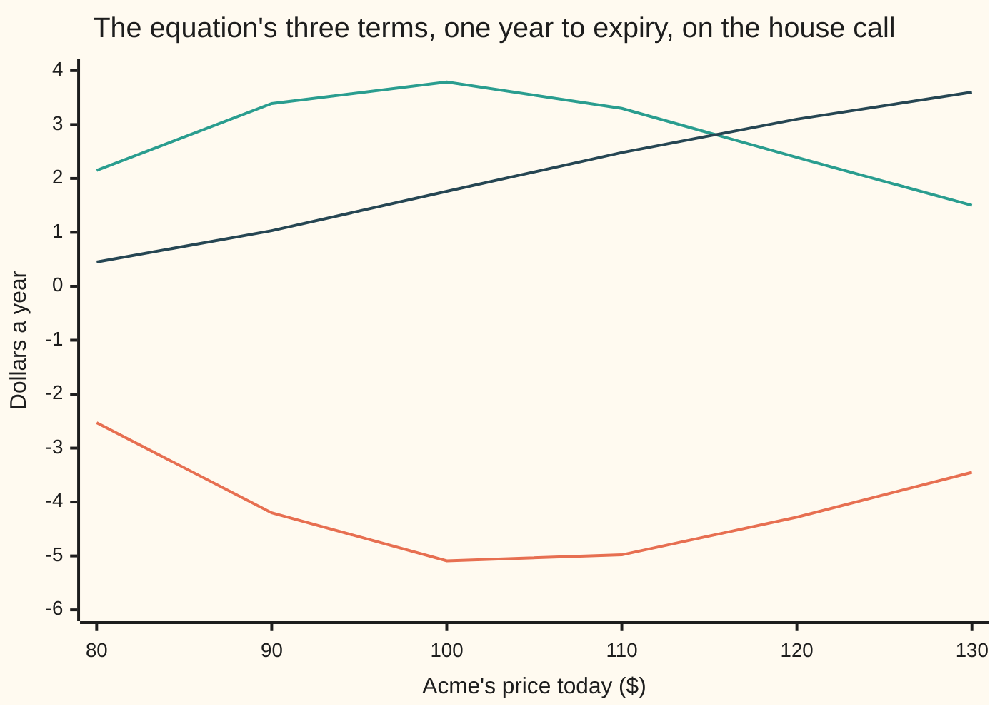
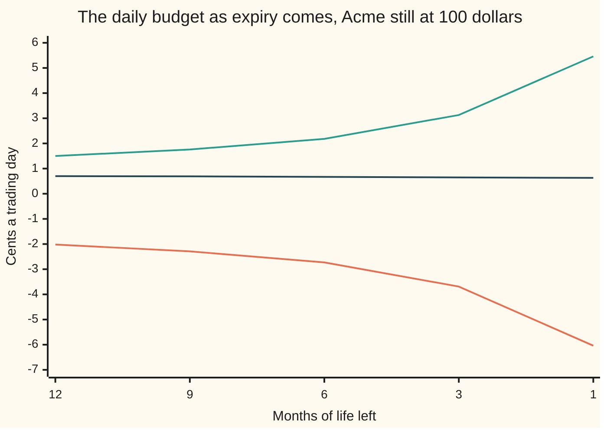

# The Black-Scholes equation: hedge away the randomness and every option price obeys one equation

[Syllabus](../../../SYLLABUS.md) → [Financial mathematics](../../../SYLLABUS.md#w12) → [The Black-Scholes call and put](../../../SYLLABUS.md#w12-s08) → The Black-Scholes equation

---

## General Overview

Somebody holds a call option on Acme shares. Acme trades at $100 today. The option lets its holder buy one share for $100 in a year's time, and the going price for it is $9.23 ([Black–Scholes call](01-black-scholes-call.md)).

Held on its own, the option is a bet on Acme. To stop it being one, the holder shorts 0.586851 shares — borrows that fraction of a share, sells it, and buys it back later. Pick that number right and, over the next moment, Acme moving up or down leaves the pair — option plus short share — worth the same. The share risk is gone.

Gone, but three things still tick along in the hedged pile. At today's prices, per year:

- the clock drains $5.09 out of the option;
- the bend in the option's price hands $3.79 back;
- the borrowed share and the cash beside it carry $1.76.

Add those: $0.46 a year. Now take 5% — what cash earns in the bank — of the option's own price of $9.23. That is $0.46 as well. Not close: the same number to twelve figures.

Nothing else was possible. The hedged pile carries no risk, so it can only earn what a bank deposit earns. Any other answer is free money, and free money gets taken within the hour.

**Hedge the share risk out of an option and what is left must earn the bank rate; written in symbols, that one sentence becomes a single equation that every option price — and every other claim that can be hedged the same way — has to satisfy.**

**What kind of fact this is:** a theorem inside a model. The model is the assumption that Acme's price wanders in one particular way, which is not a law of nature. Grant it, and the equation is proved on this card in Why it works.

### The picture: three big numbers that cancel



The line below zero is the clock: it takes the most, $5.09 a year, when Acme sits on the strike. The humped line above is the bend's pay-back, also biggest at the strike. The line climbing from $0.45 to $3.60 is the carry on the hedge. At every price the three add to a fourth number too small to draw here: 5% of the option's own value, 8 cents at $80, 46 cents at $100, $1.65 at $130.

---

## The formula

Two slopes and a slope of a slope, so the notation first, in words. Write $V$ for what the option is worth. It depends on two things: the share price $S$ and today's date $t$. Then $\partial V / \partial t$ means *hold the share price still, let the calendar run, and measure how fast the value changes* — a partial derivative, one variable moved at a time ([Partial derivatives](../../06-Calculus%20and%20analysis/07-Several%20Variables/01-partial-derivatives.md)). Next, $\partial V / \partial S$ is the same measurement against the share price, with the date held still. And $\partial^2 V / \partial S^2$ is the slope of that slope: how fast the first slope itself changes as the share price moves.

$$\frac{\partial V}{\partial t} \;+\; (r-q)\,S\,\frac{\partial V}{\partial S} \;+\; \tfrac12\,\sigma^2 S^2\,\frac{\partial^2 V}{\partial S^2} \;=\; r\,V$$

**Read it aloud:** what the clock takes, plus what the hedge's share-and-cash mix carries, plus what the bend pays back, comes to exactly the bank rate on the option's own value.

Trading desks give the three slopes Greek names and write the same line this way:

$$\Theta \;+\; (r-q)\,S\,\Delta \;+\; \tfrac12\,\sigma^2 S^2\,\Gamma \;=\; r\,V$$

$\Theta$, $\Delta$ and $\Gamma$ are those three slopes under shorter names. This card uses them only as names; what each one does in a trading book gets its own shelf, starting at [Theta pays for gamma](../09-The%20Greeks%2C%20one%20each/10-theta-pays-for-gamma-hedged-pnl.md).

| Symbol | Plain meaning | In our example | Push it up and the left side… |
| --- | --- | --- | --- |
| $V$ | what the claim is worth today — an option, or any other claim that can be hedged this way | $9.23, the house call | the bank-rate term on the right grows with it |
| $S$ | Acme's share price right now | $100 | moves every term: see the chart above |
| $K$ | the **strike**, the price the option may buy at | $100 | the bend shifts to sit over the new strike |
| $t$, $T$ | the calendar date now, and the expiry date on that same calendar | 0 and 1 year | less life left makes the clock and the bend both fiercer |
| $r$ | the **riskless rate**: what cash earns in the bank, compounded continuously | 5% | the carry and the bank-rate term both rise |
| $q$ | the **dividend yield**: cash the company pays shareholders, as a rate | 2% | the carry falls, since the borrowed share owes more away |
| $\sigma$ | **volatility**: how jumpy the share is. Say "sigma". | 20% | the bend's pay-back rises with its square |
| $\mu$ | the share's **real** expected growth. Say "mu". It is absent from the equation. | 10%, and it cancels in Step 2 | nothing: that is the point of the card |
| $\Theta$ | **theta**: $\partial V/\partial t$, dollars gained per year of calendar time, so usually negative | −5.089319 | — |
| $\Delta$ | **delta**: $\partial V/\partial S$, and also the shares to short per option held | 0.586851 | — |
| $\Gamma$ | **gamma**: $\partial^2 V/\partial S^2$, how fast delta itself moves, per dollar | 0.018951 | — |
| $d_1$, $d_2$, $N$, $n$ | the call formula's pieces: two distances to the strike, the bell curve's area and its height | 0.25 and 0.05 | — |

Every term is dollars per year, which is a free check on any version written down: $\sigma^2$ is per year, $S^2$ is dollars squared, $\Gamma$ is per dollar, so the bend's term is dollars a year like the rest. A term that is not dollars a year has lost an $S$.

### When it holds

- **The share wanders as geometric Brownian motion**: a steady percentage drift plus random percentage kicks ([Geometric Brownian motion](../../11-Stochastic%20processes%20and%20calculus/05-Brownian%20Motion/07-geometric-brownian-motion.md)). Let it jump instead — a takeover, a profit warning — and the hedge is wrong across the jump by about half of gamma times the square of the jump.
- **Volatility, the rate and the dividend yield hold still.** Let volatility move and the equation needs a term for that too; without one, prices are off by the volatility move times the option's sensitivity to it.
- **Trading is continuous and free.** Real desks re-hedge a few times a day and pay a spread each time, so a real book scatters around the equation instead of sitting on it.
- **The option may only be used on the expiry day.** An American option, usable any day, turns the equation into an inequality with a moving boundary ([The exercise boundary and smooth pasting](../15-American%20and%20Bermudan%20exercise/04-exercise-boundary-and-smooth-pasting.md)).
- **Strictly before expiry, never at it.** The payoff has a sharp corner at the strike, so the slopes do not exist on expiry day; the equation governs every moment up to it, with the payoff handed in as the ending condition.

---

## Why it works

### Step 0: the hedge deletes the only number nobody can know

Pricing an option looks impossible. Its payoff depends on where Acme ends up, and nobody knows that. Worse, a bull and a bear disagree about how fast Acme will grow — call that growth rate mu — and mu looks like it must sit in the answer.

It does not, and the reason is the whole card. Hold one option and short some shares. There is a number of shares for which, over the next instant, the two legs move by the same amount in opposite directions. Their sum does not care which way Acme went. A sum that does not care is riskless, and a riskless pile of money must grow at the bank rate. Mu vanishes at the same stroke that the risk does, because both ride on the same random kick.

### Step 1: Itô's lemma adds a term ordinary calculus would drop

Take the share to follow, over a slice of time written dt,

$$dS \;=\; \mu S\,dt \;+\; \sigma S\,dW$$

where dW is the random kick: average zero, and its size grows with the square root of the time slice. That last fact is the whole difficulty. The square of the kick is not a negligible second-order crumb; over a slice dt it averages $\sigma^2 S^2\,dt$, which is first order. So when the option's value is expanded, the second slope earns a place in the dt line that ordinary calculus would never give it. That is Itô's lemma ([Ito's lemma](../../11-Stochastic%20processes%20and%20calculus/06-Ito%20Calculus/02-itos-lemma.md)):

$$dV \;=\; \left(\frac{\partial V}{\partial t} + \mu S \frac{\partial V}{\partial S} + \tfrac12\,\sigma^2 S^2 \frac{\partial^2 V}{\partial S^2}\right) dt \;+\; \sigma S \frac{\partial V}{\partial S}\,dW$$

### Step 2: short delta shares, and two things leave together

Hold one option and short $\Delta$ shares, keeping $\Delta$ fixed across the instant. Being short a share means owing its dividend, which costs $q S \Delta\,dt$. The hedged book is worth $V - \Delta S$, and it moves by the option's move, less the shares' move, less that dividend.

Look at what multiplies dW in the result: $\left(\partial V/\partial S - \Delta\right)\sigma S$. Choose

$$\Delta \;=\; \frac{\partial V}{\partial S}$$

and it is zero. The randomness is gone. **And mu goes with it:** the $\mu S\,\partial V/\partial S$ from Itô's lemma is cancelled by the $-\mu S \Delta$ the short shares contribute, because the same $\partial V/\partial S$ appears in both. One choice, two deletions.

What is left is certain:

$$d(V - \Delta S) \;=\; \left(\frac{\partial V}{\partial t} + \tfrac12\,\sigma^2 S^2 \frac{\partial^2 V}{\partial S^2} - q S \frac{\partial V}{\partial S}\right) dt$$

### Step 3: certain means the bank rate, with no room to argue

A position whose value over the next instant is already known can be compared with cash in the bank. If it grows faster than the bank rate, borrow at the bank rate and buy the position: free money. If slower, sell it and deposit the proceeds: free money the other way. So it must grow at exactly the bank rate on its own value:

$$d(V - \Delta S) \;=\; r\,(V - \Delta S)\,dt$$

### Step 4: two expressions for the same thing, so set them equal

Both lines above give the change in the hedged book over dt. Equate them, cancel the dt, and move the term $-r S\,\partial V/\partial S$ across to join the dividend term:

$$\frac{\partial V}{\partial t} + (r-q)\,S\,\frac{\partial V}{\partial S} + \tfrac12\,\sigma^2 S^2\,\frac{\partial^2 V}{\partial S^2} = r\,V$$

Notice what the derivation never used: the option's payoff. The equation is the same for a call, a put, a prepaid share, or a bet that pays a dollar above the strike. Only the ending condition at expiry differs, which is why the card's code solves it twice, once for each of two payoffs, and gets both right.

<details>
<summary>Detailed proof, with the algebra written out</summary>

Take $V(S,t)$ to have a continuous first slope in $t$ and two continuous slopes in $S$ for $t < T$, and let the share follow $dS = \mu S\,dt + \sigma S\,dW$. Step 1's expansion of dV holds, using $(dS)^2 = \sigma^2 S^2\,dt$ to order dt. Hold the book $V - \Delta S$ with $\Delta$ fixed across the instant; shorting $\Delta$ shares costs the dividend $q S \Delta\,dt$, so the book changes by $dV - \Delta\,dS - q S \Delta\,dt$, which is
$$\left(\frac{\partial V}{\partial t} + \mu S \frac{\partial V}{\partial S} + \tfrac12\sigma^2 S^2 \frac{\partial^2 V}{\partial S^2} - \mu S \Delta - q S \Delta\right)dt \;+\; \sigma S\left(\frac{\partial V}{\partial S} - \Delta\right)dW.$$
Set $\Delta = \partial V/\partial S$. The dW bracket vanishes, and the two mu terms cancel exactly, since the same slope stands in both. No randomness is left, so no-arbitrage forces the change to equal $r\left(V - S\,\partial V/\partial S\right)dt$. Equate the two and cancel dt:
$$\frac{\partial V}{\partial t} + \tfrac12\sigma^2 S^2 \frac{\partial^2 V}{\partial S^2} - q S \frac{\partial V}{\partial S} = r V - r S \frac{\partial V}{\partial S}.$$
Collecting the two share-slope terms on the left gives the claim.

**The small print, honestly.** Holding $\Delta$ fixed across an instant while $\Delta$ itself depends on $S$ is the step a probabilist rewrites, replacing the frozen hedge with a trading strategy that pays for itself. The answer is identical, and the version above is the one that tells a desk what to trade. Uniqueness needs one more condition: among solutions growing no faster than the share price there is exactly one, so solving with the payoff as the ending condition gives the price and nothing else.

</details>

### The other door into the same room

Any equation of this exact shape — one time slope, two share slopes, minus a multiple of the function itself — has a solution that can be written as an average: take the payoff, average it over where the share could end up in a pretend world where it grows at $r - q$, and discount that average back at $r$. The match between such equations and such averages is the Feynman-Kac formula, and it turns this card's equation into the formulas of [Black–Scholes call](01-black-scholes-call.md) and [Black-Scholes put](02-black-scholes-put.md). It also explains why the pretend world's drift is the same $r-q$ standing in front of $\partial V/\partial S$ here. That world was never a philosophy; it is this equation, read as an average.

---

## Worked numbers, by hand

The house market: Acme at $100, strike $100, the riskless rate 5%, the dividend yield 2%, volatility 20%, one year to run. The call is worth $9.23 and its three slopes come from the call card's formula.

| Step | Arithmetic | Value |
| --- | --- | --- |
| the clock's slope, theta | dollars a year, from the call formula | $-5.089319$ |
| the share slope, delta | shares per option | $0.586851$ |
| the slope of that slope, gamma | per dollar | $0.018951$ |
| A, the clock | as above | $-5.089319$ |
| B, the carry | $0.03 \times 100 \times 0.586851$ | $1.760553$ |
| C, the bend | $0.5 \times 0.04 \times 10000 \times 0.018951$ | $3.790116$ |
| left side, A + B + C | $-5.089319 + 1.760553 + 3.790116$ | $0.461350$ |
| D, the right side | $0.05 \times 9.227006$ | $0.461350$ |
| **the leftover** | left side minus right side | **$0.000000$** |

So the hedged book on this option earns 46 cents a year on an outlay of $9.23, and that is all it can earn. The leftover is zero to the last digit a computer carries: the code prints it at twelve decimals.

Read the same line the way a desk does. Move the carry across: what the clock takes plus what the bend pays, $-5.089319 + 3.790116 = -1.299203$ a year, is the cost of carrying the mix that copies the option. That mix is 0.586851 shares, worth $58.69, paid for with the option's own $9.23 and a loan of $49.458109 — which is why the code prints the mix's cash as a negative number. The loan costs 5% a year; the shares hand 2% back, $1.173702. Net cost, $-1.299203$: the same number again.

### What breaks if you drop a piece

Each wrong version of the equation leaves a leftover, in dollars a year, instead of zero. None is small: each is seven or eight orders of magnitude above the arithmetic noise of the nudged slopes.

| Mistake | Leftover comes out at | What went wrong |
| --- | --- | --- |
| Clock slope taken the wrong way round | $10.178638$ | Life left shrinks as the calendar runs on, so the two slopes are opposite in sign; this is twice theta |
| The half in front of the bend dropped | $3.790116$ | The leftover is exactly the bend's own term. The half comes from Itô's lemma and is not a convention |
| The real growth mu = 10% used in place of $r - q$ | $4.107958$ | The hedge cancelled mu. Putting a forecast back in is the error the whole derivation exists to prevent |
| The dividend dropped from the equation but not from the price | $1.173702$ | The leftover is the dividend owed on the borrowed shares, $q S \Delta$ |

---

## How the budget moves as expiry comes

Leave Acme sitting at $100 and do nothing. The hedged book still moves money every day, and how much changes as expiry gets closer. Here is the same budget as above, converted to cents per trading day, at three moments in the option's life.

**Conventions verified 19 Sep 2026:** the per-day figures divide the yearly amounts by a 252-day trading year, the desk standard for quoting decay; rates stay continuously compounded, time in years. A 365-day count would shrink every cents-a-day figure in proportion.

| Months left | The clock takes | The bend pays | The carry pays | The bank rate on the option |
| --- | --- | --- | --- | --- |
| 12 | −2.02 | 1.50 | 0.70 | 0.18 |
| 3 | −3.69 | 3.13 | 0.65 | 0.09 |
| 1 | −6.04 | 5.46 | 0.63 | 0.05 |

Every row adds up: −2.02 + 1.50 + 0.70 comes to 0.18, and so on down. The clock and the bend both roughly triple as the last year runs out. The carry hardly moves, and the last column shrinks with the option's own value. Take them one at a time.

What the clock takes, in cents per trading day, with Acme still at $100:

```
months left                                    cents a day
       12   ████████                                  2.02
        3   ███████████████                           3.69
        1   ████████████████████████                  6.04
```

What the bend pays back, in the same cents per trading day:

```
months left                                    cents a day
       12   ██████                                    1.50
        3   █████████████                             3.13
        1   ██████████████████████                    5.46
```

The two grow together, but the gap between them is the point. That gap, plus the carry, is pinned to the last column, and the equation is exactly that pinning. All three forces, over the last year of the option's life:



The line sinking to −6.04 is the clock; the one climbing to 5.46 is the bend's pay-back; the nearly flat line, 0.70 down to 0.63, is the carry. Their sum is the bank rate on the option's value, which drops from 0.18 to 0.05 cents a day.

Here is the gap in one day of real money. The hedged book is left alone for a trading day and then revalued. If Acme has not moved, the book loses 1.51 cents: the bend's daily pay-back of 1.50 cents, never earned, plus two thousandths of a cent of higher-order arithmetic. The bend only pays when the share actually moves. The move that just covers the day's cost is volatility times the price times the square root of the day, $0.20 \times 100 \times \sqrt{1/252} = \$1.26$; move Acme by exactly that and the revalued day comes out flat to three hundredths of a cent. Road four of the code does both.

---

## Code, from first principles, and it actually runs

Nothing here imports a function that already knows the answer: the bell curve's area is built by Simpson's rule on the bell curve's own height, in both languages. The equation is then checked by **four independent roads**. One: the three slopes from the call formula, added up. Two: the same three slopes measured by nudging the price a penny and the clock a millionth of a year, which never names a Greek, run on the call, the put, and a prepaid share less a loan. Three: the equation alone, marched back from the payoff wall on a grid with no pricing formula in it at all. Four: a hedged book revalued a day later against what the equation forecasts. Then four wrong versions of the equation, each with the size of its leftover.

### Python

```python
# The Black-Scholes equation -- the check behind the card.  Standard library only,
# and nothing imported that already knows the answer: the bell-curve area N(x) is
# built here by Simpson's rule on the bell curve's own height, and road three
# marches the equation itself back from the payoff wall with no pricing formula
# inside it at all.  Every number quoted on the card is printed below.
from math import log, sqrt, exp, pi

S0, K, R, Q, SG, T, MU = 100.0, 100.0, 0.05, 0.02, 0.20, 1.0, 0.10
DS, DT, DAY = 1.0e-2, 1.0e-6, 1.0 / 252.0   # two nudges, and one trading day

def phi(x):                  # the bell curve's height at x
    return exp(-0.5 * x * x) / sqrt(2.0 * pi)

def ncdf(x):                 # area under the bell curve left of x, by Simpson
    if x < -12.0: return 0.0
    if x > 12.0: return 1.0
    n, s, h = 4000, phi(0.0) + phi(x), x / 4000.0
    for i in range(1, n): s += (4.0 if i % 2 == 1 else 2.0) * phi(h * i)
    return 0.5 + s * h / 3.0

def d1d2(S, t):              # t is the life left to expiry, in years
    v, m = SG * sqrt(t), log(S / K) + (R - Q + 0.5 * SG * SG) * t
    return m / v, m / v - v

def call(S, t):
    d1, d2 = d1d2(S, t)
    return S * exp(-Q * t) * ncdf(d1) - K * exp(-R * t) * ncdf(d2)

def put(S, t):
    d1, d2 = d1d2(S, t)
    return K * exp(-R * t) * ncdf(-d2) - S * exp(-Q * t) * ncdf(-d1)

def forward(S, t):           # a prepaid share less a loan: no curvature at all
    return S * exp(-Q * t) - K * exp(-R * t)

def greeks(S, t):            # theta, delta, gamma of the call, from the formula
    d1, d2 = d1d2(S, t)
    dq, dr = exp(-Q * t), exp(-R * t)
    theta = (-S * dq * phi(d1) * SG / (2.0 * sqrt(t))
             + Q * S * dq * ncdf(d1) - R * K * dr * ncdf(d2))
    return theta, dq * ncdf(d1), dq * phi(d1) / (S * SG * sqrt(t))

def slopes(price, S, t):     # road two: the three slopes by nudging the price
    V = price(S, t)
    vt = (price(S, t - DT) - price(S, t + DT)) / (2.0 * DT)   # clock on = life down
    vs = (price(S + DS, t) - price(S - DS, t)) / (2.0 * DS)
    vss = (price(S + DS, t) - 2.0 * V + price(S - DS, t)) / (DS * DS)
    return V, vt, vs, vss

def leftover(price, S, t):   # what the equation fails by, using nudged slopes
    V, vt, vs, vss = slopes(price, S, t)
    return vt + (R - Q) * S * vs + 0.5 * SG * SG * S * S * vss - R * V

def grid(is_call, m=600, steps=2000, L=1.5):
    # Road three: the equation alone, marched back from the payoff wall on a grid
    # of x = ln(S/K), spaced dx apart.  No d1, no d2, no bell curve anywhere.
    dx, dt = 2.0 * L / m, T / steps
    a, b = 0.5 * SG * SG, R - Q - 0.5 * SG * SG
    v = [max(K * exp(-L + i * dx) - K, 0.0) if is_call
         else max(K - K * exp(-L + i * dx), 0.0) for i in range(m + 1)]
    for s in range(steps):
        tl = (s + 1) * dt                            # life left after this step
        nv = [0.0] * (m + 1)
        for i in range(1, m):
            nv[i] = v[i] + dt * (a * (v[i + 1] - 2.0 * v[i] + v[i - 1]) / (dx * dx)
                                 + b * (v[i + 1] - v[i - 1]) / (2.0 * dx) - R * v[i])
        nv[m] = K * exp(L - Q * tl) - K * exp(-R * tl) if is_call else 0.0
        nv[0] = 0.0 if is_call else K * exp(-R * tl) - K * exp(-L - Q * tl)
        v = nv
    return v[m // 2]

def hedged_day(dS):          # road four: revalue the hedged book one day later
    return ((call(S0 + dS, T - DAY) - De * (S0 + dS)) - (C - De * S0)
            + (De * S0 - C) * (exp(R * DAY) - 1.0) - Q * De * S0 * DAY)

def show(title, rows):
    print(title)
    for name, v in rows: print(f"{name:<34}{v:>18.12f}")

C, P, d1, d2 = call(S0, T), put(S0, T), *d1d2(S0, T)
Th, De, Ga = greeks(S0, T)
A, B, Cu, D = Th, (R - Q) * S0 * De, 0.5 * SG * SG * S0 * S0 * Ga, R * C
cash, be = C - De * S0, SG * S0 * sqrt(DAY)
V, vt, vs, vss = slopes(call, S0, T)
gC, gP = grid(True), grid(False)
still = -0.5 * Ga * SG * SG * S0 * S0 * DAY

show("Black-Scholes equation, house market: S=K=100 r=5% q=2% sigma=20% T=1",
     (("call V", C), ("put V", P), ("d1", d1), ("d2", d2)))
show("-- road one: the three slopes from the closed formula --",
     (("theta  dV/dt, dollars a year", Th), ("delta  dV/dS", De),
      ("gamma  d(delta)/dS", Ga), ("A  theta", A), ("B  (r-q) S delta", B),
      ("C  half sigma^2 S^2 gamma", Cu), ("A + B + C", A + B + Cu), ("D  r V", D),
      ("call leftover A+B+C-D", A + B + Cu - D), ("cash in the mix, V - S delta", cash),
      ("A + C, theta plus gamma", A + Cu), ("r(V - S delta) + q S delta", R * cash + Q * S0 * De)))
show("-- road two: the same slopes by nudging, no Greek named --",
     (("call dV/dt by nudging", vt), ("call dV/dS by nudging", vs),
      ("call d2V/dS2 by nudging", vss), ("call leftover by nudging", leftover(call, S0, T)),
      ("put leftover by nudging", leftover(put, S0, T)),
      ("prepaid share less loan, leftover", leftover(forward, S0, T))))
show("-- road three: the equation marched back from the payoff wall --",
     (("call from the grid", gC), ("put from the grid", gP),
      ("worst gap to the formula", max(abs(gC - C), abs(gP - P)))))
show("-- road four: one hedged day, revalued against the forecast --",
     (("break-even move sigma S sqrt(day)", be), ("still day, hedged P&L", hedged_day(0.0)),
      ("still day, forecast from gamma", still), ("break-even day, hedged P&L", hedged_day(be))))
show("-- what breaks: each wrong equation's leftover, dollars a year --",
     (("clock sign flipped", -vt + (R - Q) * S0 * vs + 0.5 * SG * SG * S0 * S0 * vss - R * V),
      ("Ito half dropped", vt + (R - Q) * S0 * vs + SG * SG * S0 * S0 * vss - R * V),
      ("real drift mu = 10% for r - q", vt + MU * S0 * vs + 0.5 * SG * SG * S0 * S0 * vss - R * V),
      ("q dropped from the equation", vt + R * S0 * vs + 0.5 * SG * SG * S0 * S0 * vss - R * V)))

g6 = [(S, greeks(S, T)) for S in [80.0 + 10.0 * i for i in range(6)]]
print("-- the three terms across the share price, for the chart --")
print(f"{'share price':<14}" + "".join(f"{S:>9.0f}" for S, g in g6))
print(f"{'theta':<14}" + "".join(f"{g[0]:>9.2f}" for S, g in g6))
print(f"{'gamma term':<14}" + "".join(f"{0.5 * SG * SG * S * S * g[2]:>9.2f}" for S, g in g6))
print(f"{'carry term':<14}" + "".join(f"{(R - Q) * S * g[1]:>9.2f}" for S, g in g6))
print(f"{'r V':<14}" + "".join(f"{R * call(S, T):>9.2f}" for S, g in g6))
print("-- the same budget in cents a day, as expiry comes --")
print(f"{'months left':<14}{'theta':>9}{'gamma':>9}{'carry':>9}{'r V':>9}")
for mo in (12, 9, 6, 3, 1):
    t = mo / 12.0
    th, de, ga = greeks(S0, t)
    cells = (th, 0.5 * SG * SG * S0 * S0 * ga, (R - Q) * S0 * de, R * call(S0, t))
    print(f"{mo:<14d}" + "".join(f"{100.0 * x * DAY:>9.2f}" for x in cells))

assert abs(vt - Th) < 1e-6, "nudged dV/dt against the closed theta"
assert abs(vs - De) < 1e-6, "nudged dV/dS against the closed delta"
assert abs(vss - Ga) < 1e-6, "nudged d2V/dS2 against the closed gamma"
assert abs(A + B + Cu - D) < 1e-12, "the closed call's slopes satisfy the equation"
assert abs(leftover(put, S0, T)) < 1e-6, "the put satisfies it too"
assert abs(leftover(forward, S0, T)) < 1e-6, "so does a prepaid share less a loan"
assert abs(gC - 9.227005508154) < 1e-3, "the marched grid lands on the card's call price"
assert abs(gP - 6.330080627550) < 1e-3, "and on the card's put price"
assert abs(hedged_day(0.0) - still) < 1e-3, "revalued still day against the gamma forecast"
assert abs(hedged_day(be)) < 5e-3, "a break-even move leaves the hedged day flat"
assert abs(A + Cu - (R * cash + Q * S0 * De)) < 1e-12, "the trader's reading of the line"
print("ALL CHECKS PASS")
```

**Ran 2026-09-19 on macOS, Python 3.14.6, standard library only. All checks passed. Output, pasted from the run:**

```
Black-Scholes equation, house market: S=K=100 r=5% q=2% sigma=20% T=1
call V                                9.227005508154
put V                                 6.330080627550
d1                                    0.250000000000
d2                                    0.050000000000
-- road one: the three slopes from the closed formula --
theta  dV/dt, dollars a year         -5.089318913998
delta  dV/dS                          0.586851146135
gamma  d(delta)/dS                    0.018950578755
A  theta                             -5.089318913998
B  (r-q) S delta                      1.760553438404
C  half sigma^2 S^2 gamma             3.790115751002
A + B + C                             0.461350275408
D  r V                                0.461350275408
call leftover A+B+C-D                 0.000000000000
cash in the mix, V - S delta        -49.458109105322
A + C, theta plus gamma              -1.299203162997
r(V - S delta) + q S delta           -1.299203162997
-- road two: the same slopes by nudging, no Greek named --
call dV/dt by nudging                -5.089318911189
call dV/dS by nudging                 0.586851139028
call d2V/dS2 by nudging               0.018950578280
call leftover by nudging             -0.000000113525
put leftover by nudging              -0.000000120836
prepaid share less loan, leftover     0.000000032180
-- road three: the equation marched back from the payoff wall --
call from the grid                    9.226989812788
put from the grid                     6.330007113012
worst gap to the formula              0.000073514537
-- road four: one hedged day, revalued against the forecast --
break-even move sigma S sqrt(day)     1.259881576697
still day, hedged P&L                -0.015056812292
still day, forecast from gamma       -0.015040141869
break-even day, hedged P&L           -0.000307988493
-- what breaks: each wrong equation's leftover, dollars a year --
clock sign flipped                   10.178637708853
Ito half dropped                      3.790115542464
real drift mu = 10% for r - q         4.107957859671
q dropped from the equation           1.173702164531
-- the three terms across the share price, for the chart --
share price          80       90      100      110      120      130
theta             -2.53    -4.20    -5.09    -4.98    -4.28    -3.45
gamma term         2.15     3.39     3.79     3.30     2.39     1.50
carry term         0.45     1.03     1.76     2.48     3.10     3.60
r V                0.08     0.22     0.46     0.80     1.20     1.65
-- the same budget in cents a day, as expiry comes --
months left       theta    gamma    carry      r V
12                -2.02     1.50     0.70     0.18
9                 -2.29     1.76     0.69     0.16
6                 -2.73     2.18     0.67     0.13
3                 -3.69     3.13     0.65     0.09
1                 -6.04     5.46     0.63     0.05
ALL CHECKS PASS
```

The four roads meet. The closed formula's slopes satisfy the equation to the last bit a double carries. The nudged slopes, which never name a Greek, leave about a ten-millionth of a dollar a year — a nudge's own truncation error, after the bend's term has been multiplied by two hundred. The grid, which never sees the call formula, lands within eight thousandths of a cent on both prices. Halve its spacing and take four times as many steps — an explicit march needs both, as the experiments below show — and the gap falls by four: an error shrinking with the square of the spacing.

### Rust

Same inputs, same labels, same Simpson's rule for the bell curve. No crates.

```rust
// The Black-Scholes equation -- the same check as the Python, in Rust.  No crates.
// The bell-curve area N(x) is built here by Simpson's rule on the bell curve's own
// height, and road three marches the equation itself back from the payoff wall
// with no pricing formula inside it at all.  Every number quoted on the card is
// printed below.  Compile: rustc --edition 2021 -O black_scholes_equation_check.rs
use std::f64::consts::PI;

const S0: f64 = 100.0; const K: f64 = 100.0; const R: f64 = 0.05; const Q: f64 = 0.02;
const SG: f64 = 0.20; const T: f64 = 1.0; const MU: f64 = 0.10;
const DS: f64 = 1.0e-2; const DT: f64 = 1.0e-6; const DAY: f64 = 1.0 / 252.0;

fn phi(x: f64) -> f64 { (-0.5 * x * x).exp() / (2.0 * PI).sqrt() }   // bell-curve height

fn ncdf(x: f64) -> f64 {              // area under the bell curve left of x, by Simpson
    if x < -12.0 { return 0.0; }
    if x > 12.0 { return 1.0; }
    let (n, h) = (4000usize, x / 4000.0);
    let mut s = phi(0.0) + phi(x);
    for i in 1..n { s += (if i % 2 == 1 { 4.0 } else { 2.0 }) * phi(h * i as f64); }
    0.5 + s * h / 3.0
}

fn d1d2(s: f64, t: f64) -> (f64, f64) {          // t is the life left, in years
    let (v, m) = (SG * t.sqrt(), (s / K).ln() + (R - Q + 0.5 * SG * SG) * t);
    (m / v, m / v - v)
}

fn call(s: f64, t: f64) -> f64 {
    let (d1, d2) = d1d2(s, t);
    s * (-Q * t).exp() * ncdf(d1) - K * (-R * t).exp() * ncdf(d2)
}

fn put(s: f64, t: f64) -> f64 {
    let (d1, d2) = d1d2(s, t);
    K * (-R * t).exp() * ncdf(-d2) - s * (-Q * t).exp() * ncdf(-d1)
}

// a prepaid share less a loan: a claim with no curvature at all
fn forward(s: f64, t: f64) -> f64 { s * (-Q * t).exp() - K * (-R * t).exp() }

fn greeks(s: f64, t: f64) -> (f64, f64, f64) {   // theta, delta, gamma from the formula
    let (d1, d2) = d1d2(s, t);
    let (dq, dr) = ((-Q * t).exp(), (-R * t).exp());
    let theta = -s * dq * phi(d1) * SG / (2.0 * t.sqrt())
        + Q * s * dq * ncdf(d1) - R * K * dr * ncdf(d2);
    (theta, dq * ncdf(d1), dq * phi(d1) / (s * SG * t.sqrt()))
}

fn slopes(price: fn(f64, f64) -> f64, s: f64, t: f64) -> (f64, f64, f64, f64) {
    let v = price(s, t);              // road two: the three slopes by nudging
    let vt = (price(s, t - DT) - price(s, t + DT)) / (2.0 * DT);   // clock on = life down
    let vs = (price(s + DS, t) - price(s - DS, t)) / (2.0 * DS);
    let vss = (price(s + DS, t) - 2.0 * v + price(s - DS, t)) / (DS * DS);
    (v, vt, vs, vss)
}

fn leftover(price: fn(f64, f64) -> f64, s: f64, t: f64) -> f64 {
    let (v, vt, vs, vss) = slopes(price, s, t);
    vt + (R - Q) * s * vs + 0.5 * SG * SG * s * s * vss - R * v
}

fn grid(is_call: bool) -> f64 {
    // Road three: the equation alone, marched back from the payoff wall on a grid
    // of x = ln(S/K), spaced dx apart.  No d1, no d2, no bell curve anywhere.
    let (m, steps, l) = (600usize, 2000usize, 1.5f64);
    let (dx, dt) = (2.0 * l / m as f64, T / steps as f64);
    let (a, b) = (0.5 * SG * SG, R - Q - 0.5 * SG * SG);
    let mut v: Vec<f64> = (0..=m).map(|i| {
        let sx = K * (-l + i as f64 * dx).exp();
        if is_call { (sx - K).max(0.0) } else { (K - sx).max(0.0) }
    }).collect();
    for s in 0..steps {
        let tl = (s + 1) as f64 * dt;             // life left after this step
        let mut nv = vec![0.0f64; m + 1];
        for i in 1..m {
            nv[i] = v[i] + dt * (a * (v[i + 1] - 2.0 * v[i] + v[i - 1]) / (dx * dx)
                + b * (v[i + 1] - v[i - 1]) / (2.0 * dx) - R * v[i]);
        }
        nv[m] = if is_call { K * (l - Q * tl).exp() - K * (-R * tl).exp() } else { 0.0 };
        nv[0] = if is_call { 0.0 } else { K * (-R * tl).exp() - K * (-l - Q * tl).exp() };
        v = nv;
    }
    v[m / 2]
}

fn hedged_day(ds: f64, c: f64, de: f64) -> f64 {  // road four: revalue one day later
    (call(S0 + ds, T - DAY) - de * (S0 + ds)) - (c - de * S0)
        + (de * S0 - c) * ((R * DAY).exp() - 1.0) - Q * de * S0 * DAY
}

fn show(title: &str, rows: &[(&str, f64)]) {
    println!("{}", title);
    for (name, v) in rows { println!("{:<34}{:>18.12}", name, v); }
}

fn main() {
    let (c, p) = (call(S0, T), put(S0, T));
    let (d1, d2) = d1d2(S0, T);
    let (th, de, ga) = greeks(S0, T);
    let (a, b, cu, d) = (th, (R - Q) * S0 * de, 0.5 * SG * SG * S0 * S0 * ga, R * c);
    let (cash, be) = (c - de * S0, SG * S0 * DAY.sqrt());
    let (v, vt, vs, vss) = slopes(call, S0, T);
    let (gc, gp) = (grid(true), grid(false));
    let still = -0.5 * ga * SG * SG * S0 * S0 * DAY;

    show("Black-Scholes equation, house market: S=K=100 r=5% q=2% sigma=20% T=1",
         &[("call V", c), ("put V", p), ("d1", d1), ("d2", d2)]);
    show("-- road one: the three slopes from the closed formula --",
         &[("theta  dV/dt, dollars a year", th), ("delta  dV/dS", de),
           ("gamma  d(delta)/dS", ga), ("A  theta", a), ("B  (r-q) S delta", b),
           ("C  half sigma^2 S^2 gamma", cu), ("A + B + C", a + b + cu), ("D  r V", d),
           ("call leftover A+B+C-D", a + b + cu - d), ("cash in the mix, V - S delta", cash),
           ("A + C, theta plus gamma", a + cu), ("r(V - S delta) + q S delta", R * cash + Q * S0 * de)]);
    show("-- road two: the same slopes by nudging, no Greek named --",
         &[("call dV/dt by nudging", vt), ("call dV/dS by nudging", vs),
           ("call d2V/dS2 by nudging", vss), ("call leftover by nudging", leftover(call, S0, T)),
           ("put leftover by nudging", leftover(put, S0, T)),
           ("prepaid share less loan, leftover", leftover(forward, S0, T))]);
    show("-- road three: the equation marched back from the payoff wall --",
         &[("call from the grid", gc), ("put from the grid", gp),
           ("worst gap to the formula", (gc - c).abs().max((gp - p).abs()))]);
    show("-- road four: one hedged day, revalued against the forecast --",
         &[("break-even move sigma S sqrt(day)", be), ("still day, hedged P&L", hedged_day(0.0, c, de)),
           ("still day, forecast from gamma", still), ("break-even day, hedged P&L", hedged_day(be, c, de))]);
    show("-- what breaks: each wrong equation's leftover, dollars a year --",
         &[("clock sign flipped", -vt + (R - Q) * S0 * vs + 0.5 * SG * SG * S0 * S0 * vss - R * v),
           ("Ito half dropped", vt + (R - Q) * S0 * vs + SG * SG * S0 * S0 * vss - R * v),
           ("real drift mu = 10% for r - q", vt + MU * S0 * vs + 0.5 * SG * SG * S0 * S0 * vss - R * v),
           ("q dropped from the equation", vt + R * S0 * vs + 0.5 * SG * SG * S0 * S0 * vss - R * v)]);

    let g6: Vec<(f64, (f64, f64, f64))> =
        (0..6).map(|i| 80.0 + 10.0 * i as f64).map(|s| (s, greeks(s, T))).collect();
    let bar = |lab: &str, f: &dyn Fn(f64, (f64, f64, f64)) -> f64| {
        let mut line = format!("{:<14}", lab);
        for &(s, g) in &g6 { line.push_str(&format!("{:>9.2}", f(s, g))); }
        println!("{}", line);
    };
    println!("-- the three terms across the share price, for the chart --");
    let mut line = format!("{:<14}", "share price");
    for &(s, _) in &g6 { line.push_str(&format!("{:>9.0}", s)); }
    println!("{}", line);
    bar("theta", &|_s, g| g.0);
    bar("gamma term", &|s, g| 0.5 * SG * SG * s * s * g.2);
    bar("carry term", &|s, g| (R - Q) * s * g.1);
    bar("r V", &|s, _g| R * call(s, T));
    println!("-- the same budget in cents a day, as expiry comes --");
    println!("{:<14}{:>9}{:>9}{:>9}{:>9}", "months left", "theta", "gamma", "carry", "r V");
    for mo in [12i32, 9, 6, 3, 1] {
        let t = mo as f64 / 12.0;
        let (mth, mde, mga) = greeks(S0, t);
        let cells = [mth, 0.5 * SG * SG * S0 * S0 * mga, (R - Q) * S0 * mde, R * call(S0, t)];
        let mut line = format!("{:<14}", mo);
        for x in cells { line.push_str(&format!("{:>9.2}", 100.0 * x * DAY)); }
        println!("{}", line);
    }

    assert!((vt - th).abs() < 1e-6, "nudged dV/dt against the closed theta");
    assert!((vs - de).abs() < 1e-6, "nudged dV/dS against the closed delta");
    assert!((vss - ga).abs() < 1e-6, "nudged d2V/dS2 against the closed gamma");
    assert!((a + b + cu - d).abs() < 1e-12, "the closed call's slopes satisfy the equation");
    assert!(leftover(put, S0, T).abs() < 1e-6, "the put satisfies it too");
    assert!(leftover(forward, S0, T).abs() < 1e-6, "so does a prepaid share less a loan");
    assert!((gc - 9.227005508154).abs() < 1e-3, "the marched grid lands on the card's call price");
    assert!((gp - 6.330080627550).abs() < 1e-3, "and on the card's put price");
    assert!((hedged_day(0.0, c, de) - still).abs() < 1e-3, "revalued still day against the forecast");
    assert!(hedged_day(be, c, de).abs() < 5e-3, "a break-even move leaves the hedged day flat");
    assert!((a + cu - (R * cash + Q * S0 * de)).abs() < 1e-12, "the trader's reading of the line");
    println!("ALL CHECKS PASS");
}
```

**Ran 2026-09-19 on macOS, rustc 1.98.1, no crates. All checks passed. Output, pasted from the run:**

```
Black-Scholes equation, house market: S=K=100 r=5% q=2% sigma=20% T=1
call V                                9.227005508154
put V                                 6.330080627550
d1                                    0.250000000000
d2                                    0.050000000000
-- road one: the three slopes from the closed formula --
theta  dV/dt, dollars a year         -5.089318913998
delta  dV/dS                          0.586851146135
gamma  d(delta)/dS                    0.018950578755
A  theta                             -5.089318913998
B  (r-q) S delta                      1.760553438404
C  half sigma^2 S^2 gamma             3.790115751002
A + B + C                             0.461350275408
D  r V                                0.461350275408
call leftover A+B+C-D                 0.000000000000
cash in the mix, V - S delta        -49.458109105322
A + C, theta plus gamma              -1.299203162997
r(V - S delta) + q S delta           -1.299203162997
-- road two: the same slopes by nudging, no Greek named --
call dV/dt by nudging                -5.089318911189
call dV/dS by nudging                 0.586851139028
call d2V/dS2 by nudging               0.018950578280
call leftover by nudging             -0.000000113525
put leftover by nudging              -0.000000120836
prepaid share less loan, leftover     0.000000032180
-- road three: the equation marched back from the payoff wall --
call from the grid                    9.226989812788
put from the grid                     6.330007113012
worst gap to the formula              0.000073514537
-- road four: one hedged day, revalued against the forecast --
break-even move sigma S sqrt(day)     1.259881576697
still day, hedged P&L                -0.015056812292
still day, forecast from gamma       -0.015040141869
break-even day, hedged P&L           -0.000307988493
-- what breaks: each wrong equation's leftover, dollars a year --
clock sign flipped                   10.178637708853
Ito half dropped                      3.790115542464
real drift mu = 10% for r - q         4.107957859671
q dropped from the equation           1.173702164531
-- the three terms across the share price, for the chart --
share price          80       90      100      110      120      130
theta             -2.53    -4.20    -5.09    -4.98    -4.28    -3.45
gamma term         2.15     3.39     3.79     3.30     2.39     1.50
carry term         0.45     1.03     1.76     2.48     3.10     3.60
r V                0.08     0.22     0.46     0.80     1.20     1.65
-- the same budget in cents a day, as expiry comes --
months left       theta    gamma    carry      r V
12                -2.02     1.50     0.70     0.18
9                 -2.29     1.76     0.69     0.16
6                 -2.73     2.18     0.67     0.13
3                 -3.69     3.13     0.65     0.09
1                 -6.04     5.46     0.63     0.05
ALL CHECKS PASS
```

The two outputs agree line for line at twelve decimal places: the same arithmetic, in the same order, on the same doubles.

> [!TIP]
> **Try changing**
> Guess the direction first, then run it. The asserts are pinned to the house market, so expect one to stop the program.
> - **Put your market view into the grid.** In `grid`, change `b` to `MU - 0.5 * SG * SG`, so the march uses the share's real 10% growth instead of $r - q$. The grid prices the call at $13.95 instead of $9.23, and the assert stops it. Nobody will pay $13.95, which is Step 2 in one number.
> - **Starve the march of time steps.** Set `steps=1000`. The time step is now larger than the grid spacing squared divided by $\sigma^2$, and the march does not just lose accuracy, it explodes: the answer comes back as `nan`. Explicit marching schemes have a speed limit.
> - **Nudge too gently.** Set `DS` to `1.0e-6`. The second difference subtracts two nearly equal numbers and divides by a millionth squared, so rounding swamps it: gamma comes back as 0.0142 instead of 0.018951. A nudge has to be small enough to keep truncation down and large enough to survive rounding.
> - **Narrow the grid.** Set `L=0.5`, which stops the grid at share prices of $61 and $165. It returns `nan`, and not because of the walls: a narrower window across the same 600 points is a finer spacing, so the speed limit above is broken again. Raise `steps` to 20000 and the call returns at $9.227, a thousandth of a cent from the formula — at a year and 20% volatility, $61 and $165 are far enough away to leave it alone.

---

## The usual mistake

> [!warning]
> **Reading the equation as a formula for the price.** It is not one. A call, a put, a prepaid share, cash in the bank, and every exotic payoff ever written all satisfy it; what picks one out is the condition at expiry. The equation says what a price must obey between now and then; the payoff says where it lands.
>
> Four smaller traps, each with the number it produces on the house call:
> - **Dropping the half in front of the bend.** The term comes from Itô's lemma, not from a trader's rule of thumb. Drop it and the leftover is $3.790116 a year, which is the bend's whole contribution.
> - **Mixing up the two clocks.** Calendar time runs forwards; life left to expiry runs backwards. Write one equation with the other's slope and the leftover is $10.178638 a year, twice theta.
> - **Putting a forecast where $r - q$ belongs.** A 10% view of Acme's growth leaves $4.107958 a year. The hedge deleted the forecast; the equation has no slot for it.
> - **Dropping the dividend on one side only.** Price with a 2% yield, write the equation without it, and the leftover is $1.173702 a year: precisely the dividend owed on the borrowed shares. This is the same slip that makes a dividend-paying call look too expensive on [Known cash dividends](08-known-cash-dividends.md).

---

## Where you meet it in real life

- **Every pricing system with a grid in it.** Road three of the code is a toy version of what banks run overnight: lay out share prices and dates, put the payoff along the expiry edge, step the equation backwards to today. It works on payoffs no formula can reach.
- **Options that can be used early.** An American option's value can never sit below its payoff, so the equation becomes an inequality with a moving boundary between "hold" and "exercise": [The exercise boundary and smooth pasting](../15-American%20and%20Bermudan%20exercise/04-exercise-boundary-and-smooth-pasting.md).
- **The heat equation.** Log of the share price, life left instead of the date, an exponential factor peeled off: three changes of variable turn this into the equation for heat spreading along a bar. Not a second theory of prices, the same one in different clothes (Black-Scholes is the heat equation after a change of variables).
- **Barriers and other exotics.** A knock-out option is this equation on a smaller region, with zero written along the barrier. The region changes; the equation does not.
- **Knowing how it is wrong.** Volatility that moves, shares that jump, hedging that costs money: each breaks one assumption and adds or alters a term ([The Black-Scholes assumptions](09-black-scholes-assumptions-and-failures.md)).
- **Corporate finance, by analogy.** A company's shares are a call on its assets with the debt as the strike, so the same equation governs that equity.

> **Say it back**
> Hold an option and short the right number of shares, and the next moment's share move does nothing to the pair. What remains is certain, so it can only earn the bank rate; the share's real growth rate cancels at the same instant the risk does. Written out, that gives one equation: the clock's term, plus the carry on the hedge, plus half the volatility squared times the price squared times the bend, equals the bank rate on the value. It is a constraint, not a price. The payoff at expiry picks which of its many solutions is in hand, and a grid marching the equation back from that payoff reproduces the call and put prices without the formula.

---

## What this builds on

- [Black–Scholes call](01-black-scholes-call.md): the $9.23 price and the hedge of 0.586851 shares, and the averaging route this card's equation replaces with a hedge.
- [Black-Scholes put](02-black-scholes-put.md): the second payoff the code checks, at $6.33, and proof that the equation is not about calls.
- [Partial derivatives](../../06-Calculus%20and%20analysis/07-Several%20Variables/01-partial-derivatives.md): measuring a slope with one variable moving and the others held still, which is what all three terms are.
- [Ito's lemma](../../11-Stochastic%20processes%20and%20calculus/06-Ito%20Calculus/02-itos-lemma.md): why the second slope earns a place in the dt line. Without it there is no bend term, and no equation.
- [Geometric Brownian motion](../../11-Stochastic%20processes%20and%20calculus/05-Brownian%20Motion/07-geometric-brownian-motion.md): the model of the share that supplies $\mu$, $\sigma$, and the fact that the kick's square is first order.

## Where this goes next

- [The Black-Scholes assumptions](09-black-scholes-assumptions-and-failures.md): each assumption in "When it holds" broken on purpose, with the size of the damage.
- [Theta pays for gamma](../09-The%20Greeks%2C%20one%20each/10-theta-pays-for-gamma-hedged-pnl.md): the daily budget above as a trading business, re-hedged move by move.
- [The exercise boundary and smooth pasting](../15-American%20and%20Bermudan%20exercise/04-exercise-boundary-and-smooth-pasting.md): what happens to the equation when the holder may exercise early.
- Black-Scholes is the heat equation after a change of variables: the change of variables that turns this equation into spreading heat, and hands back the closed formula.

The equation pins the price, but not which payoffs have a closed form: most are solved on a grid, to the grid's accuracy. What survives when the assumptions behind the hedge fail is the next question, and the assumptions card answers it.

---

## Sources

Verified 19 Sep 2026: every link below resolves to the publisher's page.

- Black, Fischer, and Myron Scholes. "The Pricing of Options and Corporate Liabilities." *Journal of Political Economy* 81, no. 3 (1973): 637–654. [doi:10.1086/260062](https://doi.org/10.1086/260062). The hedge argument and the equation, with no dividends.
- Merton, Robert C. "Theory of Rational Option Pricing." *Bell Journal of Economics and Management Science* 4, no. 1 (1973): 141–183. [doi:10.2307/3003143](https://doi.org/10.2307/3003143). Adds the continuous dividend yield $q$; the version on this card.
- Wilmott, Paul, Sam Howison, and Jeff Dewynne. *The Mathematics of Financial Derivatives: A Student Introduction*. Cambridge University Press, 1995. [Publisher page](https://www.cambridge.org/core/books/mathematics-of-financial-derivatives/7121345D07C5BCE4FBEC91A8A7E6F267). The change of variables to the heat equation, and the marching grids of road three.
- Shreve, Steven E. *Stochastic Calculus for Finance II: Continuous-Time Models*. Springer, 2004. [Publisher page](https://link.springer.com/book/9780387401010). The Feynman-Kac correspondence behind "the other door", and the uniqueness class.
