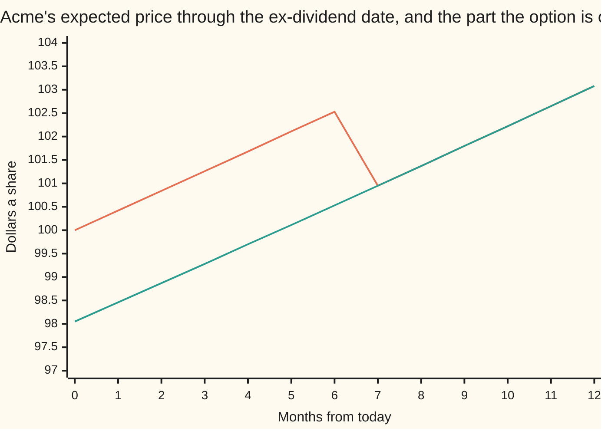
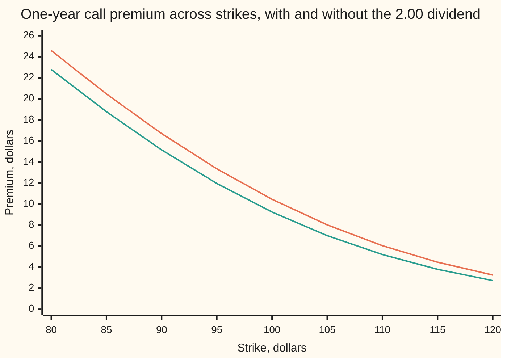

# Known cash dividends: escrow the dividend, then price the share that is left

[Syllabus](../../../SYLLABUS.md) → [Financial mathematics](../README.md) → [The Black-Scholes call and put](../README.md#s08) → Known cash dividends

---

## General Overview

Acme trades at $100.00. Its board has declared a dividend of $2.00 a share, and the share goes **ex-dividend** in six months: from that morning, whoever buys it no longer receives the payment.

Something mechanical happens on that morning. The share drops by roughly $2.00. Nobody is cheated: the cash has left the company, to the people who held the share the day before.

A call option is not so lucky. A call is the right to buy one share for a fixed $100.00 in one year's time. That fixed price is the **strike**, and it does not drop by $2.00 in sympathy. So the holder of the call takes the fall and collects none of the cash. A dividend is pure loss to a call and pure gain to a put.

The other cards on this shelf handle dividends with a **yield**, written $q$: a steady 2% a year, leaking out every instant. Real boards do not leak. They declare an amount on a date. So what goes into the formula when the payout is $2.00 on one known day?

A split. Of Acme's $100.00, part is not a business at all. It is a cheque for $2.00 dated six months out. Discounted back at 5% a year that cheque is worth $1.95 today, and it is riskless: short of a cut, it pays $2.00 whatever the share does. The other $98.05 is the part that wanders. The option is a claim on the wandering part and on nothing else.

So take the dividend's value today out of the quoted price, call what is left the **escrowed spot**, and hand that to the ordinary formula with the yield set to zero. Acme's call comes out at **$9.24** and its put at **$6.32**.

**Set the dividend's present value aside as cash and price the option on what is left of the share, because the part set aside carries no risk and the option has no claim on it.**

**What kind of fact this is:** a method — how to feed a dated payout into a formula built for a yield — resting on one modelling choice that Why it works names and measures. The parity line it carries is a theorem, proved on this card in Step 2.

### The picture: where the escrow lives



The upper line is Acme with the dividend still inside it: drifting up at the riskless rate, then falling $2.00 when the share goes ex. The lower line is the escrowed part, $98.05 today, drifting up with no fall at all. The gap between the two lines is the dividend's value at that moment — $1.95 today, $2.00 by month six. From month seven onward the two lines are one line, because the cheque has been cashed. The chart joins month six to month seven with a straight segment; in the model the fall is instant.

---

## The formula

Four new pieces of notation, in words first. $D_1$ is the cash the share pays, in dollars a share. $t_1$ is when it pays, in years from today. $D_0$ is that same cash valued today — the subscript is the date, so $D_1$ is the amount at $t_1$ and $D_0$ is its worth at time zero. And $S^{*}$, read "S-star", is the quoted price with $D_0$ taken out.

$$D_0 = D_1 e^{-r t_1}, \qquad S^{*} = S - D_0$$

$$C = S^{*} N(d_1) - K e^{-rT} N(d_2), \qquad P = K e^{-rT} N(-d_2) - S^{*} N(-d_1)$$

$$d_1 = \frac{\ln(S^{*}/K) + (r + \tfrac12\sigma^2)T}{\sigma\sqrt{T}}, \qquad d_2 = d_1 - \sigma\sqrt{T}$$

**Read it aloud:** discount the dividend back to today, take it off the share price, and price the option with the ordinary formula on what remains — no yield term anywhere.

More than one payout before expiry: discount each to today and subtract the total.

| Symbol | Plain meaning | In our example | Push it up and the call… |
| --- | --- | --- | --- |
| $S$ | Acme's quoted price today, dividend still inside it | 100.00 | rises: more share to receive |
| $K$ | the **strike**, the price the call may buy at | 100.00 | falls: further to climb |
| $T$ | years until the option expires | 1 | rises: more room for a big move |
| $r$ | the riskless rate, continuously compounded | 5% | rises: the cash owed later is worth less today, and $D_0$ shrinks too |
| $\sigma$ | **volatility**, how jumpy the share is. Say "sigma". | 20% | rises, and this input matters most |
| $D_1$ at $t_1$ | the declared cash, and the year-fraction when the share goes ex | 2.00 at 0.50 | falls for a bigger cheque, rises for a later one |
| $D_0$ | that cash valued today: the **escrow** | 1.950620 | falls, for the same reason |
| $S^{*}$ | the **escrowed spot**: the share with the escrow removed | 98.049380 | rises |
| $d_1$, $d_2$ | how far the escrowed spot sits from the strike, in units of $\sigma\sqrt{T}$ | 0.251505 and 0.051505 | — |
| $N$ | the bell-curve area to the left of a point: a chance between 0 and 1 | — | — |
| $q$ | a continuous dividend **yield**, the input the other shelf cards take | 2% | falls |
| $C$, $P$ | the call and put premiums | 9.24 and 6.32 | — |

Put-call parity is restated with the escrow on the call's side, and nothing else changes ([Put-call parity](03-put-call-parity.md)):

$$C - P = S - D_0 - K e^{-rT} = S^{*} - K e^{-rT}$$

### When it holds

- **The dividend is known, not forecast.** A declared amount on an announced date is known. Next year's guess is not, and escrowing a guess prices a certainty nobody has.
- **Only payouts before expiry count.** A cheque that arrives after the option dies is none of its business. Escrow a second $2.00 at eighteen months as well and the premium comes out far too cheap — $8.17 instead of $9.24, in the table below.
- **No early exercise.** The card prices a European option, exercisable only on the last day. A cash dividend is the main reason an American call holder would exercise early, and that belongs to [Merton's theorem](../15-American%20and%20Bermudan%20exercise/02-mertons-no-early-exercise-theorem.md).
- **The dividend never exceeds the share.** $S^{*}$ must stay positive, or there is nothing left to price; in the rival model below the share itself must clear the cheque on the ex-date, or a share is asked to go negative. For Acme the cheque is a fiftieth of the share price, so neither binds here; both bind for a large special dividend.
- **The volatility sits on $S^{*}$, not on $S$.** This is the modelling choice, not a fact. Costed at eight cents below.

---

## Why it works

### Step 0: a share with a declared dividend is two things at once

Holding Acme today is holding two different futures at once. One is a cheque: $2.00, six months out, near enough certain. The other is everything after that — a business whose price wanders.

Value them separately. A certain $2.00 in six months is worth $2.00 discounted at the riskless rate, $1.95 today ([Compound interest](../../01-Foundations/04-Compound%20Growth%20and%20Discounting/03-compound-interest.md)). Whatever the $100.00 quote is worth, $1.95 of it is that cheque. The remaining $98.05 is the wandering part.

Nothing has been assumed yet. The split is arithmetic on a declared amount and a rate.

### Step 1: strip the cheque, because the option has no claim on it

Now ask what the call owns. It is the right to buy a share in one year — after the dividend has gone, cashed by someone else. The call's payoff depends only on where the wandering part ends up.

So price the option on the wandering part. That part is worth $98.05 today, and it carries all the jumpiness, because a riskless cheque has none: setting $1.95 aside removes value but no risk.

That is the whole method. The call is a one-year 100-strike call on a thing worth $98.049380 today that pays nothing out along the way — and Black–Scholes with no dividend is exactly the tool for that ([Black–Scholes call](01-black-scholes-call.md)). Feed it $S^{*}$ and $q = 0$ and read off $9.244684.

The name for the set-aside cheque is the **escrow**, and for $S^{*}$ the **escrowed spot**. Those are the terms from here on.

### Step 2: parity, with the escrow on the call's side

Parity compares two parcels held to expiry. One call plus cash $K e^{-rT}$ is worth $K$ at expiry if the share finishes below the strike and the share's price if above. One put plus one share does the same — except that the share parcel also collects $2.00 on the ex-date, and the call parcel does not.

Hand the call parcel the same cheque and the two match again. Adding $D_0$ of cash today to the call side gives $C + K e^{-rT} + D_0 = P + S$, which rearranges to $C - P = S - D_0 - K e^{-rT}$. The check below prices the put by its own numerical average, subtracts, and lands on $2.926438 from both sides.

<details>
<summary>Detailed proof: parity with one known dividend</summary>

Write $\tau = T - t_1$ for the time from the ex-date to expiry, and let $S_{\text{end}}$ be the share's price on the last day.

Parcel A: one call, a bond paying $K$ at $T$, and a bond paying $D_1$ at $t_1$. Cost today $C + Ke^{-rT} + D_0$. At $t_1$ that second bond pays $D_1$; bank it at the riskless rate and it is $D_1 e^{r\tau}$ at expiry. The call and the $K$ bond together are worth $\max(S_{\text{end}} - K, 0) + K$, which is $K$ when the share finishes below the strike and $S_{\text{end}}$ when above. Total at expiry: $\max(S_{\text{end}}, K) + D_1 e^{r\tau}$.

Parcel B: one put and one share. Cost today $P + S$. At $t_1$ the share pays $D_1$; bank it the same way, $D_1 e^{r\tau}$ at expiry. Put plus share is $\max(K - S_{\text{end}}, 0) + S_{\text{end}}$, which is $K$ below the strike and $S_{\text{end}}$ above. Total at expiry: $\max(S_{\text{end}}, K) + D_1 e^{r\tau}$.

Identical in every future, so identical in cost today. Hence $C + Ke^{-rT} + D_0 = P + S$. Note what was not needed: no bell curve, no volatility, no model of how the share wanders. Only that the $D_1$ is certain, so that its value today is $D_0$.

</details>

### Step 3: why the tree stops recombining, and how escrow saves it

A binomial tree is cheap because paths meet ([Cox-Ross-Rubinstein](../04-Binomial%20Trees/04-crr-tree-and-convergence.md)). Each step multiplies the price by $u$ going up or by $d = 1/u$ going down, so up-then-down returns to where it started. Two thousand steps over the year need only 2,001 prices in the final layer, not $2^{2000}$ paths.

Take 2,000 steps, half of them landing on or before the ex-date. In the dividend layer, go up from node 500, or go down from node 501: in a tree with no dividend both paths land on the same price and one number serves both.

Now subtract $2.00 of cash at every node of that layer, the way the share really behaves. Up from node 500 lands on $98.439251. Down from node 501 lands on $98.457139. They differ by $0.017889, the dividend times the gap between an up step and a down step. Two prices where one used to do, and the split compounds through every later step. The final layer holds 1,002,001 prices instead of 2,001, five hundred times as many, with the work to match.

Escrow removes the problem before it starts. Build the tree on $98.049380 and pay nothing on it. The cash never touches a node, the same two paths meet again to within a millionth, the final layer is back to 2,001, and the price agrees with the formula: $9.244880 against $9.244684 at 2,000 steps, closing as the steps rise. The dividend has not been ignored. It was taken out first.

<details>
<summary>Escrowing is Merton's yield model wearing a hat</summary>

Merton's version of the formula takes a continuous yield $q$ and prices on $S e^{-qT}$. Escrow prices on $S - D_0$. Choose $q$ so that $S e^{-qT} = S - D_0$, that is $q = -\ln(S^{*}/S)/T$, and the two are the same formula with the same numbers: $d_1$, $d_2$ and the premium all coincide, because $\ln(S^{*}/K) = \ln(S/K) - qT$ turns one $d_1$ into the other.

For Acme that yield is $1.969895\%$, and the yield formula fed it returns $9.244684 — the escrowed answer to every digit. So the honest reading of "a $2.00 dividend at six months" is not "a 2% yield". It is a $1.97\%$ yield. The shelf's house $q = 2\%$ is a slightly heavier drag, worth a hair under two cents on this call: $9.227006 against $9.244684. The same gap shows in the forward price, $103.045453 under the house yield against $103.076479 under the cash dividend.

</details>

### The other door: let the share itself fall

Escrow makes one choice out loud: it puts the 20% jumpiness on the $98.05, not on the $100.00. A different model puts it on the whole share — Acme wanders at 20% for six months, drops exactly $2.00 on the ex-date, then wanders at 20% again. Both models are arbitrage-free. They disagree.

The check prices that second model two ways, by nested averages and by a tree that really pays the cash at every node, and gets **$9.32**: $9.321312 and $9.321508. Escrow gives $9.244684. The gap is $0.076628, about eight cents, or four-fifths of one percent of the premium. The reason fits in a line: shaking $100.00 by 20% shakes the $98.05 inside it by more than 20%, and a call likes shaking.

Neither model is the truth. $\sigma$ is a fitted number, and the model it was fitted with is the model it has to be priced with. Escrow is the market's default because it is one subtraction and it keeps trees and grids recombining. The gap is the price of the convenience, and eight cents on a nine-dollar option is not nothing.

---

## Worked numbers, by hand

Acme: $S = 100.00$, $K = 100.00$, $r = 5\%$, $\sigma = 20\%$, $T = 1$ year, one dividend of $D_1 = 2.00$ at $t_1 = 0.50$.

| Step | Arithmetic | Value |
| --- | --- | --- |
| the dividend, brought back to today | $2.00 \times e^{-0.05 \times 0.50}$ | $1.950620$ |
| the escrowed spot | $100.00 - 1.950620$ | $98.049380$ |
| the drift in the escrowed world, $r + \tfrac12\sigma^2$ | $0.05 + 0.02$ | $0.07$ |
| one wiggle unit, $\sigma\sqrt{T}$ | $0.20 \times 1$ | $0.20$ |
| $d_1$, measured on the escrowed spot | $(\ln(98.049380/100) + 0.07)/0.20$ | $0.251505$ |
| $d_2$ | $0.251505 - 0.20$ | $0.051505$ |
| the call | $98.049380\,N(0.251505) - 100\,e^{-0.05}N(0.051505)$ | $\mathbf{9.244684}$ |
| the put, the same two areas mirrored | $100\,e^{-0.05}N(-0.051505) - 98.049380\,N(-0.251505)$ | $\mathbf{6.318246}$ |
| the check: call minus put | $9.244684 - 6.318246$ | $\mathbf{2.926438}$ |
| parity's other side | $98.049380 - 100\,e^{-0.05}$ | $\mathbf{2.926438}$ |
| the forward, carrying the escrowed spot | $98.049380 \times e^{0.05}$ | $103.076479$ |
| the forward again, from the carry ledger | $100.00\,e^{0.05} - 2.00\,e^{0.05 \times 0.50}$ | $103.076479$ |

So the dividend takes the call down from $10.45, which is what the same option fetches on a share that pays nothing, to $9.24. The put moves the other way, and parity fixes the total: call minus put falls by exactly the escrow, $1.95.

The rest of the shelf prices the same market with a 2% yield: call $9.227006, put $6.330081, forward $103.045453. The cash-dividend answers sit a touch above on the call and below on the put, because a $2.00 cheque at six months drags the share slightly less than a 2% yield does — $1.969895\%$, as the folded note works out.



The upper line is Acme paying nothing; the lower line is the same option with the $2.00 escrowed. The gap is a larger number of dollars at the low strikes and a larger fraction of the premium at the high ones. A call struck far below the share price is nearly a share, so it loses nearly the whole dividend. One struck far above it has little to lose in dollars, but what it loses is most of what it had.

### What breaks if you drop a piece

Same option throughout, correct answer $9.244684.

| Mistake | Call comes out at | What went wrong |
| --- | --- | --- |
| Subtract the $2.00 without discounting it | $9.215115 | You paid the dividend today rather than in six months and threw away three cents of interest |
| Read the cash as the shelf's $q = 2\%$ | $9.227006 | A $2.00 cheque at six months is a $1.969895\%$ drag, not 2%. Almost two cents too cheap |
| Escrow the dividend and leave $q = 2\%$ in as well | $8.118841 | The dividend is now charged twice. Over a dollar too cheap |
| Escrow a second $2.00 dividend, this one at eighteen months | $8.167107 | The option expires at twelve. A payout after expiry is none of its business |

The code prints all four.

---

## The option across the ex-dividend date

The share falls $2.00 on the ex-dividend morning, and the option's price does not move at all.

Follow one option with six months left to run, and watch the two prices come apart and back together.

| Moment | Acme quoted | Dividend still ahead | Escrowed spot | Call, six months left |
| --- | --- | --- | --- | --- |
| The evening before the share goes ex | $100.00 | $2.00, tomorrow | $98.00 | $\mathbf{5.75}$ |
| The morning after | $98.00 | none | $98.00 | $\mathbf{5.75}$ |
| A share that never pays a dividend | $100.00 | none | $100.00 | $\mathbf{6.89}$ |

The first two rows are the same option at the same value. The share lost $2.00 and the option lost nothing, because the escrowed spot — the only number the option cares about — was $98.00 on both days. The fall was priced in the moment the dividend was declared, not the morning it was paid.

The third row is the size of that pricing-in: $6.89 against $5.75. Over six months a $2.00 dividend takes more than half of its own size out of an at-the-money call, because a call at the money moves about sixty cents on the dollar.

### One force: the size of the cheque

Freeze everything and change only the dividend the board declares. Call premium in dollars, same option in every row.

```
each block is 25 cents of premium; the dividend is paid at six months in every row
dividend    one-year call premium
   $0.00   ██████████████████████████████████████████  $10.45
   $2.00   █████████████████████████████████████        $9.24
   $5.00   ██████████████████████████████               $7.58
  $10.00   █████████████████████                        $5.20
  $20.00   ████████                                     $1.97
```

The premium gives up about sixty cents for every dollar of dividend at first, and less as the cheque grows, because a call cannot be worth less than nothing. A $20.00 special dividend on a $100.00 share leaves the call at $1.97, a fifth of what it was: the escrow has taken almost the whole $20.00 out of the share, and the strike has not moved at all.

---

## Code, from first principles, and it actually runs

Nothing is imported that already knows the answer. The bell-curve area is built by adding thin slices under the curve, the averages are Simpson's rule written out, the trees are loops. Two models are priced and compared: the escrowed model three ways, by the formula, by averaging the payoff directly and by a recombining 2,000-step tree; the cash-drop model two ways, by nested averages and by an exploded tree that really pays the cash at each node. The put is priced twice as well, by formula and by average, and parity is checked against the average. The two would-be twin nodes are printed, to show recombination breaking. The forward is reached twice: once by carrying the escrowed spot, once from a ledger that borrows the share price and repays part of the loan with the dividend, never forming the escrowed spot at all. Every wrong number in the tables above is reproduced.

### Python

```python
# Known cash dividends -- the check behind the card.  Standard library only, and
# nothing imported that already knows the answer: the bell-curve area is built from
# thin slices under the curve, every average is Simpson's rule written out, every tree
# is a loop.  Acme trades at 100.00 and pays one cash dividend of 2.00 six months from
# now; the option is a one-year 100-strike European call.  Two models, two roads each.
from math import log, sqrt, exp, pi
S, K, R, SIG, T = 100.0, 100.0, 0.05, 0.20, 1.0
D1, TD, STEPS = 2.0, 0.5, 2000

def phi(x):                                        # bell-curve height at x
    return exp(-0.5 * x * x) / sqrt(2.0 * pi)
def simpson(f, a, b, n):                           # add up thin slices under f
    h = (b - a) / n
    s = f(a) + f(b)
    for i in range(1, n):
        s += (4.0 if i % 2 else 2.0) * f(a + i * h)
    return s * h / 3.0
def ncdf(x):                                       # bell-curve area to the left of x
    if x < -12.0 or x > 12.0: return 0.0 if x < 0.0 else 1.0
    return 0.5 + simpson(phi, 0.0, x, 2000)
def parts(steps):                                  # a step up, a step down, the odds
    u, dt = exp(SIG * sqrt(T / steps)), T / steps
    return dt, u, 1.0 / u, (exp(R * dt) - 1.0 / u) / (u - 1.0 / u)
def weights(n, p):                                 # binomial weights, no factorials
    w = [(1.0 - p) ** n]
    for j in range(n):
        w.append(w[-1] * p / (1.0 - p) * (n - j) / (j + 1))
    return w

def bs(s0, k, q, t, kind="call"):                  # ROAD 1: the formula, fed s0
    vt = SIG * sqrt(t)
    d1 = (log(s0 / k) + (R - q + 0.5 * SIG * SIG) * t) / vt
    if kind == "call":
        return s0 * exp(-q * t) * ncdf(d1) - k * exp(-R * t) * ncdf(d1 - vt)
    return k * exp(-R * t) * ncdf(vt - d1) - s0 * exp(-q * t) * ncdf(-d1)
def by_average(s0, k, t, kind="call"):             # ROAD 2: average the payoff itself
    vt, mu = SIG * sqrt(t), (R - 0.5 * SIG * SIG) * t
    zk = (log(k / s0) - mu) / vt                   # the z where the payoff switches on
    grow = lambda z: s0 * exp(mu + vt * z)
    if kind == "call":
        return exp(-R * t) * simpson(lambda z: (grow(z) - k) * phi(z), zk, 10.0, 2000)
    return exp(-R * t) * simpson(lambda z: (k - grow(z)) * phi(z), -10.0, zk, 2000)
def escrow_tree(s0, steps):                        # ROAD 3: recombining tree on s0
    dt, u, d, p = parts(steps)
    disc = exp(-R * dt)
    v = [max(s0 * u ** j * d ** (steps - j) - K, 0.0) for j in range(steps + 1)]
    for layer in range(steps, 0, -1):
        v = [disc * (p * v[j + 1] + (1.0 - p) * v[j]) for j in range(layer)]
    return v[0]
def drop_tree(steps):                              # ROAD 4: cash off every node at TD
    m = int(round(steps * TD / T)); n2 = steps - m
    _, u, d, p = parts(steps)
    w1, w2 = weights(m, p), weights(n2, p)
    grow = [u ** j * d ** (n2 - j) for j in range(n2 + 1)]
    total = 0.0
    for j1 in range(m + 1):
        s1 = S * u ** j1 * d ** (m - j1) - D1      # the cash leaves the share here
        total += w1[j1] * sum(w * max(s1 * g - K, 0.0) for w, g in zip(w2, grow))
    return exp(-R * T) * total, (m + 1) * (n2 + 1)
def drop_average():                                # ROAD 5: same model, nested averages
    vt, mu = SIG * sqrt(T - TD), (R - 0.5 * SIG * SIG) * (T - TD)
    def inner(z1):
        s1 = S * exp((R - 0.5 * SIG * SIG) * TD + SIG * sqrt(TD) * z1) - D1
        zk = min((log(K / s1) - mu) / vt, 10.0) if s1 > 0.0 else 10.0
        return simpson(lambda z2: (s1 * exp(mu + vt * z2) - K) * phi(z2), zk, 10.0, 400)
    return exp(-R * T) * simpson(lambda z1: inner(z1) * phi(z1), -10.0, 10.0, 200)
def twins(s0, drop, steps):                        # two paths that ought to meet
    m = int(round(steps * TD / T)); j = m // 2
    _, u, d, _ = parts(steps)
    return ((s0 * u ** j * d ** (m - j) - drop) * u,
            (s0 * u ** (j + 1) * d ** (m - j - 1) - drop) * d, j)

pvd = D1 * exp(-R * TD); sx = S - pvd; vt = SIG * sqrt(T)
d1 = (log(sx / K) + (R + 0.5 * SIG * SIG) * T) / vt
c_form, p_form = bs(sx, K, 0.0, T), bs(sx, K, 0.0, T, "put")
c_avg, p_avg = by_average(sx, K, T), by_average(sx, K, T, "put")
c_tree, c_drop_avg = escrow_tree(sx, STEPS), drop_average()
c_drop_tree, nodes_drop = drop_tree(STEPS)
q_eq = -log(sx / S) / T
c_yield, p_yield = bs(S, K, 0.02, T), bs(S, K, 0.02, T, "put")
up_d, down_d, node = twins(S, D1, STEPS)
up_e, down_e, _ = twins(sx, 0.0, STEPS)
print(f"Acme S = {S:.2f}, K = {K:.2f}, r = 5%, sigma = 20%, T = 1 year\none cash dividend D1 = {D1:.2f} paid at t1 = {TD:.2f} years")
rows = [
    ("PV of the dividend   D1 e^-r t1", pvd), ("escrowed spot        S* = S - D0", sx),
    ("d1 on the escrowed spot", d1), ("d2 on the escrowed spot", d1 - vt),
    ("1 escrowed formula, call", c_form), ("2 payoff average on S*, call", c_avg),
    (f"3 escrowed tree, {STEPS} steps, call", c_tree), ("4 escrowed formula, put", p_form),
    ("5 payoff average on S*, put", p_avg), ("  parity  C - P", c_form - p_avg),
    ("  parity  S* - K e^-rT", sx - K * exp(-R * T)),
    ("6 cash-drop model, exploded tree, call", c_drop_tree),
    ("7 cash-drop model, nested averages, call", c_drop_avg),
    ("  cash-drop minus escrowed, call", c_drop_avg - c_form),
    ("equivalent yield, -ln(S*/S)/T, percent", 100.0 * q_eq),
    ("  the yield formula at that q, call", bs(S, K, q_eq, T)),
    ("house yield q = 2%, call", c_yield), ("house yield q = 2%, put", p_yield),
    ("forward with the cash dividend, S* e^rT", sx * exp(R * T)),
    ("  the same forward from the carry ledger", S * exp(R * T) - D1 * exp(R * (T - TD))),
    ("forward with the house yield, S e^(r-q)T", S * exp((R - 0.02) * T)),
    ("wrong: dividend not discounted, call", bs(S - D1, K, 0.0, T)),
    ("wrong: escrowed and q = 2% as well, call", bs(sx, K, 0.02, T)),
    ("wrong: a 2.00 dividend at 18m escrowed", bs(sx - D1 * exp(-R * 1.5), K, 0.0, T)),
    (f"dividend layer, up from node {node}", up_d),
    (f"dividend layer, down from node {node + 1}", down_d),
    ("  the would-be twins differ by", down_d - up_d),
    ("escrowed layer, the same twins differ by", abs(down_e - up_e))]
for name, v in rows:
    print(f"{name:<44}{v:>14.6f}")
print(f"{'escrowed tree, nodes in the last layer':<44}{STEPS + 1:>14d}\n{'exploded tree, nodes in the last layer':<44}{nodes_drop:>14d}")
print()
print("across the ex-dividend date, six months to expiry")
for label, quoted, ahead in (("day before, 2.00 due at once", S, D1),
                             ("day after, nothing left", S - D1, 0.0),
                             ("a share that never pays", S, 0.0)):
    print(f"  {label:<30} Acme {quoted:6.2f}  escrowed {quoted - ahead:6.2f}"
          f"  call {bs(quoted - ahead, K, 0.0, 0.5):5.2f}")
print()
print("bars: one dividend paid at six months, escrowed call")
for size in (0.0, 2.0, 5.0, 10.0, 20.0):
    print(f"  dividend {size:5.2f}   call {bs(S - size * exp(-R * TD), K, 0.0, T):5.2f}")
print()
share = [S * exp(R * m / 12.0) - (0.0 if m <= 6 else D1 * exp(R * (m / 12.0 - TD))) for m in range(13)]
print(f"{'chart, month':<30}" + "".join(f"{m:>7d}" for m in range(13)))
print(f"{'chart, Acme with the dividend':<30}" + "".join(f"{v:>7.2f}" for v in share))
print(f"{'chart, the escrowed part':<30}" + "".join(f"{sx * exp(R * m / 12.0):>7.2f}" for m in range(13)))
strikes = [80.0 + 5.0 * i for i in range(9)]
print(f"{'chart, strike':<30}" + "".join(f"{k:>7.0f}" for k in strikes))
print(f"{'chart, no dividend':<30}" + "".join(f"{bs(S, k, 0.0, T):>7.2f}" for k in strikes))
print(f"{'chart, 2.00 cash dividend':<30}" + "".join(f"{bs(sx, k, 0.0, T):>7.2f}" for k in strikes))
assert abs((S * exp(R * T) - D1 * exp(R * (T - TD))) - sx * exp(R * T)) < 1e-9, "carry ledger against the escrowed spot"
assert abs(c_form - c_avg) < 1e-7, "formula against the payoff average, escrowed model"
assert abs(p_form - p_avg) < 1e-7, "put formula against the put's own payoff average"
assert abs(c_form - c_tree) < 0.005, "formula against the recombining tree"
assert abs((c_form - p_avg) - (sx - K * exp(-R * T))) < 1e-6, "parity, put from the average"
assert abs(c_drop_avg - c_drop_tree) < 0.005, "two roads to the cash-drop model"
assert abs(c_yield - 9.227005508154) < 1e-9, "the shelf's yield call, from this machinery"
assert c_drop_avg > c_form, "escrowing must price under the cash-drop model"
assert abs(down_d - up_d) > 1e-3, "paying cash at a node must break the meeting"
assert abs(down_e - up_e) < 1e-6, "with no cash paid, the same two paths must meet"
print("ALL CHECKS PASS")
```

**Ran 2026-09-19 on macOS, Python 3.14.6, standard library only. All checks passed. Output, pasted from the run:**

```
Acme S = 100.00, K = 100.00, r = 5%, sigma = 20%, T = 1 year
one cash dividend D1 = 2.00 paid at t1 = 0.50 years
PV of the dividend   D1 e^-r t1                   1.950620
escrowed spot        S* = S - D0                 98.049380
d1 on the escrowed spot                           0.251505
d2 on the escrowed spot                           0.051505
1 escrowed formula, call                          9.244684
2 payoff average on S*, call                      9.244684
3 escrowed tree, 2000 steps, call                 9.244880
4 escrowed formula, put                           6.318246
5 payoff average on S*, put                       6.318246
  parity  C - P                                   2.926438
  parity  S* - K e^-rT                            2.926438
6 cash-drop model, exploded tree, call            9.321508
7 cash-drop model, nested averages, call          9.321312
  cash-drop minus escrowed, call                  0.076628
equivalent yield, -ln(S*/S)/T, percent            1.969895
  the yield formula at that q, call               9.244684
house yield q = 2%, call                          9.227006
house yield q = 2%, put                           6.330081
forward with the cash dividend, S* e^rT         103.076479
  the same forward from the carry ledger        103.076479
forward with the house yield, S e^(r-q)T        103.045453
wrong: dividend not discounted, call              9.215115
wrong: escrowed and q = 2% as well, call          8.118841
wrong: a 2.00 dividend at 18m escrowed            8.167107
dividend layer, up from node 500                 98.439251
dividend layer, down from node 501               98.457139
  the would-be twins differ by                    0.017889
escrowed layer, the same twins differ by          0.000000
escrowed tree, nodes in the last layer                2001
exploded tree, nodes in the last layer             1002001

across the ex-dividend date, six months to expiry
  day before, 2.00 due at once   Acme 100.00  escrowed  98.00  call  5.75
  day after, nothing left        Acme  98.00  escrowed  98.00  call  5.75
  a share that never pays        Acme 100.00  escrowed 100.00  call  6.89

bars: one dividend paid at six months, escrowed call
  dividend  0.00   call 10.45
  dividend  2.00   call  9.24
  dividend  5.00   call  7.58
  dividend 10.00   call  5.20
  dividend 20.00   call  1.97

chart, month                        0      1      2      3      4      5      6      7      8      9     10     11     12
chart, Acme with the dividend  100.00 100.42 100.84 101.26 101.68 102.11 102.53 100.95 101.37 101.80 102.22 102.65 103.08
chart, the escrowed part        98.05  98.46  98.87  99.28  99.70 100.11 100.53 100.95 101.37 101.80 102.22 102.65 103.08
chart, strike                      80     85     90     95    100    105    110    115    120
chart, no dividend              24.59  20.47  16.70  13.35  10.45   8.02   6.04   4.47   3.25
chart, 2.00 cash dividend       22.79  18.78  15.15  11.96   9.24   7.00   5.20   3.79   2.72
ALL CHECKS PASS
```

Read the roads down the left. The formula, the direct average and the tree agree on $9.244684 to the cent and better. The put's two roads meet, and satisfy parity to six decimals. The cash-drop model's two roads agree on $9.32, eight cents above. And the twin nodes differ by $0.017889 once cash comes off them, against zero when it does not.

### Rust

Same inputs, same labels, no crates.

```rust
// Known cash dividends -- the same check as the Python, in Rust, std only.  No
// crates, and nothing that already knows the answer: the bell-curve area is built
// from thin slices under the curve, every average is Simpson's rule written out,
// every tree is a loop.  Acme trades at 100.00 and pays one cash dividend of 2.00
// six months from now; the option is a one-year 100-strike European call.
// Compile: rustc --edition 2021 -O known_cash_dividends_check.rs -o /tmp/kcd
use std::f64::consts::PI;
const S: f64 = 100.0;
const K: f64 = 100.0;
const R: f64 = 0.05;
const SIG: f64 = 0.20;
const T: f64 = 1.0;
const D1: f64 = 2.0;
const TD: f64 = 0.5;
const STEPS: usize = 2000;

fn phi(x: f64) -> f64 { (-0.5 * x * x).exp() / (2.0 * PI).sqrt() }   // bell-curve height
fn simpson<F: Fn(f64) -> f64>(f: F, a: f64, b: f64, n: usize) -> f64 {   // thin slices under f
    let h = (b - a) / n as f64;
    let mut s = f(a) + f(b);
    for i in 1..n { s += if i % 2 == 1 { 4.0 } else { 2.0 } * f(a + i as f64 * h); }
    s * h / 3.0
}
fn ncdf(x: f64) -> f64 {                             // bell-curve area to the left of x
    if x < -12.0 || x > 12.0 { return if x < 0.0 { 0.0 } else { 1.0 }; }
    0.5 + simpson(phi, 0.0, x, 2000)
}
fn parts(steps: usize) -> (f64, f64, f64, f64) {     // a step up, a step down, the odds
    let (u, dt) = ((SIG * (T / steps as f64).sqrt()).exp(), T / steps as f64);
    (dt, u, 1.0 / u, ((R * dt).exp() - 1.0 / u) / (u - 1.0 / u))
}
fn weights(n: usize, p: f64) -> Vec<f64> {           // binomial weights, no factorials
    let mut w = vec![(1.0 - p).powf(n as f64)];
    for j in 0..n { w.push(w[j] * p / (1.0 - p) * (n - j) as f64 / (j + 1) as f64); }
    w
}
fn grid(name: &str, cells: Vec<String>) { println!("{:<30}{}", name, cells.concat()); }

fn bs(s0: f64, k: f64, q: f64, t: f64, call: bool) -> f64 {      // ROAD 1: the formula
    let vt = SIG * t.sqrt();
    let d1 = ((s0 / k).ln() + (R - q + 0.5 * SIG * SIG) * t) / vt;
    if call { s0 * (-q * t).exp() * ncdf(d1) - k * (-R * t).exp() * ncdf(d1 - vt) }
    else { k * (-R * t).exp() * ncdf(vt - d1) - s0 * (-q * t).exp() * ncdf(-d1) }
}
fn by_average(s0: f64, k: f64, t: f64, call: bool) -> f64 {      // ROAD 2: average the payoff
    let (vt, mu) = (SIG * t.sqrt(), (R - 0.5 * SIG * SIG) * t);
    let zk = ((k / s0).ln() - mu) / vt;              // the z where the payoff switches on
    let grow = |z: f64| s0 * (mu + vt * z).exp();
    if call { (-R * t).exp() * simpson(|z| (grow(z) - k) * phi(z), zk, 10.0, 2000) }
    else { (-R * t).exp() * simpson(|z| (k - grow(z)) * phi(z), -10.0, zk, 2000) }
}
fn escrow_tree(s0: f64, steps: usize) -> f64 {       // ROAD 3: recombining tree on s0
    let (dt, u, d, p) = parts(steps);
    let disc = (-R * dt).exp();
    let mut v: Vec<f64> = (0..=steps)
        .map(|j| (s0 * u.powi(j as i32) * d.powi((steps - j) as i32) - K).max(0.0)).collect();
    for layer in (1..=steps).rev() {
        v = (0..layer).map(|j| disc * (p * v[j + 1] + (1.0 - p) * v[j])).collect();
    }
    v[0]
}
fn drop_tree(steps: usize) -> (f64, usize) {         // ROAD 4: cash off every node at TD
    let m = (steps as f64 * TD / T).round() as usize; let n2 = steps - m;
    let (_, u, d, p) = parts(steps);
    let (w1, w2) = (weights(m, p), weights(n2, p));
    let grow: Vec<f64> = (0..=n2).map(|j| u.powi(j as i32) * d.powi((n2 - j) as i32)).collect();
    let mut total = 0.0;
    for j1 in 0..=m {
        let s1 = S * u.powi(j1 as i32) * d.powi((m - j1) as i32) - D1;   // cash leaves here
        let mut inner = 0.0;
        for j2 in 0..=n2 { inner += w2[j2] * (s1 * grow[j2] - K).max(0.0); }
        total += w1[j1] * inner;
    }
    ((-R * T).exp() * total, (m + 1) * (n2 + 1))
}
fn drop_average() -> f64 {                           // ROAD 5: same model, nested averages
    let (vt, mu) = (SIG * (T - TD).sqrt(), (R - 0.5 * SIG * SIG) * (T - TD));
    let inner = |z1: f64| {
        let s1 = S * ((R - 0.5 * SIG * SIG) * TD + SIG * TD.sqrt() * z1).exp() - D1;
        let zk = if s1 > 0.0 { (((K / s1).ln() - mu) / vt).min(10.0) } else { 10.0 };
        simpson(|z2| (s1 * (mu + vt * z2).exp() - K) * phi(z2), zk, 10.0, 400)
    };
    (-R * T).exp() * simpson(|z1| inner(z1) * phi(z1), -10.0, 10.0, 200)
}
fn twins(s0: f64, drop: f64, steps: usize) -> (f64, f64, usize) {   // paths that ought to meet
    let m = (steps as f64 * TD / T).round() as usize; let j = m / 2;
    let (_, u, d, _) = parts(steps);
    ((s0 * u.powi(j as i32) * d.powi((m - j) as i32) - drop) * u,
     (s0 * u.powi(j as i32 + 1) * d.powi((m - j - 1) as i32) - drop) * d, j)
}

fn main() {
    let pvd = D1 * (-R * TD).exp();
    let sx = S - pvd;
    let vt = SIG * T.sqrt();
    let d1 = ((sx / K).ln() + (R + 0.5 * SIG * SIG) * T) / vt;
    let (c_form, p_form) = (bs(sx, K, 0.0, T, true), bs(sx, K, 0.0, T, false));
    let (c_avg, p_avg) = (by_average(sx, K, T, true), by_average(sx, K, T, false));
    let (c_tree, c_drop_avg) = (escrow_tree(sx, STEPS), drop_average());
    let (c_drop_tree, nodes_drop) = drop_tree(STEPS);
    let q_eq = -(sx / S).ln() / T;
    let (c_yield, p_yield) = (bs(S, K, 0.02, T, true), bs(S, K, 0.02, T, false));
    let (up_d, down_d, node) = twins(S, D1, STEPS);
    let (up_e, down_e, _) = twins(sx, 0.0, STEPS);
    println!("Acme S = {:.2}, K = {:.2}, r = 5%, sigma = 20%, T = 1 year\none cash dividend D1 = {:.2} paid at t1 = {:.2} years", S, K, D1, TD);
    let row = |name: &str, v: f64| println!("{:<44}{:>14.6}", name, v);
    row("PV of the dividend   D1 e^-r t1", pvd); row("escrowed spot        S* = S - D0", sx);
    row("d1 on the escrowed spot", d1); row("d2 on the escrowed spot", d1 - vt);
    row("1 escrowed formula, call", c_form); row("2 payoff average on S*, call", c_avg);
    row(&format!("3 escrowed tree, {} steps, call", STEPS), c_tree);
    row("4 escrowed formula, put", p_form); row("5 payoff average on S*, put", p_avg);
    row("  parity  C - P", c_form - p_avg);
    row("  parity  S* - K e^-rT", sx - K * (-R * T).exp());
    row("6 cash-drop model, exploded tree, call", c_drop_tree);
    row("7 cash-drop model, nested averages, call", c_drop_avg);
    row("  cash-drop minus escrowed, call", c_drop_avg - c_form);
    row("equivalent yield, -ln(S*/S)/T, percent", 100.0 * q_eq);
    row("  the yield formula at that q, call", bs(S, K, q_eq, T, true));
    row("house yield q = 2%, call", c_yield); row("house yield q = 2%, put", p_yield);
    row("forward with the cash dividend, S* e^rT", sx * (R * T).exp());
    row("  the same forward from the carry ledger", S * (R * T).exp() - D1 * (R * (T - TD)).exp());
    row("forward with the house yield, S e^(r-q)T", S * ((R - 0.02) * T).exp());
    row("wrong: dividend not discounted, call", bs(S - D1, K, 0.0, T, true));
    row("wrong: escrowed and q = 2% as well, call", bs(sx, K, 0.02, T, true));
    row("wrong: a 2.00 dividend at 18m escrowed",
        bs(sx - D1 * (-R * 1.5).exp(), K, 0.0, T, true));
    row(&format!("dividend layer, up from node {}", node), up_d);
    row(&format!("dividend layer, down from node {}", node + 1), down_d);
    row("  the would-be twins differ by", down_d - up_d);
    row("escrowed layer, the same twins differ by", (down_e - up_e).abs());
    println!("{:<44}{:>14}\n{:<44}{:>14}", "escrowed tree, nodes in the last layer", STEPS + 1, "exploded tree, nodes in the last layer", nodes_drop);
    println!();
    println!("across the ex-dividend date, six months to expiry");
    for (label, quoted, ahead) in [("day before, 2.00 due at once", S, D1),
                                   ("day after, nothing left", S - D1, 0.0),
                                   ("a share that never pays", S, 0.0)] {
        println!("  {:<30} Acme {:6.2}  escrowed {:6.2}  call {:5.2}",
                 label, quoted, quoted - ahead, bs(quoted - ahead, K, 0.0, 0.5, true));
    }
    println!();
    println!("bars: one dividend paid at six months, escrowed call");
    for size in [0.0_f64, 2.0, 5.0, 10.0, 20.0] {
        println!("  dividend {:5.2}   call {:5.2}", size,
                 bs(S - size * (-R * TD).exp(), K, 0.0, T, true));
    }
    println!();
    let share: Vec<f64> = (0..13).map(|m| S * (R * m as f64 / 12.0).exp()
        - if m <= 6 { 0.0 } else { D1 * (R * (m as f64 / 12.0 - TD)).exp() }).collect();
    let strikes: Vec<f64> = (0..9).map(|i| 80.0 + 5.0 * i as f64).collect();
    grid("chart, month", (0..13).map(|m| format!("{:>7}", m)).collect());
    grid("chart, Acme with the dividend", share.iter().map(|v| format!("{:>7.2}", v)).collect());
    grid("chart, the escrowed part",
         (0..13).map(|m| format!("{:>7.2}", sx * (R * m as f64 / 12.0).exp())).collect());
    grid("chart, strike", strikes.iter().map(|k| format!("{:>7.0}", k)).collect());
    grid("chart, no dividend",
         strikes.iter().map(|k| format!("{:>7.2}", bs(S, *k, 0.0, T, true))).collect());
    grid("chart, 2.00 cash dividend",
         strikes.iter().map(|k| format!("{:>7.2}", bs(sx, *k, 0.0, T, true))).collect());
    assert!(((S * (R * T).exp() - D1 * (R * (T - TD)).exp()) - sx * (R * T).exp()).abs() < 1e-9, "carry ledger against the escrowed spot");
    assert!((c_form - c_avg).abs() < 1e-7, "formula against the payoff average, escrowed model");
    assert!((p_form - p_avg).abs() < 1e-7, "put formula against the put's own payoff average");
    assert!((c_form - c_tree).abs() < 0.005, "formula against the recombining tree");
    assert!(((c_form - p_avg) - (sx - K * (-R * T).exp())).abs() < 1e-6, "parity, put from the average");
    assert!((c_drop_avg - c_drop_tree).abs() < 0.005, "two roads to the cash-drop model");
    assert!((c_yield - 9.227005508154).abs() < 1e-9, "the shelf's yield call, from this machinery");
    assert!(c_drop_avg > c_form, "escrowing must price under the cash-drop model");
    assert!((down_d - up_d).abs() > 1e-3, "paying cash at a node must break the meeting");
    assert!((down_e - up_e).abs() < 1e-6, "with no cash paid, the same two paths must meet");
    println!("ALL CHECKS PASS");
}
```

**Ran 2026-09-19 on macOS, rustc 1.98.1, no crates. All checks passed. Output, pasted from the run:**

```
Acme S = 100.00, K = 100.00, r = 5%, sigma = 20%, T = 1 year
one cash dividend D1 = 2.00 paid at t1 = 0.50 years
PV of the dividend   D1 e^-r t1                   1.950620
escrowed spot        S* = S - D0                 98.049380
d1 on the escrowed spot                           0.251505
d2 on the escrowed spot                           0.051505
1 escrowed formula, call                          9.244684
2 payoff average on S*, call                      9.244684
3 escrowed tree, 2000 steps, call                 9.244880
4 escrowed formula, put                           6.318246
5 payoff average on S*, put                       6.318246
  parity  C - P                                   2.926438
  parity  S* - K e^-rT                            2.926438
6 cash-drop model, exploded tree, call            9.321508
7 cash-drop model, nested averages, call          9.321312
  cash-drop minus escrowed, call                  0.076628
equivalent yield, -ln(S*/S)/T, percent            1.969895
  the yield formula at that q, call               9.244684
house yield q = 2%, call                          9.227006
house yield q = 2%, put                           6.330081
forward with the cash dividend, S* e^rT         103.076479
  the same forward from the carry ledger        103.076479
forward with the house yield, S e^(r-q)T        103.045453
wrong: dividend not discounted, call              9.215115
wrong: escrowed and q = 2% as well, call          8.118841
wrong: a 2.00 dividend at 18m escrowed            8.167107
dividend layer, up from node 500                 98.439251
dividend layer, down from node 501               98.457139
  the would-be twins differ by                    0.017889
escrowed layer, the same twins differ by          0.000000
escrowed tree, nodes in the last layer                2001
exploded tree, nodes in the last layer             1002001

across the ex-dividend date, six months to expiry
  day before, 2.00 due at once   Acme 100.00  escrowed  98.00  call  5.75
  day after, nothing left        Acme  98.00  escrowed  98.00  call  5.75
  a share that never pays        Acme 100.00  escrowed 100.00  call  6.89

bars: one dividend paid at six months, escrowed call
  dividend  0.00   call 10.45
  dividend  2.00   call  9.24
  dividend  5.00   call  7.58
  dividend 10.00   call  5.20
  dividend 20.00   call  1.97

chart, month                        0      1      2      3      4      5      6      7      8      9     10     11     12
chart, Acme with the dividend  100.00 100.42 100.84 101.26 101.68 102.11 102.53 100.95 101.37 101.80 102.22 102.65 103.08
chart, the escrowed part        98.05  98.46  98.87  99.28  99.70 100.11 100.53 100.95 101.37 101.80 102.22 102.65 103.08
chart, strike                      80     85     90     95    100    105    110    115    120
chart, no dividend              24.59  20.47  16.70  13.35  10.45   8.02   6.04   4.47   3.25
chart, 2.00 cash dividend       22.79  18.78  15.15  11.96   9.24   7.00   5.20   3.79   2.72
ALL CHECKS PASS
```

The two outputs match byte for byte.

> [!TIP]
> **Try changing**
> Guess the direction first, then run it. The asserts are pinned to Acme's numbers, so expect one to stop the program.
> - **Move the ex-date.** Set `TD = 0.9` and `STEPS = 1000`, which keeps the exploded tree's weights from underflowing. The dividend is discounted less far, so the escrow shrinks, the escrowed spot rises, and the call rises with it. A later cheque costs a call less.
> - **Pay nothing.** Set `D1 = 0.0`. The escrowed spot is the quoted price and the call is $10.45, the no-dividend number from the bar chart. The twin-node assert stops it, since the two paths now meet.
> - **Starve the tree.** Set `STEPS = 100`. The recombining tree drifts a cent or two off the formula, and the exploded tree's final layer shrinks from 1,002,001 nodes to a few thousand. The cash-drop model's two roads drift apart by about as much.
> - **Pay a special dividend.** Set `D1 = 20.0`. The call collapses to $1.97 and the gap between the escrowed and cash-drop models widens sharply: the bigger the cheque, the more the two models disagree about where the volatility lives.

---

## The usual mistake

> [!warning]
> **Pricing the option on the quoted price.** The $100.00 on the screen still has the dividend inside it. Feed that straight in and the call comes out at $10.45 instead of $9.24 — over a dollar too rich, because the buyer has been charged for cash they will never receive.
>
> Four smaller traps:
> - **Taking the dividend off the strike.** The strike is a number written in a contract; no payout moves it. That asymmetry — the share falls, the strike sits still — is the entire reason a dividend hurts a call.
> - **Subtracting the cash without discounting it.** $100.00 - 2.00 = 98.00 is not the escrowed spot; $98.049380 is. The error is small here, three cents on the premium, and grows with the rate and with how far off the ex-date is.
> - **Escrowing and keeping a yield.** Belt and braces charges the dividend twice: $8.118841 against $9.244684. Pick one.
> - **Escrowing dividends that fall after expiry.** Only payouts the option lives through matter. Add one at eighteen months to a twelve-month option and the answer drops to $8.167107. Next year's guessed dividend is worse still: it has neither an amount nor a date.

---

## Where you meet it in real life

- **Any option screen on a single share.** Listed options on dividend payers are quoted against escrowed spots, or against a forward built the same way. The dividend assumption is part of the quote whether or not it is shown.
- **Index options.** An index has hundreds of members paying on scattered dates. Desks escrow the dated dividends out to the near expiries, where the calendar is known, and switch to a yield for the far ones, where it is not.
- **Implied volatility.** Running the formula backwards to get $\sigma$ from a price depends on the dividend handling. Two desks agreeing on a $9.24 price and disagreeing about the dividend disagree about volatility, and will quote different prices for the next option along.
- **Early exercise.** A cash dividend is the main reason to exercise an American call before expiry: exercising the day before the share goes ex collects the cash instead of watching the price fall. When that is never worth doing is [Merton's theorem](../15-American%20and%20Bermudan%20exercise/02-mertons-no-early-exercise-theorem.md).
- **Employee options and warrants.** Long-dated claims on dividend-paying shares, valued for company accounts with an escrow or a yield, which is one of the assumptions auditors ask about.
- **Where it stops working.** Any payoff that watches the whole path rather than the last day's price, any barrier the share can cross on the ex-date, and any dividend large enough to matter against the share price itself. Then the model's choice about where volatility lives stops being a rounding difference.

**Conventions verified 19 Sep 2026.** Dividend dating, as this card uses it: $t_1$ is the day the share goes ex — the day a buyer stops receiving the payment — and $D_0$ discounts from there. The cash usually arrives some weeks later; dating from the payment date instead shrinks $D_0$ by a fraction of a cent at these rates, and by more when rates are high. Which date a desk uses is a convention worth asking about.

> **Say it back**
> A declared cash dividend splits a share into a dated cheque and a business. The cheque is riskless, so it carries none of the jumpiness and the option has no claim on it. Discount the cheque back to today, subtract it from the quoted price, and price the option on what is left with no yield term at all: $100.00 minus $1.95 gives $98.05, and the one-year call is worth $9.24. Parity carries the escrow on the call's side. Trees must escrow rather than pay the cash at a node, or they stop recombining and blow up from 2,001 nodes to 1,002,001. The catch is that escrow puts the volatility on the reduced share, and a model that shakes the whole share instead prices the same call eight cents higher.

---

## What this builds on

- [Put-call parity](03-put-call-parity.md): the two-parcel argument this card extends by handing the call parcel a bond worth $D_0$.
- [Black–Scholes call](01-black-scholes-call.md): the formula itself, and what $d_1$, $d_2$ and $N$ mean. This card changes only what is fed into it.
- [Cox-Ross-Rubinstein](../04-Binomial%20Trees/04-crr-tree-and-convergence.md): why $u$ and $d = 1/u$ make paths meet, which is the property a cash dividend destroys.

## Where this goes next

- [Merton's theorem](../15-American%20and%20Bermudan%20exercise/02-mertons-no-early-exercise-theorem.md): with no dividend an American call should never be exercised early, and a known cash dividend is exactly what breaks that.

This card kept the option sealed until the last day, so the escrow could sit untouched; the moment the holder may exercise early it has to be added back at every node, which is where Merton's early-exercise theorem starts.

---

## Sources

Verified 19 Sep 2026: every link below resolves to the publisher's page.

- Roll, Richard. "An Analytic Valuation Formula for Unprotected American Call Options on Stocks with Known Dividends." *Journal of Financial Economics* 5, no. 2 (1977): 251–258. [doi:10.1016/0304-405X(77)90021-6](https://doi.org/10.1016/0304-405X(77)90021-6). Where the escrowed spot enters the literature: price the option on the share net of the present value of known dividends.
- Merton, Robert C. "Theory of Rational Option Pricing." *Bell Journal of Economics and Management Science* 4, no. 1 (1973): 141–183. [doi:10.2307/3003143](https://doi.org/10.2307/3003143). The continuous-yield version the rest of this shelf uses, and the one escrow turns out to equal.
- Vellekoop, M. H., and J. W. Nieuwenhuis. "Efficient Pricing of Derivatives on Assets with Discrete Dividends." *Applied Mathematical Finance* 13, no. 3 (2006): 265–284. [doi:10.1080/13504860600563077](https://doi.org/10.1080/13504860600563077). Treats the escrowed model and the model in which the share itself drops as different models, and prices the second one properly.
- Cox, John C., Stephen A. Ross, and Mark Rubinstein. "Option Pricing: A Simplified Approach." *Journal of Financial Economics* 7, no. 3 (1979): 229–263. [doi:10.1016/0304-405X(79)90015-1](https://doi.org/10.1016/0304-405X(79)90015-1). The recombining tree used in the code, and the property a cash dividend breaks.
- Hull, John C. *Options, Futures, and Other Derivatives*, 11th ed. Pearson. [Publisher page](https://www.pearson.com/en-us/subject-catalog/p/options-futures-and-other-derivatives/P200000005938). The standard textbook treatment: the escrowed adjustment, and the same trick applied to trees.
