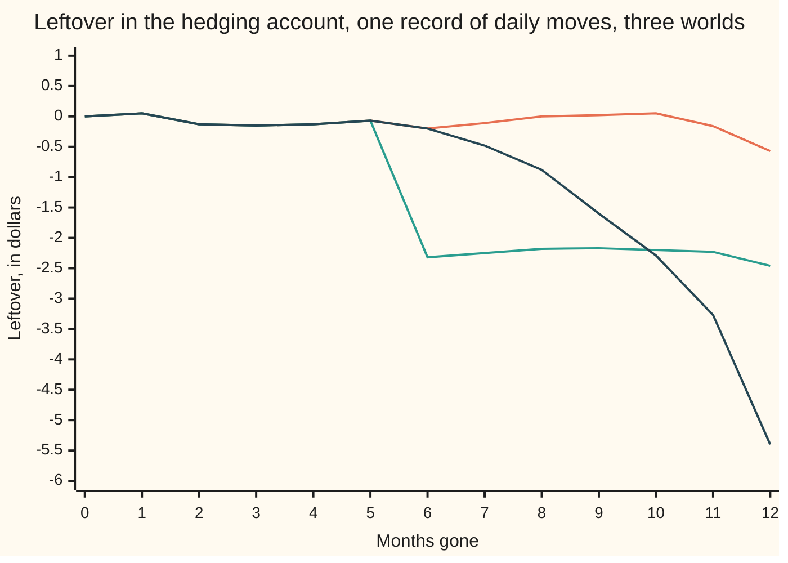
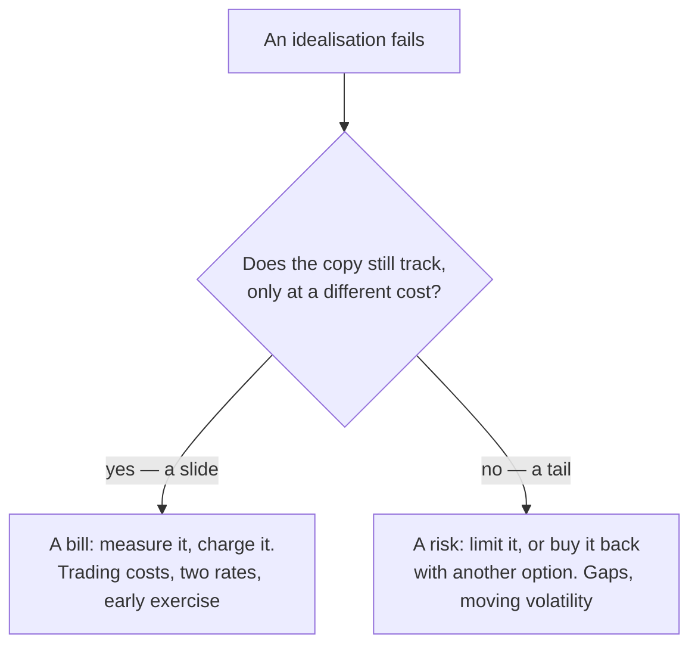

# The Black-Scholes assumptions: six idealisations, which term each holds up, and what breaks when it fails

[Syllabus](../../../SYLLABUS.md) → [Financial mathematics](../README.md) → [The Black-Scholes call and put](../README.md#s08) → The Black-Scholes assumptions

---

## General Overview

A dealer sells one Acme call and then does the work the price assumes. Acme trades at 100 dollars, the call may buy one share for 100 dollars in a year, and the model's premium is 9.23 dollars. The dealer takes the premium, buys 0.586851 of a share, borrows the shortfall, and adjusts that share count once a day for a year. On the last day the shares are sold and the call paid off. What is still in the account is the **leftover**: what the home-made copy made or lost against the contract it copied.

Run that ledger on 200 invented **records**, each a year of daily moves drawn from the model's own bell curve. With every idealisation met but one — the share count is reset daily, not continuously — the leftover averages two cents, and the typical distance from that average is 45 cents on a $9.23 contract. Now change one thing. Drop Acme 10% overnight in the middle of the year: the leftover averages −$1.06, worst −$2.84. Or leave the path unbroken and let Acme's jumpiness climb from 20% to 30% halfway through: −$2.11 on average, −$6.89 at worst.

The premium was never the claim. The claim is that the copy tracks, and six idealisations make it track. Each holds up a term of the formula, and each, dropped, leaves a leftover counted in dollars. Those counts come in two kinds: **bills**, charged for in advance, and **tails**, which no price repairs.

**Every assumption behind the Black-Scholes price is a condition on the hedge that copies the option, so a broken assumption shows up as a leftover in the hedger's account, priced in dollars.**

**What kind of fact this is:** a model — six statements about how a market behaves, adopted because they are useful, not because they are laws. Inside it sits one theorem, proved on this card in Why it works: the leftover is exactly the sum of the daily tracking errors, carried forward with interest.

### The picture: the leftover as the year runs



All three lines run on the same record of daily moves, so they run together through month five. Flattest: nothing broken but the daily reset, ending at −$0.57. Middle: a 10% overnight fall at month six, which drops the account in one step. Steepest: jumpiness of 30% from month six, bleeding a little more each day to −$5.40. One failure arrives at once, the other by instalments.

---

## The formula

Two formulas run this card. The first is the model premium, from [Black–Scholes call](01-black-scholes-call.md):

$$C = S\,e^{-qT}N(d_1) \;-\; K\,e^{-rT}N(d_2), \qquad d_1 = \frac{\ln(S/K) + (r - q + \tfrac12\sigma^2)T}{\sigma\sqrt{T}}, \qquad d_2 = d_1 - \sigma\sqrt{T}$$

**Read it aloud:** the premium is the opening balance sheet of a copy — buy this many shares, borrow that much cash, and the difference is what the copy costs to start.

That reading is literal: the copy opens by buying $\delta = e^{-qT}N(d_1) = 0.586851$ of a share and borrowing everything above the premium. Every idealisation here is a condition for that balance sheet to stay accurate to expiry.

The second formula is the ledger that tests it. Notation first, in words. Write $v$ for the same call formula applied to today's date and today's price, with the time left in place of $T$: the contract's **mark**. Write $\delta$ for the share count the mark prescribes, $V$ for the hedging account's worth, $h$ for one trading day as a fraction of a year, and $R = e^{rh}$ for one day's growth of a bank balance. Hold the mark's share count, keep the rest in the bank, and one day later

$$V_{i+1} = \delta_i S_{i+1} \;+\; (V_i - \delta_i S_i)\,R \;+\; \delta_i S_i\,(e^{qh} - 1), \qquad \text{leftover} = V_T - \max(S_T - K,\,0),$$

where a subscript counts days. In words: the bank balance earns a day's interest, the shares pay a day's dividend and are worth whatever tomorrow says, and on the last day the account settles the call and keeps the difference. The account starts at the premium, so a leftover of zero means the copy cost exactly what was charged for it.

| Symbol | Plain meaning | In our example | Push it up and the leftover… |
| --- | --- | --- | --- |
| $C$, $P$ | the model premium for the call, and for the put | $9.23 and $6.33 | — |
| $S$, $s$, $K$ | Acme's price, a price in general, and the **strike** it may be bought at | $100 and $100 | — |
| $T$, $t$, $h$, $R$ | the option's life, a date inside it, one trading day, a day's bank growth | 1, and 1/252 | — |
| $r$, $q$ | the bank rate, and the **dividend yield** the shares pay out | 5% and 2% | a second rate for borrowing opens a band |
| $\sigma$ | **volatility**, how jumpy Acme is taken to be. Say "sigma". | 20% marked, 30% in one world | delivered above the marked figure: the leftover goes negative |
| $N(x)$, $d_1$, $d_2$ | the **bell curve** area left of $x$, and the two points the formula weighs the share and the cash at | as on the call card | — |
| $\delta$ | **delta**: shares held per call sold, $e^{-qT}N(d_1)$ | 0.586851 | — |
| $\Gamma$, $\mathcal{B}$ | **gamma**, the bend: how fast delta itself moves, and the bill a gap pays for it | 0.018951, and $1.42 on the traced record | bigger bend, bigger bill for every gap |
| $V$, $v$, $E$, $D_i$ | the account's worth, the contract's mark, the surplus of one over the other, and one day's miss | $V$ and $v$ start at $9.23 | — |
| $J$ | an overnight **gap**: a jump in dollars with no chance to trade | −$10.64 on the traced record | bigger gap, a bill growing with its square |

### When it holds

Six idealisations. Each holds up a term of the formula; each failure is counted in dollars in Worked numbers.

- **Volatility is one known constant.** It holds up the single $\sigma$ inside $d_1$ and $d_2$. Deliver more than the marked figure and the copy was built too cheap.
- **The price never gaps: it visits every price on the way.** This is what allows $\delta$ to be used at all, a share count being a slope, and a slope right only for small moves. A jump is taken whole, with no chance to re-measure.
- **Trading is free, and possible at every instant.** This holds up the absence of any cost term. Reset the share count at a finite rate and the bend's bill arrives in lumps rather than smoothly; pay for each trade and the copy costs more than the formula says.
- **One interest rate, for borrowing and for lending alike.** This holds up the single $e^{-rT}$ and the single carry term. Two rates give two costs of carry, so the answer is a band rather than a price.
- **Moves are lognormal: the logarithm of the price is bell-curved.** This holds up $N(\cdot)$, which turns an average over possible prices into a formula. That curve rates a 10% down day at 8.38 standard deviations: 8.38 times a typical day's move.
- **European exercise: the option is used on the last day only.** This holds up reading the payoff at one date, which is what makes the answer a formula. An option that may be used earlier is worth at least as much, and no closed formula fits it.

Conventions verified 19 Sep 2026: 252 trading days is the usual count for a US equity year, and ten basis points — a tenth of one per cent of the value traded — is a round figure for a liquid single stock rather than a quoted standard.

---

## Why it works

### Step 0: the price is the cost of a copy, so every assumption is a condition on the copy

Nothing in the formula predicts Acme. The hedge argument says: hold the right number of shares against the option, the next small move cancels, the position is riskless, so it must earn the bank rate — and that alone fixes the price ([The Black-Scholes equation](07-black-scholes-equation.md)).

A price that is the cost of a recipe is right only if the kitchen behaves. So an idealisation is tested not by argument but by running the recipe in a world where it is false and counting the money left at the end.

### Step 1: each idealisation enters at one line of the derivation

1. The share drifts and takes random kicks in log space, with $\sigma$ fixed ([Geometric Brownian motion](../../11-Stochastic%20processes%20and%20calculus/05-Brownian%20Motion/07-geometric-brownian-motion.md)): lognormal moves and constant volatility, spent at once.
2. Itô's lemma turns that into the option's move, keeping terms as far as the bend. Dropping the rest is legitimate only because the moves are small: no gaps.
3. Holding $\delta$ shares cancels the randomness — if shares can be traded at that instant for nothing.
4. What is left must earn the bank rate, and there must be exactly one such rate.
5. Dividends arrive smoothly at rate $q$, so the hedge's shares carry a known income.
6. The payoff is read at expiry and nowhere else, supplying the equation's final condition.

Six lines, six conditions. This card prices each line's failure rather than redoing the derivation.

### Step 2: the leftover is the daily misses, carried forward

Call the **defect** of one day the amount by which the account's change misses the mark's change:

$$D_i = \delta_i(S_{i+1} - S_i) + \delta_i S_i(e^{qh} - 1) + (R - 1)(v_i - \delta_i S_i) - (v_{i+1} - v_i).$$

The first three pieces are what the account earned: the shares' move, their dividend, the interest on the cash. The last is what the mark did. A perfect copy would make the two agree, leaving $D_i$ at zero every day.

They never quite agree, and the misses accumulate with interest. Writing the account's running surplus over the mark as $E$,

$$E_{i+1} = R\,E_i + D_i, \qquad\text{so}\qquad E_T = \sum_i e^{r(T - t_{i+1})} D_i.$$

The mark on the last day is the payoff, so the final surplus is the leftover. That is an exact identity, not an approximation, and it is the line drawn in the picture above. The code reaches the leftover both ways — rolling the account forward, and summing the defects — and on all 600 runs the two agree to better than a ten-millionth of a dollar.

<details>
<summary>Detailed proof: the leftover is the day's defects, carried with interest</summary>

Collecting the ledger's terms in the account's worth gives
$$V_{i+1} = R\,V_i + \delta_i(S_{i+1} - R\,S_i) + \delta_i S_i(e^{qh} - 1).$$
Subtract $v_{i+1}$, then add and subtract $R\,v_i$:
$$E_{i+1} = R\,E_i + \Big[\delta_i(S_{i+1} - R\,S_i) + \delta_i S_i(e^{qh}-1) + (R-1)v_i - (v_{i+1} - v_i)\Big].$$
Writing $R\,S_i$ as $S_i + (R-1)S_i$ and collecting the $(R-1)$ terms turns the bracket into $D_i$. Rebalancing at the end of a day swaps shares for cash at one price, changing neither the account nor the surplus. Starting from a surplus of zero, iterating multiplies each day's defect by $R$ once for every day that follows it, which is $e^{r(T-t_{i+1})}$. At expiry the mark equals the payoff. No limit and no stochastic calculus is used: this is finite arithmetic on the prices that actually occurred.

</details>

### Step 3: a gap splits into a stale slope and a bill for the bend

A gap is a move with no chance to trade in the middle of it. Let $s$ be the price just before, $J$ the jump in dollars, $\delta_{\text{old}}$ the share count carried in from yesterday's mark, and $\delta_*$ the count the mark prescribes at $s$ right now. The gap's defect splits exactly:

$$D_{\text{gap}} = (\delta_{\text{old}} - \delta_*)\,J \;-\; \mathcal{B}, \qquad \mathcal{B} = v(t, s+J) - v(t, s) - \delta_* J.$$

The first piece prices a stale share count: yesterday's slope applied to today's jump. Its sign goes either way, and over 200 records it averages 0.001449 dollars, a seventh of a cent. The second, the bill for the bend, is the distance between the option's curve and its tangent — never negative, because that curve bends upward everywhere. On the traced record the two came to −$0.71 and $1.42.

Hedging more often shrinks the stale-slope term towards nothing, and does nothing at all to the bend's bill, which depends only on the size of the jump.

<details>
<summary>Detailed proof: a gap always bills the hedger for the bend</summary>

Fix a date before expiry and a price $s > 0$. On the segment from $s$ to $s+J$ the mark is twice differentiable and its second derivative, the bend $\Gamma$, is strictly positive. Put $f(u) = v(t, s + uJ)$ for $u$ between 0 and 1, so $f'(u) = J\,\delta(t, s+uJ)$ and $f''(u) = J^2\,\Gamma(t, s+uJ)$. Integrating twice, in the form $f(1) - f(0) - f'(0) = \int_0^1 (1-u) f''(u)\,du$, gives
$$\mathcal{B} = J^2 \int_0^1 (1-u)\,\Gamma(t, s+uJ)\,du \; \ge \; 0,$$
strictly positive whenever the jump is not zero, and growing with its square. Direction never enters: an upward gap bills the hedger of a short call exactly as a downward one does. Adding and subtracting $\delta_* J$ in the defect $\delta_{\text{old}}J - [v(t,s+J) - v(t,s)]$ gives the split above. The code checks the split to a billionth of a dollar on every record, and finds the bill positive on all 200.

</details>

### Step 4: two shapes of failure

A **slide** leaves the copy working and moves what it costs. Trading costs do this: ten basis points a trade adds $0.53, in proportion to the rate charged. So do a second funding rate and early exercise. A slide is a bill — measurable in advance, chargeable, passed on.

A **tail** breaks the copy, and no price repairs it. A gap does this: the average damage is $1.06, but the damage on any one occasion is whatever the jump turns out to be, squared. Charging more volatility lifts every record by the same premium, while the bill grows with the square of the jump, so no premium keeps pace. A tail wants a position limit, a different model, or a second option bought against the first.

Volatility that moves sits between the two. With hindsight it is a slide, landing close to the distance between two computable prices. In advance it is not, because tomorrow's volatility cannot be looked up — which is why it is quoted and traded instead.

The market takes a second route: rather than measure the failures, read them out of traded prices, where one volatility failing to fit every strike is the smile ([The volatility smile and skew](../12-The%20smile%20and%20the%20surface/01-volatility-smile-and-skew.md)).

---

## Worked numbers, by hand

Volatility is the sharpest of the six, because its cost needs no simulation at all. Acme is marked at 20%; in the switch world the year delivers 20% for six months, then 30%.

| Step | Arithmetic | Value |
| --- | --- | --- |
| variance the year delivers | $\tfrac12 \times 0.20^2 + \tfrac12 \times 0.30^2$ | $0.065$ |
| the whole year's volatility | $\sqrt{0.065}$ | $0.254951$ |
| the premium that volatility deserves | the same formula at 25.4951% | $\$11.311639$ |
| the premium actually charged | the house call at 20% | $\$9.227006$ |
| the gap between the two prices | $11.311639 - 9.227006$ | $\mathbf{\$2.084633}$ |
| the same from vega, the premium's gain per unit of volatility, over 5.4951 points of it | $37.901158 \times 0.054951$ | $\approx \$2.08$ |
| what 200 hedged records actually left | mean leftover, switch world | $\mathbf{-\$2.113681}$ |

The measured loss and the difference between two prices agree to three cents, inside the sampling error of 200 records. **Getting volatility wrong is not bad luck; the bill's size is the distance between two prices.** The hedge collects it unevenly, though: across the 200 records the spread is $1.56 and the worst record paid $6.89. The same arithmetic, reversed, pays the dealer who marks 20% into a quiet 10% year.

### What breaks if you drop a piece

Same option, same $9.23 premium, one idealisation dropped at a time.

| Dropped | Comes out at | What went wrong |
| --- | --- | --- |
| One constant volatility: 20% marked, 25.50% delivered | mean −$2.11, worst −$6.89 | $\sigma$ sets the width of the future, and the copy used the wrong one |
| No gaps: a 10% overnight fall at mid-year | mean −$1.06, worst −$2.84 | $\delta$ is a slope, and the curve pulls away from it over a big move |
| Continuous hedging: once a day instead | spread of $0.45 about a mean of $0.02, worst −$1.77 | the bend's bill arrives in lumps, not smoothly; Boyle-Emanuel puts the spread at $0.42 |
| Free trading: ten basis points a trade | $0.53 of bill, $0.47 of it rebalancing | the formula has nowhere to put a commission; Leland's form says $0.47 |
| One rate: borrow at 7%, lend at 3% | a band from $8.27 to $10.24, $1.98 wide | two rates give two costs of carry, so there is no one price |
| Lognormal moves: a 10% down day | 8.38 standard deviations, one per $10^{14}$ years | a bell curve on the log price leaves no room for a day markets keep having |
| European exercise: an American put instead | $6.66 against $6.33 | the payoff is no longer read at one date, so no closed formula fits |

The last row measures a put rather than the call: with Acme's dividend below the bank rate, exercising this call early gains almost nothing, while the put gains $0.33.

---

## How the leftover builds up through the year

A leftover accumulates through the year, and where it accumulates says which idealisation failed.

Take the traced record, the first of the 200 to finish within $5 of the strike. Acme ends at $102.33, the call pays $2.33, the account holds $1.76: a leftover of −$0.57. The same record ends far away in the other two worlds.

| Months gone | Every idealisation met | A 10% gap at month six | Jumpiness 30% from month six |
| --- | --- | --- | --- |
| 3 | −$0.15 | −$0.15 | −$0.15 |
| 6 | −$0.20 | −$2.32 | −$0.20 |
| 9 | $0.02 | −$2.17 | −$1.60 |
| 12 | −$0.57 | −$2.46 | −$5.40 |

At month six the gap column sits $2.12 below the first, exactly the gap's own defect, and afterwards the two run roughly parallel: past the shock, the hedge works again. The switch column loses nothing when volatility changes — the mark cannot see it — then bleeds every day for six months. One is an accident, the other a slow puncture.

Now the six failures side by side, on the same option.

```
Dollars on a $9.23 option, one broken idealisation at a time: an average loss, or, where there is no single loss, a spread or a band. One bar is about five cents.

20% marked, 25.50% delivered      ██████████████████████████████████████████  $2.11
borrowing at 7%, lending at 3%    ████████████████████████████████████████    $1.98
a 10% overnight fall at mid-year  █████████████████████                       $1.06
ten basis points a trade          ███████████                                 $0.53
hedging daily, not continuously   ████████                                    $0.42
an American put, not a European   ███████                                     $0.33
```

The longest bar is the one nobody can settle in advance: tomorrow's volatility. The second is not a loss at all but a range — what a single price becomes when there are two rates — and a dealer quotes it as a bid and an offer. Which shape a failure has is the triage that matters.



---

## Code, from first principles, and it actually runs

The code sells one call at the model premium and hedges it daily for a year, on 200 records of daily moves, in three worlds: every idealisation met, a 10% fall at mid-year, and volatility delivered at 30% from mid-year. Nothing is imported that already knows an answer — the bell-curve area is a series written out, the daily moves come from a generator written out, the American put from a tree. The leftover is reached twice on each of the 600 runs, and three closed forms are checked against the measurements: Boyle-Emanuel for the spread of the leftovers, Leland for the trading bill, and the distance between two Black-Scholes prices for the volatility switch. The opening share count is checked a second way too, by bumping the price a dollar either side.

### Python

```python
# The Black-Scholes assumptions -- the check behind the card.  Standard library only, and
# nothing imported that already knows an answer: the bell-curve area is a series written
# out here, the daily moves come from a generator written here, the American put is a
# tree.  Acme is the house market: S = K = 100, r = 5%, q = 2%, sigma = 20%, one year; one
# call is sold at the model premium and hedged 252 times, on 200 records, in three worlds.
from math import cos, exp, log, log10, pi, sin, sqrt
S0, STRIKE, RATE, Q, SIG, T, N = 100.0, 100.0, 0.05, 0.02, 0.20, 1.0, 252
MU, COST, H, RECS = 0.08, 0.001, 1.0 / 252, 200   # drift, 10bp a trade, a day, records
def phi(x):                                       # bell-curve height at x
    return exp(-0.5 * x * x) / sqrt(2.0 * pi)
def ncdf(x):                                      # the area to the LEFT of x
    a = abs(x)
    if a > 8.0:                                   # out here the tail is under 1e-15
        return 1.0 if x > 0.0 else 0.0
    term, tot, k = a, a, 1                        # a series, every term positive
    while term > 1e-19 * tot:
        term *= a * a / (2 * k + 1); tot += term; k += 1
    p = 0.5 + phi(a) * tot
    return p if x > 0.0 else 1.0 - p
def bs(s, k, r, q, sg, t):                        # call value and its share count
    if t <= 0.0:
        return max(s - k, 0.0), (1.0 if s > k else 0.0)
    a, drag = sg * sqrt(t), exp(-q * t)
    d1 = (log(s / k) + (r - q + 0.5 * sg * sg) * t) / a
    return s * drag * ncdf(d1) - k * exp(-r * t) * ncdf(d1 - a), drag * ncdf(d1)
def mark(t, s): return bs(s, STRIKE, RATE, Q, SIG, T - t)     # the mark, always 20%
def normals(seed, m):                             # own generator, then Box-Muller
    out, st = [], seed
    while len(out) < m:
        u = []
        for _ in range(2):
            st = (1664525 * st + 1013904223) % 4294967296
            u.append((st + 0.5) / 4294967296.0)
        rad, ang = sqrt(-2.0 * log(u[0])), 2.0 * pi * u[1]
        out += [rad * cos(ang), rad * sin(ang)]
    return out[:m]
def account(kind, z):
    """Hedge the sold call once a day, then settle it: what is left over?"""
    grow, paid = exp(RATE * H), exp(Q * H) - 1.0
    s, jump, month = S0, (0.0, 0.0, 0.0, 0.0), [0.0]
    v, d = mark(0.0, s)
    wealth, carried, bill, cash = v, 0.0, COST * abs(d) * s, v - d * s
    for i, zi in enumerate(z):
        vol = 0.30 if kind == "switch" and i >= N // 2 else SIG    # realised vol
        t, bank = (i + 1) * H, exp(RATE * (i + 1) * H)
        nxt = s * exp((MU - 0.5 * vol * vol) * H + vol * sqrt(H) * zi)
        income = d * s * paid                                      # the day's dividend
        vn, dn = mark(t, nxt)
        carried = grow * carried + d * (nxt - s) + income \
            + (grow - 1.0) * (v - d * s) - (vn - v)                # road 2: the defects
        wealth = d * nxt + cash * grow + income                    # road 1: the account
        if kind == "gap" and i + 1 == N // 2:                      # a 10% overnight gap
            after, j = 0.9 * nxt, -0.1 * nxt
            va, da = mark(t, after)
            jump = (j, (d - dn) * j, va - vn - dn * j, d * j - (va - vn))
            wealth += d * j; carried += jump[3]
            nxt, vn, dn = after, va, da
        bill += COST * abs(dn - d) * nxt / bank                    # the trading bill
        s, v, d = nxt, vn, dn
        cash = wealth - d * s
        if (i + 1) % 21 == 0: month.append(wealth - v)
    pay = max(s - STRIKE, 0.0)                    # the call is settled at expiry
    return s, wealth, pay, wealth - pay, carried, bill, jump, month
def tree_put(steps, american):                    # a CRR tree: an independent road
    dt, u = T / steps, exp(SIG * sqrt(T / steps))
    p, disc = (exp((RATE - Q) * dt) - 1.0 / u) / (u - 1.0 / u), exp(-RATE * dt)
    v = [max(STRIKE - S0 * u ** (2 * j - steps), 0.0) for j in range(steps + 1)]
    for st in range(steps, 0, -1):
        v = [disc * (p * v[j + 1] + (1.0 - p) * v[j]) for j in range(st)]
        if american:
            v = [max(v[j], STRIKE - S0 * u ** (2 * j - st + 1)) for j in range(st)]
    return v[0]
def stats(x):                                     # mean, spread, worst, best
    m = sum(x) / len(x); sq = sum((a - m) ** 2 for a in x) / (len(x) - 1)
    return m, sqrt(sq), min(x), max(x)
C0, D0 = bs(S0, STRIKE, RATE, Q, SIG, T)
P0 = C0 - S0 * exp(-Q * T) + STRIKE * exp(-RATE * T)       # the put, by parity
d1 = (log(S0 / STRIKE) + (RATE - Q + 0.5 * SIG * SIG) * T) / (SIG * sqrt(T))
GAMMA, VEGA = exp(-Q * T) * phi(d1) / (S0 * SIG * sqrt(T)), S0 * exp(-Q * T) * phi(d1)
KINDS, stream = ("matched", "gap", "switch"), normals(20260919, N * RECS)
runs = {k: [account(k, stream[N * i:N * (i + 1)]) for i in range(RECS)] for k in KINDS}
res = {k: stats([a[3] for a in runs[k]]) for k in KINDS}
traced = min(i for i, a in enumerate(runs["matched"]) if abs(a[0] - STRIKE) <= 5.0)
BE, bill = sqrt(pi / (4.0 * N)) * VEGA * SIG, stats([a[5] for a in runs["matched"]])
lel = SIG * sqrt(1.0 + sqrt(2.0 / pi) * 2.0 * COST / (SIG * sqrt(H)))     # Leland's vol
leland, rms = bs(S0, STRIKE, RATE, Q, lel, T)[0] - C0, sqrt(0.5 * SIG * SIG + 0.5 * 0.09)
rms_c = bs(S0, STRIKE, RATE, Q, rms, T)[0]        # the switch world's whole-year price
stale, bend = stats([a[6][1] for a in runs["gap"]]), stats([a[6][2] for a in runs["gap"]])
sd_day = (log(0.9) - (MU - 0.5 * SIG * SIG) * H) / (SIG * sqrt(H))    # a 10% fall, in sd
p_day = phi(sd_day) / -sd_day * (1.0 - 1.0 / sd_day ** 2 + 3.0 / sd_day ** 4)  # Mills
borrow, lend = bs(S0, STRIKE, 0.07, Q, SIG, T)[0], bs(S0, STRIKE, 0.03, Q, SIG, T)[0]
eu, am = tree_put(1200, False), tree_put(1200, True)
print(f"Acme house market: S = K = 100, r = 5%, q = 2%, sigma = 20%, T = 1 year;"
      f" {N} daily hedges, {RECS} records, real drift 8% a year")
print(f"  call C {C0:.6f}  put by parity P {P0:.6f}  delta {D0:.6f}"
      f"  gamma {GAMMA:.6f}  vega {VEGA:.6f}")
print(f"leftover after settling, over {RECS} records:")
for k in KINDS:
    print(f"  {k:<8} mean {res[k][0]:>10.6f}  spread {res[k][1]:>9.6f}"
          f"  worst {res[k][2]:>10.6f}  best {res[k][3]:>10.6f}")
print(f"record {traced} is the first to finish within $5 of the strike:")
for k in KINDS:
    s, w, pay, left, car, b, jump, month = runs[k][traced]
    print(f"  {k:<8} stock {s:>10.6f}  account {w:>10.6f}  call pays {pay:>9.6f}"
          f"  leftover {left:>10.6f}  carried defects {car:>10.6f}")
j = runs["gap"][traced][6]
print(f"  its gap: stock moved {j[0]:.6f}, stale-delta term {j[1]:.6f},"
      f" bend's bill {j[2]:.6f}, together {j[3]:.6f}")
print("what one broken assumption costs, on the same option:")
print(f"  1 vol switched to 30%: the whole year's volatility {rms:.6f}, the right"
      f" premium {rms_c:.6f}, dearer than 9.227006 by {rms_c - C0:.6f}")
print(f"  2 the 10% gap: bend's bill, mean {bend[0]:.6f}, largest {bend[3]:.6f};"
      f" stale-delta term, mean {stale[0]:.6f}")
print(f"  3 daily, not continuous: Boyle-Emanuel spread {BE:.6f}; at 10bp a trade the"
      f" bill is {bill[0]:.6f}, less the opening purchase {bill[0] - COST * D0 * S0:.6f},"
      f" against Leland's {leland:.6f}")
print(f"  4 two rates: borrowing at 7% {borrow:.6f}, lending at 3% {lend:.6f},"
      f" band {borrow - lend:.6f} wide")
print(f"  5 lognormal moves: a 10% down day is {-sd_day:.6f} standard deviations, chance"
      f" 10^{log10(p_day):.3f}, one such day per 10^{-log10(p_day * N):.3f} years")
print(f"  6 European exercise: the put on a 1200-step tree {eu:.6f}, the American"
      f" {am:.6f}, early exercise worth {am - eu:.6f}")
print(f"bars, dollars on a $9.23 option: vol switch {-res['switch'][0]:.2f}, gap"
      f" {-res['gap'][0]:.2f}, daily not continuous {BE:.2f}, trading at 10bp"
      f" {bill[0]:.2f}, funding band {borrow - lend:.2f}, early exercise {am - eu:.2f}")
print(f"{'chart, months gone':<26}" + "".join(f"{i:>7d}" for i in range(13)))
for k in KINDS:
    print(f"{'chart, ' + k:<26}" + "".join(f"{v:>7.2f}" for v in runs[k][traced][7]))
assert abs(C0 - 9.227005508154) < 1e-9, "the call against the house number"
assert abs(D0 - 0.5 * (mark(0.0, 101.0)[0] - mark(0.0, 99.0)[0])) < 1e-3, "delta by a bump"
assert abs(eu - P0) < 0.01, "the tree must reproduce the put, 6.330081"
assert am > eu + 0.05, "early exercise must be worth something"
assert all(abs(a[3] - a[4]) < 1e-7 for k in KINDS for a in runs[k]), "account vs defects"
assert bend[2] > 0.0, "a gap costs the hedger whichever way it goes"
assert all(abs(a[6][3] - a[6][1] + a[6][2]) < 1e-9 for a in runs["gap"]), "each gap splits"
assert abs(res["matched"][1] / BE - 1.0) < 0.15, "the spread against Boyle-Emanuel"
assert abs(res["matched"][0]) < 4.0 * res["matched"][1] / sqrt(RECS), "daily is unbiased"
assert abs(-res["switch"][0] / (rms_c - C0) - 1.0) < 0.10, "the loss against the price gap"
assert abs((bill[0] - COST * D0 * S0) / leland - 1.0) < 0.15, "the bill against Leland"
print("ALL CHECKS PASS")
```

**Ran 2026-09-19 on macOS, Python 3.14.6, standard library only. All checks passed. Output, pasted from the run:**

```
Acme house market: S = K = 100, r = 5%, q = 2%, sigma = 20%, T = 1 year; 252 daily hedges, 200 records, real drift 8% a year
  call C 9.227006  put by parity P 6.330081  delta 0.586851  gamma 0.018951  vega 37.901158
leftover after settling, over 200 records:
  matched  mean   0.022788  spread  0.447858  worst  -1.765596  best   1.045455
  gap      mean  -1.063773  spread  0.640844  worst  -2.838422  best   0.281741
  switch   mean  -2.113681  spread  1.562735  worst  -6.889653  best   0.158396
record 8 is the first to finish within $5 of the strike:
  matched  stock 102.326160  account   1.755549  call pays  2.326160  leftover  -0.570610  carried defects  -0.570610
  gap      stock  92.093544  account  -2.456736  call pays  0.000000  leftover  -2.456736  carried defects  -2.456736
  switch   stock  97.621125  account  -5.396118  call pays  0.000000  leftover  -5.396118  carried defects  -5.396118
  its gap: stock moved -10.641092, stale-delta term -0.705829, bend's bill 1.416922, together -2.122750
what one broken assumption costs, on the same option:
  1 vol switched to 30%: the whole year's volatility 0.254951, the right premium 11.311639, dearer than 9.227006 by 2.084633
  2 the 10% gap: bend's bill, mean 1.021467, largest 1.452217; stale-delta term, mean 0.001449
  3 daily, not continuous: Boyle-Emanuel spread 0.423182; at 10bp a trade the bill is 0.531372, less the opening purchase 0.472687, against Leland's 0.465906
  4 two rates: borrowing at 7% 10.243648, lending at 3% 8.266328, band 1.977320 wide
  5 lognormal moves: a 10% down day is 8.381630 standard deviations, chance 10^-16.583, one such day per 10^14.182 years
  6 European exercise: the put on a 1200-step tree 6.328461, the American 6.659914, early exercise worth 0.331453
bars, dollars on a $9.23 option: vol switch 2.11, gap 1.06, daily not continuous 0.42, trading at 10bp 0.53, funding band 1.98, early exercise 0.33
chart, months gone              0      1      2      3      4      5      6      7      8      9     10     11     12
chart, matched               0.00   0.05  -0.13  -0.15  -0.13  -0.07  -0.20  -0.11   0.00   0.02   0.05  -0.16  -0.57
chart, gap                   0.00   0.05  -0.13  -0.15  -0.13  -0.07  -2.32  -2.25  -2.18  -2.17  -2.20  -2.23  -2.46
chart, switch                0.00   0.05  -0.13  -0.15  -0.13  -0.07  -0.20  -0.48  -0.88  -1.60  -2.29  -3.27  -5.40
ALL CHECKS PASS
```

### Rust

Same ledger, same generator, same labels, built with `rustc --edition 2021 -O`.

```rust
// The Black-Scholes assumptions -- the same check as the Python, in Rust.  No crates, std
// only, and nothing that already knows an answer: the bell-curve area is the same series,
// the daily moves come from the same generator, the American put is the same tree.  Acme
// is the house market: S = K = 100, r = 5%, q = 2%, sigma = 20%, one year; one call is
// sold at the model premium and hedged 252 times, on 200 records, in three worlds.
use std::f64::consts::PI;
const S0: f64 = 100.0; const STRIKE: f64 = 100.0; const RATE: f64 = 0.05;
const Q: f64 = 0.02; const SIG: f64 = 0.20; const T: f64 = 1.0; const N: usize = 252;
const MU: f64 = 0.08; const COST: f64 = 0.001; const H: f64 = 1.0 / 252.0;   // drift, 10bp, a day
const RECS: usize = 200;                          // records of 252 daily moves
const KINDS: [&str; 3] = ["matched", "gap", "switch"];
fn phi(x: f64) -> f64 { (-0.5 * x * x).exp() / (2.0 * PI).sqrt() }   // bell-curve height
fn ncdf(x: f64) -> f64 {                          // the area to the LEFT of x
    let a = x.abs();
    if a > 8.0 { return if x > 0.0 { 1.0 } else { 0.0 }; }  // the tail here is under 1e-15
    let (mut term, mut tot, mut k) = (a, a, 1.0);           // a series, all terms positive
    while term > 1e-19 * tot { term *= a * a / (2.0 * k + 1.0); tot += term; k += 1.0; }
    let p = 0.5 + phi(a) * tot;
    if x > 0.0 { p } else { 1.0 - p }
}
fn bs(s: f64, k: f64, r: f64, q: f64, sg: f64, t: f64) -> (f64, f64) {
    if t <= 0.0 { return ((s - k).max(0.0), if s > k { 1.0 } else { 0.0 }); }
    let (a, drag) = (sg * t.sqrt(), (-q * t).exp());        // value, and its share count
    let d1 = ((s / k).ln() + (r - q + 0.5 * sg * sg) * t) / a;
    (s * drag * ncdf(d1) - k * (-r * t).exp() * ncdf(d1 - a), drag * ncdf(d1))
}
fn mark(t: f64, s: f64) -> (f64, f64) { bs(s, STRIKE, RATE, Q, SIG, T - t) }  // always 20%
fn normals(seed: u64, m: usize) -> Vec<f64> {     // own generator, then Box-Muller
    let (mut out, mut st) = (Vec::new(), seed);
    while out.len() < m {
        let mut u = [0.0f64; 2];
        for slot in u.iter_mut() {
            st = (1664525 * st + 1013904223) % 4294967296;
            *slot = (st as f64 + 0.5) / 4294967296.0;
        }
        let (rad, ang) = ((-2.0 * u[0].ln()).sqrt(), 2.0 * PI * u[1]);
        out.push(rad * ang.cos()); out.push(rad * ang.sin());
    }
    out.truncate(m); out
}
struct Run { s: f64, wealth: f64, pay: f64, left: f64, carried: f64, bill: f64,
             jump: [f64; 4], month: Vec<f64> }
fn account(kind: &str, z: &[f64]) -> Run {
    // Hedge the sold call once a day, then settle it: what is left over?
    let (grow, paid) = ((RATE * H).exp(), (Q * H).exp() - 1.0);
    let (mut s, mut jump, mut month) = (S0, [0.0; 4], vec![0.0]);
    let (mut v, mut d) = mark(0.0, s);
    let (mut wealth, mut carried, mut bill, mut cash) = (v, 0.0, COST * d.abs() * s, v - d * s);
    for (i, zi) in z.iter().enumerate() {
        let vol = if kind == "switch" && i >= N / 2 { 0.30 } else { SIG };   // realised vol
        let (t, bank) = ((i + 1) as f64 * H, (RATE * (i + 1) as f64 * H).exp());
        let mut nxt = s * ((MU - 0.5 * vol * vol) * H + vol * H.sqrt() * zi).exp();
        let income = d * s * paid;                                 // the day's dividend
        let (mut vn, mut dn) = mark(t, nxt);
        carried = grow * carried + d * (nxt - s) + income
            + (grow - 1.0) * (v - d * s) - (vn - v);               // road 2: the defects
        wealth = d * nxt + cash * grow + income;                   // road 1: the account
        if kind == "gap" && i + 1 == N / 2 {                       // a 10% overnight gap
            let (after, j) = (0.9 * nxt, -0.1 * nxt);
            let (va, da) = mark(t, after);
            jump = [j, (d - dn) * j, va - vn - dn * j, d * j - (va - vn)];
            wealth += d * j; carried += jump[3];
            nxt = after; vn = va; dn = da;
        }
        bill += COST * (dn - d).abs() * nxt / bank;                // the trading bill
        s = nxt; v = vn; d = dn;
        cash = wealth - d * s;
        if (i + 1) % 21 == 0 { month.push(wealth - v); }
    }
    let pay = (s - STRIKE).max(0.0);              // the call is settled at expiry
    Run { s, wealth, pay, left: wealth - pay, carried, bill, jump, month }
}
fn tree_put(steps: usize, american: bool) -> f64 {   // a CRR tree: an independent road
    let (dt, u) = (T / steps as f64, (SIG * (T / steps as f64).sqrt()).exp());
    let (p, disc) = ((((RATE - Q) * dt).exp() - 1.0 / u) / (u - 1.0 / u), (-RATE * dt).exp());
    let mut v: Vec<f64> = (0..=steps).map(|j| (STRIKE - S0 * u.powi(2 * j as i32 - steps as i32)).max(0.0)).collect();
    for st in (1..=steps).rev() {
        v = (0..st).map(|j| disc * (p * v[j + 1] + (1.0 - p) * v[j])).collect();
        if american {
            v = (0..st).map(|j| v[j].max(STRIKE - S0 * u.powi(2 * j as i32 - st as i32 + 1))).collect();
        }
    }
    v[0]
}
fn stats(x: &[f64]) -> (f64, f64, f64, f64) {     // mean, spread, worst, best
    let m = x.iter().sum::<f64>() / x.len() as f64;
    let sq = x.iter().map(|a| (a - m) * (a - m)).sum::<f64>() / (x.len() - 1) as f64;
    (m, sq.sqrt(), x.iter().copied().fold(f64::INFINITY, f64::min), x.iter().copied().fold(f64::NEG_INFINITY, f64::max))
}
fn main() {
    let (c0, d0) = bs(S0, STRIKE, RATE, Q, SIG, T);
    let p0 = c0 - S0 * (-Q * T).exp() + STRIKE * (-RATE * T).exp();    // the put, by parity
    let d1 = ((S0 / STRIKE).ln() + (RATE - Q + 0.5 * SIG * SIG) * T) / (SIG * T.sqrt());
    let gamma = (-Q * T).exp() * phi(d1) / (S0 * SIG * T.sqrt());
    let vega = S0 * (-Q * T).exp() * phi(d1);
    let stream = normals(20260919, N * RECS);
    let runs: Vec<Vec<Run>> = KINDS.iter()
        .map(|k| (0..RECS).map(|i| account(k, &stream[N * i..N * (i + 1)])).collect()).collect();
    let res: Vec<(f64, f64, f64, f64)> = (0..3)
        .map(|c| stats(&runs[c].iter().map(|a| a.left).collect::<Vec<f64>>())).collect();
    let traced = (0..RECS).find(|&i| (runs[0][i].s - STRIKE).abs() <= 5.0).unwrap();
    let be = (PI / (4.0 * N as f64)).sqrt() * vega * SIG;      // Boyle-Emanuel, closed form
    let bill = stats(&runs[0].iter().map(|a| a.bill).collect::<Vec<f64>>());
    let lel = SIG * (1.0 + (2.0 / PI).sqrt() * 2.0 * COST / (SIG * H.sqrt())).sqrt();
    let leland = bs(S0, STRIKE, RATE, Q, lel, T).0 - c0;
    let rms = (0.5 * SIG * SIG + 0.5 * 0.09f64).sqrt();   // the switch world's whole year
    let rms_c = bs(S0, STRIKE, RATE, Q, rms, T).0;
    let stale = stats(&runs[1].iter().map(|a| a.jump[1]).collect::<Vec<f64>>());
    let bend = stats(&runs[1].iter().map(|a| a.jump[2]).collect::<Vec<f64>>());
    let sd_day = (0.9f64.ln() - (MU - 0.5 * SIG * SIG) * H) / (SIG * H.sqrt());
    let p_day = phi(sd_day) / -sd_day * (1.0 - 1.0 / (sd_day * sd_day) + 3.0 / sd_day.powi(4));
    let borrow = bs(S0, STRIKE, 0.07, Q, SIG, T).0;
    let lend = bs(S0, STRIKE, 0.03, Q, SIG, T).0;
    let (eu, am) = (tree_put(1200, false), tree_put(1200, true));
    println!("Acme house market: S = K = 100, r = 5%, q = 2%, sigma = 20%, T = 1 year; {} \
daily hedges, {} records, real drift 8% a year", N, RECS);
    println!("  call C {:.6}  put by parity P {:.6}  delta {:.6}  gamma {:.6}  vega {:.6}", c0, p0, d0, gamma, vega);
    println!("leftover after settling, over {} records:", RECS);
    for c in 0..3 {
        println!("  {:<8} mean {:>10.6}  spread {:>9.6}  worst {:>10.6}  best {:>10.6}",
                 KINDS[c], res[c].0, res[c].1, res[c].2, res[c].3);
    }
    println!("record {} is the first to finish within $5 of the strike:", traced);
    for c in 0..3 {
        let a = &runs[c][traced];
        println!("  {:<8} stock {:>10.6}  account {:>10.6}  call pays {:>9.6}  leftover \
{:>10.6}  carried defects {:>10.6}",
                 KINDS[c], a.s, a.wealth, a.pay, a.left, a.carried);
    }
    let j = runs[1][traced].jump;
    println!("  its gap: stock moved {:.6}, stale-delta term {:.6}, bend's bill {:.6}, together {:.6}", j[0], j[1], j[2], j[3]);
    println!("what one broken assumption costs, on the same option:");
    println!("  1 vol switched to 30%: the whole year's volatility {:.6}, the right premium {:.6}, dearer than 9.227006 by {:.6}",
             rms, rms_c, rms_c - c0);
    println!("  2 the 10% gap: bend's bill, mean {:.6}, largest {:.6}; stale-delta term, mean {:.6}",
             bend.0, bend.3, stale.0);
    println!("  3 daily, not continuous: Boyle-Emanuel spread {:.6}; at 10bp a trade the \
bill is {:.6}, less the opening purchase {:.6}, against Leland's {:.6}",
             be, bill.0, bill.0 - COST * d0 * S0, leland);
    println!("  4 two rates: borrowing at 7% {:.6}, lending at 3% {:.6}, band {:.6} wide", borrow, lend, borrow - lend);
    println!("  5 lognormal moves: a 10% down day is {:.6} standard deviations, chance 10^{:.3}, one such day per 10^{:.3} years",
             -sd_day, p_day.log10(), -(p_day * N as f64).log10());
    println!("  6 European exercise: the put on a 1200-step tree {:.6}, the American {:.6}, early exercise worth {:.6}",
             eu, am, am - eu);
    println!("bars, dollars on a $9.23 option: vol switch {:.2}, gap {:.2}, daily not \
continuous {:.2}, trading at 10bp {:.2}, funding band {:.2}, early exercise {:.2}",
             -res[2].0, -res[1].0, be, bill.0, borrow - lend, am - eu);
    let mut line = format!("{:<26}", "chart, months gone");
    for i in 0..13 { line.push_str(&format!("{:>7}", i)); }
    println!("{}", line);
    for c in 0..3 {
        let mut line = format!("{:<26}", format!("chart, {}", KINDS[c]));
        for v in &runs[c][traced].month { line.push_str(&format!("{:>7.2}", v)); }
        println!("{}", line);
    }
    assert!((c0 - 9.227005508154).abs() < 1e-9, "the call against the house number");
    assert!((d0 - 0.5 * (mark(0.0, 101.0).0 - mark(0.0, 99.0).0)).abs() < 1e-3, "delta by a bump");
    assert!((eu - p0).abs() < 0.01, "the tree must reproduce the put, 6.330081");
    assert!(am > eu + 0.05, "early exercise must be worth something");
    assert!(runs.iter().flatten().all(|a| (a.left - a.carried).abs() < 1e-7), "account vs defects");
    assert!(bend.2 > 0.0, "a gap costs the hedger whichever way it goes");
    assert!(runs[1].iter().all(|a| (a.jump[3] - a.jump[1] + a.jump[2]).abs() < 1e-9), "each gap splits");
    assert!((res[0].1 / be - 1.0).abs() < 0.15, "the spread against Boyle-Emanuel");
    assert!(res[0].0.abs() < 4.0 * res[0].1 / (RECS as f64).sqrt(), "daily is unbiased");
    assert!((-res[2].0 / (rms_c - c0) - 1.0).abs() < 0.10, "the loss against the price gap");
    assert!(((bill.0 - COST * d0 * S0) / leland - 1.0).abs() < 0.15, "the bill against Leland");
    println!("ALL CHECKS PASS");
}
```

**Ran 2026-09-19 on macOS, rustc 1.98.1, no crates. All checks passed. Output, pasted from the run:**

```
Acme house market: S = K = 100, r = 5%, q = 2%, sigma = 20%, T = 1 year; 252 daily hedges, 200 records, real drift 8% a year
  call C 9.227006  put by parity P 6.330081  delta 0.586851  gamma 0.018951  vega 37.901158
leftover after settling, over 200 records:
  matched  mean   0.022788  spread  0.447858  worst  -1.765596  best   1.045455
  gap      mean  -1.063773  spread  0.640844  worst  -2.838422  best   0.281741
  switch   mean  -2.113681  spread  1.562735  worst  -6.889653  best   0.158396
record 8 is the first to finish within $5 of the strike:
  matched  stock 102.326160  account   1.755549  call pays  2.326160  leftover  -0.570610  carried defects  -0.570610
  gap      stock  92.093544  account  -2.456736  call pays  0.000000  leftover  -2.456736  carried defects  -2.456736
  switch   stock  97.621125  account  -5.396118  call pays  0.000000  leftover  -5.396118  carried defects  -5.396118
  its gap: stock moved -10.641092, stale-delta term -0.705829, bend's bill 1.416922, together -2.122750
what one broken assumption costs, on the same option:
  1 vol switched to 30%: the whole year's volatility 0.254951, the right premium 11.311639, dearer than 9.227006 by 2.084633
  2 the 10% gap: bend's bill, mean 1.021467, largest 1.452217; stale-delta term, mean 0.001449
  3 daily, not continuous: Boyle-Emanuel spread 0.423182; at 10bp a trade the bill is 0.531372, less the opening purchase 0.472687, against Leland's 0.465906
  4 two rates: borrowing at 7% 10.243648, lending at 3% 8.266328, band 1.977320 wide
  5 lognormal moves: a 10% down day is 8.381630 standard deviations, chance 10^-16.583, one such day per 10^14.182 years
  6 European exercise: the put on a 1200-step tree 6.328461, the American 6.659914, early exercise worth 0.331453
bars, dollars on a $9.23 option: vol switch 2.11, gap 1.06, daily not continuous 0.42, trading at 10bp 0.53, funding band 1.98, early exercise 0.33
chart, months gone              0      1      2      3      4      5      6      7      8      9     10     11     12
chart, matched               0.00   0.05  -0.13  -0.15  -0.13  -0.07  -0.20  -0.11   0.00   0.02   0.05  -0.16  -0.57
chart, gap                   0.00   0.05  -0.13  -0.15  -0.13  -0.07  -2.32  -2.25  -2.18  -2.17  -2.20  -2.23  -2.46
chart, switch                0.00   0.05  -0.13  -0.15  -0.13  -0.07  -0.20  -0.48  -0.88  -1.60  -2.29  -3.27  -5.40
ALL CHECKS PASS
```

The two outputs match line for line: each language writes its own copy of the same series and the same generator, so the same 200 records come out of both.

> [!TIP]
> **Try changing**
> Guess the direction first, then run it.
> - **Hedge four times a day.** Set `H` to `1.0 / 1008` and `N` to `1008`. The closed forms answer in advance: the spread falls like one over the square root of the count, roughly half of $0.42, while Leland's bill grows like the square root, roughly twice $0.47. No rebalancing rate makes both small.
> - **Gap upwards instead.** Replace `0.9 * nxt, -0.1 * nxt` with `1.1 * nxt, 0.1 * nxt`, so the new price and the jump still agree. Does the hedger now win? No: the bend's bill is positive whichever way the price jumps, as Step 3 proves, and only the stale-slope term changes sign.
> - **Switch volatility down, not up.** Replace the `0.30` in `account` with `0.10`. The leftover turns positive, by about the distance between two prices — the step table run at 10%, a smaller distance the other way — and the assert pinned to the switch world's loss stops the program.
> - **Charge one basis point instead of ten.** Set `COST` to `0.0001`. The measured bill is the rate times a fixed list of trades, so it falls to exactly a tenth of the printed figure. Leland's closed form holds the rate inside a square root, so it falls by a shade less; at this size the two roads still agree, and only a heavy cost pulls them apart.

---

## The usual mistake

> [!warning]
> **Reading the list as a disclaimer instead of a specification.** Almost everyone can recite that Black-Scholes assumes constant volatility and no jumps, then uses the price anyway and considers the duty discharged. The list is not a warning label on a number: it is the specification of the hedge the price is the cost of, and every idealisation that fails is a job the formula has quietly handed back.
>
> - **Treating a tail as a slide.** Trading costs move the answer by a knowable $0.53, and the fix is to charge it. A gap moves the average by $1.06 and the worst record by $2.84, and no charge fixes that. "Add a bit for gap risk" is how a book ends up short something it cannot get out of.
> - **Believing the average.** An average leftover of −$1.06 reads like a cost of doing business. The distribution behind it reaches −$2.84 on this modest stress, and it grows with the square of the jump.
> - **Hedging harder instead of differently.** Rebalancing more often shrinks the ordinary leftover's spread, $0.42 at daily, and shrinks the stale-slope part of a gap, already under a cent on average. It does nothing to the bend's bill, $1.02 on average at any rate.
> - **Taking the price and skipping the hedge.** The output is not only $9.23; it is "hold 0.586851 shares and adjust". Without the hedge none of the reasoning above applies: the premium is not the cost of a copy but the stake in a bet, and Acme's direction — the one thing the model cancels — becomes everything.

---

## Where you meet it in real life

- **Quoting in volatility.** Desks run the formula backwards, price in and $\sigma$ out, precisely because the assumptions fail in known ways: it survives as a common language, not a truth claim. See [Implied volatility](../11-Implied%20volatility%20and%20the%20vanilla%20inverses/01-implied-volatility.md).
- **The smile.** One volatility cannot fit every strike, and that refusal is the first idealisation failing in public, every day: [The volatility smile and skew](../12-The%20smile%20and%20the%20surface/01-volatility-smile-and-skew.md).
- **Overnight risk limits.** A desk's cap on how short it may be in one name near an earnings date exists because of the bend's bill, not the average.
- **Model risk review.** A validation team asks what this card measures: which assumption is this book short, and what does it cost when it fails. See [Model risk](../07-Greeks%20by%20Numbers%20and%20Calibration/07-model-risk-and-parameter-stability.md).
- **Funding spreads.** A dealer borrowing above the rate at which cash is lent quotes a bid and an offer, not a price; this card's band is the arithmetic behind that spread.

> **Say it back**
> Black-Scholes prices an option at the cost of copying it with shares and cash, so its assumptions are conditions on the copy, not decoration. Six of them: one constant volatility, no gaps, free continuous trading, one interest rate, lognormal moves, exercise at expiry only. Break one and the copy leaves a leftover in the hedger's account, which can be counted: $2.11 for a volatility switch, $1.06 for a 10% gap, $0.53 for ten basis points of trading, $1.98 of funding band, $0.33 for early exercise. Some are bills to charge for; a gap is a tail, and no price repairs it. The leftover is the daily misses carried forward with interest, which is why it can be attributed day by day.

---

## What this builds on

- [The Black-Scholes equation](07-black-scholes-equation.md): the derivation whose six lines each spend one of the idealisations measured here.
- [Put-call parity](03-put-call-parity.md): how the put in the code comes from the call, which is what the tree is checked against.
- [Geometric Brownian motion](../../11-Stochastic%20processes%20and%20calculus/05-Brownian%20Motion/07-geometric-brownian-motion.md): the engine behind two of the idealisations, lognormal moves and one constant volatility.

## Where this goes next

Each failure measured here has its repair elsewhere in this wing.

- [Black-Scholes by hedging](../05-Black-Scholes%20from%20the%20Ground%20Up/03-black-scholes-by-delta-hedging.md): the continuous version of this ledger, where the leftover vanishes exactly.
- [Gamma](../09-The%20Greeks%2C%20one%20each/02-gamma.md): the bend every gap is billed for, on its own card.
- [Model risk](../07-Greeks%20by%20Numbers%20and%20Calibration/07-model-risk-and-parameter-stability.md): what to do about a parameter that will not hold still.
- [Implied volatility](../11-Implied%20volatility%20and%20the%20vanilla%20inverses/01-implied-volatility.md): the formula run backwards, which is how the market states its disagreement with it.
- [The volatility smile and skew](../12-The%20smile%20and%20the%20surface/01-volatility-smile-and-skew.md): one volatility per strike, the market's own correction to the first idealisation.

Every measurement here used one number, 20%, marked for a whole year; what the market quotes instead, and how a volatility is read out of each traded price, is where the next shelves start.

---

## Sources

Verified 19 Sep 2026: every link below resolves to the publisher's page.

- Black, Fischer, and Myron Scholes. "The Pricing of Options and Corporate Liabilities." *Journal of Political Economy* 81, no. 3 (1973): 637–654. [doi:10.1086/260062](https://doi.org/10.1086/260062). Lists the idealisations on its opening pages, as conditions on the hedge.
- Merton, Robert C. "Option Pricing When Underlying Stock Returns Are Discontinuous." *Journal of Financial Economics* 3, nos. 1–2 (1976): 125–144. [doi:10.1016/0304-405X(76)90022-2](https://doi.org/10.1016/0304-405X(76)90022-2). What gaps do to a hedge: shares alone cannot copy an option once jumps exist.
- Boyle, Phelim P., and David Emanuel. "Discretely Adjusted Option Hedges." *Journal of Financial Economics* 8, no. 3 (1980): 259–282. [doi:10.1016/0304-405X(80)90003-3](https://doi.org/10.1016/0304-405X(80)90003-3). The closed form for the spread of the leftover under finitely many adjustments, checked in the code.
- Leland, Hayne E. "Option Pricing and Replication with Transactions Costs." *Journal of Finance* 40, no. 5 (1985): 1283–1301. [doi:10.1111/j.1540-6261.1985.tb02383.x](https://doi.org/10.1111/j.1540-6261.1985.tb02383.x). The adjusted-volatility formula for a trading cost, checked in the code.
- Cox, John C., Stephen A. Ross, and Mark Rubinstein. "Option Pricing: A Simplified Approach." *Journal of Financial Economics* 7, no. 3 (1979): 229–263. [doi:10.1016/0304-405X(79)90015-1](https://doi.org/10.1016/0304-405X(79)90015-1). The tree used here for the American put against the European.
