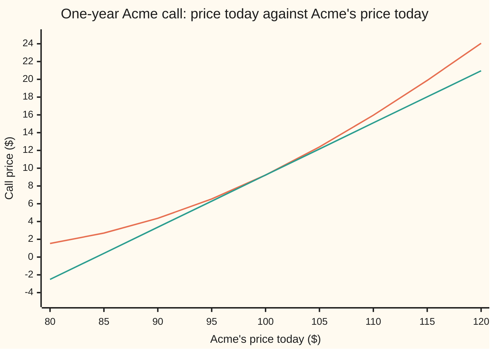
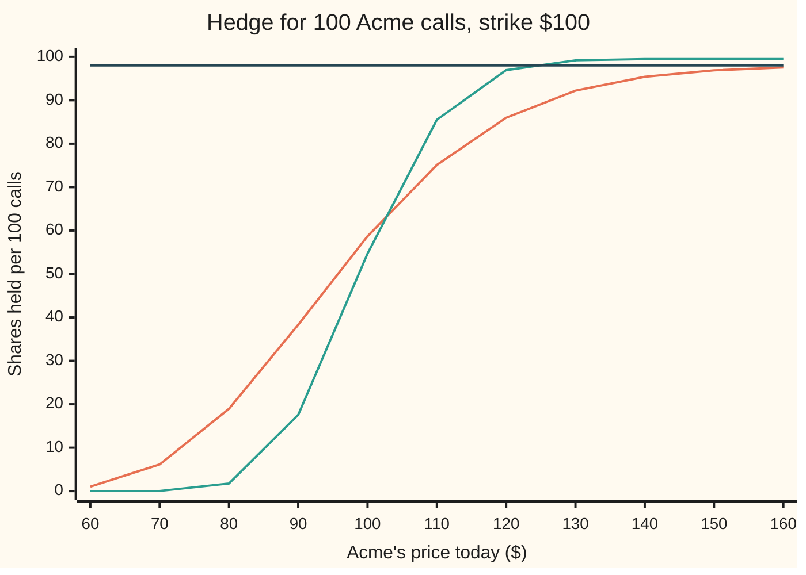

# Delta: how many shares an option behaves like, and the number that hedges it

Financial mathematics → The Greeks, one each → Share-equivalent slope → Delta

---

## General Overview

Acme trades at $100. A one-year call on it, the right to buy one share for $100 a year from now, costs $9.23 in the house market: rates 5 percent, dividends 2 percent a year, volatility (how jumpy the share is) 20 percent.

Nudge Acme up by one cent and hold everything else still. The call gains 0.586851 of a cent. It moves like 0.59 of a share. That number is the call's **delta**: dollars of option value per dollar of share price. A put on the same terms, the right to sell at $100, has delta −0.393348: it moves like a short position (shares sold that are not owned) of 0.39 of a share.

Delta does three jobs, and they are one number. It is the **slope** of the option's price plotted against the share price. It is the **hedge ratio**: a dealer who sold the call and bought 0.586851 shares is flat to a small move either way. And it is a **chance of exercise counted in shares**, shrunk by the dividends the share pays out before expiry. The card derives the formula, shows why those three readings coincide, and runs the hedge through one move.

**Delta is the slope of the option price in the share price; in the Black-Scholes model it equals the dividend drag times the share-counted exercise chance, and holding that many shares cancels a small move.**

**What kind of fact this is:** a theorem inside the Black-Scholes model, proved on this card in Why it works; the model itself is an assumption, not a law.

### The picture: the price curve and its tangent



Orange: the call's Black-Scholes price at each share price, one year left. Green: the straight line touching it at $100 with slope 0.586851, the tangent. Delta is that slope. The curve bends upward away from the tangent on both sides; that bend is [gamma](02-gamma.md), and it is why a delta hedge leaks a little on every move.

---

## The formula

Notation first, in words. A partial derivative, written with a curly $\partial$, is the slope in one input while every other input is held still ([partial-derivatives](../../06-Calculus%20and%20analysis/07-Several%20Variables/01-partial-derivatives.md)). The capital Greek letter $\Delta$ (delta) names that slope in the share price.

$$\Delta_C = \frac{\partial C}{\partial S} = e^{-qT}\,N(d_1), \qquad \Delta_P = \frac{\partial P}{\partial S} = \Delta_C - e^{-qT} = -e^{-qT}\,N(-d_1)$$

**Read it aloud:** the call's delta is the share-counted chance of exercise, shrunk by the dividends that leak out before expiry; the put's delta is the call's minus that same shrink factor.

| Symbol | Plain meaning | In our example | Push it up and delta… |
| --- | --- | --- | --- |
| $S$, $K$ | Acme's price today; the strike, the fixed price in the contract | $100 and $100 | $S$ up: call delta rises toward its ceiling; $K$ up: it falls |
| $T$ | years left to expiry | 1 | at the money, rises a little; far out of the money, rises; deep in, falls |
| $r$ | the riskless rate, continuously compounded | 5% | rises: the forward price moves up |
| $q$ | the dividend yield, the share's payout per year as a fraction of its price | 2% | falls: both the ceiling and the chance shrink |
| $\sigma$ | volatility: how jumpy Acme is, per square-root year. Say "sigma". | 20% | here, falls slightly (vanna, −0.095 per unit of $\sigma$); far out, rises; deep in, falls |
| $C$, $P$ | the call price and the put price today | $9.23 and $6.33 | — |
| $N(x)$, $\varphi(x)$ | the bell curve's area to the left of $x$; its height at $x$ | $N(d_1)$ = 0.598706 | — |
| $d_1$, $d_2$ | where the strike sits on the bell curve, counted in shares and in dollars | 0.25 and 0.05 | — |
| $e^{-qT}$, $e^{-rT}$ | the dividend drag; the discount factor on a dollar due at $T$ | 0.980199 and 0.951229 | — |
| $\Delta$, $\Delta_C$, $\Delta_P$, $\partial$ | delta; of the call; of the put; $\partial$ marks a slope in one input | 0.586851 and −0.393348 | — |
| $h$, $\Gamma$ | a nudge to the share price in dollars; gamma, delta's own slope | $h$ = 0.01; $\Gamma$ about 0.019 | — |
| $S_T$, $z$, $z_0$ | Acme's price at expiry; a standard bell-curve draw that sets it; the draw at which $S_T = K$ | $z_0$ = −0.05 | — |

The helper $d_1$ is the one from the call card:

$$d_1 = \frac{\ln(S/K) + (r - q + \tfrac12\sigma^2)\,T}{\sigma\sqrt{T}}, \qquad d_2 = d_1 - \sigma\sqrt{T}$$

In words: $d_1$ is the distance from today's price to the strike, plus the drift, measured in units of the year's spread $\sigma\sqrt{T}$; $d_2$ sits one spread unit lower.

### When it holds

- **The Black-Scholes model.** Acme's log price moves as a bell curve with constant volatility. If volatility rises when Acme falls, as equity markets usually show, the price also moves through volatility, and the true hedge adds [vega](03-vega.md) times volatility's change per dollar of Acme.
- **Every other input frozen.** Delta is a partial derivative. Over a real day the clock also runs, and delta drifts even if Acme does not: [charm](08-charm.md).
- **Small moves.** The hedge is exact only to first order. The leftover is about half of gamma times the move squared: under a cent for a $1 move, 23 to 24 cents for $5.
- **A continuous dividend yield.** Dividends paid as fixed cash on fixed dates change both the ceiling and the formula ([known-cash-dividends](../08-The%20Black-Scholes%20call%20and%20put/08-known-cash-dividends.md)).
- **Time left.** At expiry the price is the payoff, with a corner at the strike: delta is 0 below $100, 1 above, and undefined at $100 itself.

---

## Why it works

### Step 0: the slope of the price is a share count

A call's price moves with Acme. Holding $\Delta$ shares moves by $\Delta$ dollars for each dollar Acme moves. So a portfolio short one call and long $\Delta$ shares has zero slope in Acme: for a small move, the gain on one leg pays the loss on the other. The slope is the hedge. That was Step 0 of the call card, the hedge that pinned the price; here it is computed.

### Step 1: differentiate, and three terms appear

The call price is $C = S e^{-qT} N(d_1) - K e^{-rT} N(d_2)$. The share price $S$ appears in three places: out in front, inside $d_1$, and inside $d_2$. The product rule and the [chain-rule](../../06-Calculus%20and%20analysis/02-Derivatives/03-chain-rule.md) give one term for each.

The front term gives $e^{-qT} N(d_1)$. The other two come from moving $d_1$ and $d_2$. The slope of $N$ is the bell curve's height $\varphi$, and both $d_1$ and $d_2$ move by $1/(S\sigma\sqrt{T})$ per dollar of $S$, since $S$ sits only in $\ln(S/K)$ and they differ by a constant. So

$$\frac{\partial C}{\partial S} = e^{-qT} N(d_1) + \frac{S e^{-qT}\varphi(d_1) - K e^{-rT}\varphi(d_2)}{S\sigma\sqrt{T}}.$$

### Step 2: the two density terms cancel exactly

The numerator of the second piece is zero:

$$S e^{-qT}\,\varphi(d_1) = K e^{-rT}\,\varphi(d_2).$$

For Acme both sides are 37.901158. The reason is that $d_1$ and $d_2$ differ by one spread unit, so the bell curve's heights at the two points differ by a factor that exactly undoes the ratio of the two discounted amounts. The folded proof does the algebra in four lines. What remains is

$$\Delta_C = e^{-qT} N(d_1).$$

The cancellation has a reading. Moving Acme shifts the price at which the call starts to pay. Paths that finish just at the strike pay nothing, so shifting that boundary a little adds or removes paths worth zero. Only the paths already paying feel the move.

<details>
<summary>Detailed proof: the density cancellation and the slope</summary>

The bell curve's height is $\varphi(x) = e^{-x^2/2}/\sqrt{2\pi}$, so
$$\frac{\varphi(d_1)}{\varphi(d_2)} = e^{-(d_1^2 - d_2^2)/2}.$$
Factor the difference of squares: $d_1^2 - d_2^2 = (d_1 - d_2)(d_1 + d_2)$. The first factor is $\sigma\sqrt{T}$ and the second is $2d_1 - \sigma\sqrt{T}$. Multiply out using the definition of $d_1$:
$$d_1^2 - d_2^2 = 2\ln(S/K) + 2(r - q + \tfrac12\sigma^2)T - \sigma^2 T = 2\ln(S/K) + 2(r - q)T.$$
So $\varphi(d_1)/\varphi(d_2) = (K/S)\,e^{-(r-q)T}$. Multiply both sides by $S e^{-qT}\varphi(d_2)$: $S e^{-qT}\varphi(d_1) = K e^{-rT}\varphi(d_2)$.

For the slope, $\partial d_1/\partial S = \partial d_2/\partial S = 1/(S\sigma\sqrt{T})$, because $\partial \ln(S/K)/\partial S = 1/S$ and nothing else in $d_1$ contains $S$. The product and chain rules give Step 1's line; the cancellation removes the second piece. Every denominator is positive for $S > 0$, $\sigma > 0$, $T > 0$.

</details>

### Step 3: the put, from parity

Put–call parity says $C - P = S e^{-qT} - K e^{-rT}$ at every share price: a call minus a put on the same terms is a share delivered at $T$ without its dividends, minus cash due at $T$. Differentiate both sides in $S$. The cash term does not move. So

$$\Delta_C - \Delta_P = e^{-qT},$$

and $\Delta_P = e^{-qT}(N(d_1) - 1) = -e^{-qT}N(-d_1)$, using $1 - N(x) = N(-x)$. For Acme, $0.980199 \times (0.598706 - 1) = -0.393348$. The difference $e^{-qT}$ holds whatever the volatility: it is the delta of the prepaid forward, not a property of the model.

### Step 4: the three readings

**Slope.** That is the definition. The code checks it by nudging Acme a cent each way and dividing: 0.586851.

**Hedge ratio.** Short one call and long $\Delta$ shares has zero slope, so a small move $h$ leaves only the bend, about $-\tfrac12\Gamma h^2$ for the dealer who is short the curve. Worked numbers runs it.

**Share-counted chance.** Differentiate the payoff path by path instead of the formula. On a path that finishes above the strike, the call pays $S_T - K$, and $S_T$ is proportional to today's $S$, so the payoff moves by $S_T/S$ per dollar of $S$. Below the strike it pays nothing and moves by nothing. Averaging over all paths in the pretend world of the call card, written $\mathbb{E}$ for expectation (the probability-weighted average), and discounting:

$$\Delta_C = e^{-rT}\,\mathbb{E}\!\left[\frac{S_T}{S}\ \text{on paths with } S_T > K\right].$$

Weighting each exercised path by the share's value there, rather than counting paths, is the "counted in shares" of the call card: it slides the bell curve one spread unit and turns $N(d_2)$ into $N(d_1)$. The factor $e^{-rT}\,\mathbb{E}[S_T]/S$ is $e^{-qT}$. So delta is the dividend drag times the chance of exercise in the share-counted world. It is not the ordinary exercise chance, which is $N(d_2)$ = 0.519939.

<details>
<summary>Why the at-the-money call has delta 0.59, not 0.5</summary>

A coin-flip intuition says a call struck at today's price is half in, half out. Two things push $d_1$ above zero. The forward price $S e^{(r-q)T}$ sits above $100 because rates exceed dividends, so the strike is below the middle of the pretend world's bell curve. And counting in shares adds half a variance, $\tfrac12\sigma^2 T$. Together they make $d_1$ = 0.25, $N(d_1)$ = 0.598706, and after the drag 0.586851. With a quarter year left the spread is narrower and delta at $100 is 0.546996.

</details>

### Step 5: the bounds are 0 and $e^{-qT}$, not 0 and 1

$N(d_1)$ is a probability strictly between 0 and 1, so $0 < \Delta_C < e^{-qT}$ and $-e^{-qT} < \Delta_P < 0$. Far out of the money, Acme at $40, the call's delta is 0.000007. Deep in, Acme at $1,000, it is 0.980199, the ceiling to six places.

The ceiling is below 1 for a plain reason. A call almost sure to be exercised is a share delivered in a year minus fixed cash. A share delivered in a year, with the dividends before then kept by someone else, is worth $S e^{-qT}$ today, and its slope in $S$ is $e^{-qT}$. With no dividends the ceiling is 1; with a 2 percent yield it is 0.980199.



Delta times 100: the shares a desk holds against 100 calls. Orange: one year left. Green: a quarter year left, steeper, with its own higher ceiling of 99.50 shares, since a quarter year's dividends drag less ($e^{-0.005}$ = 0.995012). Dark: the one-year ceiling, 98.02 shares, which is $100 e^{-0.02}$. The orange curve climbs toward the dark line and never reaches 100.

A second route to delta is the binomial tree: the two nodes one step in give a slope directly, and the code reads 0.586845 off a 2,000-step tree. The method is on [greeks-from-a-tree-or-grid](../07-Greeks%20by%20Numbers%20and%20Calibration/04-greeks-from-a-tree-or-grid.md).

---

## Worked numbers, by hand

House market: $S = K = 100$, $r = 5\%$, $q = 2\%$, $\sigma = 20\%$, $T = 1$.

| Step | Arithmetic | Value |
| --- | --- | --- |
| $\ln(S/K)$ | $\ln 1$ | 0 |
| $d_1$ | $(0 + (0.05 - 0.02 + 0.02) \times 1) / 0.20$ | 0.25 |
| $d_2$ | $0.25 - 0.20$ | 0.05 |
| $N(d_1)$ | bell-curve area left of 0.25 | 0.598706 |
| dividend drag $e^{-qT}$ | $e^{-0.02}$ | 0.980199 |
| **call delta** | $0.980199 \times 0.598706$ | **0.586851** |
| **put delta** | $0.980199 \times (0.598706 - 1)$ | **−0.393348** |
| call minus put | $0.586851 + 0.393348$ | 0.980199 |
| check: $S e^{-qT}\varphi(d_1)$ and $K e^{-rT}\varphi(d_2)$ | the two density terms | 37.901158 and 37.901158 |

The call behaves like 0.59 of an Acme share, the put like minus 0.39 of one; together, long call and short put, they behave like 0.98 of a share, the prepaid forward.

### The one-move hedge

A dealer sells the call for $9.23. To hedge, the dealer buys 0.586851 shares for $58.69, paying with the $9.23 premium plus $49.46 borrowed. The borrowed amount is the cash half of the call formula, $K e^{-rT} N(d_2)$: the hedge rebuilds the call's two halves. Now Acme jumps instantly, no time passing. The table gives the dealer's gain in dollars per call.

| Acme moves | Short call only | Hedged with 0.586851 shares | Hedged with $N(d_1)$ = 0.598706 | Hedged with $N(d_2)$ = 0.519939 |
| --- | --- | --- | --- | --- |
| −$5 | +2.689468 | −0.244788 | −0.304064 | +0.089774 |
| −$1 | +0.577306 | −0.009545 | −0.021400 | +0.057367 |
| +$1 | −0.596254 | −0.009403 | +0.002452 | −0.076315 |
| +$5 | −3.161486 | −0.227231 | −0.167955 | −0.561792 |

Unhedged, a dollar move swings the book by about 59 cents either way. Hedged with delta, both directions cost under a cent, and both cost: that loss is half of gamma, 0.009474, the price of being short the curve's bend. The two wrong hedges leave a directional bet: the $N(d_1)$ hedge holds too many shares and wins on rises, loses on falls; the $N(d_2)$ hedge holds too few and does the reverse, with swings several times the correct hedge's.

### What breaks if you drop a piece

| Mistake | Comes out at | What went wrong |
| --- | --- | --- |
| Hedge with $N(d_1)$, dropping $e^{-qT}$ | 0.598706 shares; a $1 fall costs 0.021400, not 0.009545 | ignores the dividends the share pays and the call does not |
| Take delta to be the exercise chance $N(d_2)$ | 0.519939 shares; a $1 rise costs 0.076315 | $N(d_2)$ counts paths; delta weights them by the share's value |
| Put delta as minus the call delta | −0.586851, right −0.393348 | parity makes them differ by $e^{-qT}$, not sum to zero |
| Put delta with the sign dropped | +0.393348 | a put gains when Acme falls, so its delta is negative |
| Slope from a one-sided $1 nudge | 0.596254, right 0.586851 | a one-sided difference picks up half of gamma; nudge both ways |

---

## Code, from first principles, and it actually runs

Four independent roads reach the call delta: the formula; a central difference on the price, nudging Acme a cent each way; the two nodes one step into a 2,000-step coin-flip tree; and the pathwise average of $S_T/S$ over the exercised paths, integrated by Simpson's rule from a crossing point found by bisection, which uses neither $d_1$ nor $d_2$. The put's delta comes from nudging the put formula on its own, and call minus put is checked against $e^{-qT}$. The density cancellation, the hedge table, the wrong answers and every chart point are printed.

### Python

```python
# Delta -- the check behind the card.  Standard library only, nothing imported
# that already knows the answer.  The bell-curve area N(x) is its own power
# series; the tree, the integral and the root finder are loops written here.
from math import log, sqrt, exp, pi

def phi(x): return exp(-0.5 * x * x) / sqrt(2.0 * pi)          # bell-curve height at x
def N(x):                                                        # area to the left of x, by series
    if abs(x) > 8.0: return 1.0 if x > 0 else 0.0                # beyond 8 the tail is under 1e-15
    term, total, n = x, x, 0
    while abs(term) > 1e-17 * max(1.0, abs(total)):
        n += 1
        term *= -x * x * (2 * n - 1) / (2 * n * (2 * n + 1))
        total += term
    return 0.5 + total / sqrt(2.0 * pi)

def d1d2(S, K, r, q, s, T):
    d1 = (log(S / K) + (r - q + 0.5 * s * s) * T) / (s * sqrt(T))
    return d1, d1 - s * sqrt(T)
def call(S, K, r, q, s, T):
    d1, d2 = d1d2(S, K, r, q, s, T)
    return S * exp(-q * T) * N(d1) - K * exp(-r * T) * N(d2)
def put(S, K, r, q, s, T):
    d1, d2 = d1d2(S, K, r, q, s, T)
    return K * exp(-r * T) * N(-d2) - S * exp(-q * T) * N(-d1)
def delta(S, K, r, q, s, T): return exp(-q * T) * N(d1d2(S, K, r, q, s, T)[0])

def tree_delta(S, K, r, q, s, T, steps=2000):
    # Road 3: Cox-Ross-Rubinstein tree; delta read off the two nodes one step in.
    dt = T / steps; u = exp(s * sqrt(dt)); d = 1.0 / u
    p = (exp((r - q) * dt) - d) / (u - d); disc = exp(-r * dt)
    v = [max(S * u ** j * d ** (steps - j) - K, 0.0) for j in range(steps + 1)]
    for n in range(steps, 1, -1):
        v = [disc * (p * v[j + 1] + (1 - p) * v[j]) for j in range(n)]
    return (v[1] - v[0]) / (S * u - S * d)

def pathwise_delta(S, K, r, q, s, T, n=20000):
    # Road 4: delta = e^-rT * average of (S_T / S) over the paths that finish above K.
    ST = lambda z: S * exp((r - q - 0.5 * s * s) * T + s * sqrt(T) * z)
    lo, hi = -10.0, 10.0                                          # bisection for the crossing S_T = K
    for _ in range(200):
        mid = 0.5 * (lo + hi)
        lo, hi = (mid, hi) if ST(mid) < K else (lo, mid)
    z0 = 0.5 * (lo + hi); b = 12.0; h = (b - z0) / n
    f = lambda z: ST(z) / S * phi(z)
    tot = f(z0) + f(b) + sum((4 if i % 2 else 2) * f(z0 + i * h) for i in range(1, n))
    return exp(-r * T) * tot * h / 3.0, z0

S, K, r, q, s, T = 100.0, 100.0, 0.05, 0.02, 0.20, 1.0
d1, d2 = d1d2(S, K, r, q, s, T)
eq, er = exp(-q * T), exp(-r * T)
dc = delta(S, K, r, q, s, T); dp = eq * (N(d1) - 1.0)
h = 0.01
dc_bump = (call(S + h, K, r, q, s, T) - call(S - h, K, r, q, s, T)) / (2 * h)
dp_bump = (put(S + h, K, r, q, s, T) - put(S - h, K, r, q, s, T)) / (2 * h)
d_tree = tree_delta(S, K, r, q, s, T)
d_path, z0 = pathwise_delta(S, K, r, q, s, T)
lhs, rhs = S * eq * phi(d1), K * er * phi(d2)
C0 = call(S, K, r, q, s, T)
gam = (call(S + 1, K, r, q, s, T) - 2 * C0 + call(S - 1, K, r, q, s, T))
rows = [("d1", d1), ("d2", d2), ("N(d1)", N(d1)), ("N(d2)", N(d2)), ("e^-qT", eq), ("e^-rT", er),
        ("1 call delta e^-qT N(d1)", dc), ("2 call delta, central bump", dc_bump),
        ("3 call delta, tree 2000 steps", d_tree), ("4 call delta, pathwise integral", d_path),
        ("  crossing z0 by bisection", z0), ("put delta e^-qT (N(d1) - 1)", dp),
        ("put delta, central bump", dp_bump), ("call delta - put delta", dc_bump - dp_bump),
        ("density: S e^-qT phi(d1)", lhs), ("density: K e^-rT phi(d2)", rhs),
        ("call price C", C0), ("put price P", put(S, K, r, q, s, T)),
        ("hedge: shares bought, $", dc * S), ("hedge: cash borrowed, $", C0 - dc * S)]
for name, v in rows: print(f"{name:<34} {v:>12.6f}")
print("instant move: unhedged | hedged e^-qT N(d1) | hedged N(d1) | hedged N(d2)")
res = {}
for m in (-5.0, -1.0, 1.0, 5.0):
    dC = call(S + m, K, r, q, s, T) - C0                          # short one call, so we lose dC
    res[m] = [x * m - dC for x in (0.0, dc, N(d1), N(d2))]
    print(f"  move {m:+.0f}  " + "  ".join(f"{v:+10.6f}" for v in res[m]))
more = [("gamma by second difference, h=1", gam), ("  half gamma", 0.5 * gam),
        ("wrong: N(d1), no e^-qT", N(d1)), ("wrong: N(d2), exercise chance", N(d2)),
        ("wrong: put = minus call delta", -dc), ("wrong: put, sign dropped", eq * N(-d1)),
        ("wrong: one-sided bump, h=1", call(S + 1, K, r, q, s, T) - C0),
        ("deep in: S=1000", delta(1000.0, K, r, q, s, T)), ("far out: S=40", delta(40.0, K, r, q, s, T)),
        ("quarter year: delta at S=100", delta(S, K, r, q, s, 0.25)), ("quarter year: e^-qT", exp(-q * 0.25)),
        ("try: q=0", delta(S, K, r, 0.0, s, T)), ("try: sigma=0.40", delta(S, K, r, q, 0.40, T)),
        ("try: T=0.01", delta(S, K, r, q, s, 0.01)), ("try: K=120", delta(S, 120.0, r, q, s, T))]
for name, v in more: print(f"{name:<34} {v:>12.6f}")
xs = [80 + 5 * i for i in range(9)]
print("chart S       " + " ".join(f"{x:6d}" for x in xs))
print("chart price   " + " ".join(f"{call(x, K, r, q, s, T):6.2f}" for x in xs))
print("chart tangent " + " ".join(f"{C0 + dc * (x - S):6.2f}" for x in xs))
ys = [60 + 10 * i for i in range(11)]
print("delta S       " + " ".join(f"{y:6d}" for y in ys))
for lab, t in (("per100 T=1.00", 1.0), ("per100 T=0.25", 0.25)):
    print(lab + " " + " ".join(f"{100 * delta(y, K, r, q, s, t):6.2f}" for y in ys))
print(f"ceiling per100 T=1.00 {100 * eq:6.2f}")
assert abs(dc - 0.586851146135) < 1e-9, "formula vs the house delta"
assert abs(dc_bump - dc) < 1e-6, "central bump vs formula"
assert abs(d_tree - dc) < 1e-3, "tree vs formula"
assert abs(d_path - dc) < 1e-7, "pathwise integral vs formula"
assert abs((dc_bump - dp_bump) - eq) < 1e-6, "bumped call minus bumped put vs e^-qT"
assert abs(lhs - rhs) < 1e-9, "the density cancellation"
assert abs(res[1.0][1] + 0.5 * gam) < 1e-3, "hedged residual is about minus half gamma"
print("ALL CHECKS PASS")
```

**Ran 2026-09-19 on macOS, Python 3.14.6, standard library only. All checks passed. Output, pasted from the run:**

```
d1                                     0.250000
d2                                     0.050000
N(d1)                                  0.598706
N(d2)                                  0.519939
e^-qT                                  0.980199
e^-rT                                  0.951229
1 call delta e^-qT N(d1)               0.586851
2 call delta, central bump             0.586851
3 call delta, tree 2000 steps          0.586845
4 call delta, pathwise integral        0.586851
  crossing z0 by bisection            -0.050000
put delta e^-qT (N(d1) - 1)           -0.393348
put delta, central bump               -0.393348
call delta - put delta                 0.980199
density: S e^-qT phi(d1)              37.901158
density: K e^-rT phi(d2)              37.901158
call price C                           9.227006
put price P                            6.330081
hedge: shares bought, $               58.685115
hedge: cash borrowed, $              -49.458109
instant move: unhedged | hedged e^-qT N(d1) | hedged N(d1) | hedged N(d2)
  move -5   +2.689468   -0.244788   -0.304064   +0.089774
  move -1   +0.577306   -0.009545   -0.021400   +0.057367
  move +1   -0.596254   -0.009403   +0.002452   -0.076315
  move +5   -3.161486   -0.227231   -0.167955   -0.561792
gamma by second difference, h=1        0.018948
  half gamma                           0.009474
wrong: N(d1), no e^-qT                 0.598706
wrong: N(d2), exercise chance          0.519939
wrong: put = minus call delta         -0.586851
wrong: put, sign dropped               0.393348
wrong: one-sided bump, h=1             0.596254
deep in: S=1000                        0.980199
far out: S=40                          0.000007
quarter year: delta at S=100           0.546996
quarter year: e^-qT                    0.995012
try: q=0                               0.636831
try: sigma=0.40                        0.596296
try: T=0.01                            0.509871
try: K=120                             0.249080
chart S           80     85     90     95    100    105    110    115    120
chart price     1.53   2.70   4.36   6.54   9.23  12.39  15.96  19.88  24.06
chart tangent  -2.51   0.42   3.36   6.29   9.23  12.16  15.10  18.03  20.96
delta S           60     70     80     90    100    110    120    130    140    150    160
per100 T=1.00   1.04   6.14  18.95  38.32  58.69  75.11  85.99  92.22  95.41  96.90  97.56
per100 T=0.25   0.00   0.03   1.75  17.57  54.70  85.52  96.94  99.20  99.48  99.50  99.50
ceiling per100 T=1.00  98.02
ALL CHECKS PASS
```

### Rust

The same checks. Here the bell-curve area is built by adding thin slices under the curve rather than by a series.

```rust
// Delta -- the same check as delta_check.py, in Rust.  Std only, no crates.
// Rust has no erf, so the bell-curve area N(x) is built by adding thin slices
// under the curve (Simpson's rule); the tree and the root finder are loops.
use std::f64::consts::PI;

fn phi(x: f64) -> f64 { (-0.5 * x * x).exp() / (2.0 * PI).sqrt() }    // bell-curve height at x
fn simpson<F: Fn(f64) -> f64>(f: F, a: f64, b: f64, n: usize) -> f64 {
    let h = (b - a) / n as f64;
    let mut t = f(a) + f(b);
    for i in 1..n { t += if i % 2 == 1 { 4.0 } else { 2.0 } * f(a + i as f64 * h); }
    t * h / 3.0
}
fn n_cdf(x: f64) -> f64 {                                                // area to the left of x
    if x.abs() > 8.0 { return if x > 0.0 { 1.0 } else { 0.0 }; }       // beyond 8 the tail is under 1e-15
    0.5 + simpson(phi, 0.0, x, 4000)
}
fn d1d2(s0: f64, k: f64, r: f64, q: f64, s: f64, t: f64) -> (f64, f64) {
    let d1 = ((s0 / k).ln() + (r - q + 0.5 * s * s) * t) / (s * t.sqrt());
    (d1, d1 - s * t.sqrt())
}
fn call(s0: f64, k: f64, r: f64, q: f64, s: f64, t: f64) -> f64 {
    let (d1, d2) = d1d2(s0, k, r, q, s, t);
    s0 * (-q * t).exp() * n_cdf(d1) - k * (-r * t).exp() * n_cdf(d2)
}
fn put(s0: f64, k: f64, r: f64, q: f64, s: f64, t: f64) -> f64 {
    let (d1, d2) = d1d2(s0, k, r, q, s, t);
    k * (-r * t).exp() * n_cdf(-d2) - s0 * (-q * t).exp() * n_cdf(-d1)
}
fn delta(s0: f64, k: f64, r: f64, q: f64, s: f64, t: f64) -> f64 {
    (-q * t).exp() * n_cdf(d1d2(s0, k, r, q, s, t).0)
}
fn tree_delta(s0: f64, k: f64, r: f64, q: f64, s: f64, t: f64, steps: usize) -> f64 {
    // Road 3: Cox-Ross-Rubinstein tree; delta read off the two nodes one step in.
    let dt = t / steps as f64;
    let u = (s * dt.sqrt()).exp();
    let d = 1.0 / u;
    let p = (((r - q) * dt).exp() - d) / (u - d);
    let disc = (-r * dt).exp();
    let mut v: Vec<f64> = (0..=steps)
        .map(|j| (s0 * u.powi(j as i32) * d.powi((steps - j) as i32) - k).max(0.0)).collect();
    for n in (2..=steps).rev() {
        v = (0..n).map(|j| disc * (p * v[j + 1] + (1.0 - p) * v[j])).collect();
    }
    (v[1] - v[0]) / (s0 * u - s0 * d)
}
fn pathwise_delta(s0: f64, k: f64, r: f64, q: f64, s: f64, t: f64) -> (f64, f64) {
    // Road 4: delta = e^-rT * average of (S_T / S) over the paths that finish above K.
    let st = |z: f64| s0 * ((r - q - 0.5 * s * s) * t + s * t.sqrt() * z).exp();
    let (mut lo, mut hi) = (-10.0_f64, 10.0_f64);                        // bisection for S_T = K
    for _ in 0..200 {
        let mid = 0.5 * (lo + hi);
        if st(mid) < k { lo = mid } else { hi = mid }
    }
    let z0 = 0.5 * (lo + hi);
    ((-r * t).exp() * simpson(|z| st(z) / s0 * phi(z), z0, 12.0, 20000), z0)
}
fn main() {
    let (s0, k, r, q, s, t) = (100.0_f64, 100.0_f64, 0.05_f64, 0.02_f64, 0.20_f64, 1.0_f64);
    let (d1, d2) = d1d2(s0, k, r, q, s, t);
    let (eq, er) = ((-q * t).exp(), (-r * t).exp());
    let dc = delta(s0, k, r, q, s, t);
    let dp = eq * (n_cdf(d1) - 1.0);
    let h = 0.01;
    let dc_bump = (call(s0 + h, k, r, q, s, t) - call(s0 - h, k, r, q, s, t)) / (2.0 * h);
    let dp_bump = (put(s0 + h, k, r, q, s, t) - put(s0 - h, k, r, q, s, t)) / (2.0 * h);
    let d_tree = tree_delta(s0, k, r, q, s, t, 2000);
    let (d_path, z0) = pathwise_delta(s0, k, r, q, s, t);
    let (lhs, rhs) = (s0 * eq * phi(d1), k * er * phi(d2));
    let c0 = call(s0, k, r, q, s, t);
    let gam = call(s0 + 1.0, k, r, q, s, t) - 2.0 * c0 + call(s0 - 1.0, k, r, q, s, t);
    let rows: Vec<(&str, f64)> = vec![
        ("d1", d1), ("d2", d2), ("N(d1)", n_cdf(d1)), ("N(d2)", n_cdf(d2)), ("e^-qT", eq), ("e^-rT", er),
        ("1 call delta e^-qT N(d1)", dc), ("2 call delta, central bump", dc_bump),
        ("3 call delta, tree 2000 steps", d_tree), ("4 call delta, pathwise integral", d_path),
        ("  crossing z0 by bisection", z0), ("put delta e^-qT (N(d1) - 1)", dp),
        ("put delta, central bump", dp_bump), ("call delta - put delta", dc_bump - dp_bump),
        ("density: S e^-qT phi(d1)", lhs), ("density: K e^-rT phi(d2)", rhs),
        ("call price C", c0), ("put price P", put(s0, k, r, q, s, t)),
        ("hedge: shares bought, $", dc * s0), ("hedge: cash borrowed, $", c0 - dc * s0),
    ];
    for (name, v) in &rows { println!("{:<34} {:>12.6}", name, v); }
    println!("instant move: unhedged | hedged e^-qT N(d1) | hedged N(d1) | hedged N(d2)");
    let mut res_up = 0.0;
    for m in [-5.0_f64, -1.0, 1.0, 5.0] {
        let dcall = call(s0 + m, k, r, q, s, t) - c0;                    // short one call, so we lose dC
        let vals: Vec<f64> = [0.0, dc, n_cdf(d1), n_cdf(d2)].iter().map(|x| x * m - dcall).collect();
        if m == 1.0 { res_up = vals[1]; }
        let cells: Vec<String> = vals.iter().map(|v| format!("{:+10.6}", v)).collect();
        println!("  move {:+.0}  {}", m, cells.join("  "));
    }
    let more: Vec<(&str, f64)> = vec![
        ("gamma by second difference, h=1", gam), ("  half gamma", 0.5 * gam),
        ("wrong: N(d1), no e^-qT", n_cdf(d1)), ("wrong: N(d2), exercise chance", n_cdf(d2)),
        ("wrong: put = minus call delta", -dc), ("wrong: put, sign dropped", eq * n_cdf(-d1)),
        ("wrong: one-sided bump, h=1", call(s0 + 1.0, k, r, q, s, t) - c0),
        ("deep in: S=1000", delta(1000.0, k, r, q, s, t)), ("far out: S=40", delta(40.0, k, r, q, s, t)),
        ("quarter year: delta at S=100", delta(s0, k, r, q, s, 0.25)), ("quarter year: e^-qT", (-q * 0.25).exp()),
        ("try: q=0", delta(s0, k, r, 0.0, s, t)), ("try: sigma=0.40", delta(s0, k, r, q, 0.40, t)),
        ("try: T=0.01", delta(s0, k, r, q, s, 0.01)), ("try: K=120", delta(s0, 120.0, r, q, s, t)),
    ];
    for (name, v) in &more { println!("{:<34} {:>12.6}", name, v); }
    let xs: Vec<f64> = (0..9).map(|i| 80.0 + 5.0 * i as f64).collect();
    let join = |v: Vec<String>| v.join(" ");
    println!("chart S       {}", join(xs.iter().map(|x| format!("{:6.0}", x)).collect()));
    println!("chart price   {}", join(xs.iter().map(|&x| format!("{:6.2}", call(x, k, r, q, s, t))).collect()));
    println!("chart tangent {}", join(xs.iter().map(|&x| format!("{:6.2}", c0 + dc * (x - s0))).collect()));
    let ys: Vec<f64> = (0..11).map(|i| 60.0 + 10.0 * i as f64).collect();
    println!("delta S       {}", join(ys.iter().map(|y| format!("{:6.0}", y)).collect()));
    for (lab, tt) in [("per100 T=1.00", 1.0_f64), ("per100 T=0.25", 0.25)] {
        println!("{} {}", lab, join(ys.iter().map(|&y| format!("{:6.2}", 100.0 * delta(y, k, r, q, s, tt))).collect()));
    }
    println!("ceiling per100 T=1.00 {:6.2}", 100.0 * eq);
    assert!((dc - 0.586851146135).abs() < 1e-9, "formula vs the house delta");
    assert!((dc_bump - dc).abs() < 1e-6, "central bump vs formula");
    assert!((d_tree - dc).abs() < 1e-3, "tree vs formula");
    assert!((d_path - dc).abs() < 1e-7, "pathwise integral vs formula");
    assert!(((dc_bump - dp_bump) - eq).abs() < 1e-6, "bumped call minus bumped put vs e^-qT");
    assert!((lhs - rhs).abs() < 1e-9, "the density cancellation");
    assert!((res_up + 0.5 * gam).abs() < 1e-3, "hedged residual is about minus half gamma");
    println!("ALL CHECKS PASS");
}
```

**Ran 2026-09-19 on macOS, rustc 1.98.1, no crates. All checks passed. Output, pasted from the run:**

```
d1                                     0.250000
d2                                     0.050000
N(d1)                                  0.598706
N(d2)                                  0.519939
e^-qT                                  0.980199
e^-rT                                  0.951229
1 call delta e^-qT N(d1)               0.586851
2 call delta, central bump             0.586851
3 call delta, tree 2000 steps          0.586845
4 call delta, pathwise integral        0.586851
  crossing z0 by bisection            -0.050000
put delta e^-qT (N(d1) - 1)           -0.393348
put delta, central bump               -0.393348
call delta - put delta                 0.980199
density: S e^-qT phi(d1)              37.901158
density: K e^-rT phi(d2)              37.901158
call price C                           9.227006
put price P                            6.330081
hedge: shares bought, $               58.685115
hedge: cash borrowed, $              -49.458109
instant move: unhedged | hedged e^-qT N(d1) | hedged N(d1) | hedged N(d2)
  move -5   +2.689468   -0.244788   -0.304064   +0.089774
  move -1   +0.577306   -0.009545   -0.021400   +0.057367
  move +1   -0.596254   -0.009403   +0.002452   -0.076315
  move +5   -3.161486   -0.227231   -0.167955   -0.561792
gamma by second difference, h=1        0.018948
  half gamma                           0.009474
wrong: N(d1), no e^-qT                 0.598706
wrong: N(d2), exercise chance          0.519939
wrong: put = minus call delta         -0.586851
wrong: put, sign dropped               0.393348
wrong: one-sided bump, h=1             0.596254
deep in: S=1000                        0.980199
far out: S=40                          0.000007
quarter year: delta at S=100           0.546996
quarter year: e^-qT                    0.995012
try: q=0                               0.636831
try: sigma=0.40                        0.596296
try: T=0.01                            0.509871
try: K=120                             0.249080
chart S           80     85     90     95    100    105    110    115    120
chart price     1.53   2.70   4.36   6.54   9.23  12.39  15.96  19.88  24.06
chart tangent  -2.51   0.42   3.36   6.29   9.23  12.16  15.10  18.03  20.96
delta S           60     70     80     90    100    110    120    130    140    150    160
per100 T=1.00   1.04   6.14  18.95  38.32  58.69  75.11  85.99  92.22  95.41  96.90  97.56
per100 T=0.25   0.00   0.03   1.75  17.57  54.70  85.52  96.94  99.20  99.48  99.50  99.50
ceiling per100 T=1.00  98.02
ALL CHECKS PASS
```

The two outputs agree line for line. They reach the bell-curve area by different routes, a series in Python and Simpson slices in Rust.

> [!TIP]
> **Try changing**
> Guess the direction first. The first assert is pinned to the house delta, so each change stops the run there, after the numbers print.
> - **Remove the dividend.** Set `q = 0.0`. Delta rises from 0.586851 to **0.636831**: the drag is gone and the forward sits higher, so $d_1$ grows.
> - **Double the volatility.** Set `s = 0.40`. Delta moves only to **0.596296**, after dipping slightly first. At the money, extra spread barely shifts the share-counted chance; the price moves far more than the hedge.
> - **Run the clock down.** Set `T = 0.01`. Delta falls to **0.509871**: with almost no time, an at-the-money call is nearly a coin flip, and near expiry delta swings between 0 and 1 over a small range of prices.
> - **Raise the strike.** Set `K = 120.0`. Delta drops to **0.249080**: the call now behaves like a quarter of a share.

---

## The usual mistake

> [!warning]
> **Reading delta as the probability the option finishes in the money.** It is not. The ordinary chance of exercise in the pricing world is $N(d_2)$ = 0.519939. Delta is 0.586851: the exercise chance with each path weighted by what the share is worth there, times the dividend drag. Hedging with the wrong one leaves 6 to 8 cents of exposure per call on a $1 move instead of under one.
>
> - **Delta between 0 and 1.** For a call on a dividend-paying share the ceiling is $e^{-qT}$ = 0.980199. Deep in the money, a hedge of one full share per call is over-hedged.
> - **Put delta as minus the call delta.** The two differ by $e^{-qT}$: −0.393348, not −0.586851.
> - **At the money means delta one half.** Here it is 0.586851, because the forward sits above the strike and share-counting adds half a variance.
> - **A hedge set once.** Delta changes as Acme moves and as the clock runs; a $5 move already leaves 23 to 24 cents unhedged. Keeping the hedge right is continuous work, and its cost is the subject of [theta-pays-for-gamma-hedged-pnl](10-theta-pays-for-gamma-hedged-pnl.md).

---

## Where you meet it in real life

- **A market maker's hedge.** After selling calls, a dealer buys delta shares per call and adjusts through the day. The replication argument of [black-scholes-by-delta-hedging](../05-Black-Scholes%20from%20the%20Ground%20Up/03-black-scholes-by-delta-hedging.md) is this card run continuously.
- **Share-equivalent exposure.** Risk reports add up delta times the share price, $58.69 per Acme call here, so a book of options can be compared with a book of shares. Adding it across the Greeks gives the first line of [greeks-together-taylor-pnl](09-greeks-together-taylor-pnl.md).
- **Options quoted by delta.** Currency desks name strikes by delta: a "25-delta call" is the strike whose call has delta 0.25. Turning a delta back into a strike is [strike-from-delta](../11-Implied%20volatility%20and%20the%20vanilla%20inverses/03-strike-from-delta.md).
- **Other underlyings.** A currency option replaces $q$ with the foreign interest rate; an option on a futures contract has its own delta. Same skeleton, different drags.
- **A company's shares.** In Merton's model, equity is a call on the firm's assets, and its delta says how far the share price moves per dollar of asset value ([structural-model-sensitivities](../43-Structural%20Models%20-%20Default%20from%20the%20Balance%20Sheet/02-structural-model-sensitivities.md)).

> **Say it back**
> Delta is the slope of an option's price in the share price: the one-year Acme call moves 0.59 cents per cent, the put minus 0.39. Differentiating the Black-Scholes price, two density terms cancel exactly and leave $e^{-qT}N(d_1)$. Parity makes call and put deltas differ by $e^{-qT}$, the delta of a share delivered without its dividends. The same number is the hedge that cancels a small move, and the exercise chance counted in shares; it is not the plain exercise chance $N(d_2)$. It lives between 0 and $e^{-qT}$, not 0 and 1.

---

## What this builds on

- [black-scholes-call](../08-The%20Black-Scholes%20call%20and%20put/01-black-scholes-call.md): the price being differentiated, and the share-counted chance $N(d_1)$.
- [black-scholes-put](../08-The%20Black-Scholes%20call%20and%20put/02-black-scholes-put.md): the put's price, and the parity used in Step 3.
- [partial-derivatives](../../06-Calculus%20and%20analysis/07-Several%20Variables/01-partial-derivatives.md): a slope in one input with the others held still, which is what every Greek is.
- [chain-rule](../../06-Calculus%20and%20analysis/02-Derivatives/03-chain-rule.md): how $S$ inside $d_1$ and $d_2$ produces the two density terms.

## Where this goes next

- [gamma](02-gamma.md): delta's own slope, the bend that leaves a delta hedge about a cent short on each dollar move.
- [vega](03-vega.md): the slope in volatility; its value, 37.901158, is the density term that cancelled in Step 2, times $\sqrt{T}$.
- [rho-and-dividend-rho](05-rho-and-dividend-rho.md): the slopes in the rate and the dividend yield, where the cash half and the share half separate again.
- [vanna](06-vanna.md): how delta moves when volatility moves.
- [charm](08-charm.md): how delta drifts as the clock runs with Acme still.
- [strike-from-delta](../11-Implied%20volatility%20and%20the%20vanilla%20inverses/03-strike-from-delta.md): this card's formula run backwards, from a quoted delta to a strike.
- [garman-kohlhagen-greeks](../21-FX%20vanilla%20options%20-%20Garman-Kohlhagen%20and%20the%20desk%20conventions/03-garman-kohlhagen-greeks.md): currency deltas, where the dividend yield becomes a foreign rate and desks keep several deltas at once.
- [futures-option-greeks](../26-Options%20on%20commodity%20futures%20and%20spreads/02-futures-option-greeks.md): delta when the thing bought is a futures contract.
- [structural-model-sensitivities](../43-Structural%20Models%20-%20Default%20from%20the%20Balance%20Sheet/02-structural-model-sensitivities.md): delta of a company's equity in its assets.

A delta hedge cancels the first-order move and leaves the bend; how big that leftover is, and how fast delta itself changes, is gamma's question.

---

## Sources

Verified 2026-09-23: every link below resolves to the publisher's page.

- Black, Fischer, and Myron Scholes. "The Pricing of Options and Corporate Liabilities." *Journal of Political Economy* 81, no. 3 (1973): 637–654. [doi:10.1086/260062](https://doi.org/10.1086/260062). The hedge ratio as the slope of the price: the argument behind Step 0.
- Merton, Robert C. "Theory of Rational Option Pricing." *Bell Journal of Economics and Management Science* 4, no. 1 (1973): 141–183. [doi:10.2307/3003143](https://doi.org/10.2307/3003143). The dividend yield, and so the $e^{-qT}$ ceiling.
- Cox, John C., Stephen A. Ross, and Mark Rubinstein. "Option Pricing: A Simplified Approach." *Journal of Financial Economics* 7, no. 3 (1979): 229–263. [doi:10.1016/0304-405X(79)90015-1](https://doi.org/10.1016/0304-405X(79)90015-1). The tree, whose one-step share count is road 3 in the code.
- Glasserman, Paul. *Monte Carlo Methods in Financial Engineering*. Springer, 2003. [Publisher page](https://link.springer.com/book/10.1007/978-0-387-21617-1). The pathwise derivative, path by path, behind road 4 and Step 4's third reading.
- Hull, John C. *Options, Futures, and Other Derivatives*, 11th ed. Pearson. [Publisher page](https://www.pearson.com/en-us/subject-catalog/p/options-futures-and-other-derivatives/P200000005938). The textbook treatment of delta and delta hedging, chapter "The Greek Letters".
