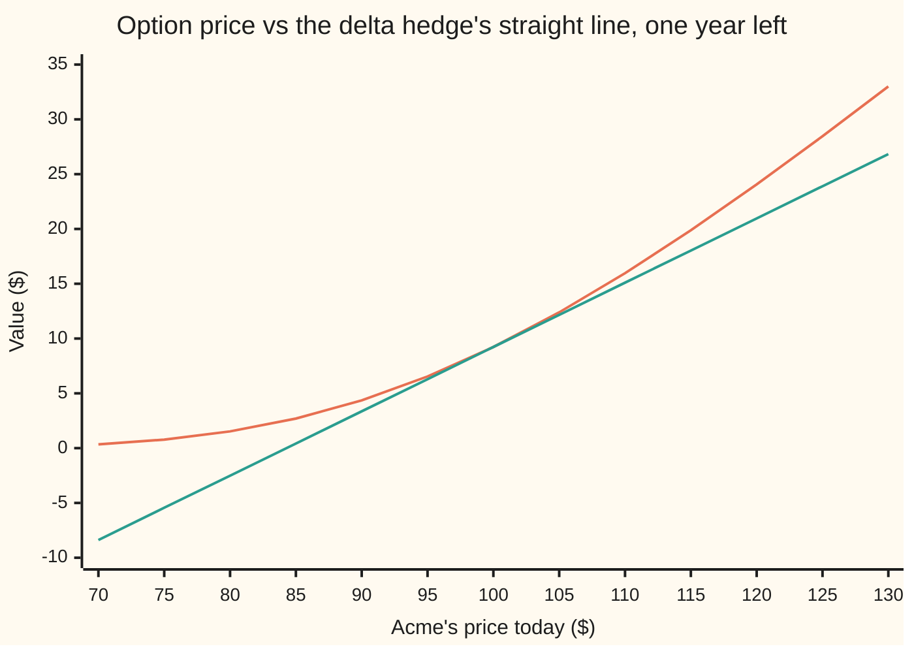
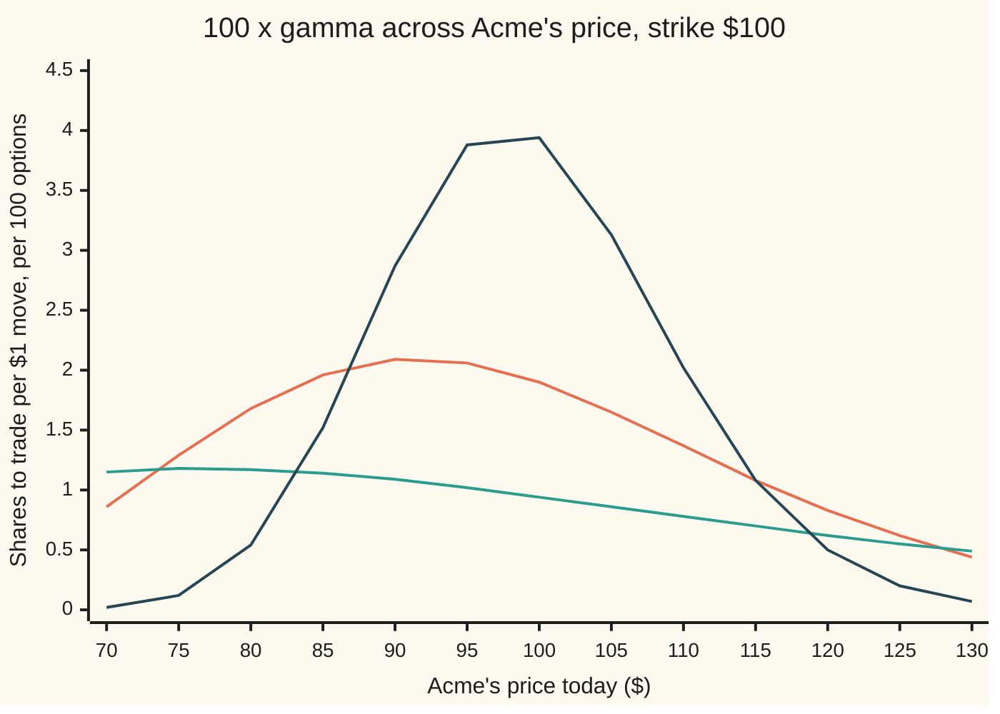

# Gamma: how fast the hedge ratio changes, so how often you must rebuild it

[Syllabus](../../../SYLLABUS.md) → [Financial mathematics](../README.md) → [The Greeks, one each](../README.md#s09) → Gamma

---

## General Overview

A desk has sold 10,000 one-year call options on Acme. Acme trades at $100, the strike is $100, and each option is worth $9.23. To stop a move in Acme from costing it money, the desk holds Acme shares: 0.586851 of a share per option, which is 5,869 shares in all. That share count per option is the option's **delta**, the hedge ratio ([Delta](01-delta.md)).

The hedge is right for one price only. Acme rises to $105, and each option now behaves like 0.675680 of a share. The desk's 5,869 shares are 888 short of the new hedge. It must buy them, at $105, for $93,270.20. Had Acme fallen, it would have had to sell, at the lower price. The option price is a curve, and the hedge is a straight line touching it at one point.

How fast the hedge goes stale is one number: **gamma**, the change in delta for each dollar Acme moves. For the Acme option it is 0.018951. A \$5 move shifts delta by about five times that, 0.095. With volatility at 40% instead of 20%, gamma at the strike is 0.009413, about half. Its unit is delta per dollar. Desks often quote it per 1% move, $\Gamma \times S/100$; at \$100 the two readings coincide.

**Gamma is the bend in the option's price: the rate at which its hedge ratio changes as the share moves, the same for a call and a put, largest near the strike and near expiry.**

**What kind of fact this is:** a definition (the second derivative of the price in the share price), and a theorem inside the Black-Scholes model: the closed formula below is proved on this card in Why it works.

### The picture: the price bends away from its hedge

Acme's price today runs left to right. The curve is the option's price with a year left. The straight line is what the hedge assumes: start at $9.23 and move 0.586851 dollars for every dollar Acme moves.



Orange: the option's price. Green: the hedge line, the tangent (the straight line that touches the curve at $100 with the same slope). The curve sits above its tangent on both sides. At $105 the gap is $0.23 per option. Gamma measures how sharply the curve bends away.

---

## The formula

$$\Gamma \;=\; \frac{\partial \Delta}{\partial S} \;=\; \frac{\partial^2 C}{\partial S^2} \;=\; \frac{e^{-qT}\,\varphi(d_1)}{S\,\sigma\sqrt{T}}$$

The curly ∂ marks a partial derivative: the rate of change in one input while every other input is held still ([Partial derivatives](../../06-Calculus%20and%20analysis/07-Several%20Variables/01-partial-derivatives.md)). $\partial^2 C/\partial S^2$ is that rate taken twice: the slope of the slope.

**Read it aloud:** gamma is the height of the bell curve at the share-side cut-off, shrunk by the dividend drag, divided by how many dollars Acme typically moves over the option's life.

| Symbol | Plain meaning | In our example | Push it up and gamma… |
| --- | --- | --- | --- |
| $\Gamma$ | gamma: change in delta per \$1 move in the share | 0.018951 | is the answer |
| $\Delta$ | delta: shares held per option to hedge it | 0.586851 | — |
| $C$, $P$ | the call's and the put's price | call \$9.23 | — |
| $S$ | Acme's price today | \$100 | slides along a hump that peaks at \$91.39: gamma falls either side of the peak |
| $K$ | the strike | \$100 | carries the hump with it |
| $T$ | years left to expiry | 1 | at the strike, falls: 0.0275 with six months left, 0.0190 with a year |
| $r$, $q$ | the bank rate and the dividend yield, continuously compounded | 5% and 2% | move the hump's peak; each changes gamma at the strike only slightly |
| $\sigma$ | volatility: how jumpy Acme is, per year | 20% | at the strike, falls: 0.009413 at 40%; far from it, rises (chart below) |
| $\varphi$, $N$ | the bell curve's height, and the area under it to the left of a point | $\varphi(d_1)$ = 0.386668 | — |
| $d_1$, $d_2$ | the share-side and cash-side distance to the strike, in units of $\sigma\sqrt{T}$ | 0.25 and 0.05 | — |
| $e^{-qT}$, $e^{-rT}$ | dividend drag, and the discount on a dollar due at expiry | 0.980199 and 0.951229 | — |
| $m$ | a move in Acme's price, in dollars | \$5 | — |

The helpers are the ones from [Black–Scholes call](../08-The%20Black-Scholes%20call%20and%20put/01-black-scholes-call.md), unchanged:

$$d_1 = \frac{\ln(S/K) + (r - q + \tfrac12\sigma^2)T}{\sigma\sqrt{T}}, \qquad d_2 = d_1 - \sigma\sqrt{T}, \qquad \varphi(x) = \frac{e^{-x^2/2}}{\sqrt{2\pi}}$$

In words: $d_1$ counts how many "wiggle units" of $\sigma\sqrt{T}$ separate Acme from the strike, plus a drift allowance: here 0 + 0.15 + 0.10 = 0.25. $\varphi$ is the bell curve's height at a point, not an area under it.

### When it holds

- **Volatility is a constant.** On a real desk, implied volatility (the volatility that market prices imply) moves when the share moves, and differs by strike (the smile). Then the hedge ratio changes by gamma plus a volatility term, and this formula understates or overstates the drift of the hedge.
- **The share moves continuously.** A jump skips the curve; the loss on a jump of $m$ dollars is the full reprice, not the small-move estimate, and the gap between them grows with the jump.
- **A plain call or put.** A digital or a barrier option has gamma that changes sign and explodes near a price level; this formula does not apply to it.
- **Time is left.** At expiry the payoff has a kink at the strike and no second derivative there; gamma at the strike grows without limit as expiry approaches.

---

## Why it works

### Step 0: gamma is a slope of a slope

Delta is the slope of the price curve: how many dollars the option moves per dollar of Acme. Gamma is how fast that slope turns. Nothing new is needed to find it. Take delta's formula and differentiate it once more in $S$.

### Step 1: delta is an area under the bell curve

Delta for a call is $\Delta = e^{-qT}N(d_1)$ ([Delta](01-delta.md)). $N(d_1)$ is an area: the part of the bell curve to the left of the cut-off $d_1$. Acme rises, so $d_1$ slides right, and the area grows by a thin strip at its right edge.

### Step 2: the strip's height is the bell curve's height

A thin strip at the edge adds its height times its width, and its height is $\varphi(d_1)$. So the area grows at the rate $\varphi(d_1)$ per unit that $d_1$ moves. That is why gamma carries a height, $\varphi$, where delta carries an area, $N$. This is the fundamental theorem of calculus in one line: the rate of growth of an area is the height at its moving edge.

### Step 3: how fast the cut-off moves per dollar

Only $\ln(S/K)$ in $d_1$ depends on $S$, and $\ln S$ grows at the rate $1/S$. Divide by the wiggle unit $\sigma\sqrt{T}$: $d_1$ moves $1/(S\sigma\sqrt{T})$ per dollar. At Acme's numbers that is 1/20 per dollar.

### Step 4: multiply

The chain rule (rate of an outer thing times rate of the inner thing) joins Steps 2 and 3, and the drag $e^{-qT}$ rides along because it does not depend on $S$:

$$\Gamma = e^{-qT}\,\varphi(d_1)\cdot\frac{1}{S\sigma\sqrt{T}}.$$

### Step 5: the put has the same gamma

Put–call parity (the fixed relation between call and put prices) says $C - P = Se^{-qT} - Ke^{-rT}$. The right side is a straight line in $S$. A straight line has a constant slope, so its slope of slope is zero: the call and the put differ by nothing in gamma. The put's delta is the call's minus $e^{-qT}$; the constant disappears on the next differentiation.

<details>
<summary>Detailed proof: delta first, then gamma, then the density at the strike</summary>

**Delta.** Differentiate $C = Se^{-qT}N(d_1) - Ke^{-rT}N(d_2)$ in $S$. Three terms appear: $e^{-qT}N(d_1)$, plus $Se^{-qT}\varphi(d_1)\,\partial d_1/\partial S$, minus $Ke^{-rT}\varphi(d_2)\,\partial d_2/\partial S$. Since $d_2 = d_1 - \sigma\sqrt{T}$, the two partials are equal. The identity $Se^{-qT}\varphi(d_1) = Ke^{-rT}\varphi(d_2)$ holds: expand $\varphi(d_2)=\varphi(d_1)\,e^{d_1\sigma\sqrt{T} - \sigma^2T/2}$, and $d_1\sigma\sqrt{T} - \sigma^2 T/2 = \ln(S/K) + (r-q)T$. So the last two terms cancel and $\Delta = e^{-qT}N(d_1)$.

**Gamma.** $N' = \varphi$, and $\partial d_1/\partial S = 1/(S\sigma\sqrt{T})$, so $\partial\Delta/\partial S = e^{-qT}\varphi(d_1)/(S\sigma\sqrt{T})$.

**The density at the strike.** Write the call as the discounted average of its payoff $S e^{\mu_0 + vz} - K$ over a standard bell-curve variable $z$, where $\mu_0 = (r - q - \tfrac12\sigma^2)T$ and $v = \sigma\sqrt{T}$. The payoff is positive only above a cut-off in $z$ that moves with $S$. Differentiating once in $S$, the moving cut-off contributes nothing, because the payoff is zero there. What is left is an integral of $e^{\mu_0+vz}$, which no longer depends on $S$. Differentiating again, only the cut-off moves, and it leaves one term: the density of Acme's finishing price at $K$ in the risk-neutral world (the pretend world where everything grows at the bank rate), which is $f(K) = \varphi\big((\ln K - \ln S - \mu_0)/v\big)/(Kv)$. The result is
$$\Gamma = e^{-rT}\Big(\frac{K}{S}\Big)^2 f(K) = \frac{Ke^{-rT}\varphi(d_2)}{S^2\sigma\sqrt{T}},$$
and the identity above turns the last form into $e^{-qT}\varphi(d_1)/(S\sigma\sqrt{T})$. At Acme, $f(K) = 0.019922$ per dollar, and since $S = K$ here, gamma is the discounted pretend-world chance per dollar of finishing exactly at the strike. The payoff is two straight pieces; all its bend lives at the joint.

</details>

### Step 6: why a hedged option gains from a move either way

Near $S$, the price curve is its tangent plus a bend. The Taylor expansion (a function written as its value, plus slope times step, plus half the second derivative times step squared) gives

$$C(S+m) \approx C(S) + \Delta\, m + \tfrac12\,\Gamma\, m^2.$$

The hedge removes $\Delta\,m$. What remains is $\tfrac12\Gamma m^2$, positive for $m$ up or down. The half is the area of a triangle: across the move, delta climbs a ramp of slope $\Gamma$ from its old value, and the extra profit is the area under that ramp, half of the rectangle $\Gamma m \times m$.

### Step 7: where the hump peaks

$\varphi(d_1)$ is tallest at $d_1 = 0$, but the $1/S$ in front tilts the hump toward lower prices. Setting the slope of $\ln\Gamma$ in $S$ to zero gives $d_1 = -\sigma\sqrt{T}$, that is

$$S^{*} = K e^{-(r - q + \frac32\sigma^2)T}.$$

For Acme, $S^{*}$ = \$91.39, and gamma there is 0.020970. "Gamma peaks at the money" is true only for short-dated options; with a year left the peak sits nearly \$9 below the strike.

A second road to the same number: the Black-Scholes equation ties gamma to theta, delta and the price. Solve it for gamma, feed it a bumped theta, and gamma comes out without a bell-curve height in sight. That trade-off, gamma paid for by time decay, is [Theta pays for gamma](10-theta-pays-for-gamma-hedged-pnl.md).

---

## Worked numbers, by hand

Acme: $S$ = \$100, $K$ = \$100, $r$ = 5%, $q$ = 2%, $\sigma$ = 20%, $T$ = 1 year.

| Step | Arithmetic | Value |
| --- | --- | --- |
| $d_1$ | (ln 1 + (0.05 − 0.02 + 0.02) × 1) / 0.20 | 0.25 |
| bell height $\varphi(d_1)$ | e^(−0.03125) / √(2π) | 0.386668 |
| dividend drag $e^{-qT}$ | e^(−0.02) | 0.980199 |
| dollar wiggle $S\sigma\sqrt{T}$ | 100 × 0.20 × 1 | 20 |
| **gamma** | 0.980199 × 0.386668 / 20 | **0.018951** |
| delta shift for a 5-dollar move | 0.018951 × 5 | 0.094753 |
| hedged gain on a 5-dollar move | ½ × 0.018951 × 25 | \$0.236882 |
| the same, full reprice | C(105) − C(100) − 0.586851 × 5 | \$0.227231 |

Delta moves by 0.018951 for every dollar Acme moves. The actual shifts are 0.088829 up and −0.099280 down: Acme at $100 is past the hump's peak, so gamma shrinks on the way up and grows on the way down, and the two sides straddle 0.094753.

### Pricing the rebalance on the desk's book

The desk is short 10,000 calls and long the hedge.

| Step | Arithmetic | Value |
| --- | --- | --- |
| shares held at \$100 | 10,000 × 0.586851 | 5,868.51 |
| shares needed at \$105 | 10,000 × 0.675680 | 6,756.80 |
| shares to buy | difference | **888.29** |
| cash spent | 888.29 × 105 | **\$93,270.20** |
| loss on the hedged book | 10,000 × 0.227231 | \$2,272.31 |

The desk buys after a rise and sells after a fall. That is the rebalance gamma forces: buying high and selling low, 888 shares at a time, and the \$2,272.31 is what the bend cost before the rebuild. On a quiet day the move is smaller. A typical daily move is $S\sigma/\sqrt{252}$ = \$1.26, which shifts the hedge by 239 shares.

### What breaks if you drop a piece

Correct answer 0.018951.

| Mistake | Comes out at | What went wrong |
| --- | --- | --- |
| $N(d_1)$ in place of $\varphi(d_1)$ | 0.029343 | an area where a height belongs: half as big again |
| $\varphi(d_2)$ in place of $\varphi(d_1)$ | 0.019528 | the cash-side cut-off; that version needs $Ke^{-rT}/S^2$ in front |
| $S$ missing from the bottom | 1.895058 | a hundred times too big: a dollar is a small step on a \$100 share |
| $\sigma T$ for $\sigma\sqrt{T}$, 3 months | 0.076948 (right: 0.039386) | spread grows with root time; short options come out nearly double |
| P&L as $\Gamma m^2$, no half, \$5 move | \$0.473764 (full reprice: \$0.227231) | the gain is a triangle, not a rectangle |

---

## How gamma moves

The option is the same, the strike is the same, and Acme sits at $100 all year. Yet the hedge that needed 190 shares of adjustment per dollar on the 10,000-option book needs 3,810 on the last day. The clock did it.

### One book, followed to expiry

| Time left | Gamma at $100 | Gamma at $95 | Shares to trade per $1 move, 10,000 options |
| --- | --- | --- | --- |
| 12 months | 0.0190 | 0.0206 | 190 |
| 6 months | 0.0275 | 0.0289 | 275 |
| 3 months | 0.0394 | 0.0388 | 394 |
| 1 month | 0.0688 | 0.0520 | 688 |
| 1 week | 0.1437 | 0.0292 | 1,437 |
| 1 day | 0.3810 | 0.0000 | 3,810 |

At the strike gamma climbs as expiry nears. Five dollars away it first climbs, then collapses to nothing. With a day left, the bell curve of finishing prices is a needle about a dollar wide. If Acme sits on the strike, delta jumps from near 0 to near 1 across a couple of dollars; if it sits $5 away, the option is already settled as worthless or as a share.

### Force one: time, with Acme at the strike

```
time left   gamma at $100 (delta change per $1 move)
12 months   ██                                        0.0190
 6 months   ███                                       0.0275
 3 months   ████                                      0.0394
 1 month    ███████                                   0.0688
 1 week     ███████████████                           0.1437
 1 day      ████████████████████████████████████████  0.3810
```

### Force two: price and volatility together



The chart plots gamma times 100: the shares a book of 100 options must trade per dollar Acme moves. Orange: one year left, 20% volatility, the house option, peaking near \$91. Green: one year left, 40% volatility: the hump is lower and much wider, so gamma falls at the strike and rises far from it. Dark blue: three months left, 20% volatility: taller, narrower, its peak closer to the strike. Volatility and time do the same job, because gamma depends on them mainly through the wiggle $\sigma\sqrt{T}$. More of either spreads the same bend over a wider band of prices.

---

## Code, from first principles, and it actually runs

The checks compute gamma seven ways at the house option: the formula; the call price bumped twice (a one-cent nudge each side); delta bumped once; the put bumped twice; the density of the finishing price at the strike, with no $d_1$ anywhere; a 2,000-step coin-flip tree, gamma read from its nodes; and the Black-Scholes equation solved for gamma with theta from a bumped expiry. Then they price the \$5 rebalance, find the hump's peak by scanning every cent from \$60 to \$140, and reproduce every wrong number above. Python builds the bell-curve area $N$ from its power series; Rust builds it by Simpson's rule under the bell curve. Two different roads to $N$, and the outputs agree byte for byte.

### Python

```python
# Gamma -- the check behind the card.  Python standard library only.
# Every number on the card is printed here.  The bell-curve area N is a power
# series written out below (no erf); the tree is a loop; nothing imported knows the answer.
from math import log, sqrt, exp, pi

def phi(x): return exp(-0.5 * x * x) / sqrt(2.0 * pi)      # bell-curve height at x
def N(x):                                                  # bell-curve area left of x
    if abs(x) > 9.0: return 0.0 if x < 0 else 1.0
    term = total = x; k = 1
    while abs(term) > 1e-18 * abs(total):                  # x + x^3/3 + x^5/15 + ...
        term *= x * x / (2 * k + 1); total += term; k += 1
    return 0.5 + phi(x) * total

def d1(S, K, r, q, s, T): return (log(S / K) + (r - q + 0.5 * s * s) * T) / (s * sqrt(T))
def call(S, K, r, q, s, T):
    a = d1(S, K, r, q, s, T); return S * exp(-q * T) * N(a) - K * exp(-r * T) * N(a - s * sqrt(T))
def put(S, K, r, q, s, T):
    a = d1(S, K, r, q, s, T); return K * exp(-r * T) * N(s * sqrt(T) - a) - S * exp(-q * T) * N(-a)
def delta(S, K, r, q, s, T): return exp(-q * T) * N(d1(S, K, r, q, s, T))
def gamma(S, K, r, q, s, T): return exp(-q * T) * phi(d1(S, K, r, q, s, T)) / (S * s * sqrt(T))

def tree_gamma(S, K, r, q, s, T, n=2000):
    # Road 6: Cox-Ross-Rubinstein coin-flip tree; gamma read off the three nodes two steps in.
    dt = T / n; u = exp(s * sqrt(dt)); d = 1.0 / u
    p = (exp((r - q) * dt) - d) / (u - d); disc = exp(-r * dt)
    v = [max(S * u ** j * d ** (n - j) - K, 0.0) for j in range(n + 1)]
    for step in range(n, 2, -1):
        v = [disc * (p * v[j + 1] + (1 - p) * v[j]) for j in range(step)]
    up, mid, dn = S * u * u, S, S * d * d
    return ((v[2] - v[1]) / (up - mid) - (v[1] - v[0]) / (mid - dn)) / (0.5 * (up - dn))

S, K, r, q, s, T = 100.0, 100.0, 0.05, 0.02, 0.20, 1.0
a, g, C, D = d1(S, K, r, q, s, T), gamma(S, K, r, q, s, T), call(S, K, r, q, s, T), delta(S, K, r, q, s, T)
h = 0.01
g_price = (call(S + h, K, r, q, s, T) - 2 * C + call(S - h, K, r, q, s, T)) / (h * h)
g_delta = (delta(S + h, K, r, q, s, T) - delta(S - h, K, r, q, s, T)) / (2 * h)
g_put = (put(S + h, K, r, q, s, T) - 2 * put(S, K, r, q, s, T) + put(S - h, K, r, q, s, T)) / (h * h)
mu, v = log(S) + (r - q - 0.5 * s * s) * T, s * sqrt(T)     # Road 5: log-price centre and spread
f_K = exp(-(log(K) - mu) ** 2 / (2 * v * v)) / (K * v * sqrt(2 * pi))
g_density = exp(-r * T) * (K / S) ** 2 * f_K
g_tree = tree_gamma(S, K, r, q, s, T)
dT = 1e-4                                                  # Road 7: the pricing equation turned round
theta = -(call(S, K, r, q, s, T + dT) - call(S, K, r, q, s, T - dT)) / (2 * dT)
g_pde = (r * C - theta - (r - q) * S * D) / (0.5 * s * s * S * S)

up5, dn5 = delta(S + 5, K, r, q, s, T) - D, delta(S - 5, K, r, q, s, T) - D
full5 = call(S + 5, K, r, q, s, T) - C - 5 * D             # hedged long call after +5, repriced
book = 10000                                               # a desk short 10,000 calls, hedged
sh_before, sh_after = book * D, book * delta(S + 5, K, r, q, s, T)
day = S * s * sqrt(1 / 252)                                # one typical daily move, in dollars
S_star = K * exp(-(r - q + 1.5 * s * s) * T)               # where the hump peaks
scan = max((gamma(60 + i / 100, K, r, q, s, T), 60 + i / 100) for i in range(8001))
g40 = gamma(S, K, r, q, 0.40, T)
wrongs = [("wrong: N(d1) for phi(d1)", exp(-q * T) * N(a) / (S * s * sqrt(T))),
          ("wrong: phi(d2) for phi(d1)", exp(-q * T) * phi(a - s) / (S * s * sqrt(T))),
          ("wrong: S missing downstairs", exp(-q * T) * phi(a) / (s * sqrt(T))),
          ("wrong: sigma*T, 3 months", exp(-q * .25) * phi((log(S / K) + (r - q + .02) * .25) / (s * .25)) / (S * s * .25)),
          ("  right, 3 months", gamma(S, K, r, q, s, 0.25))]

rows = [("d1", a), ("phi(d1)  bell height", phi(a)), ("e^-qT", exp(-q * T)),
        ("call", C), ("delta", D),
        ("1 formula", g), ("2 price bumped twice", g_price), ("3 delta bumped", g_delta),
        ("4 put bumped twice", g_put), ("5 density at the strike", g_density), ("  f(K)", f_K),
        ("6 tree, 2000 steps", g_tree), ("7 from the pricing equation", g_pde), ("  theta by bump", theta),
        ("delta at 105", D + up5), ("delta shift +5, actual", up5),
        ("delta shift -5, actual", dn5), ("  gamma * 5", 5 * g),
        ("hedged P&L +5, full reprice", full5), ("  half gamma * 25", 0.5 * g * 25), ("  gamma * 25, no half", g * 25),
        ("book: shares before", sh_before), ("  shares after +5", sh_after), ("  shares to buy", sh_after - sh_before),
        ("  dollars spent at 105", (sh_after - sh_before) * 105), ("  book loss, full reprice", book * full5),
        ("daily 1-sd move, dollars", day), ("  shares per daily move", book * g * day),
        ("peak S*, formula", S_star), ("  peak S*, scan by cents", scan[1]), ("  gamma at the peak", scan[0]),
        ("gamma, sigma = 0.40", g40), ("  ratio to sigma = 0.20", g40 / g)] + wrongs + [
        ("try: T = 1 week", gamma(S, K, r, q, s, 1 / 52))]
for name, x in rows:
    print(f"{name:<30} {x:>14.6f}")

print("\ntime left   gamma@100  gamma@95  shares/$1 at 100")
for lab, t in (("12 months", 1.0), ("6 months", 0.5), ("3 months", 0.25), ("1 month", 1 / 12),
               ("1 week", 1 / 52), ("1 day", 1 / 365)):
    g100 = gamma(S, K, r, q, s, t)
    print(f"{lab:<10} {g100:>10.4f} {gamma(95.0, K, r, q, s, t):>9.4f} {book * g100:>10.0f}")

print("\nchart, Acme price  " + " ".join(f"{70 + 5 * i:>6d}" for i in range(13)))
for lab, sg, t in (("gamma x100 20% 1y", 0.20, 1.0), ("gamma x100 40% 1y", 0.40, 1.0), ("gamma x100 20% 3m", 0.20, 0.25)):
    print(f"{lab:<19}" + " ".join(f"{100 * gamma(70 + 5 * i, K, r, q, sg, t):>6.2f}" for i in range(13)))
print("call, 1y left      " + " ".join(f"{call(70 + 5 * i, K, r, q, s, T):>6.2f}" for i in range(13)))
print("hedge line         " + " ".join(f"{C + D * (5 * i - 30):>6.2f}" for i in range(13)))

assert abs(g - 0.018950578755) < 1e-11,        "formula vs the house number"
assert abs(g_price - g) < 1e-7,                "price bumped twice"
g3 = [call(S + e, K, r, q, s, 0.25) for e in (h, 0, -h)]
assert abs((g3[0] - 2 * g3[1] + g3[2]) / (h * h) - gamma(S, K, r, q, s, 0.25)) < 1e-7, "3 months, bumped twice"
assert abs(g_put - g) < 1e-7,                  "put gamma equals call gamma"
assert abs(g_density - g) < 1e-12,             "density at the strike, no d1 used"
assert abs(g_tree - g) < 1e-4,                 "tree within a ten-thousandth"
assert abs(g_pde - g) < 1e-6,                  "gamma from theta and delta"
assert abs(scan[1] - S_star) < 0.01,           "hump peaks at S*"
assert abs(full5 - 0.5 * g * 25) / full5 < 0.05, "half gamma m^2 within 5% at a 5-dollar move"
assert 0.45 < g40 / g < 0.55,                  "doubling vol about halves gamma at the strike"
print("ALL CHECKS PASS")
```

**Ran 2026-09-19 on macOS, Python 3.14.6, standard library only. All checks passed. Output, pasted from the run:**

```
d1                                   0.250000
phi(d1)  bell height                 0.386668
e^-qT                                0.980199
call                                 9.227006
delta                                0.586851
1 formula                            0.018951
2 price bumped twice                 0.018951
3 delta bumped                       0.018951
4 put bumped twice                   0.018951
5 density at the strike              0.018951
  f(K)                               0.019922
6 tree, 2000 steps                   0.018958
7 from the pricing equation          0.018951
  theta by bump                     -5.089319
delta at 105                         0.675680
delta shift +5, actual               0.088829
delta shift -5, actual              -0.099280
  gamma * 5                          0.094753
hedged P&L +5, full reprice          0.227231
  half gamma * 25                    0.236882
  gamma * 25, no half                0.473764
book: shares before               5868.511461
  shares after +5                 6756.799046
  shares to buy                    888.287584
  dollars spent at 105           93270.196349
  book loss, full reprice         2272.305428
daily 1-sd move, dollars             1.259882
  shares per daily move            238.754850
peak S*, formula                    91.393119
  peak S*, scan by cents            91.390000
  gamma at the peak                  0.020970
gamma, sigma = 0.40                  0.009413
  ratio to sigma = 0.20              0.496729
wrong: N(d1) for phi(d1)             0.029343
wrong: phi(d2) for phi(d1)           0.019528
wrong: S missing downstairs          1.895058
wrong: sigma*T, 3 months             0.076948
  right, 3 months                    0.039386
try: T = 1 week                      0.143699

time left   gamma@100  gamma@95  shares/$1 at 100
12 months      0.0190    0.0206        190
6 months       0.0275    0.0289        275
3 months       0.0394    0.0388        394
1 month        0.0688    0.0520        688
1 week         0.1437    0.0292       1437
1 day          0.3810    0.0000       3810

chart, Acme price      70     75     80     85     90     95    100    105    110    115    120    125    130
gamma x100 20% 1y    0.86   1.29   1.68   1.96   2.09   2.06   1.90   1.65   1.37   1.08   0.83   0.62   0.44
gamma x100 40% 1y    1.15   1.18   1.17   1.14   1.09   1.02   0.94   0.86   0.78   0.70   0.62   0.55   0.49
gamma x100 20% 3m    0.02   0.12   0.54   1.52   2.87   3.88   3.94   3.13   2.02   1.08   0.50   0.20   0.07
call, 1y left        0.35   0.78   1.53   2.70   4.36   6.54   9.23  12.39  15.96  19.88  24.06  28.46  33.00
hedge line          -8.38  -5.44  -2.51   0.42   3.36   6.29   9.23  12.16  15.10  18.03  20.96  23.90  26.83
ALL CHECKS PASS
```

### Rust

```rust
// Gamma -- the check behind the card.  Rust std only, no crates.
// Same rows, same labels as the Python check, by a different road to the
// bell-curve area: N(x) is Simpson's rule on the bell curve, not a series.
use std::f64::consts::PI;

fn phi(x: f64) -> f64 { (-0.5 * x * x).exp() / (2.0 * PI).sqrt() }
fn n_cdf(x: f64) -> f64 {
    // area from 0 to x, 4000 Simpson panels, plus the left half (0.5)
    if x.abs() > 9.0 { return if x < 0.0 { 0.0 } else { 1.0 }; }
    let n = 4000; let h = x / n as f64;
    let mut s = phi(0.0) + phi(x);
    for i in 1..n { s += if i % 2 == 1 { 4.0 } else { 2.0 } * phi(i as f64 * h); }
    0.5 + s * h / 3.0
}
fn d1(s0: f64, k: f64, r: f64, q: f64, s: f64, t: f64) -> f64 {
    ((s0 / k).ln() + (r - q + 0.5 * s * s) * t) / (s * t.sqrt())
}
fn call(s0: f64, k: f64, r: f64, q: f64, s: f64, t: f64) -> f64 {
    let a = d1(s0, k, r, q, s, t);
    s0 * (-q * t).exp() * n_cdf(a) - k * (-r * t).exp() * n_cdf(a - s * t.sqrt())
}
fn put(s0: f64, k: f64, r: f64, q: f64, s: f64, t: f64) -> f64 {
    let a = d1(s0, k, r, q, s, t);
    k * (-r * t).exp() * n_cdf(s * t.sqrt() - a) - s0 * (-q * t).exp() * n_cdf(-a)
}
fn delta(s0: f64, k: f64, r: f64, q: f64, s: f64, t: f64) -> f64 { (-q * t).exp() * n_cdf(d1(s0, k, r, q, s, t)) }
fn gamma(s0: f64, k: f64, r: f64, q: f64, s: f64, t: f64) -> f64 {
    (-q * t).exp() * phi(d1(s0, k, r, q, s, t)) / (s0 * s * t.sqrt())
}
fn tree_gamma(s0: f64, k: f64, r: f64, q: f64, s: f64, t: f64, n: usize) -> f64 {
    // Road 6: Cox-Ross-Rubinstein tree; gamma from the three nodes two steps in
    let dt = t / n as f64; let u = (s * dt.sqrt()).exp(); let d = 1.0 / u;
    let p = (((r - q) * dt).exp() - d) / (u - d); let disc = (-r * dt).exp();
    let mut v: Vec<f64> = (0..=n).map(|j| (s0 * u.powi(j as i32) * d.powi((n - j) as i32) - k).max(0.0)).collect();
    for step in (3..=n).rev() {
        for j in 0..step { v[j] = disc * (p * v[j + 1] + (1.0 - p) * v[j]); }
    }
    let (up, mid, dn) = (s0 * u * u, s0, s0 * d * d);
    ((v[2] - v[1]) / (up - mid) - (v[1] - v[0]) / (mid - dn)) / (0.5 * (up - dn))
}

fn main() {
    let (s0, k, r, q, s, t) = (100.0_f64, 100.0_f64, 0.05_f64, 0.02_f64, 0.20_f64, 1.0_f64);
    let a = d1(s0, k, r, q, s, t);
    let (g, c, dl) = (gamma(s0, k, r, q, s, t), call(s0, k, r, q, s, t), delta(s0, k, r, q, s, t));
    let h = 0.01;
    let g_price = (call(s0 + h, k, r, q, s, t) - 2.0 * c + call(s0 - h, k, r, q, s, t)) / (h * h);
    let g_delta = (delta(s0 + h, k, r, q, s, t) - delta(s0 - h, k, r, q, s, t)) / (2.0 * h);
    let g_put = (put(s0 + h, k, r, q, s, t) - 2.0 * put(s0, k, r, q, s, t) + put(s0 - h, k, r, q, s, t)) / (h * h);
    let (mu, v) = (s0.ln() + (r - q - 0.5 * s * s) * t, s * t.sqrt());   // Road 5: log-price centre, spread
    let f_k = (-(k.ln() - mu).powi(2) / (2.0 * v * v)).exp() / (k * v * (2.0 * PI).sqrt());
    let g_density = (-r * t).exp() * (k / s0).powi(2) * f_k;
    let g_tree = tree_gamma(s0, k, r, q, s, t, 2000);
    let dt = 1e-4;                                                          // Road 7: the pricing equation
    let theta = -(call(s0, k, r, q, s, t + dt) - call(s0, k, r, q, s, t - dt)) / (2.0 * dt);
    let g_pde = (r * c - theta - (r - q) * s0 * dl) / (0.5 * s * s * s0 * s0);

    let d_up = delta(s0 + 5.0, k, r, q, s, t);
    let (up5, dn5) = (d_up - dl, delta(s0 - 5.0, k, r, q, s, t) - dl);
    let full5 = call(s0 + 5.0, k, r, q, s, t) - c - 5.0 * dl;
    let book = 10000.0;
    let (sh_before, sh_after) = (book * dl, book * d_up);
    let day = s0 * s * (1.0_f64 / 252.0).sqrt();
    let s_star = k * (-(r - q + 1.5 * s * s) * t).exp();
    let (mut best_g, mut best_s) = (0.0, 0.0);
    for i in 0..=8000 {
        let x = 60.0 + i as f64 / 100.0; let gx = gamma(x, k, r, q, s, t);
        if gx > best_g { best_g = gx; best_s = x; }
    }
    let g40 = gamma(s0, k, r, q, 0.40, t);
    let w3 = (-q * 0.25_f64).exp() * phi(((s0 / k).ln() + (r - q + 0.02) * 0.25) / (s * 0.25)) / (s0 * s * 0.25);

    let rows: Vec<(&str, f64)> = vec![
        ("d1", a), ("phi(d1)  bell height", phi(a)), ("e^-qT", (-q * t).exp()),
        ("call", c), ("delta", dl),
        ("1 formula", g), ("2 price bumped twice", g_price), ("3 delta bumped", g_delta),
        ("4 put bumped twice", g_put), ("5 density at the strike", g_density), ("  f(K)", f_k),
        ("6 tree, 2000 steps", g_tree), ("7 from the pricing equation", g_pde), ("  theta by bump", theta),
        ("delta at 105", d_up), ("delta shift +5, actual", up5),
        ("delta shift -5, actual", dn5), ("  gamma * 5", 5.0 * g),
        ("hedged P&L +5, full reprice", full5), ("  half gamma * 25", 0.5 * g * 25.0), ("  gamma * 25, no half", g * 25.0),
        ("book: shares before", sh_before), ("  shares after +5", sh_after), ("  shares to buy", sh_after - sh_before),
        ("  dollars spent at 105", (sh_after - sh_before) * 105.0), ("  book loss, full reprice", book * full5),
        ("daily 1-sd move, dollars", day), ("  shares per daily move", book * g * day),
        ("peak S*, formula", s_star), ("  peak S*, scan by cents", best_s), ("  gamma at the peak", best_g),
        ("gamma, sigma = 0.40", g40), ("  ratio to sigma = 0.20", g40 / g),
        ("wrong: N(d1) for phi(d1)", (-q * t).exp() * n_cdf(a) / (s0 * s * t.sqrt())),
        ("wrong: phi(d2) for phi(d1)", (-q * t).exp() * phi(a - s) / (s0 * s * t.sqrt())),
        ("wrong: S missing downstairs", (-q * t).exp() * phi(a) / (s * t.sqrt())),
        ("wrong: sigma*T, 3 months", w3), ("  right, 3 months", gamma(s0, k, r, q, s, 0.25)),
        ("try: T = 1 week", gamma(s0, k, r, q, s, 1.0 / 52.0)),
    ];
    for (name, x) in &rows { println!("{:<30} {:>14.6}", name, x); }

    println!("\ntime left   gamma@100  gamma@95  shares/$1 at 100");
    for (lab, tt) in [("12 months", 1.0), ("6 months", 0.5), ("3 months", 0.25), ("1 month", 1.0 / 12.0),
                      ("1 week", 1.0 / 52.0), ("1 day", 1.0 / 365.0)] {
        let g100 = gamma(s0, k, r, q, s, tt);
        println!("{:<10} {:>10.4} {:>9.4} {:>10.0}", lab, g100, gamma(95.0, k, r, q, s, tt), book * g100);
    }

    let xs: Vec<f64> = (0..13).map(|i| 70.0 + 5.0 * i as f64).collect();
    let line = |f: &dyn Fn(f64) -> f64, p: usize| xs.iter().map(|&x| format!("{:>6.*}", p, f(x))).collect::<Vec<_>>().join(" ");
    println!("\nchart, Acme price  {}", xs.iter().map(|x| format!("{:>6}", *x as i64)).collect::<Vec<_>>().join(" "));
    for (lab, sg, tt) in [("gamma x100 20% 1y", 0.20, 1.0), ("gamma x100 40% 1y", 0.40, 1.0), ("gamma x100 20% 3m", 0.20, 0.25)] {
        println!("{:<19}{}", lab, line(&|x| 100.0 * gamma(x, k, r, q, sg, tt), 2));
    }
    println!("call, 1y left      {}", line(&|x| call(x, k, r, q, s, t), 2));
    println!("hedge line         {}", line(&|x| c + dl * (x - s0), 2));

    assert!((g - 0.018950578755).abs() < 1e-11, "formula vs the house number");
    assert!((g_price - g).abs() < 1e-7, "price bumped twice");
    let g3: Vec<f64> = [h, 0.0, -h].iter().map(|e| call(s0 + e, k, r, q, s, 0.25)).collect();
    assert!(((g3[0] - 2.0 * g3[1] + g3[2]) / (h * h) - gamma(s0, k, r, q, s, 0.25)).abs() < 1e-7, "3 months, bumped twice");
    assert!((g_put - g).abs() < 1e-7, "put gamma equals call gamma");
    assert!((g_density - g).abs() < 1e-12, "density at the strike, no d1 used");
    assert!((g_tree - g).abs() < 1e-4, "tree within a ten-thousandth");
    assert!((g_pde - g).abs() < 1e-6, "gamma from theta and delta");
    assert!((best_s - s_star).abs() < 0.01, "hump peaks at S*");
    assert!((full5 - 0.5 * g * 25.0).abs() / full5 < 0.05, "half gamma m^2 within 5% at a 5-dollar move");
    assert!(g40 / g > 0.45 && g40 / g < 0.55, "doubling vol about halves gamma at the strike");
    println!("ALL CHECKS PASS");
}
```

**Ran 2026-09-19 on macOS, rustc 1.98.1, no crates. All checks passed. Output, pasted from the run:**

```
d1                                   0.250000
phi(d1)  bell height                 0.386668
e^-qT                                0.980199
call                                 9.227006
delta                                0.586851
1 formula                            0.018951
2 price bumped twice                 0.018951
3 delta bumped                       0.018951
4 put bumped twice                   0.018951
5 density at the strike              0.018951
  f(K)                               0.019922
6 tree, 2000 steps                   0.018958
7 from the pricing equation          0.018951
  theta by bump                     -5.089319
delta at 105                         0.675680
delta shift +5, actual               0.088829
delta shift -5, actual              -0.099280
  gamma * 5                          0.094753
hedged P&L +5, full reprice          0.227231
  half gamma * 25                    0.236882
  gamma * 25, no half                0.473764
book: shares before               5868.511461
  shares after +5                 6756.799046
  shares to buy                    888.287584
  dollars spent at 105           93270.196349
  book loss, full reprice         2272.305428
daily 1-sd move, dollars             1.259882
  shares per daily move            238.754850
peak S*, formula                    91.393119
  peak S*, scan by cents            91.390000
  gamma at the peak                  0.020970
gamma, sigma = 0.40                  0.009413
  ratio to sigma = 0.20              0.496729
wrong: N(d1) for phi(d1)             0.029343
wrong: phi(d2) for phi(d1)           0.019528
wrong: S missing downstairs          1.895058
wrong: sigma*T, 3 months             0.076948
  right, 3 months                    0.039386
try: T = 1 week                      0.143699

time left   gamma@100  gamma@95  shares/$1 at 100
12 months      0.0190    0.0206        190
6 months       0.0275    0.0289        275
3 months       0.0394    0.0388        394
1 month        0.0688    0.0520        688
1 week         0.1437    0.0292       1437
1 day          0.3810    0.0000       3810

chart, Acme price      70     75     80     85     90     95    100    105    110    115    120    125    130
gamma x100 20% 1y    0.86   1.29   1.68   1.96   2.09   2.06   1.90   1.65   1.37   1.08   0.83   0.62   0.44
gamma x100 40% 1y    1.15   1.18   1.17   1.14   1.09   1.02   0.94   0.86   0.78   0.70   0.62   0.55   0.49
gamma x100 20% 3m    0.02   0.12   0.54   1.52   2.87   3.88   3.94   3.13   2.02   1.08   0.50   0.20   0.07
call, 1y left        0.35   0.78   1.53   2.70   4.36   6.54   9.23  12.39  15.96  19.88  24.06  28.46  33.00
hedge line          -8.38  -5.44  -2.51   0.42   3.36   6.29   9.23  12.16  15.10  18.03  20.96  23.90  26.83
ALL CHECKS PASS
```

The two outputs are identical at every printed digit. The tree lands at 0.018958, seven millionths high: 2,000 coin flips approximate a smooth bell curve, and gamma, a second difference, feels the grain first.

> [!TIP]
> **Try changing**
> Guess the direction first. The first assert pins the house number, so it fails on every change below; that is its job.
> - **Double the volatility.** On the house line set `s` to 0.40. Row 1 drops from 0.018951 to **0.009413**, about half: twice the wiggle spreads the same bend over twice the band.
> - **Run the clock down.** On the house line set `T` to `1 / 52`. Gamma at the strike is **0.143699**, over seven times the one-year value. A week out, a $1 move shifts the 10,000-option hedge by 1,437 shares.
> - **Move to the peak.** On the house line set `S` to 91.393119. Gamma is **0.020970**, the largest it gets for this option at any price. The scan finds the same spot to the cent, $91.39.
> - **Starve the tree.** Pass `n=20` to `tree_gamma`. Gamma from the nodes is off in the fourth decimal and the tree assert fails. Two thousand steps pass it.

---

## The usual mistake

> [!warning]
> **Treating the hedge as set and forget.** Delta is correct at one price. After a $5 move the desk's 5,869 shares are 888 short, and the book has already lost $2,272.31. Gamma is the rate at which the hedge goes wrong, so a large gamma means rebuilding often, at a cost in spreads and in buying high and selling low. The rebuilding cost is what theta pays for: [Theta pays for gamma](10-theta-pays-for-gamma-hedged-pnl.md).
>
> Four smaller traps:
> - **Area for height.** $N(d_1)$ in place of $\varphi(d_1)$ gives 0.029343, half as big again as the right answer. Delta is the area; gamma is the height.
> - **"Put gamma is negative."** It is not. Call and put gamma are equal and positive for a long plain option; parity is a straight line.
> - **"Gamma peaks at the money."** Only as expiry nears. With a year left the house option's gamma peaks at $91.39, not $100.
> - **Forgetting the half.** The hedged gain on a \$5 move is about $\tfrac12\Gamma m^2$ = \$0.236882, not $\Gamma m^2$ = \$0.473764. The full reprice says \$0.227231.

---

## Where you meet it in real life

- **Market-maker rebalancing.** A desk short options is short gamma: every move costs it, and it trades shares after each one. The table above says how many, 239 on a typical day with a year left, thousands near expiry.
- **Pin risk at expiry.** When a large open position sits near its strike on the last day, gamma at the strike is 0.3810 and the hedge flips between none and all. The same effect, sharper still, is on [Digital Greeks and pin risk](../10-Digitals%20and%20the%20implied%20density/03-digital-greeks-and-pin-risk.md).
- **Gamma scalping.** A trader long options and delta-hedged buys after falls and sells after rises, pocketing about $\tfrac12\Gamma m^2$ per move, and pays for it in time decay ([Theta](04-theta.md)).
- **Risk reports.** Value at Risk for an options book adds the gamma term to the delta term, because a hedged book's loss is curved in the move: [Options in the book](../39-Value%20at%20Risk%20and%20Expected%20Shortfall/04-delta-gamma-var-and-cornish-fisher.md).
- **Currency options.** The same formula with the foreign interest rate in place of $q$: [The Greeks of a currency option](../21-FX%20vanilla%20options%20-%20Garman-Kohlhagen%20and%20the%20desk%20conventions/03-garman-kohlhagen-greeks.md).
- **The whole shelf.** Gamma's companions measure the price's response to volatility ([Vega](03-vega.md)) and the drift of delta with time ([Charm](08-charm.md)); [The Greeks together](09-greeks-together-taylor-pnl.md) adds them into one profit-and-loss line.

> **Say it back**
> Gamma is the change in delta for each dollar the share moves: the bend in the option's price curve. In Black-Scholes it is the bell curve's height at $d_1$, times the dividend drag, over the dollar wiggle $S\sigma\sqrt{T}$. Call and put share it, because parity is a straight line. It peaks a little below the strike, shrinks with more volatility or more time, and explodes at the strike as expiry nears. A hedge must be rebuilt after every move by gamma times the move, and the hedged gain or loss is about half gamma times the move squared.

---

## What this builds on

- [Delta](01-delta.md): the hedge ratio $e^{-qT}N(d_1)$ and why its density terms cancel. Gamma is its slope.
- [Partial derivatives](../../06-Calculus%20and%20analysis/07-Several%20Variables/01-partial-derivatives.md): differentiating in one input with the others held still, taken twice.

## Where this goes next

- [Theta](04-theta.md): what the option loses each day the share stays still.
- [Theta pays for gamma](10-theta-pays-for-gamma-hedged-pnl.md): why the $\tfrac12\Gamma m^2$ gain is exactly paid for by theta, on average.
- [Digital Greeks and pin risk](../10-Digitals%20and%20the%20implied%20density/03-digital-greeks-and-pin-risk.md): a payoff with a jump, where gamma changes sign at the strike.
- [Barrier Greeks](../16-Barriers%2C%20touches%20and%20lookbacks/04-barrier-greeks-at-the-wall.md): gamma that blows up at a price level other than the strike.
- [The Greeks of a currency option](../21-FX%20vanilla%20options%20-%20Garman-Kohlhagen%20and%20the%20desk%20conventions/03-garman-kohlhagen-greeks.md): the same gamma in currency markets, with desk quoting conventions.
- [Options in the book](../39-Value%20at%20Risk%20and%20Expected%20Shortfall/04-delta-gamma-var-and-cornish-fisher.md): the curved loss of a hedged book turned into a risk number.

Gamma says a hedged option gains about half gamma times the move squared from every move; the open question is who pays for that gain, and theta answers it.

---

## Sources

Verified 2026-09-24: every link below resolves to the publisher's page.

- Black, Fischer, and Myron Scholes. "The Pricing of Options and Corporate Liabilities." *Journal of Political Economy* 81, no. 3 (1973): 637–654. [doi:10.1086/260062](https://doi.org/10.1086/260062). The hedge and the pricing equation used in road 7.
- Merton, Robert C. "Theory of Rational Option Pricing." *Bell Journal of Economics and Management Science* 4, no. 1 (1973): 141–183. [doi:10.2307/3003143](https://doi.org/10.2307/3003143). The dividend yield $q$, which puts $e^{-qT}$ into gamma.
- Breeden, Douglas T., and Robert H. Litzenberger. "Prices of State-Contingent Claims Implicit in Option Prices." *Journal of Business* 51, no. 4 (1978): 621–651. [doi:10.1086/296025](https://doi.org/10.1086/296025). The second derivative of option prices as the density of the finishing price: road 5.
- Cox, John C., Stephen A. Ross, and Mark Rubinstein. "Option Pricing: A Simplified Approach." *Journal of Financial Economics* 7, no. 3 (1979): 229–263. [doi:10.1016/0304-405X(79)90015-1](https://doi.org/10.1016/0304-405X(79)90015-1). The coin-flip tree of road 6.
- Taleb, Nassim Nicholas. *Dynamic Hedging: Managing Vanilla and Exotic Options*. Wiley, 1997. [Publisher page](https://www.wiley.com/en-us/Dynamic+Hedging%3A+Managing+Vanilla+and+Exotic+Options-p-9780471152804). A trader's account of gamma, rebalancing and pin risk.
