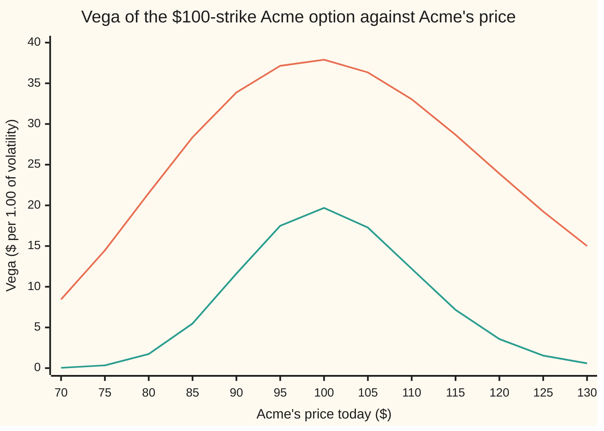

# Vega: what one point of volatility is worth

[Syllabus](../../../SYLLABUS.md) → [Financial mathematics](../../../SYLLABUS.md#w12) → [The Greeks, one each](../../../SYLLABUS.md#w12-s09) → Vega

---

## General Overview

Acme shares trade at $100. A one-year call option lets its owner buy one share at $100 a year from now. Cash earns 5 percent a year, Acme pays a 2 percent dividend yield, and the market prices the call as if Acme's yearly swings had a spread of 20 percent. That spread is the **volatility**: the standard deviation of a year's log return, the natural log of the year-end price over today's. At 20 percent the call costs $9.23.

Overnight, nothing happens to Acme. Its price is still $100. But option traders grow more nervous, and the volatility they price rises from 20 percent to 21 percent. The call is now worth $9.61. The share did not move; the option gained 38 cents.

That 38 cents has a name. The rate at which an option's price changes as volatility changes, with every other input held still, is **vega**. For the Acme call it is $37.90 per unit of volatility. One unit is a move of 1.00 in the volatility number, from 20 percent to 120 percent, which never happens. So desks divide by 100 and quote vega per **volatility point**, one percentage point: $0.379. The put on the same share, strike and date gains the same 38 cents.

The card derives the formula for vega, shows it is always positive, and shows why it is largest near the strike, fades far from it, and grows with the square root of time. Then it uses vega for its main daily job: steering the search that turns a quoted price back into a volatility.

**Vega is the share value at stake, times the height of the bell curve at the strike's distance, times the square root of the time left; the same number serves the call and the put.**

**What kind of fact this is:** a theorem inside the Black–Scholes model, proved on this card in Why it works. The model itself is an assumption: it treats volatility as one fixed number, and vega asks what happens if that number is wrong.

### The picture: a hump around the strike



Upper curve: one year to expiry. Lower curve: three months. Both are humps. An option far from its strike has its fate nearly settled, so a little more volatility changes little. An option near the strike could still go either way, and it is the one that responds. The shorter option's hump is lower and narrower: less time for extra volatility to act. The one-year hump peaks at $99.00 of Acme price, not at $100; Step 6 says why.

---

## The formula

Notation first, in words. Vega is written with a script capital V, $\mathcal{V}$, because there is no Greek letter vega; the name was coined on trading floors to sound like the other Greeks. The partial derivative $\partial C/\partial\sigma$ means the slope of the call price $C$ against volatility $\sigma$ with every other input frozen ([Partial derivatives](../../06-Calculus%20and%20analysis/07-Several%20Variables/01-partial-derivatives.md)).

$$\mathcal{V} \;=\; \frac{\partial C}{\partial \sigma} \;=\; \frac{\partial P}{\partial \sigma} \;=\; S\,e^{-qT}\,\varphi(d_1)\,\sqrt{T}$$

**Read it aloud: the share value at stake, times how much probability sits at the strike's distance, times how long the extra volatility has to work.**

The same number has a cash-side form, from an identity proved in Step 1:

$$\mathcal{V} \;=\; K\,e^{-rT}\,\varphi(d_2)\,\sqrt{T}$$

For small moves, vega turns a change in volatility into a change in price: $C(\sigma + \Delta\sigma) \approx C(\sigma) + \mathcal{V}\,\Delta\sigma$.

| Symbol | Plain meaning | In our example | Push it up and the answer… |
| --- | --- | --- | --- |
| $\mathcal{V}$ | vega: dollars of option price per 1.00 of volatility | 37.90, or 0.379 per point | — |
| $C$, $P$ | call and put prices | $9.23 and $6.33 | — |
| $S$, $S_T$ | Acme's price today, and at expiry | $100 today | vega falls; its peak is at $99.00 |
| $K$ | the strike, the price the option lets its owner deal at | $100 | vega rises, peaks at $105.13, then falls |
| $r$ | riskless rate, continuously compounded | 5% | shifts the hump sideways through $d_1$ |
| $q$ | dividend yield, continuously compounded | 2% | shrinks the share value at stake, and shifts the hump |
| $\sigma$, $\Delta\sigma$ | volatility, and a small change in it | 20%, and 0.01 | near the strike, barely moves vega: 36.78 at 10%, 37.90 at 30% |
| $T$ | time to expiry, in years | 1 | rises with $\sqrt{T}$ while short: 19.69 at three months; peaks at 75.58 near 9.76 years |
| $d_1$, $d_2$ | the strike's distance, in standard deviations, counted in shares and in cash | 0.25 and 0.05 | the further from 0, the smaller vega |
| $\varphi(x)$, $N(x)$ | bell-curve height at $x$, and area to the left of $x$ | $\varphi(0.25) = 0.386668$ | — |
| $e^{-rT}$, $e^{-qT}$ | discount factor, and dividend drag | 0.951 and 0.980 | — |
| $\Gamma$ | gamma, the slope of delta against the share price | 0.018951 | — |

The helpers are the pilot's ([Black–Scholes call](../08-The%20Black-Scholes%20call%20and%20put/01-black-scholes-call.md)):

$$d_1 = \frac{\ln(S/K) + (r - q + \tfrac12\sigma^2)\,T}{\sigma\sqrt{T}}, \qquad d_2 = d_1 - \sigma\sqrt{T}, \qquad \varphi(x) = \frac{e^{-x^2/2}}{\sqrt{2\pi}}$$

In words: $d_1$ and $d_2$ are how far Acme sits from the strike, measured in units of its whole-life spread $\sigma\sqrt{T}$; $\varphi$ is the bell curve's height, whose area to the left of $x$ is $N(x)$.

### When it holds

- **One volatility for every strike and date.** Real markets quote a different implied volatility for each strike, called the smile. Vega here is the price change when every one of them rises together; a move in one strike's volatility alone needs a separate, bucketed vega.
- **Small moves.** Vega is a first slope. From 20 to 21 percent the full reprice is 0.379118 against vega's 0.379012; for moves of several points add the curvature, [Volga](07-volga.md).
- **European exercise and a continuous dividend yield.** An American put or a stock with lumpy dividends has a different price, so a different slope.
- **Positive time and positive volatility.** At expiry the price is the payoff, which has no volatility in it, and vega is zero.

---

## Why it works

### Step 0: volatility hides inside two bell-curve areas

The call price is $C = S e^{-qT} N(d_1) - K e^{-rT} N(d_2)$. Volatility appears nowhere outside $d_1$ and $d_2$. So the slope in $\sigma$ comes from how fast the two areas $N(d_1)$ and $N(d_2)$ change. The slope of a bell-curve area is the bell curve's height: $N$ grows at rate $\varphi$. Differentiating therefore trades areas for heights. One identity then makes almost everything cancel.

### Step 1: the share side and the cash side carry equal weight at the strike

The claim: $S e^{-qT}\varphi(d_1) = K e^{-rT}\varphi(d_2)$. For Acme, $98.019867 \times 0.386668$ and $95.122942 \times 0.398444$ are both $37.901158$.

The proof is two lines. Since $d_1 - d_2 = \sigma\sqrt{T}$, the difference of squares is

$$d_1^2 - d_2^2 = (d_1 - d_2)(d_1 + d_2) = 2\ln(S/K) + 2(r - q)T.$$

The ratio of heights is $\varphi(d_1)/\varphi(d_2) = e^{-(d_1^2 - d_2^2)/2} = (K/S)\,e^{-(r-q)T}$. Multiply both sides by $S e^{-qT}\varphi(d_2)$ and the identity appears.

### Step 2: differentiate each half

The share value, strike, rates and time are frozen, so only $d_1$ and $d_2$ move. The chain rule gives

$$\frac{\partial C}{\partial \sigma} = S e^{-qT}\varphi(d_1)\,\frac{\partial d_1}{\partial \sigma} \;-\; K e^{-rT}\varphi(d_2)\,\frac{\partial d_2}{\partial \sigma}.$$

Each of $\partial d_1/\partial\sigma$ and $\partial d_2/\partial\sigma$ is messy on its own.

### Step 3: the mess cancels

By Step 1 the two front factors are the same number. Pull it out:

$$\frac{\partial C}{\partial \sigma} = S e^{-qT}\varphi(d_1)\left(\frac{\partial d_1}{\partial \sigma} - \frac{\partial d_2}{\partial \sigma}\right) = S e^{-qT}\varphi(d_1)\,\frac{\partial (d_1 - d_2)}{\partial \sigma}.$$

The difference $d_1 - d_2$ is $\sigma\sqrt{T}$, whose slope in $\sigma$ is $\sqrt{T}$. That proves the formula. The messy slopes were never needed, only their difference.

### Step 4: the put has the same vega

Put–call parity says $C - P = S e^{-qT} - K e^{-rT}$. The right side holds no $\sigma$, so its slope in $\sigma$ is zero, and $\partial P/\partial\sigma = \partial C/\partial\sigma$ exactly. The call and the put differ by a forward contract, and a forward, having no choice in it, does not care how widely the share might spread.

### Step 5: vega is always positive

Every factor is positive whenever the share price, strike, volatility and time are positive: a share price, an exponential, a bell-curve height, a square root. So a long call or a long put always gains when volatility rises. The reason in words: an option keeps the good outcomes and discards the bad, so a wider spread of outcomes adds to the good tail without adding to the loss.

### Step 6: it fades away from the strike, and peaks off it

As Acme's price runs far above or far below the strike, $d_1$ runs off to plus or minus infinity. The bell-curve height $\varphi(d_1)$ collapses faster than the share price grows, so vega goes to zero at both ends: the hump in the picture.

Where is the top? It depends on which input is varied. Holding the strike fixed and varying the share price, vega peaks where $d_2 = 0$: at $S = K e^{-(r - q - \sigma^2/2)T}$, which is $99.00. Holding the share price fixed and varying the strike, vega peaks where $d_1 = 0$: at $K = S e^{(r - q + \sigma^2/2)T}$, which is $105.13. Neither peak is at the $100 strike, and the second is not even at the forward price $F = S e^{(r-q)T}$, $103.05.

<details>
<summary>Detailed proof: where vega peaks</summary>

**In the share price.** Write vega as $e^{-qT}\sqrt{T}\cdot S\varphi(d_1)$. Since $\partial d_1/\partial S = 1/(S\sigma\sqrt{T})$ and $\varphi'(x) = -x\varphi(x)$,
$$\frac{\partial \mathcal{V}}{\partial S} = e^{-qT}\sqrt{T}\,\varphi(d_1)\left(1 - \frac{d_1}{\sigma\sqrt{T}}\right).$$
The bracket is positive while $d_1 < \sigma\sqrt{T}$ and negative after, and $d_1$ rises steadily with $S$. So vega rises, then falls, with one peak where $d_1 = \sigma\sqrt{T}$, that is $d_2 = 0$. Solving $\ln(S/K) + (r - q - \tfrac12\sigma^2)T = 0$ gives $S = K e^{-(r - q - \sigma^2/2)T}$.

**In the strike.** The strike enters only through $d_1$, with $\partial d_1/\partial K = -1/(K\sigma\sqrt{T})$. So
$$\frac{\partial \mathcal{V}}{\partial K} = S e^{-qT}\sqrt{T}\,\bigl(-d_1\varphi(d_1)\bigr)\left(-\frac{1}{K\sigma\sqrt{T}}\right) = \frac{S e^{-qT}\,d_1\,\varphi(d_1)}{K\sigma}.$$
This is positive while $d_1 > 0$ and negative after, and $d_1$ falls steadily as $K$ rises. One peak, at $d_1 = 0$: $K = S e^{(r - q + \sigma^2/2)T}$.

**At the ends.** As $S$ grows, $d_1$ grows like $\ln S/(\sigma\sqrt{T})$, and $\varphi(d_1)$ shrinks like $e^{-(\ln S)^2/(2\sigma^2 T)}$, which beats any power of $S$. As $S$ shrinks to zero, the factor $S$ itself goes to zero while $\varphi$ stays below 0.4. Both ends go to zero.

</details>

### Step 7: the square root of time

Volatility is quoted per year, but it acts over $T$ years. Independent yearly wiggles add in variance, so the whole-life spread is $\sigma\sqrt{T}$, and a slope in $\sigma$ picks up $\sqrt{T}$. For an option near its strike with little time left, $\varphi(d_1)$ is close to its top value, $\varphi(0) = 0.398942$, and $e^{-qT}$ is close to 1, so vega is about $0.4\,S\sqrt{T}$. Four times the time, about twice the vega: 19.69 at three months, 37.90 at one year.

The square root is exact, but the other two factors are not constant. Over long horizons the dividend drag $e^{-qT}$ shrinks and the drift pushes $d_1$ away from zero, lowering $\varphi(d_1)$. For the $100-strike Acme option, vega peaks at 75.58 near 9.76 years and falls after:

```
vega of the $100-strike Acme option, by years to expiry; one block = $2.50 per 1.00 of volatility
 0.25   ████████                        $19.69
 0.5    ███████████                     $27.50
 1      ███████████████                 $37.90
 2      ████████████████████            $50.92
 4      ██████████████████████████      $65.00
 10     ██████████████████████████████  $75.57
 20     ██████████████████████████      $64.01
 30     ███████████████████             $46.96
```

So "vega grows with the square root of time" is a statement about short and middle maturities, not a law for every horizon.

### The other road: vega is gamma, scaled

The sibling [Gamma](02-gamma.md) finds $\Gamma = e^{-qT}\varphi(d_1)/(S\sigma\sqrt{T})$. Multiply by $\sigma T S^2$ and vega appears:

$$\mathcal{V} = \sigma\,T\,S^2\,\Gamma.$$

For Acme, $0.2 \times 1 \times 10{,}000 \times 0.018951 = 37.90$. The meaning: a hedged option earns about half of gamma times each squared share move, and over the life those squares add up to about $S^2\sigma^2 T$. So the expected hedging profit is about $\tfrac12\Gamma S^2\sigma^2 T$. Its slope in $\sigma$ is $\Gamma S^2\sigma T$: vega is how fast that profit grows as volatility rises, not the profit itself. The accounting is [Theta pays for gamma](10-theta-pays-for-gamma-hedged-pnl.md).

---

## Worked numbers, by hand

Acme: $S = 100$, $K = 100$, $r = 5\%$, $q = 2\%$, $\sigma = 20\%$, $T = 1$ year.

| Step | Arithmetic | Value |
| --- | --- | --- |
| $\ln(S/K)$ | $\ln 1$ | 0 |
| $(r - q + \tfrac12\sigma^2)T$ | $0.05 - 0.02 + 0.02$ | 0.05 |
| $\sigma\sqrt{T}$ | $0.20 \times 1$ | 0.20 |
| $d_1$ | $0.05 / 0.20$ | 0.25 |
| $\varphi(d_1)$ | $e^{-0.03125} / 2.506628$ | 0.386668 |
| $S e^{-qT}$ | $100 \times e^{-0.02}$ | 98.019867 |
| **vega** | $98.019867 \times 0.386668 \times 1$ | **37.901158** |
| per volatility point | $37.901158 / 100$ | **0.379012** |
| call at 21%, repriced in full | Black–Scholes at $\sigma = 0.21$ | $9.606124 |
| true change, 20% to 21% | $9.606124 - 9.227006$ | 0.379118 |
| vega plus half of volga times $0.01^2$ | $0.379012 + \tfrac12 \times 2.368822 \times 0.0001$ | 0.379130 |

One volatility point is worth 37.9 cents on a $9.23 option. Vega's estimate, 0.379012, sits just under the full reprice, 0.379118; adding the curvature term gives 0.379130, closer still. The put moves the same 37.9 cents, from $6.330081 to $6.709199.

### Steering by vega: an implied volatility in three steps

Markets quote prices; the volatility is hidden inside them. Suppose the one-year Acme call is quoted at $12.00. Which volatility reproduces it? One exists only if the quote lies strictly between the price at zero volatility, $\max(S e^{-qT} - K e^{-rT}, 0) = 2.896925$, and the limit as volatility grows without bound, $S e^{-qT} = 98.019867$. At either bound, or outside, no finite positive volatility fits. $12.00 is inside. Newton's method guesses, prices, and corrects by the gap divided by the slope, and the slope is vega:

$$\sigma_{\text{new}} = \sigma_{\text{old}} - \frac{C(\sigma_{\text{old}}) - 12.00}{\mathcal{V}(\sigma_{\text{old}})}.$$

| Step | Arithmetic | Volatility |
| --- | --- | --- |
| start | the market's last volatility | 0.20 |
| 1 | $0.20 - (9.227006 - 12.00) / 37.901158$ | 0.273164 |
| 2 | reprice at 0.273164, divide the gap by vega there | 0.273094 |
| 4 | two more steps change nothing at six decimals | **0.273094** |
| bisection | halve a bracket from 1% to 200%, sixty times | 0.273094 |

Two roads, one answer: 27.31 percent. Because vega is always positive (Step 5), the price climbs steadily with volatility, so at most one volatility fits a quote. Existence, the bounds on a quote, and a guaranteed starting point are [Implied volatility](../11-Implied%20volatility%20and%20the%20vanilla%20inverses/01-implied-volatility.md).

The hazard is Step 6. Far from the strike, vega is tiny, and dividing by it throws Newton off the map. A $150-strike Acme call quoted at $4.368927 (its price at 40 percent) has vega 0.040926 at a 10 percent start. The first Newton step lands at a volatility of 106.85: over ten thousand percent.

### What breaks if you drop a piece

| Mistake | Comes out at | What went wrong |
| --- | --- | --- |
| Area $N(d_1)$ in place of height $\varphi(d_1)$ | 58.69 | That is the share half of the price, not a slope |
| Share side paired with $\varphi(d_2)$ | 39.06 | Each front factor has its own height; mixed, neither form holds |
| No $\sqrt{T}$, four-year option | 32.50 (right: 65.00) | Volatility acts over the whole life, in variance |
| Vega per 1.00 applied to one point | $37.90 predicted for 20% to 21% | The quoted move is 0.01, so 0.379 |
| "1 percent" read as 20% to 20.2% | 0.0758 | A relative move, a fifth of a volatility point |

Every number in the table is printed by both checks.

---

## Code, from first principles, and it actually runs

The checks build their own bell-curve area: Python sums its series, $N(x) = \tfrac12 + \varphi(x)(x + x^3/3 + x^5/15 + \dots)$, and Rust adds thin slices under the curve by Simpson's rule. Vega is then reached seven ways: the formula; its cash-side form; bumping the formula price up and down in $\sigma$; bumping a price built by Simpson's rule over the bell curve, which uses no $d_1$, $d_2$ or $N$; bumping a put built the same way; a pathwise Monte Carlo, which differentiates each simulated path, using $\partial S_T/\partial\sigma = S_T(\sqrt{T}Z - \sigma T)$ for the final price $S_T$ driven by a bell-curve draw $Z$, from home-made random numbers; and gamma from a second difference of the price, scaled by $\sigma T S^2$. Grid searches find the peaks, Newton and bisection find the implied volatility, and every number on the card is printed.

### Python

```python
# Vega -- the check behind the card.  Standard library only, and nothing
# imported knows the answer: the bell-curve area N(x) is summed from its own
# series, the integrals are Simpson's rule, the random numbers are home-made.
from math import log, sqrt, exp, pi, cos

def phi(x): return exp(-0.5 * x * x) / sqrt(2.0 * pi)     # bell-curve height at x
def N(x):                                                 # bell-curve area left of x
    if abs(x) > 8.5: return 0.0 if x < 0 else 1.0
    term, total, k = x, x, 0                              # x + x^3/3 + x^5/(3*5) + ...
    while abs(term) > 1e-17 * abs(total):
        k += 1
        term *= x * x / (2 * k + 1)
        total += term
    return 0.5 + phi(x) * total

def d1d2(S, K, r, q, s, T):
    d1 = (log(S / K) + (r - q + 0.5 * s * s) * T) / (s * sqrt(T))
    return d1, d1 - s * sqrt(T)
def call(S, K, r, q, s, T):
    d1, d2 = d1d2(S, K, r, q, s, T)
    return S * exp(-q * T) * N(d1) - K * exp(-r * T) * N(d2)
def vega(S, K, r, q, s, T):                               # the card's formula
    return S * exp(-q * T) * phi(d1d2(S, K, r, q, s, T)[0]) * sqrt(T)

def simpson_price(S, K, r, q, s, T, payoff, n=20000):     # no d1, no d2, no N
    a, h = -10.0, 20.0 / n
    f = lambda z: payoff(S * exp((r - q - 0.5 * s * s) * T + s * sqrt(T) * z)) * phi(z)
    tot = f(a) + f(a + n * h)
    for i in range(1, n): tot += (4 if i % 2 else 2) * f(a + i * h)
    return exp(-r * T) * tot * h / 3.0

S, K, r, q, s, T = 100.0, 100.0, 0.05, 0.02, 0.20, 1.0
d1, d2 = d1d2(S, K, r, q, s, T)
v = vega(S, K, r, q, s, T)
v_cash = K * exp(-r * T) * phi(d2) * sqrt(T)
h = 1e-4
bump = (call(S, K, r, q, s + h, T) - call(S, K, r, q, s - h, T)) / (2 * h)
cpay, ppay = (lambda x: max(x - K, 0.0)), (lambda x: max(K - x, 0.0))
bump_int = (simpson_price(S, K, r, q, s + h, T, cpay) - simpson_price(S, K, r, q, s - h, T, cpay)) / (2 * h)
bump_put = (simpson_price(S, K, r, q, s + h, T, ppay) - simpson_price(S, K, r, q, s - h, T, ppay)) / (2 * h)

state = 20260919                                          # splitmix64 random numbers
def uniform():
    global state
    state = (state + 0x9E3779B97F4A7C15) & 0xFFFFFFFFFFFFFFFF
    z = state
    z = ((z ^ (z >> 30)) * 0xBF58476D1CE4E5B9) & 0xFFFFFFFFFFFFFFFF
    z = ((z ^ (z >> 27)) * 0x94D049BB133111EB) & 0xFFFFFFFFFFFFFFFF
    return ((z ^ (z >> 31)) >> 11) * 2.0 ** -53 + 2.0 ** -54
paths, acc, acc2 = 200000, 0.0, 0.0
for _ in range(paths):                                    # pathwise: d(payoff)/d(sigma) per path
    z = sqrt(-2.0 * log(uniform())) * cos(2.0 * pi * uniform())
    ST = S * exp((r - q - 0.5 * s * s) * T + s * sqrt(T) * z)
    g = exp(-r * T) * ST * (sqrt(T) * z - s * T) if ST > K else 0.0
    acc += g; acc2 += g * g
mc = acc / paths
mc_se = sqrt((acc2 / paths - mc * mc) / paths)

def curve(f, x, e):                                       # second difference, Richardson-refined
    d = lambda e: (f(x + e) - 2 * f(x) + f(x - e)) / e ** 2
    return (4 * d(e) - d(2 * e)) / 3
gamma = curve(lambda y: call(y, K, r, q, s, T), S, 0.1)
volga = curve(lambda y: call(S, K, r, q, y, T), s, 2e-3)
c20, c21 = call(S, K, r, q, 0.20, T), call(S, K, r, q, 0.21, T)
p20 = c20 - S * exp(-q * T) + K * exp(-r * T)
peak_s = max((vega(70 + i / 1000, K, r, q, s, T), 70 + i / 1000) for i in range(60001))[1]
peak_k = max((vega(S, 70 + i / 1000, r, q, s, T), 70 + i / 1000) for i in range(60001))[1]
peak_t = max((vega(S, K, r, q, s, i / 100), i / 100) for i in range(1, 3001))[1]
grid = [vega(S, k, r, q, s, t) for k in range(60, 161, 5) for t in (0.25, 1, 5, 30)]

quote, x, steps = 12.0, 0.20, []                          # implied vol: Newton steers by vega
for _ in range(4):
    x -= (call(S, K, r, q, x, T) - quote) / vega(S, K, r, q, x, T); steps.append(x)
lo, hi = 0.01, 2.0                                        # a second road: bisection
for _ in range(60):
    mid = 0.5 * (lo + hi)
    lo, hi = (mid, hi) if call(S, K, r, q, mid, T) < quote else (lo, mid)
far_q = call(S, 150.0, r, q, 0.40, T)                     # a far strike, a poor start
far_v = vega(S, 150.0, r, q, 0.10, T)
far_step = 0.10 - (call(S, 150.0, r, q, 0.10, T) - far_q) / far_v
far_step20 = 0.20 - (call(S, 150.0, r, q, 0.20, T) - far_q) / vega(S, 150.0, r, q, 0.20, T)

rows = [("d1", d1), ("d2", d2), ("phi(d1)", phi(d1)), ("phi(d2)", phi(d2)),
    ("S e^-qT", S * exp(-q * T)), ("K e^-rT", K * exp(-r * T)),
    ("1 vega, S e^-qT phi(d1) rootT", v), ("2 vega, K e^-rT phi(d2) rootT", v_cash),
    ("3 bump the formula price", bump), ("4 bump the Simpson call", bump_int),
    ("5 bump the Simpson put", bump_put), ("6 pathwise Monte Carlo", mc), ("  standard error", mc_se),
    ("7 gamma by bump", gamma), ("  sigma T S^2 gamma", s * T * S * S * gamma),
    ("per vol point", v / 100), ("call at 20%", c20), ("call at 21%", c21),
    ("  full reprice, 20% to 21%", c21 - c20), ("  vega times 0.01", v * 0.01),
    ("volga by bump", volga), ("  plus half volga times 0.01^2", v * 0.01 + 0.5 * volga * 1e-4),
    ("put at 20%, by parity", p20), ("put at 21%, by parity", c21 - S * exp(-q * T) + K * exp(-r * T)),
    ("forward S e^(r-q)T", S * exp((r - q) * T)),
    ("peak in spot, K e^-(r-q-s^2/2)T", K * exp(-(r - q - 0.5 * s * s) * T)), ("  grid search", peak_s),
    ("peak in strike, S e^(r-q+s^2/2)T", S * exp((r - q + 0.5 * s * s) * T)), ("  grid search", peak_k),
    ("peak in maturity, grid (years)", peak_t), ("  vega there", vega(S, K, r, q, s, peak_t)),
    ("smallest vega on an 84-point grid", min(grid)),
    ("wrong: N(d1) for phi(d1)", S * exp(-q * T) * N(d1) * sqrt(T)),
    ("wrong: S e^-qT with phi(d2)", S * exp(-q * T) * phi(d2) * sqrt(T)),
    ("wrong: no rootT, 4 years", vega(S, K, r, q, s, 4.0) / 2.0), ("  right, 4 years", vega(S, K, r, q, s, 4.0)),
    ("wrong: 20% to 20.2%, vega x 0.002", v * 0.002),
    ("Newton, quote 12.00, step 1", steps[0]), ("  step 2", steps[1]), ("  step 4", steps[3]),
    ("  bisection, 60 halvings", 0.5 * (lo + hi)),
    ("far: K 150 call at 40% vol", far_q), ("  vega at a 10% start", far_v), ("  first Newton step", far_step),
    ("  first step from a 20% start", far_step20), ("call at 1e-6 vol, the floor", call(S, K, r, q, 1e-6, T)),
    ("try: vega at 10% vol", vega(S, K, r, q, 0.10, T)), ("try: vega at 30% vol", vega(S, K, r, q, 0.30, T)),
    ("try: vega at 3 months", vega(S, K, r, q, s, 0.25)), ("phi(0), top of the bell curve", phi(0.0))]
for name, val in rows: print(f"{name:<34} {val:>16.6f}")
spots = list(range(70, 131, 5))
print("chart spot " + " ".join(f"{x:6d}" for x in spots))
for t in (1.0, 0.25): print(f"chart T={t:<4}" + " ".join(f"{vega(float(x), K, r, q, s, t):6.2f}" for x in spots))
mats = (0.25, 0.5, 1, 2, 4, 10, 20, 30)
print("bars " + " ".join(f"{t}y {vega(S, K, r, q, s, t):.2f}" for t in mats))

assert abs(v - 37.901157510017) < 1e-9, "formula vs the shelf's house vega"
assert abs(v_cash - v) < 1e-12, "share side vs cash side, Step 1"
assert abs(bump - v) < 1e-6, "bumped formula price vs vega"
assert abs((call(S, K, r, q, s + h, 4.0) - call(S, K, r, q, s - h, 4.0)) / (2 * h)
           - vega(S, K, r, q, s, 4.0)) < 1e-6, "bumped price vs vega at four years"
assert abs(bump_int - v) < 1e-4, "bumped Simpson call vs vega"
assert abs(bump_put - v) < 1e-4, "put vega by its own integral vs call vega"
assert abs(mc - v) < 3 * mc_se, "pathwise Monte Carlo within three standard errors"
assert abs(s * T * S * S * gamma - v) < 1e-4, "gamma link"
assert abs(peak_s - K * exp(-(r - q - 0.5 * s * s) * T)) < 2e-3, "peak in spot"
assert abs(peak_k - S * exp((r - q + 0.5 * s * s) * T)) < 2e-3, "peak in strike"
assert min(grid) > 0, "vega positive everywhere on the grid"
assert abs(steps[3] - 0.5 * (lo + hi)) < 1e-9, "Newton vs bisection"
print("ALL CHECKS PASS")
```

**Ran 2026-09-24 on macOS, Python 3.14.6, standard library only. All checks passed. Output, pasted from the run:**

```
d1                                         0.250000
d2                                         0.050000
phi(d1)                                    0.386668
phi(d2)                                    0.398444
S e^-qT                                   98.019867
K e^-rT                                   95.122942
1 vega, S e^-qT phi(d1) rootT             37.901158
2 vega, K e^-rT phi(d2) rootT             37.901158
3 bump the formula price                  37.901157
4 bump the Simpson call                   37.901158
5 bump the Simpson put                    37.901158
6 pathwise Monte Carlo                    37.877491
  standard error                           0.164207
7 gamma by bump                            0.018951
  sigma T S^2 gamma                       37.901158
per vol point                              0.379012
call at 20%                                9.227006
call at 21%                                9.606124
  full reprice, 20% to 21%                 0.379118
  vega times 0.01                          0.379012
volga by bump                              2.368822
  plus half volga times 0.01^2             0.379130
put at 20%, by parity                      6.330081
put at 21%, by parity                      6.709199
forward S e^(r-q)T                       103.045453
peak in spot, K e^-(r-q-s^2/2)T           99.004983
  grid search                             99.005000
peak in strike, S e^(r-q+s^2/2)T         105.127110
  grid search                            105.127000
peak in maturity, grid (years)             9.760000
  vega there                              75.578954
smallest vega on an 84-point grid          0.000022
wrong: N(d1) for phi(d1)                  58.685115
wrong: S e^-qT with phi(d2)               39.055420
wrong: no rootT, 4 years                  32.499726
  right, 4 years                          64.999452
wrong: 20% to 20.2%, vega x 0.002          0.075802
Newton, quote 12.00, step 1                0.273164
  step 2                                   0.273094
  step 4                                   0.273094
  bisection, 60 halvings                   0.273094
far: K 150 call at 40% vol                 4.368927
  vega at a 10% start                      0.040926
  first Newton step                      106.845750
  first step from a 20% start              0.707846
call at 1e-6 vol, the floor                2.896925
try: vega at 10% vol                      36.781009
try: vega at 30% vol                      37.901158
try: vega at 3 months                     19.693172
phi(0), top of the bell curve              0.398942
chart spot     70     75     80     85     90     95    100    105    110    115    120    125    130
chart T=1.0   8.45  14.47  21.51  28.37  33.87  37.15  37.90  36.34  33.04  28.67  23.90  19.24  15.01
chart T=0.25  0.04   0.34   1.73   5.48  11.61  17.49  19.69  17.27  12.21   7.16   3.57   1.54   0.59
bars 0.25y 19.69 0.5y 27.50 1y 37.90 2y 50.92 4y 65.00 10y 75.57 20y 64.01 30y 46.96
ALL CHECKS PASS
```

### Rust

```rust
// Vega -- the same check as vega_check.py, in Rust.  Standard library only,
// no crates.  Rust has no erf, so the bell-curve area N(x) is built by adding
// thin slices under the curve (Simpson); the random numbers are home-made.
use std::f64::consts::PI;

fn phi(x: f64) -> f64 { (-0.5 * x * x).exp() / (2.0 * PI).sqrt() }   // bell-curve height
fn simpson<F: Fn(f64) -> f64>(f: F, a: f64, b: f64, n: usize) -> f64 {
    let h = (b - a) / n as f64;
    let mut s = f(a) + f(b);
    for i in 1..n { s += if i % 2 == 1 { 4.0 } else { 2.0 } * f(a + i as f64 * h); }
    s * h / 3.0
}
fn n_cdf(x: f64) -> f64 {                                             // area left of x
    if x.abs() > 8.5 { return if x < 0.0 { 0.0 } else { 1.0 }; }
    0.5 + simpson(phi, 0.0, x, 2000)
}
fn d1d2(s: f64, k: f64, r: f64, q: f64, v: f64, t: f64) -> (f64, f64) {
    let d1 = ((s / k).ln() + (r - q + 0.5 * v * v) * t) / (v * t.sqrt());
    (d1, d1 - v * t.sqrt())
}
fn call(s: f64, k: f64, r: f64, q: f64, v: f64, t: f64) -> f64 {
    let (d1, d2) = d1d2(s, k, r, q, v, t);
    s * (-q * t).exp() * n_cdf(d1) - k * (-r * t).exp() * n_cdf(d2)
}
fn vega(s: f64, k: f64, r: f64, q: f64, v: f64, t: f64) -> f64 {       // the card's formula
    s * (-q * t).exp() * phi(d1d2(s, k, r, q, v, t).0) * t.sqrt()
}
fn simpson_price<F: Fn(f64) -> f64>(s: f64, r: f64, q: f64, v: f64, t: f64, pay: F) -> f64 {
    let f = |z: f64| pay(s * ((r - q - 0.5 * v * v) * t + v * t.sqrt() * z).exp()) * phi(z);
    (-r * t).exp() * simpson(f, -10.0, 10.0, 20000)                    // no d1, no d2, no N
}
struct Rng(u64);                                                      // splitmix64
impl Rng {
    fn uniform(&mut self) -> f64 {
        self.0 = self.0.wrapping_add(0x9E3779B97F4A7C15);
        let mut z = self.0;
        z = (z ^ (z >> 30)).wrapping_mul(0xBF58476D1CE4E5B9);
        z = (z ^ (z >> 27)).wrapping_mul(0x94D049BB133111EB);
        ((z ^ (z >> 31)) >> 11) as f64 * 2f64.powi(-53) + 2f64.powi(-54)
    }
}
fn curve<F: Fn(f64) -> f64>(f: F, x: f64, e: f64) -> f64 {           // second difference, Richardson-refined
    let d = |e: f64| (f(x + e) - 2.0 * f(x) + f(x - e)) / (e * e);
    (4.0 * d(e) - d(2.0 * e)) / 3.0
}
fn argmax<F: Fn(f64) -> f64>(f: F, xs: impl Iterator<Item = f64>) -> f64 {
    let (mut best, mut arg) = (f64::MIN, 0.0);
    for x in xs { let y = f(x); if y > best { best = y; arg = x; } }
    arg
}

fn main() {
    let (s, k, r, q, v, t) = (100.0_f64, 100.0_f64, 0.05_f64, 0.02_f64, 0.20_f64, 1.0_f64);
    let (d1, d2) = d1d2(s, k, r, q, v, t);
    let vg = vega(s, k, r, q, v, t);
    let v_cash = k * (-r * t).exp() * phi(d2) * t.sqrt();
    let h = 1e-4;
    let bump = (call(s, k, r, q, v + h, t) - call(s, k, r, q, v - h, t)) / (2.0 * h);
    let cpay = |x: f64| (x - k).max(0.0);
    let ppay = |x: f64| (k - x).max(0.0);
    let bump_int = (simpson_price(s, r, q, v + h, t, cpay) - simpson_price(s, r, q, v - h, t, cpay)) / (2.0 * h);
    let bump_put = (simpson_price(s, r, q, v + h, t, ppay) - simpson_price(s, r, q, v - h, t, ppay)) / (2.0 * h);

    let mut rng = Rng(20260919);
    let (paths, mut acc, mut acc2) = (200000usize, 0.0_f64, 0.0_f64);
    for _ in 0..paths {                                               // pathwise: d(payoff)/d(sigma)
        let u1 = rng.uniform();
        let u2 = rng.uniform();
        let z = (-2.0 * u1.ln()).sqrt() * (2.0 * PI * u2).cos();
        let st = s * ((r - q - 0.5 * v * v) * t + v * t.sqrt() * z).exp();
        let g = if st > k { (-r * t).exp() * st * (t.sqrt() * z - v * t) } else { 0.0 };
        acc += g; acc2 += g * g;
    }
    let mc = acc / paths as f64;
    let mc_se = ((acc2 / paths as f64 - mc * mc) / paths as f64).sqrt();

    let gamma = curve(|y| call(y, k, r, q, v, t), s, 0.1);
    let volga = curve(|y| call(s, k, r, q, y, t), v, 2e-3);
    let (c20, c21) = (call(s, k, r, q, 0.20, t), call(s, k, r, q, 0.21, t));
    let carry = -s * (-q * t).exp() + k * (-r * t).exp();
    let peak_s = argmax(|x| vega(x, k, r, q, v, t), (0..60001).map(|i| 70.0 + i as f64 / 1000.0));
    let peak_k = argmax(|x| vega(s, x, r, q, v, t), (0..60001).map(|i| 70.0 + i as f64 / 1000.0));
    let peak_t = argmax(|x| vega(s, k, r, q, v, x), (1..3001).map(|i| i as f64 / 100.0));
    let mut grid = f64::MAX;
    for kk in (60..161).step_by(5) { for tt in [0.25, 1.0, 5.0, 30.0] { grid = grid.min(vega(s, kk as f64, r, q, v, tt)); } }

    let (quote, mut x, mut steps) = (12.0, 0.20_f64, Vec::new());   // implied vol: Newton steers by vega
    for _ in 0..4 { x -= (call(s, k, r, q, x, t) - quote) / vega(s, k, r, q, x, t); steps.push(x); }
    let (mut lo, mut hi) = (0.01_f64, 2.0_f64);                        // a second road: bisection
    for _ in 0..60 {
        let mid = 0.5 * (lo + hi);
        if call(s, k, r, q, mid, t) < quote { lo = mid; } else { hi = mid; }
    }
    let far_q = call(s, 150.0, r, q, 0.40, t);                         // a far strike, a poor start
    let far_v = vega(s, 150.0, r, q, 0.10, t);
    let far_step = 0.10 - (call(s, 150.0, r, q, 0.10, t) - far_q) / far_v;
    let far_step20 = 0.20 - (call(s, 150.0, r, q, 0.20, t) - far_q) / vega(s, 150.0, r, q, 0.20, t);

    let rows: Vec<(&str, f64)> = vec![("d1", d1), ("d2", d2), ("phi(d1)", phi(d1)), ("phi(d2)", phi(d2)),
        ("S e^-qT", s * (-q * t).exp()), ("K e^-rT", k * (-r * t).exp()),
        ("1 vega, S e^-qT phi(d1) rootT", vg), ("2 vega, K e^-rT phi(d2) rootT", v_cash),
        ("3 bump the formula price", bump), ("4 bump the Simpson call", bump_int),
        ("5 bump the Simpson put", bump_put), ("6 pathwise Monte Carlo", mc), ("  standard error", mc_se),
        ("7 gamma by bump", gamma), ("  sigma T S^2 gamma", v * t * s * s * gamma),
        ("per vol point", vg / 100.0), ("call at 20%", c20), ("call at 21%", c21),
        ("  full reprice, 20% to 21%", c21 - c20), ("  vega times 0.01", vg * 0.01),
        ("volga by bump", volga), ("  plus half volga times 0.01^2", vg * 0.01 + 0.5 * volga * 1e-4),
        ("put at 20%, by parity", c20 + carry), ("put at 21%, by parity", c21 + carry),
        ("forward S e^(r-q)T", s * ((r - q) * t).exp()),
        ("peak in spot, K e^-(r-q-s^2/2)T", k * (-(r - q - 0.5 * v * v) * t).exp()), ("  grid search", peak_s),
        ("peak in strike, S e^(r-q+s^2/2)T", s * ((r - q + 0.5 * v * v) * t).exp()), ("  grid search", peak_k),
        ("peak in maturity, grid (years)", peak_t), ("  vega there", vega(s, k, r, q, v, peak_t)),
        ("smallest vega on an 84-point grid", grid),
        ("wrong: N(d1) for phi(d1)", s * (-q * t).exp() * n_cdf(d1) * t.sqrt()),
        ("wrong: S e^-qT with phi(d2)", s * (-q * t).exp() * phi(d2) * t.sqrt()),
        ("wrong: no rootT, 4 years", vega(s, k, r, q, v, 4.0) / 2.0), ("  right, 4 years", vega(s, k, r, q, v, 4.0)),
        ("wrong: 20% to 20.2%, vega x 0.002", vg * 0.002),
        ("Newton, quote 12.00, step 1", steps[0]), ("  step 2", steps[1]), ("  step 4", steps[3]),
        ("  bisection, 60 halvings", 0.5 * (lo + hi)),
        ("far: K 150 call at 40% vol", far_q), ("  vega at a 10% start", far_v), ("  first Newton step", far_step),
        ("  first step from a 20% start", far_step20), ("call at 1e-6 vol, the floor", call(s, k, r, q, 1e-6, t)),
        ("try: vega at 10% vol", vega(s, k, r, q, 0.10, t)), ("try: vega at 30% vol", vega(s, k, r, q, 0.30, t)),
        ("try: vega at 3 months", vega(s, k, r, q, v, 0.25)), ("phi(0), top of the bell curve", phi(0.0))];
    for (name, val) in &rows { println!("{:<34} {:>16.6}", name, val); }
    let spots: Vec<i32> = (70..131).step_by(5).collect();
    println!("chart spot {}", spots.iter().map(|x| format!("{:6}", x)).collect::<Vec<_>>().join(" "));
    for (lab, tt) in [("chart T=1.0 ", 1.0), ("chart T=0.25", 0.25)] {
        println!("{}{}", lab, spots.iter().map(|x| format!("{:6.2}", vega(*x as f64, k, r, q, v, tt))).collect::<Vec<_>>().join(" "));
    }
    let mats = [0.25, 0.5, 1.0, 2.0, 4.0, 10.0, 20.0, 30.0];
    println!("bars {}", mats.iter().map(|m| format!("{}y {:.2}", m, vega(s, k, r, q, v, *m))).collect::<Vec<_>>().join(" "));

    assert!((vg - 37.901157510017).abs() < 1e-9, "formula vs the shelf's house vega");
    assert!((v_cash - vg).abs() < 1e-12, "share side vs cash side, Step 1");
    assert!((bump - vg).abs() < 1e-6, "bumped formula price vs vega");
    assert!(((call(s, k, r, q, v + h, 4.0) - call(s, k, r, q, v - h, 4.0)) / (2.0 * h)
        - vega(s, k, r, q, v, 4.0)).abs() < 1e-6, "bumped price vs vega at four years");
    assert!((bump_int - vg).abs() < 1e-4, "bumped Simpson call vs vega");
    assert!((bump_put - vg).abs() < 1e-4, "put vega by its own integral vs call vega");
    assert!((mc - vg).abs() < 3.0 * mc_se, "pathwise Monte Carlo within three standard errors");
    assert!((v * t * s * s * gamma - vg).abs() < 1e-4, "gamma link");
    assert!((peak_s - k * (-(r - q - 0.5 * v * v) * t).exp()).abs() < 2e-3, "peak in spot");
    assert!((peak_k - s * ((r - q + 0.5 * v * v) * t).exp()).abs() < 2e-3, "peak in strike");
    assert!(grid > 0.0, "vega positive everywhere on the grid");
    assert!((steps[3] - 0.5 * (lo + hi)).abs() < 1e-9, "Newton vs bisection");
    println!("ALL CHECKS PASS");
}
```

**Ran 2026-09-24 on macOS, rustc 1.98.1, no crates. All checks passed. Output, pasted from the run:**

```
d1                                         0.250000
d2                                         0.050000
phi(d1)                                    0.386668
phi(d2)                                    0.398444
S e^-qT                                   98.019867
K e^-rT                                   95.122942
1 vega, S e^-qT phi(d1) rootT             37.901158
2 vega, K e^-rT phi(d2) rootT             37.901158
3 bump the formula price                  37.901157
4 bump the Simpson call                   37.901158
5 bump the Simpson put                    37.901158
6 pathwise Monte Carlo                    37.877491
  standard error                           0.164207
7 gamma by bump                            0.018951
  sigma T S^2 gamma                       37.901158
per vol point                              0.379012
call at 20%                                9.227006
call at 21%                                9.606124
  full reprice, 20% to 21%                 0.379118
  vega times 0.01                          0.379012
volga by bump                              2.368822
  plus half volga times 0.01^2             0.379130
put at 20%, by parity                      6.330081
put at 21%, by parity                      6.709199
forward S e^(r-q)T                       103.045453
peak in spot, K e^-(r-q-s^2/2)T           99.004983
  grid search                             99.005000
peak in strike, S e^(r-q+s^2/2)T         105.127110
  grid search                            105.127000
peak in maturity, grid (years)             9.760000
  vega there                              75.578954
smallest vega on an 84-point grid          0.000022
wrong: N(d1) for phi(d1)                  58.685115
wrong: S e^-qT with phi(d2)               39.055420
wrong: no rootT, 4 years                  32.499726
  right, 4 years                          64.999452
wrong: 20% to 20.2%, vega x 0.002          0.075802
Newton, quote 12.00, step 1                0.273164
  step 2                                   0.273094
  step 4                                   0.273094
  bisection, 60 halvings                   0.273094
far: K 150 call at 40% vol                 4.368927
  vega at a 10% start                      0.040926
  first Newton step                      106.845750
  first step from a 20% start              0.707846
call at 1e-6 vol, the floor                2.896925
try: vega at 10% vol                      36.781009
try: vega at 30% vol                      37.901158
try: vega at 3 months                     19.693172
phi(0), top of the bell curve              0.398942
chart spot     70     75     80     85     90     95    100    105    110    115    120    125    130
chart T=1.0   8.45  14.47  21.51  28.37  33.87  37.15  37.90  36.34  33.04  28.67  23.90  19.24  15.01
chart T=0.25  0.04   0.34   1.73   5.48  11.61  17.49  19.69  17.27  12.21   7.16   3.57   1.54   0.59
bars 0.25y 19.69 0.5y 27.50 1y 37.90 2y 50.92 4y 65.00 10y 75.57 20y 64.01 30y 46.96
ALL CHECKS PASS
```

The two outputs agree line for line. Five of the seven roads land on 37.901158 at six decimals; the price bump reads 37.901157, a last-digit rounding of the same number; the Monte Carlo lands at 37.877491, well inside one standard error, 0.164207. Twelve asserts guard the roads. Each of these breaks trips at least one: the formula losing its $\sqrt{T}$, its dividend drag or its $d_1$; the cash-side form losing its own discount; the pathwise slope losing its $-\sigma T$.

> [!TIP]
> **Try changing**
> Guess the direction first. Then run it.
> - **Raise volatility to 30 percent.** Vega comes out at 37.901158, the same as at 20 percent. Here $d_1 = (r - q)/\sigma + \sigma/2$ is 0.25 at both, so the height is the same. At 10 percent it is 36.781009. Near the strike, vega hardly depends on the level of volatility.
> - **Cut the time to three months.** Vega falls to 19.693172, a shade over half the one-year value: the square root of a quarter is a half.
> - **Start Newton at 10 percent on the $150-strike call.** The first step lands at a volatility of 106.845750. Start at 20 percent instead: the first step lands at 0.707846, and Newton then settles on 40 percent.

---

## The usual mistake

> [!warning]
> **Mixing the two units.** The formula gives dollars per 1.00 of volatility, a move from 20 to 120 percent. Screens quote dollars per volatility point, a move of 0.01. The Acme call's 37.90 means 38 cents per point, not $37.90; a risk report that forgets the factor of 100 overstates the exposure a hundredfold.
>
> - **Area for height.** Vega uses the bell curve's height $\varphi(d_1)$. The area $N(d_1)$ belongs to delta; swapped in, it gives 58.69.
> - **"Vega peaks at the money."** Not exactly, and the place depends on what varies. Holding the strike, the peak is at a share price of $99.00; holding the share price, at a strike of $105.13. The forward is $103.05, which is neither.
> - **A relative "1 percent".** A move from 20 to 20.2 percent is worth 0.0758, a fifth of a point.
> - **A separate put vega.** Parity holds no volatility, so the put's vega is the call's, to the last digit.

---

## Where you meet it in real life

- **A volatility desk's risk report.** Positions are summed as vega per point: a book's vega per point is the dollars it gains if every implied volatility rises one point. Quoting convention, dated 2026-09-19: vega is shown per one point, a 0.01 move in volatility, as in Hull's textbook below.
- **Implied volatility solvers.** Many solvers behind a quoted "20 vol" use Newton's method steered by vega, with a guard for strikes where vega is tiny: [Implied volatility](../11-Implied%20volatility%20and%20the%20vanilla%20inverses/01-implied-volatility.md).
- **Hedging volatility.** Shares carry no vega, so volatility risk is hedged with other options. Matching vega at one strike leaves the change of vega with the share price and with volatility itself, which are [Vanna](06-vanna.md) and [Volga](07-volga.md).
- **Currencies and futures.** The same formula, with the foreign interest rate in place of $q$, or the discounted futures price $F e^{-rT}$ in place of $S e^{-qT}$: [The Greeks of a currency option](../21-FX%20vanilla%20options%20-%20Garman-Kohlhagen%20and%20the%20desk%20conventions/03-garman-kohlhagen-greeks.md), [Greeks of a futures option](../26-Options%20on%20commodity%20futures%20and%20spreads/02-futures-option-greeks.md).
- **Contracts where vega can turn negative.** Step 5 holds for plain calls and puts. A digital, which pays a fixed sum, or a knock-out barrier can lose value when volatility rises: [Digital Greeks and pin risk](../10-Digitals%20and%20the%20implied%20density/03-digital-greeks-and-pin-risk.md), [Barrier Greeks](../16-Barriers%2C%20touches%20and%20lookbacks/04-barrier-greeks-at-the-wall.md).
- **The whole Greek set.** Vega is one term in the price-change expansion that [The Greeks together](09-greeks-together-taylor-pnl.md) assembles with [Delta](01-delta.md), [Theta](04-theta.md) and [Rho and dividend rho](05-rho-and-dividend-rho.md).

> **Say it back**
> Vega is the slope of an option's price against volatility, with everything else frozen. In Black–Scholes it is the share value at stake, times the bell curve's height at the strike's distance, times the square root of time: 37.90 per unit for the Acme call, 38 cents per volatility point. The call and the put share it, because parity holds no volatility, and it is always positive for both. It is a hump around the strike, peaking a little off it, and it grows with the square root of time until the dividend drag and the drift take over. Implied-volatility solvers divide by it, which is why they need care where it is small.

---

## What this builds on

- [Delta](01-delta.md): the first Greek, and the same move (differentiate the price, watch the bell-curve heights cancel) done in the share price.
- [Partial derivatives](../../06-Calculus%20and%20analysis/07-Several%20Variables/01-partial-derivatives.md): a slope in one input with the others frozen, which is what vega is.

## Where this goes next

- [Vanna](06-vanna.md): how vega changes when the share price moves.
- [Volga](07-volga.md): how vega changes when volatility moves; the 2.368822 used above.
- [Digital Greeks and pin risk](../10-Digitals%20and%20the%20implied%20density/03-digital-greeks-and-pin-risk.md): a vega that changes sign at the strike.
- [Implied volatility](../11-Implied%20volatility%20and%20the%20vanilla%20inverses/01-implied-volatility.md): the inverse that vega steers, with existence and bounds.
- [Barrier Greeks](../16-Barriers%2C%20touches%20and%20lookbacks/04-barrier-greeks-at-the-wall.md): vega of a contract that can die.
- [Asian Greeks and implied volatility](../17-Averages%2C%20choosers%2C%20compounds%20and%20forward-starts/03-asian-greeks-and-implied-volatility.md): vega when the payoff averages away some of the volatility.
- [The Greeks of a currency option](../21-FX%20vanilla%20options%20-%20Garman-Kohlhagen%20and%20the%20desk%20conventions/03-garman-kohlhagen-greeks.md): the same formula for currencies, in desk units.
- [Greeks of a futures option](../26-Options%20on%20commodity%20futures%20and%20spreads/02-futures-option-greeks.md): the same formula on a futures price.
- [How the balance-sheet claims move](../43-Structural%20Models%20-%20Default%20from%20the%20Balance%20Sheet/02-structural-model-sensitivities.md): shares as a call on a firm's assets, and what the asset volatility's vega says about its debt.

Vega answers what one point of volatility is worth, but only for a small move and a fixed share price; how vega itself shifts when volatility or the share price moves is the question [Volga](07-volga.md) and [Vanna](06-vanna.md) answer.

---

## Sources

Verified 2026-09-19: every link below resolves to the publisher's page.

- Merton, Robert C. "Theory of Rational Option Pricing." *Bell Journal of Economics and Management Science* 4, no. 1 (1973): 141–183. [doi:10.2307/3003143](https://doi.org/10.2307/3003143). The price with a dividend yield, the formula this card differentiates.
- Black, Fischer, and Myron Scholes. "The Pricing of Options and Corporate Liabilities." *Journal of Political Economy* 81, no. 3 (1973): 637–654. [doi:10.1086/260062](https://doi.org/10.1086/260062). The original model, with volatility as a fixed input.
- Hull, John C. *Options, Futures, and Other Derivatives*, 11th ed. Pearson. [Publisher page](https://www.pearson.com/en-us/subject-catalog/p/options-futures-and-other-derivatives/P200000005938). The Greeks chapter: vega, its per-point quoting, and vega hedging with options.
- Manaster, Steven, and Gary Koehler. "The Calculation of Implied Variances from the Black-Scholes Model: A Note." *Journal of Finance* 37, no. 1 (1982): 227–230. [doi:10.1111/j.1540-6261.1982.tb01105.x](https://doi.org/10.1111/j.1540-6261.1982.tb01105.x). Newton's method steered by vega, with a starting point that converges.
- Brenner, Menachem, and Marti G. Subrahmanyam. "A Simple Formula to Compute the Implied Standard Deviation." *Financial Analysts Journal* 44, no. 5 (1988): 80–83. [doi:10.2469/faj.v44.n5.80](https://doi.org/10.2469/faj.v44.n5.80). The near-the-money shortcut behind "vega is about 0.4 times the share price times the square root of time".
