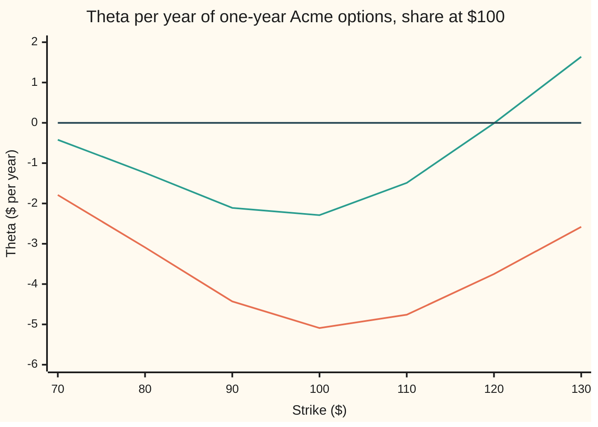
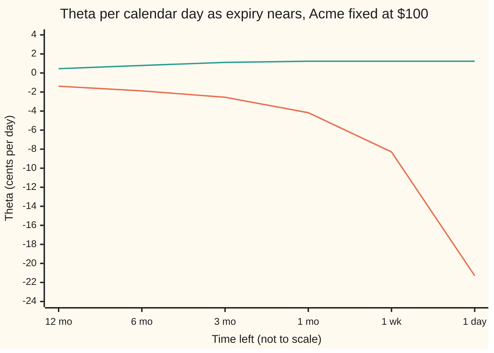

# Theta: what a day costs, and why it is rent rather than a fee

[Syllabus](../../../SYLLABUS.md) → [Financial mathematics](../README.md) → [The Greeks, one each](../README.md#s09) → Theta

---

## General Overview

Acme shares trade at $100. A one-year call on them, struck at $100, costs $9.23 in the house market: 5 percent interest, a 2 percent dividend yield, 20 percent volatility. (A call is the right, not the duty, to buy one share at the strike on the expiry date.)

Overnight, nothing happens. Acme opens at $100 again. Rates, dividends and volatility are unchanged. Only the calendar moved. Repriced the next morning, the call is worth about 1.4 cents less. The put, the right to sell at $100, loses about 0.6 cents. A put struck at $130 does something stranger: it gains about 0.4 cents.

That overnight change, per unit of time, is the option's **theta**. It is one partial derivative (a rate of change taken while every other input is held still): the slope of the price against the calendar.

A landlord makes a useful first picture. A fee buys nothing. Rent buys the use of something for a while. The holder of an option pays theta and, in return, holds **gamma**: the option gains on every sizeable move of the share, up or down. From here on the card uses the real words. Theta is the price of a day of gamma. It is paid whether or not the share moves, and it is earned back only if the share moves enough.

**Theta is the slope of an option's price against the calendar, with the share price frozen; in the Black-Scholes model it splits into a volatility term that always costs the holder and two carry terms (dividends and interest accruing while the option is held) that can pay, and net of carry it is exactly the rent on the option's gamma.**

**What kind of fact this is:** a theorem inside the Black-Scholes model, proved on this card in Why it works; quoting it per day instead of per year is a convention.

### The picture: theta across strikes

Every point is a one-year option in the house market, with Acme at $100. Only the strike changes.



Orange line: the call. Green line: the put. Dark line: zero. Both are most negative near the strike of $100, where the option is most uncertain. The call stays below zero at every strike on the chart. The put crosses zero near a strike of $120.04 and is positive beyond it: a deep put gains value as time passes.

---

## The formula

Notation first. A **partial derivative** measures how one quantity changes when a single input moves and all the others stay fixed; it is written with a curly $\partial V/\partial t$ ([Partial derivatives](../../06-Calculus%20and%20analysis/07-Several%20Variables/01-partial-derivatives.md)). Theta is the partial derivative of the option price with respect to today's date:

$$\Theta = \frac{\partial V}{\partial t} = -\frac{\partial V}{\partial T}$$

The date $t$ moves forward while the time left $T$ shrinks at the same speed, which is where the minus sign comes from. For a European call and put on a share paying a continuous dividend yield, differentiating the Black-Scholes prices gives

$$\Theta_C = -\frac{S e^{-qT}\,\phi(d_1)\,\sigma}{2\sqrt{T}} \;+\; q\,S e^{-qT} N(d_1) \;-\; r\,K e^{-rT} N(d_2)$$

$$\Theta_P = -\frac{S e^{-qT}\,\phi(d_1)\,\sigma}{2\sqrt{T}} \;-\; q\,S e^{-qT} N(-d_1) \;+\; r\,K e^{-rT} N(-d_2)$$

**Read it aloud:** a day costs the holder a slice of the option's uncertainty, then the two carry terms settle up for the dividends and the interest on the strike that one day nearer expiry changes.

The three terms, in plain words:

- **The volatility term** (first term, same in both formulas). One day less for the share to wander. Always negative for a holder.
- **The dividend term** (second). The share leaks dividends until the option is exercised. One day less of leakage helps the call, whose holder will own the share, and hurts the put, whose holder will deliver it.
- **The rate term** (third). The strike is cash paid or received at expiry. One day nearer, its discounted value grows. That hurts the call, which pays the strike, and helps the put, which receives it.

| Symbol | Plain meaning | In our example | Push it up and the answer… |
| --- | --- | --- | --- |
| $\Theta$, $\Theta_C$, $\Theta_P$, $\partial V/\partial t$ | theta (of the call, of the put): the price's rate of change against the calendar, dollars per year | call −5.089319, put −2.293569 | — |
| $V$, $C$, $P$ | the option's price; $C$ for the call, $P$ for the put | 9.227006 and 6.330081 | — |
| $t$, $T$ | today's date; the time left to expiry in years | $T$ = 1 | theta grows in size near expiry, at the strike |
| $S$ | Acme's share price today, frozen while theta is taken | $100 | moves the option away from or toward the strike |
| $K$ | the strike | $100 | the put's theta turns positive above $120.04 |
| $r$ | the riskless interest rate, continuously compounded | 5% | call theta falls, put theta rises |
| $q$ | the dividend yield: the share's payouts as a yearly fraction of its price | 2% | call theta rises, put theta falls |
| $\sigma$ | volatility: the yearly spread of the share's log price | 20% | the volatility term grows in size |
| $d_1$, $d_2$ | distances from the strike in units of $\sigma\sqrt{T}$ | 0.25 and 0.05 | — |
| $N$, $\phi$ | the bell curve's area to the left of a point; the bell curve's height at a point | $N(d_1)$ = 0.598706, $\phi(d_1)$ = 0.386668 | — |
| $\Delta$, $\Gamma$ | delta, the price's slope against $S$; gamma, the slope of delta | 0.586851 and 0.018951 | larger $\Gamma$, larger rent |
| $e^{-rT}$, $e^{-qT}$ | the discount on cash due at expiry; the share's dividend drag | 0.951229 and 0.980199 | — |

The helpers, as on the pilot [Black–Scholes call](../08-The%20Black-Scholes%20call%20and%20put/01-black-scholes-call.md):

$$d_1 = \frac{\ln(S/K) + (r - q + \tfrac12\sigma^2)T}{\sigma\sqrt{T}}, \qquad d_2 = d_1 - \sigma\sqrt{T}, \qquad \phi(x) = \frac{e^{-x^2/2}}{\sqrt{2\pi}}$$

$d_2$ is how far above the strike the share is expected to finish, in units of its spread $\sigma\sqrt{T}$; $d_1$ sits one unit higher. $\phi$ is the height of the bell curve, the slope of $N$.

Theta comes out per year, because $T$ is in years. Dividing by 365 gives the call's −0.013943 per calendar day, the 1.4 cents of the overview.

**Conventions, as of 2026-09-19:** most option screens divide by 365 calendar days; some desks divide by 252 trading days, which quotes the same call at −0.020196. Check which divisor a quote uses before comparing two of them.

### When it holds

- **The Black-Scholes world: constant volatility, rate and dividend yield.** If implied volatility (the $\sigma$ the market prices) drifts as expiry nears, the overnight change is theta plus vega times the volatility move ([Vega](03-vega.md)).
- **The share price frozen.** Theta is one partial derivative. A real day also moves $S$, and the full change needs delta and gamma as well ([The Greeks together](09-greeks-together-taylor-pnl.md)).
- **European exercise.** The positive theta of a deep put relies on the holder being unable to exercise early. Where early exercise is optimal, an American put is worth $K - S$ whatever the date, so its theta is zero.
- **A continuous dividend yield.** A share paying lumpy cash dividends makes the dividend term jump around the ex-dividend dates instead of accruing smoothly.
- **A small step.** Theta is a slope. Over one day the slope and the actual repricing differ by under a thousandth of a cent at the house market (−0.013943 against −0.013952); over a month near expiry they do not agree.

---

## Why it works

### Step 0: the price depends on time only through the time left

Nothing in the Black-Scholes price mentions the date itself. It mentions $T$, the time left. So theta is minus the slope against $T$, and the whole derivation is one differentiation of the price formula, done carefully.

### Step 1: split the call into two payments

The pilot card writes the call as a share half minus a cash half:

$$C = S e^{-qT} N(d_1) - K e^{-rT} N(d_2)$$

Each half is a product: a discounted amount times a probability. The product rule (the slope of a product is each factor's slope times the other factor, added) gives two pieces from each half. One piece comes from the discount changing, the other from the probability changing.

### Step 2: the discounts give the two carry terms

Shortening $T$ by a little shrinks the dividend drag's effect: $S e^{-qT}$ grows at rate $q$. The discounted strike $K e^{-rT}$ grows at rate $r$. Carried through with the minus sign from Step 0, these give $+qSe^{-qT}N(d_1)$ and $-rKe^{-rT}N(d_2)$ in the call's theta. Neither involves volatility. Both appear in a forward contract (an agreement to buy the share at the strike on the expiry date), which has no uncertainty cost at all.

### Step 3: the probabilities collapse into one volatility term

Changing $T$ also moves $d_1$ and $d_2$, and so moves both probabilities. This looks like two messy terms. It is one, because of an identity from the pilot's Step 3: the two halves have equal bell-curve weight at the boundary,

$$S e^{-qT}\,\phi(d_1) = K e^{-rT}\,\phi(d_2).$$

With that identity, the two probability pieces combine into a common factor times the change in $d_1 - d_2$. And $d_1 - d_2$ is $\sigma\sqrt{T}$, whose slope against $T$ is $\sigma/(2\sqrt{T})$. So the probability pieces reduce to $S e^{-qT}\phi(d_1)\,\sigma/(2\sqrt{T})$, which becomes the volatility term after the sign flip. It is negative for every holder, call or put. The share has one day less to wander, and an option is a bet that pays on wandering.

<details>
<summary>Detailed proof</summary>

Write $A = S e^{-qT}$ and $B = K e^{-rT}$, so $C = A\,N(d_1) - B\,N(d_2)$.

**The identity.** $\phi(d_1)/\phi(d_2) = e^{-(d_1^2 - d_2^2)/2} = e^{-(d_1 - d_2)(d_1 + d_2)/2}$. Here $d_1 - d_2 = \sigma\sqrt{T}$ and $d_1 + d_2 = 2(\ln(S/K) + (r-q)T)/(\sigma\sqrt{T})$. Their product over 2 is $\ln(S/K) + (r-q)T$, so $\phi(d_1)/\phi(d_2) = (K/S)e^{-(r-q)T} = B/A$. Hence $A\phi(d_1) = B\phi(d_2)$.

**The slope against time left.** The slope of $N$ is $\phi$, and $\partial A/\partial T = -qA$, $\partial B/\partial T = -rB$, so
$$\frac{\partial C}{\partial T} = -qA\,N(d_1) + A\phi(d_1)\frac{\partial d_1}{\partial T} + rB\,N(d_2) - B\phi(d_2)\frac{\partial d_2}{\partial T}.$$
Replace $B\phi(d_2)$ by $A\phi(d_1)$. The two middle pieces become $A\phi(d_1)\,\partial(d_1 - d_2)/\partial T = A\phi(d_1)\,\sigma/(2\sqrt{T})$. So
$$\frac{\partial C}{\partial T} = \frac{A\phi(d_1)\sigma}{2\sqrt{T}} - qA\,N(d_1) + rB\,N(d_2).$$
Theta is minus this, which is the call formula.

**The put.** Put-call parity says $C - P = A - B$ at every $T$. The slope of $A - B$ against $T$ is $-qA + rB$, so $\Theta_C - \Theta_P = qA - rB$. Then $\Theta_P = \Theta_C - qA + rB$. Using $1 - N(d_1) = N(-d_1)$ and $1 - N(d_2) = N(-d_2)$ gives the put formula. The volatility terms are identical, as the formula table shows.

**The call's sign.** If $q \le 0$ and $r \ge 0$, every term of $\Theta_C$ is at most zero and the volatility term is strictly negative, so $\Theta_C < 0$. A positive call theta needs a positive dividend yield.

</details>

### Step 4: the put, and why its theta can be positive

Put-call parity says a call minus a put is a forward: receive the share, pay the strike. So the two thetas differ by the forward's theta, $qSe^{-qT} - rKe^{-rT}$, which at the house market is −2.795750 per year. The put keeps the same volatility term and swaps the signs of the carry.

Now push the put deep into the money (strike far above the share price). At a strike of $130 the put ends up exercised with probability about 90 percent, $N(-d_2)$ = 0.896. $\phi(d_1)$ falls to 0.227, and the volatility term shrinks to −2.225350. The rate term grows to +5.543011: the $130 the holder will probably receive is one day nearer, so its discounted value grows, like a bond accruing interest. Net of the dividend term, −1.677790, theta is +1.639871 per year.

The call's mirror case needs a high-yield share. A call struck at $80 on a share yielding 8 percent is deep in the money, so its holder will probably (about 81 percent) end up owning the share. Every day of waiting is a day less of dividends forfeited. The dividend term wins and theta is +1.170421 per year.

### Step 5: net of carry, theta is the rent on gamma

The Black-Scholes equation ([The Black-Scholes equation](../08-The%20Black-Scholes%20call%20and%20put/07-black-scholes-equation.md)) ties theta to delta and gamma for any option in the model:

$$\Theta + (r-q)S\,\Delta + \tfrac12\sigma^2 S^2\,\Gamma = rV$$

Rearranged, $\Theta = \big[\,rV - (r-q)S\Delta\,\big] - \tfrac12\sigma^2 S^2\Gamma$. The bracket is carry: the interest on the money tied up in the option, less the net carry on the hedge's shares. For the house call it is 0.461350 − 1.760553. What is left, $-\tfrac12\sigma^2S^2\Gamma$, is −3.790116 per year, exactly the volatility term of Step 3 found another way.

Here is the rent reading. A holder who hedges away delta is left owning gamma. A move of *m* dollars in the share earns about $\tfrac12\Gamma m^2$, whichever way it goes. The rent for one day is 3.790116 / 365 = 0.010384. Setting that gain equal to that rent gives a breakeven daily move of $1.046848, which is $\sigma S\sqrt{1/365}$: one day's standard move at 20 percent volatility. A share that moves more than that pays the rent and more. A quiet share does not. Theta is not a fee lost for nothing; it is the market price of the gamma, set so that a share moving exactly at volatility $\sigma$ breaks even. The accounting over many days belongs to [Theta pays for gamma](10-theta-pays-for-gamma-hedged-pnl.md).

A second route to theta avoids the formula entirely: reprice the option at slightly longer and shorter lives and take the slope. The code does that, and also reads theta off a binomial tree (a lattice in which the share moves one notch up or down per step), where two steps forward at the middle node return the share to today's price.

---

## Worked numbers, by hand

House market: $S = K = 100$, $r = 5\%$, $q = 2\%$, $\sigma = 20\%$, $T = 1$.

| Step | Arithmetic | Value |
| --- | --- | --- |
| $d_1$, $d_2$ | $(0 + 0.05)/0.20$, then $0.25 - 0.20$ | 0.25, 0.05 |
| $\phi(d_1)$ | $e^{-0.03125}/\sqrt{2\pi}$ | 0.386668 |
| $N(d_1)$, $N(d_2)$ | bell-curve areas | 0.598706, 0.519939 |
| $e^{-qT}$, $e^{-rT}$ | $e^{-0.02}$, $e^{-0.05}$ | 0.980199, 0.951229 |
| volatility term | $-100 \times 0.980199 \times 0.386668 \times 0.20 / 2$ | −3.790116 |
| call dividend term | $0.02 \times 100 \times 0.980199 \times 0.598706$ | +1.173702 |
| call rate term | $-0.05 \times 100 \times 0.951229 \times 0.519939$ | −2.472905 |
| **call theta** | $-3.790116 + 1.173702 - 2.472905$ | **−5.089319 per year** |
| per calendar day | $-5.089319 / 365$ | **−0.013943** |
| put dividend term | $-0.02 \times 100 \times 0.980199 \times (1 - 0.598706)$ | −0.786695 |
| put rate term | $0.05 \times 100 \times 0.951229 \times (1 - 0.519939)$ | +2.283242 |
| **put theta** | $-3.790116 - 0.786695 + 2.283242$ | **−2.293569 per year** |
| put per calendar day | $-2.293569 / 365$ | −0.006284 |

Holding the call overnight with Acme still at $100 costs about 1.4 cents, of which about 1.04 cents is the volatility term, the rent on gamma; the rest is carry. The put costs about 0.6 cents.

### What breaks if you drop a piece

| Mistake | Comes out at | What went wrong |
| --- | --- | --- |
| Theta taken as $\partial V/\partial T$ | +5.089319 per year | That is the slope against time left. The calendar runs the other way. |
| Per-year theta read as a day's loss | −5.09 per day | Off by a factor of 365. The day is −0.013943. |
| The 2 dropped from $2\sqrt{T}$ | −8.879435 per year | The volatility term doubles. At $T = 1$ the $\sqrt{T}$ hides, but the 2 does not. |
| The dividend term dropped | −6.263021 per year | Treats Acme as paying nothing. The call looks 1.17 dollars a year dearer to hold. |
| The call's theta used for the put | −5.089319 against −2.293569 | Gamma and vega are shared by call and put; theta is not, because the carry differs. |

---

## How theta moves as expiry nears

The stock does nothing; the clock does it. Freeze Acme at $100 and let the calendar run. The volatility term scales like $1/\sqrt{T}$, so for an option at the strike it grows without limit as expiry approaches.

The at-the-money call, cents lost per calendar day:

```
time left   call theta, cents per day
12 months   ██                                   -1.39
 6 months   ███                                  -1.88
 3 months   ████                                 -2.55
 1 month    ███████                              -4.17
 1 week     ██████████████                       -8.29
 1 day      ████████████████████████████████████ -21.29
```

The uncertainty left in the option is packed into fewer days, so each day carries more of it. The deep put runs the other way: almost all carry and almost no uncertainty, so its theta is positive and settles near expiry.



Orange line: the call struck at $100, falling off a cliff in the last week. Green line: the put struck at $130, earning a steady 1.23 cents a day once its uncertainty is gone.

---

## Code, from first principles, and it actually runs

Both programs build their own bell-curve area by Simpson's rule (adding thin slices under the curve), their own brute-force price, their own binomial tree and their own bisection root finder. Theta is reached by **five roads**: (1) the closed formula; (2) the slope of a brute-force price, found by averaging the payoff over the bell curve, against a small change in time left; (3) the Black-Scholes equation, with delta and gamma found by nudging that brute-force price; (4) a 2,000-step binomial tree; (5) put-call parity between the two brute-force slopes. The code then checks both sign flips by two roads, finds the put's zero-theta strike by bisection and checks it against the brute-force slope, and reproduces every "what breaks" number.

### Python

```python
# Theta -- the check behind the card.  Standard library only, nothing imported
# that already knows the answer: the bell-curve area N(x) is Simpson's rule
# written out, the brute-force price is a second Simpson sum, the tree is a
# loop and the root finder is bisection.  House market throughout.
from math import log, sqrt, exp, pi

def phi(x): return exp(-0.5 * x * x) / sqrt(2.0 * pi)      # bell-curve height at x

def simpson(f, a, b, n):
    h = (b - a) / n
    s = f(a) + f(b)
    for i in range(1, n):
        s += (4.0 if i % 2 else 2.0) * f(a + i * h)
    return s * h / 3.0

def N(x):                                                   # bell-curve area left of x
    if abs(x) > 12.0: return 0.0 if x < 0 else 1.0
    return 0.5 + simpson(phi, 0.0, x, 400)

def d1d2(S, K, r, q, s, T):
    d1 = (log(S / K) + (r - q + 0.5 * s * s) * T) / (s * sqrt(T))
    return d1, d1 - s * sqrt(T)

def theta_parts(S, K, r, q, s, T, cp):                      # road 1: the closed form, per year
    d1, d2 = d1d2(S, K, r, q, s, T)
    vol = -S * exp(-q * T) * phi(d1) * s / (2.0 * sqrt(T))
    div = q * S * exp(-q * T) * (N(d1) if cp > 0 else -N(-d1))
    rate = -r * K * exp(-r * T) * (N(d2) if cp > 0 else -N(-d2))
    return vol, div, rate

def theta(S, K, r, q, s, T, cp): return sum(theta_parts(S, K, r, q, s, T, cp))

def price_int(S, K, r, q, s, T, cp):
    # road 2's price: average the payoff over the bell curve, split at the kink.
    # No d1, no d2, no N.
    zk = (log(K / S) - (r - q - 0.5 * s * s) * T) / (s * sqrt(T))
    f = lambda z: cp * (S * exp((r - q - 0.5 * s * s) * T + s * sqrt(T) * z) - K) * phi(z)
    a, b = (zk, 10.0) if cp > 0 else (-10.0, zk)
    return exp(-r * T) * simpson(f, a, b, 2000)

def theta_bump(S, K, r, q, s, T, cp, h=1e-4):               # road 2: minus the slope in time left
    return -(price_int(S, K, r, q, s, T + h, cp) - price_int(S, K, r, q, s, T - h, cp)) / (2 * h)

def theta_tree(S, K, r, q, s, T, cp, steps=2000):
    # road 4: Cox-Ross-Rubinstein.  u*d = 1, so the middle node two steps in
    # is today's share price, 2 dt later.  No calculus.
    dt = T / steps
    u = exp(s * sqrt(dt)); d = 1.0 / u
    p = (exp((r - q) * dt) - d) / (u - d); disc = exp(-r * dt)
    v = [max(cp * (S * u ** j * d ** (steps - j) - K), 0.0) for j in range(steps + 1)]
    mid = None
    for n in range(steps, 0, -1):
        v = [disc * (p * v[j + 1] + (1 - p) * v[j]) for j in range(n)]
        if n == 3: mid = v[1]
    return (mid - v[0]) / (2 * dt)

S, K, r, q, s, T = 100.0, 100.0, 0.05, 0.02, 0.20, 1.0
DAY = 1.0 / 365.0
d1, d2 = d1d2(S, K, r, q, s, T)
vc, qc, rc = theta_parts(S, K, r, q, s, T, +1)
vp, qp, rp = theta_parts(S, K, r, q, s, T, -1)
th_c, th_p = vc + qc + rc, vp + qp + rp
call0, put0 = price_int(S, K, r, q, s, T, +1), price_int(S, K, r, q, s, T, -1)
bump_c, bump_p = theta_bump(S, K, r, q, s, T, +1), theta_bump(S, K, r, q, s, T, -1)

# road 3: the Black-Scholes equation, theta = rV - (r-q) S delta - 1/2 s^2 S^2 gamma,
# delta and gamma by nudging the brute-force price, never a Greek formula
hs = 0.01
def pde_theta(cp):
    up, mid, dn = (price_int(x, K, r, q, s, T, cp) for x in (S + hs, S, S - hs))
    delta, gamma = (up - dn) / (2 * hs), (up - 2 * mid + dn) / (hs * hs)
    return r * mid - (r - q) * S * delta - 0.5 * s * s * S * S * gamma, delta, gamma
pde_c, delta, gamma = pde_theta(+1)
pde_p, _, _ = pde_theta(-1)
tree_c, tree_p = theta_tree(S, K, r, q, s, T, +1), theta_tree(S, K, r, q, s, T, -1)
par_lhs, par_rhs = bump_c - bump_p, q * S * exp(-q * T) - r * K * exp(-r * T)
one_day = price_int(S, K, r, q, s, T - DAY, +1) - call0

rent_year = 0.5 * s * s * S * S * gamma                     # the gamma half of the equation
rent_day = rent_year * DAY
be_move = sqrt(2.0 * rent_day / gamma)                      # solve 1/2 gamma m^2 = one day's rent

# sign flips: a deep put, a call on a high-yield share, and the put's zero strike
deep_put, deep_put_b = theta(S, 130.0, r, q, s, T, -1), theta_bump(S, 130.0, r, q, s, T, -1)
hy_call, hy_call_b = theta(S, 80.0, r, 0.08, s, T, +1), theta_bump(S, 80.0, r, 0.08, s, T, +1)
lo, hi = 100.0, 130.0                                       # put theta < 0 at 100, > 0 at 130
for _ in range(60):
    mid_k = 0.5 * (lo + hi)
    lo, hi = (mid_k, hi) if theta(S, mid_k, r, q, s, T, -1) < 0 else (lo, mid_k)
k_zero = 0.5 * (lo + hi)

rows = [
    ("d1, d2", d1, d2), ("N(d1), N(d2)", N(d1), N(d2)), ("phi(d1)", phi(d1)),
    ("e^-qT, e^-rT", exp(-q * T), exp(-r * T)), ("call price, put price", call0, put0),
    ("call terms: vol, dividend, rate", vc, qc, rc), ("put terms: vol, dividend, rate", vp, qp, rp),
    ("1 call theta, formula", th_c), ("2 call theta, bump in T", bump_c),
    ("3 call theta, BS equation", pde_c), ("4 call theta, tree", tree_c),
    ("1 put theta, formula", th_p), ("2 put theta, bump in T", bump_p),
    ("3 put theta, BS equation", pde_p), ("4 put theta, tree", tree_p),
    ("5 theta_C - theta_P, bumps", par_lhs), ("  q S e^-qT - r K e^-rT", par_rhs),
    ("call theta per day, /365", th_c * DAY), ("call, repriced 1 day on", one_day),
    ("put theta per day, /365", th_p * DAY), ("call theta per day, /252", th_c / 252.0),
    ("delta, gamma", delta, gamma), ("rV, (r-q) S delta", r * call0, (r - q) * S * delta),
    ("rent: per year, per day", rent_year, rent_day), ("breakeven daily move", be_move),
    ("put K=130 theta: formula, bump", deep_put, deep_put_b), ("put K=130 theta per day", deep_put * DAY),
    ("call K=80 q=8%: formula, bump", hy_call, hy_call_b), ("put theta = 0 at strike", k_zero),
    ("wrong: dV/dT sign", -th_c), ("wrong: no 2 in 2 sqrt(T)", th_c + vc),
    ("wrong: dividend term dropped", th_c - qc),
]
for name, *vals in rows:
    print(f"{name:<32}" + "".join(f"{v:>12.6f}" for v in vals))
print("chart, strike       " + "".join(f"{k:>9.0f}" for k in range(70, 131, 10)))
print("chart, call theta   " + "".join(f"{theta(S, k, r, q, s, T, +1):>9.2f}" for k in range(70, 131, 10)))
print("chart, put theta    " + "".join(f"{theta(S, k, r, q, s, T, -1):>9.2f}" for k in range(70, 131, 10)))
for label, t in (("12 months", 1.0), ("6 months", 0.5), ("3 months", 0.25), ("1 month", 1 / 12), ("1 week", 7 / 365), ("1 day", 1 / 365)):
    print(f"cents a day, {label:<9} call{theta(S, K, r, q, s, t, +1) * DAY * 100:>8.2f}   put K=130{theta(S, 130.0, r, q, s, t, -1) * DAY * 100:>8.2f}")

assert abs(th_c - (-5.089319)) < 1e-6, "call theta vs the house number"
assert abs(th_p - (-2.293569)) < 1e-6, "put theta vs the house number"
assert abs(bump_c - th_c) < 1e-6 and abs(bump_p - th_p) < 1e-6, "formula vs brute-force bump"
assert abs(pde_c - th_c) < 1e-4 and abs(pde_p - th_p) < 1e-4, "formula vs the equation"
assert abs(tree_c - th_c) < 0.01 and abs(tree_p - th_p) < 0.01, "formula vs the tree"
assert abs(par_lhs - par_rhs) < 1e-6, "theta parity, brute-force side"
assert deep_put_b > 0 and hy_call_b > 0, "brute force agrees: both gain with time"
assert abs(deep_put_b - deep_put) < 1e-6 and abs(hy_call_b - hy_call) < 1e-6, "sign cases, two roads"
assert abs(theta_bump(S, k_zero, r, q, s, T, -1)) < 1e-5, "bisected strike is a zero of the bump"
assert abs(rent_year + vc) < 1e-4, "bumped-gamma rent equals the formula's volatility term"
print("ALL CHECKS PASS")
```

**Ran 2026-09-19 on macOS, Python 3.14.6, standard library only. All checks passed. Output, pasted from the run:**

```
d1, d2                              0.250000    0.050000
N(d1), N(d2)                        0.598706    0.519939
phi(d1)                             0.386668
e^-qT, e^-rT                        0.980199    0.951229
call price, put price               9.227006    6.330081
call terms: vol, dividend, rate    -3.790116    1.173702   -2.472905
put terms: vol, dividend, rate     -3.790116   -0.786695    2.283242
1 call theta, formula              -5.089319
2 call theta, bump in T            -5.089319
3 call theta, BS equation          -5.089319
4 call theta, tree                 -5.090949
1 put theta, formula               -2.293569
2 put theta, bump in T             -2.293569
3 put theta, BS equation           -2.293569
4 put theta, tree                  -2.295100
5 theta_C - theta_P, bumps         -2.795750
  q S e^-qT - r K e^-rT            -2.795750
call theta per day, /365           -0.013943
call, repriced 1 day on            -0.013952
put theta per day, /365            -0.006284
call theta per day, /252           -0.020196
delta, gamma                        0.586851    0.018951
rV, (r-q) S delta                   0.461350    1.760553
rent: per year, per day             3.790116    0.010384
breakeven daily move                1.046848
put K=130 theta: formula, bump      1.639871    1.639871
put K=130 theta per day             0.004493
call K=80 q=8%: formula, bump       1.170421    1.170421
put theta = 0 at strike           120.039177
wrong: dV/dT sign                   5.089319
wrong: no 2 in 2 sqrt(T)           -8.879435
wrong: dividend term dropped       -6.263021
chart, strike              70       80       90      100      110      120      130
chart, call theta       -1.79    -3.09    -4.43    -5.09    -4.76    -3.75    -2.58
chart, put theta        -0.42    -1.24    -2.11    -2.29    -1.49    -0.01     1.64
cents a day, 12 months call   -1.39   put K=130    0.45
cents a day, 6 months  call   -1.88   put K=130    0.79
cents a day, 3 months  call   -2.55   put K=130    1.11
cents a day, 1 month   call   -4.17   put K=130    1.23
cents a day, 1 week    call   -8.29   put K=130    1.23
cents a day, 1 day     call  -21.29   put K=130    1.23
ALL CHECKS PASS
```

### Rust

Same roads, same inputs, same labels. No crates.

```rust
// Theta -- the same check as theta_check.py, in Rust.  Standard library only,
// no crates.  N(x) is Simpson's rule written out, the brute-force price is a
// second Simpson sum, the tree is a loop and the root finder is bisection.
// Compile: rustc --edition 2021 -O theta_check.rs -o /tmp/theta_check
use std::f64::consts::PI;

fn phi(x: f64) -> f64 { (-0.5 * x * x).exp() / (2.0 * PI).sqrt() }   // bell-curve height at x

fn simpson<F: Fn(f64) -> f64>(f: F, a: f64, b: f64, n: usize) -> f64 {
    let h = (b - a) / n as f64;
    let mut s = f(a) + f(b);
    for i in 1..n { s += if i % 2 == 1 { 4.0 } else { 2.0 } * f(a + i as f64 * h); }
    s * h / 3.0
}

fn n_cdf(x: f64) -> f64 {                                              // bell-curve area left of x
    if x.abs() > 12.0 { return if x < 0.0 { 0.0 } else { 1.0 }; }
    0.5 + simpson(phi, 0.0, x, 400)
}

fn d1d2(s0: f64, k: f64, r: f64, q: f64, s: f64, t: f64) -> (f64, f64) {
    let d1 = ((s0 / k).ln() + (r - q + 0.5 * s * s) * t) / (s * t.sqrt());
    (d1, d1 - s * t.sqrt())
}

// road 1: the closed form, per year, as its three terms
fn theta_parts(s0: f64, k: f64, r: f64, q: f64, s: f64, t: f64, cp: f64) -> (f64, f64, f64) {
    let (d1, d2) = d1d2(s0, k, r, q, s, t);
    let vol = -s0 * (-q * t).exp() * phi(d1) * s / (2.0 * t.sqrt());
    let div = q * s0 * (-q * t).exp() * if cp > 0.0 { n_cdf(d1) } else { -n_cdf(-d1) };
    let rate = -r * k * (-r * t).exp() * if cp > 0.0 { n_cdf(d2) } else { -n_cdf(-d2) };
    (vol, div, rate)
}

fn theta(s0: f64, k: f64, r: f64, q: f64, s: f64, t: f64, cp: f64) -> f64 {
    let (a, b, c) = theta_parts(s0, k, r, q, s, t, cp);
    a + b + c
}

// road 2's price: average the payoff over the bell curve, split at the kink. No d1, d2 or N.
fn price_int(s0: f64, k: f64, r: f64, q: f64, s: f64, t: f64, cp: f64) -> f64 {
    let zk = ((k / s0).ln() - (r - q - 0.5 * s * s) * t) / (s * t.sqrt());
    let f = |z: f64| cp * (s0 * ((r - q - 0.5 * s * s) * t + s * t.sqrt() * z).exp() - k) * phi(z);
    let (a, b) = if cp > 0.0 { (zk, 10.0) } else { (-10.0, zk) };
    (-r * t).exp() * simpson(f, a, b, 2000)
}

fn theta_bump(s0: f64, k: f64, r: f64, q: f64, s: f64, t: f64, cp: f64) -> f64 {  // road 2
    let h = 1e-4;
    -(price_int(s0, k, r, q, s, t + h, cp) - price_int(s0, k, r, q, s, t - h, cp)) / (2.0 * h)
}

// road 4: Cox-Ross-Rubinstein; u*d = 1, so the middle node two steps in is today's price, 2 dt later
fn theta_tree(s0: f64, k: f64, r: f64, q: f64, s: f64, t: f64, cp: f64, steps: usize) -> f64 {
    let dt = t / steps as f64;
    let u = (s * dt.sqrt()).exp();
    let d = 1.0 / u;
    let p = (((r - q) * dt).exp() - d) / (u - d);
    let disc = (-r * dt).exp();
    let mut v: Vec<f64> = (0..=steps)
        .map(|j| (cp * (s0 * u.powf(j as f64) * d.powf((steps - j) as f64) - k)).max(0.0)).collect();
    let mut mid = 0.0;
    for n in (1..=steps).rev() {
        v = (0..n).map(|j| disc * (p * v[j + 1] + (1.0 - p) * v[j])).collect();
        if n == 3 { mid = v[1]; }
    }
    (mid - v[0]) / (2.0 * dt)
}

fn main() {
    let (s0, k, r, q, s, t) = (100.0, 100.0, 0.05, 0.02, 0.20, 1.0);
    let day = 1.0 / 365.0;
    let (d1, d2) = d1d2(s0, k, r, q, s, t);
    let (vc, qc, rc) = theta_parts(s0, k, r, q, s, t, 1.0);
    let (vp, qp, rp) = theta_parts(s0, k, r, q, s, t, -1.0);
    let (th_c, th_p) = (vc + qc + rc, vp + qp + rp);
    let (call0, put0) = (price_int(s0, k, r, q, s, t, 1.0), price_int(s0, k, r, q, s, t, -1.0));
    let (bump_c, bump_p) = (theta_bump(s0, k, r, q, s, t, 1.0), theta_bump(s0, k, r, q, s, t, -1.0));

    // road 3: theta = rV - (r-q) S delta - 1/2 s^2 S^2 gamma, delta and gamma by nudging the price
    let hs = 0.01;
    let pde = |cp: f64| {
        let (up, mid, dn) = (price_int(s0 + hs, k, r, q, s, t, cp), price_int(s0, k, r, q, s, t, cp),
                             price_int(s0 - hs, k, r, q, s, t, cp));
        let (delta, gamma) = ((up - dn) / (2.0 * hs), (up - 2.0 * mid + dn) / (hs * hs));
        (r * mid - (r - q) * s0 * delta - 0.5 * s * s * s0 * s0 * gamma, delta, gamma)
    };
    let (pde_c, delta, gamma) = pde(1.0);
    let (pde_p, _, _) = pde(-1.0);
    let (tree_c, tree_p) = (theta_tree(s0, k, r, q, s, t, 1.0, 2000), theta_tree(s0, k, r, q, s, t, -1.0, 2000));
    let (par_lhs, par_rhs) = (bump_c - bump_p, q * s0 * (-q * t).exp() - r * k * (-r * t).exp());
    let one_day = price_int(s0, k, r, q, s, t - day, 1.0) - call0;

    let rent_year = 0.5 * s * s * s0 * s0 * gamma;                     // the gamma half of the equation
    let rent_day = rent_year * day;
    let be_move = (2.0 * rent_day / gamma).sqrt();                     // 1/2 gamma m^2 = one day's rent

    // sign flips: a deep put, a call on a high-yield share, and the put's zero strike
    let (deep_put, deep_put_b) = (theta(s0, 130.0, r, q, s, t, -1.0), theta_bump(s0, 130.0, r, q, s, t, -1.0));
    let (hy_call, hy_call_b) = (theta(s0, 80.0, r, 0.08, s, t, 1.0), theta_bump(s0, 80.0, r, 0.08, s, t, 1.0));
    let (mut lo, mut hi) = (100.0, 130.0);                             // put theta < 0 at 100, > 0 at 130
    for _ in 0..60 {
        let m = 0.5 * (lo + hi);
        if theta(s0, m, r, q, s, t, -1.0) < 0.0 { lo = m; } else { hi = m; }
    }
    let k_zero = 0.5 * (lo + hi);

    let rows: Vec<(&str, Vec<f64>)> = vec![
        ("d1, d2", vec![d1, d2]), ("N(d1), N(d2)", vec![n_cdf(d1), n_cdf(d2)]), ("phi(d1)", vec![phi(d1)]),
        ("e^-qT, e^-rT", vec![(-q * t).exp(), (-r * t).exp()]), ("call price, put price", vec![call0, put0]),
        ("call terms: vol, dividend, rate", vec![vc, qc, rc]), ("put terms: vol, dividend, rate", vec![vp, qp, rp]),
        ("1 call theta, formula", vec![th_c]), ("2 call theta, bump in T", vec![bump_c]),
        ("3 call theta, BS equation", vec![pde_c]), ("4 call theta, tree", vec![tree_c]),
        ("1 put theta, formula", vec![th_p]), ("2 put theta, bump in T", vec![bump_p]),
        ("3 put theta, BS equation", vec![pde_p]), ("4 put theta, tree", vec![tree_p]),
        ("5 theta_C - theta_P, bumps", vec![par_lhs]), ("  q S e^-qT - r K e^-rT", vec![par_rhs]),
        ("call theta per day, /365", vec![th_c * day]), ("call, repriced 1 day on", vec![one_day]),
        ("put theta per day, /365", vec![th_p * day]), ("call theta per day, /252", vec![th_c / 252.0]),
        ("delta, gamma", vec![delta, gamma]), ("rV, (r-q) S delta", vec![r * call0, (r - q) * s0 * delta]),
        ("rent: per year, per day", vec![rent_year, rent_day]), ("breakeven daily move", vec![be_move]),
        ("put K=130 theta: formula, bump", vec![deep_put, deep_put_b]), ("put K=130 theta per day", vec![deep_put * day]),
        ("call K=80 q=8%: formula, bump", vec![hy_call, hy_call_b]), ("put theta = 0 at strike", vec![k_zero]),
        ("wrong: dV/dT sign", vec![-th_c]), ("wrong: no 2 in 2 sqrt(T)", vec![th_c + vc]),
        ("wrong: dividend term dropped", vec![th_c - qc]),
    ];
    for (name, vals) in &rows {
        println!("{:<32}{}", name, vals.iter().map(|v| format!("{:>12.6}", v)).collect::<String>());
    }
    let ks: Vec<f64> = (0..7).map(|i| 70.0 + 10.0 * i as f64).collect();
    println!("chart, strike       {}", ks.iter().map(|x| format!("{:>9.0}", x)).collect::<String>());
    println!("chart, call theta   {}", ks.iter().map(|&x| format!("{:>9.2}", theta(s0, x, r, q, s, t, 1.0))).collect::<String>());
    println!("chart, put theta    {}", ks.iter().map(|&x| format!("{:>9.2}", theta(s0, x, r, q, s, t, -1.0))).collect::<String>());
    for (label, tl) in [("12 months", 1.0), ("6 months", 0.5), ("3 months", 0.25), ("1 month", 1.0 / 12.0),
                        ("1 week", 7.0 / 365.0), ("1 day", 1.0 / 365.0)] {
        println!("cents a day, {:<9} call{:>8.2}   put K=130{:>8.2}", label,
                 theta(s0, k, r, q, s, tl, 1.0) * day * 100.0, theta(s0, 130.0, r, q, s, tl, -1.0) * day * 100.0);
    }

    assert!((th_c - (-5.089319)).abs() < 1e-6, "call theta vs the house number");
    assert!((th_p - (-2.293569)).abs() < 1e-6, "put theta vs the house number");
    assert!((bump_c - th_c).abs() < 1e-6 && (bump_p - th_p).abs() < 1e-6, "formula vs brute-force bump");
    assert!((pde_c - th_c).abs() < 1e-4 && (pde_p - th_p).abs() < 1e-4, "formula vs the equation");
    assert!((tree_c - th_c).abs() < 0.01 && (tree_p - th_p).abs() < 0.01, "formula vs the tree");
    assert!((par_lhs - par_rhs).abs() < 1e-6, "theta parity, brute-force side");
    assert!(deep_put_b > 0.0 && hy_call_b > 0.0, "brute force agrees: both gain with time");
    assert!((deep_put_b - deep_put).abs() < 1e-6 && (hy_call_b - hy_call).abs() < 1e-6, "sign cases, two roads");
    assert!(theta_bump(s0, k_zero, r, q, s, t, -1.0).abs() < 1e-5, "bisected strike is a zero of the bump");
    assert!((rent_year + vc).abs() < 1e-4, "bumped-gamma rent equals the formula's volatility term");
    println!("ALL CHECKS PASS");
}
```

**Ran 2026-09-19 on macOS, rustc 1.98.1, no crates. All checks passed. Output, pasted from the run:**

```
d1, d2                              0.250000    0.050000
N(d1), N(d2)                        0.598706    0.519939
phi(d1)                             0.386668
e^-qT, e^-rT                        0.980199    0.951229
call price, put price               9.227006    6.330081
call terms: vol, dividend, rate    -3.790116    1.173702   -2.472905
put terms: vol, dividend, rate     -3.790116   -0.786695    2.283242
1 call theta, formula              -5.089319
2 call theta, bump in T            -5.089319
3 call theta, BS equation          -5.089319
4 call theta, tree                 -5.090949
1 put theta, formula               -2.293569
2 put theta, bump in T             -2.293569
3 put theta, BS equation           -2.293569
4 put theta, tree                  -2.295100
5 theta_C - theta_P, bumps         -2.795750
  q S e^-qT - r K e^-rT            -2.795750
call theta per day, /365           -0.013943
call, repriced 1 day on            -0.013952
put theta per day, /365            -0.006284
call theta per day, /252           -0.020196
delta, gamma                        0.586851    0.018951
rV, (r-q) S delta                   0.461350    1.760553
rent: per year, per day             3.790116    0.010384
breakeven daily move                1.046848
put K=130 theta: formula, bump      1.639871    1.639871
put K=130 theta per day             0.004493
call K=80 q=8%: formula, bump       1.170421    1.170421
put theta = 0 at strike           120.039177
wrong: dV/dT sign                   5.089319
wrong: no 2 in 2 sqrt(T)           -8.879435
wrong: dividend term dropped       -6.263021
chart, strike              70       80       90      100      110      120      130
chart, call theta       -1.79    -3.09    -4.43    -5.09    -4.76    -3.75    -2.58
chart, put theta        -0.42    -1.24    -2.11    -2.29    -1.49    -0.01     1.64
cents a day, 12 months call   -1.39   put K=130    0.45
cents a day, 6 months  call   -1.88   put K=130    0.79
cents a day, 3 months  call   -2.55   put K=130    1.11
cents a day, 1 month   call   -4.17   put K=130    1.23
cents a day, 1 week    call   -8.29   put K=130    1.23
cents a day, 1 day     call  -21.29   put K=130    1.23
ALL CHECKS PASS
```

The two outputs agree line for line. The tree lands about 0.15 cents a year off the formula for both options (−5.090949 against −5.089319 for the call), which is the usual error of a 2,000-step tree and shrinks as steps are added.

> [!TIP]
> **Try changing**
> Guess the direction first, then run it.
> - **Move the deep put to $120.** Set the strike in `deep_put` to `120.0`. Guess: still positive? No. Its theta is −0.01 per year (the chart row at 120), just short of the zero at $120.04, and the sign assert fails.
> - **Take away the dividend.** Set `q = 0.0`. Guess: which way does each theta move? The call's dividend term vanishes and the put loses its dividend drag: the call falls to −6.41, the put rises to −1.66, and the house-number asserts fail, as they should.
> - **Starve the tree.** Pass `steps=20` to `theta_tree`. Guess: the tree lands more than a cent a year off, since 20 coin flips cannot fake a smooth bell curve, and the tree assert, with its one-cent tolerance, fails.
> - **Shorten the life.** Set `T = 0.25`. Guess: bigger or smaller call theta per day? Bigger: the 3-month row already prints −2.55 cents a day.

---

## The usual mistake

> [!warning]
> **Treating theta as a fee the holder loses for nothing.** It is rent on gamma. A hedged holder pays about 1.04 cents a day for the volatility term and earns $\tfrac12\Gamma m^2$ back from each day's move of *m* dollars. At a daily move of $1.046848 the two cancel. A seller who "collects theta" is not collecting free money; the seller is short gamma and pays out on every large move.
>
> Smaller traps:
> - **The sign.** Writing $\partial V/\partial T$ gives +5.089319 for the call. Theta is against the calendar, so it is −5.089319.
> - **Units.** −5.089319 is per year. A day is −0.013943 on a 365-day screen and −0.020196 on a 252-day desk.
> - **"Theta is always negative."** A European put struck at $130 has +1.639871 per year; a call struck at $80 on an 8 percent yielder has +1.170421.
> - **Call and put share theta.** They share gamma and vega, not theta. Here they differ by −2.795750 per year, the forward's carry.

---

## Where you meet it in real life

- **Option sellers' income.** Covered-call and put-writing funds describe their return as collected theta. The volatility term is what they are paid for bearing gamma risk; a large move takes it back.
- **The last week before expiry.** Short-dated options at the strike lose value fastest: the house call's daily cost rises from 1.39 cents with a year left to 21.29 cents on its last day.
- **Weekends and holidays.** Markets close but calendar days pass. Whether a desk spreads theta over 365 or 252 days changes the quote, not the option.
- **Early exercise of American puts.** A deep European put with positive theta shows why its American cousin is exercised early: the holder would rather have the $130 now and earn interest on it.
- **Currency options.** For an option on a currency the foreign interest rate plays the role of $q$, and theta carries two interest-rate terms ([The Greeks of a currency option](../21-FX%20vanilla%20options%20-%20Garman-Kohlhagen%20and%20the%20desk%20conventions/03-garman-kohlhagen-greeks.md)).
- **The daily profit-and-loss explain.** A risk report splits an option book's overnight change into delta, gamma, vega and theta pieces ([The Greeks together](09-greeks-together-taylor-pnl.md)); the other Greeks on this shelf are [Delta](01-delta.md) and [Rho and dividend rho](05-rho-and-dividend-rho.md), among others.

> **Say it back**
> Theta is how an option's price changes as the calendar moves, with the share price and everything else held still. It has three parts: a volatility term that always costs the holder, and dividend and interest terms that can go either way. The Acme call's theta is −5.089319 a year, 1.4 cents a day; a deep put or a call on a high-yield share can gain. Net of carry, theta equals minus one half of $\sigma^2 S^2 \Gamma$: the rent on gamma. A share moving about $1.05 a day earns that rent back.

---

## What this builds on

- [Gamma](02-gamma.md): the curvature of the price against the share. Theta, net of carry, is its rent.
- [Partial derivatives](../../06-Calculus%20and%20analysis/07-Several%20Variables/01-partial-derivatives.md): the slope in one input with every other input frozen, which is what theta is.

## Where this goes next

- [Charm](08-charm.md): how delta itself drifts as the calendar moves, the cross term between delta and theta.
- [Theta pays for gamma](10-theta-pays-for-gamma-hedged-pnl.md): the hedged book day by day, where the rent on this card is paid and earned back.
- [The Greeks of a currency option](../21-FX%20vanilla%20options%20-%20Garman-Kohlhagen%20and%20the%20desk%20conventions/03-garman-kohlhagen-greeks.md): the same theta for currency options, with two interest rates and the desk's day-count habits.

This card prices a single day of gamma; whether a hedged holder actually comes out ahead over many days, when realised moves differ from $\sigma$, is the question [Theta pays for gamma](10-theta-pays-for-gamma-hedged-pnl.md) answers.

---

## Sources

Verified 2026-09-24: every link below resolves to the publisher's page.

- Black, Fischer, and Myron Scholes. "The Pricing of Options and Corporate Liabilities." *Journal of Political Economy* 81, no. 3 (1973): 637–654. [doi:10.1086/260062](https://doi.org/10.1086/260062). The hedging argument whose equation ties theta to gamma.
- Merton, Robert C. "Theory of Rational Option Pricing." *Bell Journal of Economics and Management Science* 4, no. 1 (1973): 141–183. [doi:10.2307/3003143](https://doi.org/10.2307/3003143). The dividend yield $q$, source of the dividend term.
- Cox, John C., Stephen A. Ross, and Mark Rubinstein. "Option Pricing: A Simplified Approach." *Journal of Financial Economics* 7, no. 3 (1979): 229–263. [doi:10.1016/0304-405X(79)90015-1](https://doi.org/10.1016/0304-405X(79)90015-1). The recombining tree used as road 4.
- Hull, John C. *Options, Futures, and Other Derivatives*, 11th ed. Pearson. [Publisher page](https://www.pearson.com/en-us/subject-catalog/p/options-futures-and-other-derivatives/P200000005938). The call and put theta formulas with a dividend yield, and the per-day quoting habit.
- Wilmott, Paul. *Paul Wilmott on Quantitative Finance*, 2nd ed. Wiley. [Publisher page](https://www.wiley.com/en-us/Paul+Wilmott+on+Quantitative+Finance%2C+3+Volume+Set%2C+2nd+Edition-p-9781118836835). The hedged option as a trade of gamma against theta.
