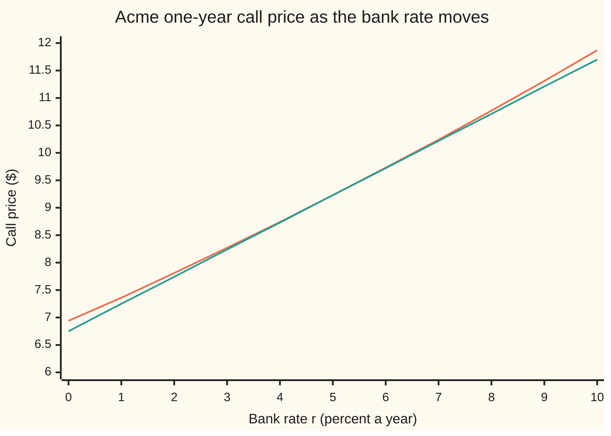
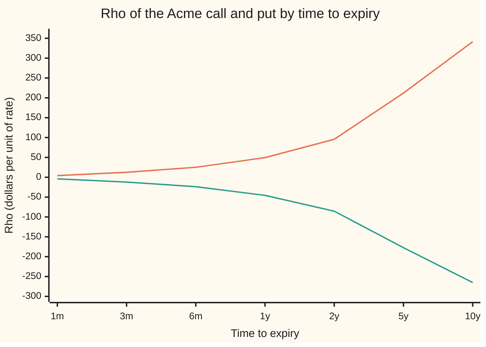

# Rho and dividend rho: how rates and the yield move the price

[Syllabus](../../../SYLLABUS.md) → [Financial mathematics](../README.md) → [The Greeks, one each](../README.md#s09) → Rho and dividend rho

---

## General Overview

Acme shares trade at $100. A one-year call option on Acme, struck at $100, costs $9.23. That price came from six inputs: the share price, the strike, the time left, the volatility (how jumpy Acme is), and two rates. The bank pays 5 percent a year on cash. Acme pays out 2 percent of its price a year as dividends.

Now the central bank moves, and cash earns 6 percent instead of 5. Acme's price, the strike and the year are unchanged. The call is now worth $9.73: fifty cents from a rate decision alone.

**Rho** is the name for that sensitivity: dollars of option price per unit of interest rate, with every other input held still. **Dividend rho** is the same question asked about the dividend yield. For the Acme call, rho is 49.46 and dividend rho is −58.69. One unit of rate is 100 percentage points, so those raw numbers get scaled before anyone uses them. A move of one percentage point is worth about $0.49 on this call. A move of one basis point, a hundredth of a percentage point, is worth about half a cent: 0.0049.

The Black–Scholes price is a share half minus a cash half ([Black–Scholes call](../08-The%20Black-Scholes%20call%20and%20put/01-black-scholes-call.md)). The interest rate reaches the price in two places: the discount on the cash half, and the chances of exercise inside both halves. The card proves that the second effect cancels to zero. Only the discount on the strike is left doing the moving. The dividend yield is the mirror case: only the dividend drag on the share half moves.

**Rho is the time to expiry times the cash half of the price, and dividend rho is minus the time to expiry times the share half; every other effect of the rate cancels.**

**What kind of fact this is:** a theorem inside the Black–Scholes model, proved on this card in Why it works. The model itself is an assumption about markets, not a law.

### The picture: the price as a function of the rate

Hold Acme at $100, the strike at $100, the volatility at 20 percent, the dividend yield at 2 percent. Slide the bank rate from 0 to 10 percent and reprice each time.



The first line (orange) is the call priced at each rate. The second line (green) is the straight line through today's price at 5 percent with slope 49.46: rho. The two touch at 5 percent and stay close across the whole range. The curve bends slightly upward, so the straight line always sits a little under it: a full one-point rise adds $0.50, not the $0.49 that rho alone predicts.

---

## The formula

A partial derivative ([Partial derivatives](../../06-Calculus%20and%20analysis/07-Several%20Variables/01-partial-derivatives.md)) is the slope in one input with every other input frozen. It is written with a curly d: $\partial C/\partial r$ reads "the change in the call price per unit change in the rate, all else fixed".

$$\rho = \frac{\partial C}{\partial r} = K\,T\,e^{-rT}\,N(d_2), \qquad \rho_q = \frac{\partial C}{\partial q} = -\,T\,S\,e^{-qT}\,N(d_1)$$

**Read it aloud:** rho is the years to expiry times the strike's value today times the chance of paying it; dividend rho is minus the years to expiry times the share half of the price.

For the put, the same two slopes are

$$\frac{\partial P}{\partial r} = -\,K\,T\,e^{-rT}\,N(-d_2), \qquad \frac{\partial P}{\partial q} = T\,S\,e^{-qT}\,N(-d_1).$$

The put holder receives the strike instead of paying it, so every sign flips, and each chance becomes the chance of the other outcome.

| Symbol | Plain meaning | In our example | Push it up and the answer… |
| --- | --- | --- | --- |
| $\rho$ | rho: dollars of call price per unit of interest rate, other inputs frozen | 49.46 | is the answer |
| $\rho_q$ | dividend rho: dollars of call price per unit of dividend yield | −58.69 | is the answer |
| $C$, $P$ | today's price of the call, and of the put | $9.23 and $6.33 | — |
| $S$ | Acme's share price today | $100 | rho rises: exercise gets likelier, so the strike is likelier to be paid |
| $K$ | the strike: the cash paid for the share on exercise | $100 | rho falls here: exercise gets less likely (12.80 at a $130 strike); only deep in the money does a higher strike raise it |
| $r$ | the bank rate, continuously compounded, as a decimal | 0.05 | rho rises a little: the chance of exercise grows faster than the discount shrinks |
| $q$ | the dividend yield, continuously compounded, as a decimal | 0.02 | rho falls: dividends drag the share down, exercise gets less likely |
| $\sigma$ | volatility: the yearly spread of Acme's log-returns | 0.20 | rho falls here: a wider spread pushes $d_2$ down |
| $T$ | years to expiry | 1 | rho rises hard: 12.59 at three months, 341.37 at ten years |
| $N(x)$, $\varphi(x)$ | the bell-curve area to the left of $x$, and the bell curve's height at $x$ | $N(d_2) = 0.5199$ | — |
| $d_1$, $d_2$ | how far Acme sits from the strike, in units of $\sigma\sqrt{T}$; $d_1 = d_2 + \sigma\sqrt{T}$ | 0.25 and 0.05 | — |
| $e^{-rT}$, $e^{-qT}$ | the discount on a dollar due at expiry, and the dividend drag on a share | 0.9512 and 0.9802 | — |

The two distances, as on the call card:

$$d_1 = \frac{\ln(S/K) + (r - q + \tfrac12\sigma^2)\,T}{\sigma\sqrt{T}}, \qquad d_2 = d_1 - \sigma\sqrt{T}.$$

In words: $d_2$ counts how many units of spread separate Acme from the strike, after the expected drift. $d_1$ is one unit further. The rate $r$ sits inside both, in the drift.

### When it holds

- **Only one input moves.** Rho holds the share price fixed. In markets a rate decision often moves shares too; that part of the loss or gain belongs to [Delta](01-delta.md), not rho.
- **One flat rate for every date.** The model uses a single continuously compounded rate. A real rate curve can twist, and then the rho that matters is the slope to the rate at the option's own expiry.
- **A continuous dividend yield.** A known cash dividend on a known date behaves differently: the dividend rho formula no longer applies as written ([Known cash dividends](../08-The%20Black-Scholes%20call%20and%20put/08-known-cash-dividends.md)).
- **Small moves.** Rho is a slope. Over a one-point move the Acme call gains $0.50 while rho predicts $0.49; the error grows with the square of the move.
- **European exercise.** An option that can be exercised early has its own rate trade-off, and these closed forms stop being exact.

---

## Why it works

### Step 0: the rate touches the price in two places

Freeze Acme at $100. Raise the rate. Two things change. The strike, paid a year from now, is worth less in today's money: that is the discount factor $e^{-rT}$ on the cash half. And Acme's expected path in the pricing world (the risk-neutral world of the call card) drifts up faster, because there every asset grows at the bank rate minus its payout: that shows up as $r$ inside $d_1$ and $d_2$. The whole proof is that the second change adds up to zero.

### Step 1: the two distances move together

Only one term in $d_1$ carries the rate: the rate times the years, in the numerator. The denominator $\sigma\sqrt{T}$ has none. So

$$\frac{\partial d_1}{\partial r} = \frac{\partial d_2}{\partial r} = \frac{T}{\sigma\sqrt{T}} = \frac{\sqrt{T}}{\sigma}.$$

For Acme this is $1/0.20 = 5$: a full unit of rate would push both distances up by 5. They move by the same amount because the gap between them, $\sigma\sqrt{T}$, has no rate in it.

### Step 2: differentiate every piece

Start from the price, $C = S\,e^{-qT}N(d_1) - K\,e^{-rT}N(d_2)$. The slope of $N$ at any point is the bell curve's height $\varphi$ there. The slope of $e^{-rT}$ in $r$ is $-T\,e^{-rT}$. Apply the chain rule to each factor that holds an $r$:

$$\frac{\partial C}{\partial r} = \underbrace{S\,e^{-qT}\varphi(d_1)\frac{\sqrt{T}}{\sigma}}_{\text{share side, chance moves}} \;+\; \underbrace{K\,T\,e^{-rT}N(d_2)}_{\text{discount moves}} \;-\; \underbrace{K\,e^{-rT}\varphi(d_2)\frac{\sqrt{T}}{\sigma}}_{\text{cash side, chance moves}}.$$

Three terms. The middle one carries two minus signs, the one in front of the cash half and the one from differentiating $e^{-rT}$, so it comes out positive.

### Step 3: the two chance terms cancel

For Acme the first term is 189.51 and the third is −189.51. Both are large. They cancel exactly, for every value of the inputs, because of one identity:

$$S\,e^{-qT}\varphi(d_1) = K\,e^{-rT}\varphi(d_2).$$

The share-side bell-curve height, weighted by the share, equals the cash-side height, weighted by the discounted strike. The folded proof below takes three lines of algebra.

The reason in words: where exercise switches on, Acme sits at the strike and the payoff is zero. Nudging the rate moves that switching point a hair, but the futures that cross it are worth nothing either way. Moving a boundary where the value is zero changes nothing to first order. The share side and the cash side each see the boundary move, by equal and opposite amounts.

<details>
<summary>Detailed proof: the density identity and both slopes</summary>

**The identity.** From the definitions of the two distances, $d_1 - d_2 = \sigma\sqrt{T}$ and $d_1 + d_2 = \bigl(2\ln(S/K) + 2(r-q)T\bigr)/(\sigma\sqrt{T})$. Multiply: $d_1^2 - d_2^2 = 2\ln(S/K) + 2(r-q)T$. The bell curve's height is $\varphi(x) = e^{-x^2/2}/\sqrt{2\pi}$, so
$$\frac{\varphi(d_1)}{\varphi(d_2)} = e^{-\frac12(d_1^2 - d_2^2)} = \frac{K}{S}\,e^{-(r-q)T} = \frac{K\,e^{-rT}}{S\,e^{-qT}}.$$
Cross-multiply: $S\,e^{-qT}\varphi(d_1) = K\,e^{-rT}\varphi(d_2)$. Nothing was assumed about the inputs.

**Rho.** Step 2's first and third terms are $\frac{\sqrt{T}}{\sigma}\bigl[S e^{-qT}\varphi(d_1) - K e^{-rT}\varphi(d_2)\bigr]$, which is zero by the identity. What is left is $\rho = K\,T\,e^{-rT}N(d_2)$. $\blacksquare$

**Dividend rho.** The yield sits in $d_1$ and $d_2$ as $-qT$, so both distances move by $-\sqrt{T}/\sigma$ per unit of $q$. The slope of $e^{-qT}$ in $q$ is $-T e^{-qT}$. Then
$$\frac{\partial C}{\partial q} = -T\,S\,e^{-qT}N(d_1) - \frac{\sqrt{T}}{\sigma}\bigl[S e^{-qT}\varphi(d_1) - K e^{-rT}\varphi(d_2)\bigr] = -T\,S\,e^{-qT}N(d_1). \qquad\blacksquare$$

**The puts.** Parity (Step 5) gives each put slope from the call's, using $1 - N(x) = N(-x)$.

</details>

### Step 4: what is left, and which term does the moving

After the cancellation one term survives:

$$\rho = K\,T\,e^{-rT}N(d_2).$$

It is the derivative of the discount factor on the cash half, and nothing else. Read it as: the strike you may pay at expiry is $K$ dollars, owed with chance $N(d_2)$, worth $K e^{-rT}N(d_2)$ today. Raise the rate by a small step and that obligation shrinks by $T$ times the step, as a fraction of itself, because a rate is a per-year number and the payment is $T$ years away. A call holder owes the strike, so a cheaper obligation makes the call dearer. Rho for a call is never negative. It runs from 0, far out of the money, up to $K T e^{-rT} = 95.12$, deep in the money, where the strike is certain to be paid.

The same three steps run on the yield. The yield enters the price only through the dividend drag $e^{-qT}$ on the share half and through the drift inside $d_1$ and $d_2$. The drift part cancels by the same identity. What survives is the derivative of the drag: $\rho_q = -T\,S\,e^{-qT}N(d_1)$. A higher yield means more of Acme's value leaks out as dividends before expiry, and the call holder receives none of them. Dividend rho for a call is negative.

So each rate owns one half of the price. **Rho is $T$ times the cash half. Dividend rho is minus $T$ times the share half.** For Acme, with $T = 1$, those are 49.46 and −58.69: the cash half and the share half of the call card, read off unchanged.

### Step 5: parity gives the put, and checks the call

Put–call parity says $C - P = S\,e^{-qT} - K\,e^{-rT}$ for any model ([Put-call parity](../08-The%20Black-Scholes%20call%20and%20put/03-put-call-parity.md)). Differentiate both sides in $r$. The share term has no $r$:

$$\frac{\partial C}{\partial r} - \frac{\partial P}{\partial r} = K\,T\,e^{-rT}.$$

So put rho is call rho minus $K T e^{-rT}$: $49.46 - 95.12 = -45.66$. Differentiate in $q$ instead, and the strike term drops out:

$$\frac{\partial C}{\partial q} - \frac{\partial P}{\partial q} = -\,T\,S\,e^{-qT},$$

so the put's dividend rho is $-58.69 + 98.02 = +39.33$. A put holder delivers a share and receives cash, so both signs flip: higher rates shrink the cash received, higher dividends make the share delivered cheaper.

### Step 6: move both rates together

Add the two slopes for the call:

$$\rho + \rho_q = T\bigl[K e^{-rT}N(d_2) - S e^{-qT}N(d_1)\bigr] = -\,T\,C.$$

For Acme, $49.46 - 58.69 = -9.23$, which is minus the call's price. The reason: the forward price $F = S\,e^{(r-q)T}$, the price that can be locked in today for delivery at expiry, depends only on the gap $r - q$. Raise both rates together and the forward, and every chance, stays put. Only the discount on the whole payoff changes, and it removes $T$ times the price per unit of rate. The put obeys the same rule: $-45.66 + 39.33 = -6.33$, minus the put's price.

### The other door: differentiate inside the average

The call price is a discounted average of the payoff over the pricing world's possible end prices. Road 4 in the code differentiates inside that average, one possible future at a time. Hold the random draw fixed and raise $r$. Each possible end price grows in proportion to $T$ per unit of rate, because the pricing-world drift is $r - q - \tfrac12\sigma^2$. That adds $T$ times the share half. Meanwhile the discount on the whole payoff tightens, which removes $T$ times the whole call price. Net: $T \times 58.69 - T \times 9.23 = T \times 49.46$, the cash half again. No boundary term appears, because the payoff is zero at the strike. Same answer by a different bookkeeping. The method is the subject of [Greeks inside the simulation](../07-Greeks%20by%20Numbers%20and%20Calibration/02-pathwise-and-likelihood-ratio-greeks.md).

---

## Worked numbers, by hand

Acme: $S = 100$, $K = 100$, $r = 5\%$, $q = 2\%$, $\sigma = 20\%$, $T = 1$ year. From the call card: $d_1 = 0.25$, $d_2 = 0.05$.

| Step | Arithmetic | Value |
| --- | --- | --- |
| $N(d_2)$, chance of paying the strike | bell-curve table at 0.05 | 0.5199 |
| $N(d_1)$, same event counted in shares | bell-curve table at 0.25 | 0.5987 |
| $K T e^{-rT}$ | $100 \times 1 \times e^{-0.05} = 100 \times 0.9512$ | 95.12 |
| $T S e^{-qT}$ | $1 \times 100 \times e^{-0.02} = 100 \times 0.9802$ | 98.02 |
| **call rho** | $95.12 \times 0.5199$ | **49.46** |
| put rho | $-95.12 \times (1 - 0.5199) = -95.12 \times 0.4801$ | −45.66 |
| **call dividend rho** | $-98.02 \times 0.5987$ | **−58.69** |
| put dividend rho | $98.02 \times (1 - 0.5987) = 98.02 \times 0.4013$ | +39.33 |
| rho per basis point | $49.46 / 10{,}000$ | 0.0049 |
| rho per percentage point | $49.46 / 100$ | 0.49 |
| parity in $r$ | $49.46 - (-45.66)$ | 95.12, equal to $K T e^{-rT}$ |
| parity in $q$ | $-58.69 - 39.33$ | −98.02, equal to $-T S e^{-qT}$ |

So a one-basis-point rise in the bank rate adds about half a cent to the Acme call and takes a little less off the put. A rise in the dividend yield does the opposite, and by more: the call's dividend rho is the larger of its two rate slopes.

### What breaks if you drop a piece

Correct call rho: 49.46.

| Mistake | Comes out at | What went wrong |
| --- | --- | --- |
| $N(d_1)$ in place of $N(d_2)$ | 56.95 | $N(d_1)$ counts exercise in shares. The rate acts on the cash leg, counted in dollars. |
| Drop the discount $e^{-rT}$ | 51.99 | The saving is on money owed later; it has to be brought back to today too. |
| Put rho taken as minus call rho | −49.46 (right: −45.66) | Parity sees the rate. The two rhos differ by $K T e^{-rT} = 95.12$, not by a sign. |
| Drop the $T$ in front, 5-year option | 42.41 (right: 212.03) | A rate is per year. At one year the $T$ hides because it equals 1. |
| Quote 49.46 as "per basis point" | off by 10,000 times | The formula is per unit of rate, 100 percentage points. Per basis point it is 0.0049. |

The first four wrong numbers come from the checks below.

---

## How rho grows with time to expiry

Hold everything at the house values and change only the time to expiry. The call price grows slowly. Rho grows much faster.

| Time to expiry | Call price | Call rho | Put rho | Price change per 1-point rate rise |
| --- | --- | --- | --- | --- |
| 1 month | $2.42 | 4.20 | −4.10 | $0.04 |
| 3 months | $4.34 | 12.59 | −12.10 | $0.13 |
| 6 months | $6.31 | 25.07 | −23.70 | $0.25 |
| 1 year | $9.23 | 49.46 | −45.66 | $0.49 |
| 2 years | $13.52 | 95.58 | −85.38 | $0.96 |
| 5 years | $22.01 | 212.03 | −177.37 | $2.12 |
| 10 years | $30.17 | 341.37 | −265.17 | $3.41 |

Two forces push rho up with maturity. The $T$ in front: a rate is charged per year, and the strike is further away. And $N(d_2)$ climbs, because the positive drift $r - q$ has longer to act. One force pulls down: $e^{-rT}$ shrinks. The product $T e^{-rT}$ peaks at $T = 1/r$, which is 20 years at 5 percent. At 20 years the Acme call's rho is 432.97. Out to ten years, the upward forces win at every step.

### Rho against the price it moves

A dollar figure alone hides how much rho matters. Measure it against the option's own price: how many percent of the call does a one-point rate rise add?

```
% of the call price added by a 1-point rate rise, 4 characters per percent
   1 month  ███████                                         1.73%
  3 months  ████████████                                    2.90%
  6 months  ████████████████                                3.97%
    1 year  █████████████████████                           5.36%
   2 years  ████████████████████████████                    7.07%
   5 years  ███████████████████████████████████████         9.63%
  10 years  █████████████████████████████████████████████  11.32%
```

On a one-month option a full point of rates moves the price by under 2 percent of itself. Rate decisions are usually a fraction of a point, so on short equity options rho is small beside the share-price and volatility risk. On a ten-year option the same point moves the price by over 11 percent. Long-dated equity options, warrants and employee options carry real rate risk.



The upper line (orange) is call rho. The lower line (green) is put rho. The gap between them at each maturity is $K T e^{-rT}$, the parity derivative from Step 5. The time axis is not to scale: its steps grow from one month to five years.

---

## Code, from first principles, and it actually runs

Four independent roads to rho. Road 1 is the formula. Road 2 bumps the formula's price one basis point each way and divides. Road 3 prices the call by averaging over the bell curve with Simpson's rule, using no $d_1$, no $d_2$ and no $N$, then bumps that price. Road 4 differentiates inside the average, the other door above. The put and both dividend rhos are bumped from the integral prices and checked against the formulas and parity. The bell-curve area is a series written out; the strike crossing is found by bisection, a halving search. Ten asserts, each comparing two different roads.

### Python

```python
# Rho and dividend rho -- the check behind the card.  Standard library only.
# Every number quoted on the card is printed here.  Nothing imported knows the
# answer: the normal CDF is a series written out, the root finder is bisection,
# the integral is Simpson's rule, and no road below borrows from another.
from math import log, sqrt, exp, pi

def phi(x): return exp(-0.5 * x * x) / sqrt(2.0 * pi)      # bell-curve height at x
def N(x):                                                   # bell-curve area left of x
    if x < -8.0: return 0.0
    if x > 8.0: return 1.0
    s, t, n = x, x, 1
    while s + t * x * x / (2 * n + 1) != s:                 # x + x^3/3 + x^5/(3*5) + ...
        t *= x * x / (2 * n + 1); s += t; n += 1
    return 0.5 + s * phi(x)

def d1d2(S, K, r, q, sig, T):
    v = sig * sqrt(T)
    d1 = (log(S / K) + (r - q + 0.5 * sig * sig) * T) / v
    return d1, d1 - v

def call(S, K, r, q, sig, T):
    d1, d2 = d1d2(S, K, r, q, sig, T)
    return S * exp(-q * T) * N(d1) - K * exp(-r * T) * N(d2)

def rho_c(S, K, r, q, sig, T): return K * T * exp(-r * T) * N(d1d2(S, K, r, q, sig, T)[1])
def rho_p(S, K, r, q, sig, T): return -K * T * exp(-r * T) * N(-d1d2(S, K, r, q, sig, T)[1])
def qrho_c(S, K, r, q, sig, T): return -T * S * exp(-q * T) * N(d1d2(S, K, r, q, sig, T)[0])
def qrho_p(S, K, r, q, sig, T): return T * S * exp(-q * T) * N(-d1d2(S, K, r, q, sig, T)[0])

def simpson(f, a, b, n=20000):
    h = (b - a) / n
    tot = f(a) + f(b)
    for i in range(1, n):
        tot += (4 if i % 2 else 2) * f(a + i * h)
    return tot * h / 3.0

def by_integral(S, K, r, q, sig, T, kind):
    # Road 3: the risk-neutral average done by brute force.  No d1, no d2, no N.
    ST = lambda z: S * exp((r - q - 0.5 * sig * sig) * T + sig * sqrt(T) * z)
    lo, hi = -10.0, 10.0                        # bisection: where does S_T cross K?
    for _ in range(200):
        mid = 0.5 * (lo + hi)
        if ST(mid) > K: hi = mid
        else: lo = mid
    zc = 0.5 * (lo + hi)
    if kind == "call": v = simpson(lambda z: (ST(z) - K) * phi(z), zc, 10.0)
    elif kind == "put": v = simpson(lambda z: (K - ST(z)) * phi(z), -10.0, zc)
    else:                                       # Road 4: differentiate inside the average
        v = simpson(lambda z: (T * ST(z) - T * (ST(z) - K)) * phi(z), zc, 10.0)
    return exp(-r * T) * v                      # pathwise: d/dr of e^-rT (S_T - K), S_T fixed in z

S, K, r, q, sig, T = 100.0, 100.0, 0.05, 0.02, 0.20, 1.0
d1, d2 = d1d2(S, K, r, q, sig, T)
C, h = call(S, K, r, q, sig, T), 1e-4
Ci, Pi = by_integral(S, K, r, q, sig, T, "call"), by_integral(S, K, r, q, sig, T, "put")
rho, rhoP, qrho, qrhoP = rho_c(S, K, r, q, sig, T), rho_p(S, K, r, q, sig, T), qrho_c(S, K, r, q, sig, T), qrho_p(S, K, r, q, sig, T)
bump = lambda f, dr, dq: (f(S, K, r + dr, q + dq, sig, T) - f(S, K, r - dr, q - dq, sig, T)) / (2 * h)
ci = lambda kind: (lambda S, K, r, q, sig, T: by_integral(S, K, r, q, sig, T, kind))
rho_bump, rho_int = bump(call, h, 0), bump(ci("call"), h, 0)
rho_path = by_integral(S, K, r, q, sig, T, "path")
rhoP_int, qrho_int, qrhoP_int = bump(ci("put"), h, 0), bump(ci("call"), 0, h), bump(ci("put"), 0, h)
dens = S * exp(-q * T) * phi(d1) * sqrt(T) / sig            # the two terms that cancel, one each side
dens2 = K * exp(-r * T) * phi(d2) * sqrt(T) / sig
up1pc = call(S, K, r + 0.01, q, sig, T) - C

rows = [("d1", d1), ("d2", d2), ("N(d1)", N(d1)), ("N(d2)", N(d2)), ("N(-d1)", N(-d1)), ("N(-d2)", N(-d2)), ("e^-rT", exp(-r * T)), ("e^-qT", exp(-q * T)),
    ("share half  S e^-qT N(d1)", S * exp(-q * T) * N(d1)), ("cash half   K e^-rT N(d2)", K * exp(-r * T) * N(d2)),
    ("call, formula", C), ("call, Simpson integral", Ci), ("put, Simpson integral", Pi),
    ("d1 and d2 move per unit r", sqrt(T) / sig), ("density term, share side", dens), ("density term, cash side", -dens2),
    ("rho 1 formula K T e^-rT N(d2)", rho), ("rho 2 bump the formula", rho_bump),
    ("rho 3 bump the integral", rho_int), ("rho 4 pathwise integral", rho_path),
    ("rho per basis point", rho / 1e4),
    ("rho per 1 percent", rho / 100), ("reprice, r up 1 percent", up1pc),
    ("put rho, formula", rhoP), ("put rho, bump the integral", rhoP_int),
    ("rho call - rho put", rho - rhoP_int), ("K T e^-rT", K * T * exp(-r * T)),
    ("dividend rho call, formula", qrho), ("dividend rho call, bump", qrho_int),
    ("dividend rho put, formula", qrhoP), ("dividend rho put, bump", qrhoP_int),
    ("div rho call - div rho put", qrho - qrhoP_int), ("-T S e^-qT", -T * S * exp(-q * T)),
    ("call: rho + dividend rho", rho + qrho), ("put: rho + dividend rho", rhoP + qrhoP),
    ("wrong: N(d1) for N(d2)", K * T * exp(-r * T) * N(d1)), ("wrong: no e^-rT", K * T * N(d2)),
    ("wrong: put rho = -call rho", -rho),
    ("wrong: no T, 5-year option", K * exp(-r * 5) * N(d1d2(S, K, r, q, sig, 5.0)[1])),
    ("  right, 5-year option", rho_c(S, K, r, q, sig, 5.0)),
    ("try: K = 130", rho_c(S, 130.0, r, q, sig, T)),
    ("try: T = 20", rho_c(S, K, r, q, sig, 20.0))]
for name, v in rows:
    print(f"{name:<31} {v:>13.6f}")

print("maturity  call   rho  put rho  per 1%  % of call")
for t in (1 / 12, 0.25, 0.5, 1.0, 2.0, 5.0, 10.0):
    c, rc, rp = call(S, K, r, q, sig, t), rho_c(S, K, r, q, sig, t), rho_p(S, K, r, q, sig, t)
    print(f"{t:8.2f} {c:6.2f} {rc:6.2f} {rp:8.2f} {rc / 100:7.2f} {rc / c:9.2f}")
rates = [0.01 * i for i in range(11)]
print("chart, rate %  " + " ".join(f"{100 * x:5.0f}" for x in rates))
print("chart, call    " + " ".join(f"{call(S, K, x, q, sig, T):5.2f}" for x in rates))
print("chart, tangent " + " ".join(f"{C + rho * (x - r):5.2f}" for x in rates))

assert abs(rho - 49.458109105322) < 1e-9, "formula vs the house number"
assert abs(rho_bump - rho) < 1e-5, "bumped formula price"
assert abs(rho_int - rho) < 1e-5, "bumped integral price: no d1, d2 or N used"
assert abs(rho_path - rho) < 1e-8, "pathwise integral"
assert abs((rho - rhoP_int) - K * T * exp(-r * T)) < 1e-5, "parity in r, put from the integral"
assert abs(qrho_int - qrho) < 1e-5, "dividend rho, call, by bump"
assert abs(qrhoP_int - qrhoP) < 1e-5, "dividend rho, put, by bump"
assert abs((rho + qrho) + T * Ci) < 1e-8, "parallel move: rho + dividend rho = -T C"
assert abs(dens - dens2) < 1e-9, "the two density terms cancel"
assert abs((rhoP + qrhoP) + T * Pi) < 1e-8, "parallel move for the put"
print("ALL CHECKS PASS")
```

**Ran 2026-09-19 on macOS, Python 3.14.6, standard library only. All checks passed. Output, pasted from the run:**

```
d1                                   0.250000
d2                                   0.050000
N(d1)                                0.598706
N(d2)                                0.519939
N(-d1)                               0.401294
N(-d2)                               0.480061
e^-rT                                0.951229
e^-qT                                0.980199
share half  S e^-qT N(d1)           58.685115
cash half   K e^-rT N(d2)           49.458109
call, formula                        9.227006
call, Simpson integral               9.227006
put, Simpson integral                6.330081
d1 and d2 move per unit r            5.000000
density term, share side           189.505788
density term, cash side           -189.505788
rho 1 formula K T e^-rT N(d2)       49.458109
rho 2 bump the formula              49.458108
rho 3 bump the integral             49.458108
rho 4 pathwise integral             49.458109
rho per basis point                  0.004946
rho per 1 percent                    0.494581
reprice, r up 1 percent              0.501519
put rho, formula                   -45.664833
put rho, bump the integral         -45.664834
rho call - rho put                  95.122943
K T e^-rT                           95.122942
dividend rho call, formula         -58.685115
dividend rho call, bump            -58.685115
dividend rho put, formula           39.334753
dividend rho put, bump              39.334753
div rho call - div rho put         -98.019867
-T S e^-qT                         -98.019867
call: rho + dividend rho            -9.227006
put: rho + dividend rho             -6.330081
wrong: N(d1) for N(d2)              56.950707
wrong: no e^-rT                     51.993881
wrong: put rho = -call rho         -49.458109
wrong: no T, 5-year option          42.406509
  right, 5-year option             212.032545
try: K = 130                        12.799601
try: T = 20                        432.970825
maturity  call   rho  put rho  per 1%  % of call
    0.08   2.42   4.20    -4.10    0.04      1.73
    0.25   4.34  12.59   -12.10    0.13      2.90
    0.50   6.31  25.07   -23.70    0.25      3.97
    1.00   9.23  49.46   -45.66    0.49      5.36
    2.00  13.52  95.58   -85.38    0.96      7.07
    5.00  22.01 212.03  -177.37    2.12      9.63
   10.00  30.17 341.37  -265.17    3.41     11.32
chart, rate %      0     1     2     3     4     5     6     7     8     9    10
chart, call     6.94  7.36  7.81  8.27  8.74  9.23  9.73 10.24 10.77 11.31 11.87
chart, tangent  6.75  7.25  7.74  8.24  8.73  9.23  9.72 10.22 10.71 11.21 11.70
ALL CHECKS PASS
```

### Rust

```rust
// Rho and dividend rho -- the check behind the card.  Rust std only, no crates.
// Same roads as the Python: formula, bumped formula, bumped Simpson integral,
// pathwise integral.  Normal CDF, bisection and Simpson are written out here.
use std::f64::consts::PI;

fn phi(x: f64) -> f64 { (-0.5 * x * x).exp() / (2.0 * PI).sqrt() }
fn n_cdf(x: f64) -> f64 {
    if x < -8.0 { return 0.0; }
    if x > 8.0 { return 1.0; }
    let (mut s, mut t, mut n) = (x, x, 1.0_f64);
    while s + t * x * x / (2.0 * n + 1.0) != s {        // x + x^3/3 + x^5/(3*5) + ...
        t *= x * x / (2.0 * n + 1.0); s += t; n += 1.0;
    }
    0.5 + s * phi(x)
}
fn d1d2(s: f64, k: f64, r: f64, q: f64, sig: f64, t: f64) -> (f64, f64) {
    let v = sig * t.sqrt();
    let d1 = ((s / k).ln() + (r - q + 0.5 * sig * sig) * t) / v;
    (d1, d1 - v)
}
fn call(s: f64, k: f64, r: f64, q: f64, sig: f64, t: f64) -> f64 {
    let (d1, d2) = d1d2(s, k, r, q, sig, t);
    s * (-q * t).exp() * n_cdf(d1) - k * (-r * t).exp() * n_cdf(d2)
}
fn rho_c(s: f64, k: f64, r: f64, q: f64, sig: f64, t: f64) -> f64 { k * t * (-r * t).exp() * n_cdf(d1d2(s, k, r, q, sig, t).1) }
fn rho_p(s: f64, k: f64, r: f64, q: f64, sig: f64, t: f64) -> f64 { -k * t * (-r * t).exp() * n_cdf(-d1d2(s, k, r, q, sig, t).1) }
fn qrho_c(s: f64, k: f64, r: f64, q: f64, sig: f64, t: f64) -> f64 { -t * s * (-q * t).exp() * n_cdf(d1d2(s, k, r, q, sig, t).0) }
fn qrho_p(s: f64, k: f64, r: f64, q: f64, sig: f64, t: f64) -> f64 { t * s * (-q * t).exp() * n_cdf(-d1d2(s, k, r, q, sig, t).0) }

fn simpson<F: Fn(f64) -> f64>(f: F, a: f64, b: f64) -> f64 {
    let n = 20000;
    let h = (b - a) / n as f64;
    let mut tot = f(a) + f(b);
    for i in 1..n { tot += (if i % 2 == 1 { 4.0 } else { 2.0 }) * f(a + i as f64 * h); }
    tot * h / 3.0
}
// Road 3 (kind 0 call, 1 put) and road 4 (kind 2, pathwise): the average done by brute force.
fn by_integral(s: f64, k: f64, r: f64, q: f64, sig: f64, t: f64, kind: u8) -> f64 {
    let st = |z: f64| s * ((r - q - 0.5 * sig * sig) * t + sig * t.sqrt() * z).exp();
    let (mut lo, mut hi) = (-10.0_f64, 10.0_f64);      // bisection: where does S_T cross K?
    for _ in 0..200 {
        let mid = 0.5 * (lo + hi);
        if st(mid) > k { hi = mid; } else { lo = mid; }
    }
    let zc = 0.5 * (lo + hi);
    let v = match kind {
        0 => simpson(|z| (st(z) - k) * phi(z), zc, 10.0),
        1 => simpson(|z| (k - st(z)) * phi(z), -10.0, zc),
        _ => simpson(|z| (t * st(z) - t * (st(z) - k)) * phi(z), zc, 10.0),
    };
    (-r * t).exp() * v
}

fn main() {
    let (s, k, r, q, sig, t) = (100.0_f64, 100.0_f64, 0.05_f64, 0.02_f64, 0.20_f64, 1.0_f64);
    let (d1, d2) = d1d2(s, k, r, q, sig, t);
    let (c, h) = (call(s, k, r, q, sig, t), 1e-4);
    let (ci, pi_) = (by_integral(s, k, r, q, sig, t, 0), by_integral(s, k, r, q, sig, t, 1));
    let (rho, rho_put) = (rho_c(s, k, r, q, sig, t), rho_p(s, k, r, q, sig, t));
    let (qrho, qrho_put) = (qrho_c(s, k, r, q, sig, t), qrho_p(s, k, r, q, sig, t));
    let bump = |f: &dyn Fn(f64, f64) -> f64, dr: f64, dq: f64| (f(r + dr, q + dq) - f(r - dr, q - dq)) / (2.0 * h);
    let rho_bump = bump(&|rr, qq| call(s, k, rr, qq, sig, t), h, 0.0);
    let rho_int = bump(&|rr, qq| by_integral(s, k, rr, qq, sig, t, 0), h, 0.0);
    let rho_path = by_integral(s, k, r, q, sig, t, 2);
    let rho_put_int = bump(&|rr, qq| by_integral(s, k, rr, qq, sig, t, 1), h, 0.0);
    let qrho_int = bump(&|rr, qq| by_integral(s, k, rr, qq, sig, t, 0), 0.0, h);
    let qrho_put_int = bump(&|rr, qq| by_integral(s, k, rr, qq, sig, t, 1), 0.0, h);
    let dens = s * (-q * t).exp() * phi(d1) * t.sqrt() / sig;   // the two terms that cancel
    let dens2 = k * (-r * t).exp() * phi(d2) * t.sqrt() / sig;
    let up1pc = call(s, k, r + 0.01, q, sig, t) - c;
    let kte = k * t * (-r * t).exp();

    let rows: Vec<(&str, f64)> = vec![
        ("d1", d1), ("d2", d2), ("N(d1)", n_cdf(d1)), ("N(d2)", n_cdf(d2)), ("N(-d1)", n_cdf(-d1)), ("N(-d2)", n_cdf(-d2)), ("e^-rT", (-r * t).exp()), ("e^-qT", (-q * t).exp()),
        ("share half  S e^-qT N(d1)", s * (-q * t).exp() * n_cdf(d1)), ("cash half   K e^-rT N(d2)", k * (-r * t).exp() * n_cdf(d2)),
        ("call, formula", c), ("call, Simpson integral", ci), ("put, Simpson integral", pi_),
        ("d1 and d2 move per unit r", t.sqrt() / sig), ("density term, share side", dens), ("density term, cash side", -dens2),
        ("rho 1 formula K T e^-rT N(d2)", rho), ("rho 2 bump the formula", rho_bump),
        ("rho 3 bump the integral", rho_int), ("rho 4 pathwise integral", rho_path),
        ("rho per basis point", rho / 1e4),
        ("rho per 1 percent", rho / 100.0), ("reprice, r up 1 percent", up1pc),
        ("put rho, formula", rho_put), ("put rho, bump the integral", rho_put_int),
        ("rho call - rho put", rho - rho_put_int), ("K T e^-rT", kte),
        ("dividend rho call, formula", qrho), ("dividend rho call, bump", qrho_int),
        ("dividend rho put, formula", qrho_put), ("dividend rho put, bump", qrho_put_int),
        ("div rho call - div rho put", qrho - qrho_put_int), ("-T S e^-qT", -t * s * (-q * t).exp()),
        ("call: rho + dividend rho", rho + qrho), ("put: rho + dividend rho", rho_put + qrho_put),
        ("wrong: N(d1) for N(d2)", kte * n_cdf(d1)), ("wrong: no e^-rT", k * t * n_cdf(d2)),
        ("wrong: put rho = -call rho", -rho),
        ("wrong: no T, 5-year option", k * (-r * 5.0).exp() * n_cdf(d1d2(s, k, r, q, sig, 5.0).1)),
        ("  right, 5-year option", rho_c(s, k, r, q, sig, 5.0)),
        ("try: K = 130", rho_c(s, 130.0, r, q, sig, t)),
        ("try: T = 20", rho_c(s, k, r, q, sig, 20.0)),
    ];
    for (name, v) in &rows { println!("{:<31} {:>13.6}", name, v); }

    println!("maturity  call   rho  put rho  per 1%  % of call");
    for tt in [1.0 / 12.0, 0.25, 0.5, 1.0, 2.0, 5.0, 10.0] {
        let (cc, rc, rp) = (call(s, k, r, q, sig, tt), rho_c(s, k, r, q, sig, tt), rho_p(s, k, r, q, sig, tt));
        println!("{:8.2} {:6.2} {:6.2} {:8.2} {:7.2} {:9.2}", tt, cc, rc, rp, rc / 100.0, rc / cc);
    }
    let rates: Vec<f64> = (0..11).map(|i| 0.01 * i as f64).collect();
    let line = |f: &dyn Fn(f64) -> f64, w: &str| -> String {
        format!("{}{}", w, rates.iter().map(|x| format!("{:5.2}", f(*x))).collect::<Vec<_>>().join(" "))
    };
    println!("chart, rate %  {}", rates.iter().map(|x| format!("{:5.0}", 100.0 * x)).collect::<Vec<_>>().join(" "));
    println!("{}", line(&|x| call(s, k, x, q, sig, t), "chart, call    "));
    println!("{}", line(&|x| c + rho * (x - r), "chart, tangent "));

    assert!((rho - 49.458109105322).abs() < 1e-9, "formula vs the house number");
    assert!((rho_bump - rho).abs() < 1e-5, "bumped formula price");
    assert!((rho_int - rho).abs() < 1e-5, "bumped integral price: no d1, d2 or N used");
    assert!((rho_path - rho).abs() < 1e-8, "pathwise integral");
    assert!(((rho - rho_put_int) - kte).abs() < 1e-5, "parity in r, put from the integral");
    assert!((qrho_int - qrho).abs() < 1e-5, "dividend rho, call, by bump");
    assert!((qrho_put_int - qrho_put).abs() < 1e-5, "dividend rho, put, by bump");
    assert!(((rho + qrho) + t * ci).abs() < 1e-8, "parallel move: rho + dividend rho = -T C");
    assert!((dens - dens2).abs() < 1e-9, "the two density terms cancel");
    assert!(((rho_put + qrho_put) + t * pi_).abs() < 1e-8, "parallel move for the put");
    println!("ALL CHECKS PASS");
}
```

**Ran 2026-09-19 on macOS, rustc 1.98.1, no crates. All checks passed. Output, pasted from the run:**

```
d1                                   0.250000
d2                                   0.050000
N(d1)                                0.598706
N(d2)                                0.519939
N(-d1)                               0.401294
N(-d2)                               0.480061
e^-rT                                0.951229
e^-qT                                0.980199
share half  S e^-qT N(d1)           58.685115
cash half   K e^-rT N(d2)           49.458109
call, formula                        9.227006
call, Simpson integral               9.227006
put, Simpson integral                6.330081
d1 and d2 move per unit r            5.000000
density term, share side           189.505788
density term, cash side           -189.505788
rho 1 formula K T e^-rT N(d2)       49.458109
rho 2 bump the formula              49.458108
rho 3 bump the integral             49.458108
rho 4 pathwise integral             49.458109
rho per basis point                  0.004946
rho per 1 percent                    0.494581
reprice, r up 1 percent              0.501519
put rho, formula                   -45.664833
put rho, bump the integral         -45.664834
rho call - rho put                  95.122943
K T e^-rT                           95.122942
dividend rho call, formula         -58.685115
dividend rho call, bump            -58.685115
dividend rho put, formula           39.334753
dividend rho put, bump              39.334753
div rho call - div rho put         -98.019867
-T S e^-qT                         -98.019867
call: rho + dividend rho            -9.227006
put: rho + dividend rho             -6.330081
wrong: N(d1) for N(d2)              56.950707
wrong: no e^-rT                     51.993881
wrong: put rho = -call rho         -49.458109
wrong: no T, 5-year option          42.406509
  right, 5-year option             212.032545
try: K = 130                        12.799601
try: T = 20                        432.970825
maturity  call   rho  put rho  per 1%  % of call
    0.08   2.42   4.20    -4.10    0.04      1.73
    0.25   4.34  12.59   -12.10    0.13      2.90
    0.50   6.31  25.07   -23.70    0.25      3.97
    1.00   9.23  49.46   -45.66    0.49      5.36
    2.00  13.52  95.58   -85.38    0.96      7.07
    5.00  22.01 212.03  -177.37    2.12      9.63
   10.00  30.17 341.37  -265.17    3.41     11.32
chart, rate %      0     1     2     3     4     5     6     7     8     9    10
chart, call     6.94  7.36  7.81  8.27  8.74  9.23  9.73 10.24 10.77 11.31 11.87
chart, tangent  6.75  7.25  7.74  8.24  8.73  9.23  9.72 10.22 10.71 11.21 11.70
ALL CHECKS PASS
```

The two outputs agree line for line. The bumped roads sit within a millionth of the formula: a one-basis-point bump measures a chord, not the exact slope.

> [!TIP]
> **Try changing**
> Guess the direction first. Then run it.
> - **Push the strike far out.** Set `K = 130`. Rho falls to **12.80**. The strike is bigger, but it is far less likely to be paid, and the chance wins.
> - **Go long.** Set `T = 20`. Rho is **432.97**, close to where $T e^{-rT}$ peaks at 5 percent rates. Compare 4.20 at one month.
> - **Swap the chance.** In `rho_c`, take index `[0]` instead of `[1]`, so $N(d_1)$ replaces $N(d_2)$. Rho becomes **56.95**, the first row of the what-breaks table, and the house-number assert fails.
> - **Break the proof.** In `by_integral`, drop the `- T * (ST(z) - K)` term from the pathwise integrand. Road 4 lands on 58.69, the share half: the forward's lift without the discount's drag, and the pathwise assert fails.

---

## The usual mistake

> [!warning]
> **Reading rho as the option's exposure to a rate decision.** Rho holds the share price fixed. A real rate decision also moves Acme's price, its volatility and the whole rate curve. Rho is one term in that total, and on a short equity option the smallest one. The full move is the sum of the Greeks times their input moves ([The Greeks together](09-greeks-together-taylor-pnl.md)).
>
> Smaller traps:
> - **Units.** The formula gives dollars per unit of rate, where one unit is 100 percentage points. Per percentage point divide by 100 (0.49); per basis point divide by 10,000 (0.0049). A report that mixes them is off by a hundred or ten thousand times.
> - **The wrong chance.** $N(d_1)$ in rho gives 56.95 instead of 49.46. Rho uses the dollar-counted chance $N(d_2)$; dividend rho uses the share-counted chance $N(d_1)$.
> - **Same rho for call and put.** The two share gamma and vega, but not rho. Parity puts them $K T e^{-rT}$ apart: 49.46 and −45.66, not ±49.46.
> - **Forgetting the dividend rho.** For the Acme call it is larger than rho, −58.69 against 49.46. A desk that hedges rates but not the dividend forecast has hedged the smaller risk.

---

## Where you meet it in real life

- **Long-dated options and warrants.** A ten-year Acme call has rho 341.37: a one-point rate rise moves it by $3.41, over 11 percent of its price. Rate risk is part of hedging them.
- **Employee stock options.** Grants often run many years, so the rate assumed in their accounting value shifts that value noticeably.
- **Dividend forecasts.** Long-dated equity options carry dividend risk through dividend rho. A cut in Acme's expected payout lifts every call and lowers every put.
- **Currency options.** The dividend yield becomes the foreign interest rate. Dividend rho becomes the foreign-rate rho, of the same order of size as the domestic one ([The Greeks of a currency option](../21-FX%20vanilla%20options%20-%20Garman-Kohlhagen%20and%20the%20desk%20conventions/03-garman-kohlhagen-greeks.md)).
- **Options on futures.** The underlying futures price already contains the rate, so $q$ is replaced by $r$ and the two rho terms combine into Step 6's $-T C$ ([Greeks of a futures option](../26-Options%20on%20commodity%20futures%20and%20spreads/02-futures-option-greeks.md)).
- **The rest of the shelf.** [Delta](01-delta.md) is the slope in the share price, [Vega](03-vega.md) in volatility, [Theta](04-theta.md) in time. Rho and dividend rho are the slopes in the two rates.

> **Say it back**
> Rho is the slope of the option price in the bank rate, with every other input frozen; dividend rho is the slope in the dividend yield. The rate changes the discount on the strike and the chances of exercise, but the chance effects cancel exactly, because at the exercise boundary the payoff is zero. What remains is $T$ times the cash half for rho and minus $T$ times the share half for dividend rho: 49.46 and −58.69 for the Acme call. Parity sets the put's values, −45.66 and +39.33. The factor $T$ makes rho negligible on short equity options and large on long ones.

---

## What this builds on

- [Delta](01-delta.md): the first Greek, and the pattern this card repeats: differentiate the price, watch terms cancel. Delta's own cancellation uses the same density identity.
- [Partial derivatives](../../06-Calculus%20and%20analysis/07-Several%20Variables/01-partial-derivatives.md): the slope in one input with the others frozen, and the chain rule that carries the rate through $d_1$ and $d_2$.

## Where this goes next

- [The Greeks together](09-greeks-together-taylor-pnl.md): every slope on this shelf, summed into one estimate of the day's gain or loss.
- [The Greeks of a currency option](../21-FX%20vanilla%20options%20-%20Garman-Kohlhagen%20and%20the%20desk%20conventions/03-garman-kohlhagen-greeks.md): the same two rhos with a domestic and a foreign interest rate, where neither is small.
- [Greeks of a futures option](../26-Options%20on%20commodity%20futures%20and%20spreads/02-futures-option-greeks.md): when the underlying is a futures price, the two rhos merge into one.

Rho treats the rate as a single fixed number. The open question is what happens when both rates and the share move on the same day; [The Greeks together](09-greeks-together-taylor-pnl.md) adds every slope together to answer it.

---

## Sources

Verified 2026-09-24: every link below resolves to the publisher's page.

- Black, Fischer, and Myron Scholes. "The Pricing of Options and Corporate Liabilities." *Journal of Political Economy* 81, no. 3 (1973): 637–654. [doi:10.1086/260062](https://doi.org/10.1086/260062). The price whose rate slope this card takes.
- Merton, Robert C. "Theory of Rational Option Pricing." *Bell Journal of Economics and Management Science* 4, no. 1 (1973): 141–183. [doi:10.2307/3003143](https://doi.org/10.2307/3003143). Adds the dividend yield, the input dividend rho differentiates.
- Garman, Mark B., and Steven W. Kohlhagen. "Foreign Currency Option Values." *Journal of International Money and Finance* 2, no. 3 (1983): 231–237. [doi:10.1016/S0261-5606(83)80001-1](https://doi.org/10.1016/S0261-5606(83)80001-1). The yield read as a foreign interest rate, where dividend rho becomes foreign-rate rho.
- Hull, John C. *Options, Futures, and Other Derivatives*, 11th ed. Pearson, 2021. [Publisher page](https://www.pearson.com/en-us/subject-catalog/p/options-futures-and-other-derivatives/P200000005938). The textbook treatment of the Greeks, rho among them.
