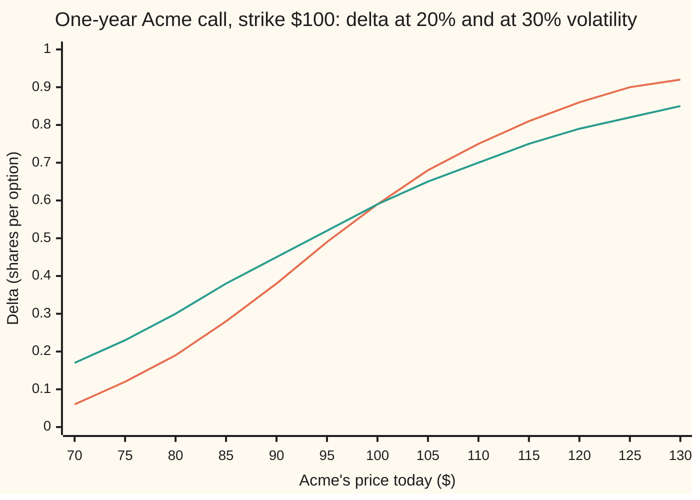
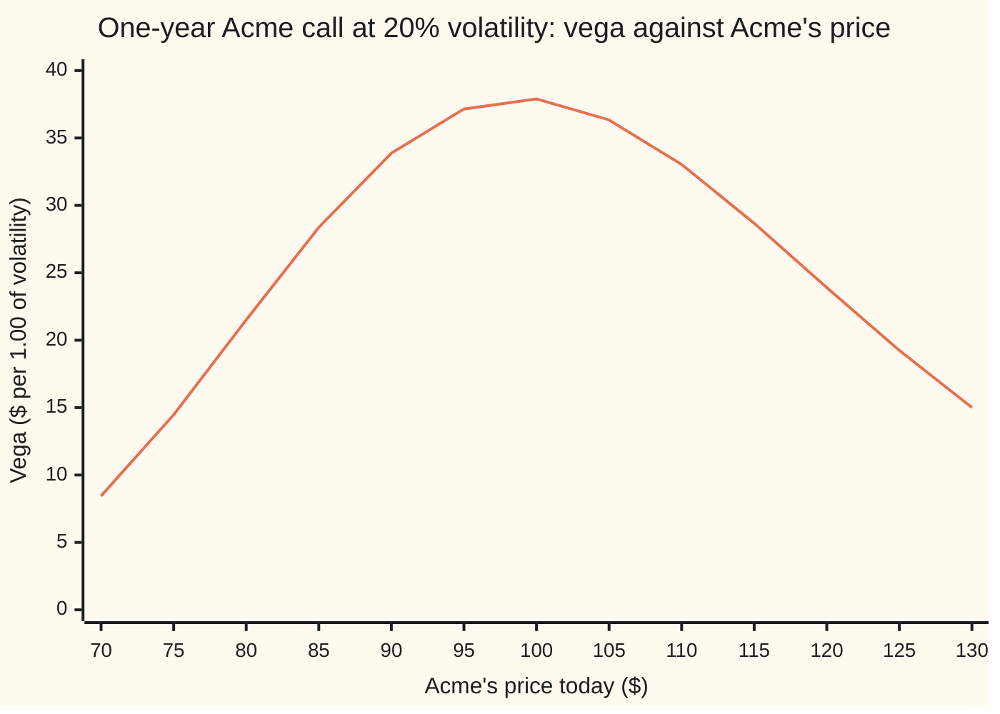
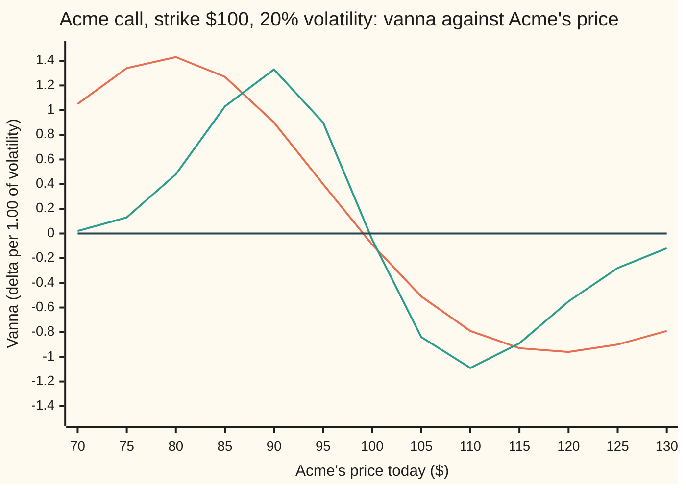

# Vanna: how delta shifts when volatility moves, and how vega shifts when spot moves

Financial mathematics → The Greeks, one each → Spot-volatility cross slope → Vanna

---

## General Overview

Acme trades at $100. A one-year call on it, the right to buy one share for $100 a year from now, costs $9.23 in the house market: rates 5 percent, dividends 2 percent a year, volatility (how jumpy the share is, as a yearly percentage) 20 percent. Its delta, the number of shares that hedge it, is 0.586851.

Now let the market's volatility rise by one point across 20 percent, from 19.5 to 20.5, while Acme stays at $100. The hedge changes: delta falls by about 0.00095 of a share. Run it the other way. The call's vega, the dollars it gains per 1.00 of volatility, is 37.901158. Let Acme rise by $1 across $100, from $99.50 to $100.50, with volatility held still, and vega falls by about $0.095.

One number drives both changes: −0.094753. It is called **vanna**. It is a cross slope: how one input's slope changes when the other input moves. The card derives its formula, proves that the two questions above have the same answer, reads its sign from where Acme sits against the strike, and shows why it becomes the hedge that matters when volatility and price move together.

**Vanna is the rate at which delta changes as volatility moves, and it is also the rate at which vega changes as the share price moves; for a Black-Scholes call it equals minus the dividend drag times the bell-curve height at d1 times d2 over volatility.**

**What kind of fact this is:** a theorem inside the Black-Scholes model, proved on this card in Why it works; the model itself is an assumption, not a law, and vanna is defined as the cross slope.

### The picture: delta at two volatilities



Orange: delta at 20 percent volatility. Green: delta at 30 percent. Below about $100 the green line sits higher: more volatility gives a call that is far from paying off a better chance, so it needs more shares to hedge. Above, the green line sits lower: more volatility makes a likely payoff less certain, so fewer shares hedge it. The gap between the lines, per unit of volatility, is roughly vanna averaged over the move. Where the lines cross, the gap changes sign. Here they cross at $100 itself, because d1 is 0.25 at both volatilities; vanna at 20 percent changes sign just below, at $99.00.

---

## The formula

Notation first, in words. A partial derivative, written with a curly ∂, is the slope in one input while every other input is held still ([partial-derivatives](../../06-Calculus%20and%20analysis/07-Several%20Variables/01-partial-derivatives.md)). A 2 raised on the top curly d means two slopes taken one after the other, one per input named underneath. Vega, the slope of the price in volatility, is written $\mathcal{V}$.

$$\text{vanna} \;=\; \frac{\partial \Delta}{\partial \sigma} \;=\; \frac{\partial \mathcal{V}}{\partial S} \;=\; \frac{\partial^2 C}{\partial S\,\partial \sigma} \;=\; -\,e^{-qT}\,\varphi(d_1)\,\frac{d_2}{\sigma}$$

**Read it aloud:** vanna is how delta moves per unit of volatility, which is the same as how vega moves per dollar of share price; it equals the dividend drag times the bell-curve height at d1, times d2 divided by volatility, with a minus sign in front.

| Symbol | Plain meaning | In our example | Push it up and vanna… |
| --- | --- | --- | --- |
| $S$, $K$ | Acme's price today; the strike, the fixed price in the contract | $100 and $100 | $S$ up past $99.00: turns negative, deepest near $120; $K$ up: the reverse |
| $T$ | years left to expiry | 1 | at the money, grows in size: −0.049233 at 3 months, −0.094753 at 1 year |
| $r$, $q$ | the riskless rate, continuously compounded; the dividend yield, the share's yearly payout as a fraction of its price | 5% and 2% | $r$ up: more negative; $q$ up: toward zero, then positive, +0.094753 at 4% |
| $\sigma$ | volatility: how jumpy Acme is, per square-root year. Say "sigma". | 20% | here flips sign: +0.063169 at 30% |
| $d_1$, $d_2$ | the two Black-Scholes distances to the strike, in units of $\sigma\sqrt{T}$ | 0.25 and 0.05 | $d_2$ up: more negative |
| $\varphi$ | the bell-curve height, $\varphi(x) = e^{-x^2/2}/\sqrt{2\pi}$. Say "phi". | 0.386668 at $d_1$ | larger in size |
| $N$ | the bell-curve area to the left of a point: a probability | inside delta | enters delta, not vanna |
| $e^{-qT}$ | the dividend drag: the share fraction bought today that grows into one share by expiry | 0.980199 | larger in size |
| $\Delta$ | delta, $e^{-qT}N(d_1)$: shares per option | 0.586851 | — |
| $\mathcal{V}$ | vega, $S e^{-qT}\varphi(d_1)\sqrt{T}$: dollars per 1.00 of volatility | 37.901158 | — |
| $\Gamma$ | gamma: how fast delta moves per dollar of share price | 0.018951 | — |
| $a$, $b$ | small steps in price and in volatility, for the four-corner difference | 0.05 and 0.0005 (road 4) | — |

The two distances, as on [black-scholes-call](../08-The%20Black-Scholes%20call%20and%20put/01-black-scholes-call.md):

$$d_1 = \frac{\ln(S/K) + (r - q + \tfrac12\sigma^2)\,T}{\sigma\sqrt{T}}, \qquad d_2 = d_1 - \sigma\sqrt{T}$$

In words: $d_2$ counts how many units of $\sigma\sqrt{T}$ the forward price, $F = S e^{(r-q)T}$, sits past the strike, less half a unit of volatility drag; $d_1$ is one unit further. Units: vanna on this card is delta per 1.00 of volatility, which is 100 volatility points. Per point, divide by 100: −0.000948.

### When it holds

- **The Black-Scholes model, one volatility per option.** Real markets quote a different volatility at each strike (the smile, or skew). Vanna from this formula is the model's slope; what a desk sees also depends on how the smile moves when Acme moves, the subject of [smile-adjusted-delta](../12-The%20smile%20and%20the%20surface/05-smile-adjusted-delta.md).
- **European exercise.** A call that may be exercised early has no closed formula; vanna must then be bumped on a tree or grid.
- **A continuous dividend yield.** Cash dividends on fixed dates are priced on the share net of their present value ([known-cash-dividends](../08-The%20Black-Scholes%20call%20and%20put/08-known-cash-dividends.md)); vanna then comes from that price, not this formula.
- **Small moves.** Vanna is a slope. Over a full volatility point, 20 to 21 percent, delta actually moved −0.000812, not −0.000948, because vanna itself changed on the way.
- **Some time left.** Near expiry vanna crowds into a narrow band around the strike, swinging from strongly positive to strongly negative within a few dollars of spot.

---

## Why it works

### Step 0: two questions, one number

The call's price depends on Acme's price and on volatility at once. Ask how delta (the slope in price) changes as volatility moves. Ask how vega (the slope in volatility) changes as price moves. Both are a slope of a slope, taken in the two inputs in opposite orders. For any price surface smooth enough to have a continuous cross slope, the order does not matter: the two answers are one number. That symmetry of second derivatives is the whole reason vanna has two readings. The rest of this section computes the number both ways and gets the same formula.

### Step 1: three small facts about the ingredients

The bell-curve height slopes down at a rate set by the point itself: $\varphi'(x) = -x\,\varphi(x)$, since the derivative of $e^{-x^2/2}$ is $-x\,e^{-x^2/2}$.

The distance $d_1$ moves with the share price at rate $\partial d_1/\partial S = 1/(S\sigma\sqrt{T})$, because the only $S$ in $d_1$ sits inside $\ln S$, whose slope is $1/S$.

The distance $d_1$ moves with volatility at rate $\partial d_1/\partial\sigma = -d_2/\sigma$. To see it, split $d_1$ in two:

$$d_1 = \frac{\ln(S/K) + (r-q)T}{\sigma\sqrt{T}} + \tfrac12\sigma\sqrt{T}.$$

The first piece has volatility only underneath; the second grows in step with it.

<details>
<summary>The algebra behind this</summary>

A quantity with volatility only underneath has slope minus itself over $\sigma$. The first piece equals $d_1 - \tfrac12\sigma\sqrt{T}$, so its slope is $-(d_1 - \tfrac12\sigma\sqrt{T})/\sigma$. The second piece has slope $\tfrac12\sqrt{T}$, which is $\tfrac12\sigma\sqrt{T}/\sigma$. Add them: $-(d_1 - \sigma\sqrt{T})/\sigma = -d_2/\sigma$.

</details>

### Step 2: the first reading, delta moved by volatility

Delta is $e^{-qT}N(d_1)$ ([delta](01-delta.md)). Volatility enters only through $d_1$. The slope of $N$ is $\varphi$, so the chain rule gives

$$\frac{\partial \Delta}{\partial\sigma} = e^{-qT}\,\varphi(d_1)\,\frac{\partial d_1}{\partial \sigma} = -\,e^{-qT}\,\varphi(d_1)\,\frac{d_2}{\sigma}.$$

For Acme: $-0.980199 \times 0.386668 \times 0.05/0.20 = -0.094753$. Measured instead: delta is 0.587361 at 19.5 percent and 0.586412 at 20.5 percent, a change of −0.000949 across one point.

### Step 3: the second reading, vega moved by the share price

Vega is $S e^{-qT}\varphi(d_1)\sqrt{T}$ ([vega](03-vega.md)). Now $S$ appears twice: in front, and inside $d_1$. The product rule takes each in turn:

$$\frac{\partial \mathcal{V}}{\partial S} = e^{-qT}\varphi(d_1)\sqrt{T} \;+\; S e^{-qT}\sqrt{T}\,\bigl(-d_1\varphi(d_1)\bigr)\frac{1}{S\sigma\sqrt{T}} = e^{-qT}\varphi(d_1)\Bigl(\sqrt{T} - \frac{d_1}{\sigma}\Bigr).$$

The bracket is $-(d_1 - \sigma\sqrt{T})/\sigma = -d_2/\sigma$. The same formula arrives. Measured: vega is 37.936766 at $99.50 and 37.842160 at $100.50, a change of −0.094606 across one dollar.



The one line is vega. Vanna is its slope. The hill climbs on the left, where vanna is positive, and falls on the right, where vanna is negative. The top of the hill is where vanna is zero: $99.00, found by a search for the top and by a root finder on vanna, both landing on 99.004983.

### Step 4: the sign, read from where Acme sits

In $-e^{-qT}\varphi(d_1)\,d_2/\sigma$, every factor but $d_2$ is positive. So vanna has the opposite sign to $d_2$. Setting $d_2 = 0$ and solving for $S$ gives

$$\text{crossover price} = K\,e^{-(r - q - \frac12\sigma^2)T} = 100\,e^{-0.01} = 99.004983.$$

- **Acme above the crossover** ($d_2 > 0$): the call is, in the pretend world of pricing (where every asset grows at the bank rate), more likely than not to pay. More volatility makes that less certain and pulls delta down toward the middle. Vanna is negative: −0.094753 at $100, −0.957609 at $120.
- **Acme below the crossover** ($d_2 < 0$): the call probably expires worthless. More volatility gives it a better chance and pushes delta up. Vanna is positive: +1.432490 at $80.

The crossover is not the strike. Carry, the $r - q$ drift, and the volatility drag in $d_2$ move it; here to $99.00.

The put's vanna is the same number. Put-call parity, $C - P = S e^{-qT} - K e^{-rT}$ ([put-call-parity](../08-The%20Black-Scholes%20call%20and%20put/03-put-call-parity.md)), has no $\sigma$ in its right side, so any slope taken in volatility is identical for the two. Bumping the put's delta in volatility gives −0.094753.

<details>
<summary>Detailed proof: why the order of the two slopes does not matter</summary>

Take a price surface $C(S, \sigma)$ whose cross slopes are continuous near the point. Pick a small step $a$ in price and $b$ in volatility, and form the four-corner difference
$$C(S{+}a, \sigma{+}b) - C(S{+}a, \sigma) - C(S, \sigma{+}b) + C(S, \sigma).$$
Read it as one quantity, the change across the volatility step, taken at price $S{+}a$ minus at price $S$. The mean value theorem (a smooth change across an interval equals the interval's width times the slope at some point inside it) turns that into $a$ times the price-slope of the volatility-step change, at some price inside the step. That slope is itself a change across the volatility step, so the theorem applies again: the four-corner difference equals $a \times b$ times the cross slope, price first and volatility second, at some point inside the small rectangle.

Read the same four terms the other way, as the change across the price step taken at volatility $\sigma{+}b$ minus at $\sigma$. The same two moves give $a \times b$ times the cross slope in the other order, at another point inside the rectangle.

Divide by $a \times b$ and shrink the rectangle. Both points close in on $(S, \sigma)$. The cross slopes are continuous, so both tend to their values there, and both equal the limit of the four-corner difference divided by $a \times b$. They are equal. The Black-Scholes price is built from exponentials, logarithms and the bell curve, all smooth while $T > 0$ and $\sigma > 0$, so the condition holds. Road 4 in the code computes exactly this four-corner difference.

</details>

A third route skips the calculus: bump the price in both inputs and difference it, as road 4 does, or bump a tree ([bump-and-revalue-and-common-random-numbers](../07-Greeks%20by%20Numbers%20and%20Calibration/01-bump-and-revalue-and-common-random-numbers.md)).

---

## Worked numbers, by hand

Acme: $S = 100$, $K = 100$, $r = 5\%$, $q = 2\%$, $\sigma = 20\%$, $T = 1$ year.

| Step | Arithmetic | Value |
| --- | --- | --- |
| $d_2$ | $(\ln 1 + (0.05 - 0.02 - 0.02) \times 1)/0.20$ | 0.05 |
| $d_1$ | $0.05 + 0.20$ | 0.25 |
| $\varphi(d_1)$ | $e^{-0.03125}/\sqrt{2\pi}$ | 0.386668 |
| $e^{-qT}$ | $e^{-0.02}$ | 0.980199 |
| drag times height | $0.980199 \times 0.386668$ | 0.379012 |
| times $d_2/\sigma$ | $0.379012 \times 0.05/0.20 = 0.379012 \times 0.25$ | 0.094753 |
| **vanna** | minus sign in front | **−0.094753** |
| per volatility point | $-0.094753/100$ | −0.000948 |

A dealer short this call and hedged with 0.586851 shares holds about 0.00095 of a share too many after a one-point rise in volatility. That is small, because at the money $d_2$ is close to zero.

### What breaks if you drop a piece

| Mistake | Comes out at | What went wrong |
| --- | --- | --- |
| $d_1$ in place of $d_2$ | −0.473764 | The slope of $d_1$ in volatility is $-d_2/\sigma$, not $-d_1/\sigma$; five times too large, and the sign flips at the wrong spot |
| Drop the dividend drag $e^{-qT}$ | −0.096667 | Delta carries $e^{-qT}$, so its slope does too |
| Read −0.094753 as per volatility point | delta off by 0.094753, not 0.000948 | Vanna is per 1.00 of volatility, 100 points |
| Hedge the 120 call with gamma alone on a skew | +0.078544 predicted, +0.051932 actual | Volatility fell as Acme rose; vanna's share was left out |

The code prints every one. The last row is traced below.

---

## How vanna moves with Acme, and why a steep skew makes it matter

### One force: where Acme sits



Orange: one year to expiry. Green: three months. Dark: zero. Both curves are positive below the strike and negative above, and nearly zero at it. The three-month curve reaches similar heights, 1.33 and −1.09, but squeezed into a band half as wide. Near expiry, a few dollars of movement flips vanna's sign.

The largest vanna sits well away from the strike, near $80 and $120 for the one-year call: roughly one spread-unit out on each side. At the money it is close to zero. That places vanna risk in the options off the money, the ones the skew prices.

### Two forces together: the skew ties volatility to price

The **skew** is the pattern of implied volatility (the volatility that reproduces a quoted price) across strikes. In equity markets it slopes down: low strikes trade at higher volatility, because falls come with fear. A steep skew goes with volatility that moves strongly as the price moves. How strongly, for one fixed option, depends on the model of the smile; [smile-adjusted-delta](../12-The%20smile%20and%20the%20surface/05-smile-adjusted-delta.md) works that out. Here take a round, steep assumption: **each $1 rise in Acme lowers every option's volatility by 0.5 points**, a rate of −0.005 per dollar.

Once volatility is a function of the price, delta changes through two doors. Straight d's, as in $d\Delta/dS$, mark a total slope: everything that moves with the price is allowed to move. The chain rule adds the doors:

$$\frac{d\Delta}{dS} = \Gamma + \text{vanna} \times \frac{d\sigma}{dS}.$$

In words: the delta change per dollar is gamma, the direct door, plus vanna times the volatility change per dollar, the side door. Gamma is the same for call and put ([gamma](02-gamma.md)), and so is vanna, so the put rows below use the call formulas. Three options on Acme at $100, one year, 20 percent:

| Option | Gamma | Vanna | Vanna × (−0.005) | Side door as a share of gamma |
| --- | --- | --- | --- | --- |
| 80 put | 0.007694 | −0.896949 | +0.004485 | +58% |
| 100 call (house) | 0.018951 | −0.094753 | +0.000474 | +2% |
| 120 call | 0.015709 | +1.353484 | −0.006767 | −43% |

At the money the side door barely opens: 2 percent. Off the money it is comparable to gamma itself. For the 80 put, the downside option that equity skew makes expensive, a hedger using gamma alone undercounts the delta change by more than a third. For the 120 call, a hedger using gamma alone overcounts it.

### One move, traced

Take the 120 call. Acme rises $5, to $105, and under the assumption its volatility falls 2.5 points, to 17.5 percent.

| Reading | Delta change |
| --- | --- |
| Actual: delta 0.249080 before, 0.301012 after | +0.051932 |
| Gamma alone: $5 \times 0.015709$ | +0.078544 |
| Gamma and vanna: $5 \times (0.015709 - 0.006767)$ | +0.044707 |

Gamma alone buys half again as many shares as the move needed. Adding vanna lands much closer. What remains comes from the slopes of gamma and vanna themselves over a $5 move, the terms [greeks-together-taylor-pnl](09-greeks-together-taylor-pnl.md) adds up. With no skew, $d\sigma/dS = 0$, the side door shuts and gamma is the whole story; the steeper the skew, the wider the door. That is why vanna is the hedge that matters in a steep skew.

---

## Code, from first principles, and it actually runs

Nothing imported knows the answer. The bell-curve area is a power series written out; the price for road 4 is a Simpson's-rule average over the bell curve that never calls that series. Vanna is reached **five ways**: the formula; delta bumped in volatility; vega bumped in price; the price alone, bumped in both inputs by the four-corner difference of the Detailed proof; and the put's delta bumped in volatility. The crossover $99.00 is found three ways: closed form, a bisection root finder on vanna, and a ternary search for the top of vega. The skew rows, the traced move, the mistakes and every chart point are printed too.

### Python

```python
# Vanna -- the check behind the card.  Python standard library only: the
# normal CDF (a power series), the integrator (Simpson's rule) and the root
# finder (bisection) are written here.  House market: Acme at S = 100, strike
# K = 100, r = 5%, q = 2%, sigma = 20%, T = 1 year.  Five roads to vanna.
from math import exp, log, sqrt, pi

S, K, r, q, sigma, T = 100.0, 100.0, 0.05, 0.02, 0.20, 1.0
SKEW = 0.005                                  # assumed: vol falls 0.5 points per $1 rise

def phi(x):                                   # bell-curve height
    return exp(-0.5 * x * x) / sqrt(2.0 * pi)

def N(x):                                     # bell-curve area left of x, by its power series
    if abs(x) > 6.0:
        return 0.0 if x < 0 else 1.0
    term, total, n = x, x, 0
    while abs(term) > 1e-18:
        n += 1
        term *= -x * x / (2.0 * n)
        total += term / (2 * n + 1)
    return 0.5 + total / sqrt(2.0 * pi)

def d12(s, v, t=T, qq=q, k=K):
    d1 = (log(s / k) + (r - qq + 0.5 * v * v) * t) / (v * sqrt(t))
    return d1, d1 - v * sqrt(t)

def delta(s, v, t=T, k=K):
    return exp(-q * t) * N(d12(s, v, t, q, k)[0])

def put_delta(s, v):
    return -exp(-q * T) * N(-d12(s, v)[0])

def vega(s, v, t=T):
    return s * exp(-q * t) * phi(d12(s, v, t)[0]) * sqrt(t)

def gamma(s, v, k=K):
    return exp(-q * T) * phi(d12(s, v, T, q, k)[0]) / (s * v * sqrt(T))

def vanna(s, v, t=T, qq=q, k=K):              # road 1: the formula
    d1, d2 = d12(s, v, t, qq, k)
    return -exp(-qq * t) * phi(d1) * d2 / v

def call_by_integral(s, v, n=4000):           # price with no N at all: Simpson over the bell curve
    lo = (log(K / s) - (r - q - 0.5 * v * v) * T) / (v * sqrt(T))   # below this draw, no payoff
    hi, h = lo + 12.0, 12.0 / n
    f = lambda z: (s * exp((r - q - 0.5 * v * v) * T + v * sqrt(T) * z) - K) * exp(-0.5 * z * z)
    tot = f(lo) + f(hi) + sum((4.0 if i % 2 else 2.0) * f(lo + i * h) for i in range(1, n))
    return exp(-r * T) * tot * h / 3.0 / sqrt(2.0 * pi)

d1, d2 = d12(S, sigma)
v1 = vanna(S, sigma)
v2 = (delta(S, sigma + 1e-4) - delta(S, sigma - 1e-4)) / 2e-4                 # delta bumped in vol
v3 = (vega(S + 0.01, sigma) - vega(S - 0.01, sigma)) / 0.02                    # vega bumped in spot
a, b = 0.05, 0.0005                                                            # price bumped both ways
v4 = (call_by_integral(S + a, sigma + b) - call_by_integral(S + a, sigma - b)
      - call_by_integral(S - a, sigma + b) + call_by_integral(S - a, sigma - b)) / (4 * a * b)
v5 = (put_delta(S, sigma + 1e-4) - put_delta(S, sigma - 1e-4)) / 2e-4         # the put's delta

lo_s, hi_s = 80.0, 120.0                                                       # zero of vanna, by bisection
for _ in range(100):
    mid = 0.5 * (lo_s + hi_s)
    lo_s, hi_s = (mid, hi_s) if vanna(mid, sigma) > 0 else (lo_s, mid)
zero_closed = K * exp(-(r - q - 0.5 * sigma * sigma) * T)
x, y = 80.0, 120.0                                                             # top of vega, by ternary search
for _ in range(200):
    m1, m2 = x + (y - x) / 3, y - (y - x) / 3
    x, y = (m1, y) if vega(m1, sigma) < vega(m2, sigma) else (x, m2)

rows = [
    ("d1, d2", f"{d1:.6f}  {d2:.6f}"),
    ("phi(d1), e^-qT, their product", f"{phi(d1):.6f}  {exp(-q * T):.6f}  {exp(-q * T) * phi(d1):.6f}"),
    ("call price, formula N", f"{S * exp(-q * T) * N(d1) - K * exp(-r * T) * N(d2):.6f}"),
    ("call price, Simpson integral", f"{call_by_integral(S, sigma):.6f}"),
    ("delta, vega, gamma", f"{delta(S, sigma):.6f}  {vega(S, sigma):.6f}  {gamma(S, sigma):.6f}"),
    ("road 1 formula", f"{v1:.6f}"),
    ("road 2 delta bumped in vol", f"{v2:.6f}"),
    ("road 3 vega bumped in spot", f"{v3:.6f}"),
    ("road 4 price bumped both ways", f"{v4:.6f}"),
    ("road 5 put delta bumped in vol", f"{v5:.6f}"),
    ("d1 and delta at $100, 30% vol", f"{d12(S, 0.30)[0]:.6f}  {delta(S, 0.30):.6f}"),
    ("delta at 19.5% / 20.5% vol", f"{delta(S, 0.195):.6f}  {delta(S, 0.205):.6f}"),
    ("  change, and vanna x 0.01", f"{delta(S, 0.205) - delta(S, 0.195):.6f}  {v1 * 0.01:.6f}"),
    ("vega at $99.50 / $100.50", f"{vega(S - 0.5, sigma):.6f}  {vega(S + 0.5, sigma):.6f}"),
    ("  change, and vanna x 1", f"{vega(S + 0.5, sigma) - vega(S - 0.5, sigma):.6f}  {v1:.6f}"),
    ("one-sided: delta 20% -> 21% vol", f"{delta(S, 0.21) - delta(S, 0.20):.6f}"),
    ("one-sided: vega $100 -> $101", f"{vega(S + 1, sigma) - vega(S, sigma):.6f}"),
    ("vanna zero, bisection", f"{lo_s:.6f}"),
    ("vanna zero, K e^-(r-q-sig^2/2)T", f"{zero_closed:.6f}"),
    ("vega top, ternary search", f"{x:.6f}"),
    ("vanna at $80, $120", f"{vanna(80.0, sigma):.6f}  {vanna(120.0, sigma):.6f}"),
]
for k, s_k in ((80.0, "80 put"), (100.0, "100 call"), (120.0, "120 call")):
    g, va = gamma(S, sigma, k), vanna(S, sigma, T, q, k)
    rows.append((f"skew {s_k}: gamma, vanna, x skew", f"{g:.6f}  {va:.6f}  {-va * SKEW:.6f}  {-va * SKEW / g:+.0%}"))
d_now, d_after = delta(S, sigma, T, 120.0), delta(S + 5, sigma - 5 * SKEW, T, 120.0)
g120, va120 = gamma(S, sigma, 120.0), vanna(S, sigma, T, q, 120.0)
rows += [
    ("120 call, $5 up, vol 20% -> 17.5%", f"{d_now:.6f} -> {d_after:.6f}  change {d_after - d_now:.6f}"),
    ("  gamma only / gamma + vanna", f"{5 * g120:.6f}  {5 * g120 - 5 * SKEW * va120:.6f}"),
    ("wrong: d1 in place of d2", f"{-exp(-q * T) * phi(d1) * d1 / sigma:.6f}"),
    ("wrong: no e^-qT", f"{-phi(d1) * d2 / sigma:.6f}"),
    ("try: q = 4%", f"{vanna(S, sigma, T, 0.04):.6f}"),
    ("try: sigma = 30%", f"{vanna(S, 0.30):.6f}"),
    ("try: T = 3 months", f"{vanna(S, sigma, 0.25):.6f}"),
]
for name, val in rows:
    print(f"{name:<36} {val}")

spots = [70.0 + 5.0 * i for i in range(13)]
charts = [("chart, Acme price", [f"{s:.0f}" for s in spots]),
          ("chart, delta at 20%", [f"{delta(s, 0.20):.2f}" for s in spots]),
          ("chart, delta at 30%", [f"{delta(s, 0.30):.2f}" for s in spots]),
          ("chart, vega at 20%", [f"{vega(s, 0.20):.2f}" for s in spots]),
          ("chart, vanna 1 year", [f"{vanna(s, 0.20):.2f}" for s in spots]),
          ("chart, vanna 3 months", [f"{vanna(s, 0.20, 0.25):.2f}" for s in spots])]
for name, vals in charts:
    print(f"{name:<22}" + " ".join(f"{v:>6}" for v in vals))

assert abs(v1 - (-0.094753)) < 5e-7, "formula vs the shelf's house number"
assert abs(v2 - v1) < 1e-7 and abs(v3 - v1) < 1e-7, "both bumped readings land on the formula"
assert abs(v4 - v1) < 1e-6, "price-only integral road, no N used"
assert abs(v5 - v1) < 1e-7, "the put's vanna equals the call's"
assert abs(lo_s - zero_closed) < 1e-9 and abs(x - zero_closed) < 1e-5, "zero of vanna = top of vega"
assert abs((d_after - d_now) - (5 * g120 - 5 * SKEW * va120)) < abs((d_after - d_now) - 5 * g120), "vanna improves the skewed hedge"
print("ALL CHECKS PASS")
```

**Ran 2026-09-19 on macOS, Python 3.14.6, standard library only. All checks passed. Output, pasted from the run:**

```
d1, d2                               0.250000  0.050000
phi(d1), e^-qT, their product        0.386668  0.980199  0.379012
call price, formula N                9.227006
call price, Simpson integral         9.227006
delta, vega, gamma                   0.586851  37.901158  0.018951
road 1 formula                       -0.094753
road 2 delta bumped in vol           -0.094753
road 3 vega bumped in spot           -0.094753
road 4 price bumped both ways        -0.094753
road 5 put delta bumped in vol       -0.094753
d1 and delta at $100, 30% vol        0.250000  0.586851
delta at 19.5% / 20.5% vol           0.587361  0.586412
  change, and vanna x 0.01           -0.000949  -0.000948
vega at $99.50 / $100.50             37.936766  37.842160
  change, and vanna x 1              -0.094606  -0.094753
one-sided: delta 20% -> 21% vol      -0.000812
one-sided: vega $100 -> $101         -0.140927
vanna zero, bisection                99.004983
vanna zero, K e^-(r-q-sig^2/2)T      99.004983
vega top, ternary search             99.004983
vanna at $80, $120                   1.432490  -0.957609
skew 80 put: gamma, vanna, x skew    0.007694  -0.896949  0.004485  +58%
skew 100 call: gamma, vanna, x skew  0.018951  -0.094753  0.000474  +2%
skew 120 call: gamma, vanna, x skew  0.015709  1.353484  -0.006767  -43%
120 call, $5 up, vol 20% -> 17.5%    0.249080 -> 0.301012  change 0.051932
  gamma only / gamma + vanna         0.078544  0.044707
wrong: d1 in place of d2             -0.473764
wrong: no e^-qT                      -0.096667
try: q = 4%                          0.094753
try: sigma = 30%                     0.063169
try: T = 3 months                    -0.049233
chart, Acme price         70     75     80     85     90     95    100    105    110    115    120    125    130
chart, delta at 20%     0.06   0.12   0.19   0.28   0.38   0.49   0.59   0.68   0.75   0.81   0.86   0.90   0.92
chart, delta at 30%     0.17   0.23   0.30   0.38   0.45   0.52   0.59   0.65   0.70   0.75   0.79   0.82   0.85
chart, vega at 20%      8.45  14.47  21.51  28.37  33.87  37.15  37.90  36.34  33.04  28.67  23.90  19.24  15.01
chart, vanna 1 year     1.05   1.34   1.43   1.27   0.90   0.40  -0.09  -0.51  -0.79  -0.93  -0.96  -0.90  -0.79
chart, vanna 3 months   0.02   0.13   0.48   1.03   1.33   0.90  -0.05  -0.84  -1.09  -0.89  -0.55  -0.28  -0.12
ALL CHECKS PASS
```

### Rust

Same numbers, same labels, built with `rustc --edition 2021 -O`.

```rust
// Vanna -- the same check as the Python, in Rust.  std only, no crates: the
// normal CDF (a power series), the integrator (Simpson's rule) and the root
// finder (bisection) are written here.  House market: Acme at S = 100, strike
// K = 100, r = 5%, q = 2%, sigma = 20%, T = 1 year.  Five roads to vanna.
const S: f64 = 100.0;
const K: f64 = 100.0;
const R: f64 = 0.05;
const Q: f64 = 0.02;
const SIGMA: f64 = 0.20;
const T: f64 = 1.0;
const SKEW: f64 = 0.005; // assumed: vol falls 0.5 points per $1 rise

fn phi(x: f64) -> f64 { (-0.5 * x * x).exp() / (2.0 * std::f64::consts::PI).sqrt() }

fn n_cdf(x: f64) -> f64 { // bell-curve area left of x, by its power series
    if x.abs() > 6.0 { return if x < 0.0 { 0.0 } else { 1.0 }; }
    let (mut term, mut total, mut n) = (x, x, 0.0);
    while term.abs() > 1e-18 {
        n += 1.0;
        term *= -x * x / (2.0 * n);
        total += term / (2.0 * n + 1.0);
    }
    0.5 + total / (2.0 * std::f64::consts::PI).sqrt()
}

fn d12(s: f64, v: f64, t: f64, qq: f64, k: f64) -> (f64, f64) {
    let d1 = ((s / k).ln() + (R - qq + 0.5 * v * v) * t) / (v * t.sqrt());
    (d1, d1 - v * t.sqrt())
}

fn delta(s: f64, v: f64, t: f64, k: f64) -> f64 { (-Q * t).exp() * n_cdf(d12(s, v, t, Q, k).0) }
fn put_delta(s: f64, v: f64) -> f64 { -(-Q * T).exp() * n_cdf(-d12(s, v, T, Q, K).0) }
fn vega(s: f64, v: f64, t: f64) -> f64 { s * (-Q * t).exp() * phi(d12(s, v, t, Q, K).0) * t.sqrt() }
fn gamma(s: f64, v: f64, k: f64) -> f64 { (-Q * T).exp() * phi(d12(s, v, T, Q, k).0) / (s * v * T.sqrt()) }

fn vanna(s: f64, v: f64, t: f64, qq: f64, k: f64) -> f64 { // road 1: the formula
    let (d1, d2) = d12(s, v, t, qq, k);
    -(-qq * t).exp() * phi(d1) * d2 / v
}

fn call_by_integral(s: f64, v: f64) -> f64 { // price with no N at all: Simpson over the bell curve
    let n = 4000;
    let lo = ((K / s).ln() - (R - Q - 0.5 * v * v) * T) / (v * T.sqrt()); // below this draw, no payoff
    let (hi, h) = (lo + 12.0, 12.0 / n as f64);
    let f = |z: f64| (s * ((R - Q - 0.5 * v * v) * T + v * T.sqrt() * z).exp() - K) * (-0.5 * z * z).exp();
    let mut tot = f(lo) + f(hi);
    for i in 1..n { tot += if i % 2 == 1 { 4.0 } else { 2.0 } * f(lo + i as f64 * h); }
    (-R * T).exp() * tot * h / 3.0 / (2.0 * std::f64::consts::PI).sqrt()
}

fn main() {
    let (d1, d2) = d12(S, SIGMA, T, Q, K);
    let v1 = vanna(S, SIGMA, T, Q, K);
    let v2 = (delta(S, SIGMA + 1e-4, T, K) - delta(S, SIGMA - 1e-4, T, K)) / 2e-4; // delta bumped in vol
    let v3 = (vega(S + 0.01, SIGMA, T) - vega(S - 0.01, SIGMA, T)) / 0.02; // vega bumped in spot
    let (a, b) = (0.05, 0.0005); // price bumped both ways
    let v4 = (call_by_integral(S + a, SIGMA + b) - call_by_integral(S + a, SIGMA - b)
        - call_by_integral(S - a, SIGMA + b) + call_by_integral(S - a, SIGMA - b)) / (4.0 * a * b);
    let v5 = (put_delta(S, SIGMA + 1e-4) - put_delta(S, SIGMA - 1e-4)) / 2e-4; // the put's delta

    let (mut lo_s, mut hi_s) = (80.0, 120.0); // zero of vanna, by bisection
    for _ in 0..100 {
        let mid = 0.5 * (lo_s + hi_s);
        if vanna(mid, SIGMA, T, Q, K) > 0.0 { lo_s = mid } else { hi_s = mid }
    }
    let zero_closed = K * (-(R - Q - 0.5 * SIGMA * SIGMA) * T).exp();
    let (mut x, mut y) = (80.0, 120.0); // top of vega, by ternary search
    for _ in 0..200 {
        let (m1, m2) = (x + (y - x) / 3.0, y - (y - x) / 3.0);
        if vega(m1, SIGMA, T) < vega(m2, SIGMA, T) { x = m1 } else { y = m2 }
    }
    let dl = |s: f64, v: f64| delta(s, v, T, K);
    let vg = |s: f64| vega(s, SIGMA, T);
    let price = S * (-Q * T).exp() * n_cdf(d1) - K * (-R * T).exp() * n_cdf(d2);
    let mut rows: Vec<(String, String)> = vec![
        ("d1, d2".into(), format!("{:.6}  {:.6}", d1, d2)),
        ("phi(d1), e^-qT, their product".into(),
         format!("{:.6}  {:.6}  {:.6}", phi(d1), (-Q * T).exp(), (-Q * T).exp() * phi(d1))),
        ("call price, formula N".into(), format!("{:.6}", price)),
        ("call price, Simpson integral".into(), format!("{:.6}", call_by_integral(S, SIGMA))),
        ("delta, vega, gamma".into(), format!("{:.6}  {:.6}  {:.6}", dl(S, SIGMA), vg(S), gamma(S, SIGMA, K))),
        ("road 1 formula".into(), format!("{:.6}", v1)),
        ("road 2 delta bumped in vol".into(), format!("{:.6}", v2)),
        ("road 3 vega bumped in spot".into(), format!("{:.6}", v3)),
        ("road 4 price bumped both ways".into(), format!("{:.6}", v4)),
        ("road 5 put delta bumped in vol".into(), format!("{:.6}", v5)),
        ("d1 and delta at $100, 30% vol".into(), format!("{:.6}  {:.6}", d12(S, 0.30, T, Q, K).0, dl(S, 0.30))),
        ("delta at 19.5% / 20.5% vol".into(), format!("{:.6}  {:.6}", dl(S, 0.195), dl(S, 0.205))),
        ("  change, and vanna x 0.01".into(), format!("{:.6}  {:.6}", dl(S, 0.205) - dl(S, 0.195), v1 * 0.01)),
        ("vega at $99.50 / $100.50".into(), format!("{:.6}  {:.6}", vg(S - 0.5), vg(S + 0.5))),
        ("  change, and vanna x 1".into(), format!("{:.6}  {:.6}", vg(S + 0.5) - vg(S - 0.5), v1)),
        ("one-sided: delta 20% -> 21% vol".into(), format!("{:.6}", dl(S, 0.21) - dl(S, 0.20))),
        ("one-sided: vega $100 -> $101".into(), format!("{:.6}", vg(S + 1.0) - vg(S))),
        ("vanna zero, bisection".into(), format!("{:.6}", lo_s)),
        ("vanna zero, K e^-(r-q-sig^2/2)T".into(), format!("{:.6}", zero_closed)),
        ("vega top, ternary search".into(), format!("{:.6}", x)),
        ("vanna at $80, $120".into(), format!("{:.6}  {:.6}", vanna(80.0, SIGMA, T, Q, K), vanna(120.0, SIGMA, T, Q, K))),
    ];
    for (k, s_k) in [(80.0, "80 put"), (100.0, "100 call"), (120.0, "120 call")] {
        let (g, va) = (gamma(S, SIGMA, k), vanna(S, SIGMA, T, Q, k));
        rows.push((format!("skew {}: gamma, vanna, x skew", s_k),
                   format!("{:.6}  {:.6}  {:.6}  {:+.0}%", g, va, -va * SKEW, -va * SKEW / g * 100.0)));
    }
    let (d_now, d_after) = (delta(S, SIGMA, T, 120.0), delta(S + 5.0, SIGMA - 5.0 * SKEW, T, 120.0));
    let (g120, va120) = (gamma(S, SIGMA, 120.0), vanna(S, SIGMA, T, Q, 120.0));
    let (d1q, rest) = (-(-Q * T).exp() * phi(d1) * d1 / SIGMA, -phi(d1) * d2 / SIGMA);
    rows.push(("120 call, $5 up, vol 20% -> 17.5%".into(),
               format!("{:.6} -> {:.6}  change {:.6}", d_now, d_after, d_after - d_now)));
    rows.push(("  gamma only / gamma + vanna".into(),
               format!("{:.6}  {:.6}", 5.0 * g120, 5.0 * g120 - 5.0 * SKEW * va120)));
    rows.push(("wrong: d1 in place of d2".into(), format!("{:.6}", d1q)));
    rows.push(("wrong: no e^-qT".into(), format!("{:.6}", rest)));
    rows.push(("try: q = 4%".into(), format!("{:.6}", vanna(S, SIGMA, T, 0.04, K))));
    rows.push(("try: sigma = 30%".into(), format!("{:.6}", vanna(S, 0.30, T, Q, K))));
    rows.push(("try: T = 3 months".into(), format!("{:.6}", vanna(S, SIGMA, 0.25, Q, K))));
    for (name, val) in &rows { println!("{:<36} {}", name, val); }

    let spots: Vec<f64> = (0..13).map(|i| 70.0 + 5.0 * i as f64).collect();
    let line = |name: &str, vals: Vec<String>| {
        let cells: Vec<String> = vals.iter().map(|v| format!("{:>6}", v)).collect();
        println!("{:<22}{}", name, cells.join(" "));
    };
    line("chart, Acme price", spots.iter().map(|s| format!("{:.0}", s)).collect());
    line("chart, delta at 20%", spots.iter().map(|&s| format!("{:.2}", dl(s, 0.20))).collect());
    line("chart, delta at 30%", spots.iter().map(|&s| format!("{:.2}", dl(s, 0.30))).collect());
    line("chart, vega at 20%", spots.iter().map(|&s| format!("{:.2}", vg(s))).collect());
    line("chart, vanna 1 year", spots.iter().map(|&s| format!("{:.2}", vanna(s, 0.20, T, Q, K))).collect());
    line("chart, vanna 3 months", spots.iter().map(|&s| format!("{:.2}", vanna(s, 0.20, 0.25, Q, K))).collect());

    assert!((v1 - (-0.094753)).abs() < 5e-7, "formula vs the shelf's house number");
    assert!((v2 - v1).abs() < 1e-7 && (v3 - v1).abs() < 1e-7, "both bumped readings land on the formula");
    assert!((v4 - v1).abs() < 1e-6, "price-only integral road, no N used");
    assert!((v5 - v1).abs() < 1e-7, "the put's vanna equals the call's");
    assert!((lo_s - zero_closed).abs() < 1e-9 && (x - zero_closed).abs() < 1e-5, "zero of vanna = top of vega");
    let (actual, with_vanna) = (d_after - d_now, 5.0 * g120 - 5.0 * SKEW * va120);
    assert!((actual - with_vanna).abs() < (actual - 5.0 * g120).abs(), "vanna improves the skewed hedge");
    println!("ALL CHECKS PASS");
}
```

**Ran 2026-09-19 on macOS, rustc 1.98.1, no crates. All checks passed. Output, pasted from the run:**

```
d1, d2                               0.250000  0.050000
phi(d1), e^-qT, their product        0.386668  0.980199  0.379012
call price, formula N                9.227006
call price, Simpson integral         9.227006
delta, vega, gamma                   0.586851  37.901158  0.018951
road 1 formula                       -0.094753
road 2 delta bumped in vol           -0.094753
road 3 vega bumped in spot           -0.094753
road 4 price bumped both ways        -0.094753
road 5 put delta bumped in vol       -0.094753
d1 and delta at $100, 30% vol        0.250000  0.586851
delta at 19.5% / 20.5% vol           0.587361  0.586412
  change, and vanna x 0.01           -0.000949  -0.000948
vega at $99.50 / $100.50             37.936766  37.842160
  change, and vanna x 1              -0.094606  -0.094753
one-sided: delta 20% -> 21% vol      -0.000812
one-sided: vega $100 -> $101         -0.140927
vanna zero, bisection                99.004983
vanna zero, K e^-(r-q-sig^2/2)T      99.004983
vega top, ternary search             99.004983
vanna at $80, $120                   1.432490  -0.957609
skew 80 put: gamma, vanna, x skew    0.007694  -0.896949  0.004485  +58%
skew 100 call: gamma, vanna, x skew  0.018951  -0.094753  0.000474  +2%
skew 120 call: gamma, vanna, x skew  0.015709  1.353484  -0.006767  -43%
120 call, $5 up, vol 20% -> 17.5%    0.249080 -> 0.301012  change 0.051932
  gamma only / gamma + vanna         0.078544  0.044707
wrong: d1 in place of d2             -0.473764
wrong: no e^-qT                      -0.096667
try: q = 4%                          0.094753
try: sigma = 30%                     0.063169
try: T = 3 months                    -0.049233
chart, Acme price         70     75     80     85     90     95    100    105    110    115    120    125    130
chart, delta at 20%     0.06   0.12   0.19   0.28   0.38   0.49   0.59   0.68   0.75   0.81   0.86   0.90   0.92
chart, delta at 30%     0.17   0.23   0.30   0.38   0.45   0.52   0.59   0.65   0.70   0.75   0.79   0.82   0.85
chart, vega at 20%      8.45  14.47  21.51  28.37  33.87  37.15  37.90  36.34  33.04  28.67  23.90  19.24  15.01
chart, vanna 1 year     1.05   1.34   1.43   1.27   0.90   0.40  -0.09  -0.51  -0.79  -0.93  -0.96  -0.90  -0.79
chart, vanna 3 months   0.02   0.13   0.48   1.03   1.33   0.90  -0.05  -0.84  -1.09  -0.89  -0.55  -0.28  -0.12
ALL CHECKS PASS
```

The two outputs match line for line.

> [!TIP]
> **Try changing**
> Guess first, then run it. Every row prints before the asserts run, and the first assert is pinned to the house number, so a change to the market prints its answer and then stops.
> - **Dividends up.** Set `q` to `0.04`: guess the sign of road 1. It prints +0.094753, the house number reversed, because $d_2$ changes sign. The first assert then stops the run.
> - **Volatility up.** Set `sigma` to `0.30`. Road 1 prints +0.063169: more volatility drags $d_2$ below zero, so the at-the-money call now sits on the positive side.
> - **Three months.** Set `T` to `0.25`. Road 1 prints −0.049233, about half the one-year size, and the first assert stops the run.
> - **No skew.** Set `SKEW` to `0`. The side-door column prints zeros, gamma alone equals gamma plus vanna, and the last assert stops the run: with no skew, vanna has nothing to improve.

---

## The usual mistake

> [!warning]
> **Hedging price and volatility as separate risks.** A book can be delta-hedged and vega-hedged and still lose when the two move together. In equity markets they usually do. The cross term is vanna times the price move times the volatility move, and it belongs to neither hedge. On the 120 call over a $5 rise, gamma alone predicted a delta change of 0.078544; the actual was 0.051932.
>
> - **Assuming vanna is zero at the money.** It is zero where $d_2 = 0$: $99.00 here, not $100. At $100 it is −0.094753, and at 4 percent dividends +0.094753.
> - **Units.** Vanna is per 1.00 of volatility. Per point it is −0.000948, a hundred times smaller.
> - **$d_1$ for $d_2$.** The formula has $\varphi(d_1)$ and $d_2$; using $d_1$ twice gives −0.473764.
> - **One-sided bumps.** Delta from 20 to 21 percent moved −0.000812; vega from $100 to $101 moved −0.140927. Vanna itself changes across a bump; centre the bump on the point.

---

## Where you meet it in real life

- **Equity index desks.** Falls come with rising volatility. The delta of a downside put grows through gamma and again through vanna; the 80 put above moved 58 percent faster than gamma alone says. Hedges placed with gamma alone lag the market.
- **Vega hedges that drift.** A book flat to volatility at $100 is not flat at $95. Vanna is the rate at which the vega hedge goes stale as the price moves; the call's vega moved −0.094606 over one dollar.
- **Currency options.** A risk reversal, a call above the price paired against a put below it, is close to pure vanna, and its quoted price is how the currency market prices the skew: [vanna-and-volga-on-the-smile](../22-The%20FX%20smile%20-%20risk%20reversals%2C%20butterflies%20and%20vanna-volga/03-vanna-and-volga-on-the-smile.md).
- **Profit and loss explain.** A desk's daily report splits the day's result into delta, gamma, vega and the cross term; vanna fills that line: [greeks-together-taylor-pnl](09-greeks-together-taylor-pnl.md). Its companions in the second-order row are [volga](07-volga.md), vega's slope in volatility, and [charm](08-charm.md), delta's slope in time.

> **Say it back**
> Vanna is the cross slope of an option's price in the share price and volatility. Because the order of two slopes does not matter for a smooth price, it answers two questions at once: how delta moves when volatility moves, and how vega moves when the price moves. For a Black-Scholes call or put it is minus the dividend drag times the bell-curve height at d1 times d2 over volatility: −0.094753 for the house call. Its sign is the opposite of d2's, so it is negative above $99.00 and positive below. When volatility falls as prices rise, vanna adds a side door to gamma, and off the money that door is comparable to gamma itself.

---

## What this builds on

- [vega](03-vega.md): the slope in volatility, $S e^{-qT}\varphi(d_1)\sqrt{T}$; vanna is its slope in price.
- [delta](01-delta.md): the slope in price, $e^{-qT}N(d_1)$; vanna is its slope in volatility.
- [partial-derivatives](../../06-Calculus%20and%20analysis/07-Several%20Variables/01-partial-derivatives.md): slopes in one input with the others held still, and why the order of two such slopes can be swapped.

## Where this goes next

- [greeks-together-taylor-pnl](09-greeks-together-taylor-pnl.md): every Greek on the shelf, vanna's cross term included, added into one forecast of a day's profit and loss.
- [smile-adjusted-delta](../12-The%20smile%20and%20the%20surface/05-smile-adjusted-delta.md): how fast volatility actually follows the price under a skew, replacing this card's round assumption, and the hedge ratio that results.
- [vanna-and-volga-on-the-smile](../22-The%20FX%20smile%20-%20risk%20reversals%2C%20butterflies%20and%20vanna-volga/03-vanna-and-volga-on-the-smile.md): vanna and volga read off the currency market's quoted smile.

This card assumed volatility follows the price at a fixed rate; the open question is what that rate really is, and the smile-adjusted delta answers it.

---

## Sources

Verified 24 Sep 2026: every link below resolves to the publisher's page naming the cited work; DOIs checked against Crossref.

- Merton, Robert C. "Theory of Rational Option Pricing." *Bell Journal of Economics and Management Science* 4, no. 1 (1973): 141–183. [doi:10.2307/3003143](https://doi.org/10.2307/3003143). The price with a continuous dividend yield, whose slopes this card takes.
- Hull, John C. *Options, Futures, and Other Derivatives*, 11th ed. Pearson. [Publisher page](https://www.pearson.com/en-us/subject-catalog/p/options-futures-and-other-derivatives/P200000005938). Chapter "The Greek Letters": the standard closed forms and the Taylor view of profit and loss.
- Taleb, Nassim Nicholas. *Dynamic Hedging: Managing Vanilla and Exotic Options*. Wiley, 1997. [Publisher page](https://www.wiley.com/en-us/Dynamic+Hedging%3A+Managing+Vanilla+and+Exotic+Options-p-9780471152804). A trader's treatment of delta's sensitivity to volatility and the cross risks of a hedged book.
- Derman, Emanuel, and Michael B. Miller. *The Volatility Smile*. Wiley, 2016. [doi:10.1002/9781119289258](https://doi.org/10.1002/9781119289258). How the skew moves when the price moves, and what that does to hedge ratios.
