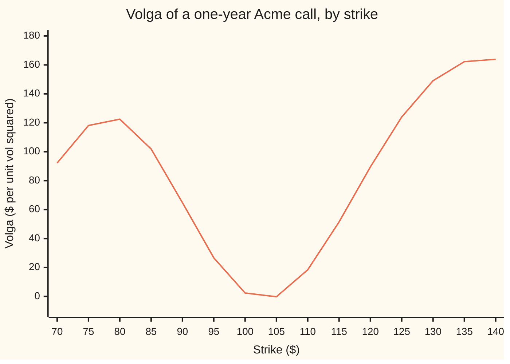

# Volga: the curvature of the volatility bet

[Syllabus](../../../SYLLABUS.md) → [Financial mathematics](../README.md) → [The Greeks, one each](../README.md#s09) → Volga

---

## General Overview

Acme shares trade at $100. A one-year call option on Acme with a $100 strike costs $9.23 when the market prices Acme's volatility (how widely its price swings in a year) at 20 percent. The option's vega is 37.90: each full unit of volatility, 1.00 or 100 percentage points, is worth $37.90 to the price, so one vol point is worth about 38 cents ([Vega](03-vega.md)).

Vega is a slope, and slopes change. Push volatility from 20 to 21 percent and vega itself drifts, from 37.90 to 37.92. The rate at which vega changes as volatility changes is **volga**, short for "volatility gamma" and also called vomma. It is to vega what gamma is to delta ([Gamma](02-gamma.md)): the bend in the curve, where vega is the tilt.

Volga matters because volatility does not sit still. When the market's volatility figure itself jumps around, an option with positive volga gains on the jumps up more than it loses on the jumps down. Acme's $130 call, far above today's price, has volga 149.08, more than sixty times the house option's 2.37. If Acme's volatility turns out to be 15 or 25 percent with even odds, that $130 call is worth 18.77 cents more than at a sure 20 percent. The call struck at Acme's forward price, $103.05, is worth 0.24 cents less.

**Volga is vega times the product of the two Black-Scholes distances, divided by volatility; it is positive when the strike is far from the forward price, where the price bends upward in volatility, and slightly negative near the forward, where the price is almost a straight line in volatility.**

**What kind of fact this is:** a theorem inside the Black-Scholes model, proved on this card in Why it works; the model itself is an assumption, and a model with constant volatility is being asked what happens when volatility moves.

### The picture: volga across strikes

The strike runs left to right; volga, in dollars per unit of volatility squared, runs up. Every other input is the house market.



One line: volga of the call at each strike. It dips just below zero between $101 and $105, the band around the forward price, and rises steeply either side. The put at the same strike has the same volga, so the left side is also the far-out put's story.

---

## The formula

The notation $\partial C / \partial \sigma$ means the rate at which the price changes as volatility moves while every other input is held still ([Partial derivatives](../../06-Calculus%20and%20analysis/07-Several%20Variables/01-partial-derivatives.md)). Applying it twice gives the second derivative.

$$\text{Volga} \;=\; \frac{\partial^2 C}{\partial \sigma^2} \;=\; \frac{\partial \mathcal{V}}{\partial \sigma} \;=\; \mathcal{V}\,\frac{d_1\,d_2}{\sigma}$$

**Read it aloud:** volga is vega, times the product of the two Black-Scholes distances, divided by volatility.

| Symbol | Plain meaning | In our example | Push it up and volga… |
| --- | --- | --- | --- |
| $C$ | the call's price today | \$9.23 | (the output's parent) |
| $S$ | Acme's share price today | \$100 | moves the option relative to the strike; see $m$ |
| $K$ | the strike, the price the call lets its holder pay | \$100 | falls to its lowest near $F$, then climbs |
| $r$, $q$ | the riskless rate and Acme's dividend yield, continuously compounded | 5%, 2% | shift $F$, and with it the zero band |
| $T$ | time to expiry, in years | 1 | widens the band where volga is negative |
| $\sigma$ | volatility: the yearly spread of Acme's log price | 20% | at a fixed strike, can flip the sign: 40% gives −3.24 |
| $F$ | the forward price, $S\,e^{(r-q)T}$: the fair price today for delivery at $T$ | \$103.05 | (the centre of the zero band) |
| $m$ | log distance from strike to forward, $\ln(F/K)$ | 0.03 | the further from 0, the larger volga |
| $d_1$, $d_2$ | distances to the strike in units of $\sigma\sqrt{T}$, as on the pilot card | 0.25, 0.05 | their product sets the sign |
| $\varphi$, $N$ | the bell curve's height, and its area to the left of a point | $\varphi(d_1) = 0.3867$ | |
| $\mathcal{V}$ | vega, $\partial C / \partial \sigma$, per unit of volatility | 37.90 | scales volga up |
| $\Delta\sigma$ | a move in volatility | 0.05 | the gain from it grows as its square |

The helpers, unchanged from the pilot [Black–Scholes call](../08-The%20Black-Scholes%20call%20and%20put/01-black-scholes-call.md):

$$d_1 = \frac{\ln(S/K) + (r - q + \tfrac12\sigma^2)T}{\sigma\sqrt{T}}, \qquad d_2 = d_1 - \sigma\sqrt{T}, \qquad \mathcal{V} = S\,e^{-qT}\,\varphi(d_1)\sqrt{T}.$$

In words: call $\sigma\sqrt{T}$ the spread. $d_1$ and $d_2$ sit half a spread either side of $m/(\sigma\sqrt{T})$, the forward's distance from the strike in spread units. Vega is the share price discounted at the dividend yield, times the bell curve's height at $d_1$, times the square root of time.

A second form, derived in Step 4, carries the whole sign story:

$$d_1\,d_2 \;=\; \frac{m^2}{\sigma^2 T} \;-\; \frac{\sigma^2 T}{4}$$

**Read it aloud:** the squared distance from the forward, in spread units, minus a quarter of the variance. Here $\sigma^2 T$ is the variance of Acme's log price over the option's life. Volga is positive exactly when the strike sits further than half the variance, $\tfrac12\sigma^2 T$, from the forward in log terms.

### When it holds

- **Black-Scholes prices.** The formula differentiates the Black-Scholes price. A model with a volatility smile (implied volatility that differs by strike) gives a different second derivative; the formula remains the market's standard way to quote the number.
- **Volatility as an input, not a state.** Volga measures how the price would bend if the one volatility number were changed. Treating it as the payoff from random volatility needs that randomness to be independent of Acme's own shocks; with correlation, vanna enters as well ([Vanna](06-vanna.md)).
- **Small moves.** Half volga times $\Delta\sigma^2$ is a second-order estimate. For the \$130 call it is off by 0.14 cents on a 5-point move and by 0.48 cents on a 10-point move.
- **Units stated.** The formula is per unit of volatility squared. Per vol point squared, divide by 10,000: the house figure is 0.000237.

---

## Why it works

### Step 0: volga is the slope of vega, and only one piece of vega moves

Vega is already on its own card: $\mathcal{V} = S\,e^{-qT}\,\varphi(d_1)\sqrt{T}$. When volatility moves, the share price, the dividend discount and the time stay put. Only $d_1$ moves, and with it the bell curve's height $\varphi(d_1)$. So volga is vega's fixed part, $S\,e^{-qT}\sqrt{T}$, times how fast $\varphi(d_1)$ changes as $\sigma$ moves. That rate is a chain of two slopes: how the bell curve's height changes with its argument, and how the argument $d_1$ changes with $\sigma$.

### Step 1: the bell curve's slope is minus the point times the height

The bell curve's height is $\varphi(x) = e^{-x^2/2}/\sqrt{2\pi}$. Differentiating the exponent gives $-x$, so $\varphi'(x) = -x\,\varphi(x)$. To the right of zero the curve falls; to the left it rises; at zero it is flat.

### Step 2: raising volatility pulls d1 by minus d2 over sigma

Write $d_1$ with the forward inside it: $d_1 = \dfrac{m}{\sigma\sqrt{T}} + \dfrac{\sigma\sqrt{T}}{2}$, with $m = \ln(F/K)$. Raising $\sigma$ shrinks the first term and grows the second. The net rate is

$$\frac{\partial d_1}{\partial \sigma} \;=\; -\frac{m}{\sigma^2\sqrt{T}} + \frac{\sqrt{T}}{2} \;=\; -\frac{d_2}{\sigma}.$$

The last step uses $d_2 = \dfrac{m}{\sigma\sqrt{T}} - \dfrac{\sigma\sqrt{T}}{2}$; multiply it by $-1/\sigma$ and the two terms match.

### Step 3: chain the slopes

Multiply the fixed part, the bell curve's slope at $d_1$, and $d_1$'s slope in $\sigma$:

$$\frac{\partial \mathcal{V}}{\partial \sigma} = S\,e^{-qT}\sqrt{T}\,\bigl(-d_1\,\varphi(d_1)\bigr)\Bigl(-\frac{d_2}{\sigma}\Bigr) = \mathcal{V}\,\frac{d_1\,d_2}{\sigma}.$$

The two minus signs cancel. That is the formula.

### Step 4: the sign lives in d1 times d2

Vega and $\sigma$ are positive, so volga has the sign of $d_1 d_2$. Since $d_1$ and $d_2$ are $m/(\sigma\sqrt{T})$ plus and minus half a spread, their product is a difference of squares: $m^2/(\sigma^2 T) - \sigma^2 T/4$. It is zero when $|m| = \tfrac12\sigma^2 T$, which puts the two zero strikes at

$$K = F\,e^{\pm\sigma^2 T/2}: \qquad \$101.01 \text{ (where } d_2 = 0) \quad\text{and}\quad \$105.13 \text{ (where } d_1 = 0).$$

Between them $d_1$ is positive and $d_2$ negative, so volga is negative. Outside them the two distances share a sign and volga is positive. The deepest point of the dip is near the forward, where $m = 0$, $d_1 = \sigma\sqrt{T}/2 = 0.10$, $d_2 = -0.10$, and volga is $-\mathcal{V}\sigma T/4 = -1.95$.

The house option, struck at \$100, sits just outside the band: $m = 0.03$ beats half the variance, 0.02, so its volga is positive and small, 2.37.

<details>
<summary>Detailed proof</summary>

**Claim.** In the Black-Scholes model with dividend yield $q$, $\partial^2 C/\partial\sigma^2 = \mathcal{V}\,d_1 d_2/\sigma$, the same for the put, and $d_1 d_2 = m^2/(\sigma^2 T) - \sigma^2 T/4$.

1. $\partial C/\partial\sigma = \mathcal{V} = S e^{-qT}\varphi(d_1)\sqrt{T}$, proved on the vega card. It uses the identity $S e^{-qT}\varphi(d_1) = K e^{-rT}\varphi(d_2)$, which makes the two $N$ terms' $\sigma$-derivatives collapse into one.
2. With $a = m/\sqrt{T}$, $d_1 = a/\sigma + \sigma\sqrt{T}/2$ and $d_2 = a/\sigma - \sigma\sqrt{T}/2$.
3. $\partial d_1/\partial\sigma = -a/\sigma^2 + \sqrt{T}/2 = -(a/\sigma - \sigma\sqrt{T}/2)/\sigma = -d_2/\sigma$.
4. $\varphi'(x) = -x\varphi(x)$, so $\partial\varphi(d_1)/\partial\sigma = -d_1\varphi(d_1)\cdot(-d_2/\sigma) = \varphi(d_1)\,d_1 d_2/\sigma$.
5. $S$, $q$, $T$ do not depend on $\sigma$, so $\partial\mathcal{V}/\partial\sigma = \mathcal{V}\,d_1 d_2/\sigma$.
6. Put-call parity: $P = C - S e^{-qT} + K e^{-rT}$. The two added terms contain no $\sigma$, so the put's second $\sigma$-derivative equals the call's.
7. $d_1 d_2 = (a/\sigma)^2 - (\sigma\sqrt{T}/2)^2 = m^2/(\sigma^2 T) - \sigma^2 T/4$. It vanishes at $m = \pm\sigma^2 T/2$, that is $K = F e^{\mp\sigma^2 T/2}$, and is negative strictly between. $\blacksquare$

</details>

### Step 5: why the far option gains from volatility of volatility

Suppose the year's volatility is not known: it will be 15 or 25 percent, even odds, fixed for the year and unrelated to which way Acme moves. For each outcome the Black-Scholes price is right, so the option is worth the average of the two prices. Expand each price around 20 percent: the slope terms, $\pm\mathcal{V}\,\Delta\sigma$, cancel in the average; the bend terms, $\tfrac12\,\text{volga}\,\Delta\sigma^2$, add. So

$$\tfrac12\bigl[C(\sigma + \Delta\sigma) + C(\sigma - \Delta\sigma)\bigr] \;\approx\; C(\sigma) + \tfrac12\,\text{Volga}\,\Delta\sigma^2.$$

That is the whole reason volga has a price. An option with positive volga is a convex bet on volatility: uncertainty about volatility is worth money to its holder.

Why is the far option convex and the forward option not? A far-out call pays only if Acme travels a long way, many spreads. Its price behaves like a tail of the bell curve, and a tail wakes up faster than proportionally as the spread widens: going from 15 to 20 percent adds less than going from 20 to 25. At the forward, the call is worth $S e^{-qT}\bigl[N(\sigma\sqrt{T}/2) - N(-\sigma\sqrt{T}/2)\bigr]$, the bell curve's area in a narrow window around zero. The curve is nearly flat there, so the area grows almost in proportion to $\sigma$: vega hardly changes, and the slight flattening of the bell's top makes the bend a touch negative.

<details>
<summary>Volga and a volatility that wanders all year</summary>

Hull and White (1987) showed that when volatility wanders at random, independently of the share's own shocks, the call is worth the Black-Scholes price averaged over the possible values of the year's root-mean-square volatility. The two-outcome coin flip in Step 5 is the smallest case of that result. Volga, via the expansion above, is what turns the spread of that realised volatility into dollars.

</details>

A second road to the number needs no formula at all: price the option by averaging its payoff over the bell curve for volatilities a hair above and below 20 percent, and measure how the price bends. The code does exactly that. How volga sits beside delta, gamma, vega and the others in one expansion of a day's profit and loss is [The Greeks together](09-greeks-together-taylor-pnl.md).

---

## Worked numbers, by hand

House market: $S = K = 100$, $r = 5\%$, $q = 2\%$, $\sigma = 20\%$, $T = 1$.

| Step | Arithmetic | Value |
| --- | --- | --- |
| $d_1$ | $(0 + (0.05 - 0.02 + 0.02) \times 1)/0.20$ | 0.25 |
| $d_2$ | $0.25 - 0.20$ | 0.05 |
| $d_1 d_2$ | $0.25 \times 0.05$ | 0.0125 |
| $\varphi(d_1)$ | $e^{-0.03125}/\sqrt{2\pi}$ | 0.386668 |
| $e^{-qT}$ | $e^{-0.02}$ | 0.980199 |
| vega | $100 \times 0.980199 \times 0.386668 \times 1$ | 37.901158 |
| vega over $\sigma$ | $37.901158 / 0.20$ | 189.505788 |
| **volga** | $189.505788 \times 0.0125$ | **2.368822** |
| per vol point squared | $2.368822 / 10{,}000$ | 0.000237 |
| sign check by $m$ | $\ln(F/K) = 0.03$ against $\tfrac12\sigma^2 T = 0.02$ | positive |

In the world: raise Acme's volatility from 20 to 21 percent and vega climbs by about $0.01 \times 2.37$. Vega recomputed at 21 percent is 37.921380; the volga estimate, 37.924846, is off by 0.0035 because volga itself is falling as volatility rises.

At the forward strike, $103.05, the same arithmetic gives vega 38.909236 and volga −1.945462: a bend of about 5 percent of vega per unit of volatility, which is almost none per vol point.

### What breaks if you drop a piece

| Mistake | Comes out at | What went wrong |
| --- | --- | --- |
| Sign slip: $\partial d_1/\partial\sigma = +d_2/\sigma$ | −2.368822 | Right size, wrong direction; the sign story on the whole chart flips |
| $d_1^2$ in place of $d_1 d_2$ | 11.844112 | Five times too big, and never negative: it hides the dip near the forward |
| Reading volga per unit as per vol point | vega at 21%: 40.269980 (right: 37.921380) | Added a full unit's worth of volga for a one-point move |
| Putting the zero at the forward | volga at $F$: −1.945462, not 0 | The zeros sit half a variance either side of $F$; the forward is the bottom of the dip |

---

## When volatility itself moves

**The mystery:** two options, one market, one volatility forecast of 20 percent, and one of them is worth more only because the forecast is uncertain.

Replace the sure 20 percent with 15 or 25 percent, even odds. For each strike: the price at 20 percent, the average of the two prices, and the gain, set against half volga times $\Delta\sigma^2$ with $\Delta\sigma = 0.05$.

| Strike | Price at 20% | Average of 15% and 25% | Gain (cents) | Half volga times Δσ squared (cents) |
| --- | --- | --- | --- | --- |
| $80 | $22.7641 | $22.9171 | 15.30 | 15.31 |
| $90 | $15.1237 | $15.2083 | 8.46 | 8.10 |
| $100 | $9.2270 | $9.2303 | 0.33 | 0.30 |
| $103.05 (forward) | $7.8078 | $7.8054 | −0.24 | −0.24 |
| $110 | $5.1886 | $5.2132 | 2.46 | 2.30 |
| $120 | $2.7118 | $2.8280 | 11.62 | 11.19 |
| $130 | $1.3308 | $1.5185 | 18.77 | 18.63 |
| $140 | $0.6195 | $0.8202 | 20.07 | 20.49 |

The gain from uncertain volatility, one block to a cent:

```
strike     gain in cents from 15%-or-25% vol, one block = 1 cent
  $80      ███████████████                 15.30
  $90      ████████                         8.46
 $100                                       0.33
 $103.05   (a loss)                        -0.24
 $110      ██                               2.46
 $120      ███████████                     11.62
 $130      ██████████████████              18.77
 $140      ████████████████████            20.07
```

The two ends gain; the middle does not. The $130 call gains 18.77 cents on a $1.33 option. The at-the-money options gain a third of a cent or lose a quarter of one. The volga column predicts every row to within half a cent; the misses are the higher-order bends the expansion drops.

Read the $80 row as the put's story too: the $80 call's volga equals the $80 put's, and the $80 put is the far-out option there.

---

## Code, from first principles, and it actually runs

The check takes three independent roads to the house volga. Road 1 is the closed form $\mathcal{V} d_1 d_2/\sigma$. Road 2 nudges volatility by 0.00001 either way and measures how vega changes. Road 3 uses no Black-Scholes formula: it prices the call and the put by averaging the payoff over the bell curve (Simpson's rule, with the payoff's switch-on point found by bisection), does that at five volatilities around 20 percent, and measures the bend, with Richardson's trick to cancel the step-size error. It then finds the two zero strikes by bisection on road 2 and compares them with $F e^{\pm\sigma^2 T/2}$, runs the uncertain-volatility table, and reproduces every "what breaks" number and every charted point.

### Python

```python
# Volga -- the check behind the card.  Standard library only.
# Every number quoted on the card is printed here.  Nothing imported knows the
# answer: N(x) is built from math.erf, the integral is Simpson's rule written
# out, the root finder is bisection written out.
from math import log, sqrt, exp, erf, pi

S, r, q, T, SIG = 100.0, 0.05, 0.02, 1.0, 0.20       # the house market
F = S * exp((r - q) * T)                              # forward price

def N(x):   return 0.5 * (1.0 + erf(x / sqrt(2.0)))   # bell-curve area left of x
def phi(x): return exp(-0.5 * x * x) / sqrt(2.0 * pi) # bell-curve height at x

def d1d2(K, s):
    d1 = (log(S / K) + (r - q + 0.5 * s * s) * T) / (s * sqrt(T))
    return d1, d1 - s * sqrt(T)

def call(K, s):
    d1, d2 = d1d2(K, s)
    return S * exp(-q * T) * N(d1) - K * exp(-r * T) * N(d2)

def vega(K, s):                                       # dC/dsigma, from the vega card
    d1, _ = d1d2(K, s)
    return S * exp(-q * T) * phi(d1) * sqrt(T)

def volga(K, s):                                      # road 1: the closed form
    d1, d2 = d1d2(K, s)
    return vega(K, s) * d1 * d2 / s

def volga_bump(K, s, h=1e-5):                         # road 2: nudge sigma, watch vega
    return (vega(K, s + h) - vega(K, s - h)) / (2 * h)

def bisect(f, lo, hi):                                # root finder: halve the bracket
    flo = f(lo)
    for _ in range(200):
        mid = 0.5 * (lo + hi)
        fm = f(mid)
        if (fm > 0) == (flo > 0): lo, flo = mid, fm
        else: hi = mid
    return 0.5 * (lo + hi)

def simpson(f, a, b, n=4000):
    h = (b - a) / n
    tot = f(a) + f(b)
    for i in range(1, n):
        tot += (4 if i % 2 else 2) * f(a + i * h)
    return tot * h / 3.0

def price_by_integral(K, s, put=False):               # no d1, no d2, no N
    a, b = (r - q - 0.5 * s * s) * T, s * sqrt(T)
    ST = lambda z: S * exp(a + b * z)
    zk = bisect(lambda z: ST(z) - K, -10.0, 10.0)     # where the payoff switches on
    if put: v = simpson(lambda z: (K - ST(z)) * phi(z), -10.0, zk)
    else:   v = simpson(lambda z: (ST(z) - K) * phi(z), zk, 10.0)
    return exp(-r * T) * v

def volga_second_diff(K, s, put=False, h=1e-3):       # road 3: curvature of the price itself
    p = {j: price_by_integral(K, s + j * h, put) for j in (-2, -1, 0, 1, 2)}
    d_h = (p[1] - 2 * p[0] + p[-1]) / h ** 2           # steps of h
    d_2h = (p[2] - 2 * p[0] + p[-2]) / (2 * h) ** 2     # steps of 2h
    return (4 * d_h - d_2h) / 3                         # Richardson: cancel the h^2 error

K = 100.0
d1, d2 = d1d2(K, SIG)
v1, v2, v3 = volga(K, SIG), volga_bump(K, SIG), volga_second_diff(K, SIG)
v3put = volga_second_diff(K, SIG, put=True)
m, half_var = log(F / K), 0.5 * SIG * SIG * T
z_lo = bisect(lambda k: volga_bump(k, SIG), 90.0, F)  # sign changes found numerically
z_hi = bisect(lambda k: volga_bump(k, SIG), F, 120.0)
rows = [
    ("d1", d1), ("d2", d2), ("d1 d2", d1 * d2), ("e^(-qT)", exp(-q * T)), ("phi(d1)", phi(d1)),
    ("vega", vega(K, SIG)), ("vega / sigma", vega(K, SIG) / SIG),
    ("1 volga, vega d1 d2 / sigma", v1), ("2 volga, bump of vega", v2),
    ("3 volga, 2nd difference of price", v3), ("  put, 2nd difference of price", v3put),
    ("volga per vol point squared", v1 / 1e4),
    ("vega at 21%, formula", vega(K, 0.21)), ("vega at 21%, vega + 0.01 volga", vega(K, SIG) + 0.01 * v1),
    ("ln(F/K)", m), ("half the variance, sigma^2 T / 2", half_var),
    ("forward F", F), ("vega at K = F", vega(F, SIG)), ("volga at K = F", volga(F, SIG)), ("  -vega sigma T / 4 at K = F", -vega(F, SIG) * SIG * T / 4),
    ("zero strike low, bisection", z_lo), ("  F e^(-sigma^2 T / 2)", F * exp(-half_var)),
    ("zero strike high, bisection", z_hi), ("  F e^(+sigma^2 T / 2)", F * exp(half_var)),
    ("wrong: sign slip in dd1/dsigma", -vega(K, SIG) * d1 * d2 / SIG),
    ("wrong: d1^2 for d1 d2", vega(K, SIG) * d1 * d1 / SIG),
    ("wrong: vega at 21% as vega + volga", vega(K, SIG) + v1),
    ("try: sigma = 40%", volga(K, 0.40)), ("try: K = 130", volga(130.0, SIG)),
    ("try: K = 80", volga(80.0, SIG)),
]
for name, v in rows:
    print(f"{name:<36} {v:>12.6f}")

# ---- volatility itself moves: 15% or 25%, even odds, instead of a sure 20% ----
print()
print("strike   price@20%  avg(15%,25%)  gain(c)  half volga dsig^2 (c)")
mix = {}
for k in (80.0, 90.0, 100.0, F, 110.0, 120.0, 130.0, 140.0):
    avg = 0.5 * (call(k, 0.15) + call(k, 0.25))
    mix[k] = (avg - call(k, SIG), 0.5 * volga(k, SIG) * 0.05 ** 2)
    print(f"{k:7.2f} {call(k, SIG):10.4f} {avg:12.4f} {100 * mix[k][0]:9.2f} {100 * mix[k][1]:12.2f}")
wide = 0.5 * (call(130.0, 0.10) + call(130.0, 0.30)) - call(130.0, SIG)
print(f"try: K = 130, 10% or 30%: gain(c) {100 * wide:.2f}  half volga dsig^2 (c) {100 * 0.5 * volga(130.0, SIG) * 0.01:.2f}")

# ---- chart: volga across strikes ----
ks = [70.0 + 5.0 * i for i in range(15)]
print("chart, strike " + " ".join(f"{k:.0f}" for k in ks))
print("chart, volga  " + " ".join(f"{volga(k, SIG):.2f}" for k in ks))

assert abs(v1 - 2.368822) < 5e-7,               "closed form vs the shelf's house number"
assert abs(v2 - v1) < 1e-6,                     "bump of vega must land on vega d1 d2 / sigma"
assert abs(v3 - v1) < 1e-6,                     "call price curvature, from the integral"
assert abs(v3put - v1) < 1e-6,                  "put price curvature equals the call's"
assert abs(z_lo - F * exp(-half_var)) < 1e-6,   "low zero where d2 = 0"
assert abs(z_hi - F * exp(half_var)) < 1e-6,    "high zero where d1 = 0"
assert abs(mix[130.0][0] - mix[130.0][1]) < 0.005, "wing gain matches half volga times dsigma^2"
assert mix[130.0][0] > 0 > mix[F][0],           "wing gains from vol of vol, forward strike loses"
print("ALL CHECKS PASS")
```

**Ran 2026-09-19 on macOS, Python 3.14.6, standard library only. All checks passed. Output, pasted from the run:**

```
d1                                       0.250000
d2                                       0.050000
d1 d2                                    0.012500
e^(-qT)                                  0.980199
phi(d1)                                  0.386668
vega                                    37.901158
vega / sigma                           189.505788
1 volga, vega d1 d2 / sigma              2.368822
2 volga, bump of vega                    2.368822
3 volga, 2nd difference of price         2.368822
  put, 2nd difference of price           2.368822
volga per vol point squared              0.000237
vega at 21%, formula                    37.921380
vega at 21%, vega + 0.01 volga          37.924846
ln(F/K)                                  0.030000
half the variance, sigma^2 T / 2         0.020000
forward F                              103.045453
vega at K = F                           38.909236
volga at K = F                          -1.945462
  -vega sigma T / 4 at K = F            -1.945462
zero strike low, bisection             101.005017
  F e^(-sigma^2 T / 2)                 101.005017
zero strike high, bisection            105.127110
  F e^(+sigma^2 T / 2)                 105.127110
wrong: sign slip in dd1/dsigma          -2.368822
wrong: d1^2 for d1 d2                   11.844112
wrong: vega at 21% as vega + volga      40.269980
try: sigma = 40%                        -3.235826
try: K = 130                           149.079413
try: K = 80                            122.497937

strike   price@20%  avg(15%,25%)  gain(c)  half volga dsig^2 (c)
  80.00    22.7641      22.9171     15.30        15.31
  90.00    15.1237      15.2083      8.46         8.10
 100.00     9.2270       9.2303      0.33         0.30
 103.05     7.8078       7.8054     -0.24        -0.24
 110.00     5.1886       5.2132      2.46         2.30
 120.00     2.7118       2.8280     11.62        11.19
 130.00     1.3308       1.5185     18.77        18.63
 140.00     0.6195       0.8202     20.07        20.49
try: K = 130, 10% or 30%: gain(c) 75.02  half volga dsig^2 (c) 74.54
chart, strike 70 75 80 85 90 95 100 105 110 115 120 125 130 135 140
chart, volga  92.22 118.13 122.50 101.90 64.79 26.69 2.37 -0.23 18.42 51.48 89.55 124.01 149.08 162.27 163.89
ALL CHECKS PASS
```

Three roads, one number: 2.368822 from the formula, from the vega bump and from the bent price, call and put alike. The zeros found by bisection sit on $F e^{\pm\sigma^2 T/2}$ to six decimals.

### Rust

Same checks, same inputs. Rust has no `erf`, so $N$ is built by adding slices under the bell curve. No crates.

```rust
// Volga -- the same check as volga_check.py, in Rust.  Standard library only.
// Rust has no erf, so N(x) is built by adding thin slices under the bell
// curve (Simpson).  The root finder is bisection, written out.
// Compile: rustc --edition 2021 -O volga_check.rs -o /tmp/volga_check
use std::collections::HashMap;
use std::f64::consts::PI;

const S: f64 = 100.0;
const R: f64 = 0.05;
const Q: f64 = 0.02;
const T: f64 = 1.0;
const SIG: f64 = 0.20;

fn phi(x: f64) -> f64 { (-0.5 * x * x).exp() / (2.0 * PI).sqrt() }   // bell-curve height at x

fn simpson<G: Fn(f64) -> f64>(f: G, a: f64, b: f64, n: usize) -> f64 {
    let h = (b - a) / n as f64;
    let mut s = f(a) + f(b);
    for i in 1..n { s += if i % 2 == 1 { 4.0 } else { 2.0 } * f(a + i as f64 * h); }
    s * h / 3.0
}

fn n_cdf(x: f64) -> f64 {                                              // area left of x
    if x < -12.0 { return 0.0; }
    if x > 12.0 { return 1.0; }
    0.5 + simpson(phi, 0.0, x, 4000)
}

fn d1d2(k: f64, s: f64) -> (f64, f64) {
    let d1 = ((S / k).ln() + (R - Q + 0.5 * s * s) * T) / (s * T.sqrt());
    (d1, d1 - s * T.sqrt())
}

fn call(k: f64, s: f64) -> f64 {
    let (d1, d2) = d1d2(k, s);
    S * (-Q * T).exp() * n_cdf(d1) - k * (-R * T).exp() * n_cdf(d2)
}

fn vega(k: f64, s: f64) -> f64 { S * (-Q * T).exp() * phi(d1d2(k, s).0) * T.sqrt() }

fn volga(k: f64, s: f64) -> f64 {                                      // road 1: closed form
    let (d1, d2) = d1d2(k, s);
    vega(k, s) * d1 * d2 / s
}

fn volga_bump(k: f64, s: f64) -> f64 {                                 // road 2: nudge sigma, watch vega
    let h = 1e-5;
    (vega(k, s + h) - vega(k, s - h)) / (2.0 * h)
}

fn bisect<G: Fn(f64) -> f64>(f: G, mut lo: f64, mut hi: f64) -> f64 {
    let mut flo = f(lo);
    for _ in 0..200 {
        let mid = 0.5 * (lo + hi);
        let fm = f(mid);
        if (fm > 0.0) == (flo > 0.0) { lo = mid; flo = fm; } else { hi = mid; }
    }
    0.5 * (lo + hi)
}

fn price_by_integral(k: f64, s: f64, put: bool) -> f64 {              // no d1, no d2, no N
    let (a, b) = ((R - Q - 0.5 * s * s) * T, s * T.sqrt());
    let st = |z: f64| S * (a + b * z).exp();
    let zk = bisect(|z| st(z) - k, -10.0, 10.0);                     // where the payoff switches on
    let v = if put { simpson(|z| (k - st(z)) * phi(z), -10.0, zk, 4000) }
            else { simpson(|z| (st(z) - k) * phi(z), zk, 10.0, 4000) };
    (-R * T).exp() * v
}

fn volga_second_diff(k: f64, s: f64, put: bool) -> f64 {              // road 3: curvature of the price
    let h = 1e-3;
    let p = |j: f64| price_by_integral(k, s + j * h, put);
    let (pm2, pm1, p0, pp1, pp2) = (p(-2.0), p(-1.0), p(0.0), p(1.0), p(2.0));
    let d_h = (pp1 - 2.0 * p0 + pm1) / (h * h);
    let d_2h = (pp2 - 2.0 * p0 + pm2) / (4.0 * h * h);
    (4.0 * d_h - d_2h) / 3.0                                           // Richardson: cancel the h^2 error
}

fn main() {
    let f = S * ((R - Q) * T).exp();
    let k = 100.0;
    let (d1, d2) = d1d2(k, SIG);
    let (v1, v2, v3) = (volga(k, SIG), volga_bump(k, SIG), volga_second_diff(k, SIG, false));
    let v3put = volga_second_diff(k, SIG, true);
    let (m, half_var) = ((f / k).ln(), 0.5 * SIG * SIG * T);
    let z_lo = bisect(|x| volga_bump(x, SIG), 90.0, f);
    let z_hi = bisect(|x| volga_bump(x, SIG), f, 120.0);
    let rows: Vec<(&str, f64)> = vec![
        ("d1", d1), ("d2", d2), ("d1 d2", d1 * d2), ("e^(-qT)", (-Q * T).exp()), ("phi(d1)", phi(d1)),
        ("vega", vega(k, SIG)), ("vega / sigma", vega(k, SIG) / SIG),
        ("1 volga, vega d1 d2 / sigma", v1), ("2 volga, bump of vega", v2),
        ("3 volga, 2nd difference of price", v3), ("  put, 2nd difference of price", v3put),
        ("volga per vol point squared", v1 / 1e4),
        ("vega at 21%, formula", vega(k, 0.21)), ("vega at 21%, vega + 0.01 volga", vega(k, SIG) + 0.01 * v1),
        ("ln(F/K)", m), ("half the variance, sigma^2 T / 2", half_var),
        ("forward F", f), ("vega at K = F", vega(f, SIG)), ("volga at K = F", volga(f, SIG)), ("  -vega sigma T / 4 at K = F", -vega(f, SIG) * SIG * T / 4.0),
        ("zero strike low, bisection", z_lo), ("  F e^(-sigma^2 T / 2)", f * (-half_var).exp()),
        ("zero strike high, bisection", z_hi), ("  F e^(+sigma^2 T / 2)", f * half_var.exp()),
        ("wrong: sign slip in dd1/dsigma", -vega(k, SIG) * d1 * d2 / SIG),
        ("wrong: d1^2 for d1 d2", vega(k, SIG) * d1 * d1 / SIG),
        ("wrong: vega at 21% as vega + volga", vega(k, SIG) + v1),
        ("try: sigma = 40%", volga(k, 0.40)), ("try: K = 130", volga(130.0, SIG)),
        ("try: K = 80", volga(80.0, SIG)),
    ];
    for (name, v) in &rows { println!("{:<36} {:>12.6}", name, v); }

    // ---- volatility itself moves: 15% or 25%, even odds, instead of a sure 20% ----
    println!();
    println!("strike   price@20%  avg(15%,25%)  gain(c)  half volga dsig^2 (c)");
    let mut mix: HashMap<u64, (f64, f64)> = HashMap::new();
    for kk in [80.0, 90.0, 100.0, f, 110.0, 120.0, 130.0, 140.0] {
        let avg = 0.5 * (call(kk, 0.15) + call(kk, 0.25));
        let g = (avg - call(kk, SIG), 0.5 * volga(kk, SIG) * 0.05f64.powi(2));
        mix.insert(kk.to_bits(), g);
        println!("{:7.2} {:10.4} {:12.4} {:9.2} {:12.2}", kk, call(kk, SIG), avg, 100.0 * g.0, 100.0 * g.1);
    }
    let wide = 0.5 * (call(130.0, 0.10) + call(130.0, 0.30)) - call(130.0, SIG);
    println!("try: K = 130, 10% or 30%: gain(c) {:.2}  half volga dsig^2 (c) {:.2}", 100.0 * wide, 100.0 * 0.5 * volga(130.0, SIG) * 0.01);

    // ---- chart: volga across strikes ----
    let ks: Vec<f64> = (0..15).map(|i| 70.0 + 5.0 * i as f64).collect();
    println!("chart, strike {}", ks.iter().map(|x| format!("{:.0}", x)).collect::<Vec<_>>().join(" "));
    println!("chart, volga  {}", ks.iter().map(|x| format!("{:.2}", volga(*x, SIG))).collect::<Vec<_>>().join(" "));

    let (w, a) = (mix[&130.0f64.to_bits()], mix[&f.to_bits()]);
    assert!((v1 - 2.368822).abs() < 5e-7, "closed form vs the shelf's house number");
    assert!((v2 - v1).abs() < 1e-6, "bump of vega must land on vega d1 d2 / sigma");
    assert!((v3 - v1).abs() < 1e-6, "call price curvature, from the integral");
    assert!((v3put - v1).abs() < 1e-6, "put price curvature equals the call's");
    assert!((z_lo - f * (-half_var).exp()).abs() < 1e-6, "low zero where d2 = 0");
    assert!((z_hi - f * half_var.exp()).abs() < 1e-6, "high zero where d1 = 0");
    assert!((w.0 - w.1).abs() < 0.005, "wing gain matches half volga times dsigma^2");
    assert!(w.0 > 0.0 && 0.0 > a.0, "wing gains from vol of vol, forward strike loses");
    println!("ALL CHECKS PASS");
}
```

**Ran 2026-09-19 on macOS, rustc 1.98.1, no crates. All checks passed. Output, pasted from the run:**

```
d1                                       0.250000
d2                                       0.050000
d1 d2                                    0.012500
e^(-qT)                                  0.980199
phi(d1)                                  0.386668
vega                                    37.901158
vega / sigma                           189.505788
1 volga, vega d1 d2 / sigma              2.368822
2 volga, bump of vega                    2.368822
3 volga, 2nd difference of price         2.368822
  put, 2nd difference of price           2.368822
volga per vol point squared              0.000237
vega at 21%, formula                    37.921380
vega at 21%, vega + 0.01 volga          37.924846
ln(F/K)                                  0.030000
half the variance, sigma^2 T / 2         0.020000
forward F                              103.045453
vega at K = F                           38.909236
volga at K = F                          -1.945462
  -vega sigma T / 4 at K = F            -1.945462
zero strike low, bisection             101.005017
  F e^(-sigma^2 T / 2)                 101.005017
zero strike high, bisection            105.127110
  F e^(+sigma^2 T / 2)                 105.127110
wrong: sign slip in dd1/dsigma          -2.368822
wrong: d1^2 for d1 d2                   11.844112
wrong: vega at 21% as vega + volga      40.269980
try: sigma = 40%                        -3.235826
try: K = 130                           149.079413
try: K = 80                            122.497937

strike   price@20%  avg(15%,25%)  gain(c)  half volga dsig^2 (c)
  80.00    22.7641      22.9171     15.30        15.31
  90.00    15.1237      15.2083      8.46         8.10
 100.00     9.2270       9.2303      0.33         0.30
 103.05     7.8078       7.8054     -0.24        -0.24
 110.00     5.1886       5.2132      2.46         2.30
 120.00     2.7118       2.8280     11.62        11.19
 130.00     1.3308       1.5185     18.77        18.63
 140.00     0.6195       0.8202     20.07        20.49
try: K = 130, 10% or 30%: gain(c) 75.02  half volga dsig^2 (c) 74.54
chart, strike 70 75 80 85 90 95 100 105 110 115 120 125 130 135 140
chart, volga  92.22 118.13 122.50 101.90 64.79 26.69 2.37 -0.23 18.42 51.48 89.55 124.01 149.08 162.27 163.89
ALL CHECKS PASS
```

The two outputs agree line for line at the printed precision.

> [!TIP]
> **Try changing**
> Guess the sign first. Then run it.
> - **Double the volatility.** Set `SIG = 0.40` for the house strike. Volga turns negative, **−3.235826**: half the variance is now 0.08, which beats the house strike's log distance of 0.03, so $100 sits inside the dip.
> - **Go far out.** Call `volga(130.0, SIG)`. It is **149.079413**, more than sixty times the house number, on an option worth a seventh as much.
> - **Go deep in.** Call `volga(80.0, SIG)`. It is **122.497937**. A deep in-the-money call carries the far-out put's volga, since parity adds only terms without $\sigma$.
> - **Widen the uncertainty.** Average the \$130 call at 10 and 30 percent instead. The gain is **75.02** cents; half volga times $0.10^2$ predicts **74.54**. Doubling $\Delta\sigma$ roughly quadruples the gain, as the square promises.

---

## The usual mistake

> [!warning]
> **"At the money means no volga."** Not at the spot strike, and not exactly at the forward either. The zeros of volga sit half a variance either side of the forward, at $101.01 and $105.13 here. The $100 option has volga 2.37; the forward option has −1.95. What is true is that volga near the money is small next to the wings, 149.08 at $130, and that is the practical content of the phrase.
>
> Smaller traps:
> - **Units.** Volga per unit of volatility squared is 2.368822; per vol point squared it is 0.000237. Mixing them predicts vega at 21 percent as 40.27 instead of 37.92.
> - **Dropping the sign.** Writing $d_1^2$, or losing the minus in $\partial d_1/\partial\sigma$, gives 11.84 or −2.37 and erases the dip near the forward.
> - **A bump too coarse.** A three-point second difference of the price with a step of 0.001 misses the house number in the fourth decimal; the check needs the two-step Richardson combination to agree to six.
> - **Reading the gain as free.** Positive volga is paid for: markets that expect volatility to move charge more for the wings, which is one source of the volatility smile.

---

## Where you meet it in real life

- **The smile in the wings.** Far strikes trade at higher implied volatility than at-the-money ones. Part of that premium is the price of positive volga: the wings gain from volatility of volatility, and sellers charge for it.
- **Currency option desks.** The vanna-volga method prices an unusual option by buying the vega, vanna and volga it carries from three quoted options, at-the-money and two wings (Castagna and Mercurio, 2007). The wings supply the volga, the at-the-money option almost none.
- **Straddles and strangles.** A straddle (a call and a put at the same strike near the forward) is nearly a pure vega bet with little volga. A strangle (a call and a put at far strikes) is the volga bet.
- **Risk reports.** A book that is flat in vega can still lose when volatility jumps if it is short volga; the report shows volga next to vega and vanna ([Vanna](06-vanna.md)).
- **Stochastic volatility models.** Models in which volatility wanders produce a smile whose curvature grows with the volatility of volatility; volga is the Black-Scholes number that measures an option's exposure to that.

> **Say it back**
> Volga is the rate at which vega changes when volatility changes, the second derivative of the price in volatility. In Black-Scholes it equals vega times $d_1 d_2$ over volatility. The product $d_1 d_2$ is negative only in a narrow band of strikes within half a variance of the forward, and large and positive in the wings. If volatility is uncertain, an option gains about half its volga times the squared move. So wing options are convex bets on volatility, and options at the forward are almost straight ones.

---

## What this builds on

- [Vega](03-vega.md): the slope this card differentiates, $S e^{-qT}\varphi(d_1)\sqrt{T}$, and the per-unit versus per-point convention.
- [Partial derivatives](../../06-Calculus%20and%20analysis/07-Several%20Variables/01-partial-derivatives.md): holding every input still but one, and the chain rule used in Step 3.

## Where this goes next

- [The Greeks together](09-greeks-together-taylor-pnl.md): volga's term, half volga times the squared volatility move, beside every other Greek in one expansion of a day's profit and loss.

The open question is how large volga's term is next to delta's, gamma's and vega's on an ordinary day, and [The Greeks together](09-greeks-together-taylor-pnl.md) answers it by lining the terms up on one move.

---

## Sources

Verified 2026-09-24: every link below resolves to the cited work (DOIs checked against Crossref).

- Merton, Robert C. "Theory of Rational Option Pricing." *Bell Journal of Economics and Management Science* 4, no. 1 (1973): 141–183. [doi:10.2307/3003143](https://doi.org/10.2307/3003143). The price with a dividend yield, the function this card differentiates twice.
- Hull, John, and Alan White. "The Pricing of Options on Assets with Stochastic Volatilities." *Journal of Finance* 42, no. 2 (1987): 281–300. [doi:10.1111/j.1540-6261.1987.tb02568.x](https://doi.org/10.1111/j.1540-6261.1987.tb02568.x). The averaging result behind Step 5: with independent random volatility, the price is an average of Black-Scholes prices.
- Castagna, Antonio, and Fabio Mercurio. "The Vanna-Volga Method for Implied Volatilities." *Risk*, January 2007. [Publisher page](https://www.risk.net/derivatives/equity-derivatives/1506580/vanna-volga-method-implied-volatilities). Volga as one of the three exposures that price the smile.
- Hull, John C. *Options, Futures, and Other Derivatives*, 11th ed. Pearson. [Publisher page](https://www.pearson.com/en-us/subject-catalog/p/options-futures-and-other-derivatives/P200000005938). The standard textbook treatment of the Greek letters.
