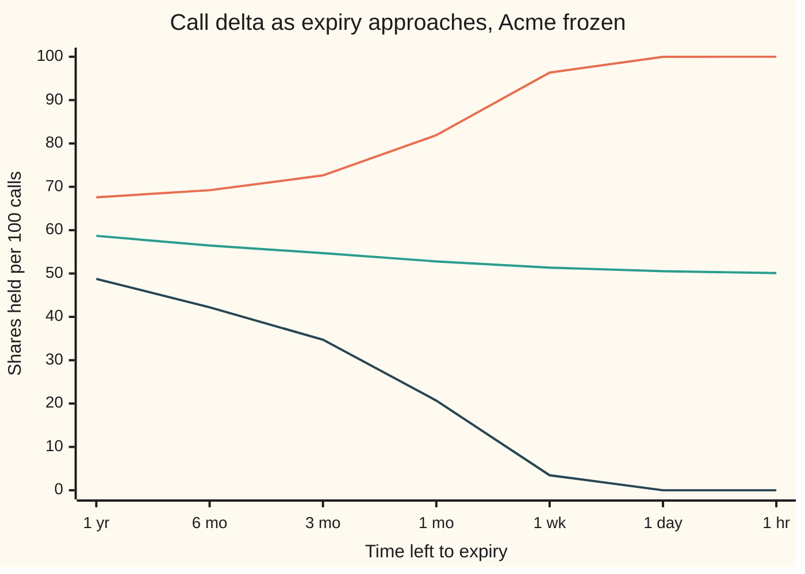
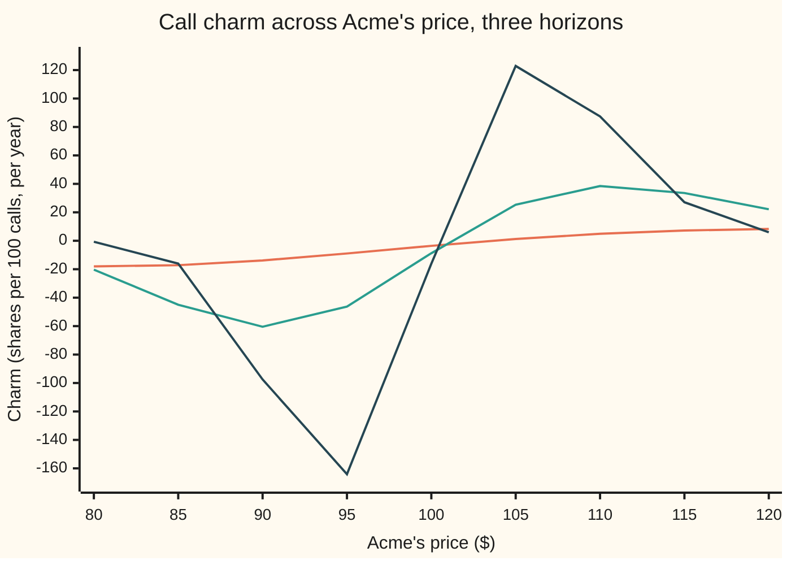

# Charm: how delta drifts as the clock runs, with nothing else moving

Financial mathematics → The Greeks, one each → Delta's clock drift → Charm

---

## General Overview

A desk has sold 10,000 one-year calls on Acme. Acme trades at $100, the strike is $100, cash earns 5 percent, Acme pays a 2 percent dividend yield and moves with 20 percent volatility. To stay neutral, the desk holds 5,868.51 Acme shares: 0.586851 shares per call, the call's **delta** (the number of shares that moves like one call for a small move in Acme; see [delta](01-delta.md)).

The market closes. Overnight Acme does not trade, volatility does not change, rates do not change. One thing moves: the calendar. By morning the option has one day less to live.

Is 5,868.51 still the right share count? No. Delta depends on the time left, so the hedge has aged. The correct count in the morning is 0.98 shares lower. Nothing happened to the stock. The clock did it.

The rate at which delta changes as the calendar advances, with everything else frozen, is called **charm**. For the house call it is −0.035639 shares per call per year of clock. Divide by 365 and that is −0.000098 per call per night, which across 10,000 calls is the 0.98 shares.

**Charm is delta's slope along the calendar: multiply it by the time that passes and it says how many shares a hedge gains or loses while the stock stands still.**

**What kind of fact this is:** charm itself is a definition, a named derivative; its formula is a theorem inside the Black-Scholes model, proved on this card in Why it works.

### The picture: delta as the clock runs out

Three copies of the house call, identical except for where Acme stands. Each line shows delta, in shares per 100 calls, as time left shrinks from a year to an hour.



Top line (orange): Acme frozen at $105, $5 above the strike. Middle line (green): Acme frozen at $100, exactly at the strike. Bottom line (dark blue): Acme frozen at $95. As time runs out, the $105 call becomes a sure exercise and its delta climbs to a full share. The $95 call becomes a sure loss and its delta falls to nothing. The $100 call drifts down toward half a share and stays balanced on the edge, until the final instant, when it must fall to one side or the other. Charm is the slope of each line.

---

## The formula

Notation first, in words. $T$ is time left to expiry, in years. $t$ is the calendar, in years. When $t$ moves forward one day, $T$ moves back one day. A **partial derivative** (the rate of change in one input with all the others held still; see [partial-derivatives](../../06-Calculus%20and%20analysis/07-Several%20Variables/01-partial-derivatives.md)) is written with a curly d, so $\partial\Delta/\partial t$ reads "how fast delta changes as the calendar advances, with Acme, volatility and rates held still". Charm is that rate, written $\chi$ (the Greek letter chi):

$$\chi = \frac{\partial \Delta}{\partial t} = -\frac{\partial \Delta}{\partial T}$$

For a call, with delta $\Delta_C = e^{-qT}N(d_1)$ from the delta card:

$$\chi_C = q\,e^{-qT}N(d_1) \;-\; e^{-qT}\,\varphi(d_1)\,\frac{2(r-q)T - d_2\,\sigma\sqrt{T}}{2T\,\sigma\sqrt{T}}$$

**Read it aloud:** the call's delta gains a little as dividends still to come shrink, and loses or gains as the bell-curve probability behind delta slides with the time left.

For a put:

$$\chi_P = \chi_C - q\,e^{-qT}$$

**Read it aloud:** the put's charm is the call's charm minus the rate at which the dividend drag $e^{-qT}$ grows as the clock runs.

| Symbol | Plain meaning | In our example | Push it up and charm… |
| --- | --- | --- | --- |
| $S$ | Acme's price today | $100 | turns from negative to positive once Acme is far enough above the strike |
| $K$ | the strike | $100 | acts like pushing $S$ down |
| $r$ | the riskless rate, continuously compounded | 5% | pushes charm down at the house point |
| $q$ | the dividend yield | 2% | adds the dividend piece to the call; sets the call-put gap |
| $\sigma$ | volatility, the yearly spread of Acme's log-moves | 20% | changes the size, not a fixed direction |
| $T$ | time left to expiry, in years | 1 | smaller $T$ makes charm larger in size near the strike |
| $t$ | the calendar, in years; $T$ falls as $t$ rises | today | |
| $\Delta$, $\Delta_C$, $\Delta_P$ | delta: shares that move like one option; call and put | 0.586851 and −0.393348 | |
| $\chi$, $\chi_C$, $\chi_P$ | charm: delta's change per year of calendar | −0.035639 and −0.055243 | |
| $N(x)$, $\varphi(x)$ | bell-curve area left of $x$, and bell-curve height at $x$ | $N(d_1)$ = 0.598706, $\varphi(d_1)$ = 0.386668 | |
| $d_1$, $d_2$ | how far Acme sits from the strike, in units of $\sigma\sqrt{T}$ | 0.25 and 0.05 | |
| $e^{-qT}$ | the dividend drag: the share fraction bought today that grows to one share by expiry | 0.980199 | |

The helpers, as on the [black-scholes-call](../08-The%20Black-Scholes%20call%20and%20put/01-black-scholes-call.md) card:

$$d_1 = \frac{\ln(S/K) + (r - q + \tfrac12\sigma^2)\,T}{\sigma\sqrt{T}}, \qquad d_2 = d_1 - \sigma\sqrt{T}$$

The fraction in the charm formula has a name on this card: **the slide**. It is how fast $d_1$ grows as time left grows, $\partial d_1/\partial T$. For the house call it is 0.125.

Units. Charm here is per year, like the theta card's figures. Per calendar day is charm divided by 365; this card makes that choice throughout, and a desk that counts only trading days divides by its own count instead.

### When it holds

- **Nothing else moves.** Charm is only the clock's share of delta's change. Acme moving adds gamma times the move, and that usually dwarfs charm (see The usual mistake).
- **Volatility is constant as time passes.** On a real desk, a shorter option is often quoted at a different volatility. Then delta also changes by vanna (see [vanna](06-vanna.md)) times that volatility change, which charm leaves out.
- **Dividends are a smooth yield.** A real dividend is paid on one date. Across that date delta jumps rather than drifts, and charm misses the jump.
- **The time step is small next to the time left.** Charm is a slope. With a year left, one night is tiny and the slope is exact to a hundredth of a share. With two days left, one night is half the remaining life, and one dollar above the strike the slope misses by a third (How a hedge ages overnight).
- **European exercise.** The formula differentiates the European delta. An option that can be exercised early has a different delta and a different charm.

---

## Why it works

### Step 0: delta depends on the clock, so it has a slope along the clock

Delta is a formula in five inputs: Acme's price, the strike, two rates, volatility and time left. Freeze all but time left and delta becomes a function of one input. Any smooth function of one input has a slope. Charm is that slope, with its sign turned round so it follows the calendar instead of the countdown.

The call's delta is a product of two pieces: the dividend drag $e^{-qT}$ and the share-counted chance $N(d_1)$. Both depend on $T$. So the product rule gives two terms, one per piece.

### Step 1: the dividend piece

The drag $e^{-qT}$ is the fraction of a share that, with dividends reinvested, grows to one full share by expiry. As $T$ shrinks, fewer dividends remain, so the fraction rises toward 1.

Its slope in $T$ is $-q\,e^{-qT}$. Turned round to follow the calendar, it is $+q\,e^{-qT}$. Multiplied by the other piece, $N(d_1)$, the call gains

$$q\,e^{-qT}N(d_1) = q\,\Delta_C$$

per year. For the house call: 0.02 × 0.586851 = 0.011737. Positive: the hedge needs slightly more shares as the dividends it must match run out.

### Step 2: the bell piece

The chance $N(d_1)$ changes only because $d_1$ changes. By the chain rule, its slope in $T$ is the bell's height at $d_1$ times the slide:

$$\frac{\partial N(d_1)}{\partial T} = \varphi(d_1)\,\frac{\partial d_1}{\partial T}$$

Write $d_1$ as two parts: $\ln(S/K)/(\sigma\sqrt{T})$, the distance to the strike, and $(r-q+\tfrac12\sigma^2)\sqrt{T}/\sigma$, the drift's contribution. The first part shrinks toward zero from either side as $T$ grows; the second part grows. Differentiating each and gathering over one denominator gives the slide:

$$\frac{\partial d_1}{\partial T} = \frac{2(r-q)T - d_2\,\sigma\sqrt{T}}{2T\,\sigma\sqrt{T}}$$

For the house call: $(2 \times 0.03 \times 1 - 0.05 \times 0.20)/(2 \times 0.20) = 0.05/0.40 = 0.125$. Turned round to follow the calendar and multiplied by the drag, the bell piece is $-e^{-qT}\varphi(d_1)$ times the slide: 0.980199 × 0.386668 × 0.125 = 0.047376, taken away.

### Step 3: add the two pieces

$$\chi_C = 0.011737 - 0.047376 = -0.035639$$

The bell piece wins. At the house point, time running out shrinks $d_1$, and the share-counted chance falls faster than the dividend drag rises.

<details>
<summary>Detailed proof: the slide, line by line</summary>

Split $d_1 = A\,T^{-1/2} + B\,T^{1/2}$ with $A = \ln(S/K)/\sigma$ and $B = (r - q + \tfrac12\sigma^2)/\sigma$. Differentiate each power of $T$:
$$\frac{\partial d_1}{\partial T} = -\tfrac12 A\,T^{-3/2} + \tfrac12 B\,T^{-1/2} = \frac{-\ln(S/K) + (r - q + \tfrac12\sigma^2)T}{2T\,\sigma\sqrt{T}}.$$
Now use the definition of $d_2$: $d_2\,\sigma\sqrt{T} = \ln(S/K) + (r - q - \tfrac12\sigma^2)T$. So $-\ln(S/K) = (r - q - \tfrac12\sigma^2)T - d_2\,\sigma\sqrt{T}$. Substitute: the top becomes $(r-q-\tfrac12\sigma^2)T + (r-q+\tfrac12\sigma^2)T - d_2\sigma\sqrt{T} = 2(r-q)T - d_2\,\sigma\sqrt{T}$. That is the slide.

The product rule on $\Delta_C = e^{-qT}N(d_1)$ gives $\partial\Delta_C/\partial T = -q\,e^{-qT}N(d_1) + e^{-qT}\varphi(d_1)\,\partial d_1/\partial T$, since the slope of $N$ is $\varphi$. Negate, because $\partial/\partial t = -\partial/\partial T$, and the charm formula follows.

For the put, differentiate put-call parity for deltas, $\Delta_C - \Delta_P = e^{-qT}$, from the delta card. The right side has calendar slope $q\,e^{-qT}$. So $\chi_C - \chi_P = q\,e^{-qT}$, which is the put formula.

</details>

### Step 4: the put follows from parity

A call minus a put is a forward contract, and its delta is $e^{-qT}$ whatever Acme does. So the two deltas always differ by the dividend drag, and their charms differ by the drag's calendar slope, $q\,e^{-qT}$ = 0.019604. The put's charm is −0.035639 − 0.019604 = −0.055243. The put's delta, −0.393348, falls further from zero: it loses what the call's delta loses, and also the drag's gain.

### Step 5: why the at-the-money delta settles near a half, and then jumps

Put Acme exactly at the strike. Then $\ln(S/K) = 0$, and $d_1 = (r - q + \tfrac12\sigma^2)\sqrt{T}/\sigma$ shrinks to 0 as $T$ runs out. $N(0)$ is one half and the drag goes to 1. So the delta drifts to one half: 58.69 shares per 100 calls with a year left, 52.79 with a month, 50.11 with an hour. The bell piece's slide there is $(r - q + \tfrac12\sigma^2)/(2\sigma\sqrt{T})$, which grows without limit as $T$ shrinks, but slowly enough that the total drift stays finite.

Move Acme off the strike and the distance part of $d_1$ takes over, since it is divided by $\sqrt{T}$. With Acme at $105, $d_1$ runs off toward plus infinity and delta to one full share; at $95 toward minus infinity and delta to zero. A call sitting at the strike on the final day is balanced between those two fates. The smallest move at the close decides which, so its delta jumps from about a half to 0 or 1. Charm near the strike and near expiry is therefore huge, as the charm chart further down shows.

### Another door: charm is also theta's slope in the stock price

Charm is a mixed partial derivative of the price: once in Acme's price, once in the calendar. For a smooth function, the order of two partial derivatives does not matter ([partial-derivatives](../../06-Calculus%20and%20analysis/07-Several%20Variables/01-partial-derivatives.md)). So charm is equally the rate at which theta (the price's calendar slope; see [theta](04-theta.md)) changes as Acme moves. The code takes that door: it nudges the theta card's formula in Acme's price and lands on −0.035639 again.

---

## Worked numbers, by hand

The house call: $S = 100$, $K = 100$, $r = 5\%$, $q = 2\%$, $\sigma = 20\%$, $T = 1$.

| Step | Arithmetic | Value |
| --- | --- | --- |
| $d_1$, $d_2$ | as on the Black-Scholes call card | 0.25, 0.05 |
| drag $e^{-qT}$ | $e^{-0.02}$ | 0.980199 |
| $N(d_1)$, $\varphi(d_1)$ | bell-curve area and height at 0.25 | 0.598706, 0.386668 |
| delta | 0.980199 × 0.598706 | 0.586851 |
| dividend piece | 0.02 × 0.586851 | +0.011737 |
| the slide | (0.06 − 0.05 × 0.20) / 0.40 | 0.125 |
| bell piece | 0.980199 × 0.386668 × 0.125 | −0.047376 |
| **call charm, per year** | 0.011737 − 0.047376 | **−0.035639** |
| put charm | −0.035639 − 0.02 × 0.980199 | −0.055243 |
| one month of clock | −0.035639 / 12 | −0.002970 |
| delta after a month, repriced | 0.586851 − 0.003067 | 0.583784 |

A month of calendar trims the house call's delta by about 0.003 share. The straight-line estimate, −0.002970, falls slightly short of the repriced −0.003067 because charm itself grows in size as the month passes. Adding charm up continuously across the month (an integral) closes that gap: the code gets −0.003067 both ways.

### What breaks if you drop a piece

| Mistake | Comes out at | What went wrong |
| --- | --- | --- |
| Drop the dividend piece | −0.047376 | Charm without $q\,\Delta_C$: the hedge ignores that dividends still to come are running out |
| Differentiate in time left, not calendar | +0.035639 | Right size, wrong sign: the desk buys shares when it should sell |
| Use the per-year figure for one night | −356.39 shares on 10,000 calls | Forgot to divide by 365; the true overnight change is −0.98 |
| Give the put the call's charm | −0.035639, not −0.055243 | Dropped the drag's slope, $q\,e^{-qT}$ |

Every number in that table is printed by the code below.

---

## How a hedge ages overnight

The mystery first: the desk's hedge goes stale on a night when nothing trades. Charm prices the staleness without repricing a single option.

### One book, three nights

The desk is short 10,000 house calls and long 5,868.51 shares. The recipe: shares to trade = charm × days passed / 365 × number of calls.

| Night | Delta tonight | Charm says | Repricing says |
| --- | --- | --- | --- |
| One year left, Acme $100 | 0.586851 | −0.98 shares | −0.98 shares (−0.977431) |
| Friday to Monday, one year left | 0.586851 | −2.93 shares | |
| Two days left, Acme $100 | 0.507327 | −18.17 shares | −21.34 shares |
| Two days left, Acme $101 | 0.755013 | +513.92 shares | +773.15 shares |

With a year left, charm is exact to the hundredth of a share. The desk can age its hedge from one number instead of rerunning the pricing model. Over a weekend it triples the night.

With two days left the same recipe misses. At the strike it is short by 3.17 shares. One dollar above the strike it is short by 259.23 shares. The slope is correct at the start of the night, but by morning the slope itself has moved: one night is half the option's remaining life.

### One force at a time: where charm is large

Charm depends on where Acme stands and how much time is left. The chart shows charm, times 100 so it reads in shares per 100 calls per year, across Acme's price, at three horizons.



Flattest line (orange): one year left. Middle (green): three months left. Sharpest (dark blue): one month left. Below the strike charm is negative, since those deltas are dying toward zero. Above it, charm is positive, since those deltas are climbing to one share. Near the strike the two sides pull apart harder as expiry nears: with one month left, charm is −164.10 at $95 and +122.91 at $105, in shares per 100 calls per year. Far from the strike the fate is already settled and charm fades again, as at $80 with a month left.

---

## Code, from first principles, and it actually runs

The code computes the house call's charm by **five independent roads**: the formula; delta from its own formula, nudged in time; the price nudged in both Acme's price and time, with no delta formula at all; the theta card's formula nudged in Acme's price; and delta rebuilt as an average over the bell curve by Simpson's rule, with no $N$ and no $d_1$, then nudged in time. The put's charm is checked against its own delta nudged in time. Charm added up across a month is checked against the repriced month. Every number on the card is printed. The bell-curve area is a power series in Python and a sum of thin slices in Rust.

### Python

```python
# Charm -- the check behind the card.  Python standard library only.
# Every number on the card is printed here.  The bell-curve area N is a power
# series written out below (no erf); the integrals are Simpson's rule, a loop.
from math import log, sqrt, exp, pi

def phi(x): return exp(-0.5 * x * x) / sqrt(2.0 * pi)      # bell-curve height at x
def N(x):                                                  # bell-curve area left of x
    if abs(x) > 9.0: return 0.0 if x < 0 else 1.0
    term = total = x; k = 1
    while abs(term) > 1e-18 * abs(total):                  # x + x^3/3 + x^5/15 + ...
        term *= x * x / (2 * k + 1); total += term; k += 1
    return 0.5 + phi(x) * total

def simpson(f, a, b, n):
    h = (b - a) / n
    return (f(a) + f(b) + sum((4 if i % 2 else 2) * f(a + i * h) for i in range(1, n))) * h / 3

def dd(S, K, r, q, s, T):
    d1 = (log(S / K) + (r - q + 0.5 * s * s) * T) / (s * sqrt(T)); return d1, d1 - s * sqrt(T)
def call(S, K, r, q, s, T):
    d1, d2 = dd(S, K, r, q, s, T); return S * exp(-q * T) * N(d1) - K * exp(-r * T) * N(d2)
def delta(S, K, r, q, s, T): return exp(-q * T) * N(dd(S, K, r, q, s, T)[0])
def put_delta(S, K, r, q, s, T): return -exp(-q * T) * N(-dd(S, K, r, q, s, T)[0])
def theta(S, K, r, q, s, T):                               # the theta card's formula, per year
    d1, d2 = dd(S, K, r, q, s, T)
    return (-S * exp(-q * T) * phi(d1) * s / (2 * sqrt(T)) - r * K * exp(-r * T) * N(d2)
            + q * S * exp(-q * T) * N(d1))
def charm(S, K, r, q, s, T):                               # Road 1: the formula, per year
    d1, d2 = dd(S, K, r, q, s, T)
    slide = (2 * (r - q) * T - d2 * s * sqrt(T)) / (2 * T * s * sqrt(T))
    return q * exp(-q * T) * N(d1) - exp(-q * T) * phi(d1) * slide
def put_charm(S, K, r, q, s, T): return charm(S, K, r, q, s, T) - q * exp(-q * T)

def delta_integral(S, K, r, q, s, T):
    # Road 5: delta as an average: e^-rT E[(S_T / S) when S_T > K], by Simpson.  No N, no d1.
    lo = (log(K / S) - (r - q - 0.5 * s * s) * T) / (s * sqrt(T))   # where S_T crosses K
    f = lambda z: exp((r - q - 0.5 * s * s) * T + s * sqrt(T) * z) * phi(z)
    return exp(-r * T) * simpson(f, lo, 12.0, 4000)

S, K, r, q, s, T = 100.0, 100.0, 0.05, 0.02, 0.20, 1.0
d1, d2 = dd(S, K, r, q, s, T)
D, ch, chp = delta(S, K, r, q, s, T), charm(S, K, r, q, s, T), put_charm(S, K, r, q, s, T)
h, e = 1e-4, 0.01
c_delta = -(delta(S, K, r, q, s, T + h) - delta(S, K, r, q, s, T - h)) / (2 * h)
c_price = -(call(S + e, K, r, q, s, T + h) - call(S - e, K, r, q, s, T + h)
            - call(S + e, K, r, q, s, T - h) + call(S - e, K, r, q, s, T - h)) / (4 * e * h)
c_theta = (theta(S + e, K, r, q, s, T) - theta(S - e, K, r, q, s, T)) / (2 * e)
c_int = -(delta_integral(S, K, r, q, s, T + h) - delta_integral(S, K, r, q, s, T - h)) / (2 * h)
p_bump = -(put_delta(S, K, r, q, s, T + h) - put_delta(S, K, r, q, s, T - h)) / (2 * h)
m = 1 / 12                                                 # one month, in years
drift = delta(S, K, r, q, s, T - m) - D
drift_int = simpson(lambda t: charm(S, K, r, q, s, T - t), 0.0, m, 200)   # charm added up over the month
book, day = 10000, 1 / 365                                 # 10,000 calls hedged; one day

rows = [("d1", d1), ("d2", d2), ("e^-qT", exp(-q * T)), ("N(d1)", N(d1)), ("phi(d1)", phi(d1)),
        ("slide  d(d1)/dT", (2 * (r - q) * T - d2 * s * sqrt(T)) / (2 * T * s * sqrt(T))), ("call delta", D),
        ("dividend piece  q e^-qT N(d1)", q * D), ("bell piece  e^-qT phi(d1) slide", q * D - ch),
        ("1 charm, formula", ch), ("2 delta bumped in time", c_delta), ("3 price bumped in S and T", c_price),
        ("4 theta bumped in S", c_theta), ("5 integral delta, bumped", c_int),
        ("put delta", put_delta(S, K, r, q, s, T)), ("put charm, formula", chp),
        ("  put delta bumped in time", p_bump), ("  q e^-qT", q * exp(-q * T)),
        ("month: charm x 1/12", ch * m), ("  delta drift, repriced", drift), ("  charm added up", drift_int),
        ("  delta after a month", D + drift),
        ("night: charm per day", ch * day), ("  hedge change, charm", book * ch * day),
        ("  hedge change, repriced", book * (delta(S, K, r, q, s, T - day) - D)),
        ("  shares held tonight", book * D), ("  weekend, 3 days, charm", 3 * book * ch * day)]
for S1, lab in ((100.0, "2 days left, S 100"), (101.0, "2 days left, S 101")):
    pr = book * charm(S1, K, r, q, s, 2 * day) * day
    ex = book * (delta(S1, K, r, q, s, day) - delta(S1, K, r, q, s, 2 * day))
    rows += [(lab + ": delta", delta(S1, K, r, q, s, 2 * day)), ("  night, charm", pr), ("  night, repriced", ex),
             ("  charm misses by", ex - pr)]
gam = exp(-q * T) * phi(d1) / (S * s * sqrt(T))             # the gamma card's formula
rows += [("gamma", gam), ("  delta change, 1-sd day move", gam * S * s * sqrt(day))]
rows += [("wrong: no dividend piece", ch - q * D), ("wrong: time-left sign", -ch),
         ("wrong: per-year used per day", book * ch), ("wrong: put charm = call charm", ch),
         ("try: q = 0, call charm", charm(S, K, r, 0.0, s, T)), ("try: q = 0, put charm", put_charm(S, K, r, 0.0, s, T)),
         ("try: sigma = 0.40", charm(S, K, r, q, 0.40, T)), ("try: S 105, 1 month", charm(105.0, K, r, q, s, m))]
for name, x in rows:
    print(f"{name:<32} {x:>13.6f}")

left = (("1 yr", 1.0), ("6 mo", 0.5), ("3 mo", 0.25), ("1 mo", m), ("1 wk", 7 / 365), ("1 day", day), ("1 hr", day / 24))
print("\nshares per 100 calls   " + " ".join(f"{a:>6}" for a, _ in left))
for S1 in (95.0, 100.0, 105.0):
    print(f"chart, delta at {S1:3.0f}    " + " ".join(f"{100 * delta(S1, K, r, q, s, t):6.2f}" for _, t in left))
print(f"chart, Acme price      " + " ".join(f"{80 + 5 * i:>6d}" for i in range(9)))
for lab, t in (("charm x100, 1 yr", 1.0), ("charm x100, 3 mo", 0.25), ("charm x100, 1 mo", m)):
    print(f"{lab:<22} " + " ".join(f"{100 * charm(80 + 5 * i, K, r, q, s, t):6.2f}" for i in range(9)))

assert abs(D - 0.586851) < 5e-7,               "the delta card's house number"
assert abs(ch - -0.035639) < 5e-7,             "the shelf's house charm"
assert abs(c_delta - ch) < 1e-8,               "delta bumped in time"
assert abs(c_price - ch) < 1e-6,               "price bumped in S and T: no delta formula used"
assert abs(c_theta - ch) < 1e-8,               "theta bumped in S: mixed partials agree"
assert abs(c_int - ch) < 1e-7,                 "integral delta: no N, no d1"
assert abs(p_bump - chp) < 1e-8,               "put charm vs put delta bumped"
assert abs(drift_int - drift) < 1e-10,         "charm added up over a month = repriced drift"
assert abs(delta(S, K, r, q, s, 1e-8) - 0.5) < 1e-4, "at-the-money delta ends near one half"
print("ALL CHECKS PASS")
```

**Ran 2026-09-24 on macOS, Python 3.14.6, standard library only. All checks passed. Output, pasted from the run:**

```
d1                                    0.250000
d2                                    0.050000
e^-qT                                 0.980199
N(d1)                                 0.598706
phi(d1)                               0.386668
slide  d(d1)/dT                       0.125000
call delta                            0.586851
dividend piece  q e^-qT N(d1)         0.011737
bell piece  e^-qT phi(d1) slide       0.047376
1 charm, formula                     -0.035639
2 delta bumped in time               -0.035639
3 price bumped in S and T            -0.035639
4 theta bumped in S                  -0.035639
5 integral delta, bumped             -0.035639
put delta                            -0.393348
put charm, formula                   -0.055243
  put delta bumped in time           -0.055243
  q e^-qT                             0.019604
month: charm x 1/12                  -0.002970
  delta drift, repriced              -0.003067
  charm added up                     -0.003067
  delta after a month                 0.583784
night: charm per day                 -0.000098
  hedge change, charm                -0.976423
  hedge change, repriced             -0.977431
  shares held tonight              5868.511461
  weekend, 3 days, charm             -2.929268
2 days left, S 100: delta             0.507327
  night, charm                      -18.173726
  night, repriced                   -21.341694
  charm misses by                    -3.167969
2 days left, S 101: delta             0.755013
  night, charm                      513.922731
  night, repriced                   773.154582
  charm misses by                   259.231851
gamma                                 0.018951
  delta change, 1-sd day move         0.019838
wrong: no dividend piece             -0.047376
wrong: time-left sign                 0.035639
wrong: per-year used per day       -356.394240
wrong: put charm = call charm        -0.035639
try: q = 0, call charm               -0.065667
try: q = 0, put charm                -0.065667
try: sigma = 0.40                    -0.039847
try: S 105, 1 month                   1.229128

shares per 100 calls     1 yr   6 mo   3 mo   1 mo   1 wk  1 day   1 hr
chart, delta at  95     48.76  42.20  34.73  20.68   3.46   0.00   0.00
chart, delta at 100     58.69  56.45  54.70  52.79  51.36  50.52  50.11
chart, delta at 105     67.57  69.21  72.64  81.91  96.34  99.99 100.00
chart, Acme price          80     85     90     95    100    105    110    115    120
charm x100, 1 yr       -17.98 -17.17 -13.85  -8.93  -3.56   1.25   4.90   7.22   8.31
charm x100, 3 mo       -20.31 -44.96 -60.45 -46.28  -8.75  25.33  38.48  33.56  22.15
charm x100, 1 mo        -0.71 -16.04 -97.49 -164.10 -16.15 122.91  87.41  27.08   6.00
ALL CHECKS PASS
```

All five roads land on −0.035639. The month added up night by night matches the repriced month to six decimals.

### Rust

Same checks, same labels. The bell-curve area comes from thin slices, not a series.

```rust
// Charm -- the same check as charm_check.py, in Rust.  Standard library only,
// no crates.  The bell-curve area N(x) is built a different way from the Python:
// add up thin slices under the curve (Simpson), not a power series.
// Compile: rustc --edition 2021 -O charm_check.rs -o /tmp/charm_check
use std::f64::consts::PI;

fn phi(x: f64) -> f64 { (-0.5 * x * x).exp() / (2.0 * PI).sqrt() }     // bell-curve height at x
fn simpson<F: Fn(f64) -> f64>(f: F, a: f64, b: f64, n: usize) -> f64 {
    let h = (b - a) / n as f64;
    let mut s = f(a) + f(b);
    for i in 1..n { s += if i % 2 == 1 { 4.0 } else { 2.0 } * f(a + i as f64 * h); }
    s * h / 3.0
}
fn n_cdf(x: f64) -> f64 {                                                // bell-curve area left of x
    if x.abs() > 9.0 { return if x < 0.0 { 0.0 } else { 1.0 }; }
    0.5 + simpson(phi, 0.0, x, 4000)
}
fn dd(s0: f64, k: f64, r: f64, q: f64, s: f64, t: f64) -> (f64, f64) {
    let d1 = ((s0 / k).ln() + (r - q + 0.5 * s * s) * t) / (s * t.sqrt());
    (d1, d1 - s * t.sqrt())
}
fn call(s0: f64, k: f64, r: f64, q: f64, s: f64, t: f64) -> f64 {
    let (d1, d2) = dd(s0, k, r, q, s, t);
    s0 * (-q * t).exp() * n_cdf(d1) - k * (-r * t).exp() * n_cdf(d2)
}
fn delta(s0: f64, k: f64, r: f64, q: f64, s: f64, t: f64) -> f64 { (-q * t).exp() * n_cdf(dd(s0, k, r, q, s, t).0) }
fn put_delta(s0: f64, k: f64, r: f64, q: f64, s: f64, t: f64) -> f64 { -(-q * t).exp() * n_cdf(-dd(s0, k, r, q, s, t).0) }
fn theta(s0: f64, k: f64, r: f64, q: f64, s: f64, t: f64) -> f64 {     // the theta card's formula, per year
    let (d1, d2) = dd(s0, k, r, q, s, t);
    -s0 * (-q * t).exp() * phi(d1) * s / (2.0 * t.sqrt()) - r * k * (-r * t).exp() * n_cdf(d2)
        + q * s0 * (-q * t).exp() * n_cdf(d1)
}
fn charm(s0: f64, k: f64, r: f64, q: f64, s: f64, t: f64) -> f64 {     // Road 1: the formula, per year
    let (d1, d2) = dd(s0, k, r, q, s, t);
    let slide = (2.0 * (r - q) * t - d2 * s * t.sqrt()) / (2.0 * t * s * t.sqrt());
    q * (-q * t).exp() * n_cdf(d1) - (-q * t).exp() * phi(d1) * slide
}
fn put_charm(s0: f64, k: f64, r: f64, q: f64, s: f64, t: f64) -> f64 { charm(s0, k, r, q, s, t) - q * (-q * t).exp() }
fn delta_integral(s0: f64, k: f64, r: f64, q: f64, s: f64, t: f64) -> f64 {
    // Road 5: delta as an average: e^-rT E[(S_T / S) when S_T > K], by Simpson.  No N, no d1.
    let lo = ((k / s0).ln() - (r - q - 0.5 * s * s) * t) / (s * t.sqrt());
    let f = |z: f64| ((r - q - 0.5 * s * s) * t + s * t.sqrt() * z).exp() * phi(z);
    (-r * t).exp() * simpson(f, lo, 12.0, 4000)
}

fn main() {
    let (s0, k, r, q, s, t) = (100.0_f64, 100.0_f64, 0.05_f64, 0.02_f64, 0.20_f64, 1.0_f64);
    let (d1, d2) = dd(s0, k, r, q, s, t);
    let (d, ch, chp) = (delta(s0, k, r, q, s, t), charm(s0, k, r, q, s, t), put_charm(s0, k, r, q, s, t));
    let (h, e) = (1e-4, 0.01);
    let c_delta = -(delta(s0, k, r, q, s, t + h) - delta(s0, k, r, q, s, t - h)) / (2.0 * h);
    let c_price = -(call(s0 + e, k, r, q, s, t + h) - call(s0 - e, k, r, q, s, t + h)
        - call(s0 + e, k, r, q, s, t - h) + call(s0 - e, k, r, q, s, t - h)) / (4.0 * e * h);
    let c_theta = (theta(s0 + e, k, r, q, s, t) - theta(s0 - e, k, r, q, s, t)) / (2.0 * e);
    let c_int = -(delta_integral(s0, k, r, q, s, t + h) - delta_integral(s0, k, r, q, s, t - h)) / (2.0 * h);
    let p_bump = -(put_delta(s0, k, r, q, s, t + h) - put_delta(s0, k, r, q, s, t - h)) / (2.0 * h);
    let m = 1.0 / 12.0;                                                  // one month, in years
    let drift = delta(s0, k, r, q, s, t - m) - d;
    let drift_int = simpson(|u| charm(s0, k, r, q, s, t - u), 0.0, m, 200);   // charm added up over the month
    let (book, day) = (10000.0, 1.0 / 365.0);                            // 10,000 calls hedged; one day

    let mut rows: Vec<(String, f64)> = vec![
        ("d1", d1), ("d2", d2), ("e^-qT", (-q * t).exp()), ("N(d1)", n_cdf(d1)), ("phi(d1)", phi(d1)),
        ("slide  d(d1)/dT", (2.0 * (r - q) * t - d2 * s * t.sqrt()) / (2.0 * t * s * t.sqrt())), ("call delta", d),
        ("dividend piece  q e^-qT N(d1)", q * d), ("bell piece  e^-qT phi(d1) slide", q * d - ch),
        ("1 charm, formula", ch), ("2 delta bumped in time", c_delta), ("3 price bumped in S and T", c_price),
        ("4 theta bumped in S", c_theta), ("5 integral delta, bumped", c_int),
        ("put delta", put_delta(s0, k, r, q, s, t)), ("put charm, formula", chp),
        ("  put delta bumped in time", p_bump), ("  q e^-qT", q * (-q * t).exp()),
        ("month: charm x 1/12", ch * m), ("  delta drift, repriced", drift), ("  charm added up", drift_int),
        ("  delta after a month", d + drift),
        ("night: charm per day", ch * day), ("  hedge change, charm", book * ch * day),
        ("  hedge change, repriced", book * (delta(s0, k, r, q, s, t - day) - d)),
        ("  shares held tonight", book * d), ("  weekend, 3 days, charm", 3.0 * book * ch * day),
    ].into_iter().map(|(a, b)| (a.to_string(), b)).collect();
    for (s1, lab) in [(100.0_f64, "2 days left, S 100"), (101.0, "2 days left, S 101")] {
        let pr = book * charm(s1, k, r, q, s, 2.0 * day) * day;
        let ex = book * (delta(s1, k, r, q, s, day) - delta(s1, k, r, q, s, 2.0 * day));
        rows.push((format!("{}: delta", lab), delta(s1, k, r, q, s, 2.0 * day)));
        rows.push(("  night, charm".to_string(), pr));
        rows.push(("  night, repriced".to_string(), ex));
        rows.push(("  charm misses by".to_string(), ex - pr));
    }
    let gam = (-q * t).exp() * phi(d1) / (s0 * s * t.sqrt());          // the gamma card's formula
    rows.push(("gamma".to_string(), gam));
    rows.push(("  delta change, 1-sd day move".to_string(), gam * s0 * s * day.sqrt()));
    for (a, b) in [("wrong: no dividend piece", ch - q * d), ("wrong: time-left sign", -ch),
        ("wrong: per-year used per day", book * ch), ("wrong: put charm = call charm", ch),
        ("try: q = 0, call charm", charm(s0, k, r, 0.0, s, t)), ("try: q = 0, put charm", put_charm(s0, k, r, 0.0, s, t)),
        ("try: sigma = 0.40", charm(s0, k, r, q, 0.40, t)), ("try: S 105, 1 month", charm(105.0, k, r, q, s, m))] {
        rows.push((a.to_string(), b));
    }
    for (name, x) in &rows { println!("{:<32} {:>13.6}", name, x); }

    let left = [("1 yr", 1.0), ("6 mo", 0.5), ("3 mo", 0.25), ("1 mo", m), ("1 wk", 7.0 / 365.0), ("1 day", day), ("1 hr", day / 24.0)];
    println!("\nshares per 100 calls   {}", left.iter().map(|(a, _)| format!("{:>6}", a)).collect::<Vec<_>>().join(" "));
    for s1 in [95.0_f64, 100.0, 105.0] {
        let v: Vec<String> = left.iter().map(|(_, tt)| format!("{:6.2}", 100.0 * delta(s1, k, r, q, s, *tt))).collect();
        println!("chart, delta at {:3.0}    {}", s1, v.join(" "));
    }
    println!("chart, Acme price      {}", (0..9).map(|i| format!("{:>6}", 80 + 5 * i)).collect::<Vec<_>>().join(" "));
    for (lab, tt) in [("charm x100, 1 yr", 1.0), ("charm x100, 3 mo", 0.25), ("charm x100, 1 mo", m)] {
        let v: Vec<String> = (0..9).map(|i| format!("{:6.2}", 100.0 * charm(80.0 + 5.0 * i as f64, k, r, q, s, tt))).collect();
        println!("{:<22} {}", lab, v.join(" "));
    }

    assert!((d - 0.586851).abs() < 5e-7, "the delta card's house number");
    assert!((ch - -0.035639).abs() < 5e-7, "the shelf's house charm");
    assert!((c_delta - ch).abs() < 1e-8, "delta bumped in time");
    assert!((c_price - ch).abs() < 1e-6, "price bumped in S and T: no delta formula used");
    assert!((c_theta - ch).abs() < 1e-8, "theta bumped in S: mixed partials agree");
    assert!((c_int - ch).abs() < 1e-7, "integral delta: no N, no d1");
    assert!((p_bump - chp).abs() < 1e-8, "put charm vs put delta bumped");
    assert!((drift_int - drift).abs() < 1e-10, "charm added up over a month = repriced drift");
    assert!((delta(s0, k, r, q, s, 1e-8) - 0.5).abs() < 1e-4, "at-the-money delta ends near one half");
    println!("ALL CHECKS PASS");
}
```

**Ran 2026-09-24 on macOS, rustc 1.98.1, no crates. All checks passed. Output, pasted from the run:**

```
d1                                    0.250000
d2                                    0.050000
e^-qT                                 0.980199
N(d1)                                 0.598706
phi(d1)                               0.386668
slide  d(d1)/dT                       0.125000
call delta                            0.586851
dividend piece  q e^-qT N(d1)         0.011737
bell piece  e^-qT phi(d1) slide       0.047376
1 charm, formula                     -0.035639
2 delta bumped in time               -0.035639
3 price bumped in S and T            -0.035639
4 theta bumped in S                  -0.035639
5 integral delta, bumped             -0.035639
put delta                            -0.393348
put charm, formula                   -0.055243
  put delta bumped in time           -0.055243
  q e^-qT                             0.019604
month: charm x 1/12                  -0.002970
  delta drift, repriced              -0.003067
  charm added up                     -0.003067
  delta after a month                 0.583784
night: charm per day                 -0.000098
  hedge change, charm                -0.976423
  hedge change, repriced             -0.977431
  shares held tonight              5868.511461
  weekend, 3 days, charm             -2.929268
2 days left, S 100: delta             0.507327
  night, charm                      -18.173726
  night, repriced                   -21.341694
  charm misses by                    -3.167969
2 days left, S 101: delta             0.755013
  night, charm                      513.922731
  night, repriced                   773.154582
  charm misses by                   259.231851
gamma                                 0.018951
  delta change, 1-sd day move         0.019838
wrong: no dividend piece             -0.047376
wrong: time-left sign                 0.035639
wrong: per-year used per day       -356.394240
wrong: put charm = call charm        -0.035639
try: q = 0, call charm               -0.065667
try: q = 0, put charm                -0.065667
try: sigma = 0.40                    -0.039847
try: S 105, 1 month                   1.229128

shares per 100 calls     1 yr   6 mo   3 mo   1 mo   1 wk  1 day   1 hr
chart, delta at  95     48.76  42.20  34.73  20.68   3.46   0.00   0.00
chart, delta at 100     58.69  56.45  54.70  52.79  51.36  50.52  50.11
chart, delta at 105     67.57  69.21  72.64  81.91  96.34  99.99 100.00
chart, Acme price          80     85     90     95    100    105    110    115    120
charm x100, 1 yr       -17.98 -17.17 -13.85  -8.93  -3.56   1.25   4.90   7.22   8.31
charm x100, 3 mo       -20.31 -44.96 -60.45 -46.28  -8.75  25.33  38.48  33.56  22.15
charm x100, 1 mo        -0.71 -16.04 -97.49 -164.10 -16.15 122.91  87.41  27.08   6.00
ALL CHECKS PASS
```

The two outputs agree line for line at the printed precision, from different routes to the bell-curve area.

> [!TIP]
> **Try changing**
> Guess the direction first. The `try:` rows print the answers; change their inputs to explore further.
> - **Remove the dividend.** Set `q` to 0 in the charm calls. Guess: the call and put charms merge. They do, both at **−0.065667**: with no drag to change, the two deltas stay exactly one share apart.
> - **Double the volatility.** Set volatility to 0.40. Charm moves only to **−0.039847**: more volatility shrinks one part of the slide and grows the other.
> - **Go in the money with a month left.** Set Acme to 105 and time to one month. Charm turns strongly positive, **+1.229128** per year: that delta is racing to a full share.
> - **Shrink the nudge.** Set `h = 1e-9` in the script. The first bumped road now fails its assert: rounding error, divided by a tiny step, swamps the slope.

---

## The usual mistake

> [!warning]
> **Treating charm as the overnight change in the hedge.** It is only the clock's share. Overnight Acme also moves, and delta shifts by gamma times the move. For the house call a typical one-day move of one standard deviation shifts delta by 0.019838, while the clock shifts it by 0.000098. Charm is a correction to a hedge, sized for nights when little happens, and for weekends and holidays when the clock runs with the market shut.
>
> - **The sign convention.** Some software reports delta's slope in time left, which is minus charm: +0.035639 instead of −0.035639. Read the label before trading on it.
> - **Units.** Charm per year used as charm per day turns a 0.98-share adjustment into 356.39 shares on 10,000 calls.
> - **Using a slope near expiry.** Two days out, one dollar above the strike, charm misses the night by 259.23 shares out of 773.15. Reprice instead.
> - **The put.** Put charm is not call charm: −0.055243 against −0.035639. The gap is the dividend drag's slope, and it vanishes only when $q$ is zero.

---

## Where you meet it in real life

- **Friday afternoon on a derivatives desk.** A book is hedged for three days of clock at once. Charm tells the desk how many shares the weekend will cost it before Monday's open.
- **Risk reports.** Many desks list "delta decay" or "delta bleed" next to theta: charm, per day, summed over the book. It is what the hedge will need tomorrow if nothing else changes.
- **Expiry week.** Near the strike, charm grows large, so dealers' hedges shift on their own each day. Market commentary about option-driven flows into monthly expiries points at this effect, together with vanna ([vanna](06-vanna.md)).
- **The rest of the shelf.** Charm is one of three second-order Greeks here, with [vanna](06-vanna.md) (delta's slope in volatility) and [volga](07-volga.md) (vega's slope in volatility). Delta's slope in Acme's price is [gamma](02-gamma.md).

> **Say it back**
> Charm is how fast an option's delta changes as the calendar advances, with the stock and everything else held still. For a call it has two pieces: a small gain as the dividends still to come run out, and a larger change as the bell-curve chance behind delta slides with the time left. The put's charm is the call's minus the dividend drag's slope. At the strike, delta drifts toward one half; off it, toward a full share or nothing, and charm near expiry grows so large that a slope no longer ages the hedge well. With time to spare, charm times the days passed tells a desk how many shares to trade without repricing anything.

---

## What this builds on

- [delta](01-delta.md): the call's delta $e^{-qT}N(d_1)$, and delta parity with the put. Charm is its slope along the calendar.
- [theta](04-theta.md): the price's slope along the calendar, the same clock with the sign turned round, and the formula the code nudges in Acme's price.
- [partial-derivatives](../../06-Calculus%20and%20analysis/07-Several%20Variables/01-partial-derivatives.md): slopes in one input with the others frozen, and why the order of two partial derivatives does not matter.

## Where this goes next

- [greeks-together-taylor-pnl](09-greeks-together-taylor-pnl.md): every Greek on the shelf in one expansion, where charm is the cross term between a stock move and a day passing.

Charm ages a hedge while the stock stands still; the next card asks what one day of profit and loss looks like when the stock, the clock and volatility all move at once.

---

## Sources

Verified 2026-09-24: every link below resolves to the publisher's page.

- Black, Fischer, and Myron Scholes. "The Pricing of Options and Corporate Liabilities." *Journal of Political Economy* 81, no. 3 (1973): 637–654. [doi:10.1086/260062](https://doi.org/10.1086/260062). The price and delta that charm differentiates.
- Merton, Robert C. "Theory of Rational Option Pricing." *Bell Journal of Economics and Management Science* 4, no. 1 (1973): 141–183. [doi:10.2307/3003143](https://doi.org/10.2307/3003143). The dividend yield $q$, which splits call charm from put charm.
- Hull, John C. *Options, Futures, and Other Derivatives*, 11th ed. Pearson. [Publisher page](https://www.pearson.com/en-us/subject-catalog/p/options-futures-and-other-derivatives/P200000005938). The chapter on the Greek letters: delta, theta and hedging with them.
- Taleb, Nassim Nicholas. *Dynamic Hedging: Managing Vanilla and Exotic Options*. Wiley, 1997. [Publisher page](https://www.wiley.com/en-us/Dynamic+Hedging%3A+Managing+Vanilla+and+Exotic+Options-p-9780471152804). A trader's account of how Greeks change with the stock and with the passage of time.
