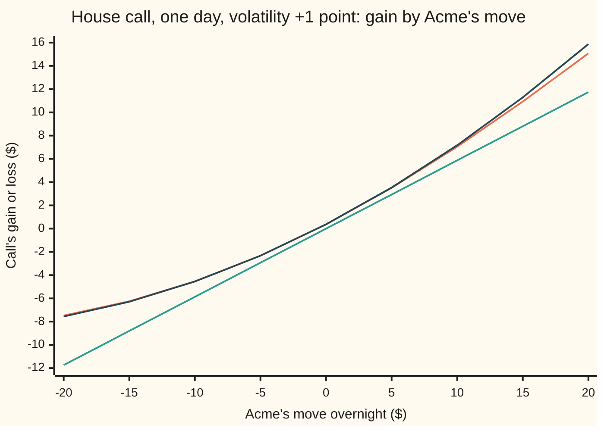

# The Greeks together: a day's profit and loss as a Taylor expansion

Financial mathematics → The Greeks, one each → Profit and loss from stored slopes → The Greeks together

---

## General Overview

Acme shares close at $100. A one-year call on Acme with a $100 strike is worth $9.23 that evening: the house call, with rates at 5 percent, a 2 percent dividend yield and volatility (the market's measure of how jumpy the shares are) at 20 percent.

Overnight, news lands. Next evening Acme is at $105, and the market has marked volatility up one point, to 21 percent. One day has passed. How much did the holder of the call make?

There are two ways to answer. The slow way reprices the option from scratch with the new inputs. The fast way reads a short list of numbers stored the evening before, the Greeks, and adds up a handful of products. A trading desk holds thousands of options and needs the answer for thousands of possible moves, so it runs the fast way almost everywhere.

The fast way says the call made $3.53. The full reprice says $3.51. The two cents of difference is the price of the shortcut, and it has a precise shape: double the move and the error grows about eightfold, because it grows with the cube of the move.

Each sibling card isolates one Greek with the others held still. This card puts them back together.

**A day's change in an option's value is, to within an error that grows with the cube of the move (plus time cross terms worth a fraction of a cent a day), the sum of each Greek times its own input's move, plus half of each bend times its move squared, plus the cross terms where two inputs move at once.**

**What kind of fact this is:** an approximation, with its error stated: a second-order Taylor expansion of the price, proved on [taylors-theorem](../../06-Calculus%20and%20analysis/03-What%20Derivatives%20Tell%20You/05-taylors-theorem.md) for one input and extended here to several; its leftover error is measured on this card.

### The picture: estimate against truth across a range of moves

Every point below is one possible next evening: Acme's move across, volatility up one point, one day gone. The vertical axis is the call's gain or loss in dollars.



Orange: the full reprice, the truth. Green, the straight line: delta alone. Dark blue: the full second-order estimate from the stored Greeks. Between −$10 and +$10 the dark blue sits on the orange. Out at +$20 they part by $0.81 (0.806075), and the straight line is off by $3.33.

---

## The formula

Notation first, in words. A small $d$ in front of an input means "the change in": $dS$ is the change in Acme's price, $d\sigma$ the change in volatility, $dt$ the time that passes, $dr$ the change in the interest rate. $dV$ is the resulting change in the option's value. Each Greek is a slope or a bend of the price, measured the evening before.

$$dV \approx \Delta\,dS + \tfrac12\,\Gamma\,dS^2 + \mathcal{V}\,d\sigma + \Theta\,dt + \rho\,dr + \text{vanna}\,dS\,d\sigma + \tfrac12\,\text{volga}\,d\sigma^2$$

**Read it aloud:** the gain is delta times the share move, plus half of gamma times the share move squared, plus vega times the volatility move, plus theta times the time gone, plus rho times the rate move, plus vanna times the share move times the volatility move, plus half of volga times the volatility move squared.

The first five terms are straight-line pieces and one bend. The last two exist because two things moved at once, or because volatility's own effect bends. What is left over is the error. Most of it is $R_3$, which shrinks like the cube of the move. The rest is the dropped terms that carry $dt$, under a tenth of a cent over one day here (Step 3).

| Symbol | Plain meaning | In our example | Push it up and the answer… |
| --- | --- | --- | --- |
| $V$, $dV$ | the call's value, and its change over the day | $9.23, then +$3.51 exact | — |
| $S$, $dS$ | Acme's price, and its overnight move | $100, +$5 | the gain rises, faster than a straight line |
| $\sigma$, $d\sigma$ | volatility as a decimal, and its move; one vol point is 0.01 | 0.20, +0.01 | the gain rises by about $0.38 per point |
| $t$, $dt$ | calendar time gone, in years; a day is 1/365 here (some desks count trading days, 1/252) | one day, 1/365 | the gain falls by about 1.4 cents a day |
| $r$, $dr$, $\rho$ | the riskless rate, continuously compounded, and its move; rho: dollars per 1.00 of rate | 0.05, 0; rho 49.458109 | the gain rises: 0.123645 per quarter point |
| $\Delta$ | delta: dollars gained per dollar of share move | 0.586851 | — |
| $\Gamma$ | gamma: how fast delta itself changes per dollar of share move | 0.018951 | — |
| $\mathcal{V}$ | vega: dollars per 1.00 of volatility; per point, divide by 100 | 37.901158 | — |
| $\Theta$ | theta: dollars per year of time passing, all else still | −5.089319 per year | — |
| vanna, volga | vanna: how delta changes with volatility; volga: how vega changes with volatility | −0.094753, 2.368822 | — |
| $g$, $h$, $h_i$ | the proof's shorthand: the price along the straight path from tonight to next evening; the whole move as one list; one input's move | h = (5, 0.01, 1/365, 0) | — |
| $R_3$, $k$, $\xi$ | the leftover error; $k$ scales the whole move (k = 2 doubles it); $\xi$ is an in-between point in the error's exact form | −$0.02 at k = 1 | $R_3$ grows like $k^3$ |

Every Greek above is the house market's, taken on the evening before the move. The sibling cards derive each one: [delta](01-delta.md), [gamma](02-gamma.md), [vega](03-vega.md), [theta](04-theta.md), [rho-and-dividend-rho](05-rho-and-dividend-rho.md), [vanna](06-vanna.md), [volga](07-volga.md). This card uses them; it does not re-derive them.

### When it holds

- **The price is smooth near today's inputs.** Three rounds of slopes must exist and stay bounded. At expiry the payoff has a kink at the strike, gamma runs off to infinity, and the expansion fails for an at-the-money option on its last day.
- **The move is small.** The error grows like the cube of the move. At spot +$5 and +1 point it is 2 cents; at +$20 and +4 points it is $1.08.
- **The Greeks are fresh.** They are slopes at one point. Greeks stored a week ago describe a different point, and the estimate carries that staleness on top of $R_3$.
- **One model on both sides.** The error measured here is against a Black-Scholes reprice. A real desk reprices on a volatility surface (a different volatility for each strike and date), so "volatility up one point" is itself a simplification; any difference between that and the real surface move is unexplained by this sum.
- **No jump.** A takeover bid or an earnings gap moves Acme by $30 before anyone can act. The expansion is still defined there, but its error, at the cube of a huge move, swamps the answer.

---

## Why it works

### Step 0: close up, a smooth curve is a parabola

Zoom in on any smooth curve and it looks straight: that straight line is its tangent, and its slope is the first derivative. Zoom out a little and the straight line starts to miss; a parabola, which also matches the curve's bend, keeps up. The miss left after the parabola is smaller again, and it shrinks faster than the move does.

The option's price is a smooth surface over four inputs: share price, volatility, time and rate. The Greeks are that surface's slopes and bends at today's point. Adding them up in the right pattern builds the tangent-plus-parabola to the surface, and the formula is that pattern.

### Step 1: one input at a time, the Taylor expansion

Hold volatility, time and the rate still. The price is now a curve in the share price alone. Taylor's theorem ([taylors-theorem](../../06-Calculus%20and%20analysis/03-What%20Derivatives%20Tell%20You/05-taylors-theorem.md)) says

$$V(S + dS) = V(S) + \Delta\,dS + \tfrac12\,\Gamma\,dS^2 + \tfrac16\,V'''(\xi)\,dS^3$$

where $V'''$ is the third slope, taken at some price $\xi$ (read "ksi") between $S$ and $S + dS$. The first two pieces are the tangent and the bend. The third is the error: a number times the cube of the move.

Where does the half come from? A parabola $a\,x^2$ has second derivative $2a$. To match a curve whose second derivative is $\Gamma$, the parabola needs $a = \Gamma/2$.

### Step 2: several inputs at once, by walking a straight line

Next evening's inputs differ from tonight's in every coordinate at once. Draw a straight path between the two points, and let $k$ run from 0 (tonight) to 1 (next evening):

$$g(k) = V\big(S + k\,dS,\ \sigma + k\,d\sigma,\ t + k\,dt,\ r + k\,dr\big).$$

Along that path $g$ is an ordinary curve in one variable, so Step 1 applies to it. Its slope at $k = 0$ is, by the chain rule, each input's slope times that input's move, summed: $\Delta\,dS + \mathcal{V}\,d\sigma + \Theta\,dt + \rho\,dr$.

Its bend is every second slope of the surface, each multiplied by the two moves it involves. The pure bends appear once: $\Gamma\,dS^2$, $\text{volga}\,d\sigma^2$. Each cross bend appears twice, because moving $S$ then $\sigma$ and moving $\sigma$ then $S$ give the same second slope: $2\,\text{vanna}\,dS\,d\sigma$. Taylor halves the whole bend. The pure terms keep their half. The cross terms lose it: $\tfrac12 \times 2 = 1$. That is why vanna carries no half on the card's formula.

<details>
<summary>Detailed proof: the second-order expansion in several inputs, with its error</summary>

Let $x = (S, \sigma, t, r)$ and $h = (dS, d\sigma, dt, dr)$, and suppose every third partial derivative of $V$ is continuous on the segment from $x$ to $x + h$. Set $g(k) = V(x + k h)$ for $0 \le k \le 1$.

By the chain rule, $g'(k) = \sum_i \partial_i V(x + kh)\,h_i$, $g''(k) = \sum_{i,j} \partial_i\partial_j V(x + kh)\,h_i h_j$, and $g'''(k) = \sum_{i,j,l} \partial_i\partial_j\partial_l V(x + kh)\,h_i h_j h_l$. Here $\partial_i V$ means the slope of $V$ in the i-th input with the others held still, and $h_i$, the i-th entry of $h$, is that input's move.

Taylor's theorem with the Lagrange remainder, for the one-variable $g(k)$ from 0 to 1: $g(1) = g(0) + g'(0) + \tfrac12 g''(0) + \tfrac16 g'''(c)$ for some point $0 < c < 1$.

Since mixed partials of a smooth function do not depend on order, $g''(0)$ collects each unordered pair $i \neq j$ twice. Writing it out with the Greeks' names: $g''(0) = \Gamma\,dS^2 + \text{volga}\,d\sigma^2 + 2\,\text{vanna}\,dS\,d\sigma + 2\,\partial_S\partial_t V\,dS\,dt + (\text{the remaining pairs and squares involving } dt, dr)$. The derivative $\partial_S\partial_t V$ is charm, the change of delta with time.

The remainder: $g(k)$ is the price after the move scaled by $k$. The same theorem from 0 to $k$ gives $R_3 = \tfrac16 g'''(c)\,k^3$ for some $0 < c < k$. Since $g'''$ is continuous, $c \to 0$ as $k \to 0$ and $R_3 / k^3 \to \tfrac16 g'''(0)$: the error tends to a fixed number times the cube of the move.

The card's formula keeps the second-order terms that matter over a day and drops those carrying $dt^2$, $dr^2$, $dS\,dt$, $d\sigma\,dt$, $dS\,dr$, $d\sigma\,dr$ and $dt\,dr$. Over one day with $dr = 0$ the largest dropped term is charm times $dS\,dt$: −$0.000488$ here.

</details>

### Step 3: which second-order terms earn a place

Seven terms survive, from a possible fourteen (four slopes and ten bends). The test is size over one day.

Time moves by $dt = 1/365$ year. Its square, and any product of it with another small move, is tiny: charm times $dS\,dt$ is −0.000488 dollars here. Rates rarely move much in a day, and rate terms times anything else are smaller still.

The share move is different. A day's typical share move is about $\sigma S \sqrt{dt}$: 0.20 × 100 × √(1/365) = $1.05 (1.046848). Its square is $\sigma^2 S^2\,dt$: proportional to $dt$ itself, not to $dt^2$. So $\tfrac12\Gamma\,dS^2$ stays, and it is the same size as $\Theta\,dt$. That match in size is no coincidence; it is where the next card starts.

### Step 4: the error shrinks with the cube

Scale the whole move: spot $+5k$ dollars, volatility $+k$ points, with no time passing. Step 2 says the leftover after the seven terms is about $\tfrac16 g'''(0)\,k^3$. The code measures $g'''$ directly, by repricing at four points along the path, and gets $\tfrac16 g'''(0) = -0.019880$. The measured leftover at $k = 1$ is $-0.01935$. Halve the move and the error falls by 7.88, and leftover ÷ $k^3$ moves closer to the prediction.

The sign is negative: the estimate overshoots. The third slope along this path is negative because gamma falls as Acme rises above the strike and also falls as volatility rises; the two effects are of similar size. So the parabola keeps curving up after the true price has started to straighten.

A second road reaches each Greek without any formula: nudge one input up and down by a hair, reprice, and divide. The code does both and gets the same estimate to a millionth of a dollar.

---

## Worked numbers, by hand

House call, the evening before: $S = 100$, $\sigma = 0.20$, one year left, $r = 0.05$, dividend yield 0.02. Next evening: $dS = +5$, $d\sigma = +0.01$, $dt = 1/365$, $dr = 0$.

| Step | Arithmetic | Value |
| --- | --- | --- |
| delta term | 0.586851 × 5 | +2.934256 |
| gamma term | ½ × 0.018951 × 5^2 = ½ × 0.018951 × 25 | +0.236882 |
| vega term | 37.901158 × 0.01 | +0.379012 |
| theta term | −5.089319 × 1/365 | −0.013943 |
| rho term | 49.458109 × 0 | 0.000000 |
| vanna term | −0.094753 × 5 × 0.01 | −0.004738 |
| volga term | ½ × 2.368822 × 0.01^2 | +0.000118 |
| **estimate** | sum of the seven | **+$3.53** (3.531587) |
| exact reprice | call at $105, 21%, 364 days, minus $9.23 | +$3.51 (3.511602) |
| leftover | exact − estimate | −$0.02 (−0.019985) |

The call made $3.51. The stored Greeks called it at $3.53, off by two cents on a move of five dollars.

The terms fall away fast. In dollars:

```
term         dollars, spot +5, vol +1 point, one day
delta        ████████████████████████████████████   2.934256
vega         █████                                  0.379012
gamma        ███                                    0.236882
theta        ▏                                     -0.013943
vanna        ▏                                     -0.004738
volga        ▏                                      0.000118
```

Delta carries 83 percent of the answer. Vega and gamma carry the rest that matters. The last three are cents and fractions of a cent, but a desk summing thousands of positions keeps them, because across a book they do not always cancel.

How the estimate improves as terms are added:

| Terms kept | Estimate | Estimate − exact |
| --- | --- | --- |
| delta only | 2.934256 | −$0.58 |
| delta and gamma | 3.171138 | −$0.34 |
| delta, gamma, vega | 3.550150 | +$0.04 |
| plus theta | 3.536206 | +$0.02 |
| all seven | 3.531587 | +$0.02 |

### What breaks if you drop a piece

| Mistake | Comes out at | What went wrong |
| --- | --- | --- |
| Gamma term without the ½ | $3.77 (3.768469) | Twice the bend. The parabola that matches gamma is ½ Γ dS^2. |
| One vol point entered as 1, not 0.01 | $41.05 (41.053733) | Vega is per 1.00 of volatility, so a point is 0.01 |
| Day entered as 1, not 1/365 | −$1.54 (−1.543789) | Theta is per year; one year of decay charged for one day |
| Vanna dropped | $3.54 (3.536325) | Small here. The cross term matters when spot and volatility move hard together. |

Every number in both tables is printed by the code.

---

## How the error grows with the size of the move

The leftover looks negligible at two cents. It is not negligible on a bad day. Scale the same move, spot and volatility together, and watch the leftover. No time passes in this table, so the error is pure shape.

| k | Spot move | Vol move | Exact | Estimate | Leftover | Leftover ÷ k^3 |
| --- | --- | --- | --- | --- | --- | --- |
| 0.5 | +$2.50 | +0.5 pt | 1.7122 | 1.7147 | −0.00246 | −0.019649 |
| 1 | +$5 | +1 pt | 3.5262 | 3.5455 | −0.01935 | −0.019351 |
| 2 | +$10 | +2 pts | 7.4066 | 7.5556 | −0.14899 | −0.018624 |
| 4 | +$20 | +4 pts | 15.8844 | 16.9693 | −1.08486 | −0.016951 |

The last column is nearly flat, and it sits near the predicted $\tfrac16 g'''(0) = -0.019880$. That flatness is the cube law. Each doubling multiplies the error by 7.88, then 7.70, then 7.28: close to 8, and drifting down as the move grows, because the fourth-order term (with the opposite sign) starts to count.

```
leftover error of the second-order estimate, dollars
k = 0.5  spot +2.5, vol +0.5  ▏                                  -0.00246
k = 1    spot +5,   vol +1    █                                  -0.01935
k = 2    spot +10,  vol +2    ████                               -0.14899
k = 4    spot +20,  vol +4    ████████████████████████████████   -1.08486
```

A move four times bigger is not four times worse. It is 56 times worse. That is the reason a risk report built on stored Greeks is trusted for ordinary days and backed by full repricing for stress scenarios.

---

## Code, from first principles, and it actually runs

The code prices the house call with its own bell-curve area (a series in Python, thin slices in Rust), computes the eight Greeks from their closed forms, and then again by nudging each input and repricing. It reaches the day's change four ways: the estimate from closed-form Greeks, the estimate from nudged Greeks, the exact reprice by formula, and the exact reprice by averaging the payoff over the bell curve directly. The cube law is checked against a third slope measured along the move's own path. Every number on the card is printed.

### Python

```python
# The Greeks together -- the check behind the card.  Standard library only.
# The house call is repriced after a day with spot +5 and vol +1 point, and the
# move is estimated from stored Greeks.  Roads: closed-form Greeks, Greeks by
# bump-and-reprice, the price by formula and by a bell-curve integral, and the
# cube law predicted from a third derivative taken along the move.
from math import log, sqrt, exp, pi

def phi(x): return exp(-0.5 * x * x) / sqrt(2.0 * pi)      # bell-curve height
def N(x):                                                   # bell-curve area, own series
    term, total, n = x, x, 0                                # 0.5 + phi(x)(x + x^3/3 + x^5/15 + ...)
    while abs(term) > 1e-17 * max(1.0, abs(total)):
        n += 1
        term *= x * x / (2 * n + 1)
        total += term
    return 0.5 + phi(x) * total

def call(S, sg, T, r, K=100.0, q=0.02):                     # Black-Scholes call
    d1 = (log(S / K) + (r - q + 0.5 * sg * sg) * T) / (sg * sqrt(T))
    return S * exp(-q * T) * N(d1) - K * exp(-r * T) * N(d1 - sg * sqrt(T))

def call_integral(S, sg, T, r, K=100.0, q=0.02, n=20000):  # payoff averaged by Simpson
    a, b = -10.0, 10.0; h = (b - a) / n
    f = lambda z: max(S * exp((r - q - 0.5 * sg * sg) * T + sg * sqrt(T) * z) - K, 0.0) * phi(z)
    s = f(a) + f(b) + sum((4 if i % 2 else 2) * f(a + i * h) for i in range(1, n))
    return exp(-r * T) * s * h / 3.0

S, sg, T, r, K, q = 100.0, 0.20, 1.0, 0.05, 100.0, 0.02
d1 = (log(S / K) + (r - q + 0.5 * sg * sg) * T) / (sg * sqrt(T)); d2 = d1 - sg * sqrt(T)
eq, er, rt = exp(-q * T), exp(-r * T), sqrt(T)
G = {"delta": eq * N(d1), "gamma": eq * phi(d1) / (S * sg * rt), "vega": S * eq * phi(d1) * rt,
     "theta": -S * eq * phi(d1) * sg / (2 * rt) - r * K * er * N(d2) + q * S * eq * N(d1),
     "rho": K * T * er * N(d2), "vanna": -eq * phi(d1) * d2 / sg,
     "volga": S * eq * phi(d1) * rt * d1 * d2 / sg,
     "charm": q * eq * N(d1) - eq * phi(d1) * (2 * (r - q) * T - d2 * sg * rt) / (2 * T * sg * rt)}
V = lambda s=S, v=sg, t=0.0, rr=r: call(s, v, T - t, rr)   # t = calendar time elapsed
hs, hv, ht, hr = 0.01, 1e-3, 1e-4, 1e-4
B = {"delta": (V(S + hs) - V(S - hs)) / (2 * hs), "gamma": (V(S + hs) - 2 * V() + V(S - hs)) / hs**2,
     "vega": (V(v=sg + hv) - V(v=sg - hv)) / (2 * hv), "theta": (V(t=ht) - V(t=-ht)) / (2 * ht),
     "rho": (V(rr=r + hr) - V(rr=r - hr)) / (2 * hr),
     "vanna": (V(S + hs, sg + hv) - V(S + hs, sg - hv) - V(S - hs, sg + hv) + V(S - hs, sg - hv)) / (4 * hs * hv),
     "volga": (V(v=sg + hv) - 2 * V() + V(v=sg - hv)) / hv**2,
     "charm": (V(S + hs, t=ht) - V(S - hs, t=ht) - V(S + hs, t=-ht) + V(S - hs, t=-ht)) / (4 * hs * ht)}

def terms(g, dS, dv, dt, dr=0.0):                           # the card's formula, term by term
    return [("delta x dS", g["delta"] * dS), ("1/2 gamma x dS^2", 0.5 * g["gamma"] * dS * dS),
            ("vega x dsigma", g["vega"] * dv), ("theta x dt", g["theta"] * dt), ("rho x dr", g["rho"] * dr),
            ("vanna x dS x dsigma", g["vanna"] * dS * dv), ("1/2 volga x dsigma^2", 0.5 * g["volga"] * dv * dv)]

dS, dv, dt = 5.0, 0.01, 1 / 365
V0 = V()
exact = V(S + dS, sg + dv, dt) - V0
exact_int = call_integral(S + dS, sg + dv, T - dt, r) - call_integral(S, sg, T, r)
tm, tmB = terms(G, dS, dv, dt), terms(B, dS, dv, dt)
est, estB = sum(v for _, v in tm), sum(v for _, v in tmB)
dgv = tm[0][1] + tm[1][1] + tm[2][1]
def p(lab, *vals): print(f"{lab:<38}" + "".join(f" {v:>11.6f}" for v in vals))
p("price today: formula, integral", V0, call_integral(S, sg, T, r))
print("greek: closed form, by bump")
for k in G: p("  " + k, G[k], B[k])
print("move: spot +5, vol +1 point, one day, term by term")
for lab, v in tm: p(lab, v)
p("charm x dS x dt (dropped)", G["charm"] * dS * dt)
p("estimate: closed-form, bumped Greeks", est, estB)
p("exact reprice: formula, integral", exact, exact_int)
p("error, exact - estimate", exact - est)
print("terms kept: estimate, estimate - exact")
for lab, v in (("delta only", tm[0][1]), ("delta-gamma", tm[0][1] + tm[1][1]), ("delta-gamma-vega", dgv),
               ("plus theta", dgv + tm[3][1]), ("all seven", est)): p("  " + lab, v, v - exact)
p("delta term share of estimate", tm[0][1] / est)
p("typical day's move, sigma S sqrt(dt)", sg * S * sqrt(dt))
p("wrong: no 1/2 on gamma", est + tm[1][1]); p("wrong: vol point as 1", est - tm[2][1] + G["vega"])
p("wrong: theta x 1 (day as 1)", est - tm[3][1] + G["theta"]); p("wrong: no vanna", est - tm[5][1])
wr = 0.0025
p("try: rates +0.25%: rho, est, exact", G["rho"] * wr, est + G["rho"] * wr, V(S + dS, sg + dv, dt, r + wr) - V0)

# cube law: scale the whole move (dS, dsigma) = k x (5, 0.01), no time passing
g = lambda k: V(S + 5 * k, sg + 0.01 * k)
h3 = 0.05
g3 = (g(2 * h3) - 2 * g(h3) + 2 * g(-h3) - g(-2 * h3)) / (2 * h3**3)   # third derivative along the move
p("third-order coefficient g3/6", g3 / 6)
print("   k  spot  vol pts     exact  estimate     error  error/k^3")
errs = {}
for k in (0.5, 1.0, 2.0, 4.0):
    e = V(S + 5 * k, sg + 0.01 * k) - V0
    a = sum(v for _, v in terms(G, 5 * k, 0.01 * k, 0.0))
    errs[k] = e - a
    print(f"{k:4.1f} {5 * k:+5.1f} {k:+8.1f} {e:9.4f} {a:9.4f} {e - a:9.5f} {(e - a) / k**3:10.6f}")
for k in (0.5, 1.0, 2.0): p("error ratio, move x2 from k = " + format(k, ".1f"), errs[2 * k] / errs[k])
p("error ratio, move x4 from k = 1.0", errs[4.0] / errs[1.0])
print("chart, spot move ($)      " + " ".join(f"{x:6.0f}" for x in range(-20, 21, 5)))
rows = {"chart, exact": [], "chart, delta only": [], "chart, full estimate": []}
for x in range(-20, 21, 5):
    rows["chart, exact"].append(V(S + x, sg + 0.01, dt) - V0)
    t = terms(G, x, 0.01, dt); rows["chart, delta only"].append(t[0][1])
    rows["chart, full estimate"].append(sum(v for _, v in t))
for lab, vals in rows.items(): print(f"{lab:<26}" + " ".join(f"{v:6.2f}" for v in vals))
p("at +20: full - exact, delta - exact", rows["chart, full estimate"][-1] - rows["chart, exact"][-1],
  rows["chart, delta only"][-1] - rows["chart, exact"][-1])

assert abs(V0 - 9.227005508154) < 1e-9, "own normal CDF reproduces the house call"
assert all(abs(G[k] - B[k]) < 1e-4 * max(1.0, abs(G[k])) for k in G), "closed-form Greeks vs bumps"
assert abs(exact - exact_int) < 1e-6, "formula reprice vs integral reprice"
assert abs(est - exact) < 0.02 * abs(exact), "second-order estimate within 2% of the reprice"
assert abs(errs[0.5] / 0.125 - g3 / 6) < 0.05 * abs(g3 / 6), "error at small moves follows g3/6 k^3"
assert 7.0 < errs[1.0] / errs[0.5] < 9.0, "halving the move cuts the error about eightfold"
print("ALL CHECKS PASS")
```

**Ran 2026-09-19 on macOS, Python 3.14.6, standard library only. All checks passed. Output, pasted from the run:**

```
price today: formula, integral            9.227006    9.227006
greek: closed form, by bump
  delta                                   0.586851    0.586851
  gamma                                   0.018951    0.018951
  vega                                   37.901158   37.901145
  theta                                  -5.089319   -5.089319
  rho                                    49.458109   49.458108
  vanna                                  -0.094753   -0.094760
  volga                                   2.368822    2.368928
  charm                                  -0.035639   -0.035639
move: spot +5, vol +1 point, one day, term by term
delta x dS                                2.934256
1/2 gamma x dS^2                          0.236882
vega x dsigma                             0.379012
theta x dt                               -0.013943
rho x dr                                  0.000000
vanna x dS x dsigma                      -0.004738
1/2 volga x dsigma^2                      0.000118
charm x dS x dt (dropped)                -0.000488
estimate: closed-form, bumped Greeks      3.531587    3.531586
exact reprice: formula, integral          3.511602    3.511603
error, exact - estimate                  -0.019985
terms kept: estimate, estimate - exact
  delta only                              2.934256   -0.577347
  delta-gamma                             3.171138   -0.340464
  delta-gamma-vega                        3.550150    0.038547
  plus theta                              3.536206    0.024604
  all seven                               3.531587    0.019985
delta term share of estimate              0.830860
typical day's move, sigma S sqrt(dt)      1.046848
wrong: no 1/2 on gamma                    3.768469
wrong: vol point as 1                    41.053733
wrong: theta x 1 (day as 1)              -1.543789
wrong: no vanna                           3.536325
try: rates +0.25%: rho, est, exact        0.123645    3.655232    3.655841
third-order coefficient g3/6             -0.019880
   k  spot  vol pts     exact  estimate     error  error/k^3
 0.5  +2.5     +0.5    1.7122    1.7147  -0.00246  -0.019649
 1.0  +5.0     +1.0    3.5262    3.5455  -0.01935  -0.019351
 2.0 +10.0     +2.0    7.4066    7.5556  -0.14899  -0.018624
 4.0 +20.0     +4.0   15.8844   16.9693  -1.08486  -0.016951
error ratio, move x2 from k = 0.5         7.878682
error ratio, move x2 from k = 1.0         7.699583
error ratio, move x2 from k = 2.0         7.281234
error ratio, move x4 from k = 1.0        56.062464
chart, spot move ($)         -20    -15    -10     -5      0      5     10     15     20
chart, exact               -7.48  -6.25  -4.54  -2.33   0.36   3.51   7.05  10.93  15.07
chart, delta only         -11.74  -8.80  -5.87  -2.93   0.00   2.93   5.87   8.80  11.74
chart, full estimate       -7.56  -6.29  -4.55  -2.33   0.37   3.53   7.17  11.29  15.87
at +20: full - exact, delta - exact       0.806075   -3.330277
ALL CHECKS PASS
```

The closed-form and nudged Greeks agree to one part in ten thousand or better; vega, vanna and volga differ in the last places because nudging carries its own small error, of the size of the nudge squared. The two exact reprices agree to a millionth.

### Rust

Same inputs and same rows. The bell-curve area here is Simpson's rule on the bell curve's height, not the Python series.

```rust
// The Greeks together -- the same check as greeks_together_taylor_pnl_check.py, in Rust.
// Standard library only, no crates.  Rust has no erf, so the bell-curve area N(x)
// is built by adding thin slices under the curve (Simpson's rule).
// Compile: rustc --edition 2021 -O greeks_together_taylor_pnl_check.rs
use std::f64::consts::PI;

const K: f64 = 100.0;
const Q: f64 = 0.02;

fn phi(x: f64) -> f64 { (-0.5 * x * x).exp() / (2.0 * PI).sqrt() }

fn simpson<F: Fn(f64) -> f64>(f: F, a: f64, b: f64, n: usize) -> f64 {
    let h = (b - a) / n as f64;
    let mut s = f(a) + f(b);
    for i in 1..n { s += if i % 2 == 1 { 4.0 } else { 2.0 } * f(a + i as f64 * h); }
    s * h / 3.0
}

fn n_cdf(x: f64) -> f64 {
    if x < -12.0 { return 0.0; }
    if x > 12.0 { return 1.0; }
    0.5 + simpson(phi, 0.0, x, 4000)
}

fn call(s: f64, sg: f64, t: f64, r: f64) -> f64 {
    let d1 = ((s / K).ln() + (r - Q + 0.5 * sg * sg) * t) / (sg * t.sqrt());
    s * (-Q * t).exp() * n_cdf(d1) - K * (-r * t).exp() * n_cdf(d1 - sg * t.sqrt())
}

fn call_integral(s: f64, sg: f64, t: f64, r: f64) -> f64 {
    let f = |z: f64| (s * ((r - Q - 0.5 * sg * sg) * t + sg * t.sqrt() * z).exp() - K).max(0.0) * phi(z);
    (-r * t).exp() * simpson(f, -10.0, 10.0, 20000)
}

const NAMES: [&str; 8] = ["delta", "gamma", "vega", "theta", "rho", "vanna", "volga", "charm"];

// Greeks as an array in NAMES order; the card's formula term by term
fn terms(g: &[f64; 8], ds: f64, dv: f64, dt: f64, dr: f64) -> Vec<(&'static str, f64)> {
    vec![("delta x dS", g[0] * ds), ("1/2 gamma x dS^2", 0.5 * g[1] * ds * ds),
         ("vega x dsigma", g[2] * dv), ("theta x dt", g[3] * dt), ("rho x dr", g[4] * dr),
         ("vanna x dS x dsigma", g[5] * ds * dv), ("1/2 volga x dsigma^2", 0.5 * g[6] * dv * dv)]
}
fn total(t: &[(&str, f64)]) -> f64 { t.iter().map(|x| x.1).sum() }
fn p(lab: &str, vals: &[f64]) {
    let mut line = format!("{:<38}", lab);
    for v in vals { line.push_str(&format!(" {:>11.6}", v)); }
    println!("{}", line);
}

fn main() {
    let (s, sg, tt, r) = (100.0_f64, 0.20_f64, 1.0_f64, 0.05_f64);
    let rt = tt.sqrt();
    let d1 = ((s / K).ln() + (r - Q + 0.5 * sg * sg) * tt) / (sg * rt);
    let d2 = d1 - sg * rt;
    let (eq, er) = ((-Q * tt).exp(), (-r * tt).exp());
    let g: [f64; 8] = [
        eq * n_cdf(d1), eq * phi(d1) / (s * sg * rt), s * eq * phi(d1) * rt,
        -s * eq * phi(d1) * sg / (2.0 * rt) - r * K * er * n_cdf(d2) + Q * s * eq * n_cdf(d1),
        K * tt * er * n_cdf(d2), -eq * phi(d1) * d2 / sg, s * eq * phi(d1) * rt * d1 * d2 / sg,
        Q * eq * n_cdf(d1) - eq * phi(d1) * (2.0 * (r - Q) * tt - d2 * sg * rt) / (2.0 * tt * sg * rt),
    ];
    // price with spot x, vol v, calendar time elapsed t, rate rr
    let v = |x: f64, vv: f64, t: f64, rr: f64| call(x, vv, tt - t, rr);
    let (hs, hv, ht, hr) = (0.01, 1e-3, 1e-4, 1e-4);
    let b: [f64; 8] = [
        (v(s + hs, sg, 0.0, r) - v(s - hs, sg, 0.0, r)) / (2.0 * hs),
        (v(s + hs, sg, 0.0, r) - 2.0 * v(s, sg, 0.0, r) + v(s - hs, sg, 0.0, r)) / (hs * hs),
        (v(s, sg + hv, 0.0, r) - v(s, sg - hv, 0.0, r)) / (2.0 * hv),
        (v(s, sg, ht, r) - v(s, sg, -ht, r)) / (2.0 * ht),
        (v(s, sg, 0.0, r + hr) - v(s, sg, 0.0, r - hr)) / (2.0 * hr),
        (v(s + hs, sg + hv, 0.0, r) - v(s + hs, sg - hv, 0.0, r) - v(s - hs, sg + hv, 0.0, r)
            + v(s - hs, sg - hv, 0.0, r)) / (4.0 * hs * hv),
        (v(s, sg + hv, 0.0, r) - 2.0 * v(s, sg, 0.0, r) + v(s, sg - hv, 0.0, r)) / (hv * hv),
        (v(s + hs, sg, ht, r) - v(s - hs, sg, ht, r) - v(s + hs, sg, -ht, r) + v(s - hs, sg, -ht, r))
            / (4.0 * hs * ht),
    ];

    let (ds, dv, dt) = (5.0, 0.01, 1.0 / 365.0);
    let v0 = v(s, sg, 0.0, r);
    let exact = v(s + ds, sg + dv, dt, r) - v0;
    let exact_int = call_integral(s + ds, sg + dv, tt - dt, r) - call_integral(s, sg, tt, r);
    let tm = terms(&g, ds, dv, dt, 0.0);
    let (est, est_b) = (total(&tm), total(&terms(&b, ds, dv, dt, 0.0)));
    let dgv = tm[0].1 + tm[1].1 + tm[2].1;
    p("price today: formula, integral", &[v0, call_integral(s, sg, tt, r)]);
    println!("greek: closed form, by bump");
    for i in 0..8 { p(&format!("  {}", NAMES[i]), &[g[i], b[i]]); }
    println!("move: spot +5, vol +1 point, one day, term by term");
    for (l, x) in &tm { p(l, &[*x]); }
    p("charm x dS x dt (dropped)", &[g[7] * ds * dt]);
    p("estimate: closed-form, bumped Greeks", &[est, est_b]);
    p("exact reprice: formula, integral", &[exact, exact_int]);
    p("error, exact - estimate", &[exact - est]);
    println!("terms kept: estimate, estimate - exact");
    for (l, x) in [("delta only", tm[0].1), ("delta-gamma", tm[0].1 + tm[1].1), ("delta-gamma-vega", dgv),
                   ("plus theta", dgv + tm[3].1), ("all seven", est)] { p(&format!("  {}", l), &[x, x - exact]); }
    p("delta term share of estimate", &[tm[0].1 / est]);
    p("typical day's move, sigma S sqrt(dt)", &[sg * s * dt.sqrt()]);
    p("wrong: no 1/2 on gamma", &[est + tm[1].1]); p("wrong: vol point as 1", &[est - tm[2].1 + g[2]]);
    p("wrong: theta x 1 (day as 1)", &[est - tm[3].1 + g[3]]); p("wrong: no vanna", &[est - tm[5].1]);
    let wr = 0.0025;
    p("try: rates +0.25%: rho, est, exact", &[g[4] * wr, est + g[4] * wr, v(s + ds, sg + dv, dt, r + wr) - v0]);

    // cube law: scale the whole move (dS, dsigma) = k x (5, 0.01), no time passing
    let gk = |k: f64| v(s + 5.0 * k, sg + 0.01 * k, 0.0, r);
    let h3 = 0.05;
    let g3 = (gk(2.0 * h3) - 2.0 * gk(h3) + 2.0 * gk(-h3) - gk(-2.0 * h3)) / (2.0 * h3 * h3 * h3);
    p("third-order coefficient g3/6", &[g3 / 6.0]);
    println!("   k  spot  vol pts     exact  estimate     error  error/k^3");
    let ks = [0.5_f64, 1.0, 2.0, 4.0];
    let mut errs = [0.0_f64; 4];
    for (i, k) in ks.iter().enumerate() {
        let e = gk(*k) - v0;
        let a = total(&terms(&g, 5.0 * k, 0.01 * k, 0.0, 0.0));
        errs[i] = e - a;
        println!("{:4.1} {:+5.1} {:+8.1} {:9.4} {:9.4} {:9.5} {:10.6}", k, 5.0 * k, k, e, a, e - a, (e - a) / k.powi(3));
    }
    for i in 0..3 { p(&format!("error ratio, move x2 from k = {:.1}", ks[i]), &[errs[i + 1] / errs[i]]); }
    p("error ratio, move x4 from k = 1.0", &[errs[3] / errs[1]]);
    let xs: Vec<f64> = (0..9).map(|i| -20.0 + 5.0 * i as f64).collect();
    println!("chart, spot move ($)      {}", xs.iter().map(|x| format!("{:6.0}", x)).collect::<Vec<_>>().join(" "));
    let mut rows: [Vec<f64>; 3] = [vec![], vec![], vec![]];
    for x in &xs {
        rows[0].push(v(s + x, sg + 0.01, dt, r) - v0);
        let t = terms(&g, *x, 0.01, dt, 0.0);
        rows[1].push(t[0].1);
        rows[2].push(total(&t));
    }
    for (lab, vals) in ["chart, exact", "chart, delta only", "chart, full estimate"].iter().zip(rows.iter()) {
        println!("{:<26}{}", lab, vals.iter().map(|x| format!("{:6.2}", x)).collect::<Vec<_>>().join(" "));
    }
    p("at +20: full - exact, delta - exact", &[rows[2][8] - rows[0][8], rows[1][8] - rows[0][8]]);

    assert!((v0 - 9.227005508154).abs() < 1e-9, "own normal CDF reproduces the house call");
    for i in 0..8 { assert!((g[i] - b[i]).abs() < 1e-4 * g[i].abs().max(1.0), "closed-form Greeks vs bumps"); }
    assert!((exact - exact_int).abs() < 1e-6, "formula reprice vs integral reprice");
    assert!((est - exact).abs() < 0.02 * exact.abs(), "second-order estimate within 2% of the reprice");
    assert!((errs[0] / 0.125 - g3 / 6.0).abs() < 0.05 * (g3 / 6.0).abs(), "error at small moves follows g3/6 k^3");
    assert!(errs[1] / errs[0] > 7.0 && errs[1] / errs[0] < 9.0, "halving the move cuts the error about eightfold");
    println!("ALL CHECKS PASS");
}
```

**Ran 2026-09-19 on macOS, rustc 1.98.1, no crates. All checks passed. Output, pasted from the run:**

```
price today: formula, integral            9.227006    9.227006
greek: closed form, by bump
  delta                                   0.586851    0.586851
  gamma                                   0.018951    0.018951
  vega                                   37.901158   37.901145
  theta                                  -5.089319   -5.089319
  rho                                    49.458109   49.458108
  vanna                                  -0.094753   -0.094760
  volga                                   2.368822    2.368928
  charm                                  -0.035639   -0.035639
move: spot +5, vol +1 point, one day, term by term
delta x dS                                2.934256
1/2 gamma x dS^2                          0.236882
vega x dsigma                             0.379012
theta x dt                               -0.013943
rho x dr                                  0.000000
vanna x dS x dsigma                      -0.004738
1/2 volga x dsigma^2                      0.000118
charm x dS x dt (dropped)                -0.000488
estimate: closed-form, bumped Greeks      3.531587    3.531586
exact reprice: formula, integral          3.511602    3.511603
error, exact - estimate                  -0.019985
terms kept: estimate, estimate - exact
  delta only                              2.934256   -0.577347
  delta-gamma                             3.171138   -0.340464
  delta-gamma-vega                        3.550150    0.038547
  plus theta                              3.536206    0.024604
  all seven                               3.531587    0.019985
delta term share of estimate              0.830860
typical day's move, sigma S sqrt(dt)      1.046848
wrong: no 1/2 on gamma                    3.768469
wrong: vol point as 1                    41.053733
wrong: theta x 1 (day as 1)              -1.543789
wrong: no vanna                           3.536325
try: rates +0.25%: rho, est, exact        0.123645    3.655232    3.655841
third-order coefficient g3/6             -0.019880
   k  spot  vol pts     exact  estimate     error  error/k^3
 0.5  +2.5     +0.5    1.7122    1.7147  -0.00246  -0.019649
 1.0  +5.0     +1.0    3.5262    3.5455  -0.01935  -0.019351
 2.0 +10.0     +2.0    7.4066    7.5556  -0.14899  -0.018624
 4.0 +20.0     +4.0   15.8844   16.9693  -1.08486  -0.016951
error ratio, move x2 from k = 0.5         7.878682
error ratio, move x2 from k = 1.0         7.699583
error ratio, move x2 from k = 2.0         7.281234
error ratio, move x4 from k = 1.0        56.062464
chart, spot move ($)         -20    -15    -10     -5      0      5     10     15     20
chart, exact               -7.48  -6.25  -4.54  -2.33   0.36   3.51   7.05  10.93  15.07
chart, delta only         -11.74  -8.80  -5.87  -2.93   0.00   2.93   5.87   8.80  11.74
chart, full estimate       -7.56  -6.29  -4.55  -2.33   0.37   3.53   7.17  11.29  15.87
at +20: full - exact, delta - exact       0.806075   -3.330277
ALL CHECKS PASS
```

The two outputs agree line for line, although they reach the bell-curve area by different arithmetic.

> [!TIP]
> **Try changing**
> Guess first, then run.
> - **Let rates rise a quarter point too.** The `try` row adds a rate move `wr = 0.0025` to the day. Rho adds 49.458109 × 0.0025 = 0.123645: the estimate becomes **3.655232** and the exact reprice **3.655841**.
> - **Double the move.** Read the `k = 2` row: spot +$10 and volatility +2 points, no time passing. The estimate is **7.5556** against an exact **7.4066**: fifteen cents off (0.14899), where half the move gave two (0.01935).
> - **Forget the half on gamma.** Replace `0.5 * g["gamma"]` by `g["gamma"]`. The estimate jumps to **3.768469**, and the assert holding the estimate within 2 percent of the reprice fails.

---

## The usual mistake

> [!warning]
> **Treating the Greeks as constants over the move.** They are slopes at tonight's point. Delta alone says the call made $2.93 on a +$5 day; it made $3.51. The second-order terms exist because delta itself changes during the move: gamma is how it changes with the share, vanna how it changes with volatility. A Greek quoted without the point it was measured at is half a number.
>
> Smaller traps, each with the wrong number it produces here:
> - **Units of vega.** Vega is dollars per 1.00 of volatility. A one-point move is 0.01. Multiply by 1 and the day's gain reads $41.05.
> - **Units of theta.** Theta on this card is per year. One day is 1/365. Charge a full year and the estimate reads −$1.54.
> - **The half.** Gamma and volga carry a half; vanna does not. Leave the half off gamma and the estimate reads $3.77.
> - **Trusting the sum on a big day.** The leftover grows with the cube of the move: 2 cents at +$5, $1.08 at +$20 with four vol points.

---

## Where you meet it in real life

- **Daily profit-and-loss explain.** Each evening a desk splits the day's gain into delta, gamma, vega, theta and rho pieces from the morning's Greeks, and reports what is left as "unexplained." A large unexplained piece flags a bad price, a missed trade or a model problem.
- **Risk limits.** Desks are given limits in Greeks, not in dollars: so many dollars of delta, so much vega per point. The formula turns those limits into a dollar loss for a given move.
- **Scenario grids.** A risk report shows the book's gain across a grid of share and volatility moves. Near the centre the grid can be filled from the Greeks; at the corners it is filled by full repricing, for the reason the cube law gives. Adding positions together is [portfolio-greeks-and-taylor-pnl](../40-Hedging%2C%20Volatility%20Forecasts%20and%20Stress/01-portfolio-greeks-and-taylor-pnl.md).
- **Spot and volatility moving together.** For shares, volatility tends to rise when prices fall. That is when the cross term vanna, [vanna](06-vanna.md), and the time cross term charm, [charm](08-charm.md), stop being rounding.

> **Say it back**
> An option's price is a smooth surface over the share price, volatility, time and the rate. The Greeks are its slopes and bends at today's point. A day's gain is each slope times its move, plus half of each pure bend times its move squared, plus each cross bend times its two moves. For the house call after +$5 and +1 vol point over one day the sum says $3.53 and the full reprice says $3.51. The leftover grows with the cube of the move, so the sum is trusted for ordinary days and replaced by a full reprice for large ones.

---

## What this builds on

- [charm](08-charm.md): the change of delta with time, the largest term this card drops over a day.
- [volga](07-volga.md): the bend in volatility, the formula's last term.
- [vanna](06-vanna.md): the cross bend between share price and volatility.
- [rho-and-dividend-rho](05-rho-and-dividend-rho.md): the rate slope, and its dividend twin.
- [taylors-theorem](../../06-Calculus%20and%20analysis/03-What%20Derivatives%20Tell%20You/05-taylors-theorem.md): the one-variable expansion with its remainder, which Step 2 runs along a straight path.

## Where this goes next

- [theta-pays-for-gamma-hedged-pnl](10-theta-pays-for-gamma-hedged-pnl.md): remove the delta term by hedging, and the gamma term and the theta term are left facing each other.
- [portfolio-greeks-and-taylor-pnl](../40-Hedging%2C%20Volatility%20Forecasts%20and%20Stress/01-portfolio-greeks-and-taylor-pnl.md): the same sum across a whole book, and the loss it predicts on a bad day.

Step 3 found the gamma term and the theta term the same size over a day; why, for a hedged option, they cancel exactly when the share moves by its expected amount is what the next card proves.

---

## Sources

Verified 2026-09-24: every link below resolves to the publisher's page.

- Merton, Robert C. "Theory of Rational Option Pricing." *Bell Journal of Economics and Management Science* 4, no. 1 (1973): 141–183. [doi:10.2307/3003143](https://doi.org/10.2307/3003143). The call price with a dividend yield, the surface this card expands.
- Hull, John C. *Options, Futures, and Other Derivatives*, 11th ed. Pearson. [Publisher page](https://www.pearson.com/en-us/subject-catalog/p/options-futures-and-other-derivatives/P200000005938). Chapter "The Greek Letters": the Taylor series view of a position's change in value.
- Taleb, Nassim Nicholas. *Dynamic Hedging: Managing Vanilla and Exotic Options*. Wiley, 1997. [Publisher page](https://www.wiley.com/en-us/Dynamic+Hedging%3A+Managing+Vanilla+and+Exotic+Options-p-9780471152804). The trader's account of the higher-order Greeks, and of where the second-order picture fails.
- Apostol, Tom M. *Calculus*, Volume 2, 2nd ed. Wiley. [Publisher page](https://www.wiley.com/en-us/Calculus%2C+Volume+2%3A+Multi+Variable+Calculus+and+Linear+Algebra+with+Applications+to+Differential+Equations+and+Probability%2C+2nd+Edition-p-9780471000075). Taylor's formula for functions of several variables, with the remainder, proved along a segment as in the Detailed proof.
