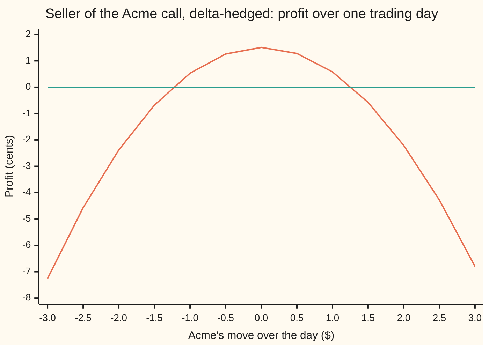
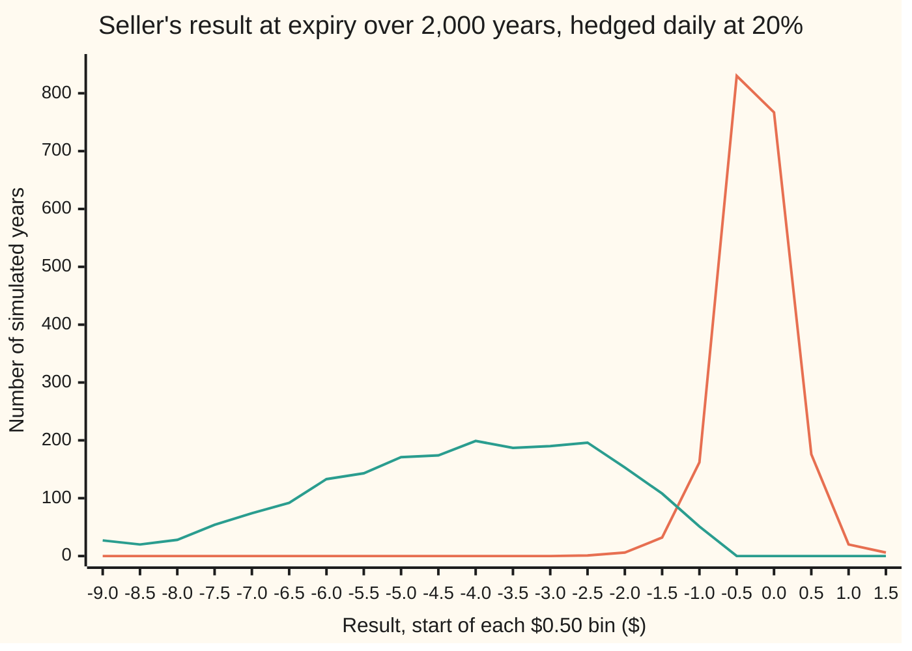

# Theta pays for gamma: the delta-hedged profit and loss, and the break-even daily move

[Syllabus](../../../SYLLABUS.md) → [Financial mathematics](../../../SYLLABUS.md#w12) → [The Greeks, one each](../../../SYLLABUS.md#w12-s09) → Theta pays for gamma

---

## General Overview

A dealer sells one Acme call in the house market. Acme trades at $100. The call gives its owner the right to buy one share for $100 a year from now. Rates are 5 percent, dividends 2 percent, volatility (how jumpy Acme is) 20 percent. The dealer collects $9.23.

The dealer does not want to bet on Acme. So the dealer buys 0.586851 of a share, the call's [Delta](01-delta.md), borrowing the difference from the bank. A small move in Acme now leaves the book (the dealer's combined position) unchanged. Adjusting the share count every trading day as delta drifts is **delta hedging**.

Two things still move the book. The clock runs and the call loses value: that loss is **theta**, and the seller pockets it. And the call's price curves upward, so its slope shifts as Acme moves and the hedge is always slightly stale. That curvature is **gamma**, and the seller pays for it on every sizeable move, up or down.

On a quiet trading day the dealer keeps about 1.5 cents. On a day when Acme moves more than about $1.26 either way, the dealer loses. The $1.26 is the typical daily move that the 20 percent volatility in the price promised.

**Theta is the rent the market charges for gamma, set so that a share moving exactly as jumpily as the price assumed leaves a delta-hedged book flat; the book's profit is half the gamma times the squared share price times the gap between the variance priced and the variance delivered, added up day by day.**

**What kind of fact this is:** a theorem inside the Black-Scholes model, proved on this card in Why it works; the daily profit formula is an approximation whose error the simulation measures, and the model itself is an assumption, not a law.

### The picture: one trading day for the seller



Orange: the book's profit after one trading day, repricing the call in full at each move. Green: zero. With no move the book keeps 1.51 cents, the day's rent. It crosses zero near $1.27 up and $1.25 down; beyond those, the loss grows like the square of the move. Direction does not matter; size does.

---

## The formula

Notation first, in words. The Greek letters are the option's sensitivities, each defined on its own card: $\Delta$ (delta) is the slope of the price in the share price, $\Gamma$ (gamma) is how fast that slope changes, $\Theta$ (theta) is the change in price per year of calendar time with nothing else moving. A small $\delta$ in front of a letter means "the change over one step": $\delta t$ is one step of the clock, $\delta S$ is the share's move over that step.

$$\Theta \;+\; \tfrac12\,\sigma^2 S^2\,\Gamma \;+\; (r-q)\,S\,\Delta \;=\; r\,V$$

**Read it aloud:** what the clock takes, plus what the curvature is expected to give back, plus what the hedge shares earn net of what they cost to carry, equals the bank interest on the option's price.

Solved for theta, it reads as a bill with two lines:

$$\Theta \;=\; -\tfrac12\,\sigma^2 S^2\,\Gamma \;+\; \big(r\,V - (r-q)\,S\,\Delta\big)$$

The first line is the **rent** on gamma. The second is **carry**: the interest and dividends on the hedge and on the option's own price. With both rates at zero, theta is exactly minus the rent.

For the seller who holds $\Delta$ shares and funds them at the bank, the profit over one step is, to second order in the move,

$$\text{seller's profit over one step} \;\approx\; \tfrac12\,\Gamma\,\big(\sigma^2 S^2\,\delta t \;-\; (\delta S)^2\big)$$

**Read it aloud:** half the gamma, times the squared move the price was charging for, minus the squared move that happened.

Set the bracket to zero and the **break-even move** falls out:

$$\lvert\delta S\rvert \;=\; \sigma\,S\,\sqrt{\delta t}$$

Add the steps up, carrying each day's result to expiry at the bank rate, and let the share's true volatility be $\sigma_{\text{real}}$:

$$\text{seller's profit at expiry} \;\approx\; \tfrac12\int_0^T e^{r(T-t)}\,\Gamma_t\,S_t^2\,\big(\sigma^2 - \sigma_{\text{real}}^2\big)\,dt$$

The buyer who hedges holds the mirror book and earns the same with the sign flipped: realised variance minus implied.

| Symbol | Plain meaning | In our example | Push it up and the seller's result… |
| --- | --- | --- | --- |
| $V$ | the call's price today, the premium collected | $9.23 | the funding line $r\,V$ grows |
| $S$ | Acme's price today | $100 | near the strike, gamma times $S^2$ is largest; far away, both rent and risk fade |
| $\Delta$ | delta, shares held against the call | 0.586851 | the hedge's carry grows |
| $\Gamma$ | gamma, change in delta per dollar Acme moves | 0.018951 per dollar | more rent in, more loss per big move |
| $\Theta$ | theta, change in the call's price per year of calendar time | −$5.09 a year | (solved for) |
| $\sigma$ | implied volatility: the jumpiness written into the price | 20% | rent and break-even both rise |
| $\sigma_{\text{real}}$ | realised volatility: the jumpiness Acme actually delivers | 20% or 30% in the runs | above $\sigma$, the seller loses |
| $r$, $q$ | the bank rate; the dividend yield, both continuously compounded | 5%, 2% | change the carry line, not the rent |
| $T$, $t$ | expiry, in years; today's date in years. $e^{r(T-t)}$ carries a dollar made at $t$ to expiry | 1; 0 | longer life, smaller gamma, more days to add up |
| $\delta t$, $\delta S$ | one rebalancing step in years; Acme's move over it | 1/252; varies | break-even grows like $\sqrt{\delta t}$ |
| $n$ | rebalances over the life, so $\delta t = T/n$ | 252 | the spread of the result shrinks like $1/\sqrt{n}$ |
| $\mu$, $W$ | Acme's drift; the Brownian motion driving its noise (Detailed proof) | any drift | drift drops out of the hedged result |
| $X$, $E$ | the seller's wealth; the surplus, wealth minus the call's model value (Detailed proof) | $0 surplus at the start | a positive surplus at expiry is profit |

### When it holds

- **A share that moves continuously.** A sudden gap costs the seller half the gamma times the jump squared at once, with no chance to rebalance.
- **Frequent rebalancing.** Rebalancing $n$ times leaves noise whose spread falls like $1/\sqrt{n}$: $1.48 monthly against $0.43 daily on Acme.
- **Known volatility.** If Acme's true volatility differs from the 20 percent in the price, the seller gains or loses the gamma-weighted variance gap: about $3.99 lost at 30 percent.
- **No trading costs.** Every real rebalance crosses a bid-offer spread, a leak that grows with $n$.
- **Away from the last days.** At the strike near expiry gamma grows without limit, and the second-order formula understates a day's loss.

---

## Why it works

### Step 0: once the slope is hedged, only the bend and the clock remain

A delta-hedged book is flat to a small move. What is left is the bend in the call's price curve, which pays on the square of the move, and the clock. Neither depends on which way Acme went.

Hedged continuously, the squared moves add up to a known total (quadratic variation), so the book carries no risk at all. A riskless position must earn the bank rate: more, and every dealer would run it with borrowed money; less, and they would run it backwards. So the clock's charge must match the bend's expected payout exactly. That match is the whole card.

### Step 1: expand the call's price over one step

Over one step the call's price changes by, to second order (the Taylor expansion done on the [The Greeks together](09-greeks-together-taylor-pnl.md) card):

$$\delta V \;\approx\; \Theta\,\delta t \;+\; \Delta\,\delta S \;+\; \tfrac12\,\Gamma\,(\delta S)^2$$

The bend's term carries a half, as every second-order Taylor term does.

### Step 2: write down the seller's day

The seller owes the call, holds $\Delta$ shares, and owes the bank $\Delta S - V$: the cost of the shares less the $9.23 collected. Over one step:

- the call owed changes by $-\delta V$;
- the shares gain $\Delta\,\delta S$ and pay dividends $q\,\Delta S\,\delta t$;
- the loan costs interest $r(\Delta S - V)\,\delta t$.

Add them and substitute Step 1. The $\Delta\,\delta S$ terms cancel: that is what the hedge was for. What is left is

$$-\Theta\,\delta t \;-\; \tfrac12\,\Gamma\,(\delta S)^2 \;-\; \big((r-q)\,S\,\Delta - r\,V\big)\,\delta t.$$

Theta is income, the bend a cost on every move, and the last bracket the net financing: 0.52 cents a trading day on Acme.

### Step 3: the Black-Scholes equation turns the bill into rent

The [The Black-Scholes equation](../08-The%20Black-Scholes%20call%20and%20put/07-black-scholes-equation.md) is Step 0's no-free-money demand as an equation:

$$\Theta + \tfrac12\sigma^2 S^2\Gamma + (r-q)S\Delta - rV = 0.$$

Rearranged: $-\Theta - \big((r-q)S\Delta - rV\big) = \tfrac12\sigma^2S^2\Gamma$, which is exactly the part of Step 2 that does not depend on the move. Substitute, and the seller's step becomes

$$\tfrac12\,\Gamma\,\big(\sigma^2 S^2\,\delta t - (\delta S)^2\big).$$

On Acme: theta brings in 2.02 cents a trading day, 0.52 cents goes on the loan net of dividends, and the remaining 1.50 cents is the rent, $\tfrac12\sigma^2S^2\Gamma\,\delta t$.

### Step 4: the break-even move

The bracket is zero when the move is $\sigma S\sqrt{\delta t}$. For one trading day that is $0.20 \times 100 \times \sqrt{1/252} = \$1.26$: one standard deviation of Acme's daily move at 20 percent volatility. A smaller day is a win for the seller; a bigger one, either way, a loss.

Full repricing puts the break-evens at $1.272956 up and $1.246134 down: unequal because the bend itself changes as Acme moves, a third-order effect. Their average, 1.259545, is within a twentieth of a cent of the formula's 1.259882.

<details>
<summary>Why the square root of the step?</summary>

Randomness adds up in variance, not in size: five independent days have five times the variance of one, so the typical five-day move is only $\sqrt5$ times bigger. Hedge weekly and the break-even is $2.82 against $1.26: five times the rent, about 2.2 times the move.

</details>

### Step 5: add up the days

Over a year the squared daily moves add up to the realised variance (the [Quadratic variation](../../11-Stochastic%20processes%20and%20calculus/05-Brownian%20Motion/03-quadratic-variation.md) card): in the limit, $(\delta S)^2$ adds up to $\sigma_{\text{real}}^2 S^2\,\delta t$ per step. Each day's result earns the bank rate until expiry, so it gets the factor $e^{r(T-t)}$. At exactly 20 percent the bracket averages zero, and so does the book. At 30 percent the continuous-time bracket is negative at every instant and gamma is positive, so the continuously hedged seller loses on every path.

<details>
<summary>Detailed proof: the continuously hedged book, exactly</summary>

Let Acme follow $dS = \mu S\,dt + \sigma_{\text{real}} S\,dW$: a drift $\mu$ of any size plus noise from a Brownian motion $W$. Let the seller hold $\Delta = \partial V/\partial S$ shares, computed at the model volatility $\sigma$, and fund everything at the bank. Call the seller's wealth $X$, and the surplus, wealth minus the call's model value, $E = X - V$.

The wealth changes by $dX = \Delta\,dS + q\Delta S\,dt + r(X - \Delta S)\,dt$. Itô's lemma applied to the call's model value gives $dV = \big(\Theta + \mu S\Delta + \tfrac12\sigma_{\text{real}}^2 S^2\Gamma\big)dt + \Delta\,\sigma_{\text{real}} S\,dW$.

Subtract. The Brownian-noise terms are identical and cancel, and so do the drift terms $\mu S\Delta$: the share's direction drops out. What remains is
$$dE = rE\,dt - \big(\Theta + (r-q)S\Delta - rV + \tfrac12\sigma_{\text{real}}^2 S^2\Gamma\big)dt.$$
The Black-Scholes equation at volatility $\sigma$ replaces the first three terms in the bracket by $-\tfrac12\sigma^2S^2\Gamma$, so
$$dE = rE\,dt + \tfrac12\big(\sigma^2 - \sigma_{\text{real}}^2\big)S^2\Gamma\,dt, \qquad E_0 = 0.$$
Multiply by $e^{-rt}$, integrate from 0 to $T$, and multiply back by $e^{rT}$. At expiry the call's model value is its payoff, so the surplus at expiry is the seller's profit:
$$E_T = \tfrac12\int_0^T e^{r(T-t)}\big(\sigma^2 - \sigma_{\text{real}}^2\big)S_t^2\,\Gamma_t\,dt.$$
The same lines go through with $\sigma_{\text{real}}$ varying over time. This is the robustness result of El Karoui, Jeanblanc-Picqué and Shreve: a hedger whose volatility is at least the realised one, all the time, never loses on a call.

</details>

### Step 6: why the spread falls like one over root n, and why the loss is the price gap

With matched volatility the bracket averages zero but is not zero on any one day. The move is $\sigma S\sqrt{\delta t}$ times a bell-curve draw, so the day's result is $\tfrac12\Gamma\sigma^2S^2\delta t$ times one minus that draw squared: noise of size proportional to $\delta t = T/n$. Adding $n$ independent days gives variance proportional to $n \times (T/n)^2 = T^2/n$, so the spread goes like $1/\sqrt{n}$. Four times the rebalancing halves it.

With mismatched volatility, a shorter argument gives the average loss. When Acme drifts at $r - q$, any self-financing book of shares and cash (one that adds and withdraws no money after the start) grows on average at the bank rate. The seller's book starts at the $9.23 collected and ends on average at that amount carried at 5 percent. The call's payoff, averaged over a 30 percent world and discounted, is the 30 percent Black-Scholes price. So the average loss at expiry is $C(30\%) - C(20\%)$ carried forward a year: $3.7933 grows to $3.9878. Today's value of that loss, $3.7933, is to first order [Vega](03-vega.md) times the ten-point gap, $3.7901: the vega gap.

The same identity can be reached from the other end: solve the Black-Scholes equation first and read it at one point, which is how the [Theta](04-theta.md) card uses it to check its closed form.

---

## Worked numbers, by hand

Acme at $S = 100$ with the strike at the same level, $r = 5\%$, $q = 2\%$, $\sigma = 20\%$, $T = 1$ year; greeks from the sibling cards.

| Step | Arithmetic | Value |
| --- | --- | --- |
| rent, $\tfrac12\sigma^2S^2\Gamma$ | $0.5 \times 0.04 \times 10{,}000 \times 0.018951$ | $3.790116 a year |
| carry on the hedge, $(r-q)S\Delta$ | $0.03 \times 100 \times 0.586851$ | $1.760553 a year |
| funding on the price, $r\,V$ | $0.05 \times 9.227006$ | $0.461350 a year |
| theta from the identity | $0.461350 - 1.760553 - 3.790116$ | −$5.089319 a year |
| theta per trading day | $-5.089319 / 252$ | −$0.020196 |
| rent per trading day | $3.790116 / 252$ | $0.015040 |
| net carry per trading day | $(1.760553 - 0.461350)/252$ | $0.005156 |
| **break-even daily move** | $0.20 \times 100 \times \sqrt{1/252}$ | **$1.259882** |

The identity's theta matches the closed-form theta of the [Theta](04-theta.md) card, −$5.089319 a year. That card quotes −$0.013943 per calendar day, dividing by 365; this card counts the 252 trading days, when the hedge can be rebalanced.

A dealer short this call keeps one and a half cents on a trading day when Acme moves less than $1.26, and loses on a day it moves more.

### What breaks if you drop a piece

| Mistake | Comes out at | What went wrong |
| --- | --- | --- |
| Drop the half in the rent | theta −$8.879435 | the bend's Taylor term is half gamma times the move squared |
| Use $\sigma$ where $\sigma^2$ belongs | theta −$20.249782 | the rent is paid on the squared move, so on variance |
| Call theta minus the rent, forgetting carry | −$3.790116 | the loan net of dividends takes about a quarter of theta |
| Break-even as $\sigma S\,\delta t$ | $0.079365 | moves grow like the root of time, not time |
| Weigh theta alone against the bend, ignoring the loan | break-even $1.459934 | theta also pays the net financing, 0.52 cents a day |

---

## One year of hedging, day by day

The puzzle: the seller hedges for a whole year, Acme ends at $125.17, deep in the money, and the dealer is up. Direction did not matter. The sum of the squared moves did.

### One year traced

One simulated year, hedged daily, Acme at 20 percent. The last column is the rent-minus-bend sum from The formula, added day by day with interest.

| Day | Acme | Seller's profit, call marked at 20% | Rent minus bend, summed |
| --- | --- | --- | --- |
| 63 | $96.26 | +$0.3064 | +$0.3181 |
| 126 | $109.77 | +$0.3715 | +$0.3737 |
| 189 | $129.46 | +$0.4198 | +$0.4170 |
| 252 | $125.17 | +$0.4329 | +$0.4236 |

The columns track each other to about a cent. Weighted by gamma, the year was a little calmer than 20 percent, so the rent beat the bend, by 43 cents.

### Force one: how often the hedge is adjusted

The same 2,000 simulated years, hedged at three frequencies, Acme at 20 percent. Spread of the seller's result at expiry, in dollars:

```
rebalances     spread of the result at expiry ($)
21 (monthly)   ██████████████████████████████████  1.4764
63             ████████████████████                0.8609
252 (daily)    ██████████                          0.4281
```

Twelve times the rebalancing, about a third of the spread. The average stays near zero at every frequency: +0.0209, −0.0196, −0.0099. Spread times $\sqrt{n}$ stays put: 6.7659, 6.8333, 6.7964. That constant is the $1/\sqrt{n}$ law.

### Force two: how jumpy the world really is

Keep the daily hedge at 20 percent and let Acme move at 30 percent instead. The average result moves from −$0.0099 to −$3.9655. Not one of 2,000 paths made money; the best lost $0.5064. The shift is the price gap carried to expiry, $3.9878.

### Both forces in one picture



Orange: Acme at 20 percent, as priced. A narrow spike at zero; 90 percent of years land between −$0.7254 and +$0.6931. Green: Acme at 30 percent. The distribution slides left by about $4 and spreads out, because the loss is weighted by gamma along each path. The leftmost bin holds every year below −$8.50.

---

## Code, from first principles, and it actually runs

Three independent roads. Road 1 bumps the call's price for delta and gamma, and checks the identity against the closed-form theta and a bumped-clock theta. Road 2 reprices the seller's book one trading day later and finds the break-even moves by bisection, never using $\sigma S\sqrt{\delta t}$. Road 3 hedges 2,000 simulated years step by step ([Euler-Maruyama](../../11-Stochastic%20processes%20and%20calculus/08-Generators%2C%20Densities%20and%20Simulation/04-euler-maruyama-scheme.md), exact here because the log-price step is a bell-curve draw), tracking cash, interest, dividends and trades. The bell-curve area is a power series and the random numbers a hand-written generator, the same in both languages, so the outputs agree digit for digit.

### Python

```python
# Theta pays for gamma -- the check behind the card.  Python standard library only.
# Every number quoted on the card is printed here.  The bell-curve area N is a power
# series written out below (no erf); the random numbers are splitmix64 and Box-Muller,
# written out; the root finder is bisection.  Nothing imported already knows the answer.
from math import log, sqrt, exp, pi, cos, sin

def phi(x): return exp(-0.5 * x * x) / sqrt(2.0 * pi)      # bell-curve height at x
def N(x):                                                  # bell-curve area left of x
    if abs(x) > 9.0: return 0.0 if x < 0 else 1.0
    term = total = x; k = 1
    while abs(term) > 1e-18 * abs(total):                  # x + x^3/3 + x^5/15 + ...
        term *= x * x / (2 * k + 1); total += term; k += 1
    return 0.5 + phi(x) * total

K, r, q, sig, T, S0 = 100.0, 0.05, 0.02, 0.20, 1.0, 100.0  # the house market
def d1(S, s, t): return (log(S / K) + (r - q + 0.5 * s * s) * t) / (s * sqrt(t))
def call(S, s, t):
    a = d1(S, s, t); return S * exp(-q * t) * N(a) - K * exp(-r * t) * N(a - s * sqrt(t))
def dg(S, t):                                              # delta and gamma from one d1
    a = d1(S, sig, t); return exp(-q * t) * N(a), exp(-q * t) * phi(a) / (S * sig * sqrt(t))
def theta(S, s, t):                                        # the formula's own calendar slope
    a = d1(S, s, t); b = a - s * sqrt(t)
    return -S * exp(-q * t) * phi(a) * s / (2 * sqrt(t)) - r * K * exp(-r * t) * N(b) + q * S * exp(-q * t) * N(a)

# ---- road 1: the identity, with delta and gamma found by bumping the price ----
V, TH = call(S0, sig, T), theta(S0, sig, T)
D, G = dg(S0, T)
h = 0.01
Db = (call(S0 + h, sig, T) - call(S0 - h, sig, T)) / (2 * h)
Gb = (call(S0 + h, sig, T) - 2 * V + call(S0 - h, sig, T)) / (h * h)
THb = (call(S0, sig, T - 1e-4) - call(S0, sig, T + 1e-4)) / 2e-4
rent, carry, fund = 0.5 * sig * sig * S0 * S0 * Gb, (r - q) * S0 * Db, r * V
TH_id = fund - carry - rent
# ---- road 2: one trading day, revalued in full, for the seller of the call ----
dt = 1.0 / 252
def day_pnl(dS):
    return -(call(S0 + dS, sig, T - dt) - V) + D * dS + (V - D * S0) * (exp(r * dt) - 1) + q * D * S0 * dt
def bisect(a, b):
    for _ in range(200):
        m = 0.5 * (a + b)
        if (day_pnl(a) > 0) == (day_pnl(m) > 0): a = m
        else: b = m
    return 0.5 * (a + b)
up, dn, be = bisect(0.0, 5.0), bisect(-5.0, 0.0), sig * S0 * sqrt(dt)
rows = [("call price V", V), ("delta, formula", D), ("delta, bumped", Db), ("gamma, formula", G),
        ("gamma, bumped", Gb), ("theta per year, formula", TH), ("theta per year, bumped clock", THb),
        ("rent  1/2 sig^2 S^2 gamma", rent), ("carry (r-q) S delta", carry), ("funding r V", fund),
        ("theta from the identity", TH_id), ("rent per trading day", rent * dt),
        ("theta per trading day", TH * dt), ("theta per calendar day", TH / 365),
        ("carry less funding per trading day", (carry - fund) * dt),
        ("break-even move sig S root(dt)", be), ("break-even, weekly hedge", sig * S0 * sqrt(5 * dt)),
        ("break-even up, bisection", up),
        ("break-even down, bisection", dn), ("  average size", 0.5 * (up - dn)),
        ("wrong: drop the 1/2, theta", fund - carry - 2 * rent),
        ("wrong: sigma not sigma^2, theta", fund - carry - rent / sig),
        ("wrong: theta = -rent alone", -rent), ("wrong: sig S dt, break-even", sig * S0 * dt),
        ("wrong: unfinanced break-even", sqrt(-2 * TH * dt / G))]
for name, v in rows: print(f"{name:<34} {v:>12.6f}")
moves = [-3.0 + 0.5 * i for i in range(13)]
print("chart, move ($)   " + " ".join(f"{m:6.1f}" for m in moves))
print("chart, cents      " + " ".join(f"{100 * day_pnl(m):6.2f}" for m in moves))

# ---- road 3: hedge 2,000 simulated years, rebalancing n times ----
M64 = (1 << 64) - 1
def normals(seed):
    x = seed
    def u():
        nonlocal x
        x = (x + 0x9E3779B97F4A7C15) & M64
        z = ((x ^ (x >> 30)) * 0xBF58476D1CE4E5B9) & M64
        z = ((z ^ (z >> 27)) * 0x94D049BB133111EB) & M64
        return (((z ^ (z >> 31)) >> 11) + 0.5) / 9007199254740992.0
    while True:
        a, b = u(), u(); R = sqrt(-2.0 * log(a))
        yield R * cos(2 * pi * b); yield R * sin(2 * pi * b)

def hedge(n, sw, mu, paths=2000, seed=2026):
    """Seller of the call at 20%, delta-hedged n times; the world moves at sw with drift mu."""
    d_t = T / n; g = normals(seed); out, pred, story = [], [], []
    for p in range(paths):
        S, dl, gm, cash, gs = S0, D, G, V - D * S0, 0.0
        for i in range(n):
            Sn = S * exp((mu - 0.5 * sw * sw) * d_t + sw * sqrt(d_t) * next(g))
            cash = cash * exp(r * d_t) + q * dl * S * d_t       # interest, and dividends on the shares
            gs += 0.5 * gm * (sig * sig * S * S * d_t - (Sn - S) ** 2) * exp(r * (T - (i + 1) * d_t))
            S, left = Sn, T - (i + 1) * d_t
            if i < n - 1:
                dn_, gm = dg(S, left); cash -= (dn_ - dl) * S; dl = dn_
            if p == 0 and (i + 1) % (n // 4) == 0:
                mark = cash + dl * S - (call(S, sig, left) if left > 1e-12 else max(S - K, 0.0))
                story.append((i + 1, S, mark, gs))
        out.append(cash + dl * S - max(S - K, 0.0)); pred.append(gs)
    return out, pred, story

def stats(xs):
    m = sum(xs) / len(xs); sd = sqrt(sum((x - m) ** 2 for x in xs) / (len(xs) - 1))
    return m, sd, sd / sqrt(len(xs))
A, Ap, story = hedge(252, 0.20, r - q)
print("story: day, Acme, seller's P&L marked, gamma-weighted sum")
for day, S, mark, gs in story: print(f"  day {day:>3}   Acme {S:7.2f}   P&L {mark:+8.4f}   sum {gs:+8.4f}")
print("rebalances   mean      sd   sd*root(n)")
sds = {}
for n in (21, 63, 252):
    xs = A if n == 252 else hedge(n, 0.20, r - q)[0]
    m, sd, se = stats(xs); sds[n] = sd
    print(f"  n = {n:>3}  {m:+.4f}  {sd:.4f}  {sd * sqrt(n):.4f}")
mA, sdA, seA = stats(A); diff = stats([a - b for a, b in zip(A, Ap)])
srt = sorted(A)
print(f"daily, 20% world: std error {seA:.4f}; 5th pct {srt[99]:+.4f}; 95th pct {srt[1899]:+.4f}")
print(f"daily, 20% world: gamma-sum mean {stats(Ap)[0]:+.4f}; sd of (P&L - sum) {diff[1]:.4f}")
Cw, Cp, _ = hedge(252, 0.30, r - q)
mC, sdC, seC = stats(Cw); gap = call(S0, 0.30, T) - V
print(f"daily, 30% world: mean {mC:+.4f}  sd {sdC:.4f}  std error {seC:.4f}  gamma-sum mean {stats(Cp)[0]:+.4f}")
print(f"daily, 30% world: paths that made money {sum(1 for x in Cw if x > 0)}; best path {max(Cw):+.4f}")
print(f"price gap C(30%) - C(20%) {gap:.4f}; carried to expiry {gap * exp(r * T):.4f}; vega x 0.10 {0.10 * sqrt(T) * S0 * exp(-q * T) * phi(d1(S0, sig, T)):.4f}")
mD = stats(hedge(252, 0.20, 0.15)[0])
print(f"daily, 20% world, drift 15%: mean {mD[0]:+.4f}  sd {mD[1]:.4f}")
edges = [-9.0 + 0.5 * i for i in range(23)]
def hist(xs): return [sum(1 for x in xs if lo <= min(max(x, -8.999), 1.999) < lo + 0.5) for lo in edges[:-1]]
print("hist, bin start " + " ".join(f"{e:5.1f}" for e in edges[:-1]))
print("hist, 20% world " + " ".join(f"{c:5d}" for c in hist(A)))
print("hist, 30% world " + " ".join(f"{c:5d}" for c in hist(Cw)))

assert abs(TH - (-5.089319)) < 5e-7,               "theta vs the house number from the theta card"
assert abs(TH_id - TH) < 1e-5,                     "identity with bumped Greeks vs the closed-form theta"
assert abs(THb - TH) < 1e-6,                       "bumped clock vs the closed-form theta"
assert abs(0.5 * (up - dn) - be) < 0.002,          "full-revaluation break-even vs sig S root(dt)"
assert abs(mA) < 3 * seA,                          "matched world: hedge centred on zero"
assert abs(sds[21] / sds[252] / sqrt(12) - 1) < 0.1, "spread falls like one over root n"
assert abs(mC + gap * exp(r * T)) < 4 * seC,       "30% world: loss is the price gap carried forward"
assert diff[1] < 0.25 * sdA,                       "the gamma-weighted sum tracks each path"
print("ALL CHECKS PASS")
```

**Ran 2026-09-19 on macOS, Python 3.14.6, standard library only. All checks passed. Output, pasted from the run:**

```
call price V                           9.227006
delta, formula                         0.586851
delta, bumped                          0.586851
gamma, formula                         0.018951
gamma, bumped                          0.018951
theta per year, formula               -5.089319
theta per year, bumped clock          -5.089319
rent  1/2 sig^2 S^2 gamma              3.790116
carry (r-q) S delta                    1.760553
funding r V                            0.461350
theta from the identity               -5.089319
rent per trading day                   0.015040
theta per trading day                 -0.020196
theta per calendar day                -0.013943
carry less funding per trading day     0.005156
break-even move sig S root(dt)         1.259882
break-even, weekly hedge               2.817181
break-even up, bisection               1.272956
break-even down, bisection            -1.246134
  average size                         1.259545
wrong: drop the 1/2, theta            -8.879435
wrong: sigma not sigma^2, theta      -20.249782
wrong: theta = -rent alone            -3.790116
wrong: sig S dt, break-even            0.079365
wrong: unfinanced break-even           1.459934
chart, move ($)     -3.0   -2.5   -2.0   -1.5   -1.0   -0.5    0.0    0.5    1.0    1.5    2.0    2.5    3.0
chart, cents       -7.26  -4.57  -2.38  -0.68   0.53   1.26   1.51   1.28   0.58  -0.58  -2.21  -4.28  -6.80
story: day, Acme, seller's P&L marked, gamma-weighted sum
  day  63   Acme   96.26   P&L  +0.3064   sum  +0.3181
  day 126   Acme  109.77   P&L  +0.3715   sum  +0.3737
  day 189   Acme  129.46   P&L  +0.4198   sum  +0.4170
  day 252   Acme  125.17   P&L  +0.4329   sum  +0.4236
rebalances   mean      sd   sd*root(n)
  n =  21  +0.0209  1.4764  6.7659
  n =  63  -0.0196  0.8609  6.8333
  n = 252  -0.0099  0.4281  6.7964
daily, 20% world: std error 0.0096; 5th pct -0.7254; 95th pct +0.6931
daily, 20% world: gamma-sum mean -0.0108; sd of (P&L - sum) 0.0508
daily, 30% world: mean -3.9655  sd 1.8663  std error 0.0417  gamma-sum mean -3.9705
daily, 30% world: paths that made money 0; best path -0.5064
price gap C(30%) - C(20%) 3.7933; carried to expiry 3.9878; vega x 0.10 3.7901
daily, 20% world, drift 15%: mean -0.0072  sd 0.4132
hist, bin start  -9.0  -8.5  -8.0  -7.5  -7.0  -6.5  -6.0  -5.5  -5.0  -4.5  -4.0  -3.5  -3.0  -2.5  -2.0  -1.5  -1.0  -0.5   0.0   0.5   1.0   1.5
hist, 20% world     0     0     0     0     0     0     0     0     0     0     0     0     0     1     6    32   162   830   767   176    20     6
hist, 30% world    27    20    28    54    74    92   133   143   171   174   199   187   190   196   153   108    51     0     0     0     0     0
ALL CHECKS PASS
```

### Rust

```rust
// Theta pays for gamma -- the same check as theta_pays_for_gamma_hedged_pnl_check.py, in Rust.
// Standard library only, no crates.  The bell-curve area is the same power series written
// out; the random numbers are splitmix64 and Box-Muller; the root finder is bisection.
// Compile: rustc --edition 2021 -O theta_pays_for_gamma_hedged_pnl_check.rs -o /tmp/tpg_check
use std::f64::consts::PI;

const K: f64 = 100.0; const R: f64 = 0.05; const Q: f64 = 0.02;
const SIG: f64 = 0.20; const T: f64 = 1.0; const S0: f64 = 100.0;

fn phi(x: f64) -> f64 { (-0.5 * x * x).exp() / (2.0 * PI).sqrt() }
fn n_cdf(x: f64) -> f64 {
    if x.abs() > 9.0 { return if x < 0.0 { 0.0 } else { 1.0 }; }
    let (mut term, mut total, mut k) = (x, x, 1.0);
    while term.abs() > 1e-18 * total.abs() { term *= x * x / (2.0 * k + 1.0); total += term; k += 1.0; }
    0.5 + phi(x) * total
}
fn d1(s: f64, v: f64, t: f64) -> f64 { ((s / K).ln() + (R - Q + 0.5 * v * v) * t) / (v * t.sqrt()) }
fn call(s: f64, v: f64, t: f64) -> f64 {
    let a = d1(s, v, t);
    s * (-Q * t).exp() * n_cdf(a) - K * (-R * t).exp() * n_cdf(a - v * t.sqrt())
}
fn dg(s: f64, t: f64) -> (f64, f64) {
    let a = d1(s, SIG, t);
    ((-Q * t).exp() * n_cdf(a), (-Q * t).exp() * phi(a) / (s * SIG * t.sqrt()))
}
fn theta(s: f64, v: f64, t: f64) -> f64 {
    let a = d1(s, v, t); let b = a - v * t.sqrt();
    -s * (-Q * t).exp() * phi(a) * v / (2.0 * t.sqrt()) - R * K * (-R * t).exp() * n_cdf(b) + Q * s * (-Q * t).exp() * n_cdf(a)
}

struct Normals { x: u64, spare: Option<f64> }
impl Normals {
    fn u(&mut self) -> f64 {
        self.x = self.x.wrapping_add(0x9E3779B97F4A7C15);
        let mut z = (self.x ^ (self.x >> 30)).wrapping_mul(0xBF58476D1CE4E5B9);
        z = (z ^ (z >> 27)).wrapping_mul(0x94D049BB133111EB);
        (((z ^ (z >> 31)) >> 11) as f64 + 0.5) / 9007199254740992.0
    }
    fn next(&mut self) -> f64 {
        if let Some(z) = self.spare.take() { return z; }
        let (a, b) = (self.u(), self.u()); let rr = (-2.0 * a.ln()).sqrt();
        self.spare = Some(rr * (2.0 * PI * b).sin());
        rr * (2.0 * PI * b).cos()
    }
}

// Seller of the call at 20%, delta-hedged n times; the world moves at sw with drift mu.
fn hedge(n: usize, sw: f64, mu: f64, v0: f64, d0: f64, g0: f64) -> (Vec<f64>, Vec<f64>, Vec<(usize, f64, f64, f64)>) {
    let d_t = T / n as f64; let mut g = Normals { x: 2026, spare: None };
    let (mut out, mut pred, mut story) = (Vec::new(), Vec::new(), Vec::new());
    for p in 0..2000 {
        let (mut s, mut dl, mut gm, mut cash, mut gs) = (S0, d0, g0, v0 - d0 * S0, 0.0);
        for i in 0..n {
            let sn = s * ((mu - 0.5 * sw * sw) * d_t + sw * d_t.sqrt() * g.next()).exp();
            cash = cash * (R * d_t).exp() + Q * dl * s * d_t;
            gs += 0.5 * gm * (SIG * SIG * s * s * d_t - (sn - s) * (sn - s)) * (R * (T - (i + 1) as f64 * d_t)).exp();
            s = sn; let left = T - (i + 1) as f64 * d_t;
            if i < n - 1 { let (dn, gn) = dg(s, left); gm = gn; cash -= (dn - dl) * s; dl = dn; }
            if p == 0 && (i + 1) % (n / 4) == 0 {
                let owed = if left > 1e-12 { call(s, SIG, left) } else { (s - K).max(0.0) };
                story.push((i + 1, s, cash + dl * s - owed, gs));
            }
        }
        out.push(cash + dl * s - (s - K).max(0.0)); pred.push(gs);
    }
    (out, pred, story)
}
fn stats(xs: &[f64]) -> (f64, f64, f64) {
    let n = xs.len() as f64; let m = xs.iter().sum::<f64>() / n;
    let sd = (xs.iter().map(|x| (x - m) * (x - m)).sum::<f64>() / (n - 1.0)).sqrt();
    (m, sd, sd / n.sqrt())
}

fn main() {
    // ---- road 1: the identity, with delta and gamma found by bumping the price ----
    let (v, th) = (call(S0, SIG, T), theta(S0, SIG, T));
    let (d, g) = dg(S0, T);
    let h = 0.01;
    let db = (call(S0 + h, SIG, T) - call(S0 - h, SIG, T)) / (2.0 * h);
    let gb = (call(S0 + h, SIG, T) - 2.0 * v + call(S0 - h, SIG, T)) / (h * h);
    let thb = (call(S0, SIG, T - 1e-4) - call(S0, SIG, T + 1e-4)) / 2e-4;
    let (rent, carry, fund) = (0.5 * SIG * SIG * S0 * S0 * gb, (R - Q) * S0 * db, R * v);
    let th_id = fund - carry - rent;
    // ---- road 2: one trading day, revalued in full, for the seller of the call ----
    let dt = 1.0 / 252.0;
    let day_pnl = |ds: f64| -(call(S0 + ds, SIG, T - dt) - v) + d * ds + (v - d * S0) * ((R * dt).exp() - 1.0) + Q * d * S0 * dt;
    let bisect = |mut a: f64, mut b: f64| {
        for _ in 0..200 { let m = 0.5 * (a + b); if (day_pnl(a) > 0.0) == (day_pnl(m) > 0.0) { a = m } else { b = m } }
        0.5 * (a + b)
    };
    let (up, dn, be) = (bisect(0.0, 5.0), bisect(-5.0, 0.0), SIG * S0 * dt.sqrt());
    let rows: Vec<(&str, f64)> = vec![("call price V", v), ("delta, formula", d), ("delta, bumped", db), ("gamma, formula", g),
        ("gamma, bumped", gb), ("theta per year, formula", th), ("theta per year, bumped clock", thb),
        ("rent  1/2 sig^2 S^2 gamma", rent), ("carry (r-q) S delta", carry), ("funding r V", fund),
        ("theta from the identity", th_id), ("rent per trading day", rent * dt),
        ("theta per trading day", th * dt), ("theta per calendar day", th / 365.0),
        ("carry less funding per trading day", (carry - fund) * dt),
        ("break-even move sig S root(dt)", be), ("break-even, weekly hedge", SIG * S0 * (5.0 * dt).sqrt()),
        ("break-even up, bisection", up),
        ("break-even down, bisection", dn), ("  average size", 0.5 * (up - dn)),
        ("wrong: drop the 1/2, theta", fund - carry - 2.0 * rent),
        ("wrong: sigma not sigma^2, theta", fund - carry - rent / SIG),
        ("wrong: theta = -rent alone", -rent), ("wrong: sig S dt, break-even", SIG * S0 * dt),
        ("wrong: unfinanced break-even", (-2.0 * th * dt / g).sqrt())];
    for (name, x) in &rows { println!("{:<34} {:>12.6}", name, x); }
    let moves: Vec<f64> = (0..13).map(|i| -3.0 + 0.5 * i as f64).collect();
    println!("chart, move ($)   {}", moves.iter().map(|m| format!("{:6.1}", m)).collect::<Vec<_>>().join(" "));
    println!("chart, cents      {}", moves.iter().map(|m| format!("{:6.2}", 100.0 * day_pnl(*m))).collect::<Vec<_>>().join(" "));

    // ---- road 3: hedge 2,000 simulated years, rebalancing n times ----
    let (a, ap, story) = hedge(252, 0.20, R - Q, v, d, g);
    println!("story: day, Acme, seller's P&L marked, gamma-weighted sum");
    for (day, s, mark, gs) in &story { println!("  day {:>3}   Acme {:7.2}   P&L {:+8.4}   sum {:+8.4}", day, s, mark, gs); }
    println!("rebalances   mean      sd   sd*root(n)");
    let mut sds = [0.0; 3];
    for (j, n) in [21usize, 63, 252].iter().enumerate() {
        let xs = if *n == 252 { a.clone() } else { hedge(*n, 0.20, R - Q, v, d, g).0 };
        let (m, sd, _) = stats(&xs); sds[j] = sd;
        println!("  n = {:>3}  {:+.4}  {:.4}  {:.4}", n, m, sd, sd * (*n as f64).sqrt());
    }
    let (ma, sda, sea) = stats(&a);
    let diff = stats(&a.iter().zip(&ap).map(|(x, y)| x - y).collect::<Vec<_>>());
    let mut srt = a.clone(); srt.sort_by(|x, y| x.partial_cmp(y).unwrap());
    println!("daily, 20% world: std error {:.4}; 5th pct {:+.4}; 95th pct {:+.4}", sea, srt[99], srt[1899]);
    println!("daily, 20% world: gamma-sum mean {:+.4}; sd of (P&L - sum) {:.4}", stats(&ap).0, diff.1);
    let (cw, cp, _) = hedge(252, 0.30, R - Q, v, d, g);
    let (mc, sdc, sec) = stats(&cw); let gap = call(S0, 0.30, T) - v;
    println!("daily, 30% world: mean {:+.4}  sd {:.4}  std error {:.4}  gamma-sum mean {:+.4}", mc, sdc, sec, stats(&cp).0);
    let best = cw.iter().cloned().fold(f64::MIN, f64::max);
    println!("daily, 30% world: paths that made money {}; best path {:+.4}", cw.iter().filter(|x| **x > 0.0).count(), best);
    let vega = S0 * (-Q * T).exp() * phi(d1(S0, SIG, T)) * T.sqrt();
    println!("price gap C(30%) - C(20%) {:.4}; carried to expiry {:.4}; vega x 0.10 {:.4}", gap, gap * (R * T).exp(), 0.10 * vega);
    let md = stats(&hedge(252, 0.20, 0.15, v, d, g).0);
    println!("daily, 20% world, drift 15%: mean {:+.4}  sd {:.4}", md.0, md.1);
    let edges: Vec<f64> = (0..22).map(|i| -9.0 + 0.5 * i as f64).collect();
    let hist = |xs: &[f64]| -> Vec<usize> {
        edges.iter().map(|lo| xs.iter().filter(|x| { let c = x.max(-8.999).min(1.999); *lo <= c && c < lo + 0.5 }).count()).collect()
    };
    println!("hist, bin start {}", edges.iter().map(|e| format!("{:5.1}", e)).collect::<Vec<_>>().join(" "));
    println!("hist, 20% world {}", hist(&a).iter().map(|c| format!("{:5}", c)).collect::<Vec<_>>().join(" "));
    println!("hist, 30% world {}", hist(&cw).iter().map(|c| format!("{:5}", c)).collect::<Vec<_>>().join(" "));

    assert!((th - (-5.089319)).abs() < 5e-7, "theta vs the house number from the theta card");
    assert!((th_id - th).abs() < 1e-5, "identity with bumped Greeks vs the closed-form theta");
    assert!((thb - th).abs() < 1e-6, "bumped clock vs the closed-form theta");
    assert!((0.5 * (up - dn) - be).abs() < 0.002, "full-revaluation break-even vs sig S root(dt)");
    assert!(ma.abs() < 3.0 * sea, "matched world: hedge centred on zero");
    assert!((sds[0] / sds[2] / 12f64.sqrt() - 1.0).abs() < 0.1, "spread falls like one over root n");
    assert!((mc + gap * (R * T).exp()).abs() < 4.0 * sec, "30% world: loss is the price gap carried forward");
    assert!(diff.1 < 0.25 * sda, "the gamma-weighted sum tracks each path");
    println!("ALL CHECKS PASS");
}
```

**Ran 2026-09-19 on macOS, rustc 1.98.1, no crates. All checks passed. Output, pasted from the run:**

```
call price V                           9.227006
delta, formula                         0.586851
delta, bumped                          0.586851
gamma, formula                         0.018951
gamma, bumped                          0.018951
theta per year, formula               -5.089319
theta per year, bumped clock          -5.089319
rent  1/2 sig^2 S^2 gamma              3.790116
carry (r-q) S delta                    1.760553
funding r V                            0.461350
theta from the identity               -5.089319
rent per trading day                   0.015040
theta per trading day                 -0.020196
theta per calendar day                -0.013943
carry less funding per trading day     0.005156
break-even move sig S root(dt)         1.259882
break-even, weekly hedge               2.817181
break-even up, bisection               1.272956
break-even down, bisection            -1.246134
  average size                         1.259545
wrong: drop the 1/2, theta            -8.879435
wrong: sigma not sigma^2, theta      -20.249782
wrong: theta = -rent alone            -3.790116
wrong: sig S dt, break-even            0.079365
wrong: unfinanced break-even           1.459934
chart, move ($)     -3.0   -2.5   -2.0   -1.5   -1.0   -0.5    0.0    0.5    1.0    1.5    2.0    2.5    3.0
chart, cents       -7.26  -4.57  -2.38  -0.68   0.53   1.26   1.51   1.28   0.58  -0.58  -2.21  -4.28  -6.80
story: day, Acme, seller's P&L marked, gamma-weighted sum
  day  63   Acme   96.26   P&L  +0.3064   sum  +0.3181
  day 126   Acme  109.77   P&L  +0.3715   sum  +0.3737
  day 189   Acme  129.46   P&L  +0.4198   sum  +0.4170
  day 252   Acme  125.17   P&L  +0.4329   sum  +0.4236
rebalances   mean      sd   sd*root(n)
  n =  21  +0.0209  1.4764  6.7659
  n =  63  -0.0196  0.8609  6.8333
  n = 252  -0.0099  0.4281  6.7964
daily, 20% world: std error 0.0096; 5th pct -0.7254; 95th pct +0.6931
daily, 20% world: gamma-sum mean -0.0108; sd of (P&L - sum) 0.0508
daily, 30% world: mean -3.9655  sd 1.8663  std error 0.0417  gamma-sum mean -3.9705
daily, 30% world: paths that made money 0; best path -0.5064
price gap C(30%) - C(20%) 3.7933; carried to expiry 3.9878; vega x 0.10 3.7901
daily, 20% world, drift 15%: mean -0.0072  sd 0.4132
hist, bin start  -9.0  -8.5  -8.0  -7.5  -7.0  -6.5  -6.0  -5.5  -5.0  -4.5  -4.0  -3.5  -3.0  -2.5  -2.0  -1.5  -1.0  -0.5   0.0   0.5   1.0   1.5
hist, 20% world     0     0     0     0     0     0     0     0     0     0     0     0     0     1     6    32   162   830   767   176    20     6
hist, 30% world    27    20    28    54    74    92   133   143   171   174   199   187   190   196   153   108    51     0     0     0     0     0
ALL CHECKS PASS
```

The outputs are identical. Road 1 gives the house theta, −5.089319, three ways. Road 3's daily hedge averages −0.0099, standard error 0.0096, and the gap between each path's result and its rent-minus-bend sum has a spread of 0.0508, an eighth of the result's own 0.4281.

> [!TIP]
> **Try changing**
> Guess first, then run.
> - **Give Acme a strong upward drift.** Call `hedge(252, 0.20, 0.15)`. Guess: the book cares. Answer: the average is −$0.0072, spread $0.4132. The drift never enters the hedged result.
> - **Hedge every four trading days.** `hedge(63, 0.20, r - q)`. The spread doubles to $0.8609; the average stays near zero, −$0.0196.
> - **Hedge weekly.** Change `dt` to `5.0 / 252`. The break-even move becomes $2.82: five times the rent for about 2.2 times the move.
> - **Let the world run at 30 percent.** `hedge(252, 0.30, r - q)`. Every path loses; the average is −$3.9655, the price gap carried forward, $3.9878, within one standard error.

---

## The usual mistake

> [!warning]
> **Reading theta as free income.** The seller's theta is payment for carrying short gamma, priced so that a year moving exactly at the implied volatility leaves the book flat. On Acme the 2.02 cents a day is spent in advance: 0.52 cents on financing, 1.50 cents as rent. Sell options for the theta in a jumpier world and the loss is the price gap, $3.99 at 30 percent.
>
> Four smaller traps:
> - **Theta equals minus the rent.** Only with rates and dividends at zero. On Acme the rent is $3.79 a year and theta is −$5.09.
> - **The break-even is set by theta alone.** Comparing the day's theta with the bend, ignoring the loan, gives $1.46 instead of $1.26.
> - **More rebalancing makes more money.** It narrows the spread, $1.48 monthly to $0.43 daily, but the average stays at zero. Only the variance gap moves the average.
> - **A variance total decides the result.** The loss is weighted by gamma along the path: big moves near the strike late in the life cost far more than the same moves far from it.

---

## Where you meet it in real life

- **Market makers.** A dealer short options and hedged daily watches the day's break-even move, $1.26 on the Acme call. A quieter day pays; a busier one costs.
- **Volatility trading.** A desk that buys options and delta hedges them bets that realised volatility beats implied: this card's formula with the sign flipped, "long gamma, short theta" on the desk.
- **Variance swaps.** A contract paying realised variance minus a fixed strike, with the gamma weighting stripped out by holding a spread of strikes; see [Realised variance](../19-Variance%20swaps%2C%20the%20log%20contract%20and%20VIX/01-realised-variance-from-daily-prices.md).
- **Risk reports.** One common desk measure, "dollar gamma" (definitions vary by desk), is $\tfrac12\Gamma S^2$ times one percent squared, for the profit from a one-percent move. It is the rent formula read per unit of variance.
- **Jumps and earnings days.** A share that gaps overnight breaks the continuous-hedge assumption. The seller pays the whole bend at once; see [Greeks under jumps](../13-Local%20volatility%20and%20jumps/05-merton-greeks-hedge-error-and-calibration.md).

> **Say it back**
> A delta-hedged option has no view on direction; what is left is the bend and the clock. The Black-Scholes equation sets the clock's charge, after interest and dividends, equal to half gamma times the squared share price times variance: theta pays for gamma. Each step the hedged seller keeps half gamma times the squared move promised minus the squared move delivered, so the break-even day is $1.26 on Acme. Over a year the result is centred on zero when the world moves as priced, with spread falling like one over root n. When the world moves more, the seller loses the gamma-weighted variance gap, about the vega gap.

---

## What this builds on

- [The Greeks together](09-greeks-together-taylor-pnl.md): the expansion in Step 1.
- [Theta](04-theta.md): the closed form the identity reproduces.
- [Gamma](02-gamma.md): the curvature the rent is charged on.
- [The Black-Scholes equation](../08-The%20Black-Scholes%20call%20and%20put/07-black-scholes-equation.md): the equation rearranged in Step 3.
- [Quadratic variation](../../11-Stochastic%20processes%20and%20calculus/05-Brownian%20Motion/03-quadratic-variation.md): why squared moves add up to variance times time.
- [Euler-Maruyama](../../11-Stochastic%20processes%20and%20calculus/08-Generators%2C%20Densities%20and%20Simulation/04-euler-maruyama-scheme.md): how Road 3 steps its simulated years.

## Where this goes next

- [Greeks under jumps](../13-Local%20volatility%20and%20jumps/05-merton-greeks-hedge-error-and-calibration.md): what happens to this book when the share can jump, and no rebalancing frequency removes the loss.
- [Realised variance](../19-Variance%20swaps%2C%20the%20log%20contract%20and%20VIX/01-realised-variance-from-daily-prices.md): how the realised variance that settles this bet is measured from daily closing prices.

A hedged option is a bet on variance with an awkward weight, gamma along the path; how to strip that weight off and trade variance cleanly is what the variance-swap shelf answers.

---

## Sources

Verified 24 Sep 2026: every link below resolves to the publisher's page.

- Black, Fischer, and Myron Scholes. "The Pricing of Options and Corporate Liabilities." *Journal of Political Economy* 81, no. 3 (1973): 637–654. [doi:10.1086/260062](https://doi.org/10.1086/260062). The hedge argument that becomes the equation in Step 3.
- El Karoui, Nicole, Monique Jeanblanc-Picqué, and Steven E. Shreve. "Robustness of the Black and Scholes Formula." *Mathematical Finance* 8, no. 2 (1998): 93–126. [doi:10.1111/1467-9965.00047](https://doi.org/10.1111/1467-9965.00047). The exact gamma-weighted mismatch formula in the Detailed proof.
- Boyle, Phelim P., and David Emanuel. "Discretely Adjusted Option Hedges." *Journal of Financial Economics* 8, no. 3 (1980): 259–282. [doi:10.1016/0304-405X(80)90003-3](https://doi.org/10.1016/0304-405X(80)90003-3). The distribution of the error left by rebalancing at discrete dates.
- Bertsimas, Dimitris, Leonid Kogan, and Andrew W. Lo. "When Is Time Continuous?" *Journal of Financial Economics* 55, no. 2 (2000): 173–204. [doi:10.1016/S0304-405X(99)00049-5](https://doi.org/10.1016/S0304-405X(99)00049-5). The one-over-root-n law for the hedging error as rebalancing gets finer.
