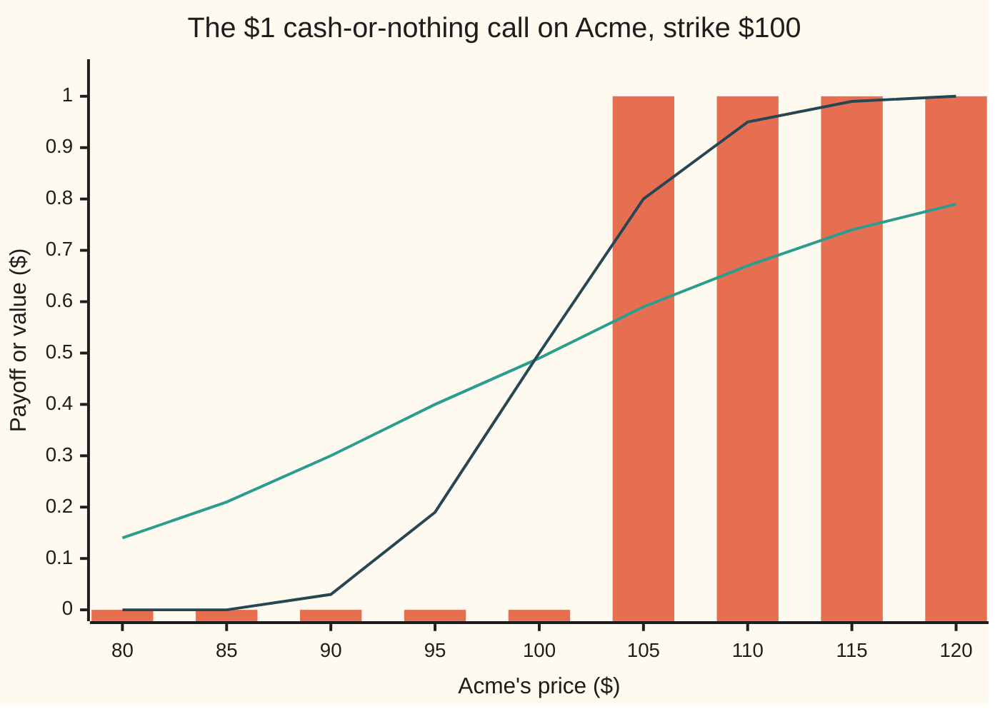

# Cash-or-nothing digital: one dollar if the share finishes above the line

Financial mathematics → Digitals and the implied density → Binary payoffs → Cash-or-nothing digital

---

## General Overview

Acme shares trade at $100 today. A contract says: one year from today, if Acme closes above $100, the holder is paid exactly $1. If Acme closes at or below $100, the holder is paid nothing. Acme at $100.01 pays the dollar. Acme at $300 pays the same dollar. Acme at $99.99 pays nothing.

Think of it as a line drawn across the chart at $100, and a bet on which side of the line the share finishes. From here on it is called a **cash-or-nothing digital**: "digital" because the payoff has two values, like a bit, and "cash" because what it pays is a fixed sum of money. The $100 line is the **strike**. The bet that pays below the line is the **cash-or-nothing put**, and the one above is the **call**.

In the house market (Acme at $100, interest 5 percent a year, dividends 2 percent, volatility 20 percent, one year) the call costs **$0.494581** and the put costs **$0.456648**. The two add to **$0.951229**, which is exactly what a dollar due in one year is worth today. That sum is the first clue: owning both bets guarantees the dollar, so together they must cost what a guaranteed dollar costs.

The price is also a probability in disguise. Divide the call's price by that discount and out comes **0.519939**: the market's priced-in chance, in a precise sense this card pins down, that Acme finishes above $100.

**A cash-or-nothing digital is worth the chance that the share finishes past the strike, counted in the pretend world where everything grows at the bank rate, times what a dollar paid on that day is worth today.**

**What kind of fact this is:** a model — Acme's price is *taken* to wander in the Black–Scholes way, an assumption, not a law — and inside it a theorem, proved on this card in Why it works. The rule that call plus put equals the discount factor is model-free: it holds whatever the share does.

### The picture: what it pays, and what it is worth before then



The bars are the payoff on expiry day: nothing at or below $100, one dollar above. The gentle curve is the contract's value with twelve months left, plotted against Acme's price that day. The steep curve is its value with one month left. As expiry nears, the curve squeezes onto the step, and all the change happens in a narrow band around the strike. That squeeze is the trouble a seller faces, taken up on [digital-greeks-and-pin-risk](03-digital-greeks-and-pin-risk.md).

---

## The formula

$$\text{call} = e^{-rT}\,N(d_2), \qquad \text{put} = e^{-rT}\,N(-d_2), \qquad d_2 = \frac{\ln(S/K) + (r - q - \tfrac12\sigma^2)\,T}{\sigma\sqrt{T}}$$

**Read it aloud: the chance the share finishes above the strike in the pretend world, times what a dollar on expiry day is worth today; the put swaps "above" for "below".**

| Symbol | Plain meaning | In our example | Push it up and the call digital… |
| --- | --- | --- | --- |
| $S$ | Acme's price today | $100 | rises: the share starts further past the line |
| $S_T$ | Acme's price on expiry day, unknown today | — | — |
| $K$ | the strike: the line the share must finish above | $100 | falls: a higher line is harder to clear |
| $T$ | time to expiry, in years | 1 | at this strike it barely moves: see theta below |
| $r$ | the riskless rate, continuously compounded | 5% | mostly rises here: the drift lifts the chance more than the heavier discount takes away |
| $q$ | Acme's dividend yield | 2% | falls: dividends leak out of the price, so it drifts up less |
| $\sigma$ | volatility: how jumpy Acme is, per year | 20% | falls at this strike: more jumpiness drags the typical finish down |
| $Z$ | a standard bell-curve draw: average 0, spread 1 | — | — |
| $N(x)$ | the area under the standard bell curve to the left of $x$: a chance between 0 and 1 | $N(0.05) = 0.519939$ | — |
| $\varphi(x)$ | the bell curve's height at $x$ | — | — |
| $d_2$, $d_1$ | how far the typical finish sits past the strike, in units of $\sigma\sqrt{T}$; $d_1 = d_2 + \sigma\sqrt{T}$ | 0.05 and 0.25 | — |
| $e^{-rT}$, $D(T)$ | the discount factor: today's worth of $1 due at $T$ | 0.951229 | — |

The helper $d_2$ is the pilot card's: its top line is where Acme's logarithm is headed in the pretend world, measured from the strike, and its bottom line, $\sigma\sqrt{T}$, is the spread of that journey. $d_1$ appears only in the Greeks and in the asset-or-nothing sibling. Here it is one spread-unit further along.

**The Greeks** (how the price moves when one input is nudged, each by its own formula and checked by nudging the price in the code):

| Greek | What it measures | Formula | House value |
| --- | --- | --- | --- |
| delta | change per $1 rise in Acme | $e^{-rT}\varphi(d_2)/(S\sigma\sqrt{T})$ | 0.018951 |
| gamma | change in delta per $1 rise | $-e^{-rT}\varphi(d_2)\,d_1/(S^2\sigma^2 T)$ | −0.000237 |
| vega | change per 1.00 of volatility | $-e^{-rT}\varphi(d_2)\,d_1/\sigma$ | −0.473764 |
| theta | change per year of passing time | $r\,\text{call} - e^{-rT}\varphi(d_2)\,\partial d_2/\partial T$ | 0.015254 |
| rho | change per 1.00 of rate | $-T\,\text{call} + e^{-rT}\varphi(d_2)\sqrt{T}/\sigma$ | 1.400477 |

Here $\partial d_2/\partial T = \big((r - q - \tfrac12\sigma^2)T - \ln(S/K)\big) / (2\sigma T^{3/2})$: how fast $d_2$ changes as the time to expiry grows. Delta is nearly two cents per dollar of Acme at the money. Vega and gamma are negative here, the opposite sign to an ordinary call: an ordinary call gains from a wider spread of outcomes, but this contract's payoff stops growing at $1, so a wider spread only drags the typical finish down. Why the Greeks behave this way, and how they explode near expiry, is [digital-greeks-and-pin-risk](03-digital-greeks-and-pin-risk.md).

### When it holds

- **Acme's price follows the Black–Scholes model: logarithm bell-shaped, one fixed volatility.** Real markets quote a different volatility at each strike (the skew). A digital is the product the skew moves most; the correction term is on [digital-from-a-call-spread-and-the-skew-term](04-digital-from-a-call-spread-and-the-skew-term.md). Price with one volatility in a skewed market and the answer is off by that term.
- **No jumps.** A share that can gap overnight puts real weight in the tails the bell curve thins out, and the chance above the line moves with it.
- **A single riskless rate to expiry.** With a curve of rates, replace $e^{-rT}$ by the discount factor $D(T)$ read off the curve for the payment date.
- **Paid on expiry day, judged on the closing price only.** A contract paying the moment the line is first touched is a different product, [one-touch-and-no-touch](../16-Barriers%2C%20touches%20and%20lookbacks/05-one-touch-and-no-touch.md), and costs more.
- **A hedge that can be adjusted continuously.** The price is the cost of a copy made by trading. Near expiry, with Acme close to $100, the copy needs huge, fast trades, and the model price stops being a cost anyone can achieve.

---

## Why it works

### Step 0: a price is a discounted average, and the average of a yes-or-no is a chance

The pilot card [black-scholes-call](../08-The%20Black-Scholes%20call%20and%20put/01-black-scholes-call.md) showed that any payoff on Acme at expiry is priced by one recipe. Pretend every asset grows at the bank rate. Average the payoff over where Acme could end up in that pretend world, called the **risk-neutral** world. Discount the average back to today.

This contract pays 1 when Acme finishes above $100 and 0 otherwise. The average of a quantity that is 1 when something happens and 0 when it does not is the chance that it happens. So the price is the discount factor times one chance. The rest of the proof finds that chance.

### Step 1: where Acme can finish

In the risk-neutral world, Acme's logarithm on expiry day is bell-shaped ([normal-distribution](../../09-Probability%20and%20statistics/04-Continuous%20Distributions/04-normal-distribution.md)):

$$\ln S_T = \ln S + (r - q - \tfrac12\sigma^2)\,T + \sigma\sqrt{T}\,Z.$$

The middle term is the drift: bank rate, minus dividends, minus a volatility drag. For Acme it is 0.05 − 0.02 − 0.02 = 0.01. The last term is the random shove, with spread $\sigma\sqrt{T} = 0.20$.

The typical finish, the **median** (the price with half the outcomes above it and half below), is where the shove is zero: $S\,e^{(r-q-\frac12\sigma^2)T}$, which is $101.005017. That already says the chance above $100 is a little over one half.

### Step 2: the finish above the line is a bell-curve draw above a cut-off

Acme finishes above $K$ exactly when its logarithm finishes above $\ln K$. Put Step 1 into that inequality and solve for $Z$: the event is $Z > -d_2$. The bell curve is symmetric, so the chance of landing above $-d_2$ equals the chance of landing below $+d_2$, which is $N(d_2)$.

For Acme, $d_2 = 0.01 / 0.20 = 0.05$ and $N(0.05) = 0.519939$.

<details>
<summary>Detailed proof: the chance above the strike is N(d2)</summary>

Start from $S_T > K$. Logarithms keep order, so this is $\ln S_T > \ln K$. Substitute Step 1:
$$\ln S + (r - q - \tfrac12\sigma^2)T + \sigma\sqrt{T}\,Z > \ln K.$$
Move everything except the shove to the right and divide by $\sigma\sqrt{T}$, which is positive, so the inequality keeps its direction:
$$Z > \frac{\ln K - \ln S - (r - q - \tfrac12\sigma^2)T}{\sigma\sqrt{T}} = -d_2.$$
The chance that $Z > -d_2$ is the area under the bell curve to the right of $-d_2$. The bell curve is a mirror image of itself about zero, $\varphi(-x) = \varphi(x)$, so the area right of $-d_2$ equals the area left of $+d_2$, which is $N(d_2)$ by definition.

The same mirror gives the put. The chance that $Z < -d_2$ is $N(-d_2)$, and since the whole area is 1, $N(-d_2) = 1 - N(d_2)$. For Acme that is 0.480061.

Landing exactly on the strike has chance zero, because a bell curve puts no weight on a single point. So "above" and "at or above" price the same inside the model.

</details>

### Step 3: discount

The dollar arrives in a year. Today it is worth $e^{-rT} = 0.951229$. The call digital is

$$e^{-rT}N(d_2) = 0.951229 \times 0.519939 = 0.494581.$$

**$N(d_2)$ is the priced-in chance of exercise**, the same factor that sits in the cash half of the Black–Scholes call.

### Step 4: call plus put is one discounted dollar, with no model at all

Hold the call digital and the put digital together. On expiry day exactly one of them pays, whatever Acme does, so the pair pays $1 for certain. A certain dollar next year costs $e^{-rT}$ today, or free money appears. So

$$\text{call} + \text{put} = e^{-rT}.$$

No volatility, no bell curve, no drift entered that argument. The model version agrees: $e^{-rT}N(d_2) + e^{-rT}N(-d_2) = e^{-rT}$, because the two chances add to one. For Acme, 0.494581 + 0.456648 = 0.951229.

### Step 5: why the chance is not the real chance

The drift in Step 1 is the bank rate, not the rate investors expect Acme to grow at. That is not an error. The price comes from the cost of copying the contract with shares and cash, and the copy does not care where Acme is really headed. So $N(d_2)$ is a **priced-in chance**: the chance a pricing formula needs, not a forecast. If Acme is really expected to return 8 percent a year, dividends included, the real chance of finishing above $100 is 0.579260, and the price is still 0.494581.

### The other doors

Two other routes reach the same number. The call price falls as the strike rises, and the rate of fall is the digital: a tight spread of two calls, one struck just below $100 and one just above, pays a ramp that shrinks to this step. The code does it with strikes 99.99 and 100.01 and lands on 0.494581; the method, and what it adds when volatility depends on the strike, is [digital-from-a-call-spread-and-the-skew-term](04-digital-from-a-call-spread-and-the-skew-term.md). And the ordinary call is a share-paying digital minus $K$ cash-paying digitals: 58.685115 − 100 × 0.494581 = 9.227006, the pilot's price. The share-paying half is [asset-or-nothing-digital](02-asset-or-nothing-digital.md).

---

## Worked numbers, by hand

House market: $S = 100$, $K = 100$, $r = 5\%$, $q = 2\%$, $\sigma = 20\%$, $T = 1$ year.

| Step | Arithmetic | Value |
| --- | --- | --- |
| $\ln(S/K)$ | $\ln 1$ | 0 |
| drift, $r - q - \tfrac12\sigma^2$ | 0.05 − 0.02 − 0.02 | 0.01 |
| spread, $\sigma\sqrt{T}$ | 0.20 × 1 | 0.20 |
| $d_2$ | (0 + 0.01) / 0.20 | 0.05 |
| $N(d_2)$, chance above | bell-curve area left of 0.05 | 0.519939 |
| $N(-d_2)$, chance below | 1 − 0.519939 | 0.480061 |
| $e^{-rT}$ | $e^{-0.05}$ | 0.951229 |
| **call digital** | 0.951229 × 0.519939 | **0.494581** |
| **put digital** | 0.951229 × 0.480061 | **0.456648** |
| call + put | 0.494581 + 0.456648 | 0.951229 |

A contract paying $1 if Acme finishes above $100 costs about 49 cents. Paying $1,000 instead, it costs $494.58: the price scales with the payout.

### What breaks if you drop a piece

Correct call digital: 0.494581.

| Mistake | Comes out at | What went wrong |
| --- | --- | --- |
| Forget the discount | 0.519939 | A chance is not a price: the dollar comes in a year |
| Use $N(d_1)$ for $N(d_2)$ | 0.569507 | $N(d_1)$ belongs to the share-paying digital, not the cash one |
| Use the real-world chance, 8% return | 0.551009 | The price is the cost of a copy, not a forecast |
| Forget the 2% dividend | 0.532325 | Dividends leave the share price, so the drift is lower than the bank rate |
| Price the put as 1 − call | 0.505419 (right: 0.456648) | The pair sums to the discount factor, not to 1 |

The code prints every row.

---

## Code, from first principles, and it actually runs

The scripts reach the call digital by four roads. The formula uses a bell-curve area built by Simpson's rule (adding thin slices under the curve). The second road never mentions $d_2$: it adds up the risk-neutral density of Acme's price, the chance per dollar of finishing at each price, from $100 upward. The third is a 200,000-path Monte Carlo simulation ([monte-carlo-pricing](../06-Numerical%20Methods%20for%20Pricing/01-monte-carlo-pricing.md)) that counts the finishes above $100, driven by a whole-number recurrence both languages compute exactly. The fourth is a tight call spread. The put is priced separately, by the density summed below $100, and call plus put is checked against the discount factor. Each Greek is checked by nudging its input. Every number on the card, the chart points included, is printed.

### Python

```python
# Cash-or-nothing digital -- the check behind the card.  Nothing is imported
# that already knows the answer: the bell-curve area and both payoff integrals
# are Simpson's rule written out, the random numbers come from the whole-number
# recurrence below, turned into bell-curve draws by Box-Muller.
from math import cos, exp, log, pi, sin, sqrt

S, K, R, Q, SIG, T = 100.0, 100.0, 0.05, 0.02, 0.20, 1.0   # the house market
MU = 0.08                              # a real-world growth rate, for the mistake row
SEED, PATHS, MOD = 20260919, 200000, 1 << 32
HOUSE_CALL = 9.227005508154            # the Black-Scholes call card's price

def simpson(f, a, b, n):               # the integrator, written out here
    h = (b - a) / n
    total = f(a) + f(b)
    for i in range(1, n):
        total += (4.0 if i % 2 else 2.0) * f(a + i * h)
    return total * h / 3.0

def phi(x):                            # bell-curve height at x
    return exp(-0.5 * x * x) / sqrt(2.0 * pi)

def n_cdf(x):                          # bell-curve area to the left of x
    if x < -12.0:
        return 0.0
    if x > 12.0:
        return 1.0
    return 0.5 + simpson(phi, 0.0, x, 4000)

def d1d2(s, k, r, q, sig, t):
    d2 = (log(s / k) + (r - q - 0.5 * sig * sig) * t) / (sig * sqrt(t))
    return d2 + sig * sqrt(t), d2

def digital(s, k, r, q, sig, t):       # road 1: the formula, e^-rT N(d2)
    return exp(-r * t) * n_cdf(d1d2(s, k, r, q, sig, t)[1])

def by_density(s, k, r, q, sig, t, above):   # road 2: sum the price density past K
    m, v = log(s) + (r - q - 0.5 * sig * sig) * t, sig * sqrt(t)
    dens = lambda x: phi((log(x) - m) / v) / (x * v)   # chance per dollar at price x
    lo, hi = (k, exp(m + 12.0 * v)) if above else (exp(m - 12.0 * v), k)
    return exp(-r * t) * simpson(dens, lo, hi, 20000)

def by_simulation(n, seed):            # road 3: Monte Carlo, count the finishes above K
    state, hits, drift, v = seed, 0, (R - Q - 0.5 * SIG * SIG) * T, SIG * sqrt(T)
    for _ in range(n // 2):
        state = (1664525 * state + 1013904223) % MOD
        u = (state + 0.5) / MOD
        state = (1664525 * state + 1013904223) % MOD
        w = (state + 0.5) / MOD
        rad, ang = sqrt(-2.0 * log(u)), 2.0 * pi * w
        for z in (rad * cos(ang), rad * sin(ang)):
            hits += S * exp(drift + v * z) > K
    p = hits / n
    return hits, exp(-R * T) * p, exp(-R * T) * sqrt(p * (1.0 - p) / n)

def call(s, k, r, q, sig, t):          # the Black-Scholes call, for the cross-checks
    d1, d2 = d1d2(s, k, r, q, sig, t)
    return s * exp(-q * t) * n_cdf(d1) - k * exp(-r * t) * n_cdf(d2)

d1, d2 = d1d2(S, K, R, Q, SIG, T)
disc, cash = exp(-R * T), digital(S, K, R, Q, SIG, T)
put = disc * n_cdf(-d2)
cash_int, put_int = by_density(S, K, R, Q, SIG, T, True), by_density(S, K, R, Q, SIG, T, False)
hits, mc, se = by_simulation(PATHS, SEED)
hits_small, mc_small, se_small = by_simulation(2000, SEED)
spread = (call(S, K - 0.01, R, Q, SIG, T) - call(S, K + 0.01, R, Q, SIG, T)) / 0.02
asset = S * exp(-Q * T) * n_cdf(d1)
pdf = disc * phi(d2)                   # e^-rT times the bell height at d2, used by every Greek
greeks = [                              # name, closed form, bump of the formula
    ("delta", pdf / (S * SIG * sqrt(T)),
     (digital(S + 0.01, K, R, Q, SIG, T) - digital(S - 0.01, K, R, Q, SIG, T)) / 0.02),
    ("gamma", -pdf * d1 / (S * S * SIG * SIG * T),
     (digital(S + 0.01, K, R, Q, SIG, T) - 2 * cash + digital(S - 0.01, K, R, Q, SIG, T)) / 1e-4),
    ("vega, per 1.00 of vol", -pdf * d1 / SIG,
     (digital(S, K, R, Q, SIG + 1e-4, T) - digital(S, K, R, Q, SIG - 1e-4, T)) / 2e-4),
    ("theta, per year", R * cash - pdf * ((R - Q - 0.5 * SIG * SIG) * T - log(S / K)) / (2 * SIG * T ** 1.5),
     -(digital(S, K, R, Q, SIG, T + 1e-4) - digital(S, K, R, Q, SIG, T - 1e-4)) / 2e-4),
    ("rho, per 1.00 of rate", -T * cash + pdf * sqrt(T) / SIG,
     (digital(S, K, R + 1e-4, Q, SIG, T) - digital(S, K, R - 1e-4, Q, SIG, T)) / 2e-4),
]
rows = [
    ("drift  r - q - sigma^2/2", R - Q - 0.5 * SIG * SIG), ("spread  sigma sqrt(T)", SIG * sqrt(T)),
    ("d1", d1), ("d2", d2), ("median finish S e^((r-q-sigma^2/2)T)", S * exp((R - Q - 0.5 * SIG * SIG) * T)),
    ("N(d2)  chance of finishing above K", n_cdf(d2)), ("N(-d2)  chance of finishing below K", n_cdf(-d2)),
    ("real-world chance above K, growth 8%", n_cdf(d2 + (MU - R) * sqrt(T) / SIG)), ("discount factor e^-rT", disc),
    ("1 formula  e^-rT N(d2)", cash), ("2 Simpson over the price density", cash_int),
    ("3 Monte Carlo, 200000 paths", mc), ("  standard error", se), ("  paths finishing above K", hits),
    ("4 call spread, strikes 99.99 and 100.01", spread),
    ("put, formula  e^-rT N(-d2)", put), ("put, Simpson over the price density", put_int),
    ("  call + put", cash + put_int), ("  e^-rT", disc),
    ("cash half of the call, 100 x digital", K * cash), ("asset digital  S e^-qT N(d1)", asset),
    ("  asset - 100 x cash", asset - K * cash), ("  house call", HOUSE_CALL),
    ("wrong: no discount", n_cdf(d2)), ("wrong: N(d1) for N(d2)", disc * n_cdf(d1)),
    ("wrong: real-world chance, discounted", disc * n_cdf(d2 + (MU - R) * sqrt(T) / SIG)),
    ("wrong: forgot the 2% dividend", digital(S, K, R, 0.0, SIG, T)),
    ("wrong: put as 1 - call", 1.0 - cash),
    ("try: sigma = 0.40", digital(S, K, R, Q, 0.40, T)), ("try: K = 110", digital(S, 110.0, R, Q, SIG, T)),
    ("try: T = 0.01", digital(S, K, R, Q, SIG, 0.01)), ("try: pays $1000", 1000.0 * cash),
    ("try: Monte Carlo, 2000 paths", mc_small), ("  its standard error", se_small),
]
for name, v in rows:
    print(f"{name:<40} {v:>12.6f}" if isinstance(v, float) else f"{name:<40} {v:>12d}")
print()
print(f"{'greek':<24}{'formula':>12}{'bump':>12}")
for name, f, b in greeks:
    print(f"{name:<24}{f:>12.6f}{b:>12.6f}")
print()
spots = [80.0 + 5.0 * i for i in range(9)]
print("chart, Acme price     " + " ".join(f"{s:6.0f}" for s in spots))
print("chart, pays at expiry " + " ".join(f"{float(s > K):6.2f}" for s in spots))
for label, t in (("chart, 12 months left", 1.0), ("chart, 1 month left ", 1.0 / 12.0)):
    print(label + " " + " ".join(f"{digital(s, K, R, Q, SIG, t):6.2f}" for s in spots))

assert abs(cash_int - cash) < 1e-8,             "density integral must land on the formula"
assert abs(mc - cash) < 3 * se,                 "simulation within three standard errors"
assert abs(cash + put_int - disc) < 1e-8,       "call + independent put = one discounted dollar"
assert abs(put - put_int) < 1e-8,               "put formula lands on its density sum"
assert abs(spread - cash) < 1e-7,               "tight call spread lands on the digital"
assert abs(asset - K * cash - HOUSE_CALL) < 1e-9, "the two digitals rebuild the house call"
assert all(abs(f - b) < 1e-5 for _, f, b in greeks), "every Greek matches its bump"
print("ALL CHECKS PASS")
```

**Ran 2026-09-24 on macOS, Python 3.14.6, standard library only. All checks passed. Output, pasted from the run:**

```
drift  r - q - sigma^2/2                     0.010000
spread  sigma sqrt(T)                        0.200000
d1                                           0.250000
d2                                           0.050000
median finish S e^((r-q-sigma^2/2)T)       101.005017
N(d2)  chance of finishing above K           0.519939
N(-d2)  chance of finishing below K          0.480061
real-world chance above K, growth 8%         0.579260
discount factor e^-rT                        0.951229
1 formula  e^-rT N(d2)                       0.494581
2 Simpson over the price density             0.494581
3 Monte Carlo, 200000 paths                  0.494340
  standard error                             0.001063
  paths finishing above K                      103937
4 call spread, strikes 99.99 and 100.01      0.494581
put, formula  e^-rT N(-d2)                   0.456648
put, Simpson over the price density          0.456648
  call + put                                 0.951229
  e^-rT                                      0.951229
cash half of the call, 100 x digital        49.458109
asset digital  S e^-qT N(d1)                58.685115
  asset - 100 x cash                         9.227006
  house call                                 9.227006
wrong: no discount                           0.519939
wrong: N(d1) for N(d2)                       0.569507
wrong: real-world chance, discounted         0.551009
wrong: forgot the 2% dividend                0.532325
wrong: put as 1 - call                       0.505419
try: sigma = 0.40                            0.428302
try: K = 110                                 0.318522
try: T = 0.01                                0.501744
try: pays $1000                            494.581091
try: Monte Carlo, 2000 paths                 0.506530
  its standard error                         0.010613

greek                        formula        bump
delta                       0.018951    0.018951
gamma                      -0.000237   -0.000237
vega, per 1.00 of vol      -0.473764   -0.473765
theta, per year             0.015254    0.015254
rho, per 1.00 of rate       1.400477    1.400477

chart, Acme price         80     85     90     95    100    105    110    115    120
chart, pays at expiry   0.00   0.00   0.00   0.00   0.00   1.00   1.00   1.00   1.00
chart, 12 months left   0.14   0.21   0.30   0.40   0.49   0.59   0.67   0.74   0.79
chart, 1 month left    0.00   0.00   0.03   0.19   0.50   0.80   0.95   0.99   1.00
ALL CHECKS PASS
```

The simulation lands 103,937 of 200,000 paths above $100 and prices the digital at 0.494340, within one standard error, 0.001063, of the formula. The density sum and the call spread agree with the formula to six decimals. The Greeks agree with their nudges; vega differs in the sixth decimal because a nudge is not a true slope.

### Rust

Same roads, same labels, built with `rustc --edition 2021 -O`.

```rust
// Cash-or-nothing digital -- the same check as the Python, in Rust.  No crates.
// The bell-curve area and both payoff integrals are Simpson's rule written out,
// the random numbers come from the same whole-number recurrence, turned into
// bell-curve draws by Box-Muller.
use std::f64::consts::PI;

const S: f64 = 100.0; const K: f64 = 100.0; const R: f64 = 0.05;   // the house market
const Q: f64 = 0.02; const SIG: f64 = 0.20; const T: f64 = 1.0;
const MU: f64 = 0.08;                   // a real-world growth rate, for the mistake row
const SEED: u64 = 20260919; const PATHS: usize = 200000; const MOD: u64 = 1 << 32;
const HOUSE_CALL: f64 = 9.227005508154; // the Black-Scholes call card's price

fn simpson<F: Fn(f64) -> f64>(f: F, a: f64, b: f64, n: usize) -> f64 {   // the integrator
    let h = (b - a) / n as f64;
    let mut total = f(a) + f(b);
    for i in 1..n { total += if i % 2 == 1 { 4.0 } else { 2.0 } * f(a + i as f64 * h); }
    total * h / 3.0
}

fn phi(x: f64) -> f64 { (-0.5 * x * x).exp() / (2.0 * PI).sqrt() }     // bell-curve height

fn n_cdf(x: f64) -> f64 {                                               // area left of x
    if x < -12.0 { return 0.0; }
    if x > 12.0 { return 1.0; }
    0.5 + simpson(phi, 0.0, x, 4000)
}

fn d1d2(s: f64, k: f64, r: f64, q: f64, sig: f64, t: f64) -> (f64, f64) {
    let d2 = ((s / k).ln() + (r - q - 0.5 * sig * sig) * t) / (sig * t.sqrt());
    (d2 + sig * t.sqrt(), d2)
}

fn digital(s: f64, k: f64, r: f64, q: f64, sig: f64, t: f64) -> f64 {  // road 1: e^-rT N(d2)
    (-r * t).exp() * n_cdf(d1d2(s, k, r, q, sig, t).1)
}

fn by_density(above: bool) -> f64 {                     // road 2: sum the price density past K
    let (m, v) = (S.ln() + (R - Q - 0.5 * SIG * SIG) * T, SIG * T.sqrt());
    let dens = |x: f64| phi((x.ln() - m) / v) / (x * v);   // chance per dollar at price x
    let (lo, hi) = if above { (K, (m + 12.0 * v).exp()) } else { ((m - 12.0 * v).exp(), K) };
    (-R * T).exp() * simpson(dens, lo, hi, 20000)
}

fn by_simulation(n: usize, seed: u64) -> (usize, f64, f64) {   // road 3: Monte Carlo
    let (mut state, mut hits) = (seed, 0usize);
    let (drift, v) = ((R - Q - 0.5 * SIG * SIG) * T, SIG * T.sqrt());
    for _ in 0..n / 2 {
        state = (1664525 * state + 1013904223) % MOD;
        let u = (state as f64 + 0.5) / MOD as f64;
        state = (1664525 * state + 1013904223) % MOD;
        let w = (state as f64 + 0.5) / MOD as f64;
        let (rad, ang) = ((-2.0 * u.ln()).sqrt(), 2.0 * PI * w);
        for z in [rad * ang.cos(), rad * ang.sin()] {
            if S * (drift + v * z).exp() > K { hits += 1; }
        }
    }
    let p = hits as f64 / n as f64;
    (hits, (-R * T).exp() * p, (-R * T).exp() * (p * (1.0 - p) / n as f64).sqrt())
}

fn call(s: f64, k: f64, r: f64, q: f64, sig: f64, t: f64) -> f64 {    // for the cross-checks
    let (d1, d2) = d1d2(s, k, r, q, sig, t);
    s * (-q * t).exp() * n_cdf(d1) - k * (-r * t).exp() * n_cdf(d2)
}

fn main() {
    let (d1, d2) = d1d2(S, K, R, Q, SIG, T);
    let (disc, cash) = ((-R * T).exp(), digital(S, K, R, Q, SIG, T));
    let put = disc * n_cdf(-d2);
    let (cash_int, put_int) = (by_density(true), by_density(false));
    let (hits, mc, se) = by_simulation(PATHS, SEED);
    let (_, mc_small, se_small) = by_simulation(2000, SEED);
    let spread = (call(S, K - 0.01, R, Q, SIG, T) - call(S, K + 0.01, R, Q, SIG, T)) / 0.02;
    let asset = S * (-Q * T).exp() * n_cdf(d1);
    let pdf = disc * phi(d2);           // e^-rT times the bell height at d2, used by every Greek
    let dg = |s: f64, r: f64, sig: f64, t: f64| digital(s, K, r, Q, sig, t);
    let greeks: Vec<(&str, f64, f64)> = vec![   // name, closed form, bump of the formula
        ("delta", pdf / (S * SIG * T.sqrt()),
         (dg(S + 0.01, R, SIG, T) - dg(S - 0.01, R, SIG, T)) / 0.02),
        ("gamma", -pdf * d1 / (S * S * SIG * SIG * T),
         (dg(S + 0.01, R, SIG, T) - 2.0 * cash + dg(S - 0.01, R, SIG, T)) / 1e-4),
        ("vega, per 1.00 of vol", -pdf * d1 / SIG,
         (dg(S, R, SIG + 1e-4, T) - dg(S, R, SIG - 1e-4, T)) / 2e-4),
        ("theta, per year", R * cash - pdf * ((R - Q - 0.5 * SIG * SIG) * T - (S / K).ln()) / (2.0 * SIG * T.powf(1.5)),
         -(dg(S, R, SIG, T + 1e-4) - dg(S, R, SIG, T - 1e-4)) / 2e-4),
        ("rho, per 1.00 of rate", -T * cash + pdf * T.sqrt() / SIG,
         (dg(S, R + 1e-4, SIG, T) - dg(S, R - 1e-4, SIG, T)) / 2e-4),
    ];
    let rows: Vec<(&str, f64)> = vec![
        ("drift  r - q - sigma^2/2", R - Q - 0.5 * SIG * SIG), ("spread  sigma sqrt(T)", SIG * T.sqrt()),
        ("d1", d1), ("d2", d2), ("median finish S e^((r-q-sigma^2/2)T)", S * ((R - Q - 0.5 * SIG * SIG) * T).exp()),
        ("N(d2)  chance of finishing above K", n_cdf(d2)), ("N(-d2)  chance of finishing below K", n_cdf(-d2)),
        ("real-world chance above K, growth 8%", n_cdf(d2 + (MU - R) * T.sqrt() / SIG)), ("discount factor e^-rT", disc),
        ("1 formula  e^-rT N(d2)", cash), ("2 Simpson over the price density", cash_int),
        ("3 Monte Carlo, 200000 paths", mc), ("  standard error", se),
    ];
    for (name, v) in &rows { println!("{:<40} {:>12.6}", name, v); }
    println!("{:<40} {:>12}", "  paths finishing above K", hits);
    let rows: Vec<(&str, f64)> = vec![
        ("4 call spread, strikes 99.99 and 100.01", spread),
        ("put, formula  e^-rT N(-d2)", put), ("put, Simpson over the price density", put_int),
        ("  call + put", cash + put_int), ("  e^-rT", disc),
        ("cash half of the call, 100 x digital", K * cash), ("asset digital  S e^-qT N(d1)", asset),
        ("  asset - 100 x cash", asset - K * cash), ("  house call", HOUSE_CALL),
        ("wrong: no discount", n_cdf(d2)), ("wrong: N(d1) for N(d2)", disc * n_cdf(d1)),
        ("wrong: real-world chance, discounted", disc * n_cdf(d2 + (MU - R) * T.sqrt() / SIG)),
        ("wrong: forgot the 2% dividend", digital(S, K, R, 0.0, SIG, T)),
        ("wrong: put as 1 - call", 1.0 - cash),
        ("try: sigma = 0.40", dg(S, R, 0.40, T)), ("try: K = 110", digital(S, 110.0, R, Q, SIG, T)),
        ("try: T = 0.01", dg(S, R, SIG, 0.01)), ("try: pays $1000", 1000.0 * cash),
        ("try: Monte Carlo, 2000 paths", mc_small), ("  its standard error", se_small),
    ];
    for (name, v) in &rows { println!("{:<40} {:>12.6}", name, v); }
    println!();
    println!("{:<24}{:>12}{:>12}", "greek", "formula", "bump");
    for (name, f, b) in &greeks { println!("{:<24}{:>12.6}{:>12.6}", name, f, b); }
    println!();
    let spots: Vec<f64> = (0..9).map(|i| 80.0 + 5.0 * i as f64).collect();
    let join = |v: Vec<String>| v.join(" ");
    println!("chart, Acme price     {}", join(spots.iter().map(|s| format!("{:6.0}", s)).collect()));
    println!("chart, pays at expiry {}", join(spots.iter().map(|&s| format!("{:6.2}", if s > K { 1.0 } else { 0.0 })).collect()));
    for (label, t) in [("chart, 12 months left", 1.0), ("chart, 1 month left ", 1.0 / 12.0)] {
        println!("{} {}", label, join(spots.iter().map(|&s| format!("{:6.2}", dg(s, R, SIG, t))).collect()));
    }

    assert!((cash_int - cash).abs() < 1e-8, "density integral must land on the formula");
    assert!((mc - cash).abs() < 3.0 * se, "simulation within three standard errors");
    assert!((cash + put_int - disc).abs() < 1e-8, "call + independent put = one discounted dollar");
    assert!((put - put_int).abs() < 1e-8, "put formula lands on its density sum");
    assert!((spread - cash).abs() < 1e-7, "tight call spread lands on the digital");
    assert!((asset - K * cash - HOUSE_CALL).abs() < 1e-9, "the two digitals rebuild the house call");
    assert!(greeks.iter().all(|(_, f, b)| (f - b).abs() < 1e-5), "every Greek matches its bump");
    println!("ALL CHECKS PASS");
}
```

**Ran 2026-09-24 on macOS, rustc 1.98.1, no crates. All checks passed. Output, pasted from the run:**

```
drift  r - q - sigma^2/2                     0.010000
spread  sigma sqrt(T)                        0.200000
d1                                           0.250000
d2                                           0.050000
median finish S e^((r-q-sigma^2/2)T)       101.005017
N(d2)  chance of finishing above K           0.519939
N(-d2)  chance of finishing below K          0.480061
real-world chance above K, growth 8%         0.579260
discount factor e^-rT                        0.951229
1 formula  e^-rT N(d2)                       0.494581
2 Simpson over the price density             0.494581
3 Monte Carlo, 200000 paths                  0.494340
  standard error                             0.001063
  paths finishing above K                      103937
4 call spread, strikes 99.99 and 100.01      0.494581
put, formula  e^-rT N(-d2)                   0.456648
put, Simpson over the price density          0.456648
  call + put                                 0.951229
  e^-rT                                      0.951229
cash half of the call, 100 x digital        49.458109
asset digital  S e^-qT N(d1)                58.685115
  asset - 100 x cash                         9.227006
  house call                                 9.227006
wrong: no discount                           0.519939
wrong: N(d1) for N(d2)                       0.569507
wrong: real-world chance, discounted         0.551009
wrong: forgot the 2% dividend                0.532325
wrong: put as 1 - call                       0.505419
try: sigma = 0.40                            0.428302
try: K = 110                                 0.318522
try: T = 0.01                                0.501744
try: pays $1000                            494.581091
try: Monte Carlo, 2000 paths                 0.506530
  its standard error                         0.010613

greek                        formula        bump
delta                       0.018951    0.018951
gamma                      -0.000237   -0.000237
vega, per 1.00 of vol      -0.473764   -0.473765
theta, per year             0.015254    0.015254
rho, per 1.00 of rate       1.400477    1.400477

chart, Acme price         80     85     90     95    100    105    110    115    120
chart, pays at expiry   0.00   0.00   0.00   0.00   0.00   1.00   1.00   1.00   1.00
chart, 12 months left   0.14   0.21   0.30   0.40   0.49   0.59   0.67   0.74   0.79
chart, 1 month left    0.00   0.00   0.03   0.19   0.50   0.80   0.95   0.99   1.00
ALL CHECKS PASS
```

The two outputs match line for line, the simulation included: the random numbers come from whole-number arithmetic that both languages do exactly.

> [!TIP]
> **Try changing**
> Guess the direction first, then read the answer off the `try:` rows.
> - **Double the volatility.** Set `SIG = 0.40`. The digital falls from 0.494581 to **0.428302**. More jumpiness drags the median finish below $100, and the payoff cannot grow past $1 to make up for it.
> - **Raise the line.** Set `K = 110`. The price drops to **0.318522**: Acme must now rise 10 percent.
> - **Run the clock down.** Set `T = 0.01`, a hundredth of a year. The price is **0.501744**: with almost no time left and Acme sitting on the line, it is close to a coin flip, lightly discounted.
> - **Starve the simulation.** Set `PATHS = 2000`. The estimate is **0.506530**, with standard error **0.010613**: a hundredth of the paths, about ten times the error.

---

## The usual mistake

> [!warning]
> **Reading 0.519939 as the chance that Acme really finishes above $100.** It is the chance in the pretend world where Acme grows at the bank rate less dividends. If investors expect an 8 percent return, the real chance is 0.579260. Discount that and the "price" is 0.551009, too dear: anyone could sell at that price, build the copy for 0.494581, and keep the difference. The digital's price reveals what the market charges for the bet, not what it forecasts.
>
> - **Forgetting the discount.** 0.519939 is a chance, not a price. The dollar is a year away, and the price is 0.494581.
> - **Swapping $d_2$ for $d_1$.** $e^{-rT}N(d_1)$ gives 0.569507. $N(d_1)$ belongs to the share-paying asset-or-nothing digital.
> - **Making the pair sum to 1.** Call and put sum to the discount factor, 0.951229. The put priced as 1 − 0.494581 comes out at 0.505419 against a true 0.456648.
> - **Trusting the model at the line near expiry.** Inside the model, landing exactly on $100 has chance zero. In a real contract a share pinned near the strike at the close decides the whole payout, and the wording "above" or "at or above" matters.

---

## Where you meet it in real life

- **The cash half of every call.** A call pays the share and hands over the strike when Acme finishes above $100. The handed-over cash is 100 cash digitals: 100 × 0.494581 = 49.458109, the cash half on [black-scholes-call](../08-The%20Black-Scholes%20call%20and%20put/01-black-scholes-call.md).
- **Currency desks.** Digitals on exchange rates are among the most traded exotic options; the rate pair, the payout currency and the quoting conventions are on [fx-digitals](../23-FX%20exotics%20as%20desks%20use%20them%20-%20digitals%2C%20touches%20and%20barriers/01-fx-digitals.md).
- **Structured notes.** A note that pays a fixed coupon only if an index ends above a level is a bond plus a strip of cash digitals: [structured-notes-in-outline](../32-Convexity%20and%20Exotics/06-structured-notes-in-outline.md).
- **Touch contracts.** Pay the dollar the first moment Acme touches the line, instead of at the close: [one-touch-and-no-touch](../16-Barriers%2C%20touches%20and%20lookbacks/05-one-touch-and-no-touch.md).
- **Reading the market's chances.** Digital prices across many strikes, divided by the discount, give the priced-in chance of finishing above each one. The change from one strike to the next is the priced-in density of Acme's price: [butterfly-and-the-implied-density](05-butterfly-and-the-implied-density.md).
- **Backing out volatility or strike.** A quoted digital price can be turned back into the volatility or strike that produces it: [digital-inverses-vol-and-strike](06-digital-inverses-vol-and-strike.md).

> **Say it back**
> A cash-or-nothing digital pays a fixed dollar if the share finishes above the strike, and nothing otherwise. Its price is the discount factor times the chance of finishing above, $e^{-rT}N(d_2)$, and the put is the same with $N(-d_2)$. Holding both guarantees the dollar, so they sum to the discount factor in any model. The chance inside is priced in, taken in a world where the share grows at the bank rate, and it is not a forecast. For Acme the call costs 0.494581 and the put 0.456648.

---

## What this builds on

- [black-scholes-call](../08-The%20Black-Scholes%20call%20and%20put/01-black-scholes-call.md): the pretend-world recipe, $d_2$, and the call split into a share half and a cash half; this card is the cash half sold alone.
- [normal-distribution](../../09-Probability%20and%20statistics/04-Continuous%20Distributions/04-normal-distribution.md): the bell curve, its area $N(x)$ and its mirror symmetry, which turns "above $-d_2$" into $N(d_2)$.
- [monte-carlo-pricing](../06-Numerical%20Methods%20for%20Pricing/01-monte-carlo-pricing.md): pricing by simulating many finishes and averaging the payoff, with an error bar; here the average is a count.

## Where this goes next

- [asset-or-nothing-digital](02-asset-or-nothing-digital.md): the share-paying twin, priced with $N(d_1)$, and the call rebuilt from the two.
- [digital-inverses-vol-and-strike](06-digital-inverses-vol-and-strike.md): the formula run backwards, with its existence and uniqueness cases.
- [one-touch-and-no-touch](../16-Barriers%2C%20touches%20and%20lookbacks/05-one-touch-and-no-touch.md): the dollar paid on touching the line, any time before expiry.
- [fx-digitals](../23-FX%20exotics%20as%20desks%20use%20them%20-%20digitals%2C%20touches%20and%20barriers/01-fx-digitals.md): the same contract on a currency pair, as desks quote it.
- [structured-notes-in-outline](../32-Convexity%20and%20Exotics/06-structured-notes-in-outline.md): digitals packaged inside notes sold to investors.

This card priced a payout of cash; what changes when the payout is the share itself, worth most in exactly the outcomes where it is paid, is [asset-or-nothing-digital](02-asset-or-nothing-digital.md).

---

## Sources

Verified 24 Sep 2026: every link below resolves to the publisher's page.

- Black, Fischer, and Myron Scholes. "The Pricing of Options and Corporate Liabilities." *Journal of Political Economy* 81, no. 3 (1973): 637–654. [doi:10.1086/260062](https://doi.org/10.1086/260062). The copying argument and the $N(d_2)$ term.
- Merton, Robert C. "Theory of Rational Option Pricing." *Bell Journal of Economics and Management Science* 4, no. 1 (1973): 141–183. [doi:10.2307/3003143](https://doi.org/10.2307/3003143). Adds the dividend yield used here.
- Breeden, Douglas T., and Robert H. Litzenberger. "Prices of State-Contingent Claims Implicit in Option Prices." *Journal of Business* 51, no. 4 (1978): 621–651. [doi:10.1086/296025](https://doi.org/10.1086/296025). A payout above a level as the strike slope of call prices: the call-spread road.
- Hull, John C. *Options, Futures, and Other Derivatives*, 11th ed. Pearson. [Publisher page](https://www.pearson.com/en-us/subject-catalog/p/options-futures-and-other-derivatives/P200000005938). Binary options in the exotic-options chapter, with the cash-or-nothing formula.
- Shreve, Steven E. *Stochastic Calculus for Finance II: Continuous-Time Models*. Springer, 2004. [Publisher page](https://link.springer.com/book/9780387401010). The risk-neutral average done carefully, and why its chances are not real-world chances.
