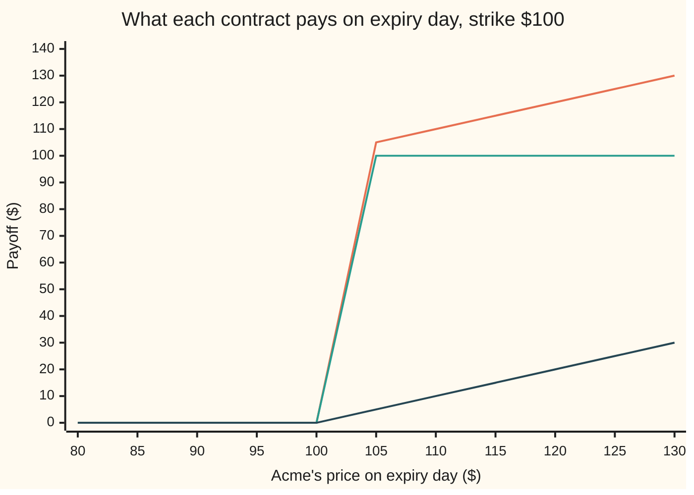
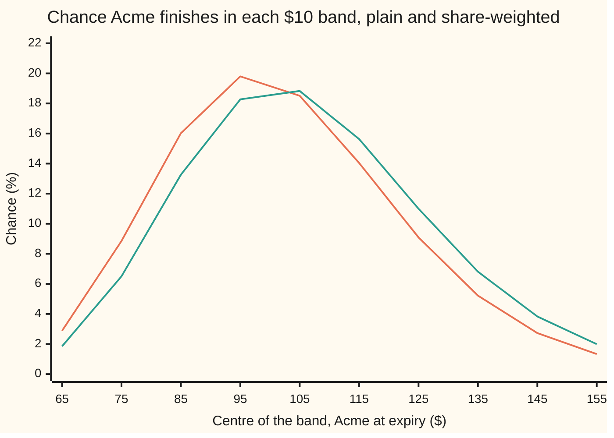

# Asset-or-nothing digital: the share itself if it finishes above the line, and why the call is two digitals

[Syllabus](../../../SYLLABUS.md) → [Financial mathematics](../../../SYLLABUS.md#w12) → [Digitals and the implied density](../../../SYLLABUS.md#w12-s10) → Asset-or-nothing digital

---

## General Overview

Acme shares trade at \$100 today. A contract written on them says: one year from today, if Acme closes above \$100, the holder is handed one Acme share. If it closes at or below \$100, the holder gets nothing.

The prize is the share at its price on that day, not today's \$100. Close at \$101 and the prize is worth \$101. Close at \$150 and it is worth \$150. Close at \$99 and there is no prize at all. This contract is an **asset-or-nothing digital**: "digital" because the switch has only two positions, on or off, and "asset" because what it hands over is the asset itself. The \$100 line is the **strike**, and the day of the test is **expiry**.

Its sibling pays a fixed \$1 instead of the share: the cash-or-nothing digital ([Cash-or-nothing digital](01-cash-or-nothing-digital.md)). In the house market that dollar bet costs \$0.494581. The share bet costs **\$58.69**.

Two facts come out of this card. First, the price is not "today's share times the chance of finishing above". That chance is 0.52, and the share bet is worth more than 52% of a share, because the shares it hands over are the expensive ones. Second, an ordinary call option is this contract minus 100 of the dollar bets: \$58.69 − 100 × \$0.49 = \$9.23, the call's price to the cent.

**An asset-or-nothing digital is worth today's share, less the dividends it will shed, times the chance of finishing above the strike counted with each future weighted by the share's value there; subtract the strike's worth of cash digitals and what remains is the ordinary call.**

**What kind of fact this is:** the price is a model: it takes Acme's price to wander with constant volatility, an assumption, not a law. The rebuild of the call from two digitals is a theorem that holds in any market without free money; both are proved on this card in Why it works.

### The picture: two digitals make a call

Acme's price on expiry day runs left to right. Each line is what one contract pays on that day.



Orange, top: the asset-or-nothing digital. Nothing up to \$100, then a jump to the share's full value, then a slope of one dollar per dollar. Green, middle: 100 cash digitals, a flat \$100 once Acme clears the line. Dark, bottom: the ordinary call, Acme's price minus \$100 when that is positive. At every price the bottom line is the top line minus the middle one. The chart samples every \$5, so the jump at \$100 is drawn as a steep ramp from \$100 to \$105.

---

## The formula

$$A = S\,e^{-qT}\,N(d_1)$$

**Read it aloud:** the price of the share bet is one share delivered at expiry, valued today, times the chance of finishing above the strike counted in shares.

The mirror contract pays the share if Acme finishes *below* the strike, and costs $S\,e^{-qT}\,N(-d_1)$. The call is rebuilt from the two kinds of digital:

$$C = \underbrace{S\,e^{-qT}N(d_1)}_{\text{asset digital}} \;-\; K \times \underbrace{e^{-rT}N(d_2)}_{\text{cash digital}}$$

| Symbol | Plain meaning | In our example | Push it up and the answer… |
| --- | --- | --- | --- |
| $A$ | price today of the asset-or-nothing call | \$58.69 | is the answer |
| $S$ | Acme's price today | \$100 | rises: the prize is dearer and more likely |
| $S_T$ | Acme's price at expiry, the prize's value when the switch is on | unknown today | — |
| $K$ | the strike, the line Acme must clear | \$100 | falls: harder to clear |
| $T$ | time to expiry, in years | 1 | rises here: $d_1$ grows with time faster than dividends drain the share; at long horizons the drain wins |
| $r$ | riskless rate, continuously compounded | 5% | rises: in the pretend world the share drifts up faster |
| $q$ | dividend yield, continuously compounded | 2% | falls: dividends leave the share before the prize is handed over |
| $\sigma$ | volatility, how jumpy Acme is per year; say "sigma" | 20% | falls here; rises once $\sigma$ passes $\sqrt{2(r-q)} \approx 24.5\%$, where $d_2$ crosses zero |
| $N(x)$, $\varphi(x)$ | bell-curve area to the left of $x$, and the curve's height at $x$ | — | — |
| $d_1$, $d_2$ | distance from strike, in wiggle units, counted in shares and in cash | 0.25 and 0.05 | — |
| $e^{-qT}$, $e^{-rT}$ | dividend drag, and the discount on a dollar due at $T$ | 0.980199 and 0.951229 | — |
| $F$ | the forward, $S\,e^{(r-q)T}$: the average share at expiry in the pretend world | \$103.05 | — |

The two distances, as on [Black–Scholes call](../08-The%20Black-Scholes%20call%20and%20put/01-black-scholes-call.md):

$$d_1 = \frac{\ln(S/K) + (r - q + \tfrac12\sigma^2)\,T}{\sigma\sqrt{T}}, \qquad d_2 = d_1 - \sigma\sqrt{T}$$

Here $\sigma\sqrt{T}$ is the standard deviation of Acme's log-price at expiry; the pilot calls it one wiggle unit. In words: $d_2$ counts how many wiggle units separate Acme's expected log-price from the strike, and $d_1$ adds one more wiggle unit. The extra unit is the whole difference between counting in shares and counting in cash.

### When it holds

- **Constant volatility, log-price on a bell curve.** Real markets price a smile: each strike carries its own volatility. Then the formula with the strike's volatility misprices the digital, and the market price is the call minus $K$ times the call's slope in the strike, a skew term included ([A digital from a call spread](04-digital-from-a-call-spread-and-the-skew-term.md)).
- **A steady dividend yield.** $e^{-qT}$ assumes dividends leak out continuously and are reinvested. Lumpy cash dividends need the share price less their present value in place of $S\,e^{-qT}$.
- **One look, at expiry.** The switch reads Acme once. A contract paying the share the moment Acme first touches the line is a different product at a higher price.
- **Delivery or its cash value.** Handing over the share or its closing price in cash costs the same. A finish exactly on \$100 has zero chance in the model, so "above" and "at or above" price the same.
- **The rebuild needs none of this.** Call equals asset digital minus $K$ cash digitals in any market without free money: the payoffs match in every future.

---

## Why it works

### Step 0: price is the average payoff in the pretend world, pulled back to today

Pricing uses the pretend world of the call card, the risk-neutral world ([The fundamental theorems](../05-Black-Scholes%20from%20the%20Ground%20Up/02-risk-neutral-measure-and-the-fundamental-theorems.md)): every asset, dividends included, grows at the riskless rate, so Acme's price drifts at $r - q$, and a price is the average payoff discounted by $e^{-rT}$. The payoff here is $S_T$ when the switch is on and 0 when it is off. The whole card turns on one fact: that payoff is a product of two things that move together, the switch and the share.

### Step 1: the average of a product is not the product of averages

Take the naive route first. The chance of finishing above \$100 in the pretend world is $N(d_2) = 0.519939$. The average share at expiry is the forward, $F = \$103.05$. Multiply and discount: 0.951229 × 0.519939 × 103.05 gives \$50.96. Wrong.

The error is in using the average share over *all* futures. The prize is only handed over in the futures above \$100, and those are the futures where the share is dear. Averaged only over the futures where the switch is on, the share is worth **\$118.66**, not \$103.05. So the price is

$$A = e^{-rT} \times (\text{chance above}) \times (\text{average share, given above}) = 0.951229 \times 0.519939 \times 118.66 = \$58.69.$$

The gap between \$50.96 and \$58.69 is the switch and the share moving together.

### Step 2: fold the dear shares into the chance

Split that same price a second way. Give each future a weight: the share's value there divided by its average, $S_T / F$. The weights average to exactly 1, since the average of $S_T$ is $F$. So they reweight the pretend world's chances into a new set of chances that still add up to 1. This new set counts each future in proportion to what a share is worth in it. It is the **share-weighted chance**, and the change-of-numeraire card calls it the share measure ([Change of numeraire](../../11-Stochastic%20processes%20and%20calculus/07-Changing%20Measure/05-change-of-numeraire.md)).

The price then reads

$$A = e^{-rT}\,F \times (\text{share-weighted chance of finishing above}).$$

And $e^{-rT}F = S\,e^{(r-q)T}e^{-rT} = S\,e^{-qT}$: one share delivered at expiry, valued today. That $e^{-qT}$ is the fraction of a share to buy now so that, with dividends reinvested, it grows into exactly one share by expiry. The formula has taken shape: $A = S\,e^{-qT}\times$ a chance.

Why must the share-weighted chance exceed the plain one? The weight $S_T/F$ rises with Acme's price: below 1 in low futures, above 1 in high ones. Reweighting moves chance from low futures to high ones, so the chance of finishing above any line can only rise. The ratio of the two chances is the ratio in Step 1: 118.66 / 103.05 = 1.151494, and 0.598706 / 0.519939 = 1.151494.

### Step 3: reweighting slides the bell curve one wiggle unit to the right

In the pretend world, Acme's log-price at expiry sits on a bell curve. Its centre is $\ln S + (r - q - \tfrac12\sigma^2)T$ and its spread is $\sigma\sqrt{T}$. Multiplying the curve by the share's value, which grows like $e^{\sigma\sqrt{T}\,z}$ for a draw $z$ wiggle units from the centre, gives back a bell curve of the same shape moved right by exactly $\sigma\sqrt{T}$. Same event, shifted curve: the chance of clearing the strike rises from $N(d_2)$ to $N(d_2 + \sigma\sqrt{T}) = N(d_1)$.

So $A = S\,e^{-qT}N(d_1) = 0.980199 \times 100 \times 0.598706 = \$58.69$.

<details>
<summary>Detailed proof: the share-weighted chance is $N(d_1)$</summary>

Write Acme at expiry as $S_T = S\,e^{m + vz}$ with $m = (r - q - \tfrac12\sigma^2)T$, $v = \sigma\sqrt{T}$, and $z$ a standard bell-curve draw with height $\varphi(z) = e^{-z^2/2}/\sqrt{2\pi}$. Acme finishes above $K$ exactly when $z > (\ln(K/S) - m)/v$, and that cut-off equals $-d_2$.

The price is $e^{-rT}\int_{-d_2}^{\infty} S\,e^{m+vz}\,\varphi(z)\,dz$. Complete the square in the exponent:
$$vz - \tfrac12 z^2 = \tfrac12 v^2 - \tfrac12 (z - v)^2 .$$
So $e^{vz}\varphi(z) = e^{v^2/2}\,\varphi(z - v)$: the same bell curve, centred one wiggle unit to the right. The constants collect as $e^{-rT}\,S\,e^{m + v^2/2} = S\,e^{-rT}e^{(r-q)T} = S\,e^{-qT}$, because $m + \tfrac12 v^2 = (r-q)T$. What is left is $\int_{-d_2}^{\infty}\varphi(z - v)\,dz$. Substitute $u = z - v$: the lower limit becomes $-d_2 - v = -d_1$, and $\int_{-d_1}^{\infty}\varphi(u)\,du = N(d_1)$ by the curve's symmetry. Hence $A = S\,e^{-qT}N(d_1)$.

The same computation with the constant $e^{v^2/2}$ divided out is the share-weighted chance itself: the weight $S_T/F$ equals $e^{vz - v^2/2}$, and the integral above $-d_2$ of $e^{vz - v^2/2}\varphi(z)$ is $N(d_1)$. The put's range is $z < -d_2$, which gives $N(-d_1)$.

</details>

### Step 4: the call is two digitals, in every market

The call pays $\max(S_T - K, 0)$. In every future:

- Acme above $K$: the call pays $S_T - K$. The asset digital pays $S_T$ and $K$ cash digitals pay $K$. The difference is $S_T - K$.
- Acme at or below $K$: all three pay nothing.

Two portfolios with the same payoff in every future must cost the same today, or selling the dear one and buying the cheap one is free money. So $C = A - K \times (\text{cash digital})$ with no assumption about how Acme moves: 58.685115 − 100 × 0.494581 = \$9.23, the house call.

Put the Black-Scholes prices of the two digitals into this and the call formula appears term by term. That is where the call's two halves come from: the share half *is* an asset digital, the cash half *is* $K$ cash digitals.

### Step 5: the put side, and the prepaid share

The two asset digitals, above and below \$100, together always hand over one share. A share delivered for certain at expiry costs $S\,e^{-qT}$ today. So the asset put costs 98.02 − 58.69 = \$39.33, and $N(d_1) + N(-d_1) = 1$ says the same thing in the formula. The same argument on cash gives cash call plus cash put $= e^{-rT} = 0.951229$. And the ordinary put, which pays $K - S_T$ below the line, is $K$ cash puts minus one asset put: 100 × 0.456648 − 39.33 = \$6.33.

A second road runs through the call alone. The call's slope in the strike is minus the cash digital, so $A = C - K \times (\text{slope of } C \text{ in } K)$. A tight call spread measures that slope in the market ([A digital from a call spread](04-digital-from-a-call-spread-and-the-skew-term.md)). The code takes it as road 3.

---

## Worked numbers, by hand

Acme: $S = 100$, $K = 100$, $r = 5\%$, $q = 2\%$, $\sigma = 20\%$, $T = 1$ year.

| Step | Arithmetic | Value |
| --- | --- | --- |
| $d_1$ | $(\ln 1 + (0.05 - 0.02 + 0.02) \times 1) / 0.20$ | 0.25 |
| $d_2$ | 0.25 − 0.20 | 0.05 |
| $N(d_1)$, chance counted in shares | bell-curve table | 0.598706 |
| $N(d_2)$, chance counted in cash | bell-curve table | 0.519939 |
| $e^{-qT}$ | $e^{-0.02}$ | 0.980199 |
| prepaid share, $S\,e^{-qT}$ | 100 × 0.980199 | \$98.02 |
| **asset call** | 98.02 × 0.598706 | **\$58.69** |
| asset put | 98.02 × (1 − 0.598706) | \$39.33 |
| 100 cash digitals | 100 × 0.951229 × 0.519939 | \$49.46 |
| **the call, rebuilt** | 58.69 − 49.46 | **\$9.23** |

A contract that hands over one Acme share if Acme beats \$100 in a year costs \$58.69 today, although the plain chance of being paid is only 0.519939.

### The two chances, band by band

Where does the extra weight go? Split Acme's price at expiry into \$10 bands. For each band the code computes two chances: the plain one, and the share-weighted one.



Orange: the plain chance in the pretend world. Green: the share-weighted chance. Every band below \$100 loses weight and every band above gains it. The \$95 band falls from 19.80% to 18.27%; the \$125 band rises from 9.09% to 11.00%. Over all prices above \$100, the plain chance totals 0.519939 and the share-weighted chance 0.598706.

### The Greeks at the house point

| Greek | What it measures | Formula | Asset call | Asset put |
| --- | --- | --- | --- | --- |
| delta | dollars gained per \$1 rise in Acme | $e^{-qT}\big(N(d_1) + \varphi(d_1)/(\sigma\sqrt{T})\big)$ | 2.481909 | −1.501710 |
| vega | dollars per 1.00 rise in volatility | $-S\,e^{-qT}\varphi(d_1)\,d_2/\sigma$ | −9.475289 | +9.475289 |

Delta above 1 looks strange: the contract gains \$2.48 for a \$1 move in a share it only might deliver. Two effects add. The share itself moves, which accounts for $e^{-qT}N(d_1) = 0.586851$ of it. The chance of receiving a prize worth about \$100 also rises, and that is the rest. The put's delta follows from Step 5: the two deltas add to $e^{-qT}$. Vega is small and negative here, −0.094753 per volatility point, because $d_2$ is just above zero; it changes sign where $d_2$ does. The code confirms both by nudging the price. How these grow near expiry is [Digital Greeks and pin risk](03-digital-greeks-and-pin-risk.md).

### What breaks if you drop a piece

Right answer: \$58.69.

| Mistake | Comes out at | What went wrong |
| --- | --- | --- |
| $N(d_2)$ in place of $N(d_1)$ | \$50.96 | Plain chance times the average share: the dear shares are counted at the average price |
| No $e^{-qT}$ | \$59.87 | Charges for dividends the holder never receives |
| Today's $S$ times one cash digital | \$49.46 | Pays \$100 flat where the contract pays the share at expiry |
| $e^{-rT}$ in place of $e^{-qT}$ | \$56.95 | Discounts a share as if it were cash; the share grows at $r - q$ and the two rates cancel to $q$ |
| Call rebuilt as asset minus one cash digital | \$58.19 | Dropped the $K$: the call hands over \$100, not \$1 |

Every number in the table is printed by both checks.

---

## Code, from first principles, and it actually runs

The scripts reach the \$58.69 by **four independent roads**: the formula; a brute-force average of the payoff over the bell curve by Simpson's rule, with no $d_1$ in sight; the call minus $K$ times its slope in the strike; and a simulation of 400,000 expiry prices from a random-number generator written out in the code. Then the asset put is priced by its own integral, the two asset digitals are checked to make the prepaid share, the call and the put are rebuilt from digitals and matched to the house values, the two chances are recomputed as integrals, and delta and vega are checked by nudging. Python builds the bell-curve area from a power series; Rust adds up thin slices under the curve. Nothing imported knows the answer.

### Python

```python
# Asset-or-nothing digital -- the check behind the card.  Standard library only.
# Nothing imported knows the answer: the bell-curve area is a power series written
# out, the integrals are Simpson's rule, the random numbers are a xorshift generator.
from math import exp, log, sqrt, pi, cos

def phi(x): return exp(-0.5 * x * x) / sqrt(2.0 * pi)      # bell-curve height at x

def N(x):                                                    # area left of x: 1/2 + phi(x)(x + x^3/3 + x^5/15 + ...)
    if abs(x) > 9.0: return 0.0 if x < 0 else 1.0
    term, total, k = x, x, 1
    while abs(term) > 1e-17 * abs(total):
        term *= x * x / (2 * k + 1); total += term; k += 1
    return 0.5 + phi(x) * total

def d1d2(S, K, r, q, sig, T):
    vt = sig * sqrt(T)
    d1 = (log(S / K) + (r - q + 0.5 * sig * sig) * T) / vt
    return d1, d1 - vt

def aon(S, K, r, q, sig, T, put=False):                     # road 1: the formula
    d1, _ = d1d2(S, K, r, q, sig, T)
    return S * exp(-q * T) * N(-d1 if put else d1)

def con(S, K, r, q, sig, T, put=False):                     # cash digital, one dollar
    _, d2 = d1d2(S, K, r, q, sig, T)
    return exp(-r * T) * N(-d2 if put else d2)

def call(S, K, r, q, sig, T):
    d1, d2 = d1d2(S, K, r, q, sig, T)
    return S * exp(-q * T) * N(d1) - K * exp(-r * T) * N(d2)

def simpson(f, a, b, n=20000):
    h = (b - a) / n
    s = f(a) + f(b)
    for i in range(1, n): s += (4 if i % 2 else 2) * f(a + i * h)
    return s * h / 3.0

S, K, r, q, sig, T = 100.0, 100.0, 0.05, 0.02, 0.20, 1.0
mu, vt = (r - q - 0.5 * sig * sig) * T, sig * sqrt(T)
ST = lambda z: S * exp(mu + vt * z)                          # Acme at expiry, z wiggle-units from the centre
zK = (log(K / S) - mu) / vt                                  # Acme finishes above K exactly when z > zK
d1, d2 = d1d2(S, K, r, q, sig, T)
A, Ap = aon(S, K, r, q, sig, T), aon(S, K, r, q, sig, T, True)
B, Bp = con(S, K, r, q, sig, T), con(S, K, r, q, sig, T, True)
# road 2: average the payoff over the bell curve, no d1 anywhere
A_int  = exp(-r * T) * simpson(lambda z: ST(z) * phi(z), zK, 10.0)
Ap_int = exp(-r * T) * simpson(lambda z: ST(z) * phi(z), -10.0, zK)
C_int  = exp(-r * T) * simpson(lambda z: (ST(z) - K) * phi(z), zK, 10.0)
P_int  = exp(-r * T) * simpson(lambda z: (K - ST(z)) * phi(z), -10.0, zK)
p_cash = simpson(phi, zK, 10.0)                              # plain chance of finishing above
F_int  = simpson(lambda z: ST(z) * phi(z), -10.0, 10.0)     # average share at expiry = the forward
p_shr  = simpson(lambda z: ST(z) * phi(z), zK, 10.0) / F_int  # chance weighted by the share's value
cond   = simpson(lambda z: ST(z) * phi(z), zK, 10.0) / p_cash  # average share, given it finishes above
# road 3: the call minus K times its slope in the strike (a tight call spread)
h = 0.01
A_slope = call(S, K, r, q, sig, T) - K * (call(S, K + h, r, q, sig, T) - call(S, K - h, r, q, sig, T)) / (2 * h)
# road 4: simulation, xorshift random numbers, Box-Muller bell-curve draws, antithetic pairs
state, M, tot, tot2 = 88172645463325252, 2 ** 64 - 1, 0.0, 0.0
def rnd():
    global state
    state ^= state >> 12; state ^= (state << 25) & M; state ^= state >> 27
    return (((state * 0x2545F4914F6CDD1D) & M) >> 11) / 2.0 ** 53
n = 200000
for i in range(n):
    u1, u2 = 1.0 - rnd(), rnd()
    z = sqrt(-2.0 * log(u1)) * cos(2.0 * pi * u2)
    x = 0.5 * sum(ST(w) for w in (z, -z) if ST(w) > K) * exp(-r * T)
    tot += x; tot2 += x * x
A_mc = tot / n
se = sqrt((tot2 / n - A_mc * A_mc) / n)
# Greeks: formula, and by nudging the price
delta = exp(-q * T) * (N(d1) + phi(d1) / vt)
vega = -S * exp(-q * T) * phi(d1) * d2 / sig
delta_b = (aon(S + h, K, r, q, sig, T) - aon(S - h, K, r, q, sig, T)) / (2 * h)
vega_b = (aon(S, K, r, q, sig + 1e-4, T) - aon(S, K, r, q, sig - 1e-4, T)) / 2e-4

rows = [("d1", d1), ("d2", d2), ("e^-qT", exp(-q * T)), ("e^-rT", exp(-r * T)),
    ("N(d1)  chance counted in shares", N(d1)), ("N(d2)  chance counted in cash", N(d2)),
    ("1 asset call, formula", A), ("2 asset call, Simpson", A_int), ("3 asset call, C - K dC/dK", A_slope),
    ("4 asset call, simulation", A_mc), ("  simulation standard error", se),
    ("asset put, formula", Ap), ("asset put, Simpson", Ap_int), ("asset call + asset put", A + Ap),
    ("  S e^-qT, prepaid share", S * exp(-q * T)),
    ("cash call, one dollar", B), ("cash put, one dollar", Bp), ("cash call + cash put", B + Bp),
    ("call = asset - 100 x cash", A - K * B), ("call by Simpson", C_int),
    ("put = 100 x cash put - asset put", K * Bp - Ap), ("put by Simpson", P_int),
    ("plain chance above, Simpson", p_cash), ("share-weighted chance, Simpson", p_shr),
    ("forward F by Simpson", F_int), ("  S e^(r-q)T", S * exp((r - q) * T)),
    ("average share given above", cond), ("  N(d1) / N(d2)", N(d1) / N(d2)), ("  average above / F", cond / F_int),
    ("delta, formula", delta), ("delta, nudged", delta_b), ("  share part, e^-qT N(d1)", exp(-q * T) * N(d1)),
    ("asset put delta", exp(-q * T) - delta),
    ("vega per 1.00 of vol, formula", vega), ("vega, nudged", vega_b), ("  vega per vol point (0.01)", vega / 100),
    ("wrong: N(d2) in the asset digital", S * exp(-q * T) * N(d2)),
    ("wrong: no e^-qT", S * N(d1)), ("wrong: today's S x cash digital", S * B),
    ("wrong: e^-rT in place of e^-qT", S * exp(-r * T) * N(d1)), ("wrong: asset - cash, no K", A - B),
    ("try: sigma = 0.40", aon(S, K, r, q, 0.40, T)), ("try: sigma = 0.10", aon(S, K, r, q, 0.10, T)),
    ("try: K = 120", aon(S, 120.0, r, q, sig, T)), ("try: q = 0", aon(S, K, r, 0.0, sig, T))]
for name, v in rows: print(f"{name:<36} {v:>14.6f}")

print()
xs = [80.0 + 5.0 * i for i in range(11)]                     # payoff chart, Acme at expiry
print(f"{'chart, Acme at expiry':<24}" + "".join(f"{x:7.0f}" for x in xs))
print(f"{'chart, asset payoff':<24}" + "".join(f"{(x if x > K else 0.0):7.2f}" for x in xs))
print(f"{'chart, 100 cash payoff':<24}" + "".join(f"{(K if x > K else 0.0):7.2f}" for x in xs))
print(f"{'chart, call payoff':<24}" + "".join(f"{max(x - K, 0.0):7.2f}" for x in xs))
zb = lambda x: (log(x / S) - mu) / vt                        # price band edge -> wiggle units
edges = [60.0 + 10.0 * i for i in range(11)]
plain = [100 * simpson(phi, zb(a), zb(b), 2000) for a, b in zip(edges, edges[1:])]
share = [100 * simpson(lambda z: ST(z) * phi(z), zb(a), zb(b), 2000) / F_int for a, b in zip(edges, edges[1:])]
print(f"{'band centre ($)':<24}" + "".join(f"{a + 5:7.0f}" for a in edges[:-1]))
print(f"{'band, plain chance %':<24}" + "".join(f"{v:7.2f}" for v in plain))
print(f"{'band, share-weighted %':<24}" + "".join(f"{v:7.2f}" for v in share))

assert abs(A_int - A) < 1e-8,                  "Simpson road must land on the formula"
assert abs(A_slope - A) < 1e-5,                "call minus K times slope must land on the formula"
assert abs(A_mc - A) < 4 * se,                 "simulation within four standard errors"
assert abs((A - K * B) - 9.227005508154) < 1e-9, "asset minus 100 cash must be the house call"
assert abs((K * Bp - Ap) - 6.330080627550) < 1e-9, "100 cash puts minus asset put must be the house put"
assert abs((A_int + Ap_int) - S * exp(-q * T)) < 1e-8, "the two asset digitals by Simpson must make the prepaid share"
assert abs(p_shr - N(d1)) < 1e-9,              "share-weighted chance by Simpson vs N(d1)"
assert abs(p_cash - N(d2)) < 1e-9,             "plain chance by Simpson vs N(d2)"
assert abs(C_int - 9.227005508154) < 1e-8,     "call by Simpson must be the house call"
assert abs(cond / F_int - N(d1) / N(d2)) < 1e-8, "average above / F must equal N(d1) / N(d2)"
assert abs(delta_b - delta) < 1e-5,            "nudged delta vs formula"
assert abs(vega_b - vega) < 1e-4,              "nudged vega vs formula"
print("ALL CHECKS PASS")
```

**Ran 2026-09-24 on macOS, Python 3.14.6, standard library only. All checks passed. Output, pasted from the run:**

```
d1                                         0.250000
d2                                         0.050000
e^-qT                                      0.980199
e^-rT                                      0.951229
N(d1)  chance counted in shares            0.598706
N(d2)  chance counted in cash              0.519939
1 asset call, formula                     58.685115
2 asset call, Simpson                     58.685115
3 asset call, C - K dC/dK                 58.685115
4 asset call, simulation                  58.671428
  simulation standard error                0.023293
asset put, formula                        39.334753
asset put, Simpson                        39.334753
asset call + asset put                    98.019867
  S e^-qT, prepaid share                  98.019867
cash call, one dollar                      0.494581
cash put, one dollar                       0.456648
cash call + cash put                       0.951229
call = asset - 100 x cash                  9.227006
call by Simpson                            9.227006
put = 100 x cash put - asset put           6.330081
put by Simpson                             6.330081
plain chance above, Simpson                0.519939
share-weighted chance, Simpson             0.598706
forward F by Simpson                     103.045453
  S e^(r-q)T                             103.045453
average share given above                118.656204
  N(d1) / N(d2)                            1.151494
  average above / F                        1.151494
delta, formula                             2.481909
delta, nudged                              2.481909
  share part, e^-qT N(d1)                  0.586851
asset put delta                           -1.501710
vega per 1.00 of vol, formula             -9.475289
vega, nudged                              -9.475296
  vega per vol point (0.01)               -0.094753
wrong: N(d2) in the asset digital         50.964333
wrong: no e^-qT                           59.870633
wrong: today's S x cash digital           49.458109
wrong: e^-rT in place of e^-qT            56.950707
wrong: asset - cash, no K                 58.190534
try: sigma = 0.40                         59.629590
try: sigma = 0.10                         62.422056
try: K = 120                              24.907957
try: q = 0                                63.683065

chart, Acme at expiry        80     85     90     95    100    105    110    115    120    125    130
chart, asset payoff        0.00   0.00   0.00   0.00   0.00 105.00 110.00 115.00 120.00 125.00 130.00
chart, 100 cash payoff     0.00   0.00   0.00   0.00   0.00 100.00 100.00 100.00 100.00 100.00 100.00
chart, call payoff         0.00   0.00   0.00   0.00   0.00   5.00  10.00  15.00  20.00  25.00  30.00
band centre ($)              65     75     85     95    105    115    125    135    145    155
band, plain chance %       2.88   8.85  16.02  19.80  18.51  14.04   9.09   5.22   2.73   1.33
band, share-weighted %     1.85   6.50  13.26  18.27  18.83  15.63  11.00   6.81   3.83   1.99
ALL CHECKS PASS
```

The four roads agree. The simulation lands at 58.671428, inside one standard error (0.023293) of the formula. The share-weighted chance, computed as an integral with no $d_1$, matches $N(d_1)$, and the ratio of the chances matches the ratio of the averages from Step 1.

### Rust

Same inputs, same rows, same labels. The random numbers use the same generator and seed, so the simulation draws the same 400,000 prices.

```rust
// Asset-or-nothing digital -- the same check as asset_or_nothing_digital_check.py, in Rust.
// Standard library only, no crates.  Rust has no erf, so the bell-curve area N(x)
// is built a different way from the Python: thin slices under the curve (Simpson).
use std::f64::consts::PI;

fn phi(x: f64) -> f64 { (-0.5 * x * x).exp() / (2.0 * PI).sqrt() }

fn simpson<F: Fn(f64) -> f64>(f: F, a: f64, b: f64, n: usize) -> f64 {
    let h = (b - a) / n as f64;
    let mut s = f(a) + f(b);
    for i in 1..n { s += if i % 2 == 1 { 4.0 } else { 2.0 } * f(a + i as f64 * h); }
    s * h / 3.0
}

fn n_cdf(x: f64) -> f64 {                                          // area left of x
    if x.abs() > 9.0 { return if x < 0.0 { 0.0 } else { 1.0 }; }
    0.5 + simpson(phi, 0.0, x, 4000)
}

fn d1d2(s: f64, k: f64, r: f64, q: f64, sig: f64, t: f64) -> (f64, f64) {
    let vt = sig * t.sqrt();
    let d1 = ((s / k).ln() + (r - q + 0.5 * sig * sig) * t) / vt;
    (d1, d1 - vt)
}

fn aon(s: f64, k: f64, r: f64, q: f64, sig: f64, t: f64, put: bool) -> f64 {   // road 1: the formula
    let (d1, _) = d1d2(s, k, r, q, sig, t);
    s * (-q * t).exp() * n_cdf(if put { -d1 } else { d1 })
}

fn con(s: f64, k: f64, r: f64, q: f64, sig: f64, t: f64, put: bool) -> f64 {   // cash digital, one dollar
    let (_, d2) = d1d2(s, k, r, q, sig, t);
    (-r * t).exp() * n_cdf(if put { -d2 } else { d2 })
}

fn call(s: f64, k: f64, r: f64, q: f64, sig: f64, t: f64) -> f64 {
    let (d1, d2) = d1d2(s, k, r, q, sig, t);
    s * (-q * t).exp() * n_cdf(d1) - k * (-r * t).exp() * n_cdf(d2)
}

fn main() {
    let (s, k, r, q, sig, t) = (100.0_f64, 100.0_f64, 0.05_f64, 0.02_f64, 0.20_f64, 1.0_f64);
    let (mu, vt) = ((r - q - 0.5 * sig * sig) * t, sig * t.sqrt());
    let st = |z: f64| s * (mu + vt * z).exp();                    // Acme at expiry, z wiggle-units out
    let zk = ((k / s).ln() - mu) / vt;                            // above K exactly when z > zk
    let (d1, d2) = d1d2(s, k, r, q, sig, t);
    let (a, ap) = (aon(s, k, r, q, sig, t, false), aon(s, k, r, q, sig, t, true));
    let (b, bp) = (con(s, k, r, q, sig, t, false), con(s, k, r, q, sig, t, true));
    let disc = (-r * t).exp();
    // road 2: average the payoff over the bell curve, no d1 anywhere
    let above = simpson(|z| st(z) * phi(z), zk, 10.0, 20000);
    let a_int = disc * above;
    let ap_int = disc * simpson(|z| st(z) * phi(z), -10.0, zk, 20000);
    let c_int = disc * simpson(|z| (st(z) - k) * phi(z), zk, 10.0, 20000);
    let p_int = disc * simpson(|z| (k - st(z)) * phi(z), -10.0, zk, 20000);
    let p_cash = simpson(phi, zk, 10.0, 20000);
    let f_int = simpson(|z| st(z) * phi(z), -10.0, 10.0, 20000);
    let p_shr = above / f_int;
    let cond = above / p_cash;
    // road 3: the call minus K times its slope in the strike
    let h = 0.01;
    let a_slope = call(s, k, r, q, sig, t) - k * (call(s, k + h, r, q, sig, t) - call(s, k - h, r, q, sig, t)) / (2.0 * h);
    // road 4: simulation, xorshift random numbers, Box-Muller draws, antithetic pairs
    let mut state: u64 = 88172645463325252;
    let mut rnd = || {
        state ^= state >> 12; state ^= state << 25; state ^= state >> 27;
        (state.wrapping_mul(0x2545F4914F6CDD1D) >> 11) as f64 / 2f64.powi(53)
    };
    let n = 200000;
    let (mut tot, mut tot2) = (0.0_f64, 0.0_f64);
    for _ in 0..n {
        let (u1, u2) = (1.0 - rnd(), rnd());
        let z = (-2.0 * u1.ln()).sqrt() * (2.0 * PI * u2).cos();
        let mut pay = 0.0;
        for w in [z, -z] { if st(w) > k { pay += st(w); } }
        let x = 0.5 * pay * disc;
        tot += x; tot2 += x * x;
    }
    let a_mc = tot / n as f64;
    let se = ((tot2 / n as f64 - a_mc * a_mc) / n as f64).sqrt();
    // Greeks: formula, and by nudging the price
    let delta = (-q * t).exp() * (n_cdf(d1) + phi(d1) / vt);
    let vega = -s * (-q * t).exp() * phi(d1) * d2 / sig;
    let delta_b = (aon(s + h, k, r, q, sig, t, false) - aon(s - h, k, r, q, sig, t, false)) / (2.0 * h);
    let vega_b = (aon(s, k, r, q, sig + 1e-4, t, false) - aon(s, k, r, q, sig - 1e-4, t, false)) / 2e-4;
    let eq = (-q * t).exp();

    let rows: Vec<(&str, f64)> = vec![("d1", d1), ("d2", d2), ("e^-qT", eq), ("e^-rT", disc),
        ("N(d1)  chance counted in shares", n_cdf(d1)), ("N(d2)  chance counted in cash", n_cdf(d2)),
        ("1 asset call, formula", a), ("2 asset call, Simpson", a_int), ("3 asset call, C - K dC/dK", a_slope),
        ("4 asset call, simulation", a_mc), ("  simulation standard error", se),
        ("asset put, formula", ap), ("asset put, Simpson", ap_int), ("asset call + asset put", a + ap),
        ("  S e^-qT, prepaid share", s * eq),
        ("cash call, one dollar", b), ("cash put, one dollar", bp), ("cash call + cash put", b + bp),
        ("call = asset - 100 x cash", a - k * b), ("call by Simpson", c_int),
        ("put = 100 x cash put - asset put", k * bp - ap), ("put by Simpson", p_int),
        ("plain chance above, Simpson", p_cash), ("share-weighted chance, Simpson", p_shr),
        ("forward F by Simpson", f_int), ("  S e^(r-q)T", s * ((r - q) * t).exp()),
        ("average share given above", cond), ("  N(d1) / N(d2)", n_cdf(d1) / n_cdf(d2)), ("  average above / F", cond / f_int),
        ("delta, formula", delta), ("delta, nudged", delta_b), ("  share part, e^-qT N(d1)", eq * n_cdf(d1)),
        ("asset put delta", eq - delta),
        ("vega per 1.00 of vol, formula", vega), ("vega, nudged", vega_b), ("  vega per vol point (0.01)", vega / 100.0),
        ("wrong: N(d2) in the asset digital", s * eq * n_cdf(d2)),
        ("wrong: no e^-qT", s * n_cdf(d1)), ("wrong: today's S x cash digital", s * b),
        ("wrong: e^-rT in place of e^-qT", s * disc * n_cdf(d1)), ("wrong: asset - cash, no K", a - b),
        ("try: sigma = 0.40", aon(s, k, r, q, 0.40, t, false)), ("try: sigma = 0.10", aon(s, k, r, q, 0.10, t, false)),
        ("try: K = 120", aon(s, 120.0, r, q, sig, t, false)), ("try: q = 0", aon(s, k, r, 0.0, sig, t, false))];
    for (name, v) in &rows { println!("{:<36} {:>14.6}", name, v); }

    println!();
    let xs: Vec<f64> = (0..11).map(|i| 80.0 + 5.0 * i as f64).collect();
    let line = |label: &str, vals: Vec<String>| println!("{:<24}{}", label, vals.concat());
    line("chart, Acme at expiry", xs.iter().map(|x| format!("{:7.0}", x)).collect());
    line("chart, asset payoff", xs.iter().map(|&x| format!("{:7.2}", if x > k { x } else { 0.0 })).collect());
    line("chart, 100 cash payoff", xs.iter().map(|&x| format!("{:7.2}", if x > k { k } else { 0.0 })).collect());
    line("chart, call payoff", xs.iter().map(|&x| format!("{:7.2}", (x - k).max(0.0))).collect());
    let zb = |x: f64| ((x / s).ln() - mu) / vt;                     // price band edge -> wiggle units
    let edges: Vec<f64> = (0..11).map(|i| 60.0 + 10.0 * i as f64).collect();
    let plain: Vec<f64> = edges.windows(2).map(|e| 100.0 * simpson(phi, zb(e[0]), zb(e[1]), 2000)).collect();
    let share: Vec<f64> = edges.windows(2)
        .map(|e| 100.0 * simpson(|z| st(z) * phi(z), zb(e[0]), zb(e[1]), 2000) / f_int).collect();
    line("band centre ($)", edges[..10].iter().map(|a| format!("{:7.0}", a + 5.0)).collect());
    line("band, plain chance %", plain.iter().map(|v| format!("{:7.2}", v)).collect());
    line("band, share-weighted %", share.iter().map(|v| format!("{:7.2}", v)).collect());

    assert!((a_int - a).abs() < 1e-8, "Simpson road must land on the formula");
    assert!((a_slope - a).abs() < 1e-5, "call minus K times slope must land on the formula");
    assert!((a_mc - a).abs() < 4.0 * se, "simulation within four standard errors");
    assert!(((a - k * b) - 9.227005508154).abs() < 1e-9, "asset minus 100 cash must be the house call");
    assert!(((k * bp - ap) - 6.330080627550).abs() < 1e-9, "100 cash puts minus asset put must be the house put");
    assert!(((a_int + ap_int) - s * eq).abs() < 1e-8, "the two asset digitals by Simpson must make the prepaid share");
    assert!((p_shr - n_cdf(d1)).abs() < 1e-9, "share-weighted chance by Simpson vs N(d1)");
    assert!((p_cash - n_cdf(d2)).abs() < 1e-9, "plain chance by Simpson vs N(d2)");
    assert!((c_int - 9.227005508154).abs() < 1e-8, "call by Simpson must be the house call");
    assert!((cond / f_int - n_cdf(d1) / n_cdf(d2)).abs() < 1e-8, "average above / F must equal N(d1) / N(d2)");
    assert!((delta_b - delta).abs() < 1e-5, "nudged delta vs formula");
    assert!((vega_b - vega).abs() < 1e-4, "nudged vega vs formula");
    println!("ALL CHECKS PASS");
}
```

**Ran 2026-09-24 on macOS, rustc 1.98.1, no crates. All checks passed. Output, pasted from the run:**

```
d1                                         0.250000
d2                                         0.050000
e^-qT                                      0.980199
e^-rT                                      0.951229
N(d1)  chance counted in shares            0.598706
N(d2)  chance counted in cash              0.519939
1 asset call, formula                     58.685115
2 asset call, Simpson                     58.685115
3 asset call, C - K dC/dK                 58.685115
4 asset call, simulation                  58.671428
  simulation standard error                0.023293
asset put, formula                        39.334753
asset put, Simpson                        39.334753
asset call + asset put                    98.019867
  S e^-qT, prepaid share                  98.019867
cash call, one dollar                      0.494581
cash put, one dollar                       0.456648
cash call + cash put                       0.951229
call = asset - 100 x cash                  9.227006
call by Simpson                            9.227006
put = 100 x cash put - asset put           6.330081
put by Simpson                             6.330081
plain chance above, Simpson                0.519939
share-weighted chance, Simpson             0.598706
forward F by Simpson                     103.045453
  S e^(r-q)T                             103.045453
average share given above                118.656204
  N(d1) / N(d2)                            1.151494
  average above / F                        1.151494
delta, formula                             2.481909
delta, nudged                              2.481909
  share part, e^-qT N(d1)                  0.586851
asset put delta                           -1.501710
vega per 1.00 of vol, formula             -9.475289
vega, nudged                              -9.475296
  vega per vol point (0.01)               -0.094753
wrong: N(d2) in the asset digital         50.964333
wrong: no e^-qT                           59.870633
wrong: today's S x cash digital           49.458109
wrong: e^-rT in place of e^-qT            56.950707
wrong: asset - cash, no K                 58.190534
try: sigma = 0.40                         59.629590
try: sigma = 0.10                         62.422056
try: K = 120                              24.907957
try: q = 0                                63.683065

chart, Acme at expiry        80     85     90     95    100    105    110    115    120    125    130
chart, asset payoff        0.00   0.00   0.00   0.00   0.00 105.00 110.00 115.00 120.00 125.00 130.00
chart, 100 cash payoff     0.00   0.00   0.00   0.00   0.00 100.00 100.00 100.00 100.00 100.00 100.00
chart, call payoff         0.00   0.00   0.00   0.00   0.00   5.00  10.00  15.00  20.00  25.00  30.00
band centre ($)              65     75     85     95    105    115    125    135    145    155
band, plain chance %       2.88   8.85  16.02  19.80  18.51  14.04   9.09   5.22   2.73   1.33
band, share-weighted %     1.85   6.50  13.26  18.27  18.83  15.63  11.00   6.81   3.83   1.99
ALL CHECKS PASS
```

The two outputs agree line for line at the printed precision, though the bell-curve areas were built by different methods.

> [!TIP]
> **Try changing**
> Guess the direction first. Then run it.
> - **Double the volatility.** Set `sigma = 0.40`. The price rises to **\$59.63**. Now halve it, `0.10`: it rises too, to **\$62.42**. The price has a low point between, where $d_2$ crosses zero. A call only ever gains from volatility; an asset digital does not.
> - **Raise the strike.** Set `K = 120`. The price falls to **\$24.91**: Acme must climb 20% before the switch turns on.
> - **Remove the dividend.** Set `q = 0`. The price rises to **\$63.68**. The prepaid share is a full \$100, and $d_1$ grows as well.
> - **Swap the chances.** Replace `N(d1)` with `N(d2)` in `aon`. The Simpson assert fails at once: the formula gives \$50.96 while the integral still gives \$58.69.

---

## The usual mistake

> [!warning]
> **Treating the price as the share times the chance of being paid.** The plain chance of finishing above \$100 is 0.519939, and that fraction of a prepaid share is \$50.96. The contract is worth \$58.69. The shares it hands over are not average shares: they are the ones that finished above \$100, worth \$118.66 on average against a forward of \$103.05. Weighting the chance by the share's value is what turns $N(d_2)$ into $N(d_1)$.
>
> - **Dropping the dividend drag.** $S\,N(d_1)$ gives \$59.87. The holder receives the share at expiry, not the dividends paid before it.
> - **Pricing the prize at today's value.** \$100 times one cash digital gives \$49.46. The prize is the share at expiry, not a fixed \$100.
> - **Discounting at the riskless rate.** $S\,e^{-rT}N(d_1)$ gives \$56.95. A share is not a dollar: it grows at $r - q$ in the pretend world, and discounting at $r$ leaves $q$.
> - **Using the strike's volatility under a smile.** The formula with the market's volatility at \$100 is not the market price of the digital; the call-spread route with its skew term is.

---

## Where you meet it in real life

- **Inside every call price.** The share half of the Black-Scholes call, $S\,e^{-qT}N(d_1)$, is this contract. The call's hedge, $e^{-qT}N(d_1)$ shares worth \$58.69 in total, holds exactly the asset digital's value in stock ([Delta](../09-The%20Greeks%2C%20one%20each/01-delta.md)).
- **Reverse convertibles.** A structured note that repays \$100 cash if a share finishes above a strike, and delivers the share if it finishes below, is 100 cash digitals plus one asset put.
- **Currency digitals.** In foreign exchange the asset is a unit of foreign currency, $q$ becomes the foreign interest rate, and "paid in the other currency" is an asset digital ([Currency digitals](../23-FX%20exotics%20as%20desks%20use%20them%20-%20digitals%2C%20touches%20and%20barriers/01-fx-digitals.md)).
- **Reading volatility off prices.** Desks run the formula backwards to find the volatility or strike behind a quoted digital, with the non-monotone volatility effect above as the catch ([Digital inverses](06-digital-inverses-vol-and-strike.md)).
- **The market's view of where Acme ends.** Cash digitals across strikes trace the pretend world's chances, and their slope is its density ([The butterfly and the implied density](05-butterfly-and-the-implied-density.md)).

> **Say it back**
> An asset-or-nothing digital hands over the share at expiry if it finishes above the strike, and nothing otherwise. Its price is a prepaid share, $S\,e^{-qT}$, times the chance of finishing above, counted with each future weighted by the share's value there. That weighting slides the bell curve one wiggle unit right, so the chance is $N(d_1)$, not the plain $N(d_2)$. An ordinary call pays the same as one asset digital minus $K$ cash digitals in every future, so it costs the same: \$58.69 minus \$49.46 is \$9.23.

---

## What this builds on

- [Cash-or-nothing digital](01-cash-or-nothing-digital.md): the dollar bet, $e^{-rT}N(d_2)$, which this card subtracts $K$ times to rebuild the call.
- [Change of numeraire](../../11-Stochastic%20processes%20and%20calculus/07-Changing%20Measure/05-change-of-numeraire.md): the rigorous form of Step 2, counting the world's chances in shares instead of dollars.

## Where this goes next

- [Digital Greeks and pin risk](03-digital-greeks-and-pin-risk.md): the Greeks above as expiry nears, when a hedge must flip across the jump.
- [Digital inverses](06-digital-inverses-vol-and-strike.md): the formula run backwards, with its existence and boundary cases.
- [Currency digitals](../23-FX%20exotics%20as%20desks%20use%20them%20-%20digitals%2C%20touches%20and%20barriers/01-fx-digitals.md): the same contract when the asset is a currency.

The price rests on one volatility for every strike; what a digital is worth when the market quotes a smile is the question the call-spread card answers.

---

## Sources

Verified 2026-09-24: every link below resolves to the publisher's page.

- Merton, Robert C. "Theory of Rational Option Pricing." *Bell Journal of Economics and Management Science* 4, no. 1 (1973): 141–183. [doi:10.2307/3003143](https://doi.org/10.2307/3003143). The dividend yield $q$ and the $S\,e^{-qT}N(d_1)$ term.
- Geman, Hélyette, Nicole El Karoui, and Jean-Charles Rochet. "Changes of Numéraire, Changes of Probability Measure and Option Pricing." *Journal of Applied Probability* 32, no. 2 (1995): 443–458. [doi:10.2307/3215299](https://doi.org/10.2307/3215299). The share measure behind Steps 2 and 3.
- Hull, John C. *Options, Futures, and Other Derivatives*, 11th ed. Pearson. [Publisher page](https://www.pearson.com/en-us/subject-catalog/p/options-futures-and-other-derivatives/P200000005938). Binary options, cash-or-nothing and asset-or-nothing, in the exotic options chapter.
- Shreve, Steven E. *Stochastic Calculus for Finance II: Continuous-Time Models*. Springer, 2004. [Publisher page](https://link.springer.com/book/9780387401010). Risk-neutral pricing and change of numéraire done carefully.
