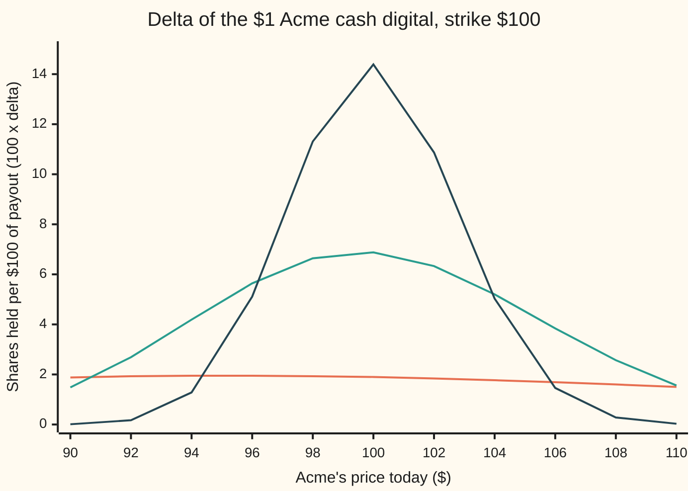
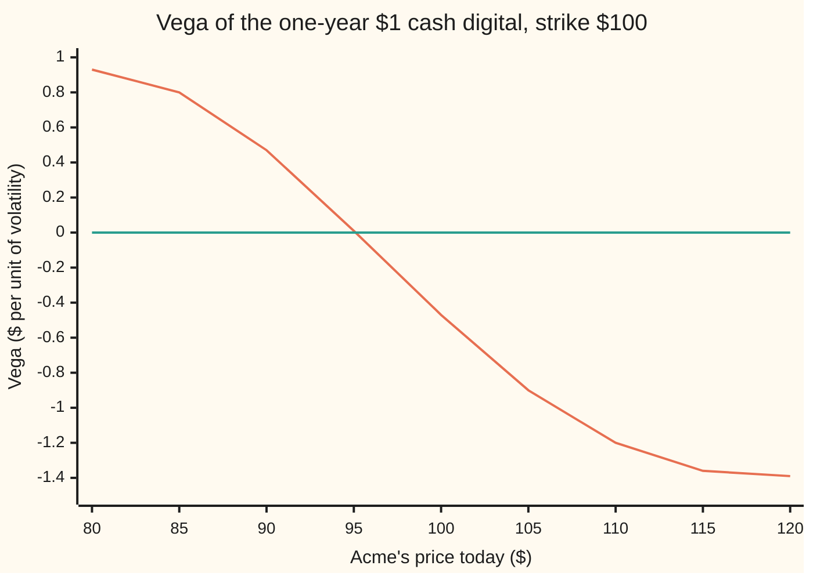

# Digital Greeks and pin risk: a hedge that goes wild in the last days

[Syllabus](../../../SYLLABUS.md) → [Financial mathematics](../README.md) → [Digitals and the implied density](../README.md#s10) → Digital Greeks and pin risk

---

## General Overview

Acme shares trade at \$100. A bank sells a one-year bet on them: it pays \$1 if Acme closes above \$100 on expiry day, and nothing otherwise. That bet is a **cash digital** ([Cash-or-nothing digital](01-cash-or-nothing-digital.md)). With cash earning 5 percent, a 2 percent dividend yield and 20 percent volatility, it costs \$0.494581, just under half a dollar.

The bank does not want the bet's risk, so it hedges: it holds Acme shares whose gains offset the bet's changes in value. The number of shares is the bet's **delta**, the slope of its price against Acme's price. A year out, the bank holds 0.018951 shares per dollar of payout, \$1.90 of stock. Calm.

Now let the year run down with Acme stuck near \$100. With one day left the same bet needs 0.381036 shares, \$38.10 of stock, to hedge a payout that can never exceed \$1. With one hour left it needs \$186.69. A move of fifty cents either way then swings the bet between likely and unlikely, and the hedge must be bought or dumped in bulk. Traders call this **pin risk**: the danger that the share finishes within a whisker of the strike, so the payout hangs on pennies while the hedge lurches.

This card differentiates both digital prices for all five Greeks: sensitivity to share price (delta, and gamma, the change in delta), volatility (vega), time (theta) and the bank rate (rho). Two surprises fall out. The cash digital's vega is negative at the strike: more volatility makes it cheaper, by 0.473764 dollars per unit of volatility. And its gamma changes sign, below the strike rather than at it.

**A digital's price is a smoothed step, so every Greek is the bell curve's height times how fast the step's position moves; as expiry nears the step sharpens to a cliff and the hedge that tracks its slope becomes impossible to run.**

**What kind of fact this is:** a theorem inside the Black–Scholes model, proved on this card in Why it works. Pin risk itself is a trading hazard the model explains but cannot remove.

### The picture: the delta becomes a spike



Delta is scaled by 100 to read as shares per \$100 of payout. Flat line: one year left. Middle hump: one month left. Tall spike: one week left. Across all prices, the area under each full curve is the bet's whole swing, from nothing to one discounted dollar, so a narrower hump must be a taller one. With a year left the hump is so wide it looks flat, and it peaks at \$95.12, not at the strike; Step 3 says why.

---

## The formula

Notation first, in words. The cash digital's price is $c$ and the asset digital's price is $a$; the asset digital pays one Acme share, instead of \$1, if Acme closes above the strike ([Asset-or-nothing digital](02-asset-or-nothing-digital.md)). Their prices are

$$c = e^{-rT}N(d_2), \qquad a = S\,e^{-qT}N(d_1),$$

with the two distances as on the [Black–Scholes call](../08-The%20Black-Scholes%20call%20and%20put/01-black-scholes-call.md) card:

$$d_2 = \frac{\ln(S/K) + (r - q - \tfrac12\sigma^2)T}{\sigma\sqrt{T}}, \qquad d_1 = d_2 + \sigma\sqrt{T}.$$

In words: $d_2$ is how many spreads Acme's median finishing price sits above the strike; $d_1$ is one spread further.

The Greeks are slopes of these prices, one input moved at a time with the rest frozen: partial derivatives ([Partial derivatives](../../06-Calculus%20and%20analysis/07-Several%20Variables/01-partial-derivatives.md)). A subscript names the product: $\Delta_c$ is the cash digital's delta, $\Delta_a$ the asset digital's. The bell curve's height at $x$ is $\varphi(x) = e^{-x^2/2}/\sqrt{2\pi}$; its area to the left of $x$ is $N(x)$.

The cash digital:

$$\Delta_c = \frac{e^{-rT}\varphi(d_2)}{S\sigma\sqrt{T}}, \qquad \Gamma_c = -\frac{e^{-rT}\varphi(d_2)\,d_1}{S^2\sigma^2T}, \qquad \mathcal{V}_c = -\frac{e^{-rT}\varphi(d_2)\,d_1}{\sigma},$$

$$\Theta_c = r\,c + e^{-rT}\varphi(d_2)\left(\frac{d_1}{2T} - \frac{r-q}{\sigma\sqrt{T}}\right), \qquad \rho_c = -T\,c + \frac{e^{-rT}\varphi(d_2)\sqrt{T}}{\sigma}.$$

**Read it aloud:** every cash Greek is the bell curve's height at the strike's distance, discounted, times how fast that distance moves with the input; theta and rho add a term for the discount itself.

The asset digital:

$$\Delta_a = e^{-qT}N(d_1) + \frac{e^{-qT}\varphi(d_1)}{\sigma\sqrt{T}}, \qquad \Gamma_a = -\frac{e^{-qT}\varphi(d_1)\,d_2}{S\sigma^2T}, \qquad \mathcal{V}_a = -\frac{S\,e^{-qT}\varphi(d_1)\,d_2}{\sigma},$$

$$\Theta_a = q\,a - S\,e^{-qT}\varphi(d_1)\left(\frac{r-q}{\sigma\sqrt{T}} - \frac{d_2}{2T}\right), \qquad \rho_a = \frac{S\,e^{-qT}\varphi(d_1)\sqrt{T}}{\sigma}.$$

**Read it aloud:** the same pattern with $d_1$ and $d_2$ swapped in the sign-carrying factor, plus one extra delta term because the payout is itself a share.

| Symbol | Plain meaning | In our example | Push it up and the answer… |
| --- | --- | --- | --- |
| $c$, $a$, $V$ | prices of the cash digital (pays \$1) and the asset digital (pays one share); $V$ is any product's price | \$0.494581, \$58.685115 | — |
| $S$ | Acme's price today | \$100 | cash delta falls away from the peak |
| $K$ | the strike: the level Acme must close above | \$100 | the spike moves with it |
| $T$ | time left to expiry, in years | 1 | wider, lower hump |
| $r$, $q$ | bank rate and dividend yield, continuously compounded | 5%, 2% | raise and lower the odds of finishing above $K$ |
| $\sigma$ | volatility: the spread of a year's log return | 20% | cash digital cheaper at the strike |
| $d_1$, $d_2$, $m$ | the strike's distance in spread units, counted in shares and in dollars; $m$ is the forward's log-distance above the strike | 0.25, 0.05, 0.03 | — |
| $\varphi$, $N$ | the bell curve's height; $N(x)$ is its area left of $x$ | $\varphi(d_2) = 0.398444$ | — |
| $e^{-rT}$, $e^{-qT}$ | today's value of \$1 due at $T$; the share fraction held today to own one share at $T$ | 0.951229, 0.980199 | — |
| $\Delta$, $\Delta_c$, $\Delta_a$, $\Gamma$, $\Gamma_c$, $\Gamma_a$ | delta: price change per \$1 of Acme; gamma: delta's change per \$1 | 0.018951, −0.000237 (cash) | — |
| $\mathcal{V}_c$, $\mathcal{V}_a$, $\Theta$, $\Theta_c$, $\Theta_a$ | vega: per unit of volatility; theta: per year that passes, Acme fixed | −0.473764, 0.015254 (cash) | — |
| $\rho$, $\rho_c$, $\rho_a$ | rho: per unit of the bank rate | 1.400477 (cash) | — |

The Greeks at the house market, from both check scripts:

| Greek | Cash digital | Asset digital |
| --- | --- | --- |
| price | 0.494581 | 58.685115 |
| delta | 0.018951 | 2.481909 |
| gamma | −0.000237 | −0.004738 |
| vega, per unit of volatility | −0.473764 | −9.475289 |
| vega, per vol point | −0.004738 | −0.094753 |
| theta, per year | 0.015254 | −3.563942 |
| rho, per unit of rate | 1.400477 | 189.505788 |

### When it holds

- **Volatility is one fixed number.** Real markets price a different volatility at each strike. Then the digital also moves when that curve tilts, a term the next card adds; flat-volatility Greeks miss it.
- **Acme moves continuously.** A jump through the strike, overnight or on news, flips the payout with no chance to trade in between. No delta covers that; the formulas assume the path has no gaps.
- **Trading is free and continuous.** Near expiry the delta changes so fast that daily or hourly rebalancing leaves large errors, and each trade costs a spread. The Greeks stay correct as slopes; the hedge they describe stops being achievable.
- **The payout switches exactly at $K$.** The formulas are slopes of a jump. A pricing grid or tree that treats the jump crudely produces noisy Greeks near the strike, a numerical problem separate from the model.

---

## Why it works

### Step 0: every Greek is one slope times the bell curve's height

The cash price is $e^{-rT}N(d_2)$. Only two pieces move when an input moves: the discount $e^{-rT}$ and the distance $d_2$. The slope of $N$ at $d_2$ is the bell curve's height there, $\varphi(d_2)$. So by the chain rule (the slope of a function of a function is the product of the two slopes), each Greek is $e^{-rT}\varphi(d_2)$ times the slope of $d_2$ in that input, plus a discount term where $r$ or $T$ enters the discount. The whole card is five slopes of $d_2$, five of $d_1$, and bookkeeping.

### Step 1: how the distances move

Write $m = \ln(S/K) + (r-q)T$, the forward's log-distance above the strike. Then $d_2 = m/(\sigma\sqrt{T}) - \tfrac12\sigma\sqrt{T}$ and $d_1 = m/(\sigma\sqrt{T}) + \tfrac12\sigma\sqrt{T}$. Differentiating term by term:

| Input | Slope of $d_2$ | Slope of $d_1$ |
| --- | --- | --- |
| Acme's price $S$ | $\frac{1}{S\sigma\sqrt{T}}$ | $\frac{1}{S\sigma\sqrt{T}}$ |
| volatility $\sigma$ | $-d_1/\sigma$ | $-d_2/\sigma$ |
| time left $T$ | $(r-q)/(\sigma\sqrt{T}) - d_1/(2T)$ | $(r-q)/(\sigma\sqrt{T}) - d_2/(2T)$ |
| bank rate $r$ | $\sqrt{T}/\sigma$ | $\sqrt{T}/\sigma$ |

The volatility row is the one that matters. Raising $\sigma$ divides $m$ by more and grows $\tfrac12\sigma\sqrt{T}$. The two effects combine into $-(m/(\sigma\sqrt{T}) + \tfrac12\sigma\sqrt{T})/\sigma$, which is $-d_1/\sigma$.

### Step 2: the cash delta, and why it equals the call's gamma at the strike

Multiply the height by the first row: $\Delta_c = e^{-rT}\varphi(d_2)/(S\sigma\sqrt{T})$. For Acme that is 0.379012 / 20 = 0.018951.

The ordinary call's gamma is $e^{-qT}\varphi(d_1)/(S\sigma\sqrt{T})$ ([Gamma](../09-The%20Greeks%2C%20one%20each/02-gamma.md)). The two numerators are tied by the **density identity** $S e^{-qT}\varphi(d_1) = K e^{-rT}\varphi(d_2)$, so the call's gamma is $K/S$ times the cash delta. At $S = K$ they coincide: 0.018951 both. The call's delta climbs from 0 to about 1 as Acme rises through the strike, and the cash digital pays exactly when the call is in the money, so the slope of one tracks the steepness of the other.

<details>
<summary>The algebra behind the density identity</summary>

$d_1^2 - d_2^2 = (d_1 - d_2)(d_1 + d_2) = \sigma\sqrt{T}\cdot 2m/(\sigma\sqrt{T}) = 2m$. So $\varphi(d_1)/\varphi(d_2) = e^{-(d_1^2 - d_2^2)/2} = e^{-m} = K e^{-(r-q)T}/S$. Multiply both sides by $S e^{-qT}\varphi(d_2)$: $S e^{-qT}\varphi(d_1) = K e^{-rT}\varphi(d_2)$. At the house market both sides equal 100 × 0.379012.

</details>

### Step 3: vega and gamma turn negative, below the strike

The volatility row gives $\mathcal{V}_c = e^{-rT}\varphi(d_2)\cdot(-d_1/\sigma)$. It is negative whenever $d_1 > 0$. At Acme's \$100, $d_1 = 0.25$, so vega is −0.473764: one more point of volatility, 20 to 21 percent, takes about half a cent off the bet (−0.004738 per point).

Why more volatility hurts: Acme's median finishing price is the forward shrunk by $e^{-\sigma^2T/2}$. Wider swings with the same average need a lower middle, so extra volatility drags the median down, and the odds of finishing above it fall.

Far below the strike the other effect wins. There Acme needs a big move to finish above \$100, and extra volatility supplies big moves: at \$90 the cash vega is +0.468780. The crossover is $d_1 = 0$, which solves to $S = K e^{-(r - q + \sigma^2/2)T}$, which is 95.122942. A search for the zero of vega lands on the same point.

Gamma is the slope of delta, the hump in the overview picture: positive on the rising side, negative on the falling side, zero at the top. Differentiating $\Delta_c$ in $S$ gives $\Gamma_c = -e^{-rT}\varphi(d_2)\,d_1/(S^2\sigma^2T)$: the same $-d_1$ factor, the same crossover at \$95.12. At \$97, between the crossover and the strike, gamma is already negative, −0.000098; at \$90 it is positive, 0.000289. A brute-force scan finds delta's peak at \$95.12.



Falling line: the cash digital's vega. Flat line: zero. Vega crosses zero at the \$95.12 crossover and stays negative above it. An ordinary option's vega never goes below zero ([Vega](../09-The%20Greeks%2C%20one%20each/03-vega.md)); a digital's does, because it is a bet on which side of a line the share ends, not on how far it travels.

### Step 4: theta and rho carry a discount term

Time and the bank rate enter twice: through the distance and through the discount $e^{-rT}$. Theta is the change in price per year that passes with Acme held still, so it is minus the slope in $T$. The discount grows toward 1 as payment nears, adding $r\,c$; the distance adds the bell curve's height times the time row with its sign flipped. At the house market the two parts are 0.05 × 0.494581 and 0.379012 × (0.125 − 0.15), giving a theta of 0.015254 a year: the bet at the strike creeps up in value as the days pass. A digital need not lose value as time passes.

Rho has the same two parts with opposite signs. A higher bank rate shrinks the discount, costing $T\,c$, and lifts the forward, raising the odds, worth $e^{-rT}\varphi(d_2)\sqrt{T}/\sigma$. Net: 1.400477 per unit of rate.

The checks test theta a second way. Every price in this model obeys the pricing equation $\Theta + (r-q)S\Delta + \tfrac12\sigma^2S^2\Gamma - rV = 0$, where $V$ is the product's price ([The Black-Scholes equation](../08-The%20Black-Scholes%20call%20and%20put/07-black-scholes-equation.md)). Feeding in the formulas' delta, gamma and theta, the balance is zero for both digitals to six places.

### Step 5: the asset digital is a call plus cash digitals

An asset digital pays the share when Acme ends above $K$. That payout is the call's payout plus $K$ dollars in the same event ([Asset-or-nothing digital](02-asset-or-nothing-digital.md)). Slopes add, so every asset Greek is the call's Greek plus $K$ times the cash Greek. Delta: 0.586851 plus 100 × 0.018951 gives 2.481909. Gamma: 0.018951 plus 100 × (−0.000237) gives −0.004738. Vega: the call's plus 100 cash vegas lands on −9.475289.

Differentiating $S e^{-qT}N(d_1)$ directly gives the formulas in the table. Delta gains a second term by the product rule, because $S$ appears twice. Gamma and vega carry $-d_2$ where the cash versions carry $-d_1$. So the asset digital's crossover is $d_2 = 0$, at $S = K e^{-(r-q-\sigma^2/2)T}$, which is 99.004983: closer to the strike than the cash digital's, since counting in shares puts the odds one spread higher.

<details>
<summary>Detailed proof: theta and the asset Greeks</summary>

**Time.** With $m = \ln(S/K) + (r-q)T$, $\partial m/\partial T = r - q$. Then $\partial d_2/\partial T = (r-q)/(\sigma\sqrt{T}) - m/(2\sigma T^{3/2}) - \sigma/(4\sqrt{T})$. The last two terms are $-\tfrac{1}{2T}\left(m/(\sigma\sqrt{T}) + \tfrac12\sigma\sqrt{T}\right) = -d_1/(2T)$. The same steps with $+\sigma/(4\sqrt{T})$ give $\partial d_1/\partial T = (r-q)/(\sigma\sqrt{T}) - d_2/(2T)$.

**Cash theta.** $\partial c/\partial T = -r\,e^{-rT}N(d_2) + e^{-rT}\varphi(d_2)\,\partial d_2/\partial T$. Theta is minus this: $\Theta_c = r\,c + e^{-rT}\varphi(d_2)\left(d_1/(2T) - (r-q)/(\sigma\sqrt{T})\right)$.

**Asset delta.** $\partial a/\partial S = e^{-qT}N(d_1) + S e^{-qT}\varphi(d_1)\cdot 1/(S\sigma\sqrt{T})$, the product rule. The $S$ cancels in the second term.

**Asset gamma.** Differentiate again. The first term gives the call's gamma, $e^{-qT}\varphi(d_1)/(S\sigma\sqrt{T})$. The second is $e^{-qT}\varphi'(d_1)/(\sigma\sqrt{T})$ times $\frac{1}{S\sigma\sqrt{T}}$, and $\varphi'(x) = -x\varphi(x)$. Together: $e^{-qT}\varphi(d_1)\left(\sigma\sqrt{T} - d_1\right)/(S\sigma^2T)$, and $\sigma\sqrt{T} - d_1 = -d_2$.

**Asset vega, rho, theta.** $\partial a/\partial\sigma = S e^{-qT}\varphi(d_1)\cdot(-d_2/\sigma)$. $\partial a/\partial r = S e^{-qT}\varphi(d_1)\sqrt{T}/\sigma$. $\partial a/\partial T = -q\,a + S e^{-qT}\varphi(d_1)\,\partial d_1/\partial T$; minus this is $\Theta_a$.

**Cash gamma.** $\Delta_c = e^{-rT}\varphi(d_2)/(S\sigma\sqrt{T})$. Its slope in $S$ is $e^{-rT}/(\sigma\sqrt{T})$ times $\left(-d_2\varphi(d_2)/(S^2\sigma\sqrt{T}) - \varphi(d_2)/S^2\right)$, which is $-e^{-rT}\varphi(d_2)(d_2 + \sigma\sqrt{T})/(S^2\sigma^2T)$, and $d_2 + \sigma\sqrt{T} = d_1$.

</details>

### Step 6: the last days, when the step becomes a cliff

The cash price is a smoothed step in Acme's price: near 0 well below the strike, near one discounted dollar well above. The step's width, in log-price, is the spread $\sigma\sqrt{T}$: 20 percent of the share price with a year left, and a small fraction of that with a day left. Delta is the step's slope, roughly its height over its width. At the strike the height stays near \$1 while the width shrinks with the square root of time, so delta grows like $\frac{1}{\sqrt{T}}$. Each quartering of the time left about doubles it: 0.018951 at a year, 0.039386 at three months.

Away from the strike the bell-curve height $\varphi(d_2)$ collapses instead. With one day left, delta is 0.381036 at \$100 and 0.060701 at \$98. The turning point $K e^{-(r-q+\sigma^2/2)T}$ has closed in to 99.986302, so gamma flips sign almost exactly at the strike, where it is −0.004763. In the limit the price is a cliff, flat on both sides and vertical at $K$, and a hedge built from its slope holds no shares, then very many, then none. That is **pin risk**: when Acme is pinned near the strike into expiry, the correct hedge is too large and changes too fast to trade.

Another route prices and hedges a digital without this cliff: approximate it by a spread of two ordinary calls struck either side of $K$, whose delta is capped. The next card builds it: [A digital from a call spread](04-digital-from-a-call-spread-and-the-skew-term.md).

---

## Worked numbers, by hand

Acme: $S = K = 100$, $r = 5\%$, $q = 2\%$, $\sigma = 20\%$, $T = 1$ year, so $d_1 = 0.25$ and $d_2 = 0.05$.

| Step | Arithmetic | Value |
| --- | --- | --- |
| bell-curve height at $d_2$ | $e^{-0.05^2/2}/\sqrt{2\pi}$ | 0.398444 |
| discounted height, $e^{-rT}\varphi(d_2)$ | 0.951229 × 0.398444 | 0.379012 |
| $S\sigma\sqrt{T}$ | 100 × 0.20 × 1 | 20 |
| **cash delta** | 0.379012 / 20 | **0.018951** |
| cash gamma | −0.379012 × 0.25 / (100 × 100 × 0.04) | −0.000237 |
| **cash vega** | −0.379012 × 0.25 / 0.20 | **−0.473764** |
| cash theta | 0.05 × 0.494581 + 0.379012 × (0.125 − 0.15) | 0.015254 |
| cash rho | −0.494581 + 0.379012 × 1 / 0.20 | 1.400477 |
| asset delta | 0.980199 × 0.598706 + 0.379012 / 0.20 | 2.481909 |
| asset vega | −100 × 0.379012 × 0.05 / 0.20 | −9.475289 |

The asset delta and vega rows use the density identity: at $S = K$, $S e^{-qT}\varphi(d_1)$ is 100 times the discounted height. One year out, a bank short the cash bet is hedged with a small stake, and a rise in volatility from 20 to 21 percent hands it about half a cent per dollar of payout: the reverse of an ordinary option seller's experience.

### What breaks if you drop a piece

| Mistake | Comes out at | What went wrong |
| --- | --- | --- |
| Drop the chain-rule factor $\frac{1}{S\sigma\sqrt{T}}$ from the cash delta | 0.379012 (right: 0.018951) | That is the slope in $d_2$, not in dollars of Acme |
| Hedge the asset digital with a call's delta, $e^{-qT}N(d_1)$ | 0.586851 (right: 2.481909) | The product rule's second term is missing: the payout is a share *and* it switches on |
| Freeze the discount when moving the bank rate | 1.895058 (right: 1.400477) | Only the odds moved; paying later at a higher rate is worth less |
| Keep the one-year delta into the last day | 0.018951 held (needed: 0.381036) | Delta at the strike grows like $\frac{1}{\sqrt{T}}$ |

---

## How the hedge moves into expiry

The mystery: Acme barely moves in the last week, yet the hedge churns. The clock does it, by sharpening the step.

### Delta at the strike, one force: time

```
time left   stock held per $1 of payout, Acme at $100
  1 year    ██                                         $1.90
  3 months  ████                                       $3.94
  1 month   ███████                                    $6.88
  1 week    ███████████████                            $14.39
  1 day     ████████████████████████████████████████   $38.10
```

With one hour left the stake reaches \$186.69 against a payout of at most \$1.

### One day left, delta across the strike

| Acme | Digital's value | Delta |
| --- | --- | --- |
| \$98.00 | \$0.026971 | 0.060701 |
| \$99.00 | \$0.169149 | 0.243374 |
| \$99.50 | \$0.316921 | 0.341902 |
| \$100.00 | \$0.500975 | 0.381036 |
| \$100.50 | \$0.683955 | 0.338040 |
| \$101.00 | \$0.829622 | 0.239541 |
| \$102.00 | \$0.970772 | 0.062115 |

Four dollars of Acme take the bet from nearly worthless to nearly certain. A rise from \$98 to \$100 needs shares bought; a further rise to \$102 needs them sold. That reversal is the sign change of gamma at the strike.

### One story: a bank short the digital, Acme pinned

A bank sells the \$1 digital with five days left and delta-hedges once a day at the close. Acme closes at these prices:

| Days left | Acme | Digital's value | Shares held | Shares bought |
| --- | --- | --- | --- | --- |
| 5 | \$100.00 | \$0.501991 | 0.170309 | 0.170309 |
| 4 | \$100.60 | \$0.614120 | 0.181459 | 0.011150 |
| 3 | \$99.50 | \$0.392682 | 0.213014 | 0.031555 |
| 2 | \$100.30 | \$0.581460 | 0.262950 | 0.049936 |
| 1 | \$99.90 | \$0.462906 | 0.379774 | 0.116824 |

Acme has gone nowhere. The digital's value swung between \$0.392682 and \$0.614120, and the hedge has grown from 0.170309 to 0.379774 shares. Two last closes:

- **Acme ends at \$100.20.** The bet pays \$1. The shares gain little on the last day's move. Final result for the bank: −\$0.425847.
- **Acme ends at \$99.80.** The bet pays nothing. The hedge's shares lose a little. Final result: +\$0.422244.

The bet worth \$0.462906 the evening before becomes \$1 or \$0, and the 0.379774 shares held cannot bridge that. The hedge worked as a slope and failed as a cover.

---

## Code, from first principles, and it actually runs

Three independent roads reach every Greek of both digitals. Road 1 is the formulas above. Road 2 prices both bets by brute force: bisection finds the bell-curve point where Acme finishes at the strike, Simpson's rule averages the payouts beyond it, and each Greek is the slope of that price under a small nudge to one input; no $d_1$, no $d_2$, no $N$. Road 3 takes the ordinary call's own Greeks and adds $K$ cash Greeks to reach the asset Greeks. Theta is also tested against the pricing equation. The bell-curve area is a series written out in both languages. Every number on the card is printed.

### Python

```python
# Digital Greeks and pin risk -- the check behind the card.  Standard library only.
# Nothing imported knows the answer: the bell-curve area is a series written out,
# the prices by brute force are Simpson's rule, the cut-off is found by bisection.
from math import exp, log, sqrt, pi

S0, K, r, q, sig, T0 = 100.0, 100.0, 0.05, 0.02, 0.20, 1.0
DAY = 1.0 / 365.0

def phi(x): return exp(-0.5 * x * x) / sqrt(2.0 * pi)     # bell-curve height at x
def N(x):                                                 # area left of x: 1/2 + phi(x)(x + x^3/3 + x^5/15 + ...)
    if abs(x) > 9.0: return 1.0 if x > 0 else 0.0
    s = t = x; i = 1
    while abs(t) > 1e-16 * abs(s):
        t *= x * x / (2 * i + 1); s += t; i += 1
    return 0.5 + s * phi(x)

def dd(S, sg, T, rr=r):
    v = sg * sqrt(T)
    d1 = (log(S / K) + (rr - q + 0.5 * sg * sg) * T) / v
    return d1, d1 - v, v

def cash_greeks(S, sg, T):       # road 1: N(d2) differentiated by hand
    d1, d2, v = dd(S, sg, T); c = exp(-r * T) * N(d2); g = exp(-r * T) * phi(d2)
    return [c, g / (S * v), -g * d1 / (S * S * v * v), -g * d1 / sg,
            r * c + g * (d1 / (2 * T) - (r - q) / v), -T * c + g * sqrt(T) / sg]

def asset_greeks(S, sg, T):      # road 1: S e^-qT N(d1) differentiated by hand
    d1, d2, v = dd(S, sg, T); a = S * exp(-q * T) * N(d1); h = S * exp(-q * T) * phi(d1)
    return [a, exp(-q * T) * N(d1) + h / (S * v), -h * d2 / (S * S * v * v), -h * d2 / sg,
            q * a - h * ((r - q) / v - d2 / (2 * T)), h * sqrt(T) / sg]

def by_integral(S, sg, T, rr=r, n=4000):   # road 2: average the payoffs over the bell curve; no d1, no d2
    mu, v = (rr - q - 0.5 * sg * sg) * T, sg * sqrt(T)
    lo, hi = -12.0, 12.0
    for _ in range(100):                      # bisection for the cut z* where S_T = K
        mid = 0.5 * (lo + hi)
        if S * exp(mu + v * mid) > K: hi = mid
        else: lo = mid
    h = (12.0 - hi) / n; cs = as_ = 0.0
    for i in range(n + 1):
        w = 1.0 if i in (0, n) else (4.0 if i % 2 else 2.0)
        z = hi + i * h; cs += w * phi(z); as_ += w * S * exp(mu + v * z) * phi(z)
    return exp(-rr * T) * cs * h / 3.0, exp(-rr * T) * as_ * h / 3.0

def bumped(S, sg, T):            # road 2 continued: nudge each input, re-price, take the slope
    p = lambda S_=S, s_=sg, T_=T, r_=r: by_integral(S_, s_, T_, r_)
    out = []
    for j in (0, 1):
        f0, up, dn = p()[j], p(S_=S + 0.1)[j], p(S_=S - 0.1)[j]
        out.append([f0, (p(S_=S + 0.01)[j] - p(S_=S - 0.01)[j]) / 0.02, (up - 2 * f0 + dn) / 0.01,
                    (p(s_=sg + 1e-4)[j] - p(s_=sg - 1e-4)[j]) / 2e-4,
                    -(p(T_=T + 1e-4)[j] - p(T_=T - 1e-4)[j]) / 2e-4,
                    (p(r_=r + 1e-4)[j] - p(r_=r - 1e-4)[j]) / 2e-4])
    return out

def call_greeks(S, sg, T):       # road 3: the ordinary call's own Greeks, from its own formulas
    d1, d2, v = dd(S, sg, T)
    return [S * exp(-q * T) * N(d1) - K * exp(-r * T) * N(d2), exp(-q * T) * N(d1),
            exp(-q * T) * phi(d1) / (S * v), S * exp(-q * T) * phi(d1) * sqrt(T)]

def root(f, lo, hi):             # bisection: f changes sign between lo and hi
    for _ in range(100):
        mid = 0.5 * (lo + hi)
        if (f(lo) > 0) == (f(mid) > 0): lo = mid
        else: hi = mid
    return 0.5 * (lo + hi)

def out(label, *vals): print(f"{label:<30}" + "".join(f"{x:>12.6f}" for x in vals))

d1, d2, _ = dd(S0, sig, T0)
cg, ag, cl = cash_greeks(S0, sig, T0), asset_greeks(S0, sig, T0), call_greeks(S0, sig, T0)
bc, ba = bumped(S0, sig, T0)
out("d1, d2, N(d1), N(d2)", d1, d2, N(d1), N(d2))
out("phi(d1), phi(d2), e^-qT, e^-rT", phi(d1), phi(d2), exp(-q * T0), exp(-r * T0))
print(f"{'':<30}{'cash,form':>12}{'cash,bump':>12}{'asset,form':>12}{'asset,bump':>12}")
for k, name in enumerate(("price", "delta", "gamma", "vega", "theta", "rho")):
    out(name, cg[k], bc[k], ag[k], ba[k])
pdec = [G[4] + (r - q) * S0 * G[1] + 0.5 * sig * sig * S0 * S0 * G[2] - r * G[0] for G in (cg, ag)]
out("PDE balance cash, asset", *pdec)
out("call gamma, call delta", cl[2], cl[1])
out("call + K x cash: price, delta", cl[0] + K * cg[0], cl[1] + K * cg[1])
out("call + K x cash: gamma, vega", cl[2] + K * cg[2], cl[3] + K * cg[3])
out("vega per vol point cash, asset", cg[3] / 100, ag[3] / 100)
xc = root(lambda s: cash_greeks(s, sig, T0)[3], 80.0, 120.0)
xa = root(lambda s: asset_greeks(s, sig, T0)[3], 80.0, 120.0)
out("cash turn: search, formula", xc, K * exp(-(r - q + 0.5 * sig * sig) * T0))
out("asset turn: search, formula", xa, K * exp(-(r - q - 0.5 * sig * sig) * T0))
out("cash delta peak by scan", max((cash_greeks(80 + i / 100, sig, T0)[1], 80 + i / 100) for i in range(4001))[1])
out("cash vega, gamma at 90 and 97", *(cash_greeks(x, sig, T0)[k] for k in (3, 2) for x in (90.0, 97.0)))
print("delta at S = 100 by time left:  delta, stock $ per $1 paid")
times = (("1 year", 1.0), ("3 months", 0.25), ("1 month", 1 / 12), ("1 week", 7 * DAY), ("1 day", DAY), ("1 hour", DAY / 24))
for lab, t in times:
    dl = cash_greeks(S0, sig, t)[1]; out("  " + lab, dl, S0 * dl)
print("bars, stock $ per $1 paid" + "".join(f"{S0 * cash_greeks(S0, sig, t)[1]:>8.2f}" for _, t in times[:5]))
out("1 day: gamma, bump delta, turn", cash_greeks(S0, sig, DAY)[2], bumped(S0, sig, DAY)[0][1],
    K * exp(-(r - q + 0.5 * sig * sig) * DAY))
print("1 day left, delta across the strike")
for s in (98.0, 99.0, 99.5, 100.0, 100.5, 101.0, 102.0):
    out(f"  S = {s:.1f}", cash_greeks(s, sig, DAY)[1], cash_greeks(s, sig, DAY)[0])
# ---- pin risk: short one cash digital, hedged daily in shares, Acme pinned near 100 ----
path = [100.00, 100.60, 99.50, 100.30, 99.90]
print("hedge trace, days left: S, digital, shares held, trade")
for end in (100.20, 99.80):
    prem = cash_greeks(path[0], sig, 5 * DAY)[0]; held = 0.0; bank = prem
    for day, s in enumerate(path):
        new = cash_greeks(s, sig, (5 - day) * DAY)[1]
        bank -= (new - held) * s
        if end == 100.20: out(f"  with {5 - day} left", s, cash_greeks(s, sig, (5 - day) * DAY)[0], new, new - held)
        held = new; bank = bank * exp(r * DAY) + held * s * (exp(q * DAY) - 1.0)
    pay = 1.0 if end > K else 0.0
    out(f"  end {end:.2f}: pays, hedge P&L", pay, bank + held * end - pay)
# ---- charts and what breaks ----
xs = [90.0 + 2 * i for i in range(11)]
print("chart S       " + "".join(f"{x:>8.0f}" for x in xs))
for lab, t in (("Dx100 1y", 1.0), ("Dx100 1m", 1 / 12), ("Dx100 1w", 7 * DAY)):
    print(f"chart {lab:<8}" + "".join(f"{100 * cash_greeks(x, sig, t)[1]:>8.2f}" for x in xs))
vs = [80.0 + 5 * i for i in range(9)]
print("chart S       " + "".join(f"{x:>8.0f}" for x in vs))
print("chart vega 1y " + "".join(f"{cash_greeks(x, sig, T0)[3]:>8.2f}" for x in vs))
g0 = exp(-r * T0) * phi(d2)
out("wrong: no chain rule, delta", g0)
out("wrong: asset delta as a call", exp(-q * T0) * N(d1))
out("wrong: rho, discount frozen", g0 * sqrt(T0) / sig)
out("wrong: 1-year delta at 1 day", cg[1])

assert abs(cg[0] - 0.494581) < 5e-7, "house cash digital"
assert abs(ag[0] - 58.685115) < 5e-7, "house asset digital"
for k in range(6):
    assert abs(cg[k] - bc[k]) < 1e-6 * (1 + abs(cg[k])), f"cash Greek {k}: formula vs bumped integral"
    assert abs(ag[k] - ba[k]) < 1e-6 * (1 + abs(ag[k])), f"asset Greek {k}: formula vs bumped integral"
assert abs(cg[1] - cl[2]) < 1e-12, "at S = K the cash delta equals the call's gamma"
assert abs(cl[3] + K * cg[3] - ag[3]) < 1e-9, "asset vega = call vega + K cash vegas"
assert max(abs(x) for x in pdec) < 1e-9, "theta balances the pricing equation for both digitals"
assert abs(xc - K * exp(-(r - q + 0.5 * sig * sig) * T0)) < 1e-9, "vega turns at d1 = 0"
assert cash_greeks(90.0, sig, T0)[3] > 0 > cg[3], "cash vega changes sign below the strike"
assert cash_greeks(97.0, sig, T0)[2] < 0 < cash_greeks(90.0, sig, T0)[2], "cash gamma changes sign below the strike"
print("ALL CHECKS PASS")
```

**Ran 2026-09-19 on macOS, Python 3.14.6, standard library only. All checks passed. Output, pasted from the run:**

```
d1, d2, N(d1), N(d2)              0.250000    0.050000    0.598706    0.519939
phi(d1), phi(d2), e^-qT, e^-rT    0.386668    0.398444    0.980199    0.951229
                                 cash,form   cash,bump  asset,form  asset,bump
price                             0.494581    0.494581   58.685115   58.685115
delta                             0.018951    0.018951    2.481909    2.481909
gamma                            -0.000237   -0.000237   -0.004738   -0.004737
vega                             -0.473764   -0.473765   -9.475289   -9.475296
theta                             0.015254    0.015254   -3.563942   -3.563942
rho                               1.400477    1.400477  189.505788  189.505780
PDE balance cash, asset           0.000000    0.000000
call gamma, call delta            0.018951    0.586851
call + K x cash: price, delta    58.685115    2.481909
call + K x cash: gamma, vega     -0.004738   -9.475289
vega per vol point cash, asset   -0.004738   -0.094753
cash turn: search, formula       95.122942   95.122942
asset turn: search, formula      99.004983   99.004983
cash delta peak by scan          95.120000
cash vega, gamma at 90 and 97     0.468780   -0.184419    0.000289   -0.000098
delta at S = 100 by time left:  delta, stock $ per $1 paid
  1 year                          0.018951    1.895058
  3 months                        0.039386    3.938634
  1 month                         0.068804    6.880435
  1 week                          0.143897   14.389663
  1 day                           0.381036   38.103557
  1 hour                          1.866937  186.693665
bars, stock $ per $1 paid    1.90    3.94    6.88   14.39   38.10
1 day: gamma, bump delta, turn   -0.004763    0.381030   99.986302
1 day left, delta across the strike
  S = 98.0                        0.060701    0.026971
  S = 99.0                        0.243374    0.169149
  S = 99.5                        0.341902    0.316921
  S = 100.0                       0.381036    0.500975
  S = 100.5                       0.338040    0.683955
  S = 101.0                       0.239541    0.829622
  S = 102.0                       0.062115    0.970772
hedge trace, days left: S, digital, shares held, trade
  with 5 left                   100.000000    0.501991    0.170309    0.170309
  with 4 left                   100.600000    0.614120    0.181459    0.011150
  with 3 left                    99.500000    0.392682    0.213014    0.031555
  with 2 left                   100.300000    0.581460    0.262950    0.049936
  with 1 left                    99.900000    0.462906    0.379774    0.116824
  end 100.20: pays, hedge P&L     1.000000   -0.425847
  end 99.80: pays, hedge P&L      0.000000    0.422244
chart S             90      92      94      96      98     100     102     104     106     108     110
chart Dx100 1y    1.88    1.93    1.95    1.95    1.93    1.90    1.84    1.77    1.69    1.60    1.50
chart Dx100 1m    1.48    2.69    4.19    5.64    6.64    6.88    6.33    5.20    3.84    2.57    1.56
chart Dx100 1w    0.01    0.17    1.28    5.11   11.31   14.39   10.87    5.03    1.46    0.28    0.03
chart S             80      85      90      95     100     105     110     115     120
chart vega 1y     0.93    0.80    0.47    0.01   -0.47   -0.90   -1.20   -1.36   -1.39
wrong: no chain rule, delta       0.379012
wrong: asset delta as a call      0.586851
wrong: rho, discount frozen       1.895058
wrong: 1-year delta at 1 day      0.018951
ALL CHECKS PASS
```

### Rust

```rust
// Digital Greeks and pin risk -- the check behind the card.  Rust std only, no crates.
// Bell-curve area by a series, brute-force prices by Simpson's rule, cut-off by bisection.
const S0: f64 = 100.0; const K: f64 = 100.0; const R: f64 = 0.05; const Q: f64 = 0.02;
const SIG: f64 = 0.20; const T0: f64 = 1.0; const DAY: f64 = 1.0 / 365.0;

fn phi(x: f64) -> f64 { (-0.5 * x * x).exp() / (2.0 * std::f64::consts::PI).sqrt() }
fn n_cdf(x: f64) -> f64 {
    if x.abs() > 9.0 { return if x > 0.0 { 1.0 } else { 0.0 }; }
    let (mut s, mut t, mut i) = (x, x, 1.0);
    while t.abs() > 1e-16 * s.abs() { t *= x * x / (2.0 * i + 1.0); s += t; i += 1.0; }
    0.5 + s * phi(x)
}
fn dd(s: f64, sg: f64, t: f64, rr: f64) -> (f64, f64, f64) {
    let v = sg * t.sqrt();
    let d1 = ((s / K).ln() + (rr - Q + 0.5 * sg * sg) * t) / v;
    (d1, d1 - v, v)
}
// road 1: the closed forms, differentiated by hand. [price, delta, gamma, vega, theta, rho]
fn cash_greeks(s: f64, sg: f64, t: f64) -> [f64; 6] {
    let (d1, d2, v) = dd(s, sg, t, R);
    let c = (-R * t).exp() * n_cdf(d2); let g = (-R * t).exp() * phi(d2);
    [c, g / (s * v), -g * d1 / (s * s * v * v), -g * d1 / sg,
     R * c + g * (d1 / (2.0 * t) - (R - Q) / v), -t * c + g * t.sqrt() / sg]
}
fn asset_greeks(s: f64, sg: f64, t: f64) -> [f64; 6] {
    let (d1, d2, v) = dd(s, sg, t, R);
    let a = s * (-Q * t).exp() * n_cdf(d1); let h = s * (-Q * t).exp() * phi(d1);
    [a, (-Q * t).exp() * n_cdf(d1) + h / (s * v), -h * d2 / (s * s * v * v), -h * d2 / sg,
     Q * a - h * ((R - Q) / v - d2 / (2.0 * t)), h * t.sqrt() / sg]
}
// road 2: average the payoffs over the bell curve by Simpson's rule; no d1, no d2
fn by_integral(s: f64, sg: f64, t: f64, rr: f64) -> [f64; 2] {
    let (mu, v, n) = ((rr - Q - 0.5 * sg * sg) * t, sg * t.sqrt(), 4000usize);
    let (mut lo, mut hi) = (-12.0, 12.0);
    for _ in 0..100 {
        let mid = 0.5 * (lo + hi);
        if s * (mu + v * mid).exp() > K { hi = mid; } else { lo = mid; }
    }
    let h = (12.0 - hi) / n as f64;
    let (mut cs, mut asum) = (0.0, 0.0);
    for i in 0..=n {
        let w = if i == 0 || i == n { 1.0 } else if i % 2 == 1 { 4.0 } else { 2.0 };
        let z = hi + i as f64 * h;
        cs += w * phi(z); asum += w * s * (mu + v * z).exp() * phi(z);
    }
    [(-rr * t).exp() * cs * h / 3.0, (-rr * t).exp() * asum * h / 3.0]
}
fn bumped(s: f64, sg: f64, t: f64) -> [[f64; 6]; 2] {
    let p = |s_: f64, g_: f64, t_: f64, r_: f64| by_integral(s_, g_, t_, r_);
    let mut out = [[0.0; 6]; 2];
    for j in 0..2 {
        let (f0, up, dn) = (p(s, sg, t, R)[j], p(s + 0.1, sg, t, R)[j], p(s - 0.1, sg, t, R)[j]);
        out[j] = [f0, (p(s + 0.01, sg, t, R)[j] - p(s - 0.01, sg, t, R)[j]) / 0.02,
                  (up - 2.0 * f0 + dn) / 0.01,
                  (p(s, sg + 1e-4, t, R)[j] - p(s, sg - 1e-4, t, R)[j]) / 2e-4,
                  -(p(s, sg, t + 1e-4, R)[j] - p(s, sg, t - 1e-4, R)[j]) / 2e-4,
                  (p(s, sg, t, R + 1e-4)[j] - p(s, sg, t, R - 1e-4)[j]) / 2e-4];
    }
    out
}
// road 3: the ordinary call's own Greeks. [price, delta, gamma, vega]
fn call_greeks(s: f64, sg: f64, t: f64) -> [f64; 4] {
    let (d1, d2, v) = dd(s, sg, t, R);
    [s * (-Q * t).exp() * n_cdf(d1) - K * (-R * t).exp() * n_cdf(d2), (-Q * t).exp() * n_cdf(d1),
     (-Q * t).exp() * phi(d1) / (s * v), s * (-Q * t).exp() * phi(d1) * t.sqrt()]
}
fn root(f: &dyn Fn(f64) -> f64, mut lo: f64, mut hi: f64) -> f64 {
    for _ in 0..100 {
        let mid = 0.5 * (lo + hi);
        if (f(lo) > 0.0) == (f(mid) > 0.0) { lo = mid; } else { hi = mid; }
    }
    0.5 * (lo + hi)
}
fn out(label: &str, vals: &[f64]) {
    println!("{:<30}{}", label, vals.iter().map(|x| format!("{:>12.6}", x)).collect::<String>());
}
fn row(label: &str, xs: &[f64], f: &dyn Fn(f64) -> f64, dec: usize) {
    println!("chart {:<8}{}", label, xs.iter().map(|&x| format!("{:>8.*}", dec, f(x))).collect::<String>());
}

fn main() {
    let (d1, d2, _) = dd(S0, SIG, T0, R);
    let (cg, ag, cl) = (cash_greeks(S0, SIG, T0), asset_greeks(S0, SIG, T0), call_greeks(S0, SIG, T0));
    let [bc, ba] = bumped(S0, SIG, T0);
    out("d1, d2, N(d1), N(d2)", &[d1, d2, n_cdf(d1), n_cdf(d2)]);
    out("phi(d1), phi(d2), e^-qT, e^-rT", &[phi(d1), phi(d2), (-Q * T0).exp(), (-R * T0).exp()]);
    println!("{:<30}{:>12}{:>12}{:>12}{:>12}", "", "cash,form", "cash,bump", "asset,form", "asset,bump");
    for (k, name) in ["price", "delta", "gamma", "vega", "theta", "rho"].iter().enumerate() {
        out(name, &[cg[k], bc[k], ag[k], ba[k]]);
    }
    let pde: Vec<f64> = [cg, ag].iter()
        .map(|g| g[4] + (R - Q) * S0 * g[1] + 0.5 * SIG * SIG * S0 * S0 * g[2] - R * g[0]).collect();
    out("PDE balance cash, asset", &pde);
    out("call gamma, call delta", &[cl[2], cl[1]]);
    out("call + K x cash: price, delta", &[cl[0] + K * cg[0], cl[1] + K * cg[1]]);
    out("call + K x cash: gamma, vega", &[cl[2] + K * cg[2], cl[3] + K * cg[3]]);
    out("vega per vol point cash, asset", &[cg[3] / 100.0, ag[3] / 100.0]);
    let xc = root(&|s| cash_greeks(s, SIG, T0)[3], 80.0, 120.0);
    let xa = root(&|s| asset_greeks(s, SIG, T0)[3], 80.0, 120.0);
    let turn_c = K * (-(R - Q + 0.5 * SIG * SIG) * T0).exp();
    out("cash turn: search, formula", &[xc, turn_c]);
    out("asset turn: search, formula", &[xa, K * (-(R - Q - 0.5 * SIG * SIG) * T0).exp()]);
    let mut best = (f64::MIN, 0.0);
    for i in 0..=4000 {
        let s = 80.0 + i as f64 / 100.0; let d = cash_greeks(s, SIG, T0)[1]; if d > best.0 { best = (d, s); }
    }
    out("cash delta peak by scan", &[best.1]);
    let (c90, c97) = (cash_greeks(90.0, SIG, T0), cash_greeks(97.0, SIG, T0));
    out("cash vega, gamma at 90 and 97", &[c90[3], c97[3], c90[2], c97[2]]);
    println!("delta at S = 100 by time left:  delta, stock $ per $1 paid");
    let times = [("1 year", 1.0), ("3 months", 0.25), ("1 month", 1.0 / 12.0), ("1 week", 7.0 * DAY),
                 ("1 day", DAY), ("1 hour", DAY / 24.0)];
    let mut bars = String::from("bars, stock $ per $1 paid");
    for (i, &(lab, t)) in times.iter().enumerate() {
        let dl = cash_greeks(S0, SIG, t)[1]; out(&format!("  {}", lab), &[dl, S0 * dl]);
        if i < 5 { bars += &format!("{:>8.2}", S0 * dl); }
    }
    println!("{}", bars);
    out("1 day: gamma, bump delta, turn", &[cash_greeks(S0, SIG, DAY)[2], bumped(S0, SIG, DAY)[0][1],
        K * (-(R - Q + 0.5 * SIG * SIG) * DAY).exp()]);
    println!("1 day left, delta across the strike");
    for s in [98.0, 99.0, 99.5, 100.0, 100.5, 101.0, 102.0] {
        let g = cash_greeks(s, SIG, DAY); out(&format!("  S = {:.1}", s), &[g[1], g[0]]);
    }
    // ---- pin risk: short one cash digital, hedged daily in shares, Acme pinned near 100 ----
    let path = [100.00, 100.60, 99.50, 100.30, 99.90];
    println!("hedge trace, days left: S, digital, shares held, trade");
    for end in [100.20, 99.80] {
        let prem = cash_greeks(path[0], SIG, 5.0 * DAY)[0];
        let (mut held, mut bank) = (0.0, prem);
        for (day, &s) in path.iter().enumerate() {
            let left = (5 - day) as f64 * DAY;
            let g = cash_greeks(s, SIG, left);
            bank -= (g[1] - held) * s;
            if end == 100.20 { out(&format!("  with {} left", 5 - day), &[s, g[0], g[1], g[1] - held]); }
            held = g[1]; bank = bank * (R * DAY).exp() + held * s * ((Q * DAY).exp() - 1.0);
        }
        let pay = if end > K { 1.0 } else { 0.0 };
        out(&format!("  end {:.2}: pays, hedge P&L", end), &[pay, bank + held * end - pay]);
    }
    // ---- charts and what breaks ----
    let xs: Vec<f64> = (0..11).map(|i| 90.0 + 2.0 * i as f64).collect();
    row("S     ", &xs, &|x| x, 0);
    for (lab, t) in [("Dx100 1y", 1.0), ("Dx100 1m", 1.0 / 12.0), ("Dx100 1w", 7.0 * DAY)] {
        row(lab, &xs, &|x| 100.0 * cash_greeks(x, SIG, t)[1], 2);
    }
    let vs: Vec<f64> = (0..9).map(|i| 80.0 + 5.0 * i as f64).collect();
    row("S     ", &vs, &|x| x, 0);
    row("vega 1y", &vs, &|x| cash_greeks(x, SIG, T0)[3], 2);
    let g0 = (-R * T0).exp() * phi(d2);
    out("wrong: no chain rule, delta", &[g0]);
    out("wrong: asset delta as a call", &[(-Q * T0).exp() * n_cdf(d1)]);
    out("wrong: rho, discount frozen", &[g0 * T0.sqrt() / SIG]);
    out("wrong: 1-year delta at 1 day", &[cg[1]]);

    assert!((cg[0] - 0.494581).abs() < 5e-7, "house cash digital");
    assert!((ag[0] - 58.685115).abs() < 5e-7, "house asset digital");
    for k in 0..6 {
        assert!((cg[k] - bc[k]).abs() < 1e-6 * (1.0 + cg[k].abs()), "cash Greek {}: formula vs bumped integral", k);
        assert!((ag[k] - ba[k]).abs() < 1e-6 * (1.0 + ag[k].abs()), "asset Greek {}: formula vs bumped integral", k);
    }
    assert!((cg[1] - cl[2]).abs() < 1e-12, "at S = K the cash delta equals the call's gamma");
    assert!((cl[3] + K * cg[3] - ag[3]).abs() < 1e-9, "asset vega = call vega + K cash vegas");
    assert!(pde.iter().all(|x| x.abs() < 1e-9), "theta balances the pricing equation for both digitals");
    assert!((xc - turn_c).abs() < 1e-9, "vega turns at d1 = 0");
    assert!(c90[3] > 0.0 && 0.0 > cg[3], "cash vega changes sign below the strike");
    assert!(c97[2] < 0.0 && 0.0 < c90[2], "cash gamma changes sign below the strike");
    println!("ALL CHECKS PASS");
}
```

**Ran 2026-09-19 on macOS, rustc 1.98.1, no crates. All checks passed. Output, pasted from the run:**

```
d1, d2, N(d1), N(d2)              0.250000    0.050000    0.598706    0.519939
phi(d1), phi(d2), e^-qT, e^-rT    0.386668    0.398444    0.980199    0.951229
                                 cash,form   cash,bump  asset,form  asset,bump
price                             0.494581    0.494581   58.685115   58.685115
delta                             0.018951    0.018951    2.481909    2.481909
gamma                            -0.000237   -0.000237   -0.004738   -0.004737
vega                             -0.473764   -0.473765   -9.475289   -9.475296
theta                             0.015254    0.015254   -3.563942   -3.563942
rho                               1.400477    1.400477  189.505788  189.505780
PDE balance cash, asset           0.000000    0.000000
call gamma, call delta            0.018951    0.586851
call + K x cash: price, delta    58.685115    2.481909
call + K x cash: gamma, vega     -0.004738   -9.475289
vega per vol point cash, asset   -0.004738   -0.094753
cash turn: search, formula       95.122942   95.122942
asset turn: search, formula      99.004983   99.004983
cash delta peak by scan          95.120000
cash vega, gamma at 90 and 97     0.468780   -0.184419    0.000289   -0.000098
delta at S = 100 by time left:  delta, stock $ per $1 paid
  1 year                          0.018951    1.895058
  3 months                        0.039386    3.938634
  1 month                         0.068804    6.880435
  1 week                          0.143897   14.389663
  1 day                           0.381036   38.103557
  1 hour                          1.866937  186.693665
bars, stock $ per $1 paid    1.90    3.94    6.88   14.39   38.10
1 day: gamma, bump delta, turn   -0.004763    0.381030   99.986302
1 day left, delta across the strike
  S = 98.0                        0.060701    0.026971
  S = 99.0                        0.243374    0.169149
  S = 99.5                        0.341902    0.316921
  S = 100.0                       0.381036    0.500975
  S = 100.5                       0.338040    0.683955
  S = 101.0                       0.239541    0.829622
  S = 102.0                       0.062115    0.970772
hedge trace, days left: S, digital, shares held, trade
  with 5 left                   100.000000    0.501991    0.170309    0.170309
  with 4 left                   100.600000    0.614120    0.181459    0.011150
  with 3 left                    99.500000    0.392682    0.213014    0.031555
  with 2 left                   100.300000    0.581460    0.262950    0.049936
  with 1 left                    99.900000    0.462906    0.379774    0.116824
  end 100.20: pays, hedge P&L     1.000000   -0.425847
  end 99.80: pays, hedge P&L      0.000000    0.422244
chart S             90      92      94      96      98     100     102     104     106     108     110
chart Dx100 1y    1.88    1.93    1.95    1.95    1.93    1.90    1.84    1.77    1.69    1.60    1.50
chart Dx100 1m    1.48    2.69    4.19    5.64    6.64    6.88    6.33    5.20    3.84    2.57    1.56
chart Dx100 1w    0.01    0.17    1.28    5.11   11.31   14.39   10.87    5.03    1.46    0.28    0.03
chart S             80      85      90      95     100     105     110     115     120
chart vega 1y     0.93    0.80    0.47    0.01   -0.47   -0.90   -1.20   -1.36   -1.39
wrong: no chain rule, delta       0.379012
wrong: asset delta as a call      0.586851
wrong: rho, discount frozen       1.895058
wrong: 1-year delta at 1 day      0.018951
ALL CHECKS PASS
```

The two outputs agree line for line at the printed precision. The bumped Greeks differ from the formulas only in the last printed digit, which is the size of the nudge's own error.

> [!TIP]
> **Try changing**
> Guess the direction first. Then run it.
> - **Push expiry to one hour.** The `1 hour` row answers it: delta 1.866937, or \$186.69 of stock per \$1 of payout.
> - **Move Acme to \$90, one year out.** Vega turns positive, +0.468780, and gamma positive, 0.000289. Below the \$95.12 crossover the bet wants volatility.
> - **Move Acme to \$102 with one day left.** Delta falls to 0.062115 while the bet is worth \$0.970772: nearly won, nearly no hedge needed.
> - **Flip the ending.** The script runs both last closes, `100.20` and `99.80`: the bank's result turns from −\$0.425847 to +\$0.422244.

---

## The usual mistake

> [!warning]
> **Hedging a digital near expiry as if its delta were a sensible number of shares.** The delta is correct; the checks confirm it by brute force. It is still unusable. With a day left and Acme at the strike it says hold 0.381036 shares against a bet capped at \$1, and a two-dollar move in either direction says hold 0.060701 or 0.062115 instead. A gap through the strike cannot be hedged at all. Desks hedge a sold digital with a call spread instead, the next card's subject.
>
> Smaller traps:
> - **Assuming every vega is positive.** The cash digital's vega at the strike is −0.473764. A seller of the digital is already long volatility; buying more to hedge adds to the risk instead of cancelling it.
> - **Putting the turning point at the strike.** The cash digital's vega, gamma and delta peak all turn at \$95.12 with a year left, not at \$100; at \$97 gamma is already negative. Only near expiry does the turn close in on the strike, to 99.986302 with a day left.
> - **Units.** Vega here is per unit of volatility; per vol point, one percentage point of volatility, it is −0.004738. Theta is per year of time passing; divide by 365 for a day.

---

## Where you meet it in real life

- **Structured notes.** A coupon paid only if an index closes above a barrier on a set date is a digital. The issuing bank carries its vega and its pin risk on every observation date.
- **Expiry-day pinning.** Closing prices of stocks with heavy option trading cluster at strikes on expiry dates. Dealers' hedge trades near a strike, like the churn traced above, are one proposed cause.
- **Currency markets.** Digitals are standard currency-option products, priced and hedged with the Greeks on this card.
- **Siblings on this shelf.** The prices differentiated here are built on [Cash-or-nothing digital](01-cash-or-nothing-digital.md) and [Asset-or-nothing digital](02-asset-or-nothing-digital.md). Differentiating the call twice in strike gives the market's density: [The butterfly and the implied density](05-butterfly-and-the-implied-density.md). A vega that changes sign means some digital prices match two volatilities: [Digital inverses](06-digital-inverses-vol-and-strike.md).

> **Say it back**
> A digital's price is a discounted bell-curve area, so each Greek is the bell curve's height times how fast the strike's distance moves with one input. The cash digital's delta equals the ordinary call's gamma at the strike. Its vega and gamma carry a factor of minus $d_1$, so they turn negative above a crossover just below the strike: more volatility makes the Acme bet cheaper. As expiry nears, the smoothed step becomes a cliff and the delta at the strike grows like one over the square root of time. A share hedge that tracks that slope is too large and too fast to run: that is pin risk.

---

## What this builds on

- [Asset-or-nothing digital](02-asset-or-nothing-digital.md): both pricing formulas this card differentiates, and the building block, asset digital equals call plus $K$ cash digitals.
- [Vega](../09-The%20Greeks%2C%20one%20each/03-vega.md): vega's definition, units and the per-point quote, for an option whose vega is always positive.
- [Gamma](../09-The%20Greeks%2C%20one%20each/02-gamma.md): the call's gamma, which equals the cash digital's delta at the strike.
- [Partial derivatives](../../06-Calculus%20and%20analysis/07-Several%20Variables/01-partial-derivatives.md): slopes with every other input frozen, and the chain rule that carries the whole card.

## Where this goes next

- [A digital from a call spread](04-digital-from-a-call-spread-and-the-skew-term.md): the call spread that replaces the cliff with a ramp a desk can hedge, and the extra term a sloping volatility curve adds to the digital's price.

This card shows the share hedge failing at the strike; the open question is what a desk holds instead, and what that substitute reveals about the digital's true price.

---

## Sources

Verified 24 Sep 2026: every link below resolves to the publisher's page.

- Merton, Robert C. "Theory of Rational Option Pricing." *Bell Journal of Economics and Management Science* 4, no. 1 (1973): 141–183. [doi:10.2307/3003143](https://doi.org/10.2307/3003143). The model with a dividend yield, whose formulas this card differentiates.
- Hull, John C. *Options, Futures, and Other Derivatives*, 11th ed. Pearson. [Publisher page](https://www.pearson.com/en-us/subject-catalog/p/options-futures-and-other-derivatives/P200000005938). Binary options and the Greek letters, with the per-point conventions.
- Taleb, Nassim Nicholas. *Dynamic Hedging: Managing Vanilla and Exotic Options*. Wiley, 1997. [Publisher page](https://www.wiley.com/en-us/Dynamic+Hedging%3A+Managing+Vanilla+and+Exotic+Options-p-9780471152804). A trader's account of hedging binaries near expiry and of pin risk.
- Avellaneda, Marco, and Michael D. Lipkin. "A Market-Induced Mechanism for Stock Pinning." *Quantitative Finance* 3, no. 6 (2003): 417–425. [doi:10.1088/1469-7688/3/6/301](https://doi.org/10.1088/1469-7688/3/6/301). A model in which dealers' delta hedging pulls a share toward a strike at expiry.
- Ni, Sophie Xiaoyan, Neil D. Pearson, and Allen M. Poteshman. "Stock Price Clustering on Option Expiration Dates." *Journal of Financial Economics* 78, no. 1 (2005): 49–87. [doi:10.1016/j.jfineco.2004.08.005](https://doi.org/10.1016/j.jfineco.2004.08.005). Evidence that closing prices cluster at strikes on expiry dates.
