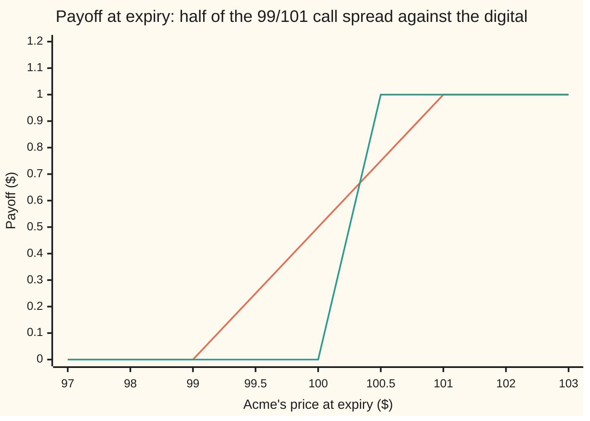
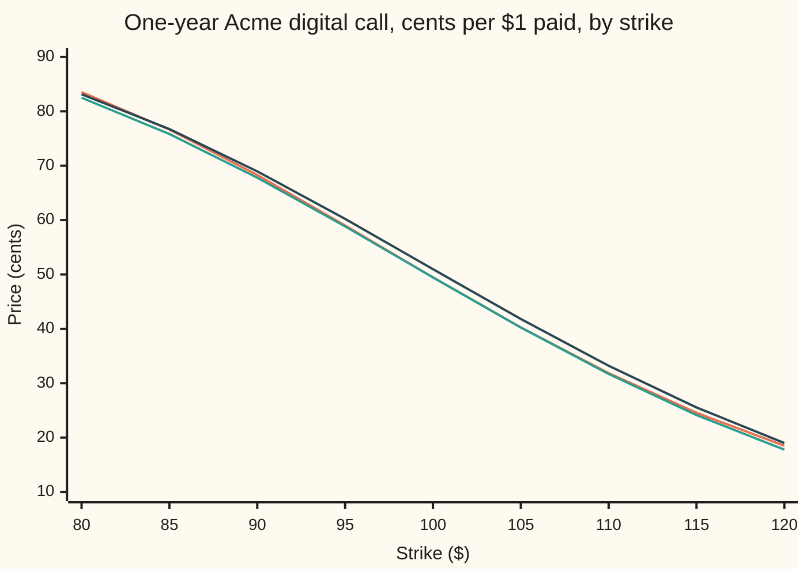

# A digital from a call spread: the limit that prices it, and the extra term the smile adds

[Syllabus](../../../SYLLABUS.md) → [Financial mathematics](../README.md) → [Digitals and the implied density](../README.md#s10) → A digital from a call spread

---

## General Overview

A client asks a bank for a one-year bet on Acme shares, which trade at $100 today. If Acme closes above $100 in a year, the bank pays the client $1. Otherwise it pays nothing. That contract is a **cash-or-nothing digital call**, a digital for short ([Cash-or-nothing digital](01-cash-or-nothing-digital.md)).

The bank cannot buy a digital on an exchange. It can buy ordinary calls, the right to buy one share at a fixed price called the strike. So it builds the digital out of two calls. Buy the call struck at $99, sell the call struck at $101, and hold half of each. At expiry this pair pays nothing below $99, $1 above $101, and climbs in a straight line between. A pair like that is a **call spread**. Its payoff is a ramp; the digital's payoff is a step. Squeeze the two strikes together and the ramp becomes the step.

In the house market the 99/101 spread costs 0.494605 per $1 of payout. The Black-Scholes digital is 0.494581. The two agree to four decimals, which is why the spread is the price.

Then the real market intervenes. Acme's options do not all trade at one volatility (the expected size of Acme's swings, quoted as a percentage per year). Drawn against strike, the volatilities form the **smile**. For shares, low strikes trade at higher volatility than high strikes: the smile slopes down, and that slope is the **skew**. The 99 call is priced at a slightly higher volatility than the 101 call, so the spread costs more, and the digital with it. A call's **vega** is its price change per unit of volatility. For a skew of −0.04 volatility points per dollar of strike, the digital gains 0.015160. That gain is the skew term, and it is how desks price digitals.

**A digital is minus the rate at which the call price falls as the strike rises; a tight call spread measures that rate directly, and when volatility depends on strike the rate picks up an extra piece, vega times the slope of the smile.**

**What kind of fact this is:** a theorem, proved on this card in Why it works. The spread limit needs no model at all; the Black-Scholes value and the skew term follow from it by the chain rule.

### The picture: ramp and step



Orange: the spread, a ramp from $99 to $101. Green: the digital, a step just above $100. The two differ only between $99 and $101. Below $100 the ramp pays a little too much; above $100 it pays a little too little. The two errors are mirror triangles, which is why the spread's price lands so close.

---

## The formula

Notation first. $C(K)$ is the price today of a call struck at $K$. A tick after a function, as in $\sigma'(K)$, means its rate of change as $K$ moves: the derivative. $\partial C / \partial K$ is the same rate for $C$ with every other input held still.

$$\text{digital}(K) \;=\; \lim_{h \to 0} \frac{C(K-h) - C(K+h)}{2h} \;=\; -\frac{dC}{dK}$$

**Read it aloud:** the digital is the price of the tight spread divided by its width, which is minus the slope of the call price against the strike.

With flat volatility this slope is the familiar Black-Scholes digital. When the market prices each strike at its own volatility $\sigma(K)$, the call price is $C(K) = C_{\text{BS}}(K, \sigma(K))$, Black-Scholes fed the strike's own volatility, and the slope gains a term:

$$\text{digital}(K) \;=\; e^{-rT}N(d_2) \;-\; \mathcal{V}\,\sigma'(K)$$

**Read it aloud:** the market digital is the textbook digital at the strike's own volatility, minus vega times the slope of the smile.

| Symbol | Plain meaning | In our example | Push it up and the answer… |
| --- | --- | --- | --- |
| $C(K)$ | price today of a call struck at $K$ | 9.731084 at 99, 8.741874 at 101 | — |
| $K$ | the strike, the level the digital is a bet on | 100 | falls: harder to finish above |
| $h$ | half the gap between the spread's two strikes | 1 | the spread drifts from the digital |
| $S$, $S_T$ | Acme's price today, and at expiry | 100, unknown | rises: more likely to finish above |
| $r$, $q$ | bank rate and dividend yield, continuously compounded | 5%, 2% | $r$: rises here, the higher forward outweighing the heavier discount; $q$: falls, the share drifts lower |
| $T$ | time to expiry, in years | 1 | skew term grows roughly like $\sqrt{T}$ |
| $\sigma$, $\sigma(K)$ | volatility; the market's volatility at strike $K$ | 0.20; 0.2004 at 99, 0.1996 at 101 | at the money, lowers the digital a little |
| $\sigma'(K)$ | slope of the smile: volatility change per $1 of strike | −0.0004, which is −0.04 points | steeper negative slope, dearer digital call |
| $N$, $\varphi$ | bell-curve area to the left of a point; bell-curve height | $N(0.05)$ = 0.519939 | — |
| $d_1$, $d_2$ | distance to the strike in units of $\sigma\sqrt{T}$, as on the call card | 0.25, 0.05 | — |
| $e^{-rT}$ | discount factor $D(T)$: today's value of one dollar due at $T$ | 0.951229 | — |
| $\mathcal{V}$ | vega of the call at $K$: price change per 1.00 of volatility | 37.901158 | bigger skew term |

The helpers are the call card's ([Black–Scholes call](../08-The%20Black-Scholes%20call%20and%20put/01-black-scholes-call.md)):

$$d_1 = \frac{\ln(S/K) + (r - q + \tfrac12\sigma^2)T}{\sigma\sqrt{T}}, \qquad d_2 = d_1 - \sigma\sqrt{T}, \qquad \mathcal{V} = S e^{-qT}\varphi(d_1)\sqrt{T}$$

In words: $d_2$ is how many whole-life swings separate Acme from the strike; $\mathcal{V}$ is how many dollars the call gains per 1.00 of volatility ([Vega](../09-The%20Greeks%2C%20one%20each/03-vega.md)).

A **volatility point** is one percentage point of volatility, 0.01. A skew of −0.04 points per dollar is $\sigma'(K) = -0.0004$. Desks quote the points; the formula takes the decimal.

### When it holds

- **European exercise.** The calls must be exercisable only at expiry. With early exercise the strike slope carries an early-exercise premium and is no longer the digital.
- **No lump of probability at the strike.** If Acme could finish at exactly $100 with a positive chance, the ramp and the step would disagree there forever and the limit would miss by that chance.
- **A smooth smile at the strike.** The skew term needs $\sigma'(K)$ to exist. A kink in the smile at $K$ puts a kink in the call curve, which is a lump of probability at $K$; the two one-sided spreads then disagree.
- **A smile free of arbitrage.** The formula prices any slope, but a digital must lie between 0 and $e^{-rT}$. A smile steep enough to push it outside is quoting prices that cannot all be traded.
- **Two tradeable strikes close to $K$.** The limit is exact; the real hedge uses a real width. At $h = 1$ the centered spread misses the house digital by 0.000023668.
- **The right units.** Vega per 1.00 of volatility with the slope per 1.00 of volatility. Mix a per-point slope with a per-1.00 vega and the term is 100 times too big: the digital comes out at 2.010627, for a contract never worth more than 0.951229.

---

## Why it works

### Step 0: a ramp squeezed into a step

The whole card rests on one picture. The spread pays a ramp. The digital pays a step. As the ramp's two strikes close in on $K$, the ramp and the step agree at every price except $K$ itself. Anything that pays the same everywhere must cost the same today, or someone buys the cheap one, sells the dear one and keeps the difference. So the digital's price is the limit of the spread's price.

### Step 1: the ramp is two calls

A call struck at $K - h$ pays $\max(S_T - K + h, 0)$ at expiry. A call struck at $K + h$ pays $\max(S_T - K - h, 0)$. Subtract and divide by $2h$:

- below $K - h$ both pay nothing: 0;
- between the strikes only the lower call pays: a straight climb from 0 to 1;
- above $K + h$ both pay, and the difference is always $2h$: exactly 1.

That is the ramp. Its price today is the difference of the two call prices divided by $2h$, because a portfolio's price is the sum of its parts' prices.

### Step 2: the limit is minus the strike slope, with no model

Divide a difference of call prices by the gap in strikes and let the gap shrink: that is the definition of the derivative of $C$ in $K$, with a minus sign because the lower strike comes first. So the digital is $-dC/dK$.

A second way to see it uses the pricing average. A call's price is the discounted average of $\max(S_T - K, 0)$ over the market's pricing distribution for $S_T$. Raise $K$ by a cent: every outcome above $K$ pays a cent less, and outcomes below $K$ were paying nothing anyway. So the call falls by one discounted cent times the chance of finishing above $K$. That chance, discounted, is the digital. Nothing about Black-Scholes entered.

<details>
<summary>Detailed proof</summary>

Write $p(x)$ for the pricing density of $S_T$ (the curve whose area over a range is that range's pricing chance). Then $C(K) = e^{-rT}\int_K^\infty (x - K)\,p(x)\,dx$. Differentiate in $K$. The lower limit contributes $(K - K)\,p(K) = 0$. Inside, $\partial(x-K)/\partial K = -1$. So
$$-\frac{dC}{dK} = e^{-rT}\int_K^\infty p(x)\,dx = e^{-rT}\,\text{(pricing chance that } S_T > K).$$
The right side is the digital. In Black-Scholes that chance is $N(d_2)$ (the call card's Step 2). Checked directly: differentiate $C = Se^{-qT}N(d_1) - Ke^{-rT}N(d_2)$ in $K$. Both $d_1$ and $d_2$ have slope $-1/(K\sigma\sqrt{T})$ in $K$, and the identity $Se^{-qT}\varphi(d_1) = Ke^{-rT}\varphi(d_2)$ (the vega card proves it) makes the two chain-rule terms cancel. What is left is $\partial C/\partial K = -e^{-rT}N(d_2)$.

For the finite spread: by Taylor's theorem with $f = C$, $f(K-h) - f(K+h) = -2h f'(K) - \tfrac13 h^3 f'''(K) + \ldots$. Divide by $2h$: the centered spread misses by $-\tfrac16 h^2 f'''(K)$, so halving $h$ quarters the miss. The one-sided spread $(f(K) - f(K+h))/h$ misses by $-\tfrac12 h f''(K)$, so halving $h$ only halves it.

</details>

### Step 3: the market's calls carry their own volatilities

The market does not quote one volatility. It quotes a price at each strike, and the volatility that reproduces that price through Black-Scholes is the **implied volatility** at that strike ([The volatility smile and skew](../12-The%20smile%20and%20the%20surface/01-volatility-smile-and-skew.md)). Drawn against strike, those volatilities form the smile. On this card the smile is a straight line through 0.20 at $100$, falling 0.0004 per dollar: $\sigma(K) = 0.20 - 0.0004\,(K - 100)$.

So the market call is Black-Scholes with the strike's own volatility: $C(K) = C_{\text{BS}}(K, \sigma(K))$. Step 2 still holds, because it never used a model: the market digital is minus the slope of this market call curve.

### Step 4: the chain rule splits the slope in two

Move $K$ up by a small amount. The market call changes for two reasons at once. The strike rose, so the call is worth less at the same volatility: that part is $\partial C_{\text{BS}}/\partial K$, and Step 2 showed it is $-e^{-rT}N(d_2)$. And the volatility changed, by $\sigma'(K)$ per dollar, which moves the call by vega per unit of volatility: that part is $\mathcal{V}\,\sigma'(K)$. The chain rule adds them:

$$\frac{dC}{dK} = \frac{\partial C_{\text{BS}}}{\partial K} + \frac{\partial C_{\text{BS}}}{\partial \sigma}\,\sigma'(K) = -e^{-rT}N(d_2) + \mathcal{V}\,\sigma'(K).$$

Change the sign and the market digital appears: $e^{-rT}N(d_2) - \mathcal{V}\,\sigma'(K)$.

### Step 5: which way it moves

In equity markets low strikes trade at higher volatility than high strikes, so $\sigma'(K)$ is negative and the skew term is positive: the digital call is worth more than the textbook says. In spread terms, the call bought at $99$ is priced at 0.2004 and the call sold at $101$ at 0.1996. The buyer pays a little extra volatility on the long leg and receives a little less on the short leg, so the spread costs more.

The digital put pays one dollar if Acme finishes below the strike. A put spread builds it the same way, and a call digital plus a put digital at the same strike pays $1 for sure, worth $e^{-rT}$ with or without a smile. So the put digital loses exactly what the call digital gains.

The same limit, taken one step further, is the next card's subject: the spread of two spreads, a butterfly, is minus the slope of the digital, and that slope is the pricing density itself.

---

## Worked numbers, by hand

House market: $S = K = 100$, $r = 5\%$, $q = 2\%$, $\sigma = 0.20$, $T = 1$, and a smile slope of −0.0004 per dollar for the second half.

| Step | Arithmetic | Value |
| --- | --- | --- |
| $d_1$, $d_2$ | as on the call card | 0.25, 0.05 |
| $N(d_2)$ | bell-curve area left of 0.05 | 0.519939 |
| discount | $e^{-0.05}$ | 0.951229 |
| flat digital | 0.951229 × 0.519939 | **0.494581** |
| 99 call, 101 call | Black-Scholes at 0.20 | 9.731084, 8.741874 |
| the 99/101 spread | (9.731084 − 8.741874) / 2 | 0.494605 |
| vega at 100 | $100\,e^{-0.02}\,\varphi(0.25)$ | 37.901158 |
| skew term | −37.901158 × (−0.0004) | 0.015160 |
| market digital | 0.494581 + 0.015160, rounded at the sixth place | **0.509742** |
| market 99/101 spread | calls at 0.2004 and 0.1996 | 0.509747 |

The flat digital says the one-dollar bet is worth 49.46 cents. On the skewed market it is worth 50.97 cents. The 99/101 spread gets both right to four decimals, because it is the thing being measured.

The put side, read off the same smile: the digital put falls from 0.456648 to 0.441488, and call plus put stays at 0.951229 in both markets.

### How desks quote it

A desk that sells the digital hedges with a one-sided spread it knows pays at least as much. Long the 99 call and short the 100 call, one each, pays a ramp that reaches $1 by $100: never less than the digital. Long 100 and short 101 pays a ramp that starts at $100: never more. On the skewed market those two cost 0.519031 and 0.500463, and the digital, 0.509742, must lie between them. The width of that sandwich is the price of not being able to trade the exact step.

### The spread carries the digital's Greeks

| Greek | Digital, formula | 99/101 spread | Meaning |
| --- | --- | --- | --- |
| delta | 0.018951 | 0.018943 | dollars gained per $1 rise in Acme |
| vega | −0.473764 | −0.473644 | dollars per 1.00 of volatility; negative at the money |

The spread's Greeks match the digital's to three decimal places, so hedging the spread's risk hedges the digital's. The large delta near expiry and the pin risk it brings are on [Digital Greeks and pin risk](03-digital-greeks-and-pin-risk.md).

### What breaks if you drop a piece

Correct market digital: 0.509742.

| Mistake | Comes out at | What went wrong |
| --- | --- | --- |
| Strike's volatility into $e^{-rT}N(d_2)$, no skew term | 0.494581 | Priced a Black-Scholes digital, not the market's; 0.015160 short |
| $N(d_1)$ in place of $N(d_2)$ | 0.569507 | That is the chance counted in shares, which belongs to the asset-or-nothing digital |
| Slope quoted in points, −0.04, used as a decimal | 2.010627 | 100 times too big; more than the 0.951229 a sure $1 costs |
| Sign of the skew term flipped | 0.479421 | Added vega times a negative slope instead of subtracting it |
| $C(99) - C(101)$, not divided by the width | 1.019493 | That spread pays $2 at the top, not $1 |
| One-sided 100/101 spread taken as the digital (flat market) | 0.485131 | A ramp starting at the strike; misses by half the width times the discounted density |

---

## Code, from first principles, and it actually runs

The code prices the flat digital four independent ways: the formula with a normal CDF built from its own series, the tight call spread, Simpson's rule over the bell curve above $-d_2$, and a 200,000-path simulation driven by a hand-written random-number generator. It then prices the skewed digital two ways, by the chain-rule formula and by call spreads on the smile, and checks that the call and put digitals still sum to one discounted dollar. It reproduces every wrong answer above, the sandwich, the Greeks, both charts and the width table.

### Python

```python
# A digital from a call spread, and the skew term -- the check behind the card.
# Standard library only. The normal CDF is a series written out, the integral is
# Simpson's rule, the random numbers come from a 64-bit xorshift written here.
from math import log, sqrt, exp, pi, cos

def phi(x): return exp(-0.5 * x * x) / sqrt(2.0 * pi)      # bell-curve height
def N(x):                                                  # 0.5 + phi(x)(x + x^3/3 + x^5/15 + ...)
    term, total, n = x, x, 1
    while abs(term) > 1e-18 and n < 999:
        term *= x * x / (2 * n + 1); total += term; n += 1
    return 0.5 + phi(x) * total

S, K, r, q, sig, T, s = 100.0, 100.0, 0.05, 0.02, 0.20, 1.0, -0.0004
D0 = exp(-r * T)                                           # discount factor D(T)
def d12(S, K, v, T):
    d1 = (log(S / K) + (r - q + 0.5 * v * v) * T) / (v * sqrt(T))
    return d1, d1 - v * sqrt(T)
def call(K, v, S=S, T=T):
    d1, d2 = d12(S, K, v, T); return S * exp(-q * T) * N(d1) - K * exp(-r * T) * N(d2)
def put(K, v, S=S, T=T):
    d1, d2 = d12(S, K, v, T); return K * exp(-r * T) * N(-d2) - S * exp(-q * T) * N(-d1)
def digital(K, v, T=T): return exp(-r * T) * N(d12(S, K, v, T)[1])
def vega(K, v, T=T): return S * exp(-q * T) * phi(d12(S, K, v, T)[0]) * sqrt(T)
def smile(K, s=s): return sig + s * (K - 100.0)            # vol falls 0.04 points per $1 of strike
def mcall(K, s=s, T=T): return call(K, smile(K, s), T=T)
def mput(K, s=s): return put(K, smile(K, s))
def skewed(K, s=s, T=T): return digital(K, smile(K, s), T) - vega(K, smile(K, s), T) * s
def spread(f, K, h): return (f(K - h) - f(K + h)) / (2 * h)

flat = lambda k: call(k, sig)
D, h = digital(K, sig), 0.01
cs1, cst, one = spread(flat, K, 1.0), spread(flat, K, h), flat(K) - flat(K + 1)
d1, d2 = d12(S, K, sig, T)
M = 4000; a, b = -d2, 8.0; w = (b - a) / M                  # road 3: Simpson over z > -d2
simp = D0 * w / 3 * sum((1 if i in (0, M) else 4 if i % 2 else 2) * phi(a + i * w) for i in range(M + 1))
x, hits, n = 88172645463325252, 0, 200000                 # road 4: simulate S_T
def rnd():
    global x
    x ^= (x << 13) & 0xFFFFFFFFFFFFFFFF; x ^= x >> 7; x ^= (x << 17) & 0xFFFFFFFFFFFFFFFF
    return ((x >> 11) + 0.5) / 9007199254740992.0
for _ in range(n // 2):
    u1, u2 = rnd(), rnd(); rad = sqrt(-2.0 * log(u1))
    for z in (rad * cos(2 * pi * u2), -rad * cos(2 * pi * u2)):
        hits += S * exp((r - q - 0.5 * sig * sig) * T + sig * sqrt(T) * z) > K
mc, se = D0 * hits / n, D0 * sqrt(hits / n * (1 - hits / n) / n)
pflat = (put(K + 1, sig) - put(K - 1, sig)) / 2

V = vega(K, sig); Vb = (call(K, sig + 1e-4) - call(K, sig - 1e-4)) / 2e-4
corr, Dsk = -V * s, skewed(K)
mcs1, mcst = spread(mcall, K, 1.0), spread(mcall, K, h)
mpst = -spread(mput, K, h)
lo, hi = mcall(K) - mcall(K + 1), mcall(K - 1) - mcall(K)
ddelta = D0 * phi(d2) / (S * sig * sqrt(T))
cdelta = lambda k, S1: (call(k, sig, S=S1 + 1e-3) - call(k, sig, S=S1 - 1e-3)) / 2e-3
sdelta = (cdelta(K - 1, S) - cdelta(K + 1, S)) / 2
dvega = -D0 * phi(d2) * d1 / sig
svega = (vega(K - 1, sig) - vega(K + 1, sig)) / 2

rows = [("d1", d1), ("d2", d2), ("N(d2)", N(d2)), ("discount e^-rT", D0),
    ("1 digital e^-rT N(d2)", D), ("2 spread (C(99)-C(101))/2", cs1), ("  C(99)", flat(99)), ("  C(101)", flat(101)),
    ("  spread, h = 0.01", cst), ("3 Simpson over z > -d2", simp), ("4 simulated, 200000 paths", mc), ("  std error", se),
    ("digital put e^-rT N(-d2)", D0 * N(-d2)), ("  put spread (P(101)-P(99))/2", pflat), ("  call + put", cs1 + pflat),
    ("vega at 100, formula", V), ("  vega by bump", Vb), ("skew slope dsigma/dK", s), ("skew term -vega x slope", corr),
    ("market vol at 99", smile(99)), ("market vol at 101", smile(101)),
    ("5 skewed digital, formula", Dsk), ("6 market spread, h = 1", mcs1), ("  market spread, h = 0.01", mcst),
    ("  market digital put", mpst), ("  call + put", mcst + mpst), ("  lower C(100)-C(101)", lo), ("  upper C(99)-C(100)", hi),
    ("greek: digital delta", ddelta), ("  spread delta", sdelta), ("greek: digital vega", dvega), ("  spread vega", svega),
    ("wrong: strike vol, no skew", D), ("wrong: N(d1)", D0 * N(d1)), ("wrong: slope in points", D - V * (-0.04)),
    ("wrong: sign flipped", D + V * s), ("wrong: no divide by width", mcall(99) - mcall(101)),
    ("wrong: one-sided 100/101", one),
    ("try: slope -0.0008", skewed(K, -0.0008)), ("try: K = 110, term", -vega(110, smile(110)) * s),
    ("try: T = 0.25, term", -vega(K, sig, 0.25) * s), ("try: h = 5 spread", spread(flat, K, 5.0))]
for name, v in rows: print(f"{name:<30} {v:>12.6f}")
print("width     centered miss   one-sided miss")
miss = []
for hh in (2.0, 1.0, 0.5, 0.25):
    miss.append(spread(flat, K, hh) - D)
    print(f"{hh:5.2f} {miss[-1]:16.9f} {(flat(K) - flat(K + hh)) / hh - D:16.9f}")
ks = [80.0 + 5 * i for i in range(9)]
print("chart, strike         " + " ".join(f"{k:6.0f}" for k in ks))
print("chart, flat, cents    " + " ".join(f"{100 * digital(k, sig):6.2f}" for k in ks))
print("chart, strike vol     " + " ".join(f"{100 * digital(k, smile(k)):6.2f}" for k in ks))
print("chart, market, cents  " + " ".join(f"{100 * skewed(k):6.2f}" for k in ks))
xs = [97.0, 98.0, 99.0, 99.5, 100.0, 100.5, 101.0, 102.0, 103.0]
print("chart, S_T            " + " ".join(f"{v:6.1f}" for v in xs))
print("chart, ramp           " + " ".join(f"{(max(v - 99, 0) - max(v - 101, 0)) / 2:6.2f}" for v in xs))
print("chart, step           " + " ".join(f"{1.0 if v > K else 0.0:6.2f}" for v in xs))

assert abs(cst - D) < 1e-8, "tight flat spread vs e^-rT N(d2)"
assert abs(simp - D) < 1e-10, "Simpson road vs the series CDF"
assert abs(mc - D) < 4 * se, "simulation within 4 standard errors"
assert abs(Vb - V) < 1e-6, "bumped vega vs formula"
assert abs(mcst - Dsk) < 1e-7, "tight market spread vs digital + skew term"
assert abs(mcst + mpst - exp(-r * T)) < 1e-8, "market call + put digitals = one discounted dollar"
assert lo < mcst < hi, "market digital inside the two one-sided spreads"
assert flat(K) - flat(K + 1) < simp < flat(K - 1) - flat(K), "flat digital inside the sandwich"
assert all(3.8 < miss[i] / miss[i + 1] < 4.1 for i in range(3)), "centered miss quarters as width halves"
assert abs(sdelta - ddelta) < 1e-4, "spread delta near digital delta"
assert abs(svega - dvega) < 1e-3, "spread vega near digital vega"
print("ALL CHECKS PASS")
```

**Ran 2026-09-19 on macOS, Python 3.14.6, standard library only. All checks passed. Output, pasted from the run:**

```
d1                                 0.250000
d2                                 0.050000
N(d2)                              0.519939
discount e^-rT                     0.951229
1 digital e^-rT N(d2)              0.494581
2 spread (C(99)-C(101))/2          0.494605
  C(99)                            9.731084
  C(101)                           8.741874
  spread, h = 0.01                 0.494581
3 Simpson over z > -d2             0.494581
4 simulated, 200000 paths          0.494891
  std error                        0.001063
digital put e^-rT N(-d2)           0.456648
  put spread (P(101)-P(99))/2      0.456625
  call + put                       0.951229
vega at 100, formula              37.901158
  vega by bump                    37.901157
skew slope dsigma/dK              -0.000400
skew term -vega x slope            0.015160
market vol at 99                   0.200400
market vol at 101                  0.199600
5 skewed digital, formula          0.509742
6 market spread, h = 1             0.509747
  market spread, h = 0.01          0.509742
  market digital put               0.441488
  call + put                       0.951229
  lower C(100)-C(101)              0.500463
  upper C(99)-C(100)               0.519031
greek: digital delta               0.018951
  spread delta                     0.018943
greek: digital vega               -0.473764
  spread vega                     -0.473644
wrong: strike vol, no skew         0.494581
wrong: N(d1)                       0.569507
wrong: slope in points             2.010627
wrong: sign flipped                0.479421
wrong: no divide by width          1.019493
wrong: one-sided 100/101           0.485131
try: slope -0.0008                 0.524902
try: K = 110, term                 0.015215
try: T = 0.25, term                0.007877
try: h = 5 spread                  0.495161
width     centered miss   one-sided miss
 2.00      0.000094431     -0.018841195
 1.00      0.000023668     -0.009449751
 0.50      0.000005921     -0.004731490
 0.25      0.000001480     -0.002367313
chart, strike             80     85     90     95    100    105    110    115    120
chart, flat, cents     83.53  76.65  68.29  59.01  49.46  40.25  31.85  24.56  18.50
chart, strike vol      82.49  75.83  67.80  58.83  49.46  40.25  31.69  24.14  17.78
chart, market, cents   83.14  76.74  68.97  60.21  50.97  41.81  33.21  25.54  19.01
chart, S_T              97.0   98.0   99.0   99.5  100.0  100.5  101.0  102.0  103.0
chart, ramp             0.00   0.00   0.00   0.25   0.50   0.75   1.00   1.00   1.00
chart, step             0.00   0.00   0.00   0.00   0.00   1.00   1.00   1.00   1.00
ALL CHECKS PASS
```

### Rust

```rust
// A digital from a call spread, and the skew term -- the check behind the card.
// std only. The normal CDF is a series written out, the integral is Simpson's
// rule, the random numbers come from a 64-bit xorshift written here.
use std::f64::consts::PI;

const S: f64 = 100.0; const K: f64 = 100.0; const R: f64 = 0.05; const Q: f64 = 0.02;
const SIG: f64 = 0.20; const T: f64 = 1.0; const SL: f64 = -0.0004;

fn phi(x: f64) -> f64 { (-0.5 * x * x).exp() / (2.0 * PI).sqrt() }
fn n(x: f64) -> f64 { // 0.5 + phi(x)(x + x^3/3 + x^5/15 + ...)
    let (mut term, mut total, mut k) = (x, x, 1.0);
    while term.abs() > 1e-18 && k < 999.0 { term *= x * x / (2.0 * k + 1.0); total += term; k += 1.0; }
    0.5 + phi(x) * total
}
fn d12(s: f64, k: f64, v: f64, t: f64) -> (f64, f64) {
    let d1 = ((s / k).ln() + (R - Q + 0.5 * v * v) * t) / (v * t.sqrt());
    (d1, d1 - v * t.sqrt())
}
fn call_s(s: f64, k: f64, v: f64, t: f64) -> f64 {
    let (d1, d2) = d12(s, k, v, t); s * (-Q * t).exp() * n(d1) - k * (-R * t).exp() * n(d2)
}
fn call(k: f64, v: f64) -> f64 { call_s(S, k, v, T) }
fn put(k: f64, v: f64) -> f64 {
    let (d1, d2) = d12(S, k, v, T); k * (-R * T).exp() * n(-d2) - S * (-Q * T).exp() * n(-d1)
}
fn digital(k: f64, v: f64, t: f64) -> f64 { (-R * t).exp() * n(d12(S, k, v, t).1) }
fn vega(k: f64, v: f64, t: f64) -> f64 { S * (-Q * t).exp() * phi(d12(S, k, v, t).0) * t.sqrt() }
fn smile(k: f64, s: f64) -> f64 { SIG + s * (k - 100.0) } // vol falls 0.04 points per $1 of strike
fn mcall(k: f64) -> f64 { call(k, smile(k, SL)) }
fn mput(k: f64) -> f64 { put(k, smile(k, SL)) }
fn skewed(k: f64, s: f64, t: f64) -> f64 { digital(k, smile(k, s), t) - vega(k, smile(k, s), t) * s }
fn spread(f: &dyn Fn(f64) -> f64, k: f64, h: f64) -> f64 { (f(k - h) - f(k + h)) / (2.0 * h) }
fn flat(k: f64) -> f64 { call(k, SIG) }

fn main() {
    let d0 = (-R * T).exp();
    let (d, h) = (digital(K, SIG, T), 0.01);
    let (cs1, cst, one) = (spread(&flat, K, 1.0), spread(&flat, K, h), flat(K) - flat(K + 1.0));
    let (d1, d2) = d12(S, K, SIG, T);
    let m = 4000; let (a, b) = (-d2, 8.0); let w = (b - a) / m as f64; // road 3: Simpson over z > -d2
    let mut acc = 0.0;
    for i in 0..=m { let c = if i == 0 || i == m { 1.0 } else if i % 2 == 1 { 4.0 } else { 2.0 }; acc += c * phi(a + i as f64 * w); }
    let simp = d0 * w / 3.0 * acc;
    let (mut x, mut hits, nn): (u64, u64, u64) = (88172645463325252, 0, 200000); // road 4: simulate S_T
    let mut rnd = || { x ^= x << 13; x ^= x >> 7; x ^= x << 17; ((x >> 11) as f64 + 0.5) / 9007199254740992.0 };
    for _ in 0..nn / 2 {
        let (u1, u2) = (rnd(), rnd()); let rad = (-2.0 * u1.ln()).sqrt();
        for z in [rad * (2.0 * PI * u2).cos(), -rad * (2.0 * PI * u2).cos()] {
            if S * ((R - Q - 0.5 * SIG * SIG) * T + SIG * T.sqrt() * z).exp() > K { hits += 1; }
        }
    }
    let p = hits as f64 / nn as f64;
    let (mc, se) = (d0 * p, d0 * (p * (1.0 - p) / nn as f64).sqrt());
    let pflat = (put(K + 1.0, SIG) - put(K - 1.0, SIG)) / 2.0;

    let v = vega(K, SIG, T); let vb = (call(K, SIG + 1e-4) - call(K, SIG - 1e-4)) / 2e-4;
    let (corr, dsk) = (-v * SL, skewed(K, SL, T));
    let (mcs1, mcst) = (spread(&mcall, K, 1.0), spread(&mcall, K, h));
    let mpst = -spread(&mput, K, h);
    let (lo, hi) = (mcall(K) - mcall(K + 1.0), mcall(K - 1.0) - mcall(K));
    let ddelta = d0 * phi(d2) / (S * SIG * T.sqrt());
    let cdelta = |k: f64, s1: f64| (call_s(s1 + 1e-3, k, SIG, T) - call_s(s1 - 1e-3, k, SIG, T)) / 2e-3;
    let sdelta = (cdelta(K - 1.0, S) - cdelta(K + 1.0, S)) / 2.0;
    let dvega = -d0 * phi(d2) * d1 / SIG;
    let svega = (vega(K - 1.0, SIG, T) - vega(K + 1.0, SIG, T)) / 2.0;

    let rows: Vec<(&str, f64)> = vec![("d1", d1), ("d2", d2), ("N(d2)", n(d2)), ("discount e^-rT", d0),
        ("1 digital e^-rT N(d2)", d), ("2 spread (C(99)-C(101))/2", cs1), ("  C(99)", flat(99.0)), ("  C(101)", flat(101.0)),
        ("  spread, h = 0.01", cst), ("3 Simpson over z > -d2", simp), ("4 simulated, 200000 paths", mc), ("  std error", se),
        ("digital put e^-rT N(-d2)", d0 * n(-d2)), ("  put spread (P(101)-P(99))/2", pflat), ("  call + put", cs1 + pflat),
        ("vega at 100, formula", v), ("  vega by bump", vb), ("skew slope dsigma/dK", SL), ("skew term -vega x slope", corr),
        ("market vol at 99", smile(99.0, SL)), ("market vol at 101", smile(101.0, SL)),
        ("5 skewed digital, formula", dsk), ("6 market spread, h = 1", mcs1), ("  market spread, h = 0.01", mcst),
        ("  market digital put", mpst), ("  call + put", mcst + mpst), ("  lower C(100)-C(101)", lo), ("  upper C(99)-C(100)", hi),
        ("greek: digital delta", ddelta), ("  spread delta", sdelta), ("greek: digital vega", dvega), ("  spread vega", svega),
        ("wrong: strike vol, no skew", d), ("wrong: N(d1)", d0 * n(d1)), ("wrong: slope in points", d - v * (-0.04)),
        ("wrong: sign flipped", d + v * SL), ("wrong: no divide by width", mcall(99.0) - mcall(101.0)),
        ("wrong: one-sided 100/101", one),
        ("try: slope -0.0008", skewed(K, -0.0008, T)), ("try: K = 110, term", -vega(110.0, smile(110.0, SL), T) * SL),
        ("try: T = 0.25, term", -vega(K, SIG, 0.25) * SL), ("try: h = 5 spread", spread(&flat, K, 5.0))];
    for (name, val) in &rows { println!("{:<30} {:>12.6}", name, val); }
    println!("width     centered miss   one-sided miss");
    let mut miss = vec![];
    for hh in [2.0, 1.0, 0.5, 0.25] {
        miss.push(spread(&flat, K, hh) - d);
        println!("{:5.2} {:16.9} {:16.9}", hh, miss[miss.len() - 1], (flat(K) - flat(K + hh)) / hh - d);
    }
    let ks: Vec<f64> = (0..9).map(|i| 80.0 + 5.0 * i as f64).collect();
    let line = |lab: &str, vals: Vec<String>| println!("{}{}", lab, vals.join(" "));
    line("chart, strike         ", ks.iter().map(|k| format!("{:6.0}", k)).collect());
    line("chart, flat, cents    ", ks.iter().map(|&k| format!("{:6.2}", 100.0 * digital(k, SIG, T))).collect());
    line("chart, strike vol     ", ks.iter().map(|&k| format!("{:6.2}", 100.0 * digital(k, smile(k, SL), T))).collect());
    line("chart, market, cents  ", ks.iter().map(|&k| format!("{:6.2}", 100.0 * skewed(k, SL, T))).collect());
    let xs = [97.0, 98.0, 99.0, 99.5, 100.0, 100.5, 101.0, 102.0, 103.0];
    line("chart, S_T            ", xs.iter().map(|v| format!("{:6.1}", v)).collect());
    line("chart, ramp           ", xs.iter().map(|&v: &f64| format!("{:6.2}", ((v - 99.0).max(0.0) - (v - 101.0).max(0.0)) / 2.0)).collect());
    line("chart, step           ", xs.iter().map(|&v| format!("{:6.2}", if v > K { 1.0 } else { 0.0 })).collect());

    assert!((cst - d).abs() < 1e-8, "tight flat spread vs e^-rT N(d2)");
    assert!((simp - d).abs() < 1e-10, "Simpson road vs the series CDF");
    assert!((mc - d).abs() < 4.0 * se, "simulation within 4 standard errors");
    assert!((vb - v).abs() < 1e-6, "bumped vega vs formula");
    assert!((mcst - dsk).abs() < 1e-7, "tight market spread vs digital + skew term");
    assert!((mcst + mpst - (-R * T).exp()).abs() < 1e-8, "market call + put digitals = one discounted dollar");
    assert!(lo < mcst && mcst < hi, "market digital inside the two one-sided spreads");
    assert!(flat(K) - flat(K + 1.0) < simp && simp < flat(K - 1.0) - flat(K), "flat digital inside the sandwich");
    assert!((0..3).all(|i| miss[i] / miss[i + 1] > 3.8 && miss[i] / miss[i + 1] < 4.1), "centered miss quarters");
    assert!((sdelta - ddelta).abs() < 1e-4, "spread delta near digital delta");
    assert!((svega - dvega).abs() < 1e-3, "spread vega near digital vega");
    println!("ALL CHECKS PASS");
}
```

**Ran 2026-09-19 on macOS, rustc 1.98.1, no crates. All checks passed. Output, pasted from the run:**

```
d1                                 0.250000
d2                                 0.050000
N(d2)                              0.519939
discount e^-rT                     0.951229
1 digital e^-rT N(d2)              0.494581
2 spread (C(99)-C(101))/2          0.494605
  C(99)                            9.731084
  C(101)                           8.741874
  spread, h = 0.01                 0.494581
3 Simpson over z > -d2             0.494581
4 simulated, 200000 paths          0.494891
  std error                        0.001063
digital put e^-rT N(-d2)           0.456648
  put spread (P(101)-P(99))/2      0.456625
  call + put                       0.951229
vega at 100, formula              37.901158
  vega by bump                    37.901157
skew slope dsigma/dK              -0.000400
skew term -vega x slope            0.015160
market vol at 99                   0.200400
market vol at 101                  0.199600
5 skewed digital, formula          0.509742
6 market spread, h = 1             0.509747
  market spread, h = 0.01          0.509742
  market digital put               0.441488
  call + put                       0.951229
  lower C(100)-C(101)              0.500463
  upper C(99)-C(100)               0.519031
greek: digital delta               0.018951
  spread delta                     0.018943
greek: digital vega               -0.473764
  spread vega                     -0.473644
wrong: strike vol, no skew         0.494581
wrong: N(d1)                       0.569507
wrong: slope in points             2.010627
wrong: sign flipped                0.479421
wrong: no divide by width          1.019493
wrong: one-sided 100/101           0.485131
try: slope -0.0008                 0.524902
try: K = 110, term                 0.015215
try: T = 0.25, term                0.007877
try: h = 5 spread                  0.495161
width     centered miss   one-sided miss
 2.00      0.000094431     -0.018841195
 1.00      0.000023668     -0.009449751
 0.50      0.000005921     -0.004731490
 0.25      0.000001480     -0.002367313
chart, strike             80     85     90     95    100    105    110    115    120
chart, flat, cents     83.53  76.65  68.29  59.01  49.46  40.25  31.85  24.56  18.50
chart, strike vol      82.49  75.83  67.80  58.83  49.46  40.25  31.69  24.14  17.78
chart, market, cents   83.14  76.74  68.97  60.21  50.97  41.81  33.21  25.54  19.01
chart, S_T              97.0   98.0   99.0   99.5  100.0  100.5  101.0  102.0  103.0
chart, ramp             0.00   0.00   0.00   0.25   0.50   0.75   1.00   1.00   1.00
chart, step             0.00   0.00   0.00   0.00   0.00   1.00   1.00   1.00   1.00
ALL CHECKS PASS
```

The two outputs are identical to the printed precision.

The width table shows the two kinds of spread. Centered, the miss goes 0.000094431, 0.000023668, 0.000005921, 0.000001480: it quarters each time the width halves. One-sided, it goes −0.018841195, −0.009449751, −0.004731490, −0.002367313: it only halves. The centered spread's two triangle errors cancel to first order; the one-sided spread has only one triangle.

### The digital across strikes



Orange: flat 20% at every strike. Green: each strike's own smile volatility plugged into $e^{-rT}N(d_2)$, the usual mistake. Dark: the market digital, green plus the skew term. The gap between green and dark is the skew term: 0.015160 per dollar at the 100 strike, and present at every strike because vega is.

> [!TIP]
> **Try changing**
> - **Double the skew**, slope −0.0008. Guess first. The skew term doubles and the digital becomes 0.524902.
> - **Move the strike to $110**. Guess first: vega is lower away from the money, so the term should shrink. It barely moves, to 0.015215: vega peaks a little above today's price, so the 110 call's vega is almost the 100 call's.
> - **Shorten to three months**, $T = 0.25$. Vega grows like $\sqrt{T}$, so the term should roughly halve. It does: 0.007877.
> - **Widen the spread** to 95/105, $h = 5$. The centered spread reads 0.495161. Five times the width, and the miss grows roughly with the square of that, as the width table above predicts.

---

## The usual mistake

> [!warning]
> **Plugging the strike's implied volatility into $e^{-rT}N(d_2)$ and stopping.** That prices a digital in a world where every strike has that same volatility, which is not the market the hedge trades in. The hedge is the call spread, and the call spread feels the slope of the smile. On the house skew the shortfall is 0.015160 per dollar of payout, on a product often sold in size.
>
> - **Volatility points versus decimals.** A slope of −0.04 points per dollar is −0.0004. Feeding in −0.04 with vega per 1.00 gives 2.010627, more than a sure $1.
> - **The sign.** A falling smile makes the digital call dearer and the digital put cheaper. Get the sign wrong and the call comes out at 0.479421.
> - **Forgetting to divide by the width.** The 99/101 pair pays $2 at the top. Its raw cost, 1.019493, is two digitals, not one.
> - **A one-sided spread as the price.** The 100/101 spread misses by 0.009449751 per unit; it is a hedge bound, not a mid price.

---

## Where you meet it in real life

- **Digital options in currency markets.** Banks quote them against the smile and hedge them with tight call spreads; the skew term is part of the quote.
- **Structured notes.** A note that pays a fixed coupon if an index ends above a level contains a digital, and the issuer prices it with the smile's slope.
- **Bid and offer on a digital.** The two one-sided spreads bracket the price; a desk shades toward the one it will actually hedge with, the overhedge.
- **The market's own probability.** A tight spread divided by the discount factor is the pricing chance of finishing above the strike, read straight off quoted calls. It is the first number the next card differentiates again.
- **Model checks.** Any model that claims to fit the smile must reproduce the spread prices at every strike; the skew term is a fast test.

> **Say it back**
> A digital pays one dollar if the stock finishes above the strike. Half a call spread across two strikes pays a ramp, and as the strikes close in the ramp becomes the step, so the digital is minus the slope of the call price in the strike. With one volatility that slope is $e^{-rT}N(d_2)$. On a skewed market each strike has its own volatility, the chain rule adds vega times the smile's slope, and a falling smile makes the digital call dearer: 0.509742 instead of 0.494581 in the house market.

---

## What this builds on

- [Digital Greeks and pin risk](03-digital-greeks-and-pin-risk.md): the digital's delta and vega, and why a step payoff is hard to hedge near expiry. This card shows the spread carries those Greeks.
- [Shape across strikes and expiries](../08-The%20Black-Scholes%20call%20and%20put/05-strike-and-calendar-shape.md): call prices fall in strike by less than the discounted gap and curve upward. This card turns that fall per dollar into a price.

## Where this goes next

- [The butterfly and the implied density](05-butterfly-and-the-implied-density.md): difference the call curve once more, with three strikes, and the pricing density of $S_T$ appears.

The spread gave the market's chance of finishing above one strike; the open question is the whole distribution of where Acme finishes, and the butterfly answers it.

---

## Sources

Verified 2026-09-24: every link below resolves to the publisher's page.

- Breeden, Douglas T., and Robert H. Litzenberger. "Prices of State-Contingent Claims Implicit in Option Prices." *Journal of Business* 51, no. 4 (1978): 621–651. [doi:10.1086/296025](https://doi.org/10.1086/296025). Prices of payoffs across strikes read off call prices; the digital as minus the strike slope.
- Carr, Peter, Katrina Ellis, and Vishal Gupta. "Static Hedging of Exotic Options." *Journal of Finance* 53, no. 3 (1998): 1165–1190. [doi:10.1111/0022-1082.00048](https://doi.org/10.1111/0022-1082.00048). Hedging exotic payoffs with a fixed basket of vanilla options held to expiry.
- Derman, Emanuel, and Michael B. Miller. *The Volatility Smile*. Wiley, 2016. [Publisher page](https://www.wiley.com/en-us/The+Volatility+Smile-p-9781118959169). Digitals under a skew, and the vega-times-slope correction.
- Hull, John C. *Options, Futures, and Other Derivatives*, 11th ed. Pearson. [Publisher page](https://www.pearson.com/en-us/subject-catalog/p/options-futures-and-other-derivatives/P200000005938). Binary options and bull spreads, the textbook route.
