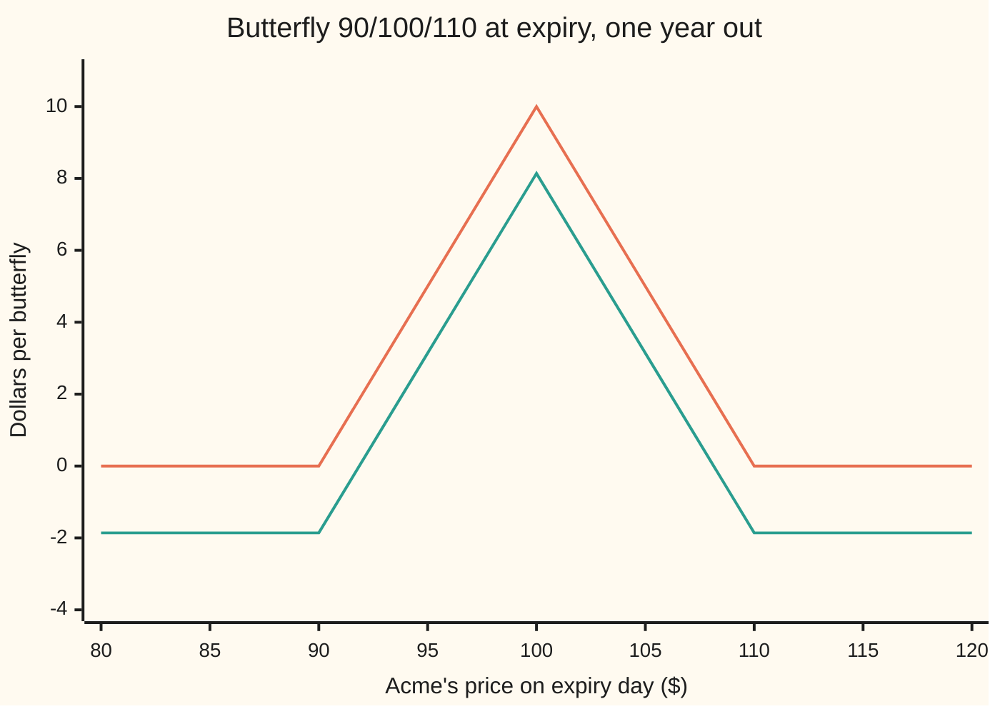
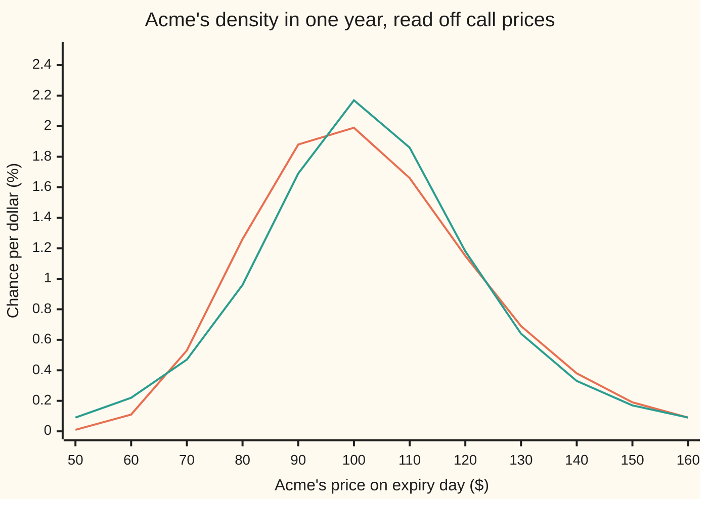

# The butterfly and the implied density: differentiate call prices twice in strike and the market's probabilities fall out

Financial mathematics → Digitals and the implied density → Reading probabilities off prices → The butterfly and the implied density

---

## General Overview

Acme shares trade at $100. One-year calls on Acme are listed at every strike. The call struck at $99 costs $9.73, the one at $100 costs $9.23, the one at $101 costs $8.74. A trader buys the $99 call and the $101 call and sells two of the $100 calls. Net cost: about 1.9 cents.

That position is a **butterfly**: a bet that pays only if Acme finishes near $100. It pays $1 if Acme lands exactly on $100, less on either side, nothing below $99 or above $101. So its price is the market's price for "Acme ends up close to $100". Undo the one year of interest and that price becomes a probability per dollar of stock price: a **density**, the height of the probability curve at $100.

Slide the butterfly along every strike and the whole probability curve appears, read straight off prices. No model of how Acme moves is needed. The calculus version of "buy one, sell two, buy one" is the second derivative of the call price in strike: the rate at which the price curve bends. Douglas Breeden and Robert Litzenberger proved this in 1978.

**Differentiate call prices once in strike and the chance of finishing above that strike falls out; differentiate twice and the probability density of the finishing price falls out, after one undo of discounting.**

**What kind of fact this is:** a theorem, proved on this card in Why it works. It holds for any set of arbitrage-free call prices, whatever model produced them; the lognormal formula for the house market is one case of it.

### The picture: what a butterfly pays

A wider butterfly is easier to see. Buy the $90 call, sell two $100 calls, buy the $110 call. It costs $1.86 today and pays a tent at expiry.



Orange: the payoff, a tent 10 wide on each side and $10 tall at $100. Green: the same after paying $1.86 for it. The tent's area is 10 × 10 = 100 square dollars. That area is the key to the whole card: a tent of half-width h has height h and area h squared.

---

## The formula

Notation first, in words. $C(K)$ is today's price of the call struck at $K$, all other terms held fixed. The symbol $\partial C / \partial K$ is its slope: how fast the price changes as the strike moves, everything else held still. $\partial^2 C / \partial K^2$ is the slope of that slope: how fast the price curve bends.

$$f(K) \;=\; \frac{1}{D(T)}\,\frac{\partial^2 C}{\partial K^2}(K), \qquad D(T) = e^{-rT}$$

**Read it aloud:** the probability density of the finishing price at K is the bend of the call price curve at K, grown back up by one year of interest.

The version that runs on quotes replaces the bend by a butterfly of half-width $h$:

$$\frac{\partial^2 C}{\partial K^2} \;\approx\; \frac{C(K-h) - 2\,C(K) + C(K+h)}{h^2}$$

**Read it aloud:** the bend is the butterfly's price divided by the tent's area.

On the way there, one derivative gives the cash digital, the discounted chance of finishing above K ([cash-or-nothing-digital](01-cash-or-nothing-digital.md)):

$$-\frac{\partial C}{\partial K} \;=\; D(T)\times(\text{chance that } S_T > K)$$

In the house market, where the log of the finishing price follows a bell curve, the bend has a closed form:

$$\frac{\partial^2 C}{\partial K^2} \;=\; e^{-rT}\,\frac{\phi(d_2)}{K\,\sigma\sqrt{T}}, \qquad d_2 = \frac{\ln(S/K) + (r - q - \tfrac12\sigma^2)\,T}{\sigma\sqrt{T}}$$

In words: $d_2$ is how many spreads of the bell curve separate the strike from the centre of the finishing price's log; $\phi(d_2)$ is the bell curve's height there; dividing by $K\sigma\sqrt{T}$ converts height per unit of log price into height per dollar.

| Symbol | Plain meaning | In our example | Push it up and the answer… |
| --- | --- | --- | --- |
| $S$ | Acme's price today | $100 | moves the whole density right |
| $K$ | the strike where the density is read | $100 | reads the curve further right |
| $S_T$ | Acme's price on expiry day, unknown today | the thing the density describes | — |
| $C(K)$ | today's price of the call struck at $K$ | $9.23 at $K$ = 100 | — |
| $h$ | half-width of the butterfly: gap between neighbouring strikes | $1, then $10 | the estimate averages over a wider band and drifts from the true bend |
| $f(K)$, $G$ | density: chance per dollar of finishing at $K$; survival: chance of finishing above | 0.019922 at $100; discounted, 0.494581 | — |
| $r$, $D(T)$ | riskless rate; discount factor $e^{-rT}$, today's value of $1 paid at expiry | 5%; 0.951229 | the density read from a price grows |
| $q$, $F$ | dividend yield; forward price $S e^{(r-q)T}$, the density's mean | 2%; $103.05 | shifts the density's centre |
| $\sigma$ | volatility: how jumpy Acme is, per root year | 20% | the density spreads and its peak falls |
| $T$ | years to expiry | 1 | the density spreads |
| $d_2$, $\phi$, $N$ | standardized distance; bell-curve height; bell-curve area to the left | 0.05; 0.398444 | — |
| $\Gamma$ | spot gamma: bend of the call price in today's price $S$ | 0.018951 at $S$ = $K$ | — |

### When it holds

- **European calls at one expiry, at every strike.** Early exercise adds a premium that is not about the finishing price. Listed strikes are discrete, so in practice the curve is interpolated first; a wide gap $h$ blurs the density over the band.
- **No static arbitrage: prices fall and bend upward in strike.** A price curve that rises anywhere implies a negative chance; one that bends down gives a negative density and a butterfly that costs less than nothing. The recovered "density" then means nothing.
- **A known discount factor.** With deterministic rates $D(T)$ is the price of a zero-coupon bond. With random rates the same formula still holds, with that bond's price as the divisor, and the density becomes the one that prices in bond units.
- **A smooth curve.** If the finishing price can land on one exact value with positive chance (a takeover at a fixed price), the density has a spike there and the price curve has a kink.
- **It is a price, not a forecast.** The density is the risk-neutral one: it prices payoffs, and it carries the market's fear of crashes inside it.

---

## Why it works

### Step 0: a butterfly is a tent, and a tent measures a small band

Long one call at $K-h$, short two at $K$, long one at $K+h$. Below $K-h$ none pay. Between $K-h$ and $K$ only the first pays, rising from 0 to $h$. Between $K$ and $K+h$ the two short calls take back two dollars for every dollar of rise, so the tent falls to 0. Above $K+h$ the slopes cancel: +1 − 2 + 1 = 0. The payoff is a tent of height $h$ and area $h^2$.

Today's price of any payoff is the discounted average of that payoff over the finishing-price density. If the density is nearly flat across the tent's base, that average is $f(K)$ times the tent's area:

$$\text{butterfly} \;\approx\; D(T)\, f(K)\, h^2.$$

Divide by $D(T)\,h^2$ and the density comes out. The rest of this section makes that exact.

### Step 1: write the call as an area under the survival curve

A call pays $S_T - K$ when positive. Its price is the discounted average:

$$C(K) = D(T)\int_K^\infty (x - K)\, f(x)\, dx.$$

Let $G(x)$ be the chance that $S_T$ finishes above $x$; its slope is $-f(x)$ ([densities-and-cdfs](../../09-Probability%20and%20statistics/04-Continuous%20Distributions/01-densities-and-cdfs.md)). Integrate by parts, with $x - K$ as the part to differentiate and $f$ as the part to integrate, whose integral is $-G$ ([integration-by-parts](../../06-Calculus%20and%20analysis/04-Integrals/04-integration-by-parts.md)):

$$C(K) = D(T)\Big(\big[-(x-K)\,G(x)\big]_K^\infty + \int_K^\infty G(x)\,dx\Big) = D(T)\int_K^\infty G(x)\,dx.$$

The bracket is zero at both ends. At $x = K$ the factor $x - K$ is zero. At infinity $G$ dies faster than $x$ grows, because the finishing price has a finite average (the forward). So a call price is the discounted area under the survival curve to the right of the strike.

### Step 2: one derivative gives the digital

Move the strike up by a small step. The area loses a thin strip of width one step and height $G(K)$. So

$$\frac{\partial C}{\partial K} = -D(T)\,G(K).$$

Minus the slope of the call curve is the discounted chance of finishing above $K$: the cash digital. In the house market that is 0.494581, the shelf's cash digital to six places. A call spread is this slope measured with two strikes ([digital-from-a-call-spread-and-the-skew-term](04-digital-from-a-call-spread-and-the-skew-term.md)).

### Step 3: a second derivative gives the density

Differentiate again. The slope of $-G$ is $+f$:

$$\frac{\partial^2 C}{\partial K^2} = D(T)\,f(K).$$

That is the theorem. Nothing about how Acme moves was used: only that a call pays $S_T - K$ above the strike and that prices are discounted averages. A second road to the same line is the tent itself: the second derivative of the payoff $(x-K)^+$ in $K$ is a spike at $x = K$ with area 1, and averaging a spike reads off the density at the spike.

### Step 4: why halving the gap cuts the error by four

Expand each neighbouring price around $K$ in powers of $h$ (a Taylor series). The odd powers cancel between $K+h$ and $K-h$:

$$\frac{C(K-h) - 2C(K) + C(K+h)}{h^2} = \frac{\partial^2 C}{\partial K^2} + \frac{h^2}{12}\,\frac{\partial^4 C}{\partial K^4} + \dots$$

The error is proportional to $h^2$. Halve $h$ and the error falls by four. The checks print error ratios of 3.997987 and 3.999497. Near the peak the density bends downward, so a wide tent averages in lower neighbours and reads low: at $h$ = 8 the butterfly gives 0.018714 against 0.018951.

### Step 5: the house market's closed form, and why it equals gamma

In the house market $\ln S_T$ follows a bell curve with centre $\ln S + (r - q - \tfrac12\sigma^2)T$ and spread $\sigma\sqrt{T}$ ([black-scholes-call](../08-The%20Black-Scholes%20call%20and%20put/01-black-scholes-call.md)). The strike $K$ sits $d_2$ spreads below that centre. A bell-curve height per unit of log price becomes a height per dollar by dividing by $K\sigma\sqrt{T}$, since a small step in log price at $K$ is a step $K$ times as large in dollars. So $f(K) = \phi(d_2)/(K\sigma\sqrt{T})$, and Step 3 multiplies by $e^{-rT}$.

At $S = K$ the result equals the call's spot gamma, the bend in today's price. The reason is scaling. Double both the share price and the strike and the call price doubles. That one fact ties the two bends together: $S^2\,\Gamma = K^2\,\partial^2 C/\partial K^2$. At $S = K$ the squares cancel.

<details>
<summary>Detailed proof: the scaling identity</summary>

Write the call price as $C(S, K)$. Doubling both inputs doubles the price, and the same holds for any factor $\lambda > 0$: $C(\lambda S, \lambda K) = \lambda\,C(S, K)$. Differentiate in that factor and set $\lambda = 1$:
$$S\,\frac{\partial C}{\partial S} + K\,\frac{\partial C}{\partial K} = C.$$
Differentiate this in $S$: $S\,\partial^2 C/\partial S^2 + K\,\partial^2 C/\partial S\,\partial K = 0$. Differentiate it in $K$ instead: $S\,\partial^2 C/\partial S\,\partial K + K\,\partial^2 C/\partial K^2 = 0$. Multiply the first by $S$, the second by $K$, and subtract. The mixed terms cancel:
$$S^2\,\frac{\partial^2 C}{\partial S^2} = K^2\,\frac{\partial^2 C}{\partial K^2}.$$
The scaling holds whenever the finishing price is today's price times a random growth factor that does not depend on today's price, which is true in the house market and in any model where returns ignore the price level.

</details>

### Step 6: a smile is a fat-tailed density

Real markets do not quote one volatility. Low strikes trade at higher implied volatility than the money, and far high strikes a little higher too: a smile ([volatility-smile-and-skew](../12-The%20smile%20and%20the%20surface/01-volatility-smile-and-skew.md)). The checks give Acme a smile with 26.7% at $60, 20.2% at $100 and 21.1% at $160, price every call at its own volatility, and difference the prices. The formula does not care that the prices came from a smile; it reads whatever density they imply.



Orange: flat 20% volatility, the lognormal density. Green: the smile. The green curve is taller at the peak, thinner from $70 to $90 and from $130 to $150, and much fatter far out on the left, from $60 down. The chance of finishing below $70 rises from 3.21% to 5.39%. The chance above $150 rises from 2.35% to 2.51%. Total probability stays 1 and the mean stays at the forward, $103.05: a smile reshapes the density but cannot move its mean. A tall middle with fat tails is what "fat-tailed" means.

The same area argument, run on puts instead of calls, gives the same density: by put-call parity a put's price differs from the call's by a straight line in $K$, which has no bend. [carr-madan-spanning-and-the-log-contract](../19-Variance%20swaps%2C%20the%20log%20contract%20and%20VIX/02-carr-madan-spanning-and-the-log-contract.md) runs the argument backwards: any payoff is a portfolio of butterflies, so any payoff can be priced from the call curve.

---

## Worked numbers, by hand

House market: $S$ = 100, $K$ = 100, $r$ = 5%, $q$ = 2%, $\sigma$ = 20%, $T$ = 1 year.

| Step | Arithmetic | Value |
| --- | --- | --- |
| $d_2$ | (ln 1 + (0.05 − 0.02 − 0.02) × 1) / 0.20 | 0.05 |
| $\phi(d_2)$ | bell-curve height at 0.05 | 0.398444 |
| $K\sigma\sqrt{T}$ | 100 × 0.20 × 1 | 20 |
| density $f(100)$ | 0.398444 / 20 | 0.019922 |
| $D(T)$ | $e^{-0.05}$ | 0.951229 |
| **bend $\partial^2 C/\partial K^2$** | 0.951229 × 0.019922 | **0.018951** |

The same number from three listed prices:

| Step | Arithmetic | Value |
| --- | --- | --- |
| $C(99)$, $C(100)$, $C(101)$ | house formula at each strike | 9.731084, 9.227006, 8.741874 |
| $1 butterfly, $h$ = 1 | 9.731084 − 2 × 9.227006 + 8.741874, at full precision | 0.018947 |
| divide by $h^2$ = 1 | | **0.018947** |
| density | 0.018947 / 0.951229 | about 0.0199 |

The butterfly gives 0.018947 against the closed form's 0.018951. The market prices a one-dollar band around $100 at a 1.99% chance: about one chance in fifty that Acme finishes within fifty cents of $100.

### The butterfly as a position: its Greeks

Bumping today's price and volatility on the 90/100/110 butterfly:

| Greek | Value | What it says |
| --- | --- | --- |
| delta | −0.005552 | almost flat: the tent sits near today's price |
| gamma | −0.004385 | short gamma: a big move either way hurts |
| vega, per vol point | −0.087692 | more volatility spreads the density away from $100, so the butterfly loses about 9 cents a point |

A long butterfly is a bet on a quiet market. [digital-greeks-and-pin-risk](03-digital-greeks-and-pin-risk.md) shows the same shapes at their sharpest.

### What breaks if you drop a piece

Correct bend 0.018951; correct density 0.019922.

| Mistake | Comes out at | What went wrong |
| --- | --- | --- |
| Forget to undo the discount | 0.018951 as the density | short by the factor 0.951229: every probability too small |
| Read the 90/100/110 butterfly with $h$ = 10 as it stands | 0.019536 | the tent averages the curve over $20 of strikes, and the peak bends down |
| Divide the butterfly by $h$, not $h^2$ | 0.195355 | ten times too big: the tent's area is $h^2$, not its height |
| Use spot gamma as the bend at $K$ = 120 | 0.015709 (right: 0.010909) | gamma equals the strike bend only at $S = K$; elsewhere they differ by $(K/S)^2$ |
| Mark $C(100)$ three cents too high | −0.043158 | a negative density: the $1 butterfly now costs less than nothing |

---

## Code, from first principles, and it actually runs

The checks reach the bend at $K$ = 100 by four roads: the closed form; butterflies of width 8, 4, 2, 1 and 0.5, with the error ratio printed; spot gamma, by formula and by bumping today's price; and a simulation of one million finishing prices, counting the share that lands in the one-dollar band at $100. Then they read the whole density off a grid of strikes every 50 cents out to $600, flat and smiling, and check total probability, mean and sign. The normal CDF is Marsaglia's series, written out. The random numbers are xorshift64*, written out.

### Python

```python
# The butterfly and the implied density -- the check behind the card.  Standard library only.
# The normal CDF is Marsaglia's series written out, the random numbers are xorshift64*,
# the density is read off prices by second differences.  Nothing imported knows the answer.
from math import log, sqrt, exp, cos, pi

def N(x):                                      # bell-curve area left of x, summed as a series
    if x < -10.0: return 0.0
    if x > 10.0: return 1.0
    s, t, b, q, i = x, 0.0, x, x * x, 1.0
    while s != t:
        i += 2.0; b *= q / i; t = s; s = t + b
    return 0.5 + s * exp(-0.5 * q - 0.91893853320467274178)

def phi(x): return exp(-0.5 * x * x) / sqrt(2.0 * pi)   # bell-curve height at x

S, r, q, sig, T = 100.0, 0.05, 0.02, 0.20, 1.0
F = S * exp((r - q) * T)                       # the forward price
D = exp(-r * T)                                # discount factor D(T)

def call(K, v=sig, s0=S):                      # Black-Scholes call with dividend yield
    d1 = (log(s0 / K) + (r - q + 0.5 * v * v) * T) / (v * sqrt(T))
    return s0 * exp(-q * T) * N(d1) - K * D * N(d1 - v * sqrt(T))

def d2(K): return (log(S / K) + (r - q - 0.5 * sig * sig) * T) / (sig * sqrt(T))
def dens(K): return phi(d2(K)) / (K * sig * sqrt(T))    # lognormal density of S_T at K
def fly(K, h, c=call): return c(K - h) - 2.0 * c(K) + c(K + h)   # long K-h, short 2 K, long K+h

K = 100.0
ckk = D * dens(K)                              # road 1: closed-form second strike-derivative
gam = exp(-q * T) * phi(d2(K) + sig * sqrt(T)) / (S * sig * sqrt(T))   # road 3: spot gamma
gam_bump = (call(K, s0=S + 0.01) - 2.0 * call(K) + call(K, s0=S - 0.01)) / 1e-4
rows = [("house call C(100)", call(K)), ("call at K = 99", call(99.0)), ("call at K = 101", call(101.0)),
        ("discount e^-rT", D), ("K sig rt T", K * sig * sqrt(T)), ("d2 at K = 100", d2(K)), ("phi(d2)", phi(d2(K))),
        ("1 closed form e^-rT phi(d2)/(K sig rt T)", ckk), ("  density f(100) = e^rT x that", dens(K)),
        ("3 spot gamma formula at S = K", gam), ("  spot gamma by bumping S", gam_bump)]
errs = []
for h in (8.0, 4.0, 2.0, 1.0, 0.5):            # road 2: butterflies of shrinking width
    b = fly(K, h) / (h * h)
    errs.append(b - ckk)
    rows.append((f"2 butterfly/h^2, h = {h:g}", b))
rows.append(("  error ratio h = 2 over h = 1", errs[2] / errs[3]))
rows.append(("  error ratio h = 1 over h = 0.5", errs[3] / errs[4]))
dig = -(call(K + 0.01) - call(K - 0.01)) / 0.02
rows += [("minus dC/dK: cash digital", dig), ("  e^-rT N(d2)", D * N(d2(K)))]

st = 88172645463325252                         # road 4: simulate S_T, count the $1 bin at 100
def unif():
    global st
    st ^= st >> 12; st ^= (st << 25) & 0xFFFFFFFFFFFFFFFF; st ^= st >> 27
    return (((st * 0x2545F4914F6CDD1D) & 0xFFFFFFFFFFFFFFFF) >> 11) * 2.0 ** -53 + 2.0 ** -54
n, hits, drift, vol = 1_000_000, 0, log(S) + (r - q - 0.5 * sig * sig) * T, sig * sqrt(T)
for _ in range(n // 2):
    rad, ang = sqrt(-2.0 * log(unif())), 2.0 * pi * unif()
    for z in (rad * cos(ang), rad * cos(ang - 0.5 * pi)):
        if 99.5 <= exp(drift + vol * z) < 100.5: hits += 1
mc = D * hits / n
se = D * sqrt(hits / n * (1.0 - hits / n) / n)
rows += [("4 simulated share in [99.5, 100.5) x e^-rT", mc), ("  its standard error", se)]

bF, b10 = fly(K, 10.0), fly(K, 10.0) / 100.0
rows += [("butterfly 90/100/110 price", bF), ("  largest payoff, at 100", 10.0),
         ("wrong: no e^rT, density read as", ckk), ("wrong: h = 10 used as it stands", b10 / D),
         ("wrong: divided by h, not h^2", bF / 10.0 / D),
         ("wrong: spot gamma read at K = 120", exp(-q * T) * phi(d2(120.0) + sig * sqrt(T)) / (S * sig * sqrt(T))),
         ("  right: e^-rT f(120)", D * dens(120.0))]
bad = fly(K, 1.0, lambda k: call(k) + (0.03 if k == 100.0 else 0.0))
rows += [("wrong: C(100) marked 3 cents high", bad / D)]
def fb(s0=S, v=sig): return call(90.0, v, s0) - 2.0 * call(100.0, v, s0) + call(110.0, v, s0)
rows += [("fly delta, bump S by 1 cent", (fb(S + 0.01) - fb(S - 0.01)) / 0.02),
         ("fly gamma, bump S by 1 cent", (fb(S + 0.01) - 2.0 * fb() + fb(S - 0.01)) / 1e-4),
         ("fly vega, per vol point", (fb(v=sig + 1e-4) - fb(v=sig - 1e-4)) / 2e-4 / 100.0)]

H = 0.5                                        # whole density from a strike grid, flat and smiling
Ks = [H * i for i in range(1, 1201)]
def smile(k): x = log(k / F); return sig - 0.05 * x + 0.30 * x * x / (1.0 + 4.0 * x * x)
def grid(vol):
    C = [call(k, vol(k)) for k in Ks]
    return [(Ks[i], (C[i - 1] - 2.0 * C[i] + C[i + 1]) / (H * H) / D) for i in range(1, len(Ks) - 1)]
gf, gs = grid(lambda k: sig), grid(smile)
for name, g in (("flat", gf), ("smile", gs)):
    rows += [(f"{name}: total probability", sum(f for _, f in g) * H),
             (f"{name}: mean, compare forward", sum(k * f for k, f in g) * H),
             (f"{name}: grid strikes with density < 0", sum(1 for _, f in g if f < -1e-9)),
             (f"{name}: P(S_T < 70)", sum(f for k, f in g if k < 70.0) * H),
             (f"{name}: P(S_T > 150)", sum(f for k, f in g if k > 150.0) * H)]
rows += [("forward F = S e^(r-q)T", F)] + [(f"smile vol at K = {k:g}", smile(k)) for k in (60.0, 100.0, 160.0)]
worst = max(abs(f - dens(k)) for k, f in gf)
rows.append(("flat grid vs lognormal, worst gap", worst))
for name, v in rows:
    print(f"{name:<44} {v:>12.6f}")
xs = [50.0 + 10.0 * i for i in range(12)]
print("chart, strike           " + "".join(f"{x:>6.0f}" for x in xs))
for name, g in (("chart, flat % per $    ", dict(gf)), ("chart, smile % per $   ", dict(gs))):
    print(name + "".join(f"{100.0 * g[x]:>6.2f}" for x in xs))
pay = [max(0.0, 10.0 - abs(x - 100.0)) for x in range(80, 125, 5)]
print("chart, butterfly payoff " + "".join(f"{p:>6.2f}" for p in pay))
print("chart, payoff less price" + "".join(f"{p - bF:>6.2f}" for p in pay))

assert abs(fly(K, 1.0) - ckk) < 1e-5, "a $1 butterfly lands on the closed-form curvature"
assert 3.9 < errs[3] / errs[4] < 4.1, "halving h cuts the error by four"
assert abs(gam - ckk) < 1e-12, "spot gamma formula equals strike curvature at S = K"
assert abs(gam_bump - ckk) < 1e-6, "bumped spot gamma lands on it too"
assert abs(mc - ckk) < 4.0 * se, "simulated bin count agrees with the formula"
assert abs(dig - 0.494581) < 1e-6, "first difference is the shelf's cash digital"
assert worst < 1e-5, "density read off flat prices matches the lognormal formula at every strike"
assert min(f for _, f in gs) > -1e-9, "the smile's density stays non-negative: no butterfly arbitrage"
tail = lambda g, lo, hi: sum(f for k, f in g if k < lo or k > hi) * H
assert tail(gs, 70.0, 150.0) > 1.3 * tail(gf, 70.0, 150.0), "the smile fattens the tails"
assert bad < 0.0, "three cents on one quote turns the density negative"
for g in (gf, gs):
    assert abs(sum(f for _, f in g) * H - 1.0) < 1e-9, "total probability is 1"
    assert abs(sum(k * f for k, f in g) * H - F) < 1e-6, "the mean is the forward"
print("ALL CHECKS PASS")
```

**Ran 2026-09-24 on macOS, Python 3.14.6, standard library only. All checks passed. Output, pasted from the run:**

```
house call C(100)                                9.227006
call at K = 99                                   9.731084
call at K = 101                                  8.741874
discount e^-rT                                   0.951229
K sig rt T                                      20.000000
d2 at K = 100                                    0.050000
phi(d2)                                          0.398444
1 closed form e^-rT phi(d2)/(K sig rt T)         0.018951
  density f(100) = e^rT x that                   0.019922
3 spot gamma formula at S = K                    0.018951
  spot gamma by bumping S                        0.018951
2 butterfly/h^2, h = 8                           0.018714
2 butterfly/h^2, h = 4                           0.018891
2 butterfly/h^2, h = 2                           0.018936
2 butterfly/h^2, h = 1                           0.018947
2 butterfly/h^2, h = 0.5                         0.018950
  error ratio h = 2 over h = 1                   3.997987
  error ratio h = 1 over h = 0.5                 3.999497
minus dC/dK: cash digital                        0.494581
  e^-rT N(d2)                                    0.494581
4 simulated share in [99.5, 100.5) x e^-rT       0.018820
  its standard error                             0.000132
butterfly 90/100/110 price                       1.858279
  largest payoff, at 100                        10.000000
wrong: no e^rT, density read as                  0.018951
wrong: h = 10 used as it stands                  0.019536
wrong: divided by h, not h^2                     0.195355
wrong: spot gamma read at K = 120                0.015709
  right: e^-rT f(120)                            0.010909
wrong: C(100) marked 3 cents high               -0.043158
fly delta, bump S by 1 cent                     -0.005552
fly gamma, bump S by 1 cent                     -0.004385
fly vega, per vol point                         -0.087692
flat: total probability                          1.000000
flat: mean, compare forward                    103.045453
flat: grid strikes with density < 0              0.000000
flat: P(S_T < 70)                                0.032072
flat: P(S_T > 150)                               0.023537
smile: total probability                         1.000000
smile: mean, compare forward                   103.045453
smile: grid strikes with density < 0             0.000000
smile: P(S_T < 70)                               0.053926
smile: P(S_T > 150)                              0.025113
forward F = S e^(r-q)T                         103.045453
smile vol at K = 60                              0.267479
smile vol at K = 100                             0.201769
smile vol at K = 160                             0.210732
flat grid vs lognormal, worst gap                0.000001
chart, strike               50    60    70    80    90   100   110   120   130   140   150   160
chart, flat % per $      0.01  0.11  0.53  1.26  1.88  1.99  1.66  1.15  0.69  0.38  0.19  0.09
chart, smile % per $     0.09  0.22  0.47  0.96  1.69  2.17  1.86  1.18  0.64  0.33  0.17  0.09
chart, butterfly payoff   0.00  0.00  0.00  5.00 10.00  5.00  0.00  0.00  0.00
chart, payoff less price -1.86 -1.86 -1.86  3.14  8.14  3.14 -1.86 -1.86 -1.86
ALL CHECKS PASS
```

Four roads, one bend. The closed form, spot gamma by formula and spot gamma by bumping agree to six places at 0.018951. The butterflies close in from below, and each halving cuts the gap by four. The simulation lands one standard error away, as a million draws should. On the grid, total probability is 1 and the mean is the forward 103.045453 for both curves, and two asserts hold them there: those two lines test the ends of the price curve, since the second differences telescope to its two end slopes. The zero count of negative densities and the worst gap of 0.000001 against the lognormal formula are what test the middle.

### Rust

```rust
// The butterfly and the implied density -- the check behind the card.  Rust std only.
// Same rows, same labels as the Python check.  The normal CDF is Marsaglia's series,
// the random numbers are xorshift64*, the density comes from second differences of prices.
use std::f64::consts::PI;

const S: f64 = 100.0;
const R: f64 = 0.05;
const Q: f64 = 0.02;
const SIG: f64 = 0.20;
const T: f64 = 1.0;

fn n_cdf(x: f64) -> f64 {
    // bell-curve area left of x, summed as a series
    if x < -10.0 { return 0.0; }
    if x > 10.0 { return 1.0; }
    let (mut s, mut t, mut b, q, mut i) = (x, 0.0, x, x * x, 1.0);
    while s != t { i += 2.0; b *= q / i; t = s; s = t + b; }
    0.5 + s * (-0.5 * q - 0.91893853320467274178).exp()
}
fn phi(x: f64) -> f64 { (-0.5 * x * x).exp() / (2.0 * PI).sqrt() }
fn disc() -> f64 { (-R * T).exp() }
fn call_at(k: f64, v: f64, s0: f64) -> f64 {
    let d1 = ((s0 / k).ln() + (R - Q + 0.5 * v * v) * T) / (v * T.sqrt());
    s0 * (-Q * T).exp() * n_cdf(d1) - k * disc() * n_cdf(d1 - v * T.sqrt())
}
fn call(k: f64) -> f64 { call_at(k, SIG, S) }
fn d2(k: f64) -> f64 { ((S / k).ln() + (R - Q - 0.5 * SIG * SIG) * T) / (SIG * T.sqrt()) }
fn dens(k: f64) -> f64 { phi(d2(k)) / (k * SIG * T.sqrt()) }
fn fly(k: f64, h: f64, c: &dyn Fn(f64) -> f64) -> f64 { c(k - h) - 2.0 * c(k) + c(k + h) }
fn smile(k: f64, f: f64) -> f64 {
    let x = (k / f).ln();
    SIG - 0.05 * x + 0.30 * x * x / (1.0 + 4.0 * x * x)
}

fn main() {
    let d = disc();
    let fwd = S * ((R - Q) * T).exp();
    let k = 100.0;
    let ckk = d * dens(k); // road 1
    let gam = (-Q * T).exp() * phi(d2(k) + SIG * T.sqrt()) / (S * SIG * T.sqrt()); // road 3
    let gam_bump = (call_at(k, SIG, S + 0.01) - 2.0 * call(k) + call_at(k, SIG, S - 0.01)) / 1e-4;
    let mut rows: Vec<(String, f64)> = vec![
        ("house call C(100)".into(), call(k)), ("call at K = 99".into(), call(99.0)),
        ("call at K = 101".into(), call(101.0)), ("discount e^-rT".into(), d),
        ("K sig rt T".into(), k * SIG * T.sqrt()), ("d2 at K = 100".into(), d2(k)),
        ("phi(d2)".into(), phi(d2(k))), ("1 closed form e^-rT phi(d2)/(K sig rt T)".into(), ckk),
        ("  density f(100) = e^rT x that".into(), dens(k)), ("3 spot gamma formula at S = K".into(), gam),
        ("  spot gamma by bumping S".into(), gam_bump),
    ];
    let mut errs = Vec::new();
    for h in [8.0, 4.0, 2.0, 1.0, 0.5] {
        // road 2: butterflies of shrinking width
        let b = fly(k, h, &call) / (h * h);
        errs.push(b - ckk);
        rows.push((format!("2 butterfly/h^2, h = {}", h), b));
    }
    rows.push(("  error ratio h = 2 over h = 1".into(), errs[2] / errs[3]));
    rows.push(("  error ratio h = 1 over h = 0.5".into(), errs[3] / errs[4]));
    let dig = -(call(k + 0.01) - call(k - 0.01)) / 0.02;
    rows.push(("minus dC/dK: cash digital".into(), dig));
    rows.push(("  e^-rT N(d2)".into(), d * n_cdf(d2(k))));

    // road 4: simulate S_T, count the $1 bin at 100
    let mut st: u64 = 88172645463325252;
    let mut unif = || {
        st ^= st >> 12;
        st ^= st << 25;
        st ^= st >> 27;
        (st.wrapping_mul(0x2545F4914F6CDD1D) >> 11) as f64 * 2f64.powi(-53) + 2f64.powi(-54)
    };
    let (n, drift, vol) = (1_000_000u64, S.ln() + (R - Q - 0.5 * SIG * SIG) * T, SIG * T.sqrt());
    let mut hits = 0u64;
    for _ in 0..n / 2 {
        let rad = (-2.0 * unif().ln()).sqrt();
        let ang = 2.0 * PI * unif();
        for z in [rad * ang.cos(), rad * (ang - 0.5 * PI).cos()] {
            let s_t = (drift + vol * z).exp();
            if (99.5..100.5).contains(&s_t) { hits += 1; }
        }
    }
    let p = hits as f64 / n as f64;
    let mc = d * p;
    let se = d * (p * (1.0 - p) / n as f64).sqrt();
    rows.push(("4 simulated share in [99.5, 100.5) x e^-rT".into(), mc));
    rows.push(("  its standard error".into(), se));

    let bf = fly(k, 10.0, &call);
    let b10 = bf / 100.0;
    let bad = fly(k, 1.0, &|x: f64| call(x) + if x == 100.0 { 0.03 } else { 0.0 });
    rows.push(("butterfly 90/100/110 price".into(), bf));
    rows.push(("  largest payoff, at 100".into(), 10.0));
    rows.push(("wrong: no e^rT, density read as".into(), ckk));
    rows.push(("wrong: h = 10 used as it stands".into(), b10 / d));
    rows.push(("wrong: divided by h, not h^2".into(), bf / 10.0 / d));
    rows.push(("wrong: spot gamma read at K = 120".into(),
        (-Q * T).exp() * phi(d2(120.0) + SIG * T.sqrt()) / (S * SIG * T.sqrt())));
    rows.push(("  right: e^-rT f(120)".into(), d * dens(120.0)));
    rows.push(("wrong: C(100) marked 3 cents high".into(), bad / d));
    let fb = |s0: f64, v: f64| call_at(90.0, v, s0) - 2.0 * call_at(100.0, v, s0) + call_at(110.0, v, s0);
    rows.push(("fly delta, bump S by 1 cent".into(), (fb(S + 0.01, SIG) - fb(S - 0.01, SIG)) / 0.02));
    rows.push(("fly gamma, bump S by 1 cent".into(), (fb(S + 0.01, SIG) - 2.0 * fb(S, SIG) + fb(S - 0.01, SIG)) / 1e-4));
    rows.push(("fly vega, per vol point".into(), (fb(S, SIG + 1e-4) - fb(S, SIG - 1e-4)) / 2e-4 / 100.0));

    // whole density from a strike grid, flat and smiling
    let hh = 0.5;
    let ks: Vec<f64> = (1..=1200).map(|i| hh * i as f64).collect();
    let grid = |vol: &dyn Fn(f64) -> f64| -> Vec<(f64, f64)> {
        let c: Vec<f64> = ks.iter().map(|&x| call_at(x, vol(x), S)).collect();
        (1..ks.len() - 1).map(|i| (ks[i], (c[i - 1] - 2.0 * c[i] + c[i + 1]) / (hh * hh) / d)).collect()
    };
    let gf = grid(&|_x| SIG);
    let gs = grid(&|x| smile(x, fwd));
    for (name, g) in [("flat", &gf), ("smile", &gs)] {
        let mass: f64 = g.iter().map(|&(_, f)| f).sum::<f64>() * hh;
        let mean: f64 = g.iter().map(|&(x, f)| x * f).sum::<f64>() * hh;
        let negs = g.iter().filter(|&&(_, f)| f < -1e-9).count() as f64;
        let lo: f64 = g.iter().filter(|&&(x, _)| x < 70.0).map(|&(_, f)| f).sum::<f64>() * hh;
        let hi: f64 = g.iter().filter(|&&(x, _)| x > 150.0).map(|&(_, f)| f).sum::<f64>() * hh;
        rows.push((format!("{}: total probability", name), mass));
        rows.push((format!("{}: mean, compare forward", name), mean));
        rows.push((format!("{}: grid strikes with density < 0", name), negs));
        rows.push((format!("{}: P(S_T < 70)", name), lo));
        rows.push((format!("{}: P(S_T > 150)", name), hi));
    }
    rows.push(("forward F = S e^(r-q)T".into(), fwd));
    for x in [60.0, 100.0, 160.0] {
        rows.push((format!("smile vol at K = {}", x), smile(x, fwd)));
    }
    let worst = gf.iter().map(|&(x, f)| (f - dens(x)).abs()).fold(0.0, f64::max);
    rows.push(("flat grid vs lognormal, worst gap".into(), worst));
    for (name, v) in &rows {
        println!("{:<44} {:>12.6}", name, v);
    }
    let xs: Vec<f64> = (0..12).map(|i| 50.0 + 10.0 * i as f64).collect();
    let at = |g: &Vec<(f64, f64)>, x: f64| g[(x / hh) as usize - 2].1; // grid starts at K = 1.0
    let mut line = String::from("chart, strike           ");
    for &x in &xs { line += &format!("{:>6.0}", x); }
    println!("{}", line);
    for (name, g) in [("chart, flat % per $    ", &gf), ("chart, smile % per $   ", &gs)] {
        let mut line = String::from(name);
        for &x in &xs { line += &format!("{:>6.2}", 100.0 * at(g, x)); }
        println!("{}", line);
    }
    let pay: Vec<f64> = (0..9).map(|i| (10.0 - (80.0 + 5.0 * i as f64 - 100.0f64).abs()).max(0.0)).collect();
    let mut l1 = String::from("chart, butterfly payoff ");
    let mut l2 = String::from("chart, payoff less price");
    for &p in &pay {
        l1 += &format!("{:>6.2}", p);
        l2 += &format!("{:>6.2}", p - bf);
    }
    println!("{}\n{}", l1, l2);

    assert!((fly(k, 1.0, &call) - ckk).abs() < 1e-5, "a $1 butterfly lands on the closed-form curvature");
    assert!(errs[3] / errs[4] > 3.9 && errs[3] / errs[4] < 4.1, "halving h cuts the error by four");
    assert!((gam - ckk).abs() < 1e-12, "spot gamma formula equals strike curvature at S = K");
    assert!((gam_bump - ckk).abs() < 1e-6, "bumped spot gamma lands on it too");
    assert!((mc - ckk).abs() < 4.0 * se, "simulated bin count agrees with the formula");
    assert!((dig - 0.494581).abs() < 1e-6, "first difference is the shelf's cash digital");
    assert!(worst < 1e-5, "density read off flat prices matches the lognormal formula at every strike");
    assert!(gs.iter().all(|&(_, f)| f > -1e-9), "the smile's density stays non-negative: no butterfly arbitrage");
    let tail = |g: &Vec<(f64, f64)>| g.iter().filter(|&&(x, _)| x < 70.0 || x > 150.0).map(|&(_, f)| f).sum::<f64>() * hh;
    assert!(tail(&gs) > 1.3 * tail(&gf), "the smile fattens the tails");
    assert!(bad < 0.0, "three cents on one quote turns the density negative");
    for g in [&gf, &gs] {
        assert!((g.iter().map(|&(_, f)| f).sum::<f64>() * hh - 1.0).abs() < 1e-9, "total probability is 1");
        assert!((g.iter().map(|&(x, f)| x * f).sum::<f64>() * hh - fwd).abs() < 1e-6, "the mean is the forward");
    }
    println!("ALL CHECKS PASS");
}
```

**Ran 2026-09-24 on macOS, rustc 1.98.1, no crates. All checks passed. Output, pasted from the run:**

```
house call C(100)                                9.227006
call at K = 99                                   9.731084
call at K = 101                                  8.741874
discount e^-rT                                   0.951229
K sig rt T                                      20.000000
d2 at K = 100                                    0.050000
phi(d2)                                          0.398444
1 closed form e^-rT phi(d2)/(K sig rt T)         0.018951
  density f(100) = e^rT x that                   0.019922
3 spot gamma formula at S = K                    0.018951
  spot gamma by bumping S                        0.018951
2 butterfly/h^2, h = 8                           0.018714
2 butterfly/h^2, h = 4                           0.018891
2 butterfly/h^2, h = 2                           0.018936
2 butterfly/h^2, h = 1                           0.018947
2 butterfly/h^2, h = 0.5                         0.018950
  error ratio h = 2 over h = 1                   3.997987
  error ratio h = 1 over h = 0.5                 3.999497
minus dC/dK: cash digital                        0.494581
  e^-rT N(d2)                                    0.494581
4 simulated share in [99.5, 100.5) x e^-rT       0.018820
  its standard error                             0.000132
butterfly 90/100/110 price                       1.858279
  largest payoff, at 100                        10.000000
wrong: no e^rT, density read as                  0.018951
wrong: h = 10 used as it stands                  0.019536
wrong: divided by h, not h^2                     0.195355
wrong: spot gamma read at K = 120                0.015709
  right: e^-rT f(120)                            0.010909
wrong: C(100) marked 3 cents high               -0.043158
fly delta, bump S by 1 cent                     -0.005552
fly gamma, bump S by 1 cent                     -0.004385
fly vega, per vol point                         -0.087692
flat: total probability                          1.000000
flat: mean, compare forward                    103.045453
flat: grid strikes with density < 0              0.000000
flat: P(S_T < 70)                                0.032072
flat: P(S_T > 150)                               0.023537
smile: total probability                         1.000000
smile: mean, compare forward                   103.045453
smile: grid strikes with density < 0             0.000000
smile: P(S_T < 70)                               0.053926
smile: P(S_T > 150)                              0.025113
forward F = S e^(r-q)T                         103.045453
smile vol at K = 60                              0.267479
smile vol at K = 100                             0.201769
smile vol at K = 160                             0.210732
flat grid vs lognormal, worst gap                0.000001
chart, strike               50    60    70    80    90   100   110   120   130   140   150   160
chart, flat % per $      0.01  0.11  0.53  1.26  1.88  1.99  1.66  1.15  0.69  0.38  0.19  0.09
chart, smile % per $     0.09  0.22  0.47  0.96  1.69  2.17  1.86  1.18  0.64  0.33  0.17  0.09
chart, butterfly payoff   0.00  0.00  0.00  5.00 10.00  5.00  0.00  0.00  0.00
chart, payoff less price -1.86 -1.86 -1.86  3.14  8.14  3.14 -1.86 -1.86 -1.86
ALL CHECKS PASS
```

The two outputs agree line for line. Both use the same series for the bell-curve area and the same random-number recipe, but each was written on its own, in its own language.

> [!TIP]
> **Try changing**
> Guess first, then run.
> - **Halve the gap once more.** Add `0.25` to the list of widths in road 2. Guess the new row first. Its error is a quarter of the one at 0.5, about 0.0000002, so it still prints 0.018950: six places can no longer see the gain.
> - **Shrink the bad mark.** Change `0.03` to `0.003`. The $1 butterfly costs 0.018947, and a mark at the middle strike counts twice, so only an error above half that, about a cent, flips the sign. Three tenths of a cent does not: the density reads 0.013611, and the negative-density assert fails because its claim is now false.
> - **Flip the skew.** Change `sig - 0.05 * x` to `sig + 0.05 * x`. The right tail now takes the extra weight, and the chance below $70 falls from 5.39% to 3.55%; the tail assert fails, because the gain in the two tails together falls short of 30%.
> - **Over-curve the smile.** Change `0.30` to `3.0`. The wing vols climb so fast that the price curve bends the wrong way somewhere on the grid, and the non-negativity assert names the arbitrage.

---

## The usual mistake

> [!warning]
> **Reading the implied density as the market's forecast.** It is a set of prices. The 5.39% below $70 is what the market charges for crash insurance, per dollar of payoff, grown up by one year of interest. Buyers pay extra for insurance that pays in bad times, so the left tail is fatter than any honest forecast of the real chance.
>
> Smaller traps:
> - **Forgetting the undo of discounting.** The bend is the density times 0.951229. Skip the division and every probability is short by about 5% at one year.
> - **Differencing wide listed strikes directly.** At $h$ = 10 the density reads 0.019536 instead of 0.019922. Interpolate volatility first, then difference prices on a fine grid.
> - **Differencing noisy quotes.** Dividing by $h^2$ magnifies noise. Three cents on one mid turns the density at $100 into −0.043158. Use smoothed mids.
> - **Treating spot gamma as the strike bend everywhere.** They agree only at $S = K$. At $K$ = 120 the gamma formula gives 0.015709 and the true strike bend is 0.010909.

---

## Where you meet it in real life

- **Central banks and research desks.** Option-implied probability charts for interest rates, exchange rates and stock indices are this formula run on a smoothed volatility curve.
- **Pricing a payoff nobody quotes.** Any European payoff is its discounted average over the density, so the call curve prices it: [carr-madan-spanning-and-the-log-contract](../19-Variance%20swaps%2C%20the%20log%20contract%20and%20VIX/02-carr-madan-spanning-and-the-log-contract.md) builds the log contract behind the VIX index this way.
- **Arbitrage screens.** A risk system checks that every butterfly on the surface costs something. A negative one is a free trade or, far more often, a bad mark.
- **Event risk.** Before an earnings date or a court ruling the implied density can show two humps, one per outcome. No single-volatility model can draw that; the butterflies can.
- **Local volatility.** [dupire-local-volatility](../13-Local%20volatility%20and%20jumps/01-dupire-local-volatility.md) divides a time derivative of the call surface by this strike bend.
- **The rest of this shelf.** One derivative is the cash digital ([cash-or-nothing-digital](01-cash-or-nothing-digital.md)); the share-weighted version is [asset-or-nothing-digital](02-asset-or-nothing-digital.md); recovering a strike or volatility from a digital price is [digital-inverses-vol-and-strike](06-digital-inverses-vol-and-strike.md).

> **Say it back**
> A butterfly of calls at K − h, K and K + h pays a tent of area h squared around K, so its price is the discounted chance of finishing near K times that area. In the limit that is the second strike-derivative of the call price, and dividing by the discount factor gives the density of the finishing price. One derivative gives the cash digital on the way. In the house market the bend at $100 is 0.018951, the density 0.019922, and butterflies close in on it with error falling by four per halving. A smile in volatility is a density with a tall middle and fat tails, and it is a price, not a forecast.

---

## What this builds on

- [digital-from-a-call-spread-and-the-skew-term](04-digital-from-a-call-spread-and-the-skew-term.md): the first strike-derivative as a call spread. This card takes one more derivative.
- [densities-and-cdfs](../../09-Probability%20and%20statistics/04-Continuous%20Distributions/01-densities-and-cdfs.md): a density is the slope of the cumulative chance, and a chance is the area under a density.
- [integration-by-parts](../../06-Calculus%20and%20analysis/04-Integrals/04-integration-by-parts.md): the move in Step 1 that turns a call price into an area under the survival curve.

## Where this goes next

- [volatility-smile-and-skew](../12-The%20smile%20and%20the%20surface/01-volatility-smile-and-skew.md): where the smile used here comes from, and how markets quote it.
- [dupire-local-volatility](../13-Local%20volatility%20and%20jumps/01-dupire-local-volatility.md): adds a derivative in expiry and turns the density at every date into a volatility at every price and time.
- [sabr-calibration-from-three-quotes](../14-Stochastic%20volatility%20-%20Heston%2C%20SABR%20and%20their%20mix/05-sabr-calibration-from-three-quotes.md): a smooth smile fitted to three quotes, which keeps the implied density clean when differenced.
- [carr-madan-spanning-and-the-log-contract](../19-Variance%20swaps%2C%20the%20log%20contract%20and%20VIX/02-carr-madan-spanning-and-the-log-contract.md): the theorem run backwards, building any payoff out of calls, puts and butterflies.

The call curve at one expiry gives one density; how the densities at different expiries fit together, and which movement of the stock produces them, is the question the local-volatility card answers.

---

## Sources

Verified 2026-09-24: every DOI below matches its title and first author at Crossref, and each publisher page names its book.

- Breeden, Douglas T., and Robert H. Litzenberger. "Prices of State-Contingent Claims Implicit in Option Prices." *Journal of Business* 51, no. 4 (1978): 621–651. [doi:10.1086/296025](https://doi.org/10.1086/296025). The theorem on this card, with the butterfly argument.
- Banz, Rolf W., and Merton H. Miller. "Prices for State-Contingent Claims: Some Estimates and Applications." *Journal of Business* 51, no. 4 (1978): 653–672. [doi:10.1086/296026](https://doi.org/10.1086/296026). The same idea put to work on market data, in the same issue.
- Gatheral, Jim. *The Volatility Surface: A Practitioner's Guide*. Wiley, 2006. [Publisher page](https://www.wiley.com/en-us/The+Volatility+Surface%3A+A+Practitioner%27s+Guide-p-9780471792512). Static arbitrage on the surface, and the density a smile implies.
- Hull, John C. *Options, Futures, and Other Derivatives*, 11th ed. Pearson. [Publisher page](https://www.pearson.com/en-us/subject-catalog/p/options-futures-and-other-derivatives/P200000005938). Implied distributions from the volatility smile, in the chapter on smiles.
- Marsaglia, George. "Evaluating the Normal Distribution." *Journal of Statistical Software* 11, no. 4 (2004): 1–11. [doi:10.18637/jss.v011.i04](https://doi.org/10.18637/jss.v011.i04). The series both checks use for the bell-curve area.
