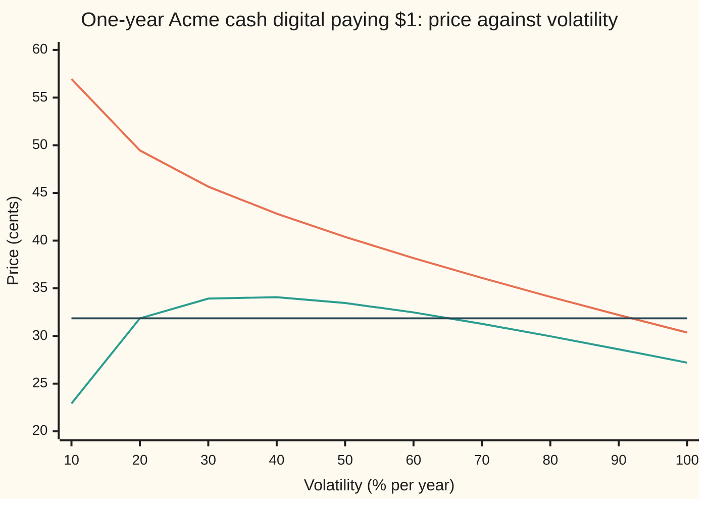
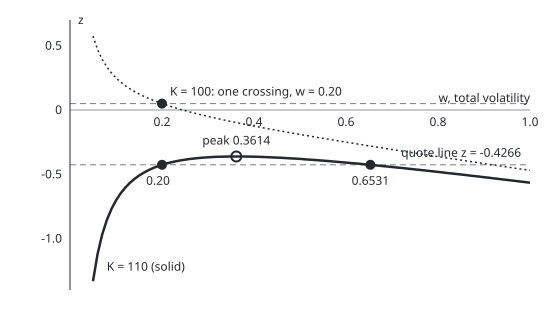

# Digital inverses: the strike is exact, the volatility can have two answers

Financial mathematics → Digitals and the implied density → Reading a digital quote backwards → Digital inverses

---

## General Overview

Acme shares trade at $100. A dealer sells a one-year cash digital on Acme: a contract that pays exactly $1 in a year if Acme then trades above $100, and nothing otherwise ([cash-or-nothing-digital](01-cash-or-nothing-digital.md)). The dealer's price is 49.46 cents. The house market sits behind it: riskless rate 5 percent, dividend yield 2 percent, volatility 20 percent.

Pricing runs forwards: strike and volatility in, price out. Desks also need it backwards. Given a price and a volatility, which strike does the price name? Given a price and a strike, which volatility does it imply? Volatility here is how jumpy Acme is per year, the one input nobody observes directly.

The two backward questions behave very differently. The strike always comes out unique, in one line. The volatility does not. At strike $100 the 49.46 cents gives back 20 percent and nothing else. Move the strike to $110 and the 20-percent price is 31.85 cents. That same 31.85 cents is also the price at 65.31 percent. And a quote above 34.14 cents at that strike fits no volatility at all.

**A digital's price fixes one point on the bell curve; the strike is read off that point in one line, but the volatility solves a quadratic whose positive roots number one, two or none, and the strike's position against the forward price decides which.**

**What kind of fact this is:** a method, resting on a theorem proved on this card in Why it works: every quote between zero and the discounted dollar names exactly one strike, and the number of volatilities is set by moneyness as the table under The formula states.

### The picture: price against volatility at two strikes



Orange: strike $100. It falls all the way, so each price on it belongs to one volatility. Green: strike $110. It rises, peaks at 34.14 cents near 36 percent, then falls. Dark flat line: the quote of 31.85 cents. It meets the green curve twice, at 20 percent and again between the 60 and 70 ticks, at 65.31 percent.

---

## The formula

Notation first, in words. $V$ is the quoted price of the cash digital that pays $1 above the strike. $D = e^{-rT}$ is the discount factor, today's value of $1 paid at expiry. $F$ is the forward price, $S e^{(r-q)T}$: the price agreed today for delivery of one share at expiry. $w = \sigma\sqrt{T}$ is the total volatility, the spread of Acme's log-price over the whole life of the contract. $N(x)$ is the area under the standard bell curve left of $x$, and $N^{-1}$ runs it backwards: the point with a given area to its left, the normal quantile ([normal-quantile](../../09-Probability%20and%20statistics/04-Continuous%20Distributions/05-normal-quantile.md)).

The price, from the cash-digital card:

$$V = D\,N(d_2), \qquad d_2 = \frac{\ln(F/K) - \tfrac12 w^2}{w}$$

Both inverses start the same way. Divide by the discount and look up the quantile:

$$y = \frac{V}{D}, \qquad z = N^{-1}(y)$$

**Read it aloud:** strip the discount off the price to get the chance of finishing above the strike in the pricing world (where Acme drifts at the riskless rate less the dividend), then find where that chance sits on the bell curve.

Then $d_2 = z$ is one equation. Solved for the strike:

$$K = F\,\exp\!\big(-w z - \tfrac12 w^2\big)$$

**Read it aloud:** start at the forward, step down by $z$ spreads, and step down half a spread squared more.

Solved for the volatility, with $m = \ln(F/K)$:

$$w^2 + 2 z w - 2m = 0, \qquad w = -z \pm \sqrt{z^2 + 2m}, \qquad \sigma = w/\sqrt{T}$$

**Read it aloud:** the quote and the strike fix a quadratic in the total volatility; its positive roots are the answers, and there may be one, two or none.

Which it is depends on where the strike sits against the forward:

| Strike against forward | Quotes with an answer | Volatilities |
| --- | --- | --- |
| below, $m > 0$ | every quote between 0 and $D$ | exactly one |
| at, $m = 0$ | quotes below $D/2$ | exactly one |
| above, $m < 0$ | quotes below $D\,N(-k)$, with $k = \sqrt{-2m}$ | two |
| above, $m < 0$ | the quote $D\,N(-k)$ itself | one, $w = k$ |
| any | every other quote | none |

| Symbol | Plain meaning | In our example | Push it up and the answer… |
| --- | --- | --- | --- |
| $V$ | quoted price of the $1 cash digital | $0.494581 | strike falls; volatility falls at $K = 100$ |
| $D$ | discount factor $e^{-rT}$: $1 at expiry, valued today | 0.951229 | the ceiling on every quote rises |
| $S$, $r$, $q$, $T$ | spot, riskless rate, dividend yield, years to expiry | 100, 5%, 2%, 1 | through $F$ and $D$ |
| $F$ | forward price $S e^{(r-q)T}$ | $103.05 | strike rises with it |
| $K$ | strike: the level Acme must finish above | $100, or $110 | above $F$: two volatilities or none |
| $\sigma$, $w$ | volatility per year (say "sigma"); total volatility $\sigma\sqrt{T}$ | 20%; 0.20 | (the answer) |
| $y$ | normalised quote $V/D$: the pricing-world chance of finishing above $K$ | 0.519939 | $z$ rises |
| $z$ | the quantile $N^{-1}(y)$ | 0.05 | strike falls |
| $d_2$, $d_1$ | $d_2$: the cash digital's bell-curve point; $d_1 = d_2 + w$: the asset digital's, zero where the cash price turns | $d_2 = 0.05$ at the answer | |
| $m$ | log-moneyness $\ln(F/K)$: positive when the strike is below the forward | 0.03 | more quotes have one answer |
| $k$ | turning volatility $\sqrt{-2m}$, only when $m < 0$ | 0.361414 at $K = 110$ | the top quote falls |
| $N(x)$, $N^{-1}(p)$ | bell-curve area left of $x$; the point with a given area to its left | $N^{-1}(0.519939) = 0.05$ | |

### When it holds

- **One flat volatility.** The inverse assumes Black-Scholes: Acme's log-price is bell-shaped with one $\sigma$. A market digital is priced off the smile (a different implied volatility at each strike), which adds a slope term ([digital-from-a-call-spread-and-the-skew-term](04-digital-from-a-call-spread-and-the-skew-term.md)). The volatility backed out of a market digital is then a quoting device, not the vanilla implied volatility at that strike.
- **A cash payment at expiry, checked once.** The contract pays a fixed dollar amount if Acme is above the strike on the last day. A touch contract, which pays if Acme reaches the level at any time, has a different price formula and a different inverse.
- **A quote strictly between 0 and $D$.** A quote of 0 or less, or of $D$ or more, has no strike and no finite positive volatility: a digital cannot be worth less than nothing or more than the discounted dollar it might pay.
- **Every other input known.** The strike inverse needs the volatility; the volatility inverse needs the strike. A quote alone cannot fix both.

---

## Why it works

### Step 0: a price is one point on the bell curve

A cash digital pays $1 or nothing. Its price is the discounted chance of the $1, counted in the pricing world, where Acme drifts at the riskless rate less the dividend. Divide out the discount and a chance remains, $y$. The bell curve has exactly one point with that much area to its left, $z$. So a quote in dollars carries one number, $z$, and the price formula says $d_2 = z$. Both inverses solve that single equation, once for the strike and once for the volatility. The order on every inverse card is the same: existence, uniqueness, boundaries, then the solve.

### Step 1: the strike, always one

Hold the volatility fixed and raise the strike. $\ln(F/K)$ falls, so $d_2$ falls. It falls from plus infinity at a strike near zero to minus infinity at a huge strike, without jumps. So the price $D\,N(d_2)$ slides from $D$ down to 0, and hits every level in between exactly once. A quote strictly between 0 and $D$ therefore names one strike; any other quote names none.

The solve peels $d_2 = z$ open. Multiply by $w$: $\ln(F/K) - \tfrac12 w^2 = w z$. Rearrange: $\ln(K/F) = -w z - \tfrac12 w^2$. Exponentiate. For the house quote, $z = 0.05$ and $w = 0.20$, so $\ln(K/F) = -0.01 - 0.02 = -0.03$, and $K = 103.05 \times e^{-0.03} = \$100$.

A digital put, which pays $1 below the strike, is the other half: call plus put pays $1 in every outcome, so the two prices sum to $D$. A put quote enters as one minus the put's price over $D$, and runs the same line. The house put, $0.456648, gives back the $100 strike.

### Step 2: the volatility, as a quadratic

Now hold the strike fixed and ask about $w$. Written with $m = \ln(F/K)$, the equation $d_2 = z$ reads

$$\frac{m}{w} - \frac{w}{2} = z.$$

Multiply both sides by $w$ and move everything to one side: $w^2 + 2 z w - 2m = 0$. That multiplication is safe only because $w$ is positive; a negative root of the quadratic solves the multiplied equation but is not a volatility. The quadratic formula ([quadratic-formula](../../03-Algebra/02-Polynomials/03-quadratic-formula.md)) gives $w = -z \pm \sqrt{z^2 + 2m}$.

For the house: $z = 0.05$, $m = 0.03$, so $w^2 + 0.1\,w - 0.06 = 0$. The roots are $0.20$ and $-0.30$. Only $0.20$ is a volatility.

### Step 3: count the positive roots without solving

Two facts hold for any quadratic that starts with $w^2$: its roots multiply to the constant term and add to minus the coefficient of $w$. Here they multiply to $-2m$ and add to $-2z$. That settles every case.

- **Strike below the forward, $m > 0$.** The product $-2m$ is negative, so one root is positive and one negative, whatever the quote. Exactly one volatility.
- **Strike at the forward, $m = 0$.** The roots are $0$ and $-2z$. Zero is not a volatility. The other is positive only when $z < 0$, which means $y < \tfrac12$: the quote must be below $D/2 = 0.475615$.
- **Strike above the forward, $m < 0$.** The product is positive, so the roots share a sign. They add to $-2z$, so both are positive only when $z < 0$. They are real only when $z^2 \ge -2m$. Together: $z \le -k$ with $k = \sqrt{-2m}$. Strictly below gives two volatilities; equality gives one, $w = k$; above gives none.

At $K = 110$, $m = 0.03 - \ln 1.1 = -0.065310$, so $k = 0.361414$. The top quote is $D\,N(-k) = 0.341391$, or 34.14 cents. The 20-percent quote of 31.85 cents has $z = -0.426551$, below $-k$, so it has two roots. They multiply to $-2m = 0.130620$; one is $0.20$, so the other is $0.130620 / 0.20 = 0.653102$.

The picture below plots the left side of the equation, $m/w - w/2$, against $w$. A quote is a horizontal line at its $z$. Each crossing is a volatility.

<p align="center"></p>

Dotted curve: $K = 100$, falling all the way; the dashed line at $z = 0.05$ crosses it once, at $w = 0.20$. Solid curve: $K = 110$, rising to a peak of $-0.3614$ at $w = 0.3614$ (open circle), then falling. The dashed line at $z = -0.4266$ crosses it twice, at $0.20$ and $0.6531$. Any quote line above the peak misses it.

<details>
<summary>Detailed proof</summary>

Fix $F, K, T > 0$ and let $g(w) = m/w - w/2$ on $w > 0$, with $m = \ln(F/K)$. The price is $V(w) = D\,N(g(w))$ and $N$ is continuous and strictly increasing, so the roots of $V(w) = V$ are the roots of $g(w) = z$, $z = N^{-1}(V/D)$, which exists and is unique for $0 < V < D$.

*Case $m > 0$.* $g'(w) = -m/w^2 - \tfrac12 < 0$, so $g(w)$ is strictly decreasing. As $w \to 0^+$, $g \to +\infty$; as $w \to \infty$, $g \to -\infty$. By the intermediate value theorem every real $z$ is hit, and strict decrease makes the hit unique.

*Case $m = 0$.* $g(w) = -w/2$, strictly decreasing from $0$ to $-\infty$. It hits $z$ once when $z < 0$, never when $z \ge 0$.

*Case $m < 0$.* Write $k = \sqrt{-2m}$. $g'(w) = -m/w^2 - \tfrac12$ is positive for $w < k$, zero at $w = k$, negative after. So $g(w)$ rises strictly on $(0, k]$ and falls strictly on $[k, \infty)$. Both ends tend to $-\infty$. The top is $g(k) = -k^2/(2k) - k/2 = -k$. Each strictly monotone branch covers $(-\infty, -k)$ once, giving two roots for $z < -k$, the single point $w = k$ for $z = -k$, none for $z > -k$.

*Match with the quadratic.* For $w > 0$, $g(w) = z$ if and only if $w^2 + 2zw - 2m = 0$. So the positive roots of the quadratic are exactly the volatilities, and the counts above agree with Step 3's product-and-sum argument, which reaches them without calculus.

</details>

### Step 4: why a far strike makes the price turn

The turn at $w = k$ has a plain meaning. Raising volatility does two things to a digital struck above the forward. It widens the spread of outcomes, which puts more weight far up, past the strike. It also pulls the typical outcome down: in the pricing world the average of Acme's final price is fixed at $F$, so a wider spread must drag the middle outcome (the median, $F e^{-w^2/2}$) lower to hold that average. At low volatility the first effect wins and the price rises. At high volatility the second wins and the price falls. The balance point is $w = k$, where $-2m = w^2$, which is the same as $\ln(F/K) + \tfrac12 w^2 = 0$: that is $d_1 = 0$. So a cash digital's sensitivity to volatility changes sign exactly where $d_1$ crosses zero ([digital-greeks-and-pin-risk](03-digital-greeks-and-pin-risk.md)). At 20 percent that happens at $K = F e^{w^2/2} = \$105.13$.

A vanilla call has no such turn. Its price rises with volatility at every strike, so its implied volatility is always unique ([implied-volatility](../11-Implied%20volatility%20and%20the%20vanilla%20inverses/01-implied-volatility.md)). The digital loses that because it pays a capped $1: more spread cannot keep adding value when the payout does not grow.

<details>
<summary>The asset-or-nothing version</summary>

An asset digital pays one Acme share above the strike ([asset-or-nothing-digital](02-asset-or-nothing-digital.md)). Its price is $S e^{-qT} N(d_1)$, so the normaliser is $S e^{-qT}$, and $d_1 = m/w + w/2$ leads to $w^2 - 2zw + 2m = 0$. The same product-and-sum argument flips the picture: one volatility when the strike is above the forward, two possible when it is below. The strike inverse stays unique: $K = F\exp(-wz + \tfrac12 w^2)$.

</details>

The other road needs no algebra at all: walk the volatility up in small steps, watch for the price crossing the quote, and halve each bracket until it is tight. It finds every crossing the grid can see and no negative roots. The code below takes it as road 2, and bisection itself belongs to the numerical-methods shelf.

---

## Worked numbers, by hand

House market: $S = 100$, $r = 5\%$, $q = 2\%$, $T = 1$. Quote: the $100-strike cash digital at $0.494581.

| Step | Arithmetic | Value |
| --- | --- | --- |
| discount $D$ | $e^{-0.05}$ | $0.951229$ |
| forward $F$ | $100 \times e^{0.03}$ | $\$103.05$ |
| normalised quote $y$ | $0.494581 / 0.951229$ | $0.519939$ |
| quantile $z$ | $N^{-1}(0.519939)$ | $0.05$ |
| moneyness $m$ | $\ln(103.05/100)$ | $0.03$ |
| quadratic | $w^2 + 0.1\,w - 0.06 = 0$ | roots $0.20$, $-0.30$ |
| roots multiply to $-2m$ | $-0.06$: one positive, one negative | one volatility |
| **volatility** | the positive root, over $\sqrt{1}$ | **20%** |
| strike at 20%, the other way | $103.05 \times e^{-0.2 \times 0.05 - 0.02}$ | **$\$100$** |

A trader who sees 49.46 cents on this contract and backs out 20 percent knows the digital is priced on the house volatility; no second answer can hide behind the quote.

The same arithmetic at $K = 110$ and 20 percent:

| Step | Arithmetic | Value |
| --- | --- | --- |
| moneyness $m$ | $0.03 - \ln 1.1$ | $-0.065310$ |
| quote | $D\,N(m/0.2 - 0.1)$ | $0.318522$ |
| quantile $z$ | $N^{-1}(0.318522/0.951229)$ | $-0.426551$ |
| turning volatility $k$ | $\sqrt{0.130620}$ | $0.361414$ |
| is $z < -k$? | $-0.4266 < -0.3614$ | yes: two roots |
| **volatilities** | $0.426551 \pm \sqrt{0.426551^2 - 0.130620}$ | **20% and 65.31%** |
| top quote | $D\,N(-0.361414)$ | $0.341391$ |

### What breaks if you drop a piece

Right answers: 20 percent at $K = 100$; strike $100 at 20 percent.

| Mistake | Comes out at | What went wrong |
| --- | --- | --- |
| Take $N^{-1}$ of the price, not of price over $D$ | 25.89% | Treated the discount as 1. The quantile moves from $0.05$ to below zero and the volatility jumps almost six points. |
| Use $d_1$ (the asset formula) for a cash quote | no real root | $w^2 - 0.1\,w + 0.06$ has $z^2 - 2m < 0$. A correct quote looks impossible. |
| Spot in place of the forward in the strike | $97.04 | Dropped the 3-percent carry. The strike lands about $3 low. |
| At $K = 110$, report the root the solver happened to find | 65.31% or 20% | Both reprice 31.85 cents. Without the count the answer is a coin toss. |

---

## Code, from first principles, and it actually runs

The code builds its own bell-curve area and quantile, then reaches each answer by three independent roads. Road 1 is the closed form: quantile, then the quadratic (solved in the form that avoids subtracting two nearly equal numbers) or the strike line. Road 2 never inverts anything: it walks volatility from 0.5 percent to 300 percent in one-point steps, flags every sign change of price minus quote, and bisects each; for the strike it bisects on $K$. Road 3 reprices each answer by adding up thin slices of the bell curve over Acme's log-price at expiry (Simpson's rule), with no $N$ and no $d_2$. Two more checks follow. A fine scan of the $K = 110$ curve must top out at $D\,N(-k)$. And roots are counted three ways, by the moneyness rule, by the quadratic and by the scan, over seven quotes spanning every row of the table. Python's bell-curve area is the error-function series written out; Rust's is Simpson's rule under the bell curve. Both cut the area to exactly 0 or 1 beyond five spreads, where it is within 3 in ten million of those values; only the scan's sign test ever goes there.

### Python

```python
# Digital inverses -- the check behind the card.  Standard library only.
# Nothing imported knows the answer: the normal CDF is the erf Taylor series written
# out, the quantile is Newton's method on it, the integral is Simpson's rule.
from math import log, sqrt, exp, pi, factorial

def N(x):                                     # bell-curve area left of x (series good for |x| <= 5)
    if abs(x) > 5.0: return 1.0 if x > 0 else 0.0   # off by < 3e-7; only the scan's sign test goes here
    y = x / sqrt(2.0)
    s = sum((-1) ** n * y ** (2 * n + 1) / (factorial(n) * (2 * n + 1)) for n in range(90))
    return 0.5 + s / sqrt(pi)

def phi(x): return exp(-0.5 * x * x) / sqrt(2.0 * pi)   # bell-curve height at x

def N_inv(p):                                 # Newton on N: the normal quantile
    x = 0.0
    for _ in range(60): x -= (N(x) - p) / phi(x)
    return x

S, r, q, T = 100.0, 0.05, 0.02, 1.0
D = exp(-r * T)                               # discount factor: $1 at expiry, today
F = S * exp((r - q) * T)                      # forward price

def cash(K, sig):                             # forward map: cash digital call paying $1
    w = sig * sqrt(T)
    return D * N((log(F / K) - 0.5 * w * w) / w)

def vols_quadratic(V, K):                     # Road 1: quantile, then w^2 + 2zw - 2m = 0
    z, m = N_inv(V / D), log(F / K)
    disc = z * z + 2.0 * m
    if disc < 0.0: return []
    big = -z - (1.0 if z >= 0.0 else -1.0) * sqrt(disc)   # the root with no cancellation
    roots = {big, -2.0 * m / big} if big != 0.0 else {0.0}
    return sorted(w / sqrt(T) for w in roots if w > 0.0)

def vols_scan(V, K):                          # Road 2: walk sigma, bisect each sign change
    f = lambda s: cash(K, s) - V
    found, grid = [], [0.005 + 0.01 * i for i in range(300)]
    for a, b in zip(grid, grid[1:]):
        if f(a) * f(b) < 0.0:
            for _ in range(60):
                mid = 0.5 * (a + b)
                if f(a) * f(mid) <= 0.0: b = mid
                else: a = mid
            found.append(0.5 * (a + b))
    return found

def rule(V, K):                               # the moneyness table, no roots computed
    z, m = N_inv(V / D), log(F / K)
    if m > 0.0: return 1
    if m == 0.0: return 1 if z < 0.0 else 0
    k = sqrt(-2.0 * m)                        # the turning width
    return 2 if z < -k else (1 if z == -k else 0)

def density_price(K, sig, n=4000):            # Road 3: average the payoff over log-price at expiry
    w = sig * sqrt(T)
    c = log(F) - 0.5 * w * w                  # centre of ln(S_T) in the pricing world
    a, b = log(K), c + 12.0 * w
    g = lambda u: phi((u - c) / w) / w
    h = (b - a) / n
    tot = g(a) + g(b) + sum((4 if i % 2 else 2) * g(a + i * h) for i in range(1, n))
    return D * tot * h / 3.0

def strike_closed(V, sig):                    # K = F exp(-w z - w^2/2)
    w, z = sig * sqrt(T), N_inv(V / D)
    return F * exp(-w * z - 0.5 * w * w)

def strike_bisect(V, sig):                    # price falls as the strike rises
    lo, hi = 50.0, 200.0
    for _ in range(100):
        mid = sqrt(lo * hi)
        if cash(mid, sig) > V: lo = mid
        else: hi = mid
    return sqrt(lo * hi)

V = cash(100.0, 0.20)                         # the house quote
w1, w2, K1 = vols_quadratic(V, 100.0), vols_scan(V, 100.0), strike_closed(V, 0.20)
V110 = cash(110.0, 0.20)
r110, s110 = vols_quadratic(V110, 110.0), vols_scan(V110, 110.0)
m110 = log(F / 110.0)
k110 = sqrt(-2.0 * m110)                      # the turning width
z_one = N_inv(V)                              # wrong: normalised by $1, not by D
rows = [
    ("discount D = e^-rT", D), ("forward F = S e^(r-q)T", F), ("quote V, house cash digital", V),
    ("normalised quote y = V/D", V / D), ("z = N^-1(y)", N_inv(V / D)), ("m = ln(F/K), K = 100", log(F / 100.0)),
    ("1 vol by quadratic", w1[0]), ("  its other root, discarded", -2.0 * log(F / 100.0) / w1[0]),
    ("2 vol by scan and bisection", w2[0]), ("  roots the scan found", len(w2)),
    ("3 price at that vol, by integral", density_price(100.0, w1[0])),
    ("1 strike, closed form", K1), ("2 strike, bisection", strike_bisect(V, 0.20)),
    ("3 price at that strike, by integral", density_price(K1, 0.20)),
    ("K = 110: m", m110), ("K = 110: quote at 20%", V110), ("K = 110: z", N_inv(V110 / D)),
    ("K = 110: small root", r110[0]), ("K = 110: large root", r110[1]), ("K = 110: roots multiply to -2m", -2.0 * m110),
    ("K = 110: scan, small", s110[0]), ("K = 110: scan, large", s110[1]),
    ("K = 110: price at large root, integral", density_price(110.0, r110[1])),
    ("K = 110: turning vol sqrt(-2m)", k110), ("K = 110: top quote D N(-k)", D * N(-k110)),
    ("m = 0 ceiling, D/2", 0.5 * D), ("K where 20% is the turn, F e^(w^2/2)", F * exp(0.02)),
    ("wrong: normalised by $1", -z_one + sqrt(z_one * z_one + 0.06)),
    ("wrong: spot for forward, strike", S * exp(-0.2 * N_inv(V / D) - 0.02)),
    ("try: K = 120, large root", vols_quadratic(cash(120.0, 0.2), 120.0)[1]),
    ("try: strike for a $0.25 quote", strike_closed(0.25, 0.20)),
    ("try: strike from the put 0.456648", strike_closed(D - 0.456648, 0.20)),
    ("  house digital put D - V", D - V),
]
za = N_inv(V / D)                             # wrong: asset formula, w^2 - 2zw + 2m = 0
rows.append(("wrong: d1 formula, real roots", "none" if za * za - 0.06 < 0 else "some"))
for name, v in rows: print(f"{name:<40} {v:>12.6f}" if isinstance(v, float) else f"{name:<40} {v:>12}")
print()
cases = [(100.0, V), (90.0, 0.70), (F, 0.40), (F, 0.48), (110.0, 0.25), (110.0, 0.34), (110.0, 0.35)]
for K, Vq in cases:
    a, b, c = rule(Vq, K), len(vols_quadratic(Vq, K)), len(vols_scan(Vq, K))
    print(f"count  K {K:7.2f}  quote {Vq:.6f}   rule {a}  quadratic {b}  scan {c}")
    assert a == b == c, "moneyness rule, quadratic and scan must agree on the count"
print()
sigs = [0.1 * i for i in range(1, 11)]
print(f"{'chart, vol %':<22}" + "".join(f"{100 * s:7.0f}" for s in sigs))
print(f"{'chart, K 100 cents':<22}" + "".join(f"{100 * cash(100.0, s):7.2f}" for s in sigs))
print(f"{'chart, K 110 cents':<22}" + "".join(f"{100 * cash(110.0, s):7.2f}" for s in sigs))
print(f"{'chart, quote cents':<22}" + "".join(f"{100 * V110:7.2f}" for s in sigs))
print(f"figure, K 100 crossing   w {w1[0]:.4f}  z {N_inv(V / D):.4f}")
print(f"figure, K 110 crossings  w {r110[0]:.4f} and {r110[1]:.4f}  z {N_inv(V110 / D):.4f}")
print(f"figure, K 110 peak       w {k110:.4f}  z {-k110:.4f}")

assert abs(V - 0.494581) < 5e-7, "house cash digital, as quoted on the shelf"
assert len(w2) == 1 and abs(w1[0] - w2[0]) < 1e-9, "K = 100: one vol, quadratic vs scan"
assert len(s110) == 2 and all(abs(a - b) < 1e-9 for a, b in zip(r110, s110)), "K = 110: two vols, both roads"
assert abs(density_price(110.0, r110[1]) - V110) < 1e-9, "the second vol reprices the same quote"
assert abs(K1 - strike_bisect(V, 0.20)) < 1e-6 and abs(K1 - 100.0) < 1e-6, "strike: closed form vs bisection"
assert abs(max(cash(110.0, 0.3 + 1e-4 * i) for i in range(1200)) - D * N(-k110)) < 1e-8, "K = 110: scanned top quote is D N(-k)"
print("ALL CHECKS PASS")
```

**Ran 2026-09-24 on macOS, Python 3.14.6, standard library only. All checks passed. Output, pasted from the run:**

```
discount D = e^-rT                           0.951229
forward F = S e^(r-q)T                     103.045453
quote V, house cash digital                  0.494581
normalised quote y = V/D                     0.519939
z = N^-1(y)                                  0.050000
m = ln(F/K), K = 100                         0.030000
1 vol by quadratic                           0.200000
  its other root, discarded                 -0.300000
2 vol by scan and bisection                  0.200000
  roots the scan found                              1
3 price at that vol, by integral             0.494581
1 strike, closed form                      100.000000
2 strike, bisection                        100.000000
3 price at that strike, by integral          0.494581
K = 110: m                                  -0.065310
K = 110: quote at 20%                        0.318522
K = 110: z                                  -0.426551
K = 110: small root                          0.200000
K = 110: large root                          0.653102
K = 110: roots multiply to -2m               0.130620
K = 110: scan, small                         0.200000
K = 110: scan, large                         0.653102
K = 110: price at large root, integral       0.318522
K = 110: turning vol sqrt(-2m)               0.361414
K = 110: top quote D N(-k)                   0.341391
m = 0 ceiling, D/2                           0.475615
K where 20% is the turn, F e^(w^2/2)       105.127110
wrong: normalised by $1                      0.258909
wrong: spot for forward, strike             97.044553
try: K = 120, large root                     1.523216
try: strike for a $0.25 quote              114.675531
try: strike from the put 0.456648           99.999982
  house digital put D - V                    0.456648
wrong: d1 formula, real roots                    none

count  K  100.00  quote 0.494581   rule 1  quadratic 1  scan 1
count  K   90.00  quote 0.700000   rule 1  quadratic 1  scan 1
count  K  103.05  quote 0.400000   rule 1  quadratic 1  scan 1
count  K  103.05  quote 0.480000   rule 0  quadratic 0  scan 0
count  K  110.00  quote 0.250000   rule 2  quadratic 2  scan 2
count  K  110.00  quote 0.340000   rule 2  quadratic 2  scan 2
count  K  110.00  quote 0.350000   rule 0  quadratic 0  scan 0

chart, vol %               10     20     30     40     50     60     70     80     90    100
chart, K 100 cents      56.95  49.46  45.66  42.83  40.39  38.17  36.09  34.10  32.20  30.36
chart, K 110 cents      22.92  31.85  33.92  34.07  33.46  32.47  31.27  29.97  28.60  27.20
chart, quote cents      31.85  31.85  31.85  31.85  31.85  31.85  31.85  31.85  31.85  31.85
figure, K 100 crossing   w 0.2000  z 0.0500
figure, K 110 crossings  w 0.2000 and 0.6531  z -0.4266
figure, K 110 peak       w 0.3614  z -0.3614
ALL CHECKS PASS
```

The quadratic, the scan and the integral agree to six decimals at both strikes. The scan finds one crossing at $K = 100$ and two at $K = 110$, which is the table's count reached without the table. The put line prints 99.999982, not 100, because the put quote was typed in to six decimals.

### Rust

```rust
// Digital inverses -- the same check as digital_inverses_vol_and_strike_check.py, in Rust.
// Standard library only, no crates.  Rust has no erf, so the bell-curve area N(x) is
// built by adding thin slices under the curve (Simpson); the quantile is Newton.
use std::f64::consts::PI;

const S: f64 = 100.0;
const R: f64 = 0.05;
const Q: f64 = 0.02;
const T: f64 = 1.0;

fn phi(x: f64) -> f64 { (-0.5 * x * x).exp() / (2.0 * PI).sqrt() }

fn simpson<G: Fn(f64) -> f64>(g: G, a: f64, b: f64, n: usize) -> f64 {
    let h = (b - a) / n as f64;
    let mut s = g(a) + g(b);
    for i in 1..n { s += if i % 2 == 1 { 4.0 } else { 2.0 } * g(a + i as f64 * h); }
    s * h / 3.0
}

fn n_cdf(x: f64) -> f64 {
    if x.abs() > 5.0 { return if x > 0.0 { 1.0 } else { 0.0 }; } // same cut as the Python, for the scan
    0.5 + simpson(phi, 0.0, x, 4000)
}

fn n_inv(p: f64) -> f64 {
    let mut x = 0.0;
    for _ in 0..60 { x -= (n_cdf(x) - p) / phi(x); }
    x
}

fn d() -> f64 { (-R * T).exp() }
fn fwd() -> f64 { S * ((R - Q) * T).exp() }

fn cash(k: f64, sig: f64) -> f64 {
    let w = sig * T.sqrt();
    d() * n_cdf(((fwd() / k).ln() - 0.5 * w * w) / w)
}

fn vols_quadratic(v: f64, k: f64) -> Vec<f64> {           // Road 1
    let (z, m) = (n_inv(v / d()), (fwd() / k).ln());
    let disc = z * z + 2.0 * m;
    if disc < 0.0 { return vec![]; }
    let big = -z - if z >= 0.0 { 1.0 } else { -1.0 } * disc.sqrt();
    let mut roots = if big != 0.0 { vec![big, -2.0 * m / big] } else { vec![0.0] };
    roots.retain(|w| *w > 0.0);
    roots.sort_by(|a, b| a.partial_cmp(b).unwrap());
    roots.dedup();
    roots.iter().map(|w| w / T.sqrt()).collect()
}

fn vols_scan(v: f64, k: f64) -> Vec<f64> {                // Road 2
    let f = |s: f64| cash(k, s) - v;
    let mut found = vec![];
    for i in 0..299 {
        let (mut a, mut b) = (0.005 + 0.01 * i as f64, 0.005 + 0.01 * (i + 1) as f64);
        if f(a) * f(b) < 0.0 {
            for _ in 0..60 {
                let mid = 0.5 * (a + b);
                if f(a) * f(mid) <= 0.0 { b = mid; } else { a = mid; }
            }
            found.push(0.5 * (a + b));
        }
    }
    found
}

fn rule(v: f64, k: f64) -> usize {
    let (z, m) = (n_inv(v / d()), (fwd() / k).ln());
    if m > 0.0 { return 1; }
    if m == 0.0 { return if z < 0.0 { 1 } else { 0 }; }
    let kk = (-2.0 * m).sqrt();
    if z < -kk { 2 } else if z == -kk { 1 } else { 0 }
}

fn density_price(k: f64, sig: f64) -> f64 {               // Road 3
    let w = sig * T.sqrt();
    let c = fwd().ln() - 0.5 * w * w;
    d() * simpson(|u| phi((u - c) / w) / w, k.ln(), c + 12.0 * w, 4000)
}

fn strike_closed(v: f64, sig: f64) -> f64 {
    let (w, z) = (sig * T.sqrt(), n_inv(v / d()));
    fwd() * (-w * z - 0.5 * w * w).exp()
}

fn strike_bisect(v: f64, sig: f64) -> f64 {
    let (mut lo, mut hi) = (50.0_f64, 200.0_f64);
    for _ in 0..100 {
        let mid = (lo * hi).sqrt();
        if cash(mid, sig) > v { lo = mid; } else { hi = mid; }
    }
    (lo * hi).sqrt()
}

fn main() {
    let (dd, f) = (d(), fwd());
    let v = cash(100.0, 0.20);
    let (w1, w2, k1) = (vols_quadratic(v, 100.0), vols_scan(v, 100.0), strike_closed(v, 0.20));
    let v110 = cash(110.0, 0.20);
    let (r110, s110) = (vols_quadratic(v110, 110.0), vols_scan(v110, 110.0));
    let m110 = (f / 110.0).ln();
    let k110 = (-2.0 * m110).sqrt();
    let z_one = n_inv(v);
    let rows: Vec<(&str, f64)> = vec![
        ("discount D = e^-rT", dd), ("forward F = S e^(r-q)T", f), ("quote V, house cash digital", v),
        ("normalised quote y = V/D", v / dd), ("z = N^-1(y)", n_inv(v / dd)), ("m = ln(F/K), K = 100", (f / 100.0).ln()),
        ("1 vol by quadratic", w1[0]), ("  its other root, discarded", -2.0 * (f / 100.0).ln() / w1[0]),
        ("2 vol by scan and bisection", w2[0]),
    ];
    for (name, x) in &rows { println!("{:<40} {:>12.6}", name, x); }
    println!("{:<40} {:>12}", "  roots the scan found", w2.len());
    let rows2: Vec<(&str, f64)> = vec![
        ("3 price at that vol, by integral", density_price(100.0, w1[0])),
        ("1 strike, closed form", k1), ("2 strike, bisection", strike_bisect(v, 0.20)),
        ("3 price at that strike, by integral", density_price(k1, 0.20)),
        ("K = 110: m", m110), ("K = 110: quote at 20%", v110), ("K = 110: z", n_inv(v110 / dd)),
        ("K = 110: small root", r110[0]), ("K = 110: large root", r110[1]), ("K = 110: roots multiply to -2m", -2.0 * m110),
        ("K = 110: scan, small", s110[0]), ("K = 110: scan, large", s110[1]),
        ("K = 110: price at large root, integral", density_price(110.0, r110[1])),
        ("K = 110: turning vol sqrt(-2m)", k110), ("K = 110: top quote D N(-k)", dd * n_cdf(-k110)),
        ("m = 0 ceiling, D/2", 0.5 * dd), ("K where 20% is the turn, F e^(w^2/2)", f * 0.02_f64.exp()),
        ("wrong: normalised by $1", -z_one + (z_one * z_one + 0.06).sqrt()),
        ("wrong: spot for forward, strike", S * (-0.2 * n_inv(v / dd) - 0.02).exp()),
        ("try: K = 120, large root", vols_quadratic(cash(120.0, 0.2), 120.0)[1]),
        ("try: strike for a $0.25 quote", strike_closed(0.25, 0.20)),
        ("try: strike from the put 0.456648", strike_closed(dd - 0.456648, 0.20)),
        ("  house digital put D - V", dd - v),
    ];
    for (name, x) in &rows2 { println!("{:<40} {:>12.6}", name, x); }
    let za = n_inv(v / dd);
    println!("{:<40} {:>12}", "wrong: d1 formula, real roots", if za * za - 0.06 < 0.0 { "none" } else { "some" });
    println!();
    let cases = [(100.0, v), (90.0, 0.70), (f, 0.40), (f, 0.48), (110.0, 0.25), (110.0, 0.34), (110.0, 0.35)];
    for (k, vq) in cases {
        let (a, b, c) = (rule(vq, k), vols_quadratic(vq, k).len(), vols_scan(vq, k).len());
        println!("count  K {:7.2}  quote {:.6}   rule {}  quadratic {}  scan {}", k, vq, a, b, c);
        assert!(a == b && b == c, "moneyness rule, quadratic and scan must agree on the count");
    }
    println!();
    let sigs: Vec<f64> = (1..=10).map(|i| 0.1 * i as f64).collect();
    let line = |label: &str, g: &dyn Fn(f64) -> f64, p: usize| {
        let body: String = sigs.iter().map(|s| format!("{:7.*}", p, g(*s))).collect();
        println!("{:<22}{}", label, body);
    };
    line("chart, vol %", &|s| 100.0 * s, 0);
    line("chart, K 100 cents", &|s| 100.0 * cash(100.0, s), 2);
    line("chart, K 110 cents", &|s| 100.0 * cash(110.0, s), 2);
    line("chart, quote cents", &|_| 100.0 * v110, 2);
    println!("figure, K 100 crossing   w {:.4}  z {:.4}", w1[0], n_inv(v / dd));
    println!("figure, K 110 crossings  w {:.4} and {:.4}  z {:.4}", r110[0], r110[1], n_inv(v110 / dd));
    println!("figure, K 110 peak       w {:.4}  z {:.4}", k110, -k110);

    assert!((v - 0.494581).abs() < 5e-7, "house cash digital, as quoted on the shelf");
    assert!(w2.len() == 1 && (w1[0] - w2[0]).abs() < 1e-9, "K = 100: one vol, quadratic vs scan");
    assert!(s110.len() == 2 && r110.iter().zip(&s110).all(|(a, b)| (a - b).abs() < 1e-9), "K = 110: two vols");
    assert!((density_price(110.0, r110[1]) - v110).abs() < 1e-9, "the second vol reprices the same quote");
    assert!((k1 - strike_bisect(v, 0.20)).abs() < 1e-6 && (k1 - 100.0).abs() < 1e-6, "strike: closed form vs bisection");
    let top = (0..1200).map(|i| cash(110.0, 0.3 + 1e-4 * i as f64)).fold(0.0_f64, f64::max);
    assert!((top - dd * n_cdf(-k110)).abs() < 1e-8, "K = 110: scanned top quote is D N(-k)");
    println!("ALL CHECKS PASS");
}
```

**Ran 2026-09-24 on macOS, rustc 1.98.1, no crates. All checks passed. Output, pasted from the run:**

```
discount D = e^-rT                           0.951229
forward F = S e^(r-q)T                     103.045453
quote V, house cash digital                  0.494581
normalised quote y = V/D                     0.519939
z = N^-1(y)                                  0.050000
m = ln(F/K), K = 100                         0.030000
1 vol by quadratic                           0.200000
  its other root, discarded                 -0.300000
2 vol by scan and bisection                  0.200000
  roots the scan found                              1
3 price at that vol, by integral             0.494581
1 strike, closed form                      100.000000
2 strike, bisection                        100.000000
3 price at that strike, by integral          0.494581
K = 110: m                                  -0.065310
K = 110: quote at 20%                        0.318522
K = 110: z                                  -0.426551
K = 110: small root                          0.200000
K = 110: large root                          0.653102
K = 110: roots multiply to -2m               0.130620
K = 110: scan, small                         0.200000
K = 110: scan, large                         0.653102
K = 110: price at large root, integral       0.318522
K = 110: turning vol sqrt(-2m)               0.361414
K = 110: top quote D N(-k)                   0.341391
m = 0 ceiling, D/2                           0.475615
K where 20% is the turn, F e^(w^2/2)       105.127110
wrong: normalised by $1                      0.258909
wrong: spot for forward, strike             97.044553
try: K = 120, large root                     1.523216
try: strike for a $0.25 quote              114.675531
try: strike from the put 0.456648           99.999982
  house digital put D - V                    0.456648
wrong: d1 formula, real roots                    none

count  K  100.00  quote 0.494581   rule 1  quadratic 1  scan 1
count  K   90.00  quote 0.700000   rule 1  quadratic 1  scan 1
count  K  103.05  quote 0.400000   rule 1  quadratic 1  scan 1
count  K  103.05  quote 0.480000   rule 0  quadratic 0  scan 0
count  K  110.00  quote 0.250000   rule 2  quadratic 2  scan 2
count  K  110.00  quote 0.340000   rule 2  quadratic 2  scan 2
count  K  110.00  quote 0.350000   rule 0  quadratic 0  scan 0

chart, vol %               10     20     30     40     50     60     70     80     90    100
chart, K 100 cents      56.95  49.46  45.66  42.83  40.39  38.17  36.09  34.10  32.20  30.36
chart, K 110 cents      22.92  31.85  33.92  34.07  33.46  32.47  31.27  29.97  28.60  27.20
chart, quote cents      31.85  31.85  31.85  31.85  31.85  31.85  31.85  31.85  31.85  31.85
figure, K 100 crossing   w 0.2000  z 0.0500
figure, K 110 crossings  w 0.2000 and 0.6531  z -0.4266
figure, K 110 peak       w 0.3614  z -0.3614
ALL CHECKS PASS
```

The two outputs are identical line for line.

> [!TIP]
> **Try changing**
> - **Strike $120 at 20 percent.** Guess first: does the second volatility move nearer to 20 percent or further away? Set `K = 120` in the try row. Further: the second root is 152.32 percent. The roots still multiply to $-2m$, and $m$ is now more negative.
> - **A quote of 25 cents at 20 percent.** Guess first: above or below $110? `strike_closed(0.25, 0.20)` gives $114.68. A cheaper digital must sit further out.
> - **A quote of 35 cents at $K = 110$.** Guess first: how many volatilities? None: the top quote there is 34.14 cents. The count row for 0.35 prints 0 by all three methods, while 34 cents prints 2.
> - **Strike at the forward, $103.05.** Guess first: which of 40 and 48 cents has a volatility? Only 40: the ceiling is $D/2 = 47.56$ cents, and the count rows print 1 and 0.

---

## The usual mistake

> [!warning]
> **Treating a digital's implied volatility as unique, the way a vanilla's is.** A vanilla price rises with volatility at every strike, so a solver that converges has found the only answer. A cash digital struck above the forward rises and then falls. At $K = 110$ the quote 31.85 cents is 20 percent and 65.31 percent at once. A solver started low returns one; started high it returns the other. Count the roots from the moneyness table first, then choose the branch on purpose, usually the one nearer the vanilla volatility at that strike.
>
> - **Dropping the discount.** $N^{-1}(V)$ instead of $N^{-1}(V/D)$ gives 25.89 percent for a 20-percent quote.
> - **Keeping the negative root.** At $K = 100$ the quadratic also gives $-0.30$. It solves the equation multiplied through by $w$, not the price equation.
> - **Mixing the cash and asset formulas.** A cash quote run through $d_1$ reports no real root for a perfectly good price.
> - **Trusting a count near the top.** A quote just under 34.14 cents at $K = 110$ has two nearby roots; a rounding error in the quote can swap two answers for none. Close to the turn, the volatility is poorly determined by the price.

---

## Where you meet it in real life

- **Quoting a digital for a target premium.** A client wants a digital that costs 25 cents per dollar. The desk fixes the volatility and reads the strike off in one line: $114.68 in the house market. This is the inverse that always works.
- **Checking a dealer's digital quote.** A risk system backs a flat volatility out of a quoted digital to compare it with the vanilla smile. Above the forward it must report both roots, or flag the quote as outside the range; returning whichever root a solver hits hides a real ambiguity.
- **Structured notes with a digital coupon.** A note that pays a fixed coupon if an index finishes above a barrier contains a cash digital. Its issuer solves for the barrier level that makes the note cost par, a strike inverse.
- **Model validation.** An independent check that a pricing library's digital inverse returns every positive root, and none of the negative ones, is exactly the root count on this card run over a grid of quotes.

> **Say it back**
> A cash digital's price, divided by the discount, is a chance, and the bell curve turns that chance into one number $z$. The price formula then says $d_2 = z$. Solved for the strike, that gives one answer for every quote between zero and the discounted dollar. Solved for the volatility, it gives a quadratic whose roots multiply to $-2\ln(F/K)$: one positive root when the strike is below the forward, and up to two when it is above, because the price rises and then falls as volatility grows. The turn sits where $d_1 = 0$, and quotes above the top of that turn fit no volatility at all.

---

## What this builds on

- [cash-or-nothing-digital](01-cash-or-nothing-digital.md): the price $D\,N(d_2)$ that this card runs backwards.
- [asset-or-nothing-digital](02-asset-or-nothing-digital.md): the $d_1$ price whose inverse is the mirror image in the folded tip.
- [quadratic-formula](../../03-Algebra/02-Polynomials/03-quadratic-formula.md): the roots, and the product-and-sum facts that count them without solving.
- [normal-quantile](../../09-Probability%20and%20statistics/04-Continuous%20Distributions/05-normal-quantile.md): the unique $z$ behind every quote strictly between 0 and $D$.

---

## Where this goes next

- [implied-volatility](../11-Implied%20volatility%20and%20the%20vanilla%20inverses/01-implied-volatility.md): the vanilla inverse, where rising prices make the implied volatility unique at every strike.
- [volatility-smile-and-skew](../12-The%20smile%20and%20the%20surface/01-volatility-smile-and-skew.md): the market's own volatility at each strike, which a single flat-volatility inverse cannot reproduce.

The question left open is what a single flat volatility cannot say: once the market prices each strike on its own volatility, a digital quote no longer fixes one $\sigma$, and reading it backwards means reading the whole smile.

---

## Sources

Verified 2026-09-24: every link below resolves to the publisher's page for the cited work; DOIs checked against Crossref.

- Black, Fischer, and Myron Scholes. "The Pricing of Options and Corporate Liabilities." *Journal of Political Economy* 81, no. 3 (1973): 637–654. [doi:10.1086/260062](https://doi.org/10.1086/260062). The $N(d_2)$ term, the cash half of the call and the price of the digital on this card.
- Merton, Robert C. "Theory of Rational Option Pricing." *Bell Journal of Economics and Management Science* 4, no. 1 (1973): 141–183. [doi:10.2307/3003143](https://doi.org/10.2307/3003143). The dividend yield, which puts the forward, not spot, into $m$.
- Manaster, Steven, and Gary J. Koehler. "The Calculation of Implied Variances from the Black-Scholes Model: A Note." *Journal of Finance* 37, no. 1 (1982): 227–230. [doi:10.1111/j.1540-6261.1982.tb01105.x](https://doi.org/10.1111/j.1540-6261.1982.tb01105.x). Uniqueness of the vanilla implied volatility, the property the digital loses.
- Haug, Espen Gaarder. *The Complete Guide to Option Pricing Formulas*, 2nd ed. McGraw-Hill, 2007. [Publisher page](https://www.mheducation.com/highered/mhp/product/complete-guide-to-option-pricing-formulas-2e.html). Cash-or-nothing and asset-or-nothing formulas with dividend yield, in the form inverted here.
- Hull, John C. *Options, Futures, and Other Derivatives*, 11th ed. Pearson. [Publisher page](https://www.pearson.com/en-us/subject-catalog/p/options-futures-and-other-derivatives/P200000005938). Binary options among the exotic options, priced from $N(d_2)$ and $N(d_1)$.
