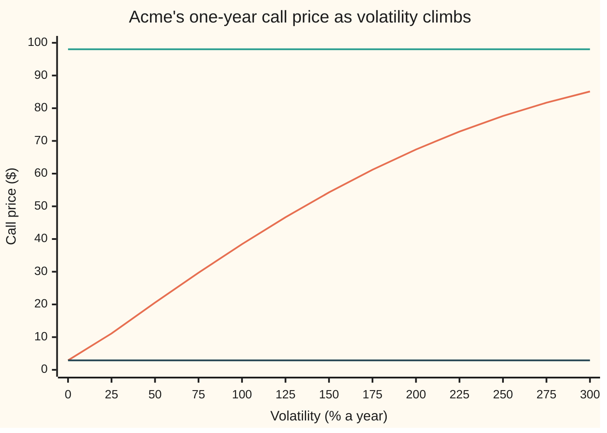
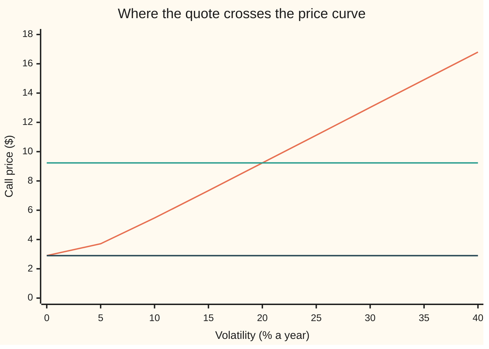

# Implied volatility: the one volatility that makes the formula match the quote

Financial mathematics → Implied volatility and the vanilla inverses → Reading a price as a volatility → Implied volatility

---

## General Overview

Acme shares trade at $100. A one-year call option on them, struck at $100, shows on the screen at $9.227006. The call is the right, not the duty, to buy one share at the strike on expiry day. The bank pays 5 percent a year, continuously compounded, and Acme pays out 2 percent of its price a year as dividends.

Five of the six inputs to the Black-Scholes formula can be looked up: the share price, the strike, the rate, the dividend yield and the time left. The sixth cannot. It is the volatility: how widely the share's price is expected to swing, as a yearly percentage. So the formula is run backwards. The price goes in; the volatility that reproduces it comes out. For $9.227006 that volatility is exactly 20 percent. Traders then say the option is "at 20 vol" instead of quoting dollars.

Running a formula backwards is only safe if an answer exists and there is only one. Here both hold, inside a fence. As volatility climbs from zero to endless, Acme's call price climbs from $2.90 to $98.02 and never reaches either end. Every quote strictly between has exactly one volatility. A quote of $2.80 or $99 has none, and a solver fed one returns a number anyway.

**Implied volatility is the one volatility that, with every other input fixed, makes the formula's price equal the market's quote; it exists and is unique exactly when the quote lies strictly between the zero-volatility price and the cost today of a share delivered at expiry.**

**What kind of fact this is:** a definition, made safe to use by a theorem (one quote, one volatility) proved on this card in Why it works.

### The picture: the price climbs, then flattens under a ceiling



Rising curve: the call's price. Top flat line: the ceiling, $98.02, the cost today of one share delivered in a year. Bottom flat line: the floor, $2.90, the price when volatility is zero. The curve starts on the floor, always rises, and bends toward the ceiling without touching it. Any horizontal line drawn between the two flat lines crosses the curve once. That crossing is the implied volatility.

---

## The formula

Implied volatility, written $\sigma_{\text{imp}}$, is defined by one equation:

$$C(\sigma_{\text{imp}}) = C_{\text{mkt}}, \qquad C(\sigma) = S\,e^{-qT}N(d_1) - K\,e^{-rT}N(d_2).$$

**Read it aloud:** the implied volatility is the setting of the volatility dial at which the Black-Scholes call price equals the price on the screen.

It has a solution exactly inside this range, the heart of the card:

$$\max(A - B,\,0) \;<\; C_{\text{mkt}} \;<\; A, \qquad A = S\,e^{-qT},\quad B = K\,e^{-rT}.$$

**Read it aloud:** the quote must sit above what the option is worth when nothing is random, and below what a share delivered at expiry costs today.

For a put, the right to sell at the strike, the range is $\max(B - A, 0) < P_{\text{mkt}} < B$, with $P(\sigma)$ the put formula.

| Symbol | Plain meaning | In our example | Push it up and the answer… |
| --- | --- | --- | --- |
| $C_{\text{mkt}}$, $P_{\text{mkt}}$ | the call's and put's quoted prices | $9.227006, $6.330081 | implied vol rises |
| $C(\sigma)$, $P(\sigma)$ | the Black-Scholes prices with volatility $\sigma$ put in | $9.227006 at 20% | |
| $\sigma$, $w$, $w_0$, $w_1$ | volatility: the yearly spread of the share's log price, a decimal; $w = \sigma\sqrt{T}$ is the total swing over the option's life; $w_0$, $w_1$ are a small and a large swing in the proof | the dial being turned | the price rises |
| $\sigma_{\text{imp}}$ | implied volatility: the $\sigma$ that matches the quote | 0.200000 | |
| $S$ | Acme's share price today | $100 | a call's implied vol falls for the same quote |
| $K$ | the strike: the price fixed in the contract | $100 | a call's implied vol rises for the same quote |
| $r$, $q$ | bank rate and dividend yield, continuously compounded, per year | 5%, 2% | move the floor and ceiling |
| $T$ | time to expiry, in years | 1 | the same quote implies a lower vol |
| $A$, $B$, $F$ | $A$: cost today of one share delivered at expiry, $S e^{-qT}$. $B$: today's value of the strike paid at expiry, $K e^{-rT}$. $F$: the forward price, $S e^{(r-q)T}$ | $98.019867, $95.122942, $103.045453 | |
| $d_1$, $d_2$ | the Black-Scholes formula's two distances to the strike, in units of $\sigma\sqrt{T}$ | 0.25, 0.05 at 20% | |
| $N(x)$, $\varphi(x)$ | bell-curve area left of $x$, and the bell curve's height at $x$ | $\varphi(0.25) = 0.386668$ | |
| $\nu$ | vega: how many dollars the price gains per unit of $\sigma$ | 37.901158 | |

The two helpers, as on [black-scholes-call](../08-The%20Black-Scholes%20call%20and%20put/01-black-scholes-call.md):

$$d_1 = \frac{\ln(S/K) + (r - q + \tfrac12\sigma^2)T}{\sigma\sqrt{T}}, \qquad d_2 = d_1 - \sigma\sqrt{T}.$$

In words: $d_2$ is how many standard swings separate the strike from where the share is expected to end; $d_1$ is one swing more. Vega, the slope that drives the whole proof, is

$$\nu = \frac{\partial C}{\partial \sigma} = S\,e^{-qT}\,\varphi(d_1)\sqrt{T}.$$

In words: the slope of price against volatility is $A$, the cost today of a share delivered at expiry, times the bell curve's height at $d_1$, times the square root of time. Every factor is positive.

### When it holds

Implied volatility is a definition, so it is never wrong; it is either available or not, and it means what the model means. It gives one clean answer when:

- **The option is European**, exercisable only on the last day. An American option can be worth more than the European ceiling; its quote then has no answer in this formula, or an answer that means nothing.
- **Every other input is agreed.** The rate, dividend and time are fixed first. Change the dividend from 2% to 0 and the same quote implies 16.72% instead of 20%: implied vol absorbs every error in the other inputs.
- **The quote is one number.** A screen shows a bid and an ask. Each implies its own volatility; the mid is a convention, not a fact.
- **Time and strike are positive.** On expiry day the price is the payoff whatever the volatility, so no volatility is implied.

---

## Why it works

### Step 0: a curve with no gaps that only climbs hits every level once

Picture the price as a road that climbs as the volatility dial turns. If the road has no jumps (it is continuous) and never levels off or dips (it is strictly increasing), then every height between its lowest and highest points is reached, and reached at one place only. The first half is the [intermediate-value-theorem](../../06-Calculus%20and%20analysis/01-Limits%20and%20Continuity/06-intermediate-value-theorem.md). The second half is what "strictly increasing" means. So three facts settle the whole question: where the road starts, where it heads, and that it always climbs.

### Step 1: the floor, when nothing is random

Turn volatility to zero. Acme's share then grows like a bank balance, at the rate minus the dividend. In one year it reaches the forward price $F = S e^{(r-q)T} = \$103.045453$. The call pays $F - K = \$3.045453$ for sure. Discounted at $e^{-rT} = 0.951229$, that is $A - B = \$2.896925$.

The formula agrees in the limit. Here $\ln(A/B) = 0.03$ is positive, so as $\sigma$ shrinks both $d_1$ and $d_2$ run off to plus infinity, both $N$ values go to 1, and the price goes to $A - B$. At $\sigma = 0.01$ the formula already gives $2.897294. When the forward sits below the strike, both $d$ values run to minus infinity and the floor is zero instead. Hence the $\max(A - B, 0)$.

### Step 2: the ceiling, when everything is random

Turn volatility up without limit. Now $d_1 \to +\infty$ and $d_2 \to -\infty$, so $N(d_1) \to 1$ and $N(d_2) \to 0$. The price tends to $A = S e^{-qT} = \$98.019867$. At $\sigma = 20$, that is 2,000 percent, the formula prints $98.019867 to six decimals.

The ceiling has a plain reason. Whatever happens, the call pays less than the share: at expiry it pays the share minus the strike, or nothing. So it can never cost more than a share delivered at expiry, which costs $A$ today. At huge volatility the share almost always ends near zero, but with rare enormous outcomes that carry the average. In those outcomes the strike is a rounding error, so the call becomes almost as good as the share.

The price therefore does not "climb forever", as is often said. It climbs toward a finite ceiling. That is why a quote of $99 has no volatility at all.

### Step 3: the price always climbs

Vega is $\nu = A\,\varphi(d_1)\sqrt{T}$. A share price, a bell-curve height and a square root are all positive, so vega is strictly positive at every volatility. A function whose slope is always positive is strictly increasing: two different volatilities never give the same price. At Acme's 20 percent, vega is $37.901158; a bump of the dial by $\pm 0.0001$ gives 37.901157, the same slope to five decimals.

The formula for vega is short because the two halves of the call move together. The share half and the cash half each change as $\sigma$ moves, and the identity $A\,\varphi(d_1) = B\,\varphi(d_2)$ cancels everything except one term. The folded proof shows it.

<details>
<summary>Detailed proof: vega is positive, the limits are the floor and ceiling, the root is unique</summary>

Write $w = \sigma\sqrt{T} > 0$ for the total swing and $m = \ln(A/B) = \ln(S/K) + (r - q)T$ for how far the forward sits above the strike, in logs. Then
$$d_1 = \frac{m}{w} + \frac{w}{2}, \qquad d_2 = \frac{m}{w} - \frac{w}{2}, \qquad C(w) = A\,N(d_1) - B\,N(d_2).$$
**The identity.** $d_1^2 - d_2^2 = (d_1 + d_2)(d_1 - d_2) = (2m/w)(w) = 2m$. So $\varphi(d_1)/\varphi(d_2) = e^{-(d_1^2 - d_2^2)/2} = e^{-m} = B/A$, which gives $A\,\varphi(d_1) = B\,\varphi(d_2)$.

**The slope.** $N$ has slope $\varphi$. Differentiating in $w$: $C'(w) = A\varphi(d_1)\,d_1' - B\varphi(d_2)\,d_2' = A\varphi(d_1)(d_1' - d_2')$. Since $d_1 - d_2 = w$, $d_1' - d_2' = 1$. So $C'(w) = A\,\varphi(d_1) > 0$, and by the chain rule $\partial C/\partial\sigma = A\,\varphi(d_1)\sqrt{T}$. The put, $P(w) = B\,N(-d_2) - A\,N(-d_1)$, has $P'(w) = -B\varphi(d_2)\,d_2' + A\varphi(d_1)\,d_1' = A\varphi(d_1)(d_1' - d_2') = A\varphi(d_1)$: the same vega.

**The limits as $w \to 0$.** If $m > 0$, $m/w \to +\infty$ dominates $\pm w/2$, both $d$ values go to $+\infty$, and $C \to A - B$. If $m < 0$, both go to $-\infty$ and $C \to 0$. If $m = 0$, $d_1 = w/2 \to 0$ and $d_2 = -w/2 \to 0$, so $C \to A/2 - B/2 = 0$ since $A = B$. In every case $C \to \max(A - B, 0)$.

**The limit as $w \to \infty$.** $m/w \to 0$, so $d_1 \to +\infty$, $d_2 \to -\infty$, and $C \to A$.

**Existence and uniqueness.** Take a quote with $\max(A - B, 0) < C_{\text{mkt}} < A$. By the two limits there is a small $w_0$ with $C(w_0) < C_{\text{mkt}}$ and a large $w_1$ with $C(w_1) > C_{\text{mkt}}$. $C$ is continuous on $[w_0, w_1]$, so the intermediate value theorem gives a $w$ between them with $C(w) = C_{\text{mkt}}$. If two values $w < w'$ both did, the mean value theorem would give a point between them with $C' = 0$, contradicting $C' > 0$. So the root is unique, and $\sigma_{\text{imp}} = w/\sqrt{T}$.

**The ends are never reached.** For every $w > 0$, $C(w/2) < C(w) < C(2w)$, and the outer two lie within the limits, so $\max(A - B, 0) < C(w) < A$ strictly. A quote equal to either end has no positive, finite volatility. At the floor, only $\sigma = 0$ fits, if zero is admitted.

</details>

### Step 4: one crossing, found by halving

Combine Steps 1 to 3. The call's price starts at $2.896925, rises without a dip, and approaches $98.019867. A quote of $9.227006 lies between, so exactly one volatility matches. Halving finds it. Start with a range of volatilities whose prices straddle the quote. Price the midpoint. Keep the half whose prices still straddle the quote. Sixty halvings shrink a range ten wide to far below a billionth, and it lands on 0.200000.



Rising curve: the call's price at the low end of the dial. Middle flat line: the $9.23 quote. Bottom flat line: the $2.90 floor. They cross once, at 20 percent. Near zero the curve hugs the floor: the price barely moves as the dial starts to turn, because vega is tiny there when the forward sits above the strike.

### Step 5: the put gives the same answer, and the outside has free money

The put's price has the same vega, so the same argument works on its range, $0$ to $B = \$95.122942$. Acme's put at $6.330081 lies inside and, inverted on its own formula, gives 0.200000 again. This is not a coincidence. Put-call parity, $C - P = A - B$, holds at every volatility, so a matched pair of quotes must share one implied vol.

Outside the range, no volatility exists because no sane market trades there. A call at $2.80 is below the floor: buy it, sell short enough shares to owe exactly one at expiry, raising $98.02, and lend $95.12 for a year. Whatever Acme does, the position ends at zero or better, and it took in $0.096925 on day one. A call at $99 is above the ceiling: sell it and buy the prepaid share for $98.02; the share covers any exercise, and $0.980133 is kept. The boundaries of the formula are the boundaries of arbitrage, trades that make money with no risk.

**The other door.** Halving is slow but cannot fail inside the range. Newton's method, which steps along the slope using vega, is far faster and can fail near the ends, where vega collapses. Both, and when to use which, are on [implied-volatility-by-newton-and-bisection](02-implied-volatility-by-newton-and-bisection.md).

---

## Worked numbers, by hand

Acme: $S = K = 100$, $r = 5\%$, $q = 2\%$, $T = 1$, quote $C_{\text{mkt}} = 9.227006$.

| Step | Arithmetic | Value |
| --- | --- | --- |
| prepaid share $A$ | $100 \times e^{-0.02}$ | $98.019867 |
| discounted strike $B$ | $100 \times e^{-0.05}$ | $95.122942 |
| floor, $\max(A - B, 0)$ | $98.019867 - 95.122942$ | $2.896925 |
| ceiling, $A$ | | $98.019867 |
| is the quote inside? | $2.896925 < 9.227006 < 98.019867$ | yes: one answer |
| try $\sigma = 0.20$: $d_1$ | $(0 + (0.05 - 0.02 + 0.02)) / 0.20$ | 0.25 |
| price at 0.20 | Black-Scholes formula | $9.227006, the quote |
| vega at 0.20 | $98.019867 \times 0.386668 \times 1$ | 37.901158 |
| **implied volatility** | | **0.200000, or 20%** |

One vol point, a change of 0.01 in $\sigma$, moves this option by $37.901158 \times 0.01 = \$0.379012$. So a quote rounded to $9.23 implies 0.200079: three-tenths of a cent in price is less than a hundredth of a vol point.

The same inputs turn a ladder of quotes into volatilities:

| Quote | Implied vol |
| --- | --- |
| $2.80 | none: below the floor |
| $2.90 | 1.2401% |
| $3.00 | 2.3175% |
| $5.00 | 8.7101% |
| $9.23 | 20.0079% |
| $15.00 | 35.2303% |
| $25.00 | 62.0427% |
| $50.00 | 135.7323% |
| $90.00 | 346.6429% |
| $98.00 | 742.3696% |
| $99.00 | none: above the ceiling |

At both ends a small move in price is a huge move in volatility. Near the ceiling, moving the quote from $90 to $98 more than doubles the implied vol, from 346.6429% to 742.3696%. A quote there says almost nothing about volatility, and a small pricing error becomes a wild one.

### What breaks if you drop a piece

| Mistake | Comes out at | What went wrong |
| --- | --- | --- |
| Forget the 2% dividend | 0.167217 | Implied vol soaks up any wrong input: it is the one free dial |
| Use $\ln(1.05) = 4.879\%$ for the 5% continuous rate | 0.201574 | A rate-convention slip moves the vol |
| Feed the put's $6.33 into the call formula | 0.123157 | A real number from the wrong contract |
| Quote $2.80, floor checked as $S - K = 0$ | 0.000001 | No root exists; the solver stops at the edge of its search range |
| Quote $99, ceiling checked as $S = 100$ | 10.000000 | Same failure at the other end: a 1,000% "answer" |

The last two are the dangerous ones. The solver returns a number, not an error.

---

## Code, from first principles, and it actually runs

The code finds Acme's implied volatility by three independent roads. Road 1 halves the volatility range on the formula, with the bell-curve area built from a series in Python and from Simpson's rule in Rust. Road 2 halves on a price built by brute-force averaging of the payoff over the bell curve, which uses no $d_1$ or $d_2$. Road 3 inverts the put quote on the put's own formula. It then checks vega against a bump, the floor and ceiling against the formula's limits, the ladder of quotes by repricing, and that the two refused quotes have no root, so a bare solver stops at a search edge. It prints every wrong answer in the table above. Mutation tests were run: swapping $N(d_2)$ for $N(d_1)$, flipping the halving rule, breaking the put, and breaking the averaging drift each trip an assert.

### Python

```python
# Implied volatility -- the check behind the card.  Standard library only.
# Every number quoted on the card is printed here.  Nothing imported knows the
# answer: the normal CDF is a series written out, the brute-force price is
# Simpson's rule, the root finder is bisection.
from math import log, sqrt, exp, pi

def phi(x): return exp(-0.5 * x * x) / sqrt(2.0 * pi)     # bell-curve height at x

def N(x):                        # bell-curve area left of x: 1/2 + phi(x)(x + x^3/3 + x^5/15 + ...)
    if x < -12.0: return 0.0
    if x > 12.0: return 1.0
    term, total, k = x, x, 1
    while abs(term) > 1e-17 * abs(total):
        term *= x * x / (2 * k + 1); total += term; k += 1
    return 0.5 + phi(x) * total

def call(S, K, r, q, s, T):                               # road 1: the formula
    d1 = (log(S / K) + (r - q + 0.5 * s * s) * T) / (s * sqrt(T))
    return S * exp(-q * T) * N(d1) - K * exp(-r * T) * N(d1 - s * sqrt(T))

def put(S, K, r, q, s, T):                                # the put formula, written separately
    d1 = (log(S / K) + (r - q + 0.5 * s * s) * T) / (s * sqrt(T))
    return K * exp(-r * T) * N(s * sqrt(T) - d1) - S * exp(-q * T) * N(-d1)

def call_by_integral(S, K, r, q, s, T, n=20000):          # road 2: average the payoff, no d1, no d2
    a, b = -10.0, 10.0; h = (b - a) / n
    def f(z):
        return max(S * exp((r - q - 0.5 * s * s) * T + s * sqrt(T) * z) - K, 0.0) * phi(z)
    tot = f(a) + f(b)
    for i in range(1, n): tot += (4 if i % 2 else 2) * f(a + i * h)
    return exp(-r * T) * tot * h / 3.0

def bisect(price, quote, lo, hi, steps=60):               # halve the bracket, keep the half holding the quote
    for _ in range(steps):
        mid = 0.5 * (lo + hi)
        if price(mid) < quote: lo = mid
        else: hi = mid
    return 0.5 * (lo + hi)

def implied(quote, floor, ceiling, price, lo=1e-6, hi=10.0):
    if not floor < quote < ceiling: return None           # outside the range: no volatility exists
    return bisect(price, quote, lo, hi)

S, K, r, q, T = 100.0, 100.0, 0.05, 0.02, 1.0
A, B = S * exp(-q * T), K * exp(-r * T)                    # prepaid share, discounted strike
floor_c, ceil_c = max(A - B, 0.0), A
floor_p, ceil_p = max(B - A, 0.0), B
QC, QP = 9.227005508154, 6.330080627550                   # the house call and put quotes
C = lambda s: call(S, K, r, q, s, T)
iv1 = implied(QC, floor_c, ceil_c, C)
iv2 = bisect(lambda s: call_by_integral(S, K, r, q, s, T), QC, 0.05, 1.0, 40)
iv3 = implied(QP, floor_p, ceil_p, lambda s: put(S, K, r, q, s, T))
d1 = (log(S / K) + (r - q + 0.5 * iv1 * iv1) * T) / (iv1 * sqrt(T))
vega_an = A * phi(d1) * sqrt(T)
vega_fd = (C(0.2 + 1e-4) - C(0.2 - 1e-4)) / 2e-4

rows = [("floor, sigma -> 0: max(A - B, 0)", floor_c), ("ceiling, sigma -> oo: A = S e^-qT", ceil_c),
        ("  price at sigma = 0.01", C(0.01)), ("  price at sigma = 20", C(20.0)),
        ("put floor", floor_p), ("put ceiling: B = K e^-rT", ceil_p),
        ("1 implied vol, formula + bisection", iv1), ("2 implied vol, Simpson price", iv2),
        ("3 implied vol of the put quote", iv3),
        ("vega at 0.20, A phi(d1) sqrt(T)", vega_an), ("vega at 0.20, by bump", vega_fd),
        ("dollars per vol point", vega_an / 100), ("d1 at 0.20", d1), ("phi(d1)", phi(d1)),
        ("forward F = S e^(r-q)T", S * exp((r - q) * T)), ("discount e^-rT", exp(-r * T)),
        ("free money, call quoted at 2.80", floor_c - 2.80), ("free money, call quoted at 99", 99.0 - ceil_c)]
for name, v in rows: print(f"{name:<36} {v:>12.6f}")

print("\nquote -> implied vol (call, house inputs)")
ladder = (2.80, 2.90, 3.00, 5.00, 9.23, 15.00, 25.00, 50.00, 90.00, 98.00, 99.00)
ivs = {}
for Q in ladder:
    ivs[Q] = implied(Q, floor_c, ceil_c, C)
    print(f"  quote {Q:6.2f}  " + ("no implied vol" if ivs[Q] is None else f"sigma {ivs[Q]:.6f}  repriced {C(ivs[Q]):.6f}"))

print("\nchart: call price as sigma climbs (sigma in %)")
grid = [25 * i for i in range(13)]
prices = [floor_c if g == 0 else C(g / 100) for g in grid]
print("  sigma % " + " ".join(f"{g:6d}" for g in grid))
print("  price   " + " ".join(f"{p:6.2f}" for p in prices))
print(f"  flat lines: floor {floor_c:.2f}, ceiling {ceil_c:.2f}, quote {QC:.2f}")
zoom = [5 * i for i in range(9)]
print("  sigma % " + " ".join(f"{g:6d}" for g in zoom))
print("  price   " + " ".join(f"{(floor_c if g == 0 else C(g / 100)):6.2f}" for g in zoom))

print("\nwhat breaks (house call quote 9.227006 unless stated)")
wrong = [("forgot the 2% dividend", implied(QC, max(S - B, 0), S, lambda s: call(S, K, r, 0.0, s, T))),
         ("rate ln(1.05) = 4.879% for the 5%", implied(QC, floor_c, ceil_c, lambda s: call(S, K, log(1.05), q, s, T))),
         ("put quote 6.33 fed to the call", implied(QP, floor_c, ceil_c, C)),
         ("2.80, floor taken as S - K = 0", bisect(C, 2.80, 1e-6, 10.0)),
         ("99, ceiling taken as S = 100", bisect(C, 99.0, 1e-6, 10.0))]
for name, v in wrong: print(f"  {name:<42} {v:>10.6f}")

print("\ntry: T = 0.25, quote 4.00 ->", f"{implied(4.0, max(S*exp(-q/4)-K*exp(-r/4), 0), S*exp(-q/4), lambda s: call(S, K, r, q, s, 0.25)):.6f}")
print("try: K = 120, quote 2.711776 ->", f"{implied(2.711776, 0.0, A, lambda s: call(S, 120.0, r, q, s, T)):.6f}")

assert abs(iv1 - 0.20) < 1e-9, "the quote was made at 20%; bisection must recover it"
assert abs(iv2 - iv1) < 1e-7, "a price built by brute-force averaging must give the same volatility"
assert abs(iv3 - iv1) < 1e-9, "the put quote, inverted on its own formula, must agree (parity)"
assert abs(vega_fd - vega_an) < 1e-6, "bumped slope vs A phi(d1) sqrt(T)"
assert abs(C(0.01) - (A - B)) < 1e-3, "near sigma = 0 the price sits on the floor"
assert abs(C(20.0) - A) < 1e-9, "at huge sigma the price sits under the ceiling"
assert ivs[2.80] is None and ivs[99.00] is None, "quotes outside the range have no volatility"
assert all(v is None or abs(C(v) - Q) < 1e-9 for Q, v in ivs.items()), "every ladder volatility must reprice to its quote"
assert C(1e-6) > 2.80 and C(10.0) < 99.0 and wrong[3][1] < 1e-5 and wrong[4][1] > 9.99, "no root: the solver stops at a search edge"
assert all(x < y for x, y in zip(prices, prices[1:])), "price must climb with volatility"
print("ALL CHECKS PASS")
```

**Ran 2026-09-24 on macOS, Python 3.14.6, standard library only. All checks passed. Output, pasted from the run:**

```
floor, sigma -> 0: max(A - B, 0)         2.896925
ceiling, sigma -> oo: A = S e^-qT       98.019867
  price at sigma = 0.01                  2.897294
  price at sigma = 20                   98.019867
put floor                                0.000000
put ceiling: B = K e^-rT                95.122942
1 implied vol, formula + bisection       0.200000
2 implied vol, Simpson price             0.200000
3 implied vol of the put quote           0.200000
vega at 0.20, A phi(d1) sqrt(T)         37.901158
vega at 0.20, by bump                   37.901157
dollars per vol point                    0.379012
d1 at 0.20                               0.250000
phi(d1)                                  0.386668
forward F = S e^(r-q)T                 103.045453
discount e^-rT                           0.951229
free money, call quoted at 2.80          0.096925
free money, call quoted at 99            0.980133

quote -> implied vol (call, house inputs)
  quote   2.80  no implied vol
  quote   2.90  sigma 0.012401  repriced 2.900000
  quote   3.00  sigma 0.023175  repriced 3.000000
  quote   5.00  sigma 0.087101  repriced 5.000000
  quote   9.23  sigma 0.200079  repriced 9.230000
  quote  15.00  sigma 0.352303  repriced 15.000000
  quote  25.00  sigma 0.620427  repriced 25.000000
  quote  50.00  sigma 1.357323  repriced 50.000000
  quote  90.00  sigma 3.466429  repriced 90.000000
  quote  98.00  sigma 7.423696  repriced 98.000000
  quote  99.00  no implied vol

chart: call price as sigma climbs (sigma in %)
  sigma %      0     25     50     75    100    125    150    175    200    225    250    275    300
  price     2.90  11.12  20.55  29.70  38.44  46.66  54.26  61.18  67.38  72.86  77.62  81.69  85.12
  flat lines: floor 2.90, ceiling 98.02, quote 9.23
  sigma %      0      5     10     15     20     25     30     35     40
  price     2.90   3.71   5.47   7.34   9.23  11.12  13.02  14.91  16.80

what breaks (house call quote 9.227006 unless stated)
  forgot the 2% dividend                       0.167217
  rate ln(1.05) = 4.879% for the 5%            0.201574
  put quote 6.33 fed to the call               0.123157
  2.80, floor taken as S - K = 0               0.000001
  99, ceiling taken as S = 100                10.000000

try: T = 0.25, quote 4.00 -> 0.182941
try: K = 120, quote 2.711776 -> 0.200000
ALL CHECKS PASS
```

### Rust

```rust
// Implied volatility -- the same check as implied_volatility_check.py, in Rust.
// Standard library only, no crates.  Rust has no erf, so the bell-curve area
// N(x) is built by adding thin slices under the curve (Simpson's rule).
// Compile: rustc --edition 2021 -O implied_volatility_check.rs -o /tmp/iv_check
use std::f64::consts::PI;

fn phi(x: f64) -> f64 { (-0.5 * x * x).exp() / (2.0 * PI).sqrt() }     // bell-curve height at x

fn simpson(f: &dyn Fn(f64) -> f64, a: f64, b: f64, n: usize) -> f64 {
    let h = (b - a) / n as f64;
    let mut s = f(a) + f(b);
    for i in 1..n { s += if i % 2 == 1 { 4.0 } else { 2.0 } * f(a + i as f64 * h); }
    s * h / 3.0
}

fn n_cdf(x: f64) -> f64 {                                                // area to the left of x
    if x < -12.0 { return 0.0; }
    if x > 12.0 { return 1.0; }
    0.5 + simpson(&phi, 0.0, x, 4000)
}

fn call(s: f64, k: f64, r: f64, q: f64, v: f64, t: f64) -> f64 {        // road 1: the formula
    let d1 = ((s / k).ln() + (r - q + 0.5 * v * v) * t) / (v * t.sqrt());
    s * (-q * t).exp() * n_cdf(d1) - k * (-r * t).exp() * n_cdf(d1 - v * t.sqrt())
}

fn put(s: f64, k: f64, r: f64, q: f64, v: f64, t: f64) -> f64 {         // the put formula, written separately
    let d1 = ((s / k).ln() + (r - q + 0.5 * v * v) * t) / (v * t.sqrt());
    k * (-r * t).exp() * n_cdf(v * t.sqrt() - d1) - s * (-q * t).exp() * n_cdf(-d1)
}

fn call_by_integral(s: f64, k: f64, r: f64, q: f64, v: f64, t: f64) -> f64 { // road 2: no d1, no d2
    let f = |z: f64| (s * ((r - q - 0.5 * v * v) * t + v * t.sqrt() * z).exp() - k).max(0.0) * phi(z);
    (-r * t).exp() * simpson(&f, -10.0, 10.0, 20000)
}

fn bisect(price: &dyn Fn(f64) -> f64, quote: f64, mut lo: f64, mut hi: f64, steps: usize) -> f64 {
    for _ in 0..steps {
        let mid = 0.5 * (lo + hi);
        if price(mid) < quote { lo = mid; } else { hi = mid; }
    }
    0.5 * (lo + hi)
}

fn implied(quote: f64, floor: f64, ceiling: f64, price: &dyn Fn(f64) -> f64) -> Option<f64> {
    if !(floor < quote && quote < ceiling) { return None; }             // outside the range: no volatility
    Some(bisect(price, quote, 1e-6, 10.0, 60))
}

fn main() {
    let (s, k, r, q, t) = (100.0_f64, 100.0_f64, 0.05_f64, 0.02_f64, 1.0_f64);
    let (a, b) = (s * (-q * t).exp(), k * (-r * t).exp());              // prepaid share, discounted strike
    let (floor_c, ceil_c, floor_p, ceil_p) = ((a - b).max(0.0), a, (b - a).max(0.0), b);
    let (qc, qp) = (9.227005508154_f64, 6.330080627550_f64);
    let c = |v: f64| call(s, k, r, q, v, t);
    let iv1 = implied(qc, floor_c, ceil_c, &c).unwrap();
    let iv2 = bisect(&|v: f64| call_by_integral(s, k, r, q, v, t), qc, 0.05, 1.0, 40);
    let iv3 = implied(qp, floor_p, ceil_p, &|v: f64| put(s, k, r, q, v, t)).unwrap();
    let d1 = ((s / k).ln() + (r - q + 0.5 * iv1 * iv1) * t) / (iv1 * t.sqrt());
    let vega_an = a * phi(d1) * t.sqrt();
    let vega_fd = (c(0.2 + 1e-4) - c(0.2 - 1e-4)) / 2e-4;

    let rows: Vec<(&str, f64)> = vec![
        ("floor, sigma -> 0: max(A - B, 0)", floor_c), ("ceiling, sigma -> oo: A = S e^-qT", ceil_c),
        ("  price at sigma = 0.01", c(0.01)), ("  price at sigma = 20", c(20.0)),
        ("put floor", floor_p), ("put ceiling: B = K e^-rT", ceil_p),
        ("1 implied vol, formula + bisection", iv1), ("2 implied vol, Simpson price", iv2),
        ("3 implied vol of the put quote", iv3),
        ("vega at 0.20, A phi(d1) sqrt(T)", vega_an), ("vega at 0.20, by bump", vega_fd),
        ("dollars per vol point", vega_an / 100.0), ("d1 at 0.20", d1), ("phi(d1)", phi(d1)),
        ("forward F = S e^(r-q)T", s * ((r - q) * t).exp()), ("discount e^-rT", (-r * t).exp()),
        ("free money, call quoted at 2.80", floor_c - 2.80), ("free money, call quoted at 99", 99.0 - ceil_c),
    ];
    for (name, v) in &rows { println!("{:<36} {:>12.6}", name, v); }

    println!("\nquote -> implied vol (call, house inputs)");
    let ladder = [2.80, 2.90, 3.00, 5.00, 9.23, 15.00, 25.00, 50.00, 90.00, 98.00, 99.00_f64];
    let mut ivs = Vec::new();
    for &qt in &ladder {
        let iv = implied(qt, floor_c, ceil_c, &c);
        match iv {
            None => println!("  quote {:6.2}  no implied vol", qt),
            Some(x) => println!("  quote {:6.2}  sigma {:.6}  repriced {:.6}", qt, x, c(x)),
        }
        ivs.push(iv);
    }

    println!("\nchart: call price as sigma climbs (sigma in %)");
    let grid: Vec<i32> = (0..13).map(|i| 25 * i).collect();
    let prices: Vec<f64> = grid.iter().map(|&g| if g == 0 { floor_c } else { c(g as f64 / 100.0) }).collect();
    println!("  sigma % {}", grid.iter().map(|g| format!("{:6}", g)).collect::<Vec<_>>().join(" "));
    println!("  price   {}", prices.iter().map(|p| format!("{:6.2}", p)).collect::<Vec<_>>().join(" "));
    println!("  flat lines: floor {:.2}, ceiling {:.2}, quote {:.2}", floor_c, ceil_c, qc);
    let zoom: Vec<i32> = (0..9).map(|i| 5 * i).collect();
    println!("  sigma % {}", zoom.iter().map(|g| format!("{:6}", g)).collect::<Vec<_>>().join(" "));
    println!("  price   {}", zoom.iter().map(|&g| format!("{:6.2}", if g == 0 { floor_c } else { c(g as f64 / 100.0) }))
        .collect::<Vec<_>>().join(" "));

    println!("\nwhat breaks (house call quote 9.227006 unless stated)");
    let wrong: Vec<(&str, f64)> = vec![
        ("forgot the 2% dividend", implied(qc, (s - b).max(0.0), s, &|v: f64| call(s, k, r, 0.0, v, t)).unwrap()),
        ("rate ln(1.05) = 4.879% for the 5%", implied(qc, floor_c, ceil_c, &|v: f64| call(s, k, 1.05_f64.ln(), q, v, t)).unwrap()),
        ("put quote 6.33 fed to the call", implied(qp, floor_c, ceil_c, &c).unwrap()),
        ("2.80, floor taken as S - K = 0", bisect(&c, 2.80, 1e-6, 10.0, 60)),
        ("99, ceiling taken as S = 100", bisect(&c, 99.0, 1e-6, 10.0, 60)),
    ];
    for (name, v) in &wrong { println!("  {:<42} {:>10.6}", name, v); }

    let fl = (s * (-q / 4.0).exp() - k * (-r / 4.0).exp()).max(0.0);
    println!("\ntry: T = 0.25, quote 4.00 -> {:.6}", implied(4.0, fl, s * (-q / 4.0).exp(), &|v: f64| call(s, k, r, q, v, 0.25)).unwrap());
    println!("try: K = 120, quote 2.711776 -> {:.6}", implied(2.711776, 0.0, a, &|v: f64| call(s, 120.0, r, q, v, t)).unwrap());

    assert!((iv1 - 0.20).abs() < 1e-9, "the quote was made at 20%; bisection must recover it");
    assert!((iv2 - iv1).abs() < 1e-7, "a price built by brute-force averaging must give the same volatility");
    assert!((iv3 - iv1).abs() < 1e-9, "the put quote, inverted on its own formula, must agree (parity)");
    assert!((vega_fd - vega_an).abs() < 1e-6, "bumped slope vs A phi(d1) sqrt(T)");
    assert!((c(0.01) - (a - b)).abs() < 1e-3, "near sigma = 0 the price sits on the floor");
    assert!((c(20.0) - a).abs() < 1e-9, "at huge sigma the price sits under the ceiling");
    assert!(ivs[0].is_none() && ivs[10].is_none(), "quotes outside the range have no volatility");
    assert!(ladder.iter().zip(&ivs).all(|(&qt, iv)| iv.map_or(true, |x| (c(x) - qt).abs() < 1e-9)), "every ladder volatility must reprice to its quote");
    assert!(c(1e-6) > 2.80 && c(10.0) < 99.0 && wrong[3].1 < 1e-5 && wrong[4].1 > 9.99, "no root: the solver stops at a search edge");
    assert!(prices.windows(2).all(|w| w[0] < w[1]), "price must climb with volatility");
    println!("ALL CHECKS PASS");
}
```

**Ran 2026-09-24 on macOS, rustc 1.98.1, no crates. All checks passed. Output, pasted from the run:**

```
floor, sigma -> 0: max(A - B, 0)         2.896925
ceiling, sigma -> oo: A = S e^-qT       98.019867
  price at sigma = 0.01                  2.897294
  price at sigma = 20                   98.019867
put floor                                0.000000
put ceiling: B = K e^-rT                95.122942
1 implied vol, formula + bisection       0.200000
2 implied vol, Simpson price             0.200000
3 implied vol of the put quote           0.200000
vega at 0.20, A phi(d1) sqrt(T)         37.901158
vega at 0.20, by bump                   37.901157
dollars per vol point                    0.379012
d1 at 0.20                               0.250000
phi(d1)                                  0.386668
forward F = S e^(r-q)T                 103.045453
discount e^-rT                           0.951229
free money, call quoted at 2.80          0.096925
free money, call quoted at 99            0.980133

quote -> implied vol (call, house inputs)
  quote   2.80  no implied vol
  quote   2.90  sigma 0.012401  repriced 2.900000
  quote   3.00  sigma 0.023175  repriced 3.000000
  quote   5.00  sigma 0.087101  repriced 5.000000
  quote   9.23  sigma 0.200079  repriced 9.230000
  quote  15.00  sigma 0.352303  repriced 15.000000
  quote  25.00  sigma 0.620427  repriced 25.000000
  quote  50.00  sigma 1.357323  repriced 50.000000
  quote  90.00  sigma 3.466429  repriced 90.000000
  quote  98.00  sigma 7.423696  repriced 98.000000
  quote  99.00  no implied vol

chart: call price as sigma climbs (sigma in %)
  sigma %      0     25     50     75    100    125    150    175    200    225    250    275    300
  price     2.90  11.12  20.55  29.70  38.44  46.66  54.26  61.18  67.38  72.86  77.62  81.69  85.12
  flat lines: floor 2.90, ceiling 98.02, quote 9.23
  sigma %      0      5     10     15     20     25     30     35     40
  price     2.90   3.71   5.47   7.34   9.23  11.12  13.02  14.91  16.80

what breaks (house call quote 9.227006 unless stated)
  forgot the 2% dividend                       0.167217
  rate ln(1.05) = 4.879% for the 5%            0.201574
  put quote 6.33 fed to the call               0.123157
  2.80, floor taken as S - K = 0               0.000001
  99, ceiling taken as S = 100                10.000000

try: T = 0.25, quote 4.00 -> 0.182941
try: K = 120, quote 2.711776 -> 0.200000
ALL CHECKS PASS
```

The two outputs agree line for line. They build the bell-curve area differently, a series in Python and Simpson's rule in Rust, and still print the same six decimals.

> [!TIP]
> **Try changing**
> Guess first, then run.
> - **Shorten the option to three months** and quote it at $4.00. Guess: above or below 20 percent? The answer is 0.182941. A three-month option at 20 percent costs more than $4.00, so the lower quote needs less volatility.
> - **Move the strike to 120** and quote $2.711776, the Black-Scholes price at 20 percent. The code returns 0.200000. Implied vol does not care which strike it is read from, as long as the model is right.
> - **Round the quote** to $9.23. The answer moves to 0.200079, under a hundredth of a vol point. Rounding barely matters in the middle of the range; near the floor or ceiling it matters a great deal.
> - **Quote $98.00.** The answer is 7.423696, a 742% volatility. It is inside the range, so it is legitimate, and it is meaningless: the ceiling is two cents away.

---

## The usual mistake

> [!warning]
> **Reading implied volatility as a forecast.** It is the price of the option, written in different units. It includes the demand for protection, the seller's hedging costs and a premium for bearing risk. On equity indexes it has usually sat above the volatility that later turned up. A trader who says "the market expects 20%" means "the market charges 20%".
>
> Smaller traps:
> - **Solving without checking the range.** A quote of $2.80 returns 0.000001 and a quote of $99 returns 10.000000. Both are search-range edges, not answers. Check $\max(A - B, 0) < C_{\text{mkt}} < A$ first, every time.
> - **Mismatched inputs.** Leaving out Acme's dividend turns 20% into 16.72%. The error lands in the volatility, where it looks like information.
> - **The wrong contract.** The put's $6.33 run through the call formula gives 12.32%. The quote lies inside the call's range, so the solver runs happily and returns nonsense.
> - **American quotes in a European formula.** An American put can be worth more than the European ceiling $B$. Its quote may have no solution, or a solution with no meaning.

---

## Where you meet it in real life

- **Option screens.** Brokers and exchanges show an implied volatility next to each price. Traders compare options across strikes, expiries and even different shares in vol points, because dollars are not comparable across them.
- **Currency desks.** FX options are traded as volatilities first and converted to money on the trade ticket: [fx-implied-volatility](../21-FX%20vanilla%20options%20-%20Garman-Kohlhagen%20and%20the%20desk%20conventions/07-fx-implied-volatility.md).
- **The smile.** Read implied vol at every strike of one expiry. If the model were exact, all would equal one number. They do not, and the curve they trace is [volatility-smile-and-skew](../12-The%20smile%20and%20the%20surface/01-volatility-smile-and-skew.md).
- **The other inverses on this shelf.** Fix the volatility and solve for something else instead: the strike with a given delta, [strike-from-delta](03-strike-from-delta.md); the strike or spot that hits a target premium, [strike-or-spot-from-a-target-premium](04-strike-or-spot-from-a-target-premium.md); the forward and dividend from a call and put pair, [implied-forward-and-dividend-from-parity](05-implied-forward-and-dividend-from-parity.md).
- **Historical volatility, the number it is compared with.** Take a year of daily closing prices, the natural log of each day's ratio to the day before, their standard deviation, and scale it by the square root of the number of trading days in a year. That is how much the share did swing. Implied volatility is what the options charge for it to swing. The gap between them is what volatility traders bet on.

> **Say it back**
> Five inputs to the Black-Scholes formula can be looked up; volatility cannot, so the formula is run backwards from the quote. The price climbs with volatility, since vega is always positive, from the zero-volatility floor $\max(A - B, 0)$ toward the ceiling $A$, the cost of a share delivered at expiry. So every quote strictly between has exactly one implied volatility, and a quote at or outside has none. For Acme, $9.227006 gives 20%, and $2.80 or $99 give nothing but free money. Implied volatility is a price in different units, not a forecast.

---

## What this builds on

- [vega](../09-The%20Greeks%2C%20one%20each/03-vega.md): the slope of price against volatility, positive everywhere, which makes the answer unique.
- [black-scholes-call](../08-The%20Black-Scholes%20call%20and%20put/01-black-scholes-call.md): the formula being run backwards, and the house example's $9.227006.
- [intermediate-value-theorem](../../06-Calculus%20and%20analysis/01-Limits%20and%20Continuity/06-intermediate-value-theorem.md): a continuous function takes every value between two it reaches, which makes the answer exist.

## Where this goes next

- [implied-volatility-by-newton-and-bisection](02-implied-volatility-by-newton-and-bisection.md): finding the root fast and safely, including near the ends where vega vanishes.
- [strike-from-delta](03-strike-from-delta.md): the same run-it-backwards move, solving for the strike.
- [implied-forward-and-dividend-from-parity](05-implied-forward-and-dividend-from-parity.md): reading the inputs this card held fixed out of a call and put pair.
- [volatility-smile-and-skew](../12-The%20smile%20and%20the%20surface/01-volatility-smile-and-skew.md): implied vol read across strikes, and why it is not flat.
- [heston-model](../14-Stochastic%20volatility%20-%20Heston%2C%20SABR%20and%20their%20mix/01-heston-model.md): a model where volatility itself moves, built to reproduce the smile.
- [barrier-inverses-level-and-volatility](../16-Barriers%2C%20touches%20and%20lookbacks/07-barrier-inverses-level-and-volatility.md): the inverse for barrier options, where the price need not climb with volatility and the answer can be two or none.
- [fx-implied-volatility](../21-FX%20vanilla%20options%20-%20Garman-Kohlhagen%20and%20the%20desk%20conventions/07-fx-implied-volatility.md): the same inverse with a foreign rate in place of the dividend.
- [commodity-implied-vol-and-the-call-skew](../26-Options%20on%20commodity%20futures%20and%20spreads/03-commodity-implied-vol-and-the-call-skew.md): implied vol on futures options, where the skew often leans the other way.
- [rate-option-inverses](../29-Caps%2C%20Floors%20and%20Swaptions/09-rate-option-inverses.md): interest-rate options quoted as volatilities.
- [cds-option-and-implied-spread-volatility](../44-Reduced-Form%20Models%20-%20Risky%20Bonds%2C%20Spreads%20and%20Random%20Hazards/05-cds-option-and-implied-spread-volatility.md): the same idea applied to credit spreads.

This card guarantees one answer for each quote and finds it by halving; how to find it in three steps instead of sixty, without falling off either end, is the next card's question.

---

## Sources

Verified 2026-09-24: every link below resolves to the publisher's page.

- Latané, Henry A., and Richard J. Rendleman Jr. "Standard Deviations of Stock Price Ratios Implied in Option Prices." *Journal of Finance* 31, no. 2 (1976): 369–381. [doi:10.1111/j.1540-6261.1976.tb01892.x](https://doi.org/10.1111/j.1540-6261.1976.tb01892.x). The first paper to read volatility out of option prices.
- Manaster, Steven, and Gary J. Koehler. "The Calculation of Implied Variances from the Black-Scholes Model: A Note." *Journal of Finance* 37, no. 1 (1982): 227–230. [doi:10.1111/j.1540-6261.1982.tb01105.x](https://doi.org/10.1111/j.1540-6261.1982.tb01105.x). Uniqueness and a starting point that makes Newton's method converge.
- Merton, Robert C. "Theory of Rational Option Pricing." *Bell Journal of Economics and Management Science* 4, no. 1 (1973): 141–183. [doi:10.2307/3003143](https://doi.org/10.2307/3003143). The formula with the dividend yield, and the bounds a call must respect.
- Hull, John C. *Options, Futures, and Other Derivatives*, 11th ed. Pearson. [Publisher page](https://www.pearson.com/en-us/subject-catalog/p/options-futures-and-other-derivatives/P200000005938). Implied and historical volatility side by side, in the Black-Scholes-Merton chapter.
- Gatheral, Jim. *The Volatility Surface: A Practitioner's Guide*. Wiley, 2006. [Publisher page](https://www.wiley.com/en-us/The+Volatility+Surface%3A+A+Practitioner%27s+Guide-p-9780471792512). Implied volatility as the market's quoting language, and where the surface goes next.
