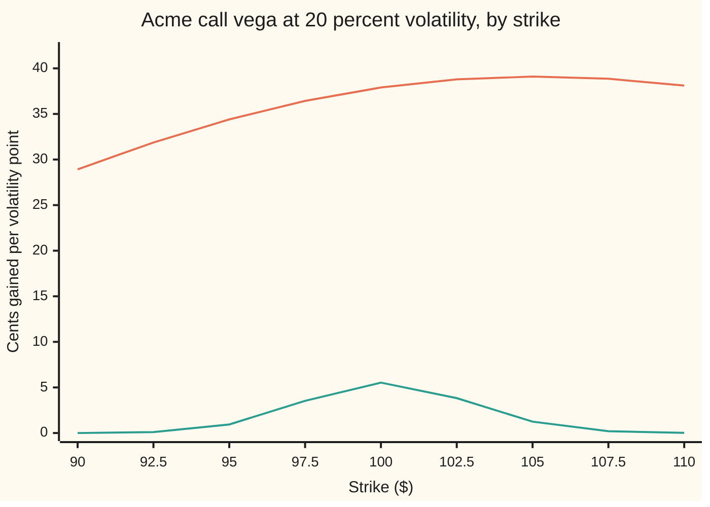
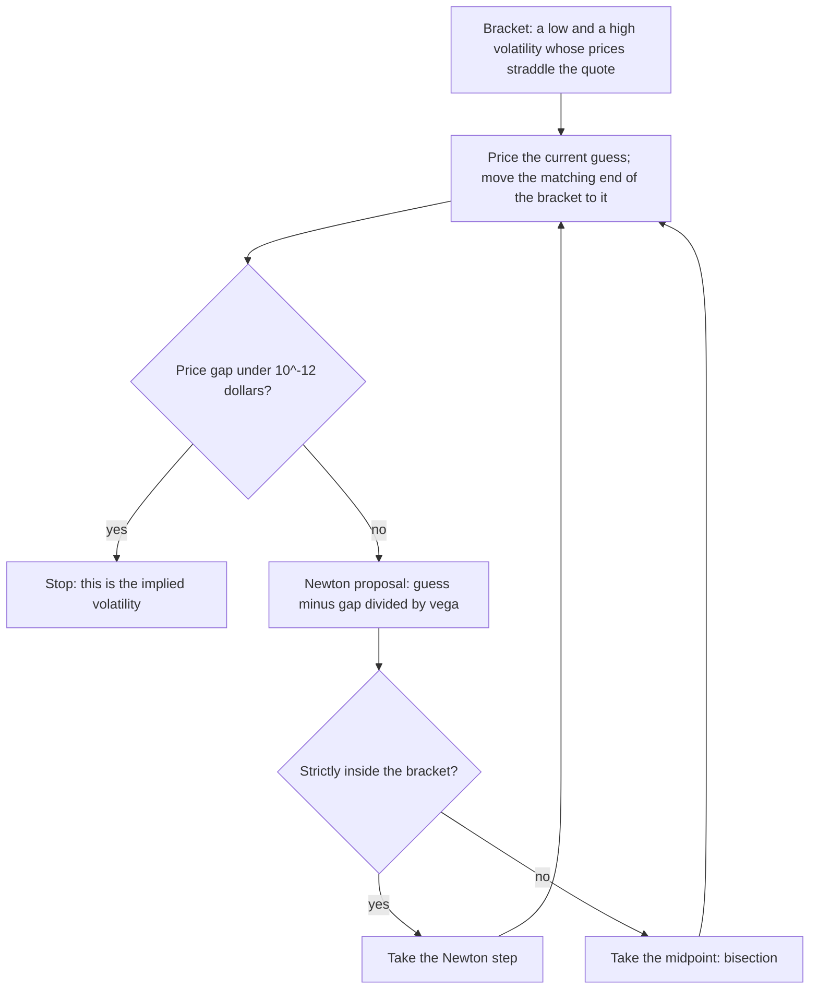

# Solving for implied volatility: Newton steered by vega, bisection as the safety net, and when the answer is fuzzy

[Syllabus](../../../SYLLABUS.md) → [Financial mathematics](../README.md) → [Implied volatility and the vanilla inverses](../README.md#s11) → Solving for implied volatility

---

## General Overview

A screen shows the one-year Acme call at $9.23; to the full precision the shelf checks against, 9.227005508154. Acme's shares stand at $100, the strike is $100, cash earns 5 percent a year and the shares pay a 2 percent dividend yield. The one number missing is the volatility: how jumpy the market takes Acme's shares to be. The volatility that makes the Black–Scholes price equal the quote is the **implied volatility** ([Implied volatility](01-implied-volatility.md)). No algebra pulls it out of the formula. It has to be searched for.

**Vega** is the dollars the option gains per unit of volatility (a unit is 1.00, a hundred percentage points). Dividing the dollar gap between a guess's price and the quote by vega converts it into a volatility step. That is Newton's method, and from a guess of 50 percent it lands on 20.000 percent in four trips through the pricer. Where vega is nearly flat — options far from the money, options about to expire — the same division throws the guess into nonsense. A one-week call far out of the money, at a 5 percent guess, has a vega of 0.000000001569 dollars per unit, and one Newton step sends the guess to a volatility of 36549384.536295. So a real solver keeps a **bracket**: a low and a high guess known to straddle the answer. Any step that leaves the bracket is replaced by halving it, which is **bisection**.

The same division answers a second question. A quote is really two prices, a bid and an ask, say 5 cents apart. Divided by vega, 5 cents is 0.13 of a volatility point (a point is 0.01 of volatility, one percentage point) on the one-year Acme call and 3.61 points on a one-week call far out of the money: a sharp answer, and a smear.

**Newton turns the price gap into a volatility step by dividing by vega, and converges without overshooting when it starts where vega peaks; a bracket with bisection catches every step that goes wrong where vega is flat; and the same division turns a bid-ask width into the width of the answer.**

**What kind of fact this is:** a method; its guarantee — Newton from the peak-vega start never overshoots — is a theorem, proved on this card in Why it works.

### The picture: where vega lives



Upper line: the one-year call. Vega sits between 28.92 and 39.10 cents per volatility point across every strike shown, so Newton has a firm slope everywhere. Lower line: the same calls with one week left. Vega is a narrow spike of 5.53 cents at the money and falls to 0.02 cents by $110. Out there the price hardly responds to volatility, which is exactly what makes the volatility hard to find and hard to trust.

---

## The formula

Notation first, in words. $C(\sigma)$ is the Black–Scholes call price at volatility $\sigma$, and $C_{\text{mkt}}$ is the quoted price. The guess after n Newton steps is $\sigma_n$. Vega, the slope of price against volatility, is written $\mathcal{V}$. The Newton step is:

$$\sigma_{n+1} = \sigma_n - \frac{C(\sigma_n) - C_{\text{mkt}}}{\mathcal{V}(\sigma_n)}, \qquad \mathcal{V}(\sigma) = S\,e^{-qT}\,\varphi(d_1)\,\sqrt{T}$$

**Read it aloud:** the next guess is this guess, minus the price gap in dollars divided by the dollars one unit of volatility buys.

The start that makes Newton safe is where vega is largest:

$$\sigma_c = \sqrt{\frac{2\,\lvert \ln(F/K)\rvert}{T}}, \qquad F = S\,e^{(r-q)T}$$

**Read it aloud:** start at the volatility whose squared total over the option's life is twice the log-distance from the forward to the strike.

And the width of the answer, for a quote whose bid and ask are $w$ dollars apart:

$$\Delta\sigma \approx \frac{w}{\mathcal{V}(\sigma_*)}$$

**Read it aloud:** the uncertainty in the volatility is the width of the quote divided by vega at the answer.

| Symbol | Plain meaning | In our example | Push it up and the answer… |
| --- | --- | --- | --- |
| $C(\sigma)$ | the call's Black–Scholes price at volatility $\sigma$ | $9.227005508154 at 0.20 | — |
| $C_{\text{mkt}}$ | the quoted price the model must reproduce | $9.227005508154 | rises: so does the implied volatility |
| $\sigma$ | volatility, as a decimal. Say "sigma". | the unknown | — |
| $\sigma_n$, $\sigma_{n+1}$ | the guess after n steps, and the next one | 0.50, then 0.196282594886 | — |
| $\sigma_*$ | the true answer: the volatility whose price is the quote | 0.20 | — |
| $\sigma_c$ | the start where vega peaks | 0.244948974278 | — |
| $\mathcal{V}$ | vega: dollars gained per 1.00 of volatility | $37.901157510017 at the answer | rises: the answer is sharper |
| $w$, $\Delta\sigma$ | the bid-ask width in dollars, and the volatility width it implies | 0.05 and 0.1319 points | wider quote: fuzzier answer |
| $S$, $K$, $T$ | spot, strike, years to expiry | 100, 100, 1 | — |
| $r$, $q$ | cash rate and dividend yield, continuously compounded | 0.05 and 0.02 | — |
| $F$ | the forward: the price agreed today for delivery at $T$ | $S$ grown at $r - q$ for a year | — |
| $d_1$, $d_2$, $\varphi$ | the pilot's two distances, and the bell-curve height | see below | — |

The helpers, written with the forward so the log-distance $\ln(F/K)$ stands alone:

$$d_1 = \frac{\ln(F/K) + \tfrac12\sigma^2 T}{\sigma\sqrt{T}}, \qquad d_2 = d_1 - \sigma\sqrt{T}, \qquad \varphi(z) = \frac{e^{-z^2/2}}{\sqrt{2\pi}}$$

In words: $d_1$ and $d_2$ are the pilot's distances from the strike measured in units of total volatility $\sigma\sqrt{T}$ ([Black–Scholes call](../08-The%20Black-Scholes%20call%20and%20put/01-black-scholes-call.md)), and $\varphi$ is the height of the standard bell curve.

### When it holds

- **The quote lies strictly between the call's floor and ceiling.** Here that is between $2.896924880604 and $98.019867330676. A quote outside has no volatility behind it; bisection on a quote of $2.80 walks to the bottom of its bracket and reports 0.010000000000.
- **The option is European and the inputs match the market's.** Rates, dividends and the forward must be the ones the quote was made with ([Implied forward and dividend from parity](05-implied-forward-and-dividend-from-parity.md)). An American put carries early-exercise value, and inverting it with this formula books that value as volatility.
- **Vega has not underflowed.** Newton divides by it. At a 5 percent guess on the one-week 5-delta call it is 0.000000001569; far enough out it is exactly zero in the standard 64-bit arithmetic computers use, and the division fails outright. The bracket is the cure.
- **The width is small against the price's curvature.** The division $w/\mathcal{V}$ uses the tangent line. At the money it matches the exact bid and ask volatilities to four decimals; on the one-week 5-delta call it says 3.4962 points where the exact answer is 3.6117.

---

## Why it works

### Step 0: one quote, one volatility, and the edges

The call's price strictly climbs with volatility, because vega is a share price times a bell-curve height times a square root, all positive. A strictly climbing curve meets a level at most once: uniqueness.

For existence, look at the ends. As volatility shrinks to zero the share stops wandering and the call is worth what it pays on the forward, discounted: $S e^{-qT} - K e^{-rT}$, or zero if that is negative. For Acme, $2.896924880604. As volatility grows without bound, almost every outcome is a near-worthless share or a huge one, the strike stops mattering, and the call is worth the share it may deliver: $S e^{-qT}$, here $98.019867330676. The price moves continuously between these two, so every quote strictly inside is met exactly once ([Intermediate value theorem](../../06-Calculus%20and%20analysis/01-Limits%20and%20Continuity/06-intermediate-value-theorem.md)). A quote on or outside an edge is rejected, not solved.

The put needs no separate theory. Put–call parity ties its price to the call's by a term that has no volatility in it, so both have the same vega and the same implied volatility. The code inverts the house put, $6.330080627550, and gets 0.200000000000.

### Step 1: Newton's step is a change of units

The quote is in dollars; the answer is in volatility. Vega is the exchange rate. Start at 0.50. The price there is $11.319467764849 too high. Vega at 0.50 is $37.269737 per unit, so the step down is 11.319467764849 / 37.269737 of a unit, landing at 0.196282594886. The price there is $0.140876951526 too low; one more conversion lands at 0.200000465889, and the next at 0.200000000000. Four prices computed, three steps taken.

Read the guesses 0.196282594886, 0.200000465889, 0.200000000000: the count of correct digits roughly doubles each step, because each step roughly squares the error, as the Newton card proves ([Newton's method](../../06-Calculus%20and%20analysis/03-What%20Derivatives%20Tell%20You/06-newtons-method.md)).

### Step 2: vega has a peak, and the price curve bends around it

How fast vega itself changes with volatility decides whether Newton overshoots. That rate — traders call it **vomma** — has a clean form:

$$\frac{d\mathcal{V}}{d\sigma} = \mathcal{V}\,\frac{d_1 d_2}{\sigma}, \qquad d_1 d_2 = \frac{\ln(F/K)^2}{\sigma^2 T} - \frac{\sigma^2 T}{4}$$

Vega is positive, so the sign is the sign of $d_1 d_2$. The first term shrinks as volatility grows and the second grows, so $d_1 d_2$ is positive for small volatility, zero at exactly one point, and negative after. Setting it to zero gives $\sigma^2 T = 2\lvert\ln(F/K)\rvert$, which is $\sigma_c$.

Read the other way round: below $\sigma_c$, vega rises with volatility and the price curve is **convex** (bending upward, lying above every tangent line). Above $\sigma_c$ vega falls and the curve is **concave** (bending downward, lying below every tangent). At $\sigma_c$ vega is at its peak. For the house call $\ln(F/K) = (r - q)T = 0.03$, and $\sigma_c = \sqrt{2 \times 0.03 / 1}$ = 0.244948974278.

<details>
<summary>The algebra behind vomma</summary>

Vega is $S e^{-qT}\varphi(d_1)\sqrt{T}$, and the bell curve's slope is $\varphi'(z) = -z\,\varphi(z)$. So $d\mathcal{V}/d\sigma = -\mathcal{V}\, d_1\, (\partial d_1/\partial\sigma)$.

Write $d_1 = \ln(F/K)/(\sigma\sqrt{T}) + \tfrac12\sigma\sqrt{T}$. Then $\partial d_1/\partial\sigma = -\ln(F/K)/(\sigma^2\sqrt{T}) + \tfrac12\sqrt{T}$, which is $-\tfrac{1}{\sigma}\big(\ln(F/K)/(\sigma\sqrt{T}) - \tfrac12\sigma\sqrt{T}\big) = -d_2/\sigma$.

Substituting, $d\mathcal{V}/d\sigma = \mathcal{V} d_1 d_2/\sigma$. Multiplying out $d_1 d_2 = (a + b)(a - b) = a^2 - b^2$ with $a = \ln(F/K)/(\sigma\sqrt{T})$ and $b = \tfrac12\sigma\sqrt{T}$ gives the second formula.

</details>

### Step 3: Newton from the peak never overshoots

Start at $\sigma_c$. Suppose the answer lies below it, as for the house quote. The start prices too high, so Newton steps down. On the convex side the curve lies above its tangent, so where the tangent reaches the quote the curve is still at or above it: the new guess is still at or above the answer. Each step moves down and none passes the answer. A sequence that only falls and cannot pass a floor settles, and it can only settle where the price gap is zero. If the answer lies above $\sigma_c$, the mirror argument runs on the concave side, climbing.

The code checks this on the one-week 5-delta call. From $\sigma_c$ = 2.1872 the guesses fall every step and reach 0.20 in 8 trips. The start also sidesteps the flat-vega trap: every guess sits between the answer and the peak, where vega is at least its value at the answer.

<details>
<summary>Detailed proof</summary>

Write $g(\sigma) = C(\sigma) - C_{\text{mkt}}$, so $g' = \mathcal{V} > 0$ and $g'' = \mathcal{V} d_1 d_2/\sigma$. Step 2 shows $g'' \ge 0$ on $(0, \sigma_c]$ and $g'' \le 0$ on $[\sigma_c, \infty)$.

**Case $\sigma_* < \sigma_c$.** Claim: every $\sigma_n$ lies in $[\sigma_*, \sigma_c]$ and $\sigma_{n+1} \le \sigma_n$. True at $n = 0$. If $\sigma_n$ is in that interval then $g(\sigma_n) \ge 0$, so $\sigma_{n+1} = \sigma_n - g(\sigma_n)/g'(\sigma_n) \le \sigma_n$. On the convex interval the curve lies above each tangent: $g(\sigma) \ge g(\sigma_n) + g'(\sigma_n)(\sigma - \sigma_n)$ for every $\sigma$ in $[\sigma_*, \sigma_n]$. Suppose $\sigma_{n+1} < \sigma_*$. The tangent is zero at $\sigma_{n+1}$ and climbs with slope $g'(\sigma_n) > 0$, so at $\sigma_*$ it is positive, while $g(\sigma_*) = 0$: the curve would lie below its tangent, a contradiction. So $\sigma_{n+1} \ge \sigma_*$.

The sequence falls and is bounded below, so it has a limit, call it L, in $[\sigma_*, \sigma_c]$. The step shrinks to zero, and $g'$ is at least $g'(\sigma_*) > 0$ on the interval, so $g(\sigma_n) = g'(\sigma_n)(\sigma_n - \sigma_{n+1})$ tends to zero; by continuity $g(L) = 0$, and uniqueness makes L the answer $\sigma_*$.

**Case $\sigma_* > \sigma_c$.** The same argument with every inequality reversed: the start prices too low, the curve lies below its tangents on the concave side, the guesses climb and never pass $\sigma_*$.

**Case $\sigma_* = \sigma_c$.** The first guess is the answer.

**Case $K = F$.** Then $\sigma_c = 0$ and the curve is concave everywhere. Any positive start below the answer climbs without passing it, by the second case's argument.

</details>

Manaster and Koehler gave this start in 1982, and it is still the textbook fix. Newton converges from anywhere between the answer and $\sigma_c$; outside that stretch it is not guaranteed to.

### Step 4: where vega is flat, a careless start dies

Now start at 5 percent: a plausible guess for a quiet stock. On the one-year house quote nothing goes wrong: at the money a year out, even a low volatility leaves the price responsive, and Newton arrives in 5 trips.

On a one-week option the picture of vega above explains the rest. One week is taken as $T = 1/52$ year. Take the one-week **20-delta** call: the strike whose call delta — the share-equivalent the call carries — is 0.20, found as on [Strike from delta](03-strike-from-delta.md). It is $102.459385, priced at $0.305628 at 20 percent volatility. At a 5 percent guess the price is $0.305572 too low and vega is 0.016098190330 dollars per unit. The step is the gap over the slope: it lands at 19.031778, a volatility of over nineteen hundred percent. There the call is worth nearly the whole share, the gap is +$80.744298, vega is 2.342809335938, and the next step lands at −15.432955. A negative volatility is not a poor answer; it is not an answer.

The one-week **5-delta** call, strike $104.767812, fares worse. At the 5 percent guess vega is 0.000000001569. One step lands at 36549384.536295.

Both starts sat on the convex side below the answer, where the tangent lies under the curve and aims too far. The flatter the tangent, the further it aims. Short expiry makes it flat because the total volatility $\sigma\sqrt{T}$ is small, so a strike a few dollars away is many units of it from the money, deep in the bell curve's tail.

### Step 5: the bracket is the net

The guarded solver keeps a low and a high guess whose prices straddle the quote, starting at 0.01 and 5.00. After each price it moves one end of the bracket to the current guess. It then proposes the Newton step. If the proposal lands strictly inside the bracket it is taken; if not, the midpoint is taken instead and the bracket halves.



One guarded loop. Bisection needs only the signs of the price gaps, so a flat or zero vega can cost a step but never the answer.

From the same careless 5 percent start, the guarded solver solves the one-week 20-delta call in 7 trips with 1 fallback to the midpoint, and the 5-delta in 9 trips with 1 fallback. Plain bisection on the same bracket always arrives too, but needs 43 halvings to pin the answer to twelve decimals, because it gains one binary digit per trip whatever the curve looks like. The general machinery, including Brent's refinement of this idea, is on [Solving backwards](../07-Greeks%20by%20Numbers%20and%20Calibration/05-root-finding-for-inverses.md).

### Step 6: the answer is only as sharp as the quote

A market does not print one price. It prints a bid and an ask, and the true price lies somewhere between. Near the answer, the tangent line says price changes by $\mathcal{V}\,\Delta\sigma$ when volatility changes by $\Delta\sigma$. Run backwards, a price range of width $w$ is a volatility range of width about $w / \mathcal{V}$.

Vega is quoted per 1.00 of volatility, and a **volatility point** is 0.01, one percent. So the width in points is $100\,w/\mathcal{V}$. With a 5-cent width:

| Option | Mid price | Vega per point | Width over vega, points | Exact ask vol minus bid vol, points |
| --- | --- | --- | --- | --- |
| one-year, at the money | $9.227006 | $0.379012 | 0.1319 | 0.1319 |
| one-week, at the money | $1.134753 | $0.055269 | 0.9047 | 0.9047 |
| one-week, 20-delta | $0.305628 | $0.038818 | 1.2881 | 1.2888 |
| one-week, 5-delta | $0.057354 | $0.014301 | 3.4962 | 3.6117 |

The last column inverts the bid and the ask separately by bisection, a second road that uses no vega at all. The two roads agree wherever the price curve is close to straight over the width. On the 5-delta call the curve bends noticeably within 5 cents, and the tangent understates the width.

```
volatility width from a 5-cent bid-ask, one block = 0.1 point
  1y at the money   █                                       0.1319
  1w at the money   █████████                               0.9047
  1w 20-delta       █████████████                           1.2888
  1w 5-delta        ████████████████████████████████████    3.6117
```

The same 5 cents is a tenth of a point on the one-year call and several points on the short wing. A solver run to twelve decimals on the 5-delta call is reporting its arithmetic, not the market.

### The other door

Jäckel's "Let's Be Rational" reshapes the price before solving: it divides out the discounting, rewrites the strike as a log-distance from the forward, draws a starting guess from rational functions fitted to that shape, and needs two steps of a higher-order cousin of Newton to reach full double precision. It is what fast libraries use. It is named here and not built; the residual, the slope and the curvature above are still its raw material. For quotes near the money, Brenner and Subrahmanyam's approximation — the at-the-money call is roughly $S\sigma\sqrt{T/(2\pi)}$, solved for $\sigma$ — gives a start with no solving at all.

---

## Worked numbers, by hand

The house quote: $S = 100$, $K = 100$, $r = 5\%$, $q = 2\%$, $T = 1$ year, $C_{\text{mkt}}$ = $9.227005508154. Newton from 0.50:

| Step | Arithmetic | Value |
| --- | --- | --- |
| price gap at 0.50 | $C(0.50) - 9.227005508154$ | +11.319467764849 |
| vega at 0.50 | $S e^{-qT}\varphi(d_1)\sqrt{T}$ | 37.269737 |
| step 1 | 0.50 − 11.319467764849 / 37.269737 | 0.196282594886 |
| gap and vega there | | −0.140876951526 and 37.891834 |
| step 2 | 0.196282594886 + 0.140876951526 / 37.891834 | 0.200000465889 |
| gap and vega there | | +0.000017657724 and 37.901159 |
| step 3 | 0.200000465889 − 0.000017657724 / 37.901159 | **0.200000000000** |
| from $\sigma_c$ = 0.244948974278 instead | never overshoots | 4 trips |
| by bisection on 0.01 to 5.00 | 43 halvings | 0.200000000000 |
| the house put, $6.330080627550 | same routine | 0.200000000000 |
| width of a 5-cent quote | 100 × 0.05 / 37.901157510017 | 0.1319 points |

The market's $9.23 is the price of 20 percent volatility, give or take 0.13 of a point if the quote is 5 cents wide. That volatility, not the dollar price, is what a desk compares across strikes and dates.

### What breaks if you drop a piece

| Mistake | Comes out at | What went wrong |
| --- | --- | --- |
| Newton from 0.05 on the one-week 20-delta call, no bracket | −15.432955 after two steps | Vega at the start was 0.016098190330; the first step flew to 19.031778 |
| Newton from 0.05 on the one-week 5-delta call, no bracket | 36549384.536295 after one step | Vega at the start was 0.000000001569 |
| Bisecting a $2.80 quote, below the $2.896924880604 floor | 0.010000000000 | No volatility produces that price; the loop walked to its bracket's end |
| Vega per 1.00 read as vega per point | 0.001319220923 "points" for a 5-cent width | The true width is 0.1319 points: off by a factor of 100 |
| Tangent width on the one-week 5-delta call | 3.4962 points | The exact bid-to-ask width is 3.6117; the curve bends within the quote |

Every number in these tables is printed by both scripts below.

---

## Code, from first principles, and it actually runs

The scripts build their own normal CDF from its series and solve for volatility three ways: plain Newton with the analytic vega, bisection using only the signs of price gaps, and the guarded hybrid. Vega is checked against a bumped price difference, the put is inverted separately, and the bid-ask widths are computed both by dividing by vega and by inverting the bid and ask with bisection. Every chart point and table value above comes from these runs.

### Python

```python
# Implied volatility by Newton and bisection -- the check behind the card.
# Standard library only.  The normal CDF is a series written out below and the
# root finders are plain loops: nothing imported already knows the answer.
from math import exp, log, sqrt, pi

S, R, Q = 100.0, 0.05, 0.02                       # Acme spot, cash rate, dividend yield
WEEK = 1.0 / 52.0

def phi(x): return exp(-0.5 * x * x) / sqrt(2.0 * pi)

def N(x):                                         # 0.5 + phi(x) (x + x^3/3 + x^5/15 + ...)
    if x < -10.0: return 0.0
    if x > 10.0: return 1.0
    term, total, k = x, x, 1
    while abs(term) > 1e-17 * abs(total):
        term *= x * x / (2 * k + 1); total += term; k += 1
    return 0.5 + total * phi(x)

def d1(K, T, s): return (log(S / K) + (R - Q + 0.5 * s * s) * T) / (s * sqrt(T))
def call(K, T, s):
    a = d1(K, T, s); return S * exp(-Q * T) * N(a) - K * exp(-R * T) * N(a - s * sqrt(T))
def put(K, T, s):
    a = d1(K, T, s); return K * exp(-R * T) * N(s * sqrt(T) - a) - S * exp(-Q * T) * N(-a)
def vega(K, T, s): return S * exp(-Q * T) * phi(d1(K, T, s)) * sqrt(T)     # dollars per 1.00 of vol
def s_peak(K, T): return sqrt(2.0 * abs(log(S * exp((R - Q) * T) / K)) / T)  # where vega peaks

def newton(price, K, T, p, x, trace=None):        # road 1: the slope, unguarded
    for trip in range(1, 100):
        f, v = price(K, T, x) - p, vega(K, T, x)
        if trace is not None: trace.append((trip, x, f, v))
        if abs(f) < 1e-12: return x, trip
        if v == 0.0: return float("inf"), trip
        x = x - f / v
        if not (0.0 < x < 1e3): return x, trip    # left the world of volatilities
    return x, 100

def bisect(price, K, T, p, lo=0.01, hi=5.0):      # road 2: no slope, only signs
    halvings = 0
    while hi - lo > 1e-12:
        m = 0.5 * (lo + hi); halvings += 1
        if price(K, T, m) > p: hi = m
        else: lo = m
    return 0.5 * (lo + hi), halvings

def guarded(price, K, T, p, x, lo=0.01, hi=5.0):  # Newton inside a bracket, bisection as the net
    falls = 0
    for trips in range(1, 200):
        f = price(K, T, x) - p
        if abs(f) < 1e-12 or hi - lo < 1e-14: break
        if f > 0: hi = x
        else: lo = x
        v = vega(K, T, x)
        nxt = x - f / v if v > 0.0 else lo
        if not (lo < nxt < hi): nxt = 0.5 * (lo + hi); falls += 1
        x = nxt
    return x, trips, falls

def strike_for_delta(T, target):                  # the strike whose call delta is target, at 0.20
    lo, hi = 50.0, 200.0
    while hi - lo > 1e-12:
        m = 0.5 * (lo + hi)
        if exp(-Q * T) * N(d1(m, T, 0.20)) > target: lo = m
        else: hi = m
    return 0.5 * (lo + hi)

def row(label, v): print(f"{label:<46}{v:>22d}" if isinstance(v, int) else f"{label:<46}{v:>22.12f}")

# ---- the house quote, read backwards ----
C, P = call(100.0, 1.0, 0.20), put(100.0, 1.0, 0.20)
row("house call at 0.20", C)
row("house put at 0.20", P)
row("call floor, S e^-qT - K e^-rT", S * exp(-Q) - 100.0 * exp(-R))
row("call ceiling, S e^-qT", S * exp(-Q))
v0, h = vega(100.0, 1.0, 0.20), 1e-5
v_bump = (call(100.0, 1.0, 0.20 + h) - call(100.0, 1.0, 0.20 - h)) / (2 * h)
row("vega at 0.20, per 1.00 of vol", v0)
row("vega by bumping the price", v_bump)
row("sigma_c, where vega peaks", s_peak(100.0, 1.0))
trace = []
x_n, trips_n = newton(call, 100.0, 1.0, C, 0.50, trace)
for trip, x, f, v in trace:
    print(f"newton from 0.50, trip {trip}: sigma {x:.12f}  residual {f:+.12f}  vega {v:.6f}")
row("newton from sigma_c, trips", newton(call, 100.0, 1.0, C, s_peak(100.0, 1.0))[1])
x_b, halv_b = bisect(call, 100.0, 1.0, C)
row("bisection on 0.01 to 5.00, answer", x_b)
row("bisection on 0.01 to 5.00, halvings", halv_b)
x_p = newton(put, 100.0, 1.0, P, 0.50)[0]
row("put 6.330080627550 by Newton from 0.50", x_p)

# ---- the same solver on one-week options ----
cases = [("1y atm", 100.0, 1.0), ("1w atm", 100.0, WEEK),
         ("1w 20d", strike_for_delta(WEEK, 0.20), WEEK), ("1w 5d", strike_for_delta(WEEK, 0.05), WEEK)]
print("case    strike      sigma_c   newton from 0.05 ends at  trips  from sigma_c  guarded, falls  bisection")
results = []
for name, K, T in cases:
    p = call(K, T, 0.20)
    x_lo, t_lo = newton(call, K, T, p, 0.05)
    x_c, t_c = newton(call, K, T, p, s_peak(K, T))
    x_g, t_g, f_g = guarded(call, K, T, p, 0.05)
    x_bi = bisect(call, K, T, p)[0]
    results.append((x_lo, x_c, x_g, x_bi))
    print(f"{name:<7}{K:>11.6f}{s_peak(K, T):>9.4f}{x_lo:>27.6f}{t_lo:>7d}{t_c:>14d}{t_g:>9d}{f_g:>7d}{x_bi:>11.6f}")

for name, K, T in cases[2:]:                      # where the low start goes
    tr = []; newton(call, K, T, call(K, T, 0.20), 0.05, tr)
    for trip, x, f, v in tr: print(f"{name} from 0.05, trip {trip}: sigma {x:.6f}  residual {f:+.6f}  vega {v:.12f}")

# ---- a 0.05 bid-ask width, read as a volatility width ----
print("case    mid price   vega per vol point   width / vega, points   ask vol - bid vol, points")
widths = []
for name, K, T in cases:
    p = call(K, T, 0.20)
    lin = 0.05 / vega(K, T, 0.20) * 100.0
    exact = (bisect(call, K, T, p + 0.025)[0] - bisect(call, K, T, p - 0.025)[0]) * 100.0
    widths.append((lin, exact))
    print(f"{name:<7}{p:>10.6f}{vega(K, T, 0.20) / 100.0:>21.6f}{lin:>23.4f}{exact:>28.4f}")

# ---- what breaks, and the chart ----
row("bisection on a 2.80 quote, below the floor", bisect(call, 100.0, 1.0, 2.80)[0])
row("0.05 / vega per 1.00, misread as points", 0.05 / v0)
strikes = [90.0 + 2.5 * i for i in range(9)]
print("chart, strike              " + " ".join(f"{k:6.1f}" for k in strikes))
for label, T in (("chart, cents per point, 1y ", 1.0), ("chart, cents per point, 1w ", WEEK)):
    print(label + " " + " ".join(f"{vega(k, T, 0.20):6.2f}" for k in strikes))

slide = []
newton(call, cases[3][1], WEEK, call(cases[3][1], WEEK, 0.20), s_peak(cases[3][1], WEEK), slide)
assert abs(C - 9.227005508154) < 1e-9                                     # the pilot's call
assert abs(P - 6.330080627550) < 1e-9                                     # the pilot's put
assert abs(v_bump - v0) < 1e-6                                            # slope two ways
assert abs(x_n - 0.20) < 1e-12                                            # Newton recovers 0.20
assert abs(x_b - 0.20) < 1e-11                                            # bisection recovers 0.20
assert abs(x_p - 0.20) < 1e-12                                            # the put gives the same vol
assert all(abs(x - 0.20) < 1e-10 for r in results for x in r[1:])        # every safe road lands
assert not any(0.0 < results[i][0] < 1e3 for i in (2, 3))                 # low start dies on 20d and 5d
assert all(vega(k, T, s_peak(k, T)) > max(vega(k, T, s_peak(k, T) * f) for f in (0.99, 1.01)) for _, k, T in cases)  # vega peaks at sigma_c
assert all(a[1] >= b[1] - 1e-15 for a, b in zip(slide, slide[1:]))       # from sigma_c: never overshoots
assert abs(widths[0][0] - widths[0][1]) < 0.001                           # linear width holds at the money
assert widths[3][1] > 3.0                                                 # several points on the 5d
print("ALL CHECKS PASS")
```

**Ran 2026-09-19 on macOS, Python 3.14.6, standard library only. All checks passed. Output, pasted from the run:**

```
house call at 0.20                                    9.227005508154
house put at 0.20                                     6.330080627550
call floor, S e^-qT - K e^-rT                         2.896924880604
call ceiling, S e^-qT                                98.019867330676
vega at 0.20, per 1.00 of vol                        37.901157510017
vega by bumping the price                            37.901157509168
sigma_c, where vega peaks                             0.244948974278
newton from 0.50, trip 1: sigma 0.500000000000  residual +11.319467764849  vega 37.269737
newton from 0.50, trip 2: sigma 0.196282594886  residual -0.140876951526  vega 37.891834
newton from 0.50, trip 3: sigma 0.200000465889  residual +0.000017657724  vega 37.901159
newton from 0.50, trip 4: sigma 0.200000000000  residual +0.000000000000  vega 37.901158
newton from sigma_c, trips                                         4
bisection on 0.01 to 5.00, answer                     0.200000000000
bisection on 0.01 to 5.00, halvings                               43
put 6.330080627550 by Newton from 0.50                0.200000000000
case    strike      sigma_c   newton from 0.05 ends at  trips  from sigma_c  guarded, falls  bisection
1y atm  100.000000   0.2449                   0.200000      5             4        5      0   0.200000
1w atm  100.000000   0.2449                   0.200000      4             3        4      0   0.200000
1w 20d  102.459385   1.5706                 -15.432955      2             6        7      1   0.200000
1w 5d   104.767812   2.1872            36549384.536295      1             8        9      1   0.200000
1w 20d from 0.05, trip 1: sigma 0.050000  residual -0.305572  vega 0.016098190330
1w 20d from 0.05, trip 2: sigma 19.031778  residual +80.744298  vega 2.342809335938
1w 5d from 0.05, trip 1: sigma 0.050000  residual -0.057354  vega 0.000000001569
case    mid price   vega per vol point   width / vega, points   ask vol - bid vol, points
1y atm   9.227006             0.379012                 0.1319                      0.1319
1w atm   1.134753             0.055269                 0.9047                      0.9047
1w 20d   0.305628             0.038818                 1.2881                      1.2888
1w 5d    0.057354             0.014301                 3.4962                      3.6117
bisection on a 2.80 quote, below the floor            0.010000000000
0.05 / vega per 1.00, misread as points               0.001319220923
chart, strike                90.0   92.5   95.0   97.5  100.0  102.5  105.0  107.5  110.0
chart, cents per point, 1y   28.92  31.87  34.40  36.43  37.90  38.79  39.10  38.86  38.11
chart, cents per point, 1w    0.00   0.10   0.94   3.53   5.53   3.83   1.25   0.20   0.02
ALL CHECKS PASS
```

Newton from 0.50 and from $\sigma_c$ each take four prices. Bisection needs 43 halvings and cannot fail. The low start dies on both one-week wing calls, and the guarded solver rescues each with one fallback.

### Rust

Same algorithms, same labels, built with `rustc --edition 2021 -O`, no crates.

```rust
// Implied volatility by Newton and bisection -- the same check as the Python, in Rust.
// Standard library only, no crates.  The normal CDF is the same series written out;
// the root finders are plain loops.  Compile: rustc --edition 2021 -O <this file>
use std::f64::consts::PI;

const S: f64 = 100.0; const R: f64 = 0.05; const Q: f64 = 0.02;   // Acme spot, cash rate, dividend yield
const WEEK: f64 = 1.0 / 52.0;

fn phi(x: f64) -> f64 { (-0.5 * x * x).exp() / (2.0 * PI).sqrt() }

fn n_cdf(x: f64) -> f64 {                          // 0.5 + phi(x) (x + x^3/3 + x^5/15 + ...)
    if x < -10.0 { return 0.0; }
    if x > 10.0 { return 1.0; }
    let (mut term, mut total, mut k) = (x, x, 1.0);
    while term.abs() > 1e-17 * total.abs() {
        term *= x * x / (2.0 * k + 1.0); total += term; k += 1.0;
    }
    0.5 + total * phi(x)
}

fn d1(k: f64, t: f64, s: f64) -> f64 { ((S / k).ln() + (R - Q + 0.5 * s * s) * t) / (s * t.sqrt()) }
fn call(k: f64, t: f64, s: f64) -> f64 {
    let a = d1(k, t, s); S * (-Q * t).exp() * n_cdf(a) - k * (-R * t).exp() * n_cdf(a - s * t.sqrt()) }
fn put(k: f64, t: f64, s: f64) -> f64 {
    let a = d1(k, t, s); k * (-R * t).exp() * n_cdf(s * t.sqrt() - a) - S * (-Q * t).exp() * n_cdf(-a) }
fn vega(k: f64, t: f64, s: f64) -> f64 { S * (-Q * t).exp() * phi(d1(k, t, s)) * t.sqrt() }
fn s_peak(k: f64, t: f64) -> f64 { (2.0 * ((S * ((R - Q) * t).exp()) / k).ln().abs() / t).sqrt() }

type Pricer = fn(f64, f64, f64) -> f64;

// road 1: the slope, unguarded.  The trace keeps (trip, sigma, residual, vega).
fn newton(price: Pricer, k: f64, t: f64, p: f64, mut x: f64, trace: &mut Vec<(usize, f64, f64, f64)>) -> (f64, usize) {
    for trip in 1..100 {
        let (f, v) = (price(k, t, x) - p, vega(k, t, x));
        trace.push((trip, x, f, v));
        if f.abs() < 1e-12 { return (x, trip); }
        if v == 0.0 { return (f64::INFINITY, trip); }
        x -= f / v;
        if !(x > 0.0 && x < 1e3) { return (x, trip); }   // left the world of volatilities
    }
    (x, 100)
}

// road 2: no slope, only signs
fn bisect(price: Pricer, k: f64, t: f64, p: f64) -> (f64, usize) {
    let (mut lo, mut hi, mut halvings) = (0.01, 5.0, 0usize);
    while hi - lo > 1e-12 {
        let m = 0.5 * (lo + hi);
        halvings += 1;
        if price(k, t, m) > p { hi = m; } else { lo = m; }
    }
    (0.5 * (lo + hi), halvings)
}

// Newton inside a bracket, bisection as the net
fn guarded(price: Pricer, k: f64, t: f64, p: f64, mut x: f64) -> (f64, usize, usize) {
    let (mut lo, mut hi, mut falls, mut trips) = (0.01, 5.0, 0usize, 0usize);
    for trip in 1..200 {
        trips = trip;
        let f = price(k, t, x) - p;
        if f.abs() < 1e-12 || hi - lo < 1e-14 { break; }
        if f > 0.0 { hi = x; } else { lo = x; }
        let v = vega(k, t, x);
        let mut nxt = if v > 0.0 { x - f / v } else { lo };
        if !(lo < nxt && nxt < hi) { nxt = 0.5 * (lo + hi); falls += 1; }
        x = nxt;
    }
    (x, trips, falls)
}

fn strike_for_delta(t: f64, target: f64) -> f64 {  // the strike whose call delta is target, at 0.20
    let (mut lo, mut hi) = (50.0, 200.0);
    while hi - lo > 1e-12 {
        let m = 0.5 * (lo + hi);
        if (-Q * t).exp() * n_cdf(d1(m, t, 0.20)) > target { lo = m; } else { hi = m; }
    }
    0.5 * (lo + hi)
}

fn row(label: &str, v: f64) { println!("{:<46}{:>22.12}", label, v); }
fn row_int(label: &str, v: usize) { println!("{:<46}{:>22}", label, v); }

fn main() {
    let mut none = Vec::new();
    // ---- the house quote, read backwards ----
    let (c, p) = (call(100.0, 1.0, 0.20), put(100.0, 1.0, 0.20));
    row("house call at 0.20", c);
    row("house put at 0.20", p);
    row("call floor, S e^-qT - K e^-rT", S * (-Q).exp() - 100.0 * (-R).exp());
    row("call ceiling, S e^-qT", S * (-Q).exp());
    let (v0, h) = (vega(100.0, 1.0, 0.20), 1e-5);
    let v_bump = (call(100.0, 1.0, 0.20 + h) - call(100.0, 1.0, 0.20 - h)) / (2.0 * h);
    row("vega at 0.20, per 1.00 of vol", v0);
    row("vega by bumping the price", v_bump);
    row("sigma_c, where vega peaks", s_peak(100.0, 1.0));
    let mut trace = Vec::new();
    let (x_n, _) = newton(call, 100.0, 1.0, c, 0.50, &mut trace);
    for (trip, x, f, v) in &trace {
        println!("newton from 0.50, trip {}: sigma {:.12}  residual {:+.12}  vega {:.6}", trip, x, f, v);
    }
    row_int("newton from sigma_c, trips", newton(call, 100.0, 1.0, c, s_peak(100.0, 1.0), &mut none).1);
    let (x_b, halv_b) = bisect(call, 100.0, 1.0, c);
    row("bisection on 0.01 to 5.00, answer", x_b);
    row_int("bisection on 0.01 to 5.00, halvings", halv_b);
    let x_p = newton(put, 100.0, 1.0, p, 0.50, &mut none).0;
    row("put 6.330080627550 by Newton from 0.50", x_p);

    // ---- the same solver on one-week options ----
    let cases = [("1y atm", 100.0, 1.0), ("1w atm", 100.0, WEEK),
                 ("1w 20d", strike_for_delta(WEEK, 0.20), WEEK), ("1w 5d", strike_for_delta(WEEK, 0.05), WEEK)];
    println!("case    strike      sigma_c   newton from 0.05 ends at  trips  from sigma_c  guarded, falls  bisection");
    let mut results = Vec::new();
    for (name, k, t) in cases {
        let pr = call(k, t, 0.20);
        let (x_lo, t_lo) = newton(call, k, t, pr, 0.05, &mut none);
        let (x_c, t_c) = newton(call, k, t, pr, s_peak(k, t), &mut none);
        let (x_g, t_g, f_g) = guarded(call, k, t, pr, 0.05);
        let x_bi = bisect(call, k, t, pr).0;
        results.push((x_lo, x_c, x_g, x_bi));
        println!("{:<7}{:>11.6}{:>9.4}{:>27.6}{:>7}{:>14}{:>9}{:>7}{:>11.6}", name, k, s_peak(k, t), x_lo, t_lo, t_c, t_g, f_g, x_bi);
    }
    for (name, k, t) in &cases[2..] {                // where the low start goes
        let mut tr = Vec::new();
        newton(call, *k, *t, call(*k, *t, 0.20), 0.05, &mut tr);
        for (trip, x, f, v) in &tr {
            println!("{} from 0.05, trip {}: sigma {:.6}  residual {:+.6}  vega {:.12}", name, trip, x, f, v);
        }
    }

    // ---- a 0.05 bid-ask width, read as a volatility width ----
    println!("case    mid price   vega per vol point   width / vega, points   ask vol - bid vol, points");
    let mut widths = Vec::new();
    for (name, k, t) in cases {
        let pr = call(k, t, 0.20);
        let lin = 0.05 / vega(k, t, 0.20) * 100.0;
        let exact = (bisect(call, k, t, pr + 0.025).0 - bisect(call, k, t, pr - 0.025).0) * 100.0;
        widths.push((lin, exact));
        println!("{:<7}{:>10.6}{:>21.6}{:>23.4}{:>28.4}", name, pr, vega(k, t, 0.20) / 100.0, lin, exact);
    }

    // ---- what breaks, and the chart ----
    row("bisection on a 2.80 quote, below the floor", bisect(call, 100.0, 1.0, 2.80).0);
    row("0.05 / vega per 1.00, misread as points", 0.05 / v0);
    let strikes: Vec<f64> = (0..9).map(|i| 90.0 + 2.5 * i as f64).collect();
    let head: Vec<String> = strikes.iter().map(|k| format!("{:6.1}", k)).collect();
    println!("chart, strike              {}", head.join(" "));
    for (label, t) in [("chart, cents per point, 1y ", 1.0), ("chart, cents per point, 1w ", WEEK)] {
        let vals: Vec<String> = strikes.iter().map(|k| format!("{:6.2}", vega(*k, t, 0.20))).collect();
        println!("{} {}", label, vals.join(" "));
    }

    let k5 = cases[3].1;
    let mut slide = Vec::new();
    newton(call, k5, WEEK, call(k5, WEEK, 0.20), s_peak(k5, WEEK), &mut slide);
    assert!((c - 9.227005508154).abs() < 1e-9, "the pilot's call");
    assert!((p - 6.330080627550).abs() < 1e-9, "the pilot's put");
    assert!((v_bump - v0).abs() < 1e-6, "slope two ways");
    assert!((x_n - 0.20).abs() < 1e-12, "Newton recovers 0.20");
    assert!((x_b - 0.20).abs() < 1e-11, "bisection recovers 0.20");
    assert!((x_p - 0.20).abs() < 1e-12, "the put gives the same vol");
    assert!(results.iter().all(|r| [r.1, r.2, r.3].iter().all(|x| (x - 0.20).abs() < 1e-10)), "every safe road lands");
    assert!([2, 3].iter().all(|&i| !(results[i].0 > 0.0 && results[i].0 < 1e3)), "low start dies on 20d and 5d");
    assert!(cases.iter().all(|&(_, k, t)| vega(k, t, s_peak(k, t)) > vega(k, t, s_peak(k, t) * 0.99)
        && vega(k, t, s_peak(k, t)) > vega(k, t, s_peak(k, t) * 1.01)), "sigma_c is where vega peaks");
    assert!(slide.windows(2).all(|w| w[0].1 >= w[1].1 - 1e-15), "from sigma_c: never overshoots");
    assert!((widths[0].0 - widths[0].1).abs() < 0.001, "linear width holds at the money");
    assert!(widths[3].1 > 3.0, "several points on the 5d");
    println!("ALL CHECKS PASS");
}
```

**Ran 2026-09-19 on macOS, rustc 1.98.1, no crates. All checks passed. Output, pasted from the run:**

```
house call at 0.20                                    9.227005508154
house put at 0.20                                     6.330080627550
call floor, S e^-qT - K e^-rT                         2.896924880604
call ceiling, S e^-qT                                98.019867330676
vega at 0.20, per 1.00 of vol                        37.901157510017
vega by bumping the price                            37.901157509168
sigma_c, where vega peaks                             0.244948974278
newton from 0.50, trip 1: sigma 0.500000000000  residual +11.319467764849  vega 37.269737
newton from 0.50, trip 2: sigma 0.196282594886  residual -0.140876951526  vega 37.891834
newton from 0.50, trip 3: sigma 0.200000465889  residual +0.000017657724  vega 37.901159
newton from 0.50, trip 4: sigma 0.200000000000  residual +0.000000000000  vega 37.901158
newton from sigma_c, trips                                         4
bisection on 0.01 to 5.00, answer                     0.200000000000
bisection on 0.01 to 5.00, halvings                               43
put 6.330080627550 by Newton from 0.50                0.200000000000
case    strike      sigma_c   newton from 0.05 ends at  trips  from sigma_c  guarded, falls  bisection
1y atm  100.000000   0.2449                   0.200000      5             4        5      0   0.200000
1w atm  100.000000   0.2449                   0.200000      4             3        4      0   0.200000
1w 20d  102.459385   1.5706                 -15.432955      2             6        7      1   0.200000
1w 5d   104.767812   2.1872            36549384.536295      1             8        9      1   0.200000
1w 20d from 0.05, trip 1: sigma 0.050000  residual -0.305572  vega 0.016098190330
1w 20d from 0.05, trip 2: sigma 19.031778  residual +80.744298  vega 2.342809335938
1w 5d from 0.05, trip 1: sigma 0.050000  residual -0.057354  vega 0.000000001569
case    mid price   vega per vol point   width / vega, points   ask vol - bid vol, points
1y atm   9.227006             0.379012                 0.1319                      0.1319
1w atm   1.134753             0.055269                 0.9047                      0.9047
1w 20d   0.305628             0.038818                 1.2881                      1.2888
1w 5d    0.057354             0.014301                 3.4962                      3.6117
bisection on a 2.80 quote, below the floor            0.010000000000
0.05 / vega per 1.00, misread as points               0.001319220923
chart, strike                90.0   92.5   95.0   97.5  100.0  102.5  105.0  107.5  110.0
chart, cents per point, 1y   28.92  31.87  34.40  36.43  37.90  38.79  39.10  38.86  38.11
chart, cents per point, 1w    0.00   0.10   0.94   3.53   5.53   3.83   1.25   0.20   0.02
ALL CHECKS PASS
```

The two outputs agree line for line at every printed digit.

> [!TIP]
> **Try changing**
> Guess first, then run.
> - **A low start at the money.** Change the house run's start from 0.50 to 0.05. Guess: trouble? No: the one-year at-the-money call has vega to spare, and Newton lands on 0.200000 in 5 trips, as the table's first row shows.
> - **Start the 5-delta at the peak.** The table already does it: from $\sigma_c$ = 2.1872 the guesses fall every step and arrive in 8 trips, against a first step to 36549384.536295 from 0.05.
> - **Delete the net.** Remove the line in `guarded` that takes the midpoint. Guess which assert fires. It is "every safe road lands": the one-week wing calls fly out of the bracket and never come back.
> - **Start at a fixed 0.10 instead of the peak.** Make `s_peak` return 0.1. "vega peaks at sigma_c" fires first. Delete it and "from sigma_c: never overshoots" fails: 0.10 is below the 5-delta's answer on the convex side, and the first step jumps past it.

---

## The usual mistake

> [!warning]
> **Reporting a volatility sharper than its quote.** The solver's tolerance is not the answer's accuracy. A 5-cent-wide quote on the one-week 5-delta call pins the volatility only to within 3.6117 points; twelve decimals from that quote are arithmetic. Quote the width alongside the answer, or invert the bid and the ask as well as the mid.
>
> Three smaller traps:
> - **Newton with no bracket.** From a 5 percent start the one-week 20-delta call reaches −15.432955 in two steps. A bracket costs one comparison per step.
> - **Mixing the units of vega.** Libraries print vega per 1.00 of volatility or per point. Dividing a 5-cent width by the per-1.00 number and calling the result points gives 0.001319220923 where 0.1319 is right.
> - **Inverting a quote outside the edges.** A call quoted below its floor, $2.896924880604 for the house call, has no volatility. Bisection on $2.80 returns 0.010000000000, the bracket's end, with no complaint. Test the edges before solving.

---

## Where you meet it in real life

- **Every option screen's volatility column.** Each quote is inverted as it arrives, usually three times: bid, mid and ask. The spread between the bid and ask volatilities is the width on this card.
- **Weekly and same-day options.** With days or hours left, vega collapses away from the money, so a quoted wing volatility can move several points on a one-tick price change. Risk systems filter or down-weight those quotes rather than trust them.
- **Smile fitting.** A model fitted to many volatilities weights each by how sharp it is; dividing by the bid-ask volatility width is a common choice. The fitting itself is [Calibration](../07-Greeks%20by%20Numbers%20and%20Calibration/06-calibration-as-least-squares.md).
- **The other inverses on this shelf.** A strike from a target delta, [Strike from delta](03-strike-from-delta.md); a strike or spot from a target premium, [Strike or spot from a target premium](04-strike-or-spot-from-a-target-premium.md); the forward and dividend from a call and a put, [Implied forward and dividend from parity](05-implied-forward-and-dividend-from-parity.md). Each one is a bracket and a slope.
- **Listed American options.** Most single-stock options can be exercised early. Their implied volatility needs an American pricer inside the same guarded loop: [American Greeks and implied volatility](../15-American%20and%20Bermudan%20exercise/07-american-greeks-and-implied-volatility.md).

> **Say it back**
> Implied volatility is found by search, because the price formula cannot be solved for it. Newton divides the price gap by vega to get a volatility step, and from the start where vega peaks it never overshoots. Where vega is flat — short expiry, far from the money — a careless start sends Newton to absurd or negative volatilities, so a bracket catches any step that leaves it and halves instead. A bid-ask width divided by vega is the width of the answer: 0.13 of a point on the one-year Acme call, 3.61 points on a one-week wing. The answer is only as sharp as the quote.

---

## What this builds on

- [Implied volatility](01-implied-volatility.md): what the number is and why desks quote it; this card finds it.
- [Newton's method](../../06-Calculus%20and%20analysis/03-What%20Derivatives%20Tell%20You/06-newtons-method.md): the tangent-line step and why it squares the error near the answer.
- [Intermediate value theorem](../../06-Calculus%20and%20analysis/01-Limits%20and%20Continuity/06-intermediate-value-theorem.md): why a bracket whose ends straddle the quote must contain the answer.
- [Solving backwards](../07-Greeks%20by%20Numbers%20and%20Calibration/05-root-finding-for-inverses.md): bisection, Newton and Brent for any inverse, and the residual-over-slope accuracy rule used in Step 6.

## Where this goes next

- [American Greeks and implied volatility](../15-American%20and%20Bermudan%20exercise/07-american-greeks-and-implied-volatility.md): the same guarded loop wrapped around a pricer with no formula, where vega itself must be computed numerically.

This card inverted a European price whose vega comes free in closed form; most listed single-stock options are American, and how to find their implied volatility when both the price and its slope come from a lattice is a later card's question.

---

## Sources

Verified 24 Sep 2026: every link below resolves, and each DOI's registered record names the paper cited.

- Manaster, Steven, and Gary Koehler. "The Calculation of Implied Variances from the Black–Scholes Model: A Note." *The Journal of Finance* 37, no. 1 (1982): 227–230. [doi:10.1111/j.1540-6261.1982.tb01105.x](https://doi.org/10.1111/j.1540-6261.1982.tb01105.x). The start at the price curve's bend, from which Newton converges monotonically: Step 3.
- Jäckel, Peter. "Let's Be Rational." Revised 2016. [Paper](http://www.jaeckel.org/LetsBeRational.pdf). Machine-precision implied volatility in two steps by reshaping the price first: the other door.
- Brenner, Menachem, and Marti G. Subrahmanyam. "A Simple Formula to Compute the Implied Standard Deviation." *Financial Analysts Journal* 44, no. 5 (1988): 80–83. [doi:10.2469/faj.v44.n5.80](https://doi.org/10.2469/faj.v44.n5.80). The at-the-money approximation named as a starting guess.
- Merton, Robert C. "Theory of Rational Option Pricing." *Bell Journal of Economics and Management Science* 4, no. 1 (1973): 141–183. [doi:10.2307/3003143](https://doi.org/10.2307/3003143). The call with a dividend yield: the pricer this card runs backwards.
