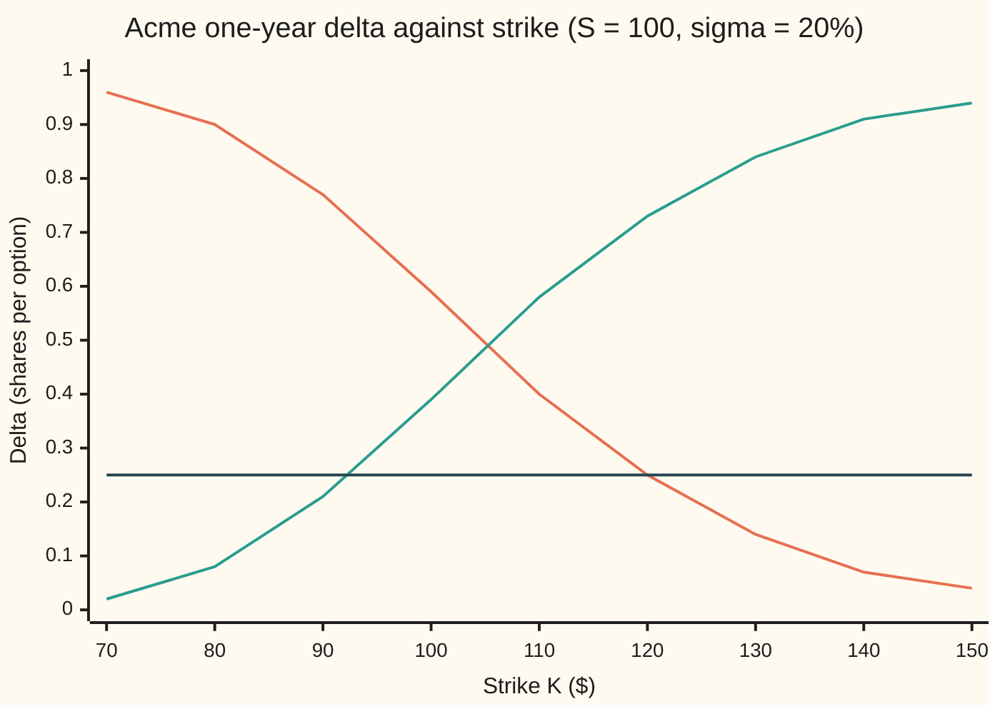

# Strike from delta: turning a delta quote back into a strike

Financial mathematics → Implied volatility and the vanilla inverses → Delta-quoted strikes → Strike from delta

---

## General Overview

Acme shares trade at $100. A client asks a dealer for "the one-year 25-delta call on Acme". No strike was named. Yet a call cannot be priced, booked or settled without one: the strike is the price the holder may pay for the share at expiry.

The request names the option by how it behaves instead. Delta is how much the option's value moves per dollar of a small move in Acme: an option with delta 0.25 gains about 25 cents when Acme gains a dollar. A 25-delta call is the call whose strike sits far enough above today's price that its delta is exactly 0.25. Dealers in currencies quote options this way as a matter of routine, and many risk systems store their volatility smiles (implied volatility plotted against strike) at 10, 25 and 50 delta rather than at fixed strikes.

So the job runs backwards. The Black-Scholes delta formula takes a strike and returns a delta. This card takes the delta and returns the strike. In the house market (Acme at $100, riskless rate 5 percent, dividend yield 2 percent, volatility 20 percent, one year) the 25-delta call has strike **$119.93** and the 25-delta put has strike **$92.15**. A request for a 0.99-delta call cannot be filled at any strike. The reason is a ceiling built into the formula, and the card finds it before it solves anything.

**Delta falls steadily as the strike rises, from a ceiling set by the dividend down to zero, so every delta under the ceiling names exactly one strike, and the bell-curve inverse finds it in one line.**

**What kind of fact this is:** a method, resting on a theorem proved on this card in Why it works: delta is strictly decreasing in the strike, so the strike exists and is unique exactly when the delta lies inside its range.

### The picture: delta against strike



Orange: the call's delta, falling as the strike rises. Green: the put's delta with its minus sign dropped, rising as the strike rises. Dark flat line: the target 0.25. The orange curve meets the flat line once, at $119.93, just below the $120 tick. The green curve meets it once, at $92.15. Neither curve ever reaches 1: at the left edge the call's delta levels off under 0.9802, and at the right edge the put's does the same.

---

## The formula

Notation first, in words. $S$ is Acme's price today, $K$ the strike, $T$ the years to expiry, $r$ the riskless rate, $q$ the dividend yield and $\sigma$ (sigma) the volatility, as on the pilot. $\Delta$ (capital Greek delta) is the option's delta. $N(x)$ is the area under the standard bell curve to the left of $x$, a probability between 0 and 1. $N^{-1}(p)$ runs that backwards: the point whose left-hand area is a given probability, called the normal quantile ([normal-quantile](../../09-Probability%20and%20statistics/04-Continuous%20Distributions/05-normal-quantile.md)).

For a call with delta $\Delta$ strictly between 0 and $e^{-qT}$:

$$K = S\,\exp\!\Big(-\sigma\sqrt{T}\;N^{-1}\!\big(\Delta\,e^{qT}\big) + \big(r - q + \tfrac12\sigma^2\big)T\Big)$$

**Read it aloud:** undo the dividend drag on the delta, look up where that area sits on the bell curve, turn that point into a log-distance between strike and spot, and step that far from today's price.

For a put the delta is negative, strictly between $-e^{-qT}$ and 0. Its strike uses the same formula with the quantile's sign flipped:

$$K = S\,\exp\!\Big(+\sigma\sqrt{T}\;N^{-1}\!\big(\lvert\Delta\rvert\,e^{qT}\big) + \big(r - q + \tfrac12\sigma^2\big)T\Big)$$

Outside those ranges there is no strike at all.

| Symbol | Plain meaning | In our example | Push it up and the strike… |
| --- | --- | --- | --- |
| $S$ | Acme's price today | $100 | rises in proportion |
| $K$ | the strike: the price the holder may trade at on expiry day | $119.93 call, $92.15 put | (the answer) |
| $T$ | time to expiry, in years | 1 | call strike moves further out |
| $r$ | riskless rate, continuously compounded | 5% | rises, both sides |
| $q$ | dividend yield, continuously compounded | 2% | falls, and the call's delta ceiling drops |
| $\sigma$ | volatility: how jumpy Acme is, per year. Say "sigma". | 20% | call strike rises, put strike falls: the wings spread |
| $\Delta$ | delta: shares that move one-for-one with the option | 0.25 call, −0.25 put | call strike falls toward spot |
| $N(x)$ | bell-curve area to the left of $x$ | $N(d_1) = 0.2551$ | |
| $N^{-1}(p)$ | the normal quantile: the point with a given area to its left | $N^{-1}(0.2551) = -0.6587$ | |
| $d_1$ | log-distance from strike to spot, plus drift, in wiggle units $\sigma\sqrt{T}$ | −0.6587 call, +0.6587 put | |
| $d_2$ | $d_1$ minus one wiggle unit; belongs to the cash half of the price, not to delta | | |
| $e^{-qT}$ | dividend drag: the fraction of a share bought today that grows to one share by expiry, dividends reinvested | 0.9802 | |

The helper, as on the pilot card:

$$d_1 = \frac{\ln(S/K) + (r - q + \tfrac12\sigma^2)\,T}{\sigma\sqrt{T}}$$

In words: how far below the spot the strike sits, in logs, plus the drift, counted in wiggle units. The strike formula is this line solved for $K$.

The deltas themselves come from [delta](../09-The%20Greeks%2C%20one%20each/01-delta.md): a call's is $e^{-qT}N(d_1)$ and a put's is $-e^{-qT}N(-d_1)$.

### When it holds

- **One volatility for every strike.** The formula feeds in a single $\sigma$. Real markets show a smile (a different implied volatility at each strike, see [implied-volatility](01-implied-volatility.md)). Then $\sigma$ depends on the $K$ being solved for, the one-line answer becomes a starting guess, and the strike is found by repeating the formula with the smile's volatility at the last guess until it settles.
- **Spot delta, premium not included.** This card's delta is the change in option value per dollar of Acme, paid for in cash. Currency markets also quote forward deltas and premium-included deltas. Those are different functions of the strike with different inverses; feeding one into this formula gives the wrong strike.
- **Black-Scholes dynamics.** Delta here is the model's delta. If Acme's price can jump, the hedge ratio a desk actually uses differs, but the quoting convention still uses this formula to turn the label into a strike.
- **The delta is inside the range.** A call delta at or above $e^{-qT}$, or at or below 0, has no strike. The formula signals this: $N^{-1}$ is asked for the point with area 1 or more, or 0 or less, and there is none.

Conventions verified 2026-09-19: equity options quote spot delta without premium; currency options use the conventions listed in Reiswich and Wystup (2010), cited below.

---

## Why it works

### Step 0: a one-way street can be driven backwards

A formula that takes strikes to deltas can be run in reverse only if two different strikes never give the same delta, and only for deltas the formula actually produces. So the card first shows that delta falls every time the strike rises. Then it finds the two ends of the range. Then it undoes the formula one layer at a time. Every inverse card on this shelf follows that order: existence, uniqueness, boundaries, and only then the solve.

### Step 1: delta falls as the strike rises

Raise $K$ and $\ln(S/K)$ falls, so $d_1$ falls. Precisely, the rate of change of $d_1$ with $K$ is $-1/(K\sigma\sqrt{T})$, negative for every positive strike. The bell-curve area $N$ grows with its argument and never stalls, because the bell curve's height is positive everywhere. So $N(d_1)$ falls strictly, and the call's delta $e^{-qT}N(d_1)$ falls strictly with it.

A put's delta is the call's delta minus a constant: $-e^{-qT}N(-d_1) = e^{-qT}N(d_1) - e^{-qT}$, because $N(-x) = 1 - N(x)$. Subtracting a constant keeps the direction. Both deltas fall as the strike rises. That is the uniqueness half: no two strikes share a delta.

### Step 2: the two ends set the range

Push the strike toward zero. The option becomes a near-certain claim on the share, $d_1$ runs to plus infinity, $N(d_1)$ climbs to 1, and the call's delta climbs to $e^{-qT} = 0.9802$. It never gets there: at every real strike some chance remains that Acme ends below it.

Push the strike toward infinity. $d_1$ runs to minus infinity and the call's delta sinks to 0.

The delta moves without jumps in between. So it passes through every value strictly between 0 and $0.9802$, and by Step 1 it passes through each exactly once. For the put, the same argument gives every value strictly between $-0.9802$ and 0.

The ceiling is below 1 because of the dividend. A call is a claim on a share at expiry, and the dividends paid before then go to whoever holds the share now. Hedging one share at expiry needs only $e^{-qT}$ shares today, reinvesting the dividends. So even a call certain to be exercised has delta $0.9802$, not 1. A delta of 0.99 would need $N(d_1) = 0.99 \times e^{0.02} = 1.0100$, an area larger than the whole bell curve. No strike exists.

<details>
<summary>Detailed proof</summary>

Fix $S, T, \sigma > 0$ and real $r, q$. Write $v = \sigma\sqrt{T}$ and $m = (r - q + \tfrac12\sigma^2)T$, so $d_1(K) = (\ln S - \ln K + m)/v$ for $K > 0$.

*Monotone.* $d_1$ is differentiable with $d_1'(K) = -1/(Kv) < 0$. $N$ is differentiable with $N'(x) = \varphi(x) = e^{-x^2/2}/\sqrt{2\pi} > 0$ (the bell curve's height). By the chain rule the call delta $\Delta_c(K) = e^{-qT}N(d_1(K))$ has derivative $-e^{-qT}\varphi(d_1)/(Kv) < 0$ everywhere, so it is strictly decreasing. $\Delta_p(K) = \Delta_c(K) - e^{-qT}$ has the same derivative.

*Limits.* As $K \to 0^+$, $\ln K \to -\infty$, so $d_1 \to +\infty$ and $N(d_1) \to 1$. As $K \to \infty$, $d_1 \to -\infty$ and $N(d_1) \to 0$. So $\Delta_c(K)$ tends to $e^{-qT}$ and to 0 at the two ends. Since $0 < N(x) < 1$ at every finite $x$, neither limit is reached.

*Range and uniqueness.* For $0 < \Delta < e^{-qT}$, the limits give a small strike where $\Delta_c(K) > \Delta$ and a larger one where $\Delta_c(K) < \Delta$. $\Delta_c(K)$ is continuous, so the intermediate value theorem gives a root in between. Strict decrease makes it the only root on all of $(0, \infty)$. For $\Delta \ge e^{-qT}$ or $\Delta \le 0$ the strict bounds $0 < \Delta_c < e^{-qT}$ exclude every $K$. The put follows by the shift $\Delta_p = \Delta_c - e^{-qT}$.

*Closed form.* $N$ is a strictly increasing continuous bijection from the real line onto $(0, 1)$, so $N^{-1}$ exists on $(0,1)$. From $e^{-qT}N(d_1) = \Delta$: $d_1 = N^{-1}(\Delta e^{qT})$, then $\ln(K/S) = m - v\,d_1$, which is the card's formula. For the put, $N(-d_1) = \lvert\Delta\rvert e^{qT}$ gives $d_1 = -N^{-1}(\lvert\Delta\rvert e^{qT})$.

</details>

### Step 3: peel the formula, one layer at a time

The call's delta is three layers wrapped around $K$: a log, a bell-curve area, and a dividend factor. Undo them from the outside in.

1. Divide by the dividend drag: $N(d_1) = \Delta\,e^{qT}$. For the 25-delta call that is $0.25 \times e^{0.02} = 0.2551$.
2. Undo the bell-curve area with the quantile: $d_1 = N^{-1}(0.2551) = -0.6587$. The point is negative because the area is below one half: the strike sits above $105.13, the balance point found in Step 4.
3. Undo the definition of $d_1$: multiply by $\sigma\sqrt{T}$, subtract the drift, and read off $\ln(K/S) = -\sigma\sqrt{T}\,d_1 + (r - q + \tfrac12\sigma^2)T$. Then exponentiate.

For a put the target is $N(-d_1) = \lvert\Delta\rvert e^{qT}$, so the quantile's sign flips and the strike lands below spot.

### Step 4: the middle of the range

Where do the call's and the put's deltas balance? Where $N(d_1) = N(-d_1)$, which forces $d_1 = 0$ and $K = S\,e^{(r - q + \frac12\sigma^2)T} = \$105.13$. There the call's delta is $0.4901$ and the put's is $-0.4901$: a call and a put there together carry no delta. Dealers call this the delta-neutral strike. It sits above the forward price $F = S\,e^{(r-q)T} = \$103.05$ (the price agreed today for delivery of one share at expiry), because $d_1$ carries the extra half wiggle-squared.

The other road to the strike skips the quantile: guess a strike, compute its delta, and narrow the guess by halving an interval until the delta matches. That is bisection, and it works because Step 1 made delta one-directional. The method itself belongs to [implied-volatility-by-newton-and-bisection](02-implied-volatility-by-newton-and-bisection.md); the code below uses it as its second road.

---

## Worked numbers, by hand

Acme: $S = 100$, $r = 5\%$, $q = 2\%$, $\sigma = 20\%$, $T = 1$ year. Target: the 25-delta call.

| Step | Arithmetic | Value |
| --- | --- | --- |
| ceiling $e^{-qT}$ | $e^{-0.02}$ | $0.9802$ |
| is 0.25 inside $(0, 0.9802)$? | yes | a strike exists, and only one |
| target area $N(d_1)$ | $0.25 \times e^{0.02}$ | $0.2551$ |
| $d_1 = N^{-1}(0.2551)$ | bell-curve table, backwards | $-0.6587$ |
| drift $(r - q + \tfrac12\sigma^2)T$ | $0.05 - 0.02 + 0.02$ | $0.05$ |
| $\ln(K/S)$ | $0.6587 \times 0.20 + 0.05$ | $0.1817$ |
| **strike $K$** | $100 \times e^{0.1817}$ | **$\$119.93$** |

The 25-delta put runs the same table with $d_1 = +0.6587$: $\ln(K/S) = -0.6587 \times 0.20 + 0.05 = -0.0817$, so $K = \$92.15$.

A client buying the 25-delta call is buying the right to pay $119.93 for a share now at $100. One such call moves about a quarter as much as a share does, and a dealer who sells it hedges with a quarter of a share.

Three strikes from the same market, for scale. At $K = \$100$ the call's delta is $0.5869$, the figure on the delta card. The 10-delta call sits further out, at $135.53; the 10-delta put further down, at $81.54.

```
strike named by each delta, $5 per block
10-delta put     ████████████████             $81.54
25-delta put     ██████████████████           $92.15
delta-neutral    █████████████████████        $105.13
25-delta call    ████████████████████████     $119.93
10-delta call    ███████████████████████████  $135.53
```

The quotes are centred on the delta-neutral strike, not on spot, and they are even in logs, not dollars: each 25-delta strike sits 0.1317 in log from $105.13. A log step up covers more dollars than the same step down, so the call side stretches $14.80 and the put side $12.98.

### What breaks if you drop a piece

Right answers: 25-delta call $119.93, 25-delta put $92.15.

| Mistake | Comes out at | What went wrong |
| --- | --- | --- |
| Solve $N(d_1) = 0.25$, forgetting $e^{qT}$ | $120.31 | Treated the dividend drag as 1. The strike lands 38 cents too far out. |
| Use $d_2$ where $d_1$ belongs | $115.23 | $d_2$ prices the cash half of the option; delta is $d_1$ alone. Almost five dollars off. |
| Read the 25-delta put as the 75-delta call | $90.97 | Call and put deltas at one strike differ by $e^{-qT} = 0.9802$, not by 1. At the true put strike the call's delta is $0.7302$. |
| Ask for a 0.99-delta call | no strike | $N(d_1)$ would have to be $1.0100$. The ceiling is $0.9802$. |

---

## Code, from first principles, and it actually runs

The code builds its own bell-curve area and its own quantile, then reaches each strike by three independent roads. Road 1 is the closed form: Newton's method on the bell-curve area gives the quantile, and the formula does the rest. Road 2 never inverts the bell curve: it bisects on the strike until the forward delta formula hits the target. Road 3 checks the meaning of the answer: it prices the option at the found strike by Simpson's rule (adding up thin slices under the payoff times the bell curve, with no $N$ and no $d_1$), nudges Acme by one cent each way, and reads the delta off the change in price. That delta must come back as 0.25. The same integral reprices the house call at $9.23 as a fourth anchor. Python's bell-curve area is the Taylor series of the error function (erf, a rescaled bell-curve area) written out; Rust's is Simpson's rule under the bell curve. The two languages share no bell-curve code.

### Python

```python
# Strike from delta -- the check behind the card.  Standard library only.
# Nothing imported knows the answer: the normal CDF is the erf Taylor series
# written out, the quantile is Newton's method on it, the price is Simpson's rule.
from math import log, sqrt, exp, pi, factorial

def N(x):                                     # bell-curve area left of x (series good for |x| <= 5)
    assert abs(x) <= 5.0, "series used outside its accurate range"
    y = x / sqrt(2.0)
    s = sum((-1) ** n * y ** (2 * n + 1) / (factorial(n) * (2 * n + 1)) for n in range(90))
    return 0.5 + s / sqrt(pi)

def phi(x): return exp(-0.5 * x * x) / sqrt(2.0 * pi)   # bell-curve height at x

def N_inv(p):                                 # Newton on N; None when p is outside (0, 1)
    if not 0.0 < p < 1.0: return None
    x = 0.0
    for _ in range(60): x -= (N(x) - p) / phi(x)
    return x

S, r, q, sigma, T = 100.0, 0.05, 0.02, 0.20, 1.0
vt = sigma * sqrt(T)                          # one wiggle unit
mu = (r - q + 0.5 * sigma * sigma) * T        # the drift term inside d1

def d1(K): return (log(S / K) + mu) / vt
def delta(K, kind):                           # the forward map: strike in, delta out
    return exp(-q * T) * N(d1(K)) if kind == "call" else -exp(-q * T) * N(-d1(K))

def strike_closed(target, kind):              # Road 1: invert N, then undo d1
    z = N_inv(target * exp(q * T) if kind == "call" else -target * exp(q * T))
    if z is None: return None
    D1 = z if kind == "call" else -z
    return S * exp(-D1 * vt + mu)

def strike_bisect(target, kind):              # Road 2: search strikes; delta falls as K rises
    lo, hi = 50.0, 200.0
    assert delta(lo, kind) > target > delta(hi, kind), "bracket must straddle the target"
    for _ in range(100):
        mid = sqrt(lo * hi)
        if delta(mid, kind) > target: lo = mid
        else: hi = mid
    return sqrt(lo * hi)

def price(s, K, kind, n=4000):                # Road 3: premium by Simpson over the bell curve
    m = (r - q - 0.5 * sigma * sigma) * T
    zs = (log(K / s) - m) / vt                # where the option starts to pay
    a, b = (zs, zs + 12.0) if kind == "call" else (zs - 12.0, zs)
    sign = 1.0 if kind == "call" else -1.0
    f = lambda z: sign * (s * exp(m + vt * z) - K) * phi(z)
    h = (b - a) / n
    tot = f(a) + f(b) + sum((4 if i % 2 else 2) * f(a + i * h) for i in range(1, n))
    return exp(-r * T) * tot * h / 3.0

def bump_delta(K, kind, h=0.01):
    return (price(S + h, K, kind) - price(S - h, K, kind)) / (2 * h)

Kc1, Kc2 = strike_closed(0.25, "call"), strike_bisect(0.25, "call")
Kp1, Kp2 = strike_closed(-0.25, "put"), strike_bisect(-0.25, "put")
dc_bump, dp_bump = bump_delta(Kc1, "call"), bump_delta(Kp1, "put")
house = price(S, 100.0, "call")
# ---- what breaks ----
no_q = S * exp(-N_inv(0.25) * vt + mu)                            # solved N(d1) = 0.25
use_d2 = S * exp(-N_inv(0.25 * exp(q * T)) * vt + mu - vt * vt)   # solved e^-qT N(d2) = 0.25
as_75c = strike_closed(0.75, "call")                              # 25-delta put read as 75-delta call
K_dn = S * exp(mu)                                                # d1 = 0: call delta = -put delta
rows = [
    ("ceiling e^-qT", exp(-q * T)), ("target N(d1) = 0.25 e^qT", 0.25 * exp(q * T)),
    ("d1 at the 25-delta call", N_inv(0.25 * exp(q * T))), ("drift in d1, (r-q+sigma^2/2)T", mu),
    ("ln(K/S), 25-delta call", log(strike_closed(0.25, "call") / S)),
    ("ln(K/S), 25-delta put", log(strike_closed(-0.25, "put") / S)),
    ("1 call strike, closed form", Kc1), ("2 call strike, bisection", Kc2),
    ("3 call delta by bumping S", dc_bump),
    ("1 put strike, closed form", Kp1), ("2 put strike, bisection", Kp2),
    ("3 put delta by bumping S", dp_bump),
    ("house call at K = 100 by Simpson", house), ("call delta at K = 100", delta(100.0, "call")),
    ("delta 0.99 needs N(d1) =", 0.99 * exp(q * T)),
    ("delta-neutral strike S e^mu", K_dn),
    ("  call delta there", delta(K_dn, "call")), ("  put delta there", delta(K_dn, "put")),
    ("10-delta call strike", strike_closed(0.10, "call")),
    ("10-delta put strike", strike_closed(-0.10, "put")),
    ("call delta at the 25-delta put strike", delta(Kp1, "call")),
    ("wrong: forgot e^qT", no_q), ("wrong: d2 for d1", use_d2),
    ("wrong: 25-delta put as 75-delta call", as_75c),
]
for name, v in rows: print(f"{name:<38} {v:>14.6f}")
print(f"{'  strike for delta 0.99':<38} {'none' if strike_closed(0.99, 'call') is None else 'found':>14}")
# ---- try changing ----
print()
for label, sg, tt, qq in (("try: sigma 0.30", 0.30, 1.0, q), ("try: T 0.25", sigma, 0.25, q), ("try: q 0", sigma, 1.0, 0.0)):
    v2, m2 = sg * sqrt(tt), (r - qq + 0.5 * sg * sg) * tt
    kc = S * exp(-N_inv(0.25 * exp(qq * tt)) * v2 + m2)
    kp = S * exp(N_inv(0.25 * exp(qq * tt)) * v2 + m2)
    print(f"{label:<18} 25d call {kc:9.4f}   25d put {kp:9.4f}   ceiling {exp(-qq * tt):.4f}")
# ---- chart points: delta against strike ----
print()
ks = [70.0 + 10.0 * i for i in range(9)]
print(f"{'chart, strike':<20}" + "".join(f"{k:7.0f}" for k in ks))
print(f"{'chart, call delta':<20}" + "".join(f"{delta(k, 'call'):7.2f}" for k in ks))
print(f"{'chart, minus put':<20}" + "".join(f"{-delta(k, 'put'):7.2f}" for k in ks))
print(f"{'chart, target':<20}" + "".join(f"{0.25:7.2f}" for k in ks))

assert abs(Kc1 - Kc2) < 1e-6, "call: closed form vs bisection"
assert abs(Kp1 - Kp2) < 1e-6, "put: closed form vs bisection"
assert abs(dc_bump - 0.25) < 1e-5, "bumped call delta at the call strike"
assert abs(dp_bump + 0.25) < 1e-5, "bumped put delta at the put strike"
assert abs(house - 9.227005508154) < 1e-8, "Simpson premium vs the house call"
assert strike_closed(0.99, "call") is None, "0.99 is above the ceiling: no strike"
assert abs(round(Kc1, 2) - 119.93) < 1e-9, "house 25-delta call strike"
print("ALL CHECKS PASS")
```

**Ran 2026-09-19 on macOS, Python 3.14.6, standard library only. All checks passed. Output, pasted from the run:**

```
ceiling e^-qT                                0.980199
target N(d1) = 0.25 e^qT                     0.255050
d1 at the 25-delta call                     -0.658681
drift in d1, (r-q+sigma^2/2)T                0.050000
ln(K/S), 25-delta call                       0.181736
ln(K/S), 25-delta put                       -0.081736
1 call strike, closed form                 119.929776
2 call strike, bisection                   119.929776
3 call delta by bumping S                    0.250000
1 put strike, closed form                   92.151503
2 put strike, bisection                     92.151503
3 put delta by bumping S                    -0.250000
house call at K = 100 by Simpson             9.227006
call delta at K = 100                        0.586851
delta 0.99 needs N(d1) =                     1.009999
delta-neutral strike S e^mu                105.127110
  call delta there                           0.490099
  put delta there                           -0.490099
10-delta call strike                       135.530282
10-delta put strike                         81.544206
call delta at the 25-delta put strike        0.730199
wrong: forgot e^qT                         120.309566
wrong: d2 for d1                           115.227263
wrong: 25-delta put as 75-delta call        90.974212
  strike for delta 0.99                          none

try: sigma 0.30    25d call  131.3380   25d put   88.4614   ceiling 0.9802
try: T 0.25        25d call  108.2805   25d put   94.6906   ceiling 0.9950
try: q 0           25d call  122.7400   25d put   93.7163   ceiling 1.0000

chart, strike            70     80     90    100    110    120    130    140    150
chart, call delta      0.96   0.90   0.77   0.59   0.40   0.25   0.14   0.07   0.04
chart, minus put       0.02   0.08   0.21   0.39   0.58   0.73   0.84   0.91   0.94
chart, target          0.25   0.25   0.25   0.25   0.25   0.25   0.25   0.25   0.25
ALL CHECKS PASS
```

The closed form and the bisection agree to six decimals on both strikes. For the call struck at $119.93, nudging Acme's price moves the Simpson premium by exactly a quarter of the nudge, so the strike does what its label says.

### Rust

```rust
// Strike from delta -- the same check as strike_from_delta_check.py, in Rust.
// Standard library only, no crates.  Rust has no erf, so the bell-curve area N(x)
// is built by adding thin slices under the curve (Simpson); the quantile is Newton.
use std::f64::consts::PI;

const S: f64 = 100.0;
const R: f64 = 0.05;
const Q: f64 = 0.02;
const SIGMA: f64 = 0.20;
const T: f64 = 1.0;

fn phi(x: f64) -> f64 { (-0.5 * x * x).exp() / (2.0 * PI).sqrt() }

fn simpson<F: Fn(f64) -> f64>(f: F, a: f64, b: f64, n: usize) -> f64 {
    let h = (b - a) / n as f64;
    let mut s = f(a) + f(b);
    for i in 1..n { s += if i % 2 == 1 { 4.0 } else { 2.0 } * f(a + i as f64 * h); }
    s * h / 3.0
}

fn n_cdf(x: f64) -> f64 {
    if x < -12.0 { return 0.0; }
    if x > 12.0 { return 1.0; }
    0.5 + simpson(phi, 0.0, x, 4000)
}

fn n_inv(p: f64) -> Option<f64> {
    if !(p > 0.0 && p < 1.0) { return None; }
    let mut x = 0.0;
    for _ in 0..60 { x -= (n_cdf(x) - p) / phi(x); }
    Some(x)
}

fn vt() -> f64 { SIGMA * T.sqrt() }
fn mu() -> f64 { (R - Q + 0.5 * SIGMA * SIGMA) * T }
fn d1(k: f64) -> f64 { ((S / k).ln() + mu()) / vt() }

fn delta(k: f64, call: bool) -> f64 {
    if call { (-Q * T).exp() * n_cdf(d1(k)) } else { -(-Q * T).exp() * n_cdf(-d1(k)) }
}

fn strike_closed(target: f64, call: bool) -> Option<f64> {        // Road 1
    let p = if call { target * (Q * T).exp() } else { -target * (Q * T).exp() };
    let z = n_inv(p)?;
    let dd1 = if call { z } else { -z };
    Some(S * (-dd1 * vt() + mu()).exp())
}

fn strike_bisect(target: f64, call: bool) -> f64 {                 // Road 2
    let (mut lo, mut hi) = (50.0_f64, 200.0_f64);
    assert!(delta(lo, call) > target && target > delta(hi, call), "bracket must straddle the target");
    for _ in 0..100 {
        let mid = (lo * hi).sqrt();
        if delta(mid, call) > target { lo = mid; } else { hi = mid; }
    }
    (lo * hi).sqrt()
}

fn price(s: f64, k: f64, call: bool) -> f64 {                      // Road 3
    let m = (R - Q - 0.5 * SIGMA * SIGMA) * T;
    let zs = ((k / s).ln() - m) / vt();
    let (a, b) = if call { (zs, zs + 12.0) } else { (zs - 12.0, zs) };
    let sign = if call { 1.0 } else { -1.0 };
    let f = |z: f64| sign * (s * (m + vt() * z).exp() - k) * phi(z);
    (-R * T).exp() * simpson(f, a, b, 4000)
}

fn bump_delta(k: f64, call: bool) -> f64 {
    let h = 0.01;
    (price(S + h, k, call) - price(S - h, k, call)) / (2.0 * h)
}

fn main() {
    let (kc1, kc2) = (strike_closed(0.25, true).unwrap(), strike_bisect(0.25, true));
    let (kp1, kp2) = (strike_closed(-0.25, false).unwrap(), strike_bisect(-0.25, false));
    let (dc_bump, dp_bump) = (bump_delta(kc1, true), bump_delta(kp1, false));
    let house = price(S, 100.0, true);
    let no_q = S * (-n_inv(0.25).unwrap() * vt() + mu()).exp();
    let use_d2 = S * (-n_inv(0.25 * (Q * T).exp()).unwrap() * vt() + mu() - vt() * vt()).exp();
    let as_75c = strike_closed(0.75, true).unwrap();
    let k_dn = S * mu().exp();
    let rows: Vec<(&str, f64)> = vec![
        ("ceiling e^-qT", (-Q * T).exp()), ("target N(d1) = 0.25 e^qT", 0.25 * (Q * T).exp()),
        ("d1 at the 25-delta call", n_inv(0.25 * (Q * T).exp()).unwrap()), ("drift in d1, (r-q+sigma^2/2)T", mu()),
        ("ln(K/S), 25-delta call", (kc1 / S).ln()), ("ln(K/S), 25-delta put", (kp1 / S).ln()),
        ("1 call strike, closed form", kc1), ("2 call strike, bisection", kc2),
        ("3 call delta by bumping S", dc_bump),
        ("1 put strike, closed form", kp1), ("2 put strike, bisection", kp2),
        ("3 put delta by bumping S", dp_bump),
        ("house call at K = 100 by Simpson", house), ("call delta at K = 100", delta(100.0, true)),
        ("delta 0.99 needs N(d1) =", 0.99 * (Q * T).exp()),
        ("delta-neutral strike S e^mu", k_dn),
        ("  call delta there", delta(k_dn, true)), ("  put delta there", delta(k_dn, false)),
        ("10-delta call strike", strike_closed(0.10, true).unwrap()),
        ("10-delta put strike", strike_closed(-0.10, false).unwrap()),
        ("call delta at the 25-delta put strike", delta(kp1, true)),
        ("wrong: forgot e^qT", no_q), ("wrong: d2 for d1", use_d2),
        ("wrong: 25-delta put as 75-delta call", as_75c),
    ];
    for (name, v) in &rows { println!("{:<38} {:>14.6}", name, v); }
    let found = if strike_closed(0.99, true).is_none() { "none" } else { "found" };
    println!("{:<38} {:>14}", "  strike for delta 0.99", found);

    println!();
    for (label, sg, tt, qq) in [("try: sigma 0.30", 0.30, 1.0, Q), ("try: T 0.25", SIGMA, 0.25, Q), ("try: q 0", SIGMA, 1.0, 0.0)] {
        let (v2, m2) = (sg * f64::sqrt(tt), (R - qq + 0.5 * sg * sg) * tt);
        let z = n_inv(0.25 * (qq * tt).exp()).unwrap();
        let (kc, kp) = (S * (-z * v2 + m2).exp(), S * (z * v2 + m2).exp());
        println!("{:<18} 25d call {:9.4}   25d put {:9.4}   ceiling {:.4}", label, kc, kp, (-qq * tt).exp());
    }

    println!();
    let ks: Vec<f64> = (0..9).map(|i| 70.0 + 10.0 * i as f64).collect();
    let line = |label: &str, f: &dyn Fn(f64) -> String| {
        println!("{:<20}{}", label, ks.iter().map(|k| f(*k)).collect::<String>());
    };
    line("chart, strike", &|k| format!("{:7.0}", k));
    line("chart, call delta", &|k| format!("{:7.2}", delta(k, true)));
    line("chart, minus put", &|k| format!("{:7.2}", -delta(k, false)));
    line("chart, target", &|_k| format!("{:7.2}", 0.25));

    assert!((kc1 - kc2).abs() < 1e-6, "call: closed form vs bisection");
    assert!((kp1 - kp2).abs() < 1e-6, "put: closed form vs bisection");
    assert!((dc_bump - 0.25).abs() < 1e-5, "bumped call delta at the call strike");
    assert!((dp_bump + 0.25).abs() < 1e-5, "bumped put delta at the put strike");
    assert!((house - 9.227005508154).abs() < 1e-8, "Simpson premium vs the house call");
    assert!(strike_closed(0.99, true).is_none(), "0.99 is above the ceiling: no strike");
    assert!(((kc1 * 100.0).round() / 100.0 - 119.93).abs() < 1e-9, "house 25-delta call strike");
    println!("ALL CHECKS PASS");
}
```

**Ran 2026-09-19 on macOS, rustc 1.98.1, no crates. All checks passed. Output, pasted from the run:**

```
ceiling e^-qT                                0.980199
target N(d1) = 0.25 e^qT                     0.255050
d1 at the 25-delta call                     -0.658681
drift in d1, (r-q+sigma^2/2)T                0.050000
ln(K/S), 25-delta call                       0.181736
ln(K/S), 25-delta put                       -0.081736
1 call strike, closed form                 119.929776
2 call strike, bisection                   119.929776
3 call delta by bumping S                    0.250000
1 put strike, closed form                   92.151503
2 put strike, bisection                     92.151503
3 put delta by bumping S                    -0.250000
house call at K = 100 by Simpson             9.227006
call delta at K = 100                        0.586851
delta 0.99 needs N(d1) =                     1.009999
delta-neutral strike S e^mu                105.127110
  call delta there                           0.490099
  put delta there                           -0.490099
10-delta call strike                       135.530282
10-delta put strike                         81.544206
call delta at the 25-delta put strike        0.730199
wrong: forgot e^qT                         120.309566
wrong: d2 for d1                           115.227263
wrong: 25-delta put as 75-delta call        90.974212
  strike for delta 0.99                          none

try: sigma 0.30    25d call  131.3380   25d put   88.4614   ceiling 0.9802
try: T 0.25        25d call  108.2805   25d put   94.6906   ceiling 0.9950
try: q 0           25d call  122.7400   25d put   93.7163   ceiling 1.0000

chart, strike            70     80     90    100    110    120    130    140    150
chart, call delta      0.96   0.90   0.77   0.59   0.40   0.25   0.14   0.07   0.04
chart, minus put       0.02   0.08   0.21   0.39   0.58   0.73   0.84   0.91   0.94
chart, target          0.25   0.25   0.25   0.25   0.25   0.25   0.25   0.25   0.25
ALL CHECKS PASS
```

The two outputs agree line for line, although one language sums a series and the other adds slices under the curve.

> [!TIP]
> **Try changing**
> Guess the direction first. Then run it.
> - **Raise volatility to 30 percent.** The 25-delta call moves out from $119.93 to **$131.34** and the put down from $92.15 to **$88.46**. A jumpier share needs a further strike to bring delta down to a quarter.
> - **Shorten to three months.** Set `T = 0.25`. The strikes pull in to **$108.28** and **$94.69**, and the ceiling rises to **0.9950**: less time, less dividend drag.
> - **Remove the dividend.** Set `q = 0`. The ceiling becomes exactly 1, the call strike moves to **$122.74** and the put to **$93.72**. With no dividend, a 0.99-delta call now has a strike.
> - **Break the bracket.** Change the bisection's upper end from 200 to 110. The first assert inside `strike_bisect` fires: $110 is not far enough out to straddle a 0.25 call delta, and the search refuses to start.

---

## The usual mistake

> [!warning]
> **Treating the delta label as if it were a probability of finishing in the money.** It is not. The 25-delta call is not "the call with a 25 percent chance of paying". The risk-neutral chance of exercise is $N(d_2)$, which sits one wiggle unit below $N(d_1)$, and delta also carries the dividend drag. Solving $e^{-qT}N(d_2) = 0.25$ instead puts the 25-delta call at $115.23, not $119.93.
>
> - **Forgetting the dividend drag.** Solving $N(d_1) = 0.25$ gives $120.31. The error grows with the dividend yield and the maturity.
> - **Mirroring the put through 1 instead of $e^{-qT}$.** A 25-delta put is the 73.02-delta call, not the 75-delta call. Using 75 gives $90.97 instead of $92.15.
> - **Asking for a delta the formula cannot produce.** A call delta at or above $e^{-qT}$ returns an area of 1 or more to the quantile. A solver that does not check the range first either crashes or returns a strike that does not have the requested delta.
> - **Mixing delta conventions.** A premium-included or forward delta from a currency desk is a different number from this card's spot delta, and the same "25" names a different strike.

---

## Where you meet it in real life

- **Currency option quotes.** Dealers quote the smile as at-the-money, 25-delta risk reversals and 25-delta butterflies, with 10-delta versions for the wings. Every one of those has to be turned into a strike before an option can be priced or booked (Reiswich and Wystup; Clark).
- **Volatility surfaces stored by delta.** A surface kept at fixed deltas stays roughly in place when the share moves, while a surface at fixed strikes has to be shifted. Looking up the volatility for a given strike then needs this conversion, run with the smile's volatility at each guess.
- **Hedging orders.** "Buy the 25-delta put" is a common way to ask for downside protection of a set size. The order ticket still needs a strike, here $92.15.
- **Premium targets.** The sibling problem fixes the price instead of the delta and asks for the strike: [strike-or-spot-from-a-target-premium](04-strike-or-spot-from-a-target-premium.md). Reading the forward and dividend back from market prices is [implied-forward-and-dividend-from-parity](05-implied-forward-and-dividend-from-parity.md).

> **Say it back**
> A delta quote names an option by how much it moves with the share instead of by its strike. Delta falls strictly as the strike rises, from a ceiling of $e^{-qT}$ down to zero, so each delta inside that range names one strike and none outside does. Divide out the dividend drag, run the bell curve backwards with the normal quantile, and solve $d_1$ for the strike. On the house market the 25-delta call is $119.93 and the 25-delta put is $92.15, and no strike carries a delta of 0.99.

---

## What this builds on

- [delta](../09-The%20Greeks%2C%20one%20each/01-delta.md): the forward map this card runs backwards, $e^{-qT}N(d_1)$ for a call and $-e^{-qT}N(-d_1)$ for a put.
- [implied-volatility](01-implied-volatility.md): the volatility fed into the conversion, and the first inverse on the shelf with the same existence-then-solve order.
- [normal-quantile](../../09-Probability%20and%20statistics/04-Continuous%20Distributions/05-normal-quantile.md): $N^{-1}$, the bell curve read backwards, which does the one hard step.

## Where this goes next

- [strike-or-spot-from-a-target-premium](04-strike-or-spot-from-a-target-premium.md): the same backward question asked of the price instead of the delta, where no closed form exists and the range has different ends.

A delta pins a strike in one line because delta has a single bell-curve area in it; a premium has two, and whether a price still names exactly one strike is the question the next card answers.

---

## Sources

Verified 2026-09-24: every link below resolves to the publisher's page for the cited work; DOIs checked against Crossref.

- Reiswich, Dimitri, and Uwe Wystup. "A Guide to FX Options Quoting Conventions." *The Journal of Derivatives* 18, no. 2 (2010): 58–68. [doi:10.3905/jod.2010.18.2.058](https://doi.org/10.3905/jod.2010.18.2.058). The delta conventions side by side, and the strike-from-delta inverses for each.
- Clark, Iain J. *Foreign Exchange Option Pricing: A Practitioner's Guide*. Wiley, 2011. [Publisher page](https://www.wiley.com/en-us/Foreign+Exchange+Option+Pricing%3A+A+Practitioner%27s+Guide-p-9780470683682). Delta-quoted smiles and turning them into strikes before building a surface.
- Hull, John C. *Options, Futures, and Other Derivatives*, 11th ed. Pearson. [Publisher page](https://www.pearson.com/en-us/subject-catalog/p/options-futures-and-other-derivatives/P200000005938). Delta for options on dividend-paying stocks, $e^{-qT}N(d_1)$.
- Merton, Robert C. "Theory of Rational Option Pricing." *Bell Journal of Economics and Management Science* 4, no. 1 (1973): 141–183. [doi:10.2307/3003143](https://doi.org/10.2307/3003143). The dividend yield $q$ in the model, which puts the ceiling at $e^{-qT}$.
