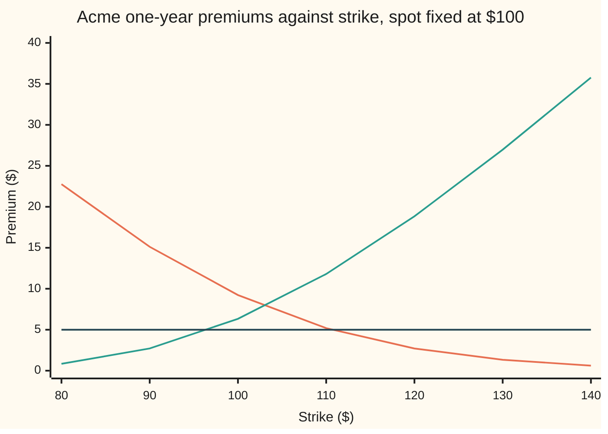

# Strike or spot from a target premium: which strike makes the option cost what you can pay

Financial mathematics → Implied volatility and the vanilla inverses → Solving for a contract term → Strike or spot from a target premium

---

## General Overview

Acme shares trade at $100. A one-year call on Acme with a $100 strike costs $9.23 in the house market: 5 percent riskless rate, 2 percent dividend yield, 20 percent volatility. A buyer has budgeted $5.00 per share. The rate, the dividend, the volatility and the year are all fixed. The one term left to choose is the **strike**, the price at which the call lets its holder buy.

Raise the strike and the call gets cheaper, because the share must climb further before the call pays anything. So somewhere above $100 there is a strike whose call costs exactly $5.00. It is **$110.60**. A put, the right to sell, gets cheaper the other way: a $5.00 put sits at a strike below $100, at **$96.88**.

The same question runs in a second direction. Hold the strike at $100 and treat the share price, the **spot**, as the unknown. A call quoted at the house premium, $9.227005508154 ($9.227 for short), then implies a spot of exactly **$100**, and a call quoted at $5.00 implies $91.60. Rounding the quote to $9.227 is a different target, with a spot a hair below $100.

Both are inverse problems: the pricing formula runs forwards from inputs to a premium, and here it must run backwards from a premium to one input. Running a formula backwards is safe only when each premium has exactly one input behind it. This card proves that it does, finds the range of premiums that have an answer, and solves.

**With volatility and time fixed and positive, a call's premium falls steadily from $98.02 to nothing as the strike rises, and climbs from nothing without limit as the spot rises, so each premium inside those ranges picks out exactly one strike and exactly one spot.**

**What kind of fact this is:** a theorem, proved on this card in Why it works; the bracket-and-solve recipe that follows it is a method.

### The picture: one dial, one answer

Strike runs left to right, premium up the page. The flat line is the $5.00 budget. Each price curve crosses it once.



Orange, falling: the call. Green, rising: the put. Dark, flat: the $5.00 target. The call crosses the target between $110 ($5.19) and $120 ($2.71), at $110.60. The put crosses between $90 ($2.71) and $100 ($6.33), at $96.88. No curve turns back on itself, so no second crossing exists.

---

## The formula

The problem is an equation with one unknown. For the strike:

$$C(K) \;=\; S\,e^{-qT}\,N(d_1) \;-\; K\,e^{-rT}\,N(d_2) \;=\; v, \qquad \text{solve for } K.$$

**Read it aloud:** find the strike at which the Black–Scholes call price equals the premium on offer.

For the spot, the same equation is solved for $S$ with $K$ held fixed. The whole card rests on two slopes. A **partial derivative**, written with a curly ∂, is the slope of a formula when one input moves and every other input stays put:

$$\frac{\partial C}{\partial K} = -\,e^{-rT}\,N(d_2) \;<\; 0, \qquad \frac{\partial C}{\partial S} = e^{-qT}\,N(d_1) \;>\; 0.$$

**Read it aloud:** one more dollar of strike takes off $e^{-rT}N(d_2)$, today's value of a dollar paid if the call finishes in the money; one more dollar of spot adds $e^{-qT}N(d_1)$, the call's delta.

| Symbol | Plain meaning | In our example | Push it up and the answer… |
| --- | --- | --- | --- |
| $v$ | the **target premium**, the price the buyer will pay | $5.00 | strike falls, spot rises |
| $C$, $P$ | the Black–Scholes call and put prices | call $9.23 and put $6.33 at $K = 100$ | — |
| $S$ | Acme's price today, the **spot** | $100 | call strike for $5.00 rises |
| $K$, $K_0$, $K_n$ | the **strike**; $K_n$ is the solver's guess at step n, from $K_0$ | $110.60 | — |
| $T$ | years to expiry | 1 | call strike for $5.00 rises |
| $r$ | riskless rate, continuously compounded | 5% | call strike for $5.00 rises |
| $q$ | dividend yield, continuously compounded | 2% | call strike for $5.00 falls |
| $\sigma$ | volatility: how widely Acme's log-price spreads in a year | 20% | call strike for $5.00 rises, fast |
| $N(x)$ | bell-curve area to the left of $x$, between 0 and 1 | $N(d_2) = 0.3250$ at $110.60$ | — |
| $\phi$ | the bell curve's height, $\phi(x) = e^{-x^2/2}/\sqrt{2\pi}$ | — | — |
| $d_1$, $d_2$ | how far the spot sits from the strike in units of $\sigma\sqrt{T}$ | $-0.2538$ and $-0.4538$ at $110.60$ | — |
| $e^{-rT}$, $e^{-qT}$ | today's value of a dollar due at expiry; the dividend drag on one share | 0.951229 and 0.980199 | — |

The two helpers, as on [black-scholes-call](../08-The%20Black-Scholes%20call%20and%20put/01-black-scholes-call.md):

$$d_1 = \frac{\ln(S/K) + (r - q + \tfrac12\sigma^2)\,T}{\sigma\sqrt{T}}, \qquad d_2 = d_1 - \sigma\sqrt{T}.$$

In words: $d_1$ and $d_2$ fall as the strike rises and climb as the spot rises. They are where the strike and spot enter the bell-curve areas.

Which inverse has an answer depends on the product and the unknown:

| Unknown, product | Premium as the unknown rises | Premiums with exactly one answer |
| --- | --- | --- |
| strike, call | falls | between 0 and $S e^{-qT}$, here $98.02 |
| strike, put | rises | any positive premium |
| spot, call | rises | any positive premium |
| spot, put | falls | between 0 and $K e^{-rT}$, here $95.12 for $K = 100$ |

A premium at or beyond a listed end has no finite, positive answer.

### When it holds

- **Volatility and time both positive.** At $\sigma = 0$ or $T = 0$ the price is a straight line with a flat floor at zero. A positive premium still has one strike, but a zero premium fits a whole interval of strikes. The $5.00 answer moves from $110.60 to $97.79 at $\sigma = 0$, and to $95.00 at $T = 0$.
- **Every other input fixed.** On a real market, volatility changes with strike (the **smile**). Solving with one $\sigma$ for every strike gives the strike this model prices at $5.00, not the one the market does.
- **The target inside the range.** A $99.00 call target is above the $98.02 ceiling. No strike exists, and a solver that does not check first returns the edge of its search.
- **One quote, one unknown.** One premium is one equation. It cannot fix spot and volatility together: $9.227 fits spot $100 at 20% volatility, spot $105.27 at 10%, and spot $92.99 at 30%.

---

## Why it works

### Step 0: a price that only moves one way can be run backwards

If a quantity rises steadily as a dial turns, each reading comes from exactly one dial setting. Two things are needed. The price must move strictly one way: that gives "at most one". The price must pass through every value between its two ends with no gaps: that gives "at least one". The second is the **intermediate value theorem**: a continuous curve that starts below a line and ends above it crosses it somewhere. Black–Scholes prices are continuous in the strike and the spot, so the work is to prove the direction and find the two ends.

### Step 1: the call gets cheaper as the strike rises

This needs no formula. Take two strikes, $100 and $110. At expiry the $100 call pays Acme's price minus $100 if positive; the $110 call pays Acme's price minus $110 if positive. The $100 call pays at least as much in every outcome. It pays strictly more whenever Acme ends above $100, and the model gives that a positive chance. The premium is the discounted average payoff over those outcomes ([strike-and-calendar-shape](../08-The%20Black-Scholes%20call%20and%20put/05-strike-and-calendar-shape.md) states this for any model free of arbitrage), so the lower strike costs strictly more.

The formula gives the slope's size. Differentiate $C$ in $K$: the terms from $d_1$ and $d_2$ cancel, and what is left is $-e^{-rT}N(d_2)$. At the $110.60$ answer that is $-0.3091$: a dollar more strike takes 31 cents off the premium. The slope is minus the value of a bet that pays $1 if Acme ends above $K$ ([cash-or-nothing-digital](../10-Digitals%20and%20the%20implied%20density/01-cash-or-nothing-digital.md)), which is always positive, so the call never flattens.

### Step 2: the strike range is 0 to $98.02

Upper end. The formula's second term is positive, so $C < S e^{-qT}N(d_1) < S e^{-qT}$. As the strike falls towards zero, $d_1$ and $d_2$ run off to $+\infty$, both areas tend to 1, the cash term vanishes, and the call tends to $S e^{-qT} = 98.02$. A zero-strike call delivers the share at expiry for nothing; its value is the share today less the dividends paid before then. That value is approached, never reached.

Lower end. As the strike rises without limit, $d_1$ runs off to $-\infty$ and $C \le S e^{-qT}N(d_1)$ tends to 0. So the premiums a positive strike can produce are exactly those between 0 and $98.02, and each is produced once.

### Step 3: the call gets dearer as the spot rises, without limit

At expiry Acme's price is today's spot times a random growth factor, and that factor does not depend on where the spot started. A higher spot multiplies every outcome up, so the payoff is at least as large everywhere and strictly larger whenever the call pays. The premium rises. Differentiating gives the slope $e^{-qT}N(d_1)$, the call's **delta** ([delta](../09-The%20Greeks%2C%20one%20each/01-delta.md)).

Ends: $C \le S e^{-qT}$, so the call tends to 0 as the spot falls to 0. And the call is worth at least a forward contract, $S e^{-qT} - K e^{-rT}$ ([option-price-bounds](../08-The%20Black-Scholes%20call%20and%20put/04-option-price-bounds.md)), which grows without limit with the spot. Every positive call premium has exactly one spot.

### Step 4: the put follows from parity

Put–call parity says $C - P = S e^{-qT} - K e^{-rT}$ at every matching strike and spot ([put-call-parity](../08-The%20Black-Scholes%20call%20and%20put/03-put-call-parity.md)). Subtract the right side's slope from the call's. In strike, the put's slope is $-e^{-rT}N(d_2) + e^{-rT} = e^{-rT}N(-d_2) > 0$. In spot, it is $e^{-qT}N(d_1) - e^{-qT} = -e^{-qT}N(-d_1) < 0$. The ends come from the call's ends: the put runs from 0 to unlimited in strike, and from $K e^{-rT}$ down to 0 in spot. That fills the range table.

Parity holds only between a call and a put that share one strike. A $5.00 call at $110.60 says nothing about a put at $96.88; each strike carries its own premium.

### Step 5: bracket, then solve

A solver needs two strikes whose premiums sit on opposite sides of the target. Start at $100. For the call at $5.00, $100 costs $9.23, above target, so double the strike until the premium drops below: $200 does it. Steps 1 and 2 guarantee the doubling stops, because the premium tends to 0. Halving from below stops for the same reason, whenever the target is under the ceiling.

**Bisection** then halves the bracket repeatedly, keeping the half whose ends still straddle the target. Eighty halvings shrink a $100-wide bracket far below a cent. It cannot fail once the bracket is right.

**Newton's method** ([newtons-method](../../06-Calculus%20and%20analysis/03-What%20Derivatives%20Tell%20You/06-newtons-method.md)) is faster. From a guess $K_n$, follow the tangent line down to the target:

$$K_{n+1} = K_n + \frac{C(K_n) - v}{e^{-rT}\,N(d_2)}.$$

For the call's strike it is also safe. The call is **convex** in strike: its slope climbs towards zero, so the curve bends upward and every tangent lies below it. Started at a strike whose premium is above the target, the tangent reaches the target no further than the curve does. Each step lands on or short of the answer, never past it, and the guesses climb to it. From $100 the steps are $108.55, $110.50, $110.60.

<details>
<summary>Detailed proof: the two slopes, convexity, and Newton never overshooting</summary>

**The cancellation.** Write $\phi$ for the bell curve's height. Expanding $\phi(d_1)$ with $d_1 = d_2 + \sigma\sqrt{T}$ gives $\phi(d_1) = \phi(d_2)\,e^{-d_2\sigma\sqrt{T} - \sigma^2 T/2}$, and $d_2\sigma\sqrt{T} + \sigma^2T/2 = \ln(S/K) + (r-q)T$. So
$$S\,e^{-qT}\,\phi(d_1) = K\,e^{-rT}\,\phi(d_2).$$
**Strike slope.** Both $d_1$ and $d_2$ have slope $-1/(K\sigma\sqrt{T})$ in $K$. By the product and chain rules,
$$\frac{\partial C}{\partial K} = S e^{-qT}\phi(d_1)\cdot\frac{-1}{K\sigma\sqrt{T}} - e^{-rT}N(d_2) - K e^{-rT}\phi(d_2)\cdot\frac{-1}{K\sigma\sqrt{T}} = -e^{-rT}N(d_2),$$
the first and third terms cancelling by the identity. **Spot slope.** Both $d$'s have slope $1/(S\sigma\sqrt{T})$ in $S$; the same cancellation leaves $e^{-qT}N(d_1)$.

**Convexity.** Differentiate the strike slope once more: $\partial^2 C/\partial K^2 = e^{-rT}\phi(d_2)/(K\sigma\sqrt{T}) > 0$. The slope is negative and rising.

**Newton from the left.** Let $K^\ast$ be the answer and $K_n < K^\ast$ with $C(K_n) > v$. Convexity puts the tangent at $K_n$ below the curve at every other strike, so at $K^\ast$ the tangent's height is at most $C(K^\ast) = v$. The tangent falls, so it reaches $v$ at some $K_{n+1} \le K^\ast$. It moved right, since $C(K_n) > v$ and the slope is negative. Then $C(K_{n+1}) \ge v$ and the argument repeats. The guesses rise and stay at or below $K^\ast$, so they converge, the premium at their limit equals $v$, and uniqueness makes that limit $K^\ast$. Started to the right of the answer, the first step lands at or left of it, after which the same argument applies, provided it lands at a positive strike. Far right the slope is nearly flat and the step can land below zero, so start at a strike priced above the target.

</details>

### Step 6: the degenerate cases

With $\sigma = 0$ the share grows like a bank balance and the call pays for certain or not at all: $C = \max(S e^{-qT} - K e^{-rT}, 0)$. A positive premium has one strike, $K = (S e^{-qT} - v)\,e^{rT}$, which for $5.00 gives $97.79. Any strike at or above the forward, $S e^{(r-q)T}$, costs zero, so a zero quote fits all of them. With $T = 0$ the call is its payoff, $\max(S - K, 0)$, and a $5.00 call has strike $95.00.

A quote identifies one unknown. Treat spot and volatility as unknown together and the $9.227 quote draws a curve of answers rather than a point: spot $105.27 at 10% volatility, $100 at 20%, $92.99 at 30%. A second, independent quote (another strike, or the share's own price) is needed to pin both.

The other inverses on this shelf take the same shape with a different target: [implied-volatility](01-implied-volatility.md) solves for $\sigma$, [strike-from-delta](03-strike-from-delta.md) solves for the strike that gives a chosen delta, and [root-finding-for-inverses](../07-Greeks%20by%20Numbers%20and%20Calibration/05-root-finding-for-inverses.md) covers the solvers in general.

---

## Worked numbers, by hand

Acme: $S = 100$, $r = 5\%$, $q = 2\%$, $\sigma = 20\%$, $T = 1$, target $v = 5.00$. Newton starts at $K_0 = 100$.

| Step | Arithmetic | Value |
| --- | --- | --- |
| ceiling, $S e^{-qT}$ | $100 \times 0.980199$ | $98.02, above 5.00, so a strike exists |
| premium at $K_0 = 100$ | the house call | $9.2270 |
| gap to target | $9.2270 - 5.00$ | $4.2270 |
| slope at $K_0$, $-e^{-rT}N(d_2)$ | $-0.951229 \times 0.519939$ | $-0.4946$ |
| $K_1$ | $100 + 4.2270 / 0.4946$ | $108.55 |
| $K_2$, $K_3$ | same step, repeated | $110.50, $110.60 |
| check: $\ln(S/K)$ at $110.60$ | $\ln(100/110.60)$ | $-0.1008$ |
| $d_1$ | $(-0.1008 + 0.05)/0.20$ | $-0.2538$ |
| $d_2$ | $-0.2538 - 0.20$ | $-0.4538$ |
| share half, $S e^{-qT}N(d_1)$ | $98.02 \times 0.3998$ | $39.19 |
| cash half, $K e^{-rT}N(d_2)$ | $110.60 \times 0.951229 \times 0.3250$ | $34.19 |
| **premium** | $39.19 - 34.19$ | **$5.00** |

A call struck at $110.60 costs the $5.00 budget. The buyer gives up the first $10.60 of Acme's rise in exchange for paying $4.23 less than the at-the-money call.

The spot inverse on the same numbers: hold $K = 100$, the $9.227 quote returns spot $100.00, and a $5.00 call quote returns spot $91.60.

### What breaks if you drop a piece

Correct answer: strike $110.60 for a $5.00 call.

| Mistake | Comes out at | What went wrong |
| --- | --- | --- |
| Volatility set to zero | $97.79 | Priced the call as a sure thing; the chance of a large rise is most of what $5.00 buys |
| One Newton step, then stop | $108.55 | The tangent undershoots on a convex curve; the call there costs more than $5.00 |
| Dividend yield forgotten | $113.16 | Without the 2% drag the share's forward is higher, so each strike looks dearer |
| Put formula used for a call quote | $96.88 | The put's $5.00 strike, on the other side of the money |
| Target $99.00, no range check | $0.00 | Above the $98.02 ceiling; bisection slides to the bracket's end |

The code prints every one.

---

## Code, from first principles, and it actually runs

The code solves the strike **two independent ways**: Newton's method on the closed-form price, and bisection on a price computed with no formula at all, by averaging the payoff over the bell curve with Simpson's rule. The put's strike and the spot for the $9.227 quote are each found by the same two roads. The bell-curve area is a series written out in the code. The strike slope is checked by nudging the strike, the directions of change on a grid of strikes and spots, and every wrong answer, experiment and chart value above is printed.

### Python

```python
# Strike or spot from a target premium -- the check behind the card.
# Standard library only.  Nothing imported knows the answer: the bell-curve
# area is a series written out here, the second price is Simpson's rule over
# the payoff, and both root finders (Newton, bisection) are loops written here.
from math import log, sqrt, exp, pi

S, K0, r, q, sigma, T = 100.0, 100.0, 0.05, 0.02, 0.20, 1.0
QUOTE = 9.227005508154                       # the house call, S = K = 100

def phi(x): return exp(-0.5 * x * x) / sqrt(2.0 * pi)
def N(x):                                    # 0.5 + phi(x) * (x + x^3/3 + x^5/15 + ...)
    if x < -8.0: return 0.0
    if x > 8.0: return 1.0
    term, total, k = x, x, 0
    while abs(term) > 1e-17 * abs(total) + 1e-300:
        k += 1
        term *= x * x / (2 * k + 1)
        total += term
    return 0.5 + phi(x) * total

def d12(s, k, sg, t, qq=q):
    d1 = (log(s / k) + (r - qq + 0.5 * sg * sg) * t) / (sg * sqrt(t))
    return d1, d1 - sg * sqrt(t)
def call(s, k, sg=sigma, t=T, qq=q):         # road 1: the closed form
    d1, d2 = d12(s, k, sg, t, qq)
    return s * exp(-qq * t) * N(d1) - k * exp(-r * t) * N(d2)
def put(s, k, sg=sigma, t=T):
    d1, d2 = d12(s, k, sg, t)
    return k * exp(-r * t) * N(-d2) - s * exp(-q * t) * N(-d1)

def by_integral(s, k, kind):                 # road 2: average the payoff over the bell curve
    m, v = (r - q - 0.5 * sigma * sigma) * T, sigma * sqrt(T)
    z0 = (log(k / s) - m) / v                # the draw at which the stock ends exactly at k
    a, b = (z0, 12.0) if kind == "call" else (-12.0, z0)
    n, h, tot = 2000, (b - a) / 2000, 0.0
    for i in range(n + 1):
        z = a + i * h
        pay = s * exp(m + v * z) - k if kind == "call" else k - s * exp(m + v * z)
        tot += (1 if i in (0, n) else 4 if i % 2 else 2) * max(pay, 0.0) * phi(z)
    return exp(-r * T) * tot * h / 3.0

def bisect(f, target, lo, hi, up):           # f increasing if up, else decreasing
    for _ in range(80):
        mid = 0.5 * (lo + hi)
        if (f(mid) < target) == up: lo = mid
        else: hi = mid
    return 0.5 * (lo + hi)
def bracket(f, target, up):                  # double and halve until the target is straddled
    lo = hi = 100.0
    while (f(hi) < target) == up: hi *= 2.0
    while (f(lo) < target) != up: lo /= 2.0
    return lo, hi

def newton(f, slope, target, x, steps=6):
    path = [x]
    for _ in range(steps):
        x = x - (f(x) - target) / slope(x)
        path.append(x)
    return path

target = 5.0
ceiling = S * exp(-q * T)                    # a call can never cost more than this
slope_k = lambda k: -exp(-r * T) * N(d12(S, k, sigma, T)[1])
slope_s = lambda s: exp(-q * T) * N(d12(s, K0, sigma, T)[0])
lo, hi = bracket(lambda k: call(S, k), target, False)
path = newton(lambda k: call(S, k), slope_k, target, 100.0)
Kc_newton = path[-1]
Kc_integral = bisect(lambda k: by_integral(S, k, "call"), target, lo, hi, False)
lo_p, hi_p = bracket(lambda k: put(S, k), target, True)
Kp_bisect = bisect(lambda k: put(S, k), target, lo_p, hi_p, True)
Kp_integral = bisect(lambda k: by_integral(S, k, "put"), target, lo_p, hi_p, True)
lo_s, hi_s = bracket(lambda s: call(s, K0), QUOTE, True)
S_newton = newton(lambda s: call(s, K0), slope_s, QUOTE, 120.0)[-1]
S_integral = bisect(lambda s: by_integral(s, K0, "call"), QUOTE, lo_s, hi_s, True)
S_for_5 = bisect(lambda s: call(s, K0), target, lo_s / 4, hi_s, True)
h = 1e-4
slope_fd = (call(S, Kc_newton + h) - call(S, Kc_newton - h)) / (2 * h)
d1, d2 = d12(S, Kc_newton, sigma, T)

rows = [
    ("e^-rT", exp(-r * T)), ("e^-qT", exp(-q * T)), ("ceiling S e^-qT", ceiling),
    ("put spot ceiling K e^-rT", K0 * exp(-r * T)),
    ("bracket low", lo), ("bracket high", hi), ("newton step 0", path[0]), ("  call there", call(S, path[0])),
    ("  gap to 5.00 there", call(S, path[0]) - target), ("  N(d2) there", N(d12(S, path[0], sigma, T)[1])),
    ("  slope there", slope_k(path[0])),
    ("newton step 1", path[1]), ("newton step 2", path[2]), ("newton step 3", path[3]),
    ("1 strike, Newton on formula", Kc_newton), ("2 strike, bisection on integral", Kc_integral),
    ("  ln(S/K) at that strike", log(S / Kc_newton)), ("  d1 at that strike", d1), ("  d2 at that strike", d2), ("  N(d1)", N(d1)), ("  N(d2)", N(d2)),
    ("  share half", S * exp(-q * T) * N(d1)), ("  cash half", Kc_newton * exp(-r * T) * N(d2)),
    ("  call repriced by integral", by_integral(S, Kc_newton, "call")),
    ("  slope by bump", slope_fd), ("  -e^-rT N(d2)", slope_k(Kc_newton)),
    ("put strike, bisection on formula", Kp_bisect), ("put strike, bisection on integral", Kp_integral),
    ("spot for 9.227, Newton from 120", S_newton), ("spot for 9.227, bisection on integral", S_integral),
    ("spot for 5.00 call, K = 100", S_for_5),
    ("wrong: sigma = 0, K = (S e^-qT - 5) e^rT", (ceiling - target) * exp(r * T)),
    ("wrong: stop after one Newton step", path[1]),
    ("wrong: forgot the 2% dividend", bisect(lambda k: call(S, k, qq=0.0), target, lo, 2 * hi, False)),
    ("wrong: put solved for the call quote", Kp_bisect),
    ("wrong: 99.00 target, solver ends at", bisect(lambda k: call(S, k), 99.0, 1e-9, 1000.0, False)),
    ("try: sigma = 0.40", bisect(lambda k: call(S, k, 0.40), target, lo, 2 * hi, False)),
    ("try: T = 0.25", bisect(lambda k: call(S, k, sigma, 0.25), target, 1.0, hi, False)),
    ("try: target 1.00", bisect(lambda k: call(S, k), 1.0, lo, 4 * hi, False)),
    ("try: expiry today, K = S - 5", S - target),
]
for sg in (0.10, 0.30):                      # one quote, many (spot, vol) pairs
    s_pair = bisect(lambda s: call(s, K0, sg), QUOTE, 50.0, 200.0, True)
    rows.append((f"same 9.227 quote: vol {sg:.2f} needs spot", s_pair))
for name, v in rows:
    print(f"{name:<42} {v:>12.6f}")
print("chart, strike        " + " ".join(f"{k:7.0f}" for k in range(80, 141, 10)))
print("chart, call premium  " + " ".join(f"{call(S, k):7.2f}" for k in range(80, 141, 10)))
print("chart, put premium   " + " ".join(f"{put(S, k):7.2f}" for k in range(80, 141, 10)))
print("chart, spot          " + " ".join(f"{s:7.0f}" for s in range(80, 121, 10)))
print("chart, call at K=100 " + " ".join(f"{call(s, K0):7.2f}" for s in range(80, 121, 10)))

assert abs(call(S, K0) - QUOTE) < 1e-9,               "formula must reproduce the house call"
assert abs(Kc_newton - Kc_integral) < 1e-6,           "two roads to the strike"
assert abs(Kp_bisect - Kp_integral) < 1e-6,           "two roads to the put strike"
assert abs(S_newton - 100.0) < 1e-8 and abs(S_integral - 100.0) < 1e-6, "9.227 must return S = 100"
assert abs(slope_fd - slope_k(Kc_newton)) < 1e-6,    "strike slope: bump vs -e^-rT N(d2)"
assert all(a < b <= Kc_newton + 1e-12 for a, b in zip(path, path[1:4])), "Newton climbs, never overshoots"
assert all(call(S, k) > call(S, k + 10) and put(S, k) < put(S, k + 10) for k in range(40, 300, 10)), "call falls, put rises in strike"
assert all(call(s, K0) < call(s + 10, K0) for s in range(40, 300, 10)), "call rises in spot"
print("ALL CHECKS PASS")
```

**Ran 2026-09-24 on macOS, Python 3.14.6, standard library only. All checks passed. Output, pasted from the run:**

```
e^-rT                                          0.951229
e^-qT                                          0.980199
ceiling S e^-qT                               98.019867
put spot ceiling K e^-rT                      95.122942
bracket low                                  100.000000
bracket high                                 200.000000
newton step 0                                100.000000
  call there                                   9.227006
  gap to 5.00 there                            4.227006
  N(d2) there                                  0.519939
  slope there                                 -0.494581
newton step 1                                108.546638
newton step 2                                110.501639
newton step 3                                110.600683
1 strike, Newton on formula                  110.600929
2 strike, bisection on integral              110.600929
  ln(S/K) at that strike                      -0.100758
  d1 at that strike                           -0.253791
  d2 at that strike                           -0.453791
  N(d1)                                        0.399828
  N(d2)                                        0.324989
  share half                                  39.191119
  cash half                                   34.191119
  call repriced by integral                    5.000000
  slope by bump                               -0.309140
  -e^-rT N(d2)                                -0.309140
put strike, bisection on formula              96.884758
put strike, bisection on integral             96.884758
spot for 9.227, Newton from 120              100.000000
spot for 9.227, bisection on integral        100.000000
spot for 5.00 call, K = 100                   91.600427
wrong: sigma = 0, K = (S e^-qT - 5) e^rT      97.789098
wrong: stop after one Newton step            108.546638
wrong: forgot the 2% dividend                113.164604
wrong: put solved for the call quote          96.884758
wrong: 99.00 target, solver ends at            0.000000
try: sigma = 0.40                            145.130761
try: T = 0.25                                 98.743237
try: target 1.00                             133.812064
try: expiry today, K = S - 5                  95.000000
same 9.227 quote: vol 0.10 needs spot        105.273317
same 9.227 quote: vol 0.30 needs spot         92.985400
chart, strike             80      90     100     110     120     130     140
chart, call premium    22.76   15.12    9.23    5.19    2.71    1.33    0.62
chart, put premium      0.84    2.71    6.33   11.80   18.84   26.97   35.77
chart, spot               80      90     100     110     120
chart, call at K=100    1.53    4.36    9.23   15.96   24.06
ALL CHECKS PASS
```

### Rust

Same rows, same labels, built with `rustc --edition 2021 -O`.

```rust
// Strike or spot from a target premium -- the same check as the Python, in Rust.
// No crates.  The bell-curve area is a series written out here, the second
// price is Simpson's rule over the payoff, and both root finders (Newton,
// bisection) are loops written here.
use std::f64::consts::PI;

const S: f64 = 100.0;
const K0: f64 = 100.0;
const R: f64 = 0.05;
const Q: f64 = 0.02;
const SIGMA: f64 = 0.20;
const T: f64 = 1.0;
const QUOTE: f64 = 9.227005508154; // the house call, S = K = 100

fn phi(x: f64) -> f64 { (-0.5 * x * x).exp() / (2.0 * PI).sqrt() }
fn n(x: f64) -> f64 { // 0.5 + phi(x) * (x + x^3/3 + x^5/15 + ...)
    if x < -8.0 { return 0.0 }
    if x > 8.0 { return 1.0 }
    let (mut term, mut total, mut k) = (x, x, 0.0);
    while term.abs() > 1e-17 * total.abs() + 1e-300 {
        k += 1.0;
        term *= x * x / (2.0 * k + 1.0);
        total += term;
    }
    0.5 + phi(x) * total
}

fn d12(s: f64, k: f64, sg: f64, t: f64, qq: f64) -> (f64, f64) {
    let d1 = ((s / k).ln() + (R - qq + 0.5 * sg * sg) * t) / (sg * t.sqrt());
    (d1, d1 - sg * t.sqrt())
}
fn call_full(s: f64, k: f64, sg: f64, t: f64, qq: f64) -> f64 { // road 1: the closed form
    let (d1, d2) = d12(s, k, sg, t, qq);
    s * (-qq * t).exp() * n(d1) - k * (-R * t).exp() * n(d2)
}
fn call(s: f64, k: f64) -> f64 { call_full(s, k, SIGMA, T, Q) }
fn put(s: f64, k: f64) -> f64 {
    let (d1, d2) = d12(s, k, SIGMA, T, Q);
    k * (-R * T).exp() * n(-d2) - s * (-Q * T).exp() * n(-d1)
}

fn by_integral(s: f64, k: f64, is_call: bool) -> f64 { // road 2: average the payoff over the bell curve
    let (m, v) = ((R - Q - 0.5 * SIGMA * SIGMA) * T, SIGMA * T.sqrt());
    let z0 = ((k / s).ln() - m) / v; // the draw at which the stock ends exactly at k
    let (a, b) = if is_call { (z0, 12.0) } else { (-12.0, z0) };
    let steps = 2000;
    let h = (b - a) / steps as f64;
    let mut tot = 0.0;
    for i in 0..=steps {
        let z = a + i as f64 * h;
        let st = s * (m + v * z).exp();
        let pay = if is_call { st - k } else { k - st };
        let w = if i == 0 || i == steps { 1.0 } else if i % 2 == 1 { 4.0 } else { 2.0 };
        tot += w * pay.max(0.0) * phi(z);
    }
    (-R * T).exp() * tot * h / 3.0
}

fn bisect(f: &dyn Fn(f64) -> f64, target: f64, mut lo: f64, mut hi: f64, up: bool) -> f64 {
    for _ in 0..80 {
        let mid = 0.5 * (lo + hi);
        if (f(mid) < target) == up { lo = mid } else { hi = mid }
    }
    0.5 * (lo + hi)
}
fn bracket(f: &dyn Fn(f64) -> f64, target: f64, up: bool) -> (f64, f64) {
    let (mut lo, mut hi) = (100.0, 100.0); // double and halve until the target is straddled
    while (f(hi) < target) == up { hi *= 2.0 }
    while (f(lo) < target) != up { lo /= 2.0 }
    (lo, hi)
}
fn newton(f: &dyn Fn(f64) -> f64, slope: &dyn Fn(f64) -> f64, target: f64, mut x: f64) -> Vec<f64> {
    let mut path = vec![x];
    for _ in 0..6 {
        x -= (f(x) - target) / slope(x);
        path.push(x);
    }
    path
}

fn main() {
    let target = 5.0;
    let ceiling = S * (-Q * T).exp(); // a call can never cost more than this
    let slope_k = |k: f64| -(-R * T).exp() * n(d12(S, k, SIGMA, T, Q).1);
    let slope_s = |s: f64| (-Q * T).exp() * n(d12(s, K0, SIGMA, T, Q).0);
    let (lo, hi) = bracket(&|k| call(S, k), target, false);
    let path = newton(&|k| call(S, k), &slope_k, target, 100.0);
    let kc_newton = path[6];
    let kc_integral = bisect(&|k| by_integral(S, k, true), target, lo, hi, false);
    let (lo_p, hi_p) = bracket(&|k| put(S, k), target, true);
    let kp_bisect = bisect(&|k| put(S, k), target, lo_p, hi_p, true);
    let kp_integral = bisect(&|k| by_integral(S, k, false), target, lo_p, hi_p, true);
    let (lo_s, hi_s) = bracket(&|s| call(s, K0), QUOTE, true);
    let s_newton = newton(&|s| call(s, K0), &slope_s, QUOTE, 120.0)[6];
    let s_integral = bisect(&|s| by_integral(s, K0, true), QUOTE, lo_s, hi_s, true);
    let s_for_5 = bisect(&|s| call(s, K0), target, lo_s / 4.0, hi_s, true);
    let h = 1e-4;
    let slope_fd = (call(S, kc_newton + h) - call(S, kc_newton - h)) / (2.0 * h);
    let (d1, d2) = d12(S, kc_newton, SIGMA, T, Q);

    let mut rows: Vec<(String, f64)> = vec![
        ("e^-rT".into(), (-R * T).exp()), ("e^-qT".into(), (-Q * T).exp()), ("ceiling S e^-qT".into(), ceiling),
        ("put spot ceiling K e^-rT".into(), K0 * (-R * T).exp()),
        ("bracket low".into(), lo), ("bracket high".into(), hi), ("newton step 0".into(), path[0]),
        ("  call there".into(), call(S, path[0])), ("  gap to 5.00 there".into(), call(S, path[0]) - target),
        ("  N(d2) there".into(), n(d12(S, path[0], SIGMA, T, Q).1)), ("  slope there".into(), slope_k(path[0])),
        ("newton step 1".into(), path[1]), ("newton step 2".into(), path[2]), ("newton step 3".into(), path[3]),
        ("1 strike, Newton on formula".into(), kc_newton), ("2 strike, bisection on integral".into(), kc_integral),
        ("  ln(S/K) at that strike".into(), (S / kc_newton).ln()), ("  d1 at that strike".into(), d1), ("  d2 at that strike".into(), d2), ("  N(d1)".into(), n(d1)), ("  N(d2)".into(), n(d2)),
        ("  share half".into(), S * (-Q * T).exp() * n(d1)), ("  cash half".into(), kc_newton * (-R * T).exp() * n(d2)),
        ("  call repriced by integral".into(), by_integral(S, kc_newton, true)),
        ("  slope by bump".into(), slope_fd), ("  -e^-rT N(d2)".into(), slope_k(kc_newton)),
        ("put strike, bisection on formula".into(), kp_bisect), ("put strike, bisection on integral".into(), kp_integral),
        ("spot for 9.227, Newton from 120".into(), s_newton), ("spot for 9.227, bisection on integral".into(), s_integral),
        ("spot for 5.00 call, K = 100".into(), s_for_5),
        ("wrong: sigma = 0, K = (S e^-qT - 5) e^rT".into(), (ceiling - target) * (R * T).exp()),
        ("wrong: stop after one Newton step".into(), path[1]),
        ("wrong: forgot the 2% dividend".into(), bisect(&|k| call_full(S, k, SIGMA, T, 0.0), target, lo, 2.0 * hi, false)),
        ("wrong: put solved for the call quote".into(), kp_bisect),
        ("wrong: 99.00 target, solver ends at".into(), bisect(&|k| call(S, k), 99.0, 1e-9, 1000.0, false)),
        ("try: sigma = 0.40".into(), bisect(&|k| call_full(S, k, 0.40, T, Q), target, lo, 2.0 * hi, false)),
        ("try: T = 0.25".into(), bisect(&|k| call_full(S, k, SIGMA, 0.25, Q), target, 1.0, hi, false)),
        ("try: target 1.00".into(), bisect(&|k| call(S, k), 1.0, lo, 4.0 * hi, false)),
        ("try: expiry today, K = S - 5".into(), S - target),
    ];
    for sg in [0.10, 0.30] { // one quote, many (spot, vol) pairs
        let s_pair = bisect(&|s| call_full(s, K0, sg, T, Q), QUOTE, 50.0, 200.0, true);
        rows.push((format!("same 9.227 quote: vol {:.2} needs spot", sg), s_pair));
    }
    for (name, v) in &rows { println!("{:<42} {:>12.6}", name, v) }
    let ks: Vec<f64> = (0..7).map(|i| 80.0 + 10.0 * i as f64).collect();
    let ss: Vec<f64> = (0..5).map(|i| 80.0 + 10.0 * i as f64).collect();
    let line = |v: Vec<f64>, d: usize| v.iter().map(|x| format!("{:7.*}", d, x)).collect::<Vec<_>>().join(" ");
    println!("chart, strike        {}", line(ks.clone(), 0));
    println!("chart, call premium  {}", line(ks.iter().map(|&k| call(S, k)).collect(), 2));
    println!("chart, put premium   {}", line(ks.iter().map(|&k| put(S, k)).collect(), 2));
    println!("chart, spot          {}", line(ss.clone(), 0));
    println!("chart, call at K=100 {}", line(ss.iter().map(|&s| call(s, K0)).collect(), 2));

    assert!((call(S, K0) - QUOTE).abs() < 1e-9, "formula must reproduce the house call");
    assert!((kc_newton - kc_integral).abs() < 1e-6, "two roads to the strike");
    assert!((kp_bisect - kp_integral).abs() < 1e-6, "two roads to the put strike");
    assert!((s_newton - 100.0).abs() < 1e-8 && (s_integral - 100.0).abs() < 1e-6, "9.227 must return S = 100");
    assert!((slope_fd - slope_k(kc_newton)).abs() < 1e-6, "strike slope: bump vs -e^-rT N(d2)");
    assert!(path.windows(2).take(3).all(|w| w[0] < w[1] && w[1] <= kc_newton + 1e-12), "Newton climbs, never overshoots");
    assert!((4..30).all(|i| { let k = 10.0 * i as f64; call(S, k) > call(S, k + 10.0) && put(S, k) < put(S, k + 10.0) }), "call falls, put rises in strike");
    assert!((4..30).all(|i| { let s = 10.0 * i as f64; call(s, K0) < call(s + 10.0, K0) }), "call rises in spot");
    println!("ALL CHECKS PASS");
}
```

**Ran 2026-09-24 on macOS, rustc 1.98.1, no crates. All checks passed. Output, pasted from the run:**

```
e^-rT                                          0.951229
e^-qT                                          0.980199
ceiling S e^-qT                               98.019867
put spot ceiling K e^-rT                      95.122942
bracket low                                  100.000000
bracket high                                 200.000000
newton step 0                                100.000000
  call there                                   9.227006
  gap to 5.00 there                            4.227006
  N(d2) there                                  0.519939
  slope there                                 -0.494581
newton step 1                                108.546638
newton step 2                                110.501639
newton step 3                                110.600683
1 strike, Newton on formula                  110.600929
2 strike, bisection on integral              110.600929
  ln(S/K) at that strike                      -0.100758
  d1 at that strike                           -0.253791
  d2 at that strike                           -0.453791
  N(d1)                                        0.399828
  N(d2)                                        0.324989
  share half                                  39.191119
  cash half                                   34.191119
  call repriced by integral                    5.000000
  slope by bump                               -0.309140
  -e^-rT N(d2)                                -0.309140
put strike, bisection on formula              96.884758
put strike, bisection on integral             96.884758
spot for 9.227, Newton from 120              100.000000
spot for 9.227, bisection on integral        100.000000
spot for 5.00 call, K = 100                   91.600427
wrong: sigma = 0, K = (S e^-qT - 5) e^rT      97.789098
wrong: stop after one Newton step            108.546638
wrong: forgot the 2% dividend                113.164604
wrong: put solved for the call quote          96.884758
wrong: 99.00 target, solver ends at            0.000000
try: sigma = 0.40                            145.130761
try: T = 0.25                                 98.743237
try: target 1.00                             133.812064
try: expiry today, K = S - 5                  95.000000
same 9.227 quote: vol 0.10 needs spot        105.273317
same 9.227 quote: vol 0.30 needs spot         92.985400
chart, strike             80      90     100     110     120     130     140
chart, call premium    22.76   15.12    9.23    5.19    2.71    1.33    0.62
chart, put premium      0.84    2.71    6.33   11.80   18.84   26.97   35.77
chart, spot               80      90     100     110     120
chart, call at K=100    1.53    4.36    9.23   15.96   24.06
ALL CHECKS PASS
```

The two outputs match line for line.

> [!TIP]
> **Try changing**
> Guess the direction first. Then run it.
> - **Double the volatility.** Replace `call(S, k)` in the strike search with `call(S, k, 0.40)`, as the `try: sigma = 0.40` row does. The $5.00 strike leaps to **$145.13**: a wilder share makes far-away strikes worth paying for.
> - **Shorten the option.** With `T = 0.25` the $5.00 strike is **$98.74**, below the spot. A three-month at-the-money call costs less than $5.00, so the budget buys a strike already in the money.
> - **Cut the budget.** A $1.00 target gives a strike of **$133.81**. The curve flattens far out, so each dollar saved moves the strike further.
> - **Expire today.** At `T = 0` the call is its payoff and the $5.00 strike is **$95.00**, the spot less the premium.

---

## The usual mistake

> [!warning]
> **Solving before checking the range.** A solver asked for a $99.00 call on a $100 share returns a number, here a strike of $0.00, because bisection slides to whichever end of its bracket it was given. The ceiling is $S e^{-qT} = 98.02$: no strike reaches $99.00, since even a zero strike buys a share that pays away 2% a year in dividends before delivery. Test the target against the range table first, then solve.
>
> - **Searching the wrong way.** The call falls in strike but rises in spot; the put does the opposite of each. Keep the wrong half of a bisection bracket and the search runs to an end of the bracket, as in the $99.00 case.
> - **Reusing one premium across strikes.** Parity links a call and a put at the same strike. It does not let a $5.00 quote at one strike stand in for another; each candidate strike is repriced.
> - **Stopping Newton early.** One step from $100 gives $108.55, where the call still costs more than $5.00. On this convex curve every early stop lands short of the answer.
> - **Solving for spot and volatility at once.** One quote cannot do it: $9.227 fits spot $105.27 at 10% volatility and $92.99 at 30%.

---

## Where you meet it in real life

- **Budgeted hedges.** A fund protecting a holding often has a fixed premium budget and asks which put strike it buys. That is the put column of the range table, solved.
- **Structured notes.** A bank sells a note that repays capital and adds a share of any rise. The money left after buying the bond is the premium budget, and the strike of the embedded call is solved from it.
- **Covered-call programmes.** An investor selling calls against shares may target an income of so much per share per quarter and solve for the strike that brings it in.
- **Market checks.** A price feed can be tested by solving for the spot that a quoted option implies. If it disagrees with the share's own price, one of the inputs is stale; [implied-forward-and-dividend-from-parity](05-implied-forward-and-dividend-from-parity.md) runs the same check with two quotes.

> **Say it back**
> A call's premium falls strictly as its strike rises, from $S e^{-qT}$ down to zero, and rises strictly as the spot rises, from zero without limit; the put runs the other way in each. So a premium inside the range fixes one strike or one spot, and a premium outside it fixes none. Bracket by doubling and halving, then solve by bisection or by Newton, which never overshoots on the call's strike because the price curve is convex. With zero volatility or zero time the answer comes from a straight line. One quote fixes one unknown, never two.

---

## What this builds on

- [strike-from-delta](03-strike-from-delta.md): the first strike inverse on this shelf, with a delta as the target instead of a premium.
- [newtons-method](../../06-Calculus%20and%20analysis/03-What%20Derivatives%20Tell%20You/06-newtons-method.md): following the tangent line to a root, and when it converges.

## Where this goes next

- [implied-forward-and-dividend-from-parity](05-implied-forward-and-dividend-from-parity.md): two quotes at one strike, a call and a put, recover the forward and the dividend yield.

This card fixed every input but one; the next asks what can be recovered when two quotes arrive together and the dividend itself is the unknown.

---

## Sources

Verified 19 Sep 2026: every link below resolves to the publisher's page.

- Merton, Robert C. "Theory of Rational Option Pricing." *Bell Journal of Economics and Management Science* 4, no. 1 (1973): 141–183. [doi:10.2307/3003143](https://doi.org/10.2307/3003143). Proves, with no model, that a call's price does not rise with its strike and is convex in it; adds the dividend yield.
- Black, Fischer, and Myron Scholes. "The Pricing of Options and Corporate Liabilities." *Journal of Political Economy* 81, no. 3 (1973): 637–654. [doi:10.1086/260062](https://doi.org/10.1086/260062). The price formula this card runs backwards.
- Breeden, Douglas T., and Robert H. Litzenberger. "Prices of State-Contingent Claims Implicit in Option Prices." *Journal of Business* 51, no. 4 (1978): 621–651. [doi:10.1086/296025](https://doi.org/10.1086/296025). The second strike derivative of the call price, used here for convexity, is a discounted density.
- Hull, John C. *Options, Futures, and Other Derivatives*, 11th ed. Pearson. [Publisher page](https://www.pearson.com/en-us/subject-catalog/p/options-futures-and-other-derivatives/P200000005938). The standard textbook treatment of price bounds, parity and the Black–Scholes–Merton inputs.
