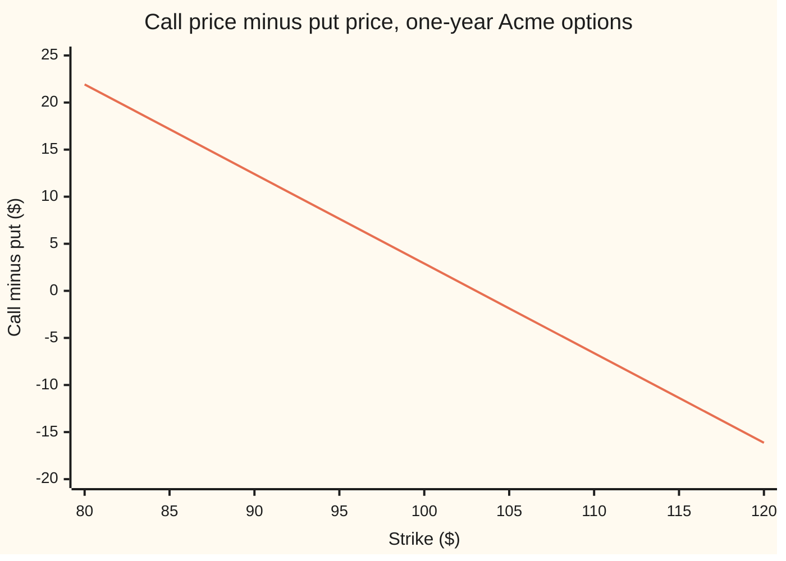
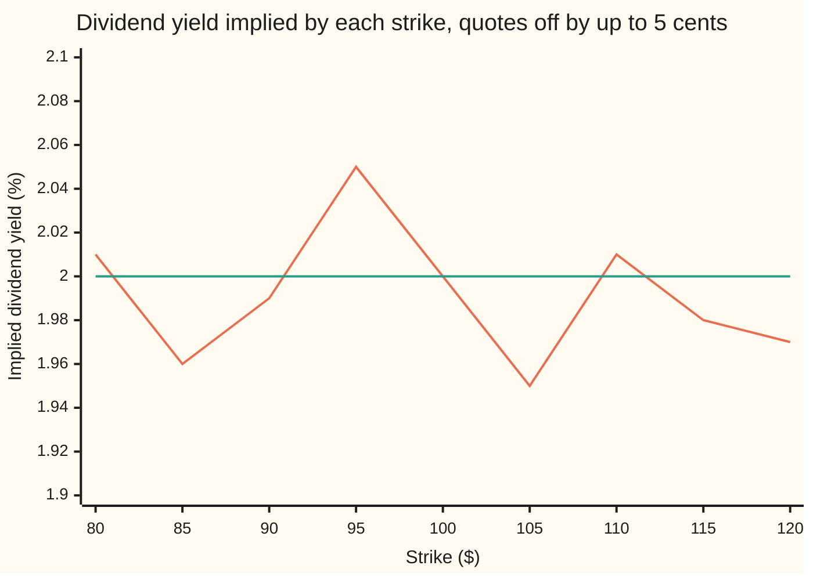

# Implied forward and dividend from parity: a call-put pair tells you the forward, and the forward tells you the yield

Financial mathematics → Implied volatility and the vanilla inverses → Reading carry from option prices → Implied forward and dividend from parity

---

## General Overview

Acme shares trade at $100.00. On the options screen, a one-year call struck at $100.00 is quoted at $9.23 and the put at the same strike at $6.33. The bank rate for a year is 5.00%. Nobody has said what dividend Acme will pay.

The two quotes say it anyway. A call bought and a put sold at one strike make a forward: a promise to buy one share at the strike on expiry day ([put-call-parity](../08-The%20Black-Scholes%20call%20and%20put/03-put-call-parity.md)). The gap between the two prices is what that promise is worth today. Carry the gap a year forward at the bank rate, add it to the strike, and out comes the **forward price**, the price at which the market will agree today to sell Acme in a year: $103.05.

The forward is the share price grown at the bank rate, less the dividends a holder of the share would collect ([forward-price-by-cash-and-carry](../03-Contracts%20and%20No-Arbitrage/03-forward-price-by-cash-and-carry.md)). Acme at $100.00 grown at 5.00% for a year would be $105.13. The forward is lower, and the shortfall is the dividend. Solved exactly, it is a **dividend yield**, dividends paid as a steady fraction of the share price each year, of 2.00%. That is the job of this card: run parity backwards, from prices to the forward, and from the forward to the yield.

**Put-call parity has the forward in it, added and subtracted and nothing else, so a call and a put at one strike fix the forward exactly, the forward and the share price fix the dividend yield, and two strikes fix the interest rate as well.**

**What kind of fact this is:** a method: the theorem of put-call parity solved for the quantities a desk does not observe. The algebra, and why the answer is the only one, are on this card in Why it works.

### The picture: the gap between call and put falls in a straight line across strikes



The one line is the call's price minus the put's price at nine strikes from $80.00 to $120.00. It is straight. It falls by a little less than a dollar for each dollar of strike, because a dollar more of strike is a dollar more to pay in a year, worth a little less than a dollar today. It crosses zero between $100.00 and $105.00, at the strike where call and put cost the same. That crossing point is the forward, $103.05. Its drop per dollar of strike is the discount factor, the value today of a dollar paid in a year. One straight line, two numbers read off it: the forward and the rate.

---

## The formula

Notation, as on the parity card. A **discount factor** $D$ is today's value of one dollar paid on expiry day, $D = e^{-rT}$ in this wing's style. Its reverse, $e^{rT}$, carries a dollar today forward to expiry day. The natural logarithm, written ln, undoes the exponential: $\ln(e^{x}) = x$.

Put-call parity, with the forward $F$ written in:

$$C - P = D\,(F - K)$$

Solved for the forward, from one strike, with the rate known:

$$F = K + (C - P)\,e^{rT}$$

Solved for the dividend yield, once the forward is known:

$$q = r - \frac{\ln(F/S)}{T}$$

**Read it aloud:** carry the call-minus-put gap forward to expiry and add the strike, and that is the forward; the forward's growth over the share price, per year, is the rate minus the dividend yield.

Without the rate, the share price and forward alone still give the **carry**, the rate minus the yield:

$$r - q = \frac{\ln(F/S)}{T}$$

And two strikes $K_1 < K_2$ give the rate itself. This package is called a **box**: a call-minus-put at the low strike, less a call-minus-put at the high strike, pays $K_2 - K_1$ for certain on expiry day. With $g_1$ and $g_2$ the two call-minus-put gaps:

$$D = \frac{g_1 - g_2}{K_2 - K_1}, \qquad r = -\frac{\ln D}{T}, \qquad F = K_1 + \frac{g_1}{D}$$

| Symbol | Plain meaning | In our example | Push it up and the answer… |
| --- | --- | --- | --- |
| $C$ | the call's price today: the right to **buy** at the strike | $9.23 | forward rises, by $1.05 per dollar; implied yield falls |
| $P$ | the put's price today: the right to **sell** at the strike | $6.33 | forward falls, by $1.05 per dollar; implied yield rises |
| $S$ | Acme's price today | $100.00 | forward unchanged (it comes from the options); implied yield rises |
| $K$ | the **strike**, the price both tickets name | $100.00 | no change in the forward: the gap shrinks to match |
| $T$ | time to expiry, in **years** | 1.00 | the same price error moves the yield less; divide by a small $T$ and errors swell |
| $r$ | the **riskless rate**, continuously compounded | 5.00% | forward rises a little (the gap is carried at a higher rate); implied yield rises almost one for one |
| $q$ | the **dividend yield**: dividends a year as a fraction of the share price | 2.00% | the answer, not an input |
| $F$ | the **forward price**: the fixed price agreed today for one share on expiry day | $103.05 | implied yield falls |
| $D$ | the **discount factor** $e^{-rT}$: one dollar on expiry day, valued today | 0.951229 | a higher $D$ means a lower rate |
| $K_1$, $K_2$ | the low and high strikes of a box | $90.00, $110.00 | wider apart: quote errors move $D$ less |
| $g_1$, $g_2$ | the call-minus-put gap at each box strike | $12.41, −$6.62 | a wider difference means a larger $D$, a lower rate |

### One answer, and when there is none

Every inverse card on this shelf answers three questions before it solves. Does an answer exist? Is it the only one? Where does it break?

- **Only one.** The forward enters parity once, multiplied by $D$ and nothing else. So each gap gives one forward, and each forward gives one gap: the line in the picture never doubles back. The logarithm only climbs, so each forward gives one yield. For the box, the two gaps are two straight-line equations in two unknowns, the discount factor and $D$ times the forward. Two such equations have exactly one solution whenever the strikes differ.
- **When it exists.** The yield needs a positive forward, so $C - P$ must exceed $-K\,D$: a put can never cost more than the call plus the strike's value today. A pair that breaks this is free money, not an input. The box needs a positive $D$: the box must cost something, and less than $K_2 - K_1$ while rates are positive.
- **Where it breaks.** The yield divides by $T$, so for short options a small price error becomes a large yield error. The box divides by $K_2 - K_1$, so for close strikes a small price error becomes a large rate error. The card measures both below.

### When it holds

- **Both tickets European**, usable on expiry day only. American options, usable any day, carry an early-exercise value that parity does not count; the implied yield then absorbs it and comes out wrong ([american-options-and-early-exercise](../15-American%20and%20Bermudan%20exercise/01-american-options-and-early-exercise.md)).
- **Both quotes live and tradable at the same moment.** A call quoted before Acme moved $1.00 turns a 2.00% yield into 2.59%.
- **One rate for borrowing and lending, and the share can be borrowed freely.** A fee to borrow Acme shows up inside the implied yield, added to the dividend, because shorting the share (selling a borrowed one) becomes dearer in exactly the way a dividend makes it dearer.
- **Dividends treated as a steady yield.** A single known cash dividend gives the same forward; the yield is then just the equivalent steady rate ([known-cash-dividends](../08-The%20Black-Scholes%20call%20and%20put/08-known-cash-dividends.md)).

---

## Why it works

### Step 0: a call-minus-put is a forward, so its price is a forward's price

On expiry day a call bought and a put sold at one strike pay the share price minus the strike, whatever the share does. That is a forward's payoff. Two things that pay the same must cost the same today. So the price gap between the call and the put is the value today of a forward struck at $K$. Nothing about the model of Acme's price enters. The parity card proves this; this card uses it and turns it round.

### Step 1: what a forward struck at K is worth today

A forward struck at the market's forward price $F$ is worth nothing today: that is what "the forward price" means. A forward struck at $K$ instead pays $F - K$ more, or less, than that one on expiry day, for certain. A certain amount on expiry day is worth $D$ times that amount today. So

$$C - P = D\,(F - K)$$

With the parity card's own form, $S\,e^{-qT} - K\,e^{-rT}$, the two agree because $F = S\,e^{(r-q)T}$.

### Step 2: solve for the forward

Divide by $D$ and add $K$. Dividing by $D$ is multiplying by $e^{rT}$:

$$F = K + (C - P)\,e^{rT}$$

On the house prices: $2.896925 \times 1.051271 = 3.045453$, plus the strike, $103.045453$. The share's own price did not enter.

### Step 3: solve for the yield

Cash and carry says $F = S\,e^{(r-q)T}$. Divide by $S$, take logarithms, divide by $T$:

$$\frac{\ln(F/S)}{T} = r - q, \qquad q = r - \frac{\ln(F/S)}{T}$$

On the house numbers: $\ln(1.030455) = 3.0000\%$, so the carry is 3.00% and the yield is 5.00% − 3.00% = 2.00%. Without the rate, this step still gives the carry, 3.00%, and stops.

### Step 4: two strikes remove the need for the rate

At two strikes, parity gives two equations:

$$g_1 = D\,F - D\,K_1, \qquad g_2 = D\,F - D\,K_2$$

Subtract the second from the first. The forward cancels and leaves $g_1 - g_2 = D\,(K_2 - K_1)$. The package behind that subtraction is the box: long a call and short a put at $K_1$, short a call and long a put at $K_2$. On expiry day it pays Acme's price less $K_1$, minus Acme's price less $K_2$: that is $K_2 - K_1$, and Acme's price drops out. On the house market the box pays 20.00 dollars for certain in a year and costs 12.409219 + 6.615369 dollars today, so the discount factor is 0.951229 and the rate, $-\ln D / T$, is 5.00%. Put $D$ back into the first equation and the forward comes out as before, $103.045453$.

### Step 5: how a price error travels to the yield

Nudge the put up by a small amount. The forward falls by that amount times $e^{rT}$. The yield rises by the forward's fall divided by $F \times T$. So a put error of $0.10 moves the yield by about $0.10 \times e^{rT} / (F\,T)$ = 0.10 percentage point on the house market. The $T$ in the denominator is why short options give wild yields.

<details>
<summary>Detailed proof: uniqueness, existence, and the error rule</summary>

**Uniqueness, one strike.** The map from $F$ to $C - P$ is $F \mapsto D(F - K)$ with $D > 0$. It is a straight line with positive slope, so it has an inverse, $g \mapsto K + g/D$, defined for every gap. The map from $F$ to $q$, $F \mapsto r - \ln(F/S)/T$, is strictly decreasing for $F > 0$, so it too has exactly one inverse. The composition of two one-to-one maps is one-to-one.

**Existence.** $\ln$ needs $F > 0$, that is $K + g/D > 0$, that is $g > -K D$, which reads $P < C + K\,e^{-rT}$. Were the put dearer than that, buying the call, lending $K\,e^{-rT}$ and selling the put would bring in money today and leave a position that never pays less than nothing on expiry day. So an arbitrage-free pair always has an answer.

**The box as a linear system.** Unknowns $D$ and $D\,F$. Equations $D\,F - K_1 D = g_1$ and $D\,F - K_2 D = g_2$. The determinant (the number whose being nonzero guarantees one solution) is $K_1 - K_2$, nonzero when the strikes differ. Solution $D = (g_1 - g_2)/(K_2 - K_1)$, $D\,F = g_1 + K_1 D$, and $F$ is the second divided by the first. Existence of the rate needs $D > 0$.

**The error rule.** $F = K + (C - P)e^{rT}$ gives $\partial F / \partial P = -e^{rT}$. $q = r - \ln(F/S)/T$ gives $\partial q / \partial F = -1/(F T)$. By the chain rule $\partial q / \partial P = e^{rT}/(F T)$. For the box, $\partial D / \partial g_1 = 1/(K_2 - K_1)$: halving the strike distance doubles the effect of every price error on $D$, and so on the rate.

</details>

The alternative road is to skip the formulas and hunt: guess a yield, compute $S\,e^{-qT} - K\,e^{-rT}$, compare with $C - P$, and adjust. That is a root finder, and the code runs one as its second road. It lands on the same 2.00%, as it must, since the equation has one root. It is the method a desk falls back on when dividends come as a list of cash amounts on dates and no clean logarithm exists; the root-finding machinery itself is on [implied-volatility-by-newton-and-bisection](02-implied-volatility-by-newton-and-bisection.md).

---

## Worked numbers, by hand

The house market: Acme at $S$ = $100.00, strike $K$ = $100.00, rate $r$ = 5.00%, $T$ = 1.00 year, call $9.227006, put $6.330081. The dividend yield is treated as unknown.

| Step | Arithmetic | Value |
| --- | --- | --- |
| the gap, $C - P$ | $9.227006 - 6.330081$ | $2.896925 |
| carry factor, $e^{rT}$ | $e^{0.05}$ | 1.051271 |
| gap carried to expiry | $2.896925 \times 1.051271$ | $3.045453 |
| forward, $F$ | $100.00 + 3.045453$ | **$103.045453** |
| forward over share, $F/S$ | $103.045453 / 100.00$ | 1.030455 |
| carry, $\ln(F/S)/T$ | $\ln(1.030455) / 1$ | 3.0000% |
| dividend yield, $q$ | $5.0000\% - 3.0000\%$ | **2.0000%** |
| box: gaps at $90 and $110 | from the call and put at each strike | $12.409219 and −$6.615369 |
| box: discount factor, $D$ | $(12.409219 + 6.615369) / 20$ | 0.951229 |
| box: rate, $-\ln D / T$ | | **5.0000%** |
| cross-check: cash and carry | $100.00 \times e^{0.03}$ | $103.045453 |

The market is selling Acme forward at $103.05 and so is quietly assuming a 2.00% dividend yield: the same yield the prices were built from, recovered from two quotes and a rate.

### What breaks if you drop a piece

Right answers: forward $103.045453, yield 2.00%.

| Mistake | Comes out at | What went wrong |
| --- | --- | --- |
| Put quoted $0.10 too high | forward $102.940326, yield 2.10% | a dime on one leg moves the yield by 0.10 percentage point, the error rule of Step 5 |
| Gap not carried forward, $F = K + C - P$ | yield 2.14% | the gap is a price today; the forward lives on expiry day |
| Sign swapped, $r + \ln(F/S)/T$ | yield 8.00% | the forward sits below the share grown at the rate, so the yield is the rate less the carry |
| Stale call, priced when Acme was $99.00 | call $8.649699, forward $102.438548, yield 2.59% | the two legs describe two different markets |

### Bid, ask and crossed quotes

Real screens show two prices per option: the **bid**, what a buyer will pay, and the **ask**, what a seller wants. Say the call is $9.18 bid, $9.28 ask, and the put $6.28 bid, $6.38 ask. Selling a forward built from options means selling the call at its bid and buying the put at its ask; buying one means the call's ask and the put's bid. The forward then sits somewhere from $102.943559 to $103.153813, and the yield from 1.8949% to 2.0989%. A dime of spread on each leg costs about a tenth of a point of yield at either end.

A **crossed** quote has its bid above its ask, which cannot be a live market: someone could buy at the ask and sell at the bid at once. Put the put at $6.45 bid and $6.25 ask and the band turns inside out: the low end, $103.080224, sits above the high end, $102.975097. A band whose ends swap is the signal to throw the quote away rather than average it.

### Many strikes, noisy quotes

Nine strikes from $80.00 to $120.00, each leg's price nudged by a random amount of up to $0.05 either way. Each strike alone gives its own yield:



The jagged line is the yield each strike implies on its own, with the rate given. The flat line is the true 2.00%. The worst single strike is off by 0.0523 percentage point; the average of the nine is 1.9904%, much closer. Fitting a straight line through all nine gaps, with the rate not given, returns a forward of $103.057010 and a carry of 3.0112%, both close. The rate and yield it returns separately, 5.0553% and 2.0441%, are each further off than the carry. The forward is pinned tightly by the quotes; splitting it into rate and dividend is the fragile step. Fit only two strikes $10.00 apart, $95.00 and $105.00, and the rate comes out at 6.0273%.

---

## Code, from first principles, and it actually runs

The code prices the house market's calls and puts with its own bell-curve area, then forgets the dividend yield and recovers it by four roads. Road 1 is the closed form: one strike, rate given. Road 2 hunts for the yield by bisection (halving an interval that must contain the answer) on the parity equation, with no logarithm. Road 3 is the box on strikes $90.00 and $110.00, which needs no rate. Road 4 prices nine strikes again by brute force, averaging each payoff over the bell curve without the pricing formula, and fits a straight line through the nine gaps. Then come the what-breaks cases, the bid-ask band, and the noisy strikes, whose random errors come from a hand-written generator so both languages draw the same numbers.

### Python

```python
# Implied forward and dividend from parity -- the check behind the card.  Standard library
# only.  Every number quoted on the card is printed here.  Nothing imported knows the answer:
# the bell-curve area is added up slice by slice (Simpson), the root finder is a bisection
# written here, and the random quote errors come from a hand-written generator.
from math import log, sqrt, exp, pi

S, K, r, q, sigma, T = 100.0, 100.0, 0.05, 0.02, 0.20, 1.0
STRIKES = [80.0 + 5.0 * i for i in range(9)]

def phi(x): return exp(-0.5 * x * x) / sqrt(2.0 * pi)           # bell-curve height at x
def simpson(f, a, b, n):
    h = (b - a) / n
    s = f(a) + f(b)
    for i in range(1, n):
        s += (4.0 if i % 2 else 2.0) * f(a + i * h)
    return s * h / 3.0
def N(x):                                                        # bell-curve area left of x
    if x < -12.0: return 0.0
    if x > 12.0: return 1.0
    return 0.5 + simpson(phi, 0.0, x, 4000)
def call(s, k, t):                                               # the call card's formula
    vt = sigma * sqrt(t); d1 = (log(s / k) + (r - q + 0.5 * sigma * sigma) * t) / vt
    return s * exp(-q * t) * N(d1) - k * exp(-r * t) * N(d1 - vt)
def put(s, k, t):                                                # the put card's formula
    vt = sigma * sqrt(t); d1 = (log(s / k) + (r - q + 0.5 * sigma * sigma) * t) / vt
    return k * exp(-r * t) * N(vt - d1) - s * exp(-q * t) * N(-d1)
def by_integral(k, sign):    # road 4's prices: payoff averaged over the bell curve, no formula
    def f(z):
        st = S * exp((r - q - 0.5 * sigma * sigma) * T + sigma * sqrt(T) * z)
        return max(sign * (st - k), 0.0) * phi(z)
    return exp(-r * T) * simpson(f, -10.0, 10.0, 20000)

def fwd(c, p, k, rr, t): return k + (c - p) * exp(rr * t)       # road 1: parity turned round
def yld(f, rr, t): return rr - log(f / S) / t                   # the yield a forward implies
def bisect_q(gap, rr, t):    # road 2: hunt q in S e^-qT - K e^-rT = C - P; no logarithm used
    lo, hi = -1.0, 1.0
    for _ in range(200):
        mid = 0.5 * (lo + hi)
        if S * exp(-mid * t) - K * exp(-rr * t) > gap: lo = mid
        else: hi = mid
    return 0.5 * (lo + hi)
def line_fit(ks, gaps):      # road 4: least-squares line gap = a - D K, then F = a / D
    n = len(ks); mk = sum(ks) / n; mg = sum(gaps) / n
    slope = sum((x - mk) * (y - mg) for x, y in zip(ks, gaps)) / sum((x - mk) ** 2 for x in ks)
    return -slope, (mg - slope * mk) / (-slope)
state = 20260919
def noise():                 # a 64-bit linear congruential generator: a quote error in +-0.05
    global state
    state = (6364136223846793005 * state + 1442695040888963407) % (1 << 64)
    return ((state >> 11) / float(1 << 53) - 0.5) * 0.10
def row(name, v): print(f"{name:<40}{v:>14.6f}")
def pct(name, v): print(f"{name:<40}{v * 100:>13.4f}%")

C, P = call(S, K, T), put(S, K, T)
F1 = fwd(C, P, K, r, T); q1 = yld(F1, r, T); q2 = bisect_q(C - P, r, T)
g90, g110 = call(S, 90.0, T) - put(S, 90.0, T), call(S, 110.0, T) - put(S, 110.0, T)
D3 = (g90 - g110) / (110.0 - 90.0); r3 = -log(D3) / T; F3 = 90.0 + g90 / D3; q3 = yld(F3, r3, T)
gaps4 = [by_integral(k, 1.0) - by_integral(k, -1.0) for k in STRIKES]
D4, F4 = line_fit(STRIKES, gaps4); r4 = -log(D4) / T; q4 = yld(F4, r4, T)
carry = S * exp((r - q) * T)

print(f"house market: S {S:.2f}  K {K:.2f}  r {r * 100:.2f}%  q {q * 100:.2f}%  T {T:.2f} years")
print("road 1: one strike, rate given")
for name, v in (("call C", C), ("put P", P), ("C - P", C - P), ("e^rT", exp(r * T)),
                ("(C - P) e^rT", (C - P) * exp(r * T)), ("forward F = K + (C - P) e^rT", F1),
                ("F / S", F1 / S), ("share grown at the rate, S e^rT", S * exp(r * T))): row(name, v)
pct("carry r - q = ln(F/S) / T", log(F1 / S) / T); pct("yield q = r - ln(F/S) / T", q1)
pct("road 2: q by bisection on parity", q2)
print("road 3: the box, strikes 90 and 110, no rate given")
for name, v in (("C - P at 90", g90), ("C - P at 110", g110), ("discount factor D", D3),
                ("forward F", F3)): row(name, v)
pct("rate r = -ln D / T", r3); pct("yield q", q3)
print("road 4: nine strikes priced by integral, straight-line fit")
row("discount factor D", D4); row("forward F", F4); pct("rate r", r4); pct("yield q", q4)
row("check: cash and carry S e^(r-q)T", carry)
print("chart, strike    " + "".join(f"{k:>7.0f}" for k in STRIKES))
print("chart, C - P     " + "".join(f"{call(S, k, T) - put(S, k, T):>7.2f}" for k in STRIKES))

print("what breaks")
Fh = fwd(C, P + 0.10, K, r, T); qh = yld(Fh, r, T)
Fs = fwd(call(99.0, K, T), P, K, r, T); qs = yld(Fs, r, T)
row("put 0.10 too high: F", Fh); pct("put 0.10 too high: q", qh)
pct("  straight-line guess 0.10 e^rT / (F T)", 0.10 * exp(r * T) / (F1 * T))
pct("no carry forward, F = K + C - P: q", yld(K + C - P, r, T))
pct("sign swapped, r + ln(F/S) / T", r + log(F1 / S) / T)
row("stale call, priced at Acme 99", call(99.0, K, T)); row("stale call: F", Fs); pct("stale call: q", qs)
Cw, Pw = call(S, K, 1.0 / 52.0), put(S, K, 1.0 / 52.0)
pct("one week, put 0.10 too high: q", yld(fwd(Cw, Pw + 0.10, K, r, 1.0 / 52.0), r, 1.0 / 52.0))
print("bid and ask: call 9.18 / 9.28, put 6.28 / 6.38; crossed put 6.45 / 6.25")
flo, fhi = fwd(9.18, 6.38, K, r, T), fwd(9.28, 6.28, K, r, T)
fxlo, fxhi = fwd(9.18, 6.25, K, r, T), fwd(9.28, 6.45, K, r, T)
print(f"F band {flo:.6f} to {fhi:.6f}, q band {yld(fhi, r, T) * 100:.4f}% to {yld(flo, r, T) * 100:.4f}%")
print(f"crossed: F low {fxlo:.6f} above F high {fxhi:.6f}")

print("nine strikes, each leg off by up to 0.05 at random")
gaps_n = [call(S, k, T) + noise() - put(S, k, T) - noise() for k in STRIKES]
qs_n = [yld(k + g * exp(r * T), r, T) for k, g in zip(STRIKES, gaps_n)]
Dn, Fn = line_fit(STRIKES, gaps_n); rn = -log(Dn) / T; qn = yld(Fn, rn, T)
print("chart, q by strike %" + "".join(f"{v * 100:>6.2f}" for v in qs_n))
worst, q_avg = max(abs(v - q) for v in qs_n), sum(qs_n) / len(qs_n)
pct("worst single-strike error in q", worst); pct("average of the nine, rate given", q_avg)
row("fit, rate not given: forward F", Fn); pct("fit: rate r", rn); pct("fit: yield q", qn)
pct("fit: carry r - q", rn - qn)
Db = (gaps_n[3] - gaps_n[5]) / 10.0
print(f"box on 95 and 105 only: r {-log(Db) / T * 100:.4f}%")
print(f"try: K = 120 alone gives F {fwd(call(S, 120.0, T), put(S, 120.0, T), 120.0, r, T):.6f}")

assert abs(C - 9.227005508154) < 1e-9,               "the call against the shelf's house number"
assert abs(P - 6.330080627550) < 1e-9,               "the put against the shelf's house number"
assert abs(F1 - carry) < 1e-9,                       "one-strike forward against cash and carry"
assert abs(q1 - q) < 1e-9,                           "the yield comes back out of the two prices"
assert abs(q2 - q1) < 1e-12,                         "bisection against the logarithm formula"
assert abs(r3 - r) < 1e-9,                           "the box recovers the rate with no rate given"
assert abs(q3 - q) < 1e-9,                           "and the yield from its own rate"
assert abs(q4 - q) < 1e-6,                           "integral prices and a line fit: same yield"
assert abs((qh - q1) - 0.10 * exp(r * T) / (F1 * T)) < 2e-5, "a put error moves q by e^rT / (F T) a dollar"
assert qs > q + 0.005,                               "a stale call drags the implied yield up"
assert flo < F1 < fhi,                               "the live bid-ask band brackets the true forward"
assert fxhi < F1 < fxlo,                             "a crossed quote turns the band inside out"
assert abs(q_avg - q) < worst / 3,                   "averaging nine strikes cuts the worst error threefold"
assert abs(Fn - F1) < 0.05,                          "the fitted forward survives the noise"
assert abs(-log(Db) / T - r) > 5 * abs(rn - r),     "close strikes magnify the noise in the rate"
print("ALL CHECKS PASS")
```

**Ran 2026-09-24 on macOS, Python 3.14.6, standard library only. All checks passed. Output, pasted from the run:**

```
house market: S 100.00  K 100.00  r 5.00%  q 2.00%  T 1.00 years
road 1: one strike, rate given
call C                                        9.227006
put P                                         6.330081
C - P                                         2.896925
e^rT                                          1.051271
(C - P) e^rT                                  3.045453
forward F = K + (C - P) e^rT                103.045453
F / S                                         1.030455
share grown at the rate, S e^rT             105.127110
carry r - q = ln(F/S) / T                      3.0000%
yield q = r - ln(F/S) / T                      2.0000%
road 2: q by bisection on parity               2.0000%
road 3: the box, strikes 90 and 110, no rate given
C - P at 90                                  12.409219
C - P at 110                                 -6.615369
discount factor D                             0.951229
forward F                                   103.045453
rate r = -ln D / T                             5.0000%
yield q                                        2.0000%
road 4: nine strikes priced by integral, straight-line fit
discount factor D                             0.951229
forward F                                   103.045453
rate r                                         5.0000%
yield q                                        2.0000%
check: cash and carry S e^(r-q)T            103.045453
chart, strike         80     85     90     95    100    105    110    115    120
chart, C - P       21.92  17.17  12.41   7.65   2.90  -1.86  -6.62 -11.37 -16.13
what breaks
put 0.10 too high: F                        102.940326
put 0.10 too high: q                           2.1021%
  straight-line guess 0.10 e^rT / (F T)        0.1020%
no carry forward, F = K + C - P: q             2.1442%
sign swapped, r + ln(F/S) / T                  8.0000%
stale call, priced at Acme 99                 8.649699
stale call: F                               102.438548
stale call: q                                  2.5907%
one week, put 0.10 too high: q                 7.2046%
bid and ask: call 9.18 / 9.28, put 6.28 / 6.38; crossed put 6.45 / 6.25
F band 102.943559 to 103.153813, q band 1.8949% to 2.0989%
crossed: F low 103.080224 above F high 102.975097
nine strikes, each leg off by up to 0.05 at random
chart, q by strike %  2.01  1.96  1.99  2.05  2.00  1.95  2.01  1.98  1.97
worst single-strike error in q                 0.0523%
average of the nine, rate given                1.9904%
fit, rate not given: forward F              103.057010
fit: rate r                                    5.0553%
fit: yield q                                   2.0441%
fit: carry r - q                               3.0112%
box on 95 and 105 only: r 6.0273%
try: K = 120 alone gives F 103.045453
ALL CHECKS PASS
```

### Rust

Same inputs, same labels, no crates.

```rust
// Implied forward and dividend from parity -- the same check as the Python, in Rust.
// Standard library only, no crates.  The bell-curve area is added up slice by slice
// (Simpson), the root finder is a bisection written here, and the random quote errors
// come from a hand-written generator.  Compile: rustc --edition 2021 -O this_file.rs
use std::f64::consts::PI;

const S: f64 = 100.0; const K: f64 = 100.0; const R: f64 = 0.05;
const Q: f64 = 0.02; const SIGMA: f64 = 0.20; const T: f64 = 1.0;

fn phi(x: f64) -> f64 { (-0.5 * x * x).exp() / (2.0 * PI).sqrt() }   // bell-curve height at x
fn simpson<F: Fn(f64) -> f64>(f: F, a: f64, b: f64, n: usize) -> f64 {
    let h = (b - a) / n as f64;
    let mut s = f(a) + f(b);
    for i in 1..n { s += if i % 2 == 1 { 4.0 } else { 2.0 } * f(a + i as f64 * h); }
    s * h / 3.0
}
fn n_cdf(x: f64) -> f64 {                                   // bell-curve area left of x
    if x < -12.0 { return 0.0; }
    if x > 12.0 { return 1.0; }
    0.5 + simpson(phi, 0.0, x, 4000)
}
fn d1(s: f64, k: f64, t: f64) -> f64 { ((s / k).ln() + (R - Q + 0.5 * SIGMA * SIGMA) * t) / (SIGMA * t.sqrt()) }
fn call(s: f64, k: f64, t: f64) -> f64 {                    // the call card's formula
    let (a, vt) = (d1(s, k, t), SIGMA * t.sqrt());
    s * (-Q * t).exp() * n_cdf(a) - k * (-R * t).exp() * n_cdf(a - vt)
}
fn put(s: f64, k: f64, t: f64) -> f64 {                     // the put card's formula
    let (a, vt) = (d1(s, k, t), SIGMA * t.sqrt());
    k * (-R * t).exp() * n_cdf(vt - a) - s * (-Q * t).exp() * n_cdf(-a)
}
fn by_integral(k: f64, sign: f64) -> f64 {   // road 4's prices: payoff averaged over the bell curve
    let f = |z: f64| {
        let st = S * ((R - Q - 0.5 * SIGMA * SIGMA) * T + SIGMA * T.sqrt() * z).exp();
        (sign * (st - k)).max(0.0) * phi(z)
    };
    (-R * T).exp() * simpson(f, -10.0, 10.0, 20000)
}
fn fwd(c: f64, p: f64, k: f64, rr: f64, t: f64) -> f64 { k + (c - p) * (rr * t).exp() }  // road 1
fn yld(f: f64, rr: f64, t: f64) -> f64 { rr - (f / S).ln() / t }   // the yield a forward implies
fn bisect_q(gap: f64, rr: f64, t: f64) -> f64 {  // road 2: hunt q in S e^-qT - K e^-rT = C - P
    let (mut lo, mut hi) = (-1.0_f64, 1.0_f64);
    for _ in 0..200 {
        let mid = 0.5 * (lo + hi);
        if S * (-mid * t).exp() - K * (-rr * t).exp() > gap { lo = mid; } else { hi = mid; }
    }
    0.5 * (lo + hi)
}
fn line_fit(ks: &[f64], gaps: &[f64]) -> (f64, f64) {  // road 4: gap = a - D K, then F = a / D
    let n = ks.len() as f64;
    let (mk, mg) = (ks.iter().sum::<f64>() / n, gaps.iter().sum::<f64>() / n);
    let num: f64 = ks.iter().zip(gaps).map(|(x, y)| (x - mk) * (y - mg)).sum();
    let den: f64 = ks.iter().map(|x| (x - mk) * (x - mk)).sum();
    let slope = num / den;
    (-slope, (mg - slope * mk) / (-slope))
}
struct Lcg(u64);
impl Lcg {                   // a 64-bit linear congruential generator: a quote error in +-0.05
    fn noise(&mut self) -> f64 {
        self.0 = self.0.wrapping_mul(6364136223846793005).wrapping_add(1442695040888963407);
        ((self.0 >> 11) as f64 / (1u64 << 53) as f64 - 0.5) * 0.10
    }
}
fn row(name: &str, v: f64) { println!("{:<40}{:>14.6}", name, v); }
fn pct(name: &str, v: f64) { println!("{:<40}{:>13.4}%", name, v * 100.0); }

fn main() {
    let strikes: Vec<f64> = (0..9).map(|i| 80.0 + 5.0 * i as f64).collect();
    let (c, p) = (call(S, K, T), put(S, K, T));
    let f1 = fwd(c, p, K, R, T); let q1 = yld(f1, R, T); let q2 = bisect_q(c - p, R, T);
    let (g90, g110) = (call(S, 90.0, T) - put(S, 90.0, T), call(S, 110.0, T) - put(S, 110.0, T));
    let d3 = (g90 - g110) / (110.0 - 90.0); let r3 = -d3.ln() / T; let f3 = 90.0 + g90 / d3; let q3 = yld(f3, r3, T);
    let gaps4: Vec<f64> = strikes.iter().map(|&k| by_integral(k, 1.0) - by_integral(k, -1.0)).collect();
    let (d4, f4) = line_fit(&strikes, &gaps4); let r4 = -d4.ln() / T; let q4 = yld(f4, r4, T);
    let carry = S * ((R - Q) * T).exp();

    println!("house market: S {:.2}  K {:.2}  r {:.2}%  q {:.2}%  T {:.2} years", S, K, R * 100.0, Q * 100.0, T);
    println!("road 1: one strike, rate given");
    for (name, v) in [("call C", c), ("put P", p), ("C - P", c - p), ("e^rT", (R * T).exp()),
                      ("(C - P) e^rT", (c - p) * (R * T).exp()), ("forward F = K + (C - P) e^rT", f1),
                      ("F / S", f1 / S), ("share grown at the rate, S e^rT", S * (R * T).exp())] { row(name, v); }
    pct("carry r - q = ln(F/S) / T", (f1 / S).ln() / T); pct("yield q = r - ln(F/S) / T", q1);
    pct("road 2: q by bisection on parity", q2);
    println!("road 3: the box, strikes 90 and 110, no rate given");
    for (name, v) in [("C - P at 90", g90), ("C - P at 110", g110), ("discount factor D", d3),
                      ("forward F", f3)] { row(name, v); }
    pct("rate r = -ln D / T", r3); pct("yield q", q3);
    println!("road 4: nine strikes priced by integral, straight-line fit");
    row("discount factor D", d4); row("forward F", f4); pct("rate r", r4); pct("yield q", q4);
    row("check: cash and carry S e^(r-q)T", carry);
    println!("chart, strike    {}", strikes.iter().map(|k| format!("{:>7.0}", k)).collect::<String>());
    println!("chart, C - P     {}", strikes.iter().map(|&k| format!("{:>7.2}", call(S, k, T) - put(S, k, T))).collect::<String>());

    println!("what breaks");
    let fh = fwd(c, p + 0.10, K, R, T); let qh = yld(fh, R, T);
    let fs = fwd(call(99.0, K, T), p, K, R, T); let qs = yld(fs, R, T);
    row("put 0.10 too high: F", fh); pct("put 0.10 too high: q", qh);
    pct("  straight-line guess 0.10 e^rT / (F T)", 0.10 * (R * T).exp() / (f1 * T));
    pct("no carry forward, F = K + C - P: q", yld(K + c - p, R, T));
    pct("sign swapped, r + ln(F/S) / T", R + (f1 / S).ln() / T);
    row("stale call, priced at Acme 99", call(99.0, K, T)); row("stale call: F", fs); pct("stale call: q", qs);
    let w = 1.0 / 52.0;
    let (cw, pw) = (call(S, K, w), put(S, K, w));
    pct("one week, put 0.10 too high: q", yld(fwd(cw, pw + 0.10, K, R, w), R, w));
    println!("bid and ask: call 9.18 / 9.28, put 6.28 / 6.38; crossed put 6.45 / 6.25");
    let (flo, fhi) = (fwd(9.18, 6.38, K, R, T), fwd(9.28, 6.28, K, R, T));
    let (fxlo, fxhi) = (fwd(9.18, 6.25, K, R, T), fwd(9.28, 6.45, K, R, T));
    println!("F band {:.6} to {:.6}, q band {:.4}% to {:.4}%", flo, fhi, yld(fhi, R, T) * 100.0, yld(flo, R, T) * 100.0);
    println!("crossed: F low {:.6} above F high {:.6}", fxlo, fxhi);

    println!("nine strikes, each leg off by up to 0.05 at random");
    let mut g = Lcg(20260919);
    let gaps_n: Vec<f64> = strikes.iter().map(|&k| call(S, k, T) + g.noise() - put(S, k, T) - g.noise()).collect();
    let qs_n: Vec<f64> = strikes.iter().zip(&gaps_n).map(|(k, gp)| yld(k + gp * (R * T).exp(), R, T)).collect();
    let (dn, fn_) = line_fit(&strikes, &gaps_n); let rn = -dn.ln() / T; let qn = yld(fn_, rn, T);
    println!("chart, q by strike %{}", qs_n.iter().map(|v| format!("{:>6.2}", v * 100.0)).collect::<String>());
    let worst = qs_n.iter().fold(0.0_f64, |m, v| m.max((v - Q).abs()));
    let q_avg = qs_n.iter().sum::<f64>() / qs_n.len() as f64;
    pct("worst single-strike error in q", worst); pct("average of the nine, rate given", q_avg);
    row("fit, rate not given: forward F", fn_); pct("fit: rate r", rn); pct("fit: yield q", qn);
    pct("fit: carry r - q", rn - qn);
    let db = (gaps_n[3] - gaps_n[5]) / 10.0;
    println!("box on 95 and 105 only: r {:.4}%", -db.ln() / T * 100.0);
    println!("try: K = 120 alone gives F {:.6}", fwd(call(S, 120.0, T), put(S, 120.0, T), 120.0, R, T));

    assert!((c - 9.227005508154).abs() < 1e-9, "the call against the shelf's house number");
    assert!((p - 6.330080627550).abs() < 1e-9, "the put against the shelf's house number");
    assert!((f1 - carry).abs() < 1e-9, "one-strike forward against cash and carry");
    assert!((q1 - Q).abs() < 1e-9, "the yield comes back out of the two prices");
    assert!((q2 - q1).abs() < 1e-12, "bisection against the logarithm formula");
    assert!((r3 - R).abs() < 1e-9, "the box recovers the rate with no rate given");
    assert!((q3 - Q).abs() < 1e-9, "and the yield from its own rate");
    assert!((q4 - Q).abs() < 1e-6, "integral prices and a line fit: same yield");
    assert!(((qh - q1) - 0.10 * (R * T).exp() / (f1 * T)).abs() < 2e-5, "a put error moves q by e^rT / (F T) a dollar");
    assert!(qs > Q + 0.005, "a stale call drags the implied yield up");
    assert!(flo < f1 && f1 < fhi, "the live bid-ask band brackets the true forward");
    assert!(fxhi < f1 && f1 < fxlo, "a crossed quote turns the band inside out");
    assert!((q_avg - Q).abs() < worst / 3.0, "averaging nine strikes cuts the worst error threefold");
    assert!((fn_ - f1).abs() < 0.05, "the fitted forward survives the noise");
    assert!((-db.ln() / T - R).abs() > 5.0 * (rn - R).abs(), "close strikes magnify the noise in the rate");
    println!("ALL CHECKS PASS");
}
```

**Ran 2026-09-24 on macOS, rustc 1.98.1, no crates. All checks passed. Output, pasted from the run:**

```
house market: S 100.00  K 100.00  r 5.00%  q 2.00%  T 1.00 years
road 1: one strike, rate given
call C                                        9.227006
put P                                         6.330081
C - P                                         2.896925
e^rT                                          1.051271
(C - P) e^rT                                  3.045453
forward F = K + (C - P) e^rT                103.045453
F / S                                         1.030455
share grown at the rate, S e^rT             105.127110
carry r - q = ln(F/S) / T                      3.0000%
yield q = r - ln(F/S) / T                      2.0000%
road 2: q by bisection on parity               2.0000%
road 3: the box, strikes 90 and 110, no rate given
C - P at 90                                  12.409219
C - P at 110                                 -6.615369
discount factor D                             0.951229
forward F                                   103.045453
rate r = -ln D / T                             5.0000%
yield q                                        2.0000%
road 4: nine strikes priced by integral, straight-line fit
discount factor D                             0.951229
forward F                                   103.045453
rate r                                         5.0000%
yield q                                        2.0000%
check: cash and carry S e^(r-q)T            103.045453
chart, strike         80     85     90     95    100    105    110    115    120
chart, C - P       21.92  17.17  12.41   7.65   2.90  -1.86  -6.62 -11.37 -16.13
what breaks
put 0.10 too high: F                        102.940326
put 0.10 too high: q                           2.1021%
  straight-line guess 0.10 e^rT / (F T)        0.1020%
no carry forward, F = K + C - P: q             2.1442%
sign swapped, r + ln(F/S) / T                  8.0000%
stale call, priced at Acme 99                 8.649699
stale call: F                               102.438548
stale call: q                                  2.5907%
one week, put 0.10 too high: q                 7.2046%
bid and ask: call 9.18 / 9.28, put 6.28 / 6.38; crossed put 6.45 / 6.25
F band 102.943559 to 103.153813, q band 1.8949% to 2.0989%
crossed: F low 103.080224 above F high 102.975097
nine strikes, each leg off by up to 0.05 at random
chart, q by strike %  2.01  1.96  1.99  2.05  2.00  1.95  2.01  1.98  1.97
worst single-strike error in q                 0.0523%
average of the nine, rate given                1.9904%
fit, rate not given: forward F              103.057010
fit: rate r                                    5.0553%
fit: yield q                                   2.0441%
fit: carry r - q                               3.0112%
box on 95 and 105 only: r 6.0273%
try: K = 120 alone gives F 103.045453
ALL CHECKS PASS
```

The two outputs are identical line for line.

> [!TIP]
> **Try changing**
> Guess first, then run it.
> - **Use the $120.00 strike alone.** Guess whether a deep-in-the-money put gives a different forward. It does not: $103.045453 again, because the gap falls by exactly $D$ per dollar of strike.
> - **Shorten the option to one week and quote the put $0.10 too high.** Guess the implied yield. It comes out at 7.2046%, not 2.00%: the same dime, divided by a tiny $T$.
> - **Fit the rate from the noisy $95.00 and $105.00 strikes only.** Guess how far off. The rate comes out at 6.0273%, a full point high, from errors of at most five cents.
> - **Cross the put at $6.45 bid and $6.25 ask.** The forward band's low end, $103.080224, lands above its high end, $102.975097. The check asserts it.

---

## The usual mistake

> [!warning]
> **Reading the implied yield as the dividend forecast.** The yield parity returns is everything that makes owning the share differ from owning cash for a year: the dividend, plus any fee to borrow the share, plus, for American options, the value of early exercise, which parity does not know is there. A hard-to-borrow share can show an implied yield of several percent while paying no dividend at all. The number is the options market's carry, and splitting it into dividend and borrow cost needs outside information.
>
> - **Leaving the gap uncarried.** $F = K + C - P$ treats a price today as an amount on expiry day. Here it gives 2.14% instead of 2.00%.
> - **Flipping the sign.** $q = r + \ln(F/S)/T$ gives 8.00%. The forward sits below the share grown at the rate, so the dividend is what brings it down.
> - **Pairing a stale leg with a live one.** A call priced when Acme was $99.00, paired with a live put, gives 2.59%. A $1.00 move in the share, seen by one leg and not the other, is worth more than half a percentage point of yield on a one-year option.
> - **Trusting a short-dated yield.** At one week a $0.10 put error gives 7.20%. Read carry from longer options, or from many strikes averaged.

---

## Where you meet it in real life

- **Index option desks.** Before any implied volatility is computed, the forward is read off the call-put pair at the strike where the two prices are closest. Cboe's methodology for its volatility index writes the rule exactly as this card does. **Conventions verified 24 Sep 2026:** SPX options on the S&P 500 are European-exercise and cash-settled, so the equality holds as written.
- **Implied volatility, call and put agreeing.** For a European pair at one strike, the call and the put must give the same implied volatility once the forward is right. When they disagree, the forward or the dividend fed in is wrong, not the volatility: [implied-volatility](01-implied-volatility.md).
- **The other inverses on this shelf.** [strike-from-delta](03-strike-from-delta.md) and [strike-or-spot-from-a-target-premium](04-strike-or-spot-from-a-target-premium.md) take the forward as given; this card is where it comes from.
- **Dividend trading.** The yield implied by index options is the market's price for the coming years' dividends. Researchers have recovered the value of those near-term dividends from S&P 500 option prices this way, and compared it with what was then paid.
- **Hard-to-borrow shares.** When a share is expensive to borrow, its implied yield rises above its dividend by about the borrowing fee. Desks watch the gap as a live reading of that fee.
- **Currencies.** For a currency option the dividend slot holds the foreign interest rate, so the same algebra reads that rate off option prices: [garman-kohlhagen](../21-FX%20vanilla%20options%20-%20Garman-Kohlhagen%20and%20the%20desk%20conventions/01-garman-kohlhagen.md).

> **Say it back**
> A call bought and a put sold at one strike make a forward, so the call's price minus the put's is the forward's value today, $D(F - K)$. Carry the gap forward and add the strike: $F = K + (C - P)e^{rT}$, $103.05 on the house quotes. The forward over the share, logged and divided by the time, is the rate minus the yield, so the yield is 5.00% − 3.00% = 2.00%. Two strikes give the rate as well, because the forward cancels between them and leaves a certain payment. Each step is a straight line or a steady climb, so the answer is unique, and its weak points are short expiries, close strikes, stale legs and crossed quotes.

---

## What this builds on

- [put-call-parity](../08-The%20Black-Scholes%20call%20and%20put/03-put-call-parity.md): the equation this card runs backwards, and the proof that no model of the share enters it.
- [implied-volatility](01-implied-volatility.md): the shelf's first inverse, and the reason a desk wants the forward before it wants anything else.
- [forward-price-by-cash-and-carry](../03-Contracts%20and%20No-Arbitrage/03-forward-price-by-cash-and-carry.md): $F = S\,e^{(r-q)T}$, the link from the forward to the yield in Step 3.

## Where this goes next

- [vix-index](../19-Variance%20swaps%2C%20the%20log%20contract%20and%20VIX/06-vix-index.md): the volatility index, which reads its forward off the call-put pair by exactly this rule before anything else.
- [volatility-smile-and-skew](../12-The%20smile%20and%20the%20surface/01-volatility-smile-and-skew.md): implied volatility read at every strike, each priced off the forward this card recovers.

The carry is now read from the market, but it arrives as one number for rate less dividend less borrowing fee, and telling those three apart is a question that parity alone cannot answer.

---

## Sources

Verified 24 Sep 2026: every link below resolves to the publisher's page.

- Stoll, Hans R. "The Relationship Between Put and Call Option Prices." *The Journal of Finance* 24, no. 5 (1969): 801–824. [doi:10.1111/j.1540-6261.1969.tb01694.x](https://doi.org/10.1111/j.1540-6261.1969.tb01694.x). The relation this card inverts, with the trades that enforce it.
- Merton, Robert C. "Theory of Rational Option Pricing." *Bell Journal of Economics and Management Science* 4, no. 1 (1973): 141–183. [doi:10.2307/3003143](https://doi.org/10.2307/3003143). Adds the dividend yield to parity, and shows why American options break the equality.
- van Binsbergen, Jules, Michael Brandt, and Ralph Koijen. "On the Timing and Pricing of Dividends." *American Economic Review* 102, no. 4 (2012): 1596–1618. [doi:10.1257/aer.102.4.1596](https://doi.org/10.1257/aer.102.4.1596). Recovers the price of near-term index dividends from option prices by parity.
- Cboe Global Indices. *Cboe Volatility Index Methodology*. [Cboe PDF](https://cdn.cboe.com/resources/indices/Volatility_Index_Methodology_Cboe_Volatility_Index.pdf). The forward rule $F = K + e^{rT}(C - P)$ as an index provider applies it every day.
- Hull, John C. *Options, Futures, and Other Derivatives*, 11th ed. Pearson. [Publisher page](https://www.pearson.com/en-us/subject-catalog/p/options-futures-and-other-derivatives/P200000005938). Parity with dividends, box spreads, and the forward from cash and carry.
