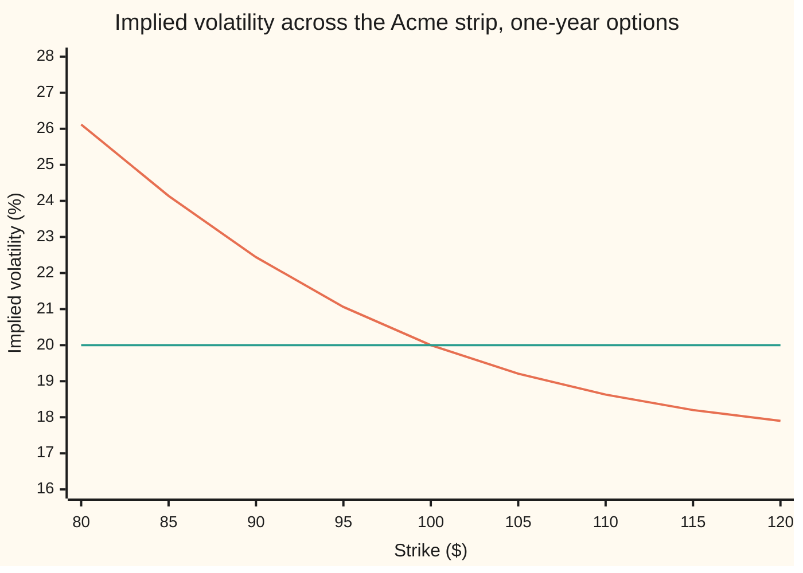
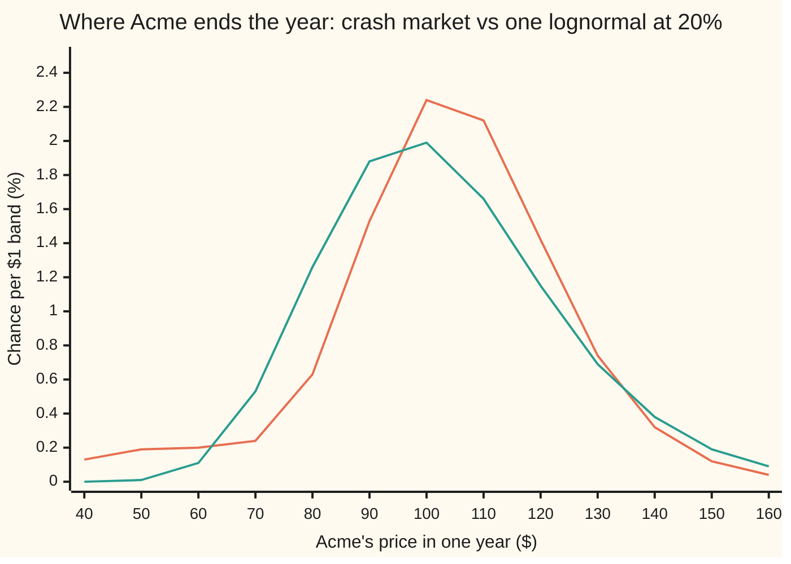

# The volatility smile and skew: one price per strike means one volatility per strike, and why that is not a mistake

[Syllabus](../../../SYLLABUS.md) → [Financial mathematics](../../../SYLLABUS.md#w12) → [The smile and the surface](../../../SYLLABUS.md#w12-s12) → The volatility smile and skew

---

## General Overview

Acme shares trade at $100. Nine one-year call options on Acme are listed, struck at $80, $85, and so on up to $120. A call is the right to buy one share at its **strike**, the fixed price written into the contract. Each of the nine has its own market price.

Black-Scholes turns one volatility (how widely the share price is expected to swing, quoted as a percentage per year) into one option price. Run it backwards on a market price and it returns the single volatility that reproduces that price: the **implied volatility**. If Black-Scholes described Acme exactly, all nine strikes would return the same number, say 20%.

They do not. This card builds a market by hand in which a crash is possible: a 12% chance that Acme's year ends in a slump, an 88% chance of a calm year. It prices the nine calls in that market, runs each price backwards, and reads off nine volatilities. They fall from 26.12% at the $80 strike to 17.90% at the $120 strike. Nothing was mispriced. The market has one belief about where Acme will end up, and Black-Scholes has one dial to describe it with. The curve is the mismatch, made visible.

Plotted against strike, that curve of implied volatilities is called the **volatility smile**: a smile when both ends lift, a **skew** when it slopes from one side to the other, as here. The steepness of the slope, measured against the log of the strike over the forward price (the price agreed today for delivery in a year), is the number traders call skew.

**Every strike's price is a separate fact, so every strike has its own implied volatility; the curve they trace is the market's belief about crashes and rallies, read through a model that can only say "one volatility".**

**What kind of fact this is:** a definition (the smile is implied volatility read strike by strike, the skew is its slope in log-moneyness), plus a theorem proved in Why it works: the curve is flat only when the market's price distribution is exactly one lognormal.

### The picture: nine strikes, nine volatilities



The orange curve is the crash market's implied volatility at each strike. The green line is what a flat 20% Black-Scholes market would return at every strike. The two cross at the $100 strike, where the crash market happens to imply 20.00%.

---

## The formula

Two formulas, pointing in opposite directions. The first defines the smile. The second builds a market that has one.

**The smile.** At each strike $K$, the implied volatility is the one number that makes Black-Scholes agree with the market's call price $C(K)$:

$$\sigma_{\text{imp}}(K) \ \text{ is the } \sigma \text{ that solves } \ C_{\text{BS}}(K, \sigma) = C(K)$$

**Read it aloud:** at each strike, find the one volatility that makes the textbook price equal the market price; the smile is that answer drawn across all strikes.

The horizontal axis is usually **log-moneyness**, the log of the strike over the forward:

$$k = \ln\frac{K}{F}, \qquad F = S\,e^{(r-q)T}$$

**Read it aloud:** log-moneyness measures how far the strike sits from the forward price, as a log ratio, so $k = 0$ is the forward itself. Here $F$ is $103.05, the price fixed today for delivery in a year.

**The skew** is the slope of the smile against log-moneyness at one expiry:

$$\text{skew} = \frac{\Delta \sigma_{\text{imp}}}{\Delta k}$$

**Read it aloud:** the skew is how much implied volatility changes per unit step in log-moneyness. Between the $90 and $110 strikes it is −0.1898: each 1% step up in strike lowers implied volatility by about 0.19 of a percentage point.

**The crash market.** Two legs, each a lognormal (a price whose log follows a bell curve) with its own centre and width. With chance $p$ the year is a crash, centred on $F_c$ with volatility $\sigma_c$; otherwise it is calm, centred on $F_n$ with volatility $\sigma_n$. Every option is priced as the weighted average of the two legs' Black-Scholes prices:

$$C(K) = p\,C_{\text{BS}}(K;\,F_c,\,\sigma_c) + (1-p)\,C_{\text{BS}}(K;\,F_n,\,\sigma_n), \qquad p\,F_c + (1-p)\,F_n = F$$

**Read it aloud:** the market price is the crash leg's price times its chance plus the calm leg's price times its chance, and the two legs must average to the market's own forward.

| Symbol | Plain meaning | In our example | Push it up and the answer… |
| --- | --- | --- | --- |
| $\sigma_{\text{imp}}(K)$ | implied volatility at strike $K$ | 26.12% at $80, 17.90% at $120 | is the answer |
| $C_{\text{BS}}(K, \sigma)$ | the Black-Scholes call price at strike $K$ and volatility $\sigma$; written $C_{\text{BS}}(K;\,F_i,\,\sigma_i)$ when centred on a leg's forward | $9.23 at $100 and 20%, the crash market's own $100 call | rises with $\sigma$, one-for-one in rank: that is why the inverse exists |
| $C(K)$, $P(K)$ | the market's call and put prices at strike $K$ | call $23.90, put $1.98 at $80 | raise the implied volatility at that strike and no other |
| $K$ | strike | $80 to $120 | slides along the curve: lower strikes, higher volatility here |
| $S$, $F$ | spot price today; forward price for delivery at $T$ | $100; $103.05 | drag the whole curve sideways: its shape is pinned to $F$ |
| $k$ | log-moneyness, $\ln(K/F)$ | −0.2531 at $80, +0.1523 at $120 | same as raising $K$ |
| $T$ | time to expiry, in years | 1 | spreads the same crash over a longer life (next card) |
| $r$, $q$ | riskless rate and dividend yield, continuously compounded | 5%, 2% | move $F$; get them wrong and a fake skew appears |
| $e^{-rT}$ | discount factor: today's value of $1 due at $T$ | 0.9512 | scales every price, cancels in the inversion |
| $p$, $F_c$, $\sigma_c$ | crash leg: chance, centre, volatility | 12%, $72.13 (70% of $F$), 40% | $p$ or $\sigma_c$ up, or $F_c$ down: steeper skew, low strikes lifted |
| $F_n$, $\sigma_n$ | calm leg: centre (set so the legs average to $F$), volatility | $107.26, 15% | $\sigma_n$ lifts the whole curve, most at high strikes |
| $N(x)$ | area under the standard bell curve to the left of $x$ | used inside every $C_{\text{BS}}$ | |

### When it holds

The smile and the skew are definitions, so they hold whenever the inversion has an answer. That needs:

- **European options on one expiry.** An option exercisable early carries an extra right; inverting it with the European formula mixes that right into the volatility.
- **Prices free of arbitrage** (no riskless profit from combining them). A call priced outside its bounds, below $e^{-rT}\max(F-K, 0)$ or at or above $S e^{-qT}$, has no implied volatility at all; one priced exactly on the lower bound has implied volatility zero.
- **The right forward.** The inversion uses $F$; with the wrong $r$ or $q$ it returns a curve that is partly the forward error (see What breaks).
- **A put and a call at one strike share one volatility** only if put-call parity holds, which the crash market guarantees by making its legs average to $F$.

---

## Why it works

### Step 0: each strike probes a different part of the distribution

A put struck at $80 pays only if Acme ends below $80; a call struck there pays only if it ends above. Each price is a statement about one region of outcomes. Nine strikes are nine probes into nine regions of the market's **risk-neutral distribution** (the pricing distribution under which every asset grows at the riskless rate; see [The butterfly and the implied density](../10-Digitals%20and%20the%20implied%20density/05-butterfly-and-the-implied-density.md)).

Black-Scholes has exactly one dial for that distribution's width. Turning it widens every region at once. It cannot fatten the left side while thinning the right. So when the market's distribution is lopsided, the model can only report "wider here, narrower there" by giving each strike its own dial setting. That is the smile.

### Step 1: the crash market's price is a weighted average

A price is a discounted average payoff. An average over a two-way coin flip is the chance-weighted average of the two conditional averages. So the crash market's call at $K$ is $p$ times the crash leg's Black-Scholes call plus $1 - p$ times the calm leg's. Nothing deeper is needed.

The legs are not free to sit anywhere. Put-call parity, a cash-flow identity, says $C(K) - P(K) = e^{-rT}(F - K)$ for every strike. In the crash market the left side equals $e^{-rT}(pF_c + (1-p)F_n - K)$. The two agree only if $pF_c + (1-p)F_n = F$. That fixes the calm centre: with the crash at 70% of $F$, the calm leg sits at $107.26, 104.09% of $F$. A crash is paid for by a slightly better calm year.

### Step 2: every strike has exactly one implied volatility

Before solving, the inverse must exist and be unique ([Implied volatility](../11-Implied%20volatility%20and%20the%20vanilla%20inverses/01-implied-volatility.md) proves this in full). As volatility falls to zero, the Black-Scholes call falls to $e^{-rT}\max(F - K, 0)$. As volatility grows without limit, the call rises to $e^{-rT}F$. In between it climbs strictly.

Each leg's price sits strictly inside its own bounds. Their weighted average therefore sits below $e^{-rT}F$, and above $e^{-rT}\max(F-K, 0)$, since averaging the two legs' "forward minus strike" never falls below the forward's own. So every crash-market price lies strictly inside the range, and exactly one volatility reaches it. Bisection (halving a bracket that holds the answer) finds it; so does Newton's method (following the slope to the root; here the slope is vega, the price's rate of change with volatility). The check runs both, on the call and the put separately, and they agree at every strike.

### Step 3: the curve is flat only when the distribution is one lognormal

Suppose the implied volatility were the same number at every strike. Then every market call equals a Black-Scholes call at that one volatility. Two sets of call prices that agree at every strike have the same second derivative in strike, and that second derivative, grown at the riskless rate, is the risk-neutral density (the Breeden-Litzenberger result, on [The butterfly and the implied density](../10-Digitals%20and%20the%20implied%20density/05-butterfly-and-the-implied-density.md)). So the market's density would have to be exactly one lognormal.

The crash market's is not. The picture shows it:



The orange curve is the crash market's density: a tall calm hump near $107 and a low crash shelf between $40 and $70. The green curve is one lognormal centred on the same forward at 20%. Below $60 the crash market holds 4.77% of the outcomes against the lognormal's 0.46%. Above $130 it holds fewer: 8.26% against 10.35%.

<details>
<summary>Detailed proof: no single lognormal matches the crash market</summary>

Raise the final price to a whole-number power n and average: that is the n-th moment. A lognormal centred on $F$ with volatility $\sigma$ has n-th moment $F^n e^{n(n-1)\sigma^2 T/2}$. A mixture's moments are the chance-weighted moments of its legs.

Any lognormal that equals the crash market must match its mean, which every candidate does, and its second moment. The second moment fixes the volatility: $\sigma = \sqrt{\ln(\text{second moment}/F^2)/T}$, which is 20.79% here. That one lognormal then has a third moment of 1,245,667. The crash market's third moment is 1,234,558. The two distributions differ, so their call prices differ at some strike, so the implied volatility is not constant. More generally, a mixture of two different lognormals is never itself a lognormal: the log of a sum of two distinct bell curves is not a parabola.

</details>

### Step 4: which way the curve tilts, leg by leg

Split each put's price into what the crash leg supplies and what the calm leg supplies. The check prints the crash leg's share:

```
crash leg's share of each put's price, %  (one █ = 5%)
  $80   ███████████████████  94.4
  $85   ██████████████████   87.9
  $90   ████████████████     78.6
  $95   ██████████████       67.8
 $100   ███████████          57.3
 $105   ██████████           48.2
 $110   ████████             41.0
 $115   ███████              35.4
 $120   ██████               31.1
```

The $80 put is almost a pure crash contract. The calm leg, centred on $107.26 with 15% volatility, rarely reaches $80, so the crash leg's 40% volatility dominates the price. Diluted by the crash's 12% chance, it shows up as 26.12%. Walk up the strikes and the calm leg takes over, and the implied volatility sinks toward the calm 15%. Above $130 the crash market is thinner than the 20% lognormal, so high-strike calls are cheap, and cheap reads as low volatility.

Different widths bend the curve. The tilt comes from different centres: with both legs centred on $F$, the curve becomes an even smile in log-moneyness, and the check asserts 19.3122% at both $k = -0.2$ and $k = +0.2$.

<details>
<summary>Why the equal-centre smile is exactly even</summary>

Write prices per unit of forward and let $f(x)$ be the density of $x = \ln(S_T/F)$. For one lognormal centred on $F$, and so for any mixture of them, $f(-x) = e^{x} f(x)$. Substituting $x \to -x$ in the call integral turns the call at $k$ into $e^{k}$ times the put at $-k$. Black-Scholes obeys the same identity. So the volatility that fits the call at $k$ fits the put at $-k$, and parity gives the call at $-k$ the same volatility.

</details>

### Step 5: why the slope is measured in log-moneyness

A strike alone is not a distance. $90 is close to the money on a $100 share and far from it on a $300 one. The ratio $K/F$ fixes that. The log fixes a second problem: a 20% fall and a 20% rise do not cancel in prices, but they sit at equal and opposite distances in logs. So skew per unit of $k$ means the same thing on any underlying, at any price level. For the Acme strip it is −0.1898 between $90 and $110, and −0.1572 in a narrow band around the forward, where the implied volatility is 19.49%.

A market with infinitely many legs, one for each possible number of jumps, is Merton's jump model ([Merton jump-diffusion](../13-Local%20volatility%20and%20jumps/04-merton-jump-diffusion.md)); a market where volatility itself wanders, and rises when the price falls, produces the same skew without jumps ([The Heston model](../14-Stochastic%20volatility%20-%20Heston%2C%20SABR%20and%20their%20mix/01-heston-model.md)).

---

## Worked numbers, by hand

The $80 put: the right to sell one Acme share for $80 in a year. It is the strike where the crash shows most.

| Step | Arithmetic | Value |
| --- | --- | --- |
| forward | $100 \times e^{0.05 - 0.02}$ | $103.05 |
| crash centre | $0.70 \times 103.0455$ | $72.13 |
| calm centre | $(103.0455 - 0.12 \times 72.1318) / 0.88$ | $107.26 |
| crash leg's $80 put | Black-Scholes at 40%, centred on $72.13 | $15.5887 |
| calm leg's $80 put | Black-Scholes at 15%, centred on $107.26 | $0.1262 |
| market's $80 put | $0.12 \times 15.5887 + 0.88 \times 0.1262$ | $1.98 |
| flat 20% put, for comparison | Black-Scholes at 20% on the forward | $0.84 |
| bisection from 0% to 50%: try 25% | put $1.75, too cheap | raise the floor |
| try 37.5% | put $4.78, too dear | lower the ceiling |
| try 31.25%, then 28.125%, then 26.5625% | $3.16, $2.42, $2.08: all too dear | lower the ceiling |
| try 25.78125% | $1.91, too cheap | raise the floor |
| **implied volatility at $80** | keep halving until the bracket is narrower than $10^{-15}$ | **26.12%** |

The market charges $1.98 for protection below $80 where a flat 20% world would charge $0.84. Quoted as a volatility, that premium is 26.12%. The same arithmetic at each strike draws the curve:

| Strike | $80 | $90 | $100 | $110 | $120 |
| --- | --- | --- | --- | --- | --- |
| $k$ | −0.2531 | −0.1354 | −0.0300 | +0.0653 | +0.1523 |
| call price | $23.90 | $15.85 | $9.23 | $4.67 | $2.07 |
| implied volatility | 26.12% | 22.44% | 20.00% | 18.63% | 17.90% |

### What breaks if you drop a piece

| Mistake | Comes out at | What went wrong |
| --- | --- | --- |
| Invert with the 2% dividend forgotten | 8.64% at $80, 16.72% at $100, 16.39% at $120 (right: 26.12%, 20.00%, 17.90%) | the inverter used a forward of $105.13, not $103.05; the skew's shape is now mostly the forward error |
| Leave the calm leg on $F$, so the legs do not average to the forward | call 13.85%, put 23.18% at the $100 strike | parity fails; one strike reports two volatilities, and the gap is riskless profit |
| Bisect from a bracket of 1% to 25% at $80 | 25.00% (right: 26.12%) | the answer lay outside the bracket; bisection returns the edge without complaint |

---

## Code, from first principles, and it actually runs

The code builds the crash market, prices the nine strikes three independent ways (the weighted Black-Scholes formula; Simpson's rule integrating payoff times density, with no Black-Scholes anywhere; a 200,000-path Monte Carlo simulation, drawing a leg and then a price, from a hand-written random number generator), and inverts each price two independent ways (bisection on the call, Newton's method on the put). A flat 20% market is inverted as a control. The normal CDF is written out from its series. Every number on the card, including every chart point, is printed.

### Python

```python
# Volatility smile and skew -- the check behind the card.  Standard library only.
# A crash-mixture market prices the house strip 80..120; each price is run back through
# Black-Scholes to one volatility per strike.  Every number quoted on the card is printed.
from math import log, sqrt, exp, cos, pi

def N(x):                        # normal CDF from its own series: erf(y) = 2/sqrt(pi) e^-y^2 sum 2^n y^(2n+1)/(2n+1)!!
    if x > 9.0: return 1.0
    if x < -9.0: return 0.0
    y = abs(x) / sqrt(2.0); term = y; s = y; n = 0
    while term > 1e-17 * s:
        n += 1; term *= 2.0 * y * y / (2 * n + 1); s += term
    e = 2.0 / sqrt(pi) * exp(-y * y) * s
    return 0.5 * (1.0 + e) if x >= 0 else 0.5 * (1.0 - e)
def phi(x): return exp(-0.5 * x * x) / sqrt(2.0 * pi)

S, r, q, T = 100.0, 0.05, 0.02, 1.0
F, D = S * exp((r - q) * T), exp(-r * T)            # forward and discount factor
def legs(p, c, sc, sn):                             # crash leg (weight, forward, vol) and calm leg; average forward = F
    return [(p, c * F, sc), (1.0 - p, (F - p * c * F) / (1.0 - p), sn)]
MIX = legs(0.12, 0.70, 0.40, 0.15)                   # 12% chance of a crash to 70% of the forward

def b76(f, K, s, call=True):                        # one lognormal centred on forward f, discounted
    v = s * sqrt(T); d1 = (log(f / K) + 0.5 * v * v) / v; d2 = d1 - v
    return D * (f * N(d1) - K * N(d2)) if call else D * (K * N(-d2) - f * N(-d1))
def mix(K, call=True, m=MIX): return sum(w * b76(f, K, s, call) for w, f, s in m)
def bs(K, s, call=True, qq=q): return b76(S * exp((r - qq) * T), K, s, call)   # Black-Scholes on spot

def iv_bisect(C, K, lo=1e-6, hi=5.0, qq=q):        # road A to the vol: bisection on the call
    for _ in range(200):
        mid = 0.5 * (lo + hi)
        if bs(K, mid, True, qq) > C: hi = mid
        else: lo = mid
        if hi - lo < 1e-15: break
    return 0.5 * (lo + hi)
def iv_newton(P, K):                                # road B: Newton on the put, slope = vega
    s = 0.25
    for _ in range(50):
        d1 = (log(F / K) + 0.5 * s * s * T) / (s * sqrt(T))
        step = (bs(K, s, False) - P) / (D * F * phi(d1) * sqrt(T))
        s -= step
        if abs(step) < 1e-15: break
    return s

def density(x, m=MIX):                              # mixture density of log S_T
    return sum(w * phi((x - log(f) + 0.5 * s * s * T) / (s * sqrt(T))) / (s * sqrt(T)) for w, f, s in m)
def simpson(g, a, b, n=4000):                      # Simpson's rule, written out
    h = (b - a) / n
    return h / 3.0 * (g(a) + g(b) + sum((4 if i % 2 else 2) * g(a + i * h) for i in range(1, n)))
def call_integral(K):                               # road 2 to the price: payoff x density, no Black formula
    return D * simpson(lambda x: (exp(x) - K) * density(x), log(K), log(F) + 3.0)

state = [20260919]
def uniform():                                      # splitmix64, top 53 bits -> (0,1)
    state[0] = (state[0] + 0x9E3779B97F4A7C15) & 0xFFFFFFFFFFFFFFFF
    z = state[0]
    z = ((z ^ (z >> 30)) * 0xBF58476D1CE4E5B9) & 0xFFFFFFFFFFFFFFFF
    z = ((z ^ (z >> 27)) * 0x94D049BB133111EB) & 0xFFFFFFFFFFFFFFFF
    return ((z ^ (z >> 31)) >> 11) * 2.0 ** -53 + 2.0 ** -54
STRIP = [80.0 + 5.0 * i for i in range(9)]
def monte_carlo(paths=200000):                      # road 3: pick a leg, draw a price, average the payoffs
    tot = [0.0] * 9
    for _ in range(paths):
        w, f, s = MIX[0] if uniform() < MIX[0][0] else MIX[1]
        z = sqrt(-2.0 * log(uniform())) * cos(2.0 * pi * uniform())
        st = f * exp(-0.5 * s * s * T + s * sqrt(T) * z)
        for j, K in enumerate(STRIP): tot[j] += max(st - K, 0.0)
    return [D * t / paths for t in tot]

mc = monte_carlo()
print(f"forward F = S e^(r-q)T, e^-rT      {F:.6f} {D:.4f}")
for lab, (w, f, s) in zip(("crash", "calm "), MIX):
    print(f"{lab} leg: weight, forward/F, forward, vol  {w:.2f} {f / F:.4f} {f:.4f} {s:.2f}")
print(f"weights x forwards                 {sum(w * f for w, f, s in MIX):.6f}")
mean = call_integral(1e-9) / D
assert abs(mean - F) < 1e-6, "the density integrates to the market's forward"
print(f"mean of S_T by integral            {mean:.6f}")
print("   K       k   call:formula integral  MC    iv call  iv put  crash share of put")
ivs = []
for j, K in enumerate(STRIP):
    C, Ci, P = mix(K), call_integral(K), mix(K, False)
    a, b = iv_bisect(C, K), iv_newton(P, K)
    ivs.append(a)
    assert abs(Ci - C) < 1e-7, "integral road must land on the weighted formula"
    assert abs(mc[j] - C) < 0.1, "Monte Carlo within ten cents"
    assert abs(a - b) < 1e-9, "bisection on the call and Newton on the put find one vol"
    share = MIX[0][0] * b76(MIX[0][1], K, MIX[0][2], False) / P
    print(f"{K:5.0f} {log(K / F):+7.4f} {C:10.4f} {Ci:9.4f} {mc[j]:7.2f} {100 * a:8.2f} {100 * b:7.2f} {100 * share:9.1f}%")
flat = [iv_bisect(bs(K, 0.20), K) for K in (80.0, 100.0, 120.0)]
assert max(abs(v - 0.20) for v in flat) < 1e-10, "a flat 20% market must invert to 20% everywhere"
assert all(ivs[i] > ivs[i + 1] for i in range(8)), "the crash market must skew down across the strip"
print(f"flat 20% market inverted at 80/100/120   {100 * flat[0]:.2f} {100 * flat[1]:.2f} {100 * flat[2]:.2f}")
skew = (ivs[6] - ivs[2]) / log(110.0 / 90.0)
iv_k = lambda k: iv_bisect(mix(F * exp(k)), F * exp(k))
print(f"skew, 90 to 110, vol per unit k      {skew:.4f}")
print(f"skew at the money, k = -0.01 to 0.01 {(iv_k(0.01) - iv_k(-0.01)) / 0.02:.4f}")
print(f"iv at the forward, k = 0             {100 * iv_k(0.0):.2f}")
# the worked example: the 80 put, leg by leg, then the vol that reproduces it
pc, pn = b76(MIX[0][1], 80.0, 0.40, False), b76(MIX[1][1], 80.0, 0.15, False)
print(f"80 put: crash leg, calm leg          {pc:.4f} {pn:.4f}")
print(f"80 put: mixture, flat 20%            {MIX[0][0] * pc + MIX[1][0] * pn:.4f} {bs(80.0, 0.20, False):.4f}")
lo, hi, P80 = 0.0, 0.5, mix(80.0, False)
for i in range(6):
    mid = 0.5 * (lo + hi); v = bs(80.0, mid, False)
    print(f"  bisection try {mid:.6f} put {v:.4f} {'too dear' if v > P80 else 'too cheap'}")
    lo, hi = (lo, mid) if v > P80 else (mid, hi)
# why: tails and moments of the market's density against one lognormal at 20%
tail = lambda K, m: sum(w * N(-(log(f / K) - 0.5 * s * s * T) / (s * sqrt(T))) for w, f, s in m)
LN = [(1.0, F, 0.20)]
assert abs(simpson(density, -20.0, log(60.0)) - tail(60.0, MIX)) < 1e-9, "tail formula = area under the density"
print(f"P(S_T < 60): mixture, lognormal 20%  {tail(60.0, MIX):.4f} {tail(60.0, LN):.4f}")
print(f"P(S_T > 130): mixture, lognormal 20% {1 - tail(130.0, MIX):.4f} {1 - tail(130.0, LN):.4f}")
mom = lambda n: sum(w * f ** n * exp(0.5 * n * (n - 1) * s * s * T) for w, f, s in MIX)
sstar = sqrt(log(mom(2) / F ** 2) / T)
for n in (2, 3): assert abs(simpson(lambda x: exp(n * x) * density(x), -20.0, log(F) + 4.0) / mom(n) - 1) < 1e-9, "moment formula = integral"
assert mom(3) < F ** 3 * exp(3 * sstar ** 2 * T) - 1000, "no lognormal matching the second moment matches the third"
print(f"vol matching E[S_T^2]; E[S_T^3] mixture vs that lognormal  {sstar:.4f} {mom(3):.1f} {F ** 3 * exp(3 * sstar ** 2 * T):.1f}")
# what breaks
bad_q = [iv_bisect(mix(K), K, qq=0.0) for K in (80.0, 100.0, 120.0)]
print(f"wrong: forward with q forgotten     {S * exp(r * T):.4f}")
print(f"wrong: inverter forgets q, 80/100/120    {100 * bad_q[0]:.2f} {100 * bad_q[1]:.2f} {100 * bad_q[2]:.2f}")
BAD = [(0.12, 0.70 * F, 0.40), (0.88, F, 0.15)]
print(f"wrong: calm leg left at F: call iv, put iv at 100  {100 * iv_bisect(mix(100.0, True, BAD), 100.0):.2f} {100 * iv_newton(mix(100.0, False, BAD), 100.0):.2f}")
print(f"wrong: bracket 0.01 to 0.25 at 80        {100 * iv_bisect(mix(80.0), 80.0, 0.01, 0.25):.2f}")
# try changing
for lab, m in (("no crash leg", legs(0.0, 0.70, 0.40, 0.15)), ("crash to 50%", legs(0.12, 0.50, 0.40, 0.15))):
    print(f"try: {lab}, iv 80/100/120      " + " ".join(f"{100 * iv_bisect(mix(K, True, m), K):.2f}" for K in (80.0, 100.0, 120.0)))
EQ = legs(0.12, 1.0, 0.40, 0.15)
ev = [iv_bisect(mix(F * exp(k), True, EQ), F * exp(k)) for k in (-0.2, 0.2)]
assert abs(ev[0] - ev[1]) < 1e-9, "equal centres give an even smile in k"
print(f"try: equal centres, iv at k = -0.2, +0.2  {100 * ev[0]:.4f} {100 * ev[1]:.4f}")
# chart points: the market's density and one lognormal at 20%, percent per $1 of S_T
grid = [40.0 + 10.0 * i for i in range(13)]
print("chart, S_T          " + " ".join(f"{x:5.0f}" for x in grid))
print("chart, mixture      " + " ".join(f"{100 * density(log(x)) / x:5.2f}" for x in grid))
print("chart, lognormal 20 " + " ".join(f"{100 * density(log(x), LN) / x:5.2f}" for x in grid))
print("ALL CHECKS PASS")
```

**Ran 2026-09-24 on macOS, Python 3.14.6, standard library only. All checks passed. Output, pasted from the run:**

```
forward F = S e^(r-q)T, e^-rT      103.045453 0.9512
crash leg: weight, forward/F, forward, vol  0.12 0.7000 72.1318 0.40
calm  leg: weight, forward/F, forward, vol  0.88 1.0409 107.2609 0.15
weights x forwards                 103.045453
mean of S_T by integral            103.045453
   K       k   call:formula integral  MC    iv call  iv put  crash share of put
   80 -0.2531    23.9033   23.9033   23.92    26.12   26.12      94.4%
   85 -0.1925    19.7496   19.7496   19.77    24.14   24.14      87.9%
   90 -0.1354    15.8457   15.8457   15.86    22.44   22.44      78.6%
   95 -0.0813    12.3044   12.3044   12.32    21.06   21.06      67.8%
  100 -0.0300     9.2273    9.2273    9.25    20.00   20.00      57.3%
  105 +0.0188     6.6780    6.6780    6.69    19.21   19.21      48.2%
  110 +0.0653     4.6674    4.6674    4.68    18.63   18.63      41.0%
  115 +0.1098     3.1570    3.1570    3.17    18.20   18.20      35.4%
  120 +0.1523     2.0735    2.0735    2.09    17.90   17.90      31.1%
flat 20% market inverted at 80/100/120   20.00 20.00 20.00
skew, 90 to 110, vol per unit k      -0.1898
skew at the money, k = -0.01 to 0.01 -0.1572
iv at the forward, k = 0             19.49
80 put: crash leg, calm leg          15.5887 0.1262
80 put: mixture, flat 20%            1.9817 0.8426
  bisection try 0.250000 put 1.7475 too cheap
  bisection try 0.375000 put 4.7791 too dear
  bisection try 0.312500 put 3.1643 too dear
  bisection try 0.281250 put 2.4245 too dear
  bisection try 0.265625 put 2.0771 too dear
  bisection try 0.257812 put 1.9100 too cheap
P(S_T < 60): mixture, lognormal 20%  0.0477 0.0046
P(S_T > 130): mixture, lognormal 20% 0.0826 0.1035
vol matching E[S_T^2]; E[S_T^3] mixture vs that lognormal  0.2079 1234558.0 1245667.0
wrong: forward with q forgotten     105.1271
wrong: inverter forgets q, 80/100/120    8.64 16.72 16.39
wrong: calm leg left at F: call iv, put iv at 100  13.85 23.18
wrong: bracket 0.01 to 0.25 at 80        25.00
try: no crash leg, iv 80/100/120      15.00 15.00 15.00
try: crash to 50%, iv 80/100/120      32.68 23.55 19.48
try: equal centres, iv at k = -0.2, +0.2  19.3122 19.3122
chart, S_T             40    50    60    70    80    90   100   110   120   130   140   150   160
chart, mixture       0.13  0.19  0.20  0.24  0.63  1.53  2.24  2.12  1.42  0.74  0.32  0.12  0.04
chart, lognormal 20  0.00  0.01  0.11  0.53  1.26  1.88  1.99  1.66  1.15  0.69  0.38  0.19  0.09
ALL CHECKS PASS
```

Three roads to each price agree: the integral to four decimals, the simulation within three cents. Bisection on the call and Newton on the put land on the same volatility at every strike, which is put-call parity seen through the inverse. The flat market returns 20.00% everywhere, so the curve is not the inverter's doing. The tail areas and moments quoted in Why it works are asserted against the density's own integral.

### Rust

Same market, same roads, same random numbers, std only.

```rust
// Volatility smile and skew -- the same check as volatility_smile_and_skew_check.py, in Rust.
// Standard library only, no crates.  A crash-mixture market prices the house strip 80..120;
// each price is run back through Black-Scholes to one volatility per strike.
use std::f64::consts::PI;

const S: f64 = 100.0; const R: f64 = 0.05; const Q: f64 = 0.02; const T: f64 = 1.0;
type Mix = Vec<(f64, f64, f64)>;                         // (weight, forward, vol) per leg

fn n_cdf(x: f64) -> f64 {                                // normal CDF from the erf series
    if x > 9.0 { return 1.0; }
    if x < -9.0 { return 0.0; }
    let y = x.abs() / 2f64.sqrt();
    let (mut term, mut s, mut n) = (y, y, 0.0);
    while term > 1e-17 * s { n += 1.0; term *= 2.0 * y * y / (2.0 * n + 1.0); s += term; }
    let e = 2.0 / PI.sqrt() * (-y * y).exp() * s;
    if x >= 0.0 { 0.5 * (1.0 + e) } else { 0.5 * (1.0 - e) }
}
fn phi(x: f64) -> f64 { (-0.5 * x * x).exp() / (2.0 * PI).sqrt() }
fn fwd() -> f64 { S * ((R - Q) * T).exp() }
fn disc() -> f64 { (-R * T).exp() }
fn legs(p: f64, c: f64, sc: f64, sn: f64) -> Mix {
    let f = fwd();
    vec![(p, c * f, sc), (1.0 - p, (f - p * c * f) / (1.0 - p), sn)]
}
fn b76(f: f64, k: f64, s: f64, call: bool) -> f64 {
    let v = s * T.sqrt(); let d1 = ((f / k).ln() + 0.5 * v * v) / v; let d2 = d1 - v;
    if call { disc() * (f * n_cdf(d1) - k * n_cdf(d2)) } else { disc() * (k * n_cdf(-d2) - f * n_cdf(-d1)) }
}
fn mix(k: f64, call: bool, m: &Mix) -> f64 { m.iter().map(|&(w, f, s)| w * b76(f, k, s, call)).sum() }
fn bs(k: f64, s: f64, call: bool, qq: f64) -> f64 { b76(S * ((R - qq) * T).exp(), k, s, call) }
fn iv_bisect(c: f64, k: f64, mut lo: f64, mut hi: f64, qq: f64) -> f64 {
    for _ in 0..200 {
        let mid = 0.5 * (lo + hi);
        if bs(k, mid, true, qq) > c { hi = mid } else { lo = mid }
        if hi - lo < 1e-15 { break; }
    }
    0.5 * (lo + hi)
}
fn iv(c: f64, k: f64) -> f64 { iv_bisect(c, k, 1e-6, 5.0, Q) }
fn iv_newton(p: f64, k: f64) -> f64 {
    let mut s = 0.25;
    for _ in 0..50 {
        let d1 = ((fwd() / k).ln() + 0.5 * s * s * T) / (s * T.sqrt());
        let step = (bs(k, s, false, Q) - p) / (disc() * fwd() * phi(d1) * T.sqrt());
        s -= step;
        if step.abs() < 1e-15 { break; }
    }
    s
}
fn density(x: f64, m: &Mix) -> f64 {
    m.iter().map(|&(w, f, s)| w * phi((x - f.ln() + 0.5 * s * s * T) / (s * T.sqrt())) / (s * T.sqrt())).sum()
}
fn simpson(g: &dyn Fn(f64) -> f64, a: f64, b: f64) -> f64 { // Simpson's rule, written out
    let n = 4000; let h = (b - a) / n as f64;
    let mut s = g(a) + g(b);
    for i in 1..n { s += if i % 2 == 1 { 4.0 } else { 2.0 } * g(a + i as f64 * h); }
    h / 3.0 * s
}
fn call_integral(k: f64, m: &Mix) -> f64 {               // payoff x density, no Black formula
    disc() * simpson(&|x| (x.exp() - k) * density(x, m), k.ln(), fwd().ln() + 3.0)
}
struct Rng(u64);
impl Rng {                                               // splitmix64, top 53 bits -> (0,1)
    fn uniform(&mut self) -> f64 {
        self.0 = self.0.wrapping_add(0x9E3779B97F4A7C15);
        let mut z = self.0;
        z = (z ^ (z >> 30)).wrapping_mul(0xBF58476D1CE4E5B9);
        z = (z ^ (z >> 27)).wrapping_mul(0x94D049BB133111EB);
        ((z ^ (z >> 31)) >> 11) as f64 * 2f64.powi(-53) + 2f64.powi(-54)
    }
}
fn tail(k: f64, m: &Mix) -> f64 {
    m.iter().map(|&(w, f, s)| w * n_cdf(-((f / k).ln() - 0.5 * s * s * T) / (s * T.sqrt()))).sum()
}
fn pct3(v: [f64; 3]) -> String { format!("{:.2} {:.2} {:.2}", 100.0 * v[0], 100.0 * v[1], 100.0 * v[2]) }

fn main() {
    let (f, d) = (fwd(), disc());
    let m = legs(0.12, 0.70, 0.40, 0.15);
    let strip: Vec<f64> = (0..9).map(|i| 80.0 + 5.0 * i as f64).collect();
    let mut rng = Rng(20260919);
    let (paths, mut tot) = (200000, vec![0.0; 9]);
    for _ in 0..paths {
        let (_, fl, s) = if rng.uniform() < m[0].0 { m[0] } else { m[1] };
        let z = (-2.0 * rng.uniform().ln()).sqrt() * (2.0 * PI * rng.uniform()).cos();
        let st = fl * (-0.5 * s * s * T + s * T.sqrt() * z).exp();
        for (j, k) in strip.iter().enumerate() { tot[j] += (st - k).max(0.0); }
    }
    let mc: Vec<f64> = tot.iter().map(|t| d * t / paths as f64).collect();
    println!("forward F = S e^(r-q)T, e^-rT      {:.6} {:.4}", f, d);
    for (lab, &(w, fl, s)) in ["crash", "calm "].iter().zip(m.iter()) {
        println!("{} leg: weight, forward/F, forward, vol  {:.2} {:.4} {:.4} {:.2}", lab, w, fl / f, fl, s);
    }
    println!("weights x forwards                 {:.6}", m.iter().map(|&(w, fl, _)| w * fl).sum::<f64>());
    let mean = call_integral(1e-9, &m) / d;
    assert!((mean - f).abs() < 1e-6, "the density integrates to the market's forward");
    println!("mean of S_T by integral            {:.6}", mean);
    println!("   K       k   call:formula integral  MC    iv call  iv put  crash share of put");
    let mut ivs = vec![];
    for (j, &k) in strip.iter().enumerate() {
        let (c, ci, p) = (mix(k, true, &m), call_integral(k, &m), mix(k, false, &m));
        let (a, b) = (iv(c, k), iv_newton(p, k));
        ivs.push(a);
        assert!((ci - c).abs() < 1e-7, "integral road must land on the weighted formula");
        assert!((mc[j] - c).abs() < 0.1, "Monte Carlo within ten cents");
        assert!((a - b).abs() < 1e-9, "bisection on the call and Newton on the put find one vol");
        let share = m[0].0 * b76(m[0].1, k, m[0].2, false) / p;
        println!("{:5.0} {:+7.4} {:10.4} {:9.4} {:7.2} {:8.2} {:7.2} {:9.1}%", k, (k / f).ln(), c, ci, mc[j], 100.0 * a, 100.0 * b, 100.0 * share);
    }
    let flat = [80.0, 100.0, 120.0].map(|k| iv(bs(k, 0.20, true, Q), k));
    assert!(flat.iter().all(|v| (v - 0.20).abs() < 1e-10), "a flat 20% market must invert to 20% everywhere");
    assert!((0..8).all(|i| ivs[i] > ivs[i + 1]), "the crash market must skew down across the strip");
    println!("flat 20% market inverted at 80/100/120   {}", pct3(flat));
    let iv_k = |kk: f64| { let k = f * kk.exp(); iv(mix(k, true, &m), k) };
    println!("skew, 90 to 110, vol per unit k      {:.4}", (ivs[6] - ivs[2]) / (110.0f64 / 90.0).ln());
    println!("skew at the money, k = -0.01 to 0.01 {:.4}", (iv_k(0.01) - iv_k(-0.01)) / 0.02);
    println!("iv at the forward, k = 0             {:.2}", 100.0 * iv_k(0.0));
    let (pc, pn) = (b76(m[0].1, 80.0, 0.40, false), b76(m[1].1, 80.0, 0.15, false));
    println!("80 put: crash leg, calm leg          {:.4} {:.4}", pc, pn);
    println!("80 put: mixture, flat 20%            {:.4} {:.4}", m[0].0 * pc + m[1].0 * pn, bs(80.0, 0.20, false, Q));
    let (mut lo, mut hi, p80) = (0.0, 0.5, mix(80.0, false, &m));
    for _ in 0..6 {
        let mid = 0.5 * (lo + hi); let v = bs(80.0, mid, false, Q);
        println!("  bisection try {:.6} put {:.4} {}", mid, v, if v > p80 { "too dear" } else { "too cheap" });
        if v > p80 { hi = mid } else { lo = mid }
    }
    let ln: Mix = vec![(1.0, f, 0.20)];
    assert!((simpson(&|x| density(x, &m), -20.0, 60f64.ln()) - tail(60.0, &m)).abs() < 1e-9, "tail formula = area under the density");
    println!("P(S_T < 60): mixture, lognormal 20%  {:.4} {:.4}", tail(60.0, &m), tail(60.0, &ln));
    println!("P(S_T > 130): mixture, lognormal 20% {:.4} {:.4}", 1.0 - tail(130.0, &m), 1.0 - tail(130.0, &ln));
    let mom = |n: f64| -> f64 { m.iter().map(|&(w, fl, s)| w * fl.powf(n) * (0.5 * n * (n - 1.0) * s * s * T).exp()).sum() };
    let sstar = ((mom(2.0) / (f * f)).ln() / T).sqrt();
    for n in [2.0, 3.0] { assert!((simpson(&|x| (n * x).exp() * density(x, &m), -20.0, f.ln() + 4.0) / mom(n) - 1.0).abs() < 1e-9, "moment formula = integral"); }
    assert!(mom(3.0) < f.powi(3) * (3.0 * sstar * sstar * T).exp() - 1000.0, "no lognormal matching the second moment matches the third");
    println!("vol matching E[S_T^2]; E[S_T^3] mixture vs that lognormal  {:.4} {:.1} {:.1}", sstar, mom(3.0), f.powi(3) * (3.0 * sstar * sstar * T).exp());
    let bad_q = [80.0, 100.0, 120.0].map(|k| iv_bisect(mix(k, true, &m), k, 1e-6, 5.0, 0.0));
    println!("wrong: forward with q forgotten     {:.4}", S * (R * T).exp());
    println!("wrong: inverter forgets q, 80/100/120    {}", pct3(bad_q));
    let bad: Mix = vec![(0.12, 0.70 * f, 0.40), (0.88, f, 0.15)];
    println!("wrong: calm leg left at F: call iv, put iv at 100  {:.2} {:.2}", 100.0 * iv(mix(100.0, true, &bad), 100.0), 100.0 * iv_newton(mix(100.0, false, &bad), 100.0));
    println!("wrong: bracket 0.01 to 0.25 at 80        {:.2}", 100.0 * iv_bisect(mix(80.0, true, &m), 80.0, 0.01, 0.25, Q));
    for (lab, mm) in [("no crash leg", legs(0.0, 0.70, 0.40, 0.15)), ("crash to 50%", legs(0.12, 0.50, 0.40, 0.15))] {
        let v = [80.0, 100.0, 120.0].map(|k| iv(mix(k, true, &mm), k));
        println!("try: {}, iv 80/100/120      {}", lab, pct3(v));
    }
    let eq = legs(0.12, 1.0, 0.40, 0.15);
    let e = [-0.2f64, 0.2].map(|kk| { let k = f * kk.exp(); 100.0 * iv(mix(k, true, &eq), k) });
    assert!((e[0] - e[1]).abs() < 1e-7, "equal centres give an even smile in k");
    println!("try: equal centres, iv at k = -0.2, +0.2  {:.4} {:.4}", e[0], e[1]);
    let grid: Vec<f64> = (0..13).map(|i| 40.0 + 10.0 * i as f64).collect();
    let row = |lab: &str, g: &dyn Fn(f64) -> String| println!("{}{}", lab, grid.iter().map(|&x| g(x)).collect::<Vec<_>>().join(" "));
    row("chart, S_T          ", &|x| format!("{:5.0}", x));
    row("chart, mixture      ", &|x| format!("{:5.2}", 100.0 * density(x.ln(), &m) / x));
    row("chart, lognormal 20 ", &|x| format!("{:5.2}", 100.0 * density(x.ln(), &ln) / x));
    println!("ALL CHECKS PASS");
}
```

**Ran 2026-09-24 on macOS, rustc 1.98.1, no crates. All checks passed. Output, pasted from the run:**

```
forward F = S e^(r-q)T, e^-rT      103.045453 0.9512
crash leg: weight, forward/F, forward, vol  0.12 0.7000 72.1318 0.40
calm  leg: weight, forward/F, forward, vol  0.88 1.0409 107.2609 0.15
weights x forwards                 103.045453
mean of S_T by integral            103.045453
   K       k   call:formula integral  MC    iv call  iv put  crash share of put
   80 -0.2531    23.9033   23.9033   23.92    26.12   26.12      94.4%
   85 -0.1925    19.7496   19.7496   19.77    24.14   24.14      87.9%
   90 -0.1354    15.8457   15.8457   15.86    22.44   22.44      78.6%
   95 -0.0813    12.3044   12.3044   12.32    21.06   21.06      67.8%
  100 -0.0300     9.2273    9.2273    9.25    20.00   20.00      57.3%
  105 +0.0188     6.6780    6.6780    6.69    19.21   19.21      48.2%
  110 +0.0653     4.6674    4.6674    4.68    18.63   18.63      41.0%
  115 +0.1098     3.1570    3.1570    3.17    18.20   18.20      35.4%
  120 +0.1523     2.0735    2.0735    2.09    17.90   17.90      31.1%
flat 20% market inverted at 80/100/120   20.00 20.00 20.00
skew, 90 to 110, vol per unit k      -0.1898
skew at the money, k = -0.01 to 0.01 -0.1572
iv at the forward, k = 0             19.49
80 put: crash leg, calm leg          15.5887 0.1262
80 put: mixture, flat 20%            1.9817 0.8426
  bisection try 0.250000 put 1.7475 too cheap
  bisection try 0.375000 put 4.7791 too dear
  bisection try 0.312500 put 3.1643 too dear
  bisection try 0.281250 put 2.4245 too dear
  bisection try 0.265625 put 2.0771 too dear
  bisection try 0.257812 put 1.9100 too cheap
P(S_T < 60): mixture, lognormal 20%  0.0477 0.0046
P(S_T > 130): mixture, lognormal 20% 0.0826 0.1035
vol matching E[S_T^2]; E[S_T^3] mixture vs that lognormal  0.2079 1234558.0 1245667.0
wrong: forward with q forgotten     105.1271
wrong: inverter forgets q, 80/100/120    8.64 16.72 16.39
wrong: calm leg left at F: call iv, put iv at 100  13.85 23.18
wrong: bracket 0.01 to 0.25 at 80        25.00
try: no crash leg, iv 80/100/120      15.00 15.00 15.00
try: crash to 50%, iv 80/100/120      32.68 23.55 19.48
try: equal centres, iv at k = -0.2, +0.2  19.3122 19.3122
chart, S_T             40    50    60    70    80    90   100   110   120   130   140   150   160
chart, mixture       0.13  0.19  0.20  0.24  0.63  1.53  2.24  2.12  1.42  0.74  0.32  0.12  0.04
chart, lognormal 20  0.00  0.01  0.11  0.53  1.26  1.88  1.99  1.66  1.15  0.69  0.38  0.19  0.09
ALL CHECKS PASS
```

The two outputs are identical line for line.

> [!TIP]
> **Try changing**
> Guess first, then run.
> - **Remove the crash.** Set the crash weight to 0 in `legs`. The market becomes one lognormal at 15%, and the curve goes flat: 15.00% at $80, $100 and $120.
> - **Deepen the crash.** Move the crash centre from 70% to 50% of the forward. The $80 strike jumps to 32.68%, $100 to 23.55%, $120 to 19.48%: a steeper skew and a higher curve.
> - **Centre both legs on the forward.** Set the crash centre to 100% of $F$. The tilt vanishes and an even smile remains: 19.3122% at both $k = -0.2$ and $k = +0.2$.

---

## The usual mistake

> [!warning]
> **Reading the smile as a flaw in the market.** It is a flaw in the lens. Each strike's price is a sound, arbitrage-free fact. Black-Scholes has one dial, and the market's distribution needs more than one number to describe it. The implied volatility at $80 is not a forecast that Acme will be 26% volatile; it is the $1.98 put price quoted in the model's units.
>
> - **Inverting with the wrong forward.** Forget the 2% dividend and the $80 strike reads 8.64% instead of 26.12%. Much of any "skew" found this way is the forward error.
> - **Mixing call and put quotes without parity.** At one strike a call and a put must share one volatility. If they differ, as in the broken market's 13.85% and 23.18%, the prices are wrong, not the smile.
> - **Measuring skew against the raw strike.** A slope per dollar of strike changes when the share price doubles. Per unit of log-moneyness it does not.
> - **Trusting a narrow bisection bracket.** A bracket of 1% to 25% returns 25.00% at the $80 strike with no warning. Check the bounds before bisecting.

---

## Where you meet it in real life

- **Equity index options.** Index smiles slope down from low strikes to high, as the Acme strip does. Mark Rubinstein dated the modern index skew to the crash of October 1987; before it, implied volatility across strikes was close to flat. Two causes are usually cited: buyers pay extra for crash insurance, and a falling share raises a firm's leverage, so volatility tends to rise as prices fall.
- **Currency options.** A currency pair can fall from either side, so its smile is closer to even. Desks quote its tilt and its curvature as the risk reversal and the butterfly: [Risk reversal and butterfly](../22-The%20FX%20smile%20-%20risk%20reversals%2C%20butterflies%20and%20vanna-volga/01-risk-reversal-and-butterfly.md).
- **Commodity options.** Where the fear is a supply shock, the high strikes are dear and the skew slopes up: [Implied vol on a futures option and the commodity smile](../26-Options%20on%20commodity%20futures%20and%20spreads/03-commodity-implied-vol-and-the-call-skew.md).
- **Fitting the curve.** Nine quotes are nine points; pricing needs a smooth curve through them. The SVI formula is the standard fit: [The SVI smile](04-svi-smile-fit.md).
- **Hedging on a skew.** When the share moves, the whole curve can move with it, which changes the hedge ratio: [Smile-adjusted delta](05-smile-adjusted-delta.md). Stacking the smiles of every expiry gives [The volatility surface](03-volatility-surface-and-its-arbitrage-rules.md).

> **Say it back**
> Each strike has its own price, so each strike has its own implied volatility. Plotted against log-moneyness, those volatilities form the smile, and its slope is the skew. The curve is flat only when the market's distribution is one lognormal. A market with a small chance of a crash has a fat left tail and a thin right one, so its low-strike puts are dear and its high-strike calls cheap, and the curve slopes down from 26.12% to 17.90%. The smile is the market's belief read through a one-dial model, not an error.

---

## What this builds on

- [Implied volatility](../11-Implied%20volatility%20and%20the%20vanilla%20inverses/01-implied-volatility.md): running Black-Scholes backwards, with the existence and uniqueness this card relies on at every strike.
- [The butterfly and the implied density](../10-Digitals%20and%20the%20implied%20density/05-butterfly-and-the-implied-density.md): call prices across strikes determine the market's density, the fact behind Step 3.
- [Densities](../../09-Probability%20and%20statistics/04-Continuous%20Distributions/01-densities-and-cdfs.md): what a density is and how a weighted mixture of two is still one.

## Where this goes next

- [Term structure and forward volatility](02-term-structure-and-forward-volatility.md): the same inversion along the time axis, one expiry after another.
- [Merton jump-diffusion](../13-Local%20volatility%20and%20jumps/04-merton-jump-diffusion.md): this card's crash market with a leg for every possible number of jumps.
- [The Heston model](../14-Stochastic%20volatility%20-%20Heston%2C%20SABR%20and%20their%20mix/01-heston-model.md): a skew from volatility that moves against the price, with no jumps at all.
- [Risk reversal and butterfly](../22-The%20FX%20smile%20-%20risk%20reversals%2C%20butterflies%20and%20vanna-volga/01-risk-reversal-and-butterfly.md): how currency desks quote the smile's tilt and curvature as two numbers.
- [Implied vol on a futures option and the commodity smile](../26-Options%20on%20commodity%20futures%20and%20spreads/03-commodity-implied-vol-and-the-call-skew.md): a skew that slopes the other way.

This card reads one expiry; the next asks how implied volatility changes as the expiry lengthens, and what that says about volatility expected between two future dates.

---

## Sources

Verified 2026-09-19: every link below resolves to the publisher's page.

- Breeden, Douglas T., and Robert H. Litzenberger. "Prices of State-Contingent Claims Implicit in Option Prices." *Journal of Business* 51, no. 4 (1978): 621–651. [doi:10.1086/296025](https://doi.org/10.1086/296025). Call prices across strikes fix the density: the step that makes a flat smile mean a lognormal.
- Merton, Robert C. "Option Pricing When Underlying Stock Returns Are Discontinuous." *Journal of Financial Economics* 3, no. 1–2 (1976): 125–144. [doi:10.1016/0304-405X(76)90022-2](https://doi.org/10.1016/0304-405X(76)90022-2). Prices options as a weighted mixture of lognormals, one per number of jumps: the crash market with infinitely many legs.
- Rubinstein, Mark. "Implied Binomial Trees." *Journal of Finance* 49, no. 3 (1994): 771–818. [doi:10.1111/j.1540-6261.1994.tb00079.x](https://doi.org/10.1111/j.1540-6261.1994.tb00079.x). Documents the index skew that appeared after October 1987 and backs a distribution out of it.
- Gatheral, Jim. *The Volatility Surface: A Practitioner's Guide*. Wiley, 2006. [Publisher page](https://www.wiley.com/en-us/The+Volatility+Surface%3A+A+Practitioner%27s+Guide-p-9780471792512). The smile and skew in log-moneyness, as desks use them.
