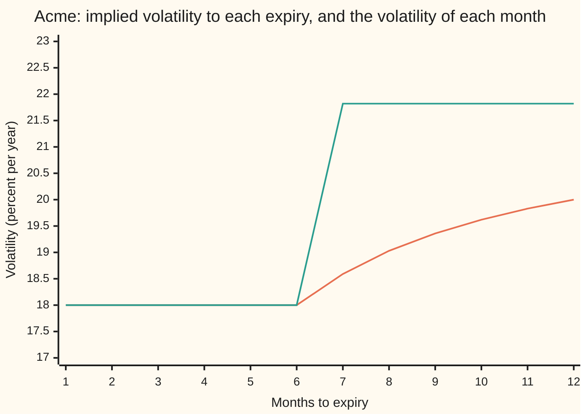

# Term structure and forward volatility: total variance adds, so two expiries imply the vol in between

[Syllabus](../../../SYLLABUS.md) → [Financial mathematics](../../../SYLLABUS.md#w12) → [The smile and the surface](../../../SYLLABUS.md#w12-s12) → Term structure and forward volatility

---

## General Overview

Acme trades at 100 dollars. Its options are quoted by volatility rather than by price: 18 percent for options expiring in six months, 20 percent for those expiring in a year. Each is an implied volatility, the volatility that, put into the Black-Scholes formula, returns the option's market price. On this card each expiry has one volatility, the same at every strike (no smile). The list of quoted volatilities by expiry date is the **term structure** of volatility.

The one-year option covers the first six months as well as the second. So the one-year quote is not a statement about the second half-year alone. It blends both halves, and the six-month quote already prices the first. Subtract what the first half accounts for, and what remains is the market's price for the second half on its own. That number, 21.82 percent here, is the **forward volatility** from six months to one year: the jumpiness the quotes imply for the stretch between the two expiries.

The subtraction only works in the right units. Volatilities do not add; squared volatilities times years do. That quantity is the **total variance**, and it is the one number an implied volatility really quotes. Total variance must never fall as expiry lengthens: a longer option carries every risk the shorter one does, and more. A second sheet, 21 percent at six months and 14 percent at one year, breaks that rule. It has no forward volatility at all, and a trade on it collects 0.33 dollars today against a position that can never owe money later.

**An implied volatility quotes total variance, volatility squared times years; total variances of back-to-back periods add, so the variance between two expiries is the later total minus the earlier, and its square root per year is the forward volatility.**

**What kind of fact this is:** a definition, the forward volatility, whose meaning rests on a theorem proved on this card in Why it works: when volatility changes with the calendar but not at random, the one-year implied variance is exactly the first half's variance plus the second half's.

### The picture: the quote is a running average



The lower line from month seven on is the implied volatility of an option expiring that many months out. The upper line is the volatility the market charges for that month alone: 18 percent for the first six, 21.82 percent after. The quote climbs slowly toward 20 percent because each new month is averaged in with all the months before it, and the averaging is done on squares.

---

## The formula

Notation first, in words. A subscript names the expiry: $T_1$ is the near expiry in years and $T_2$ the far one; $\sigma_1$ and $\sigma_2$ are their implied volatilities. The total variance of an expiry is its volatility squared times its years, written $w$:

$$w_1 = \sigma_1^2\,T_1, \qquad w_2 = \sigma_2^2\,T_2 .$$

The forward volatility $\sigma_f$ between the two expiries is then

$$\sigma_f = \sqrt{\frac{w_2 - w_1}{T_2 - T_1}} .$$

**Read it aloud: the far total variance, minus the near total variance, spread over the years between them; the square root of that rate is the volatility of the gap.**

Existence first, since this is an inverse (from quotes back to the volatility that produced them). The formula has an answer exactly when $w_2 \ge w_1$ and $T_2 > T_1$. The answer is unique, because a volatility is not negative and only one non-negative number squares to a given rate. The boundary case $w_2 = w_1$ gives $\sigma_f = 0$: the market expects Acme to sit still between the expiries. The case $w_2 < w_1$ gives no volatility at all, and the quotes carry an arbitrage (Step 4).

| Symbol | Plain meaning | In our example | Push it up and the answer… |
| --- | --- | --- | --- |
| $T$, $T_1$, $T_2$ | an expiry in years; the near and the far one | 0.5 and 1 | $T_1$ up: $\sigma_f$ rises here, because $\sigma_2 > \sigma_1$ |
| $\sigma_1$, $\sigma_2$ | implied volatility of the near and far option | 18% and 20% | $\sigma_1$ up: $\sigma_f$ falls; $\sigma_2$ up: $\sigma_f$ rises |
| $w$, $w_1$, $w_2$ | **total variance**: volatility squared times years, $w(T) = \sigma^2 T$ | 0.016200 and 0.040000 | $w_2$ up: $\sigma_f$ rises |
| $\sigma_f$ | **forward volatility**: the volatility of the stretch from $T_1$ to $T_2$ | 21.82% | — |
| $\sigma$, $t$ | a volatility in general; $t$ is calendar time in years, and $\sigma(t)$ the volatility in force then | 18% before six months, 21.82% after | — |
| $S$, $S_T$ | Acme's price today, and at time $T$ | 100; unknown | — |
| $K$ | the strike, the price a call lets its owner buy at | 100 | — |
| $r$, $q$ | the riskless rate and the dividend yield, both continuously compounded | 5% and 2% | neither enters $\sigma_f$ |
| $F$ | the forward price $F(T) = S\,e^{(r-q)T}$: a share delivered at $T$, priced today | 101.511306 at half a year, 103.045453 at one | — |
| $C$, $N$ | a call's price; $N$ is the bell-curve area to the left of a point | $C$ = 9.227006 at one year, 20% | — |
| $Z_1$, $Z_2$ | two independent standard bell-curve draws, one for each half-year | — | — |

### When it holds

- **Volatility that changes with the calendar, not at random.** The theorem behind the formula assumes the volatility path $\sigma(t)$ is fixed in advance. If volatility itself moves at random, total variances still add as averages, but the option prices pick up a smile and the forward volatility becomes a forward-start option's price rather than a sure number ([Forward-start options](../17-Averages%2C%20choosers%2C%20compounds%20and%20forward-starts/06-forward-start-options-and-forward-volatility.md)).
- **Both quotes at the same moneyness.** With a smile, each expiry has many volatilities, one per strike ([The volatility smile and skew](01-volatility-smile-and-skew.md)). The subtraction is done at matched moneyness, a strike measured against its own expiry's forward; mixing a 90-strike quote at one date with a 110-strike quote at another subtracts two different things.
- **The same underlying and the same clock.** Both years must be counted the same way. Counting one expiry in calendar days and the other in trading days shifts $w$ by the ratio of the two counts.
- **Tradeable quotes.** The no-arbitrage reading of $w_2 < w_1$ needs both options to trade at the quoted prices, both ways, at once. A stale quote breaks the rule with no trade behind it.

---

## Why it works

### Step 0: independent moves add their variances, not their sizes

Two independent moves in Acme's log price, one in each half-year, add up to the year's move. Their spreads do not add. Their squared spreads do. A coin-flip walk obeys the same rule: its typical distance after many independent unit steps is the square root of the step count, not the count, because the variances add and the distance is their square root. Volatility is a spread per root year, so the additive quantity is volatility squared times years. Everything below is that one fact, applied to option quotes.

### Step 1: an implied volatility quotes a total variance

In Black-Scholes, a call's price depends on volatility and time to expiry through the spread of the log price at expiry, $\sigma\sqrt{T}$, and on the forward and the discount factor. Hold the moneyness fixed and the price is a function of total variance alone: the prerequisite card shows the normalized call rising strictly in $w$ ([Shape across strikes and expiries](../08-The%20Black-Scholes%20call%20and%20put/05-strike-and-calendar-shape.md)). So a quote of 18 percent at half a year is a quote of total variance $0.18^2 \times 0.5 = 0.016200$, and 20 percent at one year is $0.040000$. Implied volatility is total variance restated as a per-year rate: $\sigma = \sqrt{w/T}$.

### Step 2: with a calendar-dependent volatility, total variances add

Suppose Acme's volatility is 18 percent for the first half-year and some $\sigma_f$ for the second, fixed in advance. Over the first half the log price moves by a drift plus $0.18\sqrt{0.5}\,Z_1$; over the second by a drift plus $\sigma_f\sqrt{0.5}\,Z_2$. The draws $Z_1$ and $Z_2$ are independent, because Brownian motion's moves over separate periods are independent ([Geometric Brownian motion](../../11-Stochastic%20processes%20and%20calculus/05-Brownian%20Motion/07-geometric-brownian-motion.md)).

The sum of two independent bell-curve moves is again a bell-curve move, with variance equal to the sum of the two variances. So Acme's log price at one year is bell-shaped with variance

$$0.18^2 \times 0.5 \;+\; \sigma_f^2 \times 0.5 \;=\; w_1 + \sigma_f^2\,(T_2 - T_1).$$

A bell-shaped log price with that spread is exactly what Black-Scholes assumes at one flat volatility $\sigma_2$ with $\sigma_2^2 T_2$ equal to it. So every one-year call, at every strike, carries the Black-Scholes price at that single $\sigma_2$. Set $\sigma_2^2 T_2 = w_2$ and solve:

$$w_2 = w_1 + \sigma_f^2\,(T_2 - T_1) \quad\Longrightarrow\quad \sigma_f = \sqrt{\frac{w_2 - w_1}{T_2 - T_1}} .$$

For Acme, $(0.040000 - 0.016200)/0.5 = 0.047600$, and its square root is 0.218174: 21.82 percent. In general the implied total variance to $T$ is the running total of the calendar volatility's square, $w(T) = \int_0^T \sigma(t)^2\,dt$, and the implied volatility is its root-mean-square average, the curve in the picture.

<details>
<summary>Detailed proof: independent bell curves add variances, and the drift comes out right</summary>

Write $a = 0.18\sqrt{0.5}$ and $b = \sigma_f\sqrt{0.5}$. For a standard bell-curve draw $Z$, the average of $e^{uZ}$ is $e^{u^2/2}$, for every number $u$. Independence lets averages of products split into products of averages, so
$$\text{average of } e^{u(aZ_1 + bZ_2)} \;=\; e^{u^2a^2/2}\,e^{u^2b^2/2} \;=\; e^{u^2(a^2+b^2)/2}.$$
The right side is the same function of $u$ as for a single draw $\sqrt{a^2+b^2}\,Z$. A distribution is pinned down by this function (it is the moment generating function, and bell curves are determined by theirs), so $aZ_1 + bZ_2$ is a bell curve with variance $a^2 + b^2$.

The drift: in the pricing world each half contributes $(r - q)$ times its length minus half its own variance, so the year's drift is $(r-q)T_2 - \tfrac12(a^2 + b^2)$. That is the Black-Scholes drift at total variance $a^2 + b^2$. Log price, spread and drift all match the flat-volatility model at $\sigma_2^2 T_2 = a^2 + b^2$, so the one-year call prices are identical at every strike. Merton made this observation in 1973: a volatility that varies with time but not at random enters Black-Scholes only through its total over the option's life.

</details>

### Step 3: the inverse has one answer, none, or a zero

Solving for $\sigma_f$ asks for a non-negative number whose square is $(w_2 - w_1)/(T_2 - T_1)$. If that rate is positive there is exactly one. If it is zero the answer is zero. If it is negative, no real volatility squares to it. The checks confirm the one-answer case a second way: they price the one-year call in two stages with 18 percent then a trial $\sigma_f$, and bisect (halve a bracket until it closes) on $\sigma_f$ until that price equals the 20 percent Black-Scholes price, 9.23 dollars. The two-stage price rises strictly with $\sigma_f$, so the bracket closes on one number: 0.218174 again.

### Step 4: total variance cannot fall, and when it does there is free money

Inside the model, $w(T)$ is a running total of squares, each at least zero, so it never falls. The model-free version, holding in any market, is the calendar rule proved in [Shape across strikes and expiries](../08-The%20Black-Scholes%20call%20and%20put/05-strike-and-calendar-shape.md): at matched moneyness a longer call, per unit of forward, is never the cheaper one, and in volatility units that says $w_2 \ge w_1$.

The broken sheet, 21 percent at half a year and 14 percent at one, gives these totals:

```
total variance, one bar block = 0.002
house sheet    0.5 year  ████████                 0.016200
house sheet    1 year    ████████████████████     0.040000
broken sheet   0.5 year  ███████████              0.022050
broken sheet   1 year    ██████████               0.019600
```

The broken sheet's total falls from 0.022050 to 0.019600, a rate of −0.004900 per year between the expiries. No volatility squares to a negative number. The two-stage pricer shows the same wall from the price side: with 21 percent for the first half and zero volatility after, the cheapest the one-year 100-strike call can be is 7.28 dollars, and the sheet quotes it at 6.96. No forward volatility, however small, reaches the quote.

The trade is the calendar at matched moneyness from the prerequisite. Sell 0.990050 half-year 100-strike calls at 6.58 dollars, buy one one-year call struck at 101.51 (the same distance from its forward) for 6.19, and 0.33 dollars is collected today. At the half-year the long call is worth at least $e^{-0.02 \times 0.5} = 0.990050$ times what each short call owes, whatever Acme does, so nothing is ever paid back. The checks confirm that floor at every Acme price from 50 to 300.

The other road to forward variance runs through variance swaps, contracts that pay realized variance directly; the difference between two expiries' variance-swap strikes, each weighted by its years, is forward variance bought and sold outright ([Marking a variance swap](../19-Variance%20swaps%2C%20the%20log%20contract%20and%20VIX/04-variance-swap-after-inception-and-forward-variance.md)).

---

## Worked numbers, by hand

The house sheet: Acme at 100, rate 5 percent, dividend yield 2 percent, 18 percent at half a year, 20 percent at one year.

| Step | Arithmetic | Value |
| --- | --- | --- |
| near total variance $w_1$ | $0.18^2 \times 0.5 = 0.0324 \times 0.5$ | 0.016200 |
| far total variance $w_2$ | $0.20^2 \times 1$ | 0.040000 |
| variance in between | $0.040000 - 0.016200$ | 0.023800 |
| per year in between | $0.023800 / (1 - 0.5)$ | 0.047600 |
| **forward volatility** $\sigma_f$ | $\sqrt{0.047600}$ | **0.218174, or 21.82%** |
| check: rebuild $w_2$ | $0.016200 + 0.218174^2 \times 0.5$ | 0.040000 |
| half-year call at 18% | Black-Scholes | 5.757930 |
| one-year call at 20% | Black-Scholes | 9.227006 |
| calendar cushion at matched strike 101.511306 | far call − 0.990050 × near call | 2.800455 |

The cushion is positive, as the calendar rule requires: the house sheet leaves no free trade.

The market charges 21.82 percent for Acme's second half-year: more than either quoted number, because the second half has to lift a year's average from 18 to 20 percent on its own.

### What breaks if you drop a piece

| Mistake | Comes out at | What went wrong |
| --- | --- | --- |
| Average the vols in a straight line: $(0.20 \times 1 - 0.18 \times 0.5)/0.5$ | 22.00% | Volatilities do not add; squared volatilities times years do. |
| Divide by $T_2$ instead of $T_2 - T_1$ | 15.43% | The variance in between belongs to the half-year between, not the whole year. |
| Subtract squared vols without the years: $\sqrt{(0.20^2 - 0.18^2)/0.5}$ | 12.33% | Each squared vol must be weighted by its own expiry before subtracting. |

All three numbers are printed by the checks below.

---

## Code, from first principles, and it actually runs

The forward volatility is reached four ways. Road one is the formula. Road two prices the one-year call in two stages, a half-year of 18 percent and then a trial forward volatility, by Simpson's rule (a weighted sum over thin slices under the bell curve); it never adds a variance, and bisection finds the forward volatility that matches the 20 percent price. Road three feeds the formula's answer into the two-stage pricer at strikes 90, 100 and 110 and backs out each price's implied volatility: all three must come to 20 percent, since a fixed volatility path leaves no smile. Road four simulates 10,000 paths of 52 weekly moves with a hand-written random number generator and measures the variances directly. Then the broken sheet is shown to have no forward volatility, by the formula and by the two-stage floor, and the calendar trade's cash is computed.

### Python

```python
# Term structure and forward volatility -- the check behind the card.  Standard library only,
# and nothing imported knows an option price: the bell-curve area comes from math.erf, the
# integral is Simpson's rule, the root finder is bisection and the random numbers come from a
# SplitMix64 generator, all written out below.
from math import log, sqrt, exp, erf, pi, cos
S, K, R, Q = 100.0, 100.0, 0.05, 0.02         # Acme spot, strike, riskless rate, dividend yield
T1, T2 = 0.5, 1.0                              # near and far expiry, in years

def N(x):   return 0.5 * (1.0 + erf(x / sqrt(2.0)))      # bell-curve area left of x
def phi(x): return exp(-0.5 * x * x) / sqrt(2.0 * pi)    # bell-curve height at x
def call(s, k, t, sig):                        # Black-Scholes call at one flat volatility
    if sig <= 0.0: return max(s * exp(-Q * t) - k * exp(-R * t), 0.0)
    d1 = (log(s / k) + (R - Q + 0.5 * sig * sig) * t) / (sig * sqrt(t))
    return s * exp(-Q * t) * N(d1) - k * exp(-R * t) * N(d1 - sig * sqrt(t))
def simpson(f, a, b, n):
    h, s = (b - a) / n, f(a) + f(b)
    for i in range(1, n):
        s += (4.0 if i % 2 else 2.0) * f(a + i * h)
    return s * h / 3.0
def bisect(f, lo, hi, steps=60):               # needs f(lo) < 0 < f(hi); halves the bracket
    for _ in range(steps):
        mid = 0.5 * (lo + hi)
        if f(mid) < 0.0: lo = mid
        else: hi = mid
    return 0.5 * (lo + hi)
def fwd_vol(s1, t1, s2, t2):                   # road 1: the formula; None when there is no answer
    w1, w2 = s1 * s1 * t1, s2 * s2 * t2
    return sqrt((w2 - w1) / (t2 - t1)) if w2 >= w1 else None
def two_stage(k, s1, sf):                      # road 2: price the far call in two stages
    # At T1 the far call is a (T2 - T1)-year call at the forward vol sf.  Average that over
    # where Acme lands at T1 under s1, then discount.  No variances are added anywhere.
    def f(z):
        s_mid = S * exp((R - Q - 0.5 * s1 * s1) * T1 + s1 * sqrt(T1) * z)
        return call(s_mid, k, T2 - T1, sf) * phi(z)
    return exp(-R * T1) * simpson(f, -10.0, 10.0, 800)
def implied(price, k, t): return bisect(lambda v: call(S, k, t, v) - price, 1e-9, 2.0)

MASK, state = (1 << 64) - 1, 20260919
def u01():                                     # SplitMix64, mapped into (0, 1)
    global state
    state = (state + 0x9E3779B97F4A7C15) & MASK
    z = ((state ^ (state >> 30)) * 0xBF58476D1CE4E5B9) & MASK
    z = ((z ^ (z >> 27)) * 0x94D049BB133111EB) & MASK
    return (((z ^ (z >> 31)) >> 11) + 0.5) / 9007199254740992.0
def gauss(): return sqrt(-2.0 * log(u01())) * cos(2.0 * pi * u01())   # Box-Muller

def row(label, v): print(f"{label:<46} {v:>12.6f}")
s1, s2 = 0.18, 0.20
w1, w2 = s1 * s1 * T1, s2 * s2 * T2
sf = fwd_vol(s1, T1, s2, T2)
c_far = call(S, K, T2, s2)
sf_road2 = bisect(lambda v: two_stage(K, s1, v) - c_far, 0.0, 1.0)
print("house sheet: 18% at half a year, 20% at one year")
row("total variance w1 = 0.18^2 x 0.5", w1); row("total variance w2 = 0.20^2 x 1", w2)
row("variance added in between, w2 - w1", w2 - w1)
row("per year in between, (w2 - w1)/(T2 - T1)", (w2 - w1) / (T2 - T1))
row("1 forward vol, formula", sf); row("2 forward vol, two-stage price + bisection", sf_road2)
row("  one-year call at 20%", c_far); row("  half-year call at 18%", call(S, K, T1, s1))
iv = {k: implied(two_stage(k, s1, sf), k, T2) for k in (90.0, 100.0, 110.0)}
for k in iv: row(f"3 implied vol of the two-stage price, K {k:.0f}", iv[k])
paths, weeks = 10000, 26
dt = T1 / weeks
a_s, b_s = [], []
for _ in range(paths):
    a_s.append(sum(s1 * sqrt(dt) * gauss() for _ in range(weeks)))
    b_s.append(sum(sf * sqrt(dt) * gauss() for _ in range(weeks)))
def var(xs): m = sum(xs) / len(xs); return sum((x - m) ** 2 for x in xs) / (len(xs) - 1)
v_a, v_b = var(a_s), var(b_s)
v_ab = var([a + b for a, b in zip(a_s, b_s)])
print("4 simulated log moves, 10000 paths x 52 weeks")
for lab, v in (("first half", v_a), ("second half", v_b), ("whole year", v_ab), ("twice the covariance", v_ab - v_a - v_b)):
    print(f"  {'variance, ' + lab if lab[0] != 't' else lab:<44} {v:>12.4f}")
F1, F2, cover = S * exp((R - Q) * T1), S * exp((R - Q) * T2), exp(-Q * (T2 - T1))
k_match = K * F2 / F1
row("forward F(T1)", F1); row("forward F(T2)", F2)
row("matched far strike, K x F(T2)/F(T1)", k_match); row("cover weight e^-q(T2-T1)", cover)
row("calendar cushion, far call - cover x near", call(S, k_match, T2, s2) - cover * call(S, K, T1, s1))
row("wrong: vols averaged in a straight line", (s2 * T2 - s1 * T1) / (T2 - T1))
row("wrong: divided by T2, not T2 - T1", sqrt((w2 - w1) / T2))
row("wrong: squared vols subtracted, no T weights", sqrt((s2 * s2 - s1 * s1) / (T2 - T1)))
b1, b2 = 0.21, 0.14
bw1, bw2 = b1 * b1 * T1, b2 * b2 * T2
print("broken sheet: 21% at half a year, 14% at one year")
row("total variance w1 = 0.21^2 x 0.5", bw1); row("total variance w2 = 0.14^2 x 1", bw2)
row("per year in between, (w2 - w1)/(T2 - T1)", (bw2 - bw1) / (T2 - T1))
print(f"  {'1 forward vol, formula':<44} {'none' if fwd_vol(b1, T1, b2, T2) is None else 'found':>12}")
floor = two_stage(K, b1, 0.0)
row("2 cheapest two-stage far call, forward vol 0", floor); row("  quoted one-year call at 14%", call(S, K, T2, b2))
near_b, far_b = call(S, K, T1, b1), call(S, k_match, T2, b2)
row("  half-year call at 21%, K 100", near_b); row("  one-year call at 14%, matched strike", far_b)
row("  cash collected, cover x near - far", cover * near_b - far_b)
print("chart: months to expiry, implied vol %, instantaneous vol %")
months = list(range(1, 13))
imp = [100 * sqrt((min(m / 12, T1) * s1 * s1 + max(m / 12 - T1, 0.0) * sf * sf) / (m / 12)) for m in months]
print(" ".join(f"{m:>6d}" for m in months)); print(" ".join(f"{v:>6.2f}" for v in imp))
print(" ".join(f"{100 * (s1 if m <= 6 else sf):>6.2f}" for m in months))
for lab, t2v in (("try: 18% flat", 0.18), ("try: 25% at one year", 0.25), ("try: 12.7279% at one year", 0.127279220614)):
    row(lab + ", forward vol", fwd_vol(s1, T1, t2v, T2))
row("falling vols: 25% then 20%, w1", 0.25 * 0.25 * T1); row("  forward vol", fwd_vol(0.25, T1, 0.20, T2))
assert abs(sf_road2 - sf) < 1e-8, "two-stage bisection must land on the formula"
assert max(abs(v - s2) for v in iv.values()) < 1e-7, "a deterministic vol path leaves no smile"
assert abs(v_ab - w2) < 0.002, "simulated whole-year variance vs 0.20^2 x 1"
assert abs(v_b - (w2 - w1)) < 0.0015, "simulated second-half variance vs w2 - w1"
assert floor > call(S, K, T2, b2), "broken sheet: quoted far call under the cheapest reachable"
assert cover * near_b - far_b > 0.0, "broken sheet: the calendar collects cash"
assert all(call(x, k_match, T2 - T1, b2) >= cover * max(x - K, 0.0) - 1e-9 for x in range(50, 301, 5)), "at T1 the long far call covers the short near calls"
print("ALL CHECKS PASS")
```

**Ran 2026-09-19 on macOS, Python 3.14.6, standard library only. All checks passed. Output, pasted from the run:**

```
house sheet: 18% at half a year, 20% at one year
total variance w1 = 0.18^2 x 0.5                   0.016200
total variance w2 = 0.20^2 x 1                     0.040000
variance added in between, w2 - w1                 0.023800
per year in between, (w2 - w1)/(T2 - T1)           0.047600
1 forward vol, formula                             0.218174
2 forward vol, two-stage price + bisection         0.218174
  one-year call at 20%                             9.227006
  half-year call at 18%                            5.757930
3 implied vol of the two-stage price, K 90         0.200000
3 implied vol of the two-stage price, K 100        0.200000
3 implied vol of the two-stage price, K 110        0.200000
4 simulated log moves, 10000 paths x 52 weeks
  variance, first half                               0.0165
  variance, second half                              0.0240
  variance, whole year                               0.0405
  twice the covariance                              -0.0001
forward F(T1)                                    101.511306
forward F(T2)                                    103.045453
matched far strike, K x F(T2)/F(T1)              101.511306
cover weight e^-q(T2-T1)                           0.990050
calendar cushion, far call - cover x near          2.800455
wrong: vols averaged in a straight line            0.220000
wrong: divided by T2, not T2 - T1                  0.154272
wrong: squared vols subtracted, no T weights       0.123288
broken sheet: 21% at half a year, 14% at one year
total variance w1 = 0.21^2 x 0.5                   0.022050
total variance w2 = 0.14^2 x 1                     0.019600
per year in between, (w2 - w1)/(T2 - T1)          -0.004900
  1 forward vol, formula                               none
2 cheapest two-stage far call, forward vol 0       7.279773
  quoted one-year call at 14%                      6.960809
  half-year call at 21%, K 100                     6.582632
  one-year call at 14%, matched strike             6.190155
  cash collected, cover x near - far               0.326978
chart: months to expiry, implied vol %, instantaneous vol %
     1      2      3      4      5      6      7      8      9     10     11     12
 18.00  18.00  18.00  18.00  18.00  18.00  18.59  19.03  19.36  19.62  19.83  20.00
 18.00  18.00  18.00  18.00  18.00  18.00  21.82  21.82  21.82  21.82  21.82  21.82
try: 18% flat, forward vol                         0.180000
try: 25% at one year, forward vol                  0.304302
try: 12.7279% at one year, forward vol             0.000000
falling vols: 25% then 20%, w1                     0.031250
  forward vol                                      0.132288
ALL CHECKS PASS
```

The simulated variances sit within sampling error of the exact ones: 0.0165 against 0.016200, 0.0240 against 0.023800, 0.0405 against 0.040000, and twice the covariance between the halves, −0.0001, is noise around zero. The asserts allow 0.002 on the whole year and 0.0015 on the second half.

### Rust

Same checks, same labels. Rust has no `erf`, so the bell-curve area is built by Simpson's rule, and the random numbers come from the same SplitMix64 recipe.

```rust
// Term structure and forward volatility -- the same check as the Python, in Rust.  Standard
// library only, no crates.  Rust has no erf, so the bell-curve area N(x) is built by adding
// up thin slices under the curve (Simpson); the root finder is bisection and the random
// numbers come from a SplitMix64 generator, all written out below.
use std::f64::consts::PI;
const S: f64 = 100.0; const K: f64 = 100.0; const R: f64 = 0.05; const Q: f64 = 0.02;
const T1: f64 = 0.5; const T2: f64 = 1.0;

fn phi(x: f64) -> f64 { (-0.5 * x * x).exp() / (2.0 * PI).sqrt() }
fn simpson<F: Fn(f64) -> f64>(f: F, a: f64, b: f64, n: usize) -> f64 {
    let h = (b - a) / n as f64;
    let mut s = f(a) + f(b);
    for i in 1..n { s += if i % 2 == 1 { 4.0 } else { 2.0 } * f(a + i as f64 * h); }
    s * h / 3.0
}
fn n_cdf(x: f64) -> f64 {
    if x < -12.0 { return 0.0; }
    if x > 12.0 { return 1.0; }
    0.5 + simpson(phi, 0.0, x, 2000)
}
fn call(s: f64, k: f64, t: f64, sig: f64) -> f64 {           // Black-Scholes call, one flat vol
    if sig <= 0.0 { return (s * (-Q * t).exp() - k * (-R * t).exp()).max(0.0); }
    let d1 = ((s / k).ln() + (R - Q + 0.5 * sig * sig) * t) / (sig * t.sqrt());
    s * (-Q * t).exp() * n_cdf(d1) - k * (-R * t).exp() * n_cdf(d1 - sig * t.sqrt())
}
fn bisect<F: Fn(f64) -> f64>(f: F, mut lo: f64, mut hi: f64) -> f64 {   // f(lo) < 0 < f(hi)
    for _ in 0..60 {
        let mid = 0.5 * (lo + hi);
        if f(mid) < 0.0 { lo = mid } else { hi = mid }
    }
    0.5 * (lo + hi)
}
fn fwd_vol(s1: f64, t1: f64, s2: f64, t2: f64) -> Option<f64> {        // road 1: the formula
    let (w1, w2) = (s1 * s1 * t1, s2 * s2 * t2);
    if w2 >= w1 { Some(((w2 - w1) / (t2 - t1)).sqrt()) } else { None }
}
fn two_stage(k: f64, s1: f64, sf: f64) -> f64 {              // road 2: the far call in two stages
    let f = |z: f64| {
        let s_mid = S * ((R - Q - 0.5 * s1 * s1) * T1 + s1 * T1.sqrt() * z).exp();
        call(s_mid, k, T2 - T1, sf) * phi(z)
    };
    (-R * T1).exp() * simpson(f, -10.0, 10.0, 800)
}
fn implied(price: f64, k: f64, t: f64) -> f64 { bisect(|v| call(S, k, t, v) - price, 1e-9, 2.0) }

struct Rng(u64);
impl Rng {
    fn u01(&mut self) -> f64 {                                 // SplitMix64, mapped into (0, 1)
        self.0 = self.0.wrapping_add(0x9E3779B97F4A7C15);
        let mut z = (self.0 ^ (self.0 >> 30)).wrapping_mul(0xBF58476D1CE4E5B9);
        z = (z ^ (z >> 27)).wrapping_mul(0x94D049BB133111EB);
        (((z ^ (z >> 31)) >> 11) as f64 + 0.5) / 9007199254740992.0
    }
    fn gauss(&mut self) -> f64 { let u = self.u01(); (-2.0 * u.ln()).sqrt() * (2.0 * PI * self.u01()).cos() }
}
fn var(xs: &[f64]) -> f64 {
    let m = xs.iter().sum::<f64>() / xs.len() as f64;
    xs.iter().map(|x| (x - m) * (x - m)).sum::<f64>() / (xs.len() - 1) as f64
}
fn row(label: &str, v: f64) { println!("{:<46} {:>12.6}", label, v); }

fn main() {
    let (s1, s2) = (0.18_f64, 0.20_f64);
    let (w1, w2) = (s1 * s1 * T1, s2 * s2 * T2);
    let sf = fwd_vol(s1, T1, s2, T2).unwrap();
    let c_far = call(S, K, T2, s2);
    let sf_road2 = bisect(|v| two_stage(K, s1, v) - c_far, 0.0, 1.0);
    println!("house sheet: 18% at half a year, 20% at one year");
    row("total variance w1 = 0.18^2 x 0.5", w1); row("total variance w2 = 0.20^2 x 1", w2);
    row("variance added in between, w2 - w1", w2 - w1);
    row("per year in between, (w2 - w1)/(T2 - T1)", (w2 - w1) / (T2 - T1));
    row("1 forward vol, formula", sf); row("2 forward vol, two-stage price + bisection", sf_road2);
    row("  one-year call at 20%", c_far); row("  half-year call at 18%", call(S, K, T1, s1));
    let mut iv = Vec::new();
    for k in [90.0_f64, 100.0, 110.0] {
        let v = implied(two_stage(k, s1, sf), k, T2);
        row(&format!("3 implied vol of the two-stage price, K {:.0}", k), v);
        iv.push(v);
    }
    let (paths, weeks) = (10000, 26);
    let dt = T1 / weeks as f64;
    let mut rng = Rng(20260919);
    let (mut a_s, mut b_s) = (Vec::new(), Vec::new());
    for _ in 0..paths {
        a_s.push((0..weeks).map(|_| s1 * dt.sqrt() * rng.gauss()).sum::<f64>());
        b_s.push((0..weeks).map(|_| sf * dt.sqrt() * rng.gauss()).sum::<f64>());
    }
    let (v_a, v_b) = (var(&a_s), var(&b_s));
    let ab: Vec<f64> = a_s.iter().zip(&b_s).map(|(a, b)| a + b).collect();
    let v_ab = var(&ab);
    println!("4 simulated log moves, 10000 paths x 52 weeks");
    for (lab, v) in [("variance, first half", v_a), ("variance, second half", v_b),
                     ("variance, whole year", v_ab), ("twice the covariance", v_ab - v_a - v_b)] {
        println!("  {:<44} {:>12.4}", lab, v);
    }
    let (f1, f2, cover) = (S * ((R - Q) * T1).exp(), S * ((R - Q) * T2).exp(), (-Q * (T2 - T1)).exp());
    let k_match = K * f2 / f1;
    row("forward F(T1)", f1); row("forward F(T2)", f2);
    row("matched far strike, K x F(T2)/F(T1)", k_match); row("cover weight e^-q(T2-T1)", cover);
    row("calendar cushion, far call - cover x near", call(S, k_match, T2, s2) - cover * call(S, K, T1, s1));
    row("wrong: vols averaged in a straight line", (s2 * T2 - s1 * T1) / (T2 - T1));
    row("wrong: divided by T2, not T2 - T1", ((w2 - w1) / T2).sqrt());
    row("wrong: squared vols subtracted, no T weights", ((s2 * s2 - s1 * s1) / (T2 - T1)).sqrt());
    let (b1, b2) = (0.21_f64, 0.14_f64);
    let (bw1, bw2) = (b1 * b1 * T1, b2 * b2 * T2);
    println!("broken sheet: 21% at half a year, 14% at one year");
    row("total variance w1 = 0.21^2 x 0.5", bw1); row("total variance w2 = 0.14^2 x 1", bw2);
    row("per year in between, (w2 - w1)/(T2 - T1)", (bw2 - bw1) / (T2 - T1));
    println!("  {:<44} {:>12}", "1 forward vol, formula", if fwd_vol(b1, T1, b2, T2).is_none() { "none" } else { "found" });
    let floor = two_stage(K, b1, 0.0);
    row("2 cheapest two-stage far call, forward vol 0", floor); row("  quoted one-year call at 14%", call(S, K, T2, b2));
    let (near_b, far_b) = (call(S, K, T1, b1), call(S, k_match, T2, b2));
    row("  half-year call at 21%, K 100", near_b); row("  one-year call at 14%, matched strike", far_b);
    row("  cash collected, cover x near - far", cover * near_b - far_b);
    println!("chart: months to expiry, implied vol %, instantaneous vol %");
    let months: Vec<u32> = (1..=12).collect();
    let imp: Vec<String> = months.iter().map(|&m| {
        let t = m as f64 / 12.0;
        format!("{:>6.2}", 100.0 * ((t.min(T1) * s1 * s1 + (t - T1).max(0.0) * sf * sf) / t).sqrt())
    }).collect();
    let inst: Vec<String> = months.iter().map(|&m| format!("{:>6.2}", 100.0 * if m <= 6 { s1 } else { sf })).collect();
    println!("{}", months.iter().map(|m| format!("{:>6}", m)).collect::<Vec<_>>().join(" "));
    println!("{}", imp.join(" ")); println!("{}", inst.join(" "));
    for (lab, t2v) in [("try: 18% flat", 0.18), ("try: 25% at one year", 0.25), ("try: 12.7279% at one year", 0.127279220614)] {
        row(&format!("{}, forward vol", lab), fwd_vol(s1, T1, t2v, T2).unwrap());
    }
    row("falling vols: 25% then 20%, w1", 0.25 * 0.25 * T1); row("  forward vol", fwd_vol(0.25, T1, 0.20, T2).unwrap());
    assert!((sf_road2 - sf).abs() < 1e-8, "two-stage bisection must land on the formula");
    assert!(iv.iter().all(|v| (v - s2).abs() < 1e-7), "a deterministic vol path leaves no smile");
    assert!((v_ab - w2).abs() < 0.002, "simulated whole-year variance vs 0.20^2 x 1");
    assert!((v_b - (w2 - w1)).abs() < 0.0015, "simulated second-half variance vs w2 - w1");
    assert!(floor > call(S, K, T2, b2), "broken sheet: quoted far call under the cheapest reachable");
    assert!(cover * near_b - far_b > 0.0, "broken sheet: the calendar collects cash");
    assert!((50..=300).step_by(5).all(|x| { let x = x as f64; call(x, k_match, T2 - T1, b2) >= cover * (x - K).max(0.0) - 1e-9 }), "at T1 the long far call covers the short near calls");
    println!("ALL CHECKS PASS");
}
```

**Ran 2026-09-19 on macOS, rustc 1.98.1, no crates. All checks passed. Output, pasted from the run:**

```
house sheet: 18% at half a year, 20% at one year
total variance w1 = 0.18^2 x 0.5                   0.016200
total variance w2 = 0.20^2 x 1                     0.040000
variance added in between, w2 - w1                 0.023800
per year in between, (w2 - w1)/(T2 - T1)           0.047600
1 forward vol, formula                             0.218174
2 forward vol, two-stage price + bisection         0.218174
  one-year call at 20%                             9.227006
  half-year call at 18%                            5.757930
3 implied vol of the two-stage price, K 90         0.200000
3 implied vol of the two-stage price, K 100        0.200000
3 implied vol of the two-stage price, K 110        0.200000
4 simulated log moves, 10000 paths x 52 weeks
  variance, first half                               0.0165
  variance, second half                              0.0240
  variance, whole year                               0.0405
  twice the covariance                              -0.0001
forward F(T1)                                    101.511306
forward F(T2)                                    103.045453
matched far strike, K x F(T2)/F(T1)              101.511306
cover weight e^-q(T2-T1)                           0.990050
calendar cushion, far call - cover x near          2.800455
wrong: vols averaged in a straight line            0.220000
wrong: divided by T2, not T2 - T1                  0.154272
wrong: squared vols subtracted, no T weights       0.123288
broken sheet: 21% at half a year, 14% at one year
total variance w1 = 0.21^2 x 0.5                   0.022050
total variance w2 = 0.14^2 x 1                     0.019600
per year in between, (w2 - w1)/(T2 - T1)          -0.004900
  1 forward vol, formula                               none
2 cheapest two-stage far call, forward vol 0       7.279773
  quoted one-year call at 14%                      6.960809
  half-year call at 21%, K 100                     6.582632
  one-year call at 14%, matched strike             6.190155
  cash collected, cover x near - far               0.326978
chart: months to expiry, implied vol %, instantaneous vol %
     1      2      3      4      5      6      7      8      9     10     11     12
 18.00  18.00  18.00  18.00  18.00  18.00  18.59  19.03  19.36  19.62  19.83  20.00
 18.00  18.00  18.00  18.00  18.00  18.00  21.82  21.82  21.82  21.82  21.82  21.82
try: 18% flat, forward vol                         0.180000
try: 25% at one year, forward vol                  0.304302
try: 12.7279% at one year, forward vol             0.000000
falling vols: 25% then 20%, w1                     0.031250
  forward vol                                      0.132288
ALL CHECKS PASS
```

The two outputs agree line for line, including the simulation, which runs the same generator in the same order.

> [!TIP]
> **Try changing**
> Guess first, then run it.
> - **A flat sheet.** Set the one-year volatility to 18 percent. The forward volatility is **18 percent**: with nothing new priced after six months, the gap looks like the start.
> - **A steep sheet.** Set the one-year volatility to 25 percent. The forward volatility is **30.43 percent**: a modest rise in the quote needs a large one in the gap.
> - **The boundary.** Set the one-year volatility to 12.7279 percent, which is $0.18\sqrt{0.5}$. Total variance is flat at 0.016200 and the forward volatility is **0**. Any lower and the formula returns none.
> - **A thinner simulation.** Set `paths` to 500. The simulated variances wander much further from the exact ones, and one of the two simulation asserts may stop the run.

---

## The usual mistake

> [!warning]
> **Subtracting volatilities instead of variances.** A rise from 18 to 20 percent does not mean the second half-year is priced at 22 percent. Volatility is a spread, and spreads of independent moves combine by their squares. The straight-line answer, 22.00 percent, overshoots the true 21.82 percent here, and the gap widens on steeper sheets.
>
> - **Reading a falling volatility term structure as an arbitrage.** Volatility may fall with expiry; only total variance may not. A sheet with 25 percent at six months and 20 at one year has $w_1 = 0.031250$ and $w_2 = 0.040000$: fine, with a forward volatility of 13.23 percent.
> - **Dividing by the wrong years.** The gap's variance is spread over $T_2 - T_1$, not over $T_2$; dividing by the whole year gives 15.43 percent.
> - **Mixing strikes across expiries.** With a smile, subtract at matched moneyness. The at-the-money-forward strike moves with the forward, 101.51 at half a year against 103.05 at one year here.
> - **Treating the forward volatility as a forecast.** It is a price implied by two quotes. Realized volatility over the gap can come in anywhere; the forward volatility is what a trader can lock in today.

---

## Where you meet it in real life

- **Forward-start options.** An option whose strike is set at a future date, at whatever the price is then, is priced by the forward volatility between its start and its expiry ([Forward-start options](../17-Averages%2C%20choosers%2C%20compounds%20and%20forward-starts/06-forward-start-options-and-forward-volatility.md)).
- **Earnings and event days.** A known announcement adds a lump of variance to every expiry after it. Subtracting the total variance of the expiry just before from the one just after isolates the market's price for the event.
- **Variance swaps and VIX.** Forward variance between two dates is traded directly as the difference of two variance swaps ([Marking a variance swap](../19-Variance%20swaps%2C%20the%20log%20contract%20and%20VIX/04-variance-swap-after-inception-and-forward-variance.md)); VIX itself is a 30-day implied volatility read off this term structure, interpolated in total variance.
- **Surface cleaning.** Before a desk interpolates between quoted expiries, it checks that total variance never falls at any moneyness ([The volatility surface](03-volatility-surface-and-its-arbitrage-rules.md)); interpolation is done in total variance, not in volatility, so the check survives it.
- **Reading the slope.** A rising term structure, as here, is usual in calm markets. In a sell-off short-dated volatility jumps above long-dated, and the structure inverts.
- **Roll-down.** If the forward volatility does not change, in six months the half-year option will be quoted at 21.82 percent. Traders compare that with their own view of the coming half-year.

> **Say it back**
> An implied volatility is a total variance, volatility squared times years, restated per year. Back-to-back periods add their total variances, because independent moves add their squared spreads. So the variance between two expiries is the later total minus the earlier, and its square root per year is the forward volatility: 21.82 percent between Acme's 18 percent half-year and 20 percent year. Total variance can never fall with expiry; a sheet where it does has no forward volatility and pays a calendar trade for nothing.

---

## What this builds on

- [The volatility smile and skew](01-volatility-smile-and-skew.md): implied volatility across strikes, and why the subtraction here is done at matched moneyness.
- [Shape across strikes and expiries](../08-The%20Black-Scholes%20call%20and%20put/05-strike-and-calendar-shape.md): the model-free calendar rule, the matched-strike trade, and the normalized call rising in total variance.

## Where this goes next

- [The volatility surface](03-volatility-surface-and-its-arbitrage-rules.md): strikes and expiries together, with the calendar rule and the smile rules applied across the whole grid.
- [Forward-start options](../17-Averages%2C%20choosers%2C%20compounds%20and%20forward-starts/06-forward-start-options-and-forward-volatility.md): the contract that pays on this card's number, and what changes when volatility itself is random.
- [Marking a variance swap](../19-Variance%20swaps%2C%20the%20log%20contract%20and%20VIX/04-variance-swap-after-inception-and-forward-variance.md): forward variance traded outright, with no option model in between.

This card subtracts two expiries at one moneyness; what remains open is how a whole grid of strikes and expiries must fit together at once, which the surface card answers.

---

## Sources

Verified 19 Sep 2026: every link below resolves to the publisher's page.

- Merton, Robert C. "Theory of Rational Option Pricing." *The Bell Journal of Economics and Management Science* 4, no. 1 (1973): 141–183. [doi:10.2307/3003143](https://doi.org/10.2307/3003143). Shows that a volatility varying with time but not at random enters the option price only through its total over the option's life.
- Gatheral, Jim. *The Volatility Surface: A Practitioner's Guide*. Wiley, 2006. [Publisher page](https://www.wiley.com/en-us/The+Volatility+Surface%3A+A+Practitioner%27s+Guide-p-9780471792512). Implied variance as the average of forward variance, and the term structure read in total variance.
- Gatheral, Jim, and Antoine Jacquier. "Arbitrage-free SVI volatility surfaces." *Quantitative Finance* 14, no. 1 (2014): 59–71. [doi:10.1080/14697688.2013.819986](https://doi.org/10.1080/14697688.2013.819986). The calendar rule stated as total variance non-decreasing in expiry at fixed moneyness.
- Hull, John C. *Options, Futures, and Other Derivatives*, 11th ed. Pearson. [Publisher page](https://www.pearson.com/en-us/subject-catalog/p/options-futures-and-other-derivatives/P200000005938). The textbook treatment of the volatility term structure and volatility surfaces.
