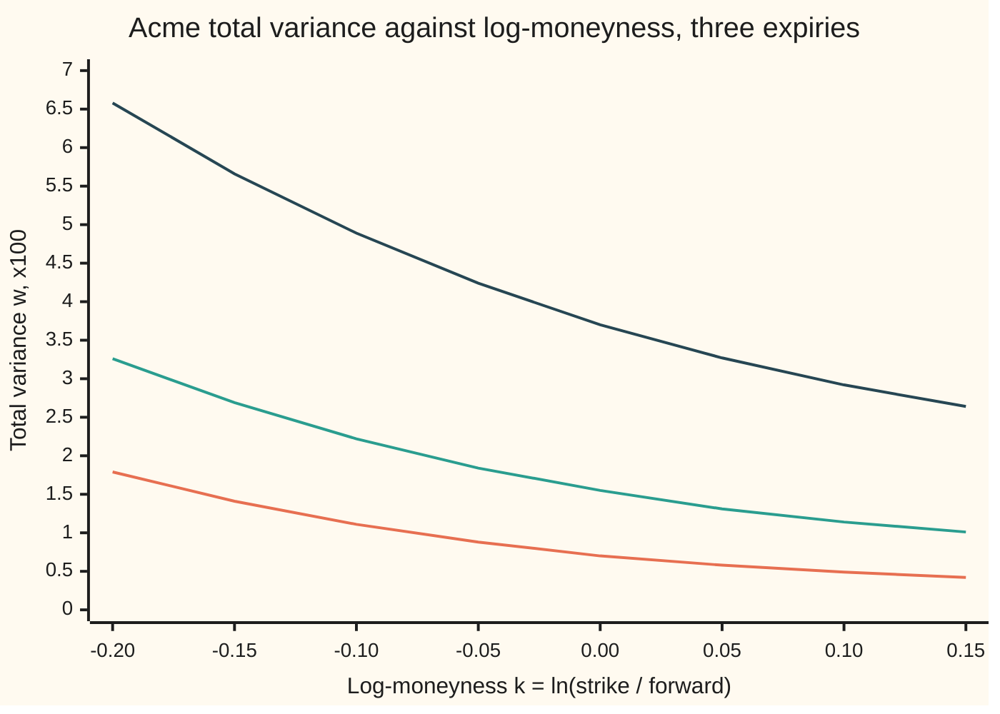
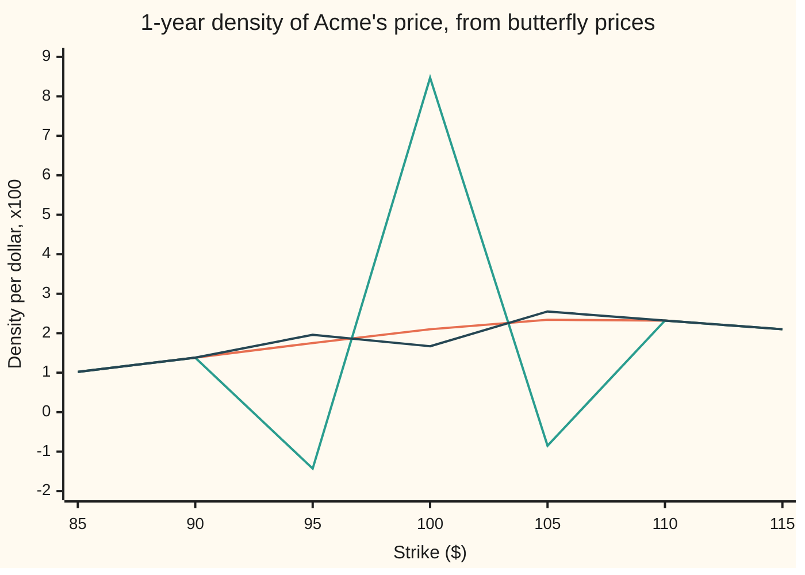
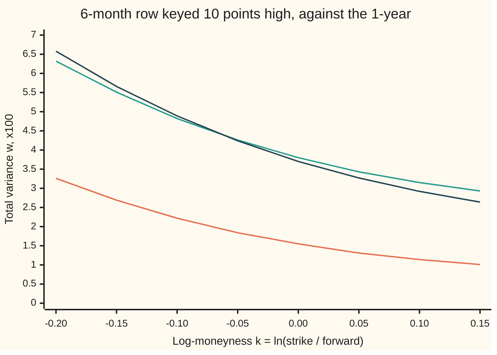

# The volatility surface: a grid of vols in strike and expiry, and the two tests that keep it honest

[Syllabus](../../../SYLLABUS.md) → [Financial mathematics](../README.md) → [The smile and the surface](../README.md#s12) → The volatility surface

---

## General Overview

At the close, an options desk holds 27 prices on Acme, the house stock at $100. There are three expiries, 3 months, 6 months and 1 year, and nine strikes, $80 to $120 in steps of $5. Each price is quoted as an implied volatility: the one volatility that makes the Black-Scholes formula ([Black–Scholes call](../08-The%20Black-Scholes%20call%20and%20put/01-black-scholes-call.md)) return that price. The 1-year $100 call is quoted at 20%, which is the house call at $9.23.

Laid out with strike across and expiry down, the 27 numbers look like a relief map: high ground at low strikes, where options that pay in a crash are dear. A trader fills in the ground between the quotes and prices everything else from it. From here on the filled-in map is called by its real name, the **volatility surface**.

A surface can be wrong in a way that costs money. One mistyped quote can give a combination of options that never pays less than zero a negative price: a buyer is paid to take it. Two tests catch such faults. The **butterfly test** runs across strikes at one expiry. The **calendar test** runs across expiries at one strike, measured relative to the forward price. This card builds the Acme surface, plants one fault for each test, and repairs the first.

**A volatility surface is honest when, at every expiry, the prices it implies bend upward in strike (no negative butterfly), and, at every forward-relative strike, the total variance it implies never falls as expiry lengthens (no negative calendar spread).**

**What kind of fact this is:** a method (assemble, interpolate, test, repair), resting on two theorems proved on this card in Why it works.

### The picture: the Acme surface in its working coordinates

The surface is easiest to read in two new coordinates, defined properly in The formula. Across: **log-moneyness**, how far a strike sits from the forward price, as a log. Up: **total variance**, volatility squared times years, scaled by 100. One line per expiry.



Bottom line (orange): 3 months. Middle line (green): 6 months. Top line (dark blue): 1 year. The calendar test asks that the lines never cross. The butterfly test asks, roughly, that each line bend upward and not climb too steeply; the exact condition is in Why it works.

---

## The formula

Write $C(K,T)$ for the price of a call with strike $K$ and $T$ years to expiry, $r = 5\%$ for the riskless rate, and $F_T = 100\,e^{(r-q)T}$ for the forward price, the price agreed today for Acme delivered at $T$ ($q = 2\%$ is the dividend yield). Two coordinates first, in words. **Log-moneyness** $k$ is the log of strike over forward price. **Total variance** $w$ is implied volatility squared times years to expiry.

$$k = \ln\frac{K}{F_T}, \qquad w(k, T) = \sigma(k, T)^2\, T$$

**Read it aloud:** measure each strike against the forward price on a log scale, and measure each volatility as the variance it piles up by expiry.

The two tests, with $h$ the strike step ($5 here):

$$C(K-h,\,T) \;-\; 2\,C(K,\,T) \;+\; C(K+h,\,T) \;\ge\; 0 \quad\text{(butterfly)}$$

$$w(k,\,T_2) \;\ge\; w(k,\,T_1) \quad\text{whenever } T_2 > T_1 \quad\text{(calendar)}$$

**Read it aloud:** at each expiry, one call below plus one call above costs at least two calls at the middle; at each log-moneyness, a later expiry has at least as much total variance as an earlier one.

As the strike step $h$ shrinks, the butterfly becomes a statement about the market's probability density for Acme's price:

$$p(K) = e^{rT}\,\frac{\partial^2 C}{\partial K^2} = \frac{\varphi(d_2)}{K\sqrt{w}}\; g(k) \;\ge\; 0$$

with

$$g(k) = \Bigl(1 - \frac{k\,w'}{2w}\Bigr)^2 - \frac{w'^2}{4}\Bigl(\frac{1}{w} + \frac14\Bigr) + \frac{w''}{2}, \qquad d_2 = -\frac{k}{\sqrt{w}} - \frac{\sqrt{w}}{2}.$$

In words: $g$ is built only from total variance and its slope and bend in $k$, written $w'$ and $w''$. The density is positive exactly where $g$ is. This form, due to Valdo Durrleman, lets the butterfly test run on the surface itself, without pricing a single option.

| Symbol | Plain meaning | In our example | Push it up and the answer… |
| --- | --- | --- | --- |
| $K$ | strike, the price the call lets its holder pay | $80 to $120 | call price falls |
| $T$, $T_1$, $T_2$ | years to expiry; $T_1$ earlier, $T_2$ later | 0.25, 0.5, 1 | total variance rises, if the surface is honest |
| $F_T$, $X_T$, $K_T$ | forward price: spot $100 grown at the 5% rate less the 2% dividend yield, $100\,e^{0.03T}$; $X_T$ is Acme's price at expiry divided by it; $K_T$ is the strike $F_T e^k$ | $103.0455 at 1 year | every $k$ moves down |
| $k$ | log-moneyness, $\ln(K/F_T)$; 0 means strike equals forward | $-0.0300$ for the 1-year $100 strike | further into the smile's call wing |
| $\sigma$ | implied volatility, the quote | 20.00% at 1 year, $100 | price rises |
| $w$ | total variance, $\sigma^2 T$ | 4.0000 (×100) at 1 year, $100 | price rises |
| $C$, $c$ | call price in dollars; $c$ is the same call divided by $e^{-rT}F_T$ | $9.2270 at 1 year, $100 | — |
| $h$ | strike step of the butterfly | $5 | the butterfly is a coarser test |
| $p$ | market-implied probability density of Acme's price at expiry, per dollar | $-0.01433$ at $95 on the dipped grid | — |
| $g$ | Durrleman's function; same sign as the density | positive everywhere on the clean grid | — |
| $d_2$ | $-k/\sqrt{w} - \sqrt{w}/2$, the Black-Scholes $d_2$ written in $k$ and $w$ | small and positive at the 1-year $100 strike | — |
| $\varphi$ | the bell-curve height, $e^{-x^2/2}/\sqrt{2\pi}$ | — | — |

The discount factor $e^{-rT}$ (house convention $D(T)$) turns a dollar at expiry into a dollar today; $e^{rT}$ undoes it.

### When it holds

- **Known rates and a proportional dividend.** The forward $F_T$ is then fixed today, and the calendar test at fixed $k$ is exact. With cash dividends on known dates, the forward-relative strike needs the dividend stripped out first; skip that and the calendar test compares the wrong options.
- **European options on one underlying.** American puts carry an early-exercise premium, and the formulas above price it at zero; strip it out before testing.
- **Mid prices that could be traded.** A negative butterfly smaller than the bid-ask spread cannot be bought for less than nothing. The tests flag faults in the quotes; whether money can be made depends on the spread.
- **Tests on a finite grid.** Checking the quoted strikes clears the quotes. Between quotes, the surface is only as clean as the interpolation. Linear pieces of total variance keep the calendar order between nodes (Step 5), but not the butterfly: wherever the slope of $w$ falls at a node, narrow enough butterflies there go negative. Beyond the last strike, total variance must grow no faster than twice the distance $|k|$ (Roger Lee's moment formula, 2004), or the far wings price arbitrage.

---

## Why it works

### Step 0: a payoff that is never negative cannot have a negative price

Both tests are one idea, applied to two combinations of options. If a combination pays zero or more in every future, it cannot cost less than zero today. If it did, a buyer would be paid to take it and could never lose: free money, which trading removes at once. So find a never-negative combination, price it from the surface, and demand a non-negative answer.

### Step 1: the butterfly pays a tent

Buy one Acme call struck at $95, sell two at $100, buy one at $105. At expiry, with Acme at a price $x$:

- $x \le 95$: nothing pays. Payoff 0.
- $x = 100$: the $95 call pays 5, the others nothing. Payoff 5.
- $x \ge 105$: the three calls pay $x-95$, $-2(x-100)$ and $x-105$. They sum to 0.

In between, the payoff rises in a straight line from 0 to 5 and falls back: a tent, never below zero. By Step 0 its price $C(95) - 2C(100) + C(105)$ is at least zero. There is one such test per interior strike per expiry, 21 on the Acme grid.

### Step 2: shrink the tent and it measures probability

The tent is $h$ wide on each side and $h$ tall, so its area is $h^2$. Divide the butterfly price by $h^2$ and it prices a narrowing spike of unit area: a bet paying off only if Acme ends very near $K$. That bet's price is the discounted chance of ending there. So the butterfly divided by $h^2$ is, approximately, the discounted density of Acme's future price.

Taylor's theorem ([Taylor's theorem](../../06-Calculus%20and%20analysis/03-What%20Derivatives%20Tell%20You/05-taylors-theorem.md)) makes that exact. Expand $C(K \pm h)$ around $K$: the first-slope terms cancel between the two wings, and what is left is $h^2$ times the second derivative, plus a term of size $h^4$. So a non-negative butterfly at every step is a non-negative second derivative, which is a non-negative density.

<details>
<summary>The algebra behind this</summary>

A call pays $(x-K)^+$, meaning $x - K$ if positive and 0 otherwise. Its price is the discounted average payoff over the market's density $p$:
$$C(K) = e^{-rT}\int_K^\infty (x-K)\,p(x)\,dx.$$
Differentiate in $K$. The integrand is zero at the lower limit, so only the inside changes: $\partial C/\partial K = -e^{-rT}\int_K^\infty p(x)\,dx$, minus the discounted chance of finishing above $K$. Differentiate again: $\partial^2 C/\partial K^2 = e^{-rT}\,p(K)$. This is Breeden and Litzenberger's 1978 result. The Taylor step: $C(K\pm h) = C \pm h\,C' + \tfrac12 h^2 C'' \pm \tfrac16 h^3 C''' + O(h^4)$, and adding the two with $-2C$ leaves $h^2 C'' + O(h^4)$.

</details>

### Step 3: why total variance and log-moneyness

The Black-Scholes call depends on volatility and time only through $w = \sigma^2 T$, and on strike only through $k$ once the forward is known. Written in those coordinates,

$$C = e^{-rT} F_T\,\bigl[\,N(d_1) - e^{k} N(d_2)\,\bigr], \qquad d_1 = -\frac{k}{\sqrt{w}} + \frac{\sqrt{w}}{2}, \quad d_2 = d_1 - \sqrt{w},$$

where $N(x)$ is the bell-curve area to the left of $x$. Everything outside the bracket is fixed by the market's rate and dividend. Inside, only $k$ and $w$ appear. Two expiries are therefore comparable at the same $k$ and in units of $w$, and nowhere else. That is why the surface is interpolated in total variance against log-moneyness: linear pieces of $w$ between neighbouring $k$ nodes within one expiry, and linear in $T$ between expiries at a fixed $k$.

### Step 4: the butterfly test read off the surface

Put $w(k)$ into the call formula, change variable from $K$ to $k$ (each $\partial/\partial K$ becomes $\tfrac1K\,\partial/\partial k$), and differentiate twice. The terms collect into $\varphi(d_2)/(K\sqrt{w})$, which is always positive, times Durrleman's $g(k)$. So the density's sign is the sign of $g$. A dip in the surface bends $w$ down sharply, makes $w''$ large and negative beside it, and drives $g$ below zero there.

<details>
<summary>Detailed proof: from the call price to g</summary>

Write the undiscounted, forward-scaled call as $c(k) = N(d_1) - e^k N(d_2)$, with $d_{1,2}$ functions of $k$ both directly and through $w(k)$. Two identities do the work: $\varphi(d_1) = e^k \varphi(d_2)$, and $\partial c/\partial\sqrt{w} = \varphi(d_1)$ (vega). Differentiating once gives $c'(k) = -e^k N(d_2) + \varphi(d_1)\,\frac{w'}{2\sqrt{w}}$. Differentiating again and collecting every term over $\varphi(d_2)e^k/\sqrt{w}$, then using $\partial^2 C/\partial K^2 = e^{-rT}(c'' - c')/(F_T e^{2k})$ for the change of variable, gives the density $p(K) = \varphi(d_2)\,g(k)/(K\sqrt{w})$ with $g$ as in The formula. Gatheral and Jacquier (2014) state the same result. The checks confirm it independently: the price road and the $g$ road give densities within 0.9% of each other at every 1-year strike.

</details>

### Step 5: the calendar spread, and why the test is on total variance

Fix a log-moneyness $k$. At expiry $T$ the matching strike is $K_T = F_T e^k$, a fixed fraction of that expiry's forward. Scale the call's price by the discounted forward: $c(k,T) = C/(e^{-rT}F_T)$. This is the price of $(X_T - e^k)^+$, where $X_T$ is Acme's price at expiry divided by its forward. With known rates and a proportional dividend, $X_T$ averages 1 at every expiry, and its best forecast of any later value is its current value: it is a **martingale**, a fair game.

A fair game plus a payoff that bends upward means the later option is worth at least as much. Waiting adds spread and never removes it.

<details>
<summary>Detailed proof: longer never cheaper at the same k</summary>

Take $T_1 < T_2$ and $a = e^k$. The function $x \mapsto (x-a)^+$ is convex, so by Jensen's inequality applied to the forecast made at $T_1$: $\mathbb{E}[(X_{T_2} - a)^+ \mid \text{time } T_1] \ge (\mathbb{E}[X_{T_2} \mid T_1] - a)^+ = (X_{T_1} - a)^+$. Average both sides over everything known today: $c(k, T_2) \ge c(k, T_1)$. Now read $c$ off Step 3: $c = N(d_1) - e^k N(d_2)$ depends on $T$ only through $w$, and its derivative in $\sqrt{w}$ is $\varphi(d_1) > 0$. So $c$ rises strictly with $w$, and $c(k,T_2) \ge c(k,T_1)$ is the same statement as $w(k,T_2) \ge w(k,T_1)$. Carr and Madan (2005) give the full list of grid conditions, including call spreads, that together rule out every static arbitrage.

</details>

Volatility itself may fall with expiry; only $\sigma^2 T$ may not. That is the link to forward volatility ([Term structure and forward volatility](02-term-structure-and-forward-volatility.md)): the variance between two expiries, $w(k,T_2) - w(k,T_1)$, must not be negative.

On a grid, each expiry has its own $k$ nodes, because each has its own forward. The test compares the two linear interpolants at every node of either expiry, inside the range both cover. Between consecutive nodes the gap between two straight-line pieces is itself a straight line, so its lowest point sits at a node. Checking the nodes is complete.

### Step 6: repair one quote

A bad quote at strike $K$ touches three butterflies: the ones centred at $K-h$, $K$ and $K+h$. Each gives one inequality on the call price $C(K)$:

- centred at $K - h$: $C(K) \ge 2C(K-h) - C(K-2h)$
- centred at $K + h$: $C(K) \ge 2C(K+h) - C(K+2h)$
- centred at $K$: $C(K) \le \tfrac12\bigl(C(K-h) + C(K+h)\bigr)$

The larger lower bound and the upper bound make a band of honest prices. Each band edge converts to a volatility by solving Black-Scholes backwards. That inverse always has exactly one answer inside the no-arbitrage price range: the call price rises strictly with volatility, from the discounted intrinsic value $e^{-rT}(F_T - K)^+$ at zero volatility to the discounted forward $e^{-rT}F_T$ as volatility grows without limit. Bisection finds it. A price outside that range has no implied volatility at all.

A band says what is allowed, not what is right. The repair here discards the bad quote and refills it from its two neighbours, linear in total variance against $k$. The checks confirm the refill lands inside the band.

A smooth parametric smile that cannot produce these faults in the first place is the other route; that is the job of [The SVI smile](04-svi-smile-fit.md).

---

## Worked numbers, by hand

The house market: spot $100, rate 5%, dividend yield 2%. The Acme quotes, in percent:

| Expiry | 80 | 85 | 90 | 95 | 100 | 105 | 110 | 115 | 120 |
| --- | --- | --- | --- | --- | --- | --- | --- | --- | --- |
| 3 months | 28.61 | 24.77 | 21.61 | 19.05 | 17.00 | 15.39 | 14.17 | 13.28 | 12.69 |
| 6 months | 27.43 | 24.38 | 21.84 | 19.73 | 18.00 | 16.59 | 15.47 | 14.60 | 13.95 |
| 1 year | 27.79 | 25.33 | 23.24 | 21.48 | 20.00 | 18.76 | 17.74 | 16.90 | 16.22 |

The 100-strike column carries the house term structure: 18% at 6 months, 20% at 1 year, forward volatility between them 21.8174%. The clean grid passes all 21 butterflies and every calendar node. Now plant the first fault: the 1-year $100 quote typed as 18.00 instead of 20.00. Values are at full precision, so a last digit can differ from the rounded arithmetic.

| Step | Arithmetic | Value |
| --- | --- | --- |
| 1-year forward | $100 \times e^{0.03}$ | $103.0455 |
| $k$ at the $100 strike | $\ln(100 / 103.0455)$ | $-0.0300$ |
| 1-year calls at $90 and $95, from their quotes | Black-Scholes | $16.0904, $12.4503 |
| 1-year $100 call at the dipped 18.00% | Black-Scholes | $8.4696 (clean: $9.2270) |
| butterfly centred at $95 | $16.0904 - 2 \times 12.4503 + 8.4696$ | $-0.3407$ |
| butterfly centred at $105 | same pattern, $100 to $110 | $-0.2019$ |
| butterfly centred at $100 | $12.4503 - 2 \times 8.4696 + 6.5020$ | $+2.0132$ |
| density at $95, price road | $e^{0.05} \times (-0.3407) / 5^2$ | $-0.01433$ per dollar |
| density at $95, $g$ road | Durrleman, from $w$ alone | $-0.01379$ per dollar |
| honest band for the $100 call | the three inequalities of Step 6 | $8.8102 to $9.4762 |
| the same band in volatility | bisection on each edge | 18.8999% to 20.6573% |
| refill from the neighbours | $w$ linear in $k$ between 4.6139 and 3.5194 (×100) | **20.1319%** |

The last line in words: the typed 18% sits below the lowest honest value, 18.90%; refilled from its neighbours in total variance, the quote comes back at 20.13%, inside the band and close to the true 20%. After the refill the three butterflies read $+0.4668$, $+0.3983$ and $+0.6055$.

The density, per dollar and scaled by 100, clean, dipped and refilled:



Orange: the clean grid. Green: the 18% dip, with a spike at $100 and negative probability either side. Dark blue: after the refill, positive everywhere but kinked, because linear pieces of $w$ bend only at the nodes.

Now the second fault: the whole 6-month row typed 10 points high, so the 6-month $100 quote reads 28.00%. At the same strike this looks acceptable: 6-month total variance $0.5 \times 0.28^2$ is below the 1-year $1 \times 0.20^2$, and forward variance is $+0.001600$. At the same log-moneyness it is not. The 6-month $100 strike sits at $k = -0.0150$, and the 1-year surface there has total variance 0.00068 less than the 6-month's. Forward variance at that $k$ is $-0.001355$: a negative amount of variance between 6 months and 1 year, which no market can deliver. The calendar test flags 9 nodes, from $k = -0.0300$ to $k = 0.1523$, and the price road flags the same 9.



Orange: the clean 6-month row. Green: the same row 10 points high. Dark blue: the 1-year. Where green climbs above dark blue, from about $k = -0.06$ rightward, the 6-month slice holds more variance than the 1-year: a calendar arbitrage. The first grid node past the crossing is $k = -0.0300$, where the flags start.

### What breaks if you drop a piece

| Mistake | Comes out at | What went wrong |
| --- | --- | --- |
| Calendar test on volatility instead of total variance, clean grid | 6 false alarms: 5 of 16 nodes from 3 to 6 months, 1 of 16 from 6 months to 1 year | Volatility may fall with expiry; only $\sigma^2 T$ may not. Deep put-wing vols fall as expiry lengthens. |
| Calendar test at the same strike, not the same $k$, lifted row | flags 4 strikes ($105 to $120), passes $100 with forward variance $+0.001600$ | Each expiry has its own forward; the same strike is a different bet at each. The right comparison gives $-0.001355$ at the $100 node and 9 flags. |
| Look for the butterfly fault at the dipped strike itself | $+2.0132$ at $100: passes | A dip over-bends the price at the dip and under-bends it beside it; the negatives are at $95 ($-0.3407$) and $105 ($-0.2019$). |
| A 9-month $100 vol interpolated linearly in volatility | 19.0000% instead of 19.3112% | Variance adds over time, volatility does not. Linear in $w$ at fixed $k$ (0.01668 at 6 months, 0.03926 at 1 year) is the honest route. |

---

## Code, from first principles, and it actually runs

The code builds the Acme surface from its 27 quotes and takes two independent roads through each test. For butterflies: the price of every 5-dollar butterfly from Black-Scholes prices, and Durrleman's $g$ from total variance alone, with no option priced. For calendars: total variance compared at every shared node, and forward-scaled call prices compared at the same nodes in dollars. For the repair: a band from three butterfly inequalities in price space, solved to volatilities by bisection, against a refill from total variance. Each script writes its own normal distribution function (Marsaglia's series), root finder and interpolator.

### Python

```python
# The volatility surface: assemble quotes, interpolate total variance against
# log-moneyness, test butterflies and calendars, repair a bad point.
from math import exp, log, sqrt, pi

S, r, q = 100.0, 0.05, 0.02                        # house market: spot, rate, dividend yield
KS = [80.0 + 5.0 * i for i in range(9)]            # strikes 80, 85, ..., 120
TS = [0.25, 0.5, 1.0]                              # expiries in years
QUOTES = {0.25: [28.61, 24.77, 21.61, 19.05, 17.00, 15.39, 14.17, 13.28, 12.69],  # implied vols, %
          0.5: [27.43, 24.38, 21.84, 19.73, 18.00, 16.59, 15.47, 14.60, 13.95],
          1.0: [27.79, 25.33, 23.24, 21.48, 20.00, 18.76, 17.74, 16.90, 16.22]}

def N(x):                                          # normal CDF, Marsaglia's series
    if abs(x) > 8.0:
        return 1.0 if x > 0 else 0.0
    s, t, n = x, x, 1
    while abs(t) > 1e-17:
        t *= x * x / (2 * n + 1); s += t; n += 1
    return 0.5 + s * exp(-0.5 * x * x) / sqrt(2 * pi)

def fwd(T): return S * exp((r - q) * T)

def call(K, T, vol):                               # Black-Scholes call, vol as a decimal
    F, v = fwd(T), vol * sqrt(T)
    d1 = (log(F / K) + 0.5 * v * v) / v
    return exp(-r * T) * (F * N(d1) - K * N(d1 - v))

def implied(price, K, T):                          # bisection: price rises strictly with vol
    lo, hi = 1e-4, 3.0
    for _ in range(100):
        mid = 0.5 * (lo + hi)
        lo, hi = (mid, hi) if call(K, T, mid) < price else (lo, mid)
    return 0.5 * (lo + hi)

def nodes(T, vols):                                # (log-moneyness k, total variance w) per quote
    return [log(K / fwd(T)) for K in KS], [T * (v / 100) ** 2 for v in vols]

def interp(ks, ws, k):                             # linear in k; None outside the quoted range
    for i in range(len(ks) - 1):
        if ks[i] - 1e-12 <= k <= ks[i + 1] + 1e-12:
            return ws[i] + (ws[i + 1] - ws[i]) * (k - ks[i]) / (ks[i + 1] - ks[i])
    return None

def butterflies(T, vols):                          # road 1: price of the 1-2-1 butterfly, 5 wide
    c = [call(K, T, v / 100) for K, v in zip(KS, vols)]
    return [c[i - 1] - 2 * c[i] + c[i + 1] for i in range(1, 8)]

def durrleman(T, vols):                            # road 2: density from w, w', w'' (no prices)
    ks, ws = nodes(T, vols); out = []
    for i in range(1, 8):
        h1, h2, w = ks[i] - ks[i - 1], ks[i + 1] - ks[i], ws[i]
        w1 = (-h2 * ws[i - 1] / (h1 * (h1 + h2)) + (h2 - h1) * w / (h1 * h2)
              + h1 * ws[i + 1] / (h2 * (h1 + h2)))
        w2 = 2 * (h2 * ws[i - 1] - (h1 + h2) * w + h1 * ws[i + 1]) / (h1 * h2 * (h1 + h2))
        g = (1 - ks[i] * w1 / (2 * w)) ** 2 - w1 * w1 / 4 * (1 / w + 0.25) + w2 / 2
        d2 = -ks[i] / sqrt(w) - sqrt(w) / 2
        out.append(g * exp(-0.5 * d2 * d2) / sqrt(2 * pi) / (KS[i] * sqrt(w)))
    return out

def calendar(Ts, vs, Tl, vl):                      # at every node k both slices cover
    ks, ws = nodes(Ts, vs); kl, wl = nodes(Tl, vl); rows = []
    for k in sorted(set(ks + kl)):
        a, b = interp(ks, ws, k), interp(kl, wl, k)
        if a is not None and b is not None:        # road 2: forward-normalised call, dollars / (D F)
            cs = call(fwd(Ts) * exp(k), Ts, sqrt(a / Ts)) / (exp(-r * Ts) * fwd(Ts))
            cl = call(fwd(Tl) * exp(k), Tl, sqrt(b / Tl)) / (exp(-r * Tl) * fwd(Tl))
            rows.append((k, b - a, cl - cs, sqrt(b / Tl) - sqrt(a / Ts)))
    return rows

f = lambda xs, d=4: " ".join(f"{x:8.{d}f}" for x in xs)
print("strike        " + f(KS, 0))
for T in TS:
    print(f"vol % T={T:<4}   " + f(QUOTES[T], 2) + f"   forward {fwd(T):.4f}")
print("call $ T=1.0   " + f([call(K, 1.0, v / 100) for K, v in zip(KS, QUOTES[1.0])]))
for T in TS:
    print(f"w x100 T={T:<4}  " + f([100 * w for w in nodes(T, QUOTES[T])[1]]))
# -- butterfly test, clean surface, two roads
for T in TS:
    b, d = butterflies(T, QUOTES[T]), durrleman(T, QUOTES[T])
    gap = max(abs(x * exp(r * T) / 25 / y - 1) for x, y in zip(b, d))
    print(f"clean T={T:<4} min butterfly {min(b):.4f}  min density {min(d):.5f}  roads differ <= {100 * gap:.1f}%")
# -- plant a dip: 1-year 100-strike quoted 18.0 instead of 20.0
dip = QUOTES[1.0][:4] + [18.0] + QUOTES[1.0][5:]
b, d = butterflies(1.0, dip), durrleman(1.0, dip)
dp = [x * exp(r) / 25 for x in b]
print("dip   strikes   " + f(KS[1:8], 0))
print("dip   butterfly " + f(b)); print("dip   dens price" + f(dp, 5)); print("dip   dens w    " + f(d, 5))
# -- repair: the band the 100 quote must sit in, and the refill from total variance
c = [call(K, 1.0, v / 100) for K, v in zip(KS, dip)]
lo, hi = max(2 * c[3] - c[2], 2 * c[5] - c[6]), 0.5 * (c[3] + c[5])
vlo, vhi = implied(lo, 100.0, 1.0), implied(hi, 100.0, 1.0)
ks, ws = nodes(1.0, dip)
wfill = ws[3] + (ws[5] - ws[3]) * (ks[4] - ks[3]) / (ks[5] - ks[3])
vfill = 100 * sqrt(wfill)
fixed = dip[:4] + [vfill] + dip[5:]
print(f"band price {lo:.4f} to {hi:.4f}  vol {100 * vlo:.4f} to {100 * vhi:.4f}  dipped price {c[4]:.4f}")
bf_fix = butterflies(1.0, fixed)
print(f"refill vol {vfill:.4f}  butterflies 95/100/105 after {bf_fix[2]:.4f} {bf_fix[3]:.4f} {bf_fix[4]:.4f}")
# -- calendar test, clean surface, then with the 6-month row keyed 10 points high
for Ts, Tl, vs in ((0.25, 0.5, QUOTES[0.5]), (0.5, 1.0, QUOTES[1.0])):
    rows = calendar(Ts, QUOTES[Ts], Tl, vs)
    print(f"clean {Ts}->{Tl}: min w gap {min(x[1] for x in rows):.5f}  min price gap {min(x[2] for x in rows):.5f}"
          f"  vol falls at {sum(x[3] < 0 for x in rows)} of {len(rows)} nodes")
lift = [v + 10.0 for v in QUOTES[0.5]]
rows = calendar(0.5, lift, 1.0, QUOTES[1.0])
print("lift  k       " + f([x[0] for x in rows if x[1] < 0]))
print("lift  w gap   " + f([x[1] for x in rows if x[1] < 0], 5))
print("lift  price gp" + f([x[2] for x in rows if x[2] < 0], 5))
up = [0.5 * lift[i] ** 2 > QUOTES[1.0][i] ** 2 for i in range(9)]    # wrong road: same strike
print(f"same-strike test flags {sum(up)} of 9: " + " ".join(f"{K:.0f}" for K, u in zip(KS, up) if u))
fv = lambda w6, w1: (w1 - w6) / 0.5                # forward variance, 6 months to 1 year
w6a, w1a, w6l = nodes(0.5, QUOTES[0.5])[1][4], nodes(1.0, QUOTES[1.0])[1][4], nodes(0.5, lift)[1][4]
same_k = fv(w6l, interp(*nodes(1.0, QUOTES[1.0]), log(100.0 / fwd(0.5))))
print(f"forward var 6m-1y clean {fv(w6a, w1a):.6f} (vol {100 * sqrt(fv(w6a, w1a)):.4f})"
      f"  lifted: same strike {fv(w6l, w1a):.6f}  same k {same_k:.6f}")
# -- a 9-month vol at strike 100, between the rows
k9 = log(100.0 / fwd(0.75))
w6, w1 = interp(*nodes(0.5, QUOTES[0.5]), k9), interp(*nodes(1.0, QUOTES[1.0]), k9)
w9, naive = w6 + (w1 - w6) * 0.5, 0.5 * (QUOTES[0.5][4] + QUOTES[1.0][4])
print(f"9-month K=100: k {k9:.4f}  w6 {w6:.5f}  w1 {w1:.5f}  vol {100 * sqrt(w9 / 0.75):.4f}  naive vol {naive:.4f}")
# -- chart rows: total variance x100 on a shared k grid
grid = [-0.20 + 0.05 * i for i in range(8)]
print("chart k       " + f(grid, 2))
for lab, T, v in (("3m", 0.25, QUOTES[0.25]), ("6m", 0.5, QUOTES[0.5]), ("1y", 1.0, QUOTES[1.0]), ("6m+10", 0.5, lift)):
    print(f"chart w {lab:<6}" + f([100 * interp(*nodes(T, v), k) for k in grid], 2))
dens = lambda v: [100 * x * exp(r) / 25 for x in butterflies(1.0, v)]
for lab, v in (("clean", QUOTES[1.0]), ("dip", dip), ("refill", fixed)):
    print(f"chart dens {lab:<7}" + f(dens(v), 2))
assert abs(call(100.0, 1.0, 0.20) - 9.227005508154) < 1e-9, "house call from the pilot card"
assert abs(sqrt(fv(w6a, w1a)) - 0.2182) < 5e-5, "house forward vol 21.82%"
assert all(min(butterflies(T, QUOTES[T]) + durrleman(T, QUOTES[T])) > 0 for T in TS), "clean slices pass"
assert all(abs(x * exp(r * T) / 25 / y - 1) < 0.15 for T in TS
           for x, y in zip(butterflies(T, QUOTES[T]), durrleman(T, QUOTES[T]))), "two density roads agree"
assert [i for i, x in enumerate(b) if x < 0] == [i for i, x in enumerate(d) if x < 0] == [2, 4], "95 and 105"
assert 18.0 < 100 * vlo < 20.0 < vfill < 100 * vhi, "band from prices holds clean and refilled quote"
assert all(abs(min(butterflies(1.0, dip[:4] + [100 * v] + dip[5:])[2:5])) < 1e-9 for v in (vlo, vhi)), "band edge: a butterfly hits 0"
assert [x[1] < 0 for x in rows] == [x[2] < 0 for x in rows], "calendar: variance and price roads agree"
assert sum(x[1] < 0 for x in rows) == 9 and sum(up) == 4, "same forward moneyness sees more than same strike"
print("ALL CHECKS PASS")
```

**Ran 2026-09-24 on macOS, Python 3.14.6, standard library only. All checks passed. Output, pasted from the run:**

```
strike              80       85       90       95      100      105      110      115      120
vol % T=0.25      28.61    24.77    21.61    19.05    17.00    15.39    14.17    13.28    12.69   forward 100.7528
vol % T=0.5       27.43    24.38    21.84    19.73    18.00    16.59    15.47    14.60    13.95   forward 101.5113
vol % T=1.0       27.79    25.33    23.24    21.48    20.00    18.76    17.74    16.90    16.22   forward 103.0455
call $ T=1.0    24.2701  20.0587  16.0904  12.4503   9.2270   6.5020   4.3326   2.7160   1.5998
w x100 T=0.25    2.0463   1.5339   1.1675   0.9073   0.7225   0.5921   0.5020   0.4409   0.4026
w x100 T=0.5     3.7620   2.9719   2.3849   1.9464   1.6200   1.3761   1.1966   1.0658   0.9730
w x100 T=1.0     7.7228   6.4161   5.4010   4.6139   4.0000   3.5194   3.1471   2.8561   2.6309
clean T=0.25 min butterfly 0.1823  min density 0.00693  roads differ <= 12.6%
clean T=0.5  min butterfly 0.2389  min density 0.00954  roads differ <= 2.7%
clean T=1.0  min butterfly 0.2432  min density 0.01013  roads differ <= 0.9%
dip   strikes         85       90       95      100      105      110      115
dip   butterfly   0.2432   0.3282  -0.3407   2.0132  -0.2019   0.5529   0.5004
dip   dens price 0.01023  0.01380 -0.01433  0.08466 -0.00849  0.02325  0.02104
dip   dens w     0.01013  0.01374 -0.01379  0.09010 -0.00864  0.02347  0.02122
band price 8.8102 to 9.4762  vol 18.8999 to 20.6573  dipped price 8.4696
refill vol 20.1319  butterflies 95/100/105 after 0.4668 0.3983 0.6055
clean 0.25->0.5: min w gap 0.00564  min price gap 0.00188  vol falls at 5 of 16 nodes
clean 0.5->1.0: min w gap 0.01625  min price gap 0.01329  vol falls at 1 of 16 nodes
lift  k        -0.0300  -0.0150   0.0188   0.0338   0.0653   0.0803   0.1098   0.1248   0.1523
lift  w gap   -0.00066 -0.00068 -0.00134 -0.00136 -0.00191 -0.00195 -0.00243 -0.00249 -0.00293
lift  price gp-0.00064 -0.00068 -0.00141 -0.00145 -0.00203 -0.00205 -0.00242 -0.00237 -0.00248
same-strike test flags 4 of 9: 105 110 115 120
forward var 6m-1y clean 0.047600 (vol 21.8174)  lifted: same strike 0.001600  same k -0.001355
9-month K=100: k -0.0225  w6 0.01668  w1 0.03926  vol 19.3112  naive vol 19.0000
chart k          -0.20    -0.15    -0.10    -0.05     0.00     0.05     0.10     0.15
chart w 3m        1.79     1.41     1.11     0.88     0.70     0.58     0.49     0.42
chart w 6m        3.26     2.69     2.22     1.84     1.55     1.31     1.14     1.01
chart w 1y        6.58     5.66     4.89     4.24     3.70     3.27     2.92     2.64
chart w 6m+10     6.32     5.51     4.82     4.26     3.80     3.43     3.15     2.93
chart dens clean      1.02     1.38     1.75     2.10     2.34     2.32     2.10
chart dens dip        1.02     1.38    -1.43     8.47    -0.85     2.32     2.10
chart dens refill     1.02     1.38     1.96     1.67     2.55     2.32     2.10
ALL CHECKS PASS
```

### Rust

```rust
// The volatility surface: assemble quotes, interpolate total variance against
// log-moneyness, test butterflies and calendars, repair a bad point. std only.
use std::f64::consts::PI;

const S: f64 = 100.0; const R: f64 = 0.05; const Q: f64 = 0.02; // house spot, rate, dividend yield
const TS: [f64; 3] = [0.25, 0.5, 1.0];
const TL: [&str; 3] = ["0.25", "0.5", "1.0"];
const QUOTES: [[f64; 9]; 3] = [
    [28.61, 24.77, 21.61, 19.05, 17.00, 15.39, 14.17, 13.28, 12.69], // implied vols, %
    [27.43, 24.38, 21.84, 19.73, 18.00, 16.59, 15.47, 14.60, 13.95],
    [27.79, 25.33, 23.24, 21.48, 20.00, 18.76, 17.74, 16.90, 16.22],
];

fn ks() -> Vec<f64> { (0..9).map(|i| 80.0 + 5.0 * i as f64).collect() }

fn ncdf(x: f64) -> f64 { // normal CDF, Marsaglia's series
    if x.abs() > 8.0 { return if x > 0.0 { 1.0 } else { 0.0 }; }
    let (mut s, mut t, mut n) = (x, x, 1.0);
    while t.abs() > 1e-17 { t *= x * x / (2.0 * n + 1.0); s += t; n += 1.0; }
    0.5 + s * (-0.5 * x * x).exp() / (2.0 * PI).sqrt()
}

fn fwd(t: f64) -> f64 { S * ((R - Q) * t).exp() }

fn call(k: f64, t: f64, vol: f64) -> f64 { // Black-Scholes call, vol as a decimal
    let (f, v) = (fwd(t), vol * t.sqrt());
    let d1 = ((f / k).ln() + 0.5 * v * v) / v;
    (-R * t).exp() * (f * ncdf(d1) - k * ncdf(d1 - v))
}

fn implied(price: f64, k: f64, t: f64) -> f64 { // bisection: price rises strictly with vol
    let (mut lo, mut hi) = (1e-4, 3.0);
    for _ in 0..100 {
        let mid = 0.5 * (lo + hi);
        if call(k, t, mid) < price { lo = mid } else { hi = mid }
    }
    0.5 * (lo + hi)
}

fn nodes(t: f64, vols: &[f64]) -> (Vec<f64>, Vec<f64>) { // (log-moneyness k, total variance w)
    (ks().iter().map(|k| (k / fwd(t)).ln()).collect(), vols.iter().map(|v| t * (v / 100.0).powi(2)).collect())
}

fn interp(k: &[f64], w: &[f64], x: f64) -> Option<f64> { // linear in k; None outside the range
    for i in 0..k.len() - 1 {
        if k[i] - 1e-12 <= x && x <= k[i + 1] + 1e-12 {
            return Some(w[i] + (w[i + 1] - w[i]) * (x - k[i]) / (k[i + 1] - k[i]));
        }
    }
    None
}

fn butterflies(t: f64, vols: &[f64]) -> Vec<f64> { // road 1: price of the 1-2-1 butterfly
    let c: Vec<f64> = ks().iter().zip(vols).map(|(k, v)| call(*k, t, v / 100.0)).collect();
    (1..8).map(|i| c[i - 1] - 2.0 * c[i] + c[i + 1]).collect()
}

fn durrleman(t: f64, vols: &[f64]) -> Vec<f64> { // road 2: density from w, w', w''
    let (k, ws) = nodes(t, vols);
    let kk = ks();
    (1..8).map(|i| {
        let (h1, h2, w) = (k[i] - k[i - 1], k[i + 1] - k[i], ws[i]);
        let w1 = -h2 * ws[i - 1] / (h1 * (h1 + h2)) + (h2 - h1) * w / (h1 * h2) + h1 * ws[i + 1] / (h2 * (h1 + h2));
        let w2 = 2.0 * (h2 * ws[i - 1] - (h1 + h2) * w + h1 * ws[i + 1]) / (h1 * h2 * (h1 + h2));
        let g = (1.0 - k[i] * w1 / (2.0 * w)).powi(2) - w1 * w1 / 4.0 * (1.0 / w + 0.25) + w2 / 2.0;
        let d2 = -k[i] / w.sqrt() - w.sqrt() / 2.0;
        g * (-0.5 * d2 * d2).exp() / (2.0 * PI).sqrt() / (kk[i] * w.sqrt())
    }).collect()
}

fn calendar(ts: f64, vs: &[f64], tl: f64, vl: &[f64]) -> Vec<[f64; 4]> {
    let ((a_k, a_w), (b_k, b_w)) = (nodes(ts, vs), nodes(tl, vl));
    let mut all: Vec<f64> = a_k.iter().chain(b_k.iter()).cloned().collect();
    all.sort_by(|x, y| x.partial_cmp(y).unwrap());
    all.dedup();
    let mut rows = Vec::new();
    for k in all {
        if let (Some(a), Some(b)) = (interp(&a_k, &a_w, k), interp(&b_k, &b_w, k)) {
            let cs = call(fwd(ts) * k.exp(), ts, (a / ts).sqrt()) / ((-R * ts).exp() * fwd(ts));
            let cl = call(fwd(tl) * k.exp(), tl, (b / tl).sqrt()) / ((-R * tl).exp() * fwd(tl));
            rows.push([k, b - a, cl - cs, (b / tl).sqrt() - (a / ts).sqrt()]);
        }
    }
    rows
}

fn f(xs: &[f64], d: usize) -> String { xs.iter().map(|x| format!("{:8.*}", d, x)).collect::<Vec<_>>().join(" ") }
fn minv(xs: &[f64]) -> f64 { xs.iter().cloned().fold(f64::INFINITY, f64::min) }

fn main() {
    let kk = ks();
    println!("strike        {}", f(&kk, 0));
    for j in 0..3 { println!("vol % T={:<4}   {}   forward {:.4}", TL[j], f(&QUOTES[j], 2), fwd(TS[j])); }
    let c1: Vec<f64> = kk.iter().zip(QUOTES[2].iter()).map(|(k, v)| call(*k, 1.0, v / 100.0)).collect();
    println!("call $ T=1.0   {}", f(&c1, 4));
    for j in 0..3 {
        let w: Vec<f64> = nodes(TS[j], &QUOTES[j]).1.iter().map(|w| 100.0 * w).collect();
        println!("w x100 T={:<4}  {}", TL[j], f(&w, 4));
    }
    for j in 0..3 { // butterfly test, clean surface, two roads
        let (b, d) = (butterflies(TS[j], &QUOTES[j]), durrleman(TS[j], &QUOTES[j]));
        let gap = b.iter().zip(&d).map(|(x, y)| (x * (R * TS[j]).exp() / 25.0 / y - 1.0).abs()).fold(0.0, f64::max);
        println!("clean T={:<4} min butterfly {:.4}  min density {:.5}  roads differ <= {:.1}%", TL[j], minv(&b), minv(&d), 100.0 * gap);
    }
    let mut dip = QUOTES[2].to_vec(); dip[4] = 18.0; // plant a dip at the 1-year 100 strike
    let (b, d) = (butterflies(1.0, &dip), durrleman(1.0, &dip));
    let dp: Vec<f64> = b.iter().map(|x| x * R.exp() / 25.0).collect();
    println!("dip   strikes   {}", f(&kk[1..8], 0));
    println!("dip   butterfly {}\ndip   dens price{}\ndip   dens w    {}", f(&b, 4), f(&dp, 5), f(&d, 5));
    let c: Vec<f64> = kk.iter().zip(&dip).map(|(k, v)| call(*k, 1.0, v / 100.0)).collect();
    let (lo, hi) = ((2.0 * c[3] - c[2]).max(2.0 * c[5] - c[6]), 0.5 * (c[3] + c[5]));
    let (vlo, vhi) = (implied(lo, 100.0, 1.0), implied(hi, 100.0, 1.0));
    let (k1, w1n) = nodes(1.0, &dip);
    let wfill = w1n[3] + (w1n[5] - w1n[3]) * (k1[4] - k1[3]) / (k1[5] - k1[3]);
    let vfill = 100.0 * wfill.sqrt();
    let mut fixed = dip.clone(); fixed[4] = vfill;
    println!("band price {:.4} to {:.4}  vol {:.4} to {:.4}  dipped price {:.4}", lo, hi, 100.0 * vlo, 100.0 * vhi, c[4]);
    let bf = butterflies(1.0, &fixed);
    println!("refill vol {:.4}  butterflies 95/100/105 after {:.4} {:.4} {:.4}", vfill, bf[2], bf[3], bf[4]);
    for (s, l) in [(0usize, 1usize), (1, 2)] { // calendar test, clean surface
        let rows = calendar(TS[s], &QUOTES[s], TS[l], &QUOTES[l]);
        let (gw, gp): (Vec<f64>, Vec<f64>) = (rows.iter().map(|x| x[1]).collect(), rows.iter().map(|x| x[2]).collect());
        println!("clean {}->{}: min w gap {:.5}  min price gap {:.5}  vol falls at {} of {} nodes",
                 TL[s], TL[l], minv(&gw), minv(&gp), rows.iter().filter(|x| x[3] < 0.0).count(), rows.len());
    }
    let lift: Vec<f64> = QUOTES[1].iter().map(|v| v + 10.0).collect(); // 6-month row keyed 10 high
    let rows = calendar(0.5, &lift, 1.0, &QUOTES[2]);
    let pick = |col: usize, by: usize| -> Vec<f64> { rows.iter().filter(|x| x[by] < 0.0).map(|x| x[col]).collect() };
    println!("lift  k       {}\nlift  w gap   {}\nlift  price gp{}", f(&pick(0, 1), 4), f(&pick(1, 1), 5), f(&pick(2, 2), 5));
    let up: Vec<bool> = (0..9).map(|i| 0.5 * lift[i].powi(2) > QUOTES[2][i].powi(2)).collect(); // wrong road
    let names: Vec<String> = (0..9).filter(|&i| up[i]).map(|i| format!("{:.0}", kk[i])).collect();
    println!("same-strike test flags {} of 9: {}", names.len(), names.join(" "));
    let fv = |w6: f64, w1: f64| (w1 - w6) / 0.5; // forward variance, 6 months to 1 year
    let (w6a, w1a, w6l) = (nodes(0.5, &QUOTES[1]).1[4], nodes(1.0, &QUOTES[2]).1[4], nodes(0.5, &lift).1[4]);
    let (n1k, n1w) = nodes(1.0, &QUOTES[2]);
    let same_k = fv(w6l, interp(&n1k, &n1w, (100.0 / fwd(0.5)).ln()).unwrap());
    println!("forward var 6m-1y clean {:.6} (vol {:.4})  lifted: same strike {:.6}  same k {:.6}",
             fv(w6a, w1a), 100.0 * fv(w6a, w1a).sqrt(), fv(w6l, w1a), same_k);
    let k9 = (100.0 / fwd(0.75)).ln(); // a 9-month vol at strike 100, between the rows
    let (n6k, n6w) = nodes(0.5, &QUOTES[1]);
    let (w6, w1) = (interp(&n6k, &n6w, k9).unwrap(), interp(&n1k, &n1w, k9).unwrap());
    let (w9, naive) = (w6 + (w1 - w6) * 0.5, 0.5 * (QUOTES[1][4] + QUOTES[2][4]));
    println!("9-month K=100: k {:.4}  w6 {:.5}  w1 {:.5}  vol {:.4}  naive vol {:.4}", k9, w6, w1, 100.0 * (w9 / 0.75).sqrt(), naive);
    let grid: Vec<f64> = (0..8).map(|i| -0.20 + 0.05 * i as f64).collect();
    println!("chart k       {}", f(&grid, 2));
    for (lab, t, v) in [("3m", 0.25, QUOTES[0].to_vec()), ("6m", 0.5, QUOTES[1].to_vec()), ("1y", 1.0, QUOTES[2].to_vec()), ("6m+10", 0.5, lift.clone())] {
        let (nk, nw) = nodes(t, &v);
        let row: Vec<f64> = grid.iter().map(|k| 100.0 * interp(&nk, &nw, *k).unwrap()).collect();
        println!("chart w {:<6}{}", lab, f(&row, 2));
    }
    for (lab, v) in [("clean", QUOTES[2].to_vec()), ("dip", dip.clone()), ("refill", fixed.clone())] {
        let row: Vec<f64> = butterflies(1.0, &v).iter().map(|x| 100.0 * x * R.exp() / 25.0).collect();
        println!("chart dens {:<7}{}", lab, f(&row, 2));
    }
    assert!((call(100.0, 1.0, 0.20) - 9.227005508154).abs() < 1e-9, "house call from the pilot card");
    assert!((fv(w6a, w1a).sqrt() - 0.2182).abs() < 5e-5, "house forward vol 21.82%");
    for j in 0..3 {
        let (b, d) = (butterflies(TS[j], &QUOTES[j]), durrleman(TS[j], &QUOTES[j]));
        assert!(minv(&b) > 0.0 && minv(&d) > 0.0, "clean slices pass");
        assert!(b.iter().zip(&d).all(|(x, y)| (x * (R * TS[j]).exp() / 25.0 / y - 1.0).abs() < 0.15), "two density roads agree");
    }
    let neg = |xs: &[f64]| -> Vec<usize> { (0..xs.len()).filter(|&i| xs[i] < 0.0).collect() };
    assert!(neg(&b) == neg(&d) && neg(&b) == vec![2, 4], "95 and 105");
    assert!(18.0 < 100.0 * vlo && 100.0 * vlo < 20.0 && 20.0 < vfill && vfill < 100.0 * vhi, "band holds clean and refill");
    for v in [vlo, vhi] { let mut e = dip.clone(); e[4] = 100.0 * v; assert!(minv(&butterflies(1.0, &e)[2..5]).abs() < 1e-9, "band edge: a butterfly hits 0"); }
    assert!(rows.iter().all(|x| (x[1] < 0.0) == (x[2] < 0.0)), "calendar: variance and price roads agree");
    assert!(pick(0, 1).len() == 9 && names.len() == 4, "same forward moneyness sees more than same strike");
    println!("ALL CHECKS PASS");
}
```

**Ran 2026-09-24 on macOS, rustc 1.98.1, no crates. All checks passed. Output, pasted from the run:**

```
strike              80       85       90       95      100      105      110      115      120
vol % T=0.25      28.61    24.77    21.61    19.05    17.00    15.39    14.17    13.28    12.69   forward 100.7528
vol % T=0.5       27.43    24.38    21.84    19.73    18.00    16.59    15.47    14.60    13.95   forward 101.5113
vol % T=1.0       27.79    25.33    23.24    21.48    20.00    18.76    17.74    16.90    16.22   forward 103.0455
call $ T=1.0    24.2701  20.0587  16.0904  12.4503   9.2270   6.5020   4.3326   2.7160   1.5998
w x100 T=0.25    2.0463   1.5339   1.1675   0.9073   0.7225   0.5921   0.5020   0.4409   0.4026
w x100 T=0.5     3.7620   2.9719   2.3849   1.9464   1.6200   1.3761   1.1966   1.0658   0.9730
w x100 T=1.0     7.7228   6.4161   5.4010   4.6139   4.0000   3.5194   3.1471   2.8561   2.6309
clean T=0.25 min butterfly 0.1823  min density 0.00693  roads differ <= 12.6%
clean T=0.5  min butterfly 0.2389  min density 0.00954  roads differ <= 2.7%
clean T=1.0  min butterfly 0.2432  min density 0.01013  roads differ <= 0.9%
dip   strikes         85       90       95      100      105      110      115
dip   butterfly   0.2432   0.3282  -0.3407   2.0132  -0.2019   0.5529   0.5004
dip   dens price 0.01023  0.01380 -0.01433  0.08466 -0.00849  0.02325  0.02104
dip   dens w     0.01013  0.01374 -0.01379  0.09010 -0.00864  0.02347  0.02122
band price 8.8102 to 9.4762  vol 18.8999 to 20.6573  dipped price 8.4696
refill vol 20.1319  butterflies 95/100/105 after 0.4668 0.3983 0.6055
clean 0.25->0.5: min w gap 0.00564  min price gap 0.00188  vol falls at 5 of 16 nodes
clean 0.5->1.0: min w gap 0.01625  min price gap 0.01329  vol falls at 1 of 16 nodes
lift  k        -0.0300  -0.0150   0.0188   0.0338   0.0653   0.0803   0.1098   0.1248   0.1523
lift  w gap   -0.00066 -0.00068 -0.00134 -0.00136 -0.00191 -0.00195 -0.00243 -0.00249 -0.00293
lift  price gp-0.00064 -0.00068 -0.00141 -0.00145 -0.00203 -0.00205 -0.00242 -0.00237 -0.00248
same-strike test flags 4 of 9: 105 110 115 120
forward var 6m-1y clean 0.047600 (vol 21.8174)  lifted: same strike 0.001600  same k -0.001355
9-month K=100: k -0.0225  w6 0.01668  w1 0.03926  vol 19.3112  naive vol 19.0000
chart k          -0.20    -0.15    -0.10    -0.05     0.00     0.05     0.10     0.15
chart w 3m        1.79     1.41     1.11     0.88     0.70     0.58     0.49     0.42
chart w 6m        3.26     2.69     2.22     1.84     1.55     1.31     1.14     1.01
chart w 1y        6.58     5.66     4.89     4.24     3.70     3.27     2.92     2.64
chart w 6m+10     6.32     5.51     4.82     4.26     3.80     3.43     3.15     2.93
chart dens clean      1.02     1.38     1.75     2.10     2.34     2.32     2.10
chart dens dip        1.02     1.38    -1.43     8.47    -0.85     2.32     2.10
chart dens refill     1.02     1.38     1.96     1.67     2.55     2.32     2.10
ALL CHECKS PASS
```

The two outputs agree line for line.

The 3-month roads differ by up to 12.6% at one strike, against 0.9% at 1 year: a $5 grid is coarse against the narrow 3-month spread of prices, and the two roads discretise differently. They still agree on every sign.

> [!TIP]
> **Try changing**
> - **A milder dip.** Guess first: does a 19.00 quote still break a butterfly? Set the dip to 19.00 instead of 18.00. It sits inside the band 18.8999% to 20.6573%, so all three butterflies pass, and the assert expecting flags at $95 and $105 fails, as it should.
> - **A spike instead of a dip.** Guess first: which butterfly turns negative? Set the 1-year $100 quote to 22.00, above the band's top of 20.6573%. Now the butterfly centred at $100 goes negative and those at $95 and $105 grow.
> - **A smaller lift.** Guess first: does lifting the 6-month row by 9 points instead of 10 still break the calendar? It does, but only in the far call wing, where 1-year volatility is lowest; the forward variance at the $100 node turns positive again. Lift by 8 and no node flags.
> - **Compare at the same strike.** Guess first: which strikes would a desk that ignored the forward miss? With the 10-point lift, the $100 strike: the same-strike line in the output shows only $105 to $120.

---

## The usual mistake

> [!warning]
> **Reading a falling volatility as an arbitrage, or a rising one as safe.** The calendar rule is about total variance at the same log-moneyness, not about volatility at the same strike. On the clean Acme grid the shorter expiry's put-wing vol sits above the longer expiry's at 6 nodes of 32, and there is no arbitrage. With the 6-month row lifted, the $100 strike passes a same-strike check with room to spare, yet at its own log-moneyness the forward variance is $-0.001355$.
>
> - **Hunting the fault where it was typed.** A dip at $100 shows as negative butterflies at $95 and $105; the butterfly at $100 itself is $+2.0132$.
> - **Interpolating in volatility.** Linear in vol between 6 months and 1 year gives a 9-month $100 vol of 19.0000%; linear in total variance at fixed $k$ gives 19.3112%. The first can also manufacture calendar faults that are not in the quotes.
> - **Treating the band as the answer.** Any price from $8.8102 to $9.4762 passes; the repair still needs a rule for which one. Clamping to a band edge sets the density at a neighbour to exactly zero, which is legal and implausible.
> - **Testing only the quotes.** A clean grid can still produce arbitrage between nodes or beyond the last strike if the interpolation or extrapolation is careless.

---

## Where you meet it in real life

- **End-of-day marking.** Desks and exchanges build a surface from the day's quotes, run both tests, and repair or drop the few quotes that fail before any risk is computed from it.
- **Exotic pricing.** Barrier and autocallable prices depend on the whole surface. A negative density means a negative probability in the pricer, and an imaginary local volatility ([Dupire local volatility](../13-Local%20volatility%20and%20jumps/01-dupire-local-volatility.md)).
- **The VIX.** The index is a weighted strip of out-of-the-money options across strikes at two expiries ([The VIX](../19-Variance%20swaps%2C%20the%20log%20contract%20and%20VIX/06-vix-index.md)); a bad quote in the strip moves the number.
- **Currency options.** FX desks are quoted only a few points per expiry, as at-the-money, risk reversal and butterfly, and fill in the smile from them ([The vanna-volga smile](../22-The%20FX%20smile%20-%20risk%20reversals%2C%20butterflies%20and%20vanna-volga/05-vanna-volga-smile-curve.md)). The same two tests apply to the result.
- **When Acme moves.** A surface is a snapshot. If Acme jumps to $105, "sticky strike" keeps each strike's vol; "sticky delta" keeps each log-moneyness's vol, so the whole smile slides with the forward. The choice changes the hedge ([Smile-adjusted delta](05-smile-adjusted-delta.md)); the shape of a single slice is the subject of [The volatility smile and skew](01-volatility-smile-and-skew.md).

> **Say it back**
> A volatility surface is the grid of implied vols across strike and expiry, filled in between the quotes. It is best read in total variance against log-moneyness, because the call price depends on nothing else. At each expiry, every butterfly must cost at least zero, which is the same as a non-negative probability density. At each log-moneyness, total variance must not fall as expiry lengthens, which is the same as a longer calendar option being worth at least the shorter one. A quote that breaks the first test has a band of honest values, and refilling it from its neighbours in total variance puts it back inside.

---

## What this builds on

- [Term structure and forward volatility](02-term-structure-and-forward-volatility.md): forward variance between two expiries, here required to be non-negative at every log-moneyness, and the house 21.82% forward vol.
- [Taylor's theorem](../../06-Calculus%20and%20analysis/03-What%20Derivatives%20Tell%20You/05-taylors-theorem.md): the expansion that turns a butterfly into a second derivative with an $h^4$ error.

---

## Where this goes next

- [The SVI smile](04-svi-smile-fit.md): a five-number smile formula fitted to one expiry, smooth where linear pieces are kinked, with conditions that keep $g$ positive.
- [Dupire local volatility](../13-Local%20volatility%20and%20jumps/01-dupire-local-volatility.md): turns an honest surface into one volatility per price and date, with the butterfly and calendar quantities in its denominator and numerator.
- [The VIX](../19-Variance%20swaps%2C%20the%20log%20contract%20and%20VIX/06-vix-index.md): integrates one slice of the surface into a single number for the market's expected variance.
- [The vanna-volga smile](../22-The%20FX%20smile%20-%20risk%20reversals%2C%20butterflies%20and%20vanna-volga/05-vanna-volga-smile-curve.md): builds a whole smile from three quotes, which must then pass these tests.

This card can test a surface and patch a point, but its linear pieces leave kinks in the density; the next card fits a smooth smile that is honest by construction.

---

## Sources

Verified 2026-09-24: every link below opens a page naming the cited work; DOIs checked against Crossref.

- Douglas T. Breeden and Robert H. Litzenberger, "Prices of State-Contingent Claims Implicit in Option Prices", *Journal of Business* 51(4), 1978, [doi:10.1086/296025](https://doi.org/10.1086/296025). The second strike derivative of call prices is the discounted density: the butterfly test.
- Peter Carr and Dilip B. Madan, "A note on sufficient conditions for no arbitrage", *Finance Research Letters* 2(3), 2005, [doi:10.1016/j.frl.2005.04.005](https://doi.org/10.1016/j.frl.2005.04.005). The full list of grid tests, butterflies and calendars included, that rules out static arbitrage.
- Jim Gatheral and Antoine Jacquier, "Arbitrage-free SVI volatility surfaces", *Quantitative Finance* 14(1), 2014, [arXiv:1204.0646](https://arxiv.org/abs/1204.0646). Durrleman's $g$, the calendar condition on total variance, and the density formula used by the second road.
- Jim Gatheral, *The Volatility Surface: A Practitioner's Guide*, Wiley, 2006, [publisher's page](https://www.wiley.com/en-us/The+Volatility+Surface%3A+A+Practitioner%27s+Guide-p-9780471792512). The desk's view of building, reading and cleaning a surface.
