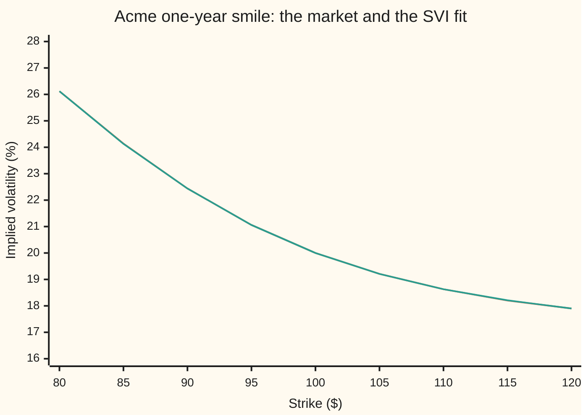
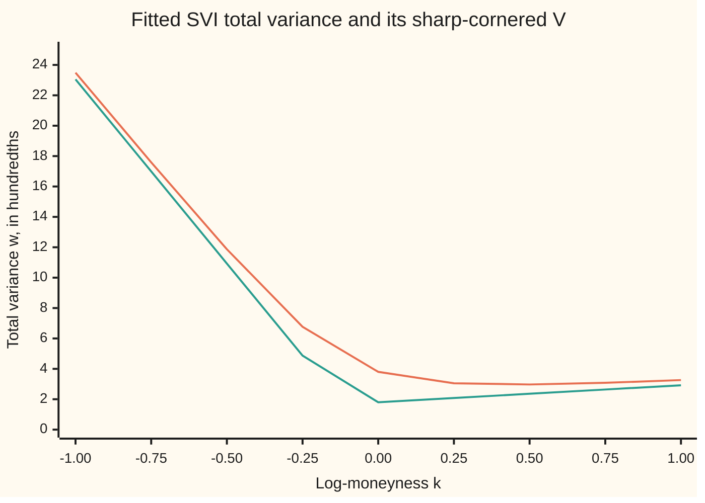
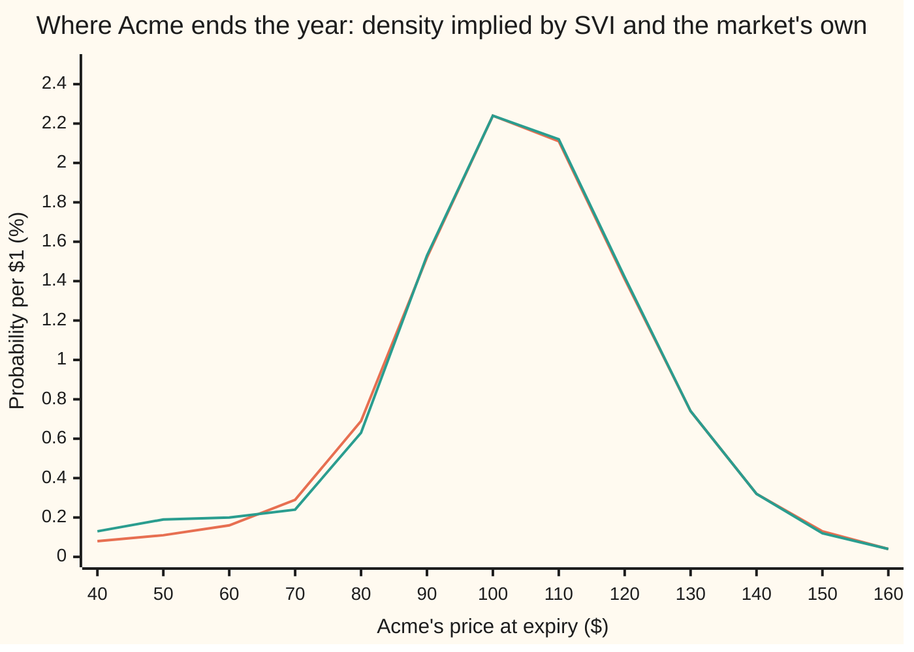

# The SVI smile: five numbers that fit one expiry, and the constraints that keep it arbitrage-free

[Syllabus](../../../SYLLABUS.md) → [Financial mathematics](../README.md) → [The smile and the surface](../README.md#s12) → The SVI smile

---

## General Overview

A desk quotes one-year options on Acme shares at seven strikes: $80, $90, $95, $100, $105, $110 and $120. A **strike** is the fixed price written into an option contract. Each strike has its own implied volatility, the one volatility that makes Black-Scholes reproduce that option's market price. The seven come from the crash market built on [The volatility smile and skew](01-volatility-smile-and-skew.md): they fall from 26.12% at the $80 strike to 17.90% at the $120 strike.

Seven dots are not enough to trade on. A client asks for the $85 strike, or the $60 strike that nobody quoted. Joining the dots with straight lines gives a volatility for every strike, but the kinks imply a probability distribution with spikes and holes, and a hole can be a negative probability: free money for whoever spots it.

So desks draw one smooth curve through the dots, from a family chosen in advance so that it behaves well everywhere. The most widely used family is **SVI**, short for "stochastic volatility inspired", devised at Merrill Lynch in 1999 and made public by Jim Gatheral in 2004. It has five numbers. Fitted to Acme's seven quotes, it misses none of them by more than 0.0012 of a volatility point, and it predicts the two strikes left out of the fit, $85 and $115, to within 0.0078 of a point.

**SVI is a five-parameter curve for one expiry's smile, written in total variance against log-moneyness; its wings are straight lines, which is what theory says the far wings must be, and two checks (a density that never goes negative, and wing slopes no steeper than 2) tell whether a fitted curve is safe to trade.**

**What kind of fact this is:** a model: a curve shape chosen because it fits markets well, not a law. The butterfly test and the wing bound it is checked against are theorems; the first is proved on this card in Why it works, the second (Lee's) is stated and its source named.

### The picture: seven quotes in, a curve out



The orange line is the crash market's implied volatility at nine strikes. The green line is the SVI curve fitted to seven of them; the $85 and $115 strikes were left out of the fit and still land within 0.0078 of a point. The two lines sit on top of each other: at this scale the fit is invisible.

---

## The formula

Two changes of variable come first, because SVI is written in them.

**Log-moneyness** measures a strike's distance from the forward price as a log ratio: $k = \ln(K/F)$. The **forward** $F$ is the price agreed today for delivery at expiry, $F = S e^{(r-q)T}$ with share price $S$ = $100, interest rate $r$ = 5% and dividend yield $q$ = 2%; here $F$ = $103.05. So $k = 0$ is the forward itself, negative $k$ is below it, positive above.

**Total implied variance** is implied volatility squared, times time to expiry: $w = \sigma_{\text{imp}}^2\, T$. At one year $w$ is the volatility squared: the $100 strike's 20.0008% becomes 0.040003.

SVI says total variance, as a function of log-moneyness, is

$$w(k) = a + b\left(\rho\,(k - m) + \sqrt{(k - m)^2 + s^2}\right)$$

**Read it aloud:** total variance is a floor $a$, plus $b$ times a tilted, rounded V centred at $m$, whose corner is rounded off by $s$.

The volatility to quote at strike $K$ comes back out as $\sigma_{\text{imp}} = \sqrt{w(k)/T}$.

| Symbol | Plain meaning | In our example | Push it up and the answer… |
| --- | --- | --- | --- |
| $K$ | strike, the price written into the option | $80 to $120 | moves along the curve |
| $F$, $S$, $r$, $q$ | forward price for delivery at expiry, $S e^{(r-q)T}$, from share price $S$, interest rate $r$ and dividend yield $q$ | $103.05, from $100, 5% and 2% | every strike's $k$ falls |
| $k$, $k_i$ | log-moneyness, $\ln(K/F)$: 0 at the forward; $k_i$ is quote number i's | −0.2531 to +0.1523 | — |
| $S_T$ | Acme's share price at expiry, unknown today | spread by the density in Step 4 | — |
| $T$ | time to expiry, in years | 1 | same $w$ means lower volatility |
| $\sigma_{\text{imp}}$ | implied volatility, quoted in percent | 17.90% to 26.12% | — |
| $w$, $w_i$ | total implied variance, $\sigma_{\text{imp}}^2 T$; $w_i$ is quote number i's market value | 0.032040 to 0.068222 | option prices rise |
| $a$ | vertical level: shifts every strike's variance equally | 0.016719 | whole smile lifts |
| $b$ | how steeply both wings climb | 0.126769 | wings open wider |
| $\rho$ | tilt, between −1 and 1; negative loads the low strikes | −0.912282 | smile tilts toward high strikes |
| $m$ | where the V is centred, in $k$ | −0.118207 | smile slides right |
| $s$ | how rounded the bottom is; 0 gives a sharp corner | 0.248954 | bottom flattens and rises |
| $g$, $d_2$ | Gatheral's butterfly function, built from $w$, its slope $w'$ and its bend $w''$; the density is $g$ times a positive factor that contains $d_2 = -k/\sqrt{w} - \sqrt{w}/2$, the pilot card's $d_2$ in these coordinates | smallest $g$ 0.182823 | density thicker |

Two helper formulas read the shape straight off the parameters. The wings are straight lines with slopes

$$\text{left slope} = b(1 - \rho), \qquad \text{right slope} = b(1 + \rho)$$

In words: far below the forward, total variance climbs by $b(1-\rho)$ per unit of $k$; far above, by $b(1+\rho)$. The bottom of the curve sits at

$$k^{*} = m - \frac{\rho\, s}{\sqrt{1-\rho^2}}, \qquad w_{\min} = a + b\, s\sqrt{1-\rho^2}$$

In words: the lowest total variance on the curve, and the log-moneyness where it occurs.

### When it holds

SVI is a shape, so "holds" means "is safe to use". Four conditions, each with what goes wrong without it:

- **$b \ge 0$, $\rho$ strictly between −1 and 1, $s > 0$.** Outside these the curve is not a smile: a negative $b$ turns it upside down; $\rho$ at ±1 flattens one wing completely.
- **Total variance never negative: $w_{\min} \ge 0$.** A negative total variance has no square root, so no volatility exists at those strikes. This is necessary, not sufficient: the Vogt curve below passes it and still breaks.
- **Butterfly test: $g(k) \ge 0$ at every $k$.** Where $g$ is negative the implied probability density is negative, and a butterfly spread (long one option at each outer strike, short two at the middle one) costs less than nothing.
- **Lee's wing bound: both slopes at most 2.** Steeper wings stop far-out call prices, and far-out put prices divided by the strike, from falling toward zero, which no probability distribution can produce. SVI's condition is $b(1 + |\rho|) \le 2$.

One expiry only. Matching several expiries against each other (calendar arbitrage) is the job of the surface on [The volatility surface](03-volatility-surface-and-its-arbitrage-rules.md); the SVI family built for that is SSVI, named in Step 6.

---

## Why it works

### Step 0: pick coordinates where the rules are straight lines

In strike and volatility, the no-arbitrage rules are awkward. In log-moneyness and total variance they become simple. The far wings of any arbitrage-free smile grow at most linearly in $k$ (Lee's theorem, Step 5). Two expiries cannot cross (total variance rises with time). And Black-Scholes prices depend on strike and volatility only through $k$ and $w$. So the natural model for one expiry is a curve in $(k, w)$ that is a straight line in each wing and smooth in the middle. The simplest such curve is a hyperbola, and SVI is exactly a hyperbola, tilted and shifted.

The name records a second reason. In the Heston model, where volatility itself moves at random, the smile tends to exactly this formula as the expiry grows (Gatheral and Jacquier, 2011).

### Step 1: the square root is a rounded V

Set $s = 0$. Then $\sqrt{(k-m)^2} = |k - m|$, and the formula is a V with its corner at $m$: slope $b(1+\rho)$ on the right and $b(1-\rho)$, climbing leftward, on the left. With $s > 0$ the square root never reaches 0; it bottoms out at $s$ and the corner is rounded. Far from $m$, $s^2$ is negligible next to $(k-m)^2$, so the curve hugs the V.

The minimum comes from setting the slope to zero. The slope is $w'(k) = b\left(\rho + (k-m)/\sqrt{(k-m)^2 + s^2}\right)$. The fraction runs between −1 and 1, so the slope is zero where that fraction equals $-\rho$. Solving gives $k^* = m - \rho s/\sqrt{1-\rho^2}$, and substituting back gives $w_{\min} = a + b s \sqrt{1-\rho^2}$.



The orange line is the fitted Acme curve. The green line is the same curve with $s = 0$: a V with its corner at $m$ = −0.118207. Far out on the left the two run parallel, with slope 0.242418; on the right both are nearly flat, slope 0.011120. Near the corner $s$ lifts the curve: at $k = 0$ the fit sits at 3.80 hundredths and the V at 1.80.

### Step 2: what each parameter does

Each of the five moves one feature, which is why a fit can be read.

- **$a$** adds the same amount of total variance at every strike. Raising it by 0.01 lifts the $100 volatility from 20.00% to 22.36%.
- **$b$** scales the whole V. Doubling it takes the $80 volatility from 26.12% to 34.60%.
- **$\rho$** tilts the V. At −0.912282 the left wing climbs far faster than the right: slope 0.242418 against 0.011120. Setting $\rho = 0$ makes the wings equal and turns the skew into a smile: 22.94%, 22.41%, 25.16% at $80, $100, $120.
- **$m$** slides the curve sideways without changing its shape.
- **$s$** rounds the corner. Shrinking it to 0.01 drops the $100 volatility from 20.00% to 13.33%, because the rounding was holding the bottom up.

The Acme fit has $\rho$ close to −1. The crash market is almost pure skew between $80 and $120: the bottom of the smile, at $k^*$ = 0.436326, lies above the highest quoted strike.

### Step 3: fitting is least squares, and one trick makes it easy

Fitting means choosing the five numbers that make the curve pass as close as possible to the seven quoted total variances. "Close" is measured by the sum of squared misses, as on [Least squares](../../03-Algebra/06-Dot%20Products%20and%20Best%20Fits/04-least-squares.md):

$$\text{minimise } \sum_{i=1}^{7} \big(w(k_i) - w_i\big)^2$$

where $k_i$ is the log-moneyness of quote number i and $w_i$ its market total variance.

**Existence, uniqueness and the boundary cases, before solving.** A minimum exists on a bounded box: $b$ from 0 to 2 (Lee's bound, Step 5), $\rho$ from −1 to 1, $m$ and $s$ in fixed ranges with $s \ge 0$. The sum of squares is continuous, and a continuous function on a closed, bounded set reaches its minimum. Without bounds it need not: pushing $b$ and $s$ up together, with $a$ falling, turns the curve into a parabola, and pushing $m$ far away turns it into a straight line, so the best fit can sit at such a limit and never be reached. The check's grid stays inside a box. Uniqueness is not guaranteed. The sum of squares can have several dips, so a single optimiser can stop in the wrong one; two different methods from different starts agreeing is evidence, not proof. Boundary cases: with fewer than five quotes infinitely many curves pass through every point; with exactly five, SVI usually interpolates them with zero miss and tells nothing about fit quality; a strip that is pure skew pushes $\rho$ toward ±1, as here; a strip with a sharp kink pushes $s$ toward 0.

**The trick (the "quasi-explicit" method published by Zeliade Systems).** Hold $m$ and $s$ fixed. Then

$$w(k) = a + (b\rho)\,(k - m) + b\,\sqrt{(k-m)^2 + s^2}$$

is a straight-line combination of three known columns: 1, $k - m$ and the square root. Finding $a$, $b\rho$ and $b$ is ordinary linear least squares, solved exactly by the normal equations. That leaves a search over two numbers, $m$ and $s$, instead of five. The check searches a shrinking grid over $(m, s)$ and solves the linear problem at each grid point.

**The second road** fits all five at once by Levenberg-Marquardt, the standard method of [Calibration](../07-Greeks%20by%20Numbers%20and%20Calibration/06-calibration-as-least-squares.md): linearise the misses around the current guess, take the step that minimises the linearised sum of squares, and damp the step when it overshoots. It starts from a flat guess, knows nothing of the linear trick, and writes $b$ and $s$ as exponentials and $\rho$ as a hyperbolic tangent so that no step can leave the legal range. Both roads land on the same five numbers, apart by at most one unit in the sixth decimal, with a sum of squared misses of 7.168e-11.

### Step 4: the butterfly test, and why $g$ is the density in disguise

A butterfly spread buys one call at strike $K - h$, sells two at $K$ and buys one at $K + h$, where h is a small step in strike. It pays nothing or something, never less. So its price must be non-negative, and as the step shrinks, price divided by $h^2$ tends to the second derivative of the call price in strike. Breeden and Litzenberger's result, on [The butterfly and the implied density](../10-Digitals%20and%20the%20implied%20density/05-butterfly-and-the-implied-density.md), makes that second derivative, grown at the bank rate, the market's probability density for the share price at expiry.

Push the SVI curve through Black-Scholes and differentiate twice. The density that comes out factors into a positive bell-curve piece times one bracket:

$$g(k) = \left(1 - \frac{k\, w'}{2w}\right)^2 - \frac{(w')^2}{4}\left(\frac{1}{w} + \frac{1}{4}\right) + \frac{w''}{2}$$

$$\text{density of } \ln(S_T/F) \text{ at } k \;=\; \frac{g(k)}{\sqrt{2\pi\, w}}\, \exp\!\left(-\tfrac12 d_2^2\right), \qquad d_2 = -\frac{k}{\sqrt{w}} - \frac{\sqrt{w}}{2}$$

In words: $S_T$ is the share price at expiry; $w'$ is the slope of the curve and $w''$ its bend; $d_2$ is the pilot card's $d_2$ written in $k$ and $w$. Since everything outside $g$ is positive, **the density is non-negative exactly where $g$ is non-negative.** One function of the fitted curve answers the butterfly question at every strike at once.

<details>
<summary>Detailed proof: the density is $g$ times a positive factor</summary>

Work per unit of forward and undiscounted: the call price is $c(k) = N(d_1) - e^{k} N(d_2)$ with $d_1 = d_2 + \sqrt{w}$, where $N(x)$ is the normal distribution's area to the left of x. Write $x = K/F = e^{k}$. The density of $x$ is the second derivative $c_{xx}(x)$, and changing variable to $k$ gives density of $k$ = $e^{-k}(c_{kk} - c_k)$.

Now $c(k)$ depends on $k$ twice: directly, and through $w(k)$. Four Black-Scholes facts do the work, each checked by differentiating $N(d_1) - e^k N(d_2)$ and using $N'(d_1) = e^{k} N'(d_2)$:
- $\partial c/\partial k = -e^{k} N(d_2)$;
- $\partial^2 c/\partial k^2 - \partial c/\partial k = e^{k} N'(d_2)/\sqrt{w}$, the flat-volatility density;
- $\partial c/\partial w = e^{k} N'(d_2)/(2\sqrt{w})$, which is vega written for total variance;
- $\partial^2 c/\partial k\,\partial w = \partial c/\partial w \cdot (\tfrac12 - k/w)$ and $\partial^2 c/\partial w^2 = \partial c/\partial w \cdot \left(\tfrac{k^2}{2w^2} - \tfrac{1}{2w} - \tfrac18\right)$.

By the chain rule, $c_k = \partial_k c + w' \partial_w c$ and $c_{kk} = \partial_{kk} c + 2 w' \partial_{kw} c + (w')^2 \partial_{ww} c + w'' \partial_w c$. Subtract, substitute the four facts, and factor out $e^{k} N'(d_2)/\sqrt{w}$:

$$c_{kk} - c_k = \frac{e^{k} N'(d_2)}{\sqrt{w}}\left[1 - \frac{k w'}{w} + \frac{(w')^2}{4}\left(\frac{k^2}{w^2} - \frac{1}{w} - \frac14\right) + \frac{w''}{2}\right]$$

The bracket is $g$: expand $(1 - k w'/(2w))^2$ and the terms match one for one. Multiplying by $e^{-k}$ gives the density formula above. The check confirms it at three strikes, comparing $g$ against a second difference of call prices, and agrees to six decimals.

</details>

Gatheral and Jacquier add one more condition for a full no-arbitrage slice: call prices must fall to zero as the strike grows, which holds when $d_1 \to -\infty$ as $k$ grows. SVI's linear wings with slope below 2 guarantee it.

The Acme fit passes: the smallest $g$ on $k$ from −1.5 to 1.5 is 0.182823, at $k$ = −0.817. The picture compares the density the fit implies with the crash market's true density.



The orange line is the density implied by the SVI fit, from $g$. The green line is the crash market's true density. From $90 up they nearly coincide. Below $80 they part: the market carries a fat crash shoulder, 0.13 against SVI's 0.08 at $40, that no strike from $80 up could reveal, and the SVI curve replaces it with a thinner, smoother tail.

### Step 5: Lee's bound on the wings

Roger Lee proved in 2004 that for any arbitrage-free market, total variance divided by $|k|$ has a limit superior (the largest value it keeps returning to) of at most 2 in each wing. The exact number is tied to moments: the right wing's slope fixes how many powers of the share price have finite average, and the left wing's slope does the same for powers of one over the share price. The card states the theorem; Lee's paper proves it.

SVI's wings are straight lines, so the bound is a condition on two numbers: $b(1-\rho) \le 2$ and $b(1+\rho) \le 2$. Acme's are 0.242418 and 0.011120, far inside. The check measures the slopes a second way, from the curve itself between $k$ = 10 and 12 on each side: 0.242385 and 0.011088, closing on the formula as $k$ grows.

A parabola in $k$, the other obvious curve to fit, fails this at once: its total variance grows like $k^2$, so its ratio to $|k|$ grows without bound.

### Step 6: many expiries at once, named

Fitting SVI separately at each expiry can produce two curves that cross, which is calendar arbitrage. Gatheral and Jacquier's **SSVI** ("surface SVI") writes every expiry with the same shape, scaled by that expiry's at-the-money total variance:

$$w(k, \theta) = \frac{\theta}{2}\left(1 + \rho\,\varphi(\theta)\,k + \sqrt{\big(\varphi(\theta)\,k + \rho\big)^2 + 1 - \rho^2}\right)$$

Here θ (theta) is the at-the-money total variance at that expiry, the value at $k = 0$, and φ (phi) is a chosen function saying how the smile's curvature shrinks as θ grows. Simple inequalities on θ, φ and ρ rule out both butterfly and calendar arbitrage for the whole surface. Fitting a stochastic volatility model directly, instead of a curve, is the business of [Heston Greeks and calibration](../14-Stochastic%20volatility%20-%20Heston%2C%20SABR%20and%20their%20mix/03-heston-greeks-and-calibration.md).

---

## Worked numbers, by hand

The $90 strike, with the fitted parameters $a$ = 0.016719, $b$ = 0.126769, $\rho$ = −0.912282, $m$ = −0.118207, $s$ = 0.248954 and the forward $103.05.

| Step | Arithmetic | Value |
| --- | --- | --- |
| log-moneyness $k$ | $\ln(90 / 103.045453)$ | −0.135361 |
| distance from centre, $k - m$ | $-0.135361 + 0.118207$ | −0.017154 |
| rounded distance | $\sqrt{0.017154^2 + 0.248954^2}$ | 0.249545 |
| bracket, $\rho(k-m)$ + rounded distance | $(-0.912282)(-0.017154) + 0.249545$ | 0.265194 |
| total variance $w$ | $0.016719 + 0.126769 \times 0.265194$ | 0.050338 |
| volatility | $\sqrt{0.050338 / 1}$ | **22.4361%** |

The market quote at $90 is 22.4366%. The fitted curve misses it by 0.0005 of a volatility point.

The shape numbers, by the helper formulas:

| Step | Arithmetic | Value |
| --- | --- | --- |
| $\sqrt{1-\rho^2}$ | $\sqrt{1 - 0.912282^2}$ | 0.409564 |
| left wing slope $b(1-\rho)$ | $0.126769 \times 1.912282$ | 0.242418 |
| right wing slope $b(1+\rho)$ | $0.126769 \times 0.087718$ | 0.011120 |
| bottom $k^*$ | $-0.118207 + 0.912282 \times 0.248954 / 0.409564$ | 0.436326 |
| lowest total variance $w_{\min}$ | $0.016719 + 0.126769 \times 0.248954 \times 0.409564$ | 0.029645 |
| volatility at the forward, $k = 0$ | $\sqrt{w(0)} = \sqrt{0.037986}$ | **19.4899%** |

Both slopes sit far below Lee's ceiling of 2, and $w_{\min}$ is positive. The volatility at the forward, 19.49%, matches the value card 1 reads off the same market.

### What breaks if you drop a piece

| Mistake | Comes out at | What went wrong |
| --- | --- | --- |
| Take a positive floor $w_{\min}$ as proof of no arbitrage (Vogt's curve) | floor 0.011625, yet $g$ = −0.032864 at $k$ = +0.879 ($248.18); density −0.4691 per million per $1 | positivity of variance is not positivity of probability |
| Fit a parabola in $k$ to the same seven quotes | $w/\lvert k\rvert$ = 0.6983 at $k$ = −3 and 0.5639 at +3 against SVI's 0.2389 and 0.0176; 53.48% at the $40 strike | a parabola's wings grow like $k^2$ and must cross Lee's bound |
| Measure $k$ from the share price, not the forward | 19.4899% at the $100 strike instead of 20.0001% | $\ln(K/S)$ treats the forward, $103.05, as if it were $100 |

The Vogt row is checked two ways: from $g$, −0.4691 per million per $1; from a second difference of SVI call prices, −0.4692. Both roads see the negative density.

---

## Code, from first principles, and it actually runs

The script rebuilds card 1's crash market (a 12% chance of a year centred at 0.70 of the forward with 40% volatility, an 88% chance of a calm year at 15%), prices the seven calls, and inverts each to a volatility by bisection. It fits SVI by two independent roads: the linear trick on a grid over $(m, s)$, and five-parameter Levenberg-Marquardt. It checks the density two ways ($g$ against second differences of call prices), confirms by Simpson's rule that it sums to 1 and averages to the forward, measures the wing slopes far out, and cross-checks the market's own prices by integrating payoffs against its density. The normal distribution, the solver, both optimisers and the integrator are written from scratch.

### Python

```python
# SVI smile fit -- the check behind the card.  Standard library only.  Card 1's crash market quotes
# seven one-year strikes; SVI is fitted by two roads, then tested for butterfly arbitrage and Lee's bound.
from math import log, sqrt, exp, pi, tanh

def N(x):                         # normal CDF from its own series, as on card 1
    if abs(x) > 9.0: return 1.0 if x > 0 else 0.0
    y = abs(x) / sqrt(2.0); term = y; s = y; n = 0
    while term > 1e-17 * s:
        n += 1; term *= 2.0 * y * y / (2 * n + 1); s += term
    e = 2.0 / sqrt(pi) * exp(-y * y) * s
    return 0.5 * (1.0 + e) if x >= 0 else 0.5 * (1.0 - e)
def phi(x): return exp(-0.5 * x * x) / sqrt(2.0 * pi)

S, r, q, T = 100.0, 0.05, 0.02, 1.0
F, D = S * exp((r - q) * T), exp(-r * T)
MIX = [(0.12, 0.70 * F, 0.40), (0.88, (F - 0.12 * 0.70 * F) / 0.88, 0.15)]   # card 1's crash market
def b76(f, K, v):                 # call on forward f, total standard deviation v
    d1 = (log(f / K) + 0.5 * v * v) / v
    return D * (f * N(d1) - K * N(d1 - v))
def mix(K): return sum(p * b76(f, K, s * sqrt(T)) for p, f, s in MIX)
def iv(C, K):                     # bisection: the vol whose Black-Scholes call costs C
    lo, hi = 1e-6, 3.0
    for _ in range(200):
        mid = 0.5 * (lo + hi)
        lo, hi = (lo, mid) if b76(F, K, mid * sqrt(T)) > C else (mid, hi)
    return 0.5 * (lo + hi)

FIT = [80.0, 90.0, 95.0, 100.0, 105.0, 110.0, 120.0]
ks = [log(K / F) for K in FIT]
vols = [iv(mix(K), K) for K in FIT]
ws = [v * v * T for v in vols]    # total variance = vol squared times time
def svi(p, k):
    a, b, rho, m, s = p
    return a + b * (rho * (k - m) + sqrt((k - m) ** 2 + s * s))
def sse(p): return sum((svi(p, k) - w) ** 2 for k, w in zip(ks, ws))
def solve(A, y):                  # Gaussian elimination with partial pivoting
    n = len(y); M = [A[i][:] + [y[i]] for i in range(n)]
    for c in range(n):
        piv = max(range(c, n), key=lambda i: abs(M[i][c])); M[c], M[piv] = M[piv], M[c]
        for i in range(c + 1, n):
            f = M[i][c] / M[c][c]
            for j in range(c, n + 1): M[i][j] -= f * M[c][j]
    x = [0.0] * n
    for i in reversed(range(n)): x[i] = (M[i][n] - sum(M[i][j] * x[j] for j in range(i + 1, n))) / M[i][i]
    return x
def lstsq(cols, y):               # normal equations: (X'X) beta = X'y
    return solve([[sum(u * v for u, v in zip(ci, cj)) for cj in cols] for ci in cols], [sum(u * v for u, v in zip(ci, y)) for ci in cols])

# road 1: for fixed (m, s) SVI is linear in (a, b*rho, b); search (m, s) on a shrinking grid
def inner(m, s):
    a, c, b = lstsq([[1.0] * 7, [k - m for k in ks], [sqrt((k - m) ** 2 + s * s) for k in ks]], ws)
    return (a, b, c / b, m, s)
p1, cm, cs, hm, hs = None, 0.0, 0.3, 0.5, 0.29
for _ in range(60):
    for i in range(-5, 6):
        for j in range(-5, 6):
            p = inner(cm + hm * i / 5, cs + hs * j / 5)
            if p1 is None or sse(p) < sse(p1): p1 = p
    cm, cs, hm, hs = p1[3], p1[4], hm * 0.6, hs * 0.6
# road 2: Levenberg-Marquardt on all five at once; b = e^u1, rho = tanh(u2), s = e^u4 keep them legal
def P5(u): return (u[0], exp(u[1]), tanh(u[2]), u[3], exp(u[4]))
def res(u): return [svi(P5(u), k) - w for k, w in zip(ks, ws)]
u, lam = [0.03, log(0.1), 0.0, 0.0, log(0.1)], 1e-3
while lam < 1e12:
    R = res(u); J = []
    for j in range(5):
        uu = u[:]; uu[j] += 1e-7
        J.append([(x - y) / 1e-7 for x, y in zip(res(uu), R)])
    A = [[sum(x * y for x, y in zip(J[i], J[j])) * (1 + (lam if i == j else 0)) for j in range(5)] for i in range(5)]
    un = [x + d for x, d in zip(u, solve(A, [-sum(x * y for x, y in zip(J[i], R)) for i in range(5)]))]
    if sum(x * x for x in res(un)) < sum(x * x for x in R): u, lam = un, lam * 0.3
    else: lam *= 10
p2 = P5(u); a, b, rho, m, s = p1
print(f"forward F, discount e^-rT        {F:.6f} {D:.6f}")
print("crash market, crash then calm: weight, forward/F, vol  " + "  ".join(f"{p:.2f} {f / F:.4f} {v:.2f}" for p, f, v in MIX))
print("strike      k    market vol   total var w")
for K, k, v, w in zip(FIT, ks, vols, ws): print(f"{K:6.0f} {k:+8.4f} {100 * v:10.4f} {w:12.6f}")
for lab, p in (("road 1, grid + linear", p1), ("road 2, Levenberg-Marquardt", p2)):
    print(f"{lab:<28} a b rho m s  " + " ".join(f"{x:+.6f}" for x in p) + f"  sse {sse(p):.3e}")
print("strike  market   SVI    miss (vol points)")
miss = []
for K, k, v in zip(FIT, ks, vols):
    miss.append(100 * (sqrt(svi(p1, k) / T) - v)); print(f"{K:6.0f} {100 * v:8.4f} {100 * sqrt(svi(p1, k) / T):8.4f} {miss[-1]:+9.4f}")
hold = [(K, 100 * iv(mix(K), K), 100 * sqrt(svi(p1, log(K / F)) / T)) for K in (85.0, 115.0)]
for K, mv, sv in hold: print(f"held out {K:.0f}: market, SVI, miss  {mv:.4f} {sv:.4f} {sv - mv:+.4f}")
k90 = log(90.0 / F); rt = sqrt((k90 - m) ** 2 + s * s)          # the worked number at the 90 strike
print(f"at 90: k, k-m, root, bracket, w, vol  {k90:.6f} {k90 - m:.6f} {rt:.6f} {rho * (k90 - m) + rt:.6f} {svi(p1, k90):.6f} {100 * sqrt(svi(p1, k90) / T):.4f}")
root1 = sqrt(1 - rho * rho)
print(f"bottom: sqrt(1-rho^2), k*, w_min = a+b s sqrt(1-rho^2), vol  {root1:.6f} {m - rho * s / root1:.6f} {a + b * s * root1:.6f} {100 * sqrt((a + b * s * root1) / T):.4f}")
print(f"at the forward k = 0: w, vol     {svi(p1, 0.0):.6f} {100 * sqrt(svi(p1, 0.0) / T):.4f}")
print(f"1-rho, 1+rho; wing slopes b(1-rho), b(1+rho)   {1 - rho:.6f} {1 + rho:.6f}; {b * (1 - rho):.6f} {b * (1 + rho):.6f}   Lee's ceiling 2")
sl, sr = (svi(p1, -12.0) - svi(p1, -10.0)) / 2.0, (svi(p1, 12.0) - svi(p1, 10.0)) / 2.0
print(f"slopes measured, k -12..-10, 10..12  {sl:.6f} {sr:.6f}")
def g(p, k):                      # Gatheral's g: the implied density is g times a positive factor
    a, b, rho, m, s = p; w = svi(p, k); rt = sqrt((k - m) ** 2 + s * s)
    w1, w2 = b * (rho + (k - m) / rt), b * s * s / rt ** 3
    return (1 - k * w1 / (2 * w)) ** 2 - w1 * w1 / 4 * (1 / w + 0.25) + w2 / 2
def dens_g(p, K):                 # road A: density of S_T at K from g, no option prices
    k = log(K / F); w = svi(p, k)
    return g(p, k) * phi(-k / sqrt(w) - sqrt(w) / 2) / (sqrt(w) * K)
def dens_fd(p, K, h=0.01):        # road B: e^rT times the second difference of call prices
    c = lambda x: b76(F, x, sqrt(svi(p, log(x / F))))
    return (c(K + h) - 2 * c(K) + c(K - h)) / (h * h) / D
gmin = min((g(p1, -1.5 + 0.001 * i), -1.5 + 0.001 * i) for i in range(3001))
print(f"min g on k in [-1.5, 1.5], at k   {gmin[0]:.6f} {gmin[1]:+.3f}")
for K in (80.0, 100.0, 120.0): print(f"density at {K:.0f}, per $1: from g, from prices  {dens_g(p1, K):.6f} {dens_fd(p1, K):.6f}")
h = 14.0 / 6000; fk = lambda k, n: (F * exp(k)) ** (n + 1) * dens_g(p1, F * exp(k))   # Simpson on k in [-10, 4]
simp = lambda n: h / 3 * sum((1 if i in (0, 6000) else 4 if i % 2 else 2) * fk(-10.0 + i * h, n) for i in range(6001))
print(f"density total, mean (Simpson)    {simp(0):.6f} {simp(1):.6f}")
V = (-0.0410, 0.1331, 0.3060, 0.3586, 0.4153)   # Vogt's example, quoted by Gatheral and Jacquier
print("Vogt parameters a b rho m s       " + " ".join(f"{x:+.4f}" for x in V))
vmin = min((g(V, -1.5 + 0.001 * i), -1.5 + 0.001 * i) for i in range(3001)); Kv = F * exp(vmin[1])
print(f"Vogt: floor, min g, at k, K       {V[0] + V[1] * V[4] * sqrt(1 - V[2] ** 2):.6f} {vmin[0]:.6f} {vmin[1]:+.3f} {Kv:.2f}")
print(f"Vogt density at K, per $1 000 000: from g, from prices  {1e6 * dens_g(V, Kv):.4f} {1e6 * dens_fd(V, Kv):.4f}")
qa, qb, qc = lstsq([[1.0] * 7, ks, [k * k for k in ks]], ws); wq = lambda k: qa + qb * k + qc * k * k
print(f"wrong: parabola in k, w/|k| at k = -3, +3   {wq(-3.0) / 3:.4f} {wq(3.0) / 3:.4f}  SVI {svi(p1, -3.0) / 3:.4f} {svi(p1, 3.0) / 3:.4f}")
print(f"wrong: parabola vol at 40, SVI vol, market vol  {100 * sqrt(wq(log(40 / F))):.2f} {100 * sqrt(svi(p1, log(40 / F))):.2f} {100 * iv(mix(40.0), 40.0):.2f}")
print(f"wrong: k from spot, vol at 100, right vol  {100 * sqrt(svi(p1, log(100 / S))):.4f} {100 * sqrt(svi(p1, log(100 / F))):.4f}")
for lab, p in (("rho = 0", (a, b, 0.0, m, s)), ("b doubled", (a, 2 * b, rho, m, s)), ("s = 0.01", (a, b, rho, m, 0.01)), ("a + 0.01", (a + 0.01, b, rho, m, s))):
    print(f"try: {lab:<10} vol at 80/100/120  " + " ".join(f"{100 * sqrt(svi(p, log(K / F))):.2f}" for K in (80.0, 100.0, 120.0)))
grid, kg, sg = [80.0 + 5.0 * i for i in range(9)], [-1.0 + 0.25 * i for i in range(9)], [40.0 + 10.0 * i for i in range(13)]
mixd = lambda x: sum(p * phi((log(x / f) + 0.5 * v * v * T) / (v * sqrt(T))) / (v * sqrt(T) * x) for p, f, v in MIX)
print("chart, strike        " + " ".join(f"{K:6.0f}" for K in grid))
print("chart, market vol    " + " ".join(f"{100 * iv(mix(K), K):6.2f}" for K in grid))
print("chart, SVI vol       " + " ".join(f"{100 * sqrt(svi(p1, log(K / F))):6.2f}" for K in grid))
print("chart, k             " + " ".join(f"{k:6.2f}" for k in kg))
print("chart, 100 w, SVI    " + " ".join(f"{100 * svi(p1, k):6.2f}" for k in kg))
print("chart, 100 w, s = 0  " + " ".join(f"{100 * svi((a, b, rho, m, 0.0), k):6.2f}" for k in kg))
print("chart, S_T           " + " ".join(f"{x:5.0f}" for x in sg))
print("chart, SVI density   " + " ".join(f"{100 * dens_g(p1, x):5.2f}" for x in sg))
print("chart, market dens.  " + " ".join(f"{100 * mixd(x):5.2f}" for x in sg))
assert max(abs(x - y) for x, y in zip(p1, p2)) < 1e-6, "two fitting roads land on one parameter set"
assert max(abs(x) for x in miss) < 0.1 and all(abs(sv - mv) < 0.1 for _, mv, sv in hold), "within a tenth of a vol point"
assert all(abs(dens_g(p1, K) - dens_fd(p1, K)) < 1e-5 for K in (80.0, 100.0, 120.0)), "g road = price road"
assert abs(simp(0) - 1) < 1e-4 and abs(simp(1) - F) < 1e-2, "density sums to one and averages to the forward"
assert abs(sl - b * (1 - rho)) < 1e-3 and abs(sr - b * (1 + rho)) < 1e-3, "measured wing slopes match b(1 -/+ rho)"
hc = 1900.0 / 6000; cint = D * hc / 3 * sum((1 if i in (0, 6000) else 4 if i % 2 else 2) * i * hc * mixd(100.0 + i * hc) for i in range(6001))
assert abs(cint - mix(100.0)) < 1e-6, "call price by integrating the payoff against the market density"
assert gmin[0] > 0 and vmin[0] < 0 and dens_fd(V, Kv) < 0, "fit passes butterfly; Vogt fails it on both roads"
print("ALL CHECKS PASS")
```

**Ran 2026-09-19 on macOS, Python 3.14.6, standard library only. All checks passed. Output, pasted from the run:**

```
forward F, discount e^-rT        103.045453 0.951229
crash market, crash then calm: weight, forward/F, vol  0.12 0.7000 0.40  0.88 1.0409 0.15
strike      k    market vol   total var w
    80  -0.2531    26.1193     0.068222
    90  -0.1354    22.4366     0.050340
    95  -0.0813    21.0594     0.044350
   100  -0.0300    20.0008     0.040003
   105  +0.0188    19.2100     0.036902
   110  +0.0653    18.6278     0.034699
   120  +0.1523    17.8997     0.032040
road 1, grid + linear        a b rho m s  +0.016719 +0.126769 -0.912282 -0.118207 +0.248954  sse 7.168e-11
road 2, Levenberg-Marquardt  a b rho m s  +0.016719 +0.126769 -0.912281 -0.118207 +0.248954  sse 7.168e-11
strike  market   SVI    miss (vol points)
    80  26.1193  26.1194   +0.0000
    90  22.4366  22.4361   -0.0005
    95  21.0594  21.0607   +0.0012
   100  20.0008  20.0001   -0.0007
   105  19.2100  19.2090   -0.0010
   110  18.6278  18.6289   +0.0011
   120  17.8997  17.8995   -0.0002
held out 85: market, SVI, miss  24.1427 24.1349 -0.0078
held out 115: market, SVI, miss  18.2035 18.2064 +0.0030
at 90: k, k-m, root, bracket, w, vol  -0.135361 -0.017154 0.249545 0.265194 0.050338 22.4361
bottom: sqrt(1-rho^2), k*, w_min = a+b s sqrt(1-rho^2), vol  0.409564 0.436326 0.029645 17.2178
at the forward k = 0: w, vol     0.037986 19.4899
1-rho, 1+rho; wing slopes b(1-rho), b(1+rho)   1.912282 0.087718; 0.242418 0.011120   Lee's ceiling 2
slopes measured, k -12..-10, 10..12  0.242385 0.011088
min g on k in [-1.5, 1.5], at k   0.182823 -0.817
density at 80, per $1: from g, from prices  0.006863 0.006863
density at 100, per $1: from g, from prices  0.022414 0.022414
density at 120, per $1: from g, from prices  0.014134 0.014134
density total, mean (Simpson)    1.000000 103.045453
Vogt parameters a b rho m s       -0.0410 +0.1331 +0.3060 +0.3586 +0.4153
Vogt: floor, min g, at k, K       0.011625 -0.032864 +0.879 248.18
Vogt density at K, per $1 000 000: from g, from prices  -0.4691 -0.4692
wrong: parabola in k, w/|k| at k = -3, +3   0.6983 0.5639  SVI 0.2389 0.0176
wrong: parabola vol at 40, SVI vol, market vol  53.48 47.13 40.18
wrong: k from spot, vol at 100, right vol  19.4899 20.0001
try: rho = 0    vol at 80/100/120  22.94 22.41 25.16
try: b doubled  vol at 80/100/120  34.60 25.16 21.76
try: s = 0.01   vol at 80/100/120  22.24 13.33 14.05
try: a + 0.01   vol at 80/100/120  27.97 22.36 20.50
chart, strike            80     85     90     95    100    105    110    115    120
chart, market vol     26.12  24.14  22.44  21.06  20.00  19.21  18.63  18.20  17.90
chart, SVI vol        26.12  24.13  22.44  21.06  20.00  19.21  18.63  18.21  17.90
chart, k              -1.00  -0.75  -0.50  -0.25   0.00   0.25   0.50   0.75   1.00
chart, 100 w, SVI     23.49  17.59  11.87   6.77   3.80   3.05   2.97   3.08   3.26
chart, 100 w, s = 0   23.05  16.99  10.93   4.87   1.80   2.08   2.36   2.64   2.92
chart, S_T              40    50    60    70    80    90   100   110   120   130   140   150   160
chart, SVI density    0.08  0.11  0.16  0.29  0.69  1.52  2.24  2.11  1.41  0.74  0.32  0.13  0.04
chart, market dens.   0.13  0.19  0.20  0.24  0.63  1.53  2.24  2.12  1.42  0.74  0.32  0.12  0.04
ALL CHECKS PASS
```

### Rust

```rust
// SVI smile fit -- the check behind the card.  Rust std only.  Card 1's crash market quotes
// seven one-year strikes; SVI is fitted by two roads, then tested for butterfly arbitrage and Lee's bound.
use std::f64::consts::PI;
const S: f64 = 100.0; const R: f64 = 0.05; const Q: f64 = 0.02; const T: f64 = 1.0;
type P = [f64; 5];

fn n_cdf(x: f64) -> f64 { // normal CDF from its own series, as on card 1
    if x.abs() > 9.0 { return if x > 0.0 { 1.0 } else { 0.0 }; }
    let y = x.abs() / 2f64.sqrt(); let (mut term, mut s, mut n) = (y, y, 0.0);
    while term > 1e-17 * s { n += 1.0; term *= 2.0 * y * y / (2.0 * n + 1.0); s += term; }
    let e = 2.0 / PI.sqrt() * (-y * y).exp() * s;
    if x >= 0.0 { 0.5 * (1.0 + e) } else { 0.5 * (1.0 - e) }
}
fn phi(x: f64) -> f64 { (-0.5 * x * x).exp() / (2.0 * PI).sqrt() }
fn fwd() -> f64 { S * ((R - Q) * T).exp() }
fn disc() -> f64 { (-R * T).exp() }
fn mixl() -> [(f64, f64, f64); 2] { let f = fwd(); [(0.12, 0.70 * f, 0.40), (0.88, (f - 0.12 * 0.70 * f) / 0.88, 0.15)] }
fn b76(f: f64, k: f64, v: f64) -> f64 { // call on forward f, total standard deviation v
    let d1 = ((f / k).ln() + 0.5 * v * v) / v;
    disc() * (f * n_cdf(d1) - k * n_cdf(d1 - v))
}
fn mix(k: f64) -> f64 { mixl().iter().map(|&(p, f, s)| p * b76(f, k, s * T.sqrt())).sum() }
fn iv(c: f64, k: f64) -> f64 { // bisection: the vol whose Black-Scholes call costs c
    let (mut lo, mut hi) = (1e-6, 3.0);
    for _ in 0..200 { let mid = 0.5 * (lo + hi); if b76(fwd(), k, mid * T.sqrt()) > c { hi = mid } else { lo = mid } }
    0.5 * (lo + hi)
}
fn svi(p: &P, k: f64) -> f64 { let [a, b, rho, m, s] = *p; a + b * (rho * (k - m) + ((k - m).powi(2) + s * s).sqrt()) }
fn sse(p: &P, ks: &[f64], ws: &[f64]) -> f64 { ks.iter().zip(ws).map(|(&k, &w)| (svi(p, k) - w).powi(2)).sum() }
fn solve(a: &Vec<Vec<f64>>, y: &[f64]) -> Vec<f64> { // Gaussian elimination with partial pivoting
    let n = y.len(); let mut m: Vec<Vec<f64>> = (0..n).map(|i| { let mut r = a[i].clone(); r.push(y[i]); r }).collect();
    for c in 0..n {
        let piv = (c..n).max_by(|&i, &j| m[i][c].abs().partial_cmp(&m[j][c].abs()).unwrap()).unwrap(); m.swap(c, piv);
        for i in c + 1..n { let f = m[i][c] / m[c][c]; for j in c..=n { m[i][j] -= f * m[c][j]; } }
    }
    let mut x = vec![0.0; n];
    for i in (0..n).rev() { x[i] = (m[i][n] - (i + 1..n).map(|j| m[i][j] * x[j]).sum::<f64>()) / m[i][i]; }
    x
}
fn dot(u: &[f64], v: &[f64]) -> f64 { u.iter().zip(v).map(|(a, b)| a * b).sum() }
fn lstsq(cols: &[Vec<f64>], y: &[f64]) -> Vec<f64> { // normal equations: (X'X) beta = X'y
    let a: Vec<Vec<f64>> = cols.iter().map(|ci| cols.iter().map(|cj| dot(ci, cj)).collect()).collect();
    let rhs: Vec<f64> = cols.iter().map(|ci| dot(ci, y)).collect();
    solve(&a, &rhs)
}
fn g(p: &P, k: f64) -> f64 { // Gatheral's g: the implied density is g times a positive factor
    let [_, b, rho, m, s] = *p; let w = svi(p, k); let rt = ((k - m).powi(2) + s * s).sqrt();
    let (w1, w2) = (b * (rho + (k - m) / rt), b * s * s / rt.powi(3));
    (1.0 - k * w1 / (2.0 * w)).powi(2) - w1 * w1 / 4.0 * (1.0 / w + 0.25) + w2 / 2.0
}
fn dens_g(p: &P, kk: f64) -> f64 { // road A: density of S_T at K from g, no option prices
    let k = (kk / fwd()).ln(); let w = svi(p, k);
    g(p, k) * phi(-k / w.sqrt() - w.sqrt() / 2.0) / (w.sqrt() * kk)
}
fn dens_fd(p: &P, kk: f64) -> f64 { // road B: e^rT times the second difference of call prices
    let h = 0.01; let c = |x: f64| b76(fwd(), x, svi(p, (x / fwd()).ln()).sqrt());
    (c(kk + h) - 2.0 * c(kk) + c(kk - h)) / (h * h) / disc()
}
fn gmin(p: &P) -> (f64, f64) {
    (0..3001).map(|i| { let k = -1.5 + 0.001 * i as f64; (g(p, k), k) }).fold((f64::MAX, 0.0), |b, x| if x.0 < b.0 { x } else { b })
}
fn line(v: &[f64], w: usize, d: usize) -> String { v.iter().map(|x| format!("{:w$.d$}", x, w = w, d = d)).collect::<Vec<_>>().join(" ") }

fn main() {
    let (f, d) = (fwd(), disc());
    let fit = [80.0, 90.0, 95.0, 100.0, 105.0, 110.0, 120.0];
    let ks: Vec<f64> = fit.iter().map(|k| (k / f).ln()).collect();
    let vols: Vec<f64> = fit.iter().map(|&k| iv(mix(k), k)).collect();
    let ws: Vec<f64> = vols.iter().map(|v| v * v * T).collect(); // total variance = vol squared times time
    // road 1: for fixed (m, s) SVI is linear in (a, b*rho, b); search (m, s) on a shrinking grid
    let inner = |m: f64, s: f64| -> P {
        let cols = vec![vec![1.0; 7], ks.iter().map(|k| k - m).collect(), ks.iter().map(|k| ((k - m).powi(2) + s * s).sqrt()).collect()];
        let x = lstsq(&cols, &ws); [x[0], x[2], x[1] / x[2], m, s]
    };
    let (mut p1, mut cm, mut cs, mut hm, mut hs) = ([0.0; 5], 0.0, 0.3, 0.5, 0.29); let mut first = true;
    for _ in 0..60 {
        for i in -5..=5 { for j in -5..=5 {
            let p = inner(cm + hm * i as f64 / 5.0, cs + hs * j as f64 / 5.0);
            if first || sse(&p, &ks, &ws) < sse(&p1, &ks, &ws) { p1 = p; first = false; }
        } }
        cm = p1[3]; cs = p1[4]; hm *= 0.6; hs *= 0.6;
    }
    // road 2: Levenberg-Marquardt on all five at once; b = e^u1, rho = tanh(u2), s = e^u4 keep them legal
    let p5 = |u: &[f64]| -> P { [u[0], u[1].exp(), u[2].tanh(), u[3], u[4].exp()] };
    let res = |u: &[f64]| -> Vec<f64> { ks.iter().zip(&ws).map(|(&k, &w)| svi(&p5(u), k) - w).collect() };
    let (mut u, mut lam) = (vec![0.03, 0.1f64.ln(), 0.0, 0.0, 0.1f64.ln()], 1e-3);
    while lam < 1e12 {
        let r = res(&u);
        let jac: Vec<Vec<f64>> = (0..5).map(|j| { let mut uu = u.clone(); uu[j] += 1e-7; res(&uu).iter().zip(&r).map(|(x, y)| (x - y) / 1e-7).collect() }).collect();
        let a: Vec<Vec<f64>> = (0..5).map(|i| (0..5).map(|j| dot(&jac[i], &jac[j]) * (1.0 + if i == j { lam } else { 0.0 })).collect()).collect();
        let step = solve(&a, &(0..5).map(|i| -dot(&jac[i], &r)).collect::<Vec<_>>());
        let un: Vec<f64> = u.iter().zip(&step).map(|(x, s)| x + s).collect();
        if dot(&res(&un), &res(&un)) < dot(&r, &r) { u = un; lam *= 0.3; } else { lam *= 10.0; }
    }
    let p2 = p5(&u);
    let [a, b, rho, m, s] = p1;
    println!("forward F, discount e^-rT        {:.6} {:.6}", f, d);
    println!("crash market, crash then calm: weight, forward/F, vol  {}", mixl().iter().map(|&(p, fl, vl)| format!("{:.2} {:.4} {:.2}", p, fl / f, vl)).collect::<Vec<_>>().join("  "));
    println!("strike      k    market vol   total var w");
    for i in 0..7 { println!("{:6.0} {:+8.4} {:10.4} {:12.6}", fit[i], ks[i], 100.0 * vols[i], ws[i]); }
    for (lab, p) in [("road 1, grid + linear", p1), ("road 2, Levenberg-Marquardt", p2)] {
        println!("{:<28} a b rho m s  {}  sse {:.3e}", lab, p.iter().map(|x| format!("{:+.6}", x)).collect::<Vec<_>>().join(" "), sse(&p, &ks, &ws));
    }
    println!("strike  market   SVI    miss (vol points)");
    let mut miss = vec![];
    for i in 0..7 {
        let sv = 100.0 * (svi(&p1, ks[i]) / T).sqrt(); miss.push(sv - 100.0 * vols[i]);
        println!("{:6.0} {:8.4} {:8.4} {:+9.4}", fit[i], 100.0 * vols[i], sv, miss[i]);
    }
    let hold: Vec<(f64, f64, f64)> = [85.0, 115.0].iter().map(|&k| (k, 100.0 * iv(mix(k), k), 100.0 * (svi(&p1, (k / f).ln()) / T).sqrt())).collect();
    for &(k, mv, sv) in &hold { println!("held out {:.0}: market, SVI, miss  {:.4} {:.4} {:+.4}", k, mv, sv, sv - mv); }
    let k90 = (90.0 / f).ln(); let rt = ((k90 - m).powi(2) + s * s).sqrt(); // the worked number at the 90 strike
    println!("at 90: k, k-m, root, bracket, w, vol  {:.6} {:.6} {:.6} {:.6} {:.6} {:.4}", k90, k90 - m, rt, rho * (k90 - m) + rt, svi(&p1, k90), 100.0 * (svi(&p1, k90) / T).sqrt());
    let root1 = (1.0 - rho * rho).sqrt();
    println!("bottom: sqrt(1-rho^2), k*, w_min = a+b s sqrt(1-rho^2), vol  {:.6} {:.6} {:.6} {:.4}", root1, m - rho * s / root1, a + b * s * root1, 100.0 * ((a + b * s * root1) / T).sqrt());
    println!("at the forward k = 0: w, vol     {:.6} {:.4}", svi(&p1, 0.0), 100.0 * (svi(&p1, 0.0) / T).sqrt());
    println!("1-rho, 1+rho; wing slopes b(1-rho), b(1+rho)   {:.6} {:.6}; {:.6} {:.6}   Lee's ceiling 2", 1.0 - rho, 1.0 + rho, b * (1.0 - rho), b * (1.0 + rho));
    let (sl, sr) = ((svi(&p1, -12.0) - svi(&p1, -10.0)) / 2.0, (svi(&p1, 12.0) - svi(&p1, 10.0)) / 2.0);
    println!("slopes measured, k -12..-10, 10..12  {:.6} {:.6}", sl, sr);
    let gm = gmin(&p1);
    println!("min g on k in [-1.5, 1.5], at k   {:.6} {:+.3}", gm.0, gm.1);
    for kk in [80.0, 100.0, 120.0] { println!("density at {:.0}, per $1: from g, from prices  {:.6} {:.6}", kk, dens_g(&p1, kk), dens_fd(&p1, kk)); }
    let h = 14.0 / 6000.0; // Simpson on k in [-10, 4]
    let simp = |n: i32| h / 3.0 * (0..6001).map(|i| { let k = -10.0 + i as f64 * h; let wt = if i == 0 || i == 6000 { 1.0 } else if i % 2 == 1 { 4.0 } else { 2.0 };
        wt * (f * k.exp()).powi(n + 1) * dens_g(&p1, f * k.exp()) }).sum::<f64>();
    println!("density total, mean (Simpson)    {:.6} {:.6}", simp(0), simp(1));
    let v: P = [-0.0410, 0.1331, 0.3060, 0.3586, 0.4153]; // Vogt's example, quoted by Gatheral and Jacquier
    println!("Vogt parameters a b rho m s       {}", v.iter().map(|x| format!("{:+.4}", x)).collect::<Vec<_>>().join(" "));
    let vm = gmin(&v); let kv = f * vm.1.exp();
    println!("Vogt: floor, min g, at k, K       {:.6} {:.6} {:+.3} {:.2}", v[0] + v[1] * v[4] * (1.0 - v[2] * v[2]).sqrt(), vm.0, vm.1, kv);
    println!("Vogt density at K, per $1 000 000: from g, from prices  {:.4} {:.4}", 1e6 * dens_g(&v, kv), 1e6 * dens_fd(&v, kv));
    let qx = lstsq(&[vec![1.0; 7], ks.clone(), ks.iter().map(|k| k * k).collect()], &ws); let wq = |k: f64| qx[0] + qx[1] * k + qx[2] * k * k;
    println!("wrong: parabola in k, w/|k| at k = -3, +3   {:.4} {:.4}  SVI {:.4} {:.4}", wq(-3.0) / 3.0, wq(3.0) / 3.0, svi(&p1, -3.0) / 3.0, svi(&p1, 3.0) / 3.0);
    let k40 = (40.0 / f).ln();
    println!("wrong: parabola vol at 40, SVI vol, market vol  {:.2} {:.2} {:.2}", 100.0 * wq(k40).sqrt(), 100.0 * svi(&p1, k40).sqrt(), 100.0 * iv(mix(40.0), 40.0));
    println!("wrong: k from spot, vol at 100, right vol  {:.4} {:.4}", 100.0 * svi(&p1, (100.0 / S).ln()).sqrt(), 100.0 * svi(&p1, (100.0 / f).ln()).sqrt());
    for (lab, p) in [("rho = 0", [a, b, 0.0, m, s]), ("b doubled", [a, 2.0 * b, rho, m, s]), ("s = 0.01", [a, b, rho, m, 0.01]), ("a + 0.01", [a + 0.01, b, rho, m, s])] {
        println!("try: {:<10} vol at 80/100/120  {}", lab, [80.0, 100.0, 120.0].iter().map(|&k| format!("{:.2}", 100.0 * svi(&p, (k / f).ln()).sqrt())).collect::<Vec<_>>().join(" "));
    }
    let grid: Vec<f64> = (0..9).map(|i| 80.0 + 5.0 * i as f64).collect();
    let kg: Vec<f64> = (0..9).map(|i| -1.0 + 0.25 * i as f64).collect();
    let sg: Vec<f64> = (0..13).map(|i| 40.0 + 10.0 * i as f64).collect();
    let mixd = |x: f64| -> f64 { mixl().iter().map(|&(p, fl, vl)| p * phi(((x / fl).ln() + 0.5 * vl * vl * T) / (vl * T.sqrt())) / (vl * T.sqrt() * x)).sum() };
    println!("chart, strike        {}", line(&grid, 6, 0));
    println!("chart, market vol    {}", line(&grid.iter().map(|&k| 100.0 * iv(mix(k), k)).collect::<Vec<_>>(), 6, 2));
    println!("chart, SVI vol       {}", line(&grid.iter().map(|&k| 100.0 * svi(&p1, (k / f).ln()).sqrt()).collect::<Vec<_>>(), 6, 2));
    println!("chart, k             {}", line(&kg, 6, 2));
    println!("chart, 100 w, SVI    {}", line(&kg.iter().map(|&k| 100.0 * svi(&p1, k)).collect::<Vec<_>>(), 6, 2));
    println!("chart, 100 w, s = 0  {}", line(&kg.iter().map(|&k| 100.0 * svi(&[a, b, rho, m, 0.0], k)).collect::<Vec<_>>(), 6, 2));
    println!("chart, S_T           {}", line(&sg, 5, 0));
    println!("chart, SVI density   {}", line(&sg.iter().map(|&x| 100.0 * dens_g(&p1, x)).collect::<Vec<_>>(), 5, 2));
    println!("chart, market dens.  {}", line(&sg.iter().map(|&x| 100.0 * mixd(x)).collect::<Vec<_>>(), 5, 2));
    assert!(p1.iter().zip(&p2).all(|(x, y)| (x - y).abs() < 1e-6), "two fitting roads land on one parameter set");
    assert!(miss.iter().all(|x| x.abs() < 0.1) && hold.iter().all(|&(_, mv, sv)| (sv - mv).abs() < 0.1), "within a tenth of a vol point");
    assert!([80.0, 100.0, 120.0].iter().all(|&k| (dens_g(&p1, k) - dens_fd(&p1, k)).abs() < 1e-5), "g road = price road");
    assert!((simp(0) - 1.0).abs() < 1e-4 && (simp(1) - f).abs() < 1e-2, "density sums to one and averages to the forward");
    assert!((sl - b * (1.0 - rho)).abs() < 1e-3 && (sr - b * (1.0 + rho)).abs() < 1e-3, "measured wing slopes match b(1 -/+ rho)");
    let hc = 1900.0 / 6000.0; let cint = d * hc / 3.0 * (0..6001).map(|i| { let wt = if i == 0 || i == 6000 { 1.0 } else if i % 2 == 1 { 4.0 } else { 2.0 }; wt * i as f64 * hc * mixd(100.0 + i as f64 * hc) }).sum::<f64>();
    assert!((cint - mix(100.0)).abs() < 1e-6, "call price by integrating the payoff against the market density");
    assert!(gm.0 > 0.0 && vm.0 < 0.0 && dens_fd(&v, kv) < 0.0, "fit passes butterfly; Vogt fails it on both roads");
    println!("ALL CHECKS PASS");
}
```

**Ran 2026-09-19 on macOS, rustc 1.98.1, no crates. All checks passed. Output, pasted from the run:**

```
forward F, discount e^-rT        103.045453 0.951229
crash market, crash then calm: weight, forward/F, vol  0.12 0.7000 0.40  0.88 1.0409 0.15
strike      k    market vol   total var w
    80  -0.2531    26.1193     0.068222
    90  -0.1354    22.4366     0.050340
    95  -0.0813    21.0594     0.044350
   100  -0.0300    20.0008     0.040003
   105  +0.0188    19.2100     0.036902
   110  +0.0653    18.6278     0.034699
   120  +0.1523    17.8997     0.032040
road 1, grid + linear        a b rho m s  +0.016719 +0.126769 -0.912282 -0.118207 +0.248954  sse 7.168e-11
road 2, Levenberg-Marquardt  a b rho m s  +0.016719 +0.126769 -0.912281 -0.118207 +0.248954  sse 7.168e-11
strike  market   SVI    miss (vol points)
    80  26.1193  26.1194   +0.0000
    90  22.4366  22.4361   -0.0005
    95  21.0594  21.0607   +0.0012
   100  20.0008  20.0001   -0.0007
   105  19.2100  19.2090   -0.0010
   110  18.6278  18.6289   +0.0011
   120  17.8997  17.8995   -0.0002
held out 85: market, SVI, miss  24.1427 24.1349 -0.0078
held out 115: market, SVI, miss  18.2035 18.2064 +0.0030
at 90: k, k-m, root, bracket, w, vol  -0.135361 -0.017154 0.249545 0.265194 0.050338 22.4361
bottom: sqrt(1-rho^2), k*, w_min = a+b s sqrt(1-rho^2), vol  0.409564 0.436326 0.029645 17.2178
at the forward k = 0: w, vol     0.037986 19.4899
1-rho, 1+rho; wing slopes b(1-rho), b(1+rho)   1.912282 0.087718; 0.242418 0.011120   Lee's ceiling 2
slopes measured, k -12..-10, 10..12  0.242385 0.011088
min g on k in [-1.5, 1.5], at k   0.182823 -0.817
density at 80, per $1: from g, from prices  0.006863 0.006863
density at 100, per $1: from g, from prices  0.022414 0.022414
density at 120, per $1: from g, from prices  0.014134 0.014134
density total, mean (Simpson)    1.000000 103.045453
Vogt parameters a b rho m s       -0.0410 +0.1331 +0.3060 +0.3586 +0.4153
Vogt: floor, min g, at k, K       0.011625 -0.032864 +0.879 248.18
Vogt density at K, per $1 000 000: from g, from prices  -0.4691 -0.4692
wrong: parabola in k, w/|k| at k = -3, +3   0.6983 0.5639  SVI 0.2389 0.0176
wrong: parabola vol at 40, SVI vol, market vol  53.48 47.13 40.18
wrong: k from spot, vol at 100, right vol  19.4899 20.0001
try: rho = 0    vol at 80/100/120  22.94 22.41 25.16
try: b doubled  vol at 80/100/120  34.60 25.16 21.76
try: s = 0.01   vol at 80/100/120  22.24 13.33 14.05
try: a + 0.01   vol at 80/100/120  27.97 22.36 20.50
chart, strike            80     85     90     95    100    105    110    115    120
chart, market vol     26.12  24.14  22.44  21.06  20.00  19.21  18.63  18.20  17.90
chart, SVI vol        26.12  24.13  22.44  21.06  20.00  19.21  18.63  18.21  17.90
chart, k              -1.00  -0.75  -0.50  -0.25   0.00   0.25   0.50   0.75   1.00
chart, 100 w, SVI     23.49  17.59  11.87   6.77   3.80   3.05   2.97   3.08   3.26
chart, 100 w, s = 0   23.05  16.99  10.93   4.87   1.80   2.08   2.36   2.64   2.92
chart, S_T              40    50    60    70    80    90   100   110   120   130   140   150   160
chart, SVI density    0.08  0.11  0.16  0.29  0.69  1.52  2.24  2.11  1.41  0.74  0.32  0.13  0.04
chart, market dens.   0.13  0.19  0.20  0.24  0.63  1.53  2.24  2.12  1.42  0.74  0.32  0.12  0.04
ALL CHECKS PASS
```

The two outputs agree line for line.

> [!TIP]
> **Try changing**
> - **Set $\rho$ to 0.** Guess first: does the skew survive? No: the wings climb equally and the skew becomes a smile, 22.94%, 22.41% and 25.16% at $80, $100 and $120.
> - **Double $b$.** Guess first: which strike moves most? The $80 strike, from 26.12% to 34.60%; the $120 strike only reaches 21.76%, because the right wing is nearly flat.
> - **Shrink $s$ to 0.01.** Guess first: up or down at the money? Down, from 20.00% to 13.33%: the rounding was holding the bottom up, and a sharp V sits lower near its corner.
> - **Add 0.01 to $a$.** Guess first: equal moves in volatility? No. Equal moves in total variance: 27.97%, 22.36% and 20.50%, so low volatilities rise most in percentage points.

---

## The usual mistake

> [!warning]
> **Checking that total variance stays positive and calling the fit arbitrage-free.** The floor $w_{\min} \ge 0$ only says a volatility exists at every strike. The butterfly test is about the curve's slope and bend, through $g$. Vogt's parameters, published by Gatheral and Jacquier, keep total variance at least 0.011625 everywhere and still give $g$ = −0.032864 near the $248.18 strike: a negative probability that a butterfly spread there would turn into free money.
>
> - **Trusting the fit outside the quotes.** Inside $80 to $120 the fit is within 0.0078 of a point, even at strikes it never saw. At $40 it says 47.13% against the market's 40.18%. SVI keeps the wings legal, not correct.
> - **Log-moneyness from spot.** Using $\ln(K/S)$ shifts every strike by $\ln(F/S)$ and gives 19.4899% at the $100 strike instead of 20.0001%.
> - **Reading $m$ as the at-the-money point or $a$ as the at-the-money variance.** The bottom is at $k^*$ = 0.436326, not $m$ = −0.118207, and the variance at the forward is 0.037986, not $a$ = 0.016719.
> - **One optimiser, one start.** The least-squares problem can have several dips. A second road from a different start, as in the check, is the cheap insurance.

---

## Where you meet it in real life

- **Equity index option desks.** SVI or one of its variants is the standard way to turn a day's listed option quotes into a smile per expiry. The fitted curve prices every unlisted strike.
- **Risk systems.** A fitted smile's five numbers are stored daily; a jump in $\rho$ or $b$ flags a change in how the market prices crashes, before any single quote looks odd.
- **Hedging with the smile.** The fitted curve's slope in strike feeds the delta correction on [Smile-adjusted delta](05-smile-adjusted-delta.md).
- **Local volatility.** Dupire's formula needs the first and second derivatives of total variance in strike. SVI gives them in closed form, with no noise from differencing quotes.
- **Surfaces.** SSVI, or SVI slices checked for crossing, turn many expiries into one arbitrage-free surface, the object of [The volatility surface](03-volatility-surface-and-its-arbitrage-rules.md).

> **Say it back**
> SVI writes one expiry's total variance as a tilted hyperbola in log-moneyness, with five numbers: level, wing steepness, tilt, centre and rounding. For fixed centre and rounding it is linear in the rest, so fitting reduces to a two-number search plus ordinary least squares. Fitted to Acme's seven quotes it misses by at most 0.0012 of a volatility point. A fit is safe when $g$, which carries the sign of the implied density, stays non-negative and both wing slopes stay at or below Lee's 2. A positive total variance is not enough, and a legal wing is not a correct one.

---

## What this builds on

- [The volatility surface](03-volatility-surface-and-its-arbitrage-rules.md): total variance, log-moneyness and the butterfly test in general; this card applies them to one curve family.
- [Least squares](../../03-Algebra/06-Dot%20Products%20and%20Best%20Fits/04-least-squares.md): the normal equations that solve the inner, linear part of the fit.
- [Calibration](../07-Greeks%20by%20Numbers%20and%20Calibration/06-calibration-as-least-squares.md): fitting model parameters to market quotes, and the Levenberg-Marquardt method used as the second road.

---

## Where this goes next

- [Smile-adjusted delta](05-smile-adjusted-delta.md): with a smooth smile in hand, the hedge ratio picks up a term from the smile's slope.
- [Local volatility in implied-vol terms](../13-Local%20volatility%20and%20jumps/02-local-volatility-from-implied-volatility.md): the fitted curve's derivatives become a volatility for every price and time.
- [Heston Greeks and calibration](../14-Stochastic%20volatility%20-%20Heston%2C%20SABR%20and%20their%20mix/03-heston-greeks-and-calibration.md): fitting a model whose smile SVI imitates, instead of the imitation.

SVI describes the smile without explaining it; the question it leaves open is what the smile does when the share price moves, which is where the delta and the models behind the curve come in.

---

## Sources

Verified 2026-09-19: every link below resolves to the publisher's page.

- Jim Gatheral, *The Volatility Surface: A Practitioner's Guide*, Wiley, 2006. [Publisher page](https://www.wiley.com/en-us/The+Volatility+Surface%3A+A+Practitioner%27s+Guide-p-9780471792512). SVI's origin, total variance in log-moneyness, and the butterfly density in practice.
- Jim Gatheral and Antoine Jacquier, "Arbitrage-free SVI volatility surfaces", *Quantitative Finance* 14(1), 2014. [doi:10.1080/14697688.2013.819986](https://doi.org/10.1080/14697688.2013.819986); preprint [arXiv:1204.0646](https://arxiv.org/abs/1204.0646). The function $g$, the Vogt example, and SSVI.
- Roger W. Lee, "The moment formula for implied volatility at extreme strikes", *Mathematical Finance* 14(3), 2004, pp. 469–480. [doi:10.1111/j.0960-1627.2004.00200.x](https://doi.org/10.1111/j.0960-1627.2004.00200.x). The wing bound of 2 and its link to moments.
- Jim Gatheral and Antoine Jacquier, "Convergence of Heston to SVI", 2011. [arXiv:1002.3633](https://arxiv.org/abs/1002.3633). Why the curve is "stochastic volatility inspired".
