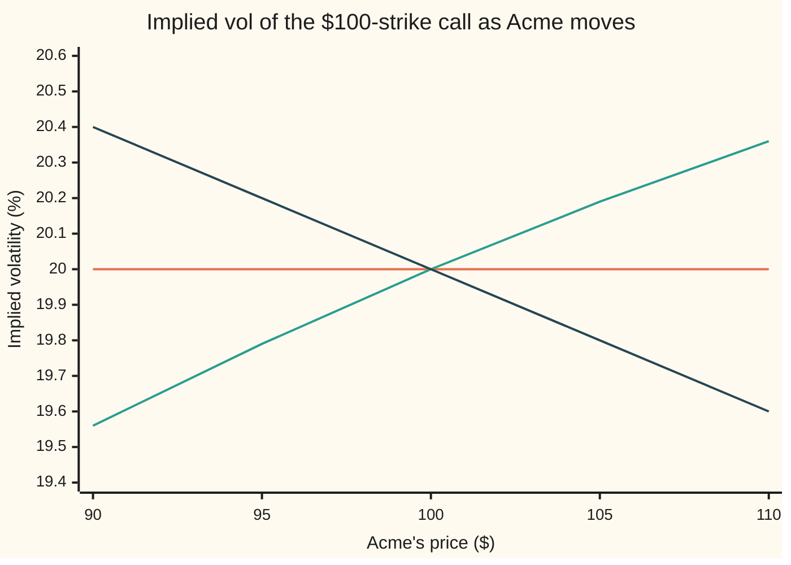
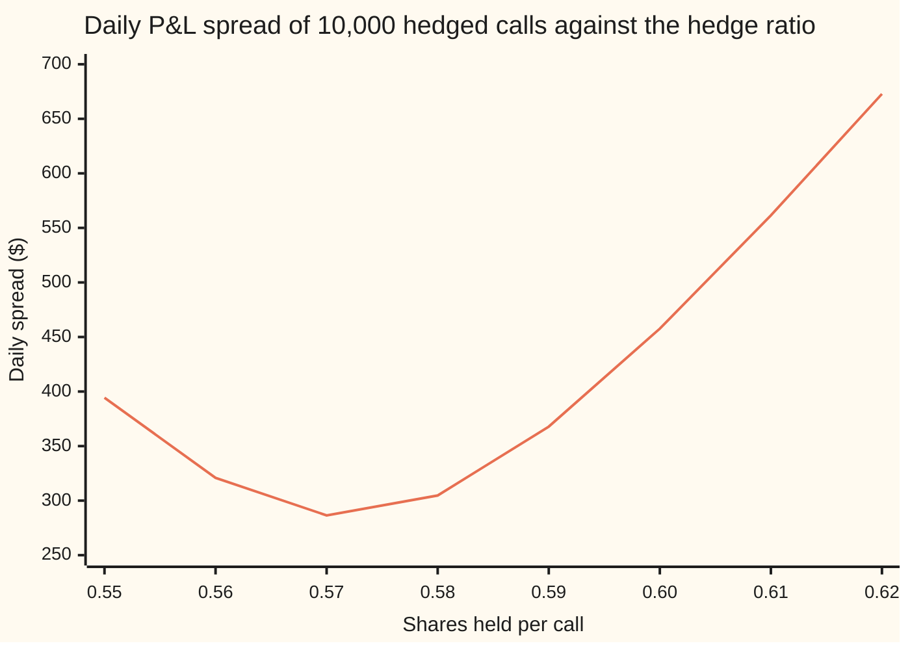

# Smile-adjusted delta: when vol moves with spot, the hedge ratio is not the Black-Scholes delta

Financial mathematics → The smile and the surface → Hedging a moving smile → Smile-adjusted delta

---

## General Overview

A dealer has sold a one-year call on Acme, struck at $100, with Acme at $100. To protect the position the dealer buys Acme shares: enough that a small rise in Acme gains on the shares what it loses on the call. That share count per option is the **hedge ratio**. Black-Scholes, with one volatility of 20%, sets it at its **delta**: 0.587 shares per call.

The market does not quote one volatility. It quotes a **skew**: the implied volatility (the volatility that makes Black-Scholes match a market price) falls as the strike rises. On this card the skew falls 0.04 volatility points for each dollar of strike: 20.40% at the $90 strike, 20.00% at $100, 19.60% at $110.

Now Acme rises a dollar. The call's price changes for two reasons. The share price moved, which Black-Scholes delta counts. And the volatility the call is marked at may have moved too, because the whole skew can slide with the share price. Which way it slides is not given by today's skew. It is a rule the desk assumes, or a pattern it measures. Under the three standard rules the $100 call needs 0.587, 0.602 or 0.572 shares. For a book of 10,000 calls, neighbouring rules differ by 151.60 shares.

The same idea does a second job. When volatility tends to fall as Acme rises, the hedge that leaves the least day-to-day wobble is the **minimum-variance delta**, found by asking how the call's price and the share price move together. With this skew and that tendency it is 0.572 shares, not 0.587.

**The hedge ratio is the Black-Scholes delta plus vega (the price change per unit of volatility) times the change in the option's own volatility per dollar of share price; the skew fixes the size of that change, and the assumed rule for how the smile moves fixes its sign.**

**What kind of fact this is:** a model. The correction formula is a theorem (the chain rule, proved in Why it works), but the answer depends on an assumed rule for how the smile moves, which no market guarantees.

### The picture: one strike's volatility under three rules

The $100-strike call's implied volatility, read off the smile after Acme has moved to each price.



Orange, flat: sticky strike, where each strike keeps its volatility. Green, rising: sticky moneyness, where the smile rides along with Acme, so the $100 strike becomes a lower strike relative to the share and picks up a higher volatility. Dark blue, falling: the local-volatility rule, where the $100 strike's volatility slides down the skew as Acme rises. All three agree at $100. Their slopes there, 0, +0.0004 and −0.0004 per dollar, are the whole story.

---

## The formula

Notation first, in words. The ordinary derivative $d\sigma/dS$ is the change in the call's own implied volatility per dollar of Acme's move, with the strike held at $100 and the smile moving by whatever rule is assumed. Vega, written $\mathcal{V}$, is the call's price change per 1.00 of volatility ([vega](../09-The%20Greeks%2C%20one%20each/03-vega.md)).

$$\Delta_{\text{smile}} \;=\; \Delta_{BS} \;+\; \mathcal{V}\,\frac{d\sigma}{dS}$$

**Read it aloud:** the shares to hold are the Black-Scholes shares, plus the price change that the volatility move brings, per dollar of the share.

The **minimum-variance delta** replaces the assumed slope with a measured one. Below, a $\delta$ in front of a symbol means its change over one day, and $V$ is the call's price. Cov is covariance, how two changes move together; Var is variance, the average squared spread of one change.

$$h^{*} \;=\; \frac{\operatorname{Cov}(\delta V,\ \delta S)}{\operatorname{Var}(\delta S)} \;\approx\; \Delta_{BS} + \mathcal{V}\,b, \qquad b = \frac{\operatorname{Cov}(\delta\sigma,\ \delta S)}{\operatorname{Var}(\delta S)}$$

**Read it aloud:** hold the share count that best explains the day's option move by the day's share move; that is the Black-Scholes delta plus vega times the typical volatility move per dollar.

| Symbol | Plain meaning | In our example | Push it up and the answer… |
| --- | --- | --- | --- |
| $S$, $V$ | Acme's price today; the call's marked price | $100 | Black-Scholes delta rises toward 1 |
| $K$ | the strike | $100 | Black-Scholes delta falls |
| $\sigma$ | the call's implied volatility | 20% | here delta falls slightly (vanna is −0.094753) |
| $\beta$ | how fast the skew falls per dollar of strike, as a decimal | 0.0004 (0.04 points) | the correction grows in proportion |
| $\Delta_{BS}$, $\Gamma$ | Black-Scholes delta, $e^{-qT}N(d_1)$; gamma, its change per dollar of Acme | 0.586851; 0.018951 | — |
| $\mathcal{V}$, $\partial$ | vega, $\partial V/\partial\sigma$, dollars per 1.00 of volatility; $\partial$ marks a slope taken with the other input frozen | 37.901158 | the correction grows in proportion |
| $d\sigma/dS$, $\Delta_{\text{smile}}$ | the option's volatility change per dollar of Acme, set by the rule; and the hedge it gives | 0, +0.0004, −0.0004; hedges 0.586851, 0.602012, 0.571691 | the hedge rises |
| $g$, $G$, $H$ | volatility as a function of $K/S$ (sticky moneyness) or of the option's own delta (literal sticky delta), and the equation $H = 0$ that pins the latter | $G'$ = 0.021108 | — |
| $h$, $h^{*}$ | shares held per call; the minimum-variance choice | $h^{*}$ = 0.571595 from 40,000 simulated days | — |
| $b$, $\delta$ | fitted volatility move per dollar of Acme; $\delta$ in front of a symbol means its change over one day | −0.000396 | the hedge rises |
| $N$, $\varphi$ | bell-curve area to the left, and bell-curve height | $N(0.25) = 0.598706$, $\varphi(0.25) = 0.386668$ | — |
| $d_1$, $r$, $q$, $T$ | distance to strike in standard deviations; bank rate; dividend yield; time to expiry in years | 0.25, 5%, 2%, 1 | — |

Helper formulas, from the Black-Scholes cards: $d_1 = [\ln(S/K) + (r - q + \tfrac12\sigma^2)T]/(\sigma\sqrt{T})$ with the bank rate $r$ = 5%, and $\mathcal{V} = S e^{-qT}\varphi(d_1)\sqrt{T}$. Both describe the call at a single volatility; the smile enters only through $d\sigma/dS$.

The three rules for how the smile moves, each written as the volatility the $100 strike carries when Acme sits at $S$:

| Rule | What stays fixed when Acme moves | Volatility at strike $K$ | $d\sigma/dS$ at $100 | Hedge |
| --- | --- | --- | --- | --- |
| Sticky strike | each strike's volatility | $0.20 - \beta(K - 100)$ | 0 | 0.586851 |
| Sticky moneyness | each ratio $K/S$'s volatility | $0.20 - 100\beta(K/S - 1)$ | +0.0004 | 0.602012 |
| Local-volatility rule | the volatility at each share price | $0.20 - \beta(K + S - 200)$ | −0.0004 | 0.571691 |

Traders call sticky moneyness **sticky delta**: when volatility depends only on $K/S$, so does the option's Black-Scholes delta, so each delta keeps its volatility. Derman (1999) names the third rule the **sticky implied tree**.

Conventions verified 24 Sep 2026 against Derman (1999), where sticky delta and sticky moneyness are treated as equivalent. Skew on this card is quoted in volatility points per dollar of strike and used as a decimal in the formulas.

### When it holds

- **Small moves.** The formula is a first slope. For a move of several dollars, gamma (how delta itself changes with the share) and vanna (how delta changes with volatility) add terms the formula leaves out.
- **The right rule.** The correction is only as good as the assumed smile motion. Choose sticky moneyness in a market that behaves like the local-volatility rule and the hedge is off by twice vega times the slope: the whole gap from 0.571691 to 0.602012.
- **A stable relationship, for the minimum-variance delta.** $b$ is fitted from past moves. If the link between Acme and its volatility changes, the fitted hedge lags.
- **A frozen clock.** The card measures one day's moves at the same time to expiry. The day's time decay shifts every outcome by the same amount, so it changes neither variance nor hedge.

---

## Why it works

### Step 0: the price depends on the share twice

The dealer marks the call at Black-Scholes with the smile's volatility for its strike. So the mark is $V(S, \sigma(S))$: the share price enters once directly and once through the volatility the smile assigns. A hedge must answer to both.

### Step 1: the chain rule adds the two routes

Nudge Acme by a small $\delta S$. The direct route moves the price by $\Delta_{BS}\,\delta S$. The volatility moves by $(d\sigma/dS)\,\delta S$, and each unit of volatility is worth $\mathcal{V}$, so that route adds $\mathcal{V}\,(d\sigma/dS)\,\delta S$. Divide by $\delta S$:

$$\frac{dV}{dS} = \frac{\partial V}{\partial S} + \frac{\partial V}{\partial \sigma}\,\frac{d\sigma}{dS} = \Delta_{BS} + \mathcal{V}\,\frac{d\sigma}{dS}.$$

This is the chain rule for a function of two inputs ([partial-derivatives](../../06-Calculus%20and%20analysis/07-Several%20Variables/01-partial-derivatives.md)). The curly $\partial$ means "with the other input frozen". Nothing here is special to options; everything that follows is about $d\sigma/dS$.

### Step 2: today's skew gives the size, the rule gives the sign

Today's smile is a curve in strike, with slope $\partial\sigma/\partial K = -\beta$. The hedge needs a slope in the share price. The two are different questions, and each rule links them differently.

- **Sticky strike.** The volatility at $K = 100$ does not depend on $S$ at all, so $d\sigma/dS = 0$ and the hedge is the Black-Scholes delta, 0.586851.
- **Sticky moneyness.** Volatility is a fixed function $g$ of $x = K/S$ alone. Raising $S$ lowers $x$, and the chain rule gives $d\sigma/dS = g'(x)\cdot(-K/S^2) = -(K/S)\,\partial\sigma/\partial K$. At the money that is $+\beta$. A falling skew makes the call's volatility **rise** as Acme rises, because the $100 strike becomes a relatively lower strike. The hedge grows to 0.602012.
- **Local-volatility rule.** A local-volatility model gives the share its own volatility at each price level. Derman's rule of thumb: an option's implied volatility is roughly the average local volatility between today's price and the strike. A skew falling at $\beta$ per dollar of strike needs local volatility falling at $2\beta$ per dollar of share price, since averaging over the stretch from $S$ to $K$ halves the slope. Averaging $0.20 - 2\beta(x - 100)$ from $x = S$ to $x = K$ gives $0.20 - \beta(K + S - 200)$, so $d\sigma/dS = -\beta$. The hedge shrinks to 0.571691.

Same skew, three signs. The skew cannot pick between them; only the market's behaviour can.

### Step 3: sticky delta taken literally needs an implicit equation

Taking "sticky delta" literally, the volatility is a fixed function $G$ of the option's own Black-Scholes delta. But that delta depends on the volatility. The volatility is defined by an equation that contains itself, $\sigma = G(\Delta_{BS}(S, \sigma))$. Differentiating both sides and solving for $d\sigma/dS$ gives

$$\frac{d\sigma}{dS} = \frac{G'\,\Gamma}{1 - G'\,\text{vanna}},$$

with $\Gamma$ = 0.018951 the call's gamma, vanna = −0.094753 ([vanna](../09-The%20Greeks%2C%20one%20each/06-vanna.md)), and $G'$ = 0.021108 the skew's slope per unit of delta. The denominator is 1.002000, so the hedge is 0.601981, against 0.602012 for sticky moneyness. The two readings of "sticky delta" agree to four decimals here.

<details>
<summary>Detailed proof: the implicit slope</summary>

Write $H(S, \sigma) = \sigma - G(\Delta_{BS}(S, \sigma))$. The marked volatility makes $H = 0$. Along the curve where $H$ stays zero, $H_S + H_\sigma\,(d\sigma/dS) = 0$. Here $H_S = -G'\,\partial\Delta_{BS}/\partial S = -G'\Gamma$ and $H_\sigma = 1 - G'\,\partial\Delta_{BS}/\partial\sigma = 1 - G'\,\text{vanna}$. Solving gives the displayed slope. It needs $1 - G'\,\text{vanna} \neq 0$; if that fails, the implicit-function step fails and the rule need not define a single hedge. Here $\lvert G'\,\text{vanna}\rvert \approx 0.002 < 1$, so repeated substitution shrinks each error about 500-fold: a solution near today's volatility exists and is unique. The slope $G'$ comes from today's skew: $\partial\Delta_{BS}/\partial K = -e^{-qT}\varphi(d_1)/(K\sigma\sqrt{T})$, so $G' = -\beta\,/\,(\partial\Delta_{BS}/\partial K)$ = 0.021108. The check solves the equation by repeated substitution at $S \pm 0.01$ and reprices; the bumped slope matches the formula to six decimals.

</details>

### Step 4: the minimum-variance delta asks the market instead

A dealer short one call and long $h$ shares gains $h\,\delta S - \delta V$ over a day. That gain has the same spread as $\delta V - h\,\delta S$, whose variance is a parabola in $h$:

$$\operatorname{Var}(\delta V - h\,\delta S) = \operatorname{Var}(\delta V) - 2h\operatorname{Cov}(\delta V, \delta S) + h^2\operatorname{Var}(\delta S).$$

The lowest point is at $h^{*} = \operatorname{Cov}(\delta V, \delta S)/\operatorname{Var}(\delta S)$, the slope of a least-squares line of $\delta V$ on $\delta S$. For small moves $\delta V \approx \Delta_{BS}\,\delta S + \mathcal{V}\,\delta\sigma$. Put that in the covariance and $h^{*} \approx \Delta_{BS} + \mathcal{V}\,b$, where $b$ is the least-squares slope of volatility moves on share moves.

So the minimum-variance delta is the smile-adjusted delta with $d\sigma/dS$ replaced by what volatility **tends** to do per dollar of share. Hull and White (2017) state it this way, citing earlier studies that set $b$ equal to the skew's slope, as the local-volatility model suggests. With $b = -\beta$ the minimum-variance delta is 0.571691. That is the "from the skew slope" answer: 0.015160 shares below the textbook 0.586851.

<details>
<summary>Detailed proof: the minimum and what it leaves behind</summary>

Complete the square: $\operatorname{Var}(\delta V - h\,\delta S) = \operatorname{Var}(\delta V) - c^2/v + v\,(h - c/v)^2$, where $c = \operatorname{Cov}(\delta V, \delta S)$ and $v = \operatorname{Var}(\delta S) > 0$. The last term is zero only at $h = c/v$, so the minimum is unique. The saving over any other hedge $h$ is $v\,(h - h^{*})^2$. At the Black-Scholes hedge that saving is $v\,(\mathcal{V}b)^2$, a spread of $\mathcal{V}\,\lvert b\rvert\,\sqrt{v}$. In the simulation: vega 37.901158 × 0.0004 × a daily spot spread of $1.258324 is $190.77 per 10,000 calls, against $191.97 measured by full repricing. If $v = 0$ the share never moves, and every $h$ leaves the same variance.

</details>

The simulation behind those numbers draws 40,000 days in which Acme's move has a spread of $1.258324 and the $100-strike volatility moves by $-0.0004$ per dollar plus an independent wobble of 0.05 points. That gives a spot-volatility correlation of −0.703965. Every day is repriced in full, and a least-squares line through the outcomes gives $h^{*}$ = 0.571595, next to $\Delta_{BS} + \mathcal{V}\hat{b}$ = 0.571844 with the fitted slope.

The hedge ratio also depends on how the full surface moves across expiries, not just this one-year strike. For a smile quoted in delta, as in currency markets, the same correction reappears with its own conventions, on [smile-adjusted-delta-and-sticky-delta](../22-The%20FX%20smile%20-%20risk%20reversals%2C%20butterflies%20and%20vanna-volga/06-smile-adjusted-delta-and-sticky-delta.md).

---

## Worked numbers, by hand

Acme: $S = K = 100$, $r = 5\%$, $q = 2\%$, $\sigma = 20\%$, $T = 1$; skew slope $\beta = 0.0004$ per dollar of strike.

| Step | Arithmetic | Value |
| --- | --- | --- |
| $d_1$ | $(0 + 0.05 - 0.02 + 0.02)/0.20$ | 0.250000 |
| $N(d_1)$ | bell-curve area | 0.598706 |
| $\Delta_{BS}$ | $e^{-0.02} \times 0.598706$ | 0.586851 |
| $\varphi(d_1)$ | bell-curve height at 0.25 | 0.386668 |
| $\mathcal{V}$ | $100 \times e^{-0.02} \times 0.386668 \times 1$ | 37.901158 |
| vega times skew | $37.901158 \times 0.0004$ | 0.015160 |
| sticky strike | $0.586851 + 0$ | **0.586851** |
| sticky moneyness | $0.586851 + 0.015160$ | **0.602012** |
| local-volatility rule, and minimum variance with $b = -\beta$ | $0.586851 - 0.015160$ | **0.571691** |
| gap for 10,000 calls | $10{,}000 \times 0.015160$ | 151.60 shares |

A dealer short 10,000 of these calls who hedges at the textbook delta, while Acme's volatility behaves like the local-volatility rule, holds 151.60 surplus shares: each day they turn the hedge into a small bet that Acme will rise.

### What breaks if you drop a piece

| Mistake | Comes out at | What went wrong |
| --- | --- | --- |
| Sticky moneyness, but the shift given the skew's sign | 0.571691 (right: 0.602012) | The skew falls in strike; under sticky moneyness the option's own volatility rises with the share |
| Sticky strike, but the at-the-money quote's move taken as the option's | 0.571691 (right: 0.586851) | The at-the-money quote changes strike as Acme moves; the $100 option's volatility does not |
| Vega per 1.00 of volatility times a slope in points | −0.929195 (right: 0.571691) | Vega per 1.00 needs the slope as a decimal, −0.0004, not −0.04 points |
| Textbook delta in a market that follows the local-volatility rule | $344.27 daily spread per 10,000 calls (right hedge: $285.78) | The volatility move that comes with a share move is left unhedged |

---

## Code, from first principles, and it actually runs

The check computes every hedge two independent ways. Road one is the formula: Black-Scholes delta plus vega times the rule's slope. Road two moves Acme a cent each way, re-marks the volatility by the rule, reprices the call in full and takes the slope. The literal sticky-delta rule is solved by repeated substitution before repricing. The minimum-variance delta comes from a third road: 40,000 simulated days, each repriced in full, with a least-squares line through them. The bell-curve area is a series written out in the code, and the random numbers come from a generator written out in the code. Nothing imported knows the answer.

### Python

```python
# Smile-adjusted delta -- the check behind the card.  Standard library only.
# The normal CDF is a series written out here, the random numbers come from a
# splitmix64 generator written out here, and the regression is two sums.
from math import log, sqrt, exp, pi, cos

S0, K, r, q, T = 100.0, 100.0, 0.05, 0.02, 1.0
SIG0, BETA = 0.20, 0.0004          # at-the-money vol; skew falls 0.0004 (0.04 points) per $ of strike

def phi(x): return exp(-0.5 * x * x) / sqrt(2.0 * pi)

def N(x):                           # 0.5 + phi(x) * (x + x^3/3 + x^5/(3*5) + ...)
    term, total, n = x, x, 1
    while abs(term) > 1e-17 * max(1.0, abs(total)):
        n += 2; term *= x * x / n; total += term
    return 0.5 + phi(x) * total

def d1(S, sig): return (log(S / K) + (r - q + 0.5 * sig * sig) * T) / (sig * sqrt(T))
def call(S, sig):
    a = d1(S, sig)
    return S * exp(-q * T) * N(a) - K * exp(-r * T) * N(a - sig * sqrt(T))
def delta(S, sig): return exp(-q * T) * N(d1(S, sig))
def vega(S, sig): return S * exp(-q * T) * phi(d1(S, sig)) * sqrt(T)
def gamma(S, sig): return exp(-q * T) * phi(d1(S, sig)) / (S * sig * sqrt(T))
def vanna(S, sig): return -exp(-q * T) * phi(d1(S, sig)) * (d1(S, sig) - sig * sqrt(T)) / sig

rules = {                            # the vol the K = 100 option is marked at, when Acme is at S
    "sticky strike": lambda S: SIG0 - BETA * (K - S0),
    "sticky moneyness": lambda S: SIG0 - BETA * S0 * (K / S - 1.0),
    "local-vol rule": lambda S: SIG0 - BETA * (K + S - 2.0 * S0),
}
slopes = {"sticky strike": 0.0, "sticky moneyness": BETA, "local-vol rule": -BETA}   # d sigma / dS, by hand
dl, vg, gm, vn = delta(S0, SIG0), vega(S0, SIG0), gamma(S0, SIG0), vanna(S0, SIG0)
print(f"{'d1':<34}{d1(S0, SIG0):12.6f}")
print(f"{'N(d1)':<34}{N(d1(S0, SIG0)):12.6f}")
print(f"{'phi(d1), bell-curve height':<34}{phi(d1(S0, SIG0)):12.6f}")
print(f"{'BS delta e^-qT N(d1)':<34}{dl:12.6f}")
print(f"{'vega, per 1.00 of vol':<34}{vg:12.6f}")
print(f"{'vega x 0.0004':<34}{vg * BETA:12.6f}")
out = {}
for name, rule in rules.items():                 # road 1: chain rule.  road 2: bump spot, remark, reprice
    formula = dl + vg * slopes[name]
    h = 0.01
    bumped = (call(S0 + h, rule(S0 + h)) - call(S0 - h, rule(S0 - h))) / (2 * h)
    out[name] = (formula, bumped)
    print(f"{name + ', formula':<34}{formula:12.6f}")
    print(f"{name + ', bump and reprice':<34}{bumped:12.6f}")

# strict sticky delta: the vol is a fixed function G of the option's own BS delta
dDdK = -exp(-q * T) * phi(d1(S0, SIG0)) / (K * SIG0 * sqrt(T))   # how delta changes with strike
Gp = -BETA / dDdK                                                  # skew slope, re-expressed per unit of delta
sigS = Gp * gm / (1.0 - Gp * vn)
def solve_vol(S):                                                  # sigma = G(delta(S, sigma)), by iteration
    sig = SIG0
    for _ in range(60): sig = SIG0 + Gp * (delta(S, sig) - dl)
    return sig
strict_bump = (call(S0 + 0.01, solve_vol(S0 + 0.01)) - call(S0 - 0.01, solve_vol(S0 - 0.01))) / 0.02
print(f"{'gamma':<34}{gm:12.6f}")
print(f"{'vanna':<34}{vn:12.6f}")
print(f"{'G prime, vol per unit of delta':<34}{Gp:12.6f}")
print(f"{'1 - G prime x vanna':<34}{1.0 - Gp * vn:12.6f}")
print(f"{'strict sticky delta, formula':<34}{dl + vg * sigS:12.6f}")
print(f"{'strict sticky delta, bump':<34}{strict_bump:12.6f}")

# minimum-variance delta: simulate one day of joint spot and vol moves, reprice fully, regress
state = 20260919
def uniform():
    global state
    state = (state + 0x9E3779B97F4A7C15) & 0xFFFFFFFFFFFFFFFF
    z = state
    z = ((z ^ (z >> 30)) * 0xBF58476D1CE4E5B9) & 0xFFFFFFFFFFFFFFFF
    z = ((z ^ (z >> 27)) * 0x94D049BB133111EB) & 0xFFFFFFFFFFFFFFFF
    return ((z ^ (z >> 31)) >> 11) / 9007199254740992.0 + 0.5 / 9007199254740992.0
def normal_pair():
    u1, u2 = uniform(), uniform()
    rad = sqrt(-2.0 * log(u1))
    return rad * cos(2.0 * pi * u2), rad * cos(2.0 * pi * u2 - 0.5 * pi)
B, ETA, DT, PAIRS = -BETA, 0.0005, 1.0 / 252.0, 20000
dS, dV, dsig = [], [], []
C0 = call(S0, SIG0)
for _ in range(PAIRS):
    z1, z2 = normal_pair()
    for sgn in (1.0, -1.0):                                          # antithetic pair
        ds = sgn * S0 * SIG0 * sqrt(DT) * z1
        dv = B * ds + sgn * ETA * z2
        dS.append(ds); dsig.append(dv); dV.append(call(S0 + ds, SIG0 + dv) - C0)
n = len(dS)
def cov(a, b):
    ma, mb = sum(a) / n, sum(b) / n
    return sum((x - ma) * (y - mb) for x, y in zip(a, b)) / n
vS, vs = cov(dS, dS), cov(dsig, dsig)
h_star = cov(dV, dS) / vS
b_hat = cov(dsig, dS) / vS
rho = cov(dsig, dS) / sqrt(vS * vs)
def resid_sd(h): return sqrt(cov([v - h * s for v, s in zip(dV, dS)], [v - h * s for v, s in zip(dV, dS)]))
print(f"{'simulated days':<34}{n:12d}")
print(f"{'daily spot move sd, $':<34}{sqrt(vS):12.6f}")
print(f"{'spot-vol correlation':<34}{rho:12.6f}")
print(f"{'vol-on-spot slope, fitted':<34}{b_hat:12.6f}")
print(f"{'min-variance delta, regression':<34}{h_star:12.6f}")
print(f"{'min-variance delta, BS + vega x b':<34}{dl + vg * b_hat:12.6f}")
sd_bs, sd_mv = resid_sd(dl), resid_sd(h_star)
print(f"{'daily P&L sd per 10,000, BS delta':<34}{10000 * sd_bs:12.2f}")
print(f"{'daily P&L sd per 10,000, MV delta':<34}{10000 * sd_mv:12.2f}")
cut = sqrt(sd_bs ** 2 - sd_mv ** 2)                                  # the part of the P&L the MV hedge removes
cut_pred = vg * abs(B) * sqrt(vS)                                     # vega x |b| x sd of the spot move
print(f"{'removed sd per 10,000, measured':<34}{10000 * cut:12.2f}")
print(f"{'removed sd per 10,000, vega b sd':<34}{10000 * cut_pred:12.2f}")
print("chart, hedge ratio   " + " ".join(f"{0.55 + 0.01 * i:6.2f}" for i in range(8)))
print("chart, sd per 10,000 " + " ".join(f"{10000 * resid_sd(0.55 + 0.01 * i):6.2f}" for i in range(8)))
print("smile today, strike   " + "".join(f"{k:7.0f}" for k in (90.0, 95.0, 100.0, 105.0, 110.0)))
print("smile today, vol %    " + "".join(f"{100 * (SIG0 - BETA * (k - S0)):7.2f}" for k in (90.0, 95.0, 100.0, 105.0, 110.0)))
print("chart, Acme price     " + "".join(f"{s:7.0f}" for s in (90.0, 95.0, 100.0, 105.0, 110.0)))
for name, tag in (("sticky strike", "strike"), ("sticky moneyness", "moneyness"), ("local-vol rule", "local-vol")):
    print(f"chart, vol % {tag:<9}" + "".join(f"{100 * rules[name](s):7.2f}" for s in (90.0, 95.0, 100.0, 105.0, 110.0)))

# what breaks, and try changing
print(f"{'wrong: shift of -vega x 0.0004':<34}{dl - vg * BETA:12.6f}")
print(f"{'wrong: vega per 1.00 x -0.04':<34}{dl + vg * (-0.04):12.6f}")
print(f"{'shares per 10,000 calls, gap':<34}{10000 * vg * BETA:12.2f}")
print(f"{'put: BS delta':<34}{dl - exp(-q * T):12.6f}")
print(f"{'put: local-vol rule':<34}{dl - exp(-q * T) - vg * BETA:12.6f}")
pts = ((92.15, 0.24), (100.0, 0.20), (119.93, 0.18))                 # the shelf's house smile
(x0, y0), (x1, y1), (x2, y2) = pts
house = (y0 * (x1 - x2) / ((x0 - x1) * (x0 - x2)) + y1 * (2 * x1 - x0 - x2) / ((x1 - x0) * (x1 - x2))
         + y2 * (x1 - x0) / ((x2 - x0) * (x2 - x1)))                # slope at 100 of the parabola through them
print(f"{'house smile slope at 100, per $':<34}{house:12.6f}")
print(f"{'house smile, local-vol rule':<34}{dl + vg * house:12.6f}")

for name, (formula, bumped) in out.items():
    assert abs(formula - bumped) < 1e-6, name                     # chain rule vs full reprice, each rule
assert abs((dl + vg * sigS) - strict_bump) < 1e-6                  # implicit rule vs solve-and-reprice
assert abs(h_star - (dl + vg * B)) < 1e-3                          # regression vs chain rule with the true b
assert abs(cut / cut_pred - 1.0) < 0.03                            # risk removed vs vega x b x sd(dS)
print("ALL CHECKS PASS")
```

**Ran 2026-09-19 on macOS, Python 3.14.6, standard library only. All checks passed. Output, pasted from the run:**

```
d1                                    0.250000
N(d1)                                 0.598706
phi(d1), bell-curve height            0.386668
BS delta e^-qT N(d1)                  0.586851
vega, per 1.00 of vol                37.901158
vega x 0.0004                         0.015160
sticky strike, formula                0.586851
sticky strike, bump and reprice       0.586851
sticky moneyness, formula             0.602012
sticky moneyness, bump and reprice    0.602012
local-vol rule, formula               0.571691
local-vol rule, bump and reprice      0.571691
gamma                                 0.018951
vanna                                -0.094753
G prime, vol per unit of delta        0.021108
1 - G prime x vanna                   1.002000
strict sticky delta, formula          0.601981
strict sticky delta, bump             0.601981
simulated days                           40000
daily spot move sd, $                 1.258324
spot-vol correlation                 -0.703965
vol-on-spot slope, fitted            -0.000396
min-variance delta, regression        0.571595
min-variance delta, BS + vega x b     0.571844
daily P&L sd per 10,000, BS delta       344.27
daily P&L sd per 10,000, MV delta       285.78
removed sd per 10,000, measured         191.97
removed sd per 10,000, vega b sd        190.77
chart, hedge ratio     0.55   0.56   0.57   0.58   0.59   0.60   0.61   0.62
chart, sd per 10,000 394.35 320.87 286.49 304.72 367.84 457.63 561.43 672.80
smile today, strike        90     95    100    105    110
smile today, vol %      20.40  20.20  20.00  19.80  19.60
chart, Acme price          90     95    100    105    110
chart, vol % strike     20.00  20.00  20.00  20.00  20.00
chart, vol % moneyness  19.56  19.79  20.00  20.19  20.36
chart, vol % local-vol  20.40  20.20  20.00  19.80  19.60
wrong: shift of -vega x 0.0004        0.571691
wrong: vega per 1.00 x -0.04         -0.929195
shares per 10,000 calls, gap            151.60
put: BS delta                        -0.393348
put: local-vol rule                  -0.408508
house smile slope at 100, per $      -0.003939
house smile, local-vol rule           0.437550
ALL CHECKS PASS
```

The formula and the reprice agree to six decimals for every rule. The simulated minimum-variance delta, 0.571595, sits just below the formula's 0.571691; the gap is sampling noise and the small gamma and vanna terms the formula drops.

### Rust

Same inputs, same generator, same labels. Built with `rustc --edition 2021 -O`.

```rust
// Smile-adjusted delta -- the same check as the Python, in Rust.  Std only, no crates.
// The normal CDF is a series written out here, the random numbers come from a
// splitmix64 generator written out here, and the regression is two sums.
use std::f64::consts::PI;

const S0: f64 = 100.0; const K: f64 = 100.0; const R: f64 = 0.05; const Q: f64 = 0.02; const T: f64 = 1.0;
const SIG0: f64 = 0.20; const BETA: f64 = 0.0004;   // at-the-money vol; skew falls 0.0004 per $ of strike

fn phi(x: f64) -> f64 { (-0.5 * x * x).exp() / (2.0 * PI).sqrt() }
fn n_cdf(x: f64) -> f64 {                             // 0.5 + phi(x) * (x + x^3/3 + x^5/(3*5) + ...)
    let (mut term, mut total, mut n) = (x, x, 1.0);
    while term.abs() > 1e-17 * total.abs().max(1.0) { n += 2.0; term *= x * x / n; total += term; }
    0.5 + phi(x) * total
}
fn d1(s: f64, sig: f64) -> f64 { ((s / K).ln() + (R - Q + 0.5 * sig * sig) * T) / (sig * T.sqrt()) }
fn call(s: f64, sig: f64) -> f64 {
    let a = d1(s, sig);
    s * (-Q * T).exp() * n_cdf(a) - K * (-R * T).exp() * n_cdf(a - sig * T.sqrt())
}
fn delta(s: f64, sig: f64) -> f64 { (-Q * T).exp() * n_cdf(d1(s, sig)) }
fn vega(s: f64, sig: f64) -> f64 { s * (-Q * T).exp() * phi(d1(s, sig)) * T.sqrt() }
fn gamma(s: f64, sig: f64) -> f64 { (-Q * T).exp() * phi(d1(s, sig)) / (s * sig * T.sqrt()) }
fn vanna(s: f64, sig: f64) -> f64 { -(-Q * T).exp() * phi(d1(s, sig)) * (d1(s, sig) - sig * T.sqrt()) / sig }

fn rule(which: usize, s: f64) -> f64 {                // the vol the K = 100 option is marked at, Acme at s
    match which { 0 => SIG0 - BETA * (K - S0), 1 => SIG0 - BETA * S0 * (K / s - 1.0), _ => SIG0 - BETA * (K + s - 2.0 * S0) }
}
fn row(label: &str, v: f64) { println!("{:<34}{:12.6}", label, v); }
fn row2(label: &str, v: f64) { println!("{:<34}{:12.2}", label, v); }

struct Rng(u64);
impl Rng {
    fn uniform(&mut self) -> f64 {
        self.0 = self.0.wrapping_add(0x9E3779B97F4A7C15);
        let mut z = self.0;
        z = (z ^ (z >> 30)).wrapping_mul(0xBF58476D1CE4E5B9);
        z = (z ^ (z >> 27)).wrapping_mul(0x94D049BB133111EB);
        ((z ^ (z >> 31)) >> 11) as f64 / 9007199254740992.0 + 0.5 / 9007199254740992.0
    }
    fn normal_pair(&mut self) -> (f64, f64) {
        let (u1, u2) = (self.uniform(), self.uniform());
        let rad = (-2.0 * u1.ln()).sqrt();
        (rad * (2.0 * PI * u2).cos(), rad * (2.0 * PI * u2 - 0.5 * PI).cos())
    }
}
fn cov(a: &[f64], b: &[f64]) -> f64 {
    let n = a.len() as f64;
    let (ma, mb) = (a.iter().sum::<f64>() / n, b.iter().sum::<f64>() / n);
    a.iter().zip(b).map(|(x, y)| (x - ma) * (y - mb)).sum::<f64>() / n
}

fn main() {
    let names = ["sticky strike", "sticky moneyness", "local-vol rule"];
    let slopes = [0.0, BETA, -BETA];                  // d sigma / dS, by hand
    let (dl, vg, gm, vn) = (delta(S0, SIG0), vega(S0, SIG0), gamma(S0, SIG0), vanna(S0, SIG0));
    row("d1", d1(S0, SIG0));
    row("N(d1)", n_cdf(d1(S0, SIG0)));
    row("phi(d1), bell-curve height", phi(d1(S0, SIG0)));
    row("BS delta e^-qT N(d1)", dl);
    row("vega, per 1.00 of vol", vg);
    row("vega x 0.0004", vg * BETA);
    let mut out = Vec::new();
    for i in 0..3 {                                   // road 1: chain rule.  road 2: bump spot, remark, reprice
        let formula = dl + vg * slopes[i];
        let h = 0.01;
        let bumped = (call(S0 + h, rule(i, S0 + h)) - call(S0 - h, rule(i, S0 - h))) / (2.0 * h);
        out.push((formula, bumped));
        row(&format!("{}, formula", names[i]), formula);
        row(&format!("{}, bump and reprice", names[i]), bumped);
    }

    // strict sticky delta: the vol is a fixed function G of the option's own BS delta
    let ddk = -(-Q * T).exp() * phi(d1(S0, SIG0)) / (K * SIG0 * T.sqrt());   // how delta changes with strike
    let gp = -BETA / ddk;                                                    // skew slope per unit of delta
    let sig_s = gp * gm / (1.0 - gp * vn);
    let solve_vol = |s: f64| { let mut sig = SIG0; for _ in 0..60 { sig = SIG0 + gp * (delta(s, sig) - dl); } sig };
    let strict_bump = (call(S0 + 0.01, solve_vol(S0 + 0.01)) - call(S0 - 0.01, solve_vol(S0 - 0.01))) / 0.02;
    row("gamma", gm);
    row("vanna", vn);
    row("G prime, vol per unit of delta", gp);
    row("1 - G prime x vanna", 1.0 - gp * vn);
    row("strict sticky delta, formula", dl + vg * sig_s);
    row("strict sticky delta, bump", strict_bump);

    // minimum-variance delta: simulate one day of joint spot and vol moves, reprice fully, regress
    let (b, eta, dt, pairs): (f64, f64, f64, usize) = (-BETA, 0.0005, 1.0 / 252.0, 20000);
    let mut rng = Rng(20260919);
    let (mut d_s, mut d_v, mut d_sig) = (Vec::new(), Vec::new(), Vec::new());
    let c0 = call(S0, SIG0);
    for _ in 0..pairs {
        let (z1, z2) = rng.normal_pair();
        for sgn in [1.0, -1.0] {                                             // antithetic pair
            let ds = sgn * S0 * SIG0 * dt.sqrt() * z1;
            let dv = b * ds + sgn * eta * z2;
            d_s.push(ds); d_sig.push(dv); d_v.push(call(S0 + ds, SIG0 + dv) - c0);
        }
    }
    let (v_s, v_sig) = (cov(&d_s, &d_s), cov(&d_sig, &d_sig));
    let h_star = cov(&d_v, &d_s) / v_s;
    let b_hat = cov(&d_sig, &d_s) / v_s;
    let rho = cov(&d_sig, &d_s) / (v_s * v_sig).sqrt();
    let resid_sd = |h: f64| { let e: Vec<f64> = d_v.iter().zip(&d_s).map(|(v, s)| v - h * s).collect(); cov(&e, &e).sqrt() };
    println!("{:<34}{:12}", "simulated days", d_s.len());
    row("daily spot move sd, $", v_s.sqrt());
    row("spot-vol correlation", rho);
    row("vol-on-spot slope, fitted", b_hat);
    row("min-variance delta, regression", h_star);
    row("min-variance delta, BS + vega x b", dl + vg * b_hat);
    let (sd_bs, sd_mv) = (resid_sd(dl), resid_sd(h_star));
    row2("daily P&L sd per 10,000, BS delta", 10000.0 * sd_bs);
    row2("daily P&L sd per 10,000, MV delta", 10000.0 * sd_mv);
    let cut = (sd_bs * sd_bs - sd_mv * sd_mv).sqrt();                        // the part the MV hedge removes
    let cut_pred = vg * b.abs() * v_s.sqrt();                                // vega x |b| x sd of the spot move
    row2("removed sd per 10,000, measured", 10000.0 * cut);
    row2("removed sd per 10,000, vega b sd", 10000.0 * cut_pred);
    let hs: Vec<String> = (0..8).map(|i| format!("{:6.2}", 0.55 + 0.01 * i as f64)).collect();
    println!("chart, hedge ratio   {}", hs.join(" "));
    let sds: Vec<String> = (0..8).map(|i| format!("{:6.2}", 10000.0 * resid_sd(0.55 + 0.01 * i as f64))).collect();
    println!("chart, sd per 10,000 {}", sds.join(" "));
    let spots = [90.0, 95.0, 100.0, 105.0, 110.0];
    println!("smile today, strike   {}", spots.iter().map(|k| format!("{:7.0}", k)).collect::<String>());
    println!("smile today, vol %    {}", spots.iter().map(|&k| format!("{:7.2}", 100.0 * (SIG0 - BETA * (k - S0)))).collect::<String>());
    println!("chart, Acme price     {}", spots.iter().map(|s| format!("{:7.0}", s)).collect::<String>());
    for (i, tag) in ["strike", "moneyness", "local-vol"].iter().enumerate() {
        println!("chart, vol % {:<9}{}", tag, spots.iter().map(|&s| format!("{:7.2}", 100.0 * rule(i, s))).collect::<String>());
    }

    // what breaks, and try changing
    row("wrong: shift of -vega x 0.0004", dl - vg * BETA);
    row("wrong: vega per 1.00 x -0.04", dl + vg * (-0.04));
    row2("shares per 10,000 calls, gap", 10000.0 * vg * BETA);
    row("put: BS delta", dl - (-Q * T).exp());
    row("put: local-vol rule", dl - (-Q * T).exp() - vg * BETA);
    let ((x0, y0), (x1, y1), (x2, y2)) = ((92.15, 0.24), (100.0, 0.20), (119.93, 0.18));   // the house smile
    let house = y0 * (x1 - x2) / ((x0 - x1) * (x0 - x2)) + y1 * (2.0 * x1 - x0 - x2) / ((x1 - x0) * (x1 - x2))
        + y2 * (x1 - x0) / ((x2 - x0) * (x2 - x1));                          // slope at 100 of the parabola
    row("house smile slope at 100, per $", house);
    row("house smile, local-vol rule", dl + vg * house);

    for (i, (formula, bumped)) in out.iter().enumerate() {
        assert!((formula - bumped).abs() < 1e-6, "{}", names[i]);         // chain rule vs full reprice
    }
    assert!(((dl + vg * sig_s) - strict_bump).abs() < 1e-6);                // implicit rule vs solve-and-reprice
    assert!((h_star - (dl + vg * b)).abs() < 1e-3);                         // regression vs chain rule, true b
    assert!((cut / cut_pred - 1.0).abs() < 0.03);                           // risk removed vs vega x b x sd(dS)
    println!("ALL CHECKS PASS");
}
```

**Ran 2026-09-19 on macOS, rustc 1.98.1, no crates. All checks passed. Output, pasted from the run:**

```
d1                                    0.250000
N(d1)                                 0.598706
phi(d1), bell-curve height            0.386668
BS delta e^-qT N(d1)                  0.586851
vega, per 1.00 of vol                37.901158
vega x 0.0004                         0.015160
sticky strike, formula                0.586851
sticky strike, bump and reprice       0.586851
sticky moneyness, formula             0.602012
sticky moneyness, bump and reprice    0.602012
local-vol rule, formula               0.571691
local-vol rule, bump and reprice      0.571691
gamma                                 0.018951
vanna                                -0.094753
G prime, vol per unit of delta        0.021108
1 - G prime x vanna                   1.002000
strict sticky delta, formula          0.601981
strict sticky delta, bump             0.601981
simulated days                           40000
daily spot move sd, $                 1.258324
spot-vol correlation                 -0.703965
vol-on-spot slope, fitted            -0.000396
min-variance delta, regression        0.571595
min-variance delta, BS + vega x b     0.571844
daily P&L sd per 10,000, BS delta       344.27
daily P&L sd per 10,000, MV delta       285.78
removed sd per 10,000, measured         191.97
removed sd per 10,000, vega b sd        190.77
chart, hedge ratio     0.55   0.56   0.57   0.58   0.59   0.60   0.61   0.62
chart, sd per 10,000 394.35 320.87 286.49 304.72 367.84 457.63 561.43 672.80
smile today, strike        90     95    100    105    110
smile today, vol %      20.40  20.20  20.00  19.80  19.60
chart, Acme price          90     95    100    105    110
chart, vol % strike     20.00  20.00  20.00  20.00  20.00
chart, vol % moneyness  19.56  19.79  20.00  20.19  20.36
chart, vol % local-vol  20.40  20.20  20.00  19.80  19.60
wrong: shift of -vega x 0.0004        0.571691
wrong: vega per 1.00 x -0.04         -0.929195
shares per 10,000 calls, gap            151.60
put: BS delta                        -0.393348
put: local-vol rule                  -0.408508
house smile slope at 100, per $      -0.003939
house smile, local-vol rule           0.437550
ALL CHECKS PASS
```

The two outputs match line for line.

### How the leftover risk depends on the hedge

The simulated days give the daily spread of the hedged position for any hedge ratio, per 10,000 calls:



One line: the daily spread in dollars. It bottoms out near 0.57 shares, at $285.78 for the exact minimum 0.571595. The textbook 0.586851 leaves $344.27. What never goes away is gamma's share of the risk and the volatility wobble unrelated to Acme's move; no share count can hedge either.

> [!TIP]
> **Try changing**
> Guess first, then run it.
> - **Hedge a put.** A put on the same strike has the same vega, so the correction is the same number of shares: the Black-Scholes put delta −0.393348 becomes −0.408508 under the local-volatility rule. The put's hedge grows in size.
> - **Use the shelf's house smile.** Its one-year quotes, 24% at $92.15, 20% at $100 and 18% at $119.93, give a parabola sloping −0.003939 per dollar at $100, far steeper than this card's skew. The local-volatility hedge falls to 0.437550. A slope that steep strains a first-order formula, which is why desks fit a smooth smile first ([svi-smile-fit](04-svi-smile-fit.md)).
> - **Switch the market to sticky strike.** On the simulation line, set `B` to `0.0`. The simulated volatility no longer follows Acme, the fitted slope goes to about zero, and the regression lands back near the Black-Scholes delta, 0.586851. The last check then stops the run with a division by zero, because the removed spread it predicts is zero.
> - **Make the wobble vanish.** On the same line, set `ETA` to `0.0`. Volatility now moves only with Acme, the correlation becomes −1, and the minimum-variance hedge removes the whole vega risk; only gamma's share of the spread is left.

---

## The usual mistake

> [!warning]
> **"The skew slopes down, so a sticky-delta hedge is smaller."** It is the other way round. Under sticky moneyness the $100 strike becomes a relatively lower strike as Acme rises, and lower strikes carry higher volatility. The call's hedge rises from 0.586851 to 0.602012. The smaller hedge, 0.571691, belongs to the local-volatility rule and to the minimum-variance delta when volatility falls as the share rises. Derman (1999) records the directions: sticky delta above Black-Scholes, sticky implied tree below.
>
> - **Reading the at-the-money quote as the option's volatility.** Under sticky strike the at-the-money volatility moves as Acme moves, because "at the money" becomes a different strike. The $100 option's volatility stays put, and so does its hedge.
> - **Units.** Vega per 1.00 of volatility times a slope quoted in points gives −0.929195 shares per call. Keep both in decimals, or both in points.
> - **Treating the minimum-variance delta as model-free.** It is a regression on past days. If the spot-volatility link weakens, the fitted $b$ is stale and the hedge carries a bet.
> - **Opposite shifts for calls and puts.** Both have the same vega, so both shift by the same 0.015160 shares in the same direction.

---

## Where you meet it in real life

- **Equity index desks.** Index volatility tends to rise when the index falls. Hull and White (2017) fit a model for the minimum-variance delta to S&P 500 options; out of sample it hedged better than the Black-Scholes delta, and better than stochastic- or local-volatility models.
- **Risk systems.** Pricing libraries ask which rule to use when spot is bumped. The choice changes every reported delta on the book, as the 151.60-share gap shows.
- **Currency options.** Currency smiles are quoted by delta, so sticky delta is the natural rule and the literal implicit equation of Step 3 is in daily use: [smile-adjusted-delta-and-sticky-delta](../22-The%20FX%20smile%20-%20risk%20reversals%2C%20butterflies%20and%20vanna-volga/06-smile-adjusted-delta-and-sticky-delta.md).
- **Reading the smile first.** The slope $\beta$ comes from the skew on [volatility-smile-and-skew](01-volatility-smile-and-skew.md), ideally from a fitted curve on [svi-smile-fit](04-svi-smile-fit.md). A rule that moves the whole surface must keep it free of arbitrage across strikes and dates: [volatility-surface-and-its-arbitrage-rules](03-volatility-surface-and-its-arbitrage-rules.md), and across expiries [term-structure-and-forward-volatility](02-term-structure-and-forward-volatility.md).

> **Say it back**
> A call's mark depends on the share price directly and through the volatility the smile assigns it. The chain rule adds the two: Black-Scholes delta plus vega times the option's volatility change per dollar of share. Today's skew sets the size of that change, but the rule for how the smile moves sets its sign: zero under sticky strike, up under sticky moneyness, down under the local-volatility rule. The minimum-variance delta measures the change instead of assuming it. For the Acme call the hedge is 0.587, 0.602 or 0.572 shares.

---

## What this builds on

- [svi-smile-fit](04-svi-smile-fit.md): a smooth smile across strikes, whose slope at any strike is the $\beta$ this card needs.
- [vanna](../09-The%20Greeks%2C%20one%20each/06-vanna.md): how delta changes with volatility; it sets the denominator of the literal sticky-delta rule and the size of the terms the first-order formula drops.

## Where this goes next

- [smile-adjusted-delta-and-sticky-delta](../22-The%20FX%20smile%20-%20risk%20reversals%2C%20butterflies%20and%20vanna-volga/06-smile-adjusted-delta-and-sticky-delta.md): the same correction where the smile is quoted in delta, with premium and currency conventions that change what "delta" means.
- [dupire-local-volatility](../13-Local%20volatility%20and%20jumps/01-dupire-local-volatility.md): the local-volatility model behind this card's third rule, built from the whole surface.

This card leaves the rule as an input; the currency card shows how a market that quotes its smile by delta makes the choice for the desk.

---

## Sources

Verified 24 Sep 2026: every link below resolves to the publisher's or author's page and names the work.

- Derman, Emanuel. "Regimes of Volatility." *Risk*, April 1999. [Author's page](https://emanuelderman.com/regimes-of-volatility-risk-april-1999/). The sticky-strike, sticky-delta and sticky-implied-tree rules, their formulas, and which way each moves delta.
- Hull, John, and Alan White. "Optimal Delta Hedging for Options." *Journal of Banking & Finance* 82 (2017): 180–190. [doi:10.1016/j.jbankfin.2017.05.006](https://doi.org/10.1016/j.jbankfin.2017.05.006). The minimum-variance delta as Black-Scholes delta plus vega times the expected volatility move, fitted to index options.
- Gatheral, Jim. *The Volatility Surface: A Practitioner's Guide*. Wiley, 2006. [Publisher page](https://www.wiley.com/en-us/The+Volatility+Surface%3A+A+Practitioner%27s+Guide-p-9780471792512). The practitioner's account of implied, local and stochastic volatility, and of the smile they produce.
- Bergomi, Lorenzo. *Stochastic Volatility Modeling*. Chapman & Hall, 2016. [Publisher page](https://www.routledge.com/Stochastic-Volatility-Modeling/Bergomi/p/book/9781482244069). Smile dynamics: how implied volatility moves with the underlying, the link that sets $b$.
