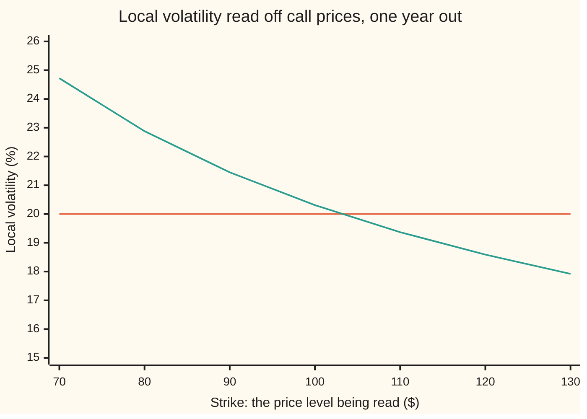
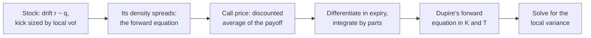

# Dupire local volatility: one volatility per price and date, read straight off call prices

Financial mathematics → Local volatility and jumps → The forward equation in strike → Dupire local volatility

---

## General Overview

Acme shares trade at $100. An options desk holds a call price for every strike and every expiry out to a year. The right to buy Acme at $110 in six months costs $2.59; the right to buy at $100 in a year costs $9.23. In the house market every one of those prices comes from the Black-Scholes formula at 20% volatility ([black-scholes-call](../08-The%20Black-Scholes%20call%20and%20put/01-black-scholes-call.md)). On a real desk the volatility that reprices each option changes with strike and expiry: the volatility surface ([volatility-surface-and-its-arbitrage-rules](../12-The%20smile%20and%20the%20surface/03-volatility-surface-and-its-arbitrage-rules.md)).

One stock cannot have a different constant volatility for each option on it. Bruno Dupire's answer, in 1994: let the stock's volatility depend on its price and the date. Say 25% if Acme has fallen to $70 a year from now, 18% if it has risen to $130. That is one number per price and date, called from here on the **local volatility**. Dupire showed that call prices already contain it, and that it can be read off them point by point.

The reading takes three measurements of the price surface at one strike and expiry: how much dearer the call gets as its expiry moves later, how much cheaper as its strike moves higher, and how sharply its price bends in strike. The bend, with one expiry's discounting undone, is the market's probability density for Acme's price at expiry ([butterfly-and-the-implied-density](../10-Digitals%20and%20the%20implied%20density/05-butterfly-and-the-implied-density.md)). The first test of the reading: prices made at one volatility must hand it back everywhere. At $100 in one year, and at $110 in six months, the Acme prices hand back 0.2000.

**The extra value a call gains from a later expiry, cleared of interest and dividends and divided by half the strike squared times the bend there, is the variance the stock must have at that price on that date.**

**What kind of fact this is:** a theorem, proved on this card in Why it works: if a stock moves with a volatility that depends only on its price and the date, its call prices obey this formula, and the formula fixes that volatility. That real markets move this way is a model, not a law.

### The picture: two sets of call prices, read strike by strike



Orange: the house surface, every call priced at 20%, read back as 20.00% at every strike. Green: the call prices of a second stock, built in Worked numbers so that its local volatility is known in advance. The reading falls from 24.72% at $70 to 17.92% at $130, within 0.01 of a percentage point of the known values.

---

## The formula

Notation first, in words. $C$ is today's price of a call with strike $K$ and expiry $T$ years away, a function of both. A letter written small beside $C$ names the one input being moved while the others are held still ([partial-derivatives](../../06-Calculus%20and%20analysis/07-Several%20Variables/01-partial-derivatives.md)). $C_T$ is the slope in expiry: extra dollars per extra year of life. $C_K$ is the slope in strike. $C_{KK}$ is the slope of that slope: the bend of the price curve in strike.

$$\sigma_{\text{loc}}^2(K, T) \;=\; \frac{C_T \;+\; (r - q)\,K\,C_K \;+\; q\,C}{\tfrac12\,K^2\,C_{KK}}$$

**Read it aloud:** the local variance at a strike and an expiry is the calendar slope plus two corrections for interest and dividends, divided by half the strike squared times the bend.

It inverts one model of the stock, the **local-volatility diffusion**:

$$dS_t \;=\; (r - q)\,S_t\,dt \;+\; \sigma_{\text{loc}}(S_t, t)\,S_t\,dW_t$$

In words: over a short time step $dt$, Acme's price $S_t$ drifts up at the rate $r - q$ and takes a random kick $dW$, scaled by the local volatility where it now stands. Fixed at 20%, this is geometric Brownian motion, the house model ([geometric-brownian-motion](../../11-Stochastic%20processes%20and%20calculus/05-Brownian%20Motion/07-geometric-brownian-motion.md)).

Multiplied out, the formula is **Dupire's forward equation**. It starts from the payoff at expiry zero and builds every call price as expiry lengthens, all strikes at once:

$$C_T \;=\; \tfrac12\,\sigma_{\text{loc}}^2\,K^2\,C_{KK} \;-\; (r - q)\,K\,C_K \;-\; q\,C, \qquad C(K, 0) = \max(S - K,\,0)$$

The density: undo one expiry's worth of discounting on the bend and the chance per dollar of Acme finishing at $K$ comes out, $p(K, T) = e^{rT}\,C_{KK}(K, T)$.

| Symbol | Plain meaning | In our example | Push it up and the answer… |
| --- | --- | --- | --- |
| $S$, $S_t$, $x$ | Acme's price today; its price at a later date $t$; $x$ is any price Acme might have on a later date | $100 | — |
| $K$, $m$ | strike, and the price level where local volatility is read; $m$ is the strike with the forward's growth taken out, $K e^{-(r-q)T}$ | $100 and $110 | reads the surface further right |
| $T$, $t$ | expiry in years, and the date being read; a date along the way | 1 and 0.5 | — |
| $C$ | today's price of the call at strike $K$ and expiry $T$ | 9.227006 at (100, 1); 2.585913 at (110, 0.5) | — |
| $C_T$ | calendar slope: extra price per extra year of expiry | 5.089319 at (100, 1) | local volatility rises |
| $C_K$ | strike slope: minus the discounted chance of finishing above $K$ | −0.494581 | — |
| $C_{KK}$, $p$ | strike bend; the density $p$, chance per dollar of finishing at $K$ | 0.018951; 0.019922 | local volatility falls: the same gain is shared by more paths |
| $r$, $q$ | riskless rate and dividend yield, continuously compounded | 5% and 2% | — |
| $\sigma_{\text{loc}}$, $\sigma$ | local volatility at one price and date; the single volatility of the house surface | 20% everywhere | — |
| $dt$, $dW$ | a short time step; the random kick in it, normal with mean 0 and variance $dt$ | — | — |
| $h$, $\delta$ | grid steps in strike and in expiry, for reading slopes off a grid of prices | 1 dollar and 0.01 year | the reading drifts off by roughly the step squared |
| $N$, $\phi$, $d_1$, $d_2$, $\Gamma$ | bell-curve area and height; the house formula's standardized distances; spot gamma, the bend in today's price | as on the black-scholes-call card | — |

### When it holds

- **Continuous paths.** A jump carries probability between distant prices in one step and adds terms the formula lacks; jumps get their own model in [merton-jump-diffusion](04-merton-jump-diffusion.md).
- **One source of randomness.** If volatility is itself random, the formula returns the average random variance over paths ending at $K$ on date $T$ (tip in Why it works). That fits every vanilla call and misprices path-dependent contracts such as barriers.
- **Known rates and a proportional dividend.** Cash dividends on fixed dates, or random rates, add terms the formula lacks.
- **A smooth, arbitrage-free surface.** Listed quotes must first be joined into a smooth surface that passes the butterfly and calendar tests. A negative bend gives a negative variance.

---

## Why it works

The argument is a chain, from how the stock moves to the formula.



### Step 0: a later expiry pays only where the stock can still cross the strike

Take two Acme calls at the $100 strike: one expires in a year, the other 0.01 year later, about three and a half days. The later one costs $9.28, against $9.23: five cents more.

The extra value comes from the extra days. A path well above $100 at the one-year mark stays in the money; its payoff is a straight line in the price, so the extra days add only drift and discounting, nothing that depends on how hard Acme is shaken. A path well below stays worthless. Only paths sitting at the strike gain: the call keeps the upside of their next move and drops the downside.

So once the straight-line pieces are removed, the calendar gain is the local variance at the strike, times how many paths sit there, times a fixed factor. Divide by the paths and the local variance is left.

### Step 1: the density of Acme's price spreads by the forward equation

Let $p(x, t)$ be the risk-neutral density of Acme's price on date $t$: the density that today's prices imply. Under the local-volatility diffusion it obeys the forward (Fokker-Planck) equation ([fokker-planck-forward-equation](../../11-Stochastic%20processes%20and%20calculus/08-Generators%2C%20Densities%20and%20Simulation/03-fokker-planck-forward-equation.md)):

$$\frac{\partial p}{\partial t} \;=\; \frac12\,\frac{\partial^2}{\partial x^2}\Big(\sigma_{\text{loc}}^2(x, t)\,x^2\,p\Big) \;-\; \frac{\partial}{\partial x}\Big((r - q)\,x\,p\Big)$$

The first term spreads probability out, at a rate set by the local variance at each price. The second carries it along with the drift.

### Step 2: a call price is an average over that density

$$C(K, T) \;=\; e^{-rT}\int_K^\infty (x - K)\,p(x, T)\,dx$$

Differentiating in strike, as on the butterfly card: $C_K = -e^{-rT}\int_K^\infty p\,dx$, minus the discounted chance of finishing above $K$, and $C_{KK} = e^{-rT}\,p(K, T)$.

### Step 3: differentiate in expiry, and only the strike survives

A later expiry changes the price three ways: more discounting, the density spreading, the density drifting. Discounting gives $-rC$. For the spreading term, integrate by parts twice against the payoff. Above the strike the payoff is a straight line with no bend, so everything cancels except the contribution at the strike itself: $\tfrac12\,\sigma_{\text{loc}}^2(K, T)\,K^2\,p(K, T)$, discounted. That is Step 0 as algebra. The drift term, integrated by parts once, gives $(r - q)(C - K\,C_K)$. Add the three, replace the density by $e^{rT}C_{KK}$, and Dupire's forward equation appears; its $-q\,C$ is the $-rC$ of discounting plus $+(r - q)C$ from the drift.

<details>
<summary>Detailed proof: from the density's equation to Dupire's</summary>

Assume $p(x, t)$ is smooth for $t > 0$, and that $p$, $x\,p$, $x^2 p$ and their slopes in $x$ vanish at infinity faster than $x$ grows; bounded local volatility gives this. Write $L = \sigma_{\text{loc}}^2(x, T)\,x^2\,p(x, T)$. Differentiating the call price in $T$:
$$C_T = -rC + e^{-rT}\int_K^\infty (x - K)\Big(\tfrac12 L_{xx} - \big((r - q)\,x\,p\big)_x\Big)\,dx.$$
Spreading term, by parts twice: $\int_K^\infty (x - K)\,\tfrac12 L_{xx}\,dx = \big[(x - K)\,\tfrac12 L_x\big]_K^\infty - \big[\tfrac12 L\big]_K^\infty = \tfrac12 L(K)$. The first bracket is zero at $x = K$ and at infinity.

Drift term, by parts once: $-\int_K^\infty (x - K)\big((r - q)\,x\,p\big)_x\,dx = (r - q)\int_K^\infty x\,p\,dx$, the bracket again zero at both ends. Split $x = (x - K) + K$: $\int_K^\infty x\,p\,dx = e^{rT}(C - K\,C_K)$, by both facts of Step 2. Collect:
$$C_T = -rC + \tfrac12\,\sigma_{\text{loc}}^2 K^2\,e^{-rT}p(K, T) + (r - q)(C - K\,C_K).$$
Replace $e^{-rT}p(K, T)$ by $C_{KK}$ and $-rC + (r - q)C$ by $-q\,C$: the forward equation. Where $C_{KK} > 0$, divide by $\tfrac12 K^2 C_{KK}$ and the formula follows. $\blacksquare$

</details>

### Step 4: solve for the local variance

Move the interest and dividend terms, the carry terms, left and divide by $\tfrac12 K^2 C_{KK}$: the formula at the top of the card. The denominator counts the paths at the strike. The numerator is the calendar slope with its straight-line pieces removed: $(r - q)K\,C_K$ takes out what the call gains because the forward price grows at $r - q$ while the strike stays put, and $q\,C$ puts back what the call loses as Acme pays its dividends away.

### Step 5: when the answer is unique, when it exists, and where it fails

The formula is an inverse, prices in and volatility out, so three statements come before using it.

**Unique.** The formula reads the local variance directly off prices. Two local volatilities giving the same call price at every strike and expiry agree wherever the density is positive. Where it is zero no path arrives, and the volatility there reaches no price.

**Exists.** A real local volatility needs a positive denominator and a numerator that is not negative. The denominator is positive when every butterfly costs more than nothing. The numerator is a calendar slope with the strike carried along with the forward price and dividends reinvested:

$$C_T + (r - q)\,K\,C_K + q\,C \;=\; e^{-qT}\,\frac{d}{dT}\Big[e^{qT}\,C\big(m\,e^{(r - q)T},\,T\big)\Big], \qquad m \text{ held fixed}$$

It is not negative exactly when the calendar test passes. So a surface passing both tests, every butterfly strictly positive, has exactly one real local volatility at every point. Conversely, a smooth, bounded, positive local volatility run through the forward equation gives a surface that passes both tests.

**Where it fails.**
- *Where the density is almost zero.* Deep in or out of the money, the bend is smaller than the rounding error in a price. At $60 with 0.1 year left, the bend by differences is −2.132e-14 and the local variance −2894.86: rounding noise divided by rounding noise.
- *At expiry zero.* The surface is the payoff, whose bend is a spike at today's price; only the local volatility there is reachable, as a limit.
- *On a grid.* Slopes read by differences carry an error of roughly the step squared. Strikes $5 apart and expiries three months apart read 0.201317 at (100, 1); steps of one dollar and 0.01 year read 0.200019; halving those reads 0.200005, a quarter of the error.

### Step 6: why a flat surface hands back its own volatility

For the house formula the three slopes have closed forms, with $d_1$ and $d_2$ as on the black-scholes-call card:

$$C_T = S e^{-qT}\phi(d_1)\frac{\sigma}{2\sqrt{T}} - qSe^{-qT}N(d_1) + rKe^{-rT}N(d_2), \quad C_K = -e^{-rT}N(d_2), \quad C_{KK} = \frac{e^{-rT}\phi(d_2)}{K\sigma\sqrt{T}}$$

In the numerator the carry pieces cancel exactly, which is what they are for, leaving $S e^{-qT}\phi(d_1)\,\sigma/(2\sqrt{T})$. The denominator is $K e^{-rT}\phi(d_2)/(2\sigma\sqrt{T})$. The ratio is $\sigma^2$, because $S e^{-qT}\phi(d_1) = K e^{-rT}\phi(d_2)$.

<details>
<summary>The algebra behind this</summary>

The $N(d_1)$ pieces, $-qSe^{-qT}N(d_1)$ from $C_T$ and $+qSe^{-qT}N(d_1)$ from $q\,C$, cancel. The $N(d_2)$ pieces, $+rKe^{-rT}N(d_2)$, $-(r - q)Ke^{-rT}N(d_2)$ and $-qKe^{-rT}N(d_2)$, sum to zero.

The identity: $\phi(d_1)/\phi(d_2) = e^{-(d_1 - d_2)(d_1 + d_2)/2}$, with $d_1 - d_2 = \sigma\sqrt{T}$ and $d_1 + d_2 = 2\big(\ln(S/K) + (r - q)T\big)/(\sigma\sqrt{T})$. So the ratio is $(K/S)\,e^{-(r - q)T}$, and multiplying by $Se^{-qT}$ gives $Ke^{-rT}\phi(d_2)$.

</details>

The same cancellation works on any surface whose volatility depends on expiry alone: the formula then returns the forward variance of [term-structure-and-forward-volatility](../12-The%20smile%20and%20the%20surface/02-term-structure-and-forward-volatility.md) at every strike.

<details>
<summary>Local volatility as a conditional expectation</summary>

If the true volatility is itself random, Gyöngy proved in 1986 that a diffusion of the local-volatility kind has the same distribution of the price at every single date. Its local variance at $(K, T)$ is the average of the random variance on date $T$ over the paths with $S_T = K$. Vanilla calls see only one date's distribution, so Dupire's formula on the random-volatility prices returns exactly that average. Barriers see whole paths, so the two models price them differently.

</details>

A second road to the forward equation applies Itô's lemma directly to the kinked payoff (Tanaka's formula) and meets the same strike term. The forward equation as a partial differential equation, solved properly, is dupire-and-forward-equations.

---

## Worked numbers, by hand

House market, every call at 20%: $S$ = 100, $r$ = 5%, $q$ = 2%. Read at $K$ = 100, $T$ = 1, from a grid with steps of one dollar in strike ($h$ = 1) and 0.01 year in expiry ($\delta$ = 0.01).

| Step | Arithmetic | Value |
| --- | --- | --- |
| prices at strikes 99, 100, 101, one year | house formula at 20% | 9.731084, 9.227006, 8.741874 |
| prices at expiries 0.99 and 1.01, strike 100 | house formula at 20% | 9.176000, 9.277787 |
| calendar slope $C_T$ | (9.277787 − 9.176000) / 0.02, at full precision | 5.089370 |
| strike slope $C_K$ | (8.741874 − 9.731084) / 2 | −0.494605 |
| strike bend $C_{KK}$ | 9.731084 − 2 × 9.227006 + 8.741874, at full precision | 0.018947 |
| forward-slide term | 0.03 × 100 × (−0.494605), at full precision | −1.483814 |
| dividend term | 0.02 × 9.227006 | 0.184540 |
| numerator | 5.089370 − 1.483814 + 0.184540 | 3.790096 |
| denominator | 0.5 × 100^2 × 0.018947, at full precision | 94.734193 |
| local variance | 3.790096 / 94.734193 | 0.040008 |
| **local volatility** | square root: 0.200019 | **0.2000** |

At (110, 0.5) the grid prices are 2.851369, 2.585913 and 2.340854 across strikes 109 to 111, and 2.528531 and 2.643060 at expiries 0.49 and 0.51. Numerator 4.935831 over denominator 123.397517: local variance 0.039999, local volatility **0.2000** again.

Prices made at 20% hand back 20% at both points, to four places. The closed-form slopes of Step 6 give 5.089319, −0.494581 and 0.018951 at (100, 1) and a local variance of exactly 0.040000; that bend and its density, 0.019922, are the butterfly card's numbers.

### A surface that is not flat

The harder test needs a stock whose local volatility is known before any option is priced. Take a second stock whose price plus a cushion of $100, growing at $r - q$ = 3% a year, moves exactly like the house model at 10% volatility. Its swings in dollars are 10% of price plus cushion, so in percent its volatility is higher when the price is low. Its call prices are the house formula applied to the cushioned price: Mark Rubinstein's displaced diffusion (1983). The reading sees only those prices.

| Strike ($) | 70 | 80 | 90 | 100 | 110 | 120 | 130 |
| --- | --- | --- | --- | --- | --- | --- | --- |
| read off its call prices (%) | 24.72 | 22.88 | 21.45 | 20.31 | 19.37 | 18.59 | 17.92 |
| known in advance (%) | 24.72 | 22.88 | 21.45 | 20.30 | 19.37 | 18.59 | 17.93 |

The rows differ by at most 0.01, the grid error. The formula recovers a volatility that changes with price, not only a constant.

### What breaks if you drop a piece

Correct answer at (100, 1): 0.2000, read with the closed-form slopes.

| Mistake | Comes out at | What went wrong |
| --- | --- | --- |
| Drop the ½ in the denominator | 0.141421 | the variance is halved: short by the square root of 2 |
| Zero-rate formula, $C_T$ over $\tfrac12 K^2 C_{KK}$, on today's prices | 0.231757 | interest and dividends in the calendar slope are read as volatility |
| Leave out $q\,C$ | 0.195070 | value leaking out through dividends is counted against volatility |
| Flip the sign of $(r - q)K\,C_K$ | 0.267055 | the forward's growth past the strike is added instead of removed |
| Spot gamma $\Gamma$ for the bend, at (110, 0.5) | 0.181818 | the two bends agree only when $S$ = $K$; here gamma is larger by (110/100) squared, so the reading is 20% × 100/110 |

---

## Code, from first principles, and it actually runs

Three independent roads to the local volatility at (100, 1) and (110, 0.5). Road 1 reads the slopes off a grid of house prices by differences. Road 2 uses the house formula's closed-form slopes. Road 3 uses no bell curve: it marches Dupire's forward equation from the payoff, with 20% at every price and date, across 1,201 log-spaced strikes and 400 steps a year, then reads the local volatility back off the marched prices. Its prices, 9.226833 and 2.585736, miss the formula's 9.227006 and 2.585913 by the marching grid's error. That gap is the real test: the read-back uses the march's own grid, so it agrees to six places by design. A second case reads the sloping volatility of the displaced diffusion and compares it with the known answer. The bell-curve area is Marsaglia's series and the tridiagonal solve is the Thomas algorithm, both written out.

### Python

```python
# Dupire local volatility -- the check behind the card.  Standard library only.
# The normal CDF is Marsaglia's series written out; the forward equation is marched
# with a tridiagonal solver written out.  Nothing imported knows the answer.
from math import log, sqrt, exp, pi

S0, R, Q, SIG = 100.0, 0.05, 0.02, 0.20          # the house market, every call at 20%
H, DT = 1.0, 0.01                                # grid steps: $1 in strike, 0.01 year in expiry

def N(x):                                        # bell-curve area left of x, summed as a series
    if x < -10.0: return 0.0
    if x > 10.0: return 1.0
    s, t, b, q, i = x, 0.0, x, x * x, 1.0
    while s != t:
        i += 2.0; b *= q / i; t = s; s = t + b
    return 0.5 + s * exp(-0.5 * q - 0.91893853320467274178)

def phi(x): return exp(-0.5 * x * x) / sqrt(2.0 * pi)   # bell-curve height at x

def bs(S, K, T, sig):                            # the house call price at one volatility
    v = sig * sqrt(T)
    d1 = (log(S / K) + (R - Q + 0.5 * sig * sig) * T) / v
    return S * exp(-Q * T) * N(d1) - K * exp(-R * T) * N(d1 - v)

def slopes(C, K, T, h, dt):                      # road 1: differences on a grid of prices
    return (C(K, T), (C(K, T + dt) - C(K, T - dt)) / (2 * dt), (C(K + h, T) - C(K - h, T)) / (2 * h),
            (C(K + h, T) - 2 * C(K, T) + C(K - h, T)) / (h * h))

def closed(K, T):                                # road 2: the house formula's own slopes
    v = SIG * sqrt(T)
    d1 = (log(S0 / K) + (R - Q + 0.5 * SIG * SIG) * T) / v; d2 = d1 - v
    c = S0 * exp(-Q * T) * N(d1) - K * exp(-R * T) * N(d2)
    ct = S0 * exp(-Q * T) * phi(d1) * SIG / (2 * sqrt(T)) - Q * S0 * exp(-Q * T) * N(d1) + R * K * exp(-R * T) * N(d2)
    gamma = exp(-Q * T) * phi(d1) / (S0 * v)     # spot gamma, for the mistake table
    return (c, ct, -exp(-R * T) * N(d2), exp(-R * T) * phi(d2) / (K * v)), gamma

def parts(p, K):                                 # carry terms, numerator, denominator
    c, ct, ck, ckk = p
    return (R - Q) * K * ck, Q * c, ct + (R - Q) * K * ck + Q * c, 0.5 * K * K * ckk

def dupire(p, K):                                # the formula: local variance at (K, T)
    _, _, num, den = parts(p, K)
    return num / den

def march(sig, per, half, steps):                # road 3: march the forward equation in expiry
    dx = log(1.1) / per                          # log-strike step; $100 and $110 are both nodes
    x = [log(S0) + (j - half) * dx for j in range(2 * half + 1)]
    u = [max(S0 - exp(xj), 0.0) for xj in x]     # expiry 0: the payoff (S - K)+
    a, dt = 0.5 * sig * sig, 1.0 / steps
    b = a + (R - Q)                              # C_T = a (u_xx - u_x) - (r - q) u_x - q u
    lo, di, up = a / dx / dx + b / (2 * dx), -2 * a / dx / dx - Q, a / dx / dx - b / (2 * dx)
    snaps = [u]
    for n in range(1, steps + 2):
        th, T = (1.0 if n <= 4 else 0.5), n * dt # four implicit steps smooth the kink, then Crank-Nicolson
        rhs = [u[j] + (1 - th) * dt * (lo * u[j - 1] + di * u[j] + up * u[j + 1]) for j in range(1, len(u) - 1)]
        left = S0 * exp(-Q * T) - exp(x[0]) * exp(-R * T)
        A, B, Cc = -th * dt * lo, 1 - th * dt * di, -th * dt * up
        rhs[0] -= A * left
        cp, dp = [Cc / B], [rhs[0] / B]          # Thomas algorithm: sweep down, then back up
        for i in range(1, len(rhs)):
            m = B - A * cp[-1]
            cp.append(Cc / m); dp.append((rhs[i] - A * dp[-1]) / m)
        for i in range(len(rhs) - 2, -1, -1):
            dp[i] -= cp[i] * dp[i + 1]
        u = [left] + dp + [0.0]
        snaps.append(u)
    return x, snaps, dx, dt

def read_marched(snaps, n, j, K, dx, dt):        # Dupire on the marched grid, in log strike
    u = snaps[n]
    ux, uxx = (u[j + 1] - u[j - 1]) / (2 * dx), (u[j + 1] - 2 * u[j] + u[j - 1]) / (dx * dx)
    ct = (snaps[n + 1][j] - snaps[n - 1][j]) / (2 * dt)
    return dupire((u[j], ct, ux / K, (uxx - ux) / (K * K)), K)

def row(name, vals, d=6, w=12):
    print(f"{name:<42}" + "".join(f"{v:>{w}.{d}f}" for v in vals))

flat = lambda K, T: bs(S0, K, T, SIG)
pts = [(100.0, 1.0), (110.0, 0.5)]
g1 = [slopes(flat, K, T, H, DT) for K, T in pts]
g2 = [closed(K, T)[0] for K, T in pts]
print(f"house market: S 100, r 0.05, q 0.02, every call at 20%; grid steps h {H:g}, dt {DT:g}")
print(f"{'':<42}{'(100, 1)':>12}{'(110, 0.5)':>12}")
for name, f in (("call C(K - h, T)", lambda K, T: flat(K - H, T)), ("call C(K, T)", flat),
                ("call C(K + h, T)", lambda K, T: flat(K + H, T)), ("call C(K, T - dt)", lambda K, T: flat(K, T - DT)),
                ("call C(K, T + dt)", lambda K, T: flat(K, T + DT))):
    row(name, [f(K, T) for K, T in pts])
print("road 1: differences on the grid above; road 2: the house formula's own slopes")
for road, g in (("road 1", g1), ("road 2", g2)):
    for i, nm in ((1, "C_T"), (2, "C_K"), (3, "C_KK")):
        row(f"{road}: {nm}", [p[i] for p in g])
    for i, nm in ((0, "(r - q) K C_K"), (1, "q C"), (2, "numerator"), (3, "denominator 0.5 K^2 C_KK")):
        row(f"{road}: {nm}", [parts(p, K)[i] for p, (K, T) in zip(g, pts)])
    row(f"{road}: local variance", [dupire(p, K) for p, (K, T) in zip(g, pts)])
    row(f"{road}: local vol", [sqrt(dupire(p, K)) for p, (K, T) in zip(g, pts)])
row("road 1: local vol to four places", [sqrt(dupire(p, K)) for p, (K, T) in zip(g1, pts)], 4)
row("density p = e^{rT} C_KK, closed form", [exp(R * T) * p[3] for p, (K, T) in zip(g2, pts)])

x, snaps, dx, dt = march(SIG, 40, 600, 400)      # 1,201 log strikes, 600 either side of $100
jm = [600, 640]                                  # the nodes at $100 and $110
ns = [round(T / dt) for K, T in pts]
print(f"road 3: forward equation marched from the payoff at 20%, {len(x)} strikes, {round(1 / dt)} steps a year")
row("road 3: call, marched", [snaps[n][j] for n, j in zip(ns, jm)])
row("road 3: call, house formula", [flat(K, T) for K, T in pts])
lv3 = [sqrt(read_marched(snaps, n, j, exp(x[j]), dx, dt)) for n, j in zip(ns, jm)]
row("road 3: local vol read off marched prices", lv3)

DSH, SD = 100.0, 0.10                            # second case: stock + $100 cushion moves like the house at 10%
cushion = lambda K, T: bs(S0 + DSH, K + DSH * exp((R - Q) * T), T, SD)
truth = lambda K, T: SD * (K + DSH * exp((R - Q) * T)) / K
ks = [70.0, 80.0, 90.0, 100.0, 110.0, 120.0, 130.0]
read2 = [sqrt(dupire(slopes(cushion, K, 1.0, H, DT), K)) for K in ks]
read_flat = [sqrt(dupire(slopes(flat, K, 1.0, H, DT), K)) for K in ks]
print("second case: local vol in percent at T = 1, strikes 70 to 130 in steps of 10")
row("cushioned stock, read off its call prices", [100 * v for v in read2], 2, 7)
row("cushioned stock, known in advance", [100 * truth(K, 1.0) for K in ks], 2, 7)
row("flat 20% surface, read off its call prices", [100 * v for v in read_flat], 2, 7)

(c, ct, ck, ckk), _ = closed(100.0, 1.0)
_, _, num, den = parts((c, ct, ck, ckk), 100.0)
p110, gam110 = closed(110.0, 0.5)
row("wrong: drop the 1/2 in the denominator", [sqrt(num / (2 * den))])
row("wrong: zero-rate formula on today's prices", [sqrt(ct / den)])
row("wrong: leave out q C", [sqrt((num - Q * c) / den)])
row("wrong: flip the sign of (r - q) K C_K", [sqrt((num - 2 * (R - Q) * 100.0 * ck) / den)])
row("wrong: spot gamma for C_KK at (110, 0.5)", [sqrt(parts(p110, 110.0)[2] / (0.5 * 110.0 ** 2 * gam110))])
row("try: desk grid h 5, dt 0.25, at (100, 1)", [sqrt(dupire(slopes(flat, 100.0, 1.0, 5.0, 0.25), 100.0))])
row("try: half the steps, h 0.5, dt 0.005", [sqrt(dupire(slopes(flat, 100.0, 1.0, 0.5, 0.005), 100.0))])
row("try: every call at 30%, read at (110, 0.5)", [sqrt(dupire(slopes(lambda K, T: bs(S0, K, T, 0.3), 110.0, 0.5, H, DT), 110.0))])
edge = slopes(flat, 60.0, 0.1, H, DT)
print(f"{'edge: C_KK by differences at (60, 0.1)':<42}{edge[3]:>12.3e}")
row("edge: local variance there", [dupire(edge, 60.0)], 2)

assert abs(sqrt(dupire(g1[0], 100.0)) - SIG) < 1e-4, "road 1 at (100, 1) hands back 20%"
assert abs(sqrt(dupire(g1[1], 110.0)) - SIG) < 1e-4, "road 1 at (110, 0.5) hands back 20%"
assert max(abs(dupire(p, K) - SIG * SIG) for p, (K, T) in zip(g2, pts)) < 1e-12, "road 2: exact"
assert max(abs(snaps[n][j] - flat(K, T)) for n, j, (K, T) in zip(ns, jm, pts)) < 5e-4, "road 3 prices"
assert max(abs(v - SIG) for v in lv3) < 1e-4, "road 3: read back off marched prices"
assert max(abs(v - truth(K, 1.0)) for v, K in zip(read2, ks)) < 1e-4, "second case: sloped vol read back"
print("ALL CHECKS PASS")
```

**Ran 2026-09-24 on macOS, Python 3.14.6, standard library only. All checks passed. Output, pasted from the run:**

```
house market: S 100, r 0.05, q 0.02, every call at 20%; grid steps h 1, dt 0.01
                                              (100, 1)  (110, 0.5)
call C(K - h, T)                              9.731084    2.851369
call C(K, T)                                  9.227006    2.585913
call C(K + h, T)                              8.741874    2.340854
call C(K, T - dt)                             9.176000    2.528531
call C(K, T + dt)                             9.277787    2.643060
road 1: differences on the grid above; road 2: the house formula's own slopes
road 1: C_T                                   5.089370    5.726463
road 1: C_K                                  -0.494605   -0.255258
road 1: C_KK                                  0.018947    0.020396
road 1: (r - q) K C_K                        -1.483814   -0.842351
road 1: q C                                   0.184540    0.051718
road 1: numerator                             3.790096    4.935831
road 1: denominator 0.5 K^2 C_KK             94.734193  123.397517
road 1: local variance                        0.040008    0.039999
road 1: local vol                             0.200019    0.199999
road 2: C_T                                   5.089319    5.726450
road 2: C_K                                  -0.494581   -0.255087
road 2: C_KK                                  0.018951    0.020398
road 2: (r - q) K C_K                        -1.483743   -0.841789
road 2: q C                                   0.184540    0.051718
road 2: numerator                             3.790116    4.936379
road 2: denominator 0.5 K^2 C_KK             94.752894  123.409481
road 2: local variance                        0.040000    0.040000
road 2: local vol                             0.200000    0.200000
road 1: local vol to four places                0.2000      0.2000
density p = e^{rT} C_KK, closed form          0.019922    0.020915
road 3: forward equation marched from the payoff at 20%, 1201 strikes, 400 steps a year
road 3: call, marched                         9.226833    2.585736
road 3: call, house formula                   9.227006    2.585913
road 3: local vol read off marched prices     0.200000    0.200000
second case: local vol in percent at T = 1, strikes 70 to 130 in steps of 10
cushioned stock, read off its call prices   24.72  22.88  21.45  20.31  19.37  18.59  17.92
cushioned stock, known in advance           24.72  22.88  21.45  20.30  19.37  18.59  17.93
flat 20% surface, read off its call prices  20.00  20.00  20.00  20.00  20.00  20.00  20.00
wrong: drop the 1/2 in the denominator        0.141421
wrong: zero-rate formula on today's prices    0.231757
wrong: leave out q C                          0.195070
wrong: flip the sign of (r - q) K C_K         0.267055
wrong: spot gamma for C_KK at (110, 0.5)      0.181818
try: desk grid h 5, dt 0.25, at (100, 1)      0.201317
try: half the steps, h 0.5, dt 0.005          0.200005
try: every call at 30%, read at (110, 0.5)    0.300008
edge: C_KK by differences at (60, 0.1)      -2.132e-14
edge: local variance there                    -2894.86
ALL CHECKS PASS
```

### Rust

Same numbers, same labels, built with `rustc --edition 2021 -O`.

```rust
// Dupire local volatility -- the same check as the Python, in Rust.  No crates.
// The normal CDF is Marsaglia's series written out; the forward equation is marched
// with a tridiagonal solver written out.  Nothing imported knows the answer.
use std::f64::consts::PI;

const S0: f64 = 100.0; // the house market, every call at 20%
const R: f64 = 0.05;
const Q: f64 = 0.02;
const SIG: f64 = 0.20;
const H: f64 = 1.0; // grid steps: $1 in strike, 0.01 year in expiry
const DT: f64 = 0.01;

fn n_cdf(x: f64) -> f64 { // bell-curve area left of x, summed as a series
    if x < -10.0 { return 0.0; }
    if x > 10.0 { return 1.0; }
    let (mut s, mut t, mut b, q, mut i) = (x, 0.0, x, x * x, 1.0);
    while s != t { i += 2.0; b *= q / i; t = s; s = t + b; }
    0.5 + s * (-0.5 * q - 0.91893853320467274178).exp()
}

fn phi(x: f64) -> f64 { (-0.5 * x * x).exp() / (2.0 * PI).sqrt() } // bell-curve height at x

fn bs(s: f64, k: f64, t: f64, sig: f64) -> f64 { // the house call price at one volatility
    let v = sig * t.sqrt();
    let d1 = ((s / k).ln() + (R - Q + 0.5 * sig * sig) * t) / v;
    s * (-Q * t).exp() * n_cdf(d1) - k * (-R * t).exp() * n_cdf(d1 - v)
}

fn slopes<F: Fn(f64, f64) -> f64>(c: &F, k: f64, t: f64, h: f64, dt: f64) -> [f64; 4] { // road 1
    [c(k, t), (c(k, t + dt) - c(k, t - dt)) / (2.0 * dt), (c(k + h, t) - c(k - h, t)) / (2.0 * h),
     (c(k + h, t) - 2.0 * c(k, t) + c(k - h, t)) / (h * h)]
}

fn closed(k: f64, t: f64) -> ([f64; 4], f64) { // road 2: the house formula's own slopes
    let v = SIG * t.sqrt();
    let d1 = ((S0 / k).ln() + (R - Q + 0.5 * SIG * SIG) * t) / v;
    let d2 = d1 - v;
    let c = S0 * (-Q * t).exp() * n_cdf(d1) - k * (-R * t).exp() * n_cdf(d2);
    let ct = S0 * (-Q * t).exp() * phi(d1) * SIG / (2.0 * t.sqrt()) - Q * S0 * (-Q * t).exp() * n_cdf(d1)
        + R * k * (-R * t).exp() * n_cdf(d2);
    let gamma = (-Q * t).exp() * phi(d1) / (S0 * v); // spot gamma, for the mistake table
    ([c, ct, -(-R * t).exp() * n_cdf(d2), (-R * t).exp() * phi(d2) / (k * v)], gamma)
}

fn parts(p: &[f64; 4], k: f64) -> [f64; 4] { // carry terms, numerator, denominator
    [(R - Q) * k * p[2], Q * p[0], p[1] + (R - Q) * k * p[2] + Q * p[0], 0.5 * k * k * p[3]]
}

fn dupire(p: &[f64; 4], k: f64) -> f64 { let a = parts(p, k); a[2] / a[3] } // local variance

fn march(sig: f64, per: usize, half: usize, steps: usize) -> (Vec<f64>, Vec<Vec<f64>>, f64, f64) { // road 3
    let dx = 1.1_f64.ln() / per as f64; // log-strike step; $100 and $110 are both nodes
    let x: Vec<f64> = (0..=2 * half).map(|j| S0.ln() + (j as f64 - half as f64) * dx).collect();
    let mut u: Vec<f64> = x.iter().map(|xj| (S0 - xj.exp()).max(0.0)).collect(); // the payoff
    let (a, dt) = (0.5 * sig * sig, 1.0 / steps as f64);
    let b = a + (R - Q); // C_T = a (u_xx - u_x) - (r - q) u_x - q u
    let (lo, di, up) = (a / dx / dx + b / (2.0 * dx), -2.0 * a / dx / dx - Q, a / dx / dx - b / (2.0 * dx));
    let mut snaps = vec![u.clone()];
    for n in 1..steps + 2 {
        let (th, t) = (if n <= 4 { 1.0 } else { 0.5 }, n as f64 * dt); // implicit, then Crank-Nicolson
        let mut rhs: Vec<f64> = (1..u.len() - 1)
            .map(|j| u[j] + (1.0 - th) * dt * (lo * u[j - 1] + di * u[j] + up * u[j + 1])).collect();
        let left = S0 * (-Q * t).exp() - x[0].exp() * (-R * t).exp();
        let (aa, bb, cc) = (-th * dt * lo, 1.0 - th * dt * di, -th * dt * up);
        rhs[0] -= aa * left;
        let (mut cp, mut dp) = (vec![cc / bb], vec![rhs[0] / bb]); // Thomas algorithm
        for i in 1..rhs.len() {
            let m = bb - aa * cp[i - 1];
            cp.push(cc / m);
            dp.push((rhs[i] - aa * dp[i - 1]) / m);
        }
        for i in (0..rhs.len() - 1).rev() { dp[i] -= cp[i] * dp[i + 1]; }
        u = [vec![left], dp, vec![0.0]].concat();
        snaps.push(u.clone());
    }
    (x, snaps, dx, dt)
}

fn read_marched(snaps: &[Vec<f64>], n: usize, j: usize, k: f64, dx: f64, dt: f64) -> f64 {
    let u = &snaps[n]; // Dupire on the marched grid, in log strike
    let (ux, uxx) = ((u[j + 1] - u[j - 1]) / (2.0 * dx), (u[j + 1] - 2.0 * u[j] + u[j - 1]) / (dx * dx));
    let ct = (snaps[n + 1][j] - snaps[n - 1][j]) / (2.0 * dt);
    dupire(&[u[j], ct, ux / k, (uxx - ux) / (k * k)], k)
}

fn row(name: &str, vals: &[f64], d: usize, w: usize) {
    let mut s = format!("{:<42}", name);
    for v in vals { s.push_str(&format!("{:>w$.d$}", v, w = w, d = d)); }
    println!("{}", s);
}

fn main() {
    let flat = |k: f64, t: f64| bs(S0, k, t, SIG);
    let pts = [(100.0, 1.0), (110.0, 0.5)];
    let g1: Vec<[f64; 4]> = pts.iter().map(|&(k, t)| slopes(&flat, k, t, H, DT)).collect();
    let g2: Vec<[f64; 4]> = pts.iter().map(|&(k, t)| closed(k, t).0).collect();
    println!("house market: S 100, r 0.05, q 0.02, every call at 20%; grid steps h {}, dt {}", H, DT);
    println!("{:<42}{:>12}{:>12}", "", "(100, 1)", "(110, 0.5)");
    let calls: [(&str, f64, f64); 5] = [("call C(K - h, T)", -H, 0.0), ("call C(K, T)", 0.0, 0.0),
        ("call C(K + h, T)", H, 0.0), ("call C(K, T - dt)", 0.0, -DT), ("call C(K, T + dt)", 0.0, DT)];
    for (name, dk, dt) in calls { row(name, &pts.map(|(k, t)| flat(k + dk, t + dt)), 6, 12); }
    println!("road 1: differences on the grid above; road 2: the house formula's own slopes");
    for (road, g) in [("road 1", &g1), ("road 2", &g2)] {
        for (i, nm) in [(1, "C_T"), (2, "C_K"), (3, "C_KK")] {
            row(&format!("{}: {}", road, nm), &[g[0][i], g[1][i]], 6, 12);
        }
        for (i, nm) in [(0, "(r - q) K C_K"), (1, "q C"), (2, "numerator"), (3, "denominator 0.5 K^2 C_KK")] {
            row(&format!("{}: {}", road, nm), &[parts(&g[0], 100.0)[i], parts(&g[1], 110.0)[i]], 6, 12);
        }
        row(&format!("{}: local variance", road), &[dupire(&g[0], 100.0), dupire(&g[1], 110.0)], 6, 12);
        row(&format!("{}: local vol", road), &[dupire(&g[0], 100.0).sqrt(), dupire(&g[1], 110.0).sqrt()], 6, 12);
    }
    row("road 1: local vol to four places", &[dupire(&g1[0], 100.0).sqrt(), dupire(&g1[1], 110.0).sqrt()], 4, 12);
    row("density p = e^{rT} C_KK, closed form", &[(R * 1.0).exp() * g2[0][3], (R * 0.5).exp() * g2[1][3]], 6, 12);

    let (x, snaps, dx, dt) = march(SIG, 40, 600, 400); // 1,201 log strikes, 600 either side of $100
    let jm = [600usize, 640]; // the nodes at $100 and $110
    let ns: Vec<usize> = pts.iter().map(|&(_, t)| (t / dt).round() as usize).collect();
    println!("road 3: forward equation marched from the payoff at 20%, {} strikes, {} steps a year",
             x.len(), (1.0 / dt).round());
    row("road 3: call, marched", &[snaps[ns[0]][jm[0]], snaps[ns[1]][jm[1]]], 6, 12);
    row("road 3: call, house formula", &pts.map(|(k, t)| flat(k, t)), 6, 12);
    let lv3: Vec<f64> = (0..2).map(|i| read_marched(&snaps, ns[i], jm[i], x[jm[i]].exp(), dx, dt).sqrt()).collect();
    row("road 3: local vol read off marched prices", &lv3, 6, 12);

    let (dsh, sd) = (100.0_f64, 0.10_f64); // second case: stock + $100 cushion moves like the house at 10%
    let cushion = |k: f64, t: f64| bs(S0 + dsh, k + dsh * ((R - Q) * t).exp(), t, sd);
    let truth = |k: f64, t: f64| sd * (k + dsh * ((R - Q) * t).exp()) / k;
    let ks = [70.0, 80.0, 90.0, 100.0, 110.0, 120.0, 130.0];
    let read2: Vec<f64> = ks.iter().map(|&k| dupire(&slopes(&cushion, k, 1.0, H, DT), k).sqrt()).collect();
    let read_flat: Vec<f64> = ks.iter().map(|&k| dupire(&slopes(&flat, k, 1.0, H, DT), k).sqrt()).collect();
    println!("second case: local vol in percent at T = 1, strikes 70 to 130 in steps of 10");
    row("cushioned stock, read off its call prices", &read2.iter().map(|v| 100.0 * v).collect::<Vec<_>>(), 2, 7);
    row("cushioned stock, known in advance", &ks.map(|k| 100.0 * truth(k, 1.0)), 2, 7);
    row("flat 20% surface, read off its call prices", &read_flat.iter().map(|v| 100.0 * v).collect::<Vec<_>>(), 2, 7);

    let (p100, _) = closed(100.0, 1.0);
    let (c, ct, ck) = (p100[0], p100[1], p100[2]);
    let a = parts(&p100, 100.0);
    let (num, den) = (a[2], a[3]);
    let (p110, gam110) = closed(110.0, 0.5);
    row("wrong: drop the 1/2 in the denominator", &[(num / (2.0 * den)).sqrt()], 6, 12);
    row("wrong: zero-rate formula on today's prices", &[(ct / den).sqrt()], 6, 12);
    row("wrong: leave out q C", &[((num - Q * c) / den).sqrt()], 6, 12);
    row("wrong: flip the sign of (r - q) K C_K", &[((num - 2.0 * (R - Q) * 100.0 * ck) / den).sqrt()], 6, 12);
    row("wrong: spot gamma for C_KK at (110, 0.5)", &[(parts(&p110, 110.0)[2] / (0.5 * 110.0_f64.powi(2) * gam110)).sqrt()], 6, 12);
    row("try: desk grid h 5, dt 0.25, at (100, 1)", &[dupire(&slopes(&flat, 100.0, 1.0, 5.0, 0.25), 100.0).sqrt()], 6, 12);
    row("try: half the steps, h 0.5, dt 0.005", &[dupire(&slopes(&flat, 100.0, 1.0, 0.5, 0.005), 100.0).sqrt()], 6, 12);
    let vol30 = |k: f64, t: f64| bs(S0, k, t, 0.3);
    row("try: every call at 30%, read at (110, 0.5)", &[dupire(&slopes(&vol30, 110.0, 0.5, H, DT), 110.0).sqrt()], 6, 12);
    let edge = slopes(&flat, 60.0, 0.1, H, DT);
    println!("{:<42}{:>12}", "edge: C_KK by differences at (60, 0.1)", format!("{:.3e}", edge[3]));
    row("edge: local variance there", &[dupire(&edge, 60.0)], 2, 12);

    assert!((dupire(&g1[0], 100.0).sqrt() - SIG).abs() < 1e-4, "road 1 at (100, 1) hands back 20%");
    assert!((dupire(&g1[1], 110.0).sqrt() - SIG).abs() < 1e-4, "road 1 at (110, 0.5) hands back 20%");
    assert!((0..2).all(|i| (dupire(&g2[i], pts[i].0) - SIG * SIG).abs() < 1e-12), "road 2: exact");
    assert!((0..2).all(|i| (snaps[ns[i]][jm[i]] - flat(pts[i].0, pts[i].1)).abs() < 5e-4), "road 3 prices");
    assert!(lv3.iter().all(|v| (v - SIG).abs() < 1e-4), "road 3: read back off marched prices");
    assert!(read2.iter().zip(ks.iter()).all(|(v, &k)| (v - truth(k, 1.0)).abs() < 1e-4), "second case");
    println!("ALL CHECKS PASS");
}
```

**Ran 2026-09-24 on macOS, rustc 1.98.1, no crates. All checks passed. Output, pasted from the run:**

```
house market: S 100, r 0.05, q 0.02, every call at 20%; grid steps h 1, dt 0.01
                                              (100, 1)  (110, 0.5)
call C(K - h, T)                              9.731084    2.851369
call C(K, T)                                  9.227006    2.585913
call C(K + h, T)                              8.741874    2.340854
call C(K, T - dt)                             9.176000    2.528531
call C(K, T + dt)                             9.277787    2.643060
road 1: differences on the grid above; road 2: the house formula's own slopes
road 1: C_T                                   5.089370    5.726463
road 1: C_K                                  -0.494605   -0.255258
road 1: C_KK                                  0.018947    0.020396
road 1: (r - q) K C_K                        -1.483814   -0.842351
road 1: q C                                   0.184540    0.051718
road 1: numerator                             3.790096    4.935831
road 1: denominator 0.5 K^2 C_KK             94.734193  123.397517
road 1: local variance                        0.040008    0.039999
road 1: local vol                             0.200019    0.199999
road 2: C_T                                   5.089319    5.726450
road 2: C_K                                  -0.494581   -0.255087
road 2: C_KK                                  0.018951    0.020398
road 2: (r - q) K C_K                        -1.483743   -0.841789
road 2: q C                                   0.184540    0.051718
road 2: numerator                             3.790116    4.936379
road 2: denominator 0.5 K^2 C_KK             94.752894  123.409481
road 2: local variance                        0.040000    0.040000
road 2: local vol                             0.200000    0.200000
road 1: local vol to four places                0.2000      0.2000
density p = e^{rT} C_KK, closed form          0.019922    0.020915
road 3: forward equation marched from the payoff at 20%, 1201 strikes, 400 steps a year
road 3: call, marched                         9.226833    2.585736
road 3: call, house formula                   9.227006    2.585913
road 3: local vol read off marched prices     0.200000    0.200000
second case: local vol in percent at T = 1, strikes 70 to 130 in steps of 10
cushioned stock, read off its call prices   24.72  22.88  21.45  20.31  19.37  18.59  17.92
cushioned stock, known in advance           24.72  22.88  21.45  20.30  19.37  18.59  17.93
flat 20% surface, read off its call prices  20.00  20.00  20.00  20.00  20.00  20.00  20.00
wrong: drop the 1/2 in the denominator        0.141421
wrong: zero-rate formula on today's prices    0.231757
wrong: leave out q C                          0.195070
wrong: flip the sign of (r - q) K C_K         0.267055
wrong: spot gamma for C_KK at (110, 0.5)      0.181818
try: desk grid h 5, dt 0.25, at (100, 1)      0.201317
try: half the steps, h 0.5, dt 0.005          0.200005
try: every call at 30%, read at (110, 0.5)    0.300008
edge: C_KK by differences at (60, 0.1)      -2.132e-14
edge: local variance there                    -2894.86
ALL CHECKS PASS
```

The two outputs match line for line, including the rounding noise at the edge.

> [!TIP]
> **Try changing**
> Guess first, then run it.
> - **A finer grid.** Set `H, DT = 0.5, 0.005`. Road 1 reads 0.200005 at (100, 1), a quarter of the default error, and every assert still passes.
> - **A different flat surface.** Set `SIG = 0.30`. Every road reads 0.3000 at both points to four places (0.300008 at (110, 0.5) by differences), and every assert passes: whatever one volatility made the prices comes back.
> - **Flip the drift in the forward equation.** Change `b = a + (R - Q)` to `b = a - (R - Q)`. The marched prices drift away from the formula and the road 3 price assert stops the run.
> - **Forget the cushion's growth.** In `truth`, replace the grown cushion by a flat `DSH`. The known-in-advance row now disagrees with the reading and the last assert stops the run: the reading was right, the guess was not.

---

## The usual mistake

> [!warning]
> **Reading local volatility as implied volatility.** Implied volatility is one number per option: the single constant volatility that reprices that option. Local volatility is one number per price and date: the volatility the stock has when it stands there. On a flat surface they agree. On a sloping one, an option's implied volatility is roughly an average of local volatilities along the paths to its strike, so local volatility slopes more steeply; the conversion is [local-volatility-from-implied-volatility](02-local-volatility-from-implied-volatility.md).
>
> - **Dropping the carry terms.** The zero-rate formula holds only once interest and dividends are stripped out: prices undiscounted, each strike measured against its forward. On today's house prices it reads 0.231757.
> - **Spot gamma for the strike bend.** They agree only at $S$ = $K$. At (110, 0.5) the swap reads 0.181818.
> - **Differencing raw quotes.** Quotes sit at scattered strikes and expiries. A grid of strikes $5 apart and expiries three months apart reads 0.201317 even on perfect prices, and any quote error is divided by the step squared in the bend. Fit a smooth surface that passes both arbitrage tests first.
> - **Taking a perfect fit for a forecast.** Local volatility reprices today's surface exactly; how it makes the smile move later is another question, usually answered wrongly: [pricing-under-local-volatility-and-the-forward-smile](03-pricing-under-local-volatility-and-the-forward-smile.md).

---

## Where you meet it in real life

- **Equity exotics desks.** Barriers, cliquets and autocallables on indices are often priced in a local-volatility model, or one with a local-volatility part, fitted to the vanilla surface, so it reprices every vanilla in the hedge: [pricing-under-local-volatility-and-the-forward-smile](03-pricing-under-local-volatility-and-the-forward-smile.md).
- **Currency barrier desks.** Touches and knock-outs carry a local-volatility component for the same reason: [barriers-with-the-smile](../23-FX%20exotics%20as%20desks%20use%20them%20-%20digitals%2C%20touches%20and%20barriers/07-barriers-with-the-smile.md).
- **Calibration engines.** One forward solve prices every strike and expiry together; the backward equation, solved from each payoff back to today, needs one solve per option: dupire-and-forward-equations.
- **Jump risk.** A surface steepened by crash fear, read through Dupire, fits the vanillas but prices the crash as a slide: [merton-jump-diffusion](04-merton-jump-diffusion.md) and [merton-greeks-hedge-error-and-calibration](05-merton-greeks-hedge-error-and-calibration.md).

> **Say it back**
> Local volatility lets a stock's volatility depend on its price and the date, one number per point. A later expiry adds value only through paths at the strike, at a rate set by the local variance there. So the calendar slope, cleared of interest and dividends and divided by half the strike squared times the bend, is that local variance. The reading exists where every butterfly and calendar spread costs something, and is unique where the density is positive. Prices made at a flat 20% hand back 0.2000 everywhere, and prices made from a sloping volatility hand back the slope.

---

## What this builds on

- [butterfly-and-the-implied-density](../10-Digitals%20and%20the%20implied%20density/05-butterfly-and-the-implied-density.md): the bend in strike is the discounted density, the denominator here.
- [volatility-surface-and-its-arbitrage-rules](../12-The%20smile%20and%20the%20surface/03-volatility-surface-and-its-arbitrage-rules.md): the butterfly and calendar tests, exactly the conditions for a real local volatility.
- [partial-derivatives](../../06-Calculus%20and%20analysis/07-Several%20Variables/01-partial-derivatives.md): slopes of a price with two inputs, one moved at a time.
- [fokker-planck-forward-equation](../../11-Stochastic%20processes%20and%20calculus/08-Generators%2C%20Densities%20and%20Simulation/03-fokker-planck-forward-equation.md): how a diffusion's density spreads, where the derivation starts.

## Where this goes next

- [local-volatility-from-implied-volatility](02-local-volatility-from-implied-volatility.md): the same formula written in implied volatilities, applied to a skewed surface.
- [barriers-with-the-smile](../23-FX%20exotics%20as%20desks%20use%20them%20-%20digitals%2C%20touches%20and%20barriers/07-barriers-with-the-smile.md): what a local-volatility model changes in the price of a barrier.
- dupire-and-forward-equations: the forward equation as a partial differential equation, with its solvers.

This card reads a volatility off call prices; desks quote implied volatilities instead, and the next card shows how a skew in those quotes becomes a steeper skew in local volatility.

---

## Sources

Verified 2026-09-24: every DOI below matches its title and first author at Crossref, and each publisher page names its paper or book.

- Dupire, Bruno. "Pricing with a Smile." *Risk* 7, no. 1 (January 1994): 18–20. [Publisher page](https://www.risk.net/derivatives/equity-derivatives/1500211/pricing-with-a-smile). The formula and the forward equation in strike and expiry.
- Gyöngy, I. "Mimicking the One-Dimensional Marginal Distributions of Processes Having an Itô Differential." *Probability Theory and Related Fields* 71, no. 4 (1986): 501–516. [doi:10.1007/BF00699039](https://doi.org/10.1007/BF00699039). Local variance as the conditional average of a random variance.
- Breeden, Douglas T., and Robert H. Litzenberger. "Prices of State-Contingent Claims Implicit in Option Prices." *Journal of Business* 51, no. 4 (1978): 621–651. [doi:10.1086/296025](https://doi.org/10.1086/296025). The bend in strike as the density.
- Rubinstein, Mark. "Displaced Diffusion Option Pricing." *Journal of Finance* 38, no. 1 (1983): 213–217. [doi:10.1111/j.1540-6261.1983.tb03636.x](https://doi.org/10.1111/j.1540-6261.1983.tb03636.x). The second worked case, a stock with a known sloping volatility.
- Gatheral, Jim. *The Volatility Surface: A Practitioner's Guide*. Wiley, 2006. [Publisher page](https://www.wiley.com/en-us/The+Volatility+Surface%3A+A+Practitioner%27s+Guide-p-9780471792512). Dupire's formula, its implied-volatility form, and local variance as a conditional expectation.
