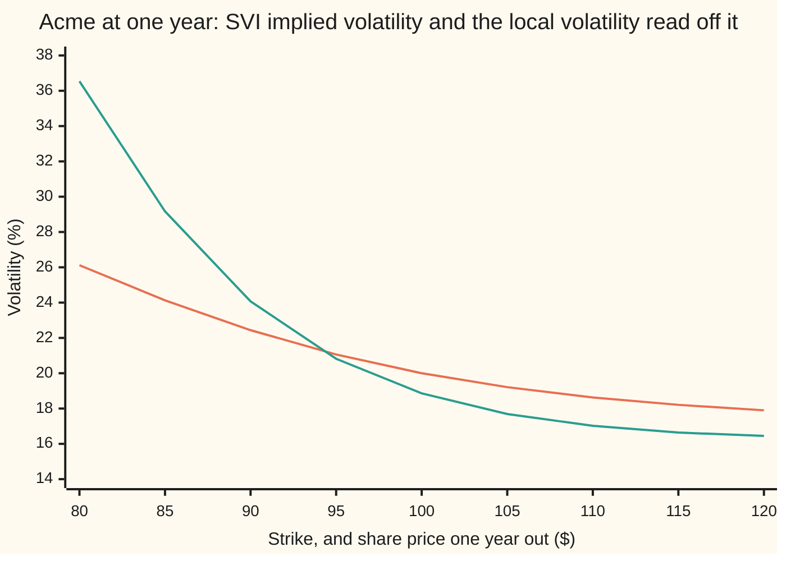
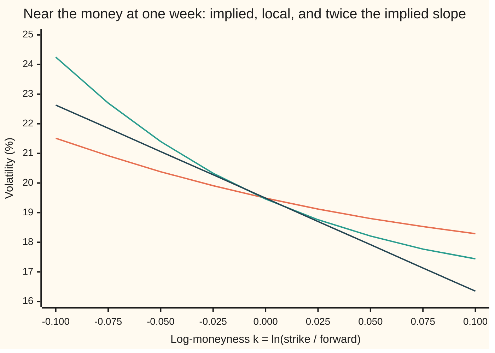

# Local volatility in implied-vol terms: the version you can compute from quotes, and the twice-the-skew rule

Financial mathematics → Local volatility and jumps → Local vol from the smile → Local volatility in implied-vol terms

---

## General Overview

Acme shares trade at \$100. Its one-year options are summed up by one smooth curve, the SVI fit of [svi-smile-fit](../12-The%20smile%20and%20the%20surface/04-svi-smile-fit.md): implied volatility 26.12% at the \$80 strike, 20.00% at \$100, 17.90% at \$120. Each is one volatility for the whole year, the number that makes Black-Scholes return that option's price.

A client asks for an option that dies if Acme ever trades at \$80 during the year. Its value depends on how widely Acme's price swings when it is near \$80. No implied volatility says that: each is one average over every path the share might take to its strike.

**Local volatility** says it: one volatility for each share price and date, chosen so that a share moving with it reprices every quoted option. Dupire's formula ([dupire-local-volatility](01-dupire-local-volatility.md)) reads it off call prices at every strike and expiry. A desk holds fitted smiles instead. This card rewrites Dupire's formula in the smile's own terms, implied volatility and its slopes, and applies it to the SVI curve.

One year out, local volatility at \$92 is 22.58% against an implied 21.85%; at \$120 it is 16.45% against 17.90%. The local curve is steeper. At short expiry the steepness obeys a rule: near the money, local volatility slopes twice as fast as implied.

**Local variance (local volatility squared) at a price and date is the rate at which total implied variance grows with expiry at a fixed strike-to-forward ratio, divided by the same butterfly function that tests a smile for arbitrage; at short expiry this makes implied volatility an average of local volatility between the forward and the strike, so at the forward the local slope is twice the implied slope.**

**What kind of fact this is:** a theorem: Dupire's formula rewritten exactly, proved on this card in Why it works. The twice-the-skew rule is an approximation, exact only in the limit of short expiry; at one year on this surface the factor is 1.42, not 2.

### The picture: one year out, implied and local



The orange line is implied volatility at one year, one number per strike. The green line is local volatility on the date one year out, one number per share price. They cross between \$90 and \$95; below the crossing local volatility climbs much faster, 36.54% at \$80 against 26.12%.

---

## The formula

Notation from [svi-smile-fit](../12-The%20smile%20and%20the%20surface/04-svi-smile-fit.md), in words first. The **forward** $F_T = S\,e^{(r-q)T}$ is the price agreed today for Acme delivered in $T$ years, from share price $S$ = \$100, rate $r$ = 5% and dividend yield $q$ = 2%. **Log-moneyness** $k = \ln(K/F_T)$ measures a strike $K$ against that forward on a log scale; $k = 0$ is the forward. **Total implied variance** $w = \sigma_{\text{imp}}^2\,T$ is implied volatility squared, times years. Its slope and bend in $k$ are $w'$ and $w''$; its slope in expiry, holding $k$ fixed, is $\partial w/\partial T$.

$$\sigma_{\text{loc}}^2(K, T) \;=\; \frac{\partial w/\partial T}{g(k)}, \qquad g(k) = \Bigl(1 - \frac{k\,w'}{2w}\Bigr)^2 - \frac{(w')^2}{4}\Bigl(\frac{1}{w} + \frac14\Bigr) + \frac{w''}{2}$$

**Read it aloud:** local variance at a strike and date is how fast total implied variance grows with expiry at that forward-relative strike, divided by the butterfly function of the smile there.

The function $g$ is the SVI card's butterfly test: its sign is the sign of the market's probability density. Rates and dividends enter only through the forward inside $k$; no call price enters.

**The surface.** The SVI card fitted one expiry. This card extends it in the simplest way free of calendar arbitrage: each log-moneyness keeps its one-year implied volatility at every expiry. With $v$ the fitted one-year curve and $a$, $b$, $\rho$, $m$, $s$ its five numbers,

$$w(k, T) = T\,v(k), \qquad v(k) = a + b\Bigl(\rho\,(k - m) + \sqrt{(k - m)^2 + s^2}\Bigr)$$

In words: total variance grows in proportion to time. So $\partial w/\partial T = v(k)$, and the slopes in $k$ are $T$ times SVI's closed-form slopes.

**At short expiry** two terms of $g$ vanish, and

$$\sigma_{\text{loc}}(k) \;\to\; \frac{\sigma_{\text{imp}}(k)}{1 - k\,\sigma_{\text{imp}}'(k)/\sigma_{\text{imp}}(k)}, \qquad \frac{1}{\sigma_{\text{imp}}(k)} = \int_0^1 \frac{du}{\sigma_{\text{loc}}(u\,k)}$$

In words: implied volatility at a strike is the harmonic mean of local volatility (the reciprocal of the average of the reciprocals) along the straight line from the forward to that strike. $\sigma_{\text{imp}}'$ is implied volatility's slope in $k$, the **implied skew**; $u$ runs from 0 at the forward to 1 at the strike.

**The skew rule** follows at the forward:

$$\sigma_{\text{loc}}'(0) = 2\,\sigma_{\text{imp}}'(0)$$

In words: at the money and short expiry, local volatility slopes twice as steeply as implied.

| Symbol | Plain meaning | In our example | Push it up and the answer… |
| --- | --- | --- | --- |
| $K$, $T$ | strike, or share price on the date; years to expiry | \$92 and \$120; 1 year | $K$: local vol falls from \$80 to \$120; $T$: at the forward, 19.49% at one day to 18.07% at one year |
| $F_T$, $D(T)$, $S$, $r$, $q$ | forward; discount factor $e^{-rT}$; share price, rate, dividend yield | \$103.05 at one year; \$100, 5%, 2% | $S$ or $r$ up: every $k$ falls; $q$ up: every $k$ rises |
| $k$ | log-moneyness, $\ln(K/F_T)$ | −0.113382 at \$92, +0.152322 at \$120 | local vol falls |
| $\sigma_{\text{imp}}$, $\sigma_{\text{imp}}'$ | implied volatility; its slope in $k$, the implied skew | 21.8464%, 17.8994%; skew −0.157199 at the forward | — |
| $w$, $v$ | total implied variance; $v$ the one-year SVI curve, $w = T v$ | 0.047727 at \$92 | local vol up |
| $a$, $b$, $\rho$, $m$, $s$ | SVI's level, wing steepness, tilt, centre, rounding | 0.016719, 0.126769, −0.912282, −0.118207, 0.248954 | $b = 0$: local equals implied |
| $w'$, $w''$ | slope and bend of $w$ in $k$ | −0.113192 and 0.508920 at \$92 | more bend: $g$ up, local vol down |
| $\partial w/\partial T$ | slope of $w$ in expiry at fixed $k$ | 0.047727 at \$92 | local vol up |
| $g$ | the butterfly function; same sign as the market's density | 0.935717 at \$92, 1.184289 at \$120 | local vol down |
| $\sigma_{\text{loc}}$ | local volatility: how widely Acme's price swings at price $K$ on date $T$ | 22.5844%, 16.4479% | — |
| $C$, $c$, $N$, $\varphi$, $d_1$, $d_2$ | call price; $c$ the call per discounted forward dollar; bell-curve area and height; the Black-Scholes distances in $k$ and $w$ | — | — |
| $u$, $y$ | a point on the line from forward to strike: fraction $u$ of the way, log-moneyness $y$ | 0 to 1; 0 to $k$ | — |

**Existence, uniqueness and the boundary cases, before solving.** This is an inverse: option prices in, the volatility function behind them out. The formula returns a local volatility where $\partial w/\partial T \ge 0$ and $g > 0$, the calendar and butterfly tests. Where either fails, the quotes hold an arbitrage and no local volatility reprices them. Given a complete smooth surface the answer is unique: the formula is explicit. A desk never has one. Seven one-year quotes fix neither the curve between strikes nor its growth between expiries; SVI and the constant-per-$k$ extension are choices, and another choice through the same quotes gives another local volatility. Boundary cases. As $T$ shrinks to 0 the formula has the finite limit above, which at the forward is implied volatility itself. Far out in a wing, $g$ tends to $\tfrac14$ minus the square of the wing slope of $w$ over 16: positive while that slope stays below 2 (Lee's bound, on the SVI card), zero at 2. There local volatility grows like the square root of $|k|$, as implied does, but faster: 78.78% at \$60 and 109.76% at \$40 one year out, against implied 35.75% and 47.13%. Stretched in expiry, the surface itself breaks: the $(w')^2/16$ inside $g$ grows like $T^2$, and the smallest $g$ for $k$ from −1.5 to 1.5 falls from 0.025117 at three years to −0.065153 at four. The card uses the surface up to one year.

### When it holds

- **A surface smooth in strike and expiry.** The formula needs two slopes in $k$ and one in $T$. Differencing raw quotes divides their errors by the square of the strike spacing, so the slopes come from a fitted curve.
- **No calendar arbitrage: $\partial w/\partial T \ge 0$.** Otherwise local variance is negative, and no volatility squares to it.
- **No butterfly arbitrage: $g > 0$.** At $g = 0$ local variance is infinite, below it negative. Here the smallest $g$ for $k$ from −1.5 to 1.5, over six expiries, is 0.182822.
- **Known rates and a proportional dividend yield.** Then the forward is fixed today and Step 1's cancellation is exact. Cash dividends or random rates add terms.
- **The skew rule: short expiry, near the money.** At one year the local-to-implied slope ratio here is 1.42; far from the money local volatility bends away from any straight line.

---

## Why it works

### Step 0: every slope of a call price is a slope of total variance

Dupire's formula needs the slopes of call prices in strike and expiry. Every call price on the surface is Black-Scholes applied to one total variance at one log-moneyness. So by the chain rule every slope of a call price is a slope of $w$ times a Black-Scholes factor. The factors on top and below turn out equal, and cancel. What survives is $w$ and its slopes.

### Step 1: measure strikes from the forward, and the rates drop out

Dupire's formula, from [dupire-local-volatility](01-dupire-local-volatility.md), with $C(K, T)$ the call price:

$$\sigma_{\text{loc}}^2 = \frac{\partial C/\partial T + (r - q)\,K\,\partial C/\partial K + q\,C}{\tfrac12 K^2\,\partial^2 C/\partial K^2}$$

Write each call as the discounted forward times a price per forward dollar: $C = D(T)\,F_T\;c(k, T)$, with $D(T) = e^{-rT}$. Substitute. On top the rate and dividend terms cancel, leaving $D(T) F_T$ times the slope of $c$ in expiry at fixed $k$. Below, strike slopes become slopes in $k$, written with primes:

$$\sigma_{\text{loc}}^2 = \frac{2\,\partial c/\partial T}{c'' - c'}$$

Measuring strikes from the forward is what makes the drift cancel.

<details>
<summary>The algebra behind this</summary>

At a fixed strike, $k = \ln K - \ln F_T$ falls at rate $r - q$ as expiry grows, because the forward grows at that rate. And $D(T)F_T = S e^{-qT}$ falls at rate $q$. So
$$\frac{\partial C}{\partial K} = \frac{D(T)F_T\,c'}{K}, \qquad \frac{\partial^2 C}{\partial K^2} = \frac{D(T)F_T\,(c'' - c')}{K^2}, \qquad \frac{\partial C}{\partial T} = D(T)F_T\Bigl(-q\,c + \frac{\partial c}{\partial T} - (r - q)\,c'\Bigr).$$
Then $(r - q)K\,\partial C/\partial K = D(T)F_T\,(r - q)\,c'$ and $qC = D(T)F_T\,q\,c$. Adding the three pieces of the top leaves $D(T)F_T\,\partial c/\partial T$. The bottom is $\tfrac12 K^2\,\partial^2 C/\partial K^2 = \tfrac12 D(T)F_T\,(c'' - c')$.

</details>

### Step 2: the time slope is vega times the variance slope

The price per forward dollar is $c = N(d_1) - e^{k} N(d_2)$, with $d_1 = -k/\sqrt{w} + \sqrt{w}/2$ and $d_2 = d_1 - \sqrt{w}$, where $N$ is the bell-curve area to the left. It depends on expiry only through $w$. So

$$\frac{\partial c}{\partial T} = \frac{\partial c}{\partial w}\,\frac{\partial w}{\partial T}, \qquad \frac{\partial c}{\partial w} = \frac{e^{k}\,\varphi(d_2)}{2\sqrt{w}} > 0$$

The factor $\partial c/\partial w$ is vega written for total variance, and $\varphi$ is the bell-curve height.

### Step 3: the strike bend is vega times twice g

The chain rule on the strike side, with $w$ now a function of $k$, gives

$$c'' - c' = 2\,\frac{\partial c}{\partial w}\;g(k)$$

This is the identity inside the butterfly test of [svi-smile-fit](../12-The%20smile%20and%20the%20surface/04-svi-smile-fit.md): the density of Acme's price is $g$ times a positive factor. Divide Step 2 by Step 3 and the vega cancels:

$$\sigma_{\text{loc}}^2 = \frac{2\,(\partial c/\partial w)\,\partial w/\partial T}{2\,(\partial c/\partial w)\,g} = \frac{\partial w/\partial T}{g}$$

<details>
<summary>Detailed proof: $c'' - c' = 2\,(\partial c/\partial w)\,g$</summary>

Four Black-Scholes facts, each checked by differentiating $N(d_1) - e^k N(d_2)$ and using $\varphi(d_1) = e^{k}\varphi(d_2)$. Partial slopes hold the other variable fixed.
- $\partial c/\partial k = -e^{k} N(d_2)$.
- $\partial^2 c/\partial k^2 - \partial c/\partial k = e^{k}\varphi(d_2)/\sqrt{w} = 2\,\partial c/\partial w$.
- $\partial^2 c/\partial k\,\partial w = (\partial c/\partial w)\,(\tfrac12 - k/w)$.
- $\partial^2 c/\partial w^2 = (\partial c/\partial w)\,\bigl(k^2/(2w^2) - 1/(2w) - 1/8\bigr)$.

Now let $w$ depend on $k$. The chain rule gives $c' = \partial_k c + w'\,\partial_w c$ and $c'' = \partial_{kk} c + 2w'\,\partial_{kw} c + (w')^2\,\partial_{ww} c + w''\,\partial_w c$. Subtract and substitute the four facts:
$$c'' - c' = \partial_w c\,\Bigl[\,2 + 2w'\bigl(\tfrac12 - \tfrac{k}{w}\bigr) - w' + (w')^2\bigl(\tfrac{k^2}{2w^2} - \tfrac{1}{2w} - \tfrac18\bigr) + w''\Bigr].$$
The two lone $w'$ terms cancel. Take out a factor 2 and the bracket becomes $1 - kw'/w + k^2(w')^2/(4w^2) - (w')^2/(4w) - (w')^2/16 + w''/2$, which is $g$ once $(1 - kw'/(2w))^2$ is expanded. So $c'' - c' = 2\,\partial_w c\;g$.

</details>

### Step 4: what the two halves say

A flat surface first. Flat means $w' = w'' = 0$, so $g = 1$ and $\partial w/\partial T$ is the volatility squared: local equals implied. The house example's flat 20% gives 20% everywhere; road 2 of the code confirms it from call prices alone.

The top is the calendar half. At fixed $k$, $\partial w/\partial T$ is the variance the market adds between one expiry and the next: the forward variance of [term-structure-and-forward-volatility](../12-The%20smile%20and%20the%20surface/02-term-structure-and-forward-volatility.md), at one moneyness.

The bottom is the butterfly half, the smile's shape. Below the forward on a downward skew, $k$ and $w'$ are both negative, so the first term of $g$ drops below 1: 0.749172 at \$92. The bend adds back 0.254460, but $g$ is still 0.935717, so local volatility sits above implied. At \$120 $k$ is positive and $w'$ still negative, so the first term exceeds 1 and $g$ is 1.184289: local sits below implied. The skew makes local volatility steeper than implied; the bend pulls it back.

### Step 5: at short expiry, implied is an average of local

Let $T$ shrink with implied volatility held at each $k$, as on this surface. Then $w = \sigma_{\text{imp}}^2 T$ and $w' = 2\sigma_{\text{imp}}\sigma_{\text{imp}}' T$ both shrink in proportion to $T$, but their ratio does not: $k w'/(2w) = k\,\sigma_{\text{imp}}'/\sigma_{\text{imp}}$. The second and third terms of $g$ carry a spare factor of $T$ and vanish. The top tends to $\sigma_{\text{imp}}^2$. So local volatility tends to $\sigma_{\text{imp}}/(1 - k\sigma_{\text{imp}}'/\sigma_{\text{imp}})$.

One piece of calculus turns that into an average. The slope in $k$ of $k/\sigma_{\text{imp}}(k)$ is $(1 - k\sigma_{\text{imp}}'/\sigma_{\text{imp}})/\sigma_{\text{imp}}$, which is exactly $1/\sigma_{\text{loc}}$. Add up that slope from the forward, $y = 0$, to the strike, $y = k$:

$$\frac{k}{\sigma_{\text{imp}}(k)} = \int_0^k \frac{dy}{\sigma_{\text{loc}}(y)}, \qquad\text{so}\qquad \frac{1}{\sigma_{\text{imp}}(k)} = \int_0^1 \frac{du}{\sigma_{\text{loc}}(u\,k)}$$

Implied volatility is the harmonic mean of local volatility along the straight line from the forward to the strike. Berestycki, Busca and Florent proved this short-expiry limit in 2002 for local volatility models in general. At one day the code's harmonic means give 21.1050% at \$92 and 17.7279% at \$120, against implied 21.1108% and 17.7303%; the gap shrinks in proportion to expiry.

### Step 6: why the factor is two

Near the money, local volatility is nearly a straight line in $k$, and a harmonic mean of nearly equal numbers is nearly their ordinary average. The average of a straight line from 0 to $k$ is its value halfway, at $k/2$. So implied volatility at $k$ is roughly local volatility at $k/2$: the implied curve climbs at half the local rate.

Differentiating the short-expiry formula at $k = 0$ makes it exact. Local volatility there is implied volatility divided by $1 - k\sigma_{\text{imp}}'/\sigma_{\text{imp}}$. At the forward that divisor is 1 and falls at the rate $\sigma_{\text{imp}}'/\sigma_{\text{imp}}$ per unit of $k$. Where a divisor equals 1, a quotient's slope is the top's slope plus the top times the rate at which the divisor falls: $\sigma_{\text{imp}}' + \sigma_{\text{imp}} \cdot \sigma_{\text{imp}}'/\sigma_{\text{imp}} = 2\sigma_{\text{imp}}'$.

On Acme's surface the implied skew at the forward is −0.157199 per unit of $k$; twice it is −0.314398. The local skew, measured by finite differences, as a multiple of the implied:

```
local skew / implied skew, at the forward      one block = 0.05
1 year     ████████████████████████████              1.42
6 months   ██████████████████████████████████        1.68
3 months   █████████████████████████████████████     1.83
1 month    ███████████████████████████████████████   1.94
1 week     ████████████████████████████████████████  1.99
1 day      ████████████████████████████████████████  2.00
```

The factor climbs to 2 as expiry shrinks. At one year the two terms of $g$ that carry $T$ still matter.



Orange: implied volatility at one week. Green: local volatility at one week. Dark: the straight line through the at-the-money implied volatility with twice the implied skew as its slope. Near $k = 0$ the local curve runs along it; further out it bends above it on both sides.

For longer expiries Gatheral's book names a refinement, the most-likely-path approximation: implied volatility is roughly local volatility averaged along the path the share most likely takes to finish at the strike. This card names it only. The other road to the local volatilities is Dupire's formula on call prices by finite differences, the method of [dupire-local-volatility](01-dupire-local-volatility.md) and road 2 of the code.

---

## Worked numbers, by hand

The \$92 strike, one year out, with the SVI card's five numbers: $a$ = 0.016719, $b$ = 0.126769, $\rho$ = −0.912282, $m$ = −0.118207, $s$ = 0.248954.

| Step | Arithmetic | Value |
| --- | --- | --- |
| forward | $100 \times e^{0.03}$ | 103.045453 |
| log-moneyness $k$ | $\ln(92 / 103.045453)$ | −0.113382 |
| distance from the centre, $k - m$ | $-0.113382 + 0.118207$ | 0.004825 |
| rounded distance | $\sqrt{0.004825^2 + 0.248954^2}$ | 0.249001 |
| total variance $w$ | $0.016719 + 0.126769 \times (-0.912282 \times 0.004825 + 0.249001)$ | 0.047727 |
| implied volatility | $\sqrt{0.047727}$ | 21.8464% |
| slope $w'$ | $0.126769 \times (-0.912282 + 0.004825 / 0.249001)$ | −0.113192 |
| bend $w''$ | $0.126769 \times 0.248954^2 / 0.249001^3$ | 0.508920 |
| time slope $\partial w/\partial T$ | $w = T v$, so the slope is $v$ | 0.047727 |
| first term of $g$ | $\bigl(1 - (-0.113382)(-0.113192) / (2 \times 0.047727)\bigr)^2$ | 0.749172 |
| second term | $(-0.113192)^2 / 4 \times (1/0.047727 + 1/4)$ | 0.067915 |
| third term | $0.508920 / 2$ | 0.254460 |
| $g$ | $0.749172 - 0.067915 + 0.254460$ | 0.935717 |
| local variance | $0.047727 / 0.935717$ | 0.051005 |
| **local volatility** | $\sqrt{0.051005}$ | **22.5844%** |

Values are carried at full precision, so a last digit can differ from the rounded arithmetic.

The \$120 strike, same steps: $k$ = 0.152322, $w$ = 0.032039, $w'$ = −0.022367, $w''$ = 0.158111, $g$ = 1.184289, local volatility **16.4479%** against implied 17.8994%.

In the one model where volatility depends only on price and date and every quoted option reprices, Acme standing at \$92 a year from now moves with volatility 22.58%; at \$120, with 16.45%.

### What breaks if you drop a piece

| Mistake | Comes out at | What went wrong |
| --- | --- | --- |
| Implied volatility read as local | 21.8464% at \$92, 17.8994% at \$120 (right: 22.5844%, 16.4479%) | an average over a year of paths is not the volatility at one price |
| Time slope taken at fixed strike, not fixed $k$ | 23.3740%, 16.6192% | at a fixed strike $k$ drifts as the forward grows, which adds $-(r - q)\,w'$ to the top |
| $k$ measured from the share price, $\ln(K/S)$ | 20.9255%, 16.3859% | treats the forward, \$103.05, as \$100 |
| Short-expiry formula used at one year | 25.2400%, 16.9957% | drops the two terms of $g$ that carry a factor $T$; at one year they are not small |

The code prints all four.

---

## Code, from first principles, and it actually runs

Nothing imported knows the answer: the normal distribution is summed from its series, Simpson's rule is written out, slopes are finite differences. Road 1 is this card's formula with SVI's closed-form slopes. Road 2 prices Black-Scholes calls off the surface and runs Dupire's formula on them by finite differences; it never sees $g$ or an SVI slope, and on a flat 20% surface its pricer returns the pilot's house call, \$9.23. Road 3 tests the short-expiry results: the local skew against twice the implied skew, and harmonic means of local volatility against implied. Mutation tests broke the maths six ways (a term of $g$ dropped, Dupire's drift term flipped, the time slope taken at fixed strike, a coarse strike step, an ordinary average for the harmonic one, the implied skew measured for the local one); an assert stopped the run each time.

### Python

```python
# Local volatility in implied-vol terms -- the check behind the card.  Standard library only.
# The surface: the one-year SVI curve v(k) of svi-smile-fit, each log-moneyness k keeping its
# implied vol at every expiry, so total variance is w(k, T) = T v(k).  Road 1 is the implied-vol
# formula, (dw/dT) / g.  Road 2 is Dupire's formula on call prices by finite differences: it never
# sees g or an SVI slope.  Road 3 rebuilds short-dated implied vols as harmonic means of local vols.
from math import log, sqrt, exp, pi

P = (0.016719, 0.126769, -0.912282, -0.118207, 0.248954)   # a, b, rho, m, s from svi-smile-fit
S0, R, Q = 100.0, 0.05, 0.02
DAY, WEEK = 1 / 365, 1 / 52

def N(x):                                   # normal CDF from its own series
    if abs(x) > 9.0: return 1.0 if x > 0 else 0.0
    y = abs(x) / sqrt(2.0); term = y; s = y; n = 0
    while term > 1e-17 * s:
        n += 1; term *= 2.0 * y * y / (2 * n + 1); s += term
    e = 2.0 / sqrt(pi) * exp(-y * y) * s
    return 0.5 * (1.0 + e) if x >= 0 else 0.5 * (1.0 - e)
def fwd(T): return S0 * exp((R - Q) * T)
def svi(k, p=P):                            # one-year total variance v, its slope v' and its bend v''
    a, b, rho, m, s = p; rt = sqrt((k - m) ** 2 + s * s)
    return a + b * (rho * (k - m) + rt), b * (rho + (k - m) / rt), b * s * s / rt ** 3
def g_terms(k, T, p=P):                     # the three terms of g, for total variance w = T v
    v0, v1, v2 = svi(k, p); w, w1, w2 = T * v0, T * v1, T * v2
    return (1 - k * w1 / (2 * w)) ** 2, w1 * w1 / 4 * (1 / w + 0.25), w2 / 2
def g(k, T, p=P): t1, t2, t3 = g_terms(k, T, p); return t1 - t2 + t3
def loc(k, T, p=P): return sqrt(svi(k, p)[0] / g(k, T, p))   # road 1: dw/dT at fixed k is v(k)
def imp(k, p=P): return sqrt(svi(k, p)[0])                     # implied vol, the same at every T
def call(K, T, vol):                        # Black-Scholes call, from an implied-vol function vol(K, T)
    f, sd = fwd(T), vol(K, T) * sqrt(T); d1 = (log(f / K) + 0.5 * sd * sd) / sd
    return exp(-R * T) * (f * N(d1) - K * N(d1 - sd))
def dupire(K, T, vol, hk=0.05, ht=1e-4):    # road 2: Dupire on call prices, slopes by differences
    c = lambda x, t: call(x, t, vol); c0 = c(K, T)
    cT = (c(K, T + ht) - c(K, T - ht)) / (2 * ht)
    cK = (c(K + hk, T) - c(K - hk, T)) / (2 * hk)
    cKK = (c(K + hk, T) - 2 * c0 + c(K - hk, T)) / (hk * hk)
    return sqrt((cT + (R - Q) * K * cK + Q * c0) / (0.5 * K * K * cKK))
def svi_vol(K, T): return imp(log(K / fwd(T)))
def skew(f, h=1e-4): return (f(h) - f(-h)) / (2 * h)       # slope in k at the forward, k = 0
def simpson(f, a, b, n=200):
    h = (b - a) / n
    return h / 3 * sum((1 if i in (0, n) else 4 if i % 2 else 2) * f(a + i * h) for i in range(n + 1))
def row(label, xs, fmt): print(f"{label:<42}" + "".join(format(x, fmt).rjust(12) for x in xs))

F1, Ks = fwd(1.0), (92.0, 120.0)
ks = [log(K / F1) for K in Ks]
a, b, rho, m, s = P
sv = [svi(k) for k in ks]; gt = [g_terms(k, 1.0) for k in ks]
print(f"forward at one year, F = 100 e^0.03       {F1:.6f}")
print("SVI a, b, rho, m, s (svi-smile-fit)       " + " ".join(f"{x:+.6f}" for x in P))
print(f"{'one year, T = 1':<42}{'K = 92':>12}{'K = 120':>12}")
row("log-moneyness k = ln(K/F)", ks, ".6f")
row("k - m", [k - m for k in ks], ".6f")
row("rounded distance sqrt((k-m)^2 + s^2)", [sqrt((k - m) ** 2 + s * s) for k in ks], ".6f")
row("total variance w", [x[0] for x in sv], ".6f")
row("implied vol, %", [100 * imp(k) for k in ks], ".4f")
row("slope w' in k", [x[1] for x in sv], ".6f")
row("bend w'' in k", [x[2] for x in sv], ".6f")
row("time slope dw/dT at fixed k", [x[0] for x in sv], ".6f")
row("g, first term (1 - k w'/2w)^2", [t[0] for t in gt], ".6f")
row("g, second term w'^2/4 (1/w + 1/4)", [t[1] for t in gt], ".6f")
row("g, third term w''/2", [t[2] for t in gt], ".6f")
row("g", [g(k, 1.0) for k in ks], ".6f")
row("local variance (dw/dT) / g", [svi(k)[0] / g(k, 1.0) for k in ks], ".6f")
L1 = [loc(k, 1.0) for k in ks]; L2 = [dupire(K, 1.0, svi_vol) for K in Ks]
row("road 1 local vol, implied-vol formula, %", [100 * x for x in L1], ".4f")
row("road 2 local vol, Dupire on prices, %", [100 * x for x in L2], ".4f")
flat = [dupire(K, 1.0, lambda x, t: 0.2) for K in Ks]
row("flat 20% surface through road 2, %", [100 * x for x in flat], ".4f")
pilot = call(100.0, 1.0, lambda x, t: 0.2)
print(f"{'house call, flat 20%, K = 100':<42}{pilot:>16.12f}")
row("wrong: dw/dT at fixed strike, %", [100 * sqrt((x[0] - (R - Q) * x[1]) / g(k, 1.0)) for k, x in zip(ks, sv)], ".4f")
row("wrong: k measured from spot, %", [100 * loc(log(K / S0), 1.0) for K in Ks], ".4f")
row("wrong: short-dated formula at 1 year, %", [100 * imp(k) / (1 - k * x[1] / (2 * x[0])) for k, x in zip(ks, sv)], ".4f")
s0, sk0 = imp(0.0), svi(0.0)[1] / (2 * imp(0.0))           # implied skew = v'(0) / (2 sigma)
print(f"at the forward k = 0: implied vol %, implied skew     {100 * s0:.4f} {sk0:.6f}")
print(f"limit as T -> 0: twice the implied skew               {2 * sk0:.6f}")
print("expiry            T  local vol at k = 0, %    local skew  local / implied")
ratio = {}
for lab, T in (("1 year", 1.0), ("6 months", 0.5), ("3 months", 0.25), ("1 month", 1 / 12), ("1 week", WEEK), ("1 day", DAY)):
    ls = skew(lambda k: loc(k, T)); ratio[lab] = ls / sk0
    print(f"{lab:<10}{T:9.6f}{100 * loc(0.0, T):16.4f}{ls:18.6f}{ls / sk0:12.2f}")
kd = [log(K / fwd(DAY)) for K in Ks]
hm = [1 / simpson(lambda u: 1 / loc(u * k, DAY), 0.0, 1.0) for k in kd]
row("one day: implied vol, %", [100 * imp(k) for k in kd], ".4f")
row("one day: harmonic mean of local vols, %", [100 * x for x in hm], ".4f")
gmin = min(g(0.01 * i - 1.5, T) for i in range(301) for T in (1.0, 0.5, 0.25, 1 / 12, WEEK, DAY))
print(f"smallest g, k from -1.5 to 1.5, six expiries   {gmin:.6f}")
g34 = [min(g(0.01 * i - 1.5, T) for i in range(301)) for T in (3.0, 4.0)]
print(f"smallest g, same k, at 3 and 4 years           {g34[0]:.6f} {g34[1]:.6f}")
row("one year, K = 60 and 40: implied vol, %", [100 * imp(log(K / F1)) for K in (60.0, 40.0)], ".2f")
row("one year, K = 60 and 40: local vol, %", [100 * loc(log(K / F1), 1.0) for K in (60.0, 40.0)], ".2f")
grid, kg = [80.0 + 5 * i for i in range(9)], [0.025 * (i - 4) for i in range(9)]
print("chart, strike           " + " ".join(f"{K:6.0f}" for K in grid))
print("chart, implied, 1 year  " + " ".join(f"{100 * imp(log(K / F1)):6.2f}" for K in grid))
print("chart, local, 1 year    " + " ".join(f"{100 * loc(log(K / F1), 1.0):6.2f}" for K in grid))
print("chart, k                " + " ".join(f"{k:6.3f}" for k in kg))
print("chart, implied, 1 week  " + " ".join(f"{100 * imp(k):6.2f}" for k in kg))
print("chart, local, 1 week    " + " ".join(f"{100 * loc(k, WEEK):6.2f}" for k in kg))
print("chart, twice-skew line  " + " ".join(f"{100 * (s0 + 2 * sk0 * k):6.2f}" for k in kg))
pb, pr = (a, 0.0, rho, m, s), (a, b, 0.0, m, s)
print(f"try: b = 0, local vol at 92 and 120, %          {100 * loc(ks[0], 1.0, pb):.2f} {100 * loc(ks[1], 1.0, pb):.2f}")
sr = svi(0.0, pr)[1] / (2 * imp(0.0, pr))
print(f"try: rho = 0, local / implied skew, 1 year, 1 day   {skew(lambda k: loc(k, 1.0, pr)) / sr:.2f} {skew(lambda k: loc(k, DAY, pr)) / sr:.2f}")
assert all(abs(x - y) < 1e-5 for x, y in zip(L1, L2)), "road 1 (dw/dT over g) must match road 2 (Dupire on prices)"
assert all(abs(x - 0.2) < 1e-5 for x in flat), "a flat 20% surface must give 20% local vol"
assert abs(ratio["1 day"] - 2) < 0.01, "short-dated local skew is twice the implied skew"
assert ratio["1 year"] < 1.5, "at one year the factor is well short of 2"
assert all(abs(h - imp(k)) < 1e-4 for h, k in zip(hm, kd)), "short-dated implied = harmonic mean of local"
assert gmin > 0, "g positive everywhere: a local vol exists at every point of the grid"
assert g34[1] < 0, "stretched to four years this surface fails the butterfly test"
assert abs(pilot - 9.227005508154) < 1e-9, "the pricer returns the pilot's house call"
print("ALL CHECKS PASS")
```

**Ran 2026-09-24 on macOS, Python 3.14.6, standard library only. All checks passed. Output, pasted from the run:**

```
forward at one year, F = 100 e^0.03       103.045453
SVI a, b, rho, m, s (svi-smile-fit)       +0.016719 +0.126769 -0.912282 -0.118207 +0.248954
one year, T = 1                                 K = 92     K = 120
log-moneyness k = ln(K/F)                    -0.113382    0.152322
k - m                                         0.004825    0.270529
rounded distance sqrt((k-m)^2 + s^2)          0.249001    0.367646
total variance w                              0.047727    0.032039
implied vol, %                                 21.8464     17.8994
slope w' in k                                -0.113192   -0.022367
bend w'' in k                                 0.508920    0.158111
time slope dw/dT at fixed k                   0.047727    0.032039
g, first term (1 - k w'/2w)^2                 0.749172    1.109169
g, second term w'^2/4 (1/w + 1/4)             0.067915    0.003935
g, third term w''/2                           0.254460    0.079055
g                                             0.935717    1.184289
local variance (dw/dT) / g                    0.051005    0.027053
road 1 local vol, implied-vol formula, %       22.5844     16.4479
road 2 local vol, Dupire on prices, %          22.5844     16.4478
flat 20% surface through road 2, %             20.0000     20.0000
house call, flat 20%, K = 100               9.227005508154
wrong: dw/dT at fixed strike, %                23.3740     16.6192
wrong: k measured from spot, %                 20.9255     16.3859
wrong: short-dated formula at 1 year, %        25.2400     16.9957
at the forward k = 0: implied vol %, implied skew     19.4897 -0.157199
limit as T -> 0: twice the implied skew               -0.314398
expiry            T  local vol at k = 0, %    local skew  local / implied
1 year     1.000000         18.0745         -0.223711        1.42
6 months   0.500000         18.7416         -0.264434        1.68
3 months   0.250000         19.1046         -0.288095        1.83
1 month    0.083333         19.3587         -0.305313        1.94
1 week     0.019231         19.4593         -0.312272        1.99
1 day      0.002740         19.4854         -0.314094        2.00
one day: implied vol, %                        21.1108     17.7303
one day: harmonic mean of local vols, %        21.1050     17.7279
smallest g, k from -1.5 to 1.5, six expiries   0.182822
smallest g, same k, at 3 and 4 years           0.025117 -0.065153
one year, K = 60 and 40: implied vol, %          35.75       47.13
one year, K = 60 and 40: local vol, %            78.78      109.76
chart, strike               80     85     90     95    100    105    110    115    120
chart, implied, 1 year   26.12  24.13  22.44  21.06  20.00  19.21  18.63  18.21  17.90
chart, local, 1 year     36.54  29.17  24.07  20.82  18.86  17.69  17.02  16.64  16.45
chart, k                -0.100 -0.075 -0.050 -0.025  0.000  0.025  0.050  0.075  0.100
chart, implied, 1 week   21.51  20.92  20.38  19.91  19.49  19.12  18.80  18.53  18.29
chart, local, 1 week     24.25  22.70  21.40  20.33  19.46  18.76  18.21  17.77  17.44
chart, twice-skew line   22.63  21.85  21.06  20.28  19.49  18.70  17.92  17.13  16.35
try: b = 0, local vol at 92 and 120, %          12.93 12.93
try: rho = 0, local / implied skew, 1 year, 1 day   2.50 2.00
ALL CHECKS PASS
```

### Rust

Same numbers, same labels, built with `rustc --edition 2021 -O`.

```rust
// Local volatility in implied-vol terms -- the same check as the Python, in Rust.  No crates.
// The surface: the one-year SVI curve v(k) of svi-smile-fit, each log-moneyness k keeping its
// implied vol at every expiry, so total variance is w(k, T) = T v(k).  Road 1 is the implied-vol
// formula, (dw/dT) / g.  Road 2 is Dupire's formula on call prices by finite differences: it never
// sees g or an SVI slope.  Road 3 rebuilds short-dated implied vols as harmonic means of local vols.
use std::f64::consts::PI;

type P5 = [f64; 5];
const P: P5 = [0.016719, 0.126769, -0.912282, -0.118207, 0.248954]; // a, b, rho, m, s
const S0: f64 = 100.0;
const R: f64 = 0.05;
const Q: f64 = 0.02;
const DAY: f64 = 1.0 / 365.0;
const WEEK: f64 = 1.0 / 52.0;

fn n_cdf(x: f64) -> f64 { // normal CDF from its own series
    if x.abs() > 9.0 { return if x > 0.0 { 1.0 } else { 0.0 }; }
    let y = x.abs() / 2f64.sqrt();
    let (mut term, mut s, mut n) = (y, y, 0.0);
    while term > 1e-17 * s { n += 1.0; term *= 2.0 * y * y / (2.0 * n + 1.0); s += term; }
    let e = 2.0 / PI.sqrt() * (-y * y).exp() * s;
    if x >= 0.0 { 0.5 * (1.0 + e) } else { 0.5 * (1.0 - e) }
}
fn fwd(t: f64) -> f64 { S0 * ((R - Q) * t).exp() }
fn svi(k: f64, p: &P5) -> (f64, f64, f64) { // one-year total variance v, its slope v' and its bend v''
    let [a, b, rho, m, s] = *p;
    let rt = ((k - m).powi(2) + s * s).sqrt();
    (a + b * (rho * (k - m) + rt), b * (rho + (k - m) / rt), b * s * s / rt.powi(3))
}
fn g_terms(k: f64, t: f64, p: &P5) -> (f64, f64, f64) { // the three terms of g, for w = T v
    let (v0, v1, v2) = svi(k, p);
    let (w, w1, w2) = (t * v0, t * v1, t * v2);
    ((1.0 - k * w1 / (2.0 * w)).powi(2), w1 * w1 / 4.0 * (1.0 / w + 0.25), w2 / 2.0)
}
fn g(k: f64, t: f64, p: &P5) -> f64 { let (t1, t2, t3) = g_terms(k, t, p); t1 - t2 + t3 }
fn loc(k: f64, t: f64, p: &P5) -> f64 { (svi(k, p).0 / g(k, t, p)).sqrt() } // road 1
fn imp(k: f64, p: &P5) -> f64 { svi(k, p).0.sqrt() } // implied vol, the same at every T
fn call(kk: f64, t: f64, vol: &dyn Fn(f64, f64) -> f64) -> f64 { // Black-Scholes call
    let (f, sd) = (fwd(t), vol(kk, t) * t.sqrt());
    let d1 = ((f / kk).ln() + 0.5 * sd * sd) / sd;
    (-R * t).exp() * (f * n_cdf(d1) - kk * n_cdf(d1 - sd))
}
fn dupire(kk: f64, t: f64, vol: &dyn Fn(f64, f64) -> f64) -> f64 { // road 2: Dupire on call prices
    let (hk, ht) = (0.05, 1e-4);
    let c = |x: f64, s: f64| call(x, s, vol);
    let c0 = c(kk, t);
    let ct = (c(kk, t + ht) - c(kk, t - ht)) / (2.0 * ht);
    let ck = (c(kk + hk, t) - c(kk - hk, t)) / (2.0 * hk);
    let ckk = (c(kk + hk, t) - 2.0 * c0 + c(kk - hk, t)) / (hk * hk);
    ((ct + (R - Q) * kk * ck + Q * c0) / (0.5 * kk * kk * ckk)).sqrt()
}
fn svi_vol(kk: f64, t: f64) -> f64 { imp((kk / fwd(t)).ln(), &P) }
fn skew(f: &dyn Fn(f64) -> f64) -> f64 { let h = 1e-4; (f(h) - f(-h)) / (2.0 * h) } // slope at k = 0
fn simpson(f: &dyn Fn(f64) -> f64, a: f64, b: f64, n: usize) -> f64 {
    let h = (b - a) / n as f64;
    h / 3.0 * (0..=n).map(|i| (if i == 0 || i == n { 1.0 } else if i % 2 == 1 { 4.0 } else { 2.0 }) * f(a + i as f64 * h)).sum::<f64>()
}
fn row(label: &str, xs: &[f64], prec: usize) {
    let mut line = format!("{:<42}", label);
    for x in xs { line.push_str(&format!("{:>12.*}", prec, x)); }
    println!("{}", line);
}
fn join(xs: &[f64], f: &dyn Fn(f64) -> String) -> String { xs.iter().map(|&x| f(x)).collect::<Vec<_>>().join(" ") }

fn main() {
    let (f1, kks) = (fwd(1.0), [92.0, 120.0]);
    let ks: Vec<f64> = kks.iter().map(|kk| (kk / f1).ln()).collect();
    let [a, b, rho, m, s] = P;
    let sv: Vec<(f64, f64, f64)> = ks.iter().map(|&k| svi(k, &P)).collect();
    let gt: Vec<(f64, f64, f64)> = ks.iter().map(|&k| g_terms(k, 1.0, &P)).collect();
    let col = |f: &dyn Fn(usize) -> f64| -> Vec<f64> { (0..2).map(|i| f(i)).collect() };
    println!("forward at one year, F = 100 e^0.03       {:.6}", f1);
    println!("SVI a, b, rho, m, s (svi-smile-fit)       {}", join(&P, &|x| format!("{:+.6}", x)));
    println!("{:<42}{:>12}{:>12}", "one year, T = 1", "K = 92", "K = 120");
    row("log-moneyness k = ln(K/F)", &ks, 6);
    row("k - m", &col(&|i| ks[i] - m), 6);
    row("rounded distance sqrt((k-m)^2 + s^2)", &col(&|i| ((ks[i] - m).powi(2) + s * s).sqrt()), 6);
    row("total variance w", &col(&|i| sv[i].0), 6);
    row("implied vol, %", &col(&|i| 100.0 * imp(ks[i], &P)), 4);
    row("slope w' in k", &col(&|i| sv[i].1), 6);
    row("bend w'' in k", &col(&|i| sv[i].2), 6);
    row("time slope dw/dT at fixed k", &col(&|i| sv[i].0), 6);
    row("g, first term (1 - k w'/2w)^2", &col(&|i| gt[i].0), 6);
    row("g, second term w'^2/4 (1/w + 1/4)", &col(&|i| gt[i].1), 6);
    row("g, third term w''/2", &col(&|i| gt[i].2), 6);
    row("g", &col(&|i| g(ks[i], 1.0, &P)), 6);
    row("local variance (dw/dT) / g", &col(&|i| sv[i].0 / g(ks[i], 1.0, &P)), 6);
    let l1 = col(&|i| loc(ks[i], 1.0, &P));
    let l2 = col(&|i| dupire(kks[i], 1.0, &svi_vol));
    row("road 1 local vol, implied-vol formula, %", &col(&|i| 100.0 * l1[i]), 4);
    row("road 2 local vol, Dupire on prices, %", &col(&|i| 100.0 * l2[i]), 4);
    let flat = col(&|i| dupire(kks[i], 1.0, &|_x, _t| 0.2));
    row("flat 20% surface through road 2, %", &col(&|i| 100.0 * flat[i]), 4);
    let pilot = call(100.0, 1.0, &|_x, _t| 0.2);
    println!("{:<42}{:>16.12}", "house call, flat 20%, K = 100", pilot);
    row("wrong: dw/dT at fixed strike, %", &col(&|i| 100.0 * ((sv[i].0 - (R - Q) * sv[i].1) / g(ks[i], 1.0, &P)).sqrt()), 4);
    row("wrong: k measured from spot, %", &col(&|i| 100.0 * loc((kks[i] / S0).ln(), 1.0, &P)), 4);
    row("wrong: short-dated formula at 1 year, %", &col(&|i| 100.0 * imp(ks[i], &P) / (1.0 - ks[i] * sv[i].1 / (2.0 * sv[i].0))), 4);
    let (s0, sk0) = (imp(0.0, &P), svi(0.0, &P).1 / (2.0 * imp(0.0, &P))); // implied skew = v'(0) / (2 sigma)
    println!("at the forward k = 0: implied vol %, implied skew     {:.4} {:.6}", 100.0 * s0, sk0);
    println!("limit as T -> 0: twice the implied skew               {:.6}", 2.0 * sk0);
    println!("expiry            T  local vol at k = 0, %    local skew  local / implied");
    let mut ratio = Vec::new();
    for (lab, t) in [("1 year", 1.0), ("6 months", 0.5), ("3 months", 0.25), ("1 month", 1.0 / 12.0), ("1 week", WEEK), ("1 day", DAY)] {
        let ls = skew(&|k| loc(k, t, &P));
        ratio.push(ls / sk0);
        println!("{:<10}{:9.6}{:16.4}{:18.6}{:12.2}", lab, t, 100.0 * loc(0.0, t, &P), ls, ls / sk0);
    }
    let kd = col(&|i| (kks[i] / fwd(DAY)).ln());
    let hm = col(&|i| 1.0 / simpson(&|u| 1.0 / loc(u * kd[i], DAY, &P), 0.0, 1.0, 200));
    row("one day: implied vol, %", &col(&|i| 100.0 * imp(kd[i], &P)), 4);
    row("one day: harmonic mean of local vols, %", &col(&|i| 100.0 * hm[i]), 4);
    let mut gmin = f64::INFINITY;
    for i in 0..301 { for t in [1.0, 0.5, 0.25, 1.0 / 12.0, WEEK, DAY] { gmin = gmin.min(g(0.01 * i as f64 - 1.5, t, &P)); } }
    println!("smallest g, k from -1.5 to 1.5, six expiries   {:.6}", gmin);
    let g34: Vec<f64> = [3.0, 4.0].iter().map(|&t| (0..301).map(|i| g(0.01 * i as f64 - 1.5, t, &P)).fold(f64::INFINITY, f64::min)).collect();
    println!("smallest g, same k, at 3 and 4 years           {:.6} {:.6}", g34[0], g34[1]);
    row("one year, K = 60 and 40: implied vol, %", &[60.0, 40.0].map(|kk: f64| 100.0 * imp((kk / f1).ln(), &P)), 2);
    row("one year, K = 60 and 40: local vol, %", &[60.0, 40.0].map(|kk: f64| 100.0 * loc((kk / f1).ln(), 1.0, &P)), 2);
    let grid: Vec<f64> = (0..9).map(|i| 80.0 + 5.0 * i as f64).collect();
    let kg: Vec<f64> = (0..9).map(|i| 0.025 * (i as f64 - 4.0)).collect();
    println!("chart, strike           {}", join(&grid, &|kk| format!("{:6.0}", kk)));
    println!("chart, implied, 1 year  {}", join(&grid, &|kk| format!("{:6.2}", 100.0 * imp((kk / f1).ln(), &P))));
    println!("chart, local, 1 year    {}", join(&grid, &|kk| format!("{:6.2}", 100.0 * loc((kk / f1).ln(), 1.0, &P))));
    println!("chart, k                {}", join(&kg, &|k| format!("{:6.3}", k)));
    println!("chart, implied, 1 week  {}", join(&kg, &|k| format!("{:6.2}", 100.0 * imp(k, &P))));
    println!("chart, local, 1 week    {}", join(&kg, &|k| format!("{:6.2}", 100.0 * loc(k, WEEK, &P))));
    println!("chart, twice-skew line  {}", join(&kg, &|k| format!("{:6.2}", 100.0 * (s0 + 2.0 * sk0 * k))));
    let (pb, pr): (P5, P5) = ([a, 0.0, rho, m, s], [a, b, 0.0, m, s]);
    println!("try: b = 0, local vol at 92 and 120, %          {:.2} {:.2}", 100.0 * loc(ks[0], 1.0, &pb), 100.0 * loc(ks[1], 1.0, &pb));
    let sr = svi(0.0, &pr).1 / (2.0 * imp(0.0, &pr));
    println!("try: rho = 0, local / implied skew, 1 year, 1 day   {:.2} {:.2}", skew(&|k| loc(k, 1.0, &pr)) / sr, skew(&|k| loc(k, DAY, &pr)) / sr);
    assert!(l1.iter().zip(&l2).all(|(x, y)| (x - y).abs() < 1e-5), "road 1 (dw/dT over g) must match road 2 (Dupire on prices)");
    assert!(flat.iter().all(|x| (x - 0.2).abs() < 1e-5), "a flat 20% surface must give 20% local vol");
    assert!((ratio[5] - 2.0).abs() < 0.01, "short-dated local skew is twice the implied skew");
    assert!(ratio[0] < 1.5, "at one year the factor is well short of 2");
    assert!((0..2).all(|i| (hm[i] - imp(kd[i], &P)).abs() < 1e-4), "short-dated implied = harmonic mean of local");
    assert!(gmin > 0.0, "g positive everywhere: a local vol exists at every point of the grid");
    assert!(g34[1] < 0.0, "stretched to four years this surface fails the butterfly test");
    assert!((pilot - 9.227005508154).abs() < 1e-9, "the pricer returns the pilot's house call");
    println!("ALL CHECKS PASS");
}
```

**Ran 2026-09-24 on macOS, rustc 1.98.1, no crates. All checks passed. Output, pasted from the run:**

```
forward at one year, F = 100 e^0.03       103.045453
SVI a, b, rho, m, s (svi-smile-fit)       +0.016719 +0.126769 -0.912282 -0.118207 +0.248954
one year, T = 1                                 K = 92     K = 120
log-moneyness k = ln(K/F)                    -0.113382    0.152322
k - m                                         0.004825    0.270529
rounded distance sqrt((k-m)^2 + s^2)          0.249001    0.367646
total variance w                              0.047727    0.032039
implied vol, %                                 21.8464     17.8994
slope w' in k                                -0.113192   -0.022367
bend w'' in k                                 0.508920    0.158111
time slope dw/dT at fixed k                   0.047727    0.032039
g, first term (1 - k w'/2w)^2                 0.749172    1.109169
g, second term w'^2/4 (1/w + 1/4)             0.067915    0.003935
g, third term w''/2                           0.254460    0.079055
g                                             0.935717    1.184289
local variance (dw/dT) / g                    0.051005    0.027053
road 1 local vol, implied-vol formula, %       22.5844     16.4479
road 2 local vol, Dupire on prices, %          22.5844     16.4478
flat 20% surface through road 2, %             20.0000     20.0000
house call, flat 20%, K = 100               9.227005508154
wrong: dw/dT at fixed strike, %                23.3740     16.6192
wrong: k measured from spot, %                 20.9255     16.3859
wrong: short-dated formula at 1 year, %        25.2400     16.9957
at the forward k = 0: implied vol %, implied skew     19.4897 -0.157199
limit as T -> 0: twice the implied skew               -0.314398
expiry            T  local vol at k = 0, %    local skew  local / implied
1 year     1.000000         18.0745         -0.223711        1.42
6 months   0.500000         18.7416         -0.264434        1.68
3 months   0.250000         19.1046         -0.288095        1.83
1 month    0.083333         19.3587         -0.305313        1.94
1 week     0.019231         19.4593         -0.312272        1.99
1 day      0.002740         19.4854         -0.314094        2.00
one day: implied vol, %                        21.1108     17.7303
one day: harmonic mean of local vols, %        21.1050     17.7279
smallest g, k from -1.5 to 1.5, six expiries   0.182822
smallest g, same k, at 3 and 4 years           0.025117 -0.065153
one year, K = 60 and 40: implied vol, %          35.75       47.13
one year, K = 60 and 40: local vol, %            78.78      109.76
chart, strike               80     85     90     95    100    105    110    115    120
chart, implied, 1 year   26.12  24.13  22.44  21.06  20.00  19.21  18.63  18.21  17.90
chart, local, 1 year     36.54  29.17  24.07  20.82  18.86  17.69  17.02  16.64  16.45
chart, k                -0.100 -0.075 -0.050 -0.025  0.000  0.025  0.050  0.075  0.100
chart, implied, 1 week   21.51  20.92  20.38  19.91  19.49  19.12  18.80  18.53  18.29
chart, local, 1 week     24.25  22.70  21.40  20.33  19.46  18.76  18.21  17.77  17.44
chart, twice-skew line   22.63  21.85  21.06  20.28  19.49  18.70  17.92  17.13  16.35
try: b = 0, local vol at 92 and 120, %          12.93 12.93
try: rho = 0, local / implied skew, 1 year, 1 day   2.50 2.00
ALL CHECKS PASS
```

The two outputs match line for line. Road 2 differs from road 1 only in the last printed digit at \$120, 16.4478% against 16.4479%: finite-difference error.

> [!TIP]
> **Try changing**
> Guess first, then run it.
> - **Flatten the smile.** The `try: b = 0` row sets the wing steepness to zero. Every slope vanishes, $g$ is 1, and local equals implied at both strikes: 12.93%, the square root of $a$.
> - **Remove the tilt.** The `try: rho = 0` row makes the smile nearly symmetric. Does the factor of two care about the smile's shape? At one day, no: 2.00. At one year, yes: 2.50, against this skew's 1.42.
> - **Take the time slope at fixed strike.** In `loc`, subtract `(R - Q) * T * svi(k, p)[1]` from the top. Road 1 becomes the mistake row's 23.3740%, road 2 does not move, and the first assert stops the run.
> - **Coarsen road 2.** Set `hk=5.0` in `dupire`. The second difference over \$10 of strike blurs the bend and the first assert stops the run.

---

## The usual mistake

> [!warning]
> **Reading implied volatility as the volatility at that price.** The \$80 option's 26.12% is not Acme's volatility at \$80. It prices a whole year of paths, most of which spend their time nearer \$100. Local volatility at \$80, one year out, is 36.54%. An option that dies at \$80, priced with 26.12%, puts the swings in the wrong place.
>
> - **Time slope at fixed strike.** The formula's top holds log-moneyness fixed. Holding the strike fixed instead gives 23.37% at \$92 against the right 22.58%.
> - **Log-moneyness from the share price.** $\ln(K/S)$ in place of $\ln(K/F_T)$ gives 20.93% at \$92.
> - **The factor of two at long expiry.** At one year the local skew is 1.42 times the implied, not 2; the short-expiry formula used there gives 25.24% at \$92.
> - **Differencing raw quotes.** Second differences magnify quote noise; the slopes come from a fitted, arbitrage-free curve.

---

## Where you meet it in real life

- **Exotic-option desks.** Barrier, lookback and cliquet prices under local volatility start from this formula applied to the day's fitted smiles. Pricing with the result is [pricing-under-local-volatility-and-the-forward-smile](03-pricing-under-local-volatility-and-the-forward-smile.md).
- **How the smile moves with the share.** In a local-volatility world short-dated at-the-money implied volatility follows local volatility at the current price, so it moves with the share at twice the implied skew: one input to the hedge ratio on [smile-adjusted-delta](../12-The%20smile%20and%20the%20surface/05-smile-adjusted-delta.md).
- **Mixed models.** Stochastic-local-volatility models start from this local volatility and share it between a random volatility and a price-dependent one: [stochastic-local-volatility](../14-Stochastic%20volatility%20-%20Heston%2C%20SABR%20and%20their%20mix/06-stochastic-local-volatility.md).
- **Jumps.** Local volatility matches any arbitrage-free smile, but its paths never jump; sudden falls are the other account of steep short-dated skews: [merton-jump-diffusion](04-merton-jump-diffusion.md).

> **Say it back**
> Local volatility is one volatility for each price and date, the one that reprices every option. In the smile's own terms, local variance is how fast total implied variance grows with expiry at a fixed forward-relative strike, divided by the butterfly function $g$. Rates and dividends drop out because strikes are measured from the forward. On Acme's SVI surface it gives 22.58% at \$92 and 16.45% at \$120 one year out, as Dupire's formula on call prices does. At short expiry implied volatility is the harmonic mean of local volatility between forward and strike, so near the money local volatility slopes twice as steeply.

---

## What this builds on

- [dupire-local-volatility](01-dupire-local-volatility.md): the formula in call prices that Step 1 rewrites, and road 2 of the code.
- [svi-smile-fit](../12-The%20smile%20and%20the%20surface/04-svi-smile-fit.md): the fitted one-year curve, its closed-form slopes, and the butterfly function $g$ with the identity Step 3 uses.

## Where this goes next

- [pricing-under-local-volatility-and-the-forward-smile](03-pricing-under-local-volatility-and-the-forward-smile.md): a share simulated with these local volatilities, the vanillas repriced, and the future smiles the model predicts.

This card turns a smile into a volatility for every price and date; whether a share driven by it gives back the quoted prices, and what it predicts for future smiles, is the next card's question.

---

## Sources

Verified 2026-09-24: every link below resolves to the publisher's page.

- Jim Gatheral, *The Volatility Surface: A Practitioner's Guide*, Wiley, 2006. [Publisher page](https://www.wiley.com/en-us/The+Volatility+Surface%3A+A+Practitioner%27s+Guide-p-9780471792512). Local variance written in total implied variance, the short-dated rules linking implied and local volatility, and the most-likely-path approximation.
- Jim Gatheral and Antoine Jacquier, "Arbitrage-free SVI volatility surfaces", *Quantitative Finance* 14(1), 2014, pp. 59–71. [doi:10.1080/14697688.2013.819986](https://doi.org/10.1080/14697688.2013.819986); preprint [arXiv:1204.0646](https://arxiv.org/abs/1204.0646). The function $g$ and the conditions that keep a whole SVI surface free of static arbitrage.
- H. Berestycki, J. Busca and I. Florent, "Asymptotics and calibration of local volatility models", *Quantitative Finance* 2(1), 2002, pp. 61–69. [doi:10.1088/1469-7688/2/1/305](https://doi.org/10.1088/1469-7688/2/1/305). The short-expiry limit: implied volatility as a harmonic mean of local volatility.
- Emanuel Derman, Iraj Kani and Joseph Z. Zou, "The Local Volatility Surface: Unlocking the Information in Index Option Prices", *Financial Analysts Journal* 52(4), 1996, pp. 25–36. [doi:10.2469/faj.v52.n4.2008](https://doi.org/10.2469/faj.v52.n4.2008). Local volatility read like forward rates off a yield curve, with three rules of thumb linking it to implied volatility.
