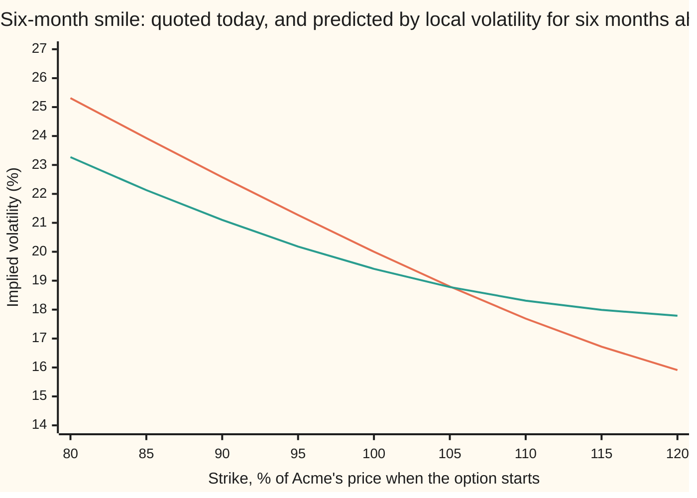
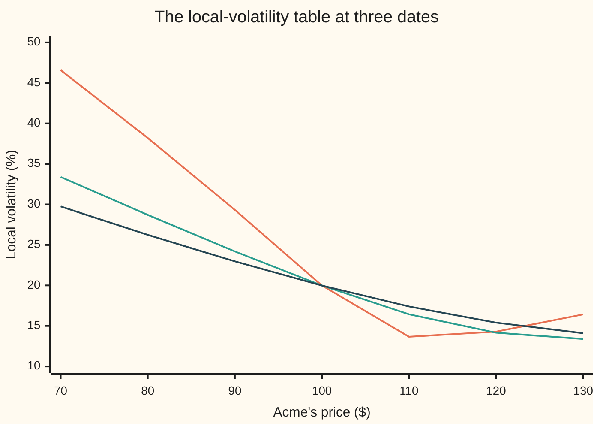

# Pricing with local volatility: it reprices every vanilla exactly, then predicts a future smile that is too flat

[Syllabus](../../../SYLLABUS.md) → [Financial mathematics](../README.md) → [Local volatility and jumps](../README.md#s13) → Pricing with local volatility

---

## General Overview

Acme shares trade at $100. Its one-year options are quoted at nine strikes, $80 to $120, each at its own implied volatility: the volatility that makes the Black-Scholes formula return that option's price. The quotes slope down, from 23.82% at $80 through 20.00% at $100 to 16.95% at $120. Six-month quotes slope more steeply, from 25.31% to 15.91%. The grid of quotes across strikes and expiries is the **volatility surface** ([The volatility surface](../12-The%20smile%20and%20the%20surface/03-volatility-surface-and-its-arbitrage-rules.md)).

A desk selling anything but a plain call or put needs a model of Acme that agrees with every quote. The simplest gives Acme one volatility per price level and date: a table, read off the surface by Dupire's formula ([Dupire local volatility](01-dupire-local-volatility.md)). From here on the table is called **local volatility**.

Pricing with the table, by simulated paths and on a grid, brings the nine quotes back, the $100 call at $9.23 included. Then comes a **forward start**: a call whose strike is set in six months at whatever Acme trades at then, paid at one year. A market whose smile keeps its shape against Acme's price charges $6.24. Local volatility charges $6.08: the smile it predicts for six months ahead is flatter than today's and sits lower at the money.

**Local volatility reproduces every price that depends on one date; how two dates hang together is left to its one fixed rule, and when the skew is steepest at short expiries, as in equity markets, that rule makes the future smile too flat.**

**What kind of fact this is:** a model, an assumption about how Acme moves, chosen because it cannot miss today's plain options, not a law; inside it a theorem, Gyöngy's, that every model without jumps has a local-volatility twin with the same plain-option prices, proved in outline in Why it works.

### The picture: today's six-month smile, and local volatility's forecast of it



Orange: today's six-month smile, read off the surface. Green: local volatility's six-month smile for options starting in six months, struck at a percentage of Acme's price that day, read from forward-start prices on the grid. Green is flatter and sits lower at the money, 19.41% against 20.00%.

---

## The formula

Notation first, in words. $S_t$ is Acme's price $t$ years from today; $r$ = 5% and $q$ = 2% are the riskless rate and dividend yield; $T$ is an expiry in years and $V_0$ a contract's price today. The local volatility $\sigma_{\text{loc}}(S, t)$ is one number for each price $S$ and date $t$. $dW_t$ is the random shock over a short step $dt$, a bell-curve draw with spread $\sqrt{dt}$ ([Geometric Brownian motion](../../11-Stochastic%20processes%20and%20calculus/05-Brownian%20Motion/07-geometric-brownian-motion.md)). $\mathbb{E}$ is the average in the pricing world, where every asset grows at the riskless rate ([The fundamental theorems](../05-Black-Scholes%20from%20the%20Ground%20Up/02-risk-neutral-measure-and-the-fundamental-theorems.md)).

$$dS_t = (r - q)\,S_t\,dt + \sigma_{\text{loc}}(S_t, t)\,S_t\,dW_t, \qquad V_0 = e^{-rT}\,\mathbb{E}\big[\text{payoff at } T\big]$$

**Read it aloud:** Acme drifts at the riskless rate less its dividend yield, its volatility at each instant is looked up in a fixed table by where it stands and what the date is, and a contract is worth its average payoff in that world, discounted to today.

Black-Scholes is the special case of a flat table. The table comes from the surface ([Local volatility in implied-vol terms](02-local-volatility-from-implied-volatility.md)). Gyöngy's theorem says such a table exists for any model without jumps: if $\sigma_t$ is that model's volatility, even a random one, its local-volatility twin uses, at price $K$ and date $T$,

$$\sigma_{\text{loc}}^2(K, T) = \mathbb{E}\big[\,\sigma_T^2 \;\big|\; S_T = K\,\big]$$

**Read it aloud:** the twin's squared volatility at price $K$ on date $T$ is the average squared volatility of the paths that arrive at $K$ on that date; twin and model then give the same price to every plain call and put.

A forward start pays on two dates: it fixes its strike on the reset date $t_1$, as a fraction $\kappa$ of Acme's price that day, and pays at $T$. $C_{\text{BS}}$(price, strike, years, volatility) is the Black-Scholes call:

$$\text{payoff} = \max\!\big(S_T - \kappa\,S_{t_1},\; 0\big), \qquad \text{at one flat volatility } \sigma:\quad V_0 = S_0\,e^{-q t_1}\,C_{\text{BS}}\big(1,\ \kappa,\ T - t_1,\ \sigma\big)$$

**Read it aloud:** on the reset date the contract becomes $S_{t_1}$ copies of a call on one dollar's worth of Acme struck at $\kappa$ dollars, so at one flat volatility it is worth today's value of receiving $S_{t_1}$ times that call's price.

| Symbol | Plain meaning | In our example | Push it up and the answer… |
| --- | --- | --- | --- |
| $S$, $S_t$, $S_T$, $S_0$, $S_{t_1}$ | Acme's price: any level; at time $t$; at expiry; today; on the reset date | $100 today | — |
| $K$, $T$ | a call's strike; its expiry in years | $80 to $120; 1 year, and 0.5 | call falls; rises |
| $t$, $dt$, $dW_t$, $Z$ | a date in years; a short step; the shock $Z\sqrt{dt}$ over it, $Z$ a standard bell-curve draw | steps of 0.01 year | smaller $dt$: less simulation bias |
| $r$, $q$ | riskless rate and dividend yield, continuously compounded | 5%, 2% | move the forward price $S_0 e^{(r-q)t}$ |
| $\sigma_{\text{loc}}(S, t)$ | local volatility: Acme's volatility when at $S$ on date $t$ | 19.99% at $100 half a year out; 33.39% at $70 | raises prices whose paths pass there |
| $\sigma$, $\sigma_t$ | one flat volatility; the volatility of another model at time $t$, perhaps random | 20%; a coin flip between 40% and 15% | the forward start rises with $\sigma$ |
| $\mathbb{E}$, $\mathbb{E}[\,\cdot \mid S_T = K\,]$ | the pricing-world average; the same over the paths ending at $K$ | — | — |
| $V_0$, $C$ | today's price of a contract; C(K, T), a call's price by strike and expiry; $C_{\text{BS}}$ the Black-Scholes call | 9.227006 for the $100 call | — |
| $t_1$, $\kappa$ | the reset date; the strike as a fraction of Acme's price that day | 0.5 year; 1, and 0.8 to 1.2 | $\kappa$ up: the forward start falls |
| $w$, $x$ | total implied variance, implied volatility squared times $T$, at log-strike $x = \ln(K/100)$ | 0.04 at $x = 0$, one year | option prices rise |
| $\theta$, $\varphi$, $\rho$, $\eta$ | the surface's dials: total variance at $100, tilt scale, lean, tilt size | $0.04T$; $\eta/\sqrt{\theta}$; −0.7; 0.5 | $\eta$ up, or $\rho$ more negative: steeper skew |

The surface has the shape Gatheral and Jacquier call SSVI, centred on today's price so that the $100 strike sits at 20% at every expiry:

$$w(x, T) = \frac{\theta}{2}\Big(1 + \rho\,\varphi\,x + \sqrt{(\varphi x + \rho)^2 + 1 - \rho^2}\Big), \qquad \theta = 0.04\,T, \quad \varphi = \frac{\eta}{\sqrt{\theta}}$$

In words: a rounded V in log-strike, leaning toward low strikes, whose tilt shrinks like one over the square root of expiry, so short options carry the steepest skew, as in equity markets.

### When it holds

- **A surface with no static arbitrage.** Local variance is a time slope of total variance over a density factor (`g` in the code); both must stay positive, or the table has negative or infinite entries. Across the whole grid the check finds the least density factor 0.254182 and the least time slope 0.017986 ([The volatility surface](../12-The%20smile%20and%20the%20surface/03-volatility-surface-and-its-arbitrage-rules.md)).
- **A surface defined everywhere.** Dupire's formula needs slopes; between and beyond the quotes the surface is an interpolation choice, and the table inherits it.
- **No jumps, for Gyöngy's average.** Gyöngy's proof needs a continuous price path with volatility kept away from zero and infinity. A jump model still gets a twin through Dupire's formula applied to its prices ([Merton jump-diffusion](04-merton-jump-diffusion.md)), but the table moves smoothly where the model gaps.
- **One date at a time.** A contract paying on two dates depends on how the dates join, which no plain option tests.
- **Short time steps.** Each simulated step holds the volatility fixed; 100 steps a year suffice here.

---

## Why it works

### Step 0: plain options see one date at a time

A call struck at $K$ pays according to where Acme ends on one date, so its price is the discounted average of that payoff over Acme's distribution on that date. Two models that give Acme the same distribution on every date give the same price to every plain option, however differently they join the dates. Local volatility is fitted to those one-date distributions, all of them, and joins the dates by the simplest rule available: volatility depends on price and date, nothing else.

### Step 1: price by simulating paths

Step the log of Acme's price forward by $dt$ = 0.01 year, reading the volatility from the table at the current price and date:

$$\ln S_{t+dt} = \ln S_t + \big(r - q - \tfrac12\,\sigma_{\text{loc}}^2\big)\,dt + \sigma_{\text{loc}}(S_t, t)\,\sqrt{dt}\;Z$$

This is the Euler–Maruyama scheme ([Euler-Maruyama](../../11-Stochastic%20processes%20and%20calculus/08-Generators%2C%20Densities%20and%20Simulation/04-euler-maruyama-scheme.md)) on the log; the $-\tfrac12\sigma_{\text{loc}}^2$ keeps the average price on the forward. The table is read between its 601 log-strikes by a straight line.

The run takes 20,000 paths, 10,000 sets of draws and their mirror images, from the recurrence of [Monte Carlo pricing](../06-Numerical%20Methods%20for%20Pricing/01-monte-carlo-pricing.md). A path and its mirror are not independent, so every standard error here comes from the 10,000 pair averages. Each set of draws also drives a path at flat 20%, whose call is known to be worth 9.227006; the simulation averages the difference of the two payoffs and adds 9.227006 back. That is a control variate ([Cheaper Monte Carlo](../06-Numerical%20Methods%20for%20Pricing/02-variance-reduction-for-pricing.md)): at $100 it cuts the standard error from 0.0477 to 0.0262. The plain estimate is 9.2522. The flat paths alone price the forward start at 6.2112, standard error 0.0497, against their formula's 6.244873: the control is honest.

### Step 2: price on a grid, every strike at once

Dupire's forward equation moves call prices forward in expiry ([Dupire local volatility](01-dupire-local-volatility.md)):

$$\frac{\partial C}{\partial T} = \tfrac12\,\sigma_{\text{loc}}^2(K, T)\,K^2\,\frac{\partial^2 C}{\partial K^2} - (r - q)\,K\,\frac{\partial C}{\partial K} - q\,C, \qquad C(K, 0) = \max(S_0 - K,\ 0)$$

**Read it aloud:** a call gains value with expiry at the local variance at its strike times the bend of prices across strikes, less a carry term; at expiry zero every call is worth what it pays now.

The grid, 601 log-strikes by 100 time steps, is marched by Crank–Nicolson ([Pricing on a grid](../06-Numerical%20Methods%20for%20Pricing/07-finite-differences-for-the-black-scholes-equation.md)), with the kink at $100 averaged across its cell. One march returns every strike at six months and at a year. It draws no random numbers, so it shares nothing with Step 1 but the table.

### Step 3: why every plain option comes back

The table was made by solving this equation for $\sigma_{\text{loc}}$ with the surface's prices put in for C. So the surface's prices satisfy it. The equation and its starting row fix one answer, so marching it returns the surface. The grid does: its largest gap is 0.001666 at six months, and its one-year $100 call is 9.227526 against the surface's 9.227006. Simulated paths obey the same equation, for the reason in Step 4, and return 9.2472 at $100, inside one standard error of 0.0262, and within four cents at every strike.

### Step 4: Gyöngy: every model without jumps has a local-volatility twin

Take a model with no table: on the first day a coin fixes Acme's volatility for the year, 40% with chance 12%, otherwise 15%. Its calls are the chance-weighted Black-Scholes prices. Its twin can be found two ways sharing no arithmetic: Dupire's formula applied to those prices, or Gyöngy's average over the paths that end at each price. Both give 29.43% at $70, 17.08% at $100 and 23.33% at $140. Among paths ending at $70 the 40% world supplies a share of 0.4663; at $100, only 0.0486. A path ending near the middle almost always came from the calm world.

The twin prices every plain option as the coin-flip model does, yet it is a different model: a coin-flip path calm for six months stays calm, while the twin reads the table afresh at every step.

<details>
<summary>Detailed proof: why the twin matches every plain call</summary>

Let $dS_t = (r-q)S_t\,dt + \sigma_t S_t\,dW_t$ with any random volatility $\sigma_t$, and $C(K, T) = e^{-rT}\,\mathbb{E}[(S_T - K)^+]$.

1. Itô's lemma stretched over the kink of $(S - K)^+$ (Tanaka's formula) gives $d(S_t - K)^+ = \mathbf{1}\{S_t > K\}\,dS_t + \tfrac12\,\sigma_t^2 S_t^2\,\delta(S_t - K)\,dt$, where $\mathbf{1}\{S_t > K\}$ is 1 when $S_t > K$ and 0 otherwise, and $\delta(S_t - K)$ is a spike that picks out the paths standing at $K$ ([Ito's lemma](../../11-Stochastic%20processes%20and%20calculus/06-Ito%20Calculus/02-itos-lemma.md)).
2. Average, with $p(K, T)$ the density of $S_T$: $\partial_T\,\mathbb{E}[(S_T - K)^+] = (r - q)\,\mathbb{E}[S_T\mathbf{1}\{S_T > K\}] + \tfrac12 K^2\,\mathbb{E}[\sigma_T^2 \mid S_T = K]\,p(K, T)$.
3. In call prices, $\mathbb{E}[S_T\mathbf{1}\{S_T > K\}] = e^{rT}(C - K\,\partial_K C)$ and $p = e^{rT}\,\partial_{KK} C$ ([The butterfly and the implied density](../10-Digitals%20and%20the%20implied%20density/05-butterfly-and-the-implied-density.md)). With $\partial_T C = -rC + e^{-rT}\,\partial_T\mathbb{E}[(S_T - K)^+]$:
$$\partial_T C = \tfrac12\,\mathbb{E}[\sigma_T^2 \mid S_T = K]\,K^2\,\partial_{KK} C - (r - q)K\,\partial_K C - qC.$$
4. That is Dupire's forward equation with local variance $\mathbb{E}[\sigma_T^2 \mid S_T = K]$. The local-volatility model with that table obeys the same equation from the same start, $C(K, 0) = (S_0 - K)^+$, since for it the average is the table itself.
5. One equation, one start, one solution: the calls agree at every strike and expiry. Gyöngy (1986) proves more, that the whole one-date distributions agree, for volatility bounded and kept away from zero; the density version of the computation is the Fokker–Planck equation ([Fokker-Planck](../../11-Stochastic%20processes%20and%20calculus/08-Generators%2C%20Densities%20and%20Simulation/03-fokker-planck-forward-equation.md)).

</details>

### Step 5: the forward start sees two dates

The at-the-money forward start pays $\max(S_1 - S_{0.5}, 0)$ at one year. Its price depends on how Acme's prices at six months and at a year hang together, which Step 0 says no plain option fixes. Two roads under local volatility:

- **Simulation.** The same paths, reading Acme at the halfway step: 6.0894, standard error 0.0179.
- **Split at the reset.** Where Acme can stand at six months is read off the density the surface implies ([The butterfly and the implied density](../10-Digitals%20and%20the%20implied%20density/05-butterfly-and-the-implied-density.md)); from each of 35 reset levels a grid march prices the second half-year's call; Simpson's rule sums the products: 6.083342.

The roads agree within half a standard error. A market whose smile keeps its shape against Acme's price uses today's six-month smile for the second half-year, 20.00% at the money, whatever happened first: 6.244873, the price at a flat forward volatility of 20% ([Term structure and forward volatility](../12-The%20smile%20and%20the%20surface/02-term-structure-and-forward-volatility.md)).

### Step 6: why the future smile flattens



Orange: the table 0.095 year out. Green: 0.495 year. Dark blue: 0.995 year. The early one is by far the steepest.

The surface's skew is steepest at short expiries, so the table stores most of it in its early dates: at 0.095 year it falls from 29.33% at $90 to 13.66% at $110, at 0.995 year only from 22.97% to 17.40%. A six-month option bought today lives through the steep early rows. The same option starting in six months lives only through the shallow late ones. Its smile, the **forward smile**, is flatter: 21.10% at 90% and 18.31% at 110%, against today's 22.58% and 17.69%. Where skew comes from jumps or random volatility, it renews itself; local volatility spends it early.

### Step 7: why the at-the-money forward start comes out cheap

The at-the-money volatility for the second half-year depends on where Acme stands at the reset. Each bar is the grid's call from that level, run backwards through Black-Scholes:

```
at-the-money vol for the second half-year, by Acme's price at the reset (one █ = 1 point)
 $81.87  ██████████████████████████  26.43%
 $90.48  ███████████████████████     23.23%
$100.00  ████████████████████        19.97%
$110.52  █████████████████           16.93%
$122.14  ███████████████             14.63%
```

Averaged over where Acme may stand, it is 20.03%, no lower than today's. But the forward start holds $S_{0.5}$ copies of a call on one dollar's worth of Acme, and the rises carry the most copies and the lowest volatilities. Weighted by Acme's price the average is 19.40%, the 19.41% the price implies.

The flat forward smile and the cheap forward start are one fault: volatility fixed by price and date makes tomorrow's smile whatever slice of the table Acme lands on: lower after a rise, higher after a fall, and shallower than today's. Putting randomness back into volatility while keeping every plain price is the road of [Stochastic-local volatility](../14-Stochastic%20volatility%20-%20Heston%2C%20SABR%20and%20their%20mix/06-stochastic-local-volatility.md).

---

## Worked numbers, by hand

The at-the-money forward start on the house market: strike reset at six months, paid at one year.

| Step | Arithmetic | Value |
| --- | --- | --- |
| d1, half a year at 20% | (0.05 − 0.02) × 0.5 / (0.20 × √0.5) + ½ × 0.20 × √0.5 | 0.176777 |
| d2 | d1 − 0.20 × √0.5 | 0.035355 |
| N(d1), N(d2), bell-curve areas to the left ([Black–Scholes call](../08-The%20Black-Scholes%20call%20and%20put/01-black-scholes-call.md)) | from d1, d2 | 0.570158, 0.514102 |
| call on one dollar, struck at one dollar | e^(−0.02 × 0.5) × 0.570158 − e^(−0.05 × 0.5) × 0.514102 | 0.063076 |
| today's value of receiving Acme's six-month price | 100 × e^(−0.02 × 0.5) | 99.004983 |
| forward start at flat 20% | 99.004983 × 0.063076 | **6.244873** |
| local volatility, split at the reset | density at six months × grid call from each level | **6.083342** |
| local volatility, simulated | 20,000 paths | 6.0894, s.e. 0.0179 |
| the gap | 6.083342 − 6.244873 | −0.1615 |
| the volatility the local-vol price implies | the flat formula run backwards | 19.41% |

A desk marking this contract in local volatility books it about 16 cents below one whose model keeps the smile's shape, though both models can fit every plain option.

### What breaks if you drop a piece

| Mistake | Comes out at | What went wrong |
| --- | --- | --- |
| Implied volatility used as the table | $80 call 23.1694 (22.41%), $120 call 2.0924 (17.96%); right: 23.433377 (23.82%), 1.799746 (16.95%) | Implied volatility is roughly an average of local volatility between today's price and the strike, so the table must tilt harder than the quotes |
| A table that knows only the date: the $100 column at every price | $80 call 22.7620 (19.99%), $120 call 2.7076 (19.99%) | With no price dimension the model is Black-Scholes with a term structure; the smile vanishes |
| The one-month table held all year | $80 call 24.2418 (27.66%), $120 call 1.5204 (15.92%) | The early rows are the steepest; held for a year they overstate the skew |

The code prints all three.

---

## Code, from first principles, and it actually runs

The code builds the table from the surface, then prices with it by **two roads that share nothing but the table**: 20,000 simulated paths with a flat-20% control, and Dupire's forward equation marched on a grid. The coin-flip twin also comes two ways, by Dupire's formula and by Gyöngy's average. Nothing imported knows an answer: the bell-curve area is its power series, the random numbers the Monte Carlo card's recurrence and Box–Muller, implied volatilities a bisection.

### Python

```python
# Pricing with local volatility -- the check behind the card.  Standard library only; nothing imported
# knows the answer: the bell-curve area is its power series, the random numbers the Monte Carlo card's
# recurrence, the grid a Crank-Nicolson march.  Two roads to every price: simulated paths, and a grid.
from math import cos, exp, log, pi, sin, sqrt

S0, R, Q, SIG, RHO, ETA, T1, T = 100.0, 0.05, 0.02, 0.20, -0.7, 0.5, 0.5, 1.0
DZ, ZL, NZ, DT, NT, PATHS = 0.01, -3.0, 600, 0.01, 100, 20000     # grid: log(K/100) from -3 to 3
Z, KS, KAPS = [ZL + DZ * j for j in range(NZ + 1)], [80.0 + 5.0 * i for i in range(9)], [0.8 + 0.05 * i for i in range(9)]

def ncdf(x):                                   # bell-curve area left of x, by its power series
    term, total = x, x
    for n in range(1, 150):
        term *= x * x / (2 * n + 1)
        total += term
    return 0.5 + total * exp(-0.5 * x * x) / sqrt(2.0 * pi) if abs(x) < 9.0 else float(x > 0.0)
def bs(s, k, t, vol):                          # Black-Scholes call
    d1 = (log(s / k) + (R - Q) * t) / (vol * sqrt(t)) + 0.5 * vol * sqrt(t)
    return s * exp(-Q * t) * ncdf(d1) - k * exp(-R * t) * ncdf(d1 - vol * sqrt(t))
def implied(price, s, k, t, lo=0.01, hi=1.5):  # bisection: the one vol that gives this price
    for _ in range(60):
        lo, hi = (lo, 0.5 * (lo + hi)) if bs(s, k, t, 0.5 * (lo + hi)) > price else (0.5 * (lo + hi), hi)
    return 0.5 * (lo + hi)
def w(x, t, eta=ETA):                          # the skewed surface: total variance at x = log(K/100)
    th, p = SIG * SIG * t, eta / (SIG * sqrt(t))
    return 0.5 * th * (1.0 + RHO * p * x + sqrt((p * x + RHO) * (p * x + RHO) + 1.0 - RHO * RHO))
ivol = lambda k, t: sqrt(w(log(k / S0), t) / t)                  # the surface's vol at strike k
fwd = lambda kap, vol: S0 * exp(-Q * T1) * bs(1.0, kap, T - T1, vol)   # forward start at one flat vol
def lv(z, t, eta=ETA):                         # Dupire in implied-vol terms, slopes by small steps
    ww = lambda k, tt: w(k + (R - Q) * tt, tt, eta)            # the surface against log(K/forward)
    k, h, e = z - (R - Q) * t, 1e-4, 1e-5
    w0, w1, w2 = ww(k, t), (ww(k + h, t) - ww(k - h, t)) / (2 * h), (ww(k + h, t) - 2 * ww(k, t) + ww(k - h, t)) / (h * h)
    g = (1.0 - k * w1 / (2.0 * w0)) * (1.0 - k * w1 / (2.0 * w0)) - w1 * w1 / 4.0 * (1.0 / w0 + 0.25) + w2 / 2.0
    wt = (ww(k, t + e) - ww(k, t - e)) / (2.0 * e)
    return sqrt(wt / g), g, wt
def march(n0, s, tab, n1=NT):                  # Dupire's forward equation from price s, step n0 to n1
    c = [max(s - S0 * exp(z), 0.0) for z in Z]
    c[round((log(s / S0) - ZL) / DZ)] = s * (0.5 * DZ - 1.0 + exp(-0.5 * DZ)) / DZ   # kink cell averaged
    for n in range(n0, n1):
        lo = s * exp(-Q * (n + 1 - n0) * DT) - S0 * exp(ZL) * exp(-R * (n + 1 - n0) * DT)
        cp, dp, new = [0.0] * (NZ + 1), [lo] * (NZ + 1), [lo] + [0.0] * NZ
        for j in range(1, NZ):                 # Thomas sweep down, then back up
            p, adv = 0.5 * tab[n][j] * tab[n][j] / (DZ * DZ), (0.5 * tab[n][j] * tab[n][j] + R - Q) / (2.0 * DZ)
            a, b, cc = p + adv, -2.0 * p - Q, p - adv
            m = 1.0 - 0.5 * DT * b + 0.5 * DT * a * cp[j - 1]
            cp[j], dp[j] = -0.5 * DT * cc / m, (c[j] + 0.5 * DT * (a * c[j - 1] + b * c[j] + cc * c[j + 1]) + 0.5 * DT * a * dp[j - 1]) / m
        for j in range(NZ - 1, 0, -1):
            new[j] = dp[j] - cp[j] * new[j + 1]
        c = new
    return c
def at(c, k):                                  # read the grid at strike k, three-point fit
    u = (log(k / S0) - ZL) / DZ
    f, j = u - round(u), round(u)
    return c[j] + 0.5 * f * (c[j + 1] - c[j - 1]) + 0.5 * f * f * (c[j + 1] - 2.0 * c[j] + c[j - 1])
def twin(k):                                   # coin-flip vol, 40% w.p. 0.12 else 15%, and its twin
    c = lambda kk, t: 0.12 * bs(S0, kk, t, 0.40) + 0.88 * bs(S0, kk, t, 0.15)
    h, e, x = 0.001 * k, 1e-4, log(k / S0) - R + Q         # each world's chance per dollar of ending at k
    fa, fb = [p * exp(-0.5 * (x + 0.5 * v * v) * (x + 0.5 * v * v) / (v * v)) / (k * v * sqrt(2.0 * pi)) for p, v in ((0.12, 0.40), (0.88, 0.15))]
    num = (c(k, T + e) - c(k, T - e)) / (2 * e) + (R - Q) * k * (c(k + h, T) - c(k - h, T)) / (2 * h) + Q * c(k, T)
    dup = sqrt(2.0 * num / (k * k * (c(k + h, T) - 2.0 * c(k, T) + c(k - h, T)) / (h * h)))   # Dupire from prices
    return fa, fb, fa / (fa + fb), dup, sqrt((fa * 0.16 + fb * 0.0225) / (fa + fb))

LVS = [[lv(z, (n + 0.5) * DT) for z in Z] for n in range(NT)]
TAB = [[v[0] for v in row] for row in LVS]
full, half = march(0, S0, TAB), march(0, S0, TAB, NT // 2)
grid, surf, gap6 = [at(full, k) for k in KS], [bs(S0, k, T, ivol(k, T)) for k in KS], max(abs(at(half, k) - bs(S0, k, T1, ivol(k, T1))) for k in KS)

state, cv, fs, acc = 20260924, [0.0] * 9, [0.0] * 9, [0.0] * 8
for _ in range(PATHS // 2):
    zs, pv = [], [0.0] * 4                     # pv: the pair's averages of four payoffs
    for _ in range(NT // 2):                   # the recurrence, then Box-Muller: two fractions, two draws
        state = (1664525 * state + 1013904223) % 4294967296
        u, state = (state + 0.5) / 4294967296, (1664525 * state + 1013904223) % 4294967296
        rad, ang = sqrt(-2.0 * log(u)), 2.0 * pi * (state + 0.5) / 4294967296
        zs += [rad * cos(ang), rad * sin(ang)]
    for sign in (1.0, -1.0):                   # each path and its mirror image
        x, y, sh, sfh = 0.0, 0.0, 0.0, 0.0     # log(price/100): local vol, and flat 20% on the same draws
        for n in range(NT):
            u = (x - ZL) / DZ
            vol = TAB[n][int(u)] + (u - int(u)) * (TAB[n][int(u) + 1] - TAB[n][int(u)])
            x += (R - Q - 0.5 * vol * vol) * DT + vol * sign * zs[n] * sqrt(DT)
            y += (R - Q - 0.5 * SIG * SIG) * DT + SIG * sign * zs[n] * sqrt(DT)
            sh, sfh = (S0 * exp(x), S0 * exp(y)) if n == NT // 2 - 1 else (sh, sfh)
        st, sf = S0 * exp(x), S0 * exp(y)
        for i in range(9):                     # payoff under local vol minus payoff under flat 20%
            cv[i] += max(st - KS[i], 0.0) - max(sf - KS[i], 0.0)
            fs[i] += max(st - KAPS[i] * sh, 0.0) - max(sf - KAPS[i] * sfh, 0.0)
        pl, fl = max(st - 100.0, 0.0), max(sf - sfh, 0.0)        # plain payoff; the flat control's own forward start
        pv = [pv[0] + 0.5 * pl, pv[1] + 0.5 * (pl - max(sf - 100.0, 0.0)), pv[2] + 0.5 * (max(st - sh, 0.0) - fl), pv[3] + 0.5 * fl]
    acc = [acc[i] + (pv[i // 2] if i % 2 == 0 else pv[i // 2] * pv[i // 2]) for i in range(8)]   # sums, sums of squares
se = lambda m, h=PATHS // 2: exp(-R * T) * sqrt((acc[2 * m + 1] / h - (acc[2 * m] / h) * (acc[2 * m] / h)) / h)   # from pair averages
mc, mcfs = [exp(-R * T) * cv[i] / PATHS + bs(S0, KS[i], T, SIG) for i in range(9)], [exp(-R * T) * fs[i] / PATHS + fwd(KAPS[i], SIG) for i in range(9)]

fsg, reset, avg = [0.0] * 9, [], [0.0] * 4     # road 2: where Acme stands at the reset, times the grid from there
for i, j in enumerate(range(200, 371, 5)):
    s, c = S0 * exp(Z[j]), march(NT // 2, S0 * exp(Z[j]), TAB)
    dens = exp(R * T1) * (bs(S0, 1.01 * s, T1, ivol(1.01 * s, T1)) - 2 * bs(S0, s, T1, ivol(s, T1)) + bs(S0, 0.99 * s, T1, ivol(0.99 * s, T1))) / ((0.01 * s) * (0.01 * s))
    wgt = (1.0 if i in (0, 34) else (4.0 if i % 2 else 2.0)) * 5.0 * DZ / 3.0 * s * dens * exp(-R * T1)   # Simpson
    fsg = [fsg[m] + wgt * at(c, KAPS[m] * s) for m in range(9)]
    v = implied(at(c, s), s, s, T - T1)        # the at-the-money vol for the second half-year, from s
    avg, reset = [avg[0] + wgt * v, avg[1] + wgt, avg[2] + wgt * s * v, avg[3] + wgt * s], reset + ([(s, v)] if j in (280, 290, 300, 310, 320) else [])
fvol = lambda p, kap: implied(p / (S0 * exp(-Q * T1)), 1.0, kap, T - T1)
wrong = [march(0, S0, tb) for tb in ([[ivol(S0 * exp(z), (n + 0.5) * DT) for z in Z] for n in range(NT)], [[row[300]] * (NZ + 1) for row in TAB], [TAB[8]] * NT)]
row = lambda label, vals, f: print(label + "".join(format(v, f) for v in vals))
row("local vol from the skewed surface, %; Acme's price across, date down\nprice    ", range(70, 131, 10), "7d")
for n in (9, 49, 99):
    row(f"t = {(n + 0.5) * DT:.3f}", [100 * lv(log(p / S0), (n + 0.5) * DT)[0] for p in range(70, 131, 10)], "7.2f")
print(f"flat 20% surface, local vol at (80, 0.5) and (120, 1.0)  {lv(log(0.8), 0.5, 0.0)[0]:.6f}  {lv(log(1.2), 1.0, 0.0)[0]:.6f}"
      f"\nno arbitrage on the grid: least g {min(v[1] for r in LVS for v in r):.6f}, least dw/dT {min(v[2] for r in LVS for v in r):.6f}")
print("1-year strip  surface vol  surface price   grid price   MC price   MC vol")
for i, k in enumerate(KS):
    print(f"{k:8.0f}{100 * ivol(k, T):12.2f}{surf[i]:15.6f}{grid[i]:13.6f}{mc[i]:11.4f}{100 * implied(mc[i], S0, k, T):9.2f}")
print(f"6-month strip, largest gap grid vs surface  {gap6:.6f}\n$100 call: plain MC {2 * exp(-R * T) * acc[0] / PATHS:.4f} s.e. {se(0):.4f}; flat-20% control s.e. {se(1):.4f}")
print("coin-flip twin, strike  40% world  15% world  share of 40%  Dupire vol  E[vol^2 | S_T = K]")
for k in (70.0, 100.0, 140.0):
    print(f"{k:22.0f}{twin(k)[0]:11.6f}{twin(k)[1]:11.6f}{twin(k)[2]:14.4f}{100 * twin(k)[3]:12.2f}{100 * twin(k)[4]:12.2f}")
d1 = (R - Q) * (T - T1) / (SIG * sqrt(T - T1)) + 0.5 * SIG * sqrt(T - T1)
print(f"forward start at flat 20% by hand: d1 {d1:.6f} d2 {d1 - SIG * sqrt(T - T1):.6f} N(d1) {ncdf(d1):.6f} N(d2) {ncdf(d1 - SIG * sqrt(T - T1)):.6f}"
      f"\n  per-dollar call {bs(1.0, 1.0, T - T1, SIG):.6f} x S0 e^-qT1 {S0 * exp(-Q * T1):.6f} = {fwd(1.0, SIG):.6f}")
print("forward start, strike % of reset  today 6m vol  grid price  MC price  grid vol  MC vol")
for m in (0, 2, 4, 6, 8):
    print(f"{100 * KAPS[m]:24.0f}{100 * ivol(100 * KAPS[m], T1):14.2f}{fsg[m]:12.4f}{mcfs[m]:10.4f}{100 * fvol(fsg[m], KAPS[m]):10.2f}{100 * fvol(mcfs[m], KAPS[m]):8.2f}")
print(f"at the money: flat 20% {fwd(1.0, SIG):.6f} (flat paths alone {2 * exp(-R * T) * acc[6] / PATHS:.4f} s.e. {se(3):.4f})"
      f"\n  local vol: grid {fsg[4]:.6f}, MC {mcfs[4]:.4f} s.e. {se(2):.4f}, gap {fsg[4] - fwd(1.0, SIG):.4f}")
print("reset level  " + "".join(f"{s:8.2f}" for s, _ in reset) + "\nATM vol after" + "".join(f"{100 * v:8.2f}" for _, v in reset))
print(f"ATM vol after the reset, averaged over where Acme stands: plain {100 * avg[0] / avg[1]:.2f}%, weighted by its price {100 * avg[2] / avg[3]:.2f}%")
row("chart, strike % of reset", [100 * kap for kap in KAPS], "7.0f")
row("chart, today's 6m vol % ", [100 * ivol(100 * kap, T1) for kap in KAPS], "7.2f")
row("chart, forward vol %    ", [100 * fvol(fsg[m], KAPS[m]) for m in range(9)], "7.2f")
for name, c in zip(("implied vol as local vol", "local vol by date only", "one-month local vol all year"), wrong):
    print(f"wrong: {name:<29}$80 {at(c, 80.0):.4f} ({100 * implied(at(c, 80.0), S0, 80.0, T):.2f}%)  $120 {at(c, 120.0):.4f} ({100 * implied(at(c, 120.0), S0, 120.0, T):.2f}%)")
assert max(abs(a - b) for a, b in zip(grid, surf)) < 0.005 and gap6 < 0.005   # the grid gives the surface back
assert all(abs(a - b) < 0.1 for a, b in zip(mc, surf))                        # so do the simulated paths
assert abs(mc[4] - 9.227005508154) < 3.0 * se(1) + 0.005                      # the house call: 3 s.e. and half a cent
assert abs(mcfs[4] - fsg[4]) < 3.0 * se(2) + 0.005                            # two roads to the forward start
assert abs(2 * exp(-R * T) * acc[6] / PATHS - fwd(1.0, SIG)) < 3.0 * se(3)         # the control is honest
assert fsg[4] < fwd(1.0, SIG) - 0.1 and mcfs[4] < fwd(1.0, SIG) - 0.1         # both below the flat value
assert fvol(fsg[2], 0.9) - fvol(fsg[6], 1.1) < 0.7 * (ivol(90.0, T1) - ivol(110.0, T1))   # forward smile flatter
assert abs(avg[2] / avg[3] - fvol(fsg[4], 1.0)) < 5e-4 and avg[0] / avg[1] > avg[2] / avg[3] + 0.005   # Step 7's weighting
assert all(abs(twin(k)[3] - twin(k)[4]) < 5e-4 for k in (70.0, 100.0, 140.0)) # Gyongy: two roads, one twin
print("ALL CHECKS PASS")
```

**Ran 2026-09-24 on macOS, Python 3.14.6, standard library only. All checks passed. Output, pasted from the run:**

```
local vol from the skewed surface, %; Acme's price across, date down
price         70     80     90    100    110    120    130
t = 0.095  46.58  38.20  29.33  19.99  13.66  14.29  16.42
t = 0.495  33.39  28.71  24.20  19.99  16.43  14.16  13.38
t = 0.995  29.75  26.24  22.97  19.98  17.40  15.40  14.10
flat 20% surface, local vol at (80, 0.5) and (120, 1.0)  0.200000  0.200000
no arbitrage on the grid: least g 0.254182, least dw/dT 0.017986
1-year strip  surface vol  surface price   grid price   MC price   MC vol
      80       23.82      23.433377    23.434589    23.4403    23.86
      85       22.81      19.413526    19.414692    19.4212    22.84
      90       21.83      15.664154    15.665229    15.6720    21.86
      95       20.90      12.248006    12.248788    12.2597    20.93
     100       20.00       9.227006     9.227526     9.2472    20.05
     105       19.15       6.654046     6.654310     6.6809    19.22
     110       18.35       4.562464     4.562600     4.5976    18.44
     115       17.61       2.955469     2.955707     2.9907    17.72
     120       16.95       1.799746     1.800203     1.8306    17.05
6-month strip, largest gap grid vs surface  0.001666
$100 call: plain MC 9.2522 s.e. 0.0477; flat-20% control s.e. 0.0262
coin-flip twin, strike  40% world  15% world  share of 40%  Dupire vol  E[vol^2 | S_T = K]
                    70   0.001274   0.001459        0.4663       29.43       29.43
                   100   0.001188   0.023222        0.0486       17.08       17.08
                   140   0.000536   0.001774        0.2321       23.33       23.33
forward start at flat 20% by hand: d1 0.176777 d2 0.035355 N(d1) 0.570158 N(d2) 0.514102
  per-dollar call 0.063076 x S0 e^-qT1 99.004983 = 6.244873
forward start, strike % of reset  today 6m vol  grid price  MC price  grid vol  MC vol
                      80         25.31     21.2426   21.2285     23.27   23.10
                      90         22.58     12.7476   12.7357     21.10   21.03
                     100         20.00      6.0833    6.0894     19.41   19.43
                     110         17.69      2.1538    2.1616     18.31   18.35
                     120         15.91      0.5719    0.5808     17.79   17.86
at the money: flat 20% 6.244873 (flat paths alone 6.2112 s.e. 0.0497)
  local vol: grid 6.083342, MC 6.0894 s.e. 0.0179, gap -0.1615
reset level     81.87   90.48  100.00  110.52  122.14
ATM vol after   26.43   23.23   19.97   16.93   14.63
ATM vol after the reset, averaged over where Acme stands: plain 20.03%, weighted by its price 19.40%
chart, strike % of reset     80     85     90     95    100    105    110    115    120
chart, today's 6m vol %   25.31  23.93  22.58  21.27  20.00  18.80  17.69  16.72  15.91
chart, forward vol %      23.27  22.13  21.10  20.18  19.41  18.78  18.31  17.99  17.79
wrong: implied vol as local vol     $80 23.1694 (22.41%)  $120 2.0924 (17.96%)
wrong: local vol by date only       $80 22.7620 (19.99%)  $120 2.7076 (19.99%)
wrong: one-month local vol all year $80 24.2418 (27.66%)  $120 1.5204 (15.92%)
ALL CHECKS PASS
```

### Rust

Same numbers, same labels, built with `rustc --edition 2021 -O`.

```rust
// Pricing with local volatility -- the same check as the Python, in Rust.  No crates; nothing
// imported knows the answer: the bell-curve area is its power series, the random numbers the
// Monte Carlo card's recurrence, the grid a Crank-Nicolson march.  Two roads to every price.
use std::f64::consts::PI;
const S0: f64 = 100.0; const R: f64 = 0.05; const Q: f64 = 0.02; const SIG: f64 = 0.20; const RHO: f64 = -0.7;
const ETA: f64 = 0.5; const T1: f64 = 0.5; const T: f64 = 1.0; const DZ: f64 = 0.01; const ZL: f64 = -3.0;
const NZ: usize = 600; const DT: f64 = 0.01; const NT: usize = 100; const PATHS: usize = 20000; const NP: f64 = PATHS as f64; const H: f64 = NP / 2.0;
fn ncdf(x: f64) -> f64 {                        // bell-curve area left of x, by its power series
    let (mut term, mut total) = (x, x);
    for n in 1..150 { term *= x * x / (2 * n + 1) as f64; total += term; }
    if x.abs() < 9.0 { 0.5 + total * (-0.5 * x * x).exp() / (2.0 * PI).sqrt() } else if x > 0.0 { 1.0 } else { 0.0 }
}
fn bs(s: f64, k: f64, t: f64, vol: f64) -> f64 { // Black-Scholes call
    let d1 = ((s / k).ln() + (R - Q) * t) / (vol * t.sqrt()) + 0.5 * vol * t.sqrt();
    s * (-Q * t).exp() * ncdf(d1) - k * (-R * t).exp() * ncdf(d1 - vol * t.sqrt())
}
fn implied(price: f64, s: f64, k: f64, t: f64) -> f64 { // bisection: the one vol that gives this price
    let (mut lo, mut hi) = (0.01, 1.5);
    for _ in 0..60 { if bs(s, k, t, 0.5 * (lo + hi)) > price { hi = 0.5 * (lo + hi) } else { lo = 0.5 * (lo + hi) } }
    0.5 * (lo + hi)
}
fn w(x: f64, t: f64, eta: f64) -> f64 {         // the skewed surface: total variance at x = log(K/100)
    let (th, p) = (SIG * SIG * t, eta / (SIG * t.sqrt()));
    0.5 * th * (1.0 + RHO * p * x + ((p * x + RHO) * (p * x + RHO) + 1.0 - RHO * RHO).sqrt())
}
fn ivol(k: f64, t: f64) -> f64 { (w((k / S0).ln(), t, ETA) / t).sqrt() }
fn fwd(kap: f64, vol: f64) -> f64 { S0 * (-Q * T1).exp() * bs(1.0, kap, T - T1, vol) }
fn lv(z: f64, t: f64, eta: f64) -> (f64, f64, f64) { // Dupire in implied-vol terms, slopes by small steps
    let ww = |k: f64, tt: f64| w(k + (R - Q) * tt, tt, eta);  // the surface against log(K/forward)
    let (k, h, e) = (z - (R - Q) * t, 1e-4, 1e-5);
    let (w0, w1) = (ww(k, t), (ww(k + h, t) - ww(k - h, t)) / (2.0 * h));
    let w2 = (ww(k + h, t) - 2.0 * ww(k, t) + ww(k - h, t)) / (h * h);
    let g = (1.0 - k * w1 / (2.0 * w0)) * (1.0 - k * w1 / (2.0 * w0)) - w1 * w1 / 4.0 * (1.0 / w0 + 0.25) + w2 / 2.0;
    let wt = (ww(k, t + e) - ww(k, t - e)) / (2.0 * e);
    ((wt / g).sqrt(), g, wt)
}
fn march(n0: usize, s: f64, tab: &[Vec<f64>], n1: usize) -> Vec<f64> { // Dupire's forward equation from price s
    let mut c: Vec<f64> = (0..=NZ).map(|j| (s - S0 * (ZL + DZ * j as f64).exp()).max(0.0)).collect();
    c[(((s / S0).ln() - ZL) / DZ).round() as usize] = s * (0.5 * DZ - 1.0 + (-0.5 * DZ).exp()) / DZ; // kink cell
    for n in n0..n1 {
        let lo = s * (-Q * (n + 1 - n0) as f64 * DT).exp() - S0 * ZL.exp() * (-R * (n + 1 - n0) as f64 * DT).exp();
        let (mut cp, mut dp, mut new) = (vec![0.0; NZ + 1], vec![lo; NZ + 1], vec![0.0; NZ + 1]); new[0] = lo;
        for j in 1..NZ {                            // Thomas sweep down, then back up
            let (p, adv) = (0.5 * tab[n][j] * tab[n][j] / (DZ * DZ), (0.5 * tab[n][j] * tab[n][j] + R - Q) / (2.0 * DZ));
            let (a, b, cc) = (p + adv, -2.0 * p - Q, p - adv);
            let m = 1.0 - 0.5 * DT * b + 0.5 * DT * a * cp[j - 1];
            cp[j] = -0.5 * DT * cc / m; dp[j] = (c[j] + 0.5 * DT * (a * c[j - 1] + b * c[j] + cc * c[j + 1]) + 0.5 * DT * a * dp[j - 1]) / m;
        }
        for j in (1..NZ).rev() { new[j] = dp[j] - cp[j] * new[j + 1]; }
        c = new;
    }
    c
}
fn at(c: &[f64], k: f64) -> f64 {               // read the grid at strike k, three-point fit
    let u = ((k / S0).ln() - ZL) / DZ;
    let (f, j) = (u - u.round(), u.round() as usize);
    c[j] + 0.5 * f * (c[j + 1] - c[j - 1]) + 0.5 * f * f * (c[j + 1] - 2.0 * c[j] + c[j - 1])
}
fn twin(k: f64) -> (f64, f64, f64, f64, f64) {  // coin-flip vol, 40% w.p. 0.12 else 15%, and its twin
    let c = |kk: f64, t: f64| 0.12 * bs(S0, kk, t, 0.40) + 0.88 * bs(S0, kk, t, 0.15);
    let (h, e, x) = (0.001 * k, 1e-4, (k / S0).ln() - R + Q);   // each world's chance per dollar of ending at k
    let f = |p: f64, v: f64| p * (-0.5 * (x + 0.5 * v * v) * (x + 0.5 * v * v) / (v * v)).exp() / (k * v * (2.0 * PI).sqrt());
    let (fa, fb) = (f(0.12, 0.40), f(0.88, 0.15));
    let num = (c(k, T + e) - c(k, T - e)) / (2.0 * e) + (R - Q) * k * (c(k + h, T) - c(k - h, T)) / (2.0 * h) + Q * c(k, T);
    let dup = (2.0 * num / (k * k * (c(k + h, T) - 2.0 * c(k, T) + c(k - h, T)) / (h * h))).sqrt(); // Dupire from prices
    (fa, fb, fa / (fa + fb), dup, ((fa * 0.16 + fb * 0.0225) / (fa + fb)).sqrt())
}
fn row(label: &str, vals: &[f64], width: usize, prec: usize) {
    println!("{}{}", label, vals.iter().map(|v| format!("{:w$.p$}", v, w = width, p = prec)).collect::<String>());
}
fn main() {
    let z: Vec<f64> = (0..=NZ).map(|j| ZL + DZ * j as f64).collect();
    let (ks, kaps): (Vec<f64>, Vec<f64>) = ((0..9).map(|i| 80.0 + 5.0 * i as f64).collect(), (0..9).map(|i| 0.8 + 0.05 * i as f64).collect());
    let lvs: Vec<Vec<(f64, f64, f64)>> = (0..NT).map(|n| z.iter().map(|&zz| lv(zz, (n as f64 + 0.5) * DT, ETA)).collect()).collect();
    let tab: Vec<Vec<f64>> = lvs.iter().map(|r| r.iter().map(|v| v.0).collect()).collect();
    let (full, half) = (march(0, S0, &tab, NT), march(0, S0, &tab, NT / 2));
    let (grid, surf): (Vec<f64>, Vec<f64>) = (ks.iter().map(|&k| at(&full, k)).collect(), ks.iter().map(|&k| bs(S0, k, T, ivol(k, T))).collect());
    let gap6 = ks.iter().map(|&k| (at(&half, k) - bs(S0, k, T1, ivol(k, T1))).abs()).fold(0.0, f64::max);
    let (mut state, mut cv, mut fs, mut acc) = (20260924u64, [0.0f64; 9], [0.0f64; 9], [0.0f64; 8]);
    for _ in 0..PATHS / 2 {
        let (mut zs, mut pv): (Vec<f64>, [f64; 4]) = (Vec::with_capacity(NT), [0.0; 4]); // pv: the pair's averages
        for _ in 0..NT / 2 {                      // the recurrence, then Box-Muller: two fractions, two draws
            state = (1664525 * state + 1013904223) % 4294967296;
            let u = (state as f64 + 0.5) / 4294967296.0; state = (1664525 * state + 1013904223) % 4294967296;
            let (rad, ang) = ((-2.0 * u.ln()).sqrt(), 2.0 * PI * (state as f64 + 0.5) / 4294967296.0);
            zs.extend([rad * ang.cos(), rad * ang.sin()]);
        }
        for sign in [1.0, -1.0] {                 // each path and its mirror image
            let (mut x, mut y, mut sh, mut sfh) = (0.0f64, 0.0f64, 0.0f64, 0.0f64);
            for n in 0..NT {                      // log(price/100): local vol, and flat 20% on the same draws
                let (u, iu) = ((x - ZL) / DZ, ((x - ZL) / DZ) as usize);
                let vol = tab[n][iu] + (u - iu as f64) * (tab[n][iu + 1] - tab[n][iu]);
                x += (R - Q - 0.5 * vol * vol) * DT + vol * sign * zs[n] * DT.sqrt();
                y += (R - Q - 0.5 * SIG * SIG) * DT + SIG * sign * zs[n] * DT.sqrt();
                if n == NT / 2 - 1 { sh = S0 * x.exp(); sfh = S0 * y.exp(); }
            }
            let (st, sf) = (S0 * x.exp(), S0 * y.exp());
            for i in 0..9 {                       // payoff under local vol minus payoff under flat 20%
                cv[i] += (st - ks[i]).max(0.0) - (sf - ks[i]).max(0.0);
                fs[i] += (st - kaps[i] * sh).max(0.0) - (sf - kaps[i] * sfh).max(0.0);
            }
            let (pl, fl) = ((st - 100.0).max(0.0), (sf - sfh).max(0.0)); // plain payoff; the flat control's own forward start
            pv = [pv[0] + 0.5 * pl, pv[1] + 0.5 * (pl - (sf - 100.0).max(0.0)), pv[2] + 0.5 * ((st - sh).max(0.0) - fl), pv[3] + 0.5 * fl];
        }
        for i in 0..8 { acc[i] += if i % 2 == 0 { pv[i / 2] } else { pv[i / 2] * pv[i / 2] }; } // sums, sums of squares
    }
    let se = |m: usize| (-R * T).exp() * ((acc[2 * m + 1] / H - (acc[2 * m] / H) * (acc[2 * m] / H)) / H).sqrt(); // from pair averages
    let (mc, mcfs): (Vec<f64>, Vec<f64>) = ((0..9).map(|i| (-R * T).exp() * cv[i] / NP + bs(S0, ks[i], T, SIG)).collect(), (0..9).map(|i| (-R * T).exp() * fs[i] / NP + fwd(kaps[i], SIG)).collect());
    let (mut fsg, mut reset, mut avg) = ([0.0f64; 9], Vec::new(), [0.0f64; 4]); // road 2: where Acme stands at the reset, times the grid
    for (i, j) in (200..371).step_by(5).enumerate() {
        let s = S0 * z[j].exp();
        let c = march(NT / 2, s, &tab, NT);
        let dens = (R * T1).exp() * (bs(S0, 1.01 * s, T1, ivol(1.01 * s, T1)) - 2.0 * bs(S0, s, T1, ivol(s, T1)) + bs(S0, 0.99 * s, T1, ivol(0.99 * s, T1))) / ((0.01 * s) * (0.01 * s));
        let wi = if i == 0 || i == 34 { 1.0 } else if i % 2 == 1 { 4.0 } else { 2.0 };
        let wgt = wi * 5.0 * DZ / 3.0 * s * dens * (-R * T1).exp(); // Simpson's rule
        for m in 0..9 { fsg[m] = fsg[m] + wgt * at(&c, kaps[m] * s); }
        let v = implied(at(&c, s), s, s, T - T1);  // the at-the-money vol for the second half-year, from s
        avg = [avg[0] + wgt * v, avg[1] + wgt, avg[2] + wgt * s * v, avg[3] + wgt * s];
        if [280, 290, 300, 310, 320].contains(&j) { reset.push((s, v)); }
    }
    let fvol = |p: f64, kap: f64| implied(p / (S0 * (-Q * T1).exp()), 1.0, kap, T - T1);
    let imp: Vec<Vec<f64>> = (0..NT).map(|n| z.iter().map(|&zz| ivol(S0 * zz.exp(), (n as f64 + 0.5) * DT)).collect()).collect();
    let date: Vec<Vec<f64>> = tab.iter().map(|r| vec![r[300]; NZ + 1]).collect();
    let wrong = [march(0, S0, &imp, NT), march(0, S0, &date, NT), march(0, S0, &vec![tab[8].clone(); NT], NT)];
    let prices: Vec<f64> = (0..7).map(|i| 70.0 + 10.0 * i as f64).collect();
    row("local vol from the skewed surface, %; Acme's price across, date down\nprice    ", &prices, 7, 0);
    for t in [9usize, 49, 99].map(|n| (n as f64 + 0.5) * DT) {
        row(&format!("t = {:.3}", t), &prices.iter().map(|&p| 100.0 * lv((p / S0).ln(), t, ETA).0).collect::<Vec<f64>>(), 7, 2);
    }
    println!("flat 20% surface, local vol at (80, 0.5) and (120, 1.0)  {:.6}  {:.6}", lv(0.8f64.ln(), 0.5, 0.0).0, lv(1.2f64.ln(), 1.0, 0.0).0);
    println!("no arbitrage on the grid: least g {:.6}, least dw/dT {:.6}", lvs.iter().flatten().map(|v| v.1).fold(f64::INFINITY, f64::min), lvs.iter().flatten().map(|v| v.2).fold(f64::INFINITY, f64::min));
    println!("1-year strip  surface vol  surface price   grid price   MC price   MC vol");
    for i in 0..9 {
        println!("{:8.0}{:12.2}{:15.6}{:13.6}{:11.4}{:9.2}", ks[i], 100.0 * ivol(ks[i], T), surf[i], grid[i], mc[i], 100.0 * implied(mc[i], S0, ks[i], T));
    }
    println!("6-month strip, largest gap grid vs surface  {:.6}", gap6);
    println!("$100 call: plain MC {:.4} s.e. {:.4}; flat-20% control s.e. {:.4}", 2.0 * (-R * T).exp() * acc[0] / NP, se(0), se(1));
    println!("coin-flip twin, strike  40% world  15% world  share of 40%  Dupire vol  E[vol^2 | S_T = K]");
    for (k, tw) in [70.0, 100.0, 140.0].map(|k| (k, twin(k))) {
        println!("{:22.0}{:11.6}{:11.6}{:14.4}{:12.2}{:12.2}", k, tw.0, tw.1, tw.2, 100.0 * tw.3, 100.0 * tw.4);
    }
    let (d1, v) = ((R - Q) * (T - T1) / (SIG * (T - T1).sqrt()) + 0.5 * SIG * (T - T1).sqrt(), SIG * (T - T1).sqrt());
    println!("forward start at flat 20% by hand: d1 {:.6} d2 {:.6} N(d1) {:.6} N(d2) {:.6}", d1, d1 - v, ncdf(d1), ncdf(d1 - v));
    println!("  per-dollar call {:.6} x S0 e^-qT1 {:.6} = {:.6}", bs(1.0, 1.0, T - T1, SIG), S0 * (-Q * T1).exp(), fwd(1.0, SIG));
    println!("forward start, strike % of reset  today 6m vol  grid price  MC price  grid vol  MC vol");
    for m in [0usize, 2, 4, 6, 8] {
        println!("{:24.0}{:14.2}{:12.4}{:10.4}{:10.2}{:8.2}", 100.0 * kaps[m], 100.0 * ivol(100.0 * kaps[m], T1), fsg[m], mcfs[m], 100.0 * fvol(fsg[m], kaps[m]), 100.0 * fvol(mcfs[m], kaps[m]));
    }
    println!("at the money: flat 20% {:.6} (flat paths alone {:.4} s.e. {:.4})", fwd(1.0, SIG), 2.0 * (-R * T).exp() * acc[6] / NP, se(3));
    println!("  local vol: grid {:.6}, MC {:.4} s.e. {:.4}, gap {:.4}", fsg[4], mcfs[4], se(2), fsg[4] - fwd(1.0, SIG));
    row("reset level  ", &reset.iter().map(|r| r.0).collect::<Vec<f64>>(), 8, 2);
    row("ATM vol after", &reset.iter().map(|r| 100.0 * r.1).collect::<Vec<f64>>(), 8, 2);
    println!("ATM vol after the reset, averaged over where Acme stands: plain {:.2}%, weighted by its price {:.2}%", 100.0 * avg[0] / avg[1], 100.0 * avg[2] / avg[3]);
    row("chart, strike % of reset", &kaps.iter().map(|k| 100.0 * k).collect::<Vec<f64>>(), 7, 0);
    row("chart, today's 6m vol % ", &kaps.iter().map(|&k| 100.0 * ivol(100.0 * k, T1)).collect::<Vec<f64>>(), 7, 2);
    row("chart, forward vol %    ", &(0..9).map(|m| 100.0 * fvol(fsg[m], kaps[m])).collect::<Vec<f64>>(), 7, 2);
    for (name, c) in ["implied vol as local vol", "local vol by date only", "one-month local vol all year"].iter().zip(wrong.iter()) {
        println!("wrong: {:<29}$80 {:.4} ({:.2}%)  $120 {:.4} ({:.2}%)", name, at(c, 80.0), 100.0 * implied(at(c, 80.0), S0, 80.0, T), at(c, 120.0), 100.0 * implied(at(c, 120.0), S0, 120.0, T));
    }
    assert!(grid.iter().zip(&surf).map(|(a, b)| (a - b).abs()).fold(0.0, f64::max) < 0.005 && gap6 < 0.005); // grid gives the surface back
    assert!(mc.iter().zip(&surf).all(|(a, b)| (a - b).abs() < 0.1));           // so do the simulated paths
    assert!((mc[4] - 9.227005508154).abs() < 3.0 * se(1) + 0.005);              // the house call: 3 s.e. and half a cent
    assert!((mcfs[4] - fsg[4]).abs() < 3.0 * se(2) + 0.005);                    // two roads to the forward start
    assert!((2.0 * (-R * T).exp() * acc[6] / NP - fwd(1.0, SIG)).abs() < 3.0 * se(3)); // the control is honest
    assert!(fsg[4] < fwd(1.0, SIG) - 0.1 && mcfs[4] < fwd(1.0, SIG) - 0.1);     // both below the flat value
    assert!(fvol(fsg[2], 0.9) - fvol(fsg[6], 1.1) < 0.7 * (ivol(90.0, T1) - ivol(110.0, T1))); // forward smile flatter
    assert!((avg[2] / avg[3] - fvol(fsg[4], 1.0)).abs() < 5e-4 && avg[0] / avg[1] > avg[2] / avg[3] + 0.005); // Step 7's weighting
    assert!([70.0, 100.0, 140.0].iter().all(|&k| (twin(k).3 - twin(k).4).abs() < 5e-4)); // Gyongy: two roads, one twin
    println!("ALL CHECKS PASS");
}
```

**Ran 2026-09-24 on macOS, rustc 1.98.1, no crates. All checks passed. Output, pasted from the run:**

```
local vol from the skewed surface, %; Acme's price across, date down
price         70     80     90    100    110    120    130
t = 0.095  46.58  38.20  29.33  19.99  13.66  14.29  16.42
t = 0.495  33.39  28.71  24.20  19.99  16.43  14.16  13.38
t = 0.995  29.75  26.24  22.97  19.98  17.40  15.40  14.10
flat 20% surface, local vol at (80, 0.5) and (120, 1.0)  0.200000  0.200000
no arbitrage on the grid: least g 0.254182, least dw/dT 0.017986
1-year strip  surface vol  surface price   grid price   MC price   MC vol
      80       23.82      23.433377    23.434589    23.4403    23.86
      85       22.81      19.413526    19.414692    19.4212    22.84
      90       21.83      15.664154    15.665229    15.6720    21.86
      95       20.90      12.248006    12.248788    12.2597    20.93
     100       20.00       9.227006     9.227526     9.2472    20.05
     105       19.15       6.654046     6.654310     6.6809    19.22
     110       18.35       4.562464     4.562600     4.5976    18.44
     115       17.61       2.955469     2.955707     2.9907    17.72
     120       16.95       1.799746     1.800203     1.8306    17.05
6-month strip, largest gap grid vs surface  0.001666
$100 call: plain MC 9.2522 s.e. 0.0477; flat-20% control s.e. 0.0262
coin-flip twin, strike  40% world  15% world  share of 40%  Dupire vol  E[vol^2 | S_T = K]
                    70   0.001274   0.001459        0.4663       29.43       29.43
                   100   0.001188   0.023222        0.0486       17.08       17.08
                   140   0.000536   0.001774        0.2321       23.33       23.33
forward start at flat 20% by hand: d1 0.176777 d2 0.035355 N(d1) 0.570158 N(d2) 0.514102
  per-dollar call 0.063076 x S0 e^-qT1 99.004983 = 6.244873
forward start, strike % of reset  today 6m vol  grid price  MC price  grid vol  MC vol
                      80         25.31     21.2426   21.2285     23.27   23.10
                      90         22.58     12.7476   12.7357     21.10   21.03
                     100         20.00      6.0833    6.0894     19.41   19.43
                     110         17.69      2.1538    2.1616     18.31   18.35
                     120         15.91      0.5719    0.5808     17.79   17.86
at the money: flat 20% 6.244873 (flat paths alone 6.2112 s.e. 0.0497)
  local vol: grid 6.083342, MC 6.0894 s.e. 0.0179, gap -0.1615
reset level     81.87   90.48  100.00  110.52  122.14
ATM vol after   26.43   23.23   19.97   16.93   14.63
ATM vol after the reset, averaged over where Acme stands: plain 20.03%, weighted by its price 19.40%
chart, strike % of reset     80     85     90     95    100    105    110    115    120
chart, today's 6m vol %   25.31  23.93  22.58  21.27  20.00  18.80  17.69  16.72  15.91
chart, forward vol %      23.27  22.13  21.10  20.18  19.41  18.78  18.31  17.99  17.79
wrong: implied vol as local vol     $80 23.1694 (22.41%)  $120 2.0924 (17.96%)
wrong: local vol by date only       $80 22.7620 (19.99%)  $120 2.7076 (19.99%)
wrong: one-month local vol all year $80 24.2418 (27.66%)  $120 1.5204 (15.92%)
ALL CHECKS PASS
```

The two outputs match line for line: both programs do the same arithmetic in the same order, down to the random numbers.

> [!TIP]
> **Try changing**
> Guess first, then run it. The asserts are pinned to the skewed surface.
> - **Flatten the surface.** Set `ETA = 0.0`. Local volatility is 20% everywhere, the local-vol paths coincide with the flat ones, and the forward start returns to the flat 6.244873, so the assert that it sits below stops the run.
> - **Steepen the skew.** Set `ETA = 0.8`. The forward start falls further below 6.244873, the forward smile stays flatter than today's, and every assert passes.
> - **Forget the forward.** In `lv`, replace `w(k + (R - Q) * tt, tt, eta)` with `w(k, tt, eta)`. The table is read at the wrong strikes, the grid misses the quotes, and the first assert stops the run.

---

## The usual mistake

> [!warning]
> **Taking a perfect fit to plain options as proof that the model is right.** Plain prices at every strike and expiry fix where Acme may stand on each date, one date at a time, and nothing about how the dates join. The coin-flip model and its twin agree on every plain option and can disagree on anything paying on two dates. Here the forward start is $6.08 under local volatility against $6.24 in a market whose smile keeps its shape.
>
> - **Implied volatility used as local volatility.** The $80 call comes out at $23.17, not $23.43.
> - **One date's table used for every date.** The one-month table held for a year prices the $80 call at $24.24.
> - **Trusting local volatility's hedge.** It says the at-the-money volatility drops fast as Acme rises, from 19.97% at $100.00 to 16.93% at $110.52 after the reset; markets often move less, and the hedge is off by the difference ([Smile-adjusted delta](../12-The%20smile%20and%20the%20surface/05-smile-adjusted-delta.md)).

---

## Where you meet it in real life

- **Equity exotics desks.** Barriers and autocallable notes are marked in local volatility or its stochastic cousin, because such a model cannot misprice the plain options that hedge them.
- **Cliquets.** A cliquet is a chain of forward starts ([Cliquets](../17-Averages%2C%20choosers%2C%20compounds%20and%20forward-starts/07-cliquets-and-ratchets.md), [Forward-start options](../17-Averages%2C%20choosers%2C%20compounds%20and%20forward-starts/06-forward-start-options-and-forward-volatility.md)). Its price lives on the forward smile, which local volatility gets wrong.
- **The CEV model.** The simplest local volatility ignores the date: the constant elasticity of variance model makes volatility a fixed power of the price, and a power that falls with the price gives a skew from one number.
- **Barriers and the Brownian bridge.** A barrier can be crossed between two simulated steps; the Brownian bridge, a random path pinned at both ends, gives the chance ([Quasi-Monte Carlo](../06-Numerical%20Methods%20for%20Pricing/03-quasi-monte-carlo-and-brownian-bridge.md)).
- **Jumps and random volatility.** Merton's jumps ([Merton jump-diffusion](04-merton-jump-diffusion.md)) and Heston's wandering volatility ([The Heston model](../14-Stochastic%20volatility%20-%20Heston%2C%20SABR%20and%20their%20mix/01-heston-model.md)) renew their skew; each has a local-vol twin with the same plain prices and a flatter forward smile ([Greeks under jumps](05-merton-greeks-hedge-error-and-calibration.md)).
- **Model reserves.** When local-vol and stochastic-vol prices of one exotic differ, the gap is held as a reserve ([Model risk](../07-Greeks%20by%20Numbers%20and%20Calibration/07-model-risk-and-parameter-stability.md)).

> **Say it back**
> Local volatility gives Acme one volatility per price and date, read off today's surface, and priced by simulation or on a grid it returns every plain option, the $100 call at $9.23 included. Gyöngy's theorem gives every model without jumps such a twin: its local variance is the average squared volatility of the paths arriving at each price on each date. Plain options see one date at a time, so a model and its twin can still disagree on anything paying on two dates. The table stores the skew in its early dates, so its forecast of the six-month smile is flatter than today's and lower after a rise. The at-the-money forward start comes out at $6.08, against $6.24 in a market whose smile keeps its shape.

---

## What this builds on

- [Local volatility in implied-vol terms](02-local-volatility-from-implied-volatility.md): the surface's slopes turned into the table, the function `lv` here.
- [Pricing on a grid](../06-Numerical%20Methods%20for%20Pricing/07-finite-differences-for-the-black-scholes-equation.md): the Crank–Nicolson march and the averaged kink cell.
- [Monte Carlo pricing](../06-Numerical%20Methods%20for%20Pricing/01-monte-carlo-pricing.md): the recurrence, the bell-curve draws and the standard error.
- [Euler-Maruyama](../../11-Stochastic%20processes%20and%20calculus/08-Generators%2C%20Densities%20and%20Simulation/04-euler-maruyama-scheme.md): stepping a price whose volatility changes along its path.

## Where this goes next

- [Stochastic-local volatility](../14-Stochastic%20volatility%20-%20Heston%2C%20SABR%20and%20their%20mix/06-stochastic-local-volatility.md): random volatility, divided by Gyöngy's average to keep every plain price.

Local volatility fits today's smile and forgets tomorrow's; how to put randomness back into volatility without losing the fit is the question [Stochastic-local volatility](../14-Stochastic%20volatility%20-%20Heston%2C%20SABR%20and%20their%20mix/06-stochastic-local-volatility.md) answers.

---

## Sources

Verified 24 Sep 2026: every link below resolves to the publisher's page.

- Dupire, Bruno. "Pricing with a Smile." *Risk*, January 1994. [Risk.net](https://www.risk.net/derivatives/equity-derivatives/1500211/pricing-with-a-smile). The table and its forward equation.
- Gyöngy, István. "Mimicking the One-Dimensional Marginal Distributions of Processes Having an Itô Differential." *Probability Theory and Related Fields* 71, no. 4 (1986): 501–516. [doi:10.1007/BF00699039](https://doi.org/10.1007/BF00699039). The twin theorem.
- Gatheral, Jim. *The Volatility Surface: A Practitioner's Guide*. Wiley, 2006. [Publisher page](https://www.wiley.com/en-us/The+Volatility+Surface%3A+A+Practitioner%27s+Guide-p-9780471792512). Local volatility in implied-volatility terms.
- Gatheral, Jim, and Antoine Jacquier. "Arbitrage-Free SVI Volatility Surfaces." *Quantitative Finance* 14, no. 1 (2014): 59–71. [doi:10.1080/14697688.2013.819986](https://doi.org/10.1080/14697688.2013.819986). The SSVI shape and its no-arbitrage conditions.
- Bergomi, Lorenzo. *Stochastic Volatility Modeling*. Chapman & Hall/CRC, 2016. [Publisher page](https://www.routledge.com/Stochastic-Volatility-Modeling/Bergomi/p/book/9781482244069). The dynamics of local volatility and its forward smile.
