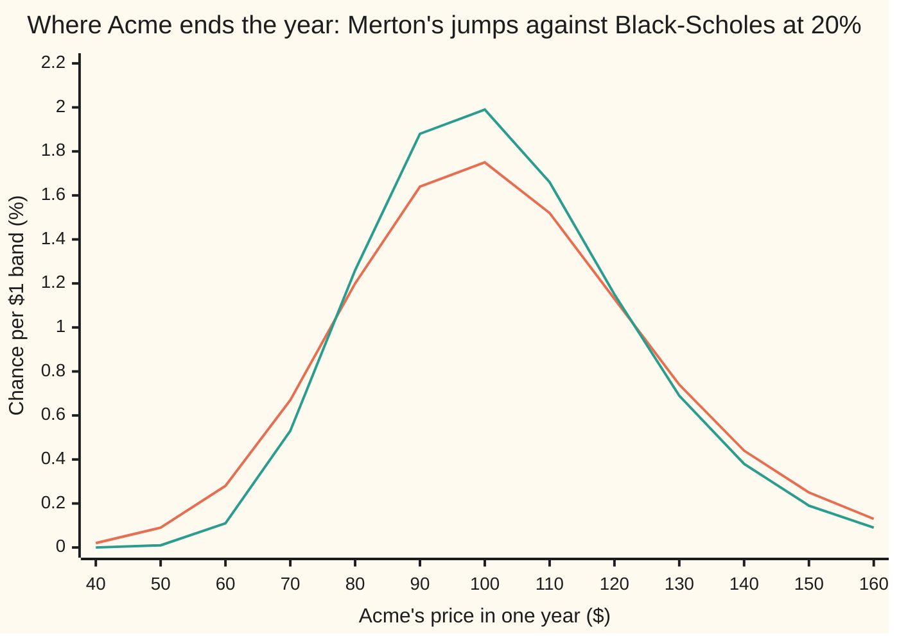
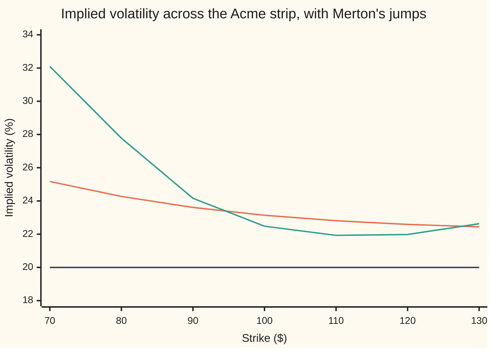

# Merton jump-diffusion: add sudden gaps, and the price is a weighted sum of Black-Scholes prices

[Syllabus](../../../SYLLABUS.md) → [Financial mathematics](../README.md) → [Local volatility and jumps](../README.md#s13) → Merton jump-diffusion

---

## General Overview

Acme shares trade at $100. Most days the price wiggles by small amounts. A few mornings a decade it opens far from where it closed, after a profit warning or a lost lawsuit. No trade happened in between. The price gapped.

Black-Scholes has no room for a gap. Its share price moves continuously, so every path from $100 down to $90 passes through $95. That model prices the house one-year call, struck at $100, at $9.23 ([Black–Scholes call](../08-The%20Black-Scholes%20call%20and%20put/01-black-scholes-call.md)).

Robert Merton's 1976 answer keeps the wiggle and adds jumps. Here they arrive at random, half a jump a year on average, so a year has a 0.6065 chance of none. Each jump multiplies the price by a random factor: typically 0.9048, a drop of just under 10%, with a spread of 15% around that in log terms. With those jumps, the same call costs $10.42.

The price rests on one question: how many jumps happen before expiry? Were the answer known to be exactly one, the log of the ending price would still follow one bell curve, only wider and lower, and the call would have an ordinary Black-Scholes price. The answer is not known, so the model prices the call for every possible count and averages the prices, each weighted by its chance. Those chances are Poisson probabilities, the counting law for events that arrive at random at a steady rate ([Poisson](../../09-Probability%20and%20statistics/03-Discrete%20Distributions/04-poisson.md)).

**Merton's price is a Black-Scholes price for each possible number of jumps, weighted by the chance of that many: 0.6065 of the $11.94 no-jump price, plus 0.3033 of the $8.64 one-jump price, and so on, $10.42 in all.**

**What kind of fact this is:** a model (gaps arriving at random with lognormal sizes is an assumption that fits some markets well, not a law), and inside it a theorem: the price series, proved on this card in Why it works.

### The picture: where Acme ends the year



The orange curve is the chance of Acme ending the year in each $1 band, with jumps. The green curve is the Black-Scholes lognormal (a bell curve in the log of the price) at 20%, with the same forward. Both are pricing-world odds, not forecasts. The jumps take weight from the middle, $80 to $120, and push it into both tails, the left one most: a 6.86% chance of ending below $70, against 3.34%. The wider spread is what the extra $1.19 on the call pays for; the lopsided left tail is what Step 5 reads as a skew.

---

## The formula

Notation first, in words. $S$ is Acme's price today, $S_T$ its price at expiry, $T$ years away, and $K$ the strike. The wiggle has volatility $\sigma$. Jumps arrive at rate $\lambda$ (lambda) a year; $N_T$ counts those that arrive by expiry. Jump number $i$ multiplies the price by a factor $Y_i$ whose log is a bell curve with mean $\mu_J$ and spread $\delta$. $Z$ is a standard bell-curve draw. $E[\,\cdot\,]$ means "the average of" in the pricing world, where the share grows on average at the riskless rate $r$ less the dividend yield $q$.

$$S_T = S\,\exp\!\Big(\big(r - q - \lambda k - \tfrac12\sigma^2\big)T + \sigma\sqrt{T}\,Z\Big)\times Y_1\,Y_2\cdots Y_{N_T}, \qquad k = E[Y] - 1 = e^{\mu_J + \frac12\delta^2} - 1$$

**Read it aloud:** the ending price is today's price moved by the Black-Scholes drift and wiggle, then multiplied by every jump that happened (by nothing if none did); the drift carries an extra $-\lambda k$ that pays for the jumps' average effect.

$k$ is the average jump as a fraction of the price, −0.0849: the average jump takes 8.49% off. (It is Merton's letter, not the log-moneyness of [The volatility smile and skew](../12-The%20smile%20and%20the%20surface/01-volatility-smile-and-skew.md).) The price of the call:

$$C = \sum_{n=0}^{\infty} w_n\; C_{\text{BS}}\big(S,\,K,\,r,\,q_n,\,\sigma_n,\,T\big), \qquad w_n = \frac{e^{-\lambda T}(\lambda T)^n}{n!}$$

**Read it aloud:** for every possible number of jumps, price a plain Black-Scholes call with that branch's own volatility and yield, then add the prices, each weighted by the chance of exactly that many jumps.

| Symbol | Plain meaning | In our example | Push it up and the answer… |
| --- | --- | --- | --- |
| $C$, $P$, $C_{\text{BS}}$ | the Merton call and put; a Black-Scholes call with the inputs in brackets | $10.42, $7.52; $9.23 at the house inputs | is the answer |
| $S$, $S_T$, $K$, $F$ | price today, price at expiry, strike, forward $S e^{(r-q)T}$ | $100; random; $100; $103.05 | $S$ up: dearer. $K$ up: cheaper |
| $r$, $q$ | riskless rate and dividend yield, continuously compounded | 5%; 2% | as in Black-Scholes |
| $\sigma$, $T$ | volatility of the wiggle alone; years to expiry | 20%; 1 | dearer |
| $\lambda$ | jump rate: average jumps a year | 0.5 | dearer: $11.50 at one a year |
| $\mu_J$, $\delta$ | mean and spread of one jump's log size, per jump | −0.10; 0.15 | bigger jumps either way, or more spread: dearer. The sign of $\mu_J$ picks which side of the strip lifts |
| $Y$, $Y_i$, $k$ | a jump's multiplier; that of jump number $i$; the average multiplier minus one | typical 0.9048; —; −0.0849 | — |
| $Z$, $N_T$, $n$, $i$ | a standard bell-curve draw; the random jump count by expiry; one particular count; a jump's number | —; —; 0, 1, 2, …; — | — |
| $w_n$ | Poisson weight: the chance of exactly $n$ jumps | 0.6065, 0.3033, 0.0758 | — |
| $\sigma_n$, $q_n$ | volatility and yield of the $n$-jump branch | 20%, −2.25% at $n = 0$; 25%, 6.63% at $n = 1$ | — |
| $r_n$, $\lambda'$ | Merton's own branch rate, and the tilted jump rate $\lambda(1+k)$ that goes with it | road 2 in the code | — |
| $N(x)$, $d_1$, $d_2$ | bell-curve area left of $x$; the two Black-Scholes distances inside $C_{\text{BS}}$ | — | — |

The two helpers:

$$\sigma_n = \sqrt{\sigma^2 + \frac{n\,\delta^2}{T}}, \qquad q_n = q + \lambda k - \frac{n\ln(1+k)}{T}$$

$\sigma_n$ is the branch's width: the wiggle's variance plus $n$ jumps' worth, spread over the life. $q_n$ acts as a dividend yield that slides the branch's centre: $\lambda k$ lifts every branch to pay for jumps that might happen, and $-n\ln(1+k)/T$ lowers it for the $n$ that did. Since $\ln(1+k) = \mu_J + \tfrac12\delta^2 = -0.08875$, each jump adds 0.08875 to the yield.

### When it holds

- **Jumps arrive one at a time, at a steady rate, with no memory.** That makes the count Poisson. If one crash makes the next likelier, two or three jumps are likelier than $w_n$ says, and the series underprices the far left tail.
- **Jump sizes are lognormal, independent of each other and of the wiggle.** That keeps each branch one bell curve in the log price. Other jump laws, such as Kou's double-exponential jumps, need a different formula.
- **Constant $\sigma$, $r$, $q$ and jump numbers,** as in Black-Scholes; if they move, the series runs on the wrong inputs.
- **Jump risk earns no premium.** No mix of shares and cash follows a gap, so no hedge forces the price. Merton assumed a stock's jumps are unrelated to the wider market, so diversified investors need no reward for them and pricing may use jump numbers measured from history. If investors do demand a reward, a price built on history is off by it.
- **European exercise:** the call is used only at expiry.

---

## Why it works

### Step 0: fix the number of jumps and Black-Scholes is back

Suppose exactly one jump happens. The log of the ending price is then the wiggle's bell curve plus one jump's bell curve. Independent bell curves add to one bell curve, variances added: $0.04 + 0.0225$, a width of 25%. So the one-jump world is a Black-Scholes world at 25%, centred a little lower, and its call is worth $8.64.

The same holds for every count. An average may also be taken case by case: average within each case, then average those, weighted by each case's chance. That is the law of total expectation. Split on the count and the price is a weighted sum of Black-Scholes prices. What remains is each branch's width and centre.

### Step 1: the compensator keeps the forward where it must be

In the pricing world the share, dividends reinvested, grows on average at the riskless rate, or buying it with borrowed money would be a free bet. So the average ending price must be the forward, $103.05.

Jumps alone drag that average down. One jump multiplies the price by $1 + k$ on average, and $n$ jumps by $(1+k)^n$. Averaging over the Poisson count, with the series for $e^x$ in the middle step:

$$E\big[(1+k)^{N_T}\big] = \sum_{n=0}^{\infty} \frac{e^{-\lambda T}(\lambda T)^n}{n!}\,(1+k)^n = e^{-\lambda T}\,e^{\lambda T(1+k)} = e^{\lambda k T}$$

Uncorrected, the average ending price would be $F e^{\lambda kT}$, $98.76. So the model adds $-\lambda k$, 4.25% a year, to the drift, and the two cancel. That is all a compensator is: a term whose only job is to undo another term's average effect.

One consequence surprises. The no-jump branch still has the raised drift: its yield, $q_n$ at $n = 0$, is −0.022463, a negative dividend, and its call is worth $11.94, more than the whole Merton price. A year without a gap still collects the drift that pays for gaps.

### Step 2: given the count, the log price is one bell curve

Fix $N_T = n$. The log of the ending price is the drift, plus the wiggle $\sigma\sqrt{T}Z$, plus $n$ independent jump logs, each with mean $\mu_J$ and variance $\delta^2$. Independent bell curves add to a bell curve whose mean and variance are the sums:

$$\ln\frac{S_T}{S} \;\text{ given } n \text{ jumps: mean }\; \big(r - q - \lambda k - \tfrac12\sigma^2\big)T + n\mu_J, \;\text{ variance }\; \sigma^2 T + n\delta^2$$

A lognormal ending price: exactly what Black-Scholes prices.

### Step 3: name the branch's width and centre

Write the branch variance as $\sigma_n^2 T$; then $\sigma_n^2 = \sigma^2 + n\delta^2/T$. For the centre: the average of the exponential of a bell curve is the exponential of its mean plus half its variance, so

$$E[S_T \mid n \text{ jumps}] = S\,e^{(r - q - \lambda k)T}\,e^{n(\mu_J + \frac12\delta^2)} = S\,e^{(r - q - \lambda k)T}(1+k)^n$$

A stock with yield $q_n$ averages $S e^{(r - q_n)T}$. Matching the two gives $q_n = q + \lambda k - n\ln(1+k)/T$.

### Step 4: price each branch and add

Black-Scholes prices a call on any lognormal ending price once its variance and average are fixed. Steps 2 and 3 fix both, so branch $n$ is worth $C_{\text{BS}}(S, K, r, q_n, \sigma_n, T)$, and total expectation adds the branches with weights $w_n$.

The series settles fast. Each branch call is below $S e^{-q_n T}$, which with $k$ negative is at most $S e^{-(q + \lambda k)T}$. Here that ceiling is $102.27. So the terms after the sixth total less than $102.27 times the chance of more than five jumps, 0.000014: under 0.0015. The true leftover is 0.000030.

<details>
<summary>Detailed proof: the series, in full</summary>

Write $\ln(S_T/S) = m + \sigma\sqrt{T}Z + (\ln Y_1 + \cdots + \ln Y_{N_T})$ with drift $m = (r - q - \lambda k - \frac12\sigma^2)T$, jump logs normal with mean $\mu_J$ and variance $\delta^2$, and all parts independent.

**Forward.** Completing the square in the bell-curve integral gives $E[e^{\sigma\sqrt{T}Z}] = e^{\frac12\sigma^2 T}$. By independence the jump product averages $(1+k)^n$ given $n$ jumps, and $e^{\lambda kT}$ over the count (Step 1). So $E[S_T] = S e^{m + \frac12\sigma^2T + \lambda kT} = S e^{(r-q)T}$.

**Split.** $C = e^{-rT}E[\max(S_T - K, 0)] = \sum_n w_n\,e^{-rT}E[\max(S_T - K, 0) \mid n \text{ jumps}]$, by total expectation.

**Branch.** Given $n$ jumps, $\ln(S_T/S)$ is the constant drift plus $n + 1$ independent normals, so it is normal with mean $m + n\mu_J$ and variance $\sigma_n^2 T$, and $E[S_T \mid n] = S e^{(r - q_n)T}$ as in Step 3. The computation on [Black–Scholes call](../08-The%20Black-Scholes%20call%20and%20put/01-black-scholes-call.md) uses only those two facts, so the branch term is $S e^{-q_nT}N(d_1) - K e^{-rT}N(d_2)$, with $d_1 = [\ln(S/K) + (r - q_n + \frac12\sigma_n^2)T]/(\sigma_n\sqrt{T})$ and $d_2 = d_1 - \sigma_n\sqrt{T}$: that is $C_{\text{BS}}(S, K, r, q_n, \sigma_n, T)$.

**Convergence.** $0 \le C_{\text{BS}} \le S e^{-q_nT} = S e^{-(q+\lambda k)T}(1+k)^n$. For $-1 < k \le 0$ the terms beyond any cut-off total at most $S e^{-(q+\lambda k)T}$ times the chance of more jumps than the cut-off, and Poisson tail chances fall faster than any power. For $k > 0$, fold $(1+k)^n$ into the weight: the bound becomes $S e^{-qT}$ times a Poisson tail at rate $\lambda(1+k)$, the regrouping below. The series converges absolutely to the price.

</details>

### Step 5: the smile the model creates

Run each strike's Merton price backwards through Black-Scholes to find the one volatility that reproduces it, the implied volatility ([Implied volatility](../11-Implied%20volatility%20and%20the%20vanilla%20inverses/01-implied-volatility.md)).

The inverse exists and is unique. A Black-Scholes call rises strictly with volatility, from $e^{-rT}\max(F - K, 0)$ at zero towards $S e^{-qT}$ as volatility grows without limit. Each branch price sits strictly inside its own range. The branch upper ends average to $S e^{-qT}$, by Step 1's identity. The branch lower ends average to at least $e^{-rT}\max(F - K, 0)$, since the branch forwards average to $F$ and the positive part of an average never beats the average of the positive parts. So every Merton price sits strictly inside the Black-Scholes range. It never lands on a boundary: at the lower end the answer would be zero volatility, at the upper end there would be none. Bisection (halving a bracket that holds the answer) finds exactly one volatility.



The orange curve is the one-year strip, the green curve the three-month strip under the same jumps, and the dark line the wiggle's own 20%, which Black-Scholes would return at every strike without jumps.

The whole strip sits above 20%, 23.14% at the money, because jumps add variance. At one year it is a skew, steep on the low side: 25.17% at $70, but only down to 22.44% at $130. Downward jumps load the left tail, where low strikes pay. At three months it is far steeper: 32.10% at $70 against 22.48% at the money, turning up to 22.63% at $130. In three months the wiggle almost never carries Acme 30% lower, so a $70 put is nearly a pure bet on a jump. Over a year the wiggle can go that far alone. And the longer the life, the more independent pieces the log price sums, and such sums drift towards one bell curve, so the strip flattens as expiry lengthens.

Two other routes reach the same number. Merton's 1976 paper moves the factor $e^{-\lambda kT}(1+k)^n$ from each branch into its weight, which makes Poisson weights at the tilted rate $\lambda' = \lambda(1 + k)$ and prices each branch at its own rate $r_n = r - \lambda k + n\ln(1+k)/T$: road 2 in the code. And the log price is a Lévy process (its changes over equal, separate stretches of time are independent and alike) with a closed-form characteristic function (the average of $e^{iu\ln S_T}$ for each real $u$), which a Fourier transform turns into prices at every strike: [Transform pricing](../06-Numerical%20Methods%20for%20Pricing/09-carr-madan-fft-and-cos-methods.md).

---

## Worked numbers, by hand

The house market plus jumps: $S = K = 100$, $r = 5\%$, $q = 2\%$, $\sigma = 20\%$, $T = 1$; $\lambda = 0.5$, $\mu_J = -0.10$, $\delta = 0.15$.

| Step | Arithmetic | Value |
| --- | --- | --- |
| average jump $k$ | $e^{-0.10 + 0.5 \times 0.15^2} - 1 = e^{-0.08875} - 1$ | −0.084926 |
| compensator $\lambda k$ | $0.5 \times (-0.084926)$ | −0.042463 a year |
| no jump: weight, width, yield | $e^{-0.5}$; $\sigma$; $0.02 - 0.042463$ | 0.606531; 0.20; −0.022463 |
| no jump: call times weight | $11.944649 \times 0.606531$ | 7.244796 |
| one jump: weight, width, yield | $0.5\,e^{-0.5}$; $\sqrt{0.04 + 0.0225}$; $-0.022463 + 0.08875$ | 0.303265; 0.25; 0.066287 |
| one jump: call times weight | $8.637499 \times 0.303265$ | 2.619454 |
| two jumps: weight, width, yield | $e^{-0.5} \times 0.5^2/2$; $\sqrt{0.04 + 2 \times 0.0225}$; $0.066287 + 0.08875$ | 0.075816; 0.291548; 0.155037 |
| two jumps: call times weight | $6.399864 \times 0.075816$ | 0.485214 |
| three, four, five jumps | the same recipe | 0.060779, 0.005764, 0.000440 |
| six terms | the six contributions added | 10.416447 |
| everything after | 60 terms less six | 0.000030 |
| **Merton call** | | **10.416477** |

With gaps possible, the call costs $10.42: $1.19 more than Black-Scholes charges at the same 20% wiggle.

### What breaks if you drop a piece

| Mistake | Comes out at | What went wrong |
| --- | --- | --- |
| Ignore the jumps | 9.23 | plain Black-Scholes at 20%: no gaps, no skew |
| Drop the compensator $\lambda k$ | 8.07 | the average ending price falls to $98.76, below the $103.05 forward |
| Keep $\sigma$ in every branch | 9.58 | $n$ jumps add $n\delta^2$ of variance; every branch with a jump is too narrow |
| Keep the no-jump centre in every branch | 12.84 | branches with jumps sit lower; left at the top they are overpriced |
| Take $k$ as $e^{\mu_J} - 1$ | 10.49 | an average of exponentials sits above the exponential of the average |
| Plain $\lambda$ weights with Merton's branch rates $r_n$ | 10.33 | half a regrouping: new rates need weights tilted to $\lambda(1+k)$ |
| One Black-Scholes volatility of 23.72% | 10.64 | the variance matches, the shape does not |
| Stop after the no-jump branch | 7.24 | every branch with a jump is thrown away |

The code prints all eight.

---

## Code, from first principles, and it actually runs

Nothing imported knows the answer. The bell-curve area comes from Marsaglia's power series, summed until a new term no longer changes it; the root finder is bisection; the integral is Simpson's rule; and the random numbers come from the recurrence of [Monte Carlo pricing](../06-Numerical%20Methods%20for%20Pricing/01-monte-carlo-pricing.md), turned into bell-curve draws by Box-Muller. Four roads reach the price. Road 1 is the series. Road 2 is Merton's own grouping, checked at one year and at three months. Road 3 averages each branch's payoff over its bell curve by Simpson's rule, with no Black-Scholes formula. Road 4 simulates a million years: the jump count comes from multiplying uniform numbers until the product falls below $e^{-\lambda T}$, and each jump's size is drawn separately. The same years check the compensator and each branch; the put checks parity; with no jumps the series must return the house call.

### Python

```python
# Merton jump-diffusion -- the check behind the card.  Standard library only.
# Nothing imported knows the answer: the bell-curve area is Marsaglia's series
# written out, the root finder is bisection, the integral is Simpson's rule,
# uniforms come from the house recurrence and normals from Box-Muller.
from math import cos, exp, log, pi, sqrt

S, K, R, Q, SIG, T = 100.0, 100.0, 0.05, 0.02, 0.20, 1.0    # the house market
LAM, MUJ, DEL = 0.5, -0.10, 0.15            # jump rate, log-size mean, spread
SEED, PATHS, MOD = 20260924, 1000000, 1 << 32
STRIKES = (70.0, 80.0, 90.0, 100.0, 110.0, 120.0, 130.0)

def n_cdf(x):                               # area left of x, Marsaglia's series
    if abs(x) > 9.0: return 0.0 if x < 0.0 else 1.0
    s, t, b, i = x, 0.0, x, 1.0
    while s != t:
        t, i = s, i + 2.0
        b *= x * x / i
        s = t + b
    return 0.5 + s * exp(-0.5 * x * x) / sqrt(2.0 * pi)
def phi(z): return exp(-0.5 * z * z) / sqrt(2.0 * pi)      # bell-curve height
def bs(k, r, q, sig, t, put=False):         # Black-Scholes, spot S, yield q
    vt = sig * sqrt(t)
    d1 = (log(S / k) + (r - q + 0.5 * sig * sig) * t) / vt
    if put: return k * exp(-r * t) * n_cdf(vt - d1) - S * exp(-q * t) * n_cdf(-d1)
    return S * exp(-q * t) * n_cdf(d1) - k * exp(-r * t) * n_cdf(d1 - vt)
def kbar(mu): return exp(mu + 0.5 * DEL * DEL) - 1.0       # k = E[Y] - 1
def poisson_sum(f, lam, t, terms=60):       # sum over n of P(n jumps) f(n)
    w, total = exp(-lam * t), 0.0
    for n in range(terms):
        if n: w *= lam * t / n
        total += w * f(n)
    return total
def merton(k=K, lam=LAM, mu=MUJ, t=T, terms=60, put=False, comp=1.0, widen=1.0, shift=1.0, kj=None):
    kj = kbar(mu) if kj is None else kj                   # road 1: the series
    return poisson_sum(lambda n: bs(k, R, Q + comp * lam * kj - shift * n * log(1.0 + kj) / t,
                                    sqrt(SIG * SIG + widen * n * DEL * DEL / t), t, put), lam, t, terms)
def merton76(lam_w, t=T):                   # road 2: Merton's own arrangement
    kj = kbar(MUJ)
    return poisson_sum(lambda n: bs(K, R - LAM * kj + n * log(1.0 + kj) / t, Q,
                                    sqrt(SIG * SIG + n * DEL * DEL / t), t), lam_w, t)
def branch(n, lam):                         # centre and spread of ln(S_T / S)
    return (R - Q - lam * kbar(MUJ) - 0.5 * SIG * SIG) * T + n * MUJ, sqrt(SIG * SIG * T + n * DEL * DEL)
def payoff_average(n):                      # road 3: the n-jump payoff, Simpson slices
    m, sd = branch(n, LAM)
    a = (log(K / S) - m) / sd                             # start at the strike's kink
    h, f = (12.0 - a) / 4000, lambda z: (S * exp(m + sd * z) - K) * phi(z)
    return h / 3.0 * sum((1.0 if i in (0, 4000) else 4.0 if i % 2 else 2.0) * f(a + i * h) for i in range(4001))
def ending(x, lam, cdf):                    # in %: chance per $1 at x, or below x
    def one(n):
        m, sd = branch(n, lam)
        return n_cdf((log(x / S) - m) / sd) if cdf else phi((log(x / S) - m) / sd) / (sd * x)
    return 100.0 * poisson_sum(one, lam, T, 30)
def implied(price, k, t):                   # bisection: Black-Scholes rises with vol
    lo, hi = 1e-4, 3.0
    for _ in range(100):
        mid = 0.5 * (lo + hi)
        lo, hi = (mid, hi) if bs(k, R, Q, mid, t) < price else (lo, mid)
    return 0.5 * (lo + hi)
def uniform(state):                         # the house recurrence
    state = (1664525 * state + 1013904223) % MOD
    return state, (state + 0.5) / MOD
def normal(state):                          # Box-Muller, cosine half only
    state, u = uniform(state)
    state, v = uniform(state)
    return state, sqrt(-2.0 * log(u)) * cos(2.0 * pi * v)
def simulate():                             # road 4: real jump counts and sizes
    state, disc, e0 = SEED, exp(-R * T), exp(-LAM * T)
    drift = (R - Q - LAM * kbar(MUJ) - 0.5 * SIG * SIG) * T
    tot, bk = [0.0] * 4, [[0.0] * 3 for _ in range(3)]
    for _ in range(PATHS):
        n, prod = -1, 1.0
        while prod > e0:                                  # Knuth's Poisson count
            state, u = uniform(state)
            prod, n = prod * u, n + 1
        state, z = normal(state)
        x = drift + SIG * sqrt(T) * z
        for _ in range(n):
            state, zj = normal(state)
            x += MUJ + DEL * zj                           # one jump's log size
        pay, st = disc * max(S * exp(x) - K, 0.0), disc * S * exp(x)
        tot = [a + b for a, b in zip(tot, (pay, pay * pay, st, st * st))]
        if n < 3: bk[n] = [a + b for a, b in zip(bk[n], (1.0, pay, pay * pay))]
    ms = lambda a, b, c: (a / c, sqrt((b / c - (a / c) * (a / c)) / c))
    return ms(tot[0], tot[1], PATHS), ms(tot[2], tot[3], PATHS), [ms(b[1], b[2], b[0]) + (b[0],) for b in bk]
kj, fwd = kbar(MUJ), S * exp((R - Q) * T)
c1, c2, c3 = merton(), merton76(LAM * (1.0 + kj)), exp(-R * T) * poisson_sum(payoff_average, LAM, T, 30)
(mc, se), (fw, fse), bk = simulate()
put, allin = merton(put=True), sqrt(SIG * SIG + LAM * (MUJ * MUJ + DEL * DEL))
branch_row = lambda n: (Q + LAM * kj - n * log(1.0 + kj) / T, sqrt(SIG * SIG + n * DEL * DEL / T))
print("house market: S 100, K 100, r 5%, q 2%, sigma 20%, T 1 year; jumps 0.5 a year, mean -0.10, spread 0.15")
for name, v in (("typical jump multiplier e^mu_J", exp(MUJ)), ("k = e^(mu_J + delta^2/2) - 1", kj),
                ("lambda k, compensator per year", LAM * kj), ("ln(1 + k)", log(1.0 + kj)),
                ("forward S e^(r - q)T", fwd), ("average S_T without the compensator", fwd * exp(LAM * kj * T))):
    print(f"{name:<44}{v:>12.6f}")
print("  n    weight   sigma_n        q_n    BS price  contribution")
for n in range(6):
    w, (qn, sn) = poisson_sum(lambda j: float(j == n), LAM, T, n + 1), branch_row(n)
    print(f"{n:>3}  {w:.6f}  {sn:.6f}  {qn:>9.6f}  {bs(K, R, qn, sn, T):>10.6f}  {w * bs(K, R, qn, sn, T):>12.6f}")
for n in range(3):
    print(f"paths with {n} jumps: {bk[n][2]:>7.0f}  simulated {bk[n][0]:9.6f} +- {bk[n][1]:.6f}  "
          f"branch {bs(K, R, *branch_row(n), T):9.6f}")
for name, v in (("six terms, n = 0 to 5", merton(terms=6)), ("left after six terms", c1 - merton(terms=6)),
                ("chance of more than five jumps", 1.0 - poisson_sum(lambda n: 1.0, LAM, T, 6)),
                ("road 1  series, 60 terms", c1), ("road 2  Merton 1976 arrangement", c2),
                ("road 3  Simpson average over the jumps", c3), (f"road 4  simulation, {PATHS} paths", mc),
                ("        standard error", se), ("compensator: simulated average e^-rT S_T", fw),
                ("             S e^-qT", S * exp(-Q * T)), ("             standard error", fse),
                ("put by the same series", put), ("C - P", c1 - put),
                ("S e^-qT - K e^-rT", S * exp(-Q * T) - K * exp(-R * T)), ("lambda = 0 series", merton(lam=0.0)),
                ("jumps add: road 1 minus lambda = 0", c1 - merton(lam=0.0)),
                ("wrong: no compensator", merton(comp=0.0)), ("wrong: sigma not widened", merton(widen=0.0)),
                ("wrong: centre not shifted", merton(shift=0.0)), ("wrong: k = e^mu_J - 1", merton(kj=exp(MUJ) - 1.0)),
                ("wrong: plain lambda weights, 1976 rates", merton76(LAM)),
                (f"wrong: one vol, {allin * 100:.2f}%", bs(K, R, Q, allin, T)),
                ("wrong: no-jump branch only", merton(terms=1))):
    print(f"{name:<44}{v:>12.6f}")
iv = lambda k, t=T, mu=MUJ: implied(merton(k, mu=mu, t=t), k, t)      # one strike's implied vol
iv1, iv3 = [iv(k) for k in STRIKES], [iv(k, 0.25) for k in STRIKES]
print("strike             " + "".join(f"{k:>8.0f}" for k in STRIKES))
print("1 year, Merton call" + "".join(f"{merton(k):>8.3f}" for k in STRIKES))
print("1 year, one vol    " + "".join(f"{bs(k, R, Q, allin, T):>8.3f}" for k in STRIKES))
print("1 year, implied %  " + "".join(f"{v * 100:>8.2f}" for v in iv1))
print("3 months, implied %" + "".join(f"{v * 100:>8.2f}" for v in iv3))
grid = [40.0 + 10.0 * i for i in range(13)]
print("chart, price  " + " ".join(f"{x:>5.0f}" for x in grid))
print("chart, Merton " + " ".join(f"{ending(x, LAM, False):>5.2f}" for x in grid))
print("chart, 20% BS " + " ".join(f"{ending(x, 0.0, False):>5.2f}" for x in grid))
print(f"chance of ending below 70, %: Merton {ending(70.0, LAM, True):.2f}, lognormal {ending(70.0, 0.0, True):.2f}")
print(f"try: lambda = 1 {merton(lam=1.0):.6f}; two terms {merton(terms=2):.6f}; "
      f"mu_J = +0.10, implied % at 80 and 120: {iv(80.0, mu=0.1) * 100:.2f}, {iv(120.0, mu=0.1) * 100:.2f}")
assert max(abs(c2 - c1), abs(merton76(LAM * (1.0 + kj), 0.25) - merton(t=0.25))) < 1e-10, "the same sum, regrouped"
assert abs(c3 - c1) < 1e-7, "brute-force average lands on the series"
assert abs(mc - c1) < 3.0 * se < abs(mc - merton76(LAM)), "simulation backs the series, not the mix"
assert abs(fw - S * exp(-Q * T)) < 3.0 * fse, "compensated drift puts the average on the forward"
assert abs((c1 - put) - (S * exp(-Q * T) - K * exp(-R * T))) < 1e-10, "put-call parity"
assert abs(merton(lam=0.0) - 9.227005508154) < 1e-9, "no jumps: the call card's house price"
assert abs(bs(K, R, Q, iv1[3], T) - c1) < 1e-8, "the at-the-money implied vol reprices the call"
assert iv1[0] > iv1[3] > iv1[6] and iv3[1] - iv3[3] > iv1[1] - iv1[3], "a skew, steeper when short"
print("ALL CHECKS PASS")
```

**Ran 2026-09-24 on macOS, Python 3.14.6, standard library only. All checks passed. Output, pasted from the run:**

```
house market: S 100, K 100, r 5%, q 2%, sigma 20%, T 1 year; jumps 0.5 a year, mean -0.10, spread 0.15
typical jump multiplier e^mu_J                  0.904837
k = e^(mu_J + delta^2/2) - 1                   -0.084926
lambda k, compensator per year                 -0.042463
ln(1 + k)                                      -0.088750
forward S e^(r - q)T                          103.045453
average S_T without the compensator            98.761450
  n    weight   sigma_n        q_n    BS price  contribution
  0  0.606531  0.200000  -0.022463   11.944649      7.244796
  1  0.303265  0.250000   0.066287    8.637499      2.619454
  2  0.075816  0.291548   0.155037    6.399864      0.485214
  3  0.012636  0.327872   0.243787    4.809944      0.060779
  4  0.001580  0.360555   0.332537    3.649237      0.005764
  5  0.000158  0.390512   0.421287    2.787362      0.000440
paths with 0 jumps:  607899  simulated 11.904313 +- 0.020087  branch 11.944649
paths with 1 jumps:  301967  simulated  8.643083 +- 0.028097  branch  8.637499
paths with 2 jumps:   75838  simulated  6.383132 +- 0.052039  branch  6.399864
six terms, n = 0 to 5                          10.416447
left after six terms                            0.000030
chance of more than five jumps                  0.000014
road 1  series, 60 terms                       10.416477
road 2  Merton 1976 arrangement                10.416477
road 3  Simpson average over the jumps         10.416477
road 4  simulation, 1000000 paths              10.397850
        standard error                          0.015591
compensator: simulated average e^-rT S_T       97.999945
             S e^-qT                           98.019867
             standard error                     0.022883
put by the same series                          7.519552
C - P                                           2.896925
S e^-qT - K e^-rT                               2.896925
lambda = 0 series                               9.227006
jumps add: road 1 minus lambda = 0              1.189472
wrong: no compensator                           8.071035
wrong: sigma not widened                        9.578334
wrong: centre not shifted                      12.837639
wrong: k = e^mu_J - 1                          10.488425
wrong: plain lambda weights, 1976 rates        10.327126
wrong: one vol, 23.72%                         10.636917
wrong: no-jump branch only                      7.244796
strike                   70      80      90     100     110     120     130
1 year, Merton call  31.979  23.522  16.203  10.416   6.266   3.552   1.916
1 year, one vol      31.846  23.413  16.237  10.637   6.616   3.933   2.251
1 year, implied %     25.17   24.27   23.61   23.14   22.81   22.59   22.44
3 months, implied %   32.10   27.78   24.16   22.48   21.93   21.98   22.63
chart, price     40    50    60    70    80    90   100   110   120   130   140   150   160
chart, Merton  0.02  0.09  0.28  0.67  1.20  1.64  1.75  1.52  1.13  0.74  0.44  0.25  0.13
chart, 20% BS  0.00  0.01  0.11  0.53  1.26  1.88  1.99  1.66  1.15  0.69  0.38  0.19  0.09
chance of ending below 70, %: Merton 6.86, lognormal 3.34
try: lambda = 1 11.503925; two terms 9.864250; mu_J = +0.10, implied % at 80 and 120: 22.87, 24.65
ALL CHECKS PASS
```

The series, Merton's grouping and the Simpson average agree to six decimals. The simulation lands at 10.397850, standard error 0.015591: within three standard errors of the series, and outside three of the 10.327126 that mixed weights give. The paths with no jump, one jump and two jumps each land within about two standard errors of their own branch's price: the series seen directly.

### Rust

Same checks and labels, built with `rustc --edition 2021 -O`. The same recurrence drives the simulation, so it reproduces the Python's to every printed digit.

```rust
// Merton jump-diffusion -- the same check as the Python, in Rust.  No crates.
// Nothing here knows the answer: the bell-curve area is Marsaglia's series
// written out, the root finder is bisection, the integral is Simpson's rule,
// uniforms come from the house recurrence and normals from Box-Muller.
use std::f64::consts::PI;

const S: f64 = 100.0; const K: f64 = 100.0; const R: f64 = 0.05; const Q: f64 = 0.02;
const SIG: f64 = 0.20; const T: f64 = 1.0;                  // the house market
const LAM: f64 = 0.5; const MUJ: f64 = -0.10; const DEL: f64 = 0.15;  // the jumps
const SEED: u64 = 20260924; const PATHS: usize = 1000000;
const STRIKES: [f64; 7] = [70.0, 80.0, 90.0, 100.0, 110.0, 120.0, 130.0];

fn n_cdf(x: f64) -> f64 {                   // area left of x, Marsaglia's series
    if x.abs() > 9.0 { return if x < 0.0 { 0.0 } else { 1.0 }; }
    let (mut s, mut t, mut b, mut i) = (x, 0.0, x, 1.0);
    while s != t { t = s; i += 2.0; b *= x * x / i; s = t + b; }
    0.5 + s * (-0.5 * x * x).exp() / (2.0 * PI).sqrt()
}
fn phi(z: f64) -> f64 { (-0.5 * z * z).exp() / (2.0 * PI).sqrt() }     // bell-curve height
fn bs(k: f64, r: f64, q: f64, sig: f64, t: f64, put: bool) -> f64 {    // spot S, yield q
    let vt = sig * t.sqrt();
    let d1 = ((S / k).ln() + (r - q + 0.5 * sig * sig) * t) / vt;
    if put { return k * (-r * t).exp() * n_cdf(vt - d1) - S * (-q * t).exp() * n_cdf(-d1); }
    S * (-q * t).exp() * n_cdf(d1) - k * (-r * t).exp() * n_cdf(d1 - vt)
}
fn kbar(mu: f64) -> f64 { (mu + 0.5 * DEL * DEL).exp() - 1.0 }         // k = E[Y] - 1
fn poisson_sum<F: Fn(usize) -> f64>(f: F, lam: f64, t: f64, terms: usize) -> f64 {
    let (mut w, mut total) = ((-lam * t).exp(), 0.0);
    for n in 0..terms {
        if n > 0 { w *= lam * t / n as f64; }                  // P(n jumps), step by step
        total += w * f(n);
    }
    total
}
struct Tw { lam: f64, mu: f64, t: f64, terms: usize, put: bool, comp: f64, widen: f64, shift: f64, kj: Option<f64> }
const BASE: Tw = Tw { lam: LAM, mu: MUJ, t: T, terms: 60, put: false, comp: 1.0, widen: 1.0, shift: 1.0, kj: None };
fn merton(k: f64, w: Tw) -> f64 {           // road 1: the series
    let kj = w.kj.unwrap_or(kbar(w.mu));
    poisson_sum(|n| bs(k, R, Q + w.comp * w.lam * kj - w.shift * n as f64 * (1.0 + kj).ln() / w.t,
                       (SIG * SIG + w.widen * n as f64 * DEL * DEL / w.t).sqrt(), w.t, w.put), w.lam, w.t, w.terms)
}
fn merton76(lam_w: f64, t: f64) -> f64 {    // road 2: Merton's own arrangement
    let kj = kbar(MUJ);
    poisson_sum(|n| bs(K, R - LAM * kj + n as f64 * (1.0 + kj).ln() / t, Q,
                       (SIG * SIG + n as f64 * DEL * DEL / t).sqrt(), t, false), lam_w, t, 60)
}
fn branch(n: usize, lam: f64) -> (f64, f64) {     // centre and spread of ln(S_T / S)
    ((R - Q - lam * kbar(MUJ) - 0.5 * SIG * SIG) * T + n as f64 * MUJ, (SIG * SIG * T + n as f64 * DEL * DEL).sqrt())
}
fn payoff_average(n: usize) -> f64 {        // road 3: the n-jump payoff, Simpson slices
    let (m, sd) = branch(n, LAM);
    let a = ((K / S).ln() - m) / sd;                          // start at the strike's kink
    let (h, f) = ((12.0 - a) / 4000.0, |z: f64| (S * (m + sd * z).exp() - K) * phi(z));
    h / 3.0 * (0..=4000).fold(0.0, |sum, i| {
        sum + (if i == 0 || i == 4000 { 1.0 } else if i % 2 == 1 { 4.0 } else { 2.0 }) * f(a + i as f64 * h)
    })
}
fn ending(x: f64, lam: f64, cdf: bool) -> f64 {   // in %: chance per $1 at x, or below x
    100.0 * poisson_sum(|n| {
        let (m, sd) = branch(n, lam);
        if cdf { n_cdf(((x / S).ln() - m) / sd) } else { phi(((x / S).ln() - m) / sd) / (sd * x) }
    }, lam, T, 30)
}
fn implied(price: f64, k: f64, t: f64) -> f64 {   // bisection: Black-Scholes rises with vol
    let (mut lo, mut hi) = (1e-4, 3.0);
    for _ in 0..100 {
        let mid = 0.5 * (lo + hi);
        if bs(k, R, Q, mid, t, false) < price { lo = mid } else { hi = mid }
    }
    0.5 * (lo + hi)
}
fn uniform(state: &mut u64) -> f64 {        // the house recurrence
    *state = (1664525 * *state + 1013904223) % (1u64 << 32);
    (*state as f64 + 0.5) / 4294967296.0
}
fn normal(state: &mut u64) -> f64 {         // Box-Muller, cosine half only
    let (u, v) = (uniform(state), uniform(state));
    (-2.0 * u.ln()).sqrt() * (2.0 * PI * v).cos()
}
fn simulate() -> ((f64, f64), (f64, f64), Vec<(f64, f64, f64)>) {   // road 4: real jumps
    let (mut state, disc, e0) = (SEED, (-R * T).exp(), (-LAM * T).exp());
    let drift = (R - Q - LAM * kbar(MUJ) - 0.5 * SIG * SIG) * T;
    let (mut tot, mut bk) = ([0.0f64; 4], [[0.0f64; 3]; 3]);
    for _ in 0..PATHS {
        let (mut n, mut prod) = (-1i64, 1.0f64);
        while prod > e0 { prod *= uniform(&mut state); n += 1; }   // Knuth's Poisson count
        let mut x = drift + SIG * T.sqrt() * normal(&mut state);
        for _ in 0..n { x += MUJ + DEL * normal(&mut state); }   // one jump's log size each
        let (pay, st) = (disc * (S * x.exp() - K).max(0.0), disc * S * x.exp());
        for (i, v) in [pay, pay * pay, st, st * st].iter().enumerate() { tot[i] += v; }
        if n < 3 { for (i, v) in [1.0, pay, pay * pay].iter().enumerate() { bk[n as usize][i] += v; } }
    }
    let ms = |a: f64, b: f64, c: f64| (a / c, ((b / c - (a / c) * (a / c)) / c).sqrt());
    let buckets = bk.iter().map(|b| { let (m, s) = ms(b[1], b[2], b[0]); (m, s, b[0]) }).collect();
    (ms(tot[0], tot[1], PATHS as f64), ms(tot[2], tot[3], PATHS as f64), buckets)
}
fn row(name: &str, v: f64) { println!("{:<44}{:>12.6}", name, v); }
fn main() {
    let (kj, fwd) = (kbar(MUJ), S * ((R - Q) * T).exp());
    let (c1, c2) = (merton(K, BASE), merton76(LAM * (1.0 + kj), T));
    let c3 = (-R * T).exp() * poisson_sum(payoff_average, LAM, T, 30);
    let ((mc, se), (fw, fse), bk) = simulate();
    let (put, allin) = (merton(K, Tw { put: true, ..BASE }), (SIG * SIG + LAM * (MUJ * MUJ + DEL * DEL)).sqrt());
    let branch_row = |n: usize| (Q + LAM * kj - n as f64 * (1.0 + kj).ln() / T,
                                 (SIG * SIG + n as f64 * DEL * DEL / T).sqrt());
    println!("house market: S 100, K 100, r 5%, q 2%, sigma 20%, T 1 year; jumps 0.5 a year, mean -0.10, spread 0.15");
    for (name, v) in [("typical jump multiplier e^mu_J", MUJ.exp()), ("k = e^(mu_J + delta^2/2) - 1", kj),
                      ("lambda k, compensator per year", LAM * kj), ("ln(1 + k)", (1.0 + kj).ln()),
                      ("forward S e^(r - q)T", fwd), ("average S_T without the compensator", fwd * (LAM * kj * T).exp())] {
        row(name, v);
    }
    println!("  n    weight   sigma_n        q_n    BS price  contribution");
    for n in 0..6 {
        let (w, (qn, sn)) = (poisson_sum(|j| if j == n { 1.0 } else { 0.0 }, LAM, T, n + 1), branch_row(n));
        println!("{:>3}  {:.6}  {:.6}  {:>9.6}  {:>10.6}  {:>12.6}", n, w, sn, qn, bs(K, R, qn, sn, T, false),
                 w * bs(K, R, qn, sn, T, false));
    }
    for (n, (m, s, count)) in bk.iter().enumerate() {
        let (qn, sn) = branch_row(n);
        println!("paths with {} jumps: {:>7.0}  simulated {:9.6} +- {:.6}  branch {:9.6}", n, count, m, s, bs(K, R, qn, sn, T, false));
    }
    let (road4, onevol) = (format!("road 4  simulation, {} paths", PATHS), format!("wrong: one vol, {:.2}%", allin * 100.0));
    for (name, v) in [("six terms, n = 0 to 5", merton(K, Tw { terms: 6, ..BASE })),
                      ("left after six terms", c1 - merton(K, Tw { terms: 6, ..BASE })),
                      ("chance of more than five jumps", 1.0 - poisson_sum(|_| 1.0, LAM, T, 6)),
                      ("road 1  series, 60 terms", c1), ("road 2  Merton 1976 arrangement", c2),
                      ("road 3  Simpson average over the jumps", c3), (road4.as_str(), mc),
                      ("        standard error", se), ("compensator: simulated average e^-rT S_T", fw),
                      ("             S e^-qT", S * (-Q * T).exp()), ("             standard error", fse),
                      ("put by the same series", put), ("C - P", c1 - put),
                      ("S e^-qT - K e^-rT", S * (-Q * T).exp() - K * (-R * T).exp()),
                      ("lambda = 0 series", merton(K, Tw { lam: 0.0, ..BASE })),
                      ("jumps add: road 1 minus lambda = 0", c1 - merton(K, Tw { lam: 0.0, ..BASE })),
                      ("wrong: no compensator", merton(K, Tw { comp: 0.0, ..BASE })),
                      ("wrong: sigma not widened", merton(K, Tw { widen: 0.0, ..BASE })),
                      ("wrong: centre not shifted", merton(K, Tw { shift: 0.0, ..BASE })),
                      ("wrong: k = e^mu_J - 1", merton(K, Tw { kj: Some(MUJ.exp() - 1.0), ..BASE })),
                      ("wrong: plain lambda weights, 1976 rates", merton76(LAM, T)),
                      (onevol.as_str(), bs(K, R, Q, allin, T, false)),
                      ("wrong: no-jump branch only", merton(K, Tw { terms: 1, ..BASE }))] {
        row(name, v);
    }
    let iv = |k: f64, t: f64, mu: f64| implied(merton(k, Tw { mu, t, ..BASE }), k, t);   // one strike's implied vol
    let iv1: Vec<f64> = STRIKES.iter().map(|&k| iv(k, T, MUJ)).collect();
    let iv3: Vec<f64> = STRIKES.iter().map(|&k| iv(k, 0.25, MUJ)).collect();
    let show = |label: &str, sep: &str, v: Vec<String>| println!("{}{}", label, v.join(sep));
    show("strike             ", "", STRIKES.iter().map(|k| format!("{:>8.0}", k)).collect());
    show("1 year, Merton call", "", STRIKES.iter().map(|&k| format!("{:>8.3}", merton(k, BASE))).collect());
    show("1 year, one vol    ", "", STRIKES.iter().map(|&k| format!("{:>8.3}", bs(k, R, Q, allin, T, false))).collect());
    show("1 year, implied %  ", "", iv1.iter().map(|v| format!("{:>8.2}", v * 100.0)).collect());
    show("3 months, implied %", "", iv3.iter().map(|v| format!("{:>8.2}", v * 100.0)).collect());
    let grid: Vec<f64> = (0..13).map(|i| 40.0 + 10.0 * i as f64).collect();
    show("chart, price  ", " ", grid.iter().map(|x| format!("{:>5.0}", x)).collect());
    show("chart, Merton ", " ", grid.iter().map(|&x| format!("{:>5.2}", ending(x, LAM, false))).collect());
    show("chart, 20% BS ", " ", grid.iter().map(|&x| format!("{:>5.2}", ending(x, 0.0, false))).collect());
    println!("chance of ending below 70, %: Merton {:.2}, lognormal {:.2}", ending(70.0, LAM, true), ending(70.0, 0.0, true));
    println!("try: lambda = 1 {:.6}; two terms {:.6}; mu_J = +0.10, implied % at 80 and 120: {:.2}, {:.2}",
             merton(K, Tw { lam: 1.0, ..BASE }), merton(K, Tw { terms: 2, ..BASE }),
             iv(80.0, T, 0.1) * 100.0, iv(120.0, T, 0.1) * 100.0);
    let short = (merton76(LAM * (1.0 + kj), 0.25) - merton(K, Tw { t: 0.25, ..BASE })).abs();
    assert!((c2 - c1).abs() < 1e-10 && short < 1e-10, "the same sum, regrouped");
    assert!((c3 - c1).abs() < 1e-7, "brute-force average lands on the series");
    assert!((mc - c1).abs() < 3.0 * se && 3.0 * se < (mc - merton76(LAM, T)).abs(), "simulation backs the series, not the mix");
    assert!((fw - S * (-Q * T).exp()).abs() < 3.0 * fse, "compensated drift puts the average on the forward");
    assert!(((c1 - put) - (S * (-Q * T).exp() - K * (-R * T).exp())).abs() < 1e-10, "put-call parity");
    assert!((merton(K, Tw { lam: 0.0, ..BASE }) - 9.227005508154).abs() < 1e-9, "no jumps: the call card's house price");
    assert!((bs(K, R, Q, iv1[3], T, false) - c1).abs() < 1e-8, "the at-the-money implied vol reprices the call");
    assert!(iv1[0] > iv1[3] && iv1[3] > iv1[6] && iv3[1] - iv3[3] > iv1[1] - iv1[3], "a skew, steeper when short");
    println!("ALL CHECKS PASS");
}
```

**Ran 2026-09-24 on macOS, rustc 1.98.1, no crates. All checks passed. Output, pasted from the run:**

```
house market: S 100, K 100, r 5%, q 2%, sigma 20%, T 1 year; jumps 0.5 a year, mean -0.10, spread 0.15
typical jump multiplier e^mu_J                  0.904837
k = e^(mu_J + delta^2/2) - 1                   -0.084926
lambda k, compensator per year                 -0.042463
ln(1 + k)                                      -0.088750
forward S e^(r - q)T                          103.045453
average S_T without the compensator            98.761450
  n    weight   sigma_n        q_n    BS price  contribution
  0  0.606531  0.200000  -0.022463   11.944649      7.244796
  1  0.303265  0.250000   0.066287    8.637499      2.619454
  2  0.075816  0.291548   0.155037    6.399864      0.485214
  3  0.012636  0.327872   0.243787    4.809944      0.060779
  4  0.001580  0.360555   0.332537    3.649237      0.005764
  5  0.000158  0.390512   0.421287    2.787362      0.000440
paths with 0 jumps:  607899  simulated 11.904313 +- 0.020087  branch 11.944649
paths with 1 jumps:  301967  simulated  8.643083 +- 0.028097  branch  8.637499
paths with 2 jumps:   75838  simulated  6.383132 +- 0.052039  branch  6.399864
six terms, n = 0 to 5                          10.416447
left after six terms                            0.000030
chance of more than five jumps                  0.000014
road 1  series, 60 terms                       10.416477
road 2  Merton 1976 arrangement                10.416477
road 3  Simpson average over the jumps         10.416477
road 4  simulation, 1000000 paths              10.397850
        standard error                          0.015591
compensator: simulated average e^-rT S_T       97.999945
             S e^-qT                           98.019867
             standard error                     0.022883
put by the same series                          7.519552
C - P                                           2.896925
S e^-qT - K e^-rT                               2.896925
lambda = 0 series                               9.227006
jumps add: road 1 minus lambda = 0              1.189472
wrong: no compensator                           8.071035
wrong: sigma not widened                        9.578334
wrong: centre not shifted                      12.837639
wrong: k = e^mu_J - 1                          10.488425
wrong: plain lambda weights, 1976 rates        10.327126
wrong: one vol, 23.72%                         10.636917
wrong: no-jump branch only                      7.244796
strike                   70      80      90     100     110     120     130
1 year, Merton call  31.979  23.522  16.203  10.416   6.266   3.552   1.916
1 year, one vol      31.846  23.413  16.237  10.637   6.616   3.933   2.251
1 year, implied %     25.17   24.27   23.61   23.14   22.81   22.59   22.44
3 months, implied %   32.10   27.78   24.16   22.48   21.93   21.98   22.63
chart, price     40    50    60    70    80    90   100   110   120   130   140   150   160
chart, Merton  0.02  0.09  0.28  0.67  1.20  1.64  1.75  1.52  1.13  0.74  0.44  0.25  0.13
chart, 20% BS  0.00  0.01  0.11  0.53  1.26  1.88  1.99  1.66  1.15  0.69  0.38  0.19  0.09
chance of ending below 70, %: Merton 6.86, lognormal 3.34
try: lambda = 1 11.503925; two terms 9.864250; mu_J = +0.10, implied % at 80 and 120: 22.87, 24.65
ALL CHECKS PASS
```

The two outputs match line for line.

> [!TIP]
> **Try changing**
> Guess the direction first, then check the `try:` line of the output, which computes each answer.
> - **Double the jump rate.** Price with `merton(lam=1.0)`: the call rises from $10.42 to **$11.50**.
> - **Turn the jumps upward.** Price with `merton(k, mu=0.1)` and invert: **22.87%** at $80 and **24.65%** at $120. The strip now leans the other way, because the fat tail is on the right.
> - **Starve the series.** Price with `merton(terms=2)`: **$9.86**, against $10.42. Every term is positive, so stopping early always undercharges.

---

## The usual mistake

> [!warning]
> **Replacing the jumps with one bigger volatility.** A Black-Scholes volatility of 23.72% carries the same yearly variance as the wiggle plus the jumps, and still misprices. At the money it gives $10.64 against Merton's $10.42; at the $70 strike $31.85 against $31.98, too cheap; at $130, $2.25 against $1.92, too dear. Matching the width of the distribution does not match its shape. The jumps move weight into the tails, the left one most, and one volatility cannot bend that way: the strip is that bend, read strike by strike.
>
> - **$k$ as $e^{\mu_J} - 1$.** The average multiplier is $e^{\mu_J + \frac12\delta^2}$. The slip prices the call at $10.49 and moves the forward off $F$.
> - **Mixing the two groupings.** Branch rates $r_n$ go with weights at $\lambda(1+k)$. Plain $\lambda$ weights give $10.33, which the simulation, at 10.397850 with standard error 0.015591, rules out.
> - **Units.** $\lambda$ is per year; $\mu_J$ and $\delta$ are per jump, in logs, and do not scale with the square root of $T$ as $\sigma$ does. $\mu_J$ = −0.10 is a typical factor of 0.9048, not 0.90.
> - **Hedging as if Black-Scholes held.** A delta hedge follows the wiggle but not a gap: [Greeks under jumps](05-merton-greeks-hedge-error-and-calibration.md).

---

## Where you meet it in real life

- **Earnings dates.** A stock can gap on the morning it reports; short-dated options across that date carry the steep smile of Step 5.
- **Power prices.** Electricity cannot be stored, so its price spikes; the spikes are jumps in [Power that cannot be stored](../26-Options%20on%20commodity%20futures%20and%20spreads/07-electricity-and-the-spark-spread.md).
- **Variance swaps.** The option strip that replicates variance assumes no gaps; jumps leave an error, measured in [The volatility swap and the jump bias](../19-Variance%20swaps%2C%20the%20log%20contract%20and%20VIX/05-volatility-swap-and-jump-bias.md).
- **Local volatility, the other way to a skew.** A volatility that depends on price and date can fit this very strip ([Dupire local volatility](01-dupire-local-volatility.md)) but predicts a different future smile ([Pricing with local volatility](03-pricing-under-local-volatility-and-the-forward-smile.md)).
- **Jumps plus wandering volatility.** Bates put Merton's jumps on a volatility that itself moves ([The Heston model](../14-Stochastic%20volatility%20-%20Heston%2C%20SABR%20and%20their%20mix/01-heston-model.md)): jumps give the short-dated skew, the moving volatility keeps it steep for longer.

> **Say it back**
> Merton keeps the Black-Scholes wiggle and adds jumps that arrive at random at a steady rate, each multiplying the price by a lognormal factor. Fix the number of jumps and the log price is one bell curve again, so each case has a Black-Scholes price with its own width and centre. The call is those prices weighted by the Poisson chance of each count: $10.42 for Acme, against $9.23 without jumps. The $-\lambda k$ in the drift only cancels the jumps' average drag, so the pricing world still expects the forward. Run the prices back through Black-Scholes and a skew appears, steepest for short-dated options.

---

## What this builds on

- [The volatility smile and skew](../12-The%20smile%20and%20the%20surface/01-volatility-smile-and-skew.md): implied volatility strike by strike, and the two-leg crash market this card extends to one leg per count.
- [Black–Scholes call](../08-The%20Black-Scholes%20call%20and%20put/01-black-scholes-call.md): the formula priced in every branch, and the house call the series returns without jumps.
- [Poisson](../../09-Probability%20and%20statistics/03-Discrete%20Distributions/04-poisson.md): the chance of exactly $n$ events at a steady rate, the series' weights.
- [Compound Poisson](../../11-Stochastic%20processes%20and%20calculus/04-Poisson%20and%20Jump%20Processes/04-compound-poisson.md): a random number of random jumps added up, the jump part of the log price.
- [Monte Carlo pricing](../06-Numerical%20Methods%20for%20Pricing/01-monte-carlo-pricing.md): simulated averages, the recurrence and the standard error road 4 uses.

## Where this goes next

- [Greeks under jumps](05-merton-greeks-hedge-error-and-calibration.md): the Greeks from the series, the error a gap leaves in a hedge, and reading the jump numbers back from a smile.
- [The volatility swap and the jump bias](../19-Variance%20swaps%2C%20the%20log%20contract%20and%20VIX/05-volatility-swap-and-jump-bias.md): what jumps do to the replication of variance.
- [Power that cannot be stored](../26-Options%20on%20commodity%20futures%20and%20spreads/07-electricity-and-the-spark-spread.md): a market where jumps are the main event.

The call now has a price but no perfect hedge; how far a delta hedge misses when Acme gaps, and whether the jump numbers can be read back from the strip at all, is the next card's question.

---

## Sources

Verified 24 Sep 2026: every link below resolves to the publisher's page.

- Merton, Robert C. "Option Pricing When Underlying Stock Returns Are Discontinuous." *Journal of Financial Economics* 3, no. 1–2 (1976): 125–144. [doi:10.1016/0304-405X(76)90022-2](https://doi.org/10.1016/0304-405X(76)90022-2). The model, the series, and the no-premium argument for jump risk.
- Bates, David S. "Jumps and Stochastic Volatility: Exchange Rate Processes Implicit in Deutsche Mark Options." *Review of Financial Studies* 9, no. 1 (1996): 69–107. [doi:10.1093/rfs/9.1.69](https://doi.org/10.1093/rfs/9.1.69). Merton's jumps on a moving volatility, fitted to option prices.
- Cont, Rama, and Peter Tankov. *Financial Modelling with Jump Processes*. Chapman & Hall/CRC, 2003. [Publisher page](https://www.routledge.com/Financial-Modelling-with-Jump-Processes/Cont-Tankov/p/book/9781584884132). Jump models in general, the unhedgeable gap, and why jump smiles flatten with maturity.
- Gatheral, Jim. *The Volatility Surface: A Practitioner's Guide*. Wiley, 2006. [Publisher page](https://www.wiley.com/en-us/The+Volatility+Surface%3A+A+Practitioner%27s+Guide-p-9780471792512). Real strips across strike and maturity, and where jumps alone fall short.
- Hull, John C. *Options, Futures, and Other Derivatives*, 11th ed. Pearson. [Publisher page](https://www.pearson.com/en-us/subject-catalog/p/options-futures-and-other-derivatives/P200000005938). The standard textbook statement of the series.
