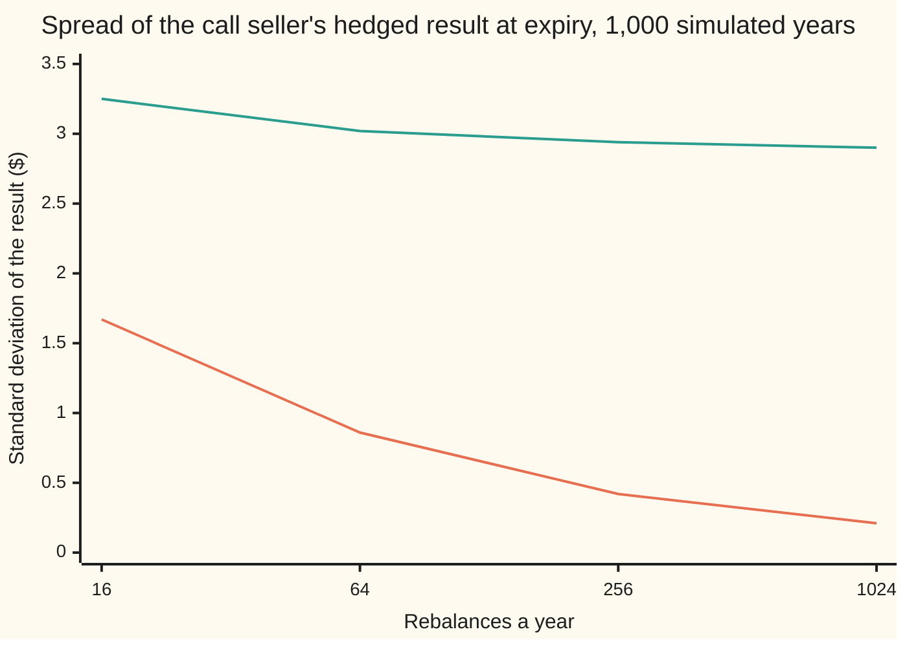
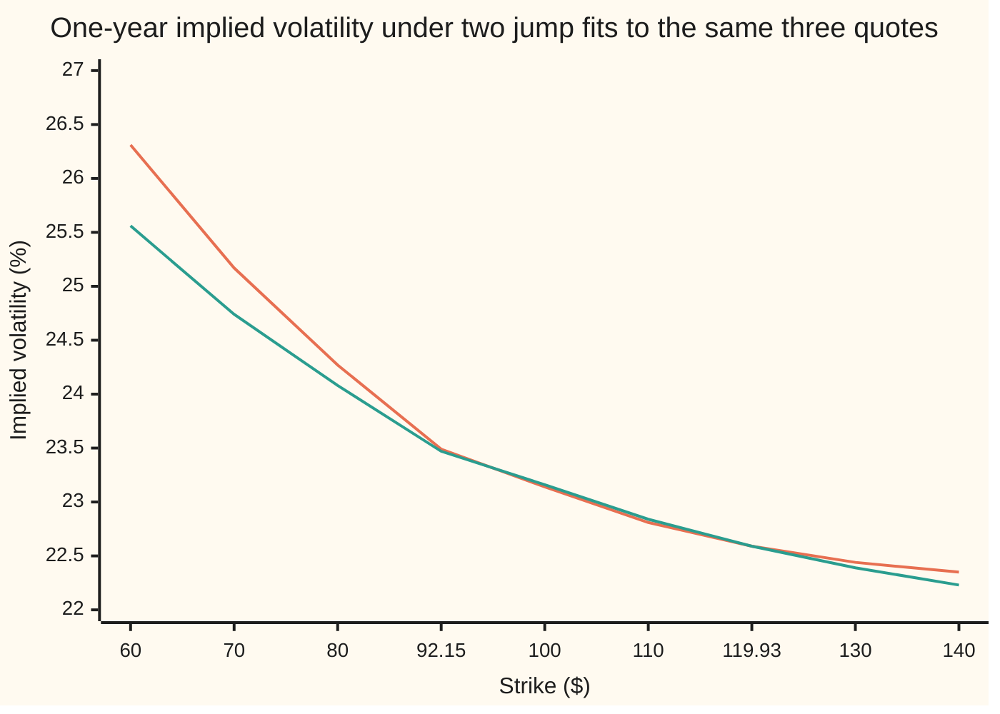

# Greeks under jumps: the delta hedge that cannot be perfect, and fitting the three jump numbers to the smile

Financial mathematics → Local volatility and jumps → Hedging and fitting a jump model → Greeks under jumps

---

## General Overview

A dealer sells one Acme call in the house market: Acme at $100, strike $100, one year, bank rate 5 percent, dividend yield 2 percent. This time Acme can gap. Gaps arrive at random, 0.5 a year on average. A typical gap multiplies the price by 0.904837, and gap sizes spread 15 percent either side on the log scale. Between gaps the price wiggles with volatility 20 percent. The jump model of [merton-jump-diffusion](04-merton-jump-diffusion.md) prices this call at $10.42, against $9.23 with no gaps.

The dealer needs three more things. How many shares to hold against the call: its delta, 0.599892 of a share. Whether hedging more often makes the book safe: it does not. And where the three jump numbers came from: three quoted prices, which pin them down only loosely.

The chart below simulates the dealer's result at expiry over 1,000 years. Without gaps, rebalancing four times as often halves its spread. With gaps, the spread stalls near $2.90. A gap happens between two trades, however close together, and no share count matches a curved price across a move that size.

**The jump model's Greeks come from differentiating its price term by term, but a delta hedge matches only the slope, so every gap costs the curvature across the move; faster rebalancing cannot shrink that loss, and three quotes barely tell a higher rate of smaller gaps from a lower rate of bigger ones.**

**What kind of fact this is:** a theorem inside the jump model: the Greek formulas and the loss at a gap are proved on this card in Why it works; the floor under the hedging error is measured by simulation. The model is an assumption, not a law, and the fit is a method.

### The picture: hedging faster helps only without gaps



Orange: no gaps, hedged with the Black-Scholes delta. Green: with gaps, hedged with this card's delta. Both use the same random wiggles.

---

## The formula

Notation first, in words. Gaps arrive at $\lambda$ (lambda) a year. A gap's log-size has mean $\mu_J$ and spread $\delta$, and $k$ is the average gap as a fraction of the price. $\tau$ (tau) is the years left to expiry. The jump model's price is a sum over $n$, the number of gaps before expiry. Term $n$ is a Black-Scholes price $C_{\mathrm{BS}}$ with its own volatility $\sigma_n$ and yield $q_n$, weighted by $p_n$, the chance of exactly $n$ gaps. $N$ is the bell-curve area to the left of a point and $\varphi$ the curve's height there. $\Delta$ (delta) is the price's slope in the share price, $\Gamma$ (gamma) the change in that slope, $\nu$ (vega) the slope in the diffusion volatility $\sigma$.

The price, as [merton-jump-diffusion](04-merton-jump-diffusion.md) left it:

$$C = \sum_{n=0}^{\infty} p_n\, C_{\mathrm{BS}}(S, K, r, q_n, \sigma_n, \tau), \qquad p_n = e^{-\lambda\tau}\frac{(\lambda\tau)^n}{n!}, \qquad \sigma_n^2 = \sigma^2 + \frac{n\delta^2}{\tau}, \qquad q_n = q + \lambda k - \frac{n(\mu_J + \delta^2/2)}{\tau}$$

Its three Greeks:

$$\Delta = \sum_{n} p_n e^{-q_n\tau} N(d_{1,n}), \qquad \Gamma = \sum_{n} p_n e^{-q_n\tau}\,\frac{\varphi(d_{1,n})}{S\sigma_n\sqrt{\tau}}, \qquad \nu = \sum_{n} p_n S e^{-q_n\tau}\varphi(d_{1,n})\sqrt{\tau}\,\frac{\sigma}{\sigma_n} = S^2\sigma\tau\,\Gamma$$

**Read it aloud:** each Greek is the chance-weighted sum of the Black-Scholes Greeks of the branches, one branch per possible number of gaps; vega carries one extra factor, because the diffusion volatility reaches each branch only through its wider volatility.

The loss at a gap. The hedger holds $\Delta$ shares and a gap multiplies the share price by $J$, a move of $z = S(J-1)$ dollars; $t$ runs from 0 to 1 along the move:

$$R(S, J) = C(SJ) - C(S) - S(J-1)\,\Delta = z^2\int_0^1 (1-t)\,\Gamma(S + tz)\,dt$$

**Read it aloud:** after a gap the call ends up above what its slope predicted, by the squared move times an average of gamma along the way, and the seller of the call loses that much.

The fit: three quoted one-year calls and three unknowns.

$$C(K_i;\ \lambda, \mu_J, \delta) = \text{quote}_i, \qquad K_i = 92.15,\ 100,\ 119.93$$

**Read it aloud:** find the gap rate, mean and spread that reprice all three quotes.

| Symbol | Plain meaning | In our example | Push it up and the answer… |
| --- | --- | --- | --- |
| $S$ | Acme's share price now | $100 | delta climbs |
| $K$ | strike | $100; quotes at $92.15, $100, $119.93 | delta falls |
| $\tau$ | time to expiry, in years | 1 | more gaps ahead |
| $r$, $q$ | bank rate; dividend yield | 5%, 2% | higher $q$ lowers delta |
| $\sigma$ | diffusion volatility: the wiggle between gaps | 20% | more wiggle error, which faster hedging still shrinks |
| $\lambda$ | gap rate, gaps per year | 0.5 | the floor under the hedging error rises |
| $\mu_J$, $\delta$, $k$ | mean and spread of a gap's log-size; $k = e^{\mu_J + \delta^2/2} - 1$, the average gap as a fraction | −0.10, 0.15; −0.084926 | larger $\delta$ or more negative $\mu_J$: bigger gaps, costlier to hedge |
| $J$, $z$, $R$, $t$ | one gap's multiplier; the dollar move; the hedger's loss at that gap; a point along the move, 0 to 1 | 0.9, −$10, $0.89 | $R$ grows roughly as $z^2$, whichever way $J$ moves from 1 |
| $n$, $p_n$, $\tilde p_n$ | gaps before expiry; the Poisson chance of $n$; the same chance at the tilted rate $\lambda(1+k)$ | 0.606531 for none, 0.303265 for one | — |
| $\sigma_n$, $q_n$ | branch $n$'s volatility and yield; $d_{1,n}$ is its Black-Scholes distance to the strike | one set per branch | — |
| $N$, $\varphi$, $\mathbb{E}$ | bell-curve area to the left; bell-curve height; average over gap sizes | — | — |
| $C$, $C_{\mathrm{BS}}$ | the jump-model call; a Black-Scholes call with the inputs in brackets | $10.42; $9.23 at 20% | — |
| $\Delta$, $\Gamma$, $\nu$, $\Theta$ | delta; gamma; vega; theta, the price's change per year of calendar time | 0.599892; 0.016630; 33.259434; — | — |

The helper, one per branch:

$$d_{1,n} = \frac{\ln(S/K) + (r - q_n)\tau}{\sigma_n\sqrt{\tau}} + \frac{\sigma_n\sqrt{\tau}}{2}$$

In words: branch $n$'s distance to the strike in units of its own wiggle, as in Black-Scholes.

### When it holds

- **Gaps arrive at a steady rate, independent of each other and of the wiggle.** If crashes cluster, the model understates bad years and the true floor is higher.
- **Gap risk earns no premium.** Merton assumes the pricing world, where every asset earns the bank rate on average, keeps the real gap rate. If investors charge for gaps, a rate fitted to option prices overstates how often Acme really gaps.
- **The model numbers stay put.** The Greeks hold $\lambda$, $\mu_J$, $\delta$ and $\sigma$ fixed. A refit that moves them, and the fit below shows how easily they move, moves every hedge ratio too.
- **The hedge uses shares and cash only.** Other options can absorb part of the gap risk; the floor is a statement about hedging with shares.
- **No trading costs.** At 1,024 rebalances a year, real costs would swamp everything.

---

## Why it works

### Step 0: a share count matches a slope, and a gap is not small

A delta hedge holds as many shares as the call's slope. Over a small move, call and shares move together, and the leftover is half the gamma times the squared move. That leftover shrinks as the moves between trades shrink, and theta pays for it on average ([theta-pays-for-gamma-hedged-pnl](../09-The%20Greeks%2C%20one%20each/10-theta-pays-for-gamma-hedged-pnl.md)).

A gap does not shrink when trades get closer together; its size comes from the gap law, not the clock. So the leftover at a gap is set by the price's curvature across the whole gap. Two kinds of risk, the wiggle and a gap of random size, face one hedging tool, the share, and no single share count offsets both. A market in which some payoffs cannot be copied from the traded assets is called **incomplete**.

### Step 1: differentiate the sum one term at a time

The share price $S$ enters each Black-Scholes term only as its spot: $p_n$, $q_n$ and $\sigma_n$ do not depend on $S$. So the slope of the sum is the sum of the slopes. Term $n$'s slope is the Black-Scholes delta with yield $q_n$, $e^{-q_n\tau}N(d_{1,n})$, which gives $\Delta$; once more gives $\Gamma$.

The diffusion volatility reaches term $n$ only through $\sigma_n$, and from $\sigma_n^2 = \sigma^2 + n\delta^2/\tau$ a small rise in $\sigma$ moves $\sigma_n$ by the fraction $\sigma/\sigma_n$ of it. Term $n$'s Black-Scholes vega, $S e^{-q_n\tau}\varphi(d_{1,n})\sqrt{\tau}$, times $\sigma/\sigma_n$, summed, gives $\nu$. Term by term that equals $S^2\sigma\tau$ times the term's gamma, so the sums agree too.

For Acme the series gives $\Delta$ = 0.599892, $\Gamma$ = 0.016630, $\nu$ = 33.259434. Bumping and repricing ([bump-and-revalue-and-common-random-numbers](../07-Greeks%20by%20Numbers%20and%20Calibration/01-bump-and-revalue-and-common-random-numbers.md)) gives the same to six decimals.

<details>
<summary>Detailed proof: why the sum may be differentiated term by term</summary>

Since $e^{-q_n\tau} = e^{-q\tau}e^{-\lambda k\tau}(1+k)^n$, the delta weights are $p_n e^{-q_n\tau} = e^{-q\tau}\tilde p_n$, where $\tilde p_n = e^{-\lambda(1+k)\tau}(\lambda(1+k)\tau)^n/n!$ are Poisson chances at the tilted rate $\lambda(1+k)$, summing to 1.

So term $n$ of the delta series lies between 0 and $e^{-q\tau}\tilde p_n$ at every share price, and term $n$ of the gamma series between 0 and $e^{-q\tau}\tilde p_n\,\varphi(0)/(S\sigma\sqrt{\tau})$, since $\sigma_n \ge \sigma$. On any band of share prices away from zero these bounds are constants with a finite sum. When the derivative series of a convergent series of smooth functions is bounded term by term by such constants, it converges uniformly and equals the derivative of the sum. The bound $e^{-q\tau}\tilde p_n S\sqrt{\tau}\varphi(0)$ does the same for vega.

A by-product: $\Delta = e^{-q\tau}\sum_n \tilde p_n N(d_{1,n})$ is a weighted average of numbers between 0 and 1, so it lies between 0 and $e^{-q\tau}$, as a call's delta must.

</details>

Black-Scholes at 20 percent says 0.586851 shares; at the implied volatility that reprices this call, 23.1362 percent, it says 0.585087. Both are too few. The jump model's implied volatility depends on the strike measured against the share price and is higher at lower strikes. When Acme rises, the $100 strike becomes relatively lower, its implied volatility rises, and the call gains more than a flat-volatility slope predicts ([smile-adjusted-delta](../12-The%20smile%20and%20the%20surface/05-smile-adjusted-delta.md)).

### Step 2: the loss at a gap is curvature across the gap

The hedger is short one call, long $\Delta$ shares, with the difference in the bank. A gap multiplies Acme by $J$: the call changes by $C(SJ) - C(S)$, the shares by $S(J-1)\Delta$, and the bank not at all in an instant. The book loses $R$.

Taylor's theorem with an integral remainder turns $R$ into curvature: the move squared times a weighted average of gamma between the old price and the new. A call's gamma is positive, so $R$ is positive for every gap, up or down.

| Gap multiplier $J$ | Loss by repricing | Loss by curvature integral |
| --- | --- | --- |
| 0.8 | $3.679890 | $3.679890 |
| 0.9 | $0.891796 | $0.891796 |
| 1.1 | $0.755052 | $0.755052 |
| 1.2 | $2.703934 | $2.703934 |

Doubling a fall from 10 to 20 percent roughly quadruples the loss, $0.89 to $3.68. Trading after the gap cannot win it back, since shares trade at the new price. Trading more often before it does not help: the gap still falls between two trades.

<details>
<summary>The algebra behind this, if you want it</summary>

Let $g(t) = C(S + tz)$ for t from 0 to 1, so $g(0) = C(S)$, $g(1) = C(SJ)$, $g'(0) = z\Delta$ and $g''(t) = z^2\Gamma(S + tz)$. Integrating by parts, $\int_0^1 (1-t)g''(t)\,dt = \big[(1-t)g'(t)\big]_0^1 + \int_0^1 g'(t)\,dt = -g'(0) + g(1) - g(0)$. The right side is $C(SJ) - C(S) - z\Delta = R$. With $\Gamma > 0$ on the whole segment and $z \neq 0$, the integral is positive.

</details>

### Step 3: between gaps the seller collects a jump rent

If the seller loses on every gap, the price must pay the seller between gaps. While nothing gaps, the hedged book grows at a steady rate set by the Greeks: the time decay the seller keeps, minus the gamma cost of the wiggle, plus interest and dividends net of funding. Call it the drift. Gaps arrive at rate $\lambda$, and each costs $R$.

In the pricing world a position funded at the bank rate earns nothing extra on average, and the hedged book is one. So the drift minus $\lambda$ times the average $R$ over gap sizes, written $\mathbb{E}[R]$, is zero:

$$\text{drift} = -\Theta - \tfrac12\sigma^2 S^2\Gamma - (r - q)S\Delta + rC = \lambda\,\mathbb{E}[R(S, J)]$$

For Acme today both sides come out at $1.14 a year, equal to six decimals: the left from theta, gamma and delta, the right by averaging the gap loss over the bell curve of gap sizes. Rearranged, this balance is the jump model's pricing equation: Black-Scholes plus one term for gaps.

### Step 4: why the spread stops falling

Without gaps, each step's leftover is half the gamma times the squared move less its expected value, with spread proportional to the step's length. The steps' variances add, so the year's spread falls as one over the square root of the number of steps: four times the steps, half the spread, $1.67, $0.86, $0.42, $0.21.

The gap losses are a separate stream, arriving at rate $\lambda$ with sizes $R$. Their variance for the year is roughly the rate $\lambda\,\mathbb{E}[R^2]$ accumulated over the year, and nothing in it depends on the rebalancing. So the spread falls toward a floor set by the gaps alone: $3.25, $3.02, $2.94, $2.90. That floor is an incomplete market, in dollars.

<details>
<summary>Detailed proof: the floor, in outline</summary>

Split the book's change over one rebalancing step into a wiggle part and a gap part. The wiggle part has variance of the order of the step's length squared. The gap part is $-R$ with probability about $\lambda$ times the step's length, so its variance is about $\lambda\,\mathbb{E}[R^2]$ times the step's length. The hedged book is a fair game in the pricing world, so its steps are uncorrelated and their variances add. Over the year the wiggle parts total a constant times the step's length; the gap parts total $\lambda\,\mathbb{E}[R^2]$ summed over the year, whatever the step. As the step shrinks the first vanishes and the second stays.

</details>

### Step 5: fitting the three jump numbers, and why the fit is loose

Three one-year quotes, generated by the house jump model so the right answer is known: $14.82 at the $92.15 strike, $10.42 at $100 and $3.57 at $119.93. The outer strikes are the house 25-delta put and call strikes ([strike-from-delta](../11-Implied%20volatility%20and%20the%20vanilla%20inverses/03-strike-from-delta.md)). The diffusion volatility stays at 20 percent; the unknowns are $\lambda$, $\mu_J$ and $\delta$.

**Existence.** The gaps and their compensating drift spread the final price out without moving its average, and a call gains from spread. So at every strike a jump-model call costs at least the Black-Scholes call at the same diffusion volatility: a $100 quote below $9.23 has no solution. Even above that bar, quotes that allow a riskless profit fit no model, and least squares returns only the nearest fit. These quotes came from the model, so an exact fit exists.

**Boundary cases.** At $\lambda$ = 0 the gaps vanish and $\mu_J$, $\delta$ drop out of every price, so they cannot be recovered at all. At $\delta$ = 0 all gaps are the same size and the model still works. Very many very small gaps blur into extra wiggle.

**Uniqueness.** Locally there is one answer wherever the three-by-three table of sensitivities, each quote's change per unit change in each parameter, can be inverted. Here it can, barely.

**Solving.** Damped Gauss-Newton steps minimise the sum of squared misses: a Newton step from the sensitivity table, halved until the misses fall ([calibration-as-least-squares](../07-Greeks%20by%20Numbers%20and%20Calibration/06-calibration-as-least-squares.md)), with columns from bumping each parameter. From two very different starts it lands on rate 0.500000, mean −0.100000, spread 0.150000: the numbers that made the quotes.

**The ridge.** Hold the rate at other values and fit only the mean and spread.

| Rate held at | Fitted mean | Fitted spread | Misses at $92.15, $100, $119.93 |
| --- | --- | --- | --- |
| 0.250 | −0.130893 | 0.239229 | $0.012466, −$0.016065, $0.004656 |
| 0.375 | −0.108498 | 0.183268 | $0.004832, −$0.006047, $0.001718 |
| 0.500 | −0.100000 | 0.150000 | $0.000000, $0.000000, $0.000000 |
| 0.625 | −0.097989 | 0.125119 | −$0.003547, $0.004166, −$0.001008 |
| 0.750 | −0.102510 | 0.100203 | −$0.007876, $0.007363, $0.000399 |

Tripling the rate from 0.250 to 0.750 while the spread falls from 0.239229 to 0.100203 keeps every miss under two cents, inside a typical bid-ask spread. Three prices mostly measure how much spread the gaps add to the final price and which way it leans, and many small gaps or fewer big ones add much the same. Rate and spread trade off along a ridge.

So the answer is unstable. Add one cent to the $100 quote and refit: the rate jumps from 0.500000 to 0.672986 and the spread drops to 0.114744. A problem whose answer moves this much when its inputs barely move is **ill-posed**.



Orange: the house fit, 0.5 gaps a year, spread 0.15. Green: rate held at 0.75, spread 0.100203. At the quoted strikes they agree within 0.02 volatility points. At $60 they part, 26.31 against 25.56, so one quote far below the money would separate them.

A second road to the Greeks differentiates a simulation path by path; [pathwise-and-likelihood-ratio-greeks](../07-Greeks%20by%20Numbers%20and%20Calibration/02-pathwise-and-likelihood-ratio-greeks.md) does that properly.

---

## Worked numbers, by hand

Acme at $100, strike $100, one year, rates 5 and 2 percent, diffusion volatility 20 percent, 0.5 gaps a year with log-mean −0.10 and log-spread 0.15.

| Step | Arithmetic | Value |
| --- | --- | --- |
| average gap as a fraction, $k$ | $e^{-0.10 + 0.15^2/2} - 1$ | −0.084926 |
| chance of a gap-free year | $e^{-0.5}$ | 0.606531 |
| chance of exactly one gap | $0.5\,e^{-0.5}$ | 0.303265 |
| price | twelve Black-Scholes terms, weighted | $10.416477 |
| delta | the same weights on each branch's $e^{-q_n\tau}N(d_{1,n})$ | 0.599892 |
| delta, by bumping a cent | (price at $100.01 − price at $99.99) / 0.02 | 0.599892 |
| gamma | series; by bumping | 0.016630; 0.016630 |
| vega | series; by bumping; $100^2 \times 0.20 \times$ gamma | 33.259434 each way |
| loss at a 10 percent gap | price at $90 − $10.416477 + 10 × 0.599892 | $0.891796 |
| jump rent | 0.5 × average gap loss | $1.136732 a year |
| **shares to hold per call sold** | | **0.599892** |

The dealer holds 0.599892 of a share per call sold, loses about $0.89 on a 10 percent gap, and is paid about $1.14 a year for it while nothing gaps.

| Greek | Jump model | Black-Scholes at 20% | Black-Scholes at the implied 23.1362% |
| --- | --- | --- | --- |
| price | $10.416477 | $9.227006 | $10.416477 (by construction) |
| delta | 0.599892 | 0.586851 | 0.585087 |
| gamma | 0.016630 | 0.018951 | 0.016401 |
| vega | 33.259434 | 37.901158 | 37.944852 |

The jump vega is the smallest: part of the call's value comes from gaps, which the diffusion volatility does not touch.

### What breaks if you drop a piece

| Mistake | Comes out at | What went wrong |
| --- | --- | --- |
| Black-Scholes delta at 20% | 0.586851 shares, not 0.599892 | A no-gap formula cannot see how gaps bend the price |
| Black-Scholes delta at the implied volatility | 0.585087 shares | One flat volatility misses the smile moving with the share |
| Expecting four times the rebalancing to halve the spread | $2.90, from $2.94 | Gap loss is not a step-size error; only the gap-free spread halves, $0.42 to $0.21 |
| Taking the fitted rate as measured | one cent on the $100 quote moves it to 0.672986 | Rate and spread trade off along a ridge |

---

## How the seller's book moves through the year

Most years the seller of a hedged call finishes ahead, yet the average result is zero. Split the 1,000 simulated years, hedged 256 times a year (about daily), by how many gaps each contained.

| Gaps in the year | Years out of 1,000 | Average result at expiry |
| --- | --- | --- |
| none | 605 | +$1.25 |
| one | 315 | −$1.32 |
| two or more | 80 | −$4.01 |

The 605 gap-free years match the 0.606531 chance of a gap-free year. In them the seller keeps the jump rent. One gap costs more than a year of rent; two cost far more.

```
daily-hedged result at expiry, average by gaps in the year; one block = $0.20
no gaps     ██████                    +$1.25
one gap     ███████                   −$1.32
two or more ████████████████████      −$4.01
```

The tail: the 10th worst of 1,000 years, the edge of the worst 1 percent.

```
10th worst daily-hedged result of 1,000; one block = $0.50
without gaps      ██                              −$1.14
with gaps         ████████████████████████████    −$13.86
```

Without gaps, one year in a hundred loses $1.14 or more; with gaps, $13.86 or more. The chart at the top shows the same split in spreads: without gaps the spread keeps shrinking as rebalancing speeds up; with gaps it stalls.

---

## Code, from first principles, and it actually runs

Nothing imported contains the answer. The normal area is Hart's 1968 formula, a ratio of two polynomials, accurate to double precision. Random numbers come from a 64-bit mixing generator (splitmix64) turned into bell-curve draws (Box-Muller), identical in both languages, so both programs simulate the same 1,000 years. Each result has two roads: Greeks by series and by bumping; gap loss by repricing and by Simpson's rule on the curvature integral; jump rent by averaging over gap sizes and from theta, gamma and delta; the price by the series and by averaging the simulated payoffs, $9.76 with a standard error of $0.46, within two standard errors of $10.42; the fit from two starts against the numbers that made the quotes. Implied volatility is found by bisection.

### Python

```python
# Greeks under jumps -- the check behind the card.  Standard library only; the normal CDF, random
# numbers, integrator and root finder are written here.  House market: Acme $100, strike $100, rate 5%,
# dividends 2%, one year, diffusion vol 20%; jumps 0.5 a year, log-size mean -0.10, log-size spread 0.15.
from math import exp, log, sqrt, pi, cos
R, Q, SIG, LAM, MU, DL, M64, SEED = 0.05, 0.02, 0.20, 0.5, -0.10, 0.15, (1 << 64) - 1, [20260924]
HP = (0.0352624965998911, 0.700383064443688, 6.37396220353165, 33.912866078383,
      112.079291497871, 221.213596169931, 220.206867912376)
HQ = (0.0883883476483184, 1.75566716318264, 16.064177579207, 86.7807322029461,
      296.564248779674, 637.333633378831, 793.826512519948, 440.413735824752)

def N(x):                                   # normal CDF: Hart's 1968 rational form
    a, b, d = abs(x), 0.0, 0.0
    if a < 7.07106781186547:
        for c in HP: b = b * a + c
        for c in HQ: d = d * a + c
        c = exp(-a * a / 2) * b / d
    else: c = exp(-a * a / 2) / (a + 1 / (a + 2 / (a + 3 / (a + 4 / (a + 0.65))))) / 2.506628274631
    return 1 - c if x > 0 else c
def phi(x): return exp(-x * x / 2) / sqrt(2 * pi)
def merton(S, K, tau, lam=LAM, mu=MU, dl=DL, sg=SIG, M=12):   # price, delta, gamma, vega
    k, w, out = exp(mu + dl * dl / 2) - 1, exp(-lam * tau), [0.0] * 4
    for n in range(M):                      # one Black-Scholes term per jump count n
        vt = sqrt(sg * sg * tau + n * dl * dl)              # sigma_n times root tau
        qn = Q + lam * k - n * (mu + dl * dl / 2) / tau      # compensator and recentring
        d1 = (log(S / K) + (R - qn) * tau) / vt + vt / 2
        a = w * exp(-qn * tau)
        out = [o + v for o, v in zip(out, (a * S * N(d1) - w * K * exp(-R * tau) * N(d1 - vt), a * N(d1),
                                           a * phi(d1) / (S * vt), a * S * phi(d1) * sg * tau / vt))]
        w *= lam * tau / (n + 1)
    return out
def simpson(f, a, b, n=64):
    h = (b - a) / n
    return h / 3 * sum((1 if i in (0, n) else 4 if i % 2 else 2) * f(a + i * h) for i in range(n + 1))
def u():                                    # splitmix64: a uniform number in (0, 1)
    SEED[0] = (SEED[0] + 0x9E3779B97F4A7C15) & M64
    z = ((SEED[0] ^ (SEED[0] >> 30)) * 0xBF58476D1CE4E5B9) & M64
    z = ((z ^ (z >> 27)) * 0x94D049BB133111EB) & M64
    return ((z ^ (z >> 31)) >> 11) * 2.0 ** -53 + 2.0 ** -54
def g(): u1 = u(); return sqrt(-2 * log(u1)) * cos(2 * pi * u())    # Box-Muller normal
def hedge(path, lam, f):                    # seller's book at expiry, rebalanced f times
    step, h, (c, d) = (len(path) - 1) // f, 1 / f, merton(100, 100, 1, lam)[:2]
    bank, sh = c - d * 100, d
    for j in range(1, f + 1):
        S = path[j * step]; bank *= exp(R * h); sh *= exp(Q * h)   # dividends buy shares
        if j < f: dn = merton(S, 100, 1 - j * h, lam, M=6 if lam else 1)[1]; bank -= (dn - sh) * S; sh = dn
    return sh * S + bank - max(S - 100, 0)
def show(label, *v, f="{:>12.6f}"): print(f"{label:<36}" + "".join(f.format(x) for x in v))
def iv(price, K, lo=0.01, hi=1.0):          # implied vol by bisection
    for _ in range(60):
        mid = (lo + hi) / 2
        lo, hi = (mid, hi) if merton(100, K, 1, lam=0, sg=mid, M=1)[0] < price else (lo, mid)
    return (lo + hi) / 2
C, D, G, V = merton(100, 100, 1)
DB = (merton(100.01, 100, 1)[0] - merton(99.99, 100, 1)[0]) / 0.02            # bump S by a cent
GB = (merton(100.01, 100, 1)[0] - 2 * C + merton(99.99, 100, 1)[0]) / 0.0001
VB = (merton(100, 100, 1, sg=SIG + 1e-4)[0] - merton(100, 100, 1, sg=SIG - 1e-4)[0]) / 2e-4
show("price, delta, gamma, vega: series", C, D, G, V)
show("gaps: k, e^mu_J, P(0 gaps), P(1 gap)", exp(MU + DL * DL / 2) - 1, exp(MU), exp(-LAM), LAM * exp(-LAM))
show("  by bumping; vega as S^2 sigma T G", DB, GB, VB, 100 ** 2 * SIG * G)
show("Black-Scholes at 20%: same four", *merton(100, 100, 1, lam=0, M=1))
IV = iv(C, 100); show("Black-Scholes at implied vol", IV, *merton(100, 100, 1, lam=0, sg=IV, M=1)[1:])
def gap(J, z):                              # jump residual two ways: prices, curvature integral
    return merton(100 * J, 100, 1)[0] - C - z * D, z * z * simpson(lambda t: (1 - t) * merton(100 + t * z, 100, 1)[2], 0, 1)
GAPS = [gap(J, 100 * (J - 1)) for J in (0.8, 0.9, 1.1, 1.2)]
for J, v in zip((0.8, 0.9, 1.1, 1.2), GAPS): show(f"gap J={J}: by prices, by curvature", *v)
ER = simpson(lambda y: phi(y) * (merton(100 * exp(MU + DL * y), 100, 1)[0] - C
                                 - 100 * (exp(MU + DL * y) - 1) * D), -8, 8, 96)
TH = (merton(100, 100, 1 - 1e-4)[0] - merton(100, 100, 1 + 1e-4)[0]) / 2e-4
DRIFT = -TH - SIG ** 2 * 100 ** 2 * G / 2 - (R - Q) * 100 * D + R * C
show("jump rent: lambda E[R], book drift", LAM * ER, DRIFT)

P, NF, FREQS, k = 1000, 1024, (16, 64, 256, 1024), exp(MU + DL * DL / 2) - 1
drift = {l: (R - Q - l * k - SIG * SIG / 2) / NF for l in (0, LAM)}   # log-drift per step
book, count, ST = {(l, f): [] for l in (0, LAM) for f in FREQS}, [], []
for p in range(P):
    x, n, pr, cum = u(), 0, exp(-LAM), exp(-LAM)   # jump count: invert the Poisson law
    while x > cum: n += 1; pr *= LAM / n; cum += pr
    gaps = [0.0] * NF
    for _ in range(n):                      # each jump: a uniform time, a normal log-size
        i = int(u() * NF); gaps[i] += MU + DL * g()
    count.append(n); z = [g() for _ in range(NF)]
    for lam in (0, LAM):
        path = [100.0]
        for i in range(NF):
            path.append(path[-1] * exp(drift[lam] + SIG * z[i] / sqrt(NF) + (gaps[i] if lam else 0.0)))
        for f in FREQS: book[(lam, f)].append(hedge(path, lam, f))
        if lam: ST.append(path[-1])             # the jump world's price at expiry
def ms(v): m = sum(v) / len(v); return m, sqrt(sum((x - m) ** 2 for x in v) / (len(v) - 1))
print("seller's book at expiry, 1000 paths   BS mean   BS sd     MJ mean   MJ sd")
for f in FREQS: show(f"  rebalanced {f} times a year", *ms(book[(0, f)]), *ms(book[(LAM, f)]), f="{:>10.2f}")
for b, lab in ((0, "0 jumps"), (1, "1 jump"), (2, "2 or more")):
    sel = [x for x, n in zip(book[(LAM, 256)], count) if min(n, 2) == b]
    print(f"  daily MJ book, {lab:<9}: {len(sel):>4} paths, mean {sum(sel) / len(sel):6.2f}")
show("  10th worst daily book: BS, MJ", sorted(book[(0, 256)])[9], sorted(book[(LAM, 256)])[9], f="{:>10.2f}")
PAY = ms([exp(-R) * max(x - 100, 0) for x in ST]); show("MJ price by simulation; std error", PAY[0], PAY[1] / sqrt(P))

KS = (92.15, 100.0, 119.93)
def prices(p): return [merton(100, K, 1, *p)[0] for K in KS]
def dot(a, b): return sum(x * y for x, y in zip(a, b))
def det(A): return A[0][0] if len(A) == 1 else sum((-1) ** j * A[0][j] * det([r[:j] + r[j + 1:] for r in A[1:]]) for j in range(len(A)))
def solve(A, b): return [det([r[:j] + [v] + r[j + 1:] for r, v in zip(A, b)]) / det(A) for j in range(len(b))]  # Cramer
def fit(p, free, target):                   # damped Gauss-Newton, columns by bump-and-revalue
    for _ in range(40):
        f, cols = [a - b for a, b in zip(prices(p), target)], []
        for j in free:
            up, dn = p[:], p[:]; up[j] += 1e-5; dn[j] -= 1e-5
            cols.append([(a - b) / 2e-5 for a, b in zip(prices(up), prices(dn))])
        dx, t = solve([[dot(a, b) for b in cols] for a in cols], [-dot(a, f) for a in cols]), 1.0
        while t > 1e-6:                     # halve the step until the misfit falls
            c = p[:]
            for j, d in zip(free, dx): c[j] += t * d
            m = [a - b for a, b in zip(prices(c), target)]
            if c[0] > 0 and c[2] > 0 and dot(m, m) <= dot(f, f): p = c; break
            t /= 2
    return p
QUOTE = prices((LAM, MU, DL)); show("quotes at 92.15, 100, 119.93", *QUOTE)
FITS = [fit(s, (0, 1, 2), QUOTE) for s in ([1.0, -0.05, 0.10], [0.25, -0.20, 0.25])]
for s, p in zip(("(1.00, -0.05, 0.10)", "(0.25, -0.20, 0.25)"), FITS): show(f"fit from {s}", *p)
CENT = fit([LAM, MU, DL], (0, 1, 2), [QUOTE[0], QUOTE[1] + 0.01, QUOTE[2]]); show("one cent added at the 100 strike", *CENT)
RIDGE = []
for lam in (0.25, 0.375, 0.5, 0.625, 0.75):
    RIDGE.append(fit([lam, MU, DL], (1, 2), QUOTE))
    show(f"rate {lam:.3f}: mean, spread, misses", *RIDGE[-1][1:], *[a - b for a, b in zip(prices(RIDGE[-1]), QUOTE)])
SMK = (60, 70, 80, 92.15, 100, 110, 119.93, 130, 140)
SM = [[100 * iv(merton(100, K, 1, *p)[0], K) for K in SMK] for p in ((LAM, MU, DL), RIDGE[-1])]
print("smile at strikes    " + "".join(f"{K:>7}" for K in SMK))
for lab, row in zip(("  house  0.50 a year", "  other  0.75 a year"), SM): print(lab + "".join(f"{v:>7.2f}" for v in row))

assert abs(DB - D) < 1e-7 and abs(GB - G) < 1e-6 and abs(VB - V) < 1e-5, "series Greeks vs bumps"
assert all(0 < a and abs(a - b) < 1e-6 for a, b in GAPS), "gap residual: prices vs curvature"
assert abs(LAM * ER - DRIFT) < 1e-5, "no-jump drift of the book equals the jump rent"
sd = {key: ms(v)[1] for key, v in book.items()}
assert 0.2 < sd[(0, 256)] / sd[(0, 16)] < 0.3, "Black-Scholes error falls like one over root N"
assert sd[(LAM, 1024)] / sd[(LAM, 256)] > 0.9 and sd[(LAM, 1024)] > 10 * sd[(0, 1024)], "jump error plateaus"
assert abs(ms(book[(LAM, 1024)])[0]) < 3 * sd[(LAM, 1024)] / sqrt(P), "hedged book averages zero"
assert abs(PAY[0] - C) < 3 * PAY[1] / sqrt(P), "series price vs average simulated payoff"
assert all(max(abs(a - b) for a, b in zip(p, (LAM, MU, DL))) < 1e-8 for p in FITS), "fit recovers inputs"
assert all(a[2] > b[2] for a, b in zip(RIDGE, RIDGE[1:])), "spread falls as rate rises along the ridge"
assert max(abs(a - b) for a, b in zip(SM[0][3:7], SM[1][3:7])) < 0.1 < abs(SM[0][0] - SM[1][0]), "wing tells"
print("ALL CHECKS PASS")
```

**Ran 2026-09-24 on macOS, Python 3.14.6, standard library only. All checks passed. Output, pasted from the run:**

```
price, delta, gamma, vega: series      10.416477    0.599892    0.016630   33.259434
gaps: k, e^mu_J, P(0 gaps), P(1 gap)   -0.084926    0.904837    0.606531    0.303265
  by bumping; vega as S^2 sigma T G     0.599892    0.016630   33.259434   33.259434
Black-Scholes at 20%: same four         9.227006    0.586851    0.018951   37.901158
Black-Scholes at implied vol            0.231362    0.585087    0.016401   37.944852
gap J=0.8: by prices, by curvature      3.679890    3.679890
gap J=0.9: by prices, by curvature      0.891796    0.891796
gap J=1.1: by prices, by curvature      0.755052    0.755052
gap J=1.2: by prices, by curvature      2.703934    2.703934
jump rent: lambda E[R], book drift      1.136732    1.136732
seller's book at expiry, 1000 paths   BS mean   BS sd     MJ mean   MJ sd
  rebalanced 16 times a year              0.11      1.67      0.20      3.25
  rebalanced 64 times a year             -0.01      0.86      0.04      3.02
  rebalanced 256 times a year            -0.02      0.42      0.02      2.94
  rebalanced 1024 times a year           -0.01      0.21      0.03      2.90
  daily MJ book, 0 jumps  :  605 paths, mean   1.25
  daily MJ book, 1 jump   :  315 paths, mean  -1.32
  daily MJ book, 2 or more:   80 paths, mean  -4.01
  10th worst daily book: BS, MJ          -1.14    -13.86
MJ price by simulation; std error       9.760055    0.458091
quotes at 92.15, 100, 119.93           14.820718   10.416477    3.566775
fit from (1.00, -0.05, 0.10)            0.500000   -0.100000    0.150000
fit from (0.25, -0.20, 0.25)            0.500000   -0.100000    0.150000
one cent added at the 100 strike        0.672986   -0.100807    0.114744
rate 0.250: mean, spread, misses       -0.130893    0.239229    0.012466   -0.016065    0.004656
rate 0.375: mean, spread, misses       -0.108498    0.183268    0.004832   -0.006047    0.001718
rate 0.500: mean, spread, misses       -0.100000    0.150000    0.000000    0.000000    0.000000
rate 0.625: mean, spread, misses       -0.097989    0.125119   -0.003547    0.004166   -0.001008
rate 0.750: mean, spread, misses       -0.102510    0.100203   -0.007876    0.007363    0.000399
smile at strikes         60     70     80  92.15    100    110 119.93    130    140
  house  0.50 a year  26.31  25.17  24.27  23.49  23.14  22.81  22.59  22.44  22.35
  other  0.75 a year  25.56  24.74  24.08  23.47  23.16  22.84  22.59  22.39  22.23
ALL CHECKS PASS
```

### Rust

Same numbers, same labels, built with `rustc --edition 2021 -O`.

```rust
// Greeks under jumps -- the same check as the Python, in Rust.  No crates; the normal CDF, random
// numbers, integrator and root finder are written here.  House market: Acme $100, strike $100, rate 5%,
// dividends 2%, one year, diffusion vol 20%; jumps 0.5 a year, log-size mean -0.10, log-size spread 0.15.
use std::f64::consts::PI;
const R: f64 = 0.05; const Q: f64 = 0.02; const SIG: f64 = 0.20; const LAM: f64 = 0.5; const MU: f64 = -0.10; const DL: f64 = 0.15;
const HP: [f64; 7] = [0.0352624965998911, 0.700383064443688, 6.37396220353165, 33.912866078383,
    112.079291497871, 221.213596169931, 220.206867912376];
const HQ: [f64; 8] = [0.0883883476483184, 1.75566716318264, 16.064177579207, 86.7807322029461,
    296.564248779674, 637.333633378831, 793.826512519948, 440.413735824752];

fn n_cdf(x: f64) -> f64 {                   // normal CDF: Hart's 1968 rational form
    let a = x.abs();
    let c = if a < 7.07106781186547 {
        let (mut b, mut d) = (0.0, 0.0);
        for c in HP { b = b * a + c; }
        for c in HQ { d = d * a + c; }
        (-a * a / 2.0).exp() * b / d
    } else { (-a * a / 2.0).exp() / (a + 1.0 / (a + 2.0 / (a + 3.0 / (a + 4.0 / (a + 0.65))))) / 2.506628274631 };
    if x > 0.0 { 1.0 - c } else { c }
}
fn phi(x: f64) -> f64 { (-x * x / 2.0).exp() / (2.0 * PI).sqrt() }
// price, delta, gamma, vega: one Black-Scholes term per jump count n
fn merton(s: f64, k: f64, tau: f64, lam: f64, mu: f64, dl: f64, sg: f64, m: usize) -> [f64; 4] {
    let (kk, mut w, mut out) = ((mu + dl * dl / 2.0).exp() - 1.0, (-lam * tau).exp(), [0.0; 4]);
    for n in 0..m {
        let nf = n as f64;
        let vt = (sg * sg * tau + nf * dl * dl).sqrt();                 // sigma_n times root tau
        let qn = Q + lam * kk - nf * (mu + dl * dl / 2.0) / tau;        // compensator and recentring
        let d1 = ((s / k).ln() + (R - qn) * tau) / vt + vt / 2.0;
        let a = w * (-qn * tau).exp();
        out[0] += a * s * n_cdf(d1) - w * k * (-R * tau).exp() * n_cdf(d1 - vt); out[1] += a * n_cdf(d1);
        out[2] += a * phi(d1) / (s * vt); out[3] += a * s * phi(d1) * sg * tau / vt;
        w *= lam * tau / (nf + 1.0);
    }
    out
}
fn house(s: f64, k: f64, tau: f64) -> [f64; 4] { merton(s, k, tau, LAM, MU, DL, SIG, 12) }
fn simpson<F: Fn(f64) -> f64>(f: F, a: f64, b: f64, n: usize) -> f64 {
    let h = (b - a) / n as f64;
    (0..=n).map(|i| (if i == 0 || i == n { 1.0 } else if i % 2 == 1 { 4.0 } else { 2.0 }) * f(a + i as f64 * h)).sum::<f64>() * h / 3.0
}
fn u(s: &mut u64) -> f64 {                  // splitmix64: a uniform number in (0, 1)
    *s = s.wrapping_add(0x9E3779B97F4A7C15);
    let z = (*s ^ (*s >> 30)).wrapping_mul(0xBF58476D1CE4E5B9);
    let z = (z ^ (z >> 27)).wrapping_mul(0x94D049BB133111EB);
    ((z ^ (z >> 31)) >> 11) as f64 * 2f64.powi(-53) + 2f64.powi(-54)
}
fn g(s: &mut u64) -> f64 { let u1 = u(s); (-2.0 * u1.ln()).sqrt() * (2.0 * PI * u(s)).cos() }   // Box-Muller
fn hedge(path: &[f64], lam: f64, f: usize) -> f64 {   // seller's book at expiry, rebalanced f times
    let (step, h, cd) = ((path.len() - 1) / f, 1.0 / f as f64, merton(100.0, 100.0, 1.0, lam, MU, DL, SIG, 12));
    let (mut bank, mut sh, mut s) = (cd[0] - cd[1] * 100.0, cd[1], 100.0);
    for j in 1..=f {
        s = path[j * step]; bank *= (R * h).exp(); sh *= (Q * h).exp();   // dividends buy shares
        if j < f { let dn = merton(s, 100.0, 1.0 - j as f64 * h, lam, MU, DL, SIG, if lam > 0.0 { 6 } else { 1 })[1]; bank -= (dn - sh) * s; sh = dn; }
    }
    sh * s + bank - (s - 100.0).max(0.0)
}
fn show(label: &str, v: &[f64]) { println!("{:<36}{}", label, v.iter().map(|x| format!("{:>12.6}", x)).collect::<String>()); }
fn iv(price: f64, k: f64) -> f64 {          // implied vol by bisection
    let (mut lo, mut hi) = (0.01, 1.0);
    for _ in 0..60 { let mid = (lo + hi) / 2.0; if merton(100.0, k, 1.0, 0.0, MU, DL, mid, 1)[0] < price { lo = mid } else { hi = mid } }
    (lo + hi) / 2.0
}
fn ms(v: &[f64]) -> (f64, f64) { let m = v.iter().sum::<f64>() / v.len() as f64;   // mean and spread
    (m, (v.iter().map(|x| (x - m) * (x - m)).sum::<f64>() / (v.len() - 1) as f64).sqrt()) }
const KS: [f64; 3] = [92.15, 100.0, 119.93];
fn prices(p: &[f64]) -> Vec<f64> { KS.iter().map(|&k| merton(100.0, k, 1.0, p[0], p[1], p[2], SIG, 12)[0]).collect() }
fn miss(p: &[f64], target: &[f64]) -> Vec<f64> { prices(p).iter().zip(target).map(|(a, b)| a - b).collect() }
fn dot(a: &[f64], b: &[f64]) -> f64 { a.iter().zip(b).map(|(x, y)| x * y).sum() }
fn det(a: &[Vec<f64>]) -> f64 {             // determinant by expansion along the top row
    if a.len() == 1 { return a[0][0]; }
    (0..a.len()).map(|j| (if j % 2 == 0 { 1.0 } else { -1.0 }) * a[0][j]
        * det(&a[1..].iter().map(|r| [&r[..j], &r[j + 1..]].concat()).collect::<Vec<_>>())).sum()
}
fn solve(a: &[Vec<f64>], b: &[f64]) -> Vec<f64> {   // Cramer's rule
    (0..b.len()).map(|j| det(&a.iter().zip(b).map(|(r, &v)| { let mut c = r.clone(); c[j] = v; c }).collect::<Vec<_>>()) / det(a)).collect()
}
fn fit(mut p: Vec<f64>, free: &[usize], target: &[f64]) -> Vec<f64> {   // damped Gauss-Newton
    for _ in 0..40 {
        let f = miss(&p, target);
        let cols: Vec<Vec<f64>> = free.iter().map(|&j| {            // columns by bump-and-revalue
            let (mut up, mut dn) = (p.clone(), p.clone()); up[j] += 1e-5; dn[j] -= 1e-5;
            prices(&up).iter().zip(prices(&dn)).map(|(a, b)| (a - b) / 2e-5).collect() }).collect();
        let a: Vec<Vec<f64>> = cols.iter().map(|x| cols.iter().map(|y| dot(x, y)).collect()).collect();
        let (dx, mut t) = (solve(&a, &cols.iter().map(|x| -dot(x, &f)).collect::<Vec<_>>()), 1.0);
        while t > 1e-6 {                    // halve the step until the misfit falls
            let mut c = p.clone();
            for (&j, d) in free.iter().zip(&dx) { c[j] += t * d; }
            let m = miss(&c, target);
            if c[0] > 0.0 && c[2] > 0.0 && dot(&m, &m) <= dot(&f, &f) { p = c; break; }
            t /= 2.0;
        }
    }
    p
}
fn main() {
    let [c, d, gm, v] = house(100.0, 100.0, 1.0);
    let db = (house(100.01, 100.0, 1.0)[0] - house(99.99, 100.0, 1.0)[0]) / 0.02;   // bump S by a cent
    let gb = (house(100.01, 100.0, 1.0)[0] - 2.0 * c + house(99.99, 100.0, 1.0)[0]) / 0.0001;
    let vb = (merton(100.0, 100.0, 1.0, LAM, MU, DL, SIG + 1e-4, 12)[0] - merton(100.0, 100.0, 1.0, LAM, MU, DL, SIG - 1e-4, 12)[0]) / 2e-4;
    show("price, delta, gamma, vega: series", &[c, d, gm, v]);
    show("gaps: k, e^mu_J, P(0 gaps), P(1 gap)", &[(MU + DL * DL / 2.0).exp() - 1.0, MU.exp(), (-LAM).exp(), LAM * (-LAM).exp()]);
    show("  by bumping; vega as S^2 sigma T G", &[db, gb, vb, 100.0 * 100.0 * SIG * gm]);
    show("Black-Scholes at 20%: same four", &merton(100.0, 100.0, 1.0, 0.0, MU, DL, SIG, 1));
    let ivc = iv(c, 100.0); let bi = merton(100.0, 100.0, 1.0, 0.0, MU, DL, ivc, 1);
    show("Black-Scholes at implied vol", &[ivc, bi[1], bi[2], bi[3]]); let mut gaps_ok = true;
    for jm in [0.8, 0.9, 1.1, 1.2] { let z = 100.0 * (jm - 1.0);   // jump residual two ways: prices, curvature integral
        let (a, b) = (house(100.0 * jm, 100.0, 1.0)[0] - c - z * d, z * z * simpson(|t| (1.0 - t) * house(100.0 + t * z, 100.0, 1.0)[2], 0.0, 1.0, 64));
        show(&format!("gap J={}: by prices, by curvature", jm), &[a, b]);
        gaps_ok &= 0.0 < a && (a - b).abs() < 1e-6;
    }
    let er = simpson(|y| phi(y) * (house(100.0 * (MU + DL * y).exp(), 100.0, 1.0)[0] - c
                                   - 100.0 * ((MU + DL * y).exp() - 1.0) * d), -8.0, 8.0, 96);
    let th = (house(100.0, 100.0, 1.0 - 1e-4)[0] - house(100.0, 100.0, 1.0 + 1e-4)[0]) / 2e-4;
    let drift_book = -th - SIG * SIG * 100.0 * 100.0 * gm / 2.0 - (R - Q) * 100.0 * d + R * c;
    show("jump rent: lambda E[R], book drift", &[LAM * er, drift_book]);
    let (paths, nf, freqs, kk) = (1000usize, 1024usize, [16usize, 64, 256, 1024], (MU + DL * DL / 2.0).exp() - 1.0);
    let (mut book, mut count, mut seed, mut st) = (vec![Vec::new(); 8], Vec::new(), 20260924u64, Vec::new());
    for _ in 0..paths {
        let (x, mut n, mut pr, mut cum) = (u(&mut seed), 0usize, (-LAM).exp(), (-LAM).exp());   // jump count
        while x > cum { n += 1; pr *= LAM / n as f64; cum += pr; }
        let mut gaps = vec![0.0; nf];
        for _ in 0..n { let i = (u(&mut seed) * nf as f64) as usize; gaps[i] += MU + DL * g(&mut seed); }
        count.push(n); let z: Vec<f64> = (0..nf).map(|_| g(&mut seed)).collect();
        for (wi, lam) in [0.0, LAM].into_iter().enumerate() {
            let drift = (R - Q - lam * kk - SIG * SIG / 2.0) / nf as f64;   // log-drift per step
            let mut path = vec![100.0];
            for i in 0..nf { path.push(path[i] * (drift + SIG * z[i] / (nf as f64).sqrt() + if lam > 0.0 { gaps[i] } else { 0.0 }).exp()); }
            for (fi, &f) in freqs.iter().enumerate() { book[wi * 4 + fi].push(hedge(&path, lam, f)); }
            if lam > 0.0 { st.push(path[nf]); }   // the jump world's price at expiry
        }
    }
    println!("seller's book at expiry, 1000 paths   BS mean   BS sd     MJ mean   MJ sd");
    for (fi, f) in freqs.iter().enumerate() { let ((a, b), (e, h)) = (ms(&book[fi]), ms(&book[4 + fi]));
        println!("{:<36}{:>10.2}{:>10.2}{:>10.2}{:>10.2}", format!("  rebalanced {} times a year", f), a, b, e, h); }
    for (bk, lab) in [(0, "0 jumps"), (1, "1 jump"), (2, "2 or more")] {
        let sel: Vec<f64> = book[6].iter().zip(&count).filter(|(_, &n)| n.min(2) == bk).map(|(x, _)| *x).collect();
        println!("  daily MJ book, {:<9}: {:>4} paths, mean {:6.2}", lab, sel.len(), sel.iter().sum::<f64>() / sel.len() as f64);
    }
    let tenth = |v: &Vec<f64>| { let mut s = v.clone(); s.sort_by(|a, b| a.total_cmp(b)); s[9] };
    println!("{:<36}{:>10.2}{:>10.2}", "  10th worst daily book: BS, MJ", tenth(&book[2]), tenth(&book[6]));
    let pay = ms(&st.iter().map(|x| (-R).exp() * (x - 100.0).max(0.0)).collect::<Vec<_>>());
    show("MJ price by simulation; std error", &[pay.0, pay.1 / (paths as f64).sqrt()]);
    let quote = prices(&[LAM, MU, DL]); show("quotes at 92.15, 100, 119.93", &quote);
    let fits: Vec<Vec<f64>> = [vec![1.0, -0.05, 0.10], vec![0.25, -0.20, 0.25]].into_iter().map(|s| fit(s, &[0, 1, 2], &quote)).collect();
    for (s, p) in ["(1.00, -0.05, 0.10)", "(0.25, -0.20, 0.25)"].iter().zip(&fits) { show(&format!("fit from {}", s), p); }
    let cent = fit(vec![LAM, MU, DL], &[0, 1, 2], &[quote[0], quote[1] + 0.01, quote[2]]); show("one cent added at the 100 strike", &cent);
    let mut ridge: Vec<Vec<f64>> = Vec::new();
    for lam in [0.25, 0.375, 0.5, 0.625, 0.75] {
        let p = fit(vec![lam, MU, DL], &[1, 2], &quote); let m = miss(&p, &quote);
        show(&format!("rate {:.3}: mean, spread, misses", lam), &[p[1], p[2], m[0], m[1], m[2]]); ridge.push(p);
    }
    let smk = [60.0, 70.0, 80.0, 92.15, 100.0, 110.0, 119.93, 130.0, 140.0];
    let sm: Vec<Vec<f64>> = [vec![LAM, MU, DL], ridge[4].clone()].iter()
        .map(|p| smk.iter().map(|&k| 100.0 * iv(merton(100.0, k, 1.0, p[0], p[1], p[2], SIG, 12)[0], k)).collect()).collect();
    println!("smile at strikes    {}", smk.iter().map(|k| format!("{:>7}", k)).collect::<String>());
    for (lab, row) in ["  house  0.50 a year", "  other  0.75 a year"].iter().zip(&sm) { println!("{}{}", lab, row.iter().map(|v| format!("{:>7.2}", v)).collect::<String>()); }
    assert!((db - d).abs() < 1e-7 && (gb - gm).abs() < 1e-6 && (vb - v).abs() < 1e-5, "series Greeks vs bumps");
    assert!(gaps_ok, "gap residual: prices vs curvature");
    assert!((LAM * er - drift_book).abs() < 1e-5, "no-jump drift of the book equals the jump rent");
    let sd: Vec<f64> = book.iter().map(|b| ms(b).1).collect();
    assert!(0.2 < sd[2] / sd[0] && sd[2] / sd[0] < 0.3, "Black-Scholes error falls like one over root N");
    assert!(sd[7] / sd[6] > 0.9 && sd[7] > 10.0 * sd[3], "jump error plateaus");
    assert!(ms(&book[7]).0.abs() < 3.0 * sd[7] / (paths as f64).sqrt(), "hedged book averages zero");
    assert!((pay.0 - c).abs() < 3.0 * pay.1 / (paths as f64).sqrt(), "series price vs average simulated payoff");
    assert!(fits.iter().all(|p| p.iter().zip([LAM, MU, DL]).all(|(a, b)| (a - b).abs() < 1e-8)), "fit recovers inputs");
    assert!(ridge.windows(2).all(|w| w[0][2] > w[1][2]), "spread falls as rate rises along the ridge");
    assert!((3..7).all(|i| (sm[0][i] - sm[1][i]).abs() < 0.1) && (sm[0][0] - sm[1][0]).abs() > 0.1, "wing tells");
    println!("ALL CHECKS PASS");
}
```

**Ran 2026-09-24 on macOS, rustc 1.98.1, no crates. All checks passed. Output, pasted from the run:**

```
price, delta, gamma, vega: series      10.416477    0.599892    0.016630   33.259434
gaps: k, e^mu_J, P(0 gaps), P(1 gap)   -0.084926    0.904837    0.606531    0.303265
  by bumping; vega as S^2 sigma T G     0.599892    0.016630   33.259434   33.259434
Black-Scholes at 20%: same four         9.227006    0.586851    0.018951   37.901158
Black-Scholes at implied vol            0.231362    0.585087    0.016401   37.944852
gap J=0.8: by prices, by curvature      3.679890    3.679890
gap J=0.9: by prices, by curvature      0.891796    0.891796
gap J=1.1: by prices, by curvature      0.755052    0.755052
gap J=1.2: by prices, by curvature      2.703934    2.703934
jump rent: lambda E[R], book drift      1.136732    1.136732
seller's book at expiry, 1000 paths   BS mean   BS sd     MJ mean   MJ sd
  rebalanced 16 times a year              0.11      1.67      0.20      3.25
  rebalanced 64 times a year             -0.01      0.86      0.04      3.02
  rebalanced 256 times a year            -0.02      0.42      0.02      2.94
  rebalanced 1024 times a year           -0.01      0.21      0.03      2.90
  daily MJ book, 0 jumps  :  605 paths, mean   1.25
  daily MJ book, 1 jump   :  315 paths, mean  -1.32
  daily MJ book, 2 or more:   80 paths, mean  -4.01
  10th worst daily book: BS, MJ          -1.14    -13.86
MJ price by simulation; std error       9.760055    0.458091
quotes at 92.15, 100, 119.93           14.820718   10.416477    3.566775
fit from (1.00, -0.05, 0.10)            0.500000   -0.100000    0.150000
fit from (0.25, -0.20, 0.25)            0.500000   -0.100000    0.150000
one cent added at the 100 strike        0.672986   -0.100807    0.114744
rate 0.250: mean, spread, misses       -0.130893    0.239229    0.012466   -0.016065    0.004656
rate 0.375: mean, spread, misses       -0.108498    0.183268    0.004832   -0.006047    0.001718
rate 0.500: mean, spread, misses       -0.100000    0.150000    0.000000    0.000000    0.000000
rate 0.625: mean, spread, misses       -0.097989    0.125119   -0.003547    0.004166   -0.001008
rate 0.750: mean, spread, misses       -0.102510    0.100203   -0.007876    0.007363    0.000399
smile at strikes         60     70     80  92.15    100    110 119.93    130    140
  house  0.50 a year  26.31  25.17  24.27  23.49  23.14  22.81  22.59  22.44  22.35
  other  0.75 a year  25.56  24.74  24.08  23.47  23.16  22.84  22.59  22.39  22.23
ALL CHECKS PASS
```

The two outputs match line for line, including the simulated books, since both programs draw the same random numbers.

> [!TIP]
> **Try changing**
> Guess first, then run it. The asserts are pinned to the house numbers, so some changes stop the run.
> - **Turn the gaps off.** Set `LAM` to `0.0`. What happens to the floor? The jump columns match the Black-Scholes columns and both keep halving; the price falls to $9.23. Python then stops at the jump-count lines; Rust prints NaN there, then an assert stops it.
> - **Widen the gaps.** Set `DL` to `0.30`. The Black-Scholes columns do not move; the jump floor more than doubles, since each gap's loss grows roughly as its size squared. The fit still recovers the inputs.
> - **Move the cent the other way.** Change `QUOTE[1] + 0.01` to `QUOTE[1] - 0.01`. The fitted rate falls below 0.5 instead of rising to 0.672986.
> - **Make the gaps symmetric.** Set `MU` to `0.0`. The smiles lose their lean and turn into a shallow U; every assert still passes.

---

## The usual mistake

> [!warning]
> **Believing faster rebalancing will remove the hedging error.** It removes the wiggle part: from 256 to 1,024 rebalances a year the gap-free spread halves, $0.42 to $0.21. The gap part barely moves, $2.94 to $2.90. A gap is over before the next trade. Offsetting gaps takes other options, whose prices also jump; shares cannot.
>
> - **Hedging with a Black-Scholes delta.** 0.586851 at 20 percent, 0.585087 at the implied volatility, against 0.599892. Both are too few shares.
> - **Reading vega as the sensitivity to implied volatility.** This vega, 33.259434 per unit of volatility (0.33 per volatility point), moves only the diffusion volatility with the gaps fixed; it is not the Black-Scholes vega at the implied volatility, 37.944852.
> - **Reading the fitted gap rate as how often Acme crashes.** It is a pricing-world number on a loose ridge: one cent on one quote moves it to 0.672986.
> - **Trusting three strikes for the far wings.** Two fits that agree at the quoted strikes disagree at $60: 26.31 against 25.56 percent.

---

## Where you meet it in real life

- **Option desks.** Weekend news, earnings and drug-trial results gap prices. Desks hedge gaps with other options, usually puts well below the money, because shares cannot follow a gap.
- **Selling options for income.** A delta-hedged short-option strategy collects the jump rent most years and gives back years of it in one gap; the table of years by gap count is its track record in miniature.
- **Model-risk reserves.** Parameter sets that reprice today's quotes can disagree on everything else, and desks hold back profit against that; see [model-risk-and-parameter-stability](../07-Greeks%20by%20Numbers%20and%20Calibration/07-model-risk-and-parameter-stability.md).
- **The shelf's other model.** Local volatility fits the same quotes with a model whose delta hedge is perfect in principle: [dupire-local-volatility](01-dupire-local-volatility.md) builds it, [pricing-under-local-volatility-and-the-forward-smile](03-pricing-under-local-volatility-and-the-forward-smile.md) prices with it. Two models can match a smile and disagree about how it moves.

> **Say it back**
> The jump model's price is a weighted sum of Black-Scholes prices, so its Greeks are the same weighted sums of Black-Scholes Greeks. A delta hedge matches the slope, and a gap is too big for a slope: each gap costs the seller the curvature across the move, $0.89 for a 10 percent fall. Between gaps the seller collects the expected gap loss as a steady drift, so the average result is zero but its spread has a floor that faster hedging cannot lower. Three quotes recover the rate, mean and spread that made them, yet a higher rate of smaller gaps fits almost as well, and one cent moves the answer a long way.

---

## What this builds on

- [merton-jump-diffusion](04-merton-jump-diffusion.md): the model, its compensator and the price as a weighted sum of Black-Scholes prices, which this card differentiates.
- [theta-pays-for-gamma-hedged-pnl](../09-The%20Greeks%2C%20one%20each/10-theta-pays-for-gamma-hedged-pnl.md): the gap-free hedging error and its halving with each fourfold step; this card adds the gap term.
- [calibration-as-least-squares](../07-Greeks%20by%20Numbers%20and%20Calibration/06-calibration-as-least-squares.md): the Gauss-Newton fit and the warning that fitted parameters need not be the true ones.
- [bump-and-revalue-and-common-random-numbers](../07-Greeks%20by%20Numbers%20and%20Calibration/01-bump-and-revalue-and-common-random-numbers.md): repricing with a nudged input, used here to check the series Greeks and to build the fit's sensitivity table.

## Where this goes next

Independent gaps average out over long horizons, so this model's smile flattens with maturity; a model in which volatility itself wanders holds the skew up at longer dates, and the next shelf starts there: [heston-model](../14-Stochastic%20volatility%20-%20Heston%2C%20SABR%20and%20their%20mix/01-heston-model.md).

---

## Sources

Verified 24 Sep 2026: every link below resolves to the publisher's page.

- Merton, Robert C. "Option Pricing When Underlying Stock Returns Are Discontinuous." *Journal of Financial Economics* 3, no. 1–2 (1976): 125–144. [doi:10.1016/0304-405X(76)90022-2](https://doi.org/10.1016/0304-405X(76)90022-2). The model, the price series, and the argument that gap risk cannot be hedged away with shares.
- He, C., J. S. Kennedy, T. F. Coleman, P. A. Forsyth, Y. Li and K. R. Vetzal. "Calibration and Hedging under Jump Diffusion." *Review of Derivatives Research* 9 (2006): 1–35. [doi:10.1007/s11147-006-9003-1](https://doi.org/10.1007/s11147-006-9003-1). Generates option prices from known jump parameters, as this card does, recovers them from an ill-posed fit, and hedges gap risk with other options.
- Cont, Rama, and Peter Tankov. "Retrieving Lévy Processes from Option Prices: Regularization of an Ill-posed Inverse Problem." *SIAM Journal on Control and Optimization* 45, no. 1 (2006): 1–25. [doi:10.1137/040616267](https://doi.org/10.1137/040616267). Why jump calibration is ill-posed, and how a penalty term steadies it.
- Cont, Rama, and Peter Tankov. *Financial Modelling with Jump Processes*. Chapman & Hall/CRC, 2003. [Publisher page](https://www.routledge.com/Financial-Modelling-with-Jump-Processes/Cont-Tankov/p/book/9781584884132). Hedging in incomplete markets and model calibration, at book length.
- Gatheral, Jim. *The Volatility Surface: A Practitioner's Guide*. Wiley, 2006. [Publisher page](https://www.wiley.com/en-us/The+Volatility+Surface%3A+A+Practitioner%27s+Guide-p-9780471792512). Chapter 5, "Adding Jumps": the jump model's valuation equation, how jumps shape the skew, and why desks add stochastic volatility.
