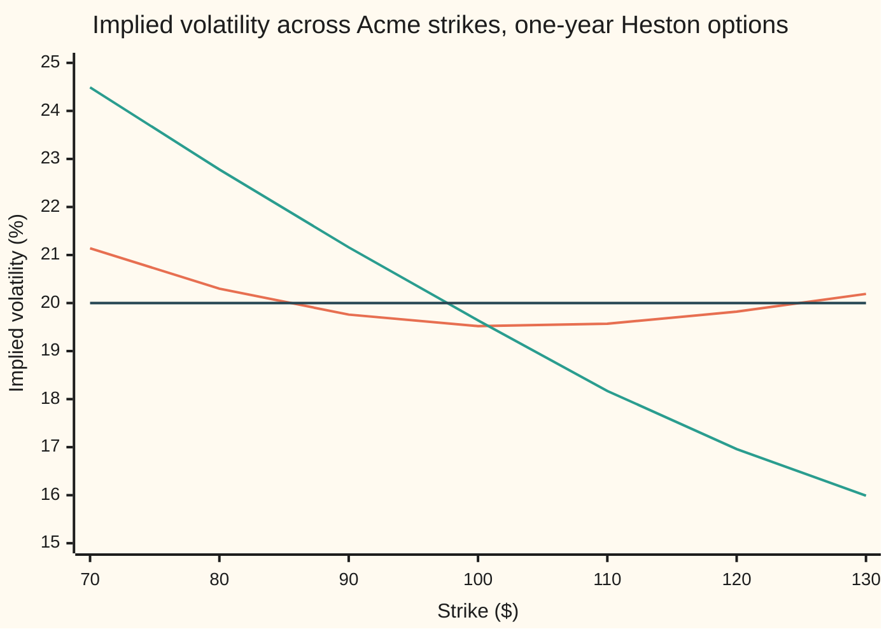
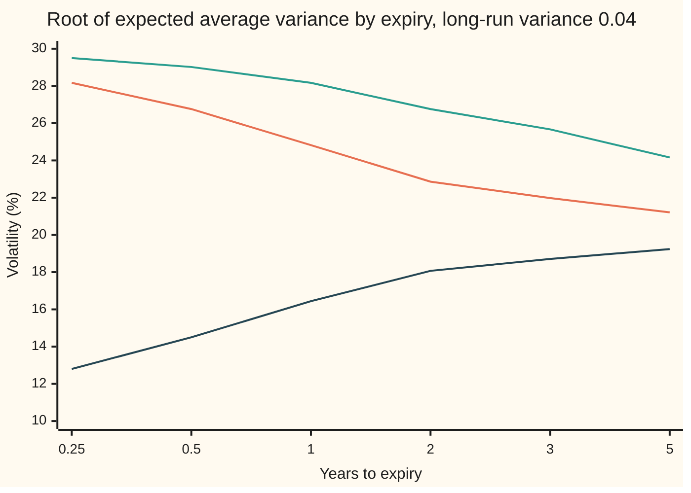

# The Heston model: variance that wanders and is pulled home, and which dial does what to the smile

[Syllabus](../../../SYLLABUS.md) → [Financial mathematics](../README.md) → [Stochastic volatility - Heston, SABR and their mix](../README.md#s14) → The Heston model

---

## General Overview

Acme shares trade at $100. A one-year call struck at $100, the right to buy one share for $100 in a year, costs $9.23 in the house market: riskless rate 5%, dividend yield 2%, volatility 20%. Volatility measures how widely the price swings in a year, and Black-Scholes holds it fixed. This card works with its square, the **variance**: 20% volatility is a variance of 0.04.

Suppose instead the year's variance is unknown. Three kinds of year are equally likely, with average variance 0.02, 0.04 and 0.06. Price the call in each with Black-Scholes: $7.01, $9.23 and $10.93, which average to $9.06. The variance still averages 0.04, yet the price fell: the stormy year adds less than the calm year takes away.

Steven Heston's 1993 model makes this continuous. Picture the variance as a dog on an elastic lead tied to a post: it wanders at random, and the further it strays, the harder the lead pulls it back. From here on the post is the **long-run variance**, the pull is **mean reversion**, and the size of the wandering is the **volatility of volatility** (vol of vol). With variance 0.04 today and in the long run, pull speed 2, vol of vol 0.3, and the share's moves independent of the variance's, 100,000 simulated years price the call at $9.05.

Now let the variance tend to rise when Acme falls, with correlation −0.7. Read each strike's price back as the Black-Scholes volatility that reproduces it (its implied volatility). The curve these volatilities trace across strikes, the **smile**, tilts: 24.49% at a $70 strike, 15.99% at $130.

**Heston lets variance wander and be pulled home; with independent moves an option is an average of Black-Scholes prices, the vol of vol bends the smile, the correlation tilts it, and the pull shapes how volatility changes with expiry.**

**What kind of fact this is:** a model: an assumption about how variance moves that fits option markets well enough, not a law. Inside it, the mixing formula is a theorem proved on this card in Why it works, and the Feller condition a theorem whose proof is folded there.

### The picture: one model, two correlations



The orange curve is correlation 0: a shallow smile, both ends above the middle. The green curve is correlation −0.7: the same variance, tilted down from low strikes to high. The dark line is Black-Scholes at a flat 20%. The points come from the mixing road in the code; the plain simulation agrees at every strike.

---

## The formula

Notation first. Over a short step of length dt, a d in front of a quantity is its change over the step. $W^1_t$ and $W^2_t$ are Brownian motions: each step adds an independent normal shove with mean zero and variance dt. Two shoves have correlation ρ when their product averages ρ dt. The first line is the geometric Brownian motion of Black-Scholes ([Geometric Brownian motion](../../11-Stochastic%20processes%20and%20calculus/05-Brownian%20Motion/07-geometric-brownian-motion.md)) with its fixed variance replaced by a moving one. Both lines describe the pricing world, where Acme grows on average at the riskless rate less its dividend yield.

$$dS_t = (r - q)\,S_t\,dt + \sqrt{v_t}\,S_t\,dW^1_t$$

$$dv_t = \kappa\,(\theta - v_t)\,dt + \xi\sqrt{v_t}\;dW^2_t, \qquad dW^1_t\,dW^2_t = \rho\,dt$$

**Read it aloud:** Acme's price grows at the riskless rate less the dividend and shakes by the square root of its variance; the variance is pulled toward its long-run level and shakes in proportion to its own square root; the two shakes are correlated.

The second line is the square-root process that Cox, Ingersoll and Ross wrote for interest rates ([Mean reversion](../../11-Stochastic%20processes%20and%20calculus/06-Ito%20Calculus/05-ornstein-uhlenbeck-and-cir-processes.md)). The whole model is these two lines and five numbers: today's variance $v_0$, the long-run variance $\theta$ (theta), the pull speed $\kappa$ (kappa), the vol of vol $\xi$ (xi) and the correlation $\rho$ (rho).

When the shakes are independent, ρ = 0, the price has a second form, the **mixing formula**:

$$C = \mathbb{E}\big[\,C_{\text{BS}}(I)\,\big], \qquad I = \int_0^T v_t\,dt = \bar v\,T$$

**Read it aloud:** the option is worth the Black-Scholes price at the year's total variance I, the average variance times the years, averaged over every way the variance can move.

The variance stays off zero under the **Feller condition**:

$$2\kappa\theta \;\ge\; \xi^2$$

**Read it aloud:** twice the pull speed times the long-run variance must be at least the square of the vol of vol. Here 0.1600 against 0.0900, so it holds.

| Symbol | Plain meaning | In our example | Push it up and the answer… |
| --- | --- | --- | --- |
| $S_t$, $S$ | Acme's price at time t; today | $100 | calls rise, puts fall |
| $K$, $T$ | strike; years to expiry | $70 to $130; 1 | K: calls fall, puts rise; T: the pull has longer to act |
| $r$, $q$, $F$ | riskless rate; dividend yield; forward $S e^{(r-q)T}$ | 5%, 2%, $103.05 | moves the smile's centre |
| $v_t$ | variance at time t: volatility squared | starts at 0.04 | — |
| $v_0$ | today's variance | 0.04, a 20% volatility | lifts short expiries most |
| $\theta$ | long-run variance, where the pull points | 0.04 | lifts long expiries most |
| $\kappa$ | pull speed: a gap to θ halves every ln 2/κ years | 2; half-life 0.3466 years | gets home sooner; shallower smile |
| $\xi$ | vol of vol: size of the variance's shake | 0.3 | bends the smile: middle down, wings up |
| $\rho$ | correlation of the two shakes | 0, then −0.7 | tilts: negative lifts low strikes |
| $W^1_t$, $W^2_t$, $W^\perp_t$ | the Brownian motions driving Acme and its variance; a third, independent of the variance (Step 5) | — | — |
| $\bar v$, $I$, $J$ | average variance over the life; total $I = \bar v\,T$; the variance's summed shake (Step 5) | $\bar v$: mean 0.040000, spread 0.018512 | a wider spread deepens the smile |
| $C$, $w$, $C_{\text{BS}}(w)$, $\mathbb{E}$ | the option's price; a total variance; the Black-Scholes call at it; the average over paths in the pricing world | 9.2270 at w = 0.04 | — |
| $d_1$, $d_2$, $\phi$ | Black-Scholes' two distances, as on the call card; the bell curve's height | 0.2500, 0.0500; φ(0.25) = 0.3867 | — |

### When it holds

- **Price and variance move continuously, with no jumps.** One-week equity options carry a steeper tilt than Heston's continuous paths can produce, which is why jump models ([Merton jump-diffusion](../13-Local%20volatility%20and%20jumps/04-merton-jump-diffusion.md)) and rough volatility exist.
- **Five constant numbers.** Refitted daily, κ, θ, ξ and ρ drift, and a hedge built on today's fit carries tomorrow's refit unhedged ([Heston Greeks and calibration](03-heston-greeks-and-calibration.md)).
- **The Feller condition, for a variance that never touches zero.** When it fails the variance touches zero and bounces off, and a simulation needs its clamp far more often: 5.4012% of steps at vol of vol 0.5, against 0.1707% here.
- **The plain mixing formula needs ρ = 0.** At ρ = −0.7 it returns the ρ = 0 smile (see What breaks); Step 5's shifted spot repairs it.
- **Pricing-world numbers.** The κ, θ, ξ and ρ that price options come from option prices, not the share's history; the two differ by the market's charge for variance risk.

---

## Why it works

### Step 0: a known variance path makes the share Black-Scholes

Black-Scholes needs one number: the total variance the share experiences over the option's life. In Heston that total is random. Suppose the variance's whole path were revealed in advance, and the share's shakes were independent of it. The shakes would have known sizes, a sum of independent normal shakes is normal, and the share would be lognormal (its log on a bell curve), exactly as in Black-Scholes. So price with Black-Scholes path by path, then average over the paths the variance might take. Every result on this card is a version of that idea.

### Step 1: the pull sets the level and the term structure

Average the variance equation over all paths. The shake averages to zero, so only the pull survives: the average variance changes at the rate κ(θ − average), and the gap to θ shrinks by the factor $e^{-\kappa t}$. Averaging over the life:

$$\mathbb{E}[v_t] = \theta + (v_0 - \theta)\,e^{-\kappa t}, \qquad \mathbb{E}[\bar v] = \theta + (v_0 - \theta)\,\frac{1 - e^{-\kappa T}}{\kappa T}$$

With $v_0 = \theta = 0.04$ this is 0.040000; the simulation gives 0.040085, standard error 0.000059.

So κ and θ set the **term structure**, how at-the-money volatility (strike at today's price) changes with expiry. Start the variance away from θ and the square root of $\mathbb{E}[\bar v]$ travels from $\sqrt{v_0}$ toward $\sqrt{\theta}$:



Orange: start at variance 0.09, pull speed 2. Green: the same start, pull speed 0.5. Dark: start at 0.01, pull speed 2. All head for the long-run level; θ sets where, κ how fast. Stepping the averaged equation forward in 100,000 small steps, instead of solving it, lands within 0.00000009 of the formula at every point. At-the-money implied volatility sits a little below these curves, because the vol of vol shaves the smile's middle (Step 4): with $v_0 = \theta$ the curve is flat at 20%, and the simulated $100 strike reads 19.52%.

### Step 2: the square root keeps variance off zero

As the variance nears zero, its shake, sized by $\sqrt{v_t}$, shrinks toward nothing, while the pull toward θ stays near its full strength κθ. Near zero the push upward wins. Whether it wins completely is the Feller condition: when $2\kappa\theta \ge \xi^2$, zero is never reached; when it fails, the variance touches zero and bounces off.

<details>
<summary>Detailed proof: when zero is out of reach</summary>

Look for a function s that turns the variance into a process with no drift. By Itô's lemma (the chain rule for random paths), s(v) changes by $s'\,dv + \tfrac12 s''\,\xi^2 v\,dt$, whose drift is $s'\kappa(\theta - v) + \tfrac12 s''\xi^2 v$. Setting that to zero gives $s''/s' = -2\kappa(\theta - v)/(\xi^2 v)$, so
$$s'(v) = v^{-a}\,e^{2\kappa v/\xi^2}, \qquad a = \frac{2\kappa\theta}{\xi^2}.$$
Take a small level ε below today's variance and a large level b above it. Until the variance touches either, s of the variance has no drift and stays bounded, so its average keeps its starting value, which pins the chance of touching ε first:
$$\Pr(\varepsilon \text{ before } b) = \frac{s(b) - s(v_0)}{s(b) - s(\varepsilon)}.$$
Near zero, s′ behaves like $v^{-a}$, and its integral up from ε grows without limit as ε shrinks exactly when a ≥ 1. Then s(ε) runs off to minus infinity and the chance falls to zero, for every b. A continuous path stays bounded over a finite time, so a path that reaches zero does so before some level b; each such chance is zero, so reaching zero has chance zero. When a < 1, s(0) is finite and the chance is positive. Here a = 0.1600 / 0.0900, comfortably above 1.

</details>

The condition governs the model, not the simulation: a simulated step adds a normal shock, which has no floor, so the code clamps a negative variance to zero before use (full truncation). With the condition holding, 0.1707% of steps still needed the clamp.

### Step 3: with independent shakes, the price is an average of Black-Scholes prices

By Itô's lemma, the chain rule for random paths, the log of Acme's price moves by (r − q − ½$v_t$) dt + $\sqrt{v_t}$ d$W^1_t$ in each step. Add the steps over the life:

$$\ln S_T = \ln S + (r - q)\,T - \tfrac12 I + \int_0^T \sqrt{v_t}\;dW^1_t$$

Fix the variance path. With ρ = 0 the shoves d$W^1_t$ are independent of it, so the last term is a sum of independent normal pieces with variances $v_t$ dt: normal, with mean zero and variance I. Given the path, the log price is normal with total variance I, which is Black-Scholes, so the price given the path is $C_{\text{BS}}(I)$. Averaging first given the path and then over paths gives the same answer as averaging at once. That is the mixing formula, published by Hull and White in 1987.

What the simulation averages over: the year's average volatility, the square root of $\bar v$, across 100,000 simulated years.

```
average volatility over the year, % of simulated years   (one █ = 1%)
  below 15%   ████████████████    15.61
  15 to 17%   ████████████████    15.87
  17 to 19%   ██████████████████  17.63
  19 to 21%   ████████████████    16.45
  21 to 23%   █████████████       13.31
  23 to 25%   █████████            9.30
  25% and up  ████████████        11.84
```

Each year contributes its own Black-Scholes price. The spread of $\bar v$ is 0.018512 by formula (Step 4), 0.018636 simulated.

The plain road simulates Acme's price too and averages discounted payoffs. Both price the $100 call alike: 9.0470 (standard error 0.0053) by mixing, 9.0145 (standard error 0.0444) plain. Mixing is far less noisy because the formula averages the share's own shake exactly.

### Step 4: the vol of vol bends the smile

Why is $9.05 below $9.23? The Black-Scholes price curves as total variance grows. With φ the bell curve's height, and d1 and d2 as on [Black–Scholes call](../08-The%20Black-Scholes%20call%20and%20put/01-black-scholes-call.md), its slope and bend in w are

$$\frac{\partial C_{\text{BS}}}{\partial w} = \frac{S e^{-qT}\,\phi(d_1)}{2\sqrt{w}}, \qquad \frac{\partial^2 C_{\text{BS}}}{\partial w^2} = \frac{\partial C_{\text{BS}}}{\partial w}\cdot\frac{d_1 d_2 - 1}{2w}.$$

Near the money d1 times d2 is small and the bend is negative, so averaging over a spread of variances gives less than the price at the average. Far out in either wing d1 times d2 exceeds 1, the bend is positive, and averaging gives more. Down in the middle, up at the ends: a smile, deeper as the spread of $\bar v$ grows with ξ.

A Taylor expansion (the price replaced by its value, slope and bend at the mean) turns this into a third road, the **Hull-White expansion**:

$$C \approx C_{\text{BS}}\big(\mathbb{E}[I]\big) + \tfrac12\,\frac{\partial^2 C_{\text{BS}}}{\partial w^2}\,\mathrm{Var}(I), \qquad \mathrm{Var}(I) = \frac{\theta\xi^2}{\kappa^2}\Big[T - \frac{1 - e^{-2\kappa T}}{2\kappa} - \frac{1 - e^{-\kappa T}}{\kappa} + \frac{e^{-\kappa T}(1 - e^{-\kappa T})}{\kappa}\Big]$$

The variance formula holds when $v_0 = \theta$, the house case. Across the strip the expansion tracks the mixing road: 20.31% against 20.30% at $80, 19.47% against 19.52% at $100, 20.18% against 20.19% at $130. The terms it drops grow quickly with the spread (see Try changing).

<details>
<summary>The algebra behind the Hull-White road</summary>

**The spread of I.** With $v_0 = \theta$ the average variance stays θ at every time. Itô's lemma on $(v - \theta)^2$ shows its average m(s) changes at the rate $-2\kappa m + \xi^2\theta$, so $m(s) = \theta\xi^2(1 - e^{-2\kappa s})/(2\kappa)$. Given the path up to time s, the variance at a later time t averages $\theta + (v_s - \theta)e^{-\kappa(t-s)}$, so the covariance of the two is $m(s)\,e^{-\kappa(t-s)}$. Var(I) is that covariance integrated over both times, which is twice the integral over s < t:
$$\mathrm{Var}(I) = 2\int_0^T m(s)\,\frac{1 - e^{-\kappa(T-s)}}{\kappa}\,ds,$$
and multiplying out the two brackets gives the four terms above.

**The bend.** With F the forward, $d_1 = \ln(F/K)/\sqrt{w} + \sqrt{w}/2$, so the rate of change of d1 in w is $-d_2/(2w)$. Differentiating the slope, and using $\phi'(x) = -x\,\phi(x)$, gives the bend: the slope times $(d_1 d_2 - 1)/(2w)$.

**The expansion.** Averaged, the slope term vanishes, since I minus its mean averages zero, leaving half the bend times Var(I). The first dropped term carries the lopsidedness of I, which grows with ξ.

</details>

### Step 5: the correlation tilts the smile

Split the share's shove into the part it shares with the variance and the rest: d$W^1_t$ = ρ d$W^2_t$ + $\sqrt{1-\rho^2}$ d$W^\perp_t$, with $W^\perp$ a third Brownian motion independent of the variance. The shared part is fixed by the variance path; rearranging the variance equation reads it off:

$$J = \int_0^T \sqrt{v_t}\;dW^2_t = \frac{v_T - v_0 - \kappa\theta T + \kappa I}{\xi}$$

Given the path, the log price is still normal, now with its centre moved by $\rho J - \tfrac12\rho^2 I$ and its variance cut to $(1-\rho^2)\,I$. That is Black-Scholes again, at a shifted spot:

$$C = \mathbb{E}\Big[\,C_{\text{BS}}\big(S\,e^{\rho J - \frac12\rho^2 I},\;(1-\rho^2)\,I\big)\Big]$$

With ρ = −0.7, a year in which the variance rose has J above zero and so a lower effective spot: high variance and low prices arrive together. Low-strike puts grow dear, 22.78% at $80 against 20.30% at ρ = 0; high-strike calls lose their stormy years' upside, 16.96% at $120 against 19.82%. The plain simulation, which never uses this formula, agrees at every strike within its error.

<details>
<summary>The algebra behind the shifted spot</summary>

Substitute the split shove into the sum from Step 3:
$$\ln S_T = \ln S + (r - q)T - \tfrac12 I + \rho J + \sqrt{1-\rho^2}\int_0^T \sqrt{v_t}\;dW^\perp_t.$$
Given the variance path, the last term is normal with variance $(1-\rho^2)\,I$. Since $-\tfrac12 I = -\tfrac12\rho^2 I - \tfrac12(1-\rho^2)\,I$, the rest regroups as $\ln\big(S e^{\rho J - \frac12\rho^2 I}\big) + (r - q)T - \tfrac12(1-\rho^2)\,I$: the Black-Scholes log price for the shifted spot. The $-\tfrac12\rho^2 I$ keeps that spot's average at S. In the simulation the J identity holds step for step, clamp included.

</details>

Heston's own road prices every strike exactly, with one integral and no simulation, through the characteristic function, a transform of the log price's distribution: [Pricing Heston exactly](02-heston-pricing-by-characteristic-function.md).

---

## Worked numbers, by hand

The $100 call at ρ = 0, by the Hull-White expansion.

| Step | Arithmetic | Value |
| --- | --- | --- |
| expected average variance | $\theta + (v_0 - \theta)(1 - e^{-2})/2$, with $v_0 = \theta$ | 0.040000 |
| Black-Scholes at it | the house call | 9.2270 |
| d1 and d2 | at 20% for one year | 0.2500 and 0.0500 |
| bell height at d1 | $\phi(0.25)$ | 0.3867 |
| slope in total variance | $100 \times e^{-0.02} \times 0.3867 / (2 \times 0.20)$ | 94.75 |
| bend | $94.75 \times (0.25 \times 0.05 - 1) / (2 \times 0.04)$ | −1169.6 |
| bracket | $1 - (1 - e^{-4})/4 - (1 - e^{-2})/2 + e^{-2}(1 - e^{-2})/2$ | 0.380756 |
| Var(I) | $0.04 \times 0.09 / 4 \times 0.380756$ | 0.00034268 |
| correction | $\tfrac12 \times (-1169.6) \times 0.00034268$ | −0.2004 |
| **Hull-White price** | 9.2270 − 0.2004 | **9.0266** |
| mixing road, for comparison | 100,000 simulated years | 9.0470, standard error 0.0053 |

Uncertainty about the year's variance, with its average unchanged, takes about 20 cents off the at-the-money call.

### What breaks if you drop a piece

| Mistake | Comes out at | What went wrong |
| --- | --- | --- |
| Black-Scholes at the average variance | 9.2270 (right: 9.0470) | the price curves in variance; the price at the average is not the average price |
| The variance at expiry in place of the life's average | 8.7226 | the share feels the whole path's variance; the endpoint is more spread out |
| The plain mixing formula at ρ = −0.7 | 20.30% at $80, 19.82% at $120 (right: 22.78%, 16.96%) | without the shifted spot, the link between variance and price, and the tilt, vanish |
| Variance 0.04 fed in where a volatility belongs | 3.4035 | that is Black-Scholes at 4% volatility |

---

## Code, from first principles, and it actually runs

The code simulates 100,000 one-year variance paths of 50 steps, with its own random-number generator. Road 1, the mixing formula, prices every strike by Black-Scholes at each path's total variance, and at ρ = −0.7 at each path's shifted spot. Road 2, plain Monte Carlo, simulates Acme's price on fresh paths and averages payoffs. Road 3, the Hull-White expansion, simulates nothing. The term-structure curves get a second road too: the averaged variance equation, stepped forward. Each strike uses its out-of-the-money option (the put below the forward of $103.05, the call above), where simulation noise is smallest. Bisection turns prices into implied volatilities: a Black-Scholes price rises strictly with volatility, so each price has exactly one, and the code asserts it lies between the prices at 1% and 100%.

### Python

```python
# The Heston model -- the check behind the card.  Standard library only: the normal CDF is its
# own series, random numbers are splitmix64 made normal by the polar method, implied vols come
# from bisection.  rho = 0 by three roads: (1) Black-Scholes averaged over simulated average
# variance, (2) plain Monte Carlo, (3) the Hull-White expansion.  rho = -0.7 by two roads.
from math import log, exp, sqrt, pi
S, r, q, T = 100.0, 0.05, 0.02, 1.0                # the house market: Acme, one year
V0, THETA, KAPPA, XI, RHO = 0.04, 0.04, 2.0, 0.3, -0.7
STRIKES = [70.0, 80.0, 90.0, 100.0, 110.0, 120.0, 130.0]
PATHS, STEPS = 100000, 50
FWD, DT, M64 = S * exp((r - q) * T), T / STEPS, (1 << 64) - 1

def mean_vbar(v0, k, t): return THETA + (v0 - THETA) * (1.0 - exp(-k * t)) / (k * t)   # E of average variance
def stepped_vbar(v0, k, t, n=100000):              # the same, by stepping d E[v] = kappa (theta - E[v]) dt
    m, acc, h = v0, 0.0, t / n
    for _ in range(n): acc += m * h; m += k * (THETA - m) * h
    return acc / t
def N(x):                                          # normal CDF: 1/2 + phi(x)(x + x^3/3 + x^5/15 + ...)
    if abs(x) > 9.0: return 1.0 if x > 0.0 else 0.0
    term, total, n = x, x, 1
    while abs(term) > 1e-17:
        term *= x * x / (2 * n + 1); total += term; n += 1
    return 0.5 + exp(-0.5 * x * x) / sqrt(2.0 * pi) * total
def bs(s, k, w, put=False):                        # Black-Scholes; w = total variance over the life
    sd = sqrt(w); d1 = (log(s / k) + (r - q) * T + 0.5 * w) / sd
    call = s * exp(-q * T) * N(d1) - k * exp(-r * T) * N(d1 - sd)
    return call - s * exp(-q * T) + k * exp(-r * T) if put else call
def implied(price, k, put):                        # bisection: price rises with sigma, so one sigma fits
    assert bs(S, k, 1e-4 * T, put) < price < bs(S, k, T, put), "price inside the bracket, 1% to 100%"
    lo, hi = 0.01, 1.0
    for _ in range(60): mid = 0.5 * (lo + hi); lo, hi = (mid, hi) if bs(S, k, mid * mid * T, put) < price else (lo, mid)
    return 0.5 * (lo + hi)
def normals(seed):                                 # splitmix64 uniforms on (-1, 1), polar method
    state = seed
    def uniform():
        nonlocal state
        state = (state + 0x9E3779B97F4A7C15) & M64
        z = ((state ^ (state >> 30)) * 0xBF58476D1CE4E5B9) & M64
        z = ((z ^ (z >> 27)) * 0x94D049BB133111EB) & M64
        return 2.0 * ((z ^ (z >> 31)) >> 11) / 9007199254740992.0 - 1.0
    while True:
        a, b = uniform(), uniform(); s = a * a + b * b
        if 0.0 < s < 1.0:
            f = sqrt(-2.0 * log(s) / s); yield a * f; yield b * f
class Acc:                                         # running mean and standard error
    def __init__(self): self.n, self.s, self.s2 = 0, 0.0, 0.0
    def add(self, x): self.n += 1; self.s += x; self.s2 += x * x
    def mean(self): return self.s / self.n
    def se(self): return sqrt((self.s2 - self.n * self.mean() * self.mean()) / (self.n - 1) / self.n)
def variance_path(nxt, xi):                        # full-truncation Euler: v_T, I = sum of v dt, cut steps
    v, I, cut = V0, 0.0, 0
    for _ in range(STEPS):
        vp = v if v > 0.0 else 0.0; cut += v <= 0.0
        I += vp * DT
        v += KAPPA * (THETA - vp) * DT + xi * sqrt(vp * DT) * nxt()
    return v, I, cut
def mixing_road(seed, xi, paths):                  # road 1: variance paths only, then Black-Scholes
    nxt = normals(seed).__next__
    mix0, mix7, plus7 = [Acc() for _ in STRIKES], [Acc() for _ in STRIKES], [Acc(), Acc()]
    atm, term, avg, hist, cut = Acc(), Acc(), Acc(), [0] * 7, 0
    for _ in range(paths):
        vT, I, c = variance_path(nxt, xi); cut += c
        J = (vT - V0 - KAPPA * THETA * T + KAPPA * I) / xi     # the variance's own noise, read off its path
        avg.add(I / T); atm.add(bs(S, 100.0, I)); term.add(bs(S, 100.0, max(vT, 1e-10) * T))
        hist[min(6, max(0, int((sqrt(I / T) * 100.0 - 13.0) / 2.0)))] += 1
        s7 = S * exp(RHO * J - 0.5 * RHO * RHO * I)             # rho = -0.7: the spot shifted by that noise
        for j, k in enumerate(STRIKES):
            mix0[j].add(bs(S, k, I, k < FWD)); mix7[j].add(bs(s7, k, (1.0 - RHO * RHO) * I, k < FWD))
        for j, k in enumerate((80.0, 120.0)):                    # try: rho = +0.7 on the same paths
            plus7[j].add(bs(S * exp(0.7 * J - 0.245 * I), k, 0.51 * I, k < FWD))
    return mix0, mix7, plus7, atm, term, avg, hist, cut
def var_I(xi):                                     # exact variance of I when v0 = theta (the house case)
    e1, e2 = exp(-KAPPA * T), exp(-2.0 * KAPPA * T)
    bracket = T - (1.0 - e2) / (2.0 * KAPPA) - (1.0 - e1) / KAPPA + e1 * (1.0 - e1) / KAPPA
    return THETA * xi * xi / (KAPPA * KAPPA) * bracket, bracket
def hull_white(k, put, var):                       # road 3: Black-Scholes at the mean, plus half the bend times var
    w = THETA * T; sd = sqrt(w); d1 = (log(S / k) + (r - q) * T + 0.5 * w) / sd
    cw = S * exp(-q * T) * exp(-0.5 * d1 * d1) / sqrt(2.0 * pi) / (2.0 * sd)
    cww = cw * (d1 * (d1 - sd) - 1.0) / (2.0 * w)
    return bs(S, k, w, put) + 0.5 * cww * var, d1, cw, cww
mix0, mix7, plus7, atm, term, avg, hist, cut = mixing_road(1, XI, PATHS)
atm6, cut5 = mixing_road(4, 0.6, 20000)[3], mixing_road(3, 0.5, 20000)[7]
nxt, c, disc = normals(2).__next__, sqrt(1.0 - RHO * RHO), exp(-r * T)
pl0, pl7, atm_plain = [Acc() for _ in STRIKES], [Acc() for _ in STRIKES], Acc()
for _ in range(PATHS):                             # road 2: price and variance simulated together
    v, x0, x7 = V0, log(S), log(S)
    for _ in range(STEPS):
        vp = v if v > 0.0 else 0.0
        sd, z2, zp = sqrt(vp * DT), nxt(), nxt()
        x0 += (r - q - 0.5 * vp) * DT + sd * zp                    # rho = 0: its own noise only
        x7 += (r - q - 0.5 * vp) * DT + sd * (RHO * z2 + c * zp)   # rho = -0.7: shares the variance's
        v += KAPPA * (THETA - vp) * DT + XI * sd * z2
    s0, s7 = exp(x0), exp(x7); atm_plain.add(disc * max(s0 - 100.0, 0.0))
    for j, k in enumerate(STRIKES):
        pl0[j].add(disc * (max(k - s0, 0.0) if k < FWD else max(s0 - k, 0.0)))
        pl7[j].add(disc * (max(k - s7, 0.0) if k < FWD else max(s7 - k, 0.0)))
(vI, bracket), sd_sim = var_I(XI), avg.se() * sqrt(PATHS)
(hw, d1, cw, cww), iv0, iv7 = hull_white(100.0, False, vI), [], []
toy = [bs(S, 100.0, w) for w in (0.02, 0.04, 0.06)]
print(f"house call at 20%, own normal CDF; forward    {bs(S, 100.0, 0.04):10.6f}; {FWD:.4f}")
print(f"Feller 2 kappa theta, xi^2; half-life, years  {2 * KAPPA * THETA:10.4f} {XI * XI:.4f}; {log(2.0) / KAPPA:.4f}")
print(f"average variance: formula, simulated, se      {mean_vbar(V0, KAPPA, T):10.6f} {avg.mean():.6f} {avg.se():.6f}")
print(f"its sd: formula, simulated                    {sqrt(vI) / T:10.6f} {sd_sim:.6f}")
print(f"truncated steps, %: xi = 0.3, xi = 0.5        {100.0 * cut / (PATHS * STEPS):10.4f} {100.0 * cut5 / (20000 * STEPS):.4f}")
print(f"average vol over the year, % of {PATHS} years:")
for j, lab in enumerate(["below 15%", "15 to 17%", "17 to 19%", "19 to 21%", "21 to 23%", "23 to 25%", "25% and up"]):
    print(f"  {lab:<12}{100.0 * hist[j] / PATHS:6.2f}")
print(f"years at variance 0.02, 0.04, 0.06; average   {toy[0]:10.4f} {toy[1]:.4f} {toy[2]:.4f}; {(toy[0] + toy[1] + toy[2]) / 3.0:.4f}")
print(f"rho = 0, 100 call: mixing, plain; se          {atm.mean():10.4f} {atm_plain.mean():.4f}; {atm.se():.4f} {atm_plain.se():.4f}")
print(f"Hull-White: d1, d2, phi(d1), C_w, C_ww        {d1:10.4f} {d1 - sqrt(THETA * T):.4f} {exp(-0.5 * d1 * d1) / sqrt(2.0 * pi):.4f} {cw:.2f} {cww:.1f}")
print(f"Hull-White: bracket, var I, correction, price {bracket:10.6f} {vI:.8f} {0.5 * cww * vI:.4f} {hw:.4f}")
for rho, mix, pl, ivs in ((0.0, mix0, pl0, iv0), (RHO, mix7, pl7, iv7)):
    print(f"rho = {rho:4.1f}:  K opt    mixing     se    plain     se   vol: mix plain" + ("   H-W" if rho == 0.0 else ""))
    for j, k in enumerate(STRIKES):
        p, a, b = k < FWD, mix[j], pl[j]
        ivs.append([implied(a.mean(), k, p), implied(b.mean(), k, p)] + ([implied(hull_white(k, p, vI)[0], k, p)] if rho == 0.0 else []))
        print(f"          {k:4.0f} {'put ' if p else 'call'} {a.mean():8.4f} {a.se():.4f} {b.mean():8.4f} {b.se():.4f}" + "".join(f" {100 * v:6.2f}" for v in ivs[j]))
print("root of expected average variance, %: T; v0 .09 kappa 2; v0 .09 kappa .5; v0 .01 kappa 2")
for t in (0.25, 0.5, 1.0, 2.0, 3.0, 5.0):
    ts = [100.0 * sqrt(mean_vbar(v, k, t)) for v, k in ((0.09, 2.0), (0.09, 0.5), (0.01, 2.0))]
    print(f"  {t:4.2f} {ts[0]:6.2f} {ts[1]:6.2f} {ts[2]:6.2f}")
gap = max(abs(mean_vbar(v, k, t) - stepped_vbar(v, k, t)) for t in (0.25, 0.5, 1.0, 2.0, 3.0, 5.0) for v, k in ((0.09, 2.0), (0.09, 0.5), (0.01, 2.0)))
print(f"term structure: formula against stepping, largest gap  {gap:.8f}")
print(f"wrong: Black-Scholes at the average variance  {bs(S, 100.0, mean_vbar(V0, KAPPA, T) * T):.4f}")
print(f"wrong: terminal variance, not the average     {term.mean():.4f}")
print(f"wrong: rho ignored, vol at 80 and 120         {100 * iv0[1][0]:.2f} {100 * iv0[5][0]:.2f}")
print(f"wrong: variance 0.04 fed in as the vol        {bs(S, 100.0, 0.04 * 0.04 * T):.4f}")
print(f"try: rho = +0.7, vol at 80 and 120            {100 * implied(plus7[0].mean(), 80.0, True):.2f} {100 * implied(plus7[1].mean(), 120.0, False):.2f}")
print(f"try: xi = 0.6: sd of average variance; mixing, se, Hull-White  {sqrt(var_I(0.6)[0]) / T:.6f}; {atm6.mean():.4f} {atm6.se():.4f} {hull_white(100.0, False, var_I(0.6)[0])[0]:.4f}")
assert abs(bs(S, 100.0, 0.04) - 9.227005508154) < 1e-9, "own normal CDF against the house call"
assert abs(avg.mean() - mean_vbar(V0, KAPPA, T)) < 3.0 * avg.se(), "simulated average variance against its formula"
assert gap < 1e-6, "term structure: formula against stepping the averaged equation"
assert abs(sd_sim / (sqrt(vI) / T) - 1.0) < 0.02, "simulated spread of average variance against its formula"
assert abs(atm.mean() - atm_plain.mean()) < 3.0 * sqrt(atm.se() ** 2 + atm_plain.se() ** 2), "road 1 against road 2"
for mix, pl in ((mix0, pl0), (mix7, pl7)):
    for a, b in zip(mix, pl): assert abs(a.mean() - b.mean()) < 3.0 * sqrt(a.se() ** 2 + b.se() ** 2), "mixing against plain"
assert abs(hw - atm.mean()) < 0.05, "road 3, the Hull-White expansion, against road 1"
assert atm.se() < atm_plain.se() / 5.0, "mixing removes most of the noise"
assert all(iv7[j][i] > iv7[j + 1][i] for j in range(6) for i in (0, 1)), "rho = -0.7: vol falls with strike"
assert iv0[0][0] > iv0[3][0] < iv0[6][0], "rho = 0: both wings above the middle"
print("ALL CHECKS PASS")
```

**Ran 2026-09-24 on macOS, Python 3.14.6, standard library only. All checks passed. Output, pasted from the run:**

```
house call at 20%, own normal CDF; forward      9.227006; 103.0455
Feller 2 kappa theta, xi^2; half-life, years      0.1600 0.0900; 0.3466
average variance: formula, simulated, se        0.040000 0.040085 0.000059
its sd: formula, simulated                      0.018512 0.018636
truncated steps, %: xi = 0.3, xi = 0.5            0.1707 5.4012
average vol over the year, % of 100000 years:
  below 15%    15.61
  15 to 17%    15.87
  17 to 19%    17.63
  19 to 21%    16.45
  21 to 23%    13.31
  23 to 25%     9.30
  25% and up   11.84
years at variance 0.02, 0.04, 0.06; average       7.0142 9.2270 10.9321; 9.0578
rho = 0, 100 call: mixing, plain; se              9.0470 9.0145; 0.0053 0.0444
Hull-White: d1, d2, phi(d1), C_w, C_ww            0.2500 0.0500 0.3867 94.75 -1169.6
Hull-White: bracket, var I, correction, price   0.380756 0.00034268 -0.2004 9.0266
rho =  0.0:  K opt    mixing     se    plain     se   vol: mix plain   H-W
            70 put    0.2257 0.0009   0.2211 0.0049  21.14  21.07  21.30
            80 put    0.8893 0.0022   0.8818 0.0105  20.30  20.25  20.31
            90 put    2.6441 0.0040   2.6304 0.0190  19.76  19.71  19.70
           100 put    6.1500 0.0053   6.1374 0.0292  19.52  19.49  19.47
           110 call   5.0252 0.0054   5.0006 0.0351  19.57  19.51  19.52
           120 call   2.6548 0.0044   2.6355 0.0266  19.82  19.76  19.77
           130 call   1.3726 0.0032   1.3659 0.0198  20.19  20.16  20.18
rho = -0.7:  K opt    mixing     se    plain     se   vol: mix plain
            70 put    0.4802 0.0054   0.4844 0.0084  24.49  24.53
            80 put    1.3140 0.0100   1.3112 0.0147  22.78  22.76
            90 put    3.0541 0.0164   3.0436 0.0232  21.16  21.12
           100 put    6.1945 0.0241   6.1892 0.0331  19.64  19.63
           110 call   4.4944 0.0118   4.4812 0.0256  18.17  18.13
           120 call   1.8037 0.0054   1.7910 0.0159  16.96  16.91
           130 call   0.5718 0.0018   0.5720 0.0087  15.99  15.99
root of expected average variance, %: T; v0 .09 kappa 2; v0 .09 kappa .5; v0 .01 kappa 2
  0.25  28.17  29.50  12.80
  0.50  26.76  29.02  14.50
  1.00  24.82  28.17  16.44
  2.00  22.86  26.76  18.07
  3.00  21.98  25.67  18.71
  5.00  21.21  24.16  19.24
term structure: formula against stepping, largest gap  0.00000009
wrong: Black-Scholes at the average variance  9.2270
wrong: terminal variance, not the average     8.7226
wrong: rho ignored, vol at 80 and 120         20.30 19.82
wrong: variance 0.04 fed in as the vol        3.4035
try: rho = +0.7, vol at 80 and 120            16.28 22.01
try: xi = 0.6: sd of average variance; mixing, se, Hull-White  0.037023; 8.6644 0.0212 8.4254
ALL CHECKS PASS
```

### Rust

Same numbers, same labels, built with `rustc --edition 2021 -O`.

```rust
// The Heston model -- the same check as the Python, in Rust.  No crates: the normal CDF is its
// own series, random numbers are splitmix64 made normal by the polar method, implied vols come
// from bisection.  rho = 0 by three roads: (1) Black-Scholes averaged over simulated average
// variance, (2) plain Monte Carlo, (3) the Hull-White expansion.  rho = -0.7 by two roads.
use std::f64::consts::PI;
const S: f64 = 100.0; const R: f64 = 0.05; const Q: f64 = 0.02; const T: f64 = 1.0;
const V0: f64 = 0.04; const THETA: f64 = 0.04; const KAPPA: f64 = 2.0; const XI: f64 = 0.3; const RHO: f64 = -0.7;
const STRIKES: [f64; 7] = [70.0, 80.0, 90.0, 100.0, 110.0, 120.0, 130.0];
const PATHS: usize = 100000; const STEPS: usize = 50; const DT: f64 = T / STEPS as f64;
fn mean_vbar(v0: f64, k: f64, t: f64) -> f64 { THETA + (v0 - THETA) * (1.0 - (-k * t).exp()) / (k * t) }
fn stepped_vbar(v0: f64, k: f64, t: f64) -> f64 {  // the same, by stepping d E[v] = kappa (theta - E[v]) dt
    let h = t / 100000.0;
    (0..100000).fold((v0, 0.0), |(m, acc), _| (m + k * (THETA - m) * h, acc + m * h)).1 / t
}
fn n_cdf(x: f64) -> f64 {                          // 1/2 + phi(x)(x + x^3/3 + x^5/15 + ...)
    if x.abs() > 9.0 { return if x > 0.0 { 1.0 } else { 0.0 }; }
    let (mut term, mut total, mut n) = (x, x, 1.0);
    while term.abs() > 1e-17 { term *= x * x / (2.0 * n + 1.0); total += term; n += 1.0; }
    0.5 + (-0.5 * x * x).exp() / (2.0 * PI).sqrt() * total
}
fn bs(s: f64, k: f64, w: f64, put: bool) -> f64 {  // Black-Scholes; w = total variance over the life
    let sd = w.sqrt();
    let d1 = ((s / k).ln() + (R - Q) * T + 0.5 * w) / sd;
    let call = s * (-Q * T).exp() * n_cdf(d1) - k * (-R * T).exp() * n_cdf(d1 - sd);
    if put { call - s * (-Q * T).exp() + k * (-R * T).exp() } else { call }
}
fn implied(price: f64, k: f64, put: bool) -> f64 {  // bisection: price rises with sigma, so one sigma fits
    assert!(bs(S, k, 1e-4 * T, put) < price && price < bs(S, k, T, put), "price inside the bracket, 1% to 100%");
    let (mut lo, mut hi) = (0.01, 1.0);
    for _ in 0..60 { let mid = 0.5 * (lo + hi); if bs(S, k, mid * mid * T, put) < price { lo = mid } else { hi = mid } }
    0.5 * (lo + hi)
}
struct Normals { state: u64, spare: Option<f64> }  // splitmix64 uniforms on (-1, 1), polar method
impl Normals {
    fn uniform(&mut self) -> f64 {
        self.state = self.state.wrapping_add(0x9E3779B97F4A7C15);
        let z = (self.state ^ (self.state >> 30)).wrapping_mul(0xBF58476D1CE4E5B9);
        let z = (z ^ (z >> 27)).wrapping_mul(0x94D049BB133111EB);
        2.0 * ((z ^ (z >> 31)) >> 11) as f64 / 9007199254740992.0 - 1.0
    }
    fn next(&mut self) -> f64 {
        if let Some(b) = self.spare.take() { return b; }
        loop {
            let (a, b) = (self.uniform(), self.uniform()); let s = a * a + b * b;
            if s > 0.0 && s < 1.0 { let f = (-2.0 * s.ln() / s).sqrt(); self.spare = Some(b * f); return a * f; }
        }
    }
}
#[derive(Clone, Copy)] struct Acc { n: f64, s: f64, s2: f64 }              // running mean and standard error
impl Acc {
    fn new() -> Acc { Acc { n: 0.0, s: 0.0, s2: 0.0 } }
    fn add(&mut self, x: f64) { self.n += 1.0; self.s += x; self.s2 += x * x; }
    fn mean(&self) -> f64 { self.s / self.n }
    fn se(&self) -> f64 { ((self.s2 - self.n * self.mean() * self.mean()) / (self.n - 1.0) / self.n).sqrt() }
}
fn variance_path(g: &mut Normals, xi: f64) -> (f64, f64, usize) {  // full-truncation Euler
    let (mut v, mut i, mut cut) = (V0, 0.0, 0);
    for _ in 0..STEPS {
        let vp = if v > 0.0 { v } else { 0.0 }; if v <= 0.0 { cut += 1; }
        i += vp * DT;
        v += KAPPA * (THETA - vp) * DT + xi * (vp * DT).sqrt() * g.next();
    }
    (v, i, cut)
}
struct Mix { mix0: Vec<Acc>, mix7: Vec<Acc>, plus7: Vec<Acc>, atm: Acc, term: Acc, avg: Acc, hist: [usize; 7], cut: usize }
fn mixing_road(seed: u64, xi: f64, paths: usize, fwd: f64) -> Mix {  // road 1: variance paths, then Black-Scholes
    let mut g = Normals { state: seed, spare: None };
    let mut m = Mix { mix0: vec![Acc::new(); 7], mix7: vec![Acc::new(); 7], plus7: vec![Acc::new(); 2],
                      atm: Acc::new(), term: Acc::new(), avg: Acc::new(), hist: [0; 7], cut: 0 };
    for _ in 0..paths {
        let (vt, i, c) = variance_path(&mut g, xi); m.cut += c;
        let j_noise = (vt - V0 - KAPPA * THETA * T + KAPPA * i) / xi;   // the variance's own noise
        m.avg.add(i / T); m.atm.add(bs(S, 100.0, i, false)); m.term.add(bs(S, 100.0, vt.max(1e-10) * T, false));
        m.hist[((((i / T).sqrt() * 100.0 - 13.0) / 2.0) as i64).max(0).min(6) as usize] += 1;
        let s7 = S * (RHO * j_noise - 0.5 * RHO * RHO * i).exp();       // rho = -0.7: the shifted spot
        for (j, &k) in STRIKES.iter().enumerate() {
            m.mix0[j].add(bs(S, k, i, k < fwd)); m.mix7[j].add(bs(s7, k, (1.0 - RHO * RHO) * i, k < fwd));
        }
        for (j, &k) in [80.0, 120.0].iter().enumerate() { m.plus7[j].add(bs(S * (0.7 * j_noise - 0.245 * i).exp(), k, 0.51 * i, k < fwd)); }  // try: rho = +0.7
    }
    m
}
fn var_i(xi: f64) -> (f64, f64) {                  // exact variance of I when v0 = theta (the house case)
    let (e1, e2) = ((-KAPPA * T).exp(), (-2.0 * KAPPA * T).exp());
    let bracket = T - (1.0 - e2) / (2.0 * KAPPA) - (1.0 - e1) / KAPPA + e1 * (1.0 - e1) / KAPPA;
    (THETA * xi * xi / (KAPPA * KAPPA) * bracket, bracket)
}
fn hull_white(k: f64, put: bool, var: f64) -> (f64, f64, f64, f64) {  // road 3: bend times var
    let w = THETA * T; let sd = w.sqrt();
    let d1 = ((S / k).ln() + (R - Q) * T + 0.5 * w) / sd;
    let cw = S * (-Q * T).exp() * (-0.5 * d1 * d1).exp() / (2.0 * PI).sqrt() / (2.0 * sd);
    let cww = cw * (d1 * (d1 - sd) - 1.0) / (2.0 * w);
    (bs(S, k, w, put) + 0.5 * cww * var, d1, cw, cww)
}
fn main() {
    let fwd = S * ((R - Q) * T).exp();
    let m = mixing_road(1, XI, PATHS, fwd);
    let (atm6, cut5) = (mixing_road(4, 0.6, 20000, fwd).atm, mixing_road(3, 0.5, 20000, fwd).cut);
    let (mut g, c, disc) = (Normals { state: 2, spare: None }, (1.0 - RHO * RHO).sqrt(), (-R * T).exp());
    let (mut pl0, mut pl7, mut atm_plain) = (vec![Acc::new(); 7], vec![Acc::new(); 7], Acc::new());
    for _ in 0..PATHS {                                // road 2: price and variance simulated together
        let (mut v, mut x0, mut x7) = (V0, S.ln(), S.ln());
        for _ in 0..STEPS {
            let vp = if v > 0.0 { v } else { 0.0 };
            let (sd, z2, zp) = ((vp * DT).sqrt(), g.next(), g.next());
            x0 += (R - Q - 0.5 * vp) * DT + sd * zp;                     // rho = 0: its own noise only
            x7 += (R - Q - 0.5 * vp) * DT + sd * (RHO * z2 + c * zp);    // rho = -0.7: shares the variance's
            v += KAPPA * (THETA - vp) * DT + XI * sd * z2;
        }
        let (s0, s7) = (x0.exp(), x7.exp()); atm_plain.add(disc * (s0 - 100.0).max(0.0));
        for (j, &k) in STRIKES.iter().enumerate() {
            pl0[j].add(disc * if k < fwd { (k - s0).max(0.0) } else { (s0 - k).max(0.0) });
            pl7[j].add(disc * if k < fwd { (k - s7).max(0.0) } else { (s7 - k).max(0.0) });
        }
    }
    let ((vi, bracket), sd_sim) = (var_i(XI), m.avg.se() * (PATHS as f64).sqrt());
    let (hw, d1, cw, cww) = hull_white(100.0, false, vi);
    let toy: Vec<f64> = [0.02, 0.04, 0.06].iter().map(|&w| bs(S, 100.0, w, false)).collect();
    println!("house call at 20%, own normal CDF; forward    {:10.6}; {:.4}", bs(S, 100.0, 0.04, false), fwd);
    println!("Feller 2 kappa theta, xi^2; half-life, years  {:10.4} {:.4}; {:.4}", 2.0 * KAPPA * THETA, XI * XI, 2.0f64.ln() / KAPPA);
    println!("average variance: formula, simulated, se      {:10.6} {:.6} {:.6}", mean_vbar(V0, KAPPA, T), m.avg.mean(), m.avg.se());
    println!("its sd: formula, simulated                    {:10.6} {:.6}", vi.sqrt() / T, sd_sim);
    println!("truncated steps, %: xi = 0.3, xi = 0.5        {:10.4} {:.4}", 100.0 * m.cut as f64 / (PATHS * STEPS) as f64, 100.0 * cut5 as f64 / (20000 * STEPS) as f64);
    println!("average vol over the year, % of {} years:", PATHS);
    let labels = ["below 15%", "15 to 17%", "17 to 19%", "19 to 21%", "21 to 23%", "23 to 25%", "25% and up"];
    for j in 0..7 { println!("  {:<12}{:6.2}", labels[j], 100.0 * m.hist[j] as f64 / PATHS as f64); }
    println!("years at variance 0.02, 0.04, 0.06; average   {:10.4} {:.4} {:.4}; {:.4}", toy[0], toy[1], toy[2], (toy[0] + toy[1] + toy[2]) / 3.0);
    println!("rho = 0, 100 call: mixing, plain; se          {:10.4} {:.4}; {:.4} {:.4}", m.atm.mean(), atm_plain.mean(), m.atm.se(), atm_plain.se());
    println!("Hull-White: d1, d2, phi(d1), C_w, C_ww        {:10.4} {:.4} {:.4} {:.2} {:.1}", d1, d1 - (THETA * T).sqrt(), (-0.5 * d1 * d1).exp() / (2.0 * PI).sqrt(), cw, cww);
    println!("Hull-White: bracket, var I, correction, price {:10.6} {:.8} {:.4} {:.4}", bracket, vi, 0.5 * cww * vi, hw);
    let (mut iv0, mut iv7): (Vec<Vec<f64>>, Vec<Vec<f64>>) = (vec![], vec![]);
    for (rho, mix, pl, ivs) in [(0.0, &m.mix0, &pl0, &mut iv0), (RHO, &m.mix7, &pl7, &mut iv7)] {
        println!("rho = {:4.1}:  K opt    mixing     se    plain     se   vol: mix plain{}", rho, if rho == 0.0 { "   H-W" } else { "" });
        for (j, &k) in STRIKES.iter().enumerate() {
            let (p, a, b) = (k < fwd, mix[j], pl[j]);
            let mut row = vec![implied(a.mean(), k, p), implied(b.mean(), k, p)];
            if rho == 0.0 { row.push(implied(hull_white(k, p, vi).0, k, p)); }
            let vols: String = row.iter().map(|v| format!(" {:6.2}", 100.0 * v)).collect();
            println!("          {:4.0} {} {:8.4} {:.4} {:8.4} {:.4}{}", k, if p { "put " } else { "call" }, a.mean(), a.se(), b.mean(), b.se(), vols);
            ivs.push(row);
        }
    }
    println!("root of expected average variance, %: T; v0 .09 kappa 2; v0 .09 kappa .5; v0 .01 kappa 2");
    for t in [0.25, 0.5, 1.0, 2.0, 3.0, 5.0] {
        let ts: Vec<f64> = [(0.09, 2.0), (0.09, 0.5), (0.01, 2.0)].iter().map(|&(v, k)| 100.0 * mean_vbar(v, k, t).sqrt()).collect();
        println!("  {:4.2} {:6.2} {:6.2} {:6.2}", t, ts[0], ts[1], ts[2]);
    }
    let gap = [0.25, 0.5, 1.0, 2.0, 3.0, 5.0].iter().flat_map(|&t| [(0.09, 2.0), (0.09, 0.5), (0.01, 2.0)].map(|(v, k)| (mean_vbar(v, k, t) - stepped_vbar(v, k, t)).abs())).fold(0.0, f64::max);
    println!("term structure: formula against stepping, largest gap  {:.8}", gap);
    println!("wrong: Black-Scholes at the average variance  {:.4}", bs(S, 100.0, mean_vbar(V0, KAPPA, T) * T, false));
    println!("wrong: terminal variance, not the average     {:.4}", m.term.mean());
    println!("wrong: rho ignored, vol at 80 and 120         {:.2} {:.2}", 100.0 * iv0[1][0], 100.0 * iv0[5][0]);
    println!("wrong: variance 0.04 fed in as the vol        {:.4}", bs(S, 100.0, 0.04 * 0.04 * T, false));
    println!("try: rho = +0.7, vol at 80 and 120            {:.2} {:.2}", 100.0 * implied(m.plus7[0].mean(), 80.0, true), 100.0 * implied(m.plus7[1].mean(), 120.0, false));
    println!("try: xi = 0.6: sd of average variance; mixing, se, Hull-White  {:.6}; {:.4} {:.4} {:.4}", var_i(0.6).0.sqrt() / T, atm6.mean(), atm6.se(), hull_white(100.0, false, var_i(0.6).0).0);
    assert!((bs(S, 100.0, 0.04, false) - 9.227005508154).abs() < 1e-9, "own normal CDF against the house call");
    assert!((m.avg.mean() - mean_vbar(V0, KAPPA, T)).abs() < 3.0 * m.avg.se(), "simulated average variance against its formula");
    assert!(gap < 1e-6, "term structure: formula against stepping the averaged equation");
    assert!((sd_sim / (vi.sqrt() / T) - 1.0).abs() < 0.02, "simulated spread of average variance against its formula");
    assert!((m.atm.mean() - atm_plain.mean()).abs() < 3.0 * (m.atm.se().powi(2) + atm_plain.se().powi(2)).sqrt(), "road 1 against road 2");
    for (mix, pl) in [(&m.mix0, &pl0), (&m.mix7, &pl7)] {
        for (a, b) in mix.iter().zip(pl.iter()) { assert!((a.mean() - b.mean()).abs() < 3.0 * (a.se().powi(2) + b.se().powi(2)).sqrt(), "mixing against plain"); }
    }
    assert!((hw - m.atm.mean()).abs() < 0.05, "road 3, the Hull-White expansion, against road 1");
    assert!(m.atm.se() < atm_plain.se() / 5.0, "mixing removes most of the noise");
    assert!((0..6).all(|j| iv7[j][0] > iv7[j + 1][0] && iv7[j][1] > iv7[j + 1][1]), "rho = -0.7: vol falls with strike");
    assert!(iv0[0][0] > iv0[3][0] && iv0[3][0] < iv0[6][0], "rho = 0: both wings above the middle");
    println!("ALL CHECKS PASS");
}
```

**Ran 2026-09-24 on macOS, rustc 1.98.1, no crates. All checks passed. Output, pasted from the run:**

```
house call at 20%, own normal CDF; forward      9.227006; 103.0455
Feller 2 kappa theta, xi^2; half-life, years      0.1600 0.0900; 0.3466
average variance: formula, simulated, se        0.040000 0.040085 0.000059
its sd: formula, simulated                      0.018512 0.018636
truncated steps, %: xi = 0.3, xi = 0.5            0.1707 5.4012
average vol over the year, % of 100000 years:
  below 15%    15.61
  15 to 17%    15.87
  17 to 19%    17.63
  19 to 21%    16.45
  21 to 23%    13.31
  23 to 25%     9.30
  25% and up   11.84
years at variance 0.02, 0.04, 0.06; average       7.0142 9.2270 10.9321; 9.0578
rho = 0, 100 call: mixing, plain; se              9.0470 9.0145; 0.0053 0.0444
Hull-White: d1, d2, phi(d1), C_w, C_ww            0.2500 0.0500 0.3867 94.75 -1169.6
Hull-White: bracket, var I, correction, price   0.380756 0.00034268 -0.2004 9.0266
rho =  0.0:  K opt    mixing     se    plain     se   vol: mix plain   H-W
            70 put    0.2257 0.0009   0.2211 0.0049  21.14  21.07  21.30
            80 put    0.8893 0.0022   0.8818 0.0105  20.30  20.25  20.31
            90 put    2.6441 0.0040   2.6304 0.0190  19.76  19.71  19.70
           100 put    6.1500 0.0053   6.1374 0.0292  19.52  19.49  19.47
           110 call   5.0252 0.0054   5.0006 0.0351  19.57  19.51  19.52
           120 call   2.6548 0.0044   2.6355 0.0266  19.82  19.76  19.77
           130 call   1.3726 0.0032   1.3659 0.0198  20.19  20.16  20.18
rho = -0.7:  K opt    mixing     se    plain     se   vol: mix plain
            70 put    0.4802 0.0054   0.4844 0.0084  24.49  24.53
            80 put    1.3140 0.0100   1.3112 0.0147  22.78  22.76
            90 put    3.0541 0.0164   3.0436 0.0232  21.16  21.12
           100 put    6.1945 0.0241   6.1892 0.0331  19.64  19.63
           110 call   4.4944 0.0118   4.4812 0.0256  18.17  18.13
           120 call   1.8037 0.0054   1.7910 0.0159  16.96  16.91
           130 call   0.5718 0.0018   0.5720 0.0087  15.99  15.99
root of expected average variance, %: T; v0 .09 kappa 2; v0 .09 kappa .5; v0 .01 kappa 2
  0.25  28.17  29.50  12.80
  0.50  26.76  29.02  14.50
  1.00  24.82  28.17  16.44
  2.00  22.86  26.76  18.07
  3.00  21.98  25.67  18.71
  5.00  21.21  24.16  19.24
term structure: formula against stepping, largest gap  0.00000009
wrong: Black-Scholes at the average variance  9.2270
wrong: terminal variance, not the average     8.7226
wrong: rho ignored, vol at 80 and 120         20.30 19.82
wrong: variance 0.04 fed in as the vol        3.4035
try: rho = +0.7, vol at 80 and 120            16.28 22.01
try: xi = 0.6: sd of average variance; mixing, se, Hull-White  0.037023; 8.6644 0.0212 8.4254
ALL CHECKS PASS
```

The two outputs match line for line: both programs draw the same random numbers from the same generator.

> [!TIP]
> **Try changing**
> Guess first, then run. The asserts are pinned to this market, so expect one to stop the run.
> - **Flip the correlation.** Set `RHO` to `0.7`. Which end of the strip rises? The first try line runs this case on the same paths: 16.28% at $80, 22.01% at $120, the tilt reversed. The tilt assert stops the run.
> - **Break the Feller condition.** Set `XI` to `0.5`, so $\xi^2$ exceeds 2κθ = 0.1600. How often does the clamp fire? The truncated-steps line has already run this case on 20,000 years, in its second column: 5.4012% of steps, against 0.1707%. The Hull-White assert stops the run.
> - **Double the vol of vol.** Set `XI` to `0.6`. The last try line has already run this case on 20,000 years. The spread of $\bar v$ doubles, from 0.018512 to 0.037023, and the mixing road drops to 8.6644 (standard error 0.0212). The Hull-White expansion says 8.4254: the terms it drops no longer vanish, and its assert stops the run.

---

## The usual mistake

> [!warning]
> **Pricing at the average variance.** Heston with $v_0 = \theta = 0.04$ is not Black-Scholes at 20%. The price is the average of Black-Scholes prices, 9.0470, not the price at the average variance, 9.2270. The price curves in variance, and that curvature, fed by the vol of vol, is the smile.
>
> - **Variance for volatility.** $v_0 = 0.04$ is a variance; fed in as a volatility it prices the call at 3.4035.
> - **The variance at expiry for the life's average.** The share feels every step's variance; using where the variance ends gives 8.7226.
> - **Trusting Feller to protect a simulation.** It holds here, and 0.1707% of steps still needed the clamp; without the clamp the code takes the square root of a negative number.

---

## Where you meet it in real life

- **Equity index options.** Fits to index options typically give a strongly negative correlation (the leverage effect: falling prices, rising volatility), the mechanism behind the downward-sloping index smile of [The volatility smile and skew](../12-The%20smile%20and%20the%20surface/01-volatility-smile-and-skew.md).
- **Currency options.** Either currency in a pair can be the one that falls; fits give a correlation nearer zero and a smile like the orange curve.
- **Calibration and hedging.** Desks fit the five numbers to a surface of quotes, then hedge with the model's sensitivities: [Heston Greeks and calibration](03-heston-greeks-and-calibration.md).
- **Volatility swaps.** A variance swap pays the average variance, a volatility swap its square root; the gap is Step 4's curvature again: [The volatility swap and the jump bias](../19-Variance%20swaps%2C%20the%20log%20contract%20and%20VIX/05-volatility-swap-and-jump-bias.md).
- **The rest of the shelf.** SABR, the counterpart most rates desks use, trades the simulation for a formula: [SABR and Hagan's formula](04-sabr-model-and-hagan-formula.md). Stochastic-local volatility bends Heston until it fits today's whole surface: [Stochastic-local volatility](06-stochastic-local-volatility.md).

> **Say it back**
> Heston lets the variance wander, pulls it back toward a long-run level, and sizes its shake by its own square root. If the variance's path were known, the share would be Black-Scholes, so with independent shakes the option is worth the average of Black-Scholes prices over the year's total variance. That average sits below the price at the average variance near the money and above it in the wings: the vol of vol bends the smile. A correlation ties high variance to low prices and tilts it. The pull speed and long-run level set how volatility changes with expiry, and the Feller condition says whether the variance can reach zero.

---

## What this builds on

- [The volatility smile and skew](../12-The%20smile%20and%20the%20surface/01-volatility-smile-and-skew.md): a strip of prices read as implied volatilities, and what a tilt and a bend mean.
- [Implied volatility](../11-Implied%20volatility%20and%20the%20vanilla%20inverses/01-implied-volatility.md): running Black-Scholes backwards, done here at every strike.
- [Mean reversion](../../11-Stochastic%20processes%20and%20calculus/06-Ito%20Calculus/05-ornstein-uhlenbeck-and-cir-processes.md): the mean-reverting square-root process the variance follows.
- [Euler-Maruyama](../../11-Stochastic%20processes%20and%20calculus/08-Generators%2C%20Densities%20and%20Simulation/04-euler-maruyama-scheme.md): stepping a random equation forward in small steps, as both simulations do.
- [Monte Carlo pricing](../06-Numerical%20Methods%20for%20Pricing/01-monte-carlo-pricing.md): a price as an average of simulated discounted payoffs, with its standard error.

## Where this goes next

- [Pricing Heston exactly](02-heston-pricing-by-characteristic-function.md): the exact price at every strike, one integral each, for any correlation.
- [SABR and Hagan's formula](04-sabr-model-and-hagan-formula.md): a tilt dial and a bend dial on a forward, with a formula for the smile itself.
- [The volatility swap and the jump bias](../19-Variance%20swaps%2C%20the%20log%20contract%20and%20VIX/05-volatility-swap-and-jump-bias.md): paying the square root of average variance, and the same curvature that took 20 cents off the call here.
- [Barriers on a smile](../23-FX%20exotics%20as%20desks%20use%20them%20-%20digitals%2C%20touches%20and%20barriers/07-barriers-with-the-smile.md): pricing a barrier when the smile moves with the spot.
- Open questions in finance mathematics: why short-dated skews need a rougher variance than this model's.

Every price on this card carries a standard error from simulation; the next card removes it, pricing each strike exactly from the model's characteristic function.

---

## Sources

Verified 2026-09-24: every link below resolves to the publisher's page.

- Heston, Steven L. "A Closed-Form Solution for Options with Stochastic Volatility with Applications to Bond and Currency Options." *Review of Financial Studies* 6, no. 2 (1993): 327–343. [doi:10.1093/rfs/6.2.327](https://doi.org/10.1093/rfs/6.2.327). The two equations and the five numbers.
- Hull, John, and Alan White. "The Pricing of Options on Assets with Stochastic Volatilities." *Journal of Finance* 42, no. 2 (1987): 281–300. [doi:10.1111/j.1540-6261.1987.tb02568.x](https://doi.org/10.1111/j.1540-6261.1987.tb02568.x). The mixing formula for independent shakes, and its expansion in the moments of average variance.
- Willard, Gregory A. "Calculating Prices and Sensitivities for Path-Independent Derivatives Securities in Multifactor Models." *Journal of Derivatives* 5, no. 1 (1997): 45–61. [doi:10.3905/jod.1997.407982](https://doi.org/10.3905/jod.1997.407982). Conditioning on the variance path when the shakes are correlated: the shifted spot of Step 5.
- Feller, William. "Two Singular Diffusion Problems." *Annals of Mathematics* 54, no. 1 (1951): 173–182. [doi:10.2307/1969318](https://doi.org/10.2307/1969318). When a square-root process can reach zero.
- Lord, Roger, Remmert Koekkoek, and Dick van Dijk. "A Comparison of Biased Simulation Schemes for Stochastic Volatility Models." *Quantitative Finance* 10, no. 2 (2010): 177–194. [doi:10.1080/14697680802392496](https://doi.org/10.1080/14697680802392496). Full truncation, the clamp both simulations use.
