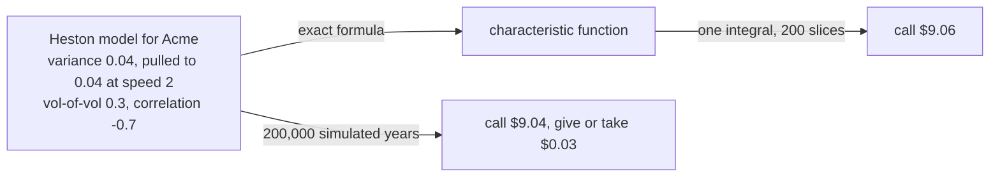
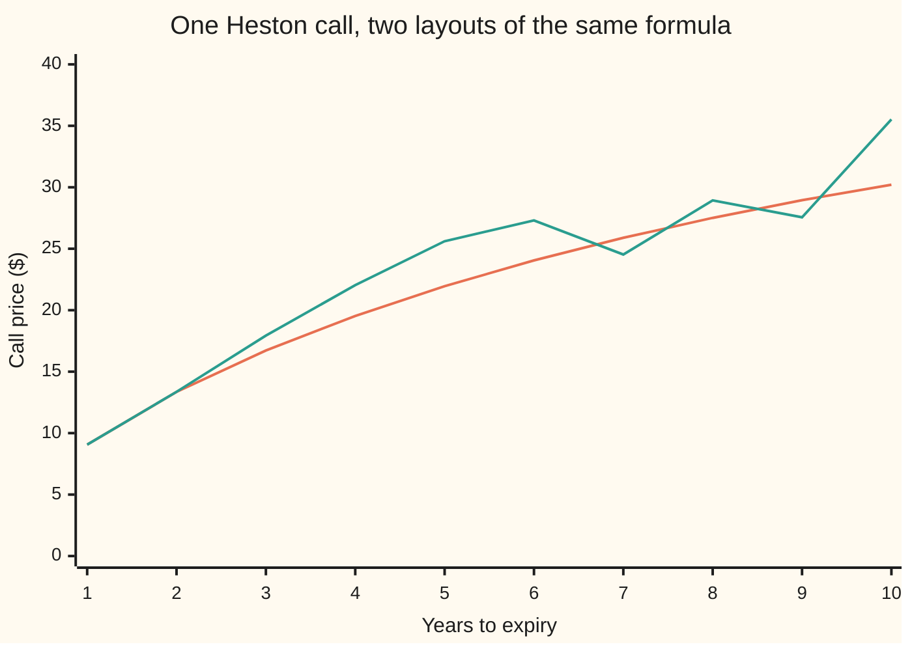
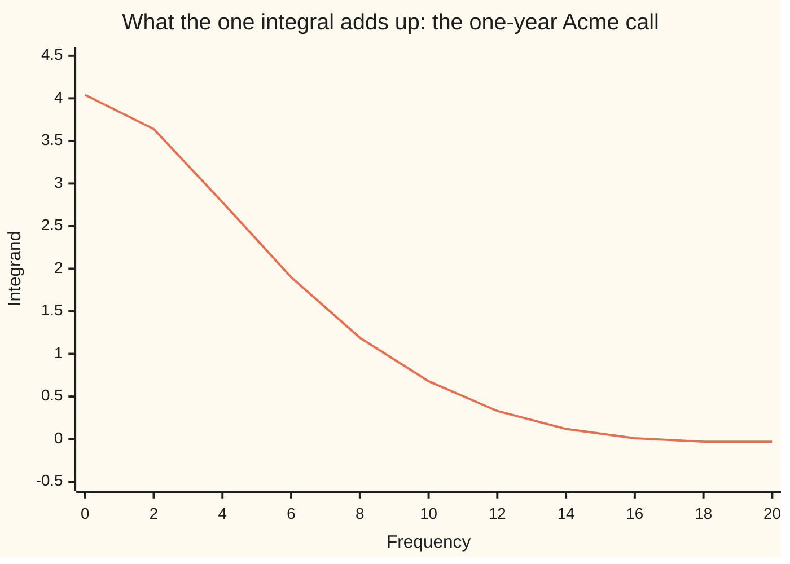

# Pricing Heston exactly: the closed-form fingerprint and the one integral that turns it into a price

Financial mathematics → Stochastic volatility - Heston, SABR and their mix → Transform pricing → Pricing Heston exactly

---

## General Overview

Acme shares trade at $100. A one-year call struck at $100 gives the right to buy one share for $100 a year from now. Cash earns 5 percent a year, continuously compounded, and Acme pays a 2 percent dividend yield. With volatility fixed at 20 percent, Black-Scholes prices the call at $9.23.

The Heston model lets volatility move ([heston-model](01-heston-model.md)). Acme's variance, volatility squared, starts at 0.04, which is 20 percent volatility. It is pulled toward a long-run 0.04 at speed 2 per year and shaken by noise of its own, of size 0.3, the vol-of-vol. Its shocks run against the share's with correlation −0.7. What is the call worth now?

The spread of Acme's possible prices at expiry no longer has a formula. Simulating 200,000 possible years and averaging the discounted payoffs gives $9.04, give or take $0.03. But the distribution's **fingerprint** has a formula: one complex number per "frequency", together fixing the distribution completely. Its proper name, used from here on, is the **characteristic function**. One integral turns it into the price: **$9.06**, or 9.059507, from 200 slices of a smooth curve.

One catch: a square root with two values. The wrong one prices the one-year call correctly, then goes quietly wrong. At five years, the layout Heston published in 1993, coded as printed, says $25.61 against the true $21.95.

**Heston's characteristic function is an exact formula, and the call is half the gap between the discounted share and the discounted strike plus one fast-converging integral of it; the only trap is the square root, whose wrong choice makes a complex logarithm jump by a full turn.**

**What kind of fact this is:** a method: an exact route to the price inside the Heston model, which is itself an assumption, not a law. The two theorems it rests on, the closed form of the characteristic function and Gil-Pelaez's inversion, are derived in Why it works, with the algebra folded.

### The picture: two roads to one price



The top road is exact except for slicing one smooth integral. The bottom road is right only on average, up to a small time-step error, and lands within one standard error of the top one.

---

## The formula

Notation first. The imaginary unit $i$ squares to −1. A complex number is a point in the plane: its ordinary part runs across, its multiple of $i$ runs up, and Re takes the across part. Euler's formula, $e^{i\alpha} = \cos\alpha + i\sin\alpha$, puts e raised to an imaginary power on the circle of radius 1, at angle α ([eulers-formula](../../07-Complex%20analysis/01-Complex%20Numbers%20and%20the%20Plane/04-eulers-formula.md)).

The **characteristic function** of Acme's log price at expiry is

$$\varphi(u) = \mathbb{E}\!\left[e^{iu\ln S_T}\right].$$

Each possible ending price $S_T$ turns an arrow of length 1 through the angle u times ln S_T, and the characteristic function is the average arrow. The average, $\mathbb{E}$, is taken in the pricing world, where the share is expected to grow at the riskless rate less its dividend yield. The **frequency** $u$ sets how fast the arrow turns as the price changes ([characteristic-functions-and-inversion](../../09-Probability%20and%20statistics/06-Limit%20Theorems%20in%20Practice/04-characteristic-functions-and-inversion.md)).

The price of the call:

$$C = \tfrac12\left(S e^{-qT} - K e^{-rT}\right) + \frac{e^{-rT}}{\pi}\int_0^\infty \operatorname{Re}\!\left[\frac{e^{-iu\ln K}\,\big(\varphi(u - i) - K\,\varphi(u)\big)}{iu}\right]du$$

**Read it aloud:** start from half the gap between the discounted share and the discounted strike; then sweep the frequency upward from zero, adding at each frequency the share side minus the strike side, both read off the same characteristic function.

The characteristic function is exact:

$$\varphi(u) = \exp\!\big(iu\ln S + A(u) + B(u)\,v_0\big),$$

$$\beta = \kappa - \rho\xi iu, \qquad d = \sqrt{\beta^2 + \xi^2\,(u^2 + iu)}, \qquad g = \frac{\beta - d}{\beta + d},$$

$$A(u) = (r - q)\,iuT + \frac{\kappa\theta}{\xi^2}\left[(\beta - d)\,T - 2\ln\frac{1 - g\,e^{-dT}}{1 - g}\right], \qquad B(u) = \frac{\beta - d}{\xi^2}\cdot\frac{1 - e^{-dT}}{1 - g\,e^{-dT}}.$$

In words: $\beta$ is the pull speed, bent by the correlation. $d$ is a square root, always the one whose real part is not negative; Step 5 shows why. $g$ is the ratio of two roots met in Step 2. $B$ carries today's variance into the characteristic function, and $A$ carries the drift and the pull.

| Symbol | Plain meaning | In our example | Push it up and the answer… |
| --- | --- | --- | --- |
| $C$ | the call's price today | 9.059507 | — |
| $S$, $S_T$, $K$ | Acme's price today; its price at expiry, unknown today; the strike | 100; spread out; 100 | $S$ up: rises. $K$ up: falls |
| $r$, $q$ | riskless rate and dividend yield, continuously compounded | 5%, 2% | $r$ up: rises. $q$ up: falls |
| $T$, $\tau$ | years to expiry; $\tau$ is the years left, in the proof | 1 | rises: 13.35 at two years, 21.95 at five |
| $v_0$, $v$, $\theta$ | variance today, variance later, and the long-run level it is pulled toward | 0.04, moving, 0.04 | rises |
| $\kappa$ | speed of the pull, per year | 2 | rises: a faster pull damps the shaking, toward Black-Scholes |
| $\xi$ | vol-of-vol: how hard the variance itself is shaken | 0.3 | this call falls: 8.573392 at 0.6 |
| $\rho$ | correlation of the share's shocks with the variance's | −0.7 | this call barely moves, 9.040993 at 0; the smile (Black-Scholes volatility across strikes) tilts less |
| $u$, $i$ | frequency of the probe; the imaginary unit | 0 to 100 | — |
| $\varphi(u)$, $\mathbb{E}$ | the characteristic function, the average arrow; the average in the pricing world | at frequency 1: $-0.093738 - 0.974607i$ | — |
| $A$, $B$, $\beta$, $d$, $g$ | the two exponents of $\varphi$ and their three helpers | at frequency 1: $B = -0.230617 - 0.198513i$ | — |
| $P_1$, $P_2$, $e^{-rT}$ | chance of finishing above the strike, counted in shares and in dollars; the discount on a dollar paid at expiry | 0.655651, 0.580379 | — |

### When it holds

- **The share follows the Heston model.** The price is exact for the model, not the market; where the market's smile has a shape Heston cannot make, the price inherits the misfit.
- **The payoff depends only on the final price.** The characteristic function sees $S_T$, not the path; early exercise or a barrier needs simulation or a grid.
- **The root $d$ has a real part that is not negative, in this layout.** Heston's 1993 layout agrees at one year, then drifts: \$17.93 against the true \$16.72 at three years.
- **The inputs are legal:** $v_0$ at least 0; $\kappa$, $\theta$, $\xi$ above 0; $\rho$ strictly between −1 and 1. The formula divides by the square of $\xi$: at vol-of-vol 0.0001 and no correlation it still returns 9.227005 against Black-Scholes's 9.227006, but at exactly 0 it breaks, and Black-Scholes at the average variance, here 20 percent, is the answer.
- **The integral runs far enough and is sliced finely enough.** At frequency 100 the average arrow has length $7.031\times10^{-12}$; stopping at 10 gives \$8.65. Short expiries need a later stop.

---

## Why it works

### Step 0: trade the distribution for its fingerprint

A price is a discounted average of the payoff over the ending prices, and Heston's ending distribution has no formula to average over. Two facts open another door. A characteristic function fixes its distribution completely: two different distributions never share one ([characteristic-functions-and-inversion](../../09-Probability%20and%20statistics/06-Limit%20Theorems%20in%20Practice/04-characteristic-functions-and-inversion.md)). And when a model's coefficients are straight-line functions of the variance, its characteristic function reduces to two equations in time, which for Heston solve exactly. So: write it exactly (Steps 1 and 2), turn it into probabilities (Steps 3 and 4), keep its logarithm honest (Step 5), and slice one integral (Step 6), the only numerical step.

### Step 1: the characteristic function, in numbers

By Euler's formula the arrow for one ending price is $\cos(u\ln S_T) + i\sin(u\ln S_T)$, so the characteristic function is the average across part plus $i$ times the average up part. Two values are known before any model is chosen.

- At $u = 0$ every arrow points straight across: the average is 1. The check prints 1.000000.
- At $u = -i$ the exponent $iu\ln S_T$ becomes $\ln S_T$, and the arrow becomes the share price itself. So $\varphi(-i)$ is the average ending price, which in the pricing world is the forward $S e^{(r-q)T}$ = 103.045453. The check prints it both ways. A mistyped characteristic function almost always fails here first.

At frequency 1 the arrows fan out: $\varphi(1) = -0.093738 - 0.974607i$, just short of length 1, because arrows pointing different ways partly cancel.

### Step 2: why Heston's characteristic function has a formula

Take the same average from a later moment, when the log price is $x$, the variance is $v$ and $\tau$ years are left. It averages something fixed at expiry, so it cannot be expected to drift; Itô's lemma turns that into one equation. Every coefficient of the Heston model is a straight-line function of $v$: the share's variance $v$, the pull $\kappa(\theta - v)$, the variance's own variance $\xi^2 v$, the covariance $\rho\xi v$. So guess that the logarithm of the average is a straight line too:

$$\text{log of the average} = iux + A(\tau) + B(\tau)\,v.$$

Substituted, every term either carries a factor $v$ or does not, and each group must vanish alone. Two ordinary differential equations are left, with the prime meaning the rate of change in $\tau$:

$$B' = \tfrac12\xi^2 B^2 - \beta B - \tfrac12\left(u^2 + iu\right), \qquad A' = (r - q)\,iu + \kappa\theta B, \qquad A(0) = B(0) = 0.$$

The first is a **Riccati equation**: its right side is a quadratic in $B$, which factors through its roots $(\beta \pm d)/\xi^2$, so it splits into partial fractions and integrates exactly; $A$ is then the integral of $B$. The check tests this algebra without using it, solving the two equations step by step (fourth-order Runge-Kutta, 4,000 steps). At frequency 1 both give $-0.093738 - 0.974607i$, agreeing to ten decimals.

<details>
<summary>Detailed proof: from the model to A and B</summary>

In the pricing world the log price and the variance move as
$$dx = \left(r - q - \tfrac12 v\right)dt + \sqrt{v}\,dW_1, \qquad dv = \kappa(\theta - v)\,dt + \xi\sqrt{v}\,dW_2,$$
two Brownian shocks with correlation ρ. The average seen from time t, given log price x and variance v there, call it f, has zero expected change, so by Itô's lemma
$$\partial_t f + \left(r - q - \tfrac12 v\right)\partial_x f + \tfrac12 v\,\partial_{xx} f + \kappa(\theta - v)\,\partial_v f + \tfrac12\xi^2 v\,\partial_{vv} f + \rho\xi v\,\partial_{xv} f = 0, \qquad f(T, x, v) = e^{iux}.$$
Try $f = \exp\big(iux + A(\tau) + B(\tau)v\big)$ with $\tau = T - t$. Each derivative is the average times a factor, in order $-(A' + B'v),\ iu,\ -u^2,\ B,\ B^2,\ iuB$. Dividing by the average,
$$-A' - B'v + (r - q)\,iu - \tfrac12 v\,iu - \tfrac12 v\,u^2 + \kappa\theta B - \kappa vB + \tfrac12\xi^2 vB^2 + \rho\xi v\,iuB = 0.$$
The terms without $v$ give the equation for $A$; the terms with $v$ give the Riccati equation.

The Riccati quadratic vanishes at $B_\pm = (\beta \pm d)/\xi^2$, so $B' = \tfrac12\xi^2(B - B_+)(B - B_-)$. Since $B_+ - B_- = 2d/\xi^2$, the logarithm of $(B - B_+)/(B - B_-)$ grows at the constant rate $d$, starting from the logarithm of $B_+/B_-$. With $g = B_-/B_+$,
$$\frac{B - B_+}{B - B_-} = \frac{e^{d\tau}}{g}, \qquad\text{so}\qquad B(\tau) = B_-\,\frac{1 - e^{-d\tau}}{1 - g\,e^{-d\tau}}.$$
Write the fraction as $1 - (1 - g)\,e^{-ds}/(1 - g\,e^{-ds})$; the second part integrates to a logarithm, and $B_-(1 - g)/g = 2d/\xi^2$ simplifies the constant:
$$\int_0^\tau B(s)\,ds = \frac{(\beta - d)\,\tau}{\xi^2} - \frac{2}{\xi^2}\ln\frac{1 - g\,e^{-d\tau}}{1 - g}.$$
Times $\kappa\theta$, plus $(r - q)iu\tau$, at $\tau = T$: that is $A$. The logarithm meant is the continuous one, 0 at $\tau = 0$; Step 5 is about computing exactly that one.

</details>

### Step 3: from a characteristic function to a probability

Gil-Pelaez's inversion theorem gives the chance of finishing above the strike:

$$\Pr(S_T > K) = \tfrac12 + \frac1\pi\int_0^\infty \operatorname{Re}\!\left[\frac{e^{-iu\ln K}\,\varphi(u)}{iu}\right]du.$$

In words: sine waves of every frequency, each weighted by one over its frequency, add up to a step, π/2 right of zero and −π/2 left of it. Placed at ln K, the step averages to the chance above minus the chance below; each sine wave's average is read off the characteristic function; and the two chances add to 1, which gives the ½.

<details>
<summary>Detailed proof: Gil-Pelaez in four lines</summary>

For real t, the Dirichlet integral gives $\int_0^\infty \sin(ut)/u\,du = \tfrac{\pi}{2}\,\mathrm{sign}(t)$.
With t = ln S_T − ln K, the average sign is $2\Pr(S_T > K) - 1$, as landing exactly on K has chance zero.
The average sine is $\operatorname{Im}\big[e^{-iu\ln K}\varphi(u)\big]$, and for real u the real part of z/(iu) is the imaginary part of z divided by u.
Swapping average and integral gives the formula; the swap needs care, as the sine integral converges slowly, and Gil-Pelaez's note supplies it.

</details>

### Step 4: two probabilities, merged into one integral

A call pays $S_T - K$ above the strike. As on [black-scholes-call](../08-The%20Black-Scholes%20call%20and%20put/01-black-scholes-call.md), split it into a share received minus cash handed over.

- **The cash side** is $K e^{-rT} P_2$, with $P_2$ from Step 3: 0.580379. The fraction of simulated paths ending above \$100 is 0.579835.
- **The share side** counts the same event in shares: each ending price weighted by the share's value there. Weighting by $S_T$ over its average gives a new probability with characteristic function $\varphi(u - i)/\varphi(-i)$, because $S_T = e^{i(-i)\ln S_T}$ merges with $e^{iu\ln S_T}$ into $e^{i(u - i)\ln S_T}$. Step 3 then gives $P_1$ = 0.655651; the simulation, weighting paths by their ending price, gives 0.654944.

So $C = S e^{-qT}P_1 - K e^{-rT}P_2$: the Black-Scholes shape, with $P_1$ above $P_2$ because counting in shares tilts the odds toward good outcomes. The share side carries $S e^{-qT}/\varphi(-i)$, and as $\varphi(-i)$ is the forward, that is $e^{-rT}$, the cash side's discount. So both integrands sit under one factor $e^{-rT}/\pi$, and the two halves become $\tfrac12(S e^{-qT} - K e^{-rT})$ = 1.448462. That is the formula: one integral where there were two.

### Step 5: the square root with two values

Only $d^2$ is fixed, and $-d$ squares to it too. Swap $d$ for $-d$ and the formula becomes Heston's 1993 layout: $g$ turns into $1/g$ and $e^{-dT}$ into $e^{dT}$. On paper the layouts are one function.

A computer's logarithm of a complex number returns one angle, between −π and π, but the formula needs the logarithm that changes continuously with the frequency. The across axis left of zero is that logarithm's **cut**: when the number inside crosses it, the true angle carries on past π and the computer's jumps back by 2π.

The stable layout never reaches the cut. Since $d$ has a real part that is not negative, $e^{-dT}$ has length at most 1; and $g$, scanned on the card's grid at $u$ and at $u - i$, has length at most 0.822665, below 1. So $1 - g\,e^{-dT}$ and $1 - g$ both lie right of the up axis, with angles between −π/2 and π/2, and their ratio's angle stays strictly inside −π to π at every maturity. The 1993 layout has no such fence: its $g$ is longer than 1 and $e^{dT}$ grows with maturity, so the number inside swings round zero. At one year the layouts still agree, \$9.06. At five years and frequency 4 they part:

| Route | characteristic function at frequency 4, five years |
| --- | --- |
| the two equations solved step by step | +0.223373 + 0.069742i |
| stable layout | +0.223373 + 0.069742i |
| 1993 layout | +0.107470 − 0.207869i |

The 1993 value has the right length and the wrong angle: the true value turned by −1.396263 radians. The logarithm jumped one full turn, 2π; the factor $2\kappa\theta/\xi^2$ in front made it a turn of $4\pi\kappa\theta/\xi^2$; and $4\pi(\kappa\theta/\xi^2 - 1)$ = −1.396263 is that turn less two whole circles, computed from the inputs alone.



The orange line is the stable layout, the true price. The green line is the 1993 layout, coded as printed and sliced the same way: equal at one year, a cent off at two, then wandering on both sides of the truth, $25.61 against $21.95 at five years and $24.53 against $25.89 at seven.

### Step 6: slicing the integral

Simpson's rule fits a parabola through each three neighbouring points and adds the areas ([numerical-integration](../../06-Calculus%20and%20analysis/04-Integrals/08-numerical-integration.md)). The card uses 200 slices from 0 to 100, each half a unit wide, starting one hundred-millionth above 0, where the formula divides by zero though the curve itself is finite.



The line is the integrand, the quantity inside the integral sign, at every second frequency up to 20: 4.04 at the start, 0.68 by frequency 10, 0.01 by 16, then ripples a few hundredths below zero. Parabolas half a unit wide follow a curve this smooth: 2,000 slices out to 200 give the same 9.059507.

### The other door: Lewis's integral

Alan Lewis (2001) moves the integral onto the line where the frequency has imaginary part −½. One value of the characteristic function then serves both sides, the integrand is divided by $u^2 + \tfrac14$ instead of by $i\,u$, and the price is the discounted share minus one integral: 9.059507 again with 2,000 slices. But that divisor doubles between 0 and ½, so the integrand peaks sharply at 0, and slices half a unit wide miss the peak: \$11.49. Pricing a whole strip of strikes at once, by the fast Fourier transform, is carr-madan-and-fourier-pricing.

---

## Worked numbers, by hand

The house example at frequency 1, with $T = 1$. Complex numbers multiply as brackets do, with $i^2 = -1$.

| Step | Arithmetic | Value |
| --- | --- | --- |
| $\beta$ | $2 - (-0.7)(0.3)\,i$ | $2 + 0.21i$ |
| $\beta^2 + \xi^2(u^2 + iu)$ | $(4 - 0.0441 + 0.84i) + (0.09 + 0.09i)$ | $4.0459 + 0.93i$ |
| $d$ | the square root whose real part is positive | $2.024514 + 0.229685i$ |
| $g$ | $(-0.024514 - 0.019685i)\,/\,(4.024514 + 0.439685i)$ | $-0.006547 - 0.004176i$ |
| $e^{-dT}$ | $e^{-2.024514}\,(\cos 0.229685 - i\sin 0.229685)$ | $0.128590 - 0.030066i$ |
| $B$ | $\dfrac{\beta - d}{0.09}\cdot\dfrac{1 - e^{-dT}}{1 - g\,e^{-dT}}$ | $-0.230617 - 0.198513i$ |
| $A$ | $0.03i + \dfrac{0.08}{0.09}\left[(\beta - d) - 2\ln\dfrac{1 - g\,e^{-dT}}{1 - g}\right]$ | $-0.011892 + 0.019274i$ |
| $\varphi(1)$ | $\exp\big(i\ln 100 + A + 0.04\,B\big)$ | $-0.093738 - 0.974607i$ |

Then the price, with the integral done by the check:

| Step | Arithmetic | Value |
| --- | --- | --- |
| the half-gap | $\tfrac12\,(100\,e^{-0.02} - 100\,e^{-0.05})$ | 1.448462 |
| the integral | Simpson's rule, 200 slices of width 0.5 from 0 to 100 | 25.136734 |
| scaled | $25.136734 \times e^{-0.05}/\pi$ | 7.611044 |
| **the call** | $1.448462 + 7.611044$ | **9.059507** |
| as a Black-Scholes volatility | bisection: the one flat volatility giving the same price | 19.5580% |

The call is worth $9.06, below the flat-20% Black-Scholes $9.23: a Black-Scholes volatility of 19.56%. The vol-of-vol makes this at-the-money call (strike at today's price) cheaper: its price grows roughly with the square root of the variance, which loses more on a fall than it gains on an equal rise. The correlation is not the cause: at 0 the call is lower still, $9.04. The whole smile belongs to [heston-model](01-heston-model.md).

### What breaks if you drop a piece

Right answers: $9.06 at one year, $21.95 at five. Every wrong number is printed by the checks.

| Mistake | Comes out at | What went wrong |
| --- | --- | --- |
| Heston's 1993 layout, five-year call | 25.61 (right: 21.95) | the logarithm crossed its cut; the characteristic function turned by the wrong angle |
| drop the half-gap | 7.61 | Gil-Pelaez's ½ left out of both probabilities |
| plain characteristic function in the share slot | −6.12 | the share side counted in dollars, not shares: a negative price |
| dividend left out of the characteristic function | 9.40 | the share drifts 2 percent a year too fast, past the forward |
| Lewis's integral with 200 slices | 11.49 | slices half a unit wide miss its peak at 0 |
| integral stopped at frequency 10 | 8.65 | the integrand is still 0.68 there; real area is thrown away |

---

## Code, from first principles, and it actually runs

Nothing below imports a function that already knows the answer: `cmath` supplies only complex arithmetic, and Rust, with none in its standard library, gets a small complex type. Simpson's rule, the bell-curve area, bisection and the random numbers (a 64-bit linear congruential generator, multiply-add-wrap, turned into bell-curve draws by the Box-Muller transform) are written out. The numbered output rows follow the roads: (1) the one integral, checked against 2,000 slices; (2) Lewis's integral; (3) the two probabilities $P_1$ and $P_2$, each by its own integral and by simulation; (4) 200,000 simulated paths of 100 steps, the variance clamped at zero before each use (the "full truncation" of Lord, Koekkoek and van Dijk); (5) the vol-of-vol switched almost off, which must give the house Black-Scholes price. The characteristic function is also checked against its two equations solved step by step. Twelve asserts, none comparing a computation with itself.

### Python

```python
# Pricing Heston exactly -- the check behind the card. Standard library only: cmath does the complex
# arithmetic; Simpson's rule, the normal CDF, bisection and the random numbers are written here.
import cmath
from math import log, exp, sqrt, pi, cos, sin, atan2

S, K, r, q, T = 100.0, 100.0, 0.05, 0.02, 1.0           # the house market
P = (0.04, 2.0, 0.04, 0.3, -0.7)                         # Heston: v0, kappa, theta, xi, rho
V0, KAP, TH, XI, RHO = P

def parts(u, T, p=P, trap=False, mu=r - q):              # beta, d, g, e^-dT, A, B at frequency u
    v0, kap, th, xi, rho = p
    beta = kap - rho * xi * 1j * u
    d = cmath.sqrt(beta * beta + xi * xi * (u * u + 1j * u))   # principal root: real part >= 0
    if trap: d = -d                                      # Heston's 1993 layout: the other root
    g = (beta - d) / (beta + d)
    e = cmath.exp(-d * T)
    A = mu * 1j * u * T + kap * th / (xi * xi) * ((beta - d) * T - 2 * cmath.log((1 - g * e) / (1 - g)))
    B = (beta - d) / (xi * xi) * (1 - e) / (1 - g * e)
    return beta, d, g, e, A, B

def phi(u, T=T, p=P, trap=False, mu=r - q):              # E[exp(i u ln S_T)], closed form
    A, B = parts(u, T, p, trap, mu)[4:]
    return cmath.exp(1j * u * log(S) + A + B * p[0])

def phi_ode(u, T, steps=4000):                           # same fingerprint: solve B' and A' by RK4
    beta = KAP - RHO * XI * 1j * u
    f = lambda B: 0.5 * XI * XI * B * B - beta * B - 0.5 * (u * u + 1j * u)
    h, A, B = T / steps, 0j, 0j
    for _ in range(steps):
        k1 = f(B); b2 = B + h / 2 * k1; k2 = f(b2); b3 = B + h / 2 * k2; k3 = f(b3); b4 = B + h * k3
        A += h * ((r - q) * 1j * u + KAP * TH * (B + 2 * b2 + 2 * b3 + b4) / 6)
        B += h / 6 * (k1 + 2 * k2 + 2 * k3 + f(b4))
    return cmath.exp(1j * u * log(S) + A + B * V0)

def simpson(f, a, b, n):
    h = (b - a) / n
    s = f(a) + f(b)
    for k in range(1, n):
        s += (4 if k % 2 else 2) * f(a + k * h)
    return s * h / 3

def integrand(u, T=T, p=P, trap=False, mu=r - q, same=False):
    top = phi(u, T, p, trap, mu) if same else phi(u - 1j, T, p, trap, mu)
    return (cmath.exp(-1j * u * log(K)) * (top - K * phi(u, T, p, trap, mu)) / (1j * u)).real

def call(T=T, p=P, n=200, U=100.0, trap=False, mu=r - q, same=False, half=1.0):
    I = simpson(lambda u: integrand(u, T, p, trap, mu, same), 1e-8, U, n)
    return half * 0.5 * (S * exp(-q * T) - K * exp(-r * T)) + exp(-r * T) / pi * I

def lewis(n, U=100.0):                                   # road 2: integrate along Im u = -1/2
    F = S * exp((r - q) * T)
    f = lambda u: (cmath.exp(1j * u * log(F / K)) * phi(u - 0.5j)
                   / cmath.exp(1j * (u - 0.5j) * log(F))).real / (u * u + 0.25)
    return S * exp(-q * T) - sqrt(S * K) * exp(-(r + q) * T / 2) / pi * simpson(f, 0.0, U, n)

def prob(shift):                                         # P2 (shift 0) or P1 (shift 1), one integral
    f = lambda u: (cmath.exp(-1j * u * log(K)) * phi(u - 1j * shift) / (1j * u * phi(-1j * shift))).real
    return 0.5 + simpson(f, 1e-8, 100.0, 200) / pi

def N(x): return 0.5 + simpson(lambda z: exp(-0.5 * z * z) / sqrt(2 * pi), 0.0, x, 2000)
def bs(sig):
    d1 = (log(S / K) + (r - q + 0.5 * sig * sig) * T) / (sig * sqrt(T))
    return S * exp(-q * T) * N(d1) - K * exp(-r * T) * N(d1 - sig * sqrt(T))
def implied(price):                                      # bisection on the Black-Scholes price
    lo, hi = 0.01, 1.0
    for _ in range(60):
        mid = 0.5 * (lo + hi)
        lo, hi = (mid, hi) if bs(mid) < price else (lo, mid)
    return 0.5 * (lo + hi)

def mc(paths, steps=100, seed=12345):                    # road 3: full-truncation Euler
    st, M, dt = seed, (1 << 64) - 1, T / steps
    sr, sw = sqrt(1 - RHO * RHO), sqrt(dt)
    s = s2 = hit = sh = 0.0
    for _ in range(paths):
        x, v = log(S), V0
        for _ in range(steps):
            st = (6364136223846793005 * st + 1442695040888963407) & M      # 64-bit LCG
            u1 = ((st >> 11) + 0.5) / 9007199254740992.0
            st = (6364136223846793005 * st + 1442695040888963407) & M
            rad, ang = sqrt(-2.0 * log(u1)), 2.0 * pi * ((st >> 11) / 9007199254740992.0)
            z1, z2 = rad * cos(ang), rad * sin(ang)                          # Box-Muller
            vp = v if v > 0.0 else 0.0                                       # full truncation
            sv = sqrt(vp) * sw
            x += (r - q - 0.5 * vp) * dt + sv * z1
            v += KAP * (TH - vp) * dt + XI * sv * (RHO * z1 + sr * z2)
        ST = exp(x)
        if ST > K:
            s += ST - K; s2 += (ST - K) * (ST - K); hit += 1.0; sh += ST
    m = s / paths
    return (exp(-r * T) * m, exp(-r * T) * sqrt((s2 / paths - m * m) / paths),
            sh / paths / (S * exp((r - q) * T)), hit / paths)

C, P1, P2 = call(), prob(1.0), prob(0.0)
mcC, mcSE, mcP1, mcP2 = mc(200000)
smC, smSE = mc(20000)[:2]
col, bs20 = call(p=(0.04, 2.0, 0.04, 1e-4, 0.0)), bs(0.2)
good5, bad5, ode5 = phi(4.0, 5.0), phi(4.0, 5.0, trap=True), phi_ode(4.0, 5.0)
turn = atan2((bad5 / good5).imag, (bad5 / good5).real)
gmax = max(abs(parts(0.5 * k - 1j * s, T)[2]) for k in range(201) for s in (0, 1))   # |g| at u and u - i
zs = list(zip(("u=1 beta", "u=1 d", "u=1 g", "u=1 e^-dT", "u=1 A", "u=1 B"), parts(1.0, T))) + [("u=1 phi, closed form", phi(1.0)),
      ("u=1 phi, RK4 on the equations", phi_ode(1.0, T)), ("T=5 u=4 phi, closed form", good5), ("T=5 u=4 phi, RK4", ode5), ("T=5 u=4 phi, 1993 layout", bad5)]
for name, z in zs: print(f"{name:<34}{z.real:>+14.6f}{z.imag:>+13.6f}i")
print(f"{'|phi| at u=100':<34}{abs(phi(100.0)):>14.3e}")
for name, v in (("forward S e^(r-q)T", S * exp((r - q) * T)), ("phi(0)", phi(0.0).real), ("phi(-i)", phi(-1j).real),
        ("largest |g|, u and u-i to 100", gmax), ("T=5 u=4 turn, 1993 vs stable", turn), ("  4 pi (kappa theta/xi^2 - 1)", 4 * pi * (KAP * TH / (XI * XI) - 1)),
        ("half-gap", 0.5 * (S * exp(-q * T) - K * exp(-r * T))), ("the integral, 200 slices", call(half=0.0) * pi / exp(-r * T)),
        ("e^-rT/pi x integral", call(half=0.0)), ("1 HESTON CALL, 200 slices", C),
        ("  same, 2000 slices to u=200", call(n=2000, U=200.0)), ("2 Lewis integral, 2000 slices", lewis(2000)),
        ("3 P1, counted in shares", P1), ("  P1 by simulation", mcP1), ("  P2, counted in dollars", P2), ("  P2 by simulation", mcP2),
        ("4 simulation, 200000 paths", mcC), ("  standard error", mcSE),
        ("5 Heston at xi=1e-4, rho=0", col), ("  Black-Scholes at 20%", bs20), ("implied vol of the Heston call", implied(C)),
        ("wrong: no half-gap", call(half=0.0)), ("wrong: phi(u) in both slots", call(same=True)),
        ("wrong: dividend left out of phi", call(mu=r)), ("wrong: Lewis with 200 slices", lewis(200)),
        ("wrong: integral stopped at u=10", call(U=10.0)),
        ("try: xi = 0.6", call(p=(0.04, 2.0, 0.04, 0.6, -0.7))), ("try: rho = 0", call(p=(0.04, 2.0, 0.04, 0.3, 0.0))),
        ("try: 20 slices", call(n=20)), ("try: simulation, 20000 paths", smC), ("  standard error", smSE)):
    print(f"{name:<34}{v:>14.6f}")
years, us = range(1, 11), range(0, 21, 2)
print("chart, years      " + "".join(f"{t:7d}" for t in years))
print("chart, stable     " + "".join(f"{call(T=t):7.2f}" for t in years))
print("chart, 1993 layout" + "".join(f"{call(T=t, trap=True):7.2f}" for t in years))
print("chart, u          " + "".join(f"{u:7d}" for u in us))
print("chart, integrand  " + "".join(f"{integrand(max(u, 1e-8)):7.2f}" for u in us))

assert abs(phi(-1j) - S * exp((r - q) * T)) < 1e-9,              "phi(-i) must be the forward"
assert abs(phi(1.0) - phi_ode(1.0, T)) < 1e-10,                  "closed form vs the equations solved by RK4"
assert abs(good5 - ode5) < 1e-10,                                "at five years the stable layout matches the equations"
assert abs(bad5 - ode5) > 0.1,                                   "at five years the 1993 layout misses"
assert gmax < 1.0,                                               "stable layout: |g| < 1 keeps the log off its cut"
assert abs(turn - 4 * pi * (KAP * TH / (XI * XI) - 1)) < 1e-9,       "the 1993 error is one whole turn of the log"
assert abs(C - call(n=2000, U=200.0)) < 1e-6,                    "200 slices must already be converged"
assert abs(C - lewis(2000)) < 1e-6,                              "Lewis's integral must agree"
assert abs(mcC - C) < 3 * mcSE,                                  "simulation within 3 standard errors"
assert abs(mcP2 - P2) < 3 * sqrt(P2 * (1 - P2) / 200000),        "exercise chance: integral vs simulation"
assert abs(col - bs20) < 1e-6,                                   "no vol-of-vol: Heston becomes Black-Scholes"
assert abs(bs20 - 9.227005508154) < 1e-8,                        "the house Black-Scholes call"
print("ALL CHECKS PASS")
```

**Ran 2026-09-24 on macOS, Python 3.14.6, standard library only. All checks passed. Output, pasted from the run:**

```
u=1 beta                               +2.000000    +0.210000i
u=1 d                                  +2.024514    +0.229685i
u=1 g                                  -0.006547    -0.004176i
u=1 e^-dT                              +0.128590    -0.030066i
u=1 A                                  -0.011892    +0.019274i
u=1 B                                  -0.230617    -0.198513i
u=1 phi, closed form                   -0.093738    -0.974607i
u=1 phi, RK4 on the equations          -0.093738    -0.974607i
T=5 u=4 phi, closed form               +0.223373    +0.069742i
T=5 u=4 phi, RK4                       +0.223373    +0.069742i
T=5 u=4 phi, 1993 layout               +0.107470    -0.207869i
|phi| at u=100                         7.031e-12
forward S e^(r-q)T                    103.045453
phi(0)                                  1.000000
phi(-i)                               103.045453
largest |g|, u and u-i to 100           0.822665
T=5 u=4 turn, 1993 vs stable           -1.396263
  4 pi (kappa theta/xi^2 - 1)          -1.396263
half-gap                                1.448462
the integral, 200 slices               25.136734
e^-rT/pi x integral                     7.611044
1 HESTON CALL, 200 slices               9.059507
  same, 2000 slices to u=200            9.059507
2 Lewis integral, 2000 slices           9.059507
3 P1, counted in shares                 0.655651
  P1 by simulation                      0.654944
  P2, counted in dollars                0.580379
  P2 by simulation                      0.579835
4 simulation, 200000 paths              9.041930
  standard error                        0.025458
5 Heston at xi=1e-4, rho=0              9.227005
  Black-Scholes at 20%                  9.227006
implied vol of the Heston call          0.195580
wrong: no half-gap                      7.611044
wrong: phi(u) in both slots            -6.120940
wrong: dividend left out of phi         9.404152
wrong: Lewis with 200 slices           11.485507
wrong: integral stopped at u=10         8.654016
try: xi = 0.6                           8.573392
try: rho = 0                            9.040993
try: 20 slices                          8.917135
try: simulation, 20000 paths            8.975785
  standard error                        0.080172
chart, years            1      2      3      4      5      6      7      8      9     10
chart, stable        9.06  13.35  16.72  19.53  21.95  24.05  25.89  27.51  28.95  30.21
chart, 1993 layout   9.06  13.36  17.93  22.04  25.61  27.30  24.53  28.93  27.56  35.52
chart, u                0      2      4      6      8     10     12     14     16     18     20
chart, integrand     4.04   3.64   2.78   1.90   1.19   0.68   0.33   0.12   0.01  -0.03  -0.03
ALL CHECKS PASS
```

Three roads, one price: the two integrals agree to six decimals, and the simulation lands within one standard error. Without vol-of-vol the formula returns the house Black-Scholes price to a millionth.

### Rust

Same checks, same inputs, same random numbers.

```rust
// Pricing Heston exactly -- the same check as the .py, std only. Rust std has no complex numbers, so a
// small complex type is written here, with Simpson's rule, the normal CDF, bisection and the random numbers.
use std::f64::consts::PI;
use std::ops::{Add, Div, Mul, Sub};

#[derive(Clone, Copy)]
struct Z { re: f64, im: f64 }
fn z(re: f64, im: f64) -> Z { Z { re, im } }                  // z(a, b) is a + bi
fn c(x: f64) -> Z { z(x, 0.0) }                                // c(x) is x + 0i
impl Add for Z { type Output = Z; fn add(self, o: Z) -> Z { z(self.re + o.re, self.im + o.im) } }
impl Sub for Z { type Output = Z; fn sub(self, o: Z) -> Z { z(self.re - o.re, self.im - o.im) } }
impl Mul for Z { type Output = Z; fn mul(self, o: Z) -> Z { z(self.re * o.re - self.im * o.im, self.re * o.im + self.im * o.re) } }
impl Div for Z { type Output = Z; fn div(self, o: Z) -> Z { let m = o.re * o.re + o.im * o.im; z((self.re * o.re + self.im * o.im) / m, (self.im * o.re - self.re * o.im) / m) } }
impl Z {
    fn exp(self) -> Z { let m = self.re.exp(); z(m * self.im.cos(), m * self.im.sin()) }
    fn ln(self) -> Z { z(self.re.hypot(self.im).ln(), self.im.atan2(self.re)) }
    fn sqrt(self) -> Z {                                   // principal root: real part >= 0
        let t = ((self.re.abs() + self.re.hypot(self.im)) / 2.0).sqrt();
        if self.re >= 0.0 { z(t, self.im / (2.0 * t)) } else { z(self.im.abs() / (2.0 * t), t.copysign(self.im)) }
    }
    fn abs(self) -> f64 { self.re.hypot(self.im) }
}
const I: Z = Z { re: 0.0, im: 1.0 };
const S: f64 = 100.0; const K: f64 = 100.0; const R: f64 = 0.05; const Q: f64 = 0.02; const T: f64 = 1.0;
type Par = (f64, f64, f64, f64, f64);                      // v0, kappa, theta, xi, rho
const P: Par = (0.04, 2.0, 0.04, 0.3, -0.7);

fn parts(u: Z, t: f64, p: Par, trap: bool, mu: f64) -> [Z; 6] {   // beta, d, g, e^-dT, A, B
    let (_, kap, th, xi, rho) = p;
    let beta = c(kap) - c(rho * xi) * I * u;
    let mut d = (beta * beta + c(xi * xi) * (u * u + I * u)).sqrt();
    if trap { d = c(0.0) - d; }                            // Heston's 1993 layout: the other root
    let g = (beta - d) / (beta + d);
    let e = (c(0.0) - d * c(t)).exp();
    let a = c(mu * t) * I * u + c(kap * th / (xi * xi)) * ((beta - d) * c(t) - c(2.0) * ((c(1.0) - g * e) / (c(1.0) - g)).ln());
    let b = (beta - d) / c(xi * xi) * (c(1.0) - e) / (c(1.0) - g * e);
    [beta, d, g, e, a, b]
}
fn phi(u: Z, t: f64, p: Par, trap: bool, mu: f64) -> Z {  // E[exp(i u ln S_T)], closed form
    let w = parts(u, t, p, trap, mu);
    (I * u * c(S.ln()) + w[4] + w[5] * c(p.0)).exp()
}
fn ph(u: Z, t: f64) -> Z { phi(u, t, P, false, R - Q) }
fn phi_ode(u: f64, t: f64, steps: usize) -> Z {           // same fingerprint: solve B' and A' by RK4
    let (v0, kap, th, xi, rho) = P;
    let uu = c(u);
    let beta = c(kap) - c(rho * xi) * I * uu;
    let f = |b: Z| c(0.5 * xi * xi) * b * b - beta * b - c(0.5) * (uu * uu + I * uu);
    let (h, mut a, mut b) = (t / steps as f64, c(0.0), c(0.0));
    for _ in 0..steps {
        let k1 = f(b); let b2 = b + c(h / 2.0) * k1; let k2 = f(b2); let b3 = b + c(h / 2.0) * k2; let k3 = f(b3); let b4 = b + c(h) * k3;
        a = a + c(h) * (c(R - Q) * I * uu + c(kap * th) * (b + c(2.0) * b2 + c(2.0) * b3 + b4) / c(6.0));
        b = b + c(h / 6.0) * (k1 + c(2.0) * k2 + c(2.0) * k3 + f(b4));
    }
    (I * uu * c(S.ln()) + a + b * c(v0)).exp()
}
fn simpson<F: Fn(f64) -> f64>(f: F, a: f64, b: f64, n: usize) -> f64 {
    let h = (b - a) / n as f64;
    let mut s = f(a) + f(b);
    for k in 1..n { s += if k % 2 == 1 { 4.0 } else { 2.0 } * f(a + k as f64 * h); }
    s * h / 3.0
}
fn integrand(u: f64, t: f64, p: Par, trap: bool, mu: f64, same: bool) -> f64 {
    let top = if same { phi(c(u), t, p, trap, mu) } else { phi(z(u, -1.0), t, p, trap, mu) };
    ((c(0.0) - I * c(u * K.ln())).exp() * (top - c(K) * phi(c(u), t, p, trap, mu)) / (I * c(u))).re
}
fn call(t: f64, p: Par, n: usize, big_u: f64, trap: bool, mu: f64, same: bool, half: f64) -> f64 {
    let i = simpson(|u| integrand(u, t, p, trap, mu, same), 1e-8, big_u, n);
    half * 0.5 * (S * (-Q * t).exp() - K * (-R * t).exp()) + (-R * t).exp() / PI * i
}
fn base(t: f64, trap: bool) -> f64 { call(t, P, 200, 100.0, trap, R - Q, false, 1.0) }
fn lewis(n: usize) -> f64 {                               // road 2: integrate along Im u = -1/2
    let f = S * ((R - Q) * T).exp();
    let g = |u: f64| (I * c(u * (f / K).ln())).exp() * ph(z(u, -0.5), T) / (I * z(u, -0.5) * c(f.ln())).exp();
    S * (-Q * T).exp() - (S * K).sqrt() * (-(R + Q) * T / 2.0).exp() / PI * simpson(|u| g(u).re / (u * u + 0.25), 0.0, 100.0, n)
}
fn prob(shift: f64) -> f64 {                              // P2 (shift 0) or P1 (shift 1), one integral
    let f = |u: f64| ((c(0.0) - I * c(u * K.ln())).exp() * ph(z(u, -shift), T) / (I * c(u) * ph(z(0.0, -shift), T))).re;
    0.5 + simpson(f, 1e-8, 100.0, 200) / PI
}
fn n_cdf(x: f64) -> f64 { 0.5 + simpson(|y| (-0.5 * y * y).exp() / (2.0 * PI).sqrt(), 0.0, x, 2000) }
fn bs(sig: f64) -> f64 {
    let d1 = ((S / K).ln() + (R - Q + 0.5 * sig * sig) * T) / (sig * T.sqrt());
    S * (-Q * T).exp() * n_cdf(d1) - K * (-R * T).exp() * n_cdf(d1 - sig * T.sqrt())
}
fn implied(price: f64) -> f64 {                           // bisection on the Black-Scholes price
    let (mut lo, mut hi) = (0.01, 1.0);
    for _ in 0..60 { let mid = 0.5 * (lo + hi); if bs(mid) < price { lo = mid } else { hi = mid } }
    0.5 * (lo + hi)
}
fn mc(paths: usize, steps: usize, seed: u64) -> (f64, f64, f64, f64) {   // road 3: full-truncation Euler
    let (v0, kap, th, xi, rho) = P;
    let (mut st, dt) = (seed, T / steps as f64);
    let (sr, sw) = ((1.0 - rho * rho).sqrt(), dt.sqrt());
    let (mut s, mut s2, mut hit, mut sh) = (0.0, 0.0, 0.0, 0.0);
    for _ in 0..paths {
        let (mut x, mut v) = (S.ln(), v0);
        for _ in 0..steps {
            st = st.wrapping_mul(6364136223846793005).wrapping_add(1442695040888963407);   // 64-bit LCG
            let u1 = ((st >> 11) as f64 + 0.5) / 9007199254740992.0;
            st = st.wrapping_mul(6364136223846793005).wrapping_add(1442695040888963407);
            let (rad, ang) = ((-2.0 * u1.ln()).sqrt(), 2.0 * PI * ((st >> 11) as f64 / 9007199254740992.0));
            let (z1, z2) = (rad * ang.cos(), rad * ang.sin());                          // Box-Muller
            let vp = if v > 0.0 { v } else { 0.0 };                                     // full truncation
            let sv = vp.sqrt() * sw;
            x += (R - Q - 0.5 * vp) * dt + sv * z1;
            v += kap * (th - vp) * dt + xi * sv * (rho * z1 + sr * z2);
        }
        let st_t = x.exp();
        if st_t > K { s += st_t - K; s2 += (st_t - K) * (st_t - K); hit += 1.0; sh += st_t; }
    }
    let (np, m) = (paths as f64, s / paths as f64);
    ((-R * T).exp() * m, (-R * T).exp() * ((s2 / np - m * m) / np).sqrt(), sh / np / (S * ((R - Q) * T).exp()), hit / np)
}

fn main() {
    let (rq, cc, p1, p2) = (R - Q, base(T, false), prob(1.0), prob(0.0));
    let (mc_c, mc_se, mc_p1, mc_p2) = mc(200000, 100, 12345);
    let (sm_c, sm_se, _, _) = mc(20000, 100, 12345);
    let (col, bs20) = (call(T, (0.04, 2.0, 0.04, 1e-4, 0.0), 200, 100.0, false, rq, false, 1.0), bs(0.2));
    let (good5, bad5, ode5) = (ph(c(4.0), 5.0), phi(c(4.0), 5.0, P, true, rq), phi_ode(4.0, 5.0, 4000));
    let (rat, gmax) = (bad5 / good5, (0..402).map(|k| parts(z(0.5 * (k / 2) as f64, -((k % 2) as f64)), T, P, false, rq)[2].abs()).fold(0.0, f64::max));
    let turn = rat.im.atan2(rat.re);                               // gmax: largest |g| at u and u - i
    let kt = P.1 * P.2 / (P.3 * P.3);
    let w = parts(c(1.0), T, P, false, rq);
    let zs = [("u=1 beta", w[0]), ("u=1 d", w[1]), ("u=1 g", w[2]), ("u=1 e^-dT", w[3]), ("u=1 A", w[4]), ("u=1 B", w[5]),
        ("u=1 phi, closed form", ph(c(1.0), T)), ("u=1 phi, RK4 on the equations", phi_ode(1.0, T, 4000)),
        ("T=5 u=4 phi, closed form", good5), ("T=5 u=4 phi, RK4", ode5), ("T=5 u=4 phi, 1993 layout", bad5)];
    for (name, v) in &zs { println!("{:<34}{:>+14.6}{:>+13.6}i", name, v.re, v.im); }
    println!("{:<34}{:>14.3e}", "|phi| at u=100", ph(c(100.0), T).abs());
    let nohalf = call(T, P, 200, 100.0, false, rq, false, 0.0);
    let rows = [("forward S e^(r-q)T", S * rq.exp()), ("phi(0)", ph(c(0.0), T).re), ("phi(-i)", ph(z(0.0, -1.0), T).re),
        ("largest |g|, u and u-i to 100", gmax), ("T=5 u=4 turn, 1993 vs stable", turn), ("  4 pi (kappa theta/xi^2 - 1)", 4.0 * PI * (kt - 1.0)),
        ("half-gap", 0.5 * (S * (-Q * T).exp() - K * (-R * T).exp())), ("the integral, 200 slices", nohalf * PI / (-R * T).exp()),
        ("e^-rT/pi x integral", nohalf), ("1 HESTON CALL, 200 slices", cc),
        ("  same, 2000 slices to u=200", call(T, P, 2000, 200.0, false, rq, false, 1.0)), ("2 Lewis integral, 2000 slices", lewis(2000)),
        ("3 P1, counted in shares", p1), ("  P1 by simulation", mc_p1), ("  P2, counted in dollars", p2), ("  P2 by simulation", mc_p2),
        ("4 simulation, 200000 paths", mc_c), ("  standard error", mc_se),
        ("5 Heston at xi=1e-4, rho=0", col), ("  Black-Scholes at 20%", bs20), ("implied vol of the Heston call", implied(cc)),
        ("wrong: no half-gap", nohalf), ("wrong: phi(u) in both slots", call(T, P, 200, 100.0, false, rq, true, 1.0)),
        ("wrong: dividend left out of phi", call(T, P, 200, 100.0, false, R, false, 1.0)), ("wrong: Lewis with 200 slices", lewis(200)),
        ("wrong: integral stopped at u=10", call(T, P, 200, 10.0, false, rq, false, 1.0)),
        ("try: xi = 0.6", call(T, (0.04, 2.0, 0.04, 0.6, -0.7), 200, 100.0, false, rq, false, 1.0)),
        ("try: rho = 0", call(T, (0.04, 2.0, 0.04, 0.3, 0.0), 200, 100.0, false, rq, false, 1.0)),
        ("try: 20 slices", call(T, P, 20, 100.0, false, rq, false, 1.0)), ("try: simulation, 20000 paths", sm_c), ("  standard error", sm_se)];
    for (name, v) in rows { println!("{:<34}{:>14.6}", name, v); }
    let row = |label: &str, f: &dyn Fn(u32) -> String, xs: Vec<u32>| println!("{}{}", label, xs.into_iter().map(|x| f(x)).collect::<String>());
    row("chart, years      ", &|t| format!("{:7}", t), (1..11).collect());
    row("chart, stable     ", &|t| format!("{:7.2}", base(t as f64, false)), (1..11).collect());
    row("chart, 1993 layout", &|t| format!("{:7.2}", base(t as f64, true)), (1..11).collect());
    row("chart, u          ", &|u| format!("{:7}", u), (0..21).step_by(2).collect());
    row("chart, integrand  ", &|u| format!("{:7.2}", integrand((u as f64).max(1e-8), T, P, false, rq, false)), (0..21).step_by(2).collect());

    assert!((ph(z(0.0, -1.0), T) - c(S * rq.exp())).abs() < 1e-9, "phi(-i) must be the forward");
    assert!((ph(c(1.0), T) - phi_ode(1.0, T, 4000)).abs() < 1e-10, "closed form vs the equations solved by RK4");
    assert!((good5 - ode5).abs() < 1e-10, "at five years the stable layout matches the equations");
    assert!((bad5 - ode5).abs() > 0.1, "at five years the 1993 layout misses");
    assert!(gmax < 1.0, "stable layout: |g| < 1 keeps the log off its cut");
    assert!((turn - 4.0 * PI * (kt - 1.0)).abs() < 1e-9, "the 1993 error is one whole turn of the log");
    assert!((cc - call(T, P, 2000, 200.0, false, rq, false, 1.0)).abs() < 1e-6, "200 slices must already be converged");
    assert!((cc - lewis(2000)).abs() < 1e-6, "Lewis's integral must agree");
    assert!((mc_c - cc).abs() < 3.0 * mc_se, "simulation within 3 standard errors");
    assert!((mc_p2 - p2).abs() < 3.0 * (p2 * (1.0 - p2) / 200000.0).sqrt(), "exercise chance: integral vs simulation");
    assert!((col - bs20).abs() < 1e-6, "no vol-of-vol: Heston becomes Black-Scholes");
    assert!((bs20 - 9.227005508154).abs() < 1e-8, "the house Black-Scholes call");
    println!("ALL CHECKS PASS");
}
```

**Ran 2026-09-24 on macOS, rustc 1.98.1, no crates. All checks passed. Output, pasted from the run:**

```
u=1 beta                               +2.000000    +0.210000i
u=1 d                                  +2.024514    +0.229685i
u=1 g                                  -0.006547    -0.004176i
u=1 e^-dT                              +0.128590    -0.030066i
u=1 A                                  -0.011892    +0.019274i
u=1 B                                  -0.230617    -0.198513i
u=1 phi, closed form                   -0.093738    -0.974607i
u=1 phi, RK4 on the equations          -0.093738    -0.974607i
T=5 u=4 phi, closed form               +0.223373    +0.069742i
T=5 u=4 phi, RK4                       +0.223373    +0.069742i
T=5 u=4 phi, 1993 layout               +0.107470    -0.207869i
|phi| at u=100                         7.031e-12
forward S e^(r-q)T                    103.045453
phi(0)                                  1.000000
phi(-i)                               103.045453
largest |g|, u and u-i to 100           0.822665
T=5 u=4 turn, 1993 vs stable           -1.396263
  4 pi (kappa theta/xi^2 - 1)          -1.396263
half-gap                                1.448462
the integral, 200 slices               25.136734
e^-rT/pi x integral                     7.611044
1 HESTON CALL, 200 slices               9.059507
  same, 2000 slices to u=200            9.059507
2 Lewis integral, 2000 slices           9.059507
3 P1, counted in shares                 0.655651
  P1 by simulation                      0.654944
  P2, counted in dollars                0.580379
  P2 by simulation                      0.579835
4 simulation, 200000 paths              9.041930
  standard error                        0.025458
5 Heston at xi=1e-4, rho=0              9.227005
  Black-Scholes at 20%                  9.227006
implied vol of the Heston call          0.195580
wrong: no half-gap                      7.611044
wrong: phi(u) in both slots            -6.120940
wrong: dividend left out of phi         9.404152
wrong: Lewis with 200 slices           11.485507
wrong: integral stopped at u=10         8.654016
try: xi = 0.6                           8.573392
try: rho = 0                            9.040993
try: 20 slices                          8.917135
try: simulation, 20000 paths            8.975785
  standard error                        0.080172
chart, years            1      2      3      4      5      6      7      8      9     10
chart, stable        9.06  13.35  16.72  19.53  21.95  24.05  25.89  27.51  28.95  30.21
chart, 1993 layout   9.06  13.36  17.93  22.04  25.61  27.30  24.53  28.93  27.56  35.52
chart, u                0      2      4      6      8     10     12     14     16     18     20
chart, integrand     4.04   3.64   2.78   1.90   1.19   0.68   0.33   0.12   0.01  -0.03  -0.03
ALL CHECKS PASS
```

The outputs are identical line for line, simulation included: both scripts draw the same random sequence and do the arithmetic in the same order.

> [!TIP]
> **Try changing**
> Guess the direction first, then run it.
> - **Double the vol-of-vol.** Set xi to 0.6. Dearer or cheaper? Cheaper: $8.57. Bigger swings in variance strengthen the square-root effect of Worked numbers.
> - **Remove the correlation.** Set rho to 0: $9.04, the exact price of the uncorrelated case simulated on [heston-model](01-heston-model.md). The correlation mostly tilts the smile across strikes; this strike barely moves.
> - **Starve the slicing.** Use 20 slices: $8.92. Slices five units wide cannot follow a curve that falls from 4.04 to 0.68 within ten units.
> - **Cut the paths tenfold.** Simulate 20,000 paths: $8.98, standard error $0.08 instead of $0.03, about the square root of ten wider.

---

## The usual mistake

> [!warning]
> **Coding Heston's 1993 characteristic function exactly as printed.** On paper it is the stable layout, and at one year it gives the same \$9.06. But its logarithm crosses the cut as the frequency sweeps, and prices go wrong with no error message: \$17.93 against \$16.72 at three years, too low at seven. Take the root $d$ whose real part is not negative, write $g = (\beta - d)/(\beta + d)$ with $e^{-dT}$, and test a long maturity.
>
> - **Dropping the ½.** Without the half-gap the call is \$7.61.
> - **The plain characteristic function in the share slot.** $\varphi(u)$ where $\varphi(u - i)$ belongs gives −\$6.12, a negative price.
> - **Trusting a grid that looks fine.** Lewis's integrand with 200 slices gives \$11.49; this card's, stopped at frequency 10, gives \$8.65. Double the slices and the range; if the price moves, it had not converged.
> - **Reading a simulation as exact.** 200,000 paths carry a standard error of \$0.03, 20,000 of \$0.08.

---

## Where you meet it in real life

- **Calibration.** Fitting the five inputs to a screen of prices means pricing hundreds of options per trial, practical only with a formula this fast: [heston-greeks-and-calibration](03-heston-greeks-and-calibration.md).
- **Currency options.** Heston's paper was titled for bond and currency options; with the foreign interest rate in place of the dividend yield, the same integral prices options on exchange rates.
- **Where the recipe stops.** SABR is priced by Hagan's approximate formula instead ([sabr-model-and-hagan-formula](04-sabr-model-and-hagan-formula.md)); stochastic-local volatility fits the smile by construction but gives up the closed form ([stochastic-local-volatility](06-stochastic-local-volatility.md)).

> **Say it back**
> Under Heston the spread of prices at expiry has no formula, but its characteristic function, the average of an arrow turned by the log price, does, because the model is linear in the variance. Gil-Pelaez's theorem turns a characteristic function into a probability with one integral. A call needs two probabilities, counted in dollars and in shares, and they merge into one integral: $9.06 from 200 Simpson slices, against a simulation's $9.04 give or take $0.03. The square root inside must have a real part that is not negative, or long-dated prices go quietly wrong.

---

## What this builds on

- [heston-model](01-heston-model.md): the model, with variance pulled home, shaken, and tied to the share.
- [eulers-formula](../../07-Complex%20analysis/01-Complex%20Numbers%20and%20the%20Plane/04-eulers-formula.md): e to an imaginary power is a point on the circle of radius 1, the arrow being averaged.
- [characteristic-functions-and-inversion](../../09-Probability%20and%20statistics/06-Limit%20Theorems%20in%20Practice/04-characteristic-functions-and-inversion.md): why a characteristic function fixes its distribution, and the inversion idea Step 3 specialises.
- [numerical-integration](../../06-Calculus%20and%20analysis/04-Integrals/08-numerical-integration.md): Simpson's rule, and why slices must be narrower than the curve's features.

## Where this goes next

- [heston-greeks-and-calibration](03-heston-greeks-and-calibration.md): the same integral differentiated for hedge ratios, and repeated inside a fit to market prices.
- carr-madan-and-fourier-pricing: one fast Fourier transform prices a whole strip of strikes from the same characteristic function.

One strike now costs one integral; a fit to a market needs hundreds at every trial, and which of the five inputs those prices actually pin down is the question the calibration card answers.

---

## Sources

Verified 24 Sep 2026: every link below resolves to the publisher's page.

- Heston, Steven L. "A Closed-Form Solution for Options with Stochastic Volatility with Applications to Bond and Currency Options." *The Review of Financial Studies* 6, no. 2 (1993): 327–343. [doi:10.1093/rfs/6.2.327](https://doi.org/10.1093/rfs/6.2.327). The model and its characteristic function, in the 1993 layout.
- Gil-Pelaez, J. "Note on the Inversion Theorem." *Biometrika* 38, no. 3–4 (1951): 481–482. [doi:10.1093/biomet/38.3-4.481](https://doi.org/10.1093/biomet/38.3-4.481). The inversion formula of Step 3.
- Albrecher, Hansjörg, Philipp Mayer, Wim Schoutens, and Jurgen Tistaert. "The Little Heston Trap." *Wilmott Magazine*, January 2007: 83–92. [Publisher page](https://www.wilmott.com/the-little-heston-trap-wilmott-magazine-article-hansjorg-albrecher-philipp-mayer-wim-schoutens-jurgen-tistaert/). The branch-cut problem and the stable layout.
- Lewis, Alan L. "A Simple Option Formula for General Jump-Diffusion and Other Exponential Lévy Processes." SSRN working paper, 2001. [doi:10.2139/ssrn.282110](https://doi.org/10.2139/ssrn.282110). The shifted-line integral of road 2.
- Lord, Roger, Remmert Koekkoek, and Dick van Dijk. "A Comparison of Biased Simulation Schemes for Stochastic Volatility Models." *Quantitative Finance* 10, no. 2 (2010): 177–194. [doi:10.1080/14697680802392496](https://doi.org/10.1080/14697680802392496). Full truncation, used in road 3.
