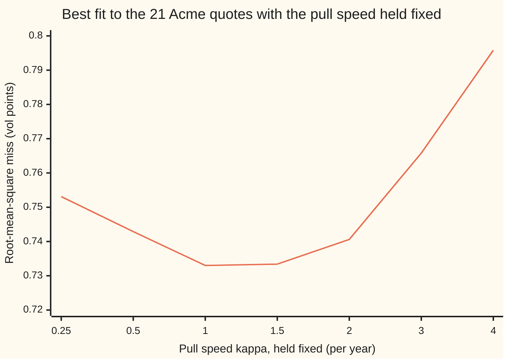
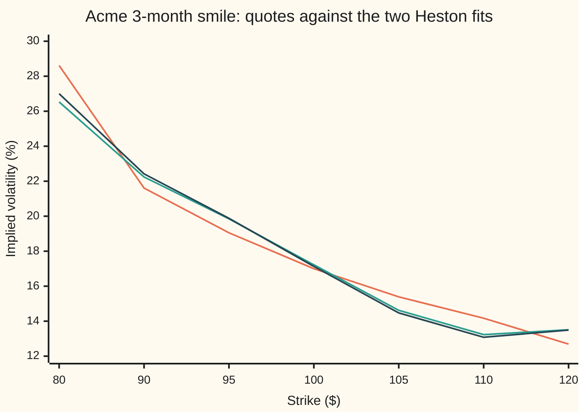

# Heston Greeks and calibration: sensitivities from the integral, and five parameters from a surface

[Syllabus](../../../SYLLABUS.md) → [Financial mathematics](../../../SYLLABUS.md#w12) → [Stochastic volatility - Heston, SABR and their mix](../../../SYLLABUS.md#w12-s14) → Heston Greeks and calibration

---

## General Overview

At the close, the Acme options desk holds 21 quotes: calls at 3 months, 6 months and 1 year, each at seven strikes from $80 to $120. Each is quoted as an implied volatility, the one volatility that makes Black-Scholes return that call's price. Acme trades at $100, cash earns 5% and the dividend yield is 2%. The 3-month $80 call is quoted at 28.61%, the 3-month $120 call at 12.69%. This is the house surface of [The volatility surface](../12-The%20smile%20and%20the%20surface/03-volatility-surface-and-its-arbitrage-rules.md), at seven of its nine strikes.

The desk prices with the Heston model ([The Heston model](01-heston-model.md)), where Acme's variance wanders and is pulled back toward a long-run level. Five dials set it, and one integral turns them into a price ([Pricing Heston exactly](02-heston-pricing-by-characteristic-function.md)). Two jobs are left.

The first is risk: how fast a held option's price moves when the share or a dial moves, its **Greeks**. They come from differentiating inside the pricing integral, and again from nudging an input and repricing. Both give the one-year $100 call a delta, the shares that hedge it, of 0.6427. Black-Scholes, at the one volatility that gives the same price, says 0.5873.

The second is **calibration**: setting the five dials so the model reprices the 21 quotes. From two sensible starting guesses, the fit stops with the pull speed at 0.3701 on one run and 1.2247 on the other. Their typical misses per quote are 0.7490 and 0.7321 vol points (percentage points of implied volatility), only 0.0168 apart, yet they price a three-year call $0.92 apart. The quotes cannot tell the answers apart. The fit is **ill-posed**.

**Heston's Greeks are the pricing integral with one extra factor inside, exact for the share price, today's variance and the long-run level; calibration minimises the squared misses in vol points, and because the pull speed, the strength of the wandering and the long-run level trade off along a nearly flat valley, the fitted dials mean something only together with the stopping rule and the prior (a stated preference among dial values) that produced them.**

**What kind of fact this is:** a method. The Greek formulas are proved on this card in Why it works; the fitted dials are the output of a stated objective, stopping rule and prior, not measurements of the market.

### The picture: the valley the fit lives in

Hold the pull speed at one value, fit the other four dials, and record the best root-mean-square miss: square each quote's miss, average, take the root.



From 0.5 to 2 the best miss barely moves, 0.7429 to 0.7330 and back to 0.7406; at 4 it reaches 0.7958. A fit walking that floor stops wherever its steps stop paying.

---

## The formula

Notation first, in words. Acme's price is $S$ today and $S_T$ at expiry, $T$ years away; $K$ is the strike, $r$ the bank rate and $q$ the dividend yield, both continuously compounded. The five dials, at the anchor values of [The Heston model](01-heston-model.md): today's variance $v_0$ (0.04), the pull speed $\kappa$ ("kappa", 2 a year), the long-run variance $\theta$ ("theta", 0.04), the vol of vol $\xi$ ("xi", 0.3), which sets how hard variance wanders, and the correlation $\rho$ ("rho", −0.7) between the share's random kicks and variance's. The forward $F = S e^{(r-q)T}$ is the price agreed today for Acme at expiry, and $k = \ln(K/F)$ is the strike's log distance from it. $i$ is the imaginary unit, $i^2 = -1$, and Re takes a complex number's real part.

The model's fingerprint, its **characteristic function** at a frequency $z$, has a log that is a straight line in $v_0$ and in $\theta$:

$$\varphi(z) = \mathbb{E}\!\left[e^{\,iz\ln(S_T/F)}\right] = e^{\,\theta H(z) + v_0 B(z)}$$

$H$ and $B$ depend on $\kappa$, $\xi$, $\rho$, the expiry and $z$ only. $B$ is the $B$ of [Pricing Heston exactly](02-heston-pricing-by-characteristic-function.md), and $\theta H$ is its $A(u)$ less the drift, since the log price here is measured from the forward. The price is that card's Lewis integral over real frequencies $u$:

$$C = S e^{-qT} - \frac{\sqrt{FK}\,e^{-rT}}{\pi}\int_0^\infty \mathrm{Re}\!\left[\frac{e^{-iuk}\,\varphi(u - \tfrac{i}{2})}{u^2 + \tfrac14}\right] du$$

The Greeks, delta $\Delta$ and gamma $\Gamma$ (the rate delta itself moves), put one extra factor inside, with $\varphi$, $H$, $B$ all taken at $u - \tfrac{i}{2}$:

$$\Delta = e^{-qT} - \frac{\sqrt{FK}\,e^{-rT}}{\pi S}\int_0^\infty \mathrm{Re}\!\left[\frac{(\tfrac12 + iu)\,e^{-iuk}\,\varphi}{u^2 + \tfrac14}\right] du, \qquad \Gamma = \frac{\sqrt{FK}\,e^{-rT}}{\pi S^2}\int_0^\infty \mathrm{Re}\!\left[e^{-iuk}\,\varphi\right] du$$

$$\frac{\partial C}{\partial v_0} = -\frac{\sqrt{FK}\,e^{-rT}}{\pi}\int_0^\infty \mathrm{Re}\!\left[\frac{B\,e^{-iuk}\,\varphi}{u^2 + \tfrac14}\right] du, \qquad \frac{\partial C}{\partial \theta} = \text{the same with } H \text{ in place of } B$$

**Read it aloud:** the call is the discounted share less a weighted sum of the fingerprint over frequencies; each Greek is the same sum with one more factor inside.

Calibration scores the dials against the quotes. Quote $j$'s dollar miss, model price $C_j$ less market price $C_j^{\mathrm{mkt}}$, is divided by its Black-Scholes vega $V_j$ (dollars per unit of volatility) and scaled to vol points. A prior, when used, charges at weight $\lambda$ for moving $\kappa$ away from a preferred $\kappa_0$; the loss $L$ adds it all up:

$$e_j = 100\,\frac{C_j - C_j^{\mathrm{mkt}}}{V_j}, \qquad L = \sum_{j=1}^{21} e_j^2 + \lambda^2(\kappa - \kappa_0)^2$$

**Read it aloud:** miss all 21 quotes by as few vol points as possible, and pay at a stated rate for straying from the preferred pull speed.

The root-mean-square miss is $\sqrt{\sum e_j^2/21}$, over the quotes only. Fits without a prior use $\lambda = 0$; with one, $\lambda = 1$ and $\kappa_0 = 2$.

| Symbol | Plain meaning | In our example | Push it up and the answer… |
| --- | --- | --- | --- |
| $S$, $K$, $T$, $S_T$ | Acme's price today, the strike, years to expiry, Acme's price at expiry | $100; $80 to $120; 0.25, 0.5, 1 | $S$: the call gains delta dollars per dollar |
| $r$, $q$, $F$ | bank rate, dividend yield (both continuous), forward price | 5%, 2% | — |
| $k$, $u$, $z$, $i$ | strike's log distance from the forward; the integral's frequency; any frequency, possibly complex; the imaginary unit | $u$ from 0 to 300 in steps of 0.1 | — |
| $\varphi$, $H$, $B$, $\beta$, $d$, $g$ | the fingerprint; the two pieces of its log; three intermediate pieces (Step 3) | fresh at each frequency | — |
| $v_0$ | today's variance | 0.04 anchor; 0.0259 fit B | price rises, 39.92 per unit |
| $\kappa$, $\kappa_0$ | pull speed toward the long-run level; the prior's preferred value | 2 anchor; 0.3701 fit A, 1.2247 fit B; $\kappa_0 = 2$ | price rises, 0.0820 per unit |
| $\theta$ | long-run variance | 0.04 anchor; 0.0888 fit B | price rises, 53.96 per unit |
| $\xi$ | vol of vol: how hard variance wanders | 0.3 anchor; 0.6707 fit B | at-the-money price falls, −1.2411 per unit |
| $\rho$ | correlation of the share's kicks with variance's | −0.7 anchor; −0.7277 fit B | smile tilts; price moves 0.0269 per unit |
| $C$, $C_{\mathrm{BS}}$, $\sigma$ | the call's price; Black-Scholes's price; implied volatility | $9.06 and 19.558% | — |
| $N$, $d_1$ | the normal CDF and Black-Scholes's $d_1$, as on the pilot | $e^{-qT}N(d_1) = 0.5873$ | — |
| $\Delta$, $\Gamma$, $P_1$, $P_2$, $p$, $a$ | delta, gamma; chance of finishing in the money counted in shares, in cash; density of $S_T$; a scaling factor (Step 1) | 0.6427; 0.01843; $e^{-qT}P_1 = 0.6427$ | — |
| $e_j$, $j$, $C_j^{\mathrm{mkt}}$, $V_j$, $L$, $\lambda$ | miss on quote $j$ in vol points; the quote's number; its market price; its vega; the loss; the prior's weight | 21 misses; $\lambda$ = 0 or 1 | $\lambda$: starts agree more, quotes fit a little worse |

### When it holds

- **Heston's shape fits the market.** It has no jumps, and at 3 months it cannot make the smile steep enough: fit B gives the $80 call 27.00% against 28.61%. Every Greek here is the model's and inherits its misses.
- **The integral may be differentiated inside.** That needs the differentiated integrand to stay below one integrable function (dominated convergence). For $T > 0$ the fingerprint dies off exponentially in $u$, so it does; as $T$ shrinks the grid must reach further.
- **A Greek holds every other input still.** Delta moves Acme with today's variance fixed. With $\rho = -0.7$ variance tends to fall as Acme rises, so a hedge expecting that holds fewer shares.
- **The fitted dials depend on the stopping rule and the prior.** Change either and $\kappa$ changes, and so does every Greek computed from the fit.

### Before solving: existence, uniqueness and the edges

- **Existence.** No run finds an exact fit; the smallest root-mean-square miss reached is 0.7321. A best fit does exist: the dials live in a closed box ($v_0$ and $\theta$ from 0.0001 to 1, $\kappa$ from 0.05 to 20, $\xi$ from 0.05 to 5, $\rho$ from −0.999 to 0.999), the loss is continuous there, and a continuous function on a closed, bounded box reaches its lowest value.
- **Uniqueness.** Barely. The profile shows one lowest point near $\kappa = 1.22$: fit B stops at 1.2247 and fit A, run to a far finer tolerance, at 1.2187, with the other four dials within 0.001 of each other. But from $\kappa = 1$ to 1.5 the best miss moves only in the fourth decimal, 0.7330 to 0.7334.
- **The edges.** As $\xi \to 0$ variance stops wandering, $\rho$ drops out of every price, and Heston becomes Black-Scholes at the average variance: with $\xi = 0.0001$, $v_0 = 0.02$ and $\theta = 0.06$, 9.479339 against 9.479325. As $\kappa \to 0$ variance is never pulled home and $\theta$ drops out. As $\kappa$ grows without bound variance sits at $\theta$ at once and $v_0$ drops out. Near each edge one dial is invisible to the quotes.

Conventions verified 24 Sep 2026 against [The volatility surface](../12-The%20smile%20and%20the%20surface/03-volatility-surface-and-its-arbitrage-rules.md): quotes are Black-Scholes implied volatilities of European calls in percent, rates continuously compounded; each vega is taken at its quote's own volatility.

---

## Why it works

### Step 0: every Greek is another integral of the same kind

The price is a weighted sum, over frequencies, of the fingerprint times a wave. Inside the sum, Acme's price enters only through $\sqrt{F}$ and the wave $e^{-iuk}$, since $F$ is a fixed multiple of $S$. Today's variance and the long-run level enter only as multipliers in the fingerprint's exponent. So each Greek is one more integral on the same grid, from the same fingerprint values, since every integrand still dies off exponentially.

### Step 1: delta and gamma come from the share-price factor

Gather what depends on Acme's price: $\sqrt{F}\,e^{-iuk} = K^{-iu}F^{\frac12 + iu}$. Differentiating in $S$ brings down $(\tfrac12 + iu)/S$: the delta formula. Twice brings down $(\tfrac12 + iu)(-\tfrac12 + iu)/S^2 = -(u^2 + \tfrac14)/S^2$, which cancels the denominator, so gamma's integrand is the fingerprint and its wave alone. For the one-year $100 call: delta 0.642668, gamma 0.018429.

Two more roads confirm both. Heston's own form is $C = S e^{-qT}P_1 - K e^{-rT}P_2$, where $P_1$ and $P_2$ are the chances of finishing above the strike counted in shares and in cash, found by Gil-Pelaez's inversion on the real line. Doubling Acme and the strike together doubles a Heston price. That makes delta $e^{-qT}P_1$, 0.642668, and gamma, with Acme at the strike, the discounted density of Acme's price there, 0.018429. Nudging Acme a cent each way and repricing gives both a third time.

<details>
<summary>Detailed proof: the doubling rule gives delta and gamma</summary>

**The rule.** Heston's variance ignores the share price, so $S_T$ is $S$ times a random factor free of $S$. Multiplying $S$ and $K$ by one positive factor $a$ multiplies every payoff by $a$, and so the price: $C(aS, aK) = a\,C(S, K)$.

**Delta.** Differentiate with respect to the factor and set it to 1: $C = S\,\partial C/\partial S + K\,\partial C/\partial K$ (Euler's relation). A call's strike derivative is minus the discounted chance of finishing in the money, $-e^{-rT}P_2$. Substituting Heston's form leaves $\Delta = e^{-qT}P_1$.

**Gamma.** Both first derivatives are unchanged by the scaling, so Euler's relation gives $S\,\partial^2 C/\partial S^2 + K\,\partial^2 C/\partial S\,\partial K = 0$ and $S\,\partial^2 C/\partial K\,\partial S + K\,\partial^2 C/\partial K^2 = 0$. Eliminating the mixed term, $S^2\Gamma = K^2\,\partial^2 C/\partial K^2 = K^2 e^{-rT}p(K)$, where $p$ is the density of $S_T$; the last step is Breeden and Litzenberger's result. At $S = K$ this is $\Gamma = e^{-rT}p(K)$.

**Inside the integral.** For $T > 0$ each integrand and its derivative in $S$, $v_0$ or $\theta$ is bounded, near the anchor, by a constant times $e^{-cu}$ for some $c > 0$. That bound is what dominated convergence needs to swap derivative and integral.

</details>

### Step 2: today's variance and the long-run level, exactly

The fingerprint's log is $\theta H + v_0 B$, so nudging $v_0$ multiplies the integrand by $B$ and nudging $\theta$ multiplies it by $H$, with no approximation. The integral gives $\partial C/\partial v_0 = 39.91844$ and $\partial C/\partial\theta = 53.95550$ dollars per unit of variance; bumps of 0.0001 either way give 39.91844 and 53.95551.

The split is the model speaking. A change in today's variance fades at speed $\kappa$, so over a year it counts for less than the same change in the long-run level. A move of the whole surface moves both. At 20% volatility one vol point is about 0.004 of variance, and raising both $v_0$ and $\theta$ by that adds $0.3755, near the Black-Scholes vega of $0.3789. Raising $v_0$ alone adds $0.1597.

### Step 3: the other three dials, by bumps on a fixed grid

The pull speed, vol of vol and correlation sit inside a square root and a logarithm, so the chain rule is long. Bumping is short: move the dial 0.0001 each way, reprice, divide by 0.0002. The frequency grid is the same both times, so its small error cancels in the difference, the integral's version of reusing random numbers ([Bump and revalue](../07-Greeks%20by%20Numbers%20and%20Calibration/01-bump-and-revalue-and-common-random-numbers.md)). The Lewis and Gil-Pelaez roads agree to every printed digit: $\partial C/\partial\kappa = 0.082013$, $\partial C/\partial\xi = -1.241130$, $\partial C/\partial\rho = 0.026929$. The exact road differentiates $H$ and $B$ through $\beta$, $d$ and $g$ by the chain rule, by hand or by machine ([Adjoint differentiation](../07-Greeks%20by%20Numbers%20and%20Calibration/03-adjoint-differentiation-in-outline.md)).

The signs have reasons. An at-the-money call is nearly a straight line in volatility, so it bends downward in variance, and spreading variance out lowers the average of anything that bends down: more vol of vol, lower price. A faster pull damps the spreading. The correlation tilts the smile about a point near the money, so it barely moves this call.

<details>
<summary>The fingerprint written out</summary>

With $\beta = \kappa - \rho\xi\,iz$, $d = \sqrt{\beta^2 + \xi^2(iz + z^2)}$ with real part not negative, and $g = (\beta - d)/(\beta + d)$:
$$B(z) = \frac{\beta - d}{\xi^2}\cdot\frac{1 - e^{-dT}}{1 - g\,e^{-dT}}, \qquad H(z) = \frac{\kappa}{\xi^2}\left[(\beta - d)T - 2\ln\frac{1 - g\,e^{-dT}}{1 - g}\right]$$
This choice of root keeps the logarithm off its cut; Heston's 1993 layout takes the other root, the trap on [Pricing Heston exactly](02-heston-pricing-by-characteristic-function.md).

</details>

### Step 4: why Heston's delta is larger than Black-Scholes delta

By the doubling rule, a Heston implied volatility depends on the strike only through $K/S$. Raising Acme by a dollar lowers $K/S$ at a fixed strike, which moves that strike to where the downward-sloping smile is higher. Differentiating $C = C_{\mathrm{BS}}(S, K, \sigma(K/S))$ in $S$:

$$\Delta_{\mathrm{Heston}} = \Delta_{\mathrm{BS}} - \frac{K}{S}\,\mathrm{vega}\,\frac{\partial \sigma}{\partial K}$$

With vega $37.89 and the anchor's slope, −0.001461 per dollar of strike (about 0.15 vol points per dollar), the correction is +0.055370, and 0.587298 + 0.055370 = 0.642668, the integral's delta. This is the sticky-moneyness rule of [Smile-adjusted delta](../12-The%20smile%20and%20the%20surface/05-smile-adjusted-delta.md), which Heston obeys exactly.

### Step 5: calibration is 21 Greeks at once

The fit walks the dials downhill by Levenberg-Marquardt ([Calibration](../07-Greeks%20by%20Numbers%20and%20Calibration/06-calibration-as-least-squares.md)): the step that would minimise the squared misses if prices were straight lines in the dials, shortened by a damping that grows after a refused step. Its slope table has one row per quote and one column per dial, the sensitivities of Steps 2 and 3 at 21 options, taken by one-sided bumps of 0.0001. It stops when a step lowers $\sqrt{L/21}$ by less than 0.001 vol points.

### Step 6: why the fit is ill-posed

A smile is curved by how far variance can have wandered by its expiry. The vol of vol spreads variance; the pull speed damps the spread. Hard wandering pulled back fast ends a year near where gentle wandering pulled back slowly does, and the quotes stop at a year. Holding $\kappa$ and fitting the rest shows the trade:

| $\kappa$ held at | best miss | $\xi$ fitted | $\theta$ fitted |
| --- | --- | --- | --- |
| 0.25 | 0.7531 | 0.5647 | 0.2650 |
| 0.5 | 0.7429 | 0.5914 | 0.1540 |
| 1 | 0.7330 | 0.6457 | 0.0988 |
| 1.5 | 0.7334 | 0.7010 | 0.0807 |
| 2 | 0.7406 | 0.7575 | 0.0717 |
| 3 | 0.7658 | 0.8737 | 0.0630 |
| 4 | 0.7958 | 0.9931 | 0.0588 |

As the pull speed rises, the vol of vol rises to keep the spread and the long-run level falls to keep the term structure. Jacques Hadamard asked three things of a well-posed problem: a solution exists, it is unique, and it moves little when the inputs move a little. The first holds, the second narrowly. The third fails in practice. Moving $\kappa$ from 1 to 1.5 changes the best miss by 0.0004 vol points, a tenth of the rounding in quotes written to two decimals, so the quotes place the lowest point only loosely. A tolerance of a thousandth of a vol point leaves the answer wherever the walk had reached: $\kappa = 0.3701$ from the anchor, 1.2247 from the anchor with $\kappa$ and $\xi$ tripled.

### Step 7: a prior gives the valley a floor

Tikhonov regularisation adds one more miss, $\lambda(\kappa - \kappa_0)$, with $\kappa_0 = 2$ standing for yesterday's value and $\lambda = 1$: moving the pull speed one unit from 2 costs as much as missing one quote by one vol point. Both starts now stop at $\kappa = 1.7640$ and 1.7787, and the quotes' miss rises only from 0.7321 to 0.7365 and 0.7367. The three-year call from the two fits differs by $0.01 instead of $0.92.

---

## Worked numbers, by hand

The one-year $100 call at the anchor: $v_0 = \theta = 0.04$, $\kappa = 2$, $\xi = 0.3$, $\rho = -0.7$.

| Step | Arithmetic | Value |
| --- | --- | --- |
| price | Lewis integral; Gil-Pelaez agrees | $9.06 |
| implied volatility | invert Black-Scholes by halving an interval | 19.558% |
| Black-Scholes delta at 19.558% | $e^{-qT}N(d_1)$ | 0.5873 |
| skew correction | $-(K/S) \times 37.89 \times (-0.001461)$ | +0.0554 |
| delta, three roads | $(\tfrac12 + iu)$ integral; $e^{-qT}P_1$; a cent's bump | 0.6427 |
| gamma, three roads | bare integral; density; bump | 0.01843 |
| $\partial C/\partial v_0$, $\partial C/\partial \theta$ | $B$, $H$ inside the integral | 39.92, 53.96 |
| one vol point, whole surface | $0.004 \times (39.92 + 53.96)$ | $0.3755 |
| one vol point, $v_0$ alone | $0.004 \times 39.92$ | $0.1597 |
| $\partial C/\partial\kappa$, $\partial C/\partial\xi$, $\partial C/\partial\rho$ | bumps of 0.0001 | 0.0820, −1.2411, 0.0269 |
| **hedge ratio** | | **0.6427 shares per call** |

A seller hedging with the Black-Scholes delta holds 0.0554 shares too few per call.

The fit to the 21 quotes:

| Step | Arithmetic | Value |
| --- | --- | --- |
| fit A, from the anchor | stop when a step gains under 0.001 | $\kappa$ 0.3701, $\xi$ 0.5779, $\theta$ 0.1914; miss 0.7490, 8 steps |
| fit B, from $\kappa$, $\xi$ tripled | same rule | $\kappa$ 1.2247, $\xi$ 0.6707, $\theta$ 0.0888; miss 0.7321, 6 steps |
| A minus B | the two misses | 0.0168 vol points |
| misses re-measured | Gil-Pelaez price, each quote inverted | 0.7651 and 0.7380 |
| 3-year $100 call | under each fit | $20.26 (25.73%), $19.35 (24.19%) |
| with the prior, both starts | $\lambda = 1$, $\kappa_0 = 2$ | $\kappa$ 1.7640 and 1.7787 |
| **3-year call, with the prior** | | **$19.01 and $19.00** |

The two unregularised fits answer the quotes almost equally well. Asked about a three-year option, which no quote prices, they differ by $0.92. The re-measured misses sit a little higher because a price miss over vega is only the first-order volatility miss.



Orange: the quotes. Green: fit A. Dark blue: fit B. The fits lie almost on each other, both too flat at $80 and both turning up at $120 where the quotes keep falling. At one year fit B is close: 20.45% against 20.00% at $100.

### What breaks if you drop a piece

| Mistake | Comes out at | What went wrong |
| --- | --- | --- |
| Hedge with Black-Scholes delta at 19.558% | 0.5873 shares, not 0.6427 | Heston's smile moves with the share; the skew term is missing |
| Call $\partial C/\partial v_0$ "the vega" | $0.1597 per vol point, not $0.3755 | Today's variance fades at speed $\kappa$; a surface move is $v_0$ and $\theta$ together |
| Report fit A's dials as the market's | 3-year call $20.26, not fit B's $19.35 | The quotes stop at a year; the valley picked $\kappa$ |
| Drop the prior, keep the tolerance | $\kappa$ 0.3701 or 1.2247, by start | With no floor the walk stops where its gains run out |

---

## Code, from first principles, and it actually runs

The code prices the one-year call by two roads, Lewis's integral by the trapezoid rule and Gil-Pelaez's two probabilities by the midpoint rule. It takes each Greek by at least two roads: under the integral, by bumps on each pricing road, and for delta and gamma by the doubling identities. Both roads share the fingerprint, so a third tests it alone: as $\xi \to 0$ the price must become Black-Scholes. It fits the dials by Levenberg-Marquardt from two starts, with and without the prior, re-measures the misses on the second road, and holds $\kappa$ at seven values to trace the valley. Only complex arithmetic is borrowed, from Python's `cmath`; everything else is written out.

### Python

```python
# Heston Greeks and calibration -- the check behind the card.  Standard library only;
# cmath supplies complex arithmetic and nothing else.  Road 1: Lewis's integral on the
# line Im u = -1/2 (trapezoid, step 0.1).  Road 2: Gil-Pelaez on the real line (midpoint,
# step 0.2).  As xi -> 0 Heston must become Black-Scholes.  Greeks by integral and bumps.
from math import exp, log, sqrt, pi, cos, sin
from cmath import exp as cexp, log as clog, sqrt as csqrt

S, r, q = 100.0, 0.05, 0.02
KS, TS = [80.0, 90.0, 95.0, 100.0, 105.0, 110.0, 120.0], [0.25, 0.5, 1.0]
QV = [[28.61, 21.61, 19.05, 17.00, 15.39, 14.17, 12.69],      # the house surface,
      [27.43, 21.84, 19.73, 18.00, 16.59, 15.47, 13.95],      # implied vols in percent
      [27.79, 23.24, 21.48, 20.00, 18.76, 17.74, 16.22]]
ANCHOR, START_B = [0.04, 2.0, 0.04, 0.3, -0.7], [0.04, 6.0, 0.04, 0.9, -0.7]  # v0 kappa theta xi rho

def fingerprint(z, T, p):          # H, B and phi = exp(theta H + v0 B) for ln(S_T / F)
    v0, ka, th, xi, rho = p
    beta = ka - rho * xi * 1j * z
    d = csqrt(beta * beta + xi * xi * (1j * z + z * z))
    g, e = (beta - d) / (beta + d), cexp(-d * T)
    B = (beta - d) / (xi * xi) * (1 - e) / (1 - g * e)
    H = ka / (xi * xi) * ((beta - d) * T - 2 * clog((1 - g * e) / (1 - g)))
    return H, B, cexp(th * H + v0 * B)
def lewis(T, Ks, p, kind="price", s=S):    # road 1, and its derivatives under the integral
    F = s * exp((r - q) * T); ks = [log(K / F) for K in Ks]; tot = [0.0] * len(Ks)
    for i in range(3001):
        u = 0.1 * i; H, B, f = fingerprint(complex(u, -0.5), T, p)
        m = {"price": 1, "delta": 0.5 + 1j * u, "gamma": u * u + 0.25, "v0": B, "theta": H}[kind]
        g = (0.05 if i == 0 else 0.1) * m * f / (u * u + 0.25)
        for j, k in enumerate(ks): tot[j] += (g * complex(cos(u * k), -sin(u * k))).real
    c = [sqrt(F * K) * exp(-r * T) / pi * t for K, t in zip(Ks, tot)]
    if kind == "price": return [s * exp(-q * T) - x for x in c]
    if kind == "delta": return [exp(-q * T) - x / s for x in c]
    return [x / (s * s) for x in c] if kind == "gamma" else [-x for x in c]
def gil_pelaez(T, K, p):           # road 2: P1, P2, the density of S_T at K, and the price
    k = log(K / (S * exp((r - q) * T))); P1 = P2 = dens = 0.0
    for i in range(1500):
        u = 0.2 * (i + 0.5); w = complex(cos(u * k), -sin(u * k))
        f2, f1 = fingerprint(complex(u, 0.0), T, p)[2], fingerprint(complex(u, -1.0), T, p)[2]
        P1 += 0.2 * (w * f1 / (1j * u)).real; P2 += 0.2 * (w * f2 / (1j * u)).real; dens += 0.2 * (w * f2).real
    P1, P2 = 0.5 + P1 / pi, 0.5 + P2 / pi
    return P1, P2, dens / (pi * K), S * exp(-q * T) * P1 - K * exp(-r * T) * P2
def N(x):                          # normal CDF by Marsaglia's series
    if abs(x) > 8: return 1.0 if x > 0 else 0.0
    s = t = x; n = 1
    while abs(t) > 1e-17: t *= x * x / (2 * n + 1); s += t; n += 1
    return 0.5 + s * exp(-0.5 * x * x) / sqrt(2 * pi)
def bs(K, T, vol, what="price"):   # Black-Scholes call, its vega and its delta
    F, v = S * exp((r - q) * T), vol * sqrt(T); d1 = (log(F / K) + 0.5 * v * v) / v
    if what == "vega": return exp(-r * T) * F * exp(-0.5 * d1 * d1) / sqrt(2 * pi) * sqrt(T)
    return exp(-q * T) * N(d1) if what == "delta" else exp(-r * T) * (F * N(d1) - K * N(d1 - v))
def implied(price, K, T):          # bisection: a call's price rises with its vol
    lo, hi = 1e-4, 3.0
    for _ in range(100):
        mid = 0.5 * (lo + hi); lo, hi = (mid, hi) if bs(K, T, mid) < price else (lo, mid)
    return 0.5 * (lo + hi)
MKT = [[bs(K, T, v / 100) for K, v in zip(KS, row)] for T, row in zip(TS, QV)]
VEGA = [[bs(K, T, v / 100, "vega") for K, v in zip(KS, row)] for T, row in zip(TS, QV)]
LO, HI = [1e-4, 0.05, 1e-4, 0.05, -0.999], [1.0, 20.0, 1.0, 5.0, 0.999]
def misses(p, prior):              # vol-point misses (price miss over vega), then the prior
    e = [100 * (c - m) / v for T, ms, vs in zip(TS, MKT, VEGA) for c, m, v in zip(lewis(T, KS, p), ms, vs)]
    return e + ([prior * (p[1] - 2.0)] if prior else [])
def solve(A, b):                   # Gaussian elimination on the damped normal equations
    n = len(b); M = [row[:] + [x] for row, x in zip(A, b)]
    for c in range(n):
        for i in range(c + 1, n):
            f = M[i][c] / M[c][c]; M[i] = [a - f * m for a, m in zip(M[i], M[c])]
    x = [0.0] * n
    for i in range(n - 1, -1, -1): x[i] = (M[i][n] - sum(M[i][j] * x[j] for j in range(i + 1, n))) / M[i][i]
    return x
def fit(p, tol, free=(0, 1, 2, 3, 4), prior=0.0):   # stop when a step gains < tol vol points
    p = list(p); e = misses(p, prior); L = sum(x * x for x in e); lam, steps = 1e-3, 0
    while steps < 200:
        J = []
        for i in free:
            pp = list(p); pp[i] += 1e-4
            J.append([(a - b) / 1e-4 for a, b in zip(misses(pp, prior), e)])
        A = [[sum(a * b for a, b in zip(Ji, Jj)) for Jj in J] for Ji in J]
        g = [-sum(a * b for a, b in zip(Ji, e)) for Ji in J]
        while lam < 1e8:
            d = solve([[a * (1 + lam) if i == j else a for j, a in enumerate(row)] for i, row in enumerate(A)], g)
            pn = list(p)
            for i, di in zip(free, d): pn[i] = min(max(p[i] + di, LO[i]), HI[i])
            en = misses(pn, prior); Ln = sum(x * x for x in en)
            if Ln < L: break
            lam *= 3
        else: break
        gain = sqrt(L / 21) - sqrt(Ln / 21); p, e, L, lam, steps = pn, en, Ln, lam / 3, steps + 1
        if gain < tol: break
    return p, sqrt(sum(x * x for x in e[:21]) / 21), steps
def show(label, xs, fmt="{:.6f}", tail=""): print(f"{label:<44}" + "  ".join(fmt.format(x) for x in xs) + tail)
def central(f, x, h): return (f(x + h) - f(x - h)) / (2 * h)
def dial(i, road, h=1e-4): return central(lambda y: road(ANCHOR[:i] + [y] + ANCHOR[i + 1:]), ANCHOR[i], h)
L1, G1 = (lambda p: lewis(1.0, [100.0], p)[0]), (lambda p: gil_pelaez(1.0, 100.0, p)[3])
spot = lambda s: lewis(1.0, [100.0], ANCHOR, s=s)[0]
C, dlt, gam, dv0, dth = (lewis(1.0, [100.0], ANCHOR, k)[0] for k in ("price", "delta", "gamma", "v0", "theta"))
P1, P2, dens, C2 = gil_pelaez(1.0, 100.0, ANCHOR)
iv = implied(C, 100.0, 1.0); bsd, bsv = bs(100.0, 1.0, iv, "delta"), bs(100.0, 1.0, iv, "vega")
skew = -bsv * central(lambda K: implied(lewis(1.0, [K], ANCHOR)[0], K, 1.0), 100.0, 0.1)   # K/S = 1
lim = [lewis(1.0, [100.0], [0.02, 2.0, 0.06, 1e-4, -0.7])[0], bs(100.0, 1.0, sqrt(0.06 - 0.02 * (1 - exp(-2.0))))]
print("house surface, percent; strikes " + " ".join(f"{K:.0f}" for K in KS))
for T, row in zip(TS, QV): show(f"  quotes, T = {T:.2f}", row, "{:.2f}")
print("one-year 100 call at the house anchor: v0 0.04, kappa 2, theta 0.04, xi 0.3, rho -0.7")
show("price: Lewis, Gil-Pelaez", [C, C2])
show("xi -> 0, v0 0.02, theta 0.06: Heston, BS", lim)
show("implied vol, percent", [100 * iv], "{:.4f}")
show("delta: integral, bump, e^-qT P1", [dlt, central(spot, 100.0, 0.01), exp(-q) * P1])
show("gamma: integral, bump, density road", [gam, (spot(100.01) - 2 * C + spot(99.99)) / 1e-4, exp(-r) * dens])
show("dC/dv0: integral, bump Lewis, bump G-P", [dv0, dial(0, L1), dial(0, G1)], "{:.5f}")
show("dC/dtheta: integral, bump Lewis, bump G-P", [dth, dial(2, L1), dial(2, G1)], "{:.5f}")
for i, name in ((1, "kappa"), (3, "xi"), (4, "rho")): show(f"dC/d{name}: bump Lewis, bump G-P", [dial(i, L1), dial(i, G1)])
show("Black-Scholes at that vol: delta, vega", [bsd, bsv])
show("skew -vega dsigma/dK, BS delta + it, slope", [skew, bsd + skew, -skew / bsv])
show("vega per vol point: v0, v0 and theta, BS", [0.4 * dv0 / 100, 0.4 * (dv0 + dth) / 100, bsv / 100], "{:.4f}")
print("fits to the 21 quotes: v0, kappa, theta, xi, rho | rms vol points | steps"); R = []
for name, st, tol, pr in (("A: anchor start", ANCHOR, 1e-3, 0), ("B: kappa, xi tripled", START_B, 1e-3, 0),
                          ("A, tolerance 1e-7", ANCHOR, 1e-7, 0), ("A with the prior", ANCHOR, 1e-3, 1),
                          ("B with the prior", START_B, 1e-3, 1)):
    R.append(fit(st, tol, prior=pr)); show(f"  {name}", R[-1][0] + [R[-1][1]], "{:.4f}", f"  {R[-1][2]}")
(pA, rA, _), (pB, rB, _), _, (pAp, _, _), (pBp, _, _) = R
vols = lambda p, T: [100 * implied(gil_pelaez(T, K, p)[3], K, T) for K in KS]
exact = lambda p: sqrt(sum((a - b) ** 2 for T, row in zip(TS, QV) for a, b in zip(vols(p, T), row)) / 21)
show("rms by road 2 and bisection: A, B", [exact(pA), exact(pB)], "{:.4f}")
for nm, p, T in [("A", pA, 0.25)] + [("B", pB, T) for T in TS]: show(f"fit {nm}, T = {T:.2f} vols", vols(p, T), "{:.2f}")
three = [gil_pelaez(3.0, 100.0, p)[3] for p in (pA, pB, pAp, pBp)]
show("3-year 100 call: A, B, A prior, B prior", three, "{:.4f}")
show("  its implied vol, percent", [100 * implied(c, 100.0, 3.0) for c in three], "{:.2f}")
show("A - B: kappa, rms, 3y call; prior kappa, 3y", [pA[1] - pB[1], rA - rB, three[0] - three[1], pAp[1] - pBp[1], three[2] - three[3]], "{:.4f}")
for name, p in (("A", pA), ("B", pB)): show(f"1-year dC/dv0, dC/dtheta: fit {name}", [lewis(1.0, [100.0], p, k)[0] for k in ("v0", "theta")], "{:.4f}")
show("Feller 2 kappa theta, xi^2: fit B", [2 * pB[1] * pB[2], pB[3] ** 2], "{:.4f}")
print("kappa held fixed, the other four fitted: kappa | rms | xi | theta")
prof = [fit(pB[:1] + [ka] + pB[2:], 1e-5, free=(0, 2, 3, 4)) for ka in (0.25, 0.5, 1.0, 1.5, 2.0, 3.0, 4.0)]
for p, rms, _ in prof: show("  kappa fixed", [p[1], rms, p[3], p[2]], "{:.4f}")
show("chart: best miss by kappa, 2 decimals", [x[1] for x in prof], "{:.2f}")
assert abs(C - C2) < 1e-8 and abs(dlt - exp(-q) * P1) < 1e-8 and abs(lim[0] - lim[1]) < 1e-4   # roads agree
assert abs(gam - exp(-r) * dens) < 1e-9 and abs(central(spot, 100.0, 0.01) - dlt) < 1e-7        # gamma, delta
assert abs(dv0 - dial(0, G1)) < 1e-4 and abs(dth - dial(2, G1)) < 1e-4    # integral vs bumps, and bump roads:
assert all(abs(dial(i, L1) - dial(i, G1)) < 1e-7 for i in (1, 3, 4)) and abs(bsd + skew - dlt) < 1e-5 and skew > 0
assert abs(exact(pB) - rB) < 0.01 and abs(pA[1] - pB[1]) > 0.5 and abs(rA - rB) < 0.02 and three[0] - three[1] > 0.5
assert abs(pAp[1] - pBp[1]) < 0.05 and abs(three[2] - three[3]) < 0.05 and prof[6][1] - prof[2][1] > 0.05 > prof[4][1] - prof[2][1]
print("ALL CHECKS PASS")
```

**Ran 2026-09-24 on macOS, Python 3.14.6, standard library only. All checks passed. Output, pasted from the run:**

```
house surface, percent; strikes 80 90 95 100 105 110 120
  quotes, T = 0.25                          28.61  21.61  19.05  17.00  15.39  14.17  12.69
  quotes, T = 0.50                          27.43  21.84  19.73  18.00  16.59  15.47  13.95
  quotes, T = 1.00                          27.79  23.24  21.48  20.00  18.76  17.74  16.22
one-year 100 call at the house anchor: v0 0.04, kappa 2, theta 0.04, xi 0.3, rho -0.7
price: Lewis, Gil-Pelaez                    9.059507  9.059507
xi -> 0, v0 0.02, theta 0.06: Heston, BS    9.479339  9.479325
implied vol, percent                        19.5580
delta: integral, bump, e^-qT P1             0.642668  0.642668  0.642668
gamma: integral, bump, density road         0.018429  0.018429  0.018429
dC/dv0: integral, bump Lewis, bump G-P      39.91844  39.91844  39.91844
dC/dtheta: integral, bump Lewis, bump G-P   53.95550  53.95551  53.95551
dC/dkappa: bump Lewis, bump G-P             0.082013  0.082013
dC/dxi: bump Lewis, bump G-P                -1.241130  -1.241130
dC/drho: bump Lewis, bump G-P               0.026929  0.026929
Black-Scholes at that vol: delta, vega      0.587298  37.889953
skew -vega dsigma/dK, BS delta + it, slope  0.055370  0.642668  -0.001461
vega per vol point: v0, v0 and theta, BS    0.1597  0.3755  0.3789
fits to the 21 quotes: v0, kappa, theta, xi, rho | rms vol points | steps
  A: anchor start                           0.0269  0.3701  0.1914  0.5779  -0.7268  0.7490  8
  B: kappa, xi tripled                      0.0259  1.2247  0.0888  0.6707  -0.7277  0.7321  6
  A, tolerance 1e-7                         0.0260  1.2187  0.0890  0.6698  -0.7277  0.7321  23
  A with the prior                          0.0252  1.7640  0.0753  0.7308  -0.7276  0.7365  5
  B with the prior                          0.0252  1.7787  0.0750  0.7326  -0.7276  0.7367  5
rms by road 2 and bisection: A, B           0.7651  0.7380
fit A, T = 0.25 vols                        26.53  22.24  19.85  17.22  14.62  13.23  13.51
fit B, T = 0.25 vols                        27.00  22.42  19.88  17.13  14.47  13.08  13.49
fit B, T = 0.50 vols                        26.66  22.64  20.54  18.41  16.36  14.74  13.80
fit B, T = 1.00 vols                        26.62  23.49  21.95  20.45  19.01  17.69  15.75
3-year 100 call: A, B, A prior, B prior     20.2638  19.3457  19.0090  18.9985
  its implied vol, percent                  25.73  24.19  23.62  23.61
A - B: kappa, rms, 3y call; prior kappa, 3y -0.8547  0.0168  0.9181  -0.0148  0.0105
1-year dC/dv0, dC/dtheta: fit A             61.5070  14.2877
1-year dC/dv0, dC/dtheta: fit B             42.4697  36.1825
Feller 2 kappa theta, xi^2: fit B           0.2174  0.4498
kappa held fixed, the other four fitted: kappa | rms | xi | theta
  kappa fixed                               0.2500  0.7531  0.5647  0.2650
  kappa fixed                               0.5000  0.7429  0.5914  0.1540
  kappa fixed                               1.0000  0.7330  0.6457  0.0988
  kappa fixed                               1.5000  0.7334  0.7010  0.0807
  kappa fixed                               2.0000  0.7406  0.7575  0.0717
  kappa fixed                               3.0000  0.7658  0.8737  0.0630
  kappa fixed                               4.0000  0.7958  0.9931  0.0588
chart: best miss by kappa, 2 decimals       0.75  0.74  0.73  0.73  0.74  0.77  0.80
ALL CHECKS PASS
```

### Rust

Same checks and labels, built with `rustc --edition 2021 -O`. Rust's standard library has no complex numbers, so a small type comes first.

```rust
// Heston Greeks and calibration -- the same check as the Python, in Rust.  No crates.
// std has no complex numbers, so a small complex type comes first.  Road 1: Lewis's
// integral on the line Im u = -1/2 (trapezoid, step 0.1).  Road 2: Gil-Pelaez on the
// real line (midpoint, step 0.2).  As xi -> 0 Heston must become Black-Scholes.  Then fits.
use std::f64::consts::PI;
use std::ops::{Add, Div, Mul, Sub};
#[derive(Clone, Copy)]
struct Z(f64, f64);                                   // real part, imaginary part
impl Add for Z { type Output = Z; fn add(self, o: Z) -> Z { Z(self.0 + o.0, self.1 + o.1) } }
impl Sub for Z { type Output = Z; fn sub(self, o: Z) -> Z { Z(self.0 - o.0, self.1 - o.1) } }
impl Mul for Z { type Output = Z; fn mul(self, o: Z) -> Z { Z(self.0 * o.0 - self.1 * o.1, self.0 * o.1 + self.1 * o.0) } }
impl Div for Z { type Output = Z; fn div(self, o: Z) -> Z { let m = o.0 * o.0 + o.1 * o.1; Z((self.0 * o.0 + self.1 * o.1) / m, (self.1 * o.0 - self.0 * o.1) / m) } }
impl Z {
    fn exp(self) -> Z { let m = self.0.exp(); Z(m * self.1.cos(), m * self.1.sin()) }
    fn ln(self) -> Z { Z(self.0.hypot(self.1).ln(), self.1.atan2(self.0)) }
    fn sqrt(self) -> Z { let (m, a) = (self.0.hypot(self.1), self.0);   // principal root: real part >= 0
        if a >= 0.0 { let t = ((m + a) / 2.0).sqrt(); Z(t, self.1 / (2.0 * t)) } else { let t = ((m - a) / 2.0).sqrt().copysign(self.1); Z(self.1 / (2.0 * t), t) } }
}
fn c(x: f64) -> Z { Z(x, 0.0) }
const S: f64 = 100.0; const R: f64 = 0.05; const Q: f64 = 0.02;
const KS: [f64; 7] = [80.0, 90.0, 95.0, 100.0, 105.0, 110.0, 120.0];
const TS: [f64; 3] = [0.25, 0.5, 1.0];
const QV: [[f64; 7]; 3] = [[28.61, 21.61, 19.05, 17.00, 15.39, 14.17, 12.69],   // the house surface,
                           [27.43, 21.84, 19.73, 18.00, 16.59, 15.47, 13.95],   // implied vols in percent
                           [27.79, 23.24, 21.48, 20.00, 18.76, 17.74, 16.22]];
const ANCHOR: [f64; 5] = [0.04, 2.0, 0.04, 0.3, -0.7]; const START_B: [f64; 5] = [0.04, 6.0, 0.04, 0.9, -0.7];
const LO: [f64; 5] = [1e-4, 0.05, 1e-4, 0.05, -0.999]; const HI: [f64; 5] = [1.0, 20.0, 1.0, 5.0, 0.999];
fn fingerprint(z: Z, t: f64, p: &[f64; 5]) -> (Z, Z, Z) {       // H, B and phi = exp(theta H + v0 B)
    let ((v0, ka, th, xi, rho), iz) = ((p[0], p[1], p[2], p[3], p[4]), Z(-z.1, z.0));
    let beta = c(ka) - c(rho * xi) * iz;
    let d = (beta * beta + c(xi * xi) * (iz + z * z)).sqrt();
    let (g, e) = ((beta - d) / (beta + d), (c(-t) * d).exp());
    let b = (beta - d) / c(xi * xi) * (c(1.0) - e) / (c(1.0) - g * e);
    let h = c(ka / (xi * xi)) * ((beta - d) * c(t) - c(2.0) * ((c(1.0) - g * e) / (c(1.0) - g)).ln());
    (h, b, (c(th) * h + c(v0) * b).exp())
}
fn lewis(t: f64, ks: &[f64], p: &[f64; 5], kind: &str, s: f64) -> Vec<f64> {   // road 1 and its derivatives
    let f = s * ((R - Q) * t).exp(); let lk: Vec<f64> = ks.iter().map(|k| (k / f).ln()).collect();
    let mut tot = vec![0.0; ks.len()];
    for i in 0..3001 {
        let u = 0.1 * i as f64; let (h, b, ph) = fingerprint(Z(u, -0.5), t, p);
        let m = match kind { "delta" => Z(0.5, u), "gamma" => c(u * u + 0.25), "v0" => b, "theta" => h, _ => c(1.0) };
        let g = c(if i == 0 { 0.05 } else { 0.1 }) * m * ph / c(u * u + 0.25);
        for j in 0..ks.len() { tot[j] += (g * Z((u * lk[j]).cos(), -(u * lk[j]).sin())).0; }
    }
    ks.iter().zip(&tot).map(|(k, x)| { let cc = (f * k).sqrt() * (-R * t).exp() / PI * x;
        match kind { "price" => s * (-Q * t).exp() - cc, "delta" => (-Q * t).exp() - cc / s, "gamma" => cc / (s * s), _ => -cc } }).collect()
}
fn gil_pelaez(t: f64, k: f64, p: &[f64; 5]) -> (f64, f64, f64, f64) {   // road 2: P1, P2, density, price
    let lk = (k / (S * ((R - Q) * t).exp())).ln();
    let (mut p1, mut p2, mut dens) = (0.0, 0.0, 0.0);
    for i in 0..1500 {
        let u = 0.2 * (i as f64 + 0.5); let w = Z((u * lk).cos(), -(u * lk).sin());
        let (f2, f1) = (fingerprint(Z(u, 0.0), t, p).2, fingerprint(Z(u, -1.0), t, p).2);
        p1 += 0.2 * (w * f1 / Z(0.0, u)).0; p2 += 0.2 * (w * f2 / Z(0.0, u)).0; dens += 0.2 * (w * f2).0;
    }
    let (p1, p2) = (0.5 + p1 / PI, 0.5 + p2 / PI);
    (p1, p2, dens / (PI * k), S * (-Q * t).exp() * p1 - k * (-R * t).exp() * p2)
}
fn ncdf(x: f64) -> f64 {                                          // normal CDF by Marsaglia's series
    if x.abs() > 8.0 { return if x > 0.0 { 1.0 } else { 0.0 }; }
    let (mut s, mut t, mut n) = (x, x, 1.0);
    while t.abs() > 1e-17 { t *= x * x / (2.0 * n + 1.0); s += t; n += 1.0; }
    0.5 + s * (-0.5 * x * x).exp() / (2.0 * PI).sqrt()
}
fn bs(k: f64, t: f64, vol: f64, what: &str) -> f64 {              // Black-Scholes call, vega, delta
    let (f, v) = (S * ((R - Q) * t).exp(), vol * t.sqrt()); let d1 = ((f / k).ln() + 0.5 * v * v) / v;
    match what { "vega" => (-R * t).exp() * f * (-0.5 * d1 * d1).exp() / (2.0 * PI).sqrt() * t.sqrt(),
                 "delta" => (-Q * t).exp() * ncdf(d1), _ => (-R * t).exp() * (f * ncdf(d1) - k * ncdf(d1 - v)) }
}
fn implied(price: f64, k: f64, t: f64) -> f64 {                   // bisection: price rises with vol
    let (mut lo, mut hi) = (1e-4, 3.0); for _ in 0..100 { let mid = 0.5 * (lo + hi); if bs(k, t, mid, "price") < price { lo = mid } else { hi = mid } }
    0.5 * (lo + hi)
}
fn misses(p: &[f64; 5], prior: f64) -> Vec<f64> {                 // vol-point misses, then the prior
    let mut e = Vec::new();
    for (i, &t) in TS.iter().enumerate() {
        let cs = lewis(t, &KS, p, "price", S); for j in 0..7 { let v = QV[i][j] / 100.0; e.push(100.0 * (cs[j] - bs(KS[j], t, v, "price")) / bs(KS[j], t, v, "vega")); }
    }
    if prior != 0.0 { e.push(prior * (p[1] - 2.0)); }
    e
}
fn solve(mut a: Vec<Vec<f64>>, mut b: Vec<f64>) -> Vec<f64> {     // Gaussian elimination
    let n = b.len();
    for c in 0..n { for i in c + 1..n { let f = a[i][c] / a[c][c]; for j in c..n { a[i][j] -= f * a[c][j]; } b[i] -= f * b[c]; } }
    let mut x = vec![0.0; n]; for i in (0..n).rev() { x[i] = (b[i] - (i + 1..n).map(|j| a[i][j] * x[j]).sum::<f64>()) / a[i][i]; }
    x
}
fn dot(x: &[f64], y: &[f64]) -> f64 { x.iter().zip(y).map(|(a, b)| a * b).sum() }
fn fit(start: &[f64; 5], tol: f64, free: &[usize], prior: f64) -> ([f64; 5], f64, usize) {   // stop: gain < tol
    let (mut p, mut lam, mut steps, mut e) = (*start, 1e-3, 0, misses(start, prior));
    let mut l = dot(&e, &e);
    while steps < 200 {
        let jac: Vec<Vec<f64>> = free.iter().map(|&i| { let mut pp = p; pp[i] += 1e-4;
            misses(&pp, prior).iter().zip(&e).map(|(a, b)| (a - b) / 1e-4).collect() }).collect();
        let a: Vec<Vec<f64>> = jac.iter().map(|ji| jac.iter().map(|jj| dot(ji, jj)).collect()).collect();
        let g: Vec<f64> = jac.iter().map(|ji| -dot(ji, &e)).collect();
        let mut next = None;
        while lam < 1e8 {
            let damped = a.iter().enumerate().map(|(i, row)| row.iter().enumerate()
                .map(|(j, &x)| if i == j { x * (1.0 + lam) } else { x }).collect()).collect();
            let mut pn = p;
            for (&i, di) in free.iter().zip(&solve(damped, g.clone())) { pn[i] = (p[i] + di).max(LO[i]).min(HI[i]); }
            let en = misses(&pn, prior); let ln = dot(&en, &en);
            if ln < l { next = Some((pn, en, ln)); break; }
            lam *= 3.0;
        }
        let Some((pn, en, ln)) = next else { break };
        let gain = (l / 21.0).sqrt() - (ln / 21.0).sqrt(); (p, e, l, lam, steps) = (pn, en, ln, lam / 3.0, steps + 1);
        if gain < tol { break; }
    }
    (p, (dot(&e[..21], &e[..21]) / 21.0).sqrt(), steps)
}
fn show(label: &str, xs: &[f64], dp: usize, tail: &str) { println!("{:<44}{}{}", label, xs.iter().map(|x| format!("{:.*}", dp, x)).collect::<Vec<_>>().join("  "), tail); }
fn central(f: &dyn Fn(f64) -> f64, x: f64, h: f64) -> f64 { (f(x + h) - f(x - h)) / (2.0 * h) }
fn dial(i: usize, road: &dyn Fn(&[f64; 5]) -> f64) -> f64 { central(&|y| { let mut p = ANCHOR; p[i] = y; road(&p) }, ANCHOR[i], 1e-4) }
fn main() {
    let at = |kind: &str, p: &[f64; 5]| lewis(1.0, &[100.0], p, kind, S)[0];
    let (l1, g1) = (|p: &[f64; 5]| lewis(1.0, &[100.0], p, "price", S)[0], |p: &[f64; 5]| gil_pelaez(1.0, 100.0, p).3);
    let spot = |s: f64| lewis(1.0, &[100.0], &ANCHOR, "price", s)[0];
    let (cc, dlt, gam, dv0, dth) = (at("price", &ANCHOR), at("delta", &ANCHOR), at("gamma", &ANCHOR), at("v0", &ANCHOR), at("theta", &ANCHOR));
    let ((p1, _, dens, c2), iv) = (gil_pelaez(1.0, 100.0, &ANCHOR), implied(cc, 100.0, 1.0));
    let (bsd, bsv) = (bs(100.0, 1.0, iv, "delta"), bs(100.0, 1.0, iv, "vega"));
    let skew = -bsv * central(&|k| implied(lewis(1.0, &[k], &ANCHOR, "price", S)[0], k, 1.0), 100.0, 0.1);   // K/S = 1
    let lim = [lewis(1.0, &[100.0], &[0.02, 2.0, 0.06, 1e-4, -0.7], "price", S)[0], bs(100.0, 1.0, (0.06 - 0.02 * (1.0 - (-2.0f64).exp())).sqrt(), "price")];
    println!("house surface, percent; strikes {}", KS.iter().map(|k| format!("{:.0}", k)).collect::<Vec<_>>().join(" "));
    for (t, row) in TS.iter().zip(&QV) { show(&format!("  quotes, T = {:.2}", t), row, 2, ""); }
    println!("one-year 100 call at the house anchor: v0 0.04, kappa 2, theta 0.04, xi 0.3, rho -0.7");
    show("price: Lewis, Gil-Pelaez", &[cc, c2], 6, "");
    show("xi -> 0, v0 0.02, theta 0.06: Heston, BS", &lim, 6, "");
    show("implied vol, percent", &[100.0 * iv], 4, "");
    show("delta: integral, bump, e^-qT P1", &[dlt, central(&spot, 100.0, 0.01), (-Q).exp() * p1], 6, "");
    show("gamma: integral, bump, density road", &[gam, (spot(100.01) - 2.0 * cc + spot(99.99)) / 1e-4, (-R).exp() * dens], 6, "");
    show("dC/dv0: integral, bump Lewis, bump G-P", &[dv0, dial(0, &l1), dial(0, &g1)], 5, "");
    show("dC/dtheta: integral, bump Lewis, bump G-P", &[dth, dial(2, &l1), dial(2, &g1)], 5, "");
    for (i, name) in [(1, "kappa"), (3, "xi"), (4, "rho")] { show(&format!("dC/d{}: bump Lewis, bump G-P", name), &[dial(i, &l1), dial(i, &g1)], 6, ""); }
    show("Black-Scholes at that vol: delta, vega", &[bsd, bsv], 6, "");
    show("skew -vega dsigma/dK, BS delta + it, slope", &[skew, bsd + skew, -skew / bsv], 6, "");
    show("vega per vol point: v0, v0 and theta, BS", &[0.4 * dv0 / 100.0, 0.4 * (dv0 + dth) / 100.0, bsv / 100.0], 4, "");
    println!("fits to the 21 quotes: v0, kappa, theta, xi, rho | rms vol points | steps"); let mut res = Vec::new();
    for (name, st, tol, pr) in [("A: anchor start", ANCHOR, 1e-3, 0.0), ("B: kappa, xi tripled", START_B, 1e-3, 0.0),
        ("A, tolerance 1e-7", ANCHOR, 1e-7, 0.0), ("A with the prior", ANCHOR, 1e-3, 1.0), ("B with the prior", START_B, 1e-3, 1.0)] {
        let (p, rms, steps) = fit(&st, tol, &[0, 1, 2, 3, 4], pr);
        show(&format!("  {}", name), &[p[0], p[1], p[2], p[3], p[4], rms], 4, &format!("  {}", steps)); res.push((p, rms));
    }
    let ((pa, ra), (pb, rb), (pap, _), (pbp, _)) = (res[0], res[1], res[3], res[4]);
    let vols = |p: &[f64; 5], t: f64| -> Vec<f64> { KS.iter().map(|&k| 100.0 * implied(gil_pelaez(t, k, p).3, k, t)).collect() };
    let exact = |p: &[f64; 5]| -> f64 { (TS.iter().zip(&QV).map(|(&t, row)| vols(p, t).iter().zip(row)
        .map(|(a, b)| (a - b) * (a - b)).sum::<f64>()).sum::<f64>() / 21.0).sqrt() };
    show("rms by road 2 and bisection: A, B", &[exact(&pa), exact(&pb)], 4, "");
    for (nm, p, t) in [("A", pa, 0.25), ("B", pb, TS[0]), ("B", pb, TS[1]), ("B", pb, TS[2])] { show(&format!("fit {}, T = {:.2} vols", nm, t), &vols(&p, t), 2, ""); }
    let three: Vec<f64> = [pa, pb, pap, pbp].iter().map(|p| gil_pelaez(3.0, 100.0, p).3).collect();
    show("3-year 100 call: A, B, A prior, B prior", &three, 4, "");
    show("  its implied vol, percent", &three.iter().map(|&c| 100.0 * implied(c, 100.0, 3.0)).collect::<Vec<_>>(), 2, "");
    show("A - B: kappa, rms, 3y call; prior kappa, 3y", &[pa[1] - pb[1], ra - rb, three[0] - three[1], pap[1] - pbp[1], three[2] - three[3]], 4, "");
    for (name, p) in [("A", pa), ("B", pb)] { show(&format!("1-year dC/dv0, dC/dtheta: fit {}", name), &[at("v0", &p), at("theta", &p)], 4, ""); }
    show("Feller 2 kappa theta, xi^2: fit B", &[2.0 * pb[1] * pb[2], pb[3] * pb[3]], 4, "");
    println!("kappa held fixed, the other four fitted: kappa | rms | xi | theta");
    let prof: Vec<([f64; 5], f64)> = [0.25, 0.5, 1.0, 1.5, 2.0, 3.0, 4.0].iter()
        .map(|&ka| { let mut st = pb; st[1] = ka; let (p, rms, _) = fit(&st, 1e-5, &[0, 2, 3, 4], 0.0); (p, rms) }).collect();
    for (p, rms) in &prof { show("  kappa fixed", &[p[1], *rms, p[3], p[2]], 4, ""); }
    show("chart: best miss by kappa, 2 decimals", &prof.iter().map(|x| x.1).collect::<Vec<_>>(), 2, "");
    assert!((cc - c2).abs() < 1e-8 && (dlt - (-Q).exp() * p1).abs() < 1e-8 && (lim[0] - lim[1]).abs() < 1e-4);   // roads agree
    assert!((gam - (-R).exp() * dens).abs() < 1e-9 && (central(&spot, 100.0, 0.01) - dlt).abs() < 1e-7);        // gamma, delta
    assert!((dv0 - dial(0, &g1)).abs() < 1e-4 && (dth - dial(2, &g1)).abs() < 1e-4);   // integral vs bumps, and bump roads:
    assert!([1, 3, 4].iter().all(|&i| (dial(i, &l1) - dial(i, &g1)).abs() < 1e-7) && (bsd + skew - dlt).abs() < 1e-5 && skew > 0.0);
    assert!((exact(&pb) - rb).abs() < 0.01 && (pa[1] - pb[1]).abs() > 0.5 && (ra - rb).abs() < 0.02 && three[0] - three[1] > 0.5);
    assert!((pap[1] - pbp[1]).abs() < 0.05 && (three[2] - three[3]).abs() < 0.05 && prof[6].1 - prof[2].1 > 0.05 && 0.05 > prof[4].1 - prof[2].1);
    println!("ALL CHECKS PASS");
}
```

**Ran 2026-09-24 on macOS, rustc 1.98.1, no crates. All checks passed. Output, pasted from the run:**

```
house surface, percent; strikes 80 90 95 100 105 110 120
  quotes, T = 0.25                          28.61  21.61  19.05  17.00  15.39  14.17  12.69
  quotes, T = 0.50                          27.43  21.84  19.73  18.00  16.59  15.47  13.95
  quotes, T = 1.00                          27.79  23.24  21.48  20.00  18.76  17.74  16.22
one-year 100 call at the house anchor: v0 0.04, kappa 2, theta 0.04, xi 0.3, rho -0.7
price: Lewis, Gil-Pelaez                    9.059507  9.059507
xi -> 0, v0 0.02, theta 0.06: Heston, BS    9.479339  9.479325
implied vol, percent                        19.5580
delta: integral, bump, e^-qT P1             0.642668  0.642668  0.642668
gamma: integral, bump, density road         0.018429  0.018429  0.018429
dC/dv0: integral, bump Lewis, bump G-P      39.91844  39.91844  39.91844
dC/dtheta: integral, bump Lewis, bump G-P   53.95550  53.95551  53.95551
dC/dkappa: bump Lewis, bump G-P             0.082013  0.082013
dC/dxi: bump Lewis, bump G-P                -1.241130  -1.241130
dC/drho: bump Lewis, bump G-P               0.026929  0.026929
Black-Scholes at that vol: delta, vega      0.587298  37.889953
skew -vega dsigma/dK, BS delta + it, slope  0.055370  0.642668  -0.001461
vega per vol point: v0, v0 and theta, BS    0.1597  0.3755  0.3789
fits to the 21 quotes: v0, kappa, theta, xi, rho | rms vol points | steps
  A: anchor start                           0.0269  0.3701  0.1914  0.5779  -0.7268  0.7490  8
  B: kappa, xi tripled                      0.0259  1.2247  0.0888  0.6707  -0.7277  0.7321  6
  A, tolerance 1e-7                         0.0260  1.2187  0.0890  0.6698  -0.7277  0.7321  23
  A with the prior                          0.0252  1.7640  0.0753  0.7308  -0.7276  0.7365  5
  B with the prior                          0.0252  1.7787  0.0750  0.7326  -0.7276  0.7367  5
rms by road 2 and bisection: A, B           0.7651  0.7380
fit A, T = 0.25 vols                        26.53  22.24  19.85  17.22  14.62  13.23  13.51
fit B, T = 0.25 vols                        27.00  22.42  19.88  17.13  14.47  13.08  13.49
fit B, T = 0.50 vols                        26.66  22.64  20.54  18.41  16.36  14.74  13.80
fit B, T = 1.00 vols                        26.62  23.49  21.95  20.45  19.01  17.69  15.75
3-year 100 call: A, B, A prior, B prior     20.2638  19.3457  19.0090  18.9985
  its implied vol, percent                  25.73  24.19  23.62  23.61
A - B: kappa, rms, 3y call; prior kappa, 3y -0.8547  0.0168  0.9181  -0.0148  0.0105
1-year dC/dv0, dC/dtheta: fit A             61.5070  14.2877
1-year dC/dv0, dC/dtheta: fit B             42.4697  36.1825
Feller 2 kappa theta, xi^2: fit B           0.2174  0.4498
kappa held fixed, the other four fitted: kappa | rms | xi | theta
  kappa fixed                               0.2500  0.7531  0.5647  0.2650
  kappa fixed                               0.5000  0.7429  0.5914  0.1540
  kappa fixed                               1.0000  0.7330  0.6457  0.0988
  kappa fixed                               1.5000  0.7334  0.7010  0.0807
  kappa fixed                               2.0000  0.7406  0.7575  0.0717
  kappa fixed                               3.0000  0.7658  0.8737  0.0630
  kappa fixed                               4.0000  0.7958  0.9931  0.0588
chart: best miss by kappa, 2 decimals       0.75  0.74  0.73  0.73  0.74  0.77  0.80
ALL CHECKS PASS
```

The outputs agree line for line. The fits are the fragile part: with slope-table bumps of 0.000001, rounding differences between the languages move fit B's $\kappa$ in the fourth decimal.

> [!TIP]
> **Try changing**
> Guess first, then read the row.
> - **Tighten the stop.** The third fit runs fit A to a tolerance of 1e-7. Does it pass fit B or stop short? It stops just short, at $\kappa$ = 1.2187 after 23 steps against B's 1.2247, with the same 0.7321 miss.
> - **Pin the pull speed high.** The last profile row holds $\kappa$ at 4. Guess the vol of vol needed: 0.9931, with the miss up to 0.7958.
> - **Price further out.** Do the regularised fits' three-year prices sit nearer fit A's $20.26 or fit B's $19.35? Nearer B's, and below both: $19.01 and $19.00.

---

## The usual mistake

> [!warning]
> **Reading calibrated dials as measurements of the market.** They are where one walk, from one start, under one stopping rule, stopped. Fits A and B match the quotes within 0.0168 vol points and disagree on the pull speed by 0.8547. Whatever depends on the pull speed inherits that: a three-year price, or the split of vega between today's variance and the long-run level, 61.51 and 14.29 per unit under fit A against 42.47 and 36.18 under fit B.
>
> - **Taking $\partial C/\partial v_0$ as vega.** It prices a fading move: $0.1597 per vol point where a surface move is $0.3755.
> - **Quoting a fit without its rules.** Tolerance, vega scales and prior are part of the answer.
> - **Ignoring the Feller condition.** Fit B has $2\kappa\theta$ = 0.2174 below $\xi^2$ = 0.4498, so its variance can touch zero ([The Heston model](01-heston-model.md)). The integral does not care; a simulation of fit B must handle variance at zero.

---

## Where you meet it in real life

- **Equity index desks.** Heston, or Heston with jumps, is refitted to the listed surface daily, often with a penalty toward yesterday's dials so hedges do not jump as the fit slides along its valley ([Model risk](../07-Greeks%20by%20Numbers%20and%20Calibration/07-model-risk-and-parameter-stability.md)).
- **Short-dated skew.** Heston's 3-month miss, 27.00% against 28.61% at $80, is the kind of gap Bates closed by adding jumps in the share price to Heston's variance.
- **Pricing past the quotes.** The $0.92 gap on the three-year call is model risk, the kind a reserve is sized from.
- **Rates and currencies.** The same fit, with a closed-form approximation instead of an integral: [SABR and Hagan's formula](04-sabr-model-and-hagan-formula.md) and [SABR from three quotes](05-sabr-calibration-from-three-quotes.md).

> **Say it back**
> Heston's price is one integral of its fingerprint, and each Greek is the same integral with one more factor inside: exact for the share price, today's variance and the long-run level, and bumped on a fixed grid for the other dials. Its delta exceeds Black-Scholes delta by vega times the smile's downward slope, because its smile moves with the share. Calibration minimises squared misses in vol points. The pull speed, vol of vol and long-run level trade off along a flat valley, so two starts can stop far apart with the same fit and different prices beyond the quotes. A stated stopping rule and a prior make the answer definite.

---

## What this builds on

- [Pricing Heston exactly](02-heston-pricing-by-characteristic-function.md): the fingerprint and the integral this card differentiates.
- [The SVI smile](../12-The%20smile%20and%20the%20surface/04-svi-smile-fit.md): five numbers fitted to one smile; here five dials fitted to three.
- [Calibration](../07-Greeks%20by%20Numbers%20and%20Calibration/06-calibration-as-least-squares.md): the vega-scaled objective and the damped step.
- [Bump and revalue](../07-Greeks%20by%20Numbers%20and%20Calibration/01-bump-and-revalue-and-common-random-numbers.md): bump sizes, and why both prices of a bump share one grid.

## Where this goes next

- [Stochastic-local volatility](06-stochastic-local-volatility.md): keeps Heston's wandering variance and multiplies it by a function of share price and time chosen so every quote is repriced exactly.

Even the best fit here misses the 3-month $80 call by more than a vol point; a later card asks how to keep Heston's dynamics and still hit every quote.

---

## Sources

Verified 24 Sep 2026: every link below resolves to the publisher's page.

- Heston, Steven L. "A Closed-Form Solution for Options with Stochastic Volatility with Applications to Bond and Currency Options." *Review of Financial Studies* 6, no. 2 (1993): 327–343. [doi:10.1093/rfs/6.2.327](https://doi.org/10.1093/rfs/6.2.327). The model and the two-probability call formula, whose share-counted probability is the delta.
- Gil-Pelaez, J. "Note on the Inversion Theorem." *Biometrika* 38, no. 3–4 (1951): 481–482. [doi:10.1093/biomet/38.3-4.481](https://doi.org/10.1093/biomet/38.3-4.481). The inversion behind the second road.
- Lewis, Alan L. "A Simple Option Formula for General Jump-Diffusion and Other Exponential Lévy Processes." SSRN, 2001. [doi:10.2139/ssrn.282110](https://doi.org/10.2139/ssrn.282110). The single integral this card differentiates.
- Breeden, Douglas T., and Robert H. Litzenberger. "Prices of State-Contingent Claims Implicit in Option Prices." *Journal of Business* 51, no. 4 (1978): 621–651. [doi:10.1086/296025](https://doi.org/10.1086/296025). The second strike derivative of a call is the discounted density, used in the gamma proof.
- Cont, Rama, and Peter Tankov. *Financial Modelling with Jump Processes*. Chapman and Hall/CRC, 2004. [Publisher page](https://www.routledge.com/Financial-Modelling-with-Jump-Processes/Tankov-Cont/p/book/9781584884132). The calibration chapter: fitting as an ill-posed inverse problem, and regularisation toward a prior.
- Bates, David S. "Jumps and Stochastic Volatility: Exchange Rate Processes Implicit in Deutsche Mark Options." *Review of Financial Studies* 9, no. 1 (1996): 69–107. [doi:10.1093/rfs/9.1.69](https://doi.org/10.1093/rfs/9.1.69). Heston with jumps, for the short-dated skew Heston cannot reach.
