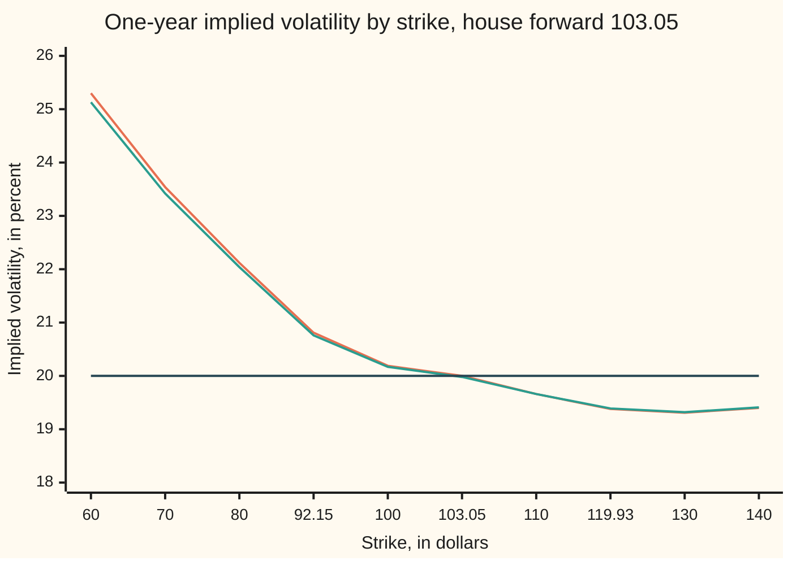
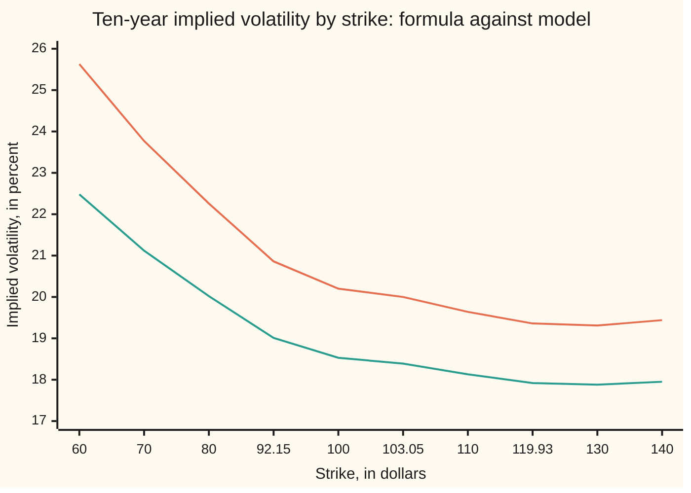

# SABR and Hagan's formula: a stochastic-vol model whose implied volatility you can write down

Financial mathematics → Stochastic volatility - Heston, SABR and their mix → A smile in closed form → SABR and Hagan's formula

---

## General Overview

Acme shares trade at $100. The one-year forward on them is $103.05: the price agreed today for a share delivered in a year, carrying a year of 5 percent interest less a year of 2 percent dividends. A dealer quotes three one-year options on that forward: a put struck at $92.15, a call at $100 and a call at $119.93. The outer two are the house market's 25-delta put and call: at those strikes a one-dollar move in the share moves the option by about 25 cents ([strike-from-delta](../11-Implied%20volatility%20and%20the%20vanilla%20inverses/03-strike-from-delta.md)).

Black-76 prices all three from one volatility ([black-76-and-forward-level-pricing](../05-Black-Scholes%20from%20the%20Ground%20Up/06-black-76-and-forward-level-pricing.md)). Markets do not. Each strike gets its own implied volatility, the single volatility at which Black-76 returns that strike's price, and on shares the low strikes carry the higher numbers: the skew ([volatility-smile-and-skew](../12-The%20smile%20and%20the%20surface/01-volatility-smile-and-skew.md)). One constant volatility cannot draw that curve. A volatility that moves can.

SABR moves it. The forward takes random steps sized by a volatility, and the volatility takes random steps of its own, correlated with the forward's. Patrick Hagan, Deep Kumar, Andrew Lesniewski and Diana Woodward published it in 2002. They had shown that the local-volatility models then in use (volatility a fixed function of price and time) moved the smile the wrong way when the forward moved. The name, stochastic alpha beta rho, lists three of its four dials. Alpha is today's volatility level. Beta, the backbone exponent, sets how a step's size scales with the forward's level. Rho is the correlation between the two walks. Nu, the vol of vol, sets how hard the volatility is kicked.

Set beta to 1, rho to −0.3 and nu to 0.4, and pick alpha so the at-the-money volatility (strike at the forward, 103.05) is 20 percent. Simulating the model gives 20.76% at the 92.15 strike, 20.17% at 100 and 19.39% at 119.93. Heston prices by one numerical integral ([heston-pricing-by-characteristic-function](02-heston-pricing-by-characteristic-function.md)); SABR has no general price formula. It has something a desk wants more: Hagan's formula, which writes each implied volatility down in one line: 20.81%, 20.19% and 19.38%. That is within 0.05 vol points of the model (a vol point is one percentage point of volatility). Toward low strikes the two drift apart, to 0.17 points at 60.

**SABR gives a forward's volatility its own correlated random walk, and Hagan's formula turns that model into one implied volatility per strike, accurate near the money for short expiries and drifting away far from the money and at long ones.**

**What kind of fact this is:** an approximation, with its error stated. SABR itself is a model, an assumption about how a forward and its volatility move, not a law. Hagan's formula expands that model's implied volatility for short expiries. Its leading term is derived in Why it works, in full without correlation and confirmed by direct search with it; its error is measured against two simulations of the model: 0.04 vol points at the 25-delta put at one year, and 20.00% against 18.39% at the money at ten years.

### The picture: one year, three answers



Orange: Hagan's formula. Green: the model, simulated (road 2 of the checks). Dark: Black-76's single 20 percent. The first two coincide to the eye; their gap, drawn to scale in Worked numbers, stays under a fifth of a vol point.

---

## The formula

Notation first. $W_1$ and $W_2$ are Brownian motions, the random drivers of Itô calculus: over a tiny time step dt each delivers a kick with average zero and variance dt. An equation such as dF = … says how much a quantity moves over one such step, the reading [euler-maruyama-scheme](../../11-Stochastic%20processes%20and%20calculus/08-Generators%2C%20Densities%20and%20Simulation/04-euler-maruyama-scheme.md) simulates.

The model, written on the forward:

$$dF_t = \alpha_t\,F_t^{\beta}\,dW_1, \qquad d\alpha_t = \nu\,\alpha_t\,dW_2, \qquad dW_1\,dW_2 = \rho\,dt,$$

starting from today's forward $F$ and today's volatility level $\alpha$.

**Read it aloud:** each instant, the forward takes a random step sized by the current volatility times the forward to the power beta; the volatility takes a random step in proportion to itself; and the two steps lean together with correlation rho.

No drift appears: in Black-76's pricing, a forward to the option's own expiry drifts nowhere. The volatility's walk is multiplicative, so it stays positive. With $\beta = 1$ the forward moves in proportions, as a share price does.

Hagan's formula, for a European option with strike $K$ expiring in $T$ years:

$$\sigma_B(K) = \frac{\alpha}{(FK)^{\frac{1-\beta}{2}}\Bigl[1 + \frac{(1-\beta)^2}{24}\ln^2\frac{F}{K} + \frac{(1-\beta)^4}{1920}\ln^4\frac{F}{K}\Bigr]}\cdot\frac{z}{\chi(z)}\cdot\Bigl[1 + \Bigl(\frac{(1-\beta)^2\,\alpha^2}{24\,(FK)^{1-\beta}} + \frac{\rho\beta\nu\alpha}{4\,(FK)^{\frac{1-\beta}{2}}} + \frac{2-3\rho^2}{24}\,\nu^2\Bigr)T\Bigr]$$

**Read it aloud:** the volatility at a strike is the volatility level rescaled for the backbone, bent by a factor set by the strike's distance from the forward, and lifted by a small factor that grows with time.

With $\beta = 1$, as on this card, every term carrying $1-\beta$ vanishes:

$$\sigma_B(K) = \alpha\,\frac{z}{\chi(z)}\,\Bigl[1 + \Bigl(\frac{\rho\nu\alpha}{4} + \frac{2-3\rho^2}{24}\,\nu^2\Bigr)T\Bigr]$$

| Symbol | Plain meaning | In our example | Push it up and the answer… |
| --- | --- | --- | --- |
| $F$, $F_t$, $F_T$ | the forward today; at time t; at expiry | 103.045453 | at beta 1 the smile slides along |
| $K$ | the strike | 92.15, 100, 119.93 | falls here, then turns up past 130 |
| $T$ | years to expiry | 1 | the time factor and the error grow |
| $\alpha$, $\alpha_t$, $\alpha_T$ | the volatility level today; at time t; at expiry | 0.198893 | lifts every strike almost one for one |
| $\beta$ | the backbone exponent: how the forward's step scales with its level | 1 | lowering it steepens the skew |
| $\rho$ | correlation of the forward's kicks with the volatility's (say "rho") | −0.3 | the skew flattens, then reverses |
| $\nu$ | the vol of vol (say "nu"): how hard the volatility is kicked | 0.4 | curls both wings up |
| $W_1$, $W_2$ | the Brownian motions driving forward and volatility | — | — |
| $\sigma_B$ | the Black volatility the formula returns for a strike | 0.208066 at 92.15 | — |
| $z$ | log-distance from forward to strike, scaled by the vol of vol over the level | 0.224749 at 92.15 | a bigger bend |
| $\chi(z)$ | nu times the length of the cheapest route to the strike (say "chi"), negative above the forward | 0.216037 at 92.15 | — |
| $V$ | variance one volatility path piles up: alpha squared summed over the life | one per path | — |

The two helpers:

$$z = \frac{\nu}{\alpha}\,(FK)^{\frac{1-\beta}{2}}\ln\frac{F}{K}, \qquad \chi(z) = \ln\frac{\sqrt{1-2\rho z+z^2}+z-\rho}{1-\rho}.$$

$z$ is the log-distance from forward to strike, scaled by the vol of vol over the volatility level. $\chi(z)$ is close to $z$ near the money, so the bend tends to 1 there. At the money, where the strike equals the forward, only the time factor is left:

$$\sigma_B(F) = \alpha\,\Bigl[1 + \Bigl(\frac{\rho\nu\alpha}{4} + \frac{2-3\rho^2}{24}\,\nu^2\Bigr)T\Bigr] \qquad (\beta = 1).$$

For other beta, divide the level by the forward to the power 1 − beta and put the forward squared in place of FK. Hagan's paper writes chi as x(z); the formula is its equation 2.17.

### When it holds

- **Short expiries, or a calm volatility.** The formula expands in the vol of vol squared times the years. At one year it sits within 0.05 vol points of the model at the three quoted strikes. At ten years it says 20.00% at the money against the model's 18.39%, so every option priced from it comes out too dear.
- **Strikes near the forward.** The error grows with distance from the forward, fastest on the low side, where the negative correlation raises volatility: 0.04 points at 92.15, 0.17 at 60. Far enough out, the formula's wing climbs faster than any arbitrage-free smile can. With beta below 1 and low forwards that happens at ordinary strikes, which is why the same authors published an arbitrage-free repair in 2014.
- **Constant dials.** Beta, rho and nu stay fixed over the option's life. A market fits one set per expiry, and nothing ties one expiry's set to the next; tying a surface together is the business of [stochastic-local-volatility](06-stochastic-local-volatility.md).
- **A positive forward.** With beta 1 it never reaches zero, but a negative forward, as European rates were from 2014, cannot be fed in at all. Rates desks shift the forward up first ([shifted-lognormal-and-volatility-conversion](../05-Black-Scholes%20from%20the%20Ground%20Up/08-shifted-lognormal-and-volatility-conversion.md)).

**Conventions verified 24 Sep 2026** against Hagan et al. (2002), equation 2.17: the formula returns a Black volatility, annualised, with time in years, to be fed to Black's formula on the forward, not to a normal-volatility formula.

---

## Why it works

### Step 0: implied volatility is a distance

Over a short wait, a random walk reaches a far level almost only along its cheapest route, and the chance of getting there falls off like a bell curve's tail in that route's length. Length is counted in the walk's own units: each small step is its size divided by the volatility where it is taken. This is Varadhan's formula from the theory of diffusions.

In Black-76 the log-forward has one volatility, so the length from forward to strike is the log-distance divided by that volatility. Any other model has its own shortest length, and its implied volatility is the flat volatility giving the same length:

$$\sigma_B(K) \;\approx\; \frac{\lvert\ln(F/K)\rvert}{\text{shortest length from today to the strike}}.$$

Henri Berestycki, Jérôme Busca and Igor Florent proved in 2004 that this becomes exact as the expiry shrinks to zero. Hagan's middle factor, $\alpha\,z/\chi(z)$, is this ratio worked out for SABR.

### Step 1: the cheap route runs through high volatility

SABR's state is two numbers, the log-forward and the volatility: a point on a map. A step in the log-forward costs its size divided by the volatility; a step in the volatility costs its size divided by $\nu$ times the volatility. Where volatility is high, moving the forward is cheap, so the cheapest route to a far strike lets the volatility rise first.

With $\rho = 0$ this map is the hyperbolic plane, the geometry in which a triangle's angles add to less than 180 degrees. Its distances are known: the shortest route to the strike has length $\operatorname{arcsinh}(z)/\nu$, where arcsinh undoes the hyperbolic sine, $\sinh x = (e^x - e^{-x})/2$. Step 0 then gives $\alpha\,z/\operatorname{arcsinh}(z)$, and $\operatorname{arcsinh}(z) = \ln\bigl(\sqrt{1+z^2} + z\bigr)$ is $\chi(z)$ at $\rho = 0$.

Since $\operatorname{arcsinh}(z)$ is smaller than $z$ in size for every nonzero $z$, the volatility exceeds its level on both sides of the forward: a smile, symmetric in log-strike. The checks give 20.17% at 92.15 and at its mirror strike 115.23. With $\nu = 0$ the route cannot bend, and the formula returns Black-76's flat answer.

### Step 2: correlation tilts the map

With $\rho = -0.3$ a falling forward tends to come with a rising volatility. The map shears: routes downward pass through high volatility cheaply, routes upward do not. The checks search for the cheapest routes (golden-section search, which shrinks a bracket by the golden ratio each pass). The route to 92.15 arrives with volatility 0.216543; the route to 119.93 with 0.189734. Per unit of log-distance, low strikes are nearer in this length, so their implied volatility is higher. That is the skew.

The route's length is $\lvert\chi(z)\rvert/\nu$, and the closed form has a plain reading:

$$\chi(z) = \int_0^z \frac{dy}{\sqrt{1 - 2\rho y + y^2}}.$$

After the forward has moved a scaled distance y toward the strike (log-distance times nu over alpha, the scaling in $z$), the formula acts as if the volatility were $\alpha\sqrt{1 - 2\rho y + y^2}$. At the far end for 92.15 that is 0.198893 × 1.088743 = 0.216543, the arrival volatility the search found. So the leading term is a harmonic average (the reciprocal of the average reciprocal) of the volatility met on the way. The checks reach $\chi(z) = 0.216037$ three ways: closed form, Simpson's rule on the integral, and $\nu$ times the searched length.

<details>
<summary>Detailed proof: the shortest length</summary>

**Lengths.** Write $x$ for the log-forward. Over a time step dt its step has standard deviation $\alpha\sqrt{dt}$, the volatility's has $\nu\alpha\sqrt{dt}$, and they correlate by $\rho$. A small move, dx and dα, has length measured against that spread (the inverse covariance):
$$ds^2 = \frac{\nu^2\,dx^2 - 2\rho\nu\,dx\,d\alpha + d\alpha^2}{\nu^2\,(1-\rho^2)\,\alpha^2}.$$
Put $u = (\nu x - \rho\alpha)/\sqrt{1-\rho^2}$. Then $ds^2 = (du^2 + d\alpha^2)/(\nu^2\alpha^2)$: Poincaré's half-plane, the standard model of hyperbolic geometry, lengths divided by $\nu$. Its distance between two points is arccosh of 1 plus their squared straight-line gap over twice the product of their heights (arccosh undoes $\cosh x = (e^x + e^{-x})/2$), which the checks' search minimises.

**With $\rho = 0$.** Today sits at height $\alpha$ above $u = 0$, and the strike is the vertical line $u = \nu\ln(K/F)$. The shortest route to it is an arc of the circle centred where that line meets the axis, ending at the circle's top. From angle θ to the top such an arc has length |ln tan(θ/2)|, which from today's point is $\operatorname{arcsinh}\lvert z\rvert$. Divide by $\nu$ and use Step 0:
$$\sigma_B \;\to\; \frac{\lvert\ln(F/K)\rvert}{\operatorname{arcsinh}\lvert z\rvert/\nu} \;=\; \alpha\,\frac{z}{\operatorname{arcsinh} z}.$$
**With $\rho \neq 0$.** The strike's line leans: $u = (\nu\ln(K/F) - \rho\alpha)/\sqrt{1-\rho^2}$. A leaning line stays a fixed hyperbolic distance from the vertical line through its foot, so its distance from a point still has a closed form, $\lvert\chi(z)\rvert/\nu$; the search confirms 0.216037 at 92.15.

</details>

### Step 3: a year adds the time factor

Step 0 is exact only as the expiry shrinks to nothing. The last bracket of the formula corrects for a real year, and at the money it is all there is.

With $\rho = 0$ the $\nu^2$ part is two effects pulling against each other. Given one volatility path the forward is lognormal with total variance $V$ (the other door, below), and the at-the-money price is close to the forward times $\sqrt{V/(2\pi)}$. The volatility's square averages $\alpha^2 e^{\nu^2 t}$ at time t, so $V/(\alpha^2T)$ averages $1 + \nu^2T/2$, which alone would lift the volatility by $\nu^2T/4$. But $V$ differs from path to path: to first order $V/(\alpha^2T)$ is 1 plus $2\nu$ times the time-average of $W_2$, whose variance is $T/3$, so it has variance $4\nu^2T/3$. A square root averages less than the root of the average (Jensen's inequality), here by an eighth of that variance, $\nu^2T/6$. The net lift is $\nu^2T/12$, the formula's $(2-3\rho^2)\nu^2T/24$ at $\rho = 0$.

Correlation adds $\rho\nu\alpha/4$ and removes $3\rho^2\nu^2/24$, from carrying Step 2's tilt one order further. Hagan and his co-authors got these from a singular-perturbation expansion (a systematic expansion in small volatility and small vol of vol) of the pricing equation; this card takes them from the paper and tests them by simulation. Here the bracket is 1 + (−0.005967 + 0.011533) = 1.005567: a year lifts the volatility by 0.56 percent of itself.

### Step 4: reading the dials, and setting alpha

Near the money, leaving out the time factor, the $\beta = 1$ formula expands in powers of the log-strike (Hagan et al., equation 3.1):

$$\sigma_B(K) \;\approx\; \alpha + \frac{\rho\nu}{2}\ln\frac{K}{F} + \frac{(2-3\rho^2)\,\nu^2}{12\,\alpha}\ln^2\frac{K}{F}.$$

Each term has one job. $\alpha$ sets the level. $\rho\nu/2$ is the slope, −0.06 here: each 1 percent drop in strike adds 0.06 vol points. $(2-3\rho^2)\nu^2/(12\alpha)$, 0.115975 here, curves both wings up. $\beta$ sets the backbone, the path the at-the-money volatility traces as the forward moves, roughly $\alpha/F^{1-\beta}$. At $\beta = 1$ the backbone is flat and the smile rides along with the forward: sticky moneyness, in the terms of [smile-adjusted-delta](../12-The%20smile%20and%20the%20surface/05-smile-adjusted-delta.md).

Markets quote the at-the-money volatility, not $\alpha$. At $\beta = 1$ the at-the-money formula is a quadratic in $\alpha$:

$$\sigma_B(F) = \Bigl(1 + \frac{2-3\rho^2}{24}\,\nu^2 T\Bigr)\alpha + \frac{\rho\nu T}{4}\,\alpha^2.$$

Existence and uniqueness first. With $\rho$ negative the right side is a hill: it rises from 0 at $\alpha = 0$ to a peak of 8.526664, an 853 percent volatility, then falls. Every quote below the peak meets the rising side exactly once; zero gives $\alpha = 0$; at the peak the two roots meet; a quote above it has no $\alpha$. The other root, 33.518885, lies on the falling side, where a higher alpha would lower the quote, and is discarded. With $\rho$ zero or positive the right side rises for ever, and every positive quote has one $\alpha$. The small root, in the form that stays accurate when the square term is tiny:

$$\alpha = \frac{2\,\sigma_B(F)}{\Bigl(1 + \frac{2-3\rho^2}{24}\nu^2T\Bigr) + \sqrt{\Bigl(1 + \frac{2-3\rho^2}{24}\nu^2T\Bigr)^2 + \rho\nu T\,\sigma_B(F)}}\,,$$

0.198893 here; bisection on the full formula agrees to twelve digits. For $\beta$ below 1 the equation is a cubic; at $\beta = 0.5$ with these dials it rises throughout, so bisection finds its one root.

### The other door: price the model, not the formula

Given one path of the volatility, the forward at expiry is lognormal, so Black-76 prices the option exactly along that path. Averaging over simulated paths gives the model's own price, up to sampling noise: road 2 of the checks. John Hull and Alan White did this without correlation in 1987; Marc Romano and Nizar Touzi added it in 1997. It needs simulation, too slow to quote from, but it is the yardstick Hagan is measured against ([monte-carlo-pricing](../06-Numerical%20Methods%20for%20Pricing/01-monte-carlo-pricing.md)).

<details>
<summary>Why one volatility path makes the forward lognormal</summary>

At $\beta = 1$ the log-forward moves by $\alpha_t\,dW_1 - \tfrac12\alpha_t^2\,dt$. Split the forward's driver into $\rho\,dW_2$ plus $\sqrt{1-\rho^2}$ times a Brownian motion independent of the volatility. Since $d\alpha_t = \nu\alpha_t\,dW_2$, the sum of $\alpha_t\,dW_2$ over the life is $(\alpha_T - \alpha)/\nu$, known once the path is. The rest is normal with variance $(1-\rho^2)V$. So, given the path, the forward is lognormal with
$$\text{forward } F\exp\Bigl(\frac{\rho}{\nu}(\alpha_T - \alpha) - \tfrac12\rho^2 V\Bigr) \quad\text{and total variance } (1-\rho^2)\,V.$$

</details>

---

## Worked numbers, by hand

The 25-delta put strike, 92.15, one year, house forward.

| Step | Arithmetic | Value |
| --- | --- | --- |
| forward | $100 \times e^{0.05-0.02}$ | 103.045453 |
| vol-of-vol term | $(2 - 3 \times 0.09) \times 0.16 / 24$ | 0.011533 |
| $\alpha$ from a 20% at-the-money quote | $0.40 / (1.011533 + \sqrt{1.011533^2 - 0.12 \times 0.20})$ | 0.198893 |
| log-distance to the strike | $\ln(103.045453 / 92.15)$ | 0.111753 |
| $z$ | $(0.4 / 0.198893) \times 0.111753$ | 0.224749 |
| the root inside $\chi$ | $\sqrt{1 + 0.6 \times 0.224749 + 0.224749^2}$ | 1.088743 |
| $\chi(z)$ | $\ln\bigl((1.088743 + 0.224749 + 0.3) / 1.3\bigr)$ | 0.216037 |
| the bend, $z/\chi(z)$ | $0.224749 / 0.216037$ | 1.040329 |
| correlation term $\rho\nu\alpha/4$ | $-0.3 \times 0.4 \times 0.198893 / 4$ | −0.005967 |
| time factor | $1 + (-0.005967 + 0.011533) \times 1$ | 1.005567 |
| **Hagan's volatility at 92.15** | $0.198893 \times 1.040329 \times 1.005567$ | **0.208066, or 20.81%** |
| the model, simulated (road 2) | 200,000 path pairs | 20.76% |

In money, discounted at 5 percent: the put costs $3.59 by the formula, $3.58 by simulating the model, and $3.33 at Black-76's flat 20 percent. The skew is worth 26 cents on this put; the formula's error is about one cent.

### The gap, strike by strike

```
Hagan minus the simulated model, one year, in vol points; one block = 0.01 (█ formula above, ░ below)
 60.00  █████████████████ +0.170
 70.00  ████████████      +0.124
 80.00  ████████          +0.083
 92.15  ████              +0.042
100.00  ██                +0.022
103.05  ██                +0.015
110.00                    +0.003
119.93  ░                 -0.007
130.00  ░                 -0.011
140.00  ░                 -0.009
```

From the forward upward the two agree to about a hundredth of a vol point. Below it the formula runs high, and the excess grows steadily toward low strikes, the side where the negative correlation piles up the model's extra volatility.

### What breaks if you drop a piece

| Mistake | Comes out at | What went wrong |
| --- | --- | --- |
| Reading alpha as the at-the-money volatility, 0.20 | 20.11% at the money, not 20.00% | Alpha is the level before the time factor |
| One flat 20% for the 25-delta put | $3.33, not $3.59 | One volatility for every strike is Black-76, which SABR exists to correct |
| Correlation entered as +0.3 | 19.71% at 92.15, 21.40% at 119.93 | The skew reverses: volatility now rises with the forward |
| Trusting the formula at ten years | 20.00% at the money, against the model's 18.39% | The expansion runs in vol of vol squared times years; ten years leaves its range |

The code prints every figure in the table. The last row, strike by strike:



Orange: Hagan's formula, alpha reset to quote 20% at the money at ten years. Green: the model with that alpha, simulated. The formula sits above everywhere: 20.00% against 18.39% at the money, 25.63% against 22.48% at 60.

---

## Code, from first principles, and it actually runs

Three roads to the one-year smile, none borrowing from another. Road 1 is Hagan's formula. Road 2 simulates only the volatility, 200,000 pairs of mirror-image paths of 20 steps, and prices each path exactly with Black-76 (the other door). Road 3 simulates both equations, 40,000 pairs of 50 steps, with Euler steps on the log-forward and the volatility held fixed within each step, and averages the payoffs. Both simulations use the forward as a control variate, since its average is known, and report standard errors ([variance-reduction-for-pricing](../06-Numerical%20Methods%20for%20Pricing/02-variance-reduction-for-pricing.md)). Implied volatilities come back by bisection ([implied-volatility-by-newton-and-bisection](../11-Implied%20volatility%20and%20the%20vanilla%20inverses/02-implied-volatility-by-newton-and-bisection.md)). Beside the roads, alpha is found two ways and chi three. The bell-curve area is Marsaglia's power series; the random numbers are splitmix64 integers (a standard 64-bit scrambler) turned into bell-curve draws by the Box-Muller transform.

### Python

```python
# SABR and Hagan's formula -- the check behind the card.  Standard library only: the normal CDF, root
# finders, integrator and random numbers are written here.  Hagan's formula meets two simulations of SABR.
from math import log, exp, sqrt, cos, sin, pi, acosh

F, R, T, RHO, NU, ATM = 100.0 * exp(0.05 - 0.02), 0.05, 1.0, -0.3, 0.4, 0.20
KS, M64 = [60.0, 70.0, 80.0, 92.15, 100.0, F, 110.0, 119.93, 130.0, 140.0], (1 << 64) - 1

def ncdf(x):                     # Marsaglia: 1/2 + phi(x) (x + x^3/3 + x^5/15 + ...)
    if abs(x) > 9.0: return 0.0 if x < 0.0 else 1.0
    s, t, b, i = x, 0.0, x, 1.0
    while s != t:
        t, i = s, i + 2.0
        b *= x * x / i
        s = t + b
    return 0.5 + s * exp(-0.5 * x * x) / sqrt(2.0 * pi)
def black(f, k, vol, t):         # Black-76 call on forward f, not yet discounted
    v = vol * sqrt(t)
    d1 = (log(f / k) + 0.5 * v * v) / v
    return f * ncdf(d1) - k * ncdf(d1 - v)
def bisect(fn, lo, hi):          # root of an increasing function, 100 halvings
    for _ in range(100):
        mid = 0.5 * (lo + hi)
        lo, hi = (mid, hi) if fn(mid) < 0.0 else (lo, mid)
    return 0.5 * (lo + hi)
def chi(z, rho): return log((sqrt(1.0 - 2.0 * rho * z + z * z) + z - rho) / (1.0 - rho))
def hagan(k, a, t, beta=1.0, rho=RHO, nu=NU):      # Hagan et al. (2002), any beta
    fk, lf, e = (F * k) ** ((1.0 - beta) / 2.0), log(F / k), 1.0 - beta
    z = nu / a * fk * lf
    zx = 1.0 if abs(z) < 1e-12 else z / chi(z, rho)
    back = fk * (1.0 + e * e / 24.0 * lf * lf + e * e * e * e / 1920.0 * lf * lf * lf * lf)
    corr = e * e / 24.0 * a * a / (fk * fk) + rho * beta * nu * a / (4.0 * fk) \
        + (2.0 - 3.0 * rho * rho) / 24.0 * nu * nu
    return a / back * zx * (1.0 + corr * t)
def alpha_quadratic(t, rho=RHO):  # beta = 1: b a^2 + (1 + c t) a = ATM, the small root
    c, b = (2.0 - 3.0 * rho * rho) / 24.0 * NU * NU, rho * NU * t / 4.0
    return 2.0 * ATM / ((1.0 + c * t) + sqrt((1.0 + c * t) * (1.0 + c * t) + 4.0 * b * ATM))
def normals(seed):               # splitmix64 integers, then Box-Muller: two normals per two uniforms
    s, u = seed, [0.0, 0.0]
    while True:
        for j in range(2):
            s = (s + 0x9E3779B97F4A7C15) & M64
            z = ((s ^ (s >> 30)) * 0xBF58476D1CE4E5B9) & M64
            z = ((z ^ (z >> 27)) * 0x94D049BB133111EB) & M64
            u[j] = ((z ^ (z >> 31)) >> 11) * 2.0 ** -53 + 2.0 ** -54
        r, th = sqrt(-2.0 * log(u[0])), 2.0 * pi * u[1]
        yield from (r * cos(th), r * sin(th))
def simulate(t, a, pairs, steps, seed, mixing):  # (price, se, implied vol, its se) per strike
    rng, dt, xs, ps = normals(seed), t / steps, [], []
    for _ in range(pairs):
        zs, x, p = [(next(rng), 0.0 if mixing else next(rng)) for _ in range(steps)], 0.0, [0.0] * len(KS)
        for sign in (1.0, -1.0):                   # antithetic: each path and its mirror image
            al, var, lf = a, 0.0, log(F)
            for z2, z1 in zs:
                nxt = al * exp(sign * NU * sqrt(dt) * z2 - 0.5 * NU * NU * dt)  # vol: exact step
                var += 0.5 * (al * al + nxt * nxt) * dt                         # road 2: its variance
                lf += al * sqrt(dt) * sign * (RHO * z2 + sqrt(1.0 - RHO * RHO) * z1) - 0.5 * al * al * dt
                al = nxt                                                        # road 3: Euler on log F
            fe = F * exp(RHO / NU * (al - a) - 0.5 * RHO * RHO * var) if mixing else exp(lf)
            vol = sqrt((1.0 - RHO * RHO) * var / t)  # road 2: given the vol path, F_T is lognormal
            x += 0.5 * (fe - F)
            p = [pj + 0.5 * (black(fe, k, vol, t) if mixing else max(fe - k, 0.0)) for pj, k in zip(p, KS)]
        xs.append(x); ps.append(p)
    n, out, mx = float(pairs), [], sum(xs) / pairs  # control variate: the forward averages to F
    vx = sum((x - mx) * (x - mx) for x in xs) / n
    for j, k in enumerate(KS):
        mp = sum(p[j] for p in ps) / n
        bj = sum((x - mx) * (p[j] - mp) for x, p in zip(xs, ps)) / n / vx
        se = sqrt(sum((p[j] - mp - bj * (x - mx)) ** 2 for x, p in zip(xs, ps)) / n / n)
        iv = bisect(lambda s: black(F, k, s, t) - (mp - bj * mx), 1e-4, 2.0)
        vega = (black(F, k, iv + 1e-4, t) - black(F, k, iv - 1e-4, t)) / 2e-4
        out.append((mp - bj * mx, se, iv, se / vega))
    return out
def geodesic(k, a):              # shortest distance to the strike's line, by golden-section search
    s, l, g, lo, hi = sqrt(1.0 - RHO * RHO), log(k / F), (sqrt(5.0) - 1.0) / 2.0, 1e-4, 5.0
    def d(v):                    # hyperbolic distance from today's point to the point of the line at vol v
        du = -RHO * a / s - (NU * l - RHO * v) / s
        return acosh(1.0 + (du * du + (a - v) * (a - v)) / (2.0 * a * v)) / NU
    for _ in range(200):
        m1, m2 = hi - g * (hi - lo), lo + g * (hi - lo)
        lo, hi = (lo, m2) if d(m1) < d(m2) else (m1, hi)
    return d(0.5 * (lo + hi)), 0.5 * (lo + hi)
def show(rows):
    for label, v in rows: print(f"{label:<44}{v:>12.6f}")

a, c, b = alpha_quadratic(T), (2.0 - 3.0 * RHO * RHO) / 24.0 * NU * NU, RHO * NU * T / 4.0
a2, z, q = bisect(lambda x: hagan(F, x, T) - ATM, 1e-4, 3.0), NU / a * log(F / 92.15), RHO * NU * a / 4.0
(dist, v_dn), h = geodesic(92.15, a), z / 2000  # Simpson's rule on the slope of chi, 2000 slices
slope = [1.0 / sqrt(1.0 - 2.0 * RHO * w * h + w * h * w * h) for w in range(2001)]
chi_int = h / 3.0 * sum(y * (1 if i in (0, 2000) else 4 if i % 2 else 2) for i, y in enumerate(slope))
show((("forward F = 100 e^(0.05 - 0.02)", F), ("c = (2 - 3 rho^2) nu^2 / 24", c), ("b = rho nu T / 4", b),
      ("alpha, quadratic formula (beta = 1)", a), ("alpha, bisection on Hagan's ATM vol", a2),
      ("alpha, the quadratic's other root", -(1.0 + c * T) / b - a),
      ("ATM vol at the parabola's peak", (1.0 + c * T) ** 2 / (-4.0 * b)), ("Hagan's vol at K = F", hagan(F, a, T)),
      ("skew rho nu / 2", RHO * NU / 2.0), ("curvature (2 - 3 rho^2) nu^2 / (12 alpha)", 2.0 * c / a),
      ("K = 92.15: ln(F / K)", log(F / 92.15)), ("K = 92.15: z", z),
      ("K = 92.15: sqrt(1 - 2 rho z + z^2)", sqrt(1.0 - 2.0 * RHO * z + z * z)),
      ("K = 92.15: chi(z), closed form", chi(z, RHO)), ("K = 92.15: chi(z), Simpson integral", chi_int),
      ("K = 92.15: nu times shortest distance", NU * dist), ("K = 92.15: z / chi(z)", z / chi(z, RHO)),
      ("rho nu alpha / 4", q), ("time factor 1 + (rho nu alpha / 4 + c) T", 1.0 + (q + c) * T),
      ("K = 92.15: Hagan's vol", hagan(92.15, a, T)), ("K = 92.15: arrival vol, by search", v_dn),
      ("K = 119.93: arrival vol, by search", geodesic(119.93, a)[1])))

hag = [hagan(k, a, T) for k in KS]                  # road 1: the formula
mix = simulate(T, a, 200000, 20, 1, True)           # road 2: vol paths, exact lognormal given each
eul = simulate(T, a, 40000, 50, 2, False)           # road 3: both equations stepped by Euler
print("strike  Hagan %  mixing %   se vp  Euler %    se vp   gap vp")
for k, hk, m, e in zip(KS, hag, mix, eul):
    print(f"{k:6.2f}" + "".join(f"{100 * v:9.3f}" for v in (hk, m[2], m[3], e[2], e[3])) + f"{100 * (hk - m[2]):+9.3f}")
D, a10, ap = exp(-R * T), alpha_quadratic(10.0), alpha_quadratic(T, 0.0)
print("dollars, discounted      Hagan   simulated")
for k, kind in ((92.15, "put"), (100.0, "call"), (119.93, "call")):
    j, cut = KS.index(k), (F - k if kind == "put" else 0.0)
    print(f"{kind + f' K = {k:.2f}':<21}{D * (black(F, k, hag[j], T) - cut):9.4f}{D * (mix[j][0] - cut):12.4f}")
mix10, ab = simulate(10.0, a10, 10000, 100, 3, True), bisect(lambda x: hagan(F, x, T, 0.5) - ATM, 1e-4, 3.0 * sqrt(F))
show((("house call K = 100 at a flat 20%, dollars", D * black(F, 100.0, ATM, T)),
      ("wrong: alpha read as the ATM vol", hagan(F, ATM, T)),
      ("wrong: flat 20%, put K = 92.15, dollars", D * (black(F, 92.15, ATM, T) - F + 92.15)),
      ("wrong: rho = +0.3, vol at 92.15", hagan(92.15, a, T, 1.0, 0.3)),
      ("wrong: rho = +0.3, vol at 119.93", hagan(119.93, a, T, 1.0, 0.3)),
      ("try: rho = 0, vol at 92.15", hagan(92.15, ap, T, 1.0, 0.0)),
      ("try: rho = 0, vol at F^2 / 92.15 = 115.23", hagan(F * F / 92.15, ap, T, 1.0, 0.0)),
      ("try: beta = 0.5, alpha", ab), ("try: beta = 0.5, vol at 92.15", hagan(92.15, ab, T, 0.5)),
      ("try: beta = 0.5, vol at 119.93", hagan(119.93, ab, T, 0.5))))
print(f"{'chart, strike':<23}" + "".join(f"{k:7.2f}" for k in KS))
for label, vals in (("chart, Hagan 1y %", hag), ("chart, simulated 1y %", [m[2] for m in mix]),
                    ("chart, Hagan 10y %", [hagan(k, a10, 10.0) for k in KS]),
                    ("chart, simulated 10y %", [m[2] for m in mix10])):
    print(f"{label:<23}" + "".join(f"{100 * v:7.2f}" for v in vals))
gap = [hk - m[2] for hk, m in zip(hag, mix)]
assert abs(a - a2) < 1e-12, "closed-form alpha vs bisection on the whole formula"
assert abs(chi(z, RHO) - chi_int) < 1e-10, "chi in closed form vs Simpson's rule on its slope"
assert abs(chi(z, RHO) - NU * dist) < 1e-9 and abs(v_dn - a * sqrt(1.0 - 2.0 * RHO * z + z * z)) < 1e-7, \
    "chi and the arrival vol, closed form vs the search"
for m, e in zip(mix, eul):
    assert abs(m[0] - e[0]) < 4.0 * sqrt(m[1] * m[1] + e[1] * e[1]), "the two simulations agree within noise"
for k in (92.15, 100.0, 119.93):
    assert abs(gap[KS.index(k)]) < 0.0005, "Hagan within 0.05 vol points of the model at one year"
assert gap[0] > gap[2] > gap[3] > gap[7], "the gap widens toward low strikes"
assert hagan(F, a10, 10.0) - mix10[5][2] > 0.01, "at ten years Hagan overstates the ATM vol by over a point"
print("ALL CHECKS PASS")
```

**Ran 2026-09-24 on macOS, Python 3.14.6, standard library only. All checks passed. Output, pasted from the run:**

```
forward F = 100 e^(0.05 - 0.02)               103.045453
c = (2 - 3 rho^2) nu^2 / 24                     0.011533
b = rho nu T / 4                               -0.030000
alpha, quadratic formula (beta = 1)             0.198893
alpha, bisection on Hagan's ATM vol             0.198893
alpha, the quadratic's other root              33.518885
ATM vol at the parabola's peak                  8.526664
Hagan's vol at K = F                            0.200000
skew rho nu / 2                                -0.060000
curvature (2 - 3 rho^2) nu^2 / (12 alpha)       0.115975
K = 92.15: ln(F / K)                            0.111753
K = 92.15: z                                    0.224749
K = 92.15: sqrt(1 - 2 rho z + z^2)              1.088743
K = 92.15: chi(z), closed form                  0.216037
K = 92.15: chi(z), Simpson integral             0.216037
K = 92.15: nu times shortest distance           0.216037
K = 92.15: z / chi(z)                           1.040329
rho nu alpha / 4                               -0.005967
time factor 1 + (rho nu alpha / 4 + c) T        1.005567
K = 92.15: Hagan's vol                          0.208066
K = 92.15: arrival vol, by search               0.216543
K = 119.93: arrival vol, by search              0.189734
strike  Hagan %  mixing %   se vp  Euler %    se vp   gap vp
 60.00   25.300   25.130    0.010   24.993    0.133   +0.170
 70.00   23.542   23.418    0.006   23.324    0.095   +0.124
 80.00   22.119   22.036    0.003   21.967    0.079   +0.083
 92.15   20.807   20.765    0.002   20.725    0.073   +0.042
100.00   20.191   20.170    0.001   20.166    0.072   +0.022
103.05   20.000   19.985    0.001   19.987    0.071   +0.015
110.00   19.658   19.655    0.001   19.655    0.067   +0.003
119.93   19.380   19.387    0.001   19.352    0.063   -0.007
130.00   19.309   19.320    0.001   19.231    0.066   -0.011
140.00   19.402   19.411    0.002   19.253    0.078   -0.009
dollars, discounted      Hagan   simulated
put K = 92.15           3.5885      3.5751
call K = 100.00         9.2995      9.2913
call K = 119.93         2.5312      2.5335
house call K = 100 at a flat 20%, dollars       9.227006
wrong: alpha read as the ATM vol                0.201107
wrong: flat 20%, put K = 92.15, dollars         3.333126
wrong: rho = +0.3, vol at 92.15                 0.197139
wrong: rho = +0.3, vol at 119.93                0.214015
try: rho = 0, vol at 92.15                      0.201686
try: rho = 0, vol at F^2 / 92.15 = 115.23       0.201686
try: beta = 0.5, alpha                          2.012178
try: beta = 0.5, vol at 92.15                   0.213690
try: beta = 0.5, vol at 119.93                  0.186434
chart, strike            60.00  70.00  80.00  92.15 100.00 103.05 110.00 119.93 130.00 140.00
chart, Hagan 1y %        25.30  23.54  22.12  20.81  20.19  20.00  19.66  19.38  19.31  19.40
chart, simulated 1y %    25.13  23.42  22.04  20.76  20.17  19.98  19.66  19.39  19.32  19.41
chart, Hagan 10y %       25.63  23.77  22.26  20.86  20.20  20.00  19.64  19.36  19.31  19.44
chart, simulated 10y %   22.48  21.12  20.02  19.01  18.53  18.39  18.13  17.92  17.88  17.95
ALL CHECKS PASS
```

Roads 2 and 3 agree inside their error bars at every strike. Road 3's bars run from 0.063 to 0.133 vol points, road 2's from 0.001 to 0.010, so road 2 measures the formula's error and road 3 vouches for road 2. Road 3's misses move together across strikes because every strike is priced from the same paths.

### Rust

Same numbers, same labels, built with `rustc --edition 2021 -O`.

```rust
// SABR and Hagan's formula -- the same check as the Python, in Rust.  No crates: the normal CDF, root
// finders, integrator and random numbers are written here.  Hagan's formula meets two simulations of SABR.
use std::f64::consts::PI;
const R: f64 = 0.05; const T: f64 = 1.0; const RHO: f64 = -0.3; const NU: f64 = 0.4; const ATM: f64 = 0.20;
fn fwd() -> f64 { 100.0 * (0.05_f64 - 0.02).exp() }          // the house forward
fn ncdf(x: f64) -> f64 {                   // Marsaglia: 1/2 + phi(x) (x + x^3/3 + x^5/15 + ...)
    if x.abs() > 9.0 { return if x < 0.0 { 0.0 } else { 1.0 }; }
    let (mut s, mut t, mut b, mut i) = (x, 0.0, x, 1.0);
    while s != t { t = s; i += 2.0; b *= x * x / i; s = t + b; }
    0.5 + s * (-0.5 * x * x).exp() / (2.0 * PI).sqrt()
}
fn black(f: f64, k: f64, vol: f64, t: f64) -> f64 {       // Black-76 call, not yet discounted
    let v = vol * t.sqrt();
    let d1 = ((f / k).ln() + 0.5 * v * v) / v;
    f * ncdf(d1) - k * ncdf(d1 - v)
}
fn bisect<G: Fn(f64) -> f64>(g: G, mut lo: f64, mut hi: f64) -> f64 {   // increasing function
    for _ in 0..100 { let mid = 0.5 * (lo + hi); if g(mid) < 0.0 { lo = mid } else { hi = mid } }
    0.5 * (lo + hi)
}
fn chi(z: f64, rho: f64) -> f64 { (((1.0 - 2.0 * rho * z + z * z).sqrt() + z - rho) / (1.0 - rho)).ln() }
fn hagan(k: f64, a: f64, t: f64, beta: f64, rho: f64, nu: f64) -> f64 {   // Hagan et al. (2002)
    let (f, e) = (fwd(), 1.0 - beta);
    let (fk, lf) = ((f * k).powf((1.0 - beta) / 2.0), (f / k).ln());
    let z = nu / a * fk * lf;
    let zx = if z.abs() < 1e-12 { 1.0 } else { z / chi(z, rho) };
    let back = fk * (1.0 + e * e / 24.0 * lf * lf + e * e * e * e / 1920.0 * lf * lf * lf * lf);
    let corr = e * e / 24.0 * a * a / (fk * fk) + rho * beta * nu * a / (4.0 * fk)
        + (2.0 - 3.0 * rho * rho) / 24.0 * nu * nu;
    a / back * zx * (1.0 + corr * t)
}
fn alpha_quadratic(t: f64, rho: f64) -> f64 {   // beta = 1: b a^2 + (1 + c t) a = ATM, small root
    let (c, b) = ((2.0 - 3.0 * rho * rho) / 24.0 * NU * NU, rho * NU * t / 4.0);
    2.0 * ATM / ((1.0 + c * t) + ((1.0 + c * t) * (1.0 + c * t) + 4.0 * b * ATM).sqrt())
}
struct Normals { s: u64, spare: Option<f64> }    // splitmix64 integers, then Box-Muller
impl Normals {
    fn uniform(&mut self) -> f64 {
        self.s = self.s.wrapping_add(0x9E3779B97F4A7C15);
        let mut z = (self.s ^ (self.s >> 30)).wrapping_mul(0xBF58476D1CE4E5B9);
        z = (z ^ (z >> 27)).wrapping_mul(0x94D049BB133111EB);
        ((z ^ (z >> 31)) >> 11) as f64 * 2f64.powi(-53) + 2f64.powi(-54)
    }
    fn next(&mut self) -> f64 {
        if let Some(z) = self.spare.take() { return z; }
        let (r, th) = ((-2.0 * self.uniform().ln()).sqrt(), 2.0 * PI * self.uniform());
        self.spare = Some(r * th.sin());
        r * th.cos()
    }
}
// (price, se, implied vol, its se) per strike; road 2 when mixing, road 3 otherwise
fn simulate(t: f64, a: f64, ks: &[f64], pairs: usize, steps: usize, seed: u64, mixing: bool)
    -> Vec<(f64, f64, f64, f64)> {
    let (f, dt, mut rng) = (fwd(), t / steps as f64, Normals { s: seed, spare: None });
    let (mut xs, mut ps): (Vec<f64>, Vec<Vec<f64>>) = (Vec::new(), Vec::new());
    for _ in 0..pairs {
        let zs: Vec<(f64, f64)> = (0..steps)
            .map(|_| { let z2 = rng.next(); (z2, if mixing { 0.0 } else { rng.next() }) }).collect();
        let (mut x, mut p) = (0.0, vec![0.0; ks.len()]);
        for sign in [1.0, -1.0] {                                 // each path and its mirror image
            let (mut al, mut var, mut lf) = (a, 0.0, f.ln());
            for &(z2, z1) in &zs {
                let nxt = al * (sign * NU * dt.sqrt() * z2 - 0.5 * NU * NU * dt).exp();  // vol: exact
                var += 0.5 * (al * al + nxt * nxt) * dt;                                // road 2
                lf += al * dt.sqrt() * sign * (RHO * z2 + (1.0 - RHO * RHO).sqrt() * z1) - 0.5 * al * al * dt;
                al = nxt;                                                               // road 3: Euler
            }
            let fe = if mixing { f * (RHO / NU * (al - a) - 0.5 * RHO * RHO * var).exp() } else { lf.exp() };
            let vol = ((1.0 - RHO * RHO) * var / t).sqrt();      // given the vol path, F_T is lognormal
            x += 0.5 * (fe - f);
            for (pj, &k) in p.iter_mut().zip(ks) {
                *pj += 0.5 * if mixing { black(fe, k, vol, t) } else { (fe - k).max(0.0) };
            }
        }
        xs.push(x); ps.push(p);
    }
    let (n, mx) = (pairs as f64, xs.iter().sum::<f64>() / pairs as f64);   // control variate: E[F_T] = F
    let vx = xs.iter().map(|x| (x - mx) * (x - mx)).sum::<f64>() / n;
    ks.iter().enumerate().map(|(j, &k)| {
        let mp = ps.iter().map(|p| p[j]).sum::<f64>() / n;
        let bj = xs.iter().zip(&ps).map(|(x, p)| (x - mx) * (p[j] - mp)).sum::<f64>() / n / vx;
        let se = (xs.iter().zip(&ps).map(|(x, p)| (p[j] - mp - bj * (x - mx)).powi(2)).sum::<f64>() / n / n).sqrt();
        let price = mp - bj * mx;
        let iv = bisect(|s| black(f, k, s, t) - price, 1e-4, 2.0);
        let vega = (black(f, k, iv + 1e-4, t) - black(f, k, iv - 1e-4, t)) / 2e-4;
        (price, se, iv, se / vega)
    }).collect()
}
fn geodesic(k: f64, a: f64) -> (f64, f64) {      // shortest distance to the strike's line, golden section
    let (s, l, g, mut lo, mut hi) = ((1.0 - RHO * RHO).sqrt(), (k / fwd()).ln(), (5.0_f64.sqrt() - 1.0) / 2.0, 1e-4, 5.0);
    let d = |v: f64| {                           // hyperbolic distance to the line's point at vol v
        let du = -RHO * a / s - (NU * l - RHO * v) / s;
        (1.0 + (du * du + (a - v) * (a - v)) / (2.0 * a * v)).acosh() / NU
    };
    for _ in 0..200 {
        let (m1, m2) = (hi - g * (hi - lo), lo + g * (hi - lo));
        if d(m1) < d(m2) { hi = m2 } else { lo = m1 }
    }
    (d(0.5 * (lo + hi)), 0.5 * (lo + hi))
}
fn show(rows: &[(&str, f64)]) { for (label, v) in rows { println!("{:<44}{:>12.6}", label, v); } }
fn main() {
    let f = fwd();
    let ks = [60.0, 70.0, 80.0, 92.15, 100.0, f, 110.0, 119.93, 130.0, 140.0];
    let (a, c, b) = (alpha_quadratic(T, RHO), (2.0 - 3.0 * RHO * RHO) / 24.0 * NU * NU, RHO * NU * T / 4.0);
    let (a2, z, q) = (bisect(|x| hagan(f, x, T, 1.0, RHO, NU) - ATM, 1e-4, 3.0), NU / a * (f / 92.15).ln(), RHO * NU * a / 4.0);
    let ((dist, v_dn), h) = (geodesic(92.15, a), z / 2000.0);      // Simpson on the slope of chi
    let chi_int = h / 3.0 * (0..=2000).map(|i| {
        let w = i as f64;
        let y = 1.0 / (1.0 - 2.0 * RHO * w * h + w * h * w * h).sqrt();
        y * if i == 0 || i == 2000 { 1.0 } else if i % 2 == 1 { 4.0 } else { 2.0 }
    }).sum::<f64>();
    show(&[("forward F = 100 e^(0.05 - 0.02)", f), ("c = (2 - 3 rho^2) nu^2 / 24", c), ("b = rho nu T / 4", b),
        ("alpha, quadratic formula (beta = 1)", a), ("alpha, bisection on Hagan's ATM vol", a2),
        ("alpha, the quadratic's other root", -(1.0 + c * T) / b - a),
        ("ATM vol at the parabola's peak", (1.0 + c * T).powi(2) / (-4.0 * b)),
        ("Hagan's vol at K = F", hagan(f, a, T, 1.0, RHO, NU)), ("skew rho nu / 2", RHO * NU / 2.0),
        ("curvature (2 - 3 rho^2) nu^2 / (12 alpha)", 2.0 * c / a),
        ("K = 92.15: ln(F / K)", (f / 92.15).ln()), ("K = 92.15: z", z),
        ("K = 92.15: sqrt(1 - 2 rho z + z^2)", (1.0 - 2.0 * RHO * z + z * z).sqrt()),
        ("K = 92.15: chi(z), closed form", chi(z, RHO)), ("K = 92.15: chi(z), Simpson integral", chi_int),
        ("K = 92.15: nu times shortest distance", NU * dist), ("K = 92.15: z / chi(z)", z / chi(z, RHO)),
        ("rho nu alpha / 4", q), ("time factor 1 + (rho nu alpha / 4 + c) T", 1.0 + (q + c) * T),
        ("K = 92.15: Hagan's vol", hagan(92.15, a, T, 1.0, RHO, NU)), ("K = 92.15: arrival vol, by search", v_dn),
        ("K = 119.93: arrival vol, by search", geodesic(119.93, a).1)]);
    let hag: Vec<f64> = ks.iter().map(|&k| hagan(k, a, T, 1.0, RHO, NU)).collect();   // road 1
    let mix = simulate(T, a, &ks, 200000, 20, 1, true);                              // road 2
    let eul = simulate(T, a, &ks, 40000, 50, 2, false);                              // road 3
    println!("strike  Hagan %  mixing %   se vp  Euler %    se vp   gap vp");
    for j in 0..ks.len() {
        let cols: String = [hag[j], mix[j].2, mix[j].3, eul[j].2, eul[j].3].iter().map(|v| format!("{:9.3}", 100.0 * v)).collect();
        println!("{:6.2}{}{:+9.3}", ks[j], cols, 100.0 * (hag[j] - mix[j].2));
    }
    let (dsc, a10, ap) = ((-R * T).exp(), alpha_quadratic(10.0, RHO), alpha_quadratic(T, 0.0));
    println!("dollars, discounted      Hagan   simulated");
    for (j, kind) in [(3usize, "put"), (4, "call"), (7, "call")] {
        let cut = if kind == "put" { f - ks[j] } else { 0.0 };
        println!("{:<21}{:9.4}{:12.4}", format!("{} K = {:.2}", kind, ks[j]),
                 dsc * (black(f, ks[j], hag[j], T) - cut), dsc * (mix[j].0 - cut));
    }
    let mix10 = simulate(10.0, a10, &ks, 10000, 100, 3, true);
    let ab = bisect(|x| hagan(f, x, T, 0.5, RHO, NU) - ATM, 1e-4, 3.0 * f.sqrt());
    show(&[("house call K = 100 at a flat 20%, dollars", dsc * black(f, 100.0, ATM, T)),
        ("wrong: alpha read as the ATM vol", hagan(f, ATM, T, 1.0, RHO, NU)),
        ("wrong: flat 20%, put K = 92.15, dollars", dsc * (black(f, 92.15, ATM, T) - f + 92.15)),
        ("wrong: rho = +0.3, vol at 92.15", hagan(92.15, a, T, 1.0, 0.3, NU)),
        ("wrong: rho = +0.3, vol at 119.93", hagan(119.93, a, T, 1.0, 0.3, NU)),
        ("try: rho = 0, vol at 92.15", hagan(92.15, ap, T, 1.0, 0.0, NU)),
        ("try: rho = 0, vol at F^2 / 92.15 = 115.23", hagan(f * f / 92.15, ap, T, 1.0, 0.0, NU)),
        ("try: beta = 0.5, alpha", ab), ("try: beta = 0.5, vol at 92.15", hagan(92.15, ab, T, 0.5, RHO, NU)),
        ("try: beta = 0.5, vol at 119.93", hagan(119.93, ab, T, 0.5, RHO, NU))]);
    let line = |label: &str, vals: Vec<f64>| println!("{:<23}{}", label, vals.iter().map(|v| format!("{:7.2}", v)).collect::<String>());
    line("chart, strike", ks.to_vec());
    line("chart, Hagan 1y %", hag.iter().map(|v| 100.0 * v).collect());
    line("chart, simulated 1y %", mix.iter().map(|m| 100.0 * m.2).collect());
    line("chart, Hagan 10y %", ks.iter().map(|&k| 100.0 * hagan(k, a10, 10.0, 1.0, RHO, NU)).collect());
    line("chart, simulated 10y %", mix10.iter().map(|m| 100.0 * m.2).collect());
    let gap: Vec<f64> = hag.iter().zip(&mix).map(|(hk, m)| hk - m.2).collect();
    assert!((a - a2).abs() < 1e-12, "closed-form alpha vs bisection on the whole formula");
    assert!((chi(z, RHO) - chi_int).abs() < 1e-10, "chi in closed form vs Simpson's rule on its slope");
    assert!((chi(z, RHO) - NU * dist).abs() < 1e-9 && (v_dn - a * (1.0 - 2.0 * RHO * z + z * z).sqrt()).abs() < 1e-7,
        "chi and the arrival vol, closed form vs the search");
    for (m, e) in mix.iter().zip(&eul) {
        assert!((m.0 - e.0).abs() < 4.0 * (m.1 * m.1 + e.1 * e.1).sqrt(), "the two simulations agree within noise");
    }
    for j in [3, 4, 7] { assert!(gap[j].abs() < 0.0005, "Hagan within 0.05 vol points of the model at one year"); }
    assert!(gap[0] > gap[2] && gap[2] > gap[3] && gap[3] > gap[7], "the gap widens toward low strikes");
    assert!(hagan(f, a10, 10.0, 1.0, RHO, NU) - mix10[5].2 > 0.01, "at ten years Hagan overstates ATM by over a point");
    println!("ALL CHECKS PASS");
}
```

**Ran 2026-09-24 on macOS, rustc 1.98.1, no crates. All checks passed. Output, pasted from the run:**

```
forward F = 100 e^(0.05 - 0.02)               103.045453
c = (2 - 3 rho^2) nu^2 / 24                     0.011533
b = rho nu T / 4                               -0.030000
alpha, quadratic formula (beta = 1)             0.198893
alpha, bisection on Hagan's ATM vol             0.198893
alpha, the quadratic's other root              33.518885
ATM vol at the parabola's peak                  8.526664
Hagan's vol at K = F                            0.200000
skew rho nu / 2                                -0.060000
curvature (2 - 3 rho^2) nu^2 / (12 alpha)       0.115975
K = 92.15: ln(F / K)                            0.111753
K = 92.15: z                                    0.224749
K = 92.15: sqrt(1 - 2 rho z + z^2)              1.088743
K = 92.15: chi(z), closed form                  0.216037
K = 92.15: chi(z), Simpson integral             0.216037
K = 92.15: nu times shortest distance           0.216037
K = 92.15: z / chi(z)                           1.040329
rho nu alpha / 4                               -0.005967
time factor 1 + (rho nu alpha / 4 + c) T        1.005567
K = 92.15: Hagan's vol                          0.208066
K = 92.15: arrival vol, by search               0.216543
K = 119.93: arrival vol, by search              0.189734
strike  Hagan %  mixing %   se vp  Euler %    se vp   gap vp
 60.00   25.300   25.130    0.010   24.993    0.133   +0.170
 70.00   23.542   23.418    0.006   23.324    0.095   +0.124
 80.00   22.119   22.036    0.003   21.967    0.079   +0.083
 92.15   20.807   20.765    0.002   20.725    0.073   +0.042
100.00   20.191   20.170    0.001   20.166    0.072   +0.022
103.05   20.000   19.985    0.001   19.987    0.071   +0.015
110.00   19.658   19.655    0.001   19.655    0.067   +0.003
119.93   19.380   19.387    0.001   19.352    0.063   -0.007
130.00   19.309   19.320    0.001   19.231    0.066   -0.011
140.00   19.402   19.411    0.002   19.253    0.078   -0.009
dollars, discounted      Hagan   simulated
put K = 92.15           3.5885      3.5751
call K = 100.00         9.2995      9.2913
call K = 119.93         2.5312      2.5335
house call K = 100 at a flat 20%, dollars       9.227006
wrong: alpha read as the ATM vol                0.201107
wrong: flat 20%, put K = 92.15, dollars         3.333126
wrong: rho = +0.3, vol at 92.15                 0.197139
wrong: rho = +0.3, vol at 119.93                0.214015
try: rho = 0, vol at 92.15                      0.201686
try: rho = 0, vol at F^2 / 92.15 = 115.23       0.201686
try: beta = 0.5, alpha                          2.012178
try: beta = 0.5, vol at 92.15                   0.213690
try: beta = 0.5, vol at 119.93                  0.186434
chart, strike            60.00  70.00  80.00  92.15 100.00 103.05 110.00 119.93 130.00 140.00
chart, Hagan 1y %        25.30  23.54  22.12  20.81  20.19  20.00  19.66  19.38  19.31  19.40
chart, simulated 1y %    25.13  23.42  22.04  20.76  20.17  19.98  19.66  19.39  19.32  19.41
chart, Hagan 10y %       25.63  23.77  22.26  20.86  20.20  20.00  19.64  19.36  19.31  19.44
chart, simulated 10y %   22.48  21.12  20.02  19.01  18.53  18.39  18.13  17.92  17.88  17.95
ALL CHECKS PASS
```

The two outputs match line for line: both generators produce the same integers, so both languages draw the same paths.

> [!TIP]
> **Try changing**
> Guess first, then read the try rows. The asserts are pinned to the house setting, so editing the constants at the top may stop the program at an assert.
> - **Remove the correlation.** Which side rises? `hagan(k, alpha_quadratic(T, 0.0), T, 1.0, 0.0)` gives 20.17% at both 92.15 and 115.23, mirror strikes in log terms. The tilt was all rho.
> - **Lower the backbone to beta = 0.5.** Steeper or flatter? Alpha, re-solved by bisection, is 2.012178: no longer a percentage, since it now multiplies the square root of the forward. The volatilities are 21.37% at 92.15 and 18.64% at 119.93, against 20.81% and 19.38%. Steeper.
> - **Stretch to ten years.** `simulate(10.0, alpha_quadratic(10.0), 10000, 100, 3, True)` gives 18.39% at the money, where the formula says 20.00%.

---

## The usual mistake

> [!warning]
> **Taking Hagan's formula for the SABR model.** The formula approximates the model's implied volatilities: to 0.05 vol points at one year here, off by more than a point and a half at ten. Fitting it to quotes fits a curve with SABR's shape. Prices that must agree with the model itself, at long expiries, far strikes or for exotic payoffs, come from simulating or solving the model, as road 2 does.
>
> - **At the money means the forward.** The at-the-money strike is 103.05, not today's 100. The formula's volatility at 100 is 20.19%, and the house call there costs $9.30 under SABR against $9.23 at a flat 20 percent.
> - **Alpha is not the quote.** A 20% quote needs alpha 0.198893. Reading alpha as 0.20 gives 20.11% at the money.
> - **Beta and rho pull the same way.** Both tilt the smile, so a fit that frees both can trade one for the other and wander. Desks fix beta first and fit alpha, rho and nu.

---

## Where you meet it in real life

- **Interest-rate options.** Swaptions and caps are quoted and hedged with one SABR fit per expiry and swap length, usually with beta fixed; the grid of fits is the volatility cube ([sabr-for-rates-and-the-volatility-cube](../29-Caps%2C%20Floors%20and%20Swaptions/07-sabr-for-rates-and-the-volatility-cube.md)).
- **Three quotes, three dials.** A market quoting the at-the-money volatility and the 25-delta put and call, as at 92.15 and 119.93 here, hands over three numbers for alpha, rho and nu ([sabr-calibration-from-three-quotes](05-sabr-calibration-from-three-quotes.md)).
- **Hedging with the smile.** Hagan's paper exists because a hedge depends on how the smile moves with the forward. At beta 1 the SABR smile rides along, and the hedge that follows is on [smile-adjusted-delta](../12-The%20smile%20and%20the%20surface/05-smile-adjusted-delta.md).

> **Say it back**
> SABR lets a forward's volatility follow its own random walk, correlated with the forward's. Hagan's formula turns the four dials into one Black volatility per strike: the level, bent by z/chi(z) for the distance to the strike, lifted by a time factor. The bend is a shortest route: a forward reaches a low strike most cheaply by letting its volatility rise on the way, and negative correlation makes that cheaper still, which is the skew. At one year the formula sits within 0.05 vol points of the simulated model at the quoted strikes, and drifts away toward low strikes and long expiries. It is a fast approximation of the model, not the model.

---

## What this builds on

- [heston-model](01-heston-model.md): volatility with a random walk of its own, correlated with the price. SABR keeps the idea, drops the pull toward a long-run level, and writes it on a forward.
- [euler-maruyama-scheme](../../11-Stochastic%20processes%20and%20calculus/08-Generators%2C%20Densities%20and%20Simulation/04-euler-maruyama-scheme.md): stepping a random equation through small time steps; road 3 is this scheme on the log-forward.
- [black-76-and-forward-level-pricing](../05-Black-Scholes%20from%20the%20Ground%20Up/06-black-76-and-forward-level-pricing.md): the forward that drifts nowhere, and the formula every SABR volatility is fed into.

## Where this goes next

- [sabr-calibration-from-three-quotes](05-sabr-calibration-from-three-quotes.md): the inverse, three market volatilities in and alpha, rho and nu out.
- [sabr-for-rates-and-the-volatility-cube](../29-Caps%2C%20Floors%20and%20Swaptions/07-sabr-for-rates-and-the-volatility-cube.md): the same formula across expiries and swap lengths, with beta fixed and the forward shifted.

This card turned four dials into a smile; a desk is handed the smile and needs the dials, and whether three quotes pin down three dials is the question [sabr-calibration-from-three-quotes](05-sabr-calibration-from-three-quotes.md) answers.

---

## Sources

Verified 24 Sep 2026: every link below resolves to the publisher's page.

- Hagan, Patrick S., Deep Kumar, Andrew S. Lesniewski, and Diana E. Woodward. "Managing Smile Risk." *Wilmott Magazine*, September 2002, 84–108. [Publisher page](https://www.wilmott.com/managing-smile-risk/). The model, the formula (equation 2.17), its near-the-money form (3.1), the backbone, and the case against local volatility.
- Berestycki, Henri, Jérôme Busca, and Igor Florent. "Computing the Implied Volatility in Stochastic Volatility Models." *Communications on Pure and Applied Mathematics* 57, no. 10 (2004): 1352–1373. [doi:10.1002/cpa.20039](https://doi.org/10.1002/cpa.20039). Short-expiry implied volatility as a shortest distance: Step 0 and the leading term.
- Hagan, Patrick S., Deep Kumar, Andrew S. Lesniewski, and Diana E. Woodward. "Arbitrage-Free SABR." *Wilmott* 2014, no. 69: 60–75. [doi:10.1002/wilm.10290](https://doi.org/10.1002/wilm.10290). Where the formula fails at low strikes, and a repair.
- Hull, John, and Alan White. "The Pricing of Options on Assets with Stochastic Volatilities." *Journal of Finance* 42, no. 2 (1987): 281–300. [doi:10.1111/j.1540-6261.1987.tb02568.x](https://doi.org/10.1111/j.1540-6261.1987.tb02568.x). Averaging Black prices over volatility paths, without correlation.
- Romano, Marc, and Nizar Touzi. "Contingent Claims and Market Completeness in a Stochastic Volatility Model." *Mathematical Finance* 7, no. 4 (1997): 399–412. [doi:10.1111/1467-9965.00038](https://doi.org/10.1111/1467-9965.00038). The same averaging with correlated volatility: road 2.
